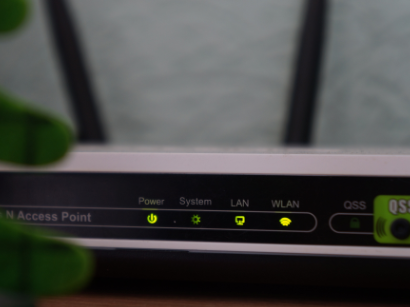

#

  <!-- Left: Intro Banner -->

  

    <h1>Powering Entertainment. Enabling Connectivity.  One Unified Platform.</h1>
    
RDK empowers developers and device makers with open-source tools to deliver high-performance video, broadband, and smart home experiences. Choose your domain to explore tailored docs, APIs, and workflows for rapid development.

  

<!-- Cards Section -->

  <!-- Entertainment Card -->
  

    

      
    

    
    

      

        <h2>ENTERTAINMENT</h2>
        
Build Apps, manage media and UI layers in a video platform.

      

      <a href="entertainment/docs/">
        <button class="explore-button">EXPLORE</button>
      </a>
    

  

  <!-- Connectivity Card -->
  

    

      
    

    
    

      

        <h2>CONNECTIVITY</h2>
        
Framework that enables high-speed internet delivery for service providers.

      

      <a href="connectivity/docs/">
        <button class="explore-button">EXPLORE</button>
      </a>
    

  

