# CcspPsm Documentation

## 1. Overview

- **Purpose in RDK‑B Stack**: CcspPsm (Platform Storage Manager) serves as the centralized persistence and configuration state management service within the RDK‑B middleware stack. It provides reliable storage, retrieval, validation, and lifecycle management of configuration and operational parameters used by other CCSP/RDK‑B components. The component ensures that device configuration and operational parameters survive restarts, firmware upgrades, and controlled recovery scenarios while maintaining data integrity through schema validation and atomic operations.

- **Key Features & Responsibilities**: CcspPsm delivers schema‑driven configuration loading from XML definitions, parameter storage with atomic update semantics, dual‑subsystem architecture (file loader and system registry), state machine governance for lifecycle transitions, HAL integration points for platform abstraction, IPC exposure over both DBus and RBUS protocols, structured exported APIs with clear boundaries, controlled migration support via patch scripting, and comprehensive unit test coverage validating all internal modules. The component mediates the entire lifecycle from initial parsing through steady‑state runtime operations and subsequent mutation or synchronization sequences.

- **Role in Broadband Router Architecture**: Architecturally, CcspPsm occupies the persistence tier immediately beneath higher‑level management agents and above platform storage abstractions (filesystem/flash/NVRAM). It forms a horizontal service consumed by multiple vertical functional domains including telemetry, WAN management, Wi‑Fi configuration, provisioning services, and diagnostics through standardized bus interfaces. Rather than acting as a HAL or business logic orchestrator, it supplies the durable substrate and access discipline that other components depend upon for configuration fidelity and transactional integrity.

## 2. Architecture / Design

### 2.1 High‑Level Design Principles

The architecture manifests principles of modular separation through distinct directories for file loader and system registry subsystems, interface clarity via explicit interface and exported API headers for each subsystem, layered responsibility separating file parsing from runtime registry from service shell functions, explicit state modeling with dedicated states modules controlling lifecycle transitions, portability through schema files detached from core logic, controlled evolution supported by ChangeLog and Version.txt tracking, comprehensive testability with granular unit tests per internal concern, and IPC abstraction providing dual DBus/RBUS support. Schema‑driven operation reduces hard‑coded structural assumptions while atomicity and consistency are enforced through separate operation modules distinct from control and state logic.

### 2.2 Component Boundaries & Responsibilities

**PsmFileLoader Subsystem**: Responsible for ingesting XML schema and persisted data, validating structure and types through parsing logic, orchestrating state transitions via dedicated state machines, coordinating higher‑level control flows, executing concrete file operations including atomic commits, and furnishing consolidated external interfaces through interface and exported API headers.

**PsmSysRegistry Subsystem**: Maintains authoritative in‑memory parameter registry, mediates configuration manager interface functions, implements runtime control logic, provides storage interfacing behind system RAM abstraction, and mirrors the file loader with analogous base, operation, states, interface, and exported API segmentation for consistent architectural patterns.

**Ssp Service Shell**: Acts as the process entry point handling initialization, DBus transport integration, RBUS transport integration, configuration manager coordination, and HAL abstraction bridging. It decouples transport and environmental concerns from core persistence logic while providing unified IPC endpoints.

### 2.3 Threading Model (if applicable)

The codebase exhibits a single‑threaded design pattern with no explicit threading primitives or concurrency layer files present in the repository structure. The component operates as an event‑driven service where the main processing loop handles requests sequentially. State machine transitions in both subsystems are designed for deterministic sequencing rather than concurrent scheduling. External synchronization and reentrancy protection are handled at IPC layer boundaries to prevent concurrent mutation of internal state.

### 2.4 C4 System Context Diagram

```mermaid
graph TD
    subgraph "RDK-B Components"
        Telemetry[📊 Telemetry Service]
        WAN[🌐 WAN Manager]
        WiFi[📡 WiFi Manager]
        TR069[🔧 TR-069 Agent]
    end
    
    User[👤 Management Systems] -->|Configuration Requests| CcspPsm
    Telemetry -->|DBus/RBUS| CcspPsm
    WAN -->|Parameter Get/Set| CcspPsm
    WiFi -->|Configuration Storage| CcspPsm
    TR069 -->|Bulk Parameter Operations| CcspPsm
    
    subgraph "CcspPsm Container"
        ComponentCore[🔧 Platform Storage Manager]
        ComponentCore -.->|"Schema Validation, Atomic Persistence, State Management"| ComponentCore
    end
    
    CcspPsm -->|File I/O| FileSystem[💾 Persistent Storage]
    CcspPsm -->|Platform Calls| HAL[⚙️ Hardware Abstraction Layer]

    classDef user fill:#fff3e0,stroke:#ef6c00,stroke-width:2px;
    classDef component fill:#e1f5fe,stroke:#0277bd,stroke-width:2px;
    classDef external fill:#e8f5e8,stroke:#2e7d32,stroke-width:2px;
    
    class User,Telemetry,WAN,WiFi,TR069 user;
    class CcspPsm,ComponentCore component;
    class FileSystem,HAL external;
```

### 2.5 C4 Container Diagram

### 2.6 Design Explanation & Request Flow

**Initialization Sequence:** Service startup begins in `ssp_main.c`, which initializes selected IPC transports (DBus via `ssp_dbus.c` or RBUS via `ssp_rbus.c`), binds configuration manager interfaces through `ssp_cfmif.c`, and prepares HAL interaction stubs via `psm_hal_apis.c`. During startup, SysRegistry logic coordinates with the FileLoader to parse and load persisted data using `psm_flo_parse.c`. The FileLoader state machine advances through parsing, validation, and ready stages before returning control for runtime operations.

**Runtime Request Flow:** Get/set operations enter through registry interface APIs, invoking operation modules that coordinate atomic changes. When persistence is required, the registry triggers commit sequences through FileLoader operation and control modules. State machines in both subsystems ensure valid transitions and prevent inconsistent states.

**Technology Stack:** C programming language, DBus and RBUS for IPC, XML for schema definition, Linux filesystem for persistence, GNU build system (autotools), Google Test framework for unit testing.

## 3. Internal Modules

| Module/Class | Description | Key Files |
|-------------|------------|-----------|
| **File Loader Base** | Core foundational routines and shared context initialization | `psm_flo_base.c` |
| **File Loader Parse** | XML schema parsing, structural validation, type checking | `psm_flo_parse.c` |
| **File Loader Operation** | Atomic file I/O operations, commit logic, rollback handling | `psm_flo_operation.c` |
| **File Loader Control** | High‑level orchestration of parse/load/save sequences | `psm_flo_control.c` |
| **File Loader States** | State machine transitions and lifecycle management | `psm_flo_states.c` |
| **File Loader Interface** | External API boundary and function dispatching | `psm_flo_interface.c`, `psm_flo_interface.h` |
| **Registry Base** | Foundational registry initialization and context setup | `psm_sysro_base.c` |
| **Registry Operation** | Parameter access, mutation, and validation logic | `psm_sysro_operation.c` |
| **Registry Control** | Registry lifecycle orchestration and coordination | `psm_sysro_control.c` |
| **Registry States** | Registry state machine and transition handling | `psm_sysro_states.c` |
| **Registry Storage** | Persistent storage mediation and staging operations | `psm_sysro_storage.c` |
| **Registry SysRAM Interface** | System RAM abstraction and memory management | `psm_sysro_sysramif.c` |
| **Registry CFM Interface** | Configuration Manager integration adapter | `psm_sysro_cfmif.c` |
| **Ssp Main** | Process entry point and master initialization | `ssp_main.c` |
| **Ssp DBus** | DBus transport endpoint and message marshaling | `ssp_dbus.c` |
| **Ssp RBUS** | RBUS transport endpoint and message handling | `ssp_rbus.c` |
| **Ssp CFM Interface** | Service‑level configuration manager integration | `ssp_cfmif.c` |
| **HAL APIs** | Hardware abstraction layer interface stubs | `psm_hal_apis.c`, `psm_hal_apis.h` |

### 3.1 Module Breakdown Diagram

The module breakdown diagram groups related files into their functional subsystems and illustrates directional dependencies: the Ssp layer depends on the registry and loader to fulfill IPC requests, the registry invokes the loader for persistence operations, and tests exercise all boundaries without being part of the production runtime path. The schema file and patch script act as external inputs influencing initialization and migration flows.

## 4. Interaction with Other Middleware Components

| Component | Purpose of Interaction | Protocols/Mechanisms |
|-----------|-----------------------|----------------------|
| **Telemetry Service** | Stores telemetry configuration parameters and reporting settings | DBus method calls, RBUS property access |
| **WAN Manager** | Persists WAN interface configuration, IP settings, routing parameters | DBus/RBUS parameter get/set operations |
| **WiFi Manager** | Maintains WiFi configuration, security settings, access point parameters | DBus/RBUS bulk parameter operations |
| **TR‑069 Agent** | Handles TR‑181 parameter persistence for remote management operations | DBus/RBUS parameter validation and commit |
| **MoCA Agent** | Stores MoCA interface configuration and network topology data | DBus/RBUS configuration parameter storage |
| **Voice Manager** | Persists VoIP configuration, SIP settings, voice service parameters | DBus/RBUS parameter storage and retrieval |
| **Diagnostic Agent** | Maintains diagnostic test results and configuration | DBus/RBUS data persistence |

### 4.1 Middleware Interaction Diagram

The following diagram illustrates how various RDK‑B functional components interact with CcspPsm through the message bus layer. Management components typically perform bulk operations and configuration commits, while feature components focus on domain‑specific parameter persistence. All interactions flow through the standardized IPC mechanisms to ensure consistent access patterns and transactional integrity.

```mermaid
flowchart TD
    subgraph "Management Layer"
        TR069[TR-069 Agent<br/>Remote Management]
        WebUI[Web Interface<br/>Local Management]
    end
    
    subgraph "Feature Components"
        Telemetry[📊 Telemetry Service]
        WAN[🌐 WAN Manager]
        WiFi[📡 WiFi Manager]
        Voice[📞 Voice Manager]
        MoCA[🔗 MoCA Agent]
        Diag[🔍 Diagnostic Agent]
    end
    
    subgraph "CcspPsm Process"
        PsmCore[🔧 CcspPsm Core<br/>Registry + FileLoader]
    end
    
    TR069 -->|DBus: Bulk Parameter Operations| PsmCore
    WebUI -->|RBUS: Configuration Changes| PsmCore
    Telemetry -->|DBus: Config Persistence| PsmCore
    WAN -->|RBUS: Interface Settings| PsmCore
    WiFi -->|DBus: Security Parameters| PsmCore
    Voice -->|RBUS: VoIP Configuration| PsmCore
    MoCA -->|DBus: Network Topology| PsmCore
    Diag -->|RBUS: Test Results| PsmCore
    
    PsmCore -->|Validated Storage| FileSystem[💾 Persistent Storage]
    
    classDef mgmt fill:#fff3e0,stroke:#ef6c00,stroke-width:2px;
    classDef feature fill:#e1f5fe,stroke:#0277bd,stroke-width:2px;
    classDef core fill:#f3e5f5,stroke:#7b1fa2,stroke-width:2px;
    classDef storage fill:#e8f5e8,stroke:#2e7d32,stroke-width:2px;
    
    class TR069,WebUI mgmt;
    class Telemetry,WAN,WiFi,Voice,MoCA,Diag feature;
    class PsmCore core;
    class FileSystem storage;
```

## 5. Interaction with Other Layers

CcspPsm interfaces upward with CCSP functional agents through standardized DBus and RBUS IPC mechanisms, ensuring all parameter access follows controlled pathways with schema validation and state machine governance. Downward interactions include the platform storage layer (filesystem/NVRAM) for persistent data, the Hardware Abstraction Layer (HAL) for platform‑specific operations through `psm_hal_apis.c`, and system memory management through `psm_sysro_sysramif.c`. The component abstracts lower‑level configuration complexities behind clean API boundaries, reducing duplication across agents while enforcing consistent persistence semantics.

| Layer/Service | Interaction Description | Mechanism |
|---------------|-------------------------|----------|
| **HAL Layer** | Platform‑specific storage hints, environment queries, low‑level access | Function calls via `psm_hal_apis.c` |
| **File System** | Persistent configuration storage, atomic write operations, backup/restore | Standard file I/O with transactional semantics |
| **System Memory** | In‑memory parameter caching, runtime state management | Memory allocation via `psm_sysro_sysramif.c` |
| **Configuration Manager** | Policy enforcement, coordinated configuration workflows | Interface calls via CFM adapters |

### 5.1 Layered Architecture View

The layered architecture diagram illustrates CcspPsm's position within the RDK‑B technology stack, showing how it mediates between application‑level management systems and platform infrastructure. The component serves as a horizontal service that spans multiple abstraction layers while maintaining clear boundaries and responsibilities at each level.

## 6. IPC Mechanism

- **Type of IPC**: Dual transport support with DBus (via `ssp_dbus.c`) and RBUS (via `ssp_rbus.c`) for backward compatibility and migration scenarios. Both transports provide method call semantics for parameter operations.

- **Message Format**: Method calls follow standard DBus/RBUS patterns with parameter name strings, typed values (string, integer, boolean), and operation types (get, set, commit, validate). Response messages include status codes, return values, and error descriptions. Schema validation occurs before persistence operations.

- **Flow**: Synchronous request/response pattern for most operations. Clients invoke methods through the bus, Ssp layer dispatches to registry operations, registry manages in‑memory state and optionally triggers file loader persistence, then status propagates back through the transport layer to the caller.

### 6.1 IPC Flow Diagram

The following sequence diagram illustrates the complete flow for both parameter retrieval and modification operations, showing how requests traverse the IPC layer, internal subsystems, and optional persistence boundaries. Read operations terminate efficiently in the registry without file system access, while write operations extend through the File Loader subsystem only when persistent storage is required.

## 7. TR‑181 Data Models

- **Implemented Parameters**: CcspPsm acts as the persistence engine for TR‑181 parameters rather than defining specific parameter semantics. The schema file `config/bbhm_def_cfg_qemu.xml` establishes the structural framework and default values parsed at initialization.

- **Parameter Registration**: Parameters are registered through the schema definition and accessed via exported APIs (`psm_flo_exported_api.h`, `psm_sysro_exported_api.h`). Other components interact with parameters through DBus/RBUS method calls that map to internal registry operations.

- **Custom Extensions**: Schema evolution and custom parameters are supported by modifying the XML configuration file and applying controlled migrations through `scripts/bbhm_patch.sh` to maintain compatibility with existing stored data.

### 7.1 TR‑181 Parameter Table

| Parameter Category | Schema Source | Access Method | Persistence | Notes |
|-------------------|---------------|---------------|-------------|-------|
| **Device Configuration** | `bbhm_def_cfg_qemu.xml` | Registry API | File‑based | Schema‑validated |
| **Network Interface Settings** | Schema‑defined | DBus/RBUS | Atomic commits | State machine protected |
| **Service Parameters** | XML configuration | Internal API | Transactional | Migration supported |
| **Custom Extensions** | Schema extensions | Standard API | Schema‑governed | Patch script enabled |

*Note: Specific parameter names and values are defined in the XML schema file rather than hard‑coded in the component logic, enabling flexible platform adaptation and controlled evolution through external configuration management.*

## 8. Implementation Details

- **Key Algorithms or Logic**: Dual state machine architecture governs both FileLoader and SysRegistry subsystems with explicit state transitions enforced through dedicated states modules. Schema parsing employs XML validation with type checking and structural verification. Atomic persistence operations use staging and commit semantics to ensure transactional integrity. In‑memory parameter caching optimizes read operations while lazy persistence minimizes unnecessary file I/O.

- **Error Handling Strategy**: Hierarchical error propagation through well‑defined return codes from operation modules up through interface layers to IPC transport. Parse errors are isolated early in the FileLoader, while registry operation failures are contained within state machine boundaries. State transition validation prevents inconsistent partial updates. Comprehensive error logging aids in diagnostic troubleshooting.

- **Logging & Debugging**: Structured logging integrated throughout all modules with configurable verbosity levels. Each subsystem provides detailed trace information for state transitions, parameter operations, and persistence activities. Unit tests validate both success and failure paths for all major functional modules. Mock frameworks enable isolated testing of individual components.

## 9. Key Configuration Files

| Configuration File | Purpose | Key Parameters | Default Values | Override Mechanisms |
|--------------------|---------|---------------|----------------|--------------------|
| `config/bbhm_def_cfg_qemu.xml` | Primary schema definition for QEMU target | Parameter structure, types, defaults | Schema‑specified | Replace file or apply patch script |
| `scripts/bbhm_patch.sh` | Migration and upgrade script | Schema transformations | N/A | Execute during upgrade window |

*Configuration files are minimal by design—the XML schema serves as the single source of truth for parameter definitions and structure.*

### 9.1 Configuration File Details

**Schema Configuration (bbhm_def_cfg_qemu.xml)**: This XML file serves as the foundational configuration artifact that defines the complete parameter topology, type constraints, validation rules, and default values used during system initialization. The File Loader subsystem parses this schema during startup to construct the internal parameter representation that the System Registry maintains throughout the service lifecycle. Schema modifications enable platform‑specific customization, parameter addition or removal, and default value adjustments without requiring code changes, supporting flexible deployment across different hardware platforms and configuration requirements.

**Migration Script (bbhm_patch.sh)**: The patch script provides controlled schema evolution capabilities by enabling transformation of existing stored parameter data to remain compatible with updated parsing logic and structural expectations. This mechanism is essential during firmware upgrades or configuration migrations where the parameter schema has evolved but existing stored data must be preserved and adapted. The script operates during maintenance windows prior to service restart, ensuring that schema mismatches are resolved before the parsing logic encounters incompatible data structures.

*Configuration files are minimal by design—the XML schema serves as the single source of truth for parameter definitions and structure, while the migration script provides the controlled evolution pathway necessary for long‑term maintainability and platform adaptation.*

## 10. API Endpoints (if applicable)

CcspPsm exposes its functionality through IPC methods rather than REST endpoints. Key operations include:

| Operation | DBus/RBUS Method | Description | Parameters | Returns |
|-----------|-----------------|-------------|------------|---------|
| **GetParameter** | `GetParameterValue` | Retrieve parameter value from in‑memory registry | Parameter name (string) | Value and type information |
| **SetParameter** | `SetParameterValue` | Update parameter value with validation | Name (string), Value (typed) | Status code and error details |
| **CommitParameters** | `CommitChanges` | Persist pending changes to storage | None | Success/failure status |
| **ValidateParameter** | `ValidateParameter` | Check parameter against schema constraints | Name (string), Value (typed) | Validation result and errors |
| **GetParameterNames** | `GetParameterNames` | Enumerate available parameter names | Filter pattern (optional) | Parameter name list |
| **BulkSet** | `SetMultipleParameters` | Atomic multi‑parameter update | Parameter array | Aggregate status |
| **ResetToDefaults** | `ResetParameters` | Restore default values | Parameter list (optional) | Reset status |

## 11. Deployment & Runtime Environment

CcspPsm operates as a native Linux process within the RDK‑B middleware ecosystem, designed for deployment on broadband gateway hardware with persistent storage capabilities. The component integrates seamlessly with systemd‑based service management, providing controlled startup sequencing, dependency resolution, and graceful shutdown handling. Resource requirements are optimized for embedded environments while maintaining sufficient performance for high‑frequency parameter operations and bulk configuration management scenarios typical in broadband router deployments.

- **Container Runtime**: Native Linux process within RDK‑B middleware stack, managed by systemd
- **Orchestration**: Systemd service management with explicit dependency ordering and restart policies
- **Resource Requirements**: 
  - Memory: ~2‑4MB for in‑memory parameter registry (varies with schema size)
  - CPU: Minimal baseline with brief spikes during schema parsing and file I/O operations
  - Storage: Persistent configuration files, typically <1MB depending on parameter scope
- **Supported Platforms**: RDK‑B compatible hardware with persistent storage capability (eMMC, flash, etc.)
- **Startup Parameters**: 
  - Schema file path configuration
  - HAL interface selection and configuration
  - IPC transport selection (DBus/RBUS or both)
  - Logging verbosity and output destination
- **Network Dependencies**: None (local IPC only)
- **Security Context**: Runs with appropriate privileges for filesystem access and IPC registration

