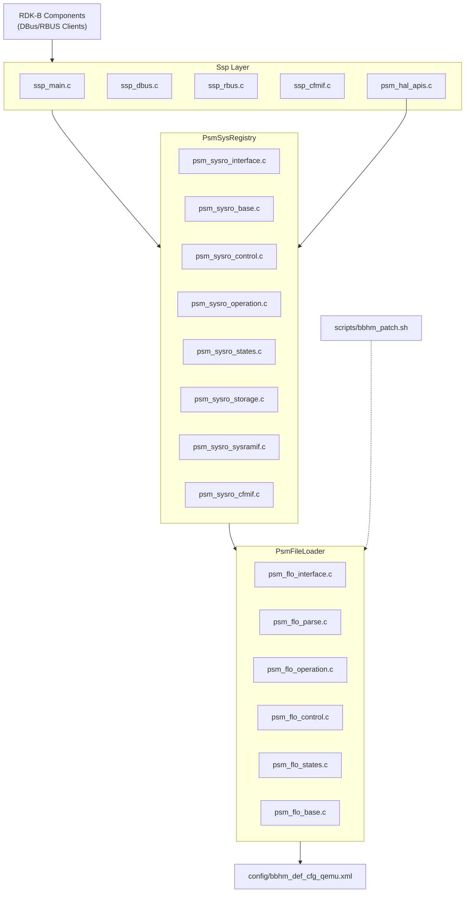
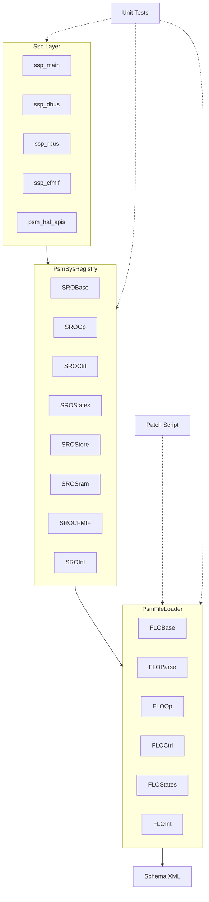
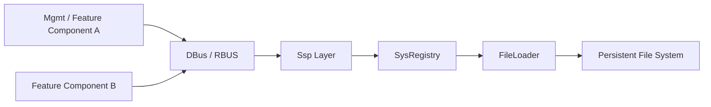
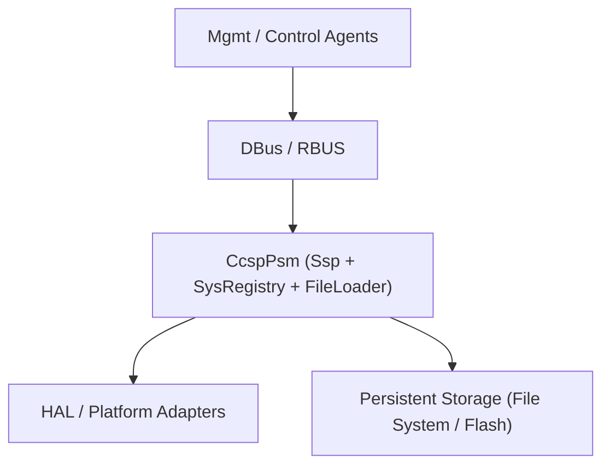
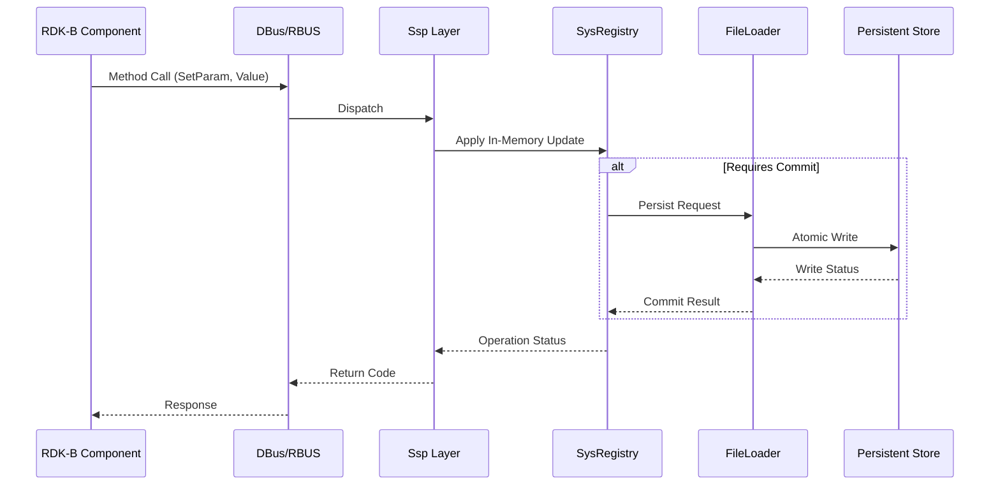

# CcspPsm

## 1. Overview

CcspPsm (Platform Storage Manager) is a core persistence and configuration state service in the RDK‑B middleware stack. Its responsibility, as evidenced by the repository contents, is to provide reliable storage, retrieval, validation, and life‑cycle management of configuration and operational parameters used by other CCSP/RDK‑B components. It achieves this through two tightly integrated subsystems: a file‑oriented loader (PsmFileLoader) that parses, validates, serializes, and atomically writes persistent state, and a system registry layer (PsmSysRegistry) that maintains an in‑memory representation, mediates access, enforces state machine transitions, and coordinates storage updates. Surrounding these subsystems is a service shell (Ssp) that exposes inter‑process interfaces over DBus and RBUS, integrates with platform/HAL abstractions, and orchestrates initialization and shutdown workflows. A configuration schema (bbhm_def_cfg_qemu.xml) establishes structural and default value definitions, while patch tooling (bbhm_patch.sh) supports controlled upgrade or migration. Comprehensive unit tests spanning almost every internal module underscore a design emphasis on correctness, modularity, and maintainability.

### Purpose in the RDK‑B Stack

CcspPsm exists to ensure that device configuration and selected operational parameters survive restarts, firmware upgrades, and controlled recovery scenarios. Other RDK‑B managers rely on it to read or commit TR‑181 aligned property values via standardized IPC pathways instead of implementing bespoke persistence logic. This removes duplication, enforces schema validation consistently, and centralizes transactional safeguards. It thereby underpins reliability, determinism of boot behavior, and integrity of device management operations across the platform.

### Key Features and Responsibilities

CcspPsm provides schema‑driven configuration loading, parameter storage with atomic update semantics, state machine governance for both the file loader and registry subsystems, HAL integration points, IPC exposure over DBus and RBUS, structured exported APIs (clearly demarcated in interface and exported header pairs), controlled migration via patch scripting, and extensive test coverage validating base, control, operation, parse, state transition, storage, and system RAM interface behaviors. It mediates the lifecycle from initial parsing through steady‑state runtime and subsequent mutation or synchronization operations. Error categorization, status propagation, and robustness are implied by discrete modules for base, control, operation, parse, storage, and states in both major subsystems.

### Role in Broadband Router Architecture

Architecturally CcspPsm occupies the persistence tier immediately beneath higher‑level management agents and above platform storage (filesystem / flash / NVRAM abstractions). It forms a horizontal service consumed by multiple vertical functional domains (telemetry, WAN, Wi‑Fi, provisioning, diagnostics) through bus interfaces. It acts neither as a HAL nor a business logic orchestrator; instead it supplies the durable substrate and access discipline other components depend upon for configuration fidelity.

---

## 2. Architecture / Design

### 2.1 High‑Level Design Principles

The code organization manifests principles of modular separation (distinct directories for file loader and system registry), interface clarity (each subsystem has both interface and exported API headers), layered responsibility (file parsing vs runtime registry vs service shell), explicit state modeling (dedicated states.c modules), portability (schema file detached from logic), controlled evolution (ChangeLog, Version.txt), testability (granular unit tests per internal concern), and IPC abstraction (dual DBus/RBUS support). Schema‑driven operation reduces hard‑coded structural assumptions. Atomicity and consistency are implied by operation modules separate from control/state logic, suggesting purposeful sequencing and commit semantics. Encapsulation of HAL calls (psm_hal_apis.[ch]) prevents leakage of platform specifics into core logic.

### 2.2 Component Boundaries & Responsibilities

- PsmFileLoader: Responsible for ingesting XML schema and/or persisted data, validating structure and types (parse), orchestrating state transitions (states), coordinating higher‑level control flows (control), executing concrete file operations including commits and atomic write patterns (operation), and furnishing a consolidated external interface (interface / exported_api headers). Global and internal headers centralize shared constants and internal function contracts.
- PsmSysRegistry: Maintains in‑memory parameter registry, mediates configuration manager interface functions (cfmif), implements runtime control logic (control), provides storage interfacing (storage) behind a system RAM abstraction (sysramif), and parallels the file loader with analogous base, operation, states, interface, and exported API segmentation.
- Ssp Layer: Acts as the service shell handling process entry (ssp_main.c), DBus transport (ssp_dbus.c), RBUS transport (ssp_rbus.c), configuration manager integration (ssp_cfmif.c), and HAL bridging (psm_hal_apis.c). It decouples transport and environment from persistence logic.
- Include Headers: Provide stable API boundaries (psm_flo_exported_api.h, psm_sysro_exported_api.h), internal extensibility points (internal_api headers), property definitions (psm_properties.h), type metadata (psm_co_type.h), naming and OID indexing (psm_co_name.h, psm_co_oid.h), and HAL/CFM interfaces (psm_hal_apis.h, psm_ifo_cfm.h).
- Scripts: bbhm_patch.sh enables orchestrated patching or migration, ensuring compatibility when schema or structural changes occur.
- Tests: Mirror each functional concern, enabling focused verification and regression detection across base/control/operation/parse/states/storage/integration layers for both subsystems.

### 2.3 Threading Model

No explicit threading primitives or concurrency layer files are present. The design appears single‑threaded per process for core state transitions, relying on the bus layer to serialize inbound operations or external synchronization to prevent concurrent mutation. The presence of separate operation and control modules suggests deterministic sequencing rather than concurrent scheduling. Absent concurrency artifacts the system should be documented as a single‑threaded service core with potential external reentrancy mitigation handled at IPC layer boundaries.

### 2.4 Component Architecture Diagram

The following diagram summarizes subsystem relationships based solely on source directory structure and interface layering. It illustrates how IPC endpoints route into the service shell, which coordinates both the file loader and system registry, with the registry interacting with storage through loader orchestration.

*In this representation the Ssp layer brokers incoming bus calls, dispatching to registry operations for runtime get/set semantics. Persistent commits or recovery sequences invoke PsmFileLoader parsing and write logic. State machines in both subsystems constrain lifecycle transitions. A patch script and schema file act as static or operational inputs, while HAL integration provides platform hooks.*

### 2.5 Design Explanation & Lifecycle Flow

Initialization begins in ssp_main.c, which selects and initializes IPC transports (ssp_dbus.c or ssp_rbus.c), binds configuration manager interfaces (ssp_cfmif.c), and prepares HAL interaction stubs (psm_hal_apis.c). During startup SysRegistry logic (psm_sysro_base/control/states) initializes in‑memory structures and may request the FileLoader to parse and load persisted data (psm_flo_parse.c). The FileLoader state machine advances through parsing, validation, and ready stages before handing control back. Runtime get/set operations enter through registry interface APIs (psm_sysro_interface.c / exported headers) invoking operation modules which coordinate atomic changes and, when necessary, trigger commit sequences through FileLoader operation/control modules. Shutdown or migration triggers controlled state transitions culminating in final synchronization to persistent storage.

## 3. Internal Modules

| Subsystem / Module | Role (Derived from Naming & Placement) | Key Files |
|--------------------|-----------------------------------------|-----------|
| File Loader Base | Core foundational routines and shared context for file loader | psm_flo_base.c |
| File Loader Parse | Schema and data parsing, structural and type validation | psm_flo_parse.c |
| File Loader Operation | Concrete file I/O, atomic write/commit actions | psm_flo_operation.c |
| File Loader Control | High-level orchestration, sequencing parse/load/save phases | psm_flo_control.c |
| File Loader States | State machine definitions & transition handling | psm_flo_states.c |
| File Loader Interface | External callable boundary, API indirection layer | psm_flo_interface.c / psm_flo_interface.h |
| File Loader Exported API | Public header surface for consumers | psm_flo_exported_api.h |
| Sys Registry Base | Foundational registry context and initialization routines | psm_sysro_base.c |
| Sys Registry Operation | Parameter access/mutation logic | psm_sysro_operation.c |
| Sys Registry Control | Lifecycle orchestration for registry | psm_sysro_control.c |
| Sys Registry States | Registry state machine transitions | psm_sysro_states.c |
| Sys Registry Storage | Persistent storage mediation / staging | psm_sysro_storage.c |
| Sys Registry SysRAM IF | System RAM interface abstraction | psm_sysro_sysramif.c |
| Sys Registry CFM IF | Configuration Manager interface adapter | psm_sysro_cfmif.c |
| Sys Registry Interface | Public callable registry surface | psm_sysro_interface.c / psm_sysro_interface.h |
| Sys Registry Exported API | Exported API header for registry users | psm_sysro_exported_api.h |
| HAL APIs | Platform hook stubs or abstractions | psm_hal_apis.c / psm_hal_apis.h |
| Ssp Main | Process entry / master initialization | ssp_main.c |
| Ssp DBus Transport | DBus endpoint & marshaling | ssp_dbus.c |
| Ssp RBUS Transport | RBUS endpoint & marshaling | ssp_rbus.c |
| Ssp CFM Interface | Service-level CFM integration glue | ssp_cfmif.c |
| Properties & Metadata | Type, name, OID, property constants | psm_co_type.h, psm_co_name.h, psm_co_oid.h, psm_properties.h |
| CFM Interface Header | Configuration manager interface contract | psm_ifo_cfm.h |
| Patch Script | Upgrade/migration patch logic | scripts/bbhm_patch.sh |
| Schema | Configuration definition & defaults | config/bbhm_def_cfg_qemu.xml |
| Tests (File Loader) | Unit tests per functional slice | psm_flo_*_test.cpp |
| Tests (Sys Registry) | Registry functional verification | psm_sysro_*_test.cpp |
| Tests (Integration) | Combined or exported API tests | CcspPsmTest.cpp |

### 3.1 Module Breakdown Diagram

The breakdown diagram clusters modules by subsystem while showing directional dependencies—registry depends on loader for persistence, Ssp depends on both subsystems, tests reference all layers.

## 4. Interaction with Other Middleware Components

CcspPsm interacts indirectly with the broader RDK‑B ecosystem through its DBus and RBUS interfaces (ssp_dbus.c and ssp_rbus.c). Other CCSP agents issue configuration get/set operations or commit/refresh style calls that traverse the Ssp layer into SysRegistry logical operations. There is also an integration path with a configuration manager (CFM) via ssp_cfmif.c and psm_sysro_cfmif.c enabling coordinated or policy‑driven configuration flows. HAL interaction is abstracted and localized, preventing leakage of platform specifics into higher layers. The design centralizes persistence so that upstream components rely on a canonical store rather than bespoke file usage, promoting consistency and reducing defect surfaces.

### 4.1 Middleware Interaction Flow Diagram

The diagram shows other RDK‑B components invoking bus calls resolved by Ssp into registry queries or updates which optionally trigger loader persistence.

## 5. Interaction with Other Layers

CcspPsm sits above the platform’s persistent storage medium (filesystem/NVRAM) and below logical management agents. The HAL APIs file (psm_hal_apis.c/.h) suggests optional access to platform functionality (timers, low-level storage hints, or environmental data) abstracted away from core persistence logic. The patch script and schema tie deployment and upgrade activities to controlled transitions without exposing internal structural details to dependent components. Abstraction is enforced by clear interface/exported header pairs that segregate public contracts from internal state machine or operation routines.

### 5.1 Layered Architecture View

This layered view places PSM within the vertical stack from HAL and storage upward to management and orchestration agents.

## 6. IPC Mechanism

Two IPC transports are explicitly supported: DBus (ssp_dbus.c) and RBUS (ssp_rbus.c). The Ssp layer encapsulates connection initialization, registration, method dispatch, and response handling. Message formats themselves are not enumerated in the source listing provided, but given standard RDK‑B patterns these would map to method calls corresponding to exported APIs (psm_flo_exported_api.h and psm_sysro_exported_api.h). The flow of a request (e.g., a parameter set) begins with a bus method invocation, is marshaled by Ssp transport code into internal API calls on SysRegistry, which may modify in‑memory state and optionally invoke FileLoader commit logic. Completion returns a status code communicated back across the chosen bus transport. RBUS and DBus parity ensures migration or dual operation scenarios can be supported without altering core persistence routines.

### 6.1 IPC Flow Sequence

The diagram follows a single set operation from client invocation through commit and response.

## 7. TR‑181 Data Models

While CcspPsm underpins persistence of TR‑181 aligned parameters, the repository snapshot includes only a single schema file (bbhm_def_cfg_qemu.xml) without enumerated TR‑181 object names in view here. Thus parameter specifics cannot be listed without inspecting the XML contents. Registration mechanics are inferred: external components register or request parameter operations over bus interfaces; SysRegistry mediates logical representation; FileLoader ensures durable reflection of validated schema‑compliant state. No custom TR‑181 extension objects are directly derivable from the file listing alone; the design instead supplies the foundational persistence service consumed by those that define and own specific TR‑181 parameters elsewhere. Any parameter mapping or customization would be governed by schema content plus exported APIs rather than hard‑coded logic in public headers.

## 8. Implementation Details

### 8.1 Core Logic and State Machines

The duplicated pattern of base/control/operation/parse/states modules in both PsmFileLoader and PsmSysRegistry reveals a state machine centric architecture. The states modules encapsulate permissible transitions (e.g., uninitialized → parsing → validated → ready → committing → idle). Control modules orchestrate transitions by invoking operation modules to perform discrete atomic actions (e.g., read file, validate structure, write commit, update registry). Parsing is isolated to reduce coupling between format concerns and operational sequencing. Interface modules unify the externally callable surface while exported headers publish stable symbols to clients. Storage separation (psm_sysro_storage.c) signals a staging model: in‑memory mutation followed by explicit persistence trigger rather than implicit write‑through, enabling batching or atomic multi‑parameter updates.

### 8.2 Error Handling Strategy
Error isolation is implied by segmentation: parse routines can fail early feeding control logic with failure statuses, operation modules produce granular return codes that propagate upward through interface layers, and state modules enforce legal transitions preventing inconsistent half‑applied states. Tests exist for each major functional piece (parse, operation, control, states) verifying branch behaviors and ensuring regression detection for failure pathways. The likely model is hierarchical return codes with distinct enumerations for parse errors, I/O failures, invalid transitions, and storage anomalies—supported by modular decomposition.

### 8.3 Logging and Debugging Hooks
Although logging implementations are not explicitly visible in file names, typical RDK‑B conventions integrate logging macros inside each functional module. The granularity of unit tests allows targeted validation of both success and failure cases, often accompanied by logging assertions in extended form. The separation of HAL, CFM, and bus layers aids diagnostic scoping: transport vs registry vs loader issues become traceable to their respective modules.

### 8.4 Upgrade / Migration Support
bbhm_patch.sh indicates controlled schema or structural evolution via scripted transformations, avoiding ad hoc manual edits. Running patches external to core runtime ensures minimal disruption and preserves integrity by preparing data before the service attempts to parse it under new rules.

## 9. Key Configuration Files

| File | Purpose | Functional Scope | Override Mechanism |
|------|---------|------------------|--------------------|
| config/bbhm_def_cfg_qemu.xml | Defines schema, structure, and default values for persisted parameters (QEMU target context). | Establishes baseline parameter topology and defaults used at initialization. | Replace or extend schema per platform build; adjust with migration script before service restart. |

### 9.1 Patch and Migration Assets

The patch script enables forward schema evolution by transforming or normalizing existing stored data so it remains compatible with updated parsing and validation logic, reducing startup failure risk during upgrades.

| Script | Role | Application Phase |
|--------|------|-------------------|
| scripts/bbhm_patch.sh | Applies schema or data format adjustments during upgrade/migration to keep persisted store compatible with current parsing logic. | Pre‑startup (upgrade) or maintenance window prior to service relaunch. |