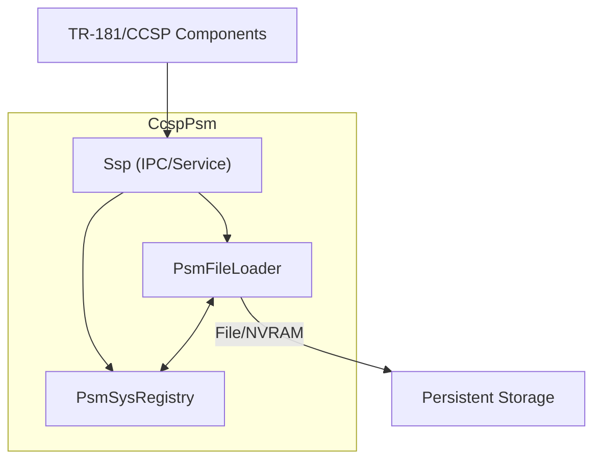
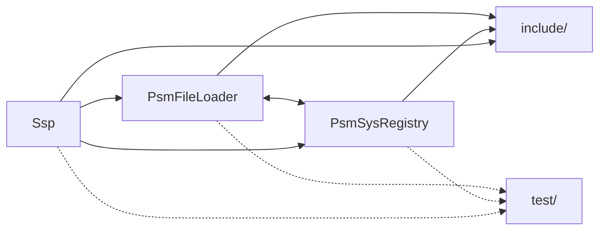
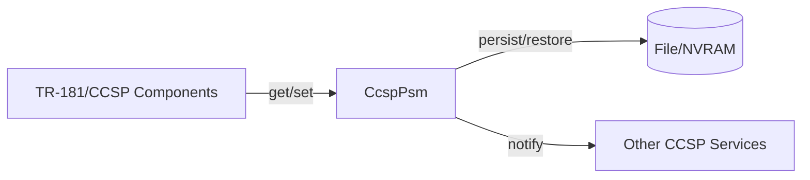
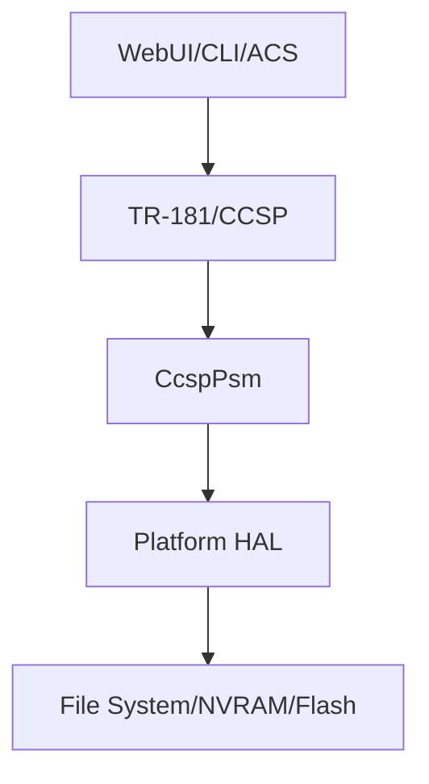
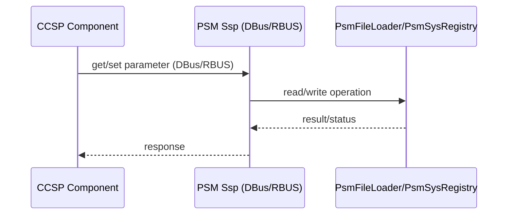
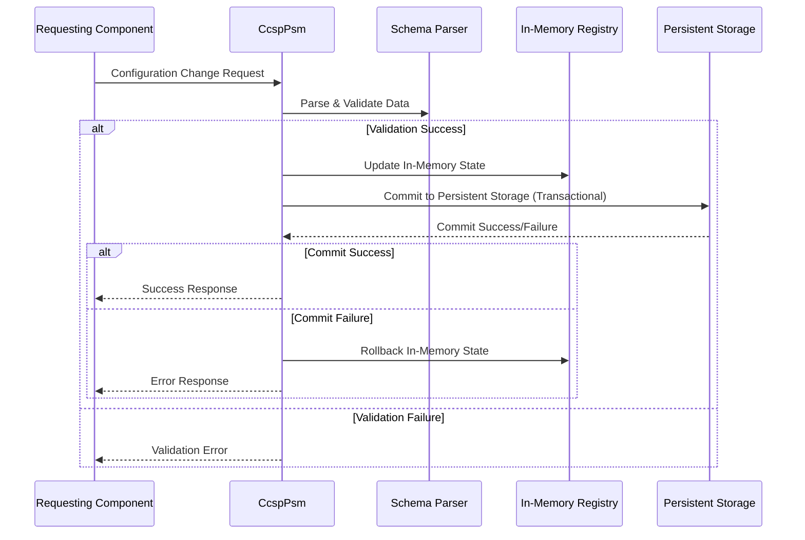

# CcspPsm
 
CcspPsm (Platform Storage Manager) is a core component of the RDK-B broadband router middleware stack. Its primary role is to provide persistent storage and retrieval of configuration parameters and operational data for other RDK-B components, using a structured, schema-driven approach.

**Key Features and Responsibilities:**

- Persistent storage for TR-181 and platform-specific parameters.
- Transactional read/write API for configuration data.
- Schema-driven validation and organization of stored data.
- Supports backup, restore, and migration of configuration.
- Exposes APIs for other components to access and modify persistent data.

!!! Note 
    CcspPsm sits between the management/data model layers (e.g., TR-181, CCSP components) and the underlying storage (file system, NVRAM, etc.), abstracting platform-specific details and providing a unified persistent store.

---

## Design

### High-level Design Principles

CcspPsm is architected around several core principles. First, it maintains a clear separation between schema and logic (such as TR-181 and CCSP data models) and the underlying storage mechanics. This separation allows the storage backend to evolve independently of the data model, supporting new hardware or storage technologies with minimal disruption. All configuration operations are transactional and atomic, ensuring that partial writes or failures do not leave the system in an inconsistent state. The design is also highly extensible, allowing new data models or storage backends to be integrated by updating schema files or extending the storage logic.

### Component Boundaries and Responsibility

| Block            | Main Source Files/Dirs                                 | Responsibilities                                                                 |
|------------------|-------------------------------------------------------|----------------------------------------------------------------------------------|
| PsmFileLoader    | `source/PsmFileLoader/`                                | File-based storage, schema parsing, backup/restore, migration logic              |
| PsmSysRegistry   | `source/PsmSysRegistry/`                               | In-memory registry, runtime state, system registry operations                    |
| Ssp (IPC/Service)| `source/Ssp/`                                         | IPC (DBus/RBUS), main loop, external API exposure, service initialization        |
| Include          | `source/include/`                                      | Public/internal headers, API definitions, schema/property constants              |

### Threading Model  

The threading model of CcspPsm is designed for safety and simplicity. All file and storage operations are performed in a single-threaded manner, as implemented in `psm_flo_operation.c`, to avoid race conditions and ensure data integrity. The IPC and service loop, managed in `Ssp/ssp_main.c`, may utilize threads for handling DBus or RBUS events, but all persistent operations are serialized to maintain consistency. This approach balances responsiveness to external requests with the need for reliable storage operations.

### Initialization and Main Loop 

Initialization of the CcspPsm service begins in `Ssp/ssp_main.c`. Here, the component sets up IPC mechanisms, loads the necessary schemas, and starts the main service loop. The file loader and system registry are initialized through exported APIs defined in `psm_flo_exported_api.h` and `psm_sysro_exported_api.h`. This ensures that all subsystems are ready to handle requests and that the component can immediately begin servicing other RDK-B modules.

### Extensibility 

CcspPsm is built to accommodate future requirements. To add new schemas or parameters, developers can update the XML files in the `config/` directory and adjust property constants in `include/psm_properties.h`. Supporting new storage backends or advanced migration logic can be achieved by extending the code in the `PsmFileLoader` module. This modularity ensures that CcspPsm remains adaptable as the RDK-B platform evolves.

### Component Architecture

The following diagram illustrates the high-level architecture of CcspPsm, showing how the main modules interact with each other and with external components. The flow of configuration data and control is depicted, emphasizing the separation of concerns and the central role of the service and storage modules.

*In this diagram, the TR-181/CCSP components interact with the Ssp IPC/service module, which in turn coordinates with the PsmFileLoader for persistent storage operations and with the PsmSysRegistry for in-memory state management. The PsmFileLoader is responsible for all interactions with the underlying file or NVRAM storage, ensuring that data is safely persisted and retrieved. The bidirectional arrow between PsmFileLoader and PsmSysRegistry highlights the close coordination required to maintain consistency between in-memory and on-disk state.*

---

## Internal Modules

| Module/Dir         | Description                                                                 |
|--------------------|-----------------------------------------------------------------------------|
| PsmFileLoader/     | Handles file-based storage, schema parsing, transactional operations, backup/restore, and migration logic
| PsmSysRegistry/    |  Manages in-memory registry, runtime state, persistent storage logic, and system registry operations.
| Ssp/               | Implements IPC (DBus/RBUS), service entry and main loop, and exposes external APIs.|
| include/           |  Contains public/internal headers, API definitions, and schema/property constants|
| test/              | Unit tests for all major modules, using Google Test framework.|

### Module Breakdown

---

## Interaction with Other Middleware Components

CcspPsm plays a central role in the RDK-B middleware ecosystem by providing persistent storage services to other components. The primary mode of interaction is through inter-process communication (IPC), which is implemented using DBus and RBUS protocols. 

- **TR-181/CCSP Components:**  

  - Communicate with CcspPsm to get/set persistent parameters.
  - IPC is handled via DBus (`ssp_dbus.c`) or RBUS (`ssp_rbus.c`).
  - Main interaction is parameter storage and retrieval, as well as backup/restore and migration support.

- **Other CCSP Services:**  

  - Receive notifications or synchronize configuration as needed.

**Purpose of Interactions:**

- Provide persistent storage for configuration/state.
- Support parameter registration and schema enforcement.
- Enable backup/restore and migration for upgrades.

### Middleware Interaction Flow

This middleware interaction flow diagram demonstrates the centrality of CcspPsm in managing persistent configuration data. It highlights the bidirectional communication between CcspPsm and other components, as well as the critical role of persistent storage in maintaining system state.

---

## Interaction with Other Layers

Interaction with Other Layers
CcspPsm abstracts the complexities of platform-specific storage, allowing upper layers to interact with a unified API regardless of the underlying hardware or storage technology. The PsmFileLoader and PsmSysRegistry modules encapsulate all platform-specific logic, ensuring that configuration data is stored and retrieved in a manner appropriate to the device's capabilities. This abstraction enables the RDK-B stack to be portable across different hardware platforms, as changes to storage mechanisms can be confined to these modules without affecting higher-level logic. In some cases, CcspPsm may also interact with external services such as backup/restore daemons or platform migration tools, further enhancing its flexibility and robustness.

The layered architecture view below illustrates how CcspPsm fits into the overall system, mediating between user interfaces, management layers, and the underlying hardware.

This diagram shows the vertical integration of CcspPsm within the RDK-B stack. User interfaces and management clients interact with TR-181/CCSP components, which in turn rely on CcspPsm for persistent storage. CcspPsm abstracts the platform HAL and file system or NVRAM, ensuring that configuration data is managed consistently across diverse hardware.

**Diagram: Layered Architecture View**

---

## IPC Mechanism

Inter-process communication (IPC) is a fundamental aspect of CcspPsm’s integration within the RDK-B stack. The component supports both DBus and RBUS protocols, as implemented in `source/Ssp/ssp_dbus.c` and `source/Ssp/ssp_rbus.c`. These IPC mechanisms enable external components—such as TR-181/CCSP modules—to issue requests for parameter retrieval, configuration changes, backup, restore, and migration operations.

When a request is received via DBus or RBUS, the Ssp module acts as the gateway, dispatching the request to the appropriate handler in either the PsmFileLoader or PsmSysRegistry module, depending on the nature of the operation. The handler processes the request, performs any necessary validation or transactional operations, and returns the result or status back through the Ssp module to the requesting component. This ensures synchronous, reliable communication and maintains the integrity of persistent configuration data.

The exported APIs for these operations are defined in `include/psm_flo_exported_api.h` and `include/psm_sysro_exported_api.h`, providing a consistent and well-documented interface for all IPC interactions.

The following sequence diagram illustrates the typical flow of an IPC request, from the initial call by a CCSP component to the final response after processing by CcspPsm. The diagram emphasizes the roles of the Ssp module as the IPC gateway and the storage/registry modules as the executors of persistent operations.

### IPC Flow Diagram

---

## TR-181 Data Models

CcspPsm is responsible for storing all TR-181 parameters registered by CCSP components. These parameters define the configuration and operational state of the device, and their persistence is critical for reliable operation. The component supports custom extensions through schema files located in the config/ directory, such as bbhm_def_cfg_qemu.xml. Parameters are registered at startup by the relevant CCSP components and are accessed via IPC (DBus or RBUS) or direct API calls. This approach ensures that the data model remains flexible and extensible, accommodating new features and requirements as the platform evolves.

---

## Implementation Details

The implementation of CcspPsm is grounded in robust, modular code that ensures data integrity, transactional safety, and extensibility. Schema-driven parsing and validation are handled in `PsmFileLoader/psm_flo_parse.c`, where configuration data is checked against defined XML schemas before being accepted into persistent storage. Transactional file operations are implemented in `PsmFileLoader/psm_flo_operation.c`, guaranteeing that configuration changes are atomic and that the system can recover gracefully from failures or interruptions. The in-memory registry, managed by `PsmSysRegistry/psm_sysro_base.c`, provides rapid access to configuration data during runtime, while backup, restore, and migration logic in `PsmFileLoader/psm_flo_control.c` supports advanced operational scenarios such as upgrades and disaster recovery.

Error handling is consistent and comprehensive across all modules. Each operation returns clear status codes, and failures are logged with sufficient detail to facilitate troubleshooting. Logging macros are used throughout the codebase, ensuring that all critical operations and errors are recorded for later analysis. The `test` directory contains a suite of unit tests for all major modules, leveraging the Google Test framework to verify correctness and reliability of the implementation.

For a more visual representation, the following table summarizes the core implementation areas, their responsibilities, and the corresponding source files:

| Area                        | Responsibility                                      | Key Source Files                                 |
|-----------------------------|----------------------------------------------------|--------------------------------------------------|
| Schema Parsing & Validation | Ensures data conforms to expected structure        | PsmFileLoader/psm_flo_parse.c                    |
| Transactional File Ops      | Atomic, reliable storage of configuration changes  | PsmFileLoader/psm_flo_operation.c                |
| In-Memory Registry          | Fast runtime access to configuration data          | PsmSysRegistry/psm_sysro_base.c                  |
| Backup/Restore/Migration    | Supports upgrades and disaster recovery            | PsmFileLoader/psm_flo_control.c                  |
| Error Handling & Logging    | Consistent status codes and detailed logging       | All modules (logging macros), see test/ for tests|

Alternatively, you could represent the implementation flow as a sequence diagram, showing how a configuration change is processed from validation through to persistence and error handling. However, such a diagram is only meaningful if the source code reveals a clear, linear flow (e.g., in the main apply or commit logic). If desired, this can be added as:

*When a configuration change is requested, the system first parses and validates the data against the schema. If validation succeeds, the change is applied to the in-memory registry and then written to persistent storage using transactional file operations. If any step fails, an error is logged and the operation is rolled back to maintain consistency.*

---

## Key Configuration Files

The configuration and operation of CcspPsm rely on several important files, each serving a distinct role in the system. These files define the schema for persistent parameters, provide constants for validation and default values, and support migration or upgrade processes.

| File/Dir                      | Purpose                                         | Description                                                                                 | Key Parameters/Notes                |
|-------------------------------|-------------------------------------------------|---------------------------------------------------------------------------------------------|-------------------------------------|
| config/bbhm_def_cfg_qemu.xml  | Example schema/config for QEMU platform         | Defines the structure and default values for persistent parameters on QEMU-based systems     | Defines parameter structure         |
| include/psm_properties.h      | Schema/property constants                       | Contains constants used for schema validation and default value assignment                  | Used for validation and defaults    |
| scripts/bbhm_patch.sh         | Patch/upgrade script                            | Shell script used to apply patches or perform upgrades on the persistent configuration data | Used during migration/upgrade       |
---
