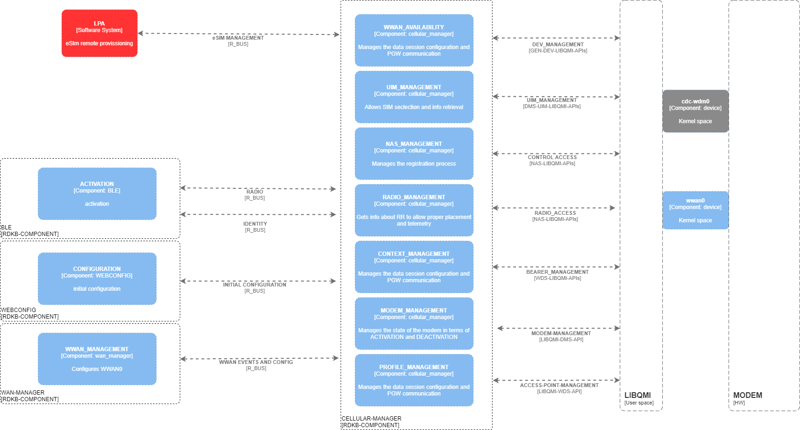
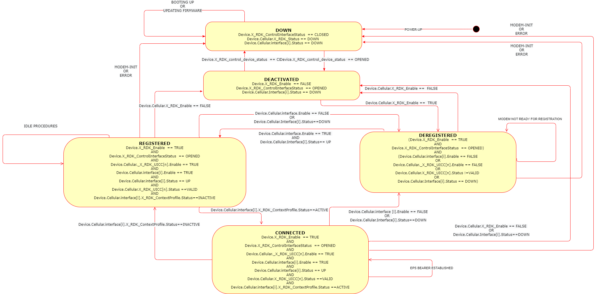
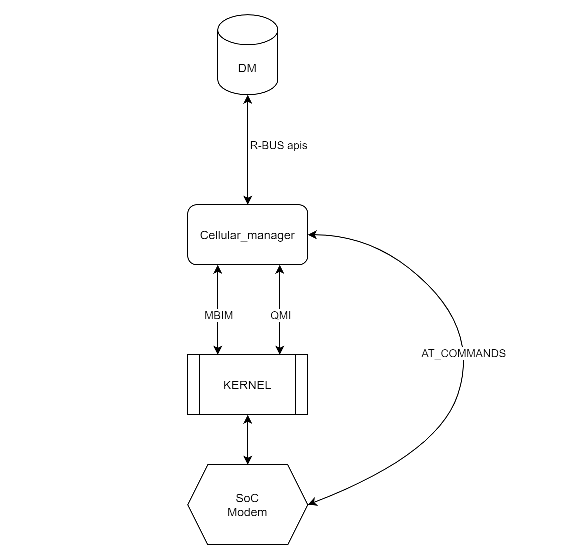

# Cellular Manager

The Cellular Manager component is designed to manage cellular modems in devices such as gateways and extenders by facilitating internet access through cellular networks using default EPS bearers (NON-GBR, EPS-only registration) for IPv4 and IPv6. It delivers telemetry on radio resources (RR), mobility management (MM), and session management (SM), and excludes VoLTE for voice in FA+FWA profiles. The component's  functionalities include managing modem power configuration, exposing radio resource and mobility management information, handling network access, SIM and eSIM management, EPS bearer configuration, and providing kernel device interfaces for transport and modem control, as well as IP address configuration via NAS signaling. Though the WAN is Celluarl, the component is not responsible for  traffic forwarding/routing, home network configuration, phone book and SMS capabilities, GPS, VoLTE, MBSFN, and carrier aggregation. The Cellular Manager supports use cases like LTE onboarding (Instant On), extender-only or LTE backup modes, SIM/eSIM switching, and signal quality telemetry for device placement, ensuring robust integration with the RDK-B stack via R-BUS (northbound) and modem control through AT commands, proprietary SDKs, or standard kernel drivers like QMI/MBIM (southbound).

## Use Cases


- Onboarding over LTE (Instant On).
- Operating as extender-only or LTE backup.
- Switching between physical SIM and eSIM profiles.
- Telemetry for signal quality during onboarding and steady state.
- Placement recommendations based on LTE/WiFi performance.

## Scope of Functionality

!!! note
    - The **In Scope** column lists functionalities that will be implemented as part of the Cellular Manager.  
    - The **Out of Scope** column lists items that are explicitly excluded from the implementation.


| **In Scope** | **Out of Scope** |
|--------------|------------------|
| Manage cellular modem power configuration | Forwarding/routing of traffic through WWAN interfaces |
| Expose radio resource information about the cellular interface | Configuration of the home network |
| Manage access to the cellular network | Phone book capabilities in the modem |
| Expose mobility management information | SMS management capabilities in the modem |
| Manage SIM use | GPS location services implemented in the modem |
| Manage EPS bearer configuration | VoLTE stack in the modem |
| Expose kernel device interface for transport | MBSFN (multicast traffic over the air) |
| Expose kernel device interface for modem management | Carrier aggregation |
| Expose IP address configuration obtained via NAS signaling | |
| Provide telemetry information related to cellular connectivity | |


## Design

A high level design of Cellular Manager is given below


A more detailed diagram is given below


### State Machine

!!! note "Principles of the State Machine"
    The CellularManager state machine will depend on a set of data model objects and parameter values grouped together into a state according to properties that affect or reflect the states of a cellular modem.

The state machine tracks modem states based on data model conditions.

- The Cellular Manager state machine relies on data model objects and parameters that reflect cellular modem states.
- States occupy time intervals and depend on current inputs and historical data.
- Key status transitions (e.g., Device.Cellular.Interface.Status==DOWN) arise from causes like signal loss or attach rejection.
- Manages modem for internet access via default bearers (IPv4/IPv6), analyzes radio signals for placement scoring, and exposes telemetry on mobility, session, and radio resources.



### SoC Interaction Principles

- **Northbound:** Integrates with RDK-B stack via R-BUS for data model updates.
- **Southbound:** Controls modem using AT commands (via tty serial), proprietary SDKs, or standard kernel drivers (e.g., MBIM, QMI via /dev/cdc-wdm and wwan interfaces).

!!! note
    QMI (Qualcomm MSM Interface) is easily accessible in recent enough Linux kernels (>= 3.4) through the cdc-wdm and qmi_wwan drivers.
    Once these drivers are loaded, the kernel will expose a new /dev/cdc-wdm device that can talk QMI with the
    CPE, along with a WWAN interface associated with each QMI port, to transmit and receive traffic through a PDN connection.



Data model transitions by status:


### Sequence Diagrams

Cellular Manager sequence diagrams describe the interaction between different entities by focusing on the sequence of messages that are exchanged, along with their corresponding occurrence specifications on the lifelines.

!!! note "Defined Services"
    Based on the requirements, we have defined three services to be implemented by Cellular Manager:

    1. The cellular manager will manage the modem to provide internet access using the default bearer for IPv4 and IPv6.
    2. The cellular manager will analyze the cellular radio signal and expose a parameter with the score of the radio conditions to place the device in a convenient place.
    3. The cellular manager will extract and expose all valuable information related to mobility management, session management, and radio resources for telemetry purposes.

!!! note
    The sequence diagram can be better understood in combination with the state machine.


* **Internet Service Access**: To access the internet, cellular modem will need to register with the MNO network and establish an EPS connection to a packet gateway. Component registration will be for EPS only, and the EPS session will be based on a single default bearer (NON-GBR). Before starting the registration, it is required to configure a number of global parameters (or defaults) and one or more access point profiles to establish the EPS bearer. This information could be provisioned in advance via WEBCONFIG.


## Data Models

Parameters expose modem control, status, and telemetry.

| Parameter | Description | Type | Restrictions | Default | Access | Subscription |
|--------------------------------------------|-----------------------------------------------------------------------------------------------------------------------------------------------------|-------------|----------------------------------------|-----------|--------|--------------|
| **Device.Cellular.X_RDK_Enable** | Switch to activate/deactivate modem based on power capabilities. | BOOLEAN | NONE | TRUE | RW | ON-CHANGE |
| **Device.Cellular.X_RDK_Status** | Modem status per state machine. | ENUMERATION | DOWN, DEACTIVATED, DEREGISTERED, REGISTERED, CONNECTED | DOWN | R | ON-CHANGE |
| **Device.Cellular.X_RDK_Model** | Hardware model of modem. | STRING | NONE | NONE | R | NONE |
| **Device.Cellular.X_RDK_HardwareRevision** | Hardware revision of modem. | STRING | NONE | N.A | R | NONE |
| **Device.Cellular.X_RDK_Vendor** | OEM vendor of modem. | STRING | NONE | N.A | R | NONE |
| **Device.Cellular.X_RDK_ControlInterface** | Interface for modem control (e.g., cdc-wdm0 for QMI). | STRING | NONE | cdc-wdm0 | R | NONE |
| **Device.Cellular.X_RDK_ControlInterfaceStatus** | Status of control interface. | ENUMERATION | OPENED, CLOSED | CLOSE | R | ON-CHANGE |
| **Device.Cellular.X_RDK_DataInterface** | Interface for traffic forwarding. | STRING | NONE | WWAN0 | R | NONE |
| **Device.Cellular.X_RDK_DataInterfaceStatus** | Status of data interface. | ENUMERATION | OPENED, CLOSED | CLOSE | R | ON-CHANGE |
| **Device.Cellular.X_RDK_Imei** | IMEI for identification. | STRING | 15 digits (0-9) | 0 | R | NONE |
| **Device.Cellular.X_RDK_Firmware.CurrentImageVersion** | Current firmware version. | STRING | Max 25 chars | N.A | R | NONE |
| **Device.Cellular.X_RDK_Firmware.FallbackImageVersion** | Fallback firmware version. | STRING | Max 25 chars | N.A | R | NONE |
| **Device.Cellular.Interface.{i}.Enable** | Enable/disable interface for registration. | BOOLEAN | NONE | TRUE | WR | ON-CHANGE |
| **Device.Cellular.Interface.{i}.Status** | Interface status (registration, coverage). | ENUMERATION | UP, DOWN | DETACHED | R | ON-CHANGE |
| **Device.Cellular.Interface.{i}.X_RDK_RegisteredService** | Granted service (e.g., PS for data). | ENUMERATION | PS, CS, PS+CS | NONE | R | ON-CHANGE |
| **Device.Cellular.Interface.{i}.X_RDK_PhyConnectedStatus** | Flag for WAN manager detection. | BOOLEAN | NONE | FALSE | R | ON-CHANGE |
| **Device.Cellular.Interface.{i}.X_RDK_LinkAvailableStatus** | Flag for EPS bearer connection. | BOOLEAN | NONE | FALSE | R | ON-CHANGE |
| **Device.Cellular.Interface.{i}.X_RDK_Iccid** | ICCID of UICC/MNO profile. | STRING | 18-20 digits (0-9) | N/A | R | NONE |
| **Device.Cellular.Interface.{i}.RadioAccessTechnology.Supported** | Supported RATs. | Comma-separated STRING | (5G, LTE, UMTS, GSM) | N/A | R | NONE |
| **Device.Cellular.Interface.{i}.RadioAccessTechnology.Preferred** | Preferred RATs (first is most preferred). | Comma-separated STRING | (5G, LTE, UMTS, GSM) | N/A | R | NONE |
| **Device.Cellular.Interface.{i}.RadioAccessTechnology.Current** | Current RAT in use. | ENUMERATION | (5G, LTE, UMTS, GSM) | N/A | R | NONE |
| **Device.Cellular.Interface.{i}.X_RDK_RadioSignal.Rssi** | Total received signal strength. | INT8 (dBm) | -117 to -25 | N/A | R | ON-CHANGE, ON-INTERVAL |
| **Device.Cellular.Interface.{i}.X_RDK_RadioSignal.Snr** | Signal-to-noise ratio. | INT8 (dB) | 0 to 20 | N/A | R | ON-CHANGE, ON-INTERVAL |
| **Device.Cellular.Interface.{i}.X_RDK_RadioSignal.Rsrp** | Reference signal received power. | INT16 (dBm) | -155 to -44 | N/A | R | ON-CHANGE, ON-INTERVAL |
| **Device.Cellular.Interface.{i}.X_RDK_RadioSignal.Rsrq** | Reference signal received quality. | INT8 (dB) | -43 to -44 | N/A | R | ON-CHANGE, ON-INTERVAL |
| **Device.Cellular.Interface.{i}.X_RDK_RadioSignal.Trx** | Transmitted power level. | INT8 | NONE | N/A | R | ON-CHANGE, ON-INTERVAL |
| **Device.Cellular.Interface.{i}.X_RDK_RadioSignal.RadioEnvConditions** | Radio coverage score. | ENUMERATION | EXCELLENT, GOOD, FAIR, POOR, UNAVAILABLE | UNAVAILABLE | R | ON-CHANGE |
| **Device.Cellular.Interface.{i}.X_RDK_PlmnAccess.RoamingEnable** | Enable roaming. | BOOLEAN | NONE | TRUE | R | NONE |
| **Device.Cellular.Interface.{i}.X_RDK_PlmnAccess.RoamingStatus** | Roaming status post-registration. | ENUMERATION | HOME, VISITOR | HOME | R | ON-CHANGE |
| **Device.Cellular.Interface.{i}.X_RDK_PlmnAccess.HomeNetwork.Mcc** | Home PLMN MCC. | STRING | 3 digits (0-9) | N/A | R | NONE |
| **Device.Cellular.Interface.{i}.X_RDK_PlmnAccess.HomeNetwork.Mnc** | Home PLMN MNC. | STRING | 3 digits (0-9) | N/A | R | NONE |
| **Device.Cellular.Interface.{i}.X_RDK_PlmnAccess.HomeNetwork.Name** | Home PLMN name. | STRING | Max 25 chars | N/A | R | NONE |
| **Device.Cellular.Interface.{i}.X_RDK_PlmnAccess.AvailableNetworks.{n}.Mcc** | Available network MCC. | STRING | 3 digits (0-9) | N/A | R | NONE |
| **Device.Cellular.Interface.{i}.X_RDK_PlmnAccess.AvailableNetworks.{n}.Mnc** | Available network MNC. | STRING | 3 digits (0-9) | N/A | R | NONE |
| **Device.Cellular.Interface.{i}.X_RDK_PlmnAccess.AvailableNetworks.{n}.Name** | Available network name. | STRING | Max 25 chars | N/A | R | NONE |
| **Device.Cellular.Interface.{i}.X_RDK_PlmnAccess.AvailableNetworks.{n}.Allowed** | Allowed for home/roaming. | BOOLEAN | NONE | N/A | R | NONE |
| **Device.Cellular.Interface.{i}.X_RDK_PlmnAccess.PreferredNetworks.{n}.Mcc** | Preferred network MCC. | STRING | 3 digits (0-9) | N/A | R | NONE |
| **Device.Cellular.Interface.{i}.X_RDK_PlmnAccess.PreferredNetworks.{n}.Mnc** | Preferred network MNC. | STRING | 3 digits (0-9) | N/A | R | NONE |
| **Device.Cellular.Interface.{i}.X_RDK_PlmnAccess.PreferredNetworks.{n}.Name** | Preferred network name. | STRING | Max 25 chars | N/A | R | NONE |
| **Device.Cellular.Interface.{i}.X_RDK_PlmnAccess.NetworkInUse.Mcc** | In-use network MCC. | STRING | 3 digits (0-9) | N/A | R | NONE |
| **Device.Cellular.Interface.{i}.X_RDK_PlmnAccess.NetworkInUse.Mnc** | In-use network MNC. | STRING | 3 digits (0-9) | N/A | R | NONE |
| **Device.Cellular.Interface.{i}.X_RDK_PlmnAccess.NetworkInUse.Name** | In-use network name. | STRING | Max 25 chars | N/A | R | NONE |
| **Device.Cellular.Interface.{i}.X_RDK_CellTopology.ServingCell.GlobalCellId** | Serving cell global ID. | STRING | NONE | N/A | R | NONE |
| **Device.Cellular.Interface.{i}.X_RDK_CellTopology.ServingCell.PhysicalCellId** | Serving physical cell ID. | STRING | NONE | N/A | R | NONE |
| **Device.Cellular.Interface.{i}.X_RDK_CellTopology.ServingCell.PlmnId** | Serving PLMN ID. | STRING | MCC+MNC | N/A | R | NONE |
| **Device.Cellular.Interface.{i}.X_RDK_CellTopology.ServingCell.Rat** | Serving RAT. | ENUMERATION | GSM, UMTS, LTE, 5G | N/A | R | NONE |
| **Device.Cellular.Interface.{i}.X_RDK_CellTopology.ServingCell.RadioBand** | Serving radio band. | STRING | NONE | N/A | R | NONE |
| **Device.Cellular.Interface.{i}.X_RDK_CellTopology.ServingCell.AbsoluteRfcn** | ARFCN (DL for FDD). | UINT8 | 0-65535 | 0 | R | NONE |
| **Device.Cellular.Interface.{i}.X_RDK_CellTopology.ServingCell.AreaCode** | Tracking area code. | STRING | 8 digits (0-9) | N/A | R | NONE |
| **Device.Cellular.Interface.{i}.X_RDK_CellTopology.ServingCell.Rsrp** | Serving RSRP. | INT16 | -155 to -44 dBm | N/A | R | NONE |
| **Device.Cellular.Interface.{i}.X_RDK_CellTopology.NeighborCellList.{i}.PhysicalCellId** | Neighbor physical cell ID. | STRING | NONE | N/A | R | NONE |
| **Device.Cellular.Interface.{i}.X_RDK_CellTopology.NeighborCellList.{i}.PlmnId** | Neighbor PLMN ID. | STRING | MCC+MNC | N/A | R | NONE |
| **Device.Cellular.Interface.{i}.X_RDK_CellTopology.NeighborCellList.{i}.Rat** | Neighbor RAT. | ENUMERATION | GSM, UMTS, LTE, 5G | N/A | R | NONE |
| **Device.Cellular.Interface.{i}.X_RDK_CellTopology.NeighborCellList.{i}.AbsoluteRfcn** | Neighbor ARFCN. | UINT8 | 0-65535 | N/A | R | NONE |
| **Device.Cellular.Interface.{i}.X_RDK_CellTopology.NeighborCellList.{i}.Rssi** | Neighbor RSSI. | INT8 | -117 to -125 dBm | N/A | R | NONE |
| **Device.Cellular.Interface.{i}.X_RDK_CellTopology.NeighborCellList.{i}.Rsrp** | Neighbor RSRP. | INT8 | -155 to -44 dBm | N/A | R | NONE |
| **Device.Cellular.Interface.{i}.X_RDK_CellTopology.NeighborCellList.{i}.Rsrq** | Neighbor RSRQ. | INT8 | -43 to 20 dB | N/A | R | NONE |
| **Device.Cellular.Interface.{i}.X_RDK_ContextProfile.{i}.MnoName** | MNO name for context profile. | STRING | Max 25 chars | N/A | R | NONE |
| **Device.Cellular.Interface.{i}.X_RDK_ContextProfile.{i}.Status** | EPS bearer activation status. | ENUMERATION | ACTIVE, INACTIVE | N/A | R | ON-CHANGE |
| **Device.Cellular.Interface.{i}.X_RDK_ContextProfile.{i}.DefaultBearer** | Default EPS bearer flag. | BOOLEAN | NONE | TRUE | R | NONE |
| **Device.Cellular.Interface.{i}.X_RDK_ContextProfile.{i}.Apn** | APN URL for bearer. | STRING | NONE | N/A | R | NONE |
| **Device.Cellular.Interface.{i}.X_RDK_ContextProfile.{i}.IpAddressFamily** | IP family of bearer. | ENUMERATION | IPv4, IPv6, IPv4IPv6 | IPv4IPv6 | R | NONE |
| **Device.Cellular.Interface.{i}.X_RDK_ContextProfile.{i}.Ipv4Address** | IPv4 address. | STRING | NONE | N/A | R | NONE |
| **Device.Cellular.Interface.{i}.X_RDK_ContextProfile.{i}.Ipv4SubnetMask** | IPv4 subnet mask. | STRING | NONE | N/A | R | NONE |
| **Device.Cellular.Interface.{i}.X_RDK_ContextProfile.{i}.Ipv4Gateway** | IPv4 gateway. | STRING | NONE | N/A | R | NONE |
| **Device.Cellular.Interface.{i}.X_RDK_ContextProfile.{i}.Ipv4PrimaryDns** | IPv4 primary DNS. | STRING | NONE | N/A | R | NONE |
| **Device.Cellular.Interface.{i}.X_RDK_ContextProfile.{i}.Ipv4SecondaryDns** | IPv4 secondary DNS. | STRING | NONE | N/A | R | NONE |
| **Device.Cellular.Interface.{i}.X_RDK_ContextProfile.{i}.Ipv6Address** | IPv6 address. | STRING | NONE | N/A | R | NONE |
| **Device.Cellular.Interface.{i}.X_RDK_ContextProfile.{i}.Ipv6Gateway** | IPv6 gateway. | STRING | NONE | N/A | R | NONE |
| **Device.Cellular.Interface.{i}.X_RDK_ContextProfile.{i}.Ipv6PrimaryDns** | IPv6 primary DNS. | STRING | NONE | N/A | R | NONE |
| **Device.Cellular.Interface.{i}.X_RDK_ContextProfile.{i}.Ipv6SecondaryDns** | IPv6 secondary DNS. | STRING | NONE | N/A | R | NONE |
| **Device.Cellular.Interface.{i}.X_RDK_ContextProfile.{i}.MtuSize** | MTU size for bearer. | UINT8 | NONE | N/A | R | NONE |
| **Device.Cellular.Interface.{i}.X_RDK_ContextProfile.{i}.Interface** | Interface for PDN traffic. | STRING | NONE | N/A | R | NONE |
| **Device.Cellular.Interface.{i}.X_RDK_Statistics.BytesSent** | Bytes transmitted. | UINT32 | NONE | 0 | R | NONE |
| **Device.Cellular.Interface.{i}.X_RDK_Statistics.BytesReceived** | Bytes received. | UINT32 | NONE | 0 | R | NONE |
| **Device.Cellular.Interface.{i}.X_RDK_Statistics.PacketsSent** | Packets transmitted. | UINT32 | NONE | 0 | R | NONE |
| **Device.Cellular.Interface.{i}.X_RDK_Statistics.PacketsReceived** | Packets received. | UINT32 | NONE | 0 | R | NONE |
| **Device.Cellular.Interface.{i}.X_RDK_Statistics.PacketsSentDrop** | Sent packets dropped. | UINT32 | NONE | 0 | R | ON-INTERVAL |
| **Device.Cellular.Interface.{i}.X_RDK_Statistics.PacketsReceivedDrop** | Received packets dropped. | UINT32 | NONE | 0 | R | ON-INTERVAL |
| **Device.Cellular.Interface.{i}.X_RDK_Statistics.UpStreamMaxBitRate** | Max upstream bit rate. | UINT16 | NONE | N/A | R | NONE |
| **Device.Cellular.Interface.{i}.X_RDK_Statistics.DownStreamMaxBitRate** | Max downstream bit rate. | UINT16 | NONE | N/A | R | NONE |
| **Device.Cellular.X_RDK_Uicc.{i}.Enable** | Power on SIM in slot. | BOOLEAN | NONE | TRUE | WR | NONE |
| **Device.Cellular.X_RDK_Uicc.{i}.MnoName** | MNO name for UICC. | STRING | NONE | N/A | R | NONE |
| **Device.Cellular.X_RDK_Uicc.{i}.Iccid** | ICCID of SIM. | STRING | 18-20 digits (0-9) | N/A | R | NONE |
| **Device.Cellular.X_RDK_Uicc.{i}.Msisdn** | MSISDN of SIM. | STRING | 18-20 digits (0-9) | N/A | R | NONE |
| **Device.Cellular.X_RDK_Uicc.{i}.Status** | SIM status. | ENUMERATION | VALID, BLOCKED, ERROR, EMPTY | N/A | R | NONE |
| **Device.Cellular.X_RDK_Euicc.Enable** | Activate eSIM. | BOOLEAN | NONE | N/A | WR | NONE |
| **Device.Cellular.X_RDK_Euicc.Eid** | eSIM identifier. | STRING | NONE | N/A | R | NONE |
| **Device.Cellular.X_RDK_Euicc.MnoProfile.{i}.Enable** | Activate profile. | BOOLEAN | NONE | N/A | R | NONE |
| **Device.Cellular.X_RDK_Euicc.MnoProfile.{i}.MnoName** | MNO name for profile. | STRING | NONE | N/A | R | NONE |
| **Device.Cellular.X_RDK_Euicc.MnoProfile.{i}.Iccid** | Profile ICCID. | STRING | 18-20 digits (0-9) | N/A | R | NONE |
| **Device.Cellular.X_RDK_Euicc.MnoProfile.{i}.Msisdn** | Profile MSISDN. | STRING | E.164 | N/A | R | NONE |
| **Device.Cellular.X_RDK_Euicc.MnoProfile.{i}.Imsi** | Profile IMSI. | STRING | Max 15 digits | N/A | R | NONE |
| **Device.Cellular.X_RDK_Euicc.MnoProfile.{i}.Status** | Profile status. | ENUMERATION | VALID, BLOCKED, ERROR, EMPTY | N/A | R | ON-CHANGE |
| **Device.Cellular.AccessPoint.{i}.Enable** | Make APN usable. | BOOLEAN | NONE | TRUE | R | ON-CHANGE |
| **Device.Cellular.AccessPoint.{i}.X_RDK_MnoName** | MNO name for profile. | STRING | Max 25 chars | N/A | R | NONE |
| **Device.Cellular.AccessPoint.{i}.X_RDK_Roaming** | Allow roaming use. | BOOLEAN | NONE | TRUE | R | NONE |
| **Device.Cellular.AccessPoint.{i}.Apn** | APN URL. | STRING | Max 25 chars | N/A | R | NONE |
| **Device.Cellular.AccessPoint.{i}.X_RDK_ApnAuthentication** | Authentication type. | STRING | PAP, CHAP, NONE | NONE | R | NONE |
| **Device.Cellular.AccessPoint.{i}.UserName** | Authentication username. | STRING | Max 25 chars | N/A | R | NONE |
| **Device.Cellular.AccessPoint.{i}.Password** | Authentication password. | STRING | Max 25 chars | N/A | R | NONE |
| **Device.Cellular.AccessPoint.{i}.X_RDK_IpAddressFamily** | PDP context IP family. | ENUMERATION | IPv4, IPv6, IPv4IPv6 | IPv4IPv6 | R | NONE |
| **Device.Cellular.AccessPoint.{i}.X_RDK_PdpInterfaceConfig** | Config method (NAS/DHCP). | ENUMERATION | NAS, DHCP | NAS | R | NONE |
| **Device.Cellular.AccessPoint.{i}.X_RDK_DefaultProfile** | Default bearer profile. | BOOLEAN | NONE | FALSE | R | NONE |
| **Device.Cellular.AccessPoint.{i}.X_RDK_ProfileId** | Profile index in SIM/modem. | UINT8 | NONE | N/A | RW | NONE |

## TR181 XML

```xml
<?xml version="1.0" encoding="UTF-8"?>
<dm:document>
  <model name="Device:2.xx-cellularManager root object definition to be added to Device.">
    <bibliography>
      <reference id="3GPP specs">
        <name>Describes the DATA model in TR181 format for RDK-B CellularManager</name>
        <organization></organization>
        <hyperlink>http://www.3gpp.org</hyperlink>
      </reference>
    </bibliography>
    <object name="Device.Cellular" access="readOnly" minEntries="1" maxEntries="1">
      <description>
        The top-level object for a Device.Cellular.
      </description>
      <parameter name="Enable" description="Expose a switch to activate or deactivate cellular access" access="readWrite">
        <syntax>
          <boolean/>
        </syntax>
      </parameter>
      <object name="Device.Cellular.X_RDK_Firmware" access="readOnly">
        <parameter name="CurrentImageVersion" description="Provides the information of the current FW version running in the modem" access="readOnly">
          <syntax>
            <string>
              <size maxLength="256"/>
            </string>
          </syntax>
        </parameter>
      </object>
    </object>
  </model>
</dm:document>
```

## APIs

- **LIBQMI APIs:** Used for southbound modem control (e.g., IMEI/ICCID retrieval, registration, bearer management).
- **RBUS APIs:** Northbound for data model updates and stack integration (e.g., parameter sets/gets, notifications).

## Build Setup & Requirements

### Functional Requirements

In this section, the product requirements are mapped to specific component requirements, including the way to design the component to satisfy the requirement in clear text.

| Name                          | Title                                                                                                                                                                                                                          | Group                   | Design analysis                                                                                                                                                                                                                          | Notes                                                                                                         |
| ----------------------------- | ------------------------------------------------------------------------------------------------------------------------------------------------------------------------------------------------------------------------------ | ----------------------- | --------------------------------------------------------------------------------------------------------------------------------------------------------------------------------------------------------------------------------------- | ------------------------------------------------------------------------------------------------------------- |
| REQ-RDKB-CellularManager-1    | Ability to retrieve LTE side car device identifiers such as serial number, IMEI numbers, mobile interface MAC addresses, WiFi MAC addresses, Ethernet MAC addresses, and BLE MAC addresses.                                   | Identity Management     | We will collect via LIBQMI IMEI and ICCID to be used during onboarding.                                                                                                                                                                 |                                                                                                               |
| REQ-RDKB-CellularManager-2    | The LTE Side Car Device must allow the ability to change the profile of the eSIM interface remotely to switch networks.                                                                                                        | Sim Management          | We will need to implement an LPA solution to retrieve eSIM profiles from the backend.                                                                                                                                                   | Not MVP; after provisioning behavior will be similar to inserting a SIM in a slot (SIM factor M2FF).          |
| REQ-RDKB-CellularManager-3    | The LTE Side Car Device must allow the ability to change the preferred SIM interface remotely to switch networks.                                                                                                              | Sim Management          | - We will need to be able to detach from a network and attach to a different network using a different SIM. <br>- We will need to create a parameter `Device.Cellular.Interface[i]` to decide which SIM slot is used.                  | It has been removed from MVP.                                                                                 |
| REQ-RDKB-CellularManager-4    | The LTE side car device can be allowed to operate as an extender-only device when associated with a gateway that doesn’t have LTE backup service enabled or provisioned.                                                       | SoC Management          | - We will need a switch to disable the modem and to detach from the network. <br>- By disabling the modem, we will shutdown the radios in the modem using power management functionality.                                               |                                                                                                               |
| REQ-RDKB-CellularManager-5    | The gateway must be made aware of the LTE network state and any changes (enabled, active, unavailable, down, disabled).                                                                                                        | Connectivity Management | Need a parameter `Device.Cellular.Interface[i]` where PDN connectivity of the modem can be exposed based on bearer status.                                                                                                             |                                                                                                               |
| REQ-RDKB-CellularManager-6    | Send a notification to the cloud when the LTE network becomes active and the primary WAN is available.                                                                                                                         | Connectivity Management | WEBPA active notification based on `Device.Cellular.X_RDK_Status`.                                                                                                                                                                     | Not part of the Cellular Manager implementation.                                                              |
| REQ-RDKB-CellularManager-7    | Must support periodic LTE network checks to ensure LTE connectivity.                                                                                                                                                           | Connectivity Management | We can check cellular manager radio network conditions and PDN connectivity.                                                                                                                                                           |                                                                                                               |
| REQ-RDKB-CellularManager-8    | LTE telemetry to inform the user if LTE signal is good/bad during onboarding and steady state. Module should provide telemetry data (modulation rate, sensitivity, radio parameters).                                          | Radio Management        | Extract radio signal information for different RATs and add it to telemetry schema for backend upload.                                                                                                                                 | A signal score will be created based on RSRP.                                                                 |
| REQ-RDKB-CellularManager-9    | Recommend placement change in steady state if environment changes impact LTE/WiFi backhaul performance.                                                                                                                         | Radio Management        | Extract RAT radio signal info, translate to a simple value, and allow BLE to determine proper gateway placement.                                                                                                                       | A signal score will be created based on RSRP.                                                                 |
| REQ-RDKB-CellularManager-10   | Recommend best placement during onboarding flow (LTE + WiFi backhaul if used).                                                                                                                                                | Radio Management        | Extract RAT radio signal info, translate to a simple value, and allow BLE to determine proper gateway placement.                                                                                                                       | A signal score will be created based on RSRP.                                                                 |
| REQ-RDKB-CellularManager-11   | Onboarding over LTE (Instant On).                                                                                                                                                                                               | Identity & SoC Mgmt     | Need to start the gateway as RG-FWA without a home network connection.                                                                                                                                                                |                                                                                                               |
| REQ-RDKB-CellularManager-12   | SW has ability to switch between physical SIM and programmable eSIM.                                                                                                                                                           | Identity Management     | Seamless change among MNO profiles in UICC or eUICC.                                                                                                                                                                                    |                                                                                                               |
| REQ-RDKB-CellularManager-13   | SW supports physical SIM + eSIM for flexibility in network provider selection and in-life provider switches.                                                                                                                    | Identity Management     | LPA implementation.                                                                                                                                                                                                                    |                                                                                                               |
| REQ-RDKB-CellularManager-14   | UICC management.                                                                                                                                                                                                               | Identity Management     | Extraction of SIM information.                                                                                                                                                                                                         |                                                                                                               |
| REQ-RDKB-CellularManager-15   | eSIM (eUICC) for LTE (certified programmable in US, Canada, UK, EU).                                                                                                                                                           | Identity Management     | Manage UIM info based on MNO profiles, seamless between SIM and eSIM.                                                                                                                                                                  |                                                                                                               |
| REQ-RDKB-CellularManager-16   | Ability to enable/disable LTE module (for extender-only mode or when LTE backup deactivated).                                                                                                                                  | SoC Management          | Need capacity to disable modem to configure as a simple WiFi AP.                                                                                                                                                                       |                                                                                                               |
| REQ-RDKB-CellularManager-17   | Ability to enable/disable extender functionality (LTE backup without extender).                                                                                                                                                | SoC Management          | Need to disable WiFi AP functionality to operate as FWA.                                                                                                                                                                               | Not part of Cellular Manager design.                                                                          |
| REQ-RDKB-CellularManager-18   | Power Management: Radio mgmt (disable chains, etc.), CPU throttling, telemetry.                                                                                                                                                | SoC Management          | Use configurable capabilities to control power consumption. <br>- POWER-OFF <br>- POWER-SAVE                                                                                                                                           |                                                                                                               |
| REQ-RDKB-CellularManager-19   | Telemetry 2.0                                                                                                                                                                                                                   | Telemetry Management    | Need to create JSON schema for telemetry based on T2 functionality.                                                                                                                                                                   |                                                                                                               |
| REQ-RDKB-CellularManager-20   | IPv4 and IPv6: parity with XE1, XE1v2, XE2.                                                                                                                                                                                     | Connectivity Management | Need to create bearers in IPv4-only, IPv6-only, and DS modes. Wireless differs from ethernet so some services may differ. <br>Analyze feasibility of running DHCP clients on wireless interfaces.                                      | DHCP client behavior on wireless interfaces needs study.                                                      |
| REQ-RDKB-CellularManager-21   | Power management based on EU regulations.                                                                                                                                                                                       | SoC Management          | Ability to switch off LTE radios while keeping control plane and identifiers (IUCC, IMEI) readable.                                                                                                                                   | Add a power-save mode to reduce consumption.    |

### Build Dependencies

- Kernel > 3.5
- gobject 2.0, glib 2.0, gio 2.0
- libqmi 1.30
- lte-rbpi-hat
- python3, python3-pip
- wiringpi

### Modem Management

- AT commands based on ETSI TS 127.007.
- QMI via kernel drivers (cdc-wdm, qmi_wwan) for consistency across platforms.

### Performance Reference

| **Reference System Performance** |             | **LTE**               | **LTE-Advanced**        |
|----------------------------------|-------------|------------------------|--------------------------|
| **Peak rate**                    | Downlink    | 100 Mbps @20 MHz       | 1 Gbps @100 MHz          |
|                                  | Uplink      | 50 Mbps @20 MHz        | 500 Mbps @100 MHz        |
| **Control plane delay**          | Idle to connected | < 100 ms          | < 50 ms                 |
|                                  | Dormant to active | < 50 ms           | < 10 ms                 |
| **User plane delay**              |             | < 5 ms                 | < 5 ms                   |
| **Spectral efficiency (peak)**   | Downlink    | 5 bps/Hz @2 × 2        | 30 bps/Hz @8 × 8         |
|                                  | Uplink      | 2.5 bps/Hz @1 × 2      | 15 bps/Hz @4 × 4         |
| **Mobility (RDK-B)**             |             | NOT APPLICABLE         | NOT APPLICABLE           |

## Reference Setup

### Hardware Selection

- **Physical Connectivity Options:**
  - **HAT (Preferred):** Raspberry Pi 40PIN GPIO, USB for AT commands, UART for debugging, SIM/TF slots, SMA antennas.
  - **USB (Not Preferred):** Direct USB connection.
- **Additions:** Voltage translator (3.3V/5V jumper), LED indicators.

### Reference Setups

- **Quectel miniPCIe HAT:** Quectel EG25-G (MDM9207), Sixfab HAT, PCB antenna, Micro USB, NL Symio USIM (~$120 as of April 2024).
- **Telit HAT miniPCIe HAT:** Telit LE 910Cx (MDM9207), Sixfab HAT, PCB antenna, Micro USB, NL Symio USIM (~$110 as of April 2024).
- **Quectel M2 Adaptor:** Quectel EM06, USB to M2 adaptor, Vodafone NL USIM.


### Manuals and Examples

- Use LIBQMI for QMI interactions.
- AT commands via serial for basic control.
- Test registration, bearer setup, and telemetry extraction.

## Document References

- TR-181 specification: [Broadband Forum Data Models](https://cwmp-data-models.broadband-forum.org/#Latest%20Data%20Models)
- Modem commands [ETSI TS127.007](https://www.etsi.org/deliver/etsi_ts/127000_127099/127007/10.03.00_60/ts_127007v100300p.pdf)
- 3GPP specifications (e.g., TS 23.003 for numbering, TS 24.301 for NAS protocol, TS 27.007 for AT commands).

**3GPP specifications**

- 3GPP TS 23.003, Numbering, Addressing, and Identification
- 3GPP TS 29.274, Evolved General Packet Radio Service (GPRS) Tunneling Control Protocol for Control Plane (GTPv2-C)
- 3GPP TS 36.300, Evolved Universal Terrestrial Radio Access (E-UTRA) and Evolved Universal Terrestrial Radio Access Network (E-UTRAN); overall description
- 3GPP TS 24.301, Non-Access-Stratum (NAS) Protocol for Evolved Packet System (EPS)
- 3GPP TS 36.304, Evolved Universal Terrestrial Radio Access (E-UTRA); UE Procedures in Idle Mode
- 3GPP TS 36.321, Evolved Universal Terrestrial Radio Access (E-UTRA); Medium Access Control (MAC) protocol specification
- 3GPP TS 36.322, Evolved Universal Terrestrial Radio Access (E-UTRA); Radio Link Control (RLC) protocol specification
- 3GPP TS 36.323, Evolved Universal Terrestrial Radio Access (E-UTRA); Packet Data Convergence Protocol (PDCP)
- 3GPP TS 36.331, Evolved Universal Terrestrial Radio Access (E-UTRA); Radio Resource Control (RRC)
- 3GPP TS 23.401, General Packet Radio Service (GPRS) enhancements for Evolved Universal Terrestrial Radio Access Network (E-UTRAN) access
- 3GPP TS 36.413, Evolved Universal Terrestrial Radio Access Network (E-UTRAN); S1 Application Protocol (S1AP)
- 3GPP TR 36.839, Evolved Universal Terrestrial Radio Access (E-UTRA); Mobility Enhancements in Heterogeneous Networks
- 3GPP TS 27.007 V17.3.0
```
