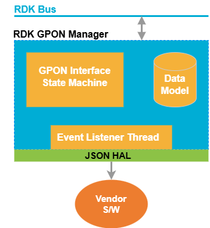
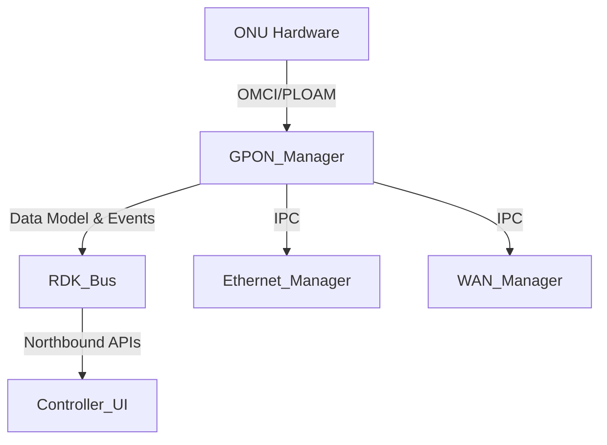
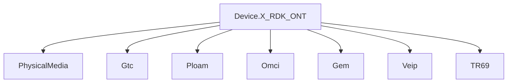
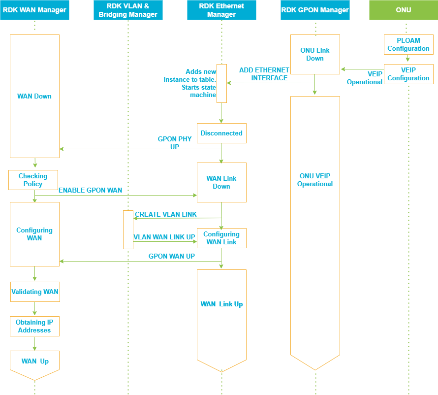
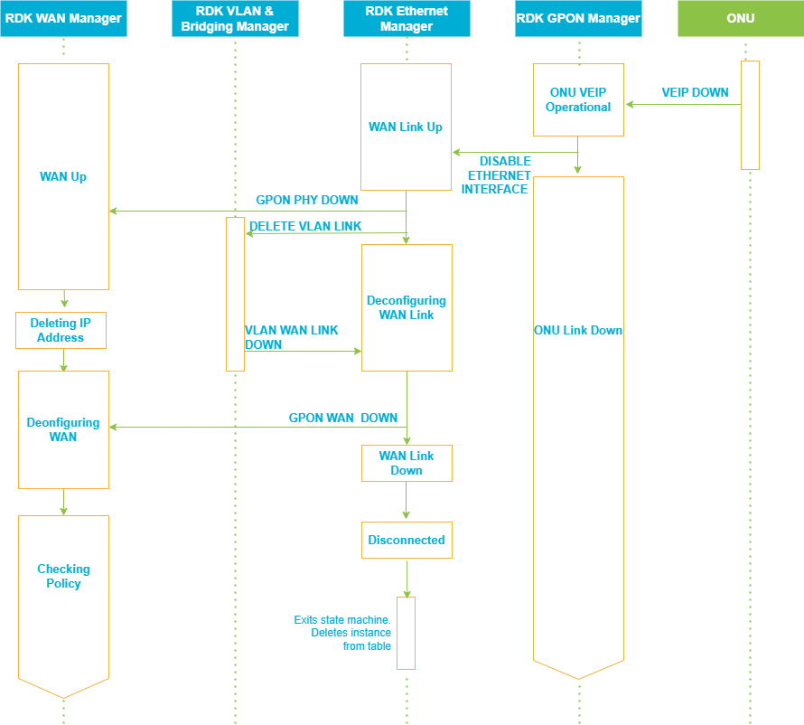
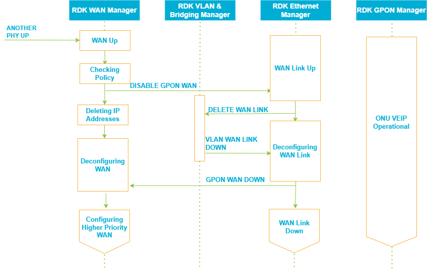
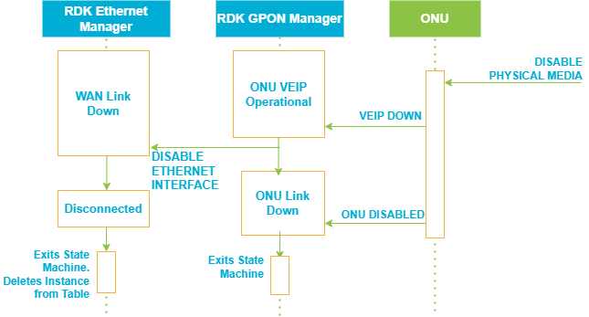
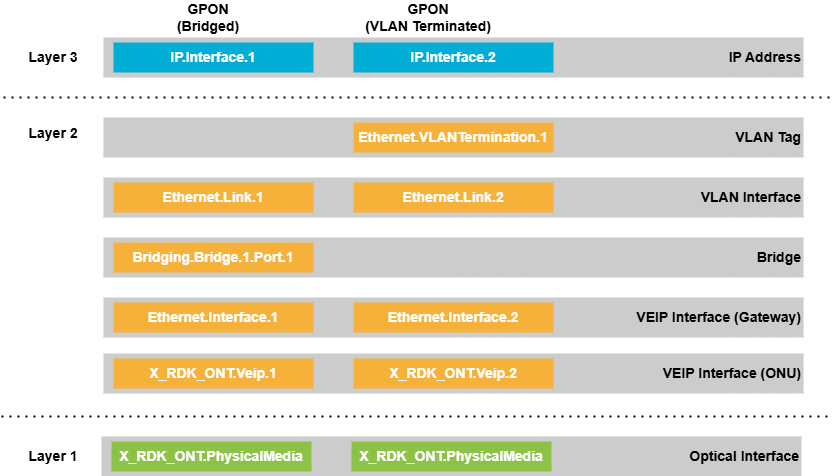

# GPON Manager

GPON Manager component is responsible for managing the GPON interface and its associated ONUs. Its primary function is to abstract the complexities of GPON hardware, provide a standardized data model for configuration and monitoring, and ensure seamless integration with the rest of the RDK-B stack. 

Core responsibilities include:

* Lifecycle management of the GPON interface (initialization, monitoring, and shutdown).
* Monitoring ONU state and GPON link status.
* Providing a TR-181-compliant data model for northbound interfaces.

---

## Design

GPON Manager is architected as a modular middleware component that sits between the hardware abstraction layer (HAL) and the RDK-B management stack. It leverages a state machine to track the operational status of the GPON interface and VEIP (Virtual Ethernet Interface Point), and uses a combination of IPC mechanisms and data models to interact with other system components.

The design ensures that the GPON Manager can:
- Abstract hardware-specific details via the HAL.
- Expose a TR-181-compliant data model for configuration and monitoring.
- Coordinate with Ethernet and WAN managers for interface provisioning.
- Handle events such as GPON link up/down, ONU state changes, and configuration updates.

---

## Internal Modules

The GPON Manager is organized into several internal modules, each with a distinct responsibility:

- **Plugin Initialization**: Handles component startup, function registration, and integration with the RDK-B plugin framework.
- **Data Model Management**: Maintains in-memory representations of the TR-181 data model, including parameter access and updates.
- **HAL Communication**: Manages JSON-based messaging with the hardware abstraction layer for ONU and GPON interface operations.
- **State Machine**: Implements the logic for tracking and transitioning between GPON operational states (e.g., Connected, Disconnected, Disabled, ONU Down).
- **Ethernet Interface Management**: Coordinates with the Ethernet Manager to create and manage VEIP interfaces.
- **Event Handling**: Processes asynchronous events from the hardware and other middleware components.

---

## Interaction with Other Middleware Components

The GPON Manager interacts with several other RDK-B middleware components to ensure end-to-end functionality:

- **Ethernet Manager**: The GPON Manager notifies the Ethernet Manager to create or delete VEIP interfaces as the GPON link state changes.
- **WAN Manager**: It coordinates with the WAN Manager to bring up or tear down WAN connections based on the status of the VEIP interface.
- **RDK Message Bus**: All IPC with peer components is performed over the RDK message bus, ensuring decoupled and scalable communication.

---

## Interaction with Other Layers

The GPON Manager serves as a bridge between the northbound management interfaces and the southbound hardware abstraction layer:

- **Northbound**: Exposes the TR-181 data model, allowing controller UIs and remote management systems to configure and monitor GPON parameters.
- **Southbound**: Communicates with the ONU hardware via the HAL, using JSON messages to perform operations such as querying status, configuring parameters, and handling link events.

---

## IPC Mechanism

Inter-process communication is primarily handled via the RDK message bus. The GPON Manager registers handlers for specific events and commands, and sends notifications or requests to other components as needed. For hardware interactions, the manager uses a JSON-based protocol defined in the `hal_schema` directory, ensuring a clear contract between the middleware and the underlying hardware drivers.

---

## TR-181 Data Models

The GPON Manager owns and manages the `Device.X_RDK_ONT` TR-181 data model subtree. This model includes:

- **PhysicalMedia**: Details about the ONU hardware, such as vendor, firmware, and operational status.
- **Gtc**: GPON Transmission Convergence layer parameters.
- **Ploam**: Physical Layer OAM management.
- **Omci**: OMCI protocol management for ONU configuration.
- **Gem**: GEM port configuration and statistics.
- **Veip**: Virtual Ethernet Interface Point, representing the WAN interface.
- **TR69**: Parameters for remote management via TR-069.

### GPON Connected

In the connected state, the ONU manages GPON connection parameters autonomously. The GPON Manager monitors the ONU's registration status and VEIP interface state. Upon VEIP availability, the GPON Manager coordinates with the Ethernet Manager to provision the VEIP interface for WAN services, consistent with WANoE (WAN over Ethernet) behavior.

### GPON Disonnected

When the VEIP interface is lost, the GPON Manager disables the corresponding Ethernet interface data model object in the Ethernet Manager. This action triggers a teardown of the WAN connection, mirroring the behavior seen in physical Ethernet link disconnection.

### GPON Disabled for WAN

In this state, the ONU remains operational, but WAN services are disabled. The Ethernet Manager transitions to a “WAN Link Down” state. If re-enabled, the system proceeds to restore WAN connectivity using the existing VEIP interface.

### ONU Disabled

Disabling the ONU triggers the teardown of the VEIP interface. The GPON Manager instructs the Ethernet Manager to terminate the associated WAN connection and delete the corresponding Ethernet interface object. Both state machines exit their operational states to conserve system resources.

### Data model structure

The data model structure across RDK components leverages the `LowerLayers` parameter to stack configuration layers for GPON-based WAN connectivity.

---

## Implementation Details

The implementation is structured to maximize modularity and maintainability. Key aspects include:

- The main plugin entry point and initialization logic reside in `source/TR-181/middle_layer_src/gponmgr_dml_plugin_main.c`.
- Data model structures and access functions are implemented in `source/TR-181/middle_layer_src/gponmgr_dml_data.c` and its header.
- HAL communication, including JSON message parsing and parameter mapping, is handled in `source/TR-181/middle_layer_src/gponmgr_dml_hal.c`.
- The state machine logic is encapsulated in `source/GponManager/gponmgr_link_state_machine.c`, which manages transitions such as GPON Connected, Disconnected, Disabled, and ONU Down.
- Ethernet interface management and IPC with the Ethernet Manager are implemented in `source/TR-181/middle_layer_src/gponmgr_dml_eth_iface.c`.
- Supporting files such as `hal_schema` define the JSON schemas for HAL communication, while `config/RdkGponManager.xml` provides data model definitions and parameter mappings.

---

## Key Configuration Files

- **config/RdkGponManager.xml**: Defines the TR-181 data model, parameter mappings, and function bindings for the GPON Manager.
- **hal_schema/**: Contains JSON schema definitions for communication between the GPON Manager and the HAL.
