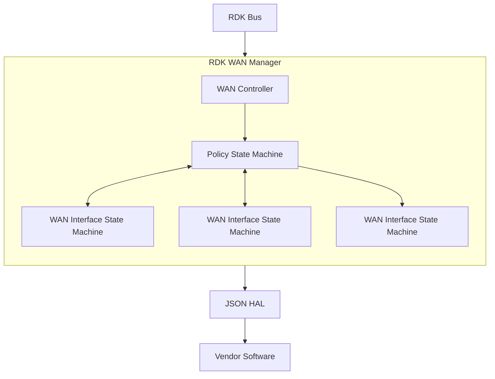
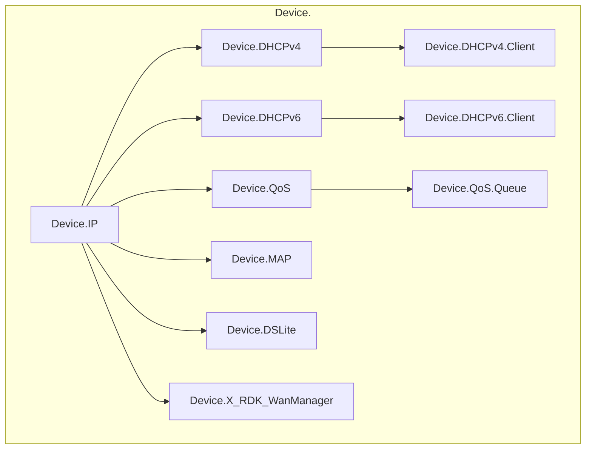
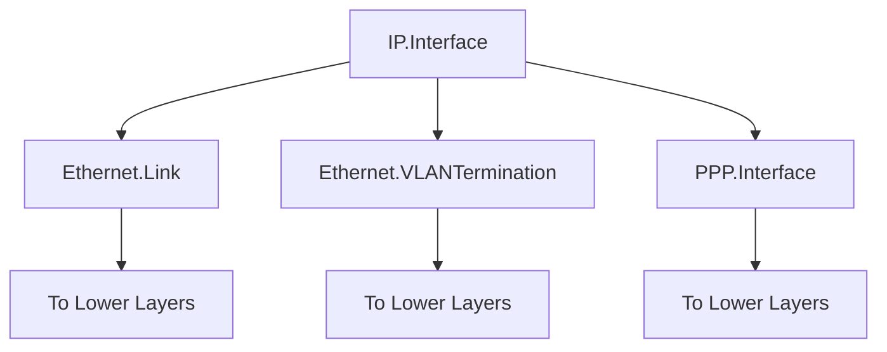

# WAN Manager

WAN Manager is responsible to manage WAN interfaces including handling the configuration, selection, and monitoring of WAN interfaces, supporting various physical and virtual interfaces such as XDSL, Ethernet, DOCSIS, GPON, and Cellular. The WAN Manager abstracts the complexity of managing multiple WAN interfaces, implements failover and selection policies, and integrates seamlessly with other RDK components through RBUS and WebConfig. Its modular architecture ensures flexibility, scalability, and support for future enhancements.

The main objectives achieved by the WAN Manager component are

- **Interface Management** : Interface Managers (e.g., XDSL, Ethernet, DOCSIS, GPON, Cellular) handle physical interface bring-up and report the status of the physical layer to WAN Manager. They provide additional configuration details, such as IP Mode (IPv4 only, IPv6 only, or Dual Stack), VLAN IDs for egress traffic, or static IP addresses (e.g., obtained via PDP on Cellular links)
- **Link and IP Layer Configuration** : WAN Manager interfaces with other RDK components (e.g., VLAN Manager, DHCP Manager) and Linux utilities (e.g., ip addr, ip ro) to configure link and IP layers
- **Business Logic for Connectivity** : Executes business logic to configure WAN interfaces and ensure reliable internet connectivity


## Design
The WAN Manager is built with a modular architecture, comprising several internal components that collaborate to manage WAN connectivity.

### WAN Controller
The WAN Controller serves as the central orchestrator within the WAN Manager, handling tasks that are not specific to individual interfaces. It is responsible for initializing the TR-181 data model from persistent storage, ensuring that configuration settings are loaded correctly at startup. Additionally, it manages runtime changes to the data model, allowing dynamic updates to WAN configurations without requiring a system restart. The WAN Controller coordinates with other components, such as the Policy State Machine and Interface Managers, to ensure that interface configurations align with the defined policies and operational requirements. This component acts as the backbone of WAN Manager, providing a unified point of control for non-interface-specific operations.

### Policy State Machine
The Policy State Machine determines which physical interfaces are used for WAN connectivity based on predefined policies, such as AutoWAN or Parallel Scan. It implements a single instance of the Failover Policy, which enables runtime switching between different interface groups to maintain connectivity in case of failures. For each interface group, the Policy State Machine runs a Selection Policy (e.g., AutoWAN, which sequentially tests interfaces until one establishes internet access, or Parallel Scan, which evaluates multiple interfaces simultaneously). By organizing interfaces into groups (e.g., Group 1: DOCSIS and Ethernet; Group 2: LTE), the Policy State Machine provides flexible configurations, allowing operators to define complex failover and selection strategies tailored to specific deployment needs.
### WAN Interface State Machines
WAN Interface State Machines are responsible for managing the configuration and state of each virtual interface, with one instance running per virtual interface. A virtual interface is defined in the TR-181 data model as a combination of link-layer and IP-layer protocols stacked on top of a physical interface. These state machines ensure that the interface stack is built correctly from the bottom up, handling tasks such as configuring VLANs, assigning IP addresses, and setting up routing. They also manage deconfiguration when an interface is no longer needed, ensuring clean teardown of resources. This modular approach allows WAN Manager to support diverse interface types and configurations, making it adaptable to various hardware and network environments.
### Event Handlers
Facilitates communication with other RDK components via RBUS events and system-level notifications.



## Internal Modules

- **Failover Policy**: Manages runtime failover and switching between different groups of interfaces to ensure continuous connectivity.
- **Selection Policy**:
  - Runs one instance per interface group, using algorithms like AutoWAN or Parallel Scan.
  - AutoWAN: Sequentially tests interfaces within a group until one establishes internet connectivity.
  - Parallel Scan: Simultaneously evaluates multiple interfaces to select the best one.
  - Each policy operates on a specific group of interfaces (e.g., Group 1: DOCSIS and Ethernet; Group 2: LTE).

- **WAN Interface State Machine**: Manages the configuration of virtual interfaces, ensuring correct layering of link and IP protocols.


## Interaction with Other Middleware Components

### Interface Managers
Components like XDSL, Ethernet, DOCSIS, GPON, and Cellular managers handle physical interface bring-up and report status and configuration details to WAN Manager.

### RDK Components
- **VLAN Manager**: Configures VLAN settings for interfaces.
- **DHCP Manager**: Manages IP address allocation for WAN interfaces.
- Other components like Routing Manager and QoS Manager are invoked as needed.

### RBUS
Used for internal communication between WAN Manager and Interface Managers, supporting event subscription and publishing.


## Interaction with Other Layers
### Northbound Interactions
WAN Manager provides robust northbound interfaces for configuration and monitoring, primarily through the TR-181 data model, RBUS, and WebConfig. The TR-181 data model exposes a comprehensive set of configuration and status parameters, including standard objects like Device.IP.Interface and custom RDK parameters such as Device.X_RDK_WanManager. This allows operators to remotely manage WAN configurations and monitor interface status. RBUS enables real-time event publishing and subscription, facilitating communication with higher-layer management systems or other RDK components. WebConfig provides a web-based interface for remote configuration, making it easier to manage devices in large-scale deployments. These northbound interfaces ensure that WAN Manager integrates seamlessly with network management systems and supports remote diagnostics and updates.
### Southbound Interactions
On the southbound side, WAN Manager interacts with the Hardware Abstraction Layer (HAL) and Linux utilities to configure and monitor low-level interface settings. The HAL provides vendor-specific APIs for interacting with hardware, allowing WAN Manager to receive status updates and configuration data from Interface Managers. For example, it can retrieve IP Mode or VLAN IDs from a Cellular or Ethernet interface. Additionally, WAN Manager uses Linux utilities like ip addr, ip route, and ip link to configure link and IP layers, ensuring that interfaces are properly set up for internet connectivity. These southbound interactions enable WAN Manager to bridge the gap between high-level configuration policies and low-level hardware operations.

## IPC Mechanisms

### RBUS

- Primary inter-process communication (IPC) mechanism for interacting with other RDK components.
- WAN Manager registers and subscribes to RBUS events (see WanMgr_Rbus_SubscribeDML in source/WanMgr_RbusHandler.c).
- Publishes interface status and configuration updates.

### SysEvents

- Used for system-level event notifications (see WanMgr_SysEvents_Init in source/WanMgr_Sysevents.c).

### Internal IPC
- Utilizes threads and mutexes for synchronization and event handling within WAN Manager (see WanMgr_WanRemoteIfaceConfigure in source/WanMgr_IfaceCtrl.c).

## TR-181 Data Model
WAN Manager manages several TR-181 data model objects to store and expose WAN configuration and status. These include both standard TR-181 objects and RDK-specific extensions.

### Key Data Model Objects

- Device.X_RDK_WanManager: Stores WAN configuration, interface groups, and policy settings.
- Device.IP.Interface: Represents IP interfaces managed by WAN Manager.
- Device.Ethernet.Link, Device.Ethernet.VLANTermination, Device.PPP.Interface: Lower-layer objects used for stacking interfaces in virtual configurations.

Example Data Model Stack


## Implementation Details


WanMgr_IfaceCtrl.c: Manages WAN interface control and configuration.
WanMgr_RbusHandler.c: Handles RBUS event registration and communication.
WanMgr_Sysevents.c: Manages system event notifications.
WanMgr_PolicyCtrl.c: Implements failover and selection policies.
WanMgr_Data.c: Manages TR-181 data model interactions.

wanmgr_data.h: Defines data structures for WAN configuration and state.
wanmgr_rbus_handler_apis.h: RBUS API definitions.

tests/: Unit tests for validating WAN Manager functionality.

### Key Configuration Files

config/WanMgr_Config.json:
Defines interface groups, selection policies, and failover settings.
Example:
```JSON
{
  "InterfaceGroups": [
    {
      "GroupId": 1,
      "Interfaces": ["DOCSIS", "EthWAN"],
      "Policy": "AutoWAN"
    },
    {
      "GroupId": 2,
      "Interfaces": ["LTE"],
      "Policy": "ParallelScan"
    }
  ],
  "FailoverPolicy": "RuntimeSwitch"
}
```
