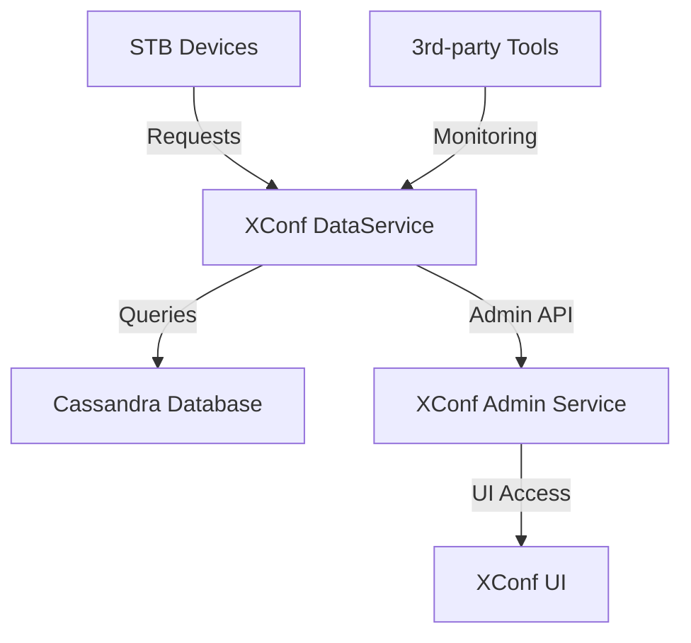

---
hide:
  - navigation
---
# XConf
---
!!! note
    Details of XConf API are available at  [XConf APIs & User Interface](../xconf-apis-ui/) 
    Documentation on XConf deployment is available at [XConf Security & Deployment](../xconf-security-deployment/)

## Overview
XConf is a comprehensive configuration management system designed for RDK (Reference Design Kit) devices, primarily set-top boxes (STBs). It serves as the central authority for managing firmware versions, device settings, feature controls, and telemetry configurations across large device populations.

The system handles the complex requirements of managing thousands to millions of deployed devices across diverse network environments. XConf provides operators with centralized control over firmware deployments, device behaviors, feature toggles, and telemetry data collection through a sophisticated rule-based platform.

XConf operates on rule-based decision making principles. When devices request configurations, firmware updates, or feature settings, XConf evaluates configurable rules against device attributes (MAC address, model, environment, firmware version, location) to determine appropriate responses. This provides fine-grained control over device populations while maintaining flexibility for diverse deployment scenarios.

### Key Features

- **Centralized Configuration Management**: Single point of control for all device configurations
- **Rule-Based Decision Engine**: Sophisticated conditional logic for device targeting
- **High-Volume Device Support**: Designed to handle millions of concurrent device requests
- **Multi-Application Support**: Supports STB, xHome, and rdkCloud device types
- **Real-time Feature Control**: Dynamic feature enabling/disabling without firmware updates
- **Comprehensive Telemetry**: Both legacy and modern telemetry data collection systems

### Use Cases

- **Firmware Rollouts**: Controlled deployment of firmware updates with percentage-based rollouts
- **Feature Management**: Remote enabling/disabling of device features for A/B testing
- **Device Configuration**: Centralized management of device operational parameters
- **Telemetry Collection**: Comprehensive data gathering for analytics and troubleshooting
- **Emergency Response**: Rapid configuration changes for security or operational issues

---

## Architecture

XConf follows a distributed microservices architecture designed to handle high-volume device requests while maintaining administrative flexibility. The system separates device-facing operations from administrative functions, ensuring that high-frequency device requests don't interfere with configuration management operations.

### High-level Architecture

The following diagram illustrates the core components and their interactions. Device requests flow through the DataService, which evaluates rules stored in Cassandra to determine appropriate configurations. Administrative operations are handled through a separate service layer for operational stability and security isolation.

### Components

**XConf DataService (`xconfwebconfig`):**
The core backend service processes all device-initiated requests. Built in Go using `gorilla/mux` router, it handles firmware updates, DCM settings, and RFC requests through a sophisticated rule evaluation engine. Operating on port `9000`, it's designed for high throughput with comprehensive caching mechanisms and supports time-based deployments, percentage rollouts, and geographic targeting.

The DataService implements efficient request processing with optimized database queries and response caching. It evaluates complex rule sets against device attributes to determine appropriate configurations, ensuring consistent and reliable responses even under high load conditions.

**XConf Admin Service (`xconfadmin`):**
Provides comprehensive management capabilities through RESTful APIs for all XConf configurations. Operating on port `9001`, it handles CRUD operations, validation, testing, and export/import functionality. The service implements role-based access control and supports multiple application types (STB, xHome, rdkCloud) with proper isolation.

The Admin Service includes sophisticated validation logic to ensure configuration consistency and provides testing endpoints for verifying rule behavior before deployment. It supports bulk operations for efficient management of large configuration sets.

**XConf UI (`xconfui`):**  
A web-based management console built with AngularJS and Go backend. It offers intuitive forms, visual rule builders, and comprehensive testing capabilities. The interface provides progressive disclosure, presenting simple interfaces for common operations while offering advanced features when needed.

The UI includes extensive validation, real-time feedback, and preview capabilities to help administrators understand configuration impacts before deployment. It supports import/export operations and bulk configuration management.

**Cassandra Database:**  
The distributed NoSQL storage layer using the `ApplicationsDiscoveryDataService` keyspace. It stores all configuration data with a schema optimized for read-heavy workloads and efficient rule evaluation queries. The database design uses wide-row patterns for consistent performance and supports configurable consistency levels.

Cassandra's distributed architecture provides high availability and horizontal scalability essential for supporting large device populations across multiple geographic regions.

**Authentication Provider:**  
Integrates with external authentication systems, primarily OAuth2 providers, for secure access control. The system validates tokens for all administrative operations and supports configurable authentication endpoints, enabling integration with existing organizational identity management systems.

---
## Core Capabilities

### Firmware Management

XConf's firmware management provides comprehensive control over firmware deployments across device populations. The system handles complex distribution requirements including staged rollouts, compatibility verification, and rollback capabilities through a sophisticated rule-based engine.

When devices request firmware updates, XConf evaluates device characteristics (firmware version, model, MAC address, environment) against configured deployment rules to determine appropriate responses.

#### Firmware Configuration Management
**Firmware Configs** define available firmware packages with comprehensive metadata including version identifiers, filenames, download locations, supported models, and deployment parameters. The system supports IPv4/IPv6 locations, multiple protocols (HTTP, HTTPS, TFTP), and configurable upgrade delays.

#### Rule-Based Distribution
**Firmware Rules** determine which devices receive specific firmware versions based on device attributes and environmental factors. Rules support complex conditional logic with AND/OR operators, negation, and priority-based evaluation for sophisticated targeting scenarios.

#### Deployment Control Mechanisms
The system provides multiple deployment control mechanisms: percentage filters for gradual rollouts, time filters for maintenance window restrictions, and location filters for geographic targeting. These controls minimize risk and ensure smooth deployments.

#### Version Management
Comprehensive version tracking includes Activation Version rules for minimum firmware requirements and Intermediate Version configurations for staged upgrade paths, ensuring compatibility and reducing upgrade failures.

### Device Configuration Manager (DCM)

DCM provides comprehensive management of device operational parameters, logging configurations, and behavioral settings. It offers centralized control over device field operations, data collection, and reporting through a rule-based system that evaluates device attributes to determine appropriate configuration profiles.

#### Device Settings Management
**Device Settings** control fundamental operational parameters including configuration check schedules, reboot policies, service endpoint URLs, and activation flags. The system supports both immediate and scheduled configuration changes for coordinated updates across device populations.

#### Logging and Upload Control
**Log Upload Settings** manage device logging behavior, controlling log file collection, retention periods, upload schedules, and automatic upload triggers. The system supports sophisticated rules for targeting specific log files and scheduling uploads based on device state or time triggers.

#### Repository Management
**Upload Repositories** define destinations for device logs and data, including destination URLs, upload protocols, authentication parameters, and handling requirements. The system supports multiple repository types with routing based on content type or device characteristics.

#### VOD and Specialized Settings
**VOD Settings** provide specialized configurations for Video-on-Demand services, including server locations, network parameters, and session management settings to ensure efficient content delivery network access.

### RDK Feature Control (RFC)
RFC enables remote feature control without firmware updates, allowing operators to quickly enable/disable features and respond to changing requirements. The system uses sophisticated feature definitions and rule evaluation to determine appropriate feature configurations for different device populations.

#### Feature Definition and Management
**Features** are defined with comprehensive metadata including identifiers, names, configuration parameters, and behavioral specifications. Features can take effect immediately or require device restarts, with support for complex multi-parameter configurations.

#### Rule-Based Feature Activation
**Feature Rules** determine which devices receive specific features based on device attributes (model, firmware version, location, environment). The system supports priority-based evaluation and feature-specific configuration parameters for different device populations.

#### Whitelisting and Access Control
**Namespaced Lists** allow features to be restricted to specific device populations through MAC address, device model, or other identifiers. This enables controlled rollouts, beta testing, and targeted deployments.

#### Dynamic Configuration
Features marked as "effective immediate" can be enabled/disabled in real-time without device restarts, allowing rapid response to operational requirements or emergency situations.

### Telemetry System
XConf provides comprehensive data collection and reporting through both legacy Telemetry 1.0 and modern Telemetry 2.0 architectures. The system enables collection of operational data, performance metrics, and diagnostic information from field devices.

#### Telemetry 1.0 (Legacy)
Uses profile-based data collection with Telemetry Profiles specifying collection frequency, data types, and destinations. Profiles contain Telemetry Elements defining specific collection points including log patterns, system metrics, and custom data sources.

#### Telemetry 2.0 (Modern)
Provides flexible, component-driven data collection through JSON-based configurations supporting complex scenarios, modular architectures, and advanced processing. Supports dynamic profile assignment and real-time profile switching based on device characteristics.

#### Rule-Based Activation
Both systems support rule-based activation for applying different telemetry configurations to device populations. Telemetry Rules evaluate device attributes to determine active profiles, enabling targeted data collection for specific populations, regions, or scenarios.

#### Data Collection and Reporting
Supports various collection methods including log monitoring, system metrics, and custom sources. Data can be sent to multiple destinations with different formats and protocols, with scheduling capabilities for optimized network usage.

---
## Data Model

XConf's data model uses Cassandra's distributed NoSQL architecture to support high-volume, read-heavy workloads typical of device configuration systems. The design emphasizes efficient rule evaluation, fast device lookups, and scalable storage.

The system uses a single Cassandra keyspace `ApplicationsDiscoveryDataService` containing all XConf data. The table structure is optimized for XConf's query patterns with careful partition key design and clustering strategies.

### Cassandra Keyspaces & Tables

**Keyspace: `ApplicationsDiscoveryDataService`**

Contains all operational data organized into functional area tables designed with Cassandra best practices for even data distribution and efficient queries.

**Core Tables:**

- `FirmwareConfig`: Firmware package definitions with metadata and deployment parameters  
- `FirmwareRule4`: Firmware deployment rules with conditions and priorities  
- `DcmRule`: Device Configuration Manager rules for operational settings  
- `DeviceSettings2`: Device operational parameters and schedules  
- `FeatureControlRule2`: RDK Feature Control rules for feature activation  
- `XconfFeature`: Feature definitions with parameters and specifications  
- `TelemetryTwoProfiles`: Modern telemetry profile definitions  
- `TelemetryTwoRules`: Rules for telemetry profile activation  
- `Environment`: Environment definitions and parameters  
- `Model`: Device model registry with capabilities  
- `GenericNamespacedList`: Reusable lists for whitelists and device groups  

### Sample Table: `FirmwareConfig`

The `FirmwareConfig` table uses Cassandra's wide-row model for efficient firmware configuration storage and retrieval.

| Column     | Type | Description                                      |
|------------|------|--------------------------------------------------|
| key        | text | Composite key containing firmware config ID      |
| column1    | text | Grouped sub-key for data organization            |
| value      | blob | Serialized configuration data in JSON format     |

!!! note
    The compound primary key structure enables efficient queries while the serialized value column contains complete firmware configuration objects, minimizing database queries required for rule evaluation.
