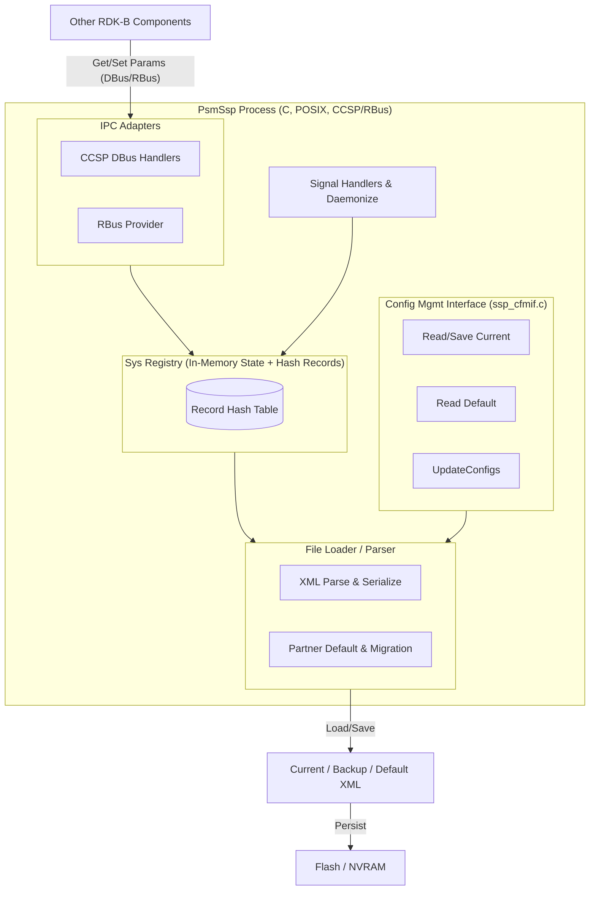
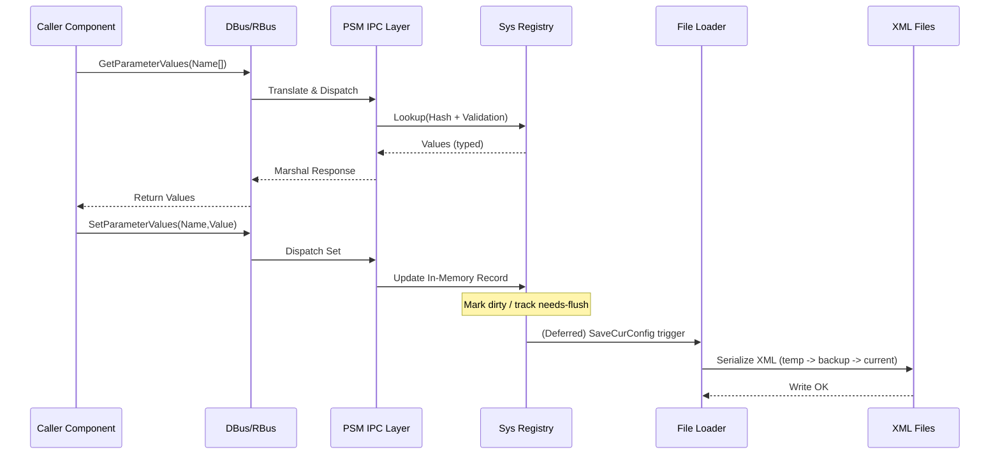
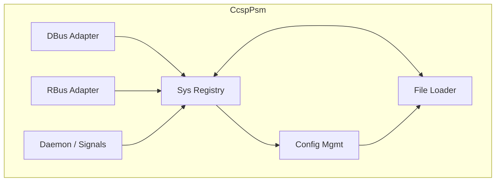
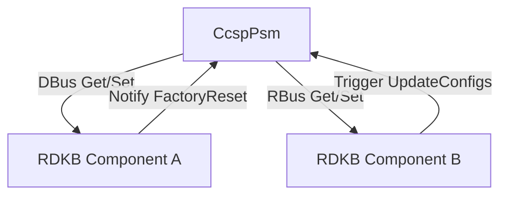
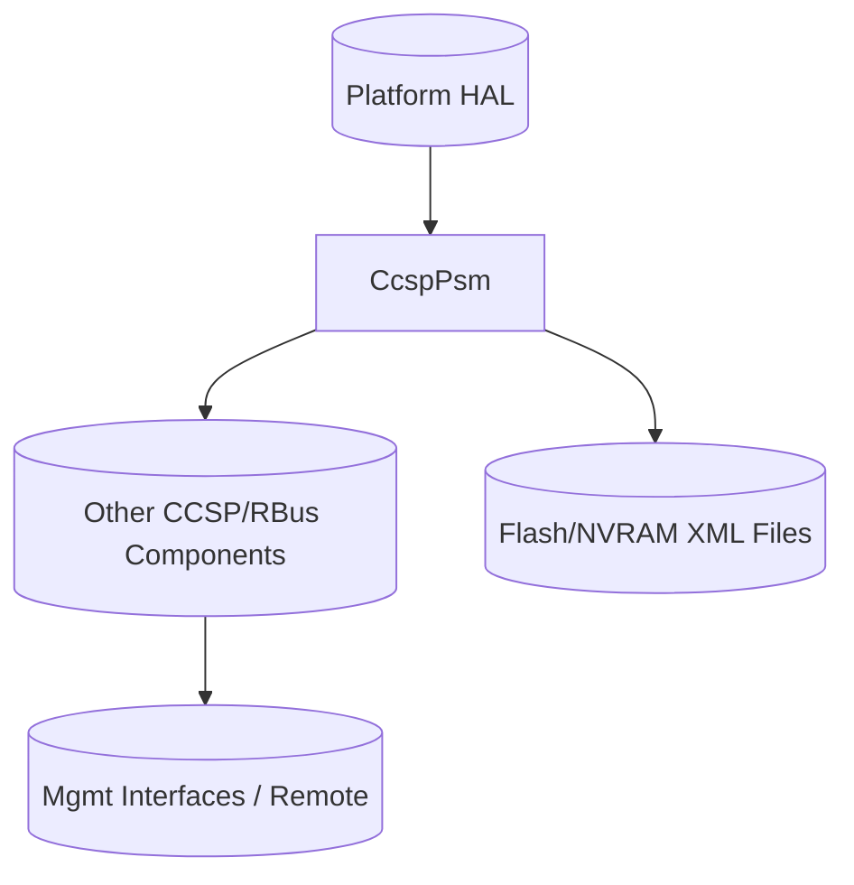
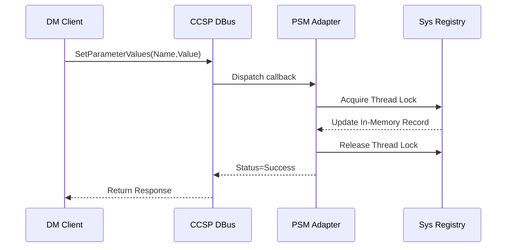

# CcspPsm (Persistent Storage Manager) Documentation

The Persistent Storage Manager (PSM) provides centralized, transactional persistence for TR-181 configuration and runtime parameters in the RDK-B stack. It abstracts XML-backed configuration storage, mediates read/write access over legacy CCSP DBus APIs and the newer RBus interface, and ensures consistent boot-time loading, runtime updates, and periodic or signal-driven flush to flash/NVRAM. Upstream components (parameter owners / data model agents) query and update values through standardized IPC; downstream it manages on‑device XML config files (current, backup, default) and platform/HAL customizations. It is a single resident daemon (`PsmSsp`) that initializes at boot, exports parameter namespaces, and safeguards persistence integrity.

- **Key Features & Responsibilities**:
  - **Centralized Parameter Registry**: Maintains in‑memory authoritative store of persistent TR‑181 parameter values and metadata, exposing get/set operations.
  - **Config File Lifecycle Management**: Loads default (`bbhm_def_cfg*`), current, backup, and temporary XML config variants; supports save, backup, restore, and update flows.
  - **DBus & RBus Bridging**: Implements CCSP Message Bus namespace (`com.cisco.spvtg.ccsp.psm.*`) and equivalent RBus provider methods for parameter operations (Get/Set/Attributes, UpdateConfigs, ReloadConfig).
  - **Write Coordination & Flash Protection**: Tracks file sync reference counts, disables writes when batching or critical operations occur, and flushes to flash safely on SIGTERM.
  - **Factory Reset & Partner Customization Hooks**: Observes special flags/trigger parameters to apply factory defaults and partner‑specific overrides/migrations.
  - **Logging & Health Exposure**: Publishes component health, memory usage, logging enable and level parameters for observability.

## Design

### High‑Level Design Principles

PSM isolates persistent configuration logic from feature components, enforcing a single source of truth and consistent serialization format. It is designed for reliability (graceful signal handling and safe writes), maintainability (modular separation: Sys Registry vs File Loader vs Service/IPC shim), and scalability across expanding TR‑181 namespaces via uniform parameter APIs. Security and integrity are supported by capability dropping (removal of root caps after startup) and controlled write windows. Modularity segregates parsing/loading (File Loader), registry/state (Sys Registry), and transport interfaces (Ssp layer for DBus/RBus). Clear boundaries define ownership of file I/O, parameter validation, and IPC serialization. Design choices (XML record hashing, locking primitives, and typed value handling) minimize contention and allow future migration to alternative storage backends with minimal external impact.

Guiding principles:
- **Modularity**: Distinct objects (Sys Registry, File Loader, CFM interface) with clear APIs (`PsmCreateSysRegistry`, `PsmCreateFileLoader`).
- **Scalability**: Hash bucket storage (`PSM_REC_HASH_SIZE=1024`) allows O(1) average lookups as namespaces grow.
- **Reliability**: Signal handlers (`SIGTERM`, `SIGUSR2`) ensure config flush and orderly disengage.
- **Security**: Capability dropping (`drop_root_caps`) after initialization reduces privilege footprint.
- **Maintainability**: Encapsulated parsing, record abstraction, and interface layers ease refactoring.

### C4 Container Diagram

### Design Explanation & Request Flow

- **Request Flow Sequence**: Typical Get/Set over RBus/DBus.

### Threading Model

PSM operates largely single-threaded for its main event loop after daemonization, but employs:
- DBus/RBus underlying threads (from their libraries) to invoke registered callbacks concurrently.
- Internal locking via interface methods (`AcqThreadLock` / `RelThreadLock` through `pSysIraIf`) around critical sections for parameter enumeration and mutation.
- A pthread mutex (`rec_hash_lock` in `ssp_cfmif.c`) protecting the record hash during parsing and update flows.
- Signal handlers executing asynchronously for termination and maintenance (ensuring save before exit).
No dynamic thread pools are created by PSM itself; concurrency is bounded to IPC callback threads and minimal mutex usage.

## Internal Modules

| Module/Class | Description | Key Files |
|-------------|------------|-----------|
| Sys Registry (PsmSysRegistry) | Core in‑memory parameter store, state machine for engage/cancel, property setup (file paths, sync control). | `psm_sysro_interface.c`, `psm_sysro_*` files |
| File Loader (PsmFileLoader) | Parses and serializes XML config records, applies migrations & partner defaults. | `psm_flo_interface.c`, `psm_flo_*` files |
| Config Mgmt Interface (CFM) | High-level read/save/update wrappers exposed to Sys Registry (cur, def, bak, tmp file operations). | `ssp_cfmif.c` |
| Service/Support Platform (SSP) | Daemon entrypoint, signal handling, capability dropping, bus initialization. | `ssp_main.c` |
| DBus Adapter | Implements CCSP DBus namespace resolution, parameter get/set/attributes, health and metadata parameters. | `ssp_dbus.c` |
| RBus Adapter | Provides RBus provider registration, value serialization bridging legacy types to RBus types. | `ssp_rbus.c` |
| HAL Interface Shims | Optional platform-specific configuration read/write hooks (`USE_PLATFORM_SPECIFIC_HAL`). | `psm_hal_apis.h`, `psm_hal_apis.c` |

Module Breakdown Diagram:

## Interaction with Other Middleware Components

PSM exposes parameter storage to other TR-181 enabled components; they consume Get/Set operations and may trigger reload or update events.

| Component | Purpose of Interaction | Protocols/Mechanisms |
|-----------|-----------------------|----------------------|
| Various Data Model Agents | Retrieve/update persistent parameters | CCSP DBus (`ccsp_message_bus`), RBus |
| Reboot/Reset Manager | Factory reset trigger parameter & config reload | DBus parameter set |
| Logging/Diag Subsystem | Read logging enable/level flags | DBus/RBus |

Events / Triggers Emitted or Observed (implicit via parameters):

| Event | Purpose of Event | Reason for trigger |
|-----------|-----------------------|----------------------|
| `ReloadConfig` (param) | Instructs PSM to reload current config from disk | Admin or component request |
| `UpdateConfigs` (param) | Apply new configuration path and migrate | Partner update / provisioning |
| `FactoryReset` (param) | Reset to defaults | Factory reset workflow |
| `DisableWriting` (state) | Temporarily halt flash writes | Batch update / migration |

## Interaction with Other Layers

| Layer/Service | Interaction Description | Mechanism |
|---------------|-------------------------|----------|
| HAL (optional) | Platform-specific config access overrides | Direct HAL calls (`psm_hal_apis`) |
| Platform (Init/Systemd) | Daemonization & lifecycle (PID file, signals, systemd notify optional) | POSIX signals, systemd sd_notify |
| External (Flash/NVRAM FS) | Persistent storage of XML config snapshots | File I/O (atomic temp->bak->current) |

Layered View:

## IPC Mechanism

| Type of IPC | Message Format | Mechanism |
|-------------|----------------|-----------|
| CCSP DBus | Parameter operations (`GetParameterValues`, `SetParameterValues`), name spaces `com.cisco.spvtg.ccsp.psm.*` | DBus via `ccsp_message_bus` |
| RBus | Typed parameter get/set bridging legacy enum to `rbusValue` types | RBus library |
| Signals | POSIX signals for lifecycle (`SIGTERM`, `SIGUSR2`, etc.) | Kernel signal delivery |
| Semaphores | Startup synchronization (`pSemPsm`) between parent/child during daemonize | POSIX named semaphore |

IPC Flow (DBus Set example):

## TR‑181 Data Models

- **Implemented Parameters**: The component exposes meta parameters for itself (Name, Version, Author, Health, State, Memory usage metrics, Logging, FactoryReset, DisableWriting, ReloadConfig, UpdateConfigs, NewConfigPath) and user/partner TR‑181 parameters stored in XML records (dynamic set not enumerated here). Core exported namespace root: `com.cisco.spvtg.ccsp.psm`.
- **Parameter Registration**: Namespace array `NamespacePsm[]` (in `ssp_dbus.c`) defines static meta parameters with types; dynamic parameters loaded into Sys Registry accessible via standard CCSP get/set and mirrored to RBus.
- **Custom Extensions**:
  - Partner default application & migration flags (presence of marker files triggers logic in CFM interface).
  - DisableWriting semantics controlling flash write gating during bulk update.

Example Meta Parameter Table (subset):

| Parameter | Description | Access (R/W) | Default | Notes |
|-----------|-------------|-------------|---------|-------|
| `com.cisco.spvtg.ccsp.command.FactoryReset` | Initiate factory reset (bool) | W | false | Triggers reset workflow |
| `com.cisco.spvtg.ccsp.psm.Name` | Component name | R | `PersistentStorageManager` | Set from constant |
| `com.cisco.spvtg.ccsp.psm.Version` | Component version | R | `1` | Macro `CCSP_COMPONENT_VERSION_PSM` |
| `com.cisco.spvtg.ccsp.psm.Health` | Health state | R | Green | Static string in current impl |
| `com.cisco.spvtg.ccsp.psm.DisableWriting` | Indicates write lock active | R | false | True when FileSyncRefCount>0 |
| `com.cisco.spvtg.ccsp.psm.ReloadConfig` | Reload config trigger | W | false | Causes reparse of XML |
| `com.cisco.spvtg.ccsp.psm.UpdateConfigs` | Apply updated config files | W | false | Uses new path variable |

## Implementation Details

- **Key Algorithms or Logic**: A hash-based record table (`PSM_REC_HASH_SIZE=1024`) supports efficient parameter lookup, with parsing routines constructing `psm_record` structs from XML `<Record>` entries. Save operations perform atomic sequence: write temp -> copy to backup -> replace current. Capability management reduces privileges post-init. RBus adapter maps legacy CCSP types to modern `rbusValueType_t`. Thread locks (`AcqThreadLock/RelThreadLock`) wrap batch operations. Signal logic ensures safe exit flush via `SaveConfigToFlash`.
- **Error Handling Strategy**: Returns statuses propagate through DBus handlers; memory allocations verified with early exit logging on failure. Defensive safe string operations (`strcpy_s`, return code `EOK` check) reduce buffer overflow risk. Fallbacks for core dump availability decide signal trapping vs. letting crash for diagnostics.
- **Logging & Debugging**: Uses `CcspTraceInfo/Warning/Error/Debug` macros; log enable flag exposed via parameter. Backtrace collection (GNU `execinfo`) optionally writes to `/nvram/psmssp_backtrace` on abnormal signals. PID file at `/var/tmp/PsmSsp.pid`; initialization marker at `/tmp/psm_initialized`.

## Key Configuration Files

| Configuration File | Purpose | Key Parameters | Default Values | Override Mechanisms |
|--------------------|---------|---------------|----------------|--------------------|
| `config/bbhm_def_cfg_qemu.xml` | Default TR‑181 config baseline | Record entries | N/A (static file) | Factory reset reload |
| `/tmp/bbhm_cur_cfg.xml` | Current active config | Dynamic record set | Derived from last save | Updated by save flow |
| `/nvram/bbhm_bak_cfg.xml` | Backup snapshot | Mirror of current | Prior save version | Used on recovery |
| Markers: `/tmp/.apply_partner_defaults_psm` | Partner migration trigger | N/A | Absent | Created externally |
| Markers: `/nvram/.apply_partner_defaults` | Partner default flag | N/A | Absent | Removed after apply |

## Assumptions & Notes

Some runtime behaviors (frequency of periodic saves, full dynamic TR‑181 parameter list) are inferred from code structure; exhaustive parameter enumeration would require inspecting generated/loaded XML at runtime, which is outside static source scope. The component currently reports Health="Green" statically; dynamic health evaluation may be planned externally.

## Future Improvements (Potential)

- Abstract storage backend to support binary or JSON formats with pluggable serializers.
- Implement dynamic health metrics (latency, hash load factor) exposed as parameters.
- Introduce journaling or WAL for crash-safe incremental persistence.
- Add unit tests for RBus bridging edge cases (legacy types, base64, bytes) similar to existing gtest suite for File Loader and Sys Registry.

---
Generated following provided RDK-B documentation template & diagram guidelines; diagrams label real protocols, deployment boundaries, and mechanisms.
