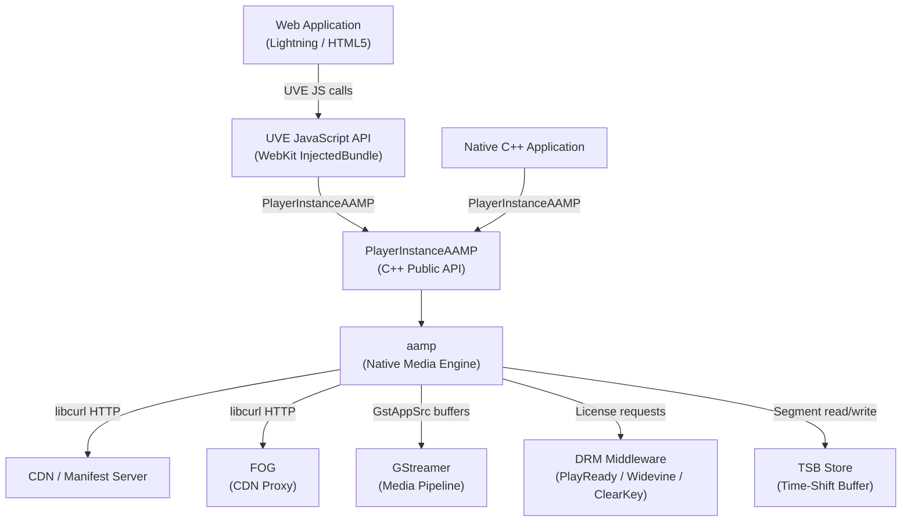
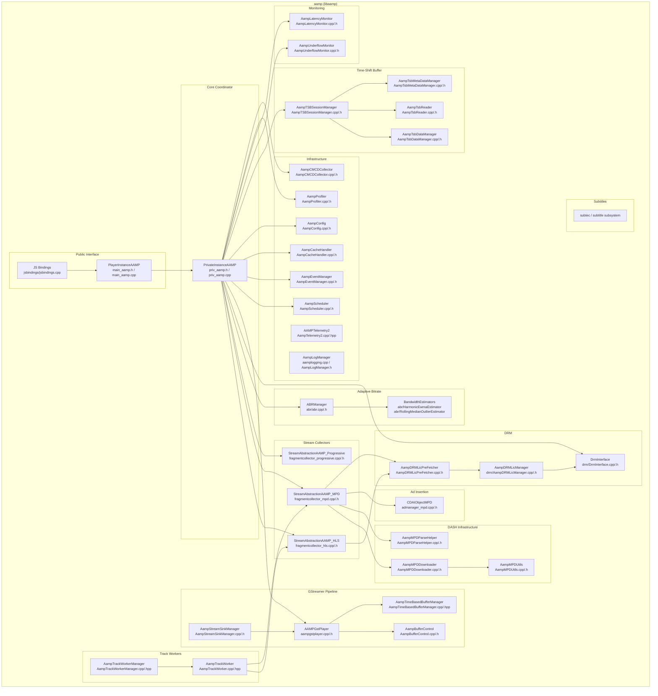
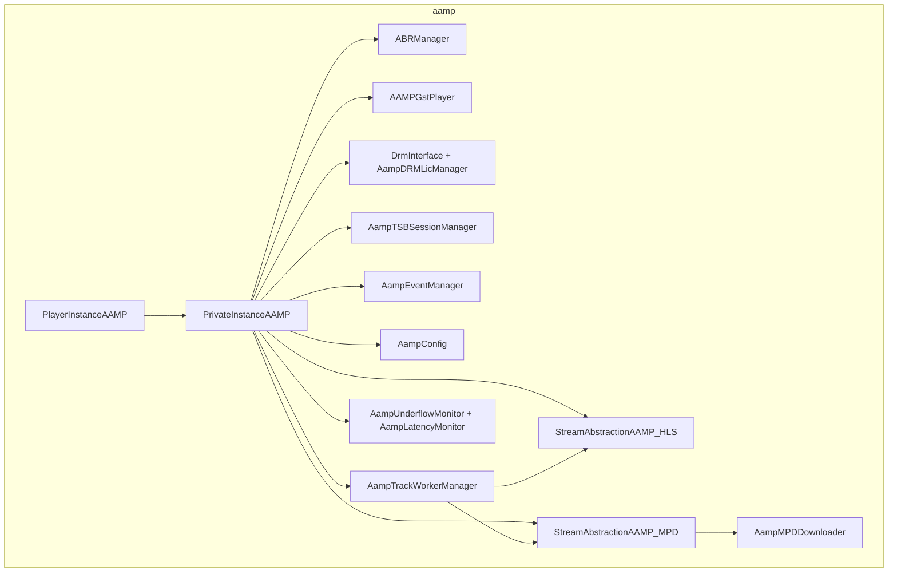

# AAMP

## Overview

AAMP (Advanced Adaptive Media Player) is an open-source native video engine built on top of GStreamer, designed for performance, low memory use, and a minimal code footprint on RDK-based embedded devices. It downloads and parses HLS and DASH manifests, and is integrated with multiple DRM systems including Adobe Access, PlayReady, CONSEC agnostic, and Widevine. On RDK platforms, AAMP operates as a native C++ library (`libaamp`) fronted by JavaScript bindings (Universal Video Engine — UVE) delivered via WebKit InjectedBundle, making it the primary media engine for web-based applications on RDK set-top boxes.

At the device level, AAMP provides the full media pipeline from network retrieval through decryption to GStreamer-based rendering. It supports live, VOD, and time-shift playback modes with adaptive bitrate switching, closed caption rendering, and multi-DRM content protection. It exposes both a native C++ API (`PlayerInstanceAAMP`) and a JavaScript API (`UVE`) for application developers.

At the module level, AAMP is organized into distinct subsystems for manifest handling (HLS, DASH), fragment collection and injection, adaptive bitrate (ABR) management, DRM license acquisition, time-shift buffer (TSB) management, subtitle rendering, telemetry, and event dispatching. Each subsystem is independently maintained and communicates through well-defined interfaces and a shared `PrivateInstanceAAMP` core context.

**Key Features & Responsibilities:**

- **HLS Playback**: Parses HLS master and media playlists, collects audio and video fragments per track, handles discontinuities, timed metadata (ID3), and trick-play via I-frame playlists (`fragmentcollector_hls.cpp`).
- **DASH Playback**: Downloads and parses MPEG-DASH MPD manifests using libdash, segments periods into adaptation sets, manages period transitions, and handles Low Latency DASH (LL-DASH) live edge correction (`fragmentcollector_mpd.cpp`, `AampMPDDownloader`).
- **Progressive MP4 Playback**: Supports direct playback of fragmented and progressive MP4 content (`fragmentcollector_progressive.cpp`).
- **Adaptive Bitrate (ABR)**: Continuously estimates available network bandwidth using rolling median or harmonic EWMA algorithms and selects the appropriate quality profile (`abr/abr.h`, `abr/abr.cpp`).
- **DRM Content Protection**: Acquires and manages DRM licenses for Clear Key, AES-128, PlayReady, and Widevine. Supports pre-fetching of licenses for upcoming DASH periods to reduce license latency (`AampDRMLicPreFetcher`, `drm/DrmInterface`).
- **Time-Shift Buffer (TSB)**: Writes incoming live segments to a local TSB store and reads from it to enable pause, rewind, and trick-play on live streams (`AampTSBSessionManager`, `tsb/api/TsbApi.h`).
- **GStreamer Pipeline Integration**: Feeds decoded (or encrypted, for HW DRM) audio and video buffers into GStreamer `appsrc` elements. Manages pipeline state, trick-play rates, underflow detection, and first-frame reporting (`aampgstplayer.cpp`, `AampBufferControl`).
- **Client-Side Dynamic Ad Insertion (DAI)**: Manages ad break scheduling and period stitching in DASH manifests, tracking ad reservation and placement lifecycle events (`admanager_mpd.cpp`, `CDAIObjectMPD`).
- **Event System**: Dispatches typed events (tune success, tune failure, bitrate change, progress, EOS, DRM metadata, anomaly reports, etc.) to registered JavaScript or native listeners asynchronously via GLib idle callbacks (`AampEventManager`).
- **Configuration System**: Accepts player configuration from five priority layers — code defaults, RFC/environment variables, stream-provided values, application settings, and developer override files (`/opt/aamp.cfg`, `/opt/aampcfg.json`) — without requiring rebuilds (`AampConfig`).
- **CMCD Support**: Collects and appends Common Media Client Data headers (bitrate, next object request, buffer state) to HTTP segment and manifest requests (`AampCMCDCollector`).
- **Telemetry**: Emits RDK Telemetry 2.0 markers for milestone events during tune and playback, and records per-tune profiling buckets (manifest, playlist, init fragment, DRM, first frame) that are reported as `AAMP_EVENT_TUNE_PROFILING` events (`AampTelemetry2`, `AampProfiler`).
- **Underflow Monitoring**: Tracks a wall-clock deadline derived from the buffered downstream position and declared underflow without relying on GStreamer position polling or platform-specific heuristics (`AampUnderflowMonitor`).
- **Latency Monitoring**: For LL-DASH and live HLS streams, measures stream latency and adjusts playback rate (within configured min/max bounds) to maintain a target latency (`AampLatencyMonitor`).
- **Subtitle Rendering**: Parses and renders WebVTT cues and CEA-608/708 closed captions via the `subtec` subsystem (`subtitle/`, `subtec/`).

---

## Architecture

### High-Level Architecture

AAMP is structured as a single native C++ library (`libaamp`) that embeds all playback logic. The public interface is `PlayerInstanceAAMP` (`main_aamp.h`), which holds a `shared_ptr` to `PrivateInstanceAAMP` — the central coordination object that owns all subsystem references. This split keeps the public API stable while allowing internal subsystem evolution. JavaScript access is provided through WebKit InjectedBundle JS bindings (`jsbindings/jsbindings.cpp`) that wrap `PlayerInstanceAAMP` calls into a `UVE` JavaScript object available to web applications. The design avoids inter-process communication for the media path: the JS binding, the C++ engine, and the GStreamer pipeline all execute within the same process.

Northbound interaction is through either the UVE JavaScript API (for web apps via WebKit InjectedBundle) or the native C++ `PlayerInstanceAAMP` API (for native integrators). Southbound interaction is through GStreamer (`appsrc` buffers for media data), libcurl (HTTP downloads of manifests and fragments), libdash (DASH manifest parsing), and the DRM middleware interface (`DrmInterface`, `DrmSession`). Thunder/WPEFramework access is used only where needed — for example, `ThunderAccess.cpp` connects to Thunder plugins (e.g., security token retrieval for license requests).

IPC within AAMP is handled through two mechanisms: the `AampScheduler` queues async tasks to a dedicated worker thread using a `std::deque` of `AsyncTaskObj` function objects protected by a `std::mutex`/`std::condition_variable`; the `AampEventManager` dispatches typed `AAMPEventPtr` objects to registered listeners using GLib idle sources (`g_idle_add`) on the main GLib loop, keeping event delivery on the GLib thread and decoupled from the download threads.

Persistent data is not stored by AAMP itself. Playlist and initialization fragment caches (`AampCacheHandler`) are in-memory only and are purged on session exit or after approximately 10 seconds of inactivity. For static DASH VOD manifests, `AampMPDDownloader` maintains an in-memory MPD model. The TSB store is provided by an external TSB library accessed through `tsb/api/TsbApi.h`; AAMP writes segments to and reads them from this store but does not manage the underlying storage medium directly.

A component diagram showing AAMP's internal structure and external dependencies is given below:

```mermaid
graph TD
    subgraph AAMP ["aamp (libaamp)"]
        PIA["PrivateInstanceAAMP\n(Core Coordinator)"]
        PublicAPI["PlayerInstanceAAMP\n(Public C++ API)"]
        JSBind["JS Bindings\n(jsbindings / UVE)"]

        subgraph ManifestLayer ["Manifest & Fragment Collection"]
            HLS["fragmentcollector_hls\n(HLS playlist + fragment download)"]
            MPD["fragmentcollector_mpd\n(DASH MPD + segment download)"]
            Progressive["fragmentcollector_progressive\n(Progressive MP4)"]
            MPDDownloader["AampMPDDownloader\n(DASH MPD downloader + model)"]
            MPDHelper["AampMPDParseHelper\n(MPD parsing utilities)"]
        end

        subgraph ABRLayer ["ABR"]
            ABR["ABRManager\n(Bandwidth estimation + profile selection)"]
            RME["RollingMedianOutlierEstimator"]
            HEWMA["HarmonicEwmaEstimator"]
        end

        subgraph DRMLayer ["DRM"]
            DRMIface["DrmInterface\n(Session management)"]
            LicPrefetch["AampDRMLicPreFetcher\n(Pre-fetch licenses for DASH periods)"]
            LicMgr["AampDRMLicManager"]
        end

        subgraph BufferingLayer ["Buffering & Pipeline"]
            GSTPlayer["AAMPGstPlayer\n(GStreamer appsrc sink)"]
            BufCtrl["AampBufferControl\n(Download enable/disable control)"]
            TimeBuf["AampTimeBasedBufferManager\n(Time-based buffer fill tracking)"]
            SinkMgr["AampStreamSinkManager\n(Pipeline instance management)"]
        end

        subgraph MonitorLayer ["Monitoring"]
            Underflow["AampUnderflowMonitor\n(Deadline-based underflow detection)"]
            Latency["AampLatencyMonitor\n(LL-DASH / live latency + rate correction)"]
        end

        subgraph TSBLayer ["Time-Shift Buffer"]
            TSBSess["AampTSBSessionManager\n(Write queue + read coordination)"]
            TSBData["AampTsbDataManager\n(Segment metadata)"]
            TSBReader["AampTsbReader\n(Segment read-back)"]
        end

        subgraph InfraLayer ["Infrastructure"]
            Sched["AampScheduler\n(Async task queue)"]
            EvtMgr["AampEventManager\n(Event dispatch to listeners)"]
            Cache["AampCacheHandler\n(In-memory playlist + init fragment cache)"]
            Config["AampConfig\n(Layered configuration)"]
            Profiler["AampProfiler\n(Tune-time profiling buckets)"]
            Telemetry["AAMPTelemetry2\n(RDK Telemetry 2.0 markers)"]
            CMCD["AampCMCDCollector\n(CMCD header assembly)"]
            Logger["AampLogManager\n(Leveled logging)"]
            Workers["AampTrackWorkerManager\n(Per-track download worker threads)"]
        end

        subgraph AdLayer ["Ad Insertion"]
            DAI["CDAIObjectMPD\n(Client-side DAI for DASH)"]
        end

        subgraph SubtitleLayer ["Subtitle"]
            Subtec["subtec subsystem\n(WebVTT + CEA-608/708)"]
        end
    end

    WebApp["Web Application\n(WebKit)"]
    NativeApp["Native C++ Integrator"]
    CDN["CDN / Origin"]
    FOG["FOG Proxy"]
    GSTCore["GStreamer Core"]
    DRMMiddleware["DRM Middleware\n(PlayReady / Widevine / ClearKey)"]
    TSBLib["TSB Library\n(tsb/api/TsbApi.h)"]
    Thunder["Thunder Plugin\n(Security token)"]
    Telemetry2Bus["RDK Telemetry 2.0 Bus"]

    WebApp -->|UVE JS| JSBind
    NativeApp -->|C++ API| PublicAPI
    JSBind --> PublicAPI
    PublicAPI --> PIA
    PIA --> HLS
    PIA --> MPD
    PIA --> Progressive
    PIA --> ABR
    PIA --> DRMIface
    PIA --> GSTPlayer
    PIA --> Sched
    PIA --> EvtMgr
    PIA --> Cache
    PIA --> Config
    PIA --> TSBSess
    PIA --> Underflow
    PIA --> Latency
    PIA --> Profiler
    PIA --> CMCD
    MPD --> MPDDownloader
    MPD --> MPDHelper
    MPD --> DAI
    MPD --> LicPrefetch
    HLS --> LicPrefetch
    LicPrefetch --> LicMgr
    LicMgr --> DRMIface
    DRMIface -->|License HTTP| DRMMiddleware
    ABR --> RME
    ABR --> HEWMA
    GSTPlayer --> BufCtrl
    GSTPlayer --> TimeBuf
    SinkMgr --> GSTPlayer
    TSBSess --> TSBData
    TSBSess --> TSBReader
    Workers --> HLS
    Workers --> MPD
    Telemetry --> Telemetry2Bus
    HLS -->|libcurl| CDN
    HLS -->|libcurl| FOG
    MPD -->|libcurl| CDN
    MPDDownloader -->|libcurl| CDN
    GSTPlayer -->|appsrc buffers| GSTCore
    TSBSess -->|TsbApi| TSBLib
    PIA -->|ThunderAccess| Thunder
    Subtec --> GSTCore
```

### Threading Model

- **Threading Architecture**: Multi-threaded with a GLib main loop for event dispatch.
- **Main / GLib Thread**: Hosts the `AampEventManager` GLib idle callbacks. All event delivery to registered listeners occurs on this thread.
- **Download Worker Threads** (`AampTrackWorker` / `AampTrackWorkerManager`): One dedicated worker thread per media track (video, audio, subtitle). Each worker dequeues download jobs, fetches fragments via libcurl, and pushes data to the GStreamer pipeline. Workers are created and destroyed per stream session.
- **AampScheduler Thread**: A single background thread that executes deferred `AsyncTask` function objects enqueued from any thread. Used for tune retries, seek handling, and other async state transitions.
- **AampMPDDownloader Thread**: A background thread that performs periodic DASH MPD refresh for live streams, parsing updated manifests and notifying the DASH fragment collector.
- **AampUnderflowMonitor Thread**: A background thread that sleeps until the computed buffer-drain deadline, then fires an underflow callback into `PrivateInstanceAAMP` if no new fragment has arrived.
- **AampLatencyMonitor Thread**: A background thread that polls stream latency at a configured interval and adjusts GStreamer playback rate to remain within the target latency window.
- **TSB Write Thread** (`AampTSBSessionManager::ProcessWriteQueue`): Drains the TSB write queue, serializing segment data to the TSB store.
- **Synchronization**: `std::mutex` and `std::condition_variable` protect the download queues, event queues, TSB write queue, and ABR state. The `AampEventManager` uses a separate `mMutexVar` to protect the pending async event map. The `AampTrackWorkerManager` uses a `std::mutex` over the worker map. Smart pointers (`shared_ptr`, `unique_ptr`) enforce ownership and lifetime rather than manual locking where possible.
- **Async / Event Dispatch**: `AampEventManager` posts events via `g_idle_add` to the GLib main loop. Download threads do not invoke listener callbacks directly; they enqueue `AAMPEventPtr` objects into a queue and signal the GLib thread.

---

## Design

AAMP separates the public API surface (`PlayerInstanceAAMP`) from the implementation (`PrivateInstanceAAMP`) using a PIMPL-adjacent pattern with a `shared_ptr`. This prevents API consumers from depending on internal headers and allows internal changes without ABI breakage. All subsystems (ABR, DRM, TSB, event manager, scheduler, cache) are owned by `PrivateInstanceAAMP` and accessed through it. The configuration system (`AampConfig`) uses an enum-keyed array of typed values and a priority ownership model so that each configuration key tracks which source last wrote it, enabling deterministic override semantics.

Northbound interactions with the JavaScript layer go through the UVE API (`jsbindings/jsbindings.cpp`), which maps JavaScript property accesses and method calls to `PlayerInstanceAAMP` methods using JavaScriptCore C API. Events flow from internal subsystems through `AampEventManager` to JavaScript event listeners registered via `addEventHandler` calls. Southbound interactions with GStreamer use the `AAMPGstPlayer` / `StreamSink` abstraction: fragment data is pushed into GStreamer `appsrc` elements as `GstBuffer` objects, and GStreamer signals (`need-data`, `enough-data`, `eos`) drive buffer-level feedback via `AampBufferControl`.

IPC with Thunder is limited to security token retrieval (`ThunderAccess.cpp`). The access pattern connects to `127.0.0.1:9998` using the WPEFramework Core client, retrieves a security token via `GetSecurityToken`, and uses it as a bearer token on DRM license HTTP requests. No Thunder plugin registration or JSON-RPC server is present in AAMP itself; Thunder is used only as a client.

Data persistence is not performed by AAMP. Playlist and initialization fragment caches (`AampCacheHandler`) are in-memory structures purged on session tear-down. The TSB store is maintained by an external TSB library accessed via `TsbApi.h`; AAMP invokes `Write`, `Read`, and `Flush` operations through `AampTSBSessionManager` but does not manage storage media lifecycle.

### Component Diagram

A component diagram showing the internal structure and sub-module dependencies is given below:

---

## Internal Modules

| Module / Class                      | Description                                                                                                                                                                                                                                                                                      | Key Files                                                                                            |
| ----------------------------------- | ------------------------------------------------------------------------------------------------------------------------------------------------------------------------------------------------------------------------------------------------------------------------------------------------ | ---------------------------------------------------------------------------------------------------- |
| `PlayerInstanceAAMP`                | Public C++ API class. Exposes `Tune`, `Stop`, `Seek`, `SetRate`, track selection, and configuration methods. Owns a `shared_ptr<PrivateInstanceAAMP>`.                                                                                                                                           | `main_aamp.cpp`, `main_aamp.h`                                                                       |
| `PrivateInstanceAAMP`               | Central coordinator. Holds references to all subsystem objects, manages tune state machine, pipeline lifecycle, error recovery, and retry logic.                                                                                                                                                 | `priv_aamp.cpp`, `priv_aamp.h`                                                                       |
| `JS Bindings (UVE)`                 | Maps JavaScriptCore property accesses and method calls to `PlayerInstanceAAMP`. Loaded into WebKit via InjectedBundle. Exposes the UVE API to web applications.                                                                                                                                  | `jsbindings/jsbindings.cpp`, `jsbindings/jsbindings.h`, `jsbindings/jsmediaplayer.cpp`               |
| `StreamAbstractionAAMP_HLS`         | HLS stream collector. Parses master and media playlists, schedules audio and video fragment downloads, handles discontinuities, ID3 timed metadata, AES-128 and OCDM/DRM key management, and I-frame trick-play.                                                                                 | `fragmentcollector_hls.cpp`, `fragmentcollector_hls.h`                                               |
| `StreamAbstractionAAMP_MPD`         | DASH stream collector. Consumes the MPD model from `AampMPDDownloader`, maps periods and adaptation sets to media tracks, manages segment templates, LL-DASH low-latency correction, VSS service zones, and ad period stitching.                                                                 | `fragmentcollector_mpd.cpp`, `fragmentcollector_mpd.h`                                               |
| `StreamAbstractionAAMP_Progressive` | Progressive / fragmented MP4 collector. Handles raw HTTP byte-range downloads for fMP4 and progressive MP4 assets.                                                                                                                                                                               | `fragmentcollector_progressive.cpp`, `fragmentcollector_progressive.h`                               |
| `AampMPDDownloader`                 | Downloads and maintains the DASH MPD model. Performs initial fetch and periodic refresh for live manifests. Parses the XML document using libdash and stores an `MPDModel` and `MPDSegmenter`. Produces manifest update callbacks consumed by `StreamAbstractionAAMP_MPD`.                       | `AampMPDDownloader.cpp`, `AampMPDDownloader.h`                                                       |
| `AampMPDParseHelper`                | Utility class consolidating DASH MPD traversal logic: period element resolution, content protection extraction, UTC time serverresolution, and representation selection. Used by both `AampMPDDownloader` and `StreamAbstractionAAMP_MPD`.                                                       | `AampMPDParseHelper.cpp`, `AampMPDParseHelper.h`                                                     |
| `ABRManager`                        | Adaptive bitrate manager. Accepts download bandwidth samples from track workers, computes available bandwidth using a pluggable estimator (`RollingMedianOutlierEstimator` or `HarmonicEwmaEstimator`), and selects quality profiles for audio and video tracks.                                 | `abr/abr.cpp`, `abr/abr.h`, `abr/HarmonicEwmaEstimator.cpp`, `abr/RollingMedianOutlierEstimator.cpp` |
| `AAMPGstPlayer`                     | GStreamer-based stream sink. Creates `appsrc` elements for video, audio, and subtitle tracks, pushes `GstBuffer` objects, manages pipeline state transitions (`PAUSED`/`PLAYING`/`NULL`), trick-play rate, EOS, and first-frame detection.                                                       | `aampgstplayer.cpp`, `aampgstplayer.h`                                                               |
| `AampBufferControl`                 | Controls whether the download workers for each track are enabled or paused based on GStreamer buffer level feedback (`need-data` / `enough-data` signals) and configurable time-based buffer thresholds.                                                                                         | `AampBufferControl.cpp`, `AampBufferControl.h`                                                       |
| `AampStreamSinkManager`             | Manages the lifecycle of `AAMPGstPlayer` instances across foreground/background (single/multi-pipeline) configurations. Caches media initialization headers for background to foreground transitions.                                                                                            | `AampStreamSinkManager.cpp`, `AampStreamSinkManager.h`                                               |
| `AampTimeBasedBufferManager`        | Tracks the amount of downloaded media content (in time) for a single track and reports whether the buffer is full relative to a configured maximum buffer duration.                                                                                                                              | `AampTimeBasedBufferManager.cpp`, `AampTimeBasedBufferManager.hpp`                                   |
| `DrmInterface`                      | Singleton interface between AAMP and the DRM middleware. Manages `DrmSession` lifecycle, registers callbacks for HLS OCDM and AES DRM paths, and terminates curl instances on cleanup.                                                                                                           | `drm/DrmInterface.cpp`, `drm/DrmInterface.h`                                                         |
| `AampDRMLicPreFetcher`              | Pre-fetches DRM licenses for upcoming DASH periods in a background thread, reducing license acquisition latency at period boundaries. Queues `LicensePreFetchObject` items per adaptation set.                                                                                                   | `AampDRMLicPreFetcher.cpp`, `AampDRMLicPreFetcher.h`                                                 |
| `AampDRMLicManager`                 | Manages DRM license sessions: acquires licenses, handles key rotation, tracks session state, and interfaces with the DRM middleware through `DrmInterface`.                                                                                                                                      | `drm/AampDRMLicManager.cpp`, `drm/AampDRMLicManager.h`                                               |
| `AampTSBSessionManager`             | Owns the time-shift buffer write pipeline. Maintains a write queue populated by fragment collectors during live playback, drains it on a dedicated thread via `TsbApi`, and coordinates `AampTsbReader` for read-back during seek or trick-play.                                                 | `AampTSBSessionManager.cpp`, `AampTSBSessionManager.h`                                               |
| `AampTsbReader`                     | Reads segments from the TSB store in sequence for live trick-play or seek-back operations, returning `CachedFragment` objects to the stream collector.                                                                                                                                           | `AampTsbReader.cpp`, `AampTsbReader.h`                                                               |
| `AampTsbDataManager`                | Maintains an index of segments written to the TSB store, tracking URL, period ID, media type, and byte range metadata per entry.                                                                                                                                                                 | `AampTsbDataManager.cpp`, `AampTsbDataManager.h`                                                     |
| `AampTsbMetaDataManager`            | Stores and retrieves ad-related metadata (reservation and placement) tied to TSB segment positions.                                                                                                                                                                                              | `AampTsbMetaDataManager.cpp`, `AampTsbMetaDataManager.h`                                             |
| `AampTrackWorkerManager`            | Factory and registry for `AampTrackWorker` instances keyed by `AampMediaType`. Creates, starts, resets, and removes workers in a thread-safe manner.                                                                                                                                             | `AampTrackWorkerManager.cpp`, `AampTrackWorkerManager.hpp`                                           |
| `AampTrackWorker`                   | Per-track download worker thread. Dequeues `AampTrackWorkerJob` objects, executes them sequentially, and signals completion via `std::shared_future`. Supports high-priority job insertion at the front of the queue.                                                                            | `AampTrackWorker.cpp`, `AampTrackWorker.hpp`                                                         |
| `AampScheduler`                     | Asynchronous task dispatcher. Maintains a `std::deque<AsyncTaskObj>` protected by a mutex and drains it on a dedicated thread. Tasks are identified by integer IDs for cancellation support.                                                                                                     | `AampScheduler.cpp`, `AampScheduler.h`                                                               |
| `AampEventManager`                  | Routes typed `AAMPEvent` objects to registered `EventListener` instances. Supports async mode (GLib idle dispatch) and synchronous dispatch. Tracks pending async event IDs to prevent double-dispatch during shutdown.                                                                          | `AampEventManager.cpp`, `AampEventManager.h`                                                         |
| `AampCacheHandler`                  | In-memory LRU cache for HLS playlists and initialization fragments. Uses sequence numbers for eviction. Not used for DASH manifest caching (handled by `AampMPDDownloader`). Cleared on session exit or after an inactivity timeout.                                                             | `AampCacheHandler.cpp`, `AampCacheHandler.h`                                                         |
| `AampConfig`                        | Layered configuration store. Holds bool, int, long, and string configuration parameters indexed by `AAMPConfigSettings` enum. Applies values from five sources (code defaults, RFC/ENV, stream, application, dev files) with explicit ownership tracking per key.                                | `AampConfig.cpp`, `AampConfig.h`                                                                     |
| `AampProfiler`                      | Records timestamps for named profiling buckets (`PROFILE_BUCKET_MANIFEST`, `PROFILE_BUCKET_PLAYLIST_VIDEO`, `PROFILE_BUCKET_INIT_VIDEO`, `PROFILE_BUCKET_LA_TOTAL`, `PROFILE_BUCKET_FIRST_FRAME`, etc.) and serializes them into the `AAMP_EVENT_TUNE_PROFILING` event payload.                  | `AampProfiler.cpp`, `AampProfiler.h`                                                                 |
| `AAMPTelemetry2`                    | Wraps the RDK Telemetry 2.0 C API. Sends named marker events with typed key-value maps (int, string, float) to the platform telemetry bus during tune milestones and error conditions.                                                                                                           | `AampTelemetry2.cpp`, `AampTelemetry2.hpp`                                                           |
| `AampCMCDCollector`                 | Assembles CMCD (Common Media Client Data) request headers for video, audio, manifest, and subtitle HTTP requests. Tracks next-object URL, estimated bandwidth, and session UUID.                                                                                                                 | `AampCMCDCollector.cpp`, `AampCMCDCollector.h`                                                       |
| `AampUnderflowMonitor`              | Maintains a deadline timestamp equal to `now + (bufferedEndPosition - currentPosition) / playRate`. A background thread sleeps until this deadline and fires an underflow notification into `PrivateInstanceAAMP` if no new fragment re-arms it before expiry.                                   | `AampUnderflowMonitor.cpp`, `AampUnderflowMonitor.h`                                                 |
| `AampLatencyMonitor`                | Measures current live edge latency for LL-DASH and live HLS streams at a configured polling interval. Adjusts the GStreamer playback rate within `[minPlaybackRate, maxPlaybackRate]` to converge toward `targetLatencyMs`. Supports adaptive latency threshold expansion on rebuffering events. | `AampLatencyMonitor.cpp`, `AampLatencyMonitor.h`                                                     |
| `AampLogManager`                    | Provides leveled logging macros (`AAMPLOG_TRACE`, `AAMPLOG_DEBUG`, `AAMPLOG_INFO`, `AAMPLOG_WARN`, `AAMPLOG_MIL`, `AAMPLOG_ERR`) gated by a global `aampLoglevel`. Includes download latency tracking per media type for diagnostics.                                                            | `aamplogging.cpp`, `AampLogManager.h`                                                                |
| `CDAIObjectMPD`                     | Client-side Dynamic Ad Insertion manager for DASH. Tracks ad break reservations and placements within the MPD period list, triggers ad-lifecycle events (`AAMP_EVENT_AD_STARTED`, `AAMP_EVENT_AD_COMPLETED`), and controls period stitching during ad playback.                                  | `admanager_mpd.cpp`, `admanager_mpd.h`                                                               |
| `subtec / subtitle`                 | Subtitle subsystem providing WebVTT cue parsing, rendering, and CEA-608/708 closed caption handling. Receives subtitle fragments from the stream collector and delivers rendered text to the display pipeline.                                                                                   | `subtec/`, `subtitle/`                                                                               |
| `isobmff`                           | ISO Base Media File Format box parser used for fragmented MP4 processing, extracting initialization segments, media data boxes, and sample information.                                                                                                                                          | `isobmff/`                                                                                           |
| `AampUtils`                         | Collection of standalone utility functions: URL manipulation, base64/base16 encoding, MIME type detection, ISO 639 language code mapping, and misc string helpers.                                                                                                                               | `AampUtils.cpp`, `AampUtils.h`                                                                       |

---

## Prerequisites & Dependencies

**Mandatory Build Dependencies** (verified in `CMakeLists.txt`):

| Dependency                        | Version              | Use                                                           |
| --------------------------------- | -------------------- | ------------------------------------------------------------- |
| GStreamer                         | ≥ 1.18.0             | Media pipeline, appsrc, pipeline state management             |
| GStreamer App (gstreamer-app-1.0) | ≥ 1.18.0             | appsrc element for pushing buffers                            |
| libcurl                           | any (≥ 8.5 on macOS) | HTTP downloads of manifests, fragments, and license requests  |
| libdash                           | any                  | DASH MPD XML parsing                                          |
| libxml-2.0                        | any                  | XML parsing (used alongside libdash)                          |
| OpenSSL                           | any                  | Cryptographic operations                                      |
| libcjson                          | any                  | JSON parsing for configuration and event payloads             |
| libuuid                           | any                  | UUID generation for CMCD session IDs and TSB entries          |
| Threads (pthreads)                | any                  | `std::thread` support                                         |
| C++17                             | —                    | Language standard required by CMake (`CMAKE_CXX_STANDARD 17`) |

**Optional / Platform-Conditional Dependencies** (verified in `CMakeLists.txt`):

| Dependency              | Condition                                      | Use                             |
| ----------------------- | ---------------------------------------------- | ------------------------------- |
| `libbaseconversion`     | `CMAKE_EXTERNAL_PLAYER_INTERFACE_DEPENDENCIES` | External player interface layer |
| `libplayerlogmanager`   | `CMAKE_EXTERNAL_PLAYER_INTERFACE_DEPENDENCIES` | External player log manager     |
| `libplayerfbinterface`  | `CMAKE_EXTERNAL_PLAYER_INTERFACE_DEPENDENCIES` | Firebolt interface bridge       |
| `libplayergstinterface` | `CMAKE_EXTERNAL_PLAYER_INTERFACE_DEPENDENCIES` | GStreamer interface abstraction |
| `libsubtec`             | `CMAKE_EXTERNAL_PLAYER_INTERFACE_DEPENDENCIES` | External subtitle engine        |
| OpenGL / GLEW           | Ubuntu simulator builds                        | Simulator rendering support     |

**Runtime Dependencies** (referenced in source, not pkg-config checked):

| Dependency                                       | Source Reference          | Use                                         |
| ------------------------------------------------ | ------------------------- | ------------------------------------------- |
| WPEFramework / Thunder                           | `ThunderAccess.cpp`       | Security token retrieval (`127.0.0.1:9998`) |
| TSB Library                                      | `tsb/api/TsbApi.h`        | Time-shift buffer segment storage           |
| DRM middleware (PlayReady / Widevine / ClearKey) | `drm/DrmInterface.h`      | DRM license session management              |
| RDK Telemetry 2.0                                | `AampTelemetry2.cpp`      | Platform telemetry marker emission          |
| JavaScriptCore                                   | `jsbindings/jsbindings.h` | JS binding API for UVE                      |
| WebKit InjectedBundle                            | `jsbindings/`             | UVE delivery to web applications            |

**Configuration Verification Checklist:**

- Thunder integration is confirmed present via `ThunderAccess.cpp` (`ThunderAccessAAMP` constructor connects to `127.0.0.1:9998` and calls `GetSecurityToken`).
- TSB integration is confirmed present via `AampTSBSessionManager` which includes `tsb/api/TsbApi.h` and calls `Write`, `Read`, `Flush` on the TSB store.
- DRM integration is confirmed present via `drm/DrmInterface.cpp` and `AampDRMLicManager`.
- RDK Telemetry 2.0 integration is confirmed present via `AampTelemetry2.cpp` (`AAMPTelemetry2::send` emits markers to the telemetry bus).
- CMCD integration is confirmed present via `AampCMCDCollector.cpp` (`CMCDSetNextObjectRequest`, `CMCDSetNextRangeRequest` called from fragment collectors).
- IARM/IARM bus integration: no IARM API calls are present in the AAMP source tree. AAMP does not use IARM directly.

---

## Configuration

AAMP configuration is applied at runtime through a priority hierarchy. A lower-priority source is overridden by any higher-priority source that explicitly sets the same key. The priority order from lowest to highest is:

1. AAMP code defaults (set in `AampConfig` constructor)
2. Operator settings via RFC environment variables
3. Stream-provided settings (e.g., from manifest metadata)
4. Application settings (provided via `InitAAMPConfig` JSON)
5. Developer override files: `/opt/aamp.cfg` (text key=value format) or `/opt/aampcfg.json` (JSON format)

Configuration values are typed (`bool`, `int`, `long`, `std::string`) and keyed by `AAMPConfigSettings` enum values. Selected defaults from `AampDefine.h`:

| Parameter                             | Default        | Description                                               |
| ------------------------------------- | -------------- | --------------------------------------------------------- |
| `abr`                                 | `true`         | Enable adaptive bitrate switching                         |
| `fog`                                 | `true`         | Enable FOG proxy                                          |
| Initial bitrate                       | 2,500,000 bps  | Starting quality profile for non-4K streams               |
| Initial bitrate (4K)                  | 13,000,000 bps | Starting quality profile for 4K streams                   |
| Live offset                           | 15 seconds     | Distance from live edge for live stream playback start    |
| CDVR live offset                      | 30 seconds     | Distance from live edge for cloud DVR hot recordings      |
| Progress report interval              | 1 second       | Frequency of `AAMP_EVENT_PROGRESS` events                 |
| DRM license acquire timeout           | 5,000 ms       | Maximum wait for a DRM license response                   |
| Max DRM license acquire timeout       | 12,000 ms      | Upper bound for DRM license with retries                  |
| ABR cache life                        | 5,000 ms       | Duration for which a bandwidth sample is considered valid |
| Cached fragments per track            | 4              | Maximum fragments buffered in memory per media track      |
| LL-DASH low buffer rampdown threshold | 3 seconds      | Buffer level below which ABR ramps down in LL-DASH mode   |
| LL-DASH high buffer rampup threshold  | 4 seconds      | Buffer level above which ABR ramps up in LL-DASH mode     |

---

## Events

`AampEventManager` dispatches the following event types to registered listeners:

| Event                             | Value | Description                                    |
| --------------------------------- | ----- | ---------------------------------------------- |
| `AAMP_EVENT_TUNED`                | 1     | Tune completed successfully                    |
| `AAMP_EVENT_TUNE_FAILED`          | 2     | Tune failed                                    |
| `AAMP_EVENT_SPEED_CHANGED`        | 3     | Playback speed changed internally              |
| `AAMP_EVENT_EOS`                  | 4     | End of stream reached                          |
| `AAMP_EVENT_PLAYLIST_INDEXED`     | 5     | Playlist downloaded and indexed                |
| `AAMP_EVENT_PROGRESS`             | 6     | Periodic playback progress report              |
| `AAMP_EVENT_MEDIA_METADATA`       | 9     | Asset metadata (duration, bitrates, languages) |
| `AAMP_EVENT_ENTERING_LIVE`        | 10    | Live edge reached during playback              |
| `AAMP_EVENT_BITRATE_CHANGED`      | 11    | ABR quality profile switched                   |
| `AAMP_EVENT_TIMED_METADATA`       | 12    | Timed metadata tag parsed from manifest        |
| `AAMP_EVENT_STATE_CHANGED`        | 14    | Player state machine transition                |
| `AAMP_EVENT_SEEKED`               | 16    | Seek operation completed                       |
| `AAMP_EVENT_TUNE_PROFILING`       | 17    | Per-tune timing bucket data                    |
| `AAMP_EVENT_BUFFERING_CHANGED`    | 18    | Buffering started or ended                     |
| `AAMP_EVENT_AUDIO_TRACKS_CHANGED` | 20    | Available audio track list changed             |
| `AAMP_EVENT_TEXT_TRACKS_CHANGED`  | 21    | Available text track list changed              |
| `AAMP_EVENT_AD_BREAKS_CHANGED`    | 22    | Ad break schedule updated                      |
| `AAMP_EVENT_AD_STARTED`           | 23    | Ad playback began                              |
| `AAMP_EVENT_AD_COMPLETED`         | 24    | Ad playback ended                              |
| `AAMP_EVENT_DRM_METADATA`         | 25    | DRM metadata (system ID, access attributes)    |
| `AAMP_EVENT_REPORT_ANOMALY`       | 26    | Playback anomaly reported                      |
| `AAMP_EVENT_WEBVTT_CUE_DATA`      | 27    | WebVTT cue data for rendering                  |
| `AAMP_EVENT_AD_RESOLVED`          | 28    | Ad fulfillment result                          |
| `AAMP_EVENT_AD_RESERVATION_START` | 29    | Ad break reservation started                   |

---

## Profiling Buckets

`AampProfiler` records timestamps for the following milestone buckets during each tune. These are emitted in the `AAMP_EVENT_TUNE_PROFILING` event:

| Bucket                             | Description                                              |
| ---------------------------------- | -------------------------------------------------------- |
| `PROFILE_BUCKET_MANIFEST`          | Manifest download duration                               |
| `PROFILE_BUCKET_PLAYLIST_VIDEO`    | Video playlist download duration                         |
| `PROFILE_BUCKET_PLAYLIST_AUDIO`    | Audio playlist download duration                         |
| `PROFILE_BUCKET_INIT_VIDEO`        | Video initialization fragment download                   |
| `PROFILE_BUCKET_INIT_AUDIO`        | Audio initialization fragment download                   |
| `PROFILE_BUCKET_FRAGMENT_VIDEO`    | First video fragment download                            |
| `PROFILE_BUCKET_DECRYPT_VIDEO`     | Video decryption duration                                |
| `PROFILE_BUCKET_LA_TOTAL`          | Total DRM license acquisition time                       |
| `PROFILE_BUCKET_LA_NETWORK`        | DRM license network round-trip                           |
| `PROFILE_BUCKET_FIRST_BUFFER`      | Time from tune start to first buffer pushed to GStreamer |
| `PROFILE_BUCKET_FIRST_FRAME`       | Time from tune start to first video frame rendered       |
| `PROFILE_BUCKET_DISCO_TOTAL`       | Total discontinuity transition duration                  |
| `PROFILE_BUCKET_DISCO_FIRST_FRAME` | First frame after discontinuity transition               |

---

## Version

AAMP version string is defined in `AampDefine.h` as `AAMP_VERSION "8.03"`. The tune-time event schema version is `AAMP_TUNETIME_VERSION 8`.
