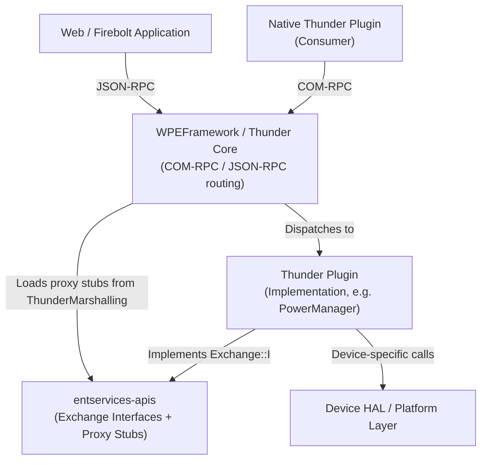
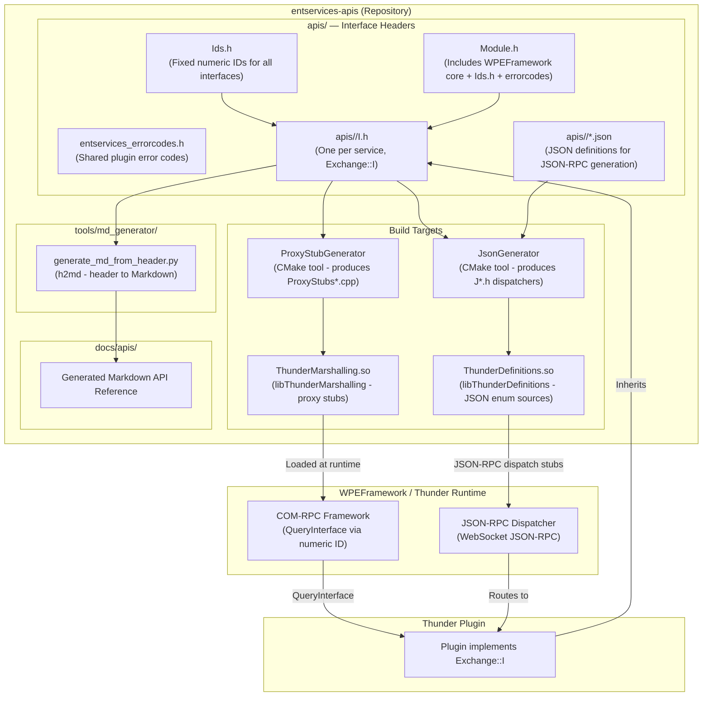
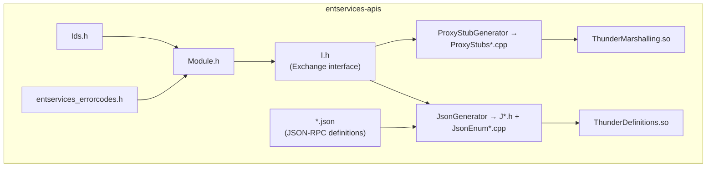

# Entservices-APIs

## Overview

Entertainment Services APIs (Ent Services APIs) are a set of C++ interface definitions that allows RDK middleware developers to build Thunder plugins as services. The interface definitions are designed so that services can provide applications access to various platform functionalities in entertainment devices powered by RDK middleware. The repository does not contain plugin implementations — it contains only the interface contracts (header files and JSON definitions) and the generated proxy stub shared library (`ThunderMarshalling`) that enables COM-RPC communication between Thunder processes.

At the device level, this repository supplies the Exchange interfaces through which Thunder plugins expose capabilities such as power management, persistent storage, device diagnostics, display management, content decryption, AV input, firmware update, user settings, analytics, telemetry, app lifecycle management, and more. Any Thunder plugin implementing or consuming a service defined here links against the installed headers and the `ThunderMarshalling` proxy stub library. Client applications communicate with these services through JSON-RPC (for web and Firebolt clients) or COM-RPC (for native in-process or cross-process Thunder plugin-to-plugin communication).

At the module level, each service is represented by one or more C++ pure-virtual interface structs (e.g., `IPowerManager`, `IUserSettings`, `IStore2`) in a per-service subdirectory under `apis/`. Each interface has a fixed numeric ID assigned in `apis/Ids.h`, which the COM-RPC framework uses to locate the correct proxy/stub pair across process boundaries. A parallel set of JSON definitions (`.json` files) and a documentation generator tool (`tools/md_generator/`) produce Markdown API reference pages from the header files and JSON.



**Key Features & Responsibilities:**

- **COM-RPC Interface Contracts**: Each service interface inherits from `Core::IUnknown` and is tagged with a fixed numeric ID from `apis/Ids.h`. This ID allows the WPEFramework COM-RPC layer to locate and bind the correct proxy/stub pair across process boundaries without relying on names.
- **JSON-RPC Exposure**: Interfaces annotated with `@json 1.0.0` and `@text:keep` are processed by the Thunder `JsonGenerator` tool to produce JSON-RPC dispatcher code. Method names exposed over JSON-RPC use camelCase as specified by `@text` annotations in the headers, while the COM-RPC names use PascalCase.
- **Proxy Stub Generation**: The top-level `CMakeLists.txt` runs `ProxyStubGenerator` over all `I*.h` headers to produce `ProxyStubs*.cpp` files, which are compiled into the shared library `ThunderMarshalling`. This library is installed to `lib/<namespace>/proxystubs/` and loaded at runtime by the Thunder framework.
- **Notification / Event Pattern**: Each interface that produces events defines one or more nested `INotification` structs (tagged `@event`). Implementations call `Register`/`Unregister` to subscribe and unsubscribe. All notification methods have default (empty) implementations in the interface header — they are not pure virtual — so that subscriber implementations do not need to override events they do not consume.
- **Fixed Interface ID Registry**: All numeric interface IDs are allocated in `apis/Ids.h` as a single `WPEFramework::Exchange::IDS` enum. The base offset is `RPC::IDS::ID_EXTERNAL_CC_INTERFACE_OFFSET`. Groups of IDs are spaced 16 apart by convention to allow future expansion of each service. Once assigned, an ID value must not be changed.
- **Governance-Controlled API Lifecycle**: New interfaces, changes to existing interfaces, and deprecations follow a defined governance process (documented in `governance.md`) that requires Governance Board approval. Interface headers are considered fixed after merge — changes to an existing interface require a new interface version.
- **Documentation Generation**: Markdown reference documentation is generated from header files using `tools/md_generator/h2md/generate_md_from_header.py` and from JSON definitions using a separate generator path. Generated docs are published to `docs/apis/`.
- **Error Code Registry**: A shared error code range (`-32000` to `-32099` per JSON-RPC spec) is defined in `apis/entservices_errorcodes.h` using an `X`-macro pattern. Defined codes include `ERROR_INVALID_DEVICENAME`, `ERROR_INVALID_MOUNTPOINT`, `ERROR_FIRMWAREUPDATE_INPROGRESS`, `ERROR_FIRMWAREUPDATE_UPTODATE`, and `ERROR_FILE_IO`. All error codes start at enum value `1000` (`ERROR_BASE`).

---

## Architecture

### High-Level Architecture

This repository is a pure interface and proxy stub library. It has no runtime daemon, no plugin lifecycle of its own, and no HAL calls. Its sole runtime artifact is the `ThunderMarshalling` shared library containing generated proxy stubs. The authoring discipline is that every interface defined here is stable once published — implementations in separate plugin repositories must conform to the interface contract without the interface itself being modified for backward-compatible changes.

All interfaces live within the `WPEFramework::Exchange` C++ namespace and inherit from `Core::IUnknown`. The WPEFramework COM-RPC framework uses `QueryInterface` (keyed by the numeric ID from `Ids.h`) to obtain a concrete interface pointer from a remote (or in-process) Thunder plugin. The `ThunderMarshalling` shared library, built from the generated `ProxyStubs*.cpp` files, is the mechanism by which COM-RPC calls are serialized and deserialized for cross-process communication.

Northbound, web and Firebolt applications communicate over JSON-RPC WebSocket with a Thunder plugin that implements the relevant Exchange interface. The JSON-RPC dispatcher code is generated from headers annotated with `@json 1.0.0` by the `JsonGenerator` CMake tool (used in `build/CMakeLists.txt`). Southbound, plugin implementations access HAL or platform APIs — those are outside the scope of this repository.

Persistence of interface IDs is enforced through the `apis/Ids.h` enum. Because proxy stubs compiled on one build will be loaded at runtime on a device that may have been compiled at a different time, the numeric IDs are treated as stable ABI: they must not change. This is the reason all IDs are explicitly assigned values rather than relying on compiler-generated sequential enum numbering.

A component diagram showing the repository's internal structure and its relationship to the Thunder framework is given below:



### Threading Model

- **Threading Architecture**: The interfaces defined in this repository are not executable code — they have no threads. The `ThunderMarshalling.so` library contains only serialization/deserialization stubs called on the thread that initiates a COM-RPC call. Threading model is determined by the WPEFramework COM-RPC framework and the implementing plugin, not by this repository.
- **Synchronization**: Not applicable to this repository. The `Module.h` header includes WPEFramework core headers which provide synchronization primitives available to implementing plugins, but this repository imposes no threading constraints.
- **Async / Event Dispatch**: Notification delivery is mediated by the Thunder framework's RPC mechanism. Implementing plugins call registered `INotification` methods; the Thunder COM-RPC proxy stubs (from `ThunderMarshalling`) marshal the call to the subscriber's process or thread as appropriate.

---

## Design

The interface design follows the Thunder Plugin Interface Guidelines. Each interface is a pure-virtual C++ struct deriving from `Core::IUnknown`. Return types are exclusively `Core::hresult`. Output parameters are tagged `@out`. Interfaces that need JSON-RPC availability carry `@json 1.0.0` at the struct level and `@text:keep` to preserve camelCase JSON-RPC names that match Firebolt conventions. Interfaces that must not have COM-RPC proxy stubs generated (JSON-RPC only) carry `@stubgen:omit`.

Northbound interaction: API consumers (Firebolt / web apps) call JSON-RPC methods over WebSocket. The JSON-RPC dispatcher stubs, produced by `JsonGenerator` from the interface headers, route calls to the plugin instance. For native in-process or cross-process plugin consumers, COM-RPC is used directly: the consumer calls `QueryInterface` on the plugin's `IShell` with the numeric interface ID, receives the proxy interface pointer, and calls methods directly — serialized by the `ThunderMarshalling` proxy stubs if the call crosses a process boundary.

IPC mechanism: COM-RPC is the primary IPC mechanism. Proxy stubs from `ThunderMarshalling` handle binary serialization. JSON-RPC over WebSocket is the secondary mechanism, generated from `@json`-annotated headers. No IARM bus usage exists in this repository. No persistent data is stored by this repository — persistence is handled by implementing plugins (e.g., `PersistentStore`).

Naming conventions enforced by governance:

- Plugin callsigns use prefix `org.rdk.` and PascalCase (e.g., `org.rdk.PersistentStore`).
- COM-RPC method names use PascalCase; JSON-RPC names use camelCase via `@text` annotations.
- Enum values use ALL_UPPER_SNAKE_CASE.
- Getter methods start with `Get`; setter methods start with `Set`.
- Event names follow `on[Object][Action]` convention.

### Component Diagram

A component diagram showing the internal structure and sub-module dependencies is given below:

```mermaid
graph TD
    subgraph entservices_apis ["entservices-apis"]
        subgraph IDRegistry ["ID Registry"]
            IdsH2["Ids.h\nWPEFramework::Exchange::IDS enum\n(all numeric interface IDs)"]
        end

        subgraph SharedInfra ["Shared Infrastructure"]
            ModH["Module.h\n(WPEFramework includes + Ids + errorcodes)"]
            Err["entservices_errorcodes.h\n(Plugin error codes 1000+)"]
            Port["Portability.h\n(Compiler compatibility macros)"]
        end

        subgraph ServiceInterfaces ["Per-Service Interface Headers (apis/<Service>/I<Service>.h)"]
            PM["IPowerManager.h\nPower states, wakeup sources,\nthermal, reboot notifications"]
            US["IUserSettings.h\nUser preference settings\n(audio, captions, privacy, parental)"]
            ST["IStore2.h / IStore.h\nKey-value persistent store\n(DEVICE and ACCOUNT scope)"]
            AL["IAnalytics.h\nEvent submission to analytics server"]
            TL["ITelemetry.h\nReport upload, app event logging,\nopt-out management"]
            DI["IDeviceInfo.h\nSystem info, firmware, serial, SKU,\nnetwork addresses, CPU load"]
            DX["IDisplayInfo.h\nGraphics properties, HDMI connection,\nHDCP, HDR properties, display mode"]
            CD["IContentDecryption.h\nOpenCDMi DRM session management"]
            AV["IAVInput.h\nHDMI/Composite input enumeration,\nsignal and status notifications"]
            FW["IFirmwareUpdate.h\nFirmware flash lifecycle, progress\nand state-change notifications"]
            USB["IUSBDevice.h\nUSB device enumeration,\nplug/unplug notifications"]
            MC["IMessageControl.h\nRuntime log/trace category control"]
            PKG["IPackageManager.h\nApp bundle install/uninstall/download/reset"]
            LM["ILifecycleManager.h\nApp lifecycle states\n(UNLOADED → ACTIVE → HIBERNATED)"]
            AM["IAppManager.h\nApp launch/suspend/resume/terminate"]
            RM["IRuntimeManager.h\nRuntime process state management"]
            XC["IXCast.h\nCast protocol application management"]
            TTS["ITextToSpeech.h\nText-to-speech synthesis"]
        end

        subgraph JSONDefs ["JSON Definitions (*.json)"]
            PersJSON["PersistentStore.json"]
            DispJSON["DisplayInfo.json"]
            OCDMJson["OCDM.json"]
            DevIdJson["DeviceIdentification.json"]
        end
    end

    ModH --> ServiceInterfaces
    IdsH2 --> ModH
    Err --> ModH
    Port --> ModH
```



---

## Interface Catalog

All interfaces are defined under `apis/` in the `WPEFramework::Exchange` namespace. The table below lists each service directory, its primary interface header(s), and its numeric ID group from `Ids.h`. ID group offsets are from `ID_ENTOS_OFFSET` (= `RPC::IDS::ID_EXTERNAL_CC_INTERFACE_OFFSET`).

| Service Directory               | Primary Interface                                                                      | ID Group Offset | JSON-RPC   | Notifications |
| ------------------------------- | -------------------------------------------------------------------------------------- | --------------- | ---------- | ------------- |
| `WebKitBrowser/`                | `IBrowser`, `IWebBrowser`                                                              | `+0x000`        | Yes        | Yes           |
| `Netflix/`                      | `INetflix`                                                                             | `+0x020`        | No         | Yes           |
| `OpenCDMi/`                     | `IContentDecryption`, `IDRM`, `IOCDM`                                                  | `+0x030`        | No         | Yes           |
| `FrameRate/`                    | `IFrameRate`                                                                           | `+0x040`        | No         | Yes           |
| `ScreenCapture/`                | `ICapture`                                                                             | `+0x050`        | No         | No            |
| `Packager/`                     | `IPackager`                                                                            | `+0x060`        | No         | Yes           |
| `wpeframework-clientlibraries/` | `IComposition`                                                                         | `+0x070`        | No         | Yes           |
| `DisplayInfo/`                  | `IGraphicsProperties`, `IConnectionProperties`, `IDisplayProperties`, `IHDRProperties` | `+0x080`        | Yes (JSON) | Yes           |
| `PlayerInfo/`                   | `IPlayerProperties`                                                                    | `+0x0A0`        | No         | No            |
| `DisplaySettings/`              | `IDolbyOutput`                                                                         | `+0x0B0`        | No         | Yes           |
| `DeviceInfo/`                   | `IDeviceInfo`                                                                          | `+0x0D0`        | Yes        | No            |
| `OpenCDMi/`                     | `IAccessorOCDM`, `ISession`                                                            | `+0x0F0`        | No         | Yes           |
| `MessageControl/`               | `IMessageControl`                                                                      | `+0x100`        | Yes        | No            |
| `PersistentStore/`              | `IStore`, `IStore2`, `IStoreCache`, `IStoreInspector`, `IStoreLimit`                   | `+0x110`        | Yes        | Yes           |
| `PackageManager/`               | `IPackageManager`, `IAppPackageManager`                                                | `+0x120`        | Yes        | Yes           |
| `TextToSpeech/`                 | `ITextToSpeech`                                                                        | `+0x130`        | Yes        | Yes           |
| `HomeKitTV/`                    | `IHomeKitTV`                                                                           | `+0x140`        | No         | Yes           |
| `UserSettings/`                 | `IUserSettings`                                                                        | `+0x150`        | Yes        | Yes           |
| `Analytics/`                    | `IAnalytics`                                                                           | `+0x160`        | Yes        | No            |
| `XCast/`                        | `IXCast`                                                                               | `+0x170`        | Yes        | Yes           |
| `PowerManager/`                 | `IPowerManager`                                                                        | `+0x180`        | Yes        | Yes           |
| `TextTrack/`                    | `ITextTrack`                                                                           | `+0x190`        | Yes        | Yes           |
| `USBDevice/`                    | `IUSBDevice`                                                                           | `+0x1A0`        | Yes        | Yes           |
| `USBMassStorage/`               | `IUSBMassStorage`                                                                      | `+0x1B0`        | Yes        | Yes           |
| `RDKWindowManager/`             | `IRDKWindowManager`                                                                    | `+0x1C0`        | Yes        | Yes           |
| `FirmwareUpdate/`               | `IFirmwareUpdate`                                                                      | `+0x1D0`        | Yes        | Yes           |
| `LifecycleManager/`             | `ILifecycleManager`, `ILifecycleManagerState`                                          | `+0x1E0`        | Yes        | Yes           |
| `AppManager/`                   | `IAppManager`                                                                          | `+0x1F0`        | Yes        | Yes           |
| `LISA/`                         | `ILISA`                                                                                | `+0x200`        | Yes        | Yes           |
| `SystemAudioPlayer/`            | `ISystemAudioPlayer`                                                                   | `+0x210`        | Yes        | Yes           |
| `RuntimeManager/`               | `IRuntimeManager`                                                                      | `+0x220`        | Yes        | Yes           |
| `SystemMode/`                   | `ISystemMode`                                                                          | `+0x240`        | Yes        | Yes           |
| `OCIContainer/`                 | `IOCIContainer`                                                                        | `+0x250`        | Yes        | Yes           |
| `Telemetry/`                    | `ITelemetry`                                                                           | `+0x260`        | Yes        | Yes           |
| `AppPackageManager/`            | `IAppPackageManager`, `IPackageDownloader`, `IPackageInstaller`                        | `+0x300`        | Yes        | Yes           |
| `AppStorageManager/`            | `IAppStorageManager`                                                                   | `+0x310`        | No         | No            |
| `HdmiCecSource/`                | `IHdmiCecSource`                                                                       | `+0x340`        | Yes        | Yes           |
| `AmazonPrime/`                  | `IAmazonPrime`                                                                         | `+0x350`        | No         | Yes           |
| `DeviceDiagnostics/`            | `IDeviceDiagnostics`                                                                   | `+0x370`        | Yes        | Yes           |
| `Warehouse/`                    | `IWarehouse`                                                                           | `+0x380`        | Yes        | Yes           |
| `HdcpProfile/`                  | `IHdcpProfile`                                                                         | `+0x390`        | Yes        | Yes           |
| `LEDControl/`                   | `ILEDControl`                                                                          | `+0x3A0`        | Yes        | No            |
| `AVInput/`                      | `IAVInput`                                                                             | (ID_AV_INPUT)   | Yes        | Yes           |

Directories containing only `.gitkeep` (e.g., `Bluetooth/`, `NetworkManager/`) have no interface headers currently defined.

---

## Internal Modules

| Module / Class                                  | Description                                                                                                                                                                                                                                                                                                                                                                                               | Key Files                                                                                 |
| ----------------------------------------------- | --------------------------------------------------------------------------------------------------------------------------------------------------------------------------------------------------------------------------------------------------------------------------------------------------------------------------------------------------------------------------------------------------------- | ----------------------------------------------------------------------------------------- |
| `IPowerManager`                                 | Defines power state transitions (`OFF`, `STANDBY`, `ON`, `LIGHT_SLEEP`, `DEEP_SLEEP`), thermal state, wakeup source configuration, and notifications for reboot, pre-change, mode-changed, deep sleep timeout, network standby change, and thermal mode change.                                                                                                                                           | `apis/PowerManager/IPowerManager.h`                                                       |
| `IUserSettings`                                 | Defines user preference settings: audio description, preferred audio languages, presentation language, captions, preferred caption languages, preferred closed caption service, privacy mode, pin control, viewing restrictions, viewing restrictions window, live watershed, playback watershed, content blocking, and high contrast. All notifications have default (non-pure-virtual) implementations. | `apis/UserSettings/IUserSettings.h`                                                       |
| `IStore2`                                       | Key-value persistent store interface with `DEVICE` and `ACCOUNT` scope. Provides `SetValue`, `GetValue`, `DeleteKey`, `DeleteNamespace` with TTL support. Separate `IStoreInspector` provides key/namespace enumeration and storage size queries. `IStoreLimit` sets per-namespace storage quotas. `IStore` (legacy) is provided alongside the current `IStore2`.                                         | `apis/PersistentStore/IStore2.h`, `IStore.h`, `IStoreCache.h`                             |
| `IAnalytics`                                    | Single-method interface for submitting named analytics events with version, source, source version, CET list, epoch timestamp, uptime timestamp, app ID, payload, and additional context to an analytics server.                                                                                                                                                                                          | `apis/Analytics/IAnalytics.h`                                                             |
| `ITelemetry`                                    | Manages telemetry report upload lifecycle (`UploadReport`, `AbortReport`), profile status, application event logging (`LogApplicationEvent`), and opt-out control (`SetOptOutTelemetry`, `IsOptOutTelemetry`). Notifies subscribers via `onReportUpload` when a report is uploaded.                                                                                                                       | `apis/Telemetry/ITelemetry.h`                                                             |
| `IDeviceInfo`                                   | Provides system information (`SystemInfos`: version, uptime, RAM, swap, CPU load, hostname, serial, time), firmware version (`FirmwareversionInfo`: imagename, SDK, mediarite, yocto, pdri), network addresses, device model, make, SKU, type (IPTV/IpStb/QamIpStb), SoC name, and distributor ID.                                                                                                        | `apis/DeviceInfo/IDeviceInfo.h`                                                           |
| `IGraphicsProperties` / `IConnectionProperties` | GPU RAM (total/free), HDMI connection state, audio passthrough, HDCP protection type, display resolution and colorimetry. Notifications on pre/post resolution change, HDMI change, HDCP change.                                                                                                                                                                                                          | `apis/DisplayInfo/IDisplayInfo.h`                                                         |
| `IContentDecryption`                            | OpenCDMi interface. Lists available DRM systems (`Systems()`), designators, and active sessions. Reports initialization status notifications per DRM system.                                                                                                                                                                                                                                              | `apis/OpenCDMi/IContentDecryption.h`                                                      |
| `IAVInput`                                      | Enumerates HDMI and composite input ports, handles start/stop of input, and reports signal change, input status change, video stream info update, and device list change notifications.                                                                                                                                                                                                                   | `apis/AVInput/IAVInput.h`                                                                 |
| `IFirmwareUpdate`                               | Drives firmware flashing lifecycle: `InitiateUpdate`, `GetUpdateState`. State machine covers `VALIDATION_FAILED`, `FLASHING_STARTED`, `FLASHING_FAILED`, `FLASHING_SUCCEEDED`, `WAITING_FOR_REBOOT`. Sub-states cover signature check failures and write failures. Notifies on state change and flashing progress percentage.                                                                             | `apis/FirmwareUpdate/IFirmwareUpdate.h`                                                   |
| `IUSBDevice`                                    | Enumerates USB devices (class, subclass, name, path), reports plug-in and plug-out events. Provides product info (serial, manufacturer, product) and device speed / flags / status.                                                                                                                                                                                                                       | `apis/USBDevice/IUSBDevice.h`                                                             |
| `IMessageControl`                               | Runtime enable/disable of message categories (TRACING, LOGGING, REPORTING, STANDARD_OUT, STANDARD_ERROR) per module. Retrieves current control list via iterator.                                                                                                                                                                                                                                         | `apis/MessageControl/IMessageControl.h`                                                   |
| `IPackageManager`                               | App bundle install, uninstall, download, and reset operations. Returns asynchronous operation handles. Provides storage info query, locks info, app info, and metadata storage per app. Notifies on operation state changes.                                                                                                                                                                              | `apis/PackageManager/IPackageManager.h`                                                   |
| `ILifecycleManager`                             | App lifecycle state machine: `UNLOADED` → `LOADING` → `INITIALIZING` → `PAUSED` → `ACTIVE` → `SUSPENDED` → `HIBERNATED` → `TERMINATING`. Provides activate, deactivate, suspend, resume, hibernate, wake operations and state change notifications.                                                                                                                                                       | `apis/LifecycleManager/ILifecycleManager.h`, `ILifecycleManagerState.h`                   |
| `IAppManager`                                   | Launch, suspend, resume, terminate named apps with `RuntimeConfig` (memory limits, userId, appPath, fireboltVersion, debugger enable, etc.). App state machine: `UNLOADED` → `LOADING` → `INITIALIZING` → `PAUSED` → `RUNNING` → `ACTIVE` → `SUSPENDED` → `HIBERNATED` → `TERMINATING`.                                                                                                                   | `apis/AppManager/IAppManager.h`                                                           |
| `IRuntimeManager`                               | Manages runtime process state: `STARTING` → `RUNNING` → `SUSPENDED` → `HIBERNATING` → `HIBERNATED` → `WAKING` → `TERMINATING` → `TERMINATED`. Accepts `RuntimeConfig` including memory limits, dial, wanLanAccess, thunder, environment variables, group/user IDs.                                                                                                                                        | `apis/RuntimeManager/IRuntimeManager.h`                                                   |
| `IXCast`                                        | Cast protocol app registration and management. Reports application launch requests and other cast events via notifications.                                                                                                                                                                                                                                                                               | `apis/XCast/IXCast.h`                                                                     |
| `Ids.h`                                         | Single `WPEFramework::Exchange::IDS` enum assigning all numeric COM-RPC interface IDs. Base offset is `RPC::IDS::ID_EXTERNAL_CC_INTERFACE_OFFSET`. IDs are grouped by service with 16-unit gaps. Must not be changed after assignment.                                                                                                                                                                    | `apis/Ids.h`                                                                              |
| `entservices_errorcodes.h`                      | Shared plugin error code definitions using X-macro pattern. Error codes start at `ERROR_BASE = 1000`. Defined codes: `ERROR_INVALID_DEVICENAME`, `ERROR_INVALID_MOUNTPOINT`, `ERROR_FIRMWAREUPDATE_INPROGRESS`, `ERROR_FIRMWAREUPDATE_UPTODATE`, `ERROR_FILE_IO`.                                                                                                                                         | `apis/entservices_errorcodes.h`                                                           |
| `Module.h`                                      | Convenience include that pulls in `WPEFramework::Core`, `IPlugin`, `ISubSystem`, `IShell`, `IStateControl`, `Ids.h`, and `entservices_errorcodes.h`. Every `I<Service>.h` includes this header.                                                                                                                                                                                                           | `apis/Module.h`                                                                           |
| `Portability.h`                                 | Compiler portability macros: `DEPRECATED`, `VARIABLE_IS_NOT_USED`, `WARNING_RESULT_NOT_USED`, `PUSH_WARNING` / `POP_WARNING` for GCC, Clang, and MSVC.                                                                                                                                                                                                                                                    | `apis/Portability.h`                                                                      |
| `ThunderMarshalling`                            | CMake build target. Shared library built from all `ProxyStubs*.cpp` files generated by `ProxyStubGenerator` from `I*.h` headers. Installed to `lib/<namespace>/proxystubs/`.                                                                                                                                                                                                                              | `CMakeLists.txt`                                                                          |
| `ThunderDefinitions`                            | CMake build target in `build/`. Shared library of JSON-RPC enum sources generated by `JsonGenerator` from both `.json` and `I*.h` files.                                                                                                                                                                                                                                                                  | `build/CMakeLists.txt`                                                                    |
| `md_generator`                                  | Python tool that generates Markdown API reference pages from interface header files and JSON definitions. Requires Python ≥ 3.5 and `jsonref`.                                                                                                                                                                                                                                                            | `tools/md_generator/generate_md.py`, `tools/md_generator/h2md/generate_md_from_header.py` |



---

## Prerequisites & Dependencies

**Build Dependencies** (verified in `CMakeLists.txt` and `build/CMakeLists.txt`):

| Dependency                      | CMake Find Call                                         | Use                                                     |
| ------------------------------- | ------------------------------------------------------- | ------------------------------------------------------- |
| WPEFramework / Thunder          | `find_package(WPEFramework NAMES WPEFramework Thunder)` | Framework core, COM-RPC, plugin base                    |
| `${NAMESPACE}Core`              | `find_package(${NAMESPACE}Core REQUIRED)`               | Core types, `Core::IUnknown`, `Core::hresult`           |
| `${NAMESPACE}COM`               | `find_package(${NAMESPACE}COM REQUIRED)`                | COM-RPC transport and marshalling                       |
| `CompileSettingsDebug`          | `find_package(CompileSettingsDebug REQUIRED)`           | Compiler flag configuration                             |
| `ProxyStubGenerator`            | `find_package(ProxyStubGenerator REQUIRED)`             | Generates `ProxyStubs*.cpp` from `I*.h`                 |
| `JsonGenerator`                 | `find_package(JsonGenerator REQUIRED)`                  | Generates JSON-RPC dispatchers from headers and `.json` |
| `${NAMESPACE}PrivilegedRequest` | `find_package(${NAMESPACE}PrivilegedRequest QUIET)`     | Optional; used in definitions build                     |

**C++ Standard**: C++11 (`CXX_STANDARD 11`), as set on both `ThunderMarshalling` and `ThunderDefinitions` targets.

**Project Version**: `4.4.1` (set via `project_version(4.4.1)` in both top-level and `build/CMakeLists.txt`).

**Documentation Tool Dependencies**:

- Python ≥ 3.5 (for `tools/md_generator/`)
- Python `jsonref` library (`pip install jsonref`)

**Runtime Installation Layout**:

- Proxy stub library: `lib/<namespace>/proxystubs/ThunderMarshalling.so`
- Interface headers: `include/<namespace>/interfaces/` (all `I*.h` and shared headers)
- Symlink: `include/cdmi.h` → `include/<namespace>/interfaces/IDRM.h` (created by `CreateLink` in top-level `CMakeLists.txt`)

**IARM Bus**: No IARM bus usage is present in this repository. Interfaces are defined for Thunder COM-RPC and JSON-RPC only.

**Systemd Services**: None. This is a library/header-only package with no daemon or service file.

**Configuration Files**: None. This repository does not read or write any configuration files at runtime.

---

## Naming Conventions (from `governance.md`)

| Element                   | Convention                                              | Example                                               |
| ------------------------- | ------------------------------------------------------- | ----------------------------------------------------- |
| Plugin callsign           | `org.rdk.` prefix + PascalCase                          | `org.rdk.PersistentStore`                             |
| COM-RPC method name       | PascalCase                                              | `GetValue`, `SetValue`                                |
| JSON-RPC method name      | camelCase (via `@text` annotation)                      | `getValue`, `setValue`                                |
| Notification interface    | Nested `INotification` struct, non-pure-virtual methods | `virtual void OnPowerModeChanged(...) {}`             |
| Event name                | `on[Object][Action]` camelCase in JSON-RPC              | `onPowerModeChanged`                                  |
| Enum values               | ALL_UPPER_SNAKE_CASE                                    | `POWER_STATE_DEEP_SLEEP`, `WAKEUP_SRC_VOICE`          |
| Output parameters         | Tagged `@out`                                           | `GetValue(..., string& value /* @out */, ...)`        |
| Return type               | Always `Core::hresult`                                  | `virtual Core::hresult GetValue(...) = 0;`            |
| JSON-RPC annotation       | `@json 1.0.0` + `@text:keep` at struct level            | `/* @json 1.0.0 @text:keep */`                        |
| Notification registration | `Register` / `Unregister` pair                          | `virtual Core::hresult Register(INotification*) = 0;` |

---

## Error Codes

Defined in `apis/entservices_errorcodes.h`. The valid range per JSON-RPC spec is `-32000` to `-32099` (100 error slots across all entertainment services).

| Enum Name                         | String                                  |
| --------------------------------- | --------------------------------------- |
| `ERROR_INVALID_DEVICENAME`        | `"Invalid device name"`                 |
| `ERROR_INVALID_MOUNTPOINT`        | `"Invalid mount path"`                  |
| `ERROR_FIRMWAREUPDATE_INPROGRESS` | `"Firmware update already in progress"` |
| `ERROR_FIRMWAREUPDATE_UPTODATE`   | `"Firmware is already upto date"`       |
| `ERROR_FILE_IO`                   | `"File Read or Write error"`            |

Error codes are accessed via `ERROR_MESSAGE(errorcode)` macro. `IS_ENTSERVICES_ERRORCODE(errorcode)` validates that a code is within the defined range. All enum values start at `ERROR_BASE = 1000`.

---

## Documentation Generation

Markdown API reference documentation is generated from source — it is not hand-authored.

**From interface headers:**

```shell
# Change to tools/md_generator/h2md
python3 generate_md_from_header.py -i ../../../apis/<ServiceName> -o ../../../docs/apis/
```

**From JSON definitions:**
The `build/CMakeLists.txt` invokes `JsonGenerator` in `CODE` mode over both `*.json` files and `I*.h` files to produce JSON-RPC dispatchers and enum source files.

Generated documentation is published at `https://rdkcentral.github.io/entservices-apis/#/README`.
