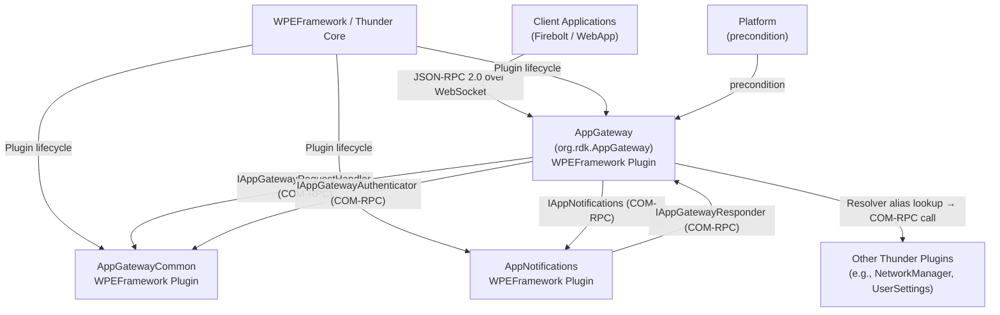
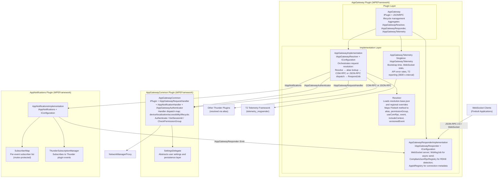
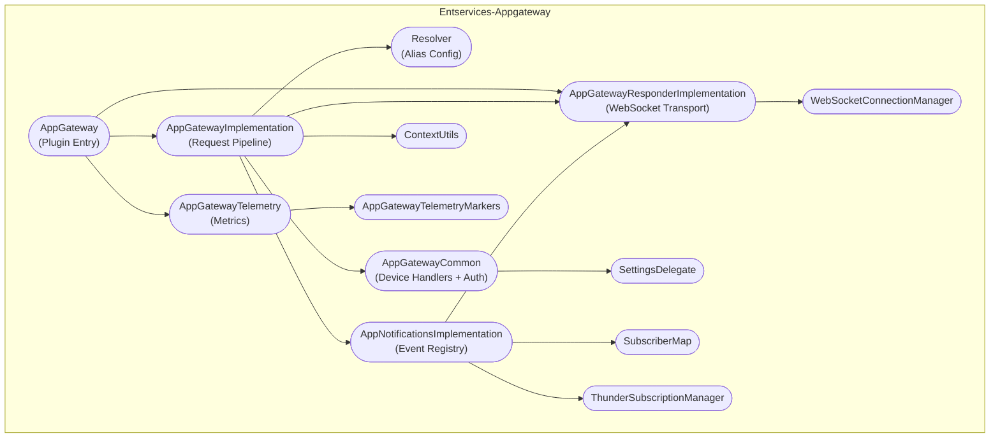

# Entservices-Appgateway

---

## Overview

Entservices-Appgateway is a WPEFramework (Thunder) plugin repository that provides the Firebolt gateway implementation for the RDK-E middleware stack. It replaces the Ripple Gateway component in the RDK Apps Managers Framework and acts as the translation layer between Firebolt API requests arriving from applications over WebSocket and the Thunder plugin ecosystem reachable via COM-RPC Exchange interfaces. The repository contains three separately buildable plugins — AppGateway, AppGatewayCommon, and AppNotifications — each with distinct responsibilities in the request lifecycle.

At the device level, AppGateway is the single network-facing entry point for Firebolt-speaking client applications. It accepts JSON-RPC 2.0 messages over WebSocket, resolves each method name against a configurable alias map, routes the resolved request to the appropriate Thunder plugin via COM-RPC, and dispatches the response back to the originating WebSocket connection. It also handles event subscription management, allowing applications to receive push notifications for device state changes, and enforces permission group checks on write operations.

At the module level, AppGatewayCommon implements the handler functions for device information, localization, accessibility, voice guidance, closed captions, audio descriptions, lifecycle signaling, and network status queries. It also provides the `IAppGatewayAuthenticator` COM-RPC interface, supplying session-based authentication to AppGateway. AppNotifications manages the subscriber registry for all event keys and coordinates with Thunder's notification system to fan out incoming events to registered WebSocket clients.



**Key Features & Responsibilities:**

- **Firebolt API gateway**: Accepts JSON-RPC 2.0 requests from applications over WebSocket and routes them to the correct Thunder plugin using a JSON-defined alias resolution map.
- **Method alias resolution**: The Resolver component loads one or more JSON configuration files that map Firebolt method names to Thunder plugin callsigns, handling COM-RPC and JSON-RPC forwarding paths, permission group enforcement, and optional context inclusion.
- **Dual Firebolt version support**: Supports Legacy Firebolt (version `"0"`) and RDK8 Firebolt (version `"8"`). RDK8 compliance is detected via the `RPCV2=true` parameter in the WebSocket connection URL; versioned event names use a `.v8` suffix.
- **Event subscription management**: AppNotifications maintains a subscriber map keyed by event name; it subscribes to Thunder plugin events and dispatches notifications to all registered WebSocket clients.
- **Session-based authentication and permission groups**: AppGatewayCommon implements `IAppGatewayAuthenticator`, providing `Authenticate`, `GetSessionId`, and `CheckPermissionGroup` operations consumed by AppGateway during request processing.
- **Common device API handling**: AppGatewayCommon handles device information, localization, accessibility, user settings, lifecycle signaling, and network status through a static handler dispatch map.
- **Telemetry aggregation**: AppGatewayTelemetry is a singleton that tracks bootstrap timing, WebSocket connection counts, per-API call/error rates, and external service errors. It reports at a configured interval (default 3600 s) via the T2 telemetry framework.
- **Regional resolution configuration**: Resolution files are selected by country code from a regional configuration file, with fallback to a base resolution file when no country-specific paths are found.

---

## Architecture

### High-Level Architecture

AppGateway is structured as three cooperating Thunder plugins that communicate internally via COM-RPC Exchange interfaces. AppGateway is the only plugin with a public network surface; it owns the WebSocket server and the JSON-RPC dispatch loop. AppGatewayCommon and AppNotifications are loaded as out-of-process COM-RPC servers that AppGateway reaches by querying the Thunder shell for their Exchange interfaces. This separation keeps the gateway's network-facing logic decoupled from device API implementations, so each plugin can be updated or replaced independently.

The northbound boundary consists of WebSocket connections from Firebolt-speaking applications. A `WebSocketConnectionManager` maintains persistent channels identified by a connection ID. Each incoming JSON-RPC message is associated with a `GatewayContext` that carries the connection ID, application ID, origin, and Firebolt version. The southbound boundary is formed by COM-RPC calls to Exchange interfaces exposed by AppGatewayCommon (`IAppGatewayRequestHandler`, `IAppGatewayAuthenticator`) and AppNotifications (`IAppNotifications`), as well as direct COM-RPC or JSON-RPC calls forwarded to other Thunder plugins whose callsigns appear in the resolution alias map.

IPC is handled through two mechanisms. COM-RPC (WPEFramework Exchange interface pattern) is used for all intra-plugin communication — AppGateway holds lazy-acquired interface pointers to AppGatewayCommon and AppNotifications, protected by `Core::CriticalSection` locks. JSON-RPC over WebSocket is used for the Firebolt application-facing protocol; the `AppGatewayResponderImplementation` owns the WebSocket server and dispatches outbound messages asynchronously via `Core::IDispatch` jobs.

No persistent data storage is implemented within any of the three plugins. Resolution configuration files on the filesystem are read during plugin initialization and held in memory; there are no runtime write-back operations. The `AppGatewayTelemetry` singleton accumulates metrics in memory and emits them at the configured reporting interval without persisting them to storage.

A component diagram showing the internal structure and dependencies is given below:

```mermaid
graph TD
    subgraph AppGatewayPlugin ["AppGateway (WPEFramework Plugin — org.rdk.AppGateway)"]
        AGMain["AppGateway\nIPlugin + JSONRPC\nEntry point, plugin lifecycle"]
        AGImpl["AppGatewayImplementation\nIAppGatewayResolver + IConfiguration\nRequest resolution orchestration"]
        AGResp["AppGatewayResponderImplementation\nIAppGatewayResponder + IConfiguration\nWebSocket connection management and response dispatch"]
        Resolver["Resolver\nJSON alias config loader\nMaps Firebolt method → Thunder callsign"]
        AGTel["AppGatewayTelemetry\nIAppGatewayTelemetry singleton\nMetrics collection and T2 reporting"]
    end

    subgraph AppGatewayCommonPlugin ["AppGatewayCommon (WPEFramework Plugin)"]
        AGC["AppGatewayCommon\nIPlugin + IAppGatewayRequestHandler\n+ IAppNotificationHandler + IAppGatewayAuthenticator\nDevice/localization/lifecycle handlers; authentication"]
        SettingsDelegate["SettingsDelegate\nAbstracts UserSettings / persistence calls"]
    end

    subgraph AppNotificationsPlugin ["AppNotifications (WPEFramework Plugin)"]
        ANImpl["AppNotificationsImplementation\nIAppNotifications + IConfiguration\nEvent subscription registry and fan-out"]
        SubMap["SubscriberMap\nmutex-protected subscriber registry per event key"]
        ThunderSubMgr["ThunderSubscriptionManager\nSubscribes/unsubscribes to Thunder plugin events"]
    end

    subgraph Helpers ["Shared Helpers"]
        CtxUtils["ContextUtils\nGatewayContext ↔ AppNotificationContext conversion;\nFirebolt version handling"]
        WsMgr["WebSocketConnectionManager\nPersistent WebSocket channels; JSONObjectFactory"]
        Logging["UtilsLogging\nLOGDBG/LOGINFO/LOGWARN/LOGERR macros"]
        RFCUtil["UtilsgetRFCConfig\nRFC parameter reads via getRFCParameter()"]
        TelMarkers["AppGatewayTelemetryMarkers\nT2 marker macros"]
    end

    subgraph ExternalSystems ["External"]
        WS["WebSocket Client\n(Firebolt Application)"]
        OtherPlugins["Other Thunder Plugins\n(resolved via alias map)"]
        T2["T2 Telemetry\n(telemetry_msgsender)"]
        RFC["RFC Parameter Service\n(getRFCParameter)"]
        NMProxy["NetworkManagerProxy\n(WPEFrameworkNetworkManagerProxy)"]
    end

    WS -->|"JSON-RPC 2.0 over WebSocket"| AGResp
    AGMain -->|"Aggregates"| AGImpl
    AGMain -->|"Aggregates"| AGResp
    AGMain -->|"Aggregates"| AGTel
    AGImpl -->|"Uses"| Resolver
    AGImpl -->|"IAppGatewayResponder (COM-RPC)"| AGResp
    AGImpl -->|"IAppGatewayAuthenticator (COM-RPC)"| AGC
    AGImpl -->|"IAppGatewayRequestHandler (COM-RPC)"| AGC
    AGImpl -->|"IAppNotifications (COM-RPC)"| ANImpl
    ANImpl -->|"Contains"| SubMap
    ANImpl -->|"Contains"| ThunderSubMgr
    ANImpl -->|"IAppGatewayResponder (COM-RPC)"| AGResp
    AGC -->|"Uses"| SettingsDelegate
    AGC -->|"Uses"| NMProxy
    AGImpl -->|"Resolves alias → COM-RPC or JSON-RPC"| OtherPlugins
    AGTel -->|"T2 markers"| T2
    RFCUtil -->|"reads"| RFC
    CtxUtils --- AGImpl
    WsMgr --- AGResp
    Logging --- AGImpl
    Logging --- AGC
    TelMarkers --- AGTel
```



### Threading Model

- **Threading Architecture**: Multi-threaded; the WPEFramework COM-RPC and WebSocket machinery provide the base thread pool. Plugin logic dispatches work items via `Core::IDispatch`.
- **Main Thread**: Plugin initialization, `IPlugin::Initialize` / `IPlugin::Deinitialize`, and synchronous COM-RPC method invocations from the Thunder COM-RPC thread pool.
- **Async Dispatch Jobs**:
  - _`RespondJob`_ (in `AppGatewayImplementation`): Posts a resolved response to the originating WebSocket or LaunchDelegate. Selects the gateway responder or internal responder based on `ContextUtils::IsOriginGateway()`.
  - _`WsMsgJob`_ (in `AppGatewayResponderImplementation`): Sends a WebSocket message asynchronously without blocking the calling COM-RPC thread.
  - _`EventRegistrationJob`_ (in `AppGatewayCommon`): Registers Thunder plugin event handlers asynchronously during plugin activation.
- **Synchronization**: `Core::CriticalSection` guards lazy-acquired interface pointers: `mAppNotificationsLock`, `mAppGatewayResponderLock`, `mInternalGatewayResponderLock`, `mAuthenticatorLock` in `AppGatewayImplementation`; the `SubscriberMap` in `AppNotificationsImplementation` uses a `std::mutex`.
- **Async / Event Dispatch**: Incoming Thunder plugin events are received on the Thunder notification thread; `ThunderSubscriptionManager` forwards them to `AppNotificationsImplementation`, which dispatches to all registered `AppNotificationContext` entries — either via `IAppGatewayResponder::Emit` (gateway path) or the internal responder (LaunchDelegate path).

---

## Design

AppGateway is designed as a protocol bridge that keeps policy (what method maps to what plugin), transport (WebSocket), and device logic (actual handler implementations) in separate, independently replaceable layers. The Resolver owns policy by loading JSON alias maps at startup; the AppGatewayResponderImplementation owns transport by managing WebSocket channels; AppGatewayCommon owns device logic by implementing handler functions. AppGateway's implementation class orchestrates interactions between all three without embedding any policy, transport, or device-specific knowledge itself.

The northbound interface is a JSON-RPC 2.0 WebSocket server. Client applications connect with a URL that may include `RPCV2=true` to signal RDK8 Firebolt compliance; the `CompliantJsonRpcRegistry` inside `AppGatewayResponderImplementation` records this per connection ID. When processing a request, `AppGatewayImplementation::Resolve` looks up the method in the Resolver, determines whether to route via COM-RPC (`useComRpc: true`) or JSON-RPC (`useComRpc: false`), and invokes either `IAppGatewayRequestHandler::HandleAppGatewayRequest` (COM-RPC path to AppGatewayCommon or another plugin) or `Resolver::CallThunderPlugin` (JSON-RPC path). The response is returned to the caller's WebSocket via a `RespondJob`.

The southbound interface is COM-RPC toward AppGatewayCommon (`IAppGatewayRequestHandler`, `IAppGatewayAuthenticator`), AppNotifications (`IAppNotifications`), and other Thunder plugins whose callsigns appear in the resolution alias map. Interface pointers are acquired lazily from the Thunder shell and cached under `Core::CriticalSection` locks. No IARM bus events or IARM bus calls are present in any plugin in this repository.

No persistent data storage is implemented. All configuration is read from JSON files on the filesystem at startup. The `AppGatewayTelemetry` singleton accumulates call counts and error rates in memory; these are not written to persistent storage between sessions.

### Component Diagram



---

## Internal Modules

| Module / Class                      | Description                                                                                                                                                                                                                                                                                                                                                                                                                                                                                                                                                                                                                                                                                                                                                                                                                                                               | Key Files                                                                                                  |
| ----------------------------------- | ------------------------------------------------------------------------------------------------------------------------------------------------------------------------------------------------------------------------------------------------------------------------------------------------------------------------------------------------------------------------------------------------------------------------------------------------------------------------------------------------------------------------------------------------------------------------------------------------------------------------------------------------------------------------------------------------------------------------------------------------------------------------------------------------------------------------------------------------------------------------- | ---------------------------------------------------------------------------------------------------------- |
| `AppGateway`                        | Thunder plugin entry point. Implements `IPlugin` and `JSONRPC`. Aggregates `IAppGatewayResolver`, `IAppGatewayResponder`, and `IAppGatewayTelemetry` through `INTERFACE_AGGREGATE`. Manages plugin lifecycle (`Initialize` / `Deinitialize`) and monitors remote COM-RPC connection status via `Deactivated(RPC::IRemoteConnection*)`. Callsign: `org.rdk.AppGateway`.                                                                                                                                                                                                                                                                                                                                                                                                                                                                                                    | `AppGateway/AppGateway.h`, `AppGateway/AppGateway.cpp`                                                     |
| `AppGatewayImplementation`          | Implements `IAppGatewayResolver` and `IConfiguration`. Owns the request resolution pipeline: receives a `GatewayContext`, origin, method, and params from the responder; looks up the alias in the `Resolver`; dispatches via COM-RPC (`IAppGatewayRequestHandler`) or JSON-RPC (`Resolver::CallThunderPlugin`); posts the result via `RespondJob`. Holds lazy-acquired interface pointers to AppGatewayCommon and AppNotifications under `Core::CriticalSection` locks. Manages regional resolution configuration loading from `/etc/app-gateway/resolutions.json` and country-based path selection.                                                                                                                                                                                                                                                                     | `AppGateway/AppGatewayImplementation.h`, `AppGateway/AppGatewayImplementation.cpp`                         |
| `AppGatewayResponderImplementation` | Implements `IAppGatewayResponder` and `IConfiguration`. Owns the WebSocket server via `WebSocketConnectionManager`. Provides `Respond`, `Emit`, `Request`, `GetGatewayConnectionContext`, and `RecordGatewayConnectionContext` methods. Maintains `AppIdRegistry` for per-connection metadata and `CompliantJsonRpcRegistry` for RDK8 detection. Dispatches outbound WebSocket messages asynchronously via `WsMsgJob : Core::IDispatch`.                                                                                                                                                                                                                                                                                                                                                                                                                                  | `AppGateway/AppGatewayResponderImplementation.h`, `AppGateway/AppGatewayResponderImplementation.cpp`       |
| `Resolver`                          | Loads JSON resolution configuration files and maintains an in-memory alias map. Each entry maps a Firebolt method name to a `Resolution` struct containing: `alias` (Thunder callsign), `event`, `permissionGroup`, `additionalContext`, `includeContext`, `useComRpc`, `versionedEvent`. Provides `ResolveAlias`, `CallThunderPlugin`, `HasComRpcRequestSupport`, `HasEvent`, `HasIncludeContext`, `HasPermissionGroup`, and `IsVersionedEvent` queries. Later-loaded config files override earlier entries.                                                                                                                                                                                                                                                                                                                                                             | `AppGateway/Resolver.h`, `AppGateway/Resolver.cpp`                                                         |
| `AppGatewayTelemetry`               | Singleton implementing `IAppGatewayTelemetry`. Collects bootstrap time, WebSocket connection counts, total/successful/failed API call counts, per-API error stats, and external service error stats. Reports at a configurable interval (default 3600 s) in `JSON` or `COMPACT` (CSV) format via T2 telemetry markers. Default cache threshold: 1000 records.                                                                                                                                                                                                                                                                                                                                                                                                                                                                                                             | `AppGateway/AppGatewayTelemetry.h`, `AppGateway/AppGatewayTelemetry.cpp`                                   |
| `AppGatewayCommon`                  | Thunder plugin implementing `IPlugin`, `IAppGatewayRequestHandler`, `IAppNotificationHandler`, and `IAppGatewayAuthenticator`. Dispatches incoming method calls through a static `unordered_map<string, HandlerFunction>` keyed by Firebolt method name. Handler categories: device (make, name, setName, sku), localization (countryCode, timeZone, language, locale, preferredAudioLanguages), accessibility (closedCaptions, audioDescriptions, highContrastUI), voice guidance, user settings, network (internet connection status), and lifecycle (Ready, Finished, Close, State). Provides `Authenticate`, `GetSessionId`, `CheckPermissionGroup` for the authenticator interface. Uses `SettingsDelegate` for underlying data access and `WPEFrameworkNetworkManagerProxy` for network status. Registers event handlers asynchronously via `EventRegistrationJob`. | `AppGatewayCommon/AppGatewayCommon.h`, `AppGatewayCommon/AppGatewayCommon.cpp`                             |
| `SettingsDelegate`                  | Abstracts the access to user-facing settings and persistence within AppGatewayCommon. Used by handler functions in `AppGatewayCommon` to read and write settings values.                                                                                                                                                                                                                                                                                                                                                                                                                                                                                                                                                                                                                                                                                                  | `AppGatewayCommon/delegate/`                                                                               |
| `AppNotificationsImplementation`    | Implements `IAppNotifications` and `IConfiguration`. Owns the `SubscriberMap` and `ThunderSubscriptionManager`. Provides `Subscribe` and `Unsubscribe` for event keys and dispatches incoming Thunder events to registered WebSocket clients via `IAppGatewayResponder::Emit` (gateway path) or the internal LaunchDelegate responder. Performs `CleanupNotifications` when a connection closes.                                                                                                                                                                                                                                                                                                                                                                                                                                                                          | `AppNotifications/AppNotificationsImplementation.h`, `AppNotifications/AppNotificationsImplementation.cpp` |
| `SubscriberMap`                     | Mutex-protected `map<string, vector<AppNotificationContext>>` held inside `AppNotificationsImplementation`. Maps event keys to lists of subscriber contexts (each carrying connection ID, app ID, and origin). Provides `Add`, `Remove`, `Get`, `Exists`, `EventUpdate`, `Dispatch`, `DispatchToGateway`, and `DispatchToLaunchDelegate` operations.                                                                                                                                                                                                                                                                                                                                                                                                                                                                                                                      | `AppNotifications/AppNotificationsImplementation.h`                                                        |
| `ThunderSubscriptionManager`        | Inner class of `AppNotificationsImplementation`. Calls `Subscribe(module, event)` and `Unsubscribe(module, event)` on Thunder plugins, creating notification handler objects that forward events into `AppNotificationsImplementation`.                                                                                                                                                                                                                                                                                                                                                                                                                                                                                                                                                                                                                                   | `AppNotifications/AppNotificationsImplementation.h`                                                        |
| `ContextUtils`                      | Converts between `Exchange::GatewayContext` and `Exchange::IAppNotifications::AppNotificationContext`. Provides `IsOriginGateway`, `IsRDK8Compliant`, `GetEventNameFromContextBasedonVersion`, and `GetRDK8VersionedEventName`. Defines version constants `LEGACY_FIREBOLT_VERSION="0"`, `RDK8_FIREBOLT_VERSION="8"`, and `RDK8_SUFFIX=".v8"`.                                                                                                                                                                                                                                                                                                                                                                                                                                                                                                                            | `helpers/ContextUtils.h`                                                                                   |
| `WebSocketConnectionManager`        | Manages persistent WebSocket channels for the AppGatewayResponderImplementation. Config JSON container includes `Connector` field (default `"127.0.0.1"`). Contains `WebSocketChannel` and `JSONObjectFactory` (FactoryType singleton for JSON-RPC JSON object pooling).                                                                                                                                                                                                                                                                                                                                                                                                                                                                                                                                                                                                  | `helpers/WsManager.h`                                                                                      |
| `AppGatewayTelemetryMarkers`        | Defines T2 marker name constants following the pattern `AppGw<Category><Type>_split`, unit string constants (`ms`, `sec`, `count`, `bytes`, `KB`, `MB`, `kbps`, `Mbps`, `percent`), and helper macros `AGW_REPORT_API_ERROR`, `AGW_REPORT_EXTERNAL_SERVICE_ERROR`, `AGW_REPORT_API_LATENCY`, `AGW_REPORT_SERVICE_LATENCY`.                                                                                                                                                                                                                                                                                                                                                                                                                                                                                                                                                | `helpers/AppGatewayTelemetryMarkers.h`                                                                     |



---

## Prerequisites & Dependencies

**Documentation Verification Checklist:**

- [x] **Thunder / WPEFramework APIs**: `IPlugin`, `JSONRPC`, `IConfiguration`, and Exchange interfaces (`IAppGatewayResolver`, `IAppGatewayResponder`, `IAppGatewayTelemetry`, `IAppGatewayRequestHandler`, `IAppNotificationHandler`, `IAppGatewayAuthenticator`, `IAppNotifications`) confirmed implemented in source.
- [x] **IARM Bus**: No `IARM_Bus_RegisterEventHandler` or `IARM_Bus_Call` calls found in any source file. IARM bus is not used in this repository.
- [x] **Device Services (DS) APIs**: No DS API calls found. Device data is accessed through AppGatewayCommon handler functions via `SettingsDelegate` and `WPEFrameworkNetworkManagerProxy`.
- [x] **Persistent store**: No store read/write calls found. Configuration is read from filesystem JSON files at startup; no runtime persistence.
- [x] **Systemd services**: No systemd service file found in this repository.
- [x] **Configuration files**: `/etc/app-gateway/resolution.base.json` and `/etc/app-gateway/resolutions.json` are opened and parsed by `AppGatewayImplementation::InitializeResolver()`.

### RDK-E Platform Requirements

- **Build Dependencies**:

| Library                           | Consumer Plugin                                | Notes                                                              |
| --------------------------------- | ---------------------------------------------- | ------------------------------------------------------------------ |
| `WPEFrameworkPlugins`             | AppGateway, AppGatewayCommon, AppNotifications | Required for all three plugins                                     |
| `WPEFrameworkDefinitions`         | AppGateway, AppGatewayCommon, AppNotifications | Required for all three plugins                                     |
| `CompileSettingsDebug`            | AppGateway, AppGatewayCommon, AppNotifications | Debug compile settings                                             |
| `uuid`                            | AppGatewayCommon                               | Session/UUID generation                                            |
| `telemetry_msgsender`             | AppGateway                                     | Optional; enabled by `BUILD_ENABLE_TELEMETRY_LOGGING` CMake option |
| `WPEFrameworkNetworkManagerProxy` | AppGatewayCommon                               | Network status queries                                             |
| `rfcapi`                          | All (via `UtilsgetRFCConfig.h`)                | RFC parameter reads via `getRFCParameter()`                        |

- **C++ Standard**: C++11 (`CXX_STANDARD 11`), enforced for all three plugin CMakeLists files.
- **RDK-E Plugin Dependencies**: AppGateway has `precondition = ["Platform"]` in its `.conf` file. AppGatewayCommon and AppNotifications are loaded as COM-RPC out-of-process services by AppGateway; they must be available in the Thunder plugin search path.
- **IARM Bus**: Not used. No IARM dependency.
- **Systemd Services**: No `.service` file is present in this repository.
- **Configuration Files**:

| File                                    | Consumer                    | Purpose                                                                                                |
| --------------------------------------- | --------------------------- | ------------------------------------------------------------------------------------------------------ |
| `/etc/app-gateway/resolution.base.json` | `AppGatewayImplementation`  | Default base resolution alias map; loaded when no country-specific paths are found                     |
| `/etc/app-gateway/resolutions.json`     | `AppGatewayImplementation`  | Regional resolution configuration; maps country codes to ordered lists of resolution config file paths |
| `${BUILD_CONFIG_PATH}`                  | `AppGatewayImplementation`  | Build-time config path defined via CMake; used to read the device country code                         |
| `${VENDOR_CONFIG_PATH}`                 | `AppGateway/CMakeLists.txt` | Vendor-specific resolution override path; defined at build time                                        |

- **Startup Order**: AppGateway `autostart` defaults to `false`; startup order is configurable via CMake variables `PLUGIN_APPGATEWAY_AUTOSTART` and `PLUGIN_APPGATEWAY_STARTUPORDER`.

### Optional Build Flags

| CMake Option                     | Effect                                                                          |
| -------------------------------- | ------------------------------------------------------------------------------- |
| `PLUGIN_APPGATEWAY`              | Enables the AppGateway plugin build                                             |
| `PLUGIN_APPNOTIFICATIONS`        | Enables the AppNotifications plugin build                                       |
| `PLUGIN_APPGATEWAYCOMMON`        | Enables the AppGatewayCommon plugin build                                       |
| `BUILD_ENABLE_TELEMETRY_LOGGING` | Adds `-DENABLE_TELEMETRY_LOGGING` and links `telemetry_msgsender` to AppGateway |
| `DISABLE_SECURITY_TOKEN`         | Adds `-DDISABLE_SECURITY_TOKEN`; disables security token validation             |
| `USE_THUNDER_R4`                 | Adds `-DUSE_THUNDER_R4` for Thunder R4 compatibility                            |
| `ENABLE_FIREBOLT_TEXTTRACK`      | Adds `-DENABLE_FIREBOLT_TEXTTRACK` to AppGatewayCommon                          |
| `ENABLE_APP_GATEWAY_AUTOMATION`  | Enables automation test build in AppGateway                                     |
| `RDK_SERVICES_L1_TEST`           | Builds L1 tests from `Tests/L1Tests`                                            |
| `RDK_SERVICE_L2_TEST`            | Builds L2 tests from `Tests/L2Tests`                                            |

---

## Configuration

### Configuration Priority

Resolution configuration loading follows this precedence order (lowest to highest):

1. Compiled-in default path: `DEFAULT_CONFIG_PATH` = `/etc/app-gateway/resolution.base.json`
2. Regional configuration from `/etc/app-gateway/resolutions.json` — selects country-specific paths based on `defaultCountryCode`
3. Country-specific resolution files identified by the device country code read from `BUILD_CONFIG_PATH`
4. Runtime override via `IAppGatewayResolver::Configure(IStringIterator* paths)` — later paths override earlier entries

### Key Configuration Files

| Configuration File                      | Purpose                                                                                                               | Notes                                                              |
| --------------------------------------- | --------------------------------------------------------------------------------------------------------------------- | ------------------------------------------------------------------ |
| `/etc/app-gateway/resolution.base.json` | Base Firebolt-to-Thunder alias map; used as fallback when regional config is absent or country not matched            | Parsed by `Resolver::LoadConfig`                                   |
| `/etc/app-gateway/resolutions.json`     | Regional resolution config; JSON with `defaultCountryCode` and `regions[]` (each with `countryCodes[]` and `paths[]`) | Parsed by `RegionalResolutionConfig` in `AppGatewayImplementation` |
| `${BUILD_CONFIG_PATH}`                  | Platform-specific config path set at build time; read to determine device country code for regional path selection    | Set via CMake `-DBUILD_CONFIG_PATH`                                |

### Resolution Configuration Format

Resolution config files use the following JSON schema:

```json
{
  "resolutions": {
    "<firebolt.method>": {
      "alias": "<thunder-callsign>",
      "useComRpc": true,
      "permissionGroup": "<optional-permission-group>",
      "event": "<optional-event-name>",
      "includeContext": false,
      "additionalContext": {},
      "versionedEvent": false
    }
  }
}
```

Example entries from the base resolution file:

```json
{
  "resolutions": {
    "device.make": {
      "alias": "org.rdk.AppGatewayCommon",
      "useComRpc": true
    },
    "device.setName": {
      "alias": "org.rdk.AppGatewayCommon",
      "useComRpc": true,
      "permissionGroup": "org.rdk.permission.group.enhanced"
    },
    "localization.countryCode": {
      "alias": "org.rdk.AppGatewayCommon",
      "useComRpc": true
    }
  }
}
```

### Regional Resolution Configuration Format

```json
{
  "defaultCountryCode": "<country-code>",
  "regions": [
    {
      "countryCodes": ["<code1>", "<code2>"],
      "paths": [
        "/path/to/resolution.base.json",
        "/path/to/resolution.override.json"
      ]
    }
  ]
}
```

### Runtime Configuration

Resolution configuration can be reloaded at runtime by calling `IAppGatewayResolver::Configure` with a new set of paths. This is the COM-RPC interface exposed by `AppGatewayImplementation`. Later paths in the list override earlier entries.

### Configuration Persistence

Configuration changes are not persisted across reboots. All resolution data is loaded from filesystem files at plugin initialization and held in memory.

---

## API / Usage

### Interface Type

The AppGateway system exposes two interface types:

1. **JSON-RPC 2.0 over WebSocket** — the Firebolt application-facing protocol. Applications connect to the WebSocket server managed by `AppGatewayResponderImplementation`. RDK8-compliant applications append `RPCV2=true` to the connection URL.
2. **COM-RPC Exchange interfaces** — used for all intra-plugin communication between AppGateway, AppGatewayCommon, and AppNotifications.

### WebSocket Connection

Applications connect via WebSocket:

```
ws://<gateway-host>:<port>/appgateway
```

For RDK8 Firebolt compliance (version 8), include the `RPCV2=true` parameter:

```
ws://<gateway-host>:<port>/appgateway?session=<session-token>&RPCV2=true
```

### JSON-RPC 2.0 Request Format

```json
{
  "jsonrpc": "2.0",
  "id": 1,
  "method": "device.name",
  "params": {}
}
```

### JSON-RPC 2.0 Response (Success)

```json
{
  "jsonrpc": "2.0",
  "id": 1,
  "result": {
    "name": "My Device"
  }
}
```

### JSON-RPC 2.0 Response (Error)

```json
{
  "jsonrpc": "2.0",
  "id": 1,
  "error": {
    "code": -32603,
    "message": "Internal error"
  }
}
```

### Event Subscription

Subscribe to events by appending `.listen` to the method name:

```json
{
  "jsonrpc": "2.0",
  "id": 2,
  "method": "device.nameChanged.listen",
  "params": { "listen": true }
}
```

### Handled Method Categories

The following Firebolt method categories are handled by the base resolution configuration, all routed via COM-RPC to `org.rdk.AppGatewayCommon`:

| Category           | Example Methods                                                                                                                                                                                                                                                             |
| ------------------ | --------------------------------------------------------------------------------------------------------------------------------------------------------------------------------------------------------------------------------------------------------------------------- |
| Device Information | `device.make`, `device.name`, `device.setName`, `device.sku`                                                                                                                                                                                                                |
| Localization       | `localization.countryCode`, `localization.setCountryCode`, `localization.timeZone`, `localization.setTimeZone`, `localization.language`, `localization.locale`, `localization.setLocale`, `localization.preferredAudioLanguages`, `localization.setPreferredAudioLanguages` |
| Accessibility      | `accessibility.closedCaptions`, `accessibility.closedCaptionsSettings`, `accessibility.audioDescriptionSettings`, `accessibility.highContrastUI`                                                                                                                            |
| Voice Guidance     | `voiceguidance.setEnabled`, `voiceguidance.setSpeed`                                                                                                                                                                                                                        |
| Closed Captions    | `closedcaptions.enabled`, `closedcaptions.setEnabled`                                                                                                                                                                                                                       |
| Audio Descriptions | `audiodescriptions.enabled`, `audiodescriptions.setEnabled`                                                                                                                                                                                                                 |
| Lifecycle          | `lifecycle.ready`, `lifecycle.finished`, `lifecycle.close`, `lifecycle.state`                                                                                                                                                                                               |

Methods marked with `permissionGroup: "org.rdk.permission.group.enhanced"` require the application to be a member of that permission group. Authentication and permission checking is performed by `AppGatewayCommon` via the `IAppGatewayAuthenticator` interface.

### COM-RPC Exchange Interfaces

| Interface                   | Implementor                         | Consumers                                                    | Purpose                                                          |
| --------------------------- | ----------------------------------- | ------------------------------------------------------------ | ---------------------------------------------------------------- |
| `IAppGatewayResolver`       | `AppGatewayImplementation`          | `AppGateway` (plugin)                                        | Resolve Firebolt API requests; dynamic resolution config loading |
| `IAppGatewayResponder`      | `AppGatewayResponderImplementation` | `AppGatewayImplementation`, `AppNotificationsImplementation` | Send responses and events to WebSocket clients                   |
| `IAppGatewayTelemetry`      | `AppGatewayTelemetry`               | `AppGateway` (plugin), external plugins                      | Record telemetry events and metrics                              |
| `IAppGatewayRequestHandler` | `AppGatewayCommon`                  | `AppGatewayImplementation`                                   | Handle resolved Firebolt method calls                            |
| `IAppNotificationHandler`   | `AppGatewayCommon`                  | `AppNotificationsImplementation`                             | Handle incoming event notifications                              |
| `IAppGatewayAuthenticator`  | `AppGatewayCommon`                  | `AppGatewayImplementation`                                   | Authenticate sessions and check permission groups                |
| `IAppNotifications`         | `AppNotificationsImplementation`    | `AppGatewayImplementation`                                   | Subscribe/unsubscribe to events; dispatch notifications          |

### RDK8 vs Legacy Firebolt Version Handling

| Aspect                   | Legacy (Version `"0"`)                                | RDK8 (Version `"8"`)                                                                                              |
| ------------------------ | ----------------------------------------------------- | ----------------------------------------------------------------------------------------------------------------- |
| Detection                | Default for connections without `RPCV2=true`          | WebSocket URL contains `RPCV2=true`                                                                               |
| Event name format        | Base event name (e.g., `TextToSpeech.onVoiceChanged`) | Base name for dispatch; `.v8` suffix (e.g., `TextToSpeech.onVoiceChanged.v8`) used for internal subscription keys |
| Subscription key storage | Base event name                                       | Versioned name with `.v8` suffix                                                                                  |

---

## Version

Initial release version: `0.1.0` (released 2025-12-23). All three plugin modules (`WPEFrameworkAppGateway`, `WPEFrameworkAppGatewayCommon`, `WPEFrameworkAppNotifications`) are versioned `1.0.0` in their respective CMakeLists files. Licensed under the Apache License, Version 2.0.
