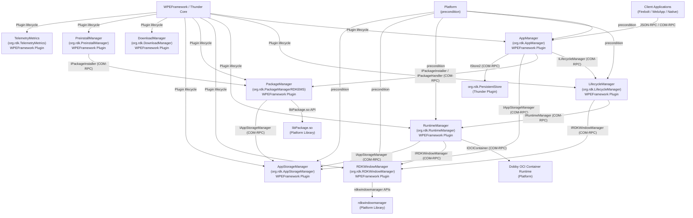
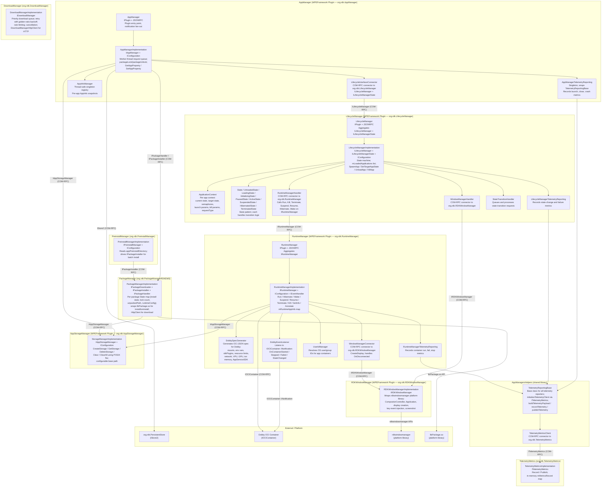
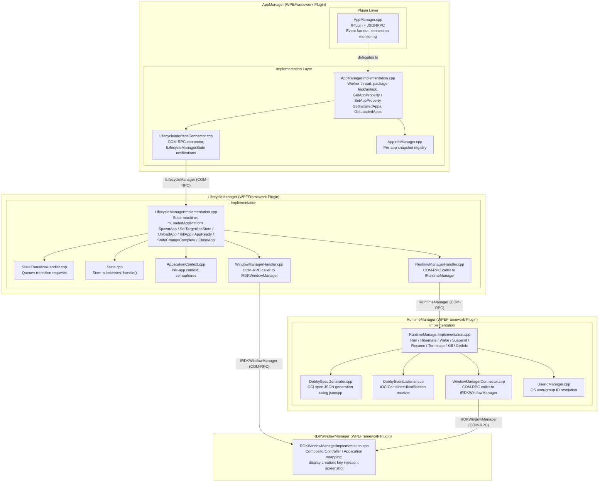
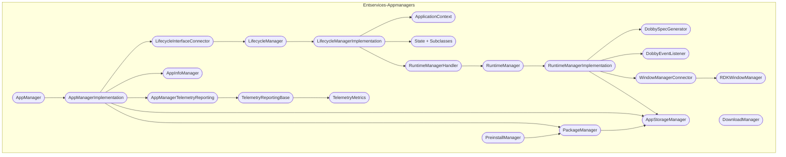

# Entservices-Appmanagers

---

## Overview

Entservices-Appmanagers is a WPEFramework (Thunder) plugin repository that provides the application management infrastructure for RDK-based set-top boxes and streaming devices. The repository contains nine separately buildable plugins — AppManager, LifecycleManager, RuntimeManager, RDKWindowManager, AppStorageManager, PackageManager, DownloadManager, PreinstallManager, and TelemetryMetrics — along with a shared `AppManagersHelpers` static library. Each plugin addresses a distinct concern in the application management stack, and they cooperate exclusively through COM-RPC Exchange interfaces. The repository is extracted from the `entservices-infra` monorepo.

At the device level, this suite handles the end-to-end lifecycle of applications on the device: discovering installable packages, downloading and installing them to persistent storage, allocating filesystem quota for each app, launching apps inside OCI containers through Dobby, controlling display surfaces through the RDK Window Manager, transitioning apps through defined lifecycle states (Unloaded → Loading → Initializing → Paused → Active → Suspended → Hibernated → Terminated), and collecting telemetry metrics for all those operations.

At the module level, AppManager is the single external-facing Thunder plugin that clients interact with via JSON-RPC or COM-RPC. It delegates to LifecycleManager for state machine transitions, which in turn delegates to RuntimeManager for container orchestration and to RDKWindowManager for display surface management. PackageManager handles installation state and exposes it to AppManager via `IPackageInstaller` and `IPackageHandler`. AppStorageManager provides per-app filesystem quota management and is consumed by both AppManager and RuntimeManager. DownloadManager handles HTTP downloads with retry logic. PreinstallManager drives batch installations from a pre-determined directory. TelemetryMetrics collects and publishes per-event telemetry payloads through an interface available to all other plugins.

**Key Features & Responsibilities:**

- **Application launch, preload, close, terminate, kill, and suspend**: AppManager exposes `LaunchApp`, `PreloadApp`, `CloseApp`, `TerminateApp`, `KillApp` methods over its `IAppManager` Exchange interface. It queues requests to a worker thread and delegates execution to LifecycleManager via `LifecycleInterfaceConnector`.
- **Application lifecycle state machine**: LifecycleManager implements a state machine with states `UNLOADED`, `LOADING`, `INITIALIZING`, `PAUSED`, `ACTIVE`, `SUSPENDED`, `HIBERNATED`, and `TERMINATED`. Each application has an `ApplicationContext` holding the current state, target state, semaphores for synchronization, and launch parameters.
- **OCI container orchestration through Dobby**: RuntimeManager calls `IOCIContainer::Run`, `Hibernate`, `Wake`, `Suspend`, `Resume`, `Terminate`, and `Kill` on the Dobby OCI container plugin. It generates Dobby-compatible OCI spec JSON through `DobbySpecGenerator`, which constructs mount tables, RDK plugin sections, resource limits, environment variables, and network settings from `ApplicationConfiguration` and `RuntimeConfig`.
- **Display surface management**: RDKWindowManager wraps the `rdkwindowmanager` platform library to create and manage Wayland display surfaces per application instance. RuntimeManager connects to it through `WindowManagerConnector`, which implements `IRDKWindowManager`.
- **Package installation and lifecycle locking**: PackageManager implements `IPackageInstaller`, `IPackageDownloader`, and `IPackageHandler`. It wraps `libPackage.so` for the actual installation steps, maintains per-package install state and lock counts, and integrates with AppStorageManager to query storage paths.
- **Per-app filesystem quota management**: AppStorageManager implements `IAppStorageManager` and its `CreateStorage`, `GetStorage`, `DeleteStorage`, `Clear`, and `ClearAll` methods manage a configurable base storage path on the filesystem using POSIX file tree walk (`ftw`). It also queries `org.rdk.PersistentStore` via `IStore2` for storage metadata.
- **HTTP downloads with retry**: DownloadManager manages a download queue through `DownloadManagerHttpClient`. It uses a priority queue, per-download retry counts with exponential backoff (golden ratio), rate limiting, and cancellation.
- **Batch pre-installation**: PreinstallManager reads a configurable directory (`appPreinstallDirectory`) and drives package installations through `IPackageInstaller`. It reports completion via `IPreinstallManager` notifications.
- **Persistent property storage per app**: AppManager calls `IStore2::GetValue` and `IStore2::SetValue` on `org.rdk.PersistentStore` with `ScopeType::DEVICE` to implement `GetAppProperty` and `SetAppProperty`.
- **Telemetry collection and publishing**: All plugins use the `AppManagersHelpers` library (`TelemetryReportingBase`, `TelemetryMetricsClient`) to record and publish metrics via `ITelemetryMetrics` on `org.rdk.TelemetryMetrics`. Markers follow the `ENTS_INFO_RDKAM<Event>` pattern, covering download, install, launch, close, suspend, resume, hibernate, wake, and crash events.

---

## Architecture

### High-Level Architecture

All plugins are structured as a two-library pair per plugin: a thin `WPEFramework<PluginName>` shared library containing only the `IPlugin` and `JSONRPC` entry point, and a separate implementation shared library containing the business logic. The implementation library is loaded in a configurable process mode (`Off` for out-of-process, `Local` for in-process, or `Remote`). Inter-plugin communication happens exclusively through COM-RPC `QueryInterfaceByCallsign` calls on the Thunder shell, which returns typed Exchange interface pointers. These interface pointers are released in the destructor and re-acquired on demand; access is protected by `Core::CriticalSection`.

The northbound boundary is the `IAppManager` Exchange interface (and its corresponding JSON-RPC surface in the `AppManager` plugin). Client applications or other Thunder plugins call methods such as `LaunchApp`, `CloseApp`, `GetInstalledApps`, and `GetAppMetadata`. AppManager serializes these into a request queue processed by a dedicated worker thread. The southbound boundaries are: `ILifecycleManager` toward LifecycleManager, `IPackageHandler`/`IPackageInstaller` toward PackageManager, `IAppStorageManager` toward AppStorageManager, `IStore2` toward `org.rdk.PersistentStore`, and `ITelemetryMetrics` toward TelemetryMetrics.

IPC within the repository is entirely COM-RPC. No IARM bus calls (`IARM_Bus_RegisterEventHandler`, `IARM_Bus_Call`) were found in any production plugin source file. The `UtilsIarm.h` and `UtilsSynchroIarm.hpp` helpers are present in the `helpers/` directory and expose `IARM_Bus_Init` and `IARM_Bus_RegisterEventHandler` wrappers, but no plugin in this repository includes them in its production compilation units. Event notifications from Thunder plugins (e.g., OCI container events from Dobby, window manager events) are received over COM-RPC notification interfaces (`IOCIContainer::INotification`, `IRDKWindowManager::INotification`) and re-dispatched to LifecycleManager and RuntimeManager via their respective `IEventHandler` interface.

AppManager persists app properties by calling `IStore2::SetValue` and `IStore2::GetValue` on `org.rdk.PersistentStore` with `ScopeType::DEVICE`. AppStorageManager manages per-app storage directories under a configurable base path on the filesystem. No other persistent storage mechanism is implemented within this repository's plugins.

A component diagram showing the internal structure and dependencies is given below:

### Threading Model

- **Threading Architecture**: Multi-threaded. Each plugin runs its own thread(s) in addition to the WPEFramework COM-RPC thread pool.
- **AppManager Worker Thread**: A dedicated `std::thread` (`AppManagerWorkerThread`) processes the `mAppRequestList` queue. It waits on a `std::condition_variable` (`mAppRequestListCV`) and dequeues one `AppManagerRequest` at a time. It calls `LifecycleInterfaceConnector::launch` or `preLoadApp` after acquiring a package lock.
- **LifecycleManager dispatch**: Event dispatching uses `Core::IWorkerPool::Instance().Submit(Job::Create(...))`. The `Job` class inherits `Core::IDispatch` and its `Dispatch()` method calls `LifecycleManagerImplementation::Dispatch()`.
- **RuntimeManager dispatch**: Same `Core::IDispatch` / `Job` pattern used for OCI container events (`RUNTIME_MANAGER_EVENT_STATECHANGED`, `CONTAINERSTARTED`, `CONTAINERSTOPPED`, `CONTAINERFAILED`).
- **AppManager dispatch**: Same `Core::IDispatch` / `Job` pattern used for notification fan-out events (`APP_EVENT_LIFECYCLE_STATE_CHANGED`, `APP_EVENT_INSTALLATION_STATUS`, `APP_EVENT_LAUNCH_REQUEST`, `APP_EVENT_UNLOADED`).
- **RDKWindowManager shell thread**: `RDKWindowManagerImplementation` creates a `std::thread` named `shellThread` for the Wayland compositor run loop; display creation requests are posted via a shared vector and synchronized with a `sem_t` semaphore per `CreateDisplayRequest`.
- **DownloadManager downloader thread**: `DownloadManagerImplementation` runs a `downloaderRoutine` thread that processes the download queue, calling `DownloadManagerHttpClient` synchronously per job and sleeping between retries.
- **ApplicationContext semaphores**: `ApplicationContext` holds three `sem_t` semaphores (`mReachedLoadingStateSemaphore`, `mAppReadySemaphore`, `mFirstFrameAfterResumeSemaphore`) used between the LifecycleManager state machine thread and the thread waiting for a state milestone.
- **Synchronization**: `Core::CriticalSection mAdminLock` protects notification subscriber lists and interface pointer caches in AppManager, LifecycleManager, and RuntimeManager. `std::mutex` protects the `mAppRequestList` in AppManager. `AppInfoManager` documents a copy-update-swap strategy: the updater callback is invoked without the internal lock held; single-field setters acquire the lock atomically.
- **Async / Event Dispatch**: All notification callbacks from COM-RPC notification interfaces are invoked on the WPEFramework COM-RPC thread. They marshal data into a `JsonObject` or `JsonValue` and call `Core::IWorkerPool::Instance().Submit(Job::Create(...))` to avoid blocking the notification thread.

---

## Design

AppManager is designed as an orchestrator that holds no application logic itself — it translates JSON-RPC calls into a typed request queue, acquires package locks to prevent concurrent operations on the same app, and delegates every substantive action to a specialist plugin via a COM-RPC interface. This division allows each plugin to be versioned, deployed, or replaced independently. The plugin-to-plugin coupling is through Exchange interfaces only; plugins obtain interface pointers lazily using `QueryInterfaceByCallsign` and cache them under a `Core::CriticalSection`.

LifecycleManager implements the State pattern for application lifecycle management. Each loaded application is represented by an `ApplicationContext` object held in a `mLoadedApplications` list. The State pattern is realized through a class hierarchy (`UnloadedState`, `LoadingState`, `InitializingState`, `PausedState`, `ActiveState`, `SuspendedState`, `HibernatedState`, `TerminatedState`), each with a `handle(errorReason)` method that performs the transition-specific work and advances to the next state. State transition requests are queued in `StateTransitionHandler` and dispatched sequentially to avoid race conditions between concurrent requests for the same app.

RuntimeManager communicates southward to Dobby via `IOCIContainer`, which is itself a Thunder Exchange interface. Before calling `Run`, RuntimeManager calls `DobbySpecGenerator::generate` which uses the jsoncpp library (not Thunder's `core::json`) to construct the OCI spec, then assembles Dobby plugin sections for network, ion memory, AppServiceSDK, OpenCDM, resource management, and others. MountPoint generation, environment variable injection, and GPU/VPU capability flags are all derived from `ApplicationConfiguration` (loaded from a platform JSON file) and `RuntimeConfig` (supplied by PackageManager at install time).

No IARM bus calls are made by any production plugin in this repository. IARM helper utilities are available in `helpers/UtilsIarm.h` and `helpers/UtilsSynchroIarm.hpp`, but no plugin's production source includes them.

Persistent storage for app properties is implemented in AppManager by calling `IStore2::GetValue` and `IStore2::SetValue` on `org.rdk.PersistentStore` with scope `DEVICE`. AppStorageManager maintains filesystem directories for app data under a configurable base path and does not itself use persistent settings.

### Component Diagram

---

## Internal Modules

| Module / Class                    | Description                                                                                                                                                                                                                                                                                                                                                                                                                                                                                              | Key Files                                                                                                      |
| --------------------------------- | -------------------------------------------------------------------------------------------------------------------------------------------------------------------------------------------------------------------------------------------------------------------------------------------------------------------------------------------------------------------------------------------------------------------------------------------------------------------------------------------------------- | -------------------------------------------------------------------------------------------------------------- |
| `AppManager`                      | Thunder plugin entry point. Implements `IPlugin` and `JSONRPC`. Aggregates `IAppManager` via `INTERFACE_AGGREGATE`. Monitors remote COM-RPC connection state via `RPC::IRemoteConnection::INotification`. Fans out `IAppManager::INotification` events (`OnAppInstalled`, `OnAppUninstalled`, `OnAppLifecycleStateChanged`, `OnAppLaunchRequest`, `OnAppUnloaded`). Callsign: `org.rdk.AppManager`.                                                                                                      | `AppManager/AppManager.h`, `AppManager/AppManager.cpp`                                                         |
| `AppManagerImplementation`        | Implements `IAppManager` and `IConfiguration`. Owns a `std::deque<AppManagerRequest>` processed by a dedicated worker thread. Acquires/releases package locks before and after lifecycle operations. Delegates launch/close/terminate/kill to `LifecycleInterfaceConnector`. Calls `IStore2` on `org.rdk.PersistentStore` for `GetAppProperty` / `SetAppProperty`. Lazily acquires `IPackageHandler`, `IPackageInstaller`, and `IAppStorageManager` via `QueryInterfaceByCallsign`.                      | `AppManager/AppManagerImplementation.h`, `AppManager/AppManagerImplementation.cpp`                             |
| `LifecycleInterfaceConnector`     | Wraps COM-RPC acquisition of `ILifecycleManager` and `ILifecycleManagerState` from `org.rdk.LifecycleManager`. Provides `launch`, `preLoadApp`, `closeApp`, `terminateApp`, `killApp`, `sendIntent`, `getLoadedApps` methods. Receives `OnAppLifecycleStateChanged` and `OnAppStateChanged` notifications and translates them to `IAppManager::AppLifecycleState` values.                                                                                                                                | `AppManager/LifecycleInterfaceConnector.h`, `AppManager/LifecycleInterfaceConnector.cpp`                       |
| `AppInfoManager`                  | Thread-safe singleton registry for per-app `AppInfo` snapshots. Uses a copy-update-swap strategy for multi-field updates to avoid holding the internal lock during the update callback. Provides convenience field getters and atomic single-field setters.                                                                                                                                                                                                                                              | `AppManager/AppInfoManager.h`, `AppManager/AppInfoManager.cpp`                                                 |
| `AppManagerTelemetryReporting`    | Singleton inheriting `TelemetryReportingBase`. Reports launch time, action outcomes, state-change events, and crash events using `ENTS_INFO_RDKAMApp*` telemetry markers.                                                                                                                                                                                                                                                                                                                                | `AppManager/AppManagerTelemetryReporting.h`, `AppManager/AppManagerTelemetryReporting.cpp`                     |
| `LifecycleManager`                | Thunder plugin entry point. Implements `IPlugin` and `JSONRPC`. Aggregates `ILifecycleManager` and `ILifecycleManagerState`. Exposes `OnAppLifecycleStateChanged` JSON-RPC events via `JLifecycleManagerState`. Callsign: `org.rdk.LifecycleManager`.                                                                                                                                                                                                                                                    | `LifecycleManager/LifecycleManager.h`, `LifecycleManager/LifecycleManager.cpp`                                 |
| `LifecycleManagerImplementation`  | Implements `ILifecycleManager`, `ILifecycleManagerState`, `IConfiguration`, and `IEventHandler`. Manages a `mLoadedApplications` list of `ApplicationContext*`. Implements `SpawnApp`, `SetTargetAppState`, `UnloadApp`, `KillApp`, `AppReady`, `StateChangeComplete`, `CloseApp`. Dispatches runtime and window manager events to the state machine.                                                                                                                                                    | `LifecycleManager/LifecycleManagerImplementation.h`, `LifecycleManager/LifecycleManagerImplementation.cpp`     |
| `ApplicationContext`              | Per-application context object. Holds app ID, instance ID, current and target lifecycle states, semaphores for synchronization milestones (`mReachedLoadingStateSemaphore`, `mAppReadySemaphore`, `mFirstFrameAfterResumeSemaphore`), launch parameters, kill parameters, and pending state transition data.                                                                                                                                                                                             | `LifecycleManager/ApplicationContext.h`, `LifecycleManager/ApplicationContext.cpp`                             |
| `State` (and subclasses)          | State pattern implementation. Base class `State` holds the current `LifecycleState` and an `ApplicationContext*`. Subclasses (`UnloadedState`, `LoadingState`, `InitializingState`, `PausedState`, `ActiveState`, `SuspendedState`, `HibernatedState`, `TerminatedState`) each implement `handle(errorReason)` to perform transition-specific work.                                                                                                                                                      | `LifecycleManager/State.h`, `LifecycleManager/State.cpp`                                                       |
| `RuntimeManagerHandler`           | Acquires `IRuntimeManager` from `org.rdk.RuntimeManager` via `QueryInterfaceByCallsign`. Provides `run`, `kill`, `terminate`, `suspend`, `resume`, `hibernate`, `wake`, `getRuntimeStats` methods to LifecycleManager. Listens to `IRuntimeManager::INotification` (`OnStarted`, `OnTerminated`, `OnFailure`, `OnStateChanged`).                                                                                                                                                                         | `LifecycleManager/RuntimeManagerHandler.h`, `LifecycleManager/RuntimeManagerHandler.cpp`                       |
| `RuntimeManager`                  | Thunder plugin entry point. Aggregates `IRuntimeManager`. Callsign: `org.rdk.RuntimeManager`.                                                                                                                                                                                                                                                                                                                                                                                                            | `RuntimeManager/RuntimeManager.h`, `RuntimeManager/RuntimeManager.cpp`                                         |
| `RuntimeManagerImplementation`    | Implements `IRuntimeManager`, `IConfiguration`, and `IEventHandler`. Provides `Run`, `Hibernate`, `Wake`, `Suspend`, `Resume`, `Terminate`, `Kill`, `GetInfo`, `Annotate`, `Mount`, `Unmount`. Maintains `mRuntimeAppInfo` map keyed by app instance ID. Acquires `IOCIContainer` from Dobby plugin and `IAppStorageManager` from AppStorageManager.                                                                                                                                                     | `RuntimeManager/RuntimeManagerImplementation.h`, `RuntimeManager/RuntimeManagerImplementation.cpp`             |
| `DobbySpecGenerator`              | Generates OCI container spec JSON using the jsoncpp library. Constructs mount sections, environment variables, RDK plugin sections (network, ion memory, AppServiceSDK, OpenCDM, ethanlog, multicast socket, minidump, Thunder plugin, FKPS mounts, resource manager, private data mount). Applies system memory limits, GPU memory limits, VPU enable flags, and CPU core settings from `ApplicationConfiguration` and `RuntimeConfig`.                                                                 | `RuntimeManager/DobbySpecGenerator.h`, `RuntimeManager/DobbySpecGenerator.cpp`                                 |
| `DobbyEventListener`              | Registers `OCIContainerNotification` as an `IOCIContainer::INotification`. Forwards `OnContainerStarted`, `OnContainerStopped`, `OnContainerFailed`, and `OnContainerStateChanged` events to `RuntimeManagerImplementation` via the `IEventHandler` interface.                                                                                                                                                                                                                                           | `RuntimeManager/DobbyEventListener.h`, `RuntimeManager/DobbyEventListener.cpp`                                 |
| `WindowManagerConnector`          | Acquires `IRDKWindowManager` from `org.rdk.RDKWindowManager`. Provides `createDisplay`, `getDisplayInfo`, and handles `OnDisconnected` notifications. Used by RuntimeManager to set up per-container Wayland displays.                                                                                                                                                                                                                                                                                   | `RuntimeManager/WindowManagerConnector.h`, `RuntimeManager/WindowManagerConnector.cpp`                         |
| `UserIdManager`                   | Resolves OS user and group IDs for application containers at launch time.                                                                                                                                                                                                                                                                                                                                                                                                                                | `RuntimeManager/UserIdManager.h`, `RuntimeManager/UserIdManager.cpp`                                           |
| `RDKWindowManagerImplementation`  | Implements `IRDKWindowManager`. Wraps the `rdkwindowmanager` platform library (`CompositorController`, `Application`). Manages display surface creation via a shell thread and `CreateDisplayRequest` semaphore-synchronized queue. Dispatches events (`APPLICATION_DISCONNECTED`, `APPLICATION_CONNECTED`, `APPLICATION_VISIBLE`, `APPLICATION_HIDDEN`, `APPLICATION_FOCUS`, `APPLICATION_BLUR`, `ON_READY`, `SCREENSHOT_COMPLETE`) using `Core::IDispatch` jobs. Callsign: `org.rdk.RDKWindowManager`. | `RDKWindowManager/RDKWindowManagerImplementation.h`, `RDKWindowManager/RDKWindowManagerImplementation.cpp`     |
| `StorageManagerImplementation`    | Implements `IAppStorageManager` and `IConfiguration`. Manages per-app storage directories under a configurable `path` set in the plugin config. `CreateStorage` and `DeleteStorage` use POSIX `mkdir`/`ftw` file tree operations. `Clear` and `ClearAll` delete directory contents. `GetStorage` returns path, allocated size, and used size. Callsign: `org.rdk.AppStorageManager`.                                                                                                                     | `AppStorageManager/AppStorageManagerImplementation.h`, `AppStorageManager/AppStorageManagerImplementation.cpp` |
| `PackageManagerImplementation`    | Implements `IPackageDownloader`, `IPackageInstaller`, and `IPackageHandler`. Maintains a `StateMap` (keyed by package ID and version) tracking install state, lock count, unpacked path, and runtime config per package. Wraps `libPackage.so` for install/uninstall operations. Uses `HttpClient` (libcurl) for HTTP download in the download flow. Acquires `IAppStorageManager` from AppStorageManager. Callsign: `org.rdk.PackageManagerRDKEMS`.                                                     | `PackageManager/PackageManagerImplementation.h`, `PackageManager/PackageManagerImplementation.cpp`             |
| `DownloadManagerImplementation`   | Implements `IDownloadManager`. Manages a priority download queue with `DownloadInfo` entries (URL, ID, priority, retry count, rate limit). Uses `DownloadManagerHttpClient` for HTTP operations. Applies golden-ratio exponential backoff between retries. Supports cancellation via a per-download `isCancelled` flag.                                                                                                                                                                                  | `DownloadManager/DownloadManagerImplementation.h`, `DownloadManager/DownloadManagerImplementation.cpp`         |
| `PreinstallManagerImplementation` | Implements `IPreinstallManager` and `IConfiguration`. Reads the `appPreinstallDirectory` config field and drives package installation calls on `IPackageInstaller` for all packages found in the directory. Fires `OnPreinstallationComplete` notifications.                                                                                                                                                                                                                                             | `PreinstallManager/PreinstallManagerImplementation.h`, `PreinstallManager/PreinstallManagerImplementation.cpp` |
| `TelemetryMetricsImplementation`  | Implements `ITelemetryMetrics`. `Record(id, metrics, name)` accumulates metrics into an in-memory `unordered_map<string, Json::Value>` keyed by ID. `Publish(id, name)` emits accumulated metrics with the given marker name. Protected by `std::mutex`. Callsign: `org.rdk.TelemetryMetrics`.                                                                                                                                                                                                           | `TelemetryMetrics/TelemetryMetricsImplementation.h`, `TelemetryMetrics/TelemetryMetricsImplementation.cpp`     |
| `TelemetryReportingBase`          | Shared base class for all plugin telemetry reporters (`AppManagersHelpers` library). Provides `initializeTelemetryClient`, `buildTelemetryPayload`, `recordTelemetry`, `publishTelemetry`, and `recordAndPublishTelemetry`. Acquires `ITelemetryMetrics` via `QueryInterfaceByCallsign` on `org.rdk.TelemetryMetrics`.                                                                                                                                                                                   | `helpers/Telemetry/TelemetryReportingBase.h`, `helpers/Telemetry/TelemetryReportingBase.cpp`                   |

---

## Prerequisites & Dependencies

**Documentation Verification Checklist:**

- [x] **Thunder / WPEFramework APIs**: `IPlugin`, `JSONRPC`, `IConfiguration`, `IAppManager`, `ILifecycleManager`, `ILifecycleManagerState`, `IRuntimeManager`, `IRDKWindowManager`, `IAppStorageManager`, `IPackageInstaller`, `IPackageDownloader`, `IPackageHandler`, `IPreinstallManager`, `IDownloadManager`, `ITelemetryMetrics`, `IOCIContainer` confirmed implemented in source.
- [x] **IARM Bus**: No `IARM_Bus_RegisterEventHandler` or `IARM_Bus_Call` calls found in any production plugin source file. `UtilsIarm.h` and `UtilsSynchroIarm.hpp` are present in helpers but are not included by any plugin in this repository.
- [x] **Device Services (DS) APIs**: No DS API calls found. No `dsGetAudioPort` or similar DS function calls in any source file.
- [x] **Persistent store**: `AppManagerImplementation.cpp` calls `mPersistentStoreRemoteStoreObject->GetValue` and `SetValue` on `org.rdk.PersistentStore` (`IStore2`). `AppStorageManager/RequestHandler.cpp` also calls `QueryInterfaceByCallsign<IStore2>` on `org.rdk.PersistentStore`.
- [x] **Systemd services**: No `.service` file was found in this repository.
- [x] **Configuration files**: `AppStorageManager.conf.in` reads `path` for the base storage directory. `RuntimeManager.conf.in` reads `runtimeAppPortal`. `DownloadManager.conf.in` reads `downloadDir` and `downloadId`. `PreinstallManager.conf.in` reads `appPreinstallDirectory`. All are read during `Configure(IShell*)`.

### RDK-E Platform Requirements

- **Build Dependencies**:

| Library / Package                    | Consumer Plugin(s)                                                                               | Notes                                                                                                     |
| ------------------------------------ | ------------------------------------------------------------------------------------------------ | --------------------------------------------------------------------------------------------------------- |
| `WPEFrameworkPlugins`                | All plugins                                                                                      | Required by all                                                                                           |
| `WPEFrameworkDefinitions`            | All plugins                                                                                      | Required by all                                                                                           |
| `CompileSettingsDebug`               | AppManager, LifecycleManager, RuntimeManager, AppStorageManager, DownloadManager                 | Debug compile settings                                                                                    |
| `AppManagersHelpers`                 | AppManager, LifecycleManager, RuntimeManager, AppStorageManager, DownloadManager, PackageManager | Shared helper library built from `helpers/`                                                               |
| `rdkwindowmanager` platform library  | RDKWindowManager                                                                                 | `rdkwindowmanager/include/rdkwindowmanager.h`, `compositorcontroller.h`, `application.h`                  |
| `libPackage.so`                      | PackageManager                                                                                   | External package management library; found at `${SYSROOT_PATH}/${CMAKE_INSTALL_PREFIX}/lib/libPackage.so` |
| `libcurl`                            | PackageManager, DownloadManager                                                                  | HTTP client for downloads                                                                                 |
| `jsoncpp`                            | RuntimeManager (`DobbySpecGenerator`)                                                            | Used for OCI spec generation; `json/json.h`                                                               |
| `boost::filesystem`, `boost::format` | RDKWindowManager                                                                                 | Used in `RDKWindowManagerImplementation.cpp`                                                              |
| `yaml-cpp`                           | RuntimeManager                                                                                   | Optional; enabled by `ENABLE_RDKAPPMANAGERS_RUNTIMECONFIG`                                                |

- **C++ Standard**: C++11 (`CXX_STANDARD 11`), enforced for all plugin CMakeLists files.
- **RDK-E Plugin Dependencies**: All plugins require `precondition = ["Platform"]`. Inter-plugin dependencies confirmed by `QueryInterfaceByCallsign` calls in source:

| Calling Plugin                           | Called Plugin                                   | Interface                                     | Confirmed In                                  |
| ---------------------------------------- | ----------------------------------------------- | --------------------------------------------- | --------------------------------------------- |
| AppManager                               | LifecycleManager                                | `ILifecycleManager`, `ILifecycleManagerState` | `LifecycleInterfaceConnector.cpp`             |
| AppManager                               | PackageManager (`org.rdk.PackageManagerRDKEMS`) | `IPackageHandler`, `IPackageInstaller`        | `AppManagerImplementation.cpp`                |
| AppManager                               | AppStorageManager                               | `IAppStorageManager`                          | `AppManagerImplementation.cpp`                |
| AppManager                               | PersistentStore                                 | `IStore2`                                     | `AppManagerImplementation.cpp`                |
| AppStorageManager                        | PersistentStore                                 | `IStore2`                                     | `AppStorageManager/RequestHandler.cpp`        |
| LifecycleManager                         | RuntimeManager                                  | `IRuntimeManager`                             | `RuntimeManagerHandler.cpp`                   |
| LifecycleManager                         | RDKWindowManager                                | `IRDKWindowManager`                           | `WindowManagerHandler.cpp`                    |
| RuntimeManager                           | Dobby OCI Container plugin                      | `IOCIContainer`                               | `RuntimeManagerImplementation.cpp`            |
| RuntimeManager                           | RDKWindowManager                                | `IRDKWindowManager`                           | `WindowManagerConnector.cpp`                  |
| RuntimeManager                           | AppStorageManager                               | `IAppStorageManager`                          | `RuntimeManagerImplementation.cpp`            |
| PackageManager                           | AppStorageManager                               | `IAppStorageManager`                          | `PackageManagerImplementation.cpp`            |
| PreinstallManager                        | PackageManager                                  | `IPackageInstaller`                           | `PreinstallManagerImplementation.cpp`         |
| All plugins (via TelemetryReportingBase) | TelemetryMetrics                                | `ITelemetryMetrics`                           | `helpers/Telemetry/UtilsTelemetryMetrics.cpp` |

- **IARM Bus**: Not used in any production plugin source. No IARM dependency at runtime.
- **Systemd Services**: No `.service` file is present in this repository.
- **Configuration Files**: All configuration is supplied through the Thunder plugin `.conf.in` files parsed by `Configure(IShell*)` at plugin initialization.

| Plugin Config Field      | Plugin            | Purpose                                              |
| ------------------------ | ----------------- | ---------------------------------------------------- |
| `path`                   | AppStorageManager | Base filesystem path for per-app storage directories |
| `runtimeAppPortal`       | RuntimeManager    | Runtime application portal identifier                |
| `downloadDir`            | DownloadManager   | Directory for downloaded package files               |
| `downloadId`             | DownloadManager   | Default download identifier (default: `2000`)        |
| `appPreinstallDirectory` | PreinstallManager | Directory to scan for pre-installed packages         |

- **Startup Order**: All plugins default to `autostart = false`. Startup order is configurable via CMake variables (`PLUGIN_APP_MANAGER_STARTUPORDER`, `PLUGIN_RUNTIME_MANAGER_STARTUPORDER`, etc.).

### Optional Build Flags

| CMake Option                           | Effect                                                               |
| -------------------------------------- | -------------------------------------------------------------------- |
| `PLUGIN_APPMANAGER`                    | Enables AppManager plugin build                                      |
| `PLUGIN_LIFECYCLE_MANAGER`             | Enables LifecycleManager plugin build                                |
| `PLUGIN_RUNTIME_MANAGER`               | Enables RuntimeManager plugin build                                  |
| `PLUGIN_RDK_WINDOW_MANAGER`            | Enables RDKWindowManager plugin build                                |
| `PLUGIN_APP_STORAGE_MANAGER`           | Enables AppStorageManager plugin build                               |
| `PLUGIN_PACKAGE_MANAGER`               | Enables PackageManager plugin build                                  |
| `PLUGIN_DOWNLOADMANAGER`               | Enables DownloadManager plugin build                                 |
| `PLUGIN_PREINSTALL_MANAGER`            | Enables PreinstallManager plugin build                               |
| `PLUGIN_TELEMETRYMETRICS`              | Enables TelemetryMetrics plugin build                                |
| `AIMANAGERS_TELEMETRY_METRICS_SUPPORT` | Adds `-DENABLE_AIMANAGERS_TELEMETRY_METRICS` to `AppManagersHelpers` |
| `RALF_PACKAGE_SUPPORT`                 | Enables RALF package support in RuntimeManager and AppStorageManager |
| `RIALTO_IN_DAC_FEATURE`                | Adds `RialtoConnector` to RuntimeManager                             |
| `ENABLE_RDKAPPMANAGERS_RUNTIMECONFIG`  | Enables yaml-cpp-based runtime config in RuntimeManager              |
| `DISABLE_SECURITY_TOKEN`               | Adds `-DDISABLE_SECURITY_TOKEN`                                      |
| `RDK_SERVICES_L1_TEST`                 | Builds L1 tests from `Tests/L1Tests`                                 |
| `RDK_SERVICE_L2_TEST`                  | Builds L2 tests from `Tests/L2Tests`                                 |

---

## Configuration

### Configuration Priority

Configuration for all plugins in this repository is loaded at plugin initialization via `Configure(PluginHost::IShell*)`. There is no runtime override mechanism for plugin configuration parameters:

1. Built-in defaults (CMake cache variables set at build time, e.g., `PLUGIN_APP_STORAGE_MANAGER_PATH`, `PLUGIN_DOWNLOADMANAGER_DOWNLOAD_ID`)
2. Plugin configuration file on filesystem (parsed via `Core::JSON::Container` from `PluginHost::IShell` config)

### Key Configuration Files

| Plugin            | Configuration Field      | Default                                                      | Source                      |
| ----------------- | ------------------------ | ------------------------------------------------------------ | --------------------------- |
| AppStorageManager | `path`                   | `PLUGIN_APP_STORAGE_MANAGER_PATH` (CMake)                    | `AppStorageManager.conf.in` |
| RuntimeManager    | `runtimeAppPortal`       | `PLUGIN_RUNTIME_APP_PORTAL` (CMake)                          | `RuntimeManager.conf.in`    |
| DownloadManager   | `downloadDir`            | `PLUGIN_DOWNLOADMANAGER_DOWNLOAD_DIR` (CMake)                | `DownloadManager.conf.in`   |
| DownloadManager   | `downloadId`             | `2000`                                                       | `DownloadManager.conf.in`   |
| PreinstallManager | `appPreinstallDirectory` | `PLUGIN_PREINSTALL_MANAGER_APP_PREINSTALL_DIRECTORY` (CMake) | `PreinstallManager.conf.in` |

### Plugin Process Mode

Each plugin supports a configurable process mode via the `root.mode` configuration field, set at build time:

| Value    | Meaning                                          |
| -------- | ------------------------------------------------ |
| `Off`    | Out-of-process (separate COM-RPC server process) |
| `Local`  | In-process (loaded in the Thunder host process)  |
| `Remote` | Remote COM-RPC (external process)                |

AppManager, RuntimeManager, and AppStorageManager default to `"Off"`. LifecycleManager defaults to `"Local"`.

### Configuration Persistence

Configuration changes are not persisted across reboots. All configuration is read from `*.conf` files at plugin initialization. App properties stored via `SetAppProperty` are persisted by `org.rdk.PersistentStore` (an external plugin), not by this repository.

---

## API / Usage

### Interface Type

All plugins expose their functionality through two interface types:

1. **COM-RPC Exchange interfaces** — the primary inter-plugin API consumed by other Thunder plugins.
2. **JSON-RPC over Thunder WebSocket** — available for the plugins that implement `JSONRPC` (`AppManager`, `LifecycleManager`, `RuntimeManager`) for direct client application access.

### AppManager Methods (IAppManager / JSON-RPC)

| Method                                                | Description                                                                                             |
| ----------------------------------------------------- | ------------------------------------------------------------------------------------------------------- |
| `LaunchApp(appId, intent, launchArgs)`                | Enqueues an `APP_ACTION_LAUNCH` request; acquires a package lock and calls `LifecycleManager::SpawnApp` |
| `PreloadApp(appId, launchArgs, error)`                | Enqueues an `APP_ACTION_PRELOAD` request                                                                |
| `CloseApp(appId)`                                     | Requests the LifecycleManager to transition the app to a closed state                                   |
| `TerminateApp(appId)`                                 | Requests container termination                                                                          |
| `KillApp(appId)`                                      | Requests forceful container kill                                                                        |
| `SendIntent(appId, intent)`                           | Sends a navigation intent to a loaded app via LifecycleManager                                          |
| `GetLoadedApps(appData)`                              | Returns `ILoadedAppInfoIterator` for all currently loaded applications                                  |
| `GetInstalledApps(apps)`                              | Returns JSON string of installed packages from PackageManager                                           |
| `IsInstalled(appId, installed)`                       | Queries PackageManager for install status                                                               |
| `StartSystemApp(appId)`                               | Starts a system-type application                                                                        |
| `StopSystemApp(appId)`                                | Stops a system-type application                                                                         |
| `GetAppProperty(appId, key, value)`                   | Reads from `org.rdk.PersistentStore` via `IStore2::GetValue`                                            |
| `SetAppProperty(appId, key, value)`                   | Writes to `org.rdk.PersistentStore` via `IStore2::SetValue`                                             |
| `ClearAppData(appId)`                                 | Calls `IAppStorageManager::Clear` for the app                                                           |
| `ClearAllAppData()`                                   | Calls `IAppStorageManager::ClearAll`                                                                    |
| `GetAppMetadata(appId, metaData, result)`             | Retrieves app metadata from PackageManager                                                              |
| `GetMaxRunningApps(maxRunningApps)`                   | Returns the platform-configured max concurrent running apps                                             |
| `GetMaxHibernatedApps(maxHibernatedApps)`             | Returns the platform-configured max concurrent hibernated apps                                          |
| `GetMaxHibernatedFlashUsage(maxHibernatedFlashUsage)` | Returns the max flash usage for hibernated apps                                                         |
| `GetMaxInactiveRamUsage(maxInactiveRamUsage)`         | Returns the max RAM usage for inactive apps                                                             |

### AppManager Events (IAppManager::INotification / JSON-RPC)

| Event                                                                               | Trigger                                                 |
| ----------------------------------------------------------------------------------- | ------------------------------------------------------- |
| `OnAppInstalled(appId, version)`                                                    | PackageManager reports a successful installation        |
| `OnAppUninstalled(appId)`                                                           | PackageManager reports an uninstallation                |
| `OnAppLifecycleStateChanged(appId, appInstanceId, newState, oldState, errorReason)` | Application transitions between lifecycle states        |
| `OnAppLaunchRequest(appId, intent, source)`                                         | An external launch request is received                  |
| `OnAppUnloaded(appId, appInstanceId)`                                               | Application has been unloaded and package lock released |

### AppLifecycleState Values

| State                    | Description                                                  |
| ------------------------ | ------------------------------------------------------------ |
| `APP_STATE_UNLOADED`     | Application is not running                                   |
| `APP_STATE_LOADING`      | Container is being started; application binary is loading    |
| `APP_STATE_INITIALIZING` | Application is initializing internal state                   |
| `APP_STATE_PAUSED`       | Application is paused (rendered but not receiving input)     |
| `APP_STATE_ACTIVE`       | Application is fully active and visible                      |
| `APP_STATE_SUSPENDED`    | Application is suspended (not rendered, not receiving input) |
| `APP_STATE_HIBERNATED`   | Application state is saved to persistent storage             |
| `APP_STATE_TERMINATED`   | Application container has been stopped                       |
| `APP_STATE_UNKNOWN`      | State is not known                                           |

### Telemetry Markers

All telemetry markers use the prefix `ENTS_INFO_RDKAM`.

| Marker                          | Event                   |
| ------------------------------- | ----------------------- |
| `ENTS_INFO_RDKAMDownloadTime`   | Download duration       |
| `ENTS_INFO_RDKAMDownloadError`  | Download failure        |
| `ENTS_INFO_RDKAMInstallTime`    | Installation duration   |
| `ENTS_INFO_RDKAMInstallError`   | Installation failure    |
| `ENTS_INFO_RDKAMUninstallTime`  | Uninstallation duration |
| `ENTS_INFO_RDKAMUninstallError` | Uninstallation failure  |
| `ENTS_INFO_RDKAMAppLaunchTime`  | App launch duration     |
| `ENTS_INFO_RDKAMAppLaunchError` | App launch failure      |
| `ENTS_INFO_RDKAMAppCloseTime`   | App close duration      |
| `ENTS_INFO_RDKAMAppCloseError`  | App close failure       |
| `ENTS_INFO_RDKAMSuspendTime`    | Suspend duration        |
| `ENTS_INFO_RDKAMResumeTime`     | Resume duration         |
| `ENTS_INFO_RDKAMHibernateTime`  | Hibernate duration      |
| `ENTS_INFO_RDKAMWakeTime`       | Wake duration           |
| `ENTS_INFO_RDKAMAppCrashed`     | Application crash event |

---

## Testing

### Test Levels

| Level            | Scope                                                                | Location         |
| ---------------- | -------------------------------------------------------------------- | ---------------- |
| L1 – Unit        | Individual classes and methods; all inter-plugin dependencies mocked | `Tests/L1Tests/` |
| L2 – Integration | Real or stub plugin interfaces                                       | `Tests/L2Tests/` |

### Mock Framework

The `Tests/mocks/` directory contains mock implementations for inter-plugin interfaces. `Tests/mocks/Iarm.h` provides mock IARM bus function pointers (`IARM_Bus_Init`, `IARM_Bus_RegisterEventHandler`, `IARM_Bus_Call`, `IARM_Bus_Call_with_IPCTimeout`) allowing L1 tests to exercise IARM-capable helpers without a running IARM daemon. The L1 build wraps `stat` via `-Wl,--wrap,stat` (AppManager) to allow filesystem operation mocking. L1 tests use `UNIT_TEST` / `ENABLE_UNIT_TESTS` preprocessor flags to expose otherwise private APIs.

---

## Version

Initial changelog entries originate from `entservices-infra` at version `3.14.x`. All plugin modules (`WPEFrameworkAppManager`, `WPEFrameworkLifecycleManager`, `WPEFrameworkRuntimeManager`, `WPEFrameworkRDKWindowManager`, `WPEFrameworkAppStorageManager`, `WPEFrameworkPackageManagerRDKEMS`, `WPEFrameworkDownloadManager`, `WPEFrameworkPreinstallManager`, `WPEFrameworkTelemetryMetrics`) are versioned `1.0.0` in their respective CMakeLists files. Licensed under the Apache License, Version 2.0. Product configuration directory: `/etc/entservices`.
