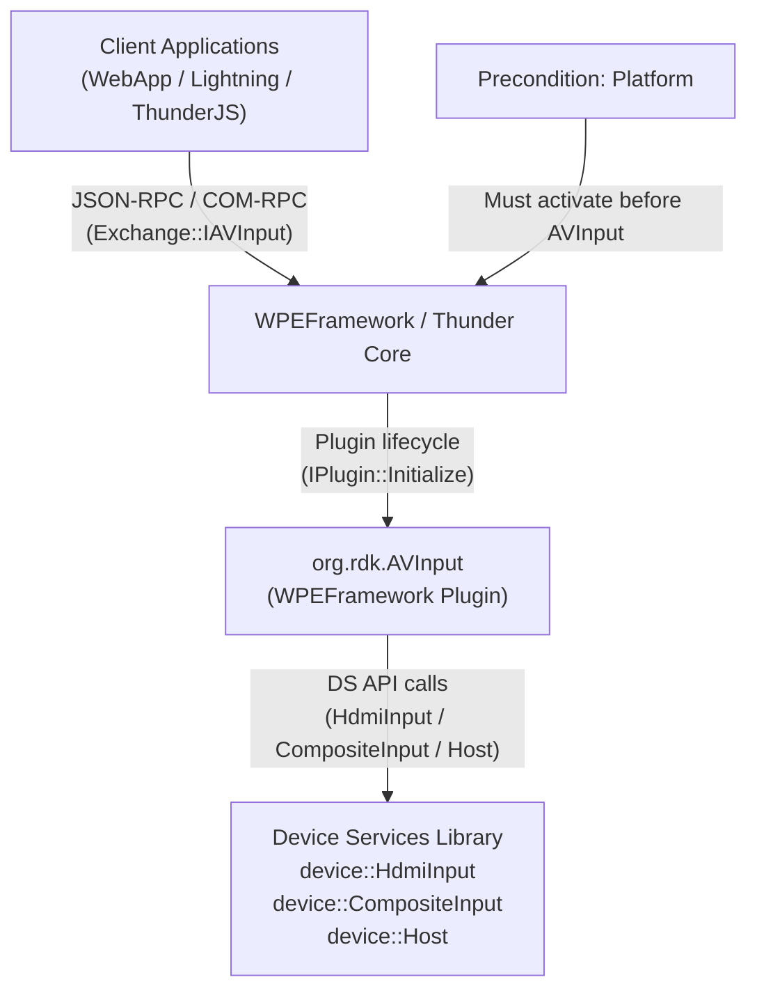
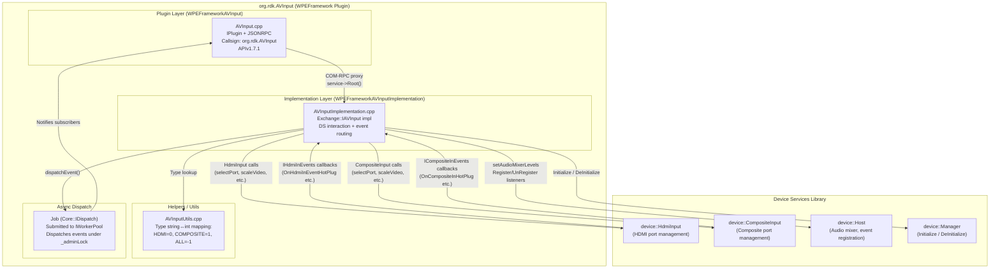
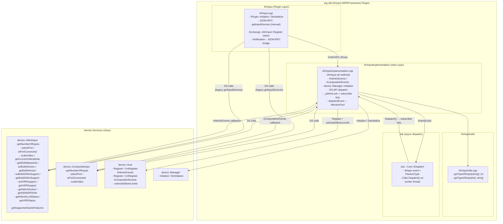
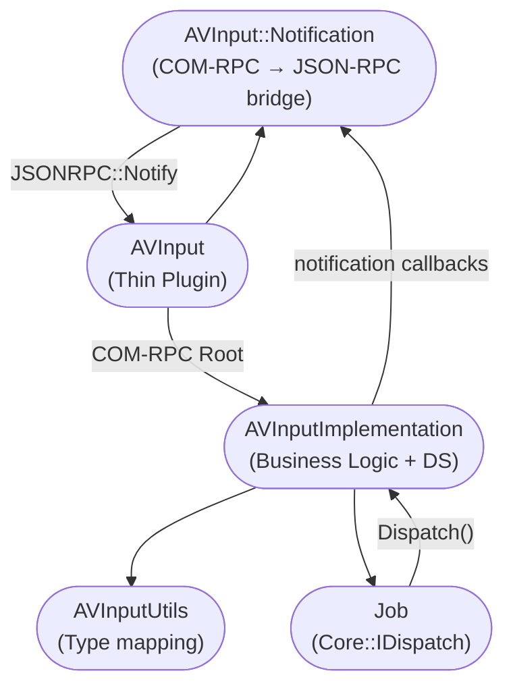
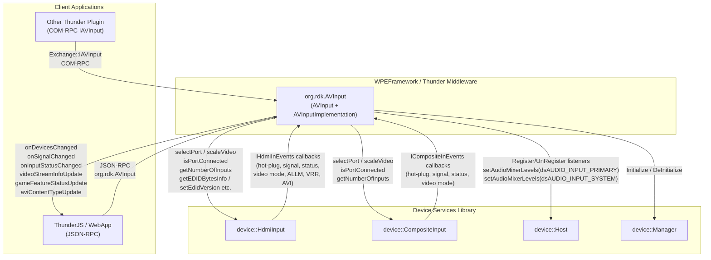
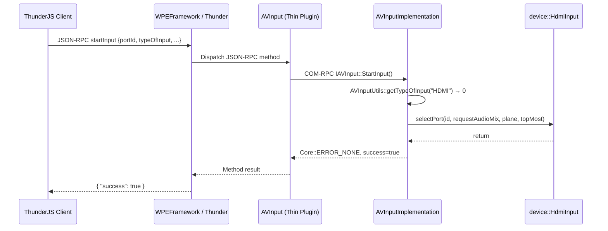
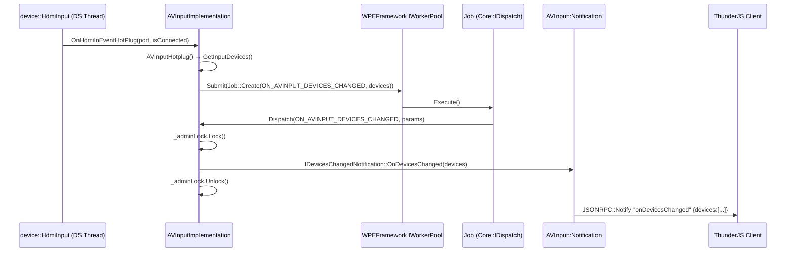

# Entservices-Avinput

---

## Overview

The `entservices-avinput` component is a WPEFramework Thunder plugin that manages HDMI and Composite AV input ports on RDK-E devices. It exposes port discovery, input selection, video scaling, EDID management, audio mixer control, signal status monitoring, and game feature querying (ALLM, VRR) through a COM-RPC Exchange interface (`Exchange::IAVInput`) and JSON‑RPC over the Thunder WebSocket.

At the device level, the plugin abstracts the Device Services (DS) library APIs for `device::HdmiInput` and `device::CompositeInput` into a unified interface that lets client applications enumerate connected AV inputs, start or stop presentation on a selected port, and receive asynchronous notifications when hardware events occur (hot-plug, signal change, video mode change, game feature status change).

At the module level, the plugin follows the standard two-library Thunder pattern: a thin plugin layer (`WPEFrameworkAVInput`) hosts the `IPlugin` and JSON-RPC endpoint, while a separate implementation library (`WPEFrameworkAVInputImplementation`) owns the DS interaction and event dispatch logic. The plugin's callsign is `org.rdk.AVInput`.



**Key Features & Responsibilities:**

- **HDMI and Composite port discovery**: Queries `device::HdmiInput` and `device::CompositeInput` for the number of available input ports and their connection status, building locator URIs of the form `hdmiin://localhost/deviceid/N` and `cvbsin://localhost/deviceid/N`.
- **Input port selection and deselection**: Routes presentation to a specific HDMI port (with audio mix, plane index, and top-most flags) or a Composite port via `selectPort()`, and deselects by passing port index `-1`.
- **Video rectangle scaling**: Calls `device::HdmiInput::scaleVideo()` or `device::CompositeInput::scaleVideo()` to position and size the input video within the display.
- **EDID management**: Reads EDID bytes from the DS HDMI layer (`getEDIDBytesInfo`) and returns them base64-encoded. Writing EDID is declared in the interface but is not implemented (stub, returns success). EDID version can be read and set as `HDMI1.4` or `HDMI2.0`.
- **EDID ALLM and VRR support control**: Reads and writes ALLM EDID support (`getEdid2AllmSupport` / `setEdid2AllmSupport`) and VRR support (`getVRRSupport` / `setVRRSupport`) on HDMI input ports via DS.
- **Source Product Descriptor (SPD) reading**: Retrieves raw SPD data as base64 (`GetRawSPD`) or as a decoded structured string containing packet type, version, length, vendor name, product description, and source info (`GetSPD`), using `device::HdmiInput::getHDMISPDInfo`.
- **HDMI version query**: Retrieves the maximum HDMI capability version supported by a port (`1.4`, `2.0`, or `2.1`) via `device::HdmiInput::getHdmiVersion`.
- **Audio mixer level control**: Sets primary and input audio mixer levels via `device::Host::setAudioMixerLevels`. On stop-input, audio levels are restored to defaults (`MAX_PRIM_VOL_LEVEL=100`, `DEFAULT_INPUT_VOL_LEVEL=100`).
- **Game feature querying**: Queries the list of supported game features from DS (`getSupportedGameFeatures`) and retrieves per-port ALLM status (`getHdmiALLMStatus`) and VRR status (`getVRRStatus`) including current VRR frame rate.
- **Asynchronous event notifications**: Delivers six categories of hardware-originated events to all registered subscribers over COM-RPC and JSON-RPC: devices changed, signal changed, input status changed, video stream info update, game feature status update, and AVI content type update.
- **Content protection status**: `ContentProtected()` is hardcoded to return `true` for all ports, consistent with the legacy Service Manager behavior.

---

## Architecture

### High-Level Architecture

`entservices-avinput` follows the standard WPEFramework two-library out-of-process plugin architecture. The thin plugin library (`WPEFrameworkAVInput`) registers the service callsign, exposes zero-copy COM-RPC via `Exchange::IAVInput`, and hosts one manually registered JSON-RPC method (`getInputDevices`) for backward compatibility with clients that require optional query parameters not supported by the Thunder 4.x auto-generation path. The implementation library (`WPEFrameworkAVInputImplementation`) runs in a separate process and holds all business logic, DS interaction, and event routing.

The northbound interface is dual: clients using ThunderJS or any WebSocket consumer call JSON-RPC methods on `org.rdk.AVInput`, while in-process Thunder plugins can use the `Exchange::IAVInput` COM-RPC interface via `INTERFACE_AGGREGATE`. The southbound interface is exclusively the Device Services C++ library — the plugin directly instantiates DS singletons (`device::HdmiInput::getInstance()`, `device::CompositeInput::getInstance()`, `device::Host::getInstance()`), calls their methods, and registers DS listener interfaces (`device::Host::IHdmiInEvents`, `device::Host::ICompositeInEvents`) to receive hardware events.

Hardware events from DS are dispatched asynchronously. The DS listener callbacks (e.g., `OnHdmiInEventHotPlug`, `OnCompositeInSignalStatus`) execute on the DS internal thread. Each callback translates the DS-specific types into plugin-domain parameters and submits a `Job` to `Core::IWorkerPool::Instance()`. The worker pool thread then acquires `_adminLock` and iterates the appropriate notification subscriber list, calling each registered `IAVInput::I*Notification` callback. This design decouples DS callback threads from plugin subscriber threads.

Inter-process communication between the thin plugin and the implementation uses Thunder's `RPC::IRemoteConnection` mechanism. The plugin layer acquires a remote interface reference via `service->Root<Exchange::IAVInput>(_connectionId, 5000, "AVInputImplementation")` and communicates with it over COM-RPC proxy/stub. If the implementation process terminates unexpectedly, `Deactivated()` submits a shell deactivation job to recover the plugin gracefully.

No IARM Bus calls (`IARM_Bus_RegisterEventHandler`, `IARM_Bus_Call`, `IARM_Bus_Init`) are present in the production implementation, despite the header declaring six static IARM event handler methods. All hardware event delivery is done exclusively through the DS listener interfaces. No persistent store reads or writes are performed; all state is in-memory and is reset on plugin deactivation.



### Threading Model

- **Threading Architecture**: Multi-threaded with event-driven notifications. The plugin uses the WPEFramework worker pool for asynchronous event dispatch and relies on the DS library for the event delivery thread.
- **Main Thread / COM-RPC Dispatch Thread**: Handles JSON-RPC method calls forwarded from Thunder and COM-RPC calls from client plugins. Executes `IAVInput` methods such as `StartInput`, `GetInputDevices`, `ReadEDID`, etc.
- **DS Event Callback Thread**: DS listener callbacks (`OnHdmiInEventHotPlug`, `OnHdmiInEventSignalStatus`, `OnHdmiInEventStatus`, `OnHdmiInVideoModeUpdate`, `OnHdmiInAllmStatus`, `OnHdmiInAVIContentType`, `OnHdmiInVRRStatus`, `OnCompositeInHotPlug`, `OnCompositeInSignalStatus`, `OnCompositeInStatus`, `OnCompositeInVideoModeUpdate`) run on the DS-internal thread. They immediately submit a `Job` to `Core::IWorkerPool` and return without blocking.
- **Worker Pool Thread**: Dequeues submitted `Job` instances and calls `AVInputImplementation::Dispatch()`, which acquires `_adminLock`, selects the appropriate notification list by event type, and iterates all registered subscriber callbacks.
- **Synchronization**: A single `Core::CriticalSection _adminLock` guards all six notification subscriber lists. The `Register()` and `Unregister()` template methods also acquire `_adminLock` when modifying subscriber lists.
- **Async / Event Dispatch**: `dispatchEvent(event, params)` → `Core::IWorkerPool::Instance().Submit(Job::Create(this, event, params))`. The `params` argument uses `boost::variant` to carry any of the six event payload types without heap allocation of individual fields.

---

## Design

The `entservices-avinput` plugin is designed around the Thunder plugin separation principle: the `AVInput` thin plugin handles service registration, JSON-RPC surface, and COM-RPC lifecycle, while `AVInputImplementation` owns all hardware interaction and downstream notification management. This separation allows the implementation to run in a dedicated out-of-process container, isolating DS crashes from the Thunder host process.

The northbound interface is dual-mode. Auto-generated JSON-RPC bindings from `Exchange::JAVInput::Register(*this, _avInput)` expose most methods automatically. The `getInputDevices` method is manually registered (`Register<JsonObject, JsonObject>`) in the `AVInput` constructor to support the optional `typeOfInput` parameter that Thunder 4.x auto-generation cannot express.

The southbound DS calls use the singleton pattern (`device::HdmiInput::getInstance()`, etc.) consistently. Input type dispatch is handled through `AVInputUtils::getTypeOfInput()` which maps between the string domain (`"HDMI"`, `"COMPOSITE"`, `"ALL"`) and integer domain (0, 1, -1). All DS calls are wrapped in try-catch blocks; DS exceptions cause the method to return `Core::ERROR_GENERAL` with `success=false`.

VRR state transitions are statefully tracked in `m_currentVrrType` (type `dsVRRType_t`). When a new VRR type arrives from DS, `OnHdmiInVRRStatus` first deactivates the previous VRR type (if any) and then activates the new one. This produces a pair of `ON_AVINPUT_GAME_FEATURE_STATUS_UPDATE` events to inform subscribers of the transition.

No data persistence is implemented. All configuration (mixer levels, VRR state, registered notifications, plane type) is held in-memory and is reset when the plugin deactivates. No filesystem reads beyond the DS library occur at runtime.

### Component Diagram

A component diagram showing the internal structure and sub-module dependencies is given below.



---

## Internal Modules

| Module / Class          | Description                                                                                                                                                                                                                                                                                                                                                                                       | Key Files                                                            |
| ----------------------- | ------------------------------------------------------------------------------------------------------------------------------------------------------------------------------------------------------------------------------------------------------------------------------------------------------------------------------------------------------------------------------------------------- | -------------------------------------------------------------------- |
| `AVInput`               | Thin plugin layer. Implements `PluginHost::IPlugin` and `PluginHost::JSONRPC`. Acquires the `IAVInput` COM-RPC interface from the implementation process, registers all six notification subscriptions, and bridges COM-RPC notifications to JSON-RPC events. Also implements a legacy `getInputDevices` JSON-RPC method that queries DS directly for backward compatibility.                     | `plugin/AVInput.h`, `plugin/AVInput.cpp`                             |
| `AVInputImplementation` | Implementation layer. Implements `Exchange::IAVInput`, `device::Host::IHdmiInEvents`, and `device::Host::ICompositeInEvents`. Calls `device::Manager::Initialize()` in `Configure()`, registers DS listener interfaces, handles all 23 `IAVInput` methods, translates DS callbacks into plugin events, and dispatches events to subscriber lists asynchronously via the WPEFramework worker pool. | `plugin/AVInputImplementation.h`, `plugin/AVInputImplementation.cpp` |
| `AVInputUtils`          | Stateless utility class providing bidirectional mapping between input type strings (`"HDMI"`, `"COMPOSITE"`, `"ALL"`) and their integer constants (0, 1, -1). Used by both the plugin layer and the implementation layer.                                                                                                                                                                         | `plugin/AVInputUtils.h`, `plugin/AVInputUtils.cpp`                   |
| `Job`                   | Inner class of `AVInputImplementation` implementing `Core::IDispatch`. Created via `Job::Create(this, event, params)` and submitted to `Core::IWorkerPool`. On execution it calls `AVInputImplementation::Dispatch()` which iterates the appropriate subscriber list under `_adminLock`.                                                                                                          | `plugin/AVInputImplementation.h`                                     |
| `AVInput::Notification` | Inner class of `AVInput` implementing all six `IAVInput::I*Notification` interfaces plus `RPC::IRemoteConnection::INotification`. Bridges COM-RPC notifications from the implementation into `JSONRPC::Notify` calls (e.g., `onDevicesChanged`) and handles remote connection deactivation.                                                                                                       | `plugin/AVInput.h`, `plugin/AVInput.cpp`                             |



---

## Prerequisites & Dependencies

**Northbound verification:**

- `Exchange::IAVInput` COM-RPC interface — confirmed via `INTERFACE_AGGREGATE` in `AVInput.h` and `SERVICE_REGISTRATION(AVInputImplementation, ...)` in `AVInputImplementation.cpp`.
- `Exchange::JAVInput::Register` auto-generated JSON-RPC bindings — confirmed in `AVInput.cpp::Initialize()`.

**IARM Bus verification:**

- `AVInputImplementation.h` declares six static IARM event handler methods (`dsAVEventHandler`, `dsAVSignalStatusEventHandler`, `dsAVStatusEventHandler`, `dsAVVideoModeEventHandler`, `dsAVGameFeatureStatusEventHandler`, `dsAviContentTypeEventHandler`) but no `IARM_Bus_RegisterEventHandler`, `IARM_Bus_Call`, or `IARM_Bus_Init` call is present in the production implementation. IARM Bus is **not used** at runtime; all hardware events are received through DS listener interfaces.

**Device Services verification:**
Confirmed calls in `AVInputImplementation.cpp`: `device::Manager::Initialize()`, `device::Manager::DeInitialize()`, `device::Host::getInstance().Register/UnRegister(IHdmiInEvents/ICompositeInEvents)`, `device::Host::getInstance().setAudioMixerLevels()`, `device::HdmiInput::getInstance().getNumberOfInputs()`, `selectPort()`, `isPortConnected()`, `scaleVideo()`, `getCurrentVideoMode()`, `getEDIDBytesInfo()`, `setEdidVersion()`, `getEdidVersion()`, `setEdid2AllmSupport()`, `getEdid2AllmSupport()`, `setVRRSupport()`, `getVRRSupport()`, `getHdmiVersion()`, `getHDMISPDInfo()`, `getHdmiALLMStatus()`, `getVRRStatus()`, `getSupportedGameFeatures()`, and `device::CompositeInput::getInstance().getNumberOfInputs()`, `selectPort()`, `isPortConnected()`, `scaleVideo()`.

**Persistent store verification:**
No persistent store reads or writes are present in the implementation.

### RDK-E Platform Requirements

- **WPEFramework Version**: Built for Thunder R4. A `USE_THUNDER_R4` CMake option switches the implementation library link between `WPEFrameworkCOM` (R4) and `WPEFrameworkProtocols` (non-R4).
- **C++ Standard**: C++11 (set via `CMAKE_CXX_STANDARD 11` in `CMakeLists.txt`).
- **Build Dependencies**:
  - `WPEFrameworkPlugins` and `WPEFrameworkDefinitions`
  - `DS` package (found via `cmake/FindDS.cmake`) — provides `device::HdmiInput`, `device::CompositeInput`, `device::Host`, `device::Manager`
  - `IARMBus` package (found via `cmake/FindIARMBus.cmake`) — linked but not called at runtime
  - `curl` — included in `AVInputImplementation.cpp` (`#include <curl/curl.h>`), though no curl API calls are visible in the implementation
  - `boost/variant.hpp` — used for the `ParamsType` variant in event dispatch
- **RDK-E Plugin Dependencies**: None declared in `AVInput.conf.in` (preconditions list is `{}`).
- **Precondition**: `precondition = ["Platform"]` — the Platform plugin must activate before `org.rdk.AVInput` starts.
- **Device Services / HAL**: Requires DS library at runtime supporting `dsHdmiInPort_t`, `dsCompositeInPort_t`, `dsHdmiInSignalStatus_t`, `dsCompInSignalStatus_t`, `dsVideoPortResolution_t`, `dsAviContentType_t`, `dsVRRType_t`, `dsHdmiInVrrStatus_t`, `dsHdmiMaxCapabilityVersion_t`, and `dsSpd_infoframe_st` types.
- **IARM Bus**: Linked but not used at runtime (no `IARM_Bus_*` calls in the production code).
- **Startup Order**: Configured via `PLUGIN_AVINPUT_STARTUPORDER` CMake variable written into `AVInput.conf.in`.
- **Autostart**: `autostart = "false"` — the plugin does not start automatically; it must be activated by a client or supervisor.

---

## Quick Start

### 1. Initialize via ThunderJS

```js
import ThunderJS from "thunderjs";
const thunderJS = ThunderJS({ host: "localhost", port: 9998 });
```

### 2. Activate the plugin

```js
await thunderJS.Controller.activate({ callsign: "org.rdk.AVInput" });
```

### 3. List available AV inputs

```js
// Get all HDMI and Composite input devices
thunderJS["org.rdk.AVInput"]
  .getInputDevices()
  .then((result) => console.log(result.devices))
  .catch((err) => console.error(err));

// Alternatively filter by type
thunderJS["org.rdk.AVInput"]
  .getInputDevices({ typeOfInput: "HDMI" })
  .then((result) => console.log(result.devices))
  .catch((err) => console.error(err));
```

### 4. Start presentation on HDMI port 0

```js
thunderJS["org.rdk.AVInput"]
  .startInput({
    portId: "0",
    typeOfInput: "HDMI",
    requestAudioMix: false,
    plane: 0,
    topMost: false,
  })
  .then((r) => console.log(r));
```

### 5. Subscribe to events

```js
thunderJS.on("org.rdk.AVInput", "onDevicesChanged", (payload) => {
  console.log("Devices changed:", payload.devices);
});
thunderJS.on("org.rdk.AVInput", "onSignalChanged", (payload) => {
  console.log("Signal:", payload.id, payload.signalStatus);
});
```

### 6. Stop input

```js
thunderJS["org.rdk.AVInput"].stopInput({ typeOfInput: "HDMI" });
```

---

## Configuration

### Configuration Priority

1. Built-in defaults (compile-time): `DEFAULT_PRIM_VOL_LEVEL=25`, `MAX_PRIM_VOL_LEVEL=100`, `DEFAULT_INPUT_VOL_LEVEL=100`
2. `PLUGIN_AVINPUT_STARTUPORDER` — set at build time, written into `AVInput.conf.in`

### Key Configuration Files

| Configuration File       | Purpose                                                                                                     | Override Mechanism                                                     |
| ------------------------ | ----------------------------------------------------------------------------------------------------------- | ---------------------------------------------------------------------- |
| `plugin/AVInput.conf.in` | Thunder plugin activation config — sets callsign, autostart, startup order, mode, locator, and precondition | CMake variable `PLUGIN_AVINPUT_STARTUPORDER` substituted at build time |

### Configuration Parameters

| Parameter                 | Type   | Default                         | Source       | Description                                                   |
| ------------------------- | ------ | ------------------------------- | ------------ | ------------------------------------------------------------- |
| `callsign`                | string | `org.rdk.AVInput`               | conf.in      | Thunder plugin callsign used for JSON-RPC addressing          |
| `autostart`               | bool   | `false`                         | conf.in      | Plugin does not start automatically on Thunder boot           |
| `startuporder`            | int    | `@PLUGIN_AVINPUT_STARTUPORDER@` | CMake        | Relative activation order among Thunder plugins               |
| `DEFAULT_PRIM_VOL_LEVEL`  | int    | `25`                            | compile-time | Default primary audio mixer level at plugin startup           |
| `MAX_PRIM_VOL_LEVEL`      | int    | `100`                           | compile-time | Maximum primary audio mixer level; clamps values above this   |
| `DEFAULT_INPUT_VOL_LEVEL` | int    | `100`                           | compile-time | Default input audio mixer level; used during stop-input reset |

### Configuration Persistence

Configuration changes are not persisted across reboots. Mixer level state (`m_primVolume`, `m_inputVolume`), VRR state (`m_currentVrrType`), and the current plane index (`planeType`) are held in-memory and reset when the plugin deactivates.

---

## API / Usage

### Interface Type

- **JSON-RPC over Thunder WebSocket** (`ws://host:9998/jsonrpc`) — available to all WebSocket clients using the callsign `org.rdk.AVInput`.
- **COM-RPC Exchange interface** (`Exchange::IAVInput`) — available in-process to other Thunder plugins via `INTERFACE_AGGREGATE`.

---

### Methods

#### `getInputDevices`

Returns the list of available HDMI and/or Composite AV input devices with their connection state and locator URI. This method is manually registered in the plugin layer (not auto-generated) to allow the optional `typeOfInput` parameter.

**Parameters**

| Name          | Type   | Required | Description                                                                                                   |
| ------------- | ------ | -------- | ------------------------------------------------------------------------------------------------------------- |
| `typeOfInput` | string | No       | Filter by type: `"HDMI"`, `"COMPOSITE"`, or `"ALL"`. If omitted, all HDMI and Composite devices are returned. |

**Response**

```json
{
  "devices": [
    { "id": 0, "locator": "hdmiin://localhost/deviceid/0", "connected": true },
    { "id": 1, "locator": "hdmiin://localhost/deviceid/1", "connected": false },
    { "id": 0, "locator": "cvbsin://localhost/deviceid/0", "connected": false }
  ]
}
```

**Example**

```js
thunderJS["org.rdk.AVInput"]
  .getInputDevices({ typeOfInput: "HDMI" })
  .then((r) => console.log(r.devices));
```

---

#### `startInput`

Selects an AV input port for presentation. For HDMI, the request supports audio mix mode, display plane index, and top-most layering flag. For Composite, only the port ID is used.

**Parameters**

| Name              | Type   | Required       | Description                                        |
| ----------------- | ------ | -------------- | -------------------------------------------------- |
| `portId`          | string | Yes            | Zero-based port index as a string (e.g., `"0"`).   |
| `typeOfInput`     | string | Yes            | `"HDMI"` or `"COMPOSITE"`.                         |
| `requestAudioMix` | bool   | No (HDMI only) | Whether to request audio mixing for this port.     |
| `plane`           | int    | No (HDMI only) | Display plane index; must be `0` or `1`.           |
| `topMost`         | bool   | No (HDMI only) | Whether the input layer should be rendered on top. |

**Response**

```json
{ "success": true }
```

**Example**

```js
thunderJS["org.rdk.AVInput"].startInput({
  portId: "0",
  typeOfInput: "HDMI",
  requestAudioMix: false,
  plane: 0,
  topMost: false,
});
```

---

#### `stopInput`

Deselects the active AV input port. If audio mixer levels were modified during the active session (`isAudioBalanceSet=true`), they are restored to `MAX_PRIM_VOL_LEVEL=100` (primary) and `DEFAULT_INPUT_VOL_LEVEL=100` (input).

**Parameters**

| Name          | Type   | Required | Description                |
| ------------- | ------ | -------- | -------------------------- |
| `typeOfInput` | string | Yes      | `"HDMI"` or `"COMPOSITE"`. |

**Response**

```json
{ "success": true }
```

---

#### `setVideoRectangle`

Scales and positions the input video within the display output via `device::HdmiInput::scaleVideo()` or `device::CompositeInput::scaleVideo()`.

**Parameters**

| Name          | Type   | Required | Description                          |
| ------------- | ------ | -------- | ------------------------------------ |
| `x`           | uint16 | Yes      | x-coordinate of the top-left corner. |
| `y`           | uint16 | Yes      | y-coordinate of the top-left corner. |
| `w`           | uint16 | Yes      | Width of the video rectangle.        |
| `h`           | uint16 | Yes      | Height of the video rectangle.       |
| `typeOfInput` | string | Yes      | `"HDMI"` or `"COMPOSITE"`.           |

**Response**

```json
{ "success": true }
```

---

#### `numberOfInputs`

Returns the total number of available HDMI input ports from `device::HdmiInput::getNumberOfInputs()`.

**Parameters**: None.

**Response**

```json
{ "numberOfInputs": 3, "success": true }
```

---

#### `currentVideoMode`

Returns the current HDMI video mode string from `device::HdmiInput::getCurrentVideoMode()`.

**Parameters**: None.

**Response**

```json
{ "currentVideoMode": "1920x1080p60", "success": true }
```

---

#### `contentProtected`

Returns whether the currently active input is content-protected. This is hardcoded to `true` for all ports, consistent with legacy Service Manager behavior.

**Parameters**: None.

**Response**

```json
{ "isContentProtected": true, "success": true }
```

---

#### `readEDID`

Reads EDID bytes from HDMI input port N via `device::HdmiInput::getEDIDBytesInfo(id, ...)` and returns them as a base64-encoded string.

**Parameters**

| Name     | Type   | Required | Description                 |
| -------- | ------ | -------- | --------------------------- |
| `portId` | string | Yes      | Zero-based HDMI port index. |

**Response**

```json
{ "EDID": "<base64-encoded EDID bytes>", "success": true }
```

---

#### `writeEDID`

Declares writing EDID data to an HDMI input port. This method is a stub — it was not implemented in the original codebase. It validates `portId` format but performs no DS write; it always returns `success: true`.

**Parameters**

| Name      | Type   | Required | Description                          |
| --------- | ------ | -------- | ------------------------------------ |
| `portId`  | string | Yes      | Zero-based HDMI port index.          |
| `message` | string | Yes      | EDID data (not written to hardware). |

**Response**

```json
{ "success": true }
```

---

#### `getRawSPD`

Reads raw Source Product Descriptor data from an HDMI input port via `device::HdmiInput::getHDMISPDInfo()` and returns it as a base64-encoded string.

**Parameters**

| Name     | Type   | Required | Description                 |
| -------- | ------ | -------- | --------------------------- |
| `portId` | string | Yes      | Zero-based HDMI port index. |

**Response**

```json
{ "HDMISPD": "<base64 raw SPD bytes>", "success": true }
```

---

#### `getSPD`

Reads SPD data from an HDMI input port via `device::HdmiInput::getHDMISPDInfo()` and returns it as a human-readable formatted string.

**Parameters**

| Name     | Type   | Required | Description                 |
| -------- | ------ | -------- | --------------------------- |
| `portId` | string | Yes      | Zero-based HDMI port index. |

**Response**

```json
{
  "HDMISPD": "Packet Type:82,Version:1,Length:25,vendor name:ACME,product des:TV,source info:01",
  "success": true
}
```

---

#### `setEdidVersion`

Sets the EDID version advertised on an HDMI input port via `device::HdmiInput::setEdidVersion()`.

**Parameters**

| Name          | Type   | Required | Description                                                   |
| ------------- | ------ | -------- | ------------------------------------------------------------- |
| `portId`      | string | Yes      | Zero-based HDMI port index.                                   |
| `edidVersion` | string | Yes      | `"HDMI1.4"` or `"HDMI2.0"`. Any other value returns an error. |

**Response**

```json
{ "success": true }
```

---

#### `getEdidVersion`

Returns the current EDID version for an HDMI input port via `device::HdmiInput::getEdidVersion()`.

**Parameters**

| Name     | Type   | Required | Description                 |
| -------- | ------ | -------- | --------------------------- |
| `portId` | string | Yes      | Zero-based HDMI port index. |

**Response**

```json
{ "edidVersion": "HDMI2.0", "success": true }
```

---

#### `setEdid2AllmSupport`

Enables or disables ALLM support in the EDID of an HDMI input port via `device::HdmiInput::setEdid2AllmSupport()`.

**Parameters**

| Name          | Type   | Required | Description                               |
| ------------- | ------ | -------- | ----------------------------------------- |
| `portId`      | string | Yes      | Zero-based HDMI port index.               |
| `allmSupport` | bool   | Yes      | `true` to advertise ALLM support in EDID. |

**Response**

```json
{ "success": true }
```

---

#### `getEdid2AllmSupport`

Returns whether ALLM support is advertised in the EDID of an HDMI port via `device::HdmiInput::getEdid2AllmSupport()`.

**Parameters**

| Name     | Type   | Required | Description                 |
| -------- | ------ | -------- | --------------------------- |
| `portId` | string | Yes      | Zero-based HDMI port index. |

**Response**

```json
{ "allmSupport": true, "success": true }
```

---

#### `setVRRSupport`

Enables or disables VRR support on an HDMI input port via `device::HdmiInput::setVRRSupport()`.

**Parameters**

| Name         | Type   | Required | Description                 |
| ------------ | ------ | -------- | --------------------------- |
| `portId`     | string | Yes      | Zero-based HDMI port index. |
| `vrrSupport` | bool   | Yes      | `true` to enable VRR.       |

**Response**

```json
{ "success": true }
```

---

#### `getVRRSupport`

Returns whether VRR is supported on an HDMI input port via `device::HdmiInput::getVRRSupport()`.

**Parameters**

| Name     | Type   | Required | Description                 |
| -------- | ------ | -------- | --------------------------- |
| `portId` | string | Yes      | Zero-based HDMI port index. |

**Response**

```json
{ "vrrSupport": true, "success": true }
```

---

#### `getHdmiVersion`

Returns the maximum HDMI capability version of a port via `device::HdmiInput::getHdmiVersion()`.

**Parameters**

| Name     | Type   | Required | Description                 |
| -------- | ------ | -------- | --------------------------- |
| `portId` | string | Yes      | Zero-based HDMI port index. |

**Response**

```json
{ "HdmiCapabilityVersion": "2.1", "success": true }
```

Possible values: `"1.4"`, `"2.0"`, `"2.1"`.

---

#### `setMixerLevels`

Sets the primary and input audio mixer levels via `device::Host::setAudioMixerLevels()`. Primary volume is clamped to `MAX_PRIM_VOL_LEVEL=100`. Input volume is clamped to `DEFAULT_INPUT_VOL_LEVEL=100`. Both values must be non-negative.

**Parameters**

| Name            | Type | Required | Description                        |
| --------------- | ---- | -------- | ---------------------------------- |
| `primaryVolume` | int  | Yes      | Primary audio mixer level (0–100). |
| `inputVolume`   | int  | Yes      | Input audio mixer level (0–100).   |

**Response**

```json
{ "success": true }
```

---

#### `getSupportedGameFeatures`

Returns the list of game features supported by the HDMI hardware via `device::HdmiInput::getSupportedGameFeatures()`.

**Parameters**: None.

**Response**

```json
{ "features": ["ALLM", "VRR-HDMI", "VRR-FREESYNC"], "success": true }
```

---

#### `getGameFeatureStatus`

Returns the current state of a specific game feature on an HDMI port. For ALLM, calls `device::HdmiInput::getHdmiALLMStatus()`. For VRR types, calls `device::HdmiInput::getVRRStatus()` and compares the returned `vrrType` with the requested type.

**Parameters**

| Name          | Type   | Required | Description                                                                                          |
| ------------- | ------ | -------- | ---------------------------------------------------------------------------------------------------- |
| `portId`      | string | Yes      | Zero-based HDMI port index.                                                                          |
| `gameFeature` | string | Yes      | `"ALLM"`, `"VRR-HDMI"`, `"VRR-FREESYNC"`, `"VRR-FREESYNC-PREMIUM"`, or `"VRR-FREESYNC-PREMIUM-PRO"`. |

**Response**

```json
{ "mode": true, "success": true }
```

---

#### `getVRRFrameRate`

Returns the current VRR frame rate (in Hz) from the AMD FreeSync VRR status of an HDMI port via `device::HdmiInput::getVRRStatus()`.

**Parameters**

| Name     | Type   | Required | Description                 |
| -------- | ------ | -------- | --------------------------- |
| `portId` | string | Yes      | Zero-based HDMI port index. |

**Response**

```json
{ "currentVRRVideoFrameRate": 120.0, "success": true }
```

---

### Events / Notifications

| Event                     | Trigger Condition                                                                                                                                              | Payload                                                                                                                                  |
| ------------------------- | -------------------------------------------------------------------------------------------------------------------------------------------------------------- | ---------------------------------------------------------------------------------------------------------------------------------------- |
| `onDevicesChanged`        | HDMI or Composite port hot-plug (connect or disconnect) detected by DS via `IHdmiInEvents::OnHdmiInEventHotPlug` or `ICompositeInEvents::OnCompositeInHotPlug` | `{ "devices": [ { "id": 0, "locator": "hdmiin://localhost/deviceid/0", "connected": true }, ... ] }`                                     |
| `onSignalChanged`         | HDMI or Composite signal status transition detected by DS via `OnHdmiInEventSignalStatus` or `OnCompositeInSignalStatus`                                       | `{ "id": <port>, "locator": "<uri>", "signalStatus": "<noSignal\|unstableSignal\|notSupportedSignal\|stableSignal\|none>" }`             |
| `onInputStatusChanged`    | Input presentation started or stopped, from `OnHdmiInEventStatus` or `OnCompositeInStatus`                                                                     | `{ "id": <port>, "locator": "<uri>", "status": "<started\|stopped>", "plane": <int> }`                                                   |
| `videoStreamInfoUpdate`   | Video mode change detected by DS via `OnHdmiInVideoModeUpdate` or `OnCompositeInVideoModeUpdate`. Resolution is decoded from `dsVideoPortResolution_t`.        | `{ "id": <port>, "locator": "<uri>", "width": <int>, "height": <int>, "progressive": <bool>, "frameRateN": <int>, "frameRateD": <int> }` |
| `gameFeatureStatusUpdate` | ALLM or VRR state change on HDMI port, from `OnHdmiInAllmStatus` or `OnHdmiInVRRStatus`                                                                        | `{ "id": <port>, "gameFeature": "<ALLM\|VRR-HDMI\|VRR-FREESYNC\|VRR-FREESYNC-PREMIUM\|VRR-FREESYNC-PREMIUM-PRO>", "mode": <bool> }`      |
| `aviContentTypeUpdate`    | AVI content type change on HDMI port, from `OnHdmiInAVIContentType`                                                                                            | `{ "id": <port>, "aviContentType": <dsAviContentType_t int> }`                                                                           |

**VRR transition note:** When a VRR type transitions from one type to another (e.g., from `VRR-HDMI` to `VRR-FREESYNC`), two `gameFeatureStatusUpdate` events are fired in sequence — first a `mode: false` for the previous type, then a `mode: true` for the new type.

**Frame rate encoding:** `videoStreamInfoUpdate` encodes frame rate as a numerator/denominator pair to represent exact fractional rates:

- 60 fps → `frameRateN: 60000, frameRateD: 1000`
- 59.94 fps → `frameRateN: 60000, frameRateD: 1001`
- 23.98 fps → `frameRateN: 24000, frameRateD: 1001`

---

## Component Interactions



### Interaction Matrix

| Target Component / Layer  | Interaction Purpose                        | Key APIs                                                                                                                                                                                                                                                                                                                                                                 |
| ------------------------- | ------------------------------------------ | ------------------------------------------------------------------------------------------------------------------------------------------------------------------------------------------------------------------------------------------------------------------------------------------------------------------------------------------------------------------------ |
| **Device Services / HAL** |                                            |                                                                                                                                                                                                                                                                                                                                                                          |
| `device::Manager`         | DS lifecycle management                    | `Initialize()`, `DeInitialize()`                                                                                                                                                                                                                                                                                                                                         |
| `device::HdmiInput`       | HDMI port queries and control              | `getNumberOfInputs()`, `selectPort()`, `isPortConnected()`, `scaleVideo()`, `getCurrentVideoMode()`, `getEDIDBytesInfo()`, `setEdidVersion()`, `getEdidVersion()`, `setEdid2AllmSupport()`, `getEdid2AllmSupport()`, `setVRRSupport()`, `getVRRSupport()`, `getHdmiVersion()`, `getHDMISPDInfo()`, `getHdmiALLMStatus()`, `getVRRStatus()`, `getSupportedGameFeatures()` |
| `device::CompositeInput`  | Composite port queries and control         | `getNumberOfInputs()`, `selectPort()`, `isPortConnected()`, `scaleVideo()`                                                                                                                                                                                                                                                                                               |
| `device::Host`            | Listener registration, audio mixer control | `Register(IHdmiInEvents*)`, `Register(ICompositeInEvents*)`, `UnRegister()`, `setAudioMixerLevels(dsAUDIO_INPUT_PRIMARY, ...)`, `setAudioMixerLevels(dsAUDIO_INPUT_SYSTEM, ...)`                                                                                                                                                                                         |
| **IARM Bus**              | Not used at runtime                        | —                                                                                                                                                                                                                                                                                                                                                                        |
| **Persistent Store**      | Not used                                   | —                                                                                                                                                                                                                                                                                                                                                                        |

### IPC Flow Patterns

**Request / Response Flow (e.g., `startInput`):**



**Event Notification Flow (e.g., HDMI hot-plug):**


