# Entservices-Cryptography

---

## Overview

`entservices-cryptography` is a WPEFramework Thunder plugin that acts as an external access broker for the Thunder `Exchange::ICryptography` interface. It does not expose JSON-RPC methods and does not implement a JSON-RPC endpoint. Instead, it makes the Thunder cryptography library accessible to native processes outside the Thunder runtime by hosting a UNIX domain socket at `/tmp/icryptography`, through which external clients can acquire `ICryptography` interface handles via Thunder's `RPC::Communicator` mechanism.

At the device level, the plugin enables OS processes in the `apps` group to perform cryptographic operations (backed by the platform's `${NAMESPACE}Cryptography` library) by connecting to the UNIX socket. The socket is chmod'd with group read/write permissions and chown'd to the `apps` group after creation.

At the module level, the plugin is structured as a single library (`WPEFrameworkCryptographyExtAccess`) containing both the Thunder plugin entry point (`CryptographyExtAccess`) and the implementation (`CryptographyImplementation` + `ExternalAccess`). The `CryptographyImplementation` class acquires `Exchange::ICryptography::Instance("")` from the platform library and aggregates it via `INTERFACE_AGGREGATE`, making it available to external callers through `ExternalAccess::Acquire()`.

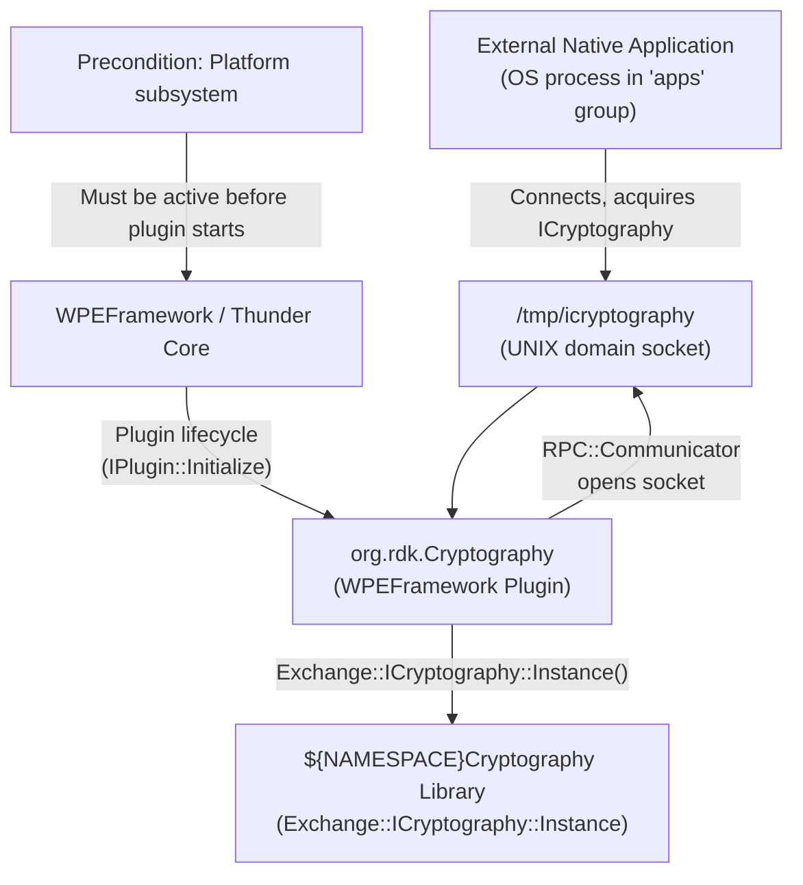

**Key Features & Responsibilities:**

- **UNIX socket gateway for ICryptography**: Opens a `RPC::Communicator` on `/tmp/icryptography` at initialization, through which external native processes can request `Exchange::ICryptography` interface handles.
- **ICryptography instance acquisition**: Calls `Exchange::ICryptography::Instance("")` to obtain the platform-provided cryptography implementation and aggregates it via `INTERFACE_AGGREGATE(Exchange::ICryptography, _cryptography)`.
- **Access control via filesystem permissions**: After the UNIX socket is created, sets group read/write permissions (`chmod` adds `S_IRGRP | S_IWGRP`) and transfers group ownership to the `apps` OS group (`chown` via `getgrnam("apps")`).
- **Interface version gating**: `ExternalAccess::Acquire()` grants interface requests only for version 1 or the wildcard version (`~0`).
- **Out-of-process lifecycle management**: The `CryptographyImplementation` class is instantiated via `service->Root<Exchange::IConfiguration>(...)` as a remote object. If the remote process terminates unexpectedly, `Deactivated()` submits a deactivation job to the Thunder worker pool.
- **Configurable connector path**: The UNIX socket path defaults to `/tmp/icryptography` but can be overridden at runtime via the plugin's `connector` JSON configuration key.

---

## Architecture

### High-Level Architecture

`entservices-cryptography` departs from the standard two-library Thunder plugin pattern. The single library `WPEFrameworkCryptographyExtAccess` contains both the `IPlugin` entry point (`CryptographyExtAccess`) and the full service implementation (`CryptographyImplementation`, `ExternalAccess`). The thin plugin layer (`CryptographyExtAccess`) implements only `PluginHost::IPlugin` — there is no `PluginHost::JSONRPC` in its interface map, meaning no JSON-RPC surface is exposed to WebSocket clients.

The design pattern is: Thunder plugin lifecycle management on one side, native process IPC on the other. `CryptographyExtAccess::Initialize()` uses Thunder's RPC root mechanism (`service->Root<Exchange::IConfiguration>(...)`) to bring up `CryptographyImplementation`. That implementation then calls `Exchange::ICryptography::Instance("")` to obtain the platform cryptography backend and spins up an `ExternalAccess` UNIX socket server. Any native process that connects to `/tmp/icryptography` and requests the correct interface ID receives a COM-RPC proxy to `ICryptography` back through the socket.

The northbound interface is limited to the Thunder plugin host (lifecycle only) — there are no JSON-RPC methods. The southbound interface is `Exchange::ICryptography::Instance("")`, which is provided by the `${NAMESPACE}Cryptography` CMake package. No Device Services (DS) APIs are called. No IARM Bus calls are made in the production code.

No persistent store reads or writes occur at any point. All state is in-memory and is released on `Deinitialize()`.

A component diagram showing the internal structure is given below:

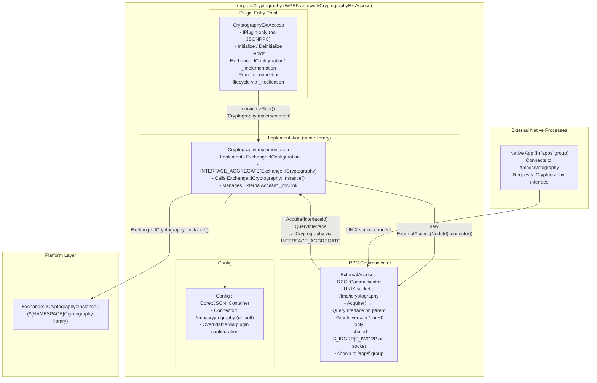

### Threading Model

- **Threading Architecture**: Multi-threaded via the WPEFramework worker pool, with the `RPC::Communicator`/`InvokeServer` handling external socket connections on their own threads.
- **Main Thread / Plugin Dispatch Thread**: Executes `IPlugin::Initialize()` and `Deinitialize()`. Calls `Exchange::ICryptography::Instance()`, creates `ExternalAccess`, applies file permissions.
- **RPC InvokeServer Threads**: `CryptographyImplementation::Configure()` creates a `Core::ProxyType<RPC::InvokeServer>` bound to `Core::IWorkerPool::Instance()`. Worker pool threads service incoming RPC requests from external clients on the UNIX socket.
- **Synchronization**: No explicit `CriticalSection` or mutex is declared in the plugin source. Thread safety for external RPC calls is managed by the Thunder `RPC::Communicator` and `InvokeServer` infrastructure.
- **Async / Event Dispatch**: If the remote `CryptographyImplementation` process deactivates unexpectedly, `Deactivated()` submits `PluginHost::IShell::Job::Create(_service, DEACTIVATED, FAILURE)` to `Core::IWorkerPool::Instance()`.

---

## Design

`entservices-cryptography` is designed as a process-boundary bridge: the Thunder plugin lifecycle and the platform cryptography library run in the same or a separate process (controlled by `PLUGIN_CRYPTOGRAPHYEXTACCESS_MODE`), while native OS applications access cryptographic operations over a UNIX domain socket without being part of the Thunder plugin system.

The `CryptographyExtAccess` plugin entry point holds an `Exchange::IConfiguration*` pointer to `CryptographyImplementation`, acquired through Thunder's COM-RPC root mechanism. `CryptographyImplementation` is the real service: it instantiates `Exchange::ICryptography` from the platform library, and through `INTERFACE_AGGREGATE`, exposes that interface to any caller querying via `QueryInterface`. `ExternalAccess` inherits `RPC::Communicator` and overrides `Acquire()` to call `_parent.QueryInterface(interfaceId)`, which resolves through the interface aggregate to the live `ICryptography` instance.

The connector path (`/tmp/icryptography`) is configurable via the plugin configuration JSON key `connector`. After the socket is bound, permissions are set with `chmod` (adds group read/write) and `chown` (sets group to `apps`) using POSIX `getgrnam()` / `chown()`. This is the sole access control mechanism — no Thunder-level authentication is applied.

Because `CryptographyExtAccess` implements only `PluginHost::IPlugin` (not `PluginHost::JSONRPC`), the plugin registers no JSON-RPC methods and is invisible to ThunderJS or WebSocket clients. It does not appear in the Thunder JSON-RPC service surface.

No data persistence is implemented. No filesystem paths other than the UNIX socket are read or written at runtime.

### Component Diagram

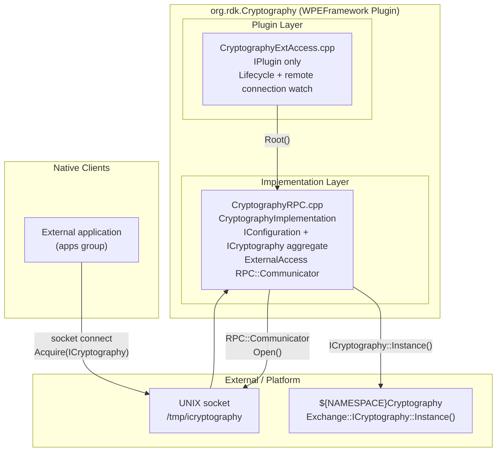

---

## Internal Modules

| Module / Class                        | Description                                                                                                                                                                                                                                                     | Key Files                                                            |
| ------------------------------------- | --------------------------------------------------------------------------------------------------------------------------------------------------------------------------------------------------------------------------------------------------------------- | -------------------------------------------------------------------- |
| `CryptographyExtAccess`               | Plugin entry point. Implements `PluginHost::IPlugin` only — no JSONRPC. Acquires `Exchange::IConfiguration*` from `CryptographyImplementation` via Thunder RPC root, calls `Configure()`, and monitors the remote connection via `Core::Sink<Notification>`.    | `plugin/CryptographyExtAccess.h`, `plugin/CryptographyExtAccess.cpp` |
| `CryptographyImplementation`          | Service core. Implements `Exchange::IConfiguration` and aggregates `Exchange::ICryptography`. In `Configure()`, calls `Exchange::ICryptography::Instance("")`, creates `ExternalAccess` on the configured connector path, and applies socket permissions.       | `plugin/CryptographyRPC.cpp`                                         |
| `ExternalAccess`                      | Inner class of `CryptographyImplementation`. Extends `RPC::Communicator`. Opens a UNIX domain socket and overrides `Acquire()` to forward interface requests to the parent's `QueryInterface()`, which routes through `INTERFACE_AGGREGATE` to `ICryptography`. | `plugin/CryptographyRPC.cpp`                                         |
| `Config`                              | Inner class of `CryptographyImplementation`. Extends `Core::JSON::Container`. Holds a single `Connector` string field; default is `"/tmp/icryptography"`. Parsed from `framework->ConfigLine()` in `Configure()`.                                               | `plugin/CryptographyRPC.cpp`                                         |
| `CryptographyExtAccess::Notification` | Inner class of `CryptographyExtAccess`. Implements `RPC::IRemoteConnection::INotification`. Calls `CryptographyExtAccess::Deactivated()` when the remote connection terminates, which submits a shell deactivation job to the Thunder worker pool.              | `plugin/CryptographyExtAccess.h`                                     |

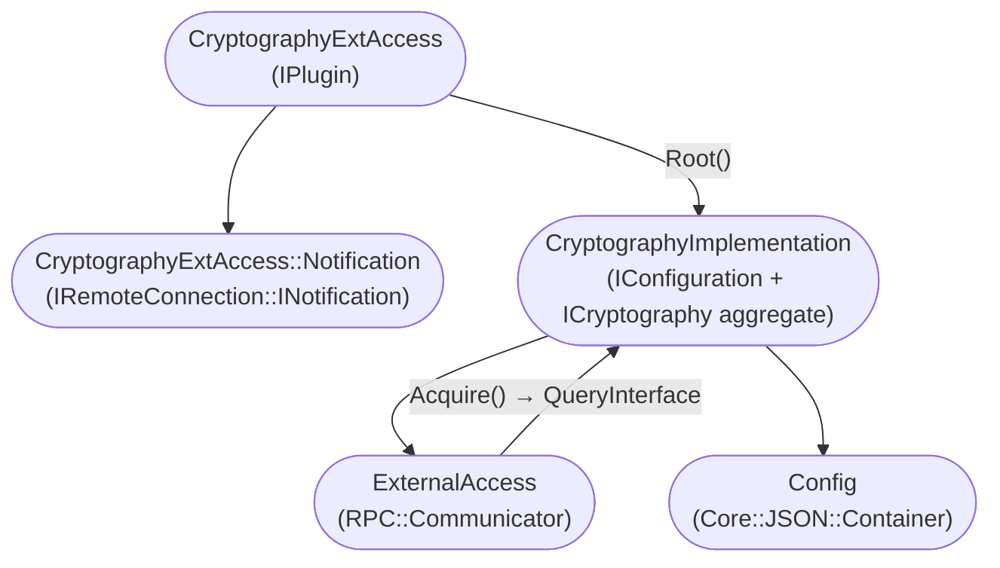

---

## Prerequisites & Dependencies

**Thunder / WPEFramework APIs verification:**

- `PluginHost::IPlugin` — confirmed via `INTERFACE_ENTRY(PluginHost::IPlugin)` in `CryptographyExtAccess.h`.
- `PluginHost::JSONRPC` — **not implemented**. No JSON-RPC surface is exposed.
- `Exchange::IConfiguration` — confirmed via `_service->Root<Exchange::IConfiguration>(...)` in `CryptographyExtAccess.cpp` and `INTERFACE_ENTRY(Exchange::IConfiguration)` in `CryptographyRPC.cpp`.
- `Exchange::ICryptography` — confirmed via `Exchange::ICryptography::Instance("")` and `INTERFACE_AGGREGATE(Exchange::ICryptography, _cryptography)` in `CryptographyRPC.cpp`.

**IARM Bus verification:**
IARM Bus headers appear in `build_dependencies.sh` as empty stub files created for the test build environment only (`touch rdk/iarmbus/libIARM.h` etc.). No `IARM_Bus_RegisterEventHandler`, `IARM_Bus_Call`, or `IARM_Bus_Init` calls are present in any production source file. **IARM Bus is not used at runtime.**

**Device Services (DS) verification:**
No DS API calls are present in any production source file. **Device Services are not used.**

**Persistent store verification:**
No persistent store reads or writes are present. **No data persistence is implemented.**

### RDK-E Platform Requirements

- **WPEFramework Version**: Requires Thunder R4-compatible build. `build_dependencies.sh` clones Thunder at branch `R4.4.1` and ThunderTools at `R4.4.3`.
- **C++ Standard**: C++11 (`CXX_STANDARD 11` in `plugin/CMakeLists.txt`). Tests use C++14.
- **Build Dependencies**:
  - `${NAMESPACE}Plugins` — Thunder plugin infrastructure
  - `${NAMESPACE}Definitions` — Thunder common type definitions
  - `${NAMESPACE}Cryptography` (CMake `find_package`) — provides `Exchange::ICryptography::Instance()` and the platform-specific cryptography backend
  - `CompileSettingsDebug` — compile settings package
  - `FindDL.cmake` in `cmake/` — provides the `dl` library (dynamic linking)
- **Build-time CMake options**:
  - `PLUGIN_CRYPTOGRAPHYEXTACCESS_AUTOSTART` (default: `"true"`) — whether the plugin activates automatically at Thunder startup
  - `PLUGIN_CRYPTOGRAPHYEXTACCESS_MODE` (default: `"Off"`) — process mode (`"Off"`, `"Local"`, or container); `"Off"` runs in-process within Thunder
  - `PLUGIN_CRYPTOGRAPHYEXTACCESS_USER` — optional OS user identity for the plugin process
  - `PLUGIN_CRYPTOGRAPHYEXTACCESS_GROUP` — optional OS group identity for the plugin process
  - `PLUGIN_CRYPTOGRAPHY` (top-level `CMakeLists.txt`) — gates inclusion of the `plugin/` subdirectory
- **RDK-E Plugin Dependencies**: None declared via COM-RPC or IARM. The only declared dependency is the `PLATFORM` subsystem (`{ subsystem::PLATFORM }` in the plugin metadata preconditions).
- **Runtime system dependency**: The `apps` OS group must exist on the target system. `getgrnam("apps")` is called during `Configure()`; if the group does not exist, `chown` of the UNIX socket is skipped and a trace warning is logged.
- **Autostart**: Defaults to `"true"` — the plugin activates automatically when Thunder starts.
- **Connector path**: `/tmp/icryptography` (default). Configurable via the plugin JSON configuration key `connector`.
- **IARM Bus**: Not used at runtime.
- **Systemd services**: No systemd service file is present in this repository.

---

## Quick Start

### 1. Activate the plugin (if not autostarted)

```js
// JavaScript — ThunderJS
import ThunderJS from "thunderjs";
const thunderJS = ThunderJS({ host: "localhost", port: 9998 });
await thunderJS.Controller.activate({ callsign: "org.rdk.Cryptography" });
```

### 2. Access cryptographic operations from a native process

The plugin is not JSON-RPC accessible. Native processes use Thunder's COM-RPC client library to connect to `/tmp/icryptography` and acquire an `ICryptography` interface.

```cpp
// C++ — native client connecting to the UNIX socket
#include <com/com.h>
#include <cryptography/cryptography.h>

WPEFramework::RPC::CommunicatorClient client(
    WPEFramework::Core::NodeId("/tmp/icryptography"));

Exchange::ICryptography* crypto = client.Open<Exchange::ICryptography>(
    _T("CryptographyImplementation"),
    Exchange::ICryptography::ID,
    ~0u,  // version wildcard
    Core::infinite);

if (crypto != nullptr) {
    // Use ICryptography interface
    crypto->Release();
}
```

### 3. Cleanup

The plugin does not expose a JSON-RPC deactivation path. Deactivation is handled through the Thunder Controller plugin.

```js
await thunderJS.Controller.deactivate({ callsign: "org.rdk.Cryptography" });
```

---

## Configuration

### Key Configuration Files

| Configuration File                     | Purpose                                                                        | Override Mechanism                        |
| -------------------------------------- | ------------------------------------------------------------------------------ | ----------------------------------------- |
| `plugin/CryptographyExtAccess.conf.in` | Thunder plugin activation config — sets callsign, autostart, mode, user, group | CMake variables substituted at build time |
| `plugin/CryptographyExtAccess.config`  | CMake helper that generates the `.conf.in` substitution map                    | CMake variables                           |

### Configuration Parameters

| Parameter   | Type   | Default                | Source                                             | Description                                                                      |
| ----------- | ------ | ---------------------- | -------------------------------------------------- | -------------------------------------------------------------------------------- |
| `callsign`  | string | `org.rdk.Cryptography` | conf.in                                            | Thunder plugin callsign                                                          |
| `autostart` | bool   | `true`                 | `PLUGIN_CRYPTOGRAPHYEXTACCESS_AUTOSTART` CMake var | Plugin activates automatically at Thunder startup                                |
| `mode`      | string | `"Off"`                | `PLUGIN_CRYPTOGRAPHYEXTACCESS_MODE` CMake var      | Process mode: `"Off"` (in-process), `"Local"` (out-of-process), or container     |
| `user`      | string | not set                | `PLUGIN_CRYPTOGRAPHYEXTACCESS_USER` CMake var      | Optional OS user for the plugin process (only written to config if set)          |
| `group`     | string | not set                | `PLUGIN_CRYPTOGRAPHYEXTACCESS_GROUP` CMake var     | Optional OS group for the plugin process (only written to config if set)         |
| `connector` | string | `/tmp/icryptography`   | plugin JSON config at runtime                      | UNIX domain socket path. Parsed from `framework->ConfigLine()` in `Configure()`. |

### Configuration Persistence

Configuration changes are not persisted across reboots. No persistent store is written by this plugin.

---

## API / Usage

### Interface Type

This plugin does **not** expose a JSON-RPC API. It has no `PluginHost::JSONRPC` interface.

The interface exposed to external consumers is `Exchange::ICryptography`, accessed over a UNIX domain socket at `/tmp/icryptography` using Thunder's `RPC::Communicator` / `CommunicatorClient` COM-RPC mechanism. The socket is readable and writable by members of the `apps` OS group.

The plugin's role in Thunder is purely lifecycle management (it appears in the Thunder Controller as `org.rdk.Cryptography`) and brokering the UNIX socket setup. Cryptographic operations are fully defined by `Exchange::ICryptography` in the Thunder framework's Cryptography package.

---

## Component Interactions

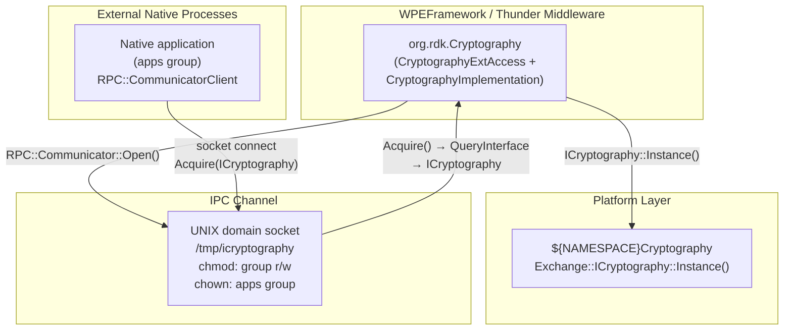

### Interaction Matrix

| Target Component / Layer           | Interaction Purpose                                  | Key APIs                                                  |
| ---------------------------------- | ---------------------------------------------------- | --------------------------------------------------------- |
| **Platform Layer**                 |                                                      |                                                           |
| `${NAMESPACE}Cryptography` library | Obtain the platform cryptography implementation      | `Exchange::ICryptography::Instance("")`                   |
| **IARM Bus**                       | Not used at runtime                                  | —                                                         |
| **Device Services / HAL**          | Not used                                             | —                                                         |
| **Persistent Store**               | Not used                                             | —                                                         |
| **External Native Processes**      | Provide ICryptography access to apps-group processes | `RPC::Communicator` over UNIX socket `/tmp/icryptography` |

### IPC Flow Patterns

**Plugin Initialization Flow:**

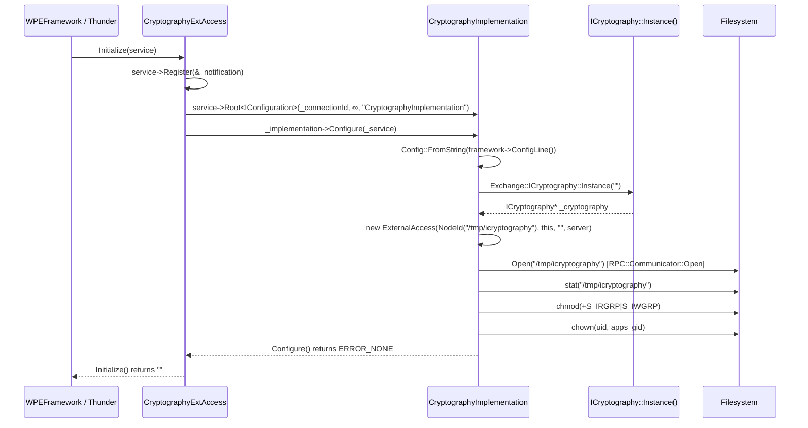

**External Client Request Flow:**

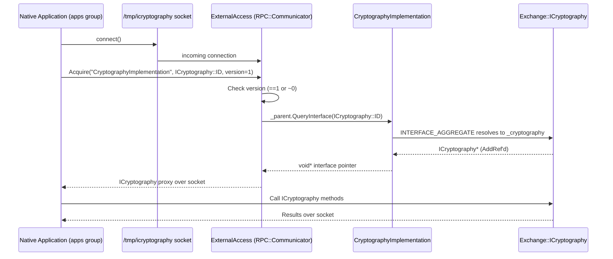

---

## Testing

### Test Levels

| Level            | Scope                                   | Location                                                                                                                                                      |
| ---------------- | --------------------------------------- | ------------------------------------------------------------------------------------------------------------------------------------------------------------- |
| L1 – Unit        | Individual classes, dependencies mocked | `Tests/L1Tests/` — CMakeLists.txt present; no test source files present in this repository                                                                    |
| L2 – Integration | Thunder runtime integration             | `Tests/L2Tests/` — CMakeLists.txt present; references `entservices-testframework` and `MockAccessor` library; no test source files present in this repository |

The L1 test CMakeLists.txt defines the `add_plugin_test_ex` macro infrastructure but lists no test source files (`TEST_SRC` is empty). The L2 test CMakeLists.txt links against `TestMocklib` and `MockAccessor` from an external `entservices-testframework` repository and uses GoogleTest fetched at build time.

### Running Tests

```bash
# L1 tests
cmake -G Ninja -B build -DRDK_SERVICES_L1_TEST=ON -DPLUGIN_CRYPTOGRAPHY=ON
cmake --build build
ctest --output-on-failure

# L2 tests
cmake -G Ninja -B build -DRDK_SERVICE_L2_TEST=ON -DPLUGIN_CRYPTOGRAPHY=ON
cmake --build build
ctest --output-on-failure
```

# Entservices-Devicediagnostics

---

## Overview

`entservices-devicediagnostics` is a WPEFramework Thunder plugin that provides device configuration queries, milestone log access, milestone logging, and AV decoder status monitoring. Its callsign is `org.rdk.DeviceDiagnostics` and it exposes a JSON-RPC surface via the auto-generated `Exchange::JDeviceDiagnostics` bindings as well as a COM-RPC `Exchange::IDeviceDiagnostics` interface.

At the device level, the plugin serves two distinct functions: it retrieves named device configuration parameters by posting a JSON request to a local HTTP service running on `127.0.0.1:10999`, and it monitors AV decoder activity using the Essos Resource Manager (`essosrmgr`) library (conditionally compiled under `ENABLE_ERM`). When decoder status changes are detected, an `onAVDecoderStatusChanged` event is fired to all registered notification subscribers.

At the module level, the plugin follows the standard two-library Thunder pattern. `WPEFrameworkDeviceDiagnostics` is the thin plugin library that implements `PluginHost::IPlugin` and `PluginHost::JSONRPC`. `WPEFrameworkDeviceDiagnosticsImplementation` is the separate implementation library that holds all business logic, the curl-based device configuration query, filesystem reads of the milestone log file, AV decoder polling via EssRMgr (when enabled), and asynchronous event dispatch.

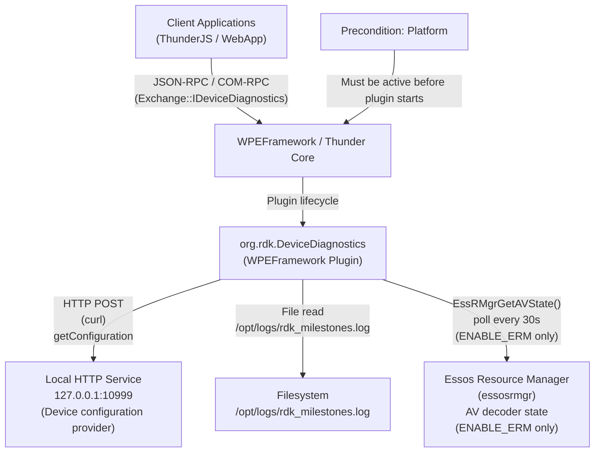

**Key Features & Responsibilities:**

- **Device configuration query**: Posts a JSON body containing a list of named parameters to a local HTTP server at `127.0.0.1:10999` using libcurl (30-second timeout), parses the response, and returns a list of name/value pairs via `GetConfiguration`.
- **Milestone log retrieval**: Reads `/opt/logs/rdk_milestones.log` line by line and returns the contents as a string iterator via `GetMilestones`.
- **Milestone logging**: Writes a caller-supplied marker string to the platform milestone log via `logMilestone()` (compiled in when `RDK_LOG_MILESTONE` is defined). Returns success without writing if `RDK_LOG_MILESTONE` is not defined.
- **AV decoder status query**: Returns the current most-active AV decoder status (`IDLE`, `PAUSED`, or `ACTIVE`) from the Essos Resource Manager via `GetAVDecoderStatus`. Without `ENABLE_ERM`, always returns `IDLE`.
- **AV decoder status change notification**: When `ENABLE_ERM` is defined, a dedicated background poll thread queries `EssRMgrGetAVState()` every 30 seconds. When the status changes, an `onAVDecoderStatusChanged` event is dispatched asynchronously to all registered `IDeviceDiagnostics::INotification` subscribers.

---

## Architecture

### High-Level Architecture

`entservices-devicediagnostics` uses the standard WPEFramework two-library out-of-process plugin architecture. The thin plugin library (`WPEFrameworkDeviceDiagnostics`) registers the service callsign, exposes the auto-generated JSON-RPC methods from `Exchange::JDeviceDiagnostics`, and aggregates `Exchange::IDeviceDiagnostics` for COM-RPC clients via `INTERFACE_AGGREGATE`. The implementation library (`WPEFrameworkDeviceDiagnosticsImplementation`) runs in a separate process and holds all business logic.

The northbound interface is dual: JSON-RPC clients (ThunderJS, WebSocket) call methods on `org.rdk.DeviceDiagnostics`, and COM-RPC clients use the `Exchange::IDeviceDiagnostics` interface. The southbound interface has two paths: libcurl HTTP POST to `127.0.0.1:10999` for device configuration, and direct filesystem reads of `/opt/logs/rdk_milestones.log` for milestone data. AV decoder status is pulled from Essos Resource Manager (`EssRMgrGetAVState`) when `ENABLE_ERM` is defined at build time.

The AV decoder polling is done in a dedicated `std::thread` (`AVPollThread`) launched at implementation construction (when `ENABLE_ERM` is set). It waits on a `std::condition_variable` with a 30-second timeout, calls `getMostActiveDecoderStatus()`, and if the status has changed, posts an `ON_AVDECODER_STATUSCHANGED` event to the worker pool via `Job::Create`. The worker pool thread then acquires `_adminLock` and iterates all registered `INotification` subscribers.

No IARM Bus calls are made in any production source file. No persistent store reads or writes occur at runtime.

A component diagram showing the internal structure is given below:

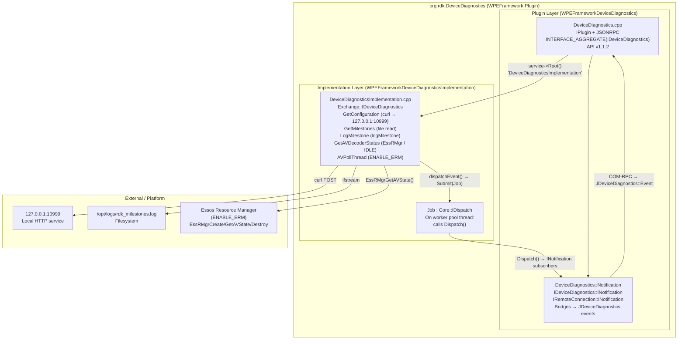

### Threading Model

- **Threading Architecture**: Multi-threaded. The plugin uses the WPEFramework worker pool for asynchronous event dispatch and, when `ENABLE_ERM` is defined, a dedicated `std::thread` for AV decoder status polling.
- **Main Thread / COM-RPC Dispatch Thread**: Executes `IPlugin::Initialize()`, `Deinitialize()`, and all `IDeviceDiagnostics` method implementations (`GetConfiguration`, `GetMilestones`, `LogMilestone`, `GetAVDecoderStatus`).
- **AVPollThread** (when `ENABLE_ERM` is defined): Created in `DeviceDiagnosticsImplementation` constructor. Waits on `m_avDecoderStatusCv` with a 30-second timeout, calls `getMostActiveDecoderStatus()` each cycle. When status changes, calls `onDecoderStatusChange()` → `dispatchEvent()` → `Core::IWorkerPool::Instance().Submit(Job::Create(...))`. Exits when `m_pollThreadRun == 0`.
- **Worker Pool Thread**: Dequeues `Job` instances submitted by `dispatchEvent()` and calls `DeviceDiagnosticsImplementation::Dispatch()`, which acquires `_adminLock` and iterates all `INotification` subscribers.
- **Synchronization**:
  - `Core::CriticalSection _adminLock` — guards the `_deviceDiagnosticsNotification` subscriber list and is held during `Register`, `Unregister`, and `Dispatch`.
  - `std::mutex m_AVDecoderStatusLock` — guards `m_pollThreadRun` and `getMostActiveDecoderStatus()` access in `AVPollThread` and `GetAVDecoderStatus`.
  - `std::condition_variable m_avDecoderStatusCv` — used to wake `AVPollThread` early on shutdown.
- **Async / Event Dispatch**: `dispatchEvent(event, params)` → `Core::IWorkerPool::Instance().Submit(Job::Create(this, event, params))`. The `Job::Dispatch()` call on the worker thread invokes `Dispatch()` under `_adminLock`.

---

## Design

`entservices-devicediagnostics` separates plugin lifecycle (thin layer) from business logic (implementation layer). `DeviceDiagnostics` handles COM-RPC lifecycle, JSON-RPC registration, and notification bridging. `DeviceDiagnosticsImplementation` owns the actual data fetching, filesystem access, and AV state tracking.

Device configuration retrieval is done by building a JSON payload (`{"paramList":[{"name":"<param>"},...]}`) and POSTing it via libcurl to `http://127.0.0.1:10999` with a 30-second timeout. The implementation parses the raw response text using string search for `"name":` and `"value":` substrings without a JSON parser, extracting name/value pairs into a `ParamList` list. The result is wrapped in a COM-RPC iterator (`RPC::IteratorType<IDeviceDiagnosticsParamListIterator>`).

AV decoder status polling avoids ERM's lack of event support by running a periodically waking thread. The poll interval is `AVDECODERSTATUS_RETRY_INTERVAL` (30 seconds). Only status transitions are reported — if the status is unchanged, the event is not fired. Decoder states are mapped to strings: `0 → "IDLE"`, `1 → "PAUSED"`, `2 → "ACTIVE"`.

`LogMilestone` fully depends on the `RDK_LOG_MILESTONE` compile-time define. If not defined, it returns `success: true` without writing anything. `GetMilestones` fails if `/opt/logs/rdk_milestones.log` does not exist on the filesystem, returning `success: false` in that case.

No data persistence is implemented by the plugin itself. The milestone log file is written by the platform milestone logging subsystem, not by this plugin (the plugin only reads it, or appends via `logMilestone` on platforms where `RDK_LOG_MILESTONE` is defined).

### Component Diagram

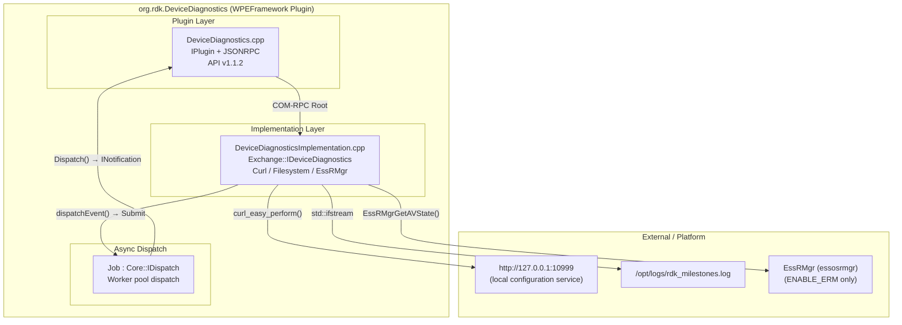

---

## Internal Modules

| Module / Class                    | Description                                                                                                                                                                                                                                                                                                                                                                               | Key Files                                                                                |
| --------------------------------- | ----------------------------------------------------------------------------------------------------------------------------------------------------------------------------------------------------------------------------------------------------------------------------------------------------------------------------------------------------------------------------------------- | ---------------------------------------------------------------------------------------- |
| `DeviceDiagnostics`               | Thin plugin entry point. Implements `PluginHost::IPlugin` and `PluginHost::JSONRPC`. Aggregates `Exchange::IDeviceDiagnostics` via `INTERFACE_AGGREGATE`. Registers auto-generated JSON-RPC bindings via `Exchange::JDeviceDiagnostics::Register`. Manages the remote connection lifecycle and bridges COM-RPC notifications to JSON-RPC events.                                          | `plugin/DeviceDiagnostics.h`, `plugin/DeviceDiagnostics.cpp`                             |
| `DeviceDiagnostics::Notification` | Inner class of `DeviceDiagnostics`. Implements `Exchange::IDeviceDiagnostics::INotification` and `RPC::IRemoteConnection::INotification`. `OnAVDecoderStatusChanged` calls `Exchange::JDeviceDiagnostics::Event::OnAVDecoderStatusChanged` to fire the JSON-RPC notification. `Deactivated` submits a shell deactivation job to the worker pool on unexpected remote process termination. | `plugin/DeviceDiagnostics.h`, `plugin/DeviceDiagnostics.cpp`                             |
| `DeviceDiagnosticsImplementation` | Implementation layer. Implements `Exchange::IDeviceDiagnostics`. Provides `GetConfiguration` (curl HTTP POST), `GetMilestones` (file read), `LogMilestone` (via `logMilestone()`), `GetAVDecoderStatus` (EssRMgr or hardcoded `IDLE`), and manages the AV decoder status poll thread under `ENABLE_ERM`.                                                                                  | `plugin/DeviceDiagnosticsImplementation.h`, `plugin/DeviceDiagnosticsImplementation.cpp` |
| `Job`                             | Inner class of `DeviceDiagnosticsImplementation`. Implements `Core::IDispatch`. Created via `Job::Create(this, event, params)` and submitted to `Core::IWorkerPool`. On execution, calls `DeviceDiagnosticsImplementation::Dispatch()` which iterates all registered `INotification` subscriber under `_adminLock`.                                                                       | `plugin/DeviceDiagnosticsImplementation.h`                                               |

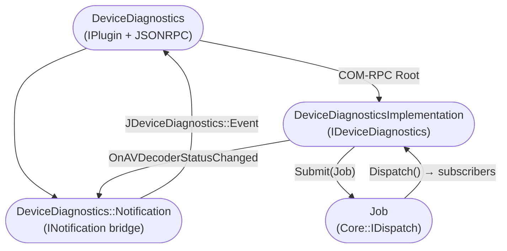

---

## Prerequisites & Dependencies

**Thunder / WPEFramework APIs verification:**

- `PluginHost::IPlugin` — confirmed via `INTERFACE_ENTRY(PluginHost::IPlugin)` in `DeviceDiagnostics.h`.
- `PluginHost::JSONRPC` (`IDispatcher`) — confirmed via `INTERFACE_ENTRY(PluginHost::IDispatcher)` in `DeviceDiagnostics.h`.
- `Exchange::IDeviceDiagnostics` — confirmed via `INTERFACE_AGGREGATE(Exchange::IDeviceDiagnostics, _deviceDiagnostics)` and `service->Root<Exchange::IDeviceDiagnostics>(...)` in `DeviceDiagnostics.cpp`.
- `Exchange::JDeviceDiagnostics::Register/Unregister` — confirmed in `DeviceDiagnostics.cpp::Initialize/Deinitialize`.

**IARM Bus verification:**
No `IARM_Bus_RegisterEventHandler`, `IARM_Bus_Call`, `IARM_Bus_Init`, or any `IARM_Bus_*` call is present in any production source file. **IARM Bus is not used at runtime.**

**Device Services (DS) verification:**
No DS API calls are present. **Device Services are not used.**

**Curl verification:**
`curl_easy_init()`, `curl_easy_setopt()`, `curl_easy_perform()`, `curl_easy_getinfo()`, and `curl_easy_cleanup()` are called in `getConfig()` in `DeviceDiagnosticsImplementation.cpp`. The `cmake/FindCurl.cmake` locates `libcurl` at build time.

**EssRMgr (Essos Resource Manager) verification:**
`EssRMgrCreate()`, `EssRMgrGetAVState()`, and `EssRMgrDestroy()` are called in `DeviceDiagnosticsImplementation.cpp` within `#ifdef ENABLE_ERM` guards. Linked via `essosrmgr` when `BUILD_ENABLE_ERM` is set in CMake.

**Milestone logging verification:**
`logMilestone(marker.c_str())` is called in `LogMilestone()` within `#ifdef RDK_LOG_MILESTONE` guards. The header `rdk_logger_milestone.h` is included when `RDK_LOG_MILESTONE` is defined.

**Persistent store verification:**
No persistent store reads or writes are present. **No data persistence is implemented.**

### RDK-E Platform Requirements

- **WPEFramework Version**: Supports Thunder R4 and non-R4. `Job::Create` uses `USE_THUNDER_R4` preprocessor define to choose the correct `Core::ProxyType` cast.
- **C++ Standard**: C++11 for both plugin and implementation libraries; C++14 for tests.
- **Build Dependencies**:
  - `${NAMESPACE}Plugins` — Thunder plugin infrastructure
  - `${NAMESPACE}Definitions` — Thunder common type definitions
  - `CompileSettingsDebug` — compile settings package
  - `libcurl` — found via `cmake/FindCurl.cmake`; used for device configuration HTTP queries
  - `essosrmgr` — linked when `BUILD_ENABLE_ERM=ON`; provides `EssRMgrCreate/GetAVState/Destroy`
  - `rdk_logger_milestone.h` / `logMilestone()` — used when `RDK_LOG_MILESTONE` is defined
  - `TestMocklib` — linked to implementation in L2 test builds when `RDK_SERVICE_L2_TEST=ON`
- **Build-time CMake options**:
  - `PLUGIN_DEVICEDIAGNOSTICS_STARTUPORDER` — sets the numeric startup order of the plugin
  - `PLUGIN_DEVICEDIAGNOSTICS_MODE` — sets the process isolation mode (`"Off"`, `"Local"`, etc.)
  - `BUILD_ENABLE_ERM` — enables Essos Resource Manager integration and AV decoder status polling
  - `RDK_LOG_MILESTONE` — enables actual milestone writing via `logMilestone()`
- **Precondition**: `precondition = ["Platform"]` — the Platform plugin must activate before `org.rdk.DeviceDiagnostics`.
- **Autostart**: `autostart = "false"` — the plugin does not start automatically; it must be activated.
- **External service dependency**: `GetConfiguration` depends on an HTTP service running at `127.0.0.1:10999`. If the service is not available, `curl_easy_perform` returns a non-`CURLE_OK` result, the method returns `Core::ERROR_GENERAL` with `success: false`.
- **Filesystem dependency**: `GetMilestones` requires `/opt/logs/rdk_milestones.log` to exist.
- **IARM Bus**: Not used at runtime.
- **Systemd services**: No systemd service file is present in this repository.

---

## Quick Start

### 1. Activate the plugin

```js
import ThunderJS from "thunderjs";
const thunderJS = ThunderJS({ host: "localhost", port: 9998 });
await thunderJS.Controller.activate({ callsign: "org.rdk.DeviceDiagnostics" });
```

### 2. Query device configuration parameters

```js
thunderJS["org.rdk.DeviceDiagnostics"]
  .getConfiguration({
    names: ["Device.X_CISCO_COM_LED.RedPwm", "Device.DeviceInfo.Manufacturer"],
  })
  .then((result) => console.log(result.paramList))
  .catch((err) => console.error(err));
```

### 3. Get AV decoder status

```js
thunderJS["org.rdk.DeviceDiagnostics"]
  .getAVDecoderStatus()
  .then((result) => console.log(result.avDecoderStatus)) // "IDLE", "PAUSED", or "ACTIVE"
  .catch((err) => console.error(err));
```

### 4. Get milestone log entries

```js
thunderJS["org.rdk.DeviceDiagnostics"]
  .getMilestones()
  .then((result) => console.log(result.milestones))
  .catch((err) => console.error(err));
```

### 5. Subscribe to AV decoder status changes

```js
thunderJS.on(
  "org.rdk.DeviceDiagnostics",
  "onAVDecoderStatusChanged",
  (payload) => {
    console.log("Decoder status:", payload.avDecoderStatusChange);
  },
);
```

---

## Configuration

### Key Configuration Files

| Configuration File                 | Purpose                                                                                                                   | Override Mechanism                        |
| ---------------------------------- | ------------------------------------------------------------------------------------------------------------------------- | ----------------------------------------- |
| `plugin/DeviceDiagnostics.conf.in` | Thunder plugin activation config — callsign, autostart, precondition, startup order, process mode, implementation locator | CMake variables substituted at build time |
| `plugin/DeviceDiagnostics.config`  | CMake helper that generates the conf.in substitution map                                                                  | CMake variables                           |

### Configuration Parameters

| Parameter                        | Type   | Default                                                 | Source                                             | Description                                                                      |
| -------------------------------- | ------ | ------------------------------------------------------- | -------------------------------------------------- | -------------------------------------------------------------------------------- |
| `callsign`                       | string | `org.rdk.DeviceDiagnostics`                             | conf.in                                            | Thunder plugin callsign                                                          |
| `autostart`                      | bool   | `false`                                                 | conf.in                                            | Plugin does not activate automatically at Thunder startup                        |
| `preconditions`                  | array  | `["Platform"]`                                          | conf.in                                            | Required active subsystems before this plugin can start                          |
| `startuporder`                   | int    | (empty, set by `PLUGIN_DEVICEDIAGNOSTICS_STARTUPORDER`) | CMake                                              | Relative activation order                                                        |
| `mode`                           | string | `PLUGIN_DEVICEDIAGNOSTICS_MODE`                         | CMake                                              | Process isolation mode (`"Off"` = in-process, `"Local"` = out-of-process)        |
| `connector` HTTP endpoint        | string | `http://127.0.0.1:10999`                                | hardcoded in `DeviceDiagnosticsImplementation.cpp` | Local HTTP service endpoint for `GetConfiguration` — not configurable at runtime |
| `curlTimeoutInSeconds`           | int    | `30`                                                    | hardcoded in `DeviceDiagnosticsImplementation.cpp` | libcurl timeout for `GetConfiguration` HTTP calls                                |
| `AVDECODERSTATUS_RETRY_INTERVAL` | int    | `30` (seconds)                                          | compile-time `#define`                             | Poll interval for AV decoder status thread (ENABLE_ERM only)                     |
| Milestone log path               | string | `/opt/logs/rdk_milestones.log`                          | hardcoded (`MILESTONES_LOG_FILE`)                  | Path read by `GetMilestones` — not configurable at runtime                       |

### Configuration Persistence

Configuration changes are not persisted across reboots. No persistent store is written by this plugin.

---

## API / Usage

### Interface Type

- **JSON-RPC over Thunder WebSocket** (`ws://host:9998/jsonrpc`) using callsign `org.rdk.DeviceDiagnostics`.
- **COM-RPC Exchange interface** (`Exchange::IDeviceDiagnostics`) — available in-process to other Thunder plugins via `INTERFACE_AGGREGATE`.

---

### Methods

#### `getConfiguration`

Returns device configuration values for a given list of named parameters. The implementation POSTs the names to `http://127.0.0.1:10999` using libcurl and parses the response for name/value pairs.

**Parameters**

| Name    | Type             | Required | Description                                                                   |
| ------- | ---------------- | -------- | ----------------------------------------------------------------------------- |
| `names` | array of strings | Yes      | List of parameter names to query (e.g., `["Device.X_CISCO_COM_LED.RedPwm"]`). |

**Response**

```json
{
  "paramList": [{ "name": "Device.X_CISCO_COM_LED.RedPwm", "value": "123" }],
  "success": true
}
```

Returns `success: false` if the curl request fails or the HTTP response code is not `0` or `200`.

**Example**

```js
thunderJS["org.rdk.DeviceDiagnostics"]
  .getConfiguration({
    names: ["Device.X_CISCO_COM_LED.RedPwm"],
  })
  .then((r) => console.log(r.paramList));
```

---

#### `getMilestones`

Reads `/opt/logs/rdk_milestones.log` and returns its non-empty lines as an array of strings.

**Parameters**: None.

**Response**

```json
{
  "milestones": [
    "2025-01-01T00:00:00 Boot started",
    "2025-01-01T00:00:05 Network up"
  ],
  "success": true
}
```

Returns `success: false` if the file does not exist or cannot be opened.

**Example**

```js
thunderJS["org.rdk.DeviceDiagnostics"]
  .getMilestones()
  .then((r) => console.log(r.milestones));
```

---

#### `logMilestone`

Writes a marker string to the platform milestone log via `logMilestone()`. If the build does not define `RDK_LOG_MILESTONE`, the call is a no-op but still returns `success: true`.

**Parameters**

| Name     | Type   | Required | Description                                            |
| -------- | ------ | -------- | ------------------------------------------------------ |
| `marker` | string | Yes      | Non-empty marker string to write to the milestone log. |

**Response**

```json
{ "success": true }
```

Returns `success: false` if `marker` is empty.

**Example**

```js
thunderJS["org.rdk.DeviceDiagnostics"]
  .logMilestone({ marker: "AppLaunched" })
  .then((r) => console.log(r.success));
```

---

#### `getAVDecoderStatus`

Returns the current most-active AV decoder status. When `ENABLE_ERM` is defined, queries `EssRMgrGetAVState` under `m_AVDecoderStatusLock`. Without `ENABLE_ERM`, always returns `"IDLE"`.

**Parameters**: None.

**Response**

```json
{ "avDecoderStatus": "IDLE" }
```

Possible values: `"IDLE"`, `"PAUSED"`, `"ACTIVE"`.

**Example**

```js
thunderJS["org.rdk.DeviceDiagnostics"]
  .getAVDecoderStatus()
  .then((r) => console.log(r.avDecoderStatus));
```

---

### Events / Notifications

| Event                      | Trigger Condition                                                                                                                                                                         | Payload                                                 |
| -------------------------- | ----------------------------------------------------------------------------------------------------------------------------------------------------------------------------------------- | ------------------------------------------------------- |
| `onAVDecoderStatusChanged` | AV decoder state changes from one value to another, detected by `AVPollThread` via `EssRMgrGetAVState()` (fires only when `ENABLE_ERM` is defined at build time; does not fire otherwise) | `{ "avDecoderStatusChange": "<IDLE\|PAUSED\|ACTIVE>" }` |

---

## Component Interactions

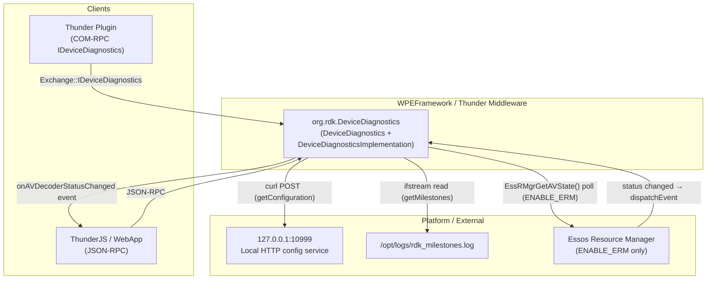

### Interaction Matrix

| Target Component / Layer   | Interaction Purpose                         | Key APIs                                                                                                                                                       |
| -------------------------- | ------------------------------------------- | -------------------------------------------------------------------------------------------------------------------------------------------------------------- |
| **Local HTTP service**     | Fetch device configuration name/value pairs | `curl_easy_init`, `curl_easy_setopt(CURLOPT_URL, "http://127.0.0.1:10999")`, `curl_easy_perform`, `curl_easy_cleanup` in `DeviceDiagnosticsImplementation.cpp` |
| **Filesystem**             | Read milestone log entries                  | `std::ifstream` on `/opt/logs/rdk_milestones.log` in `DeviceDiagnosticsImplementation.cpp`                                                                     |
| **Essos Resource Manager** | Poll AV decoder state                       | `EssRMgrCreate()`, `EssRMgrGetAVState()`, `EssRMgrDestroy()` in `DeviceDiagnosticsImplementation.cpp` (ENABLE_ERM only)                                        |
| **IARM Bus**               | Not used at runtime                         | —                                                                                                                                                              |
| **Device Services / HAL**  | Not used                                    | —                                                                                                                                                              |
| **Persistent Store**       | Not used                                    | —                                                                                                                                                              |

### IPC Flow Patterns

**GetConfiguration request flow:**

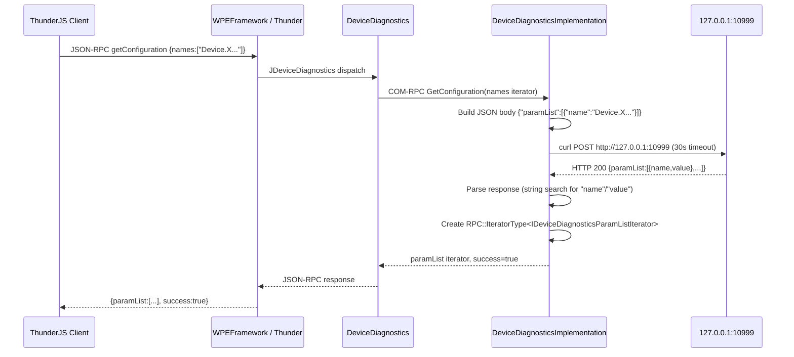

**AV decoder status change event flow (ENABLE_ERM only):**

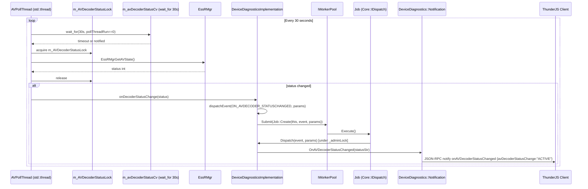

---

## Testing

### Test Levels

| Level            | Scope                                                                                                   | Location                                           |
| ---------------- | ------------------------------------------------------------------------------------------------------- | -------------------------------------------------- |
| L1 – Unit        | `DeviceDiagnostics` + `DeviceDiagnosticsImplementation` with mocked Thunder, curl, and ERM dependencies | `Tests/L1Tests/tests/test_DeviceDiagnostics.cpp`   |
| L2 – Integration | Thunder runtime integration using COM-RPC `IDeviceDiagnostics`                                          | `Tests/L2Tests/tests/DeviceDiagnostics_L2Test.cpp` |

### L1 Test Coverage (confirmed in source)

- `RegisterMethod` — verifies `getConfiguration` and `getAVDecoderStatus` JSON-RPC methods are registered.
- `getConfiguration` — sets up a real TCP server on port 10999 in a thread, invokes the JSON-RPC handler, and verifies the HTTP POST body format (`{"paramList":[{"name":"test"}]}`).
- `getAVDecoderStatus` — invokes handler, verifies response is `{"avDecoderStatus":"IDLE"}` (no ERM in test environment).

### L2 Test Coverage (confirmed in source)

L2 tests use `Exchange::IDeviceDiagnostics::INotification` (`DiagnosticsNotificationHandler`) via COM-RPC and verify `onAVDecoderStatusChanged` event delivery using a `std::condition_variable` with a 31-second wait timeout (`AV_POLL_TIMEOUT`). Callsign used: `org.rdk.DeviceDiagnostics.1`.

### Mock Framework

L1 tests mock: `ServiceMock`, `COMLinkMock`, `DeviceDiagnosticsMock`, `WrapsImplMock`, `WorkerPoolImplementation`.
L2 tests link against `TestMocklib` (when `RDK_SERVICE_L2_TEST=ON` and `L2_TEST_OOP_RPC` not set) and `MockAccessor`.

### Running Tests

```bash
# L1 tests
cmake -G Ninja -B build -DRDK_SERVICES_L1_TEST=ON -DPLUGIN_DEVICEDIAGNOSTICS=ON
cmake --build build
ctest --output-on-failure

# L2 tests
cmake -G Ninja -B build -DRDK_SERVICE_L2_TEST=ON -DPLUGIN_DEVICEDIAGNOSTICS=ON
cmake --build build
ctest --output-on-failure
```

# entservices-deviceinfo

---

## Overview

`entservices-deviceinfo` is a WPEFramework (Thunder) plugin that exposes device identity and capability information over JSON-RPC and COM-RPC. It aggregates data from multiple platform sources — the MFR library, Device Settings (DS), RFC parameters, shell scripts, and on-device configuration files — and presents them through three standardised Exchange interfaces: `IDeviceInfo`, `IDeviceAudioCapabilities`, and `IDeviceVideoCapabilities`.

At the product level the plugin enables applications and management systems to discover what hardware they are running on. They can retrieve the device serial number, model, chipset, firmware version, supported audio and video output capabilities, MAC addresses, IP configuration, and HDCP version without accessing platform-specific APIs directly.

At the module level the plugin is structured as two shared libraries: a thin entry-point library (`WPEFrameworkDeviceInfo`) that handles only Thunder registration and JSON-RPC wiring, and an implementation library (`WPEFrameworkDeviceInfoImplementation`) that contains all business logic in three class implementations — `DeviceInfoImplementation`, `DeviceAudioCapabilities`, and `DeviceVideoCapabilities`.

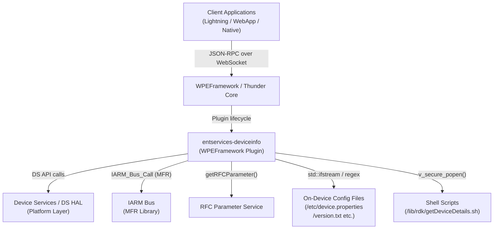

**Key Features & Responsibilities:**

- **Device identity retrieval**: Provides serial number, SKU/model number, manufacturer name, chipset, firmware version, distributor/partner ID, and release version sourced from MFR library, RFC service, and configuration files.
- **Audio capability reporting**: Queries the DS library to enumerate supported audio capabilities (Atmos, Dolby Digital, Dolby Digital Plus, DAD, DAPv2, MS12) and MS12 sub-capabilities (Dolby Volume, Intelligent Equalizer, Dialogue Enhancer) per audio port.
- **Video capability reporting**: Queries the DS library to enumerate supported video displays, supported output resolutions, the default resolution, HDCP version support (1.4 or 2.2), and host EDID (returned as a base64-encoded string).
- **Network identity**: Enumerates active network interfaces and their IP and MAC addresses using WPEFramework's `Core::AdapterIterator`, and reads Ethernet, eSB, and Wi-Fi MAC addresses and eSB IP via a platform shell script.
- **System information**: Provides uptime, free/total RAM, swap usage, CPU load (1/5/15-minute averages), hostname, WPEFramework subsystem version and build hash, and current time.
- **Three-interface aggregation**: Exposes `IDeviceInfo`, `IDeviceAudioCapabilities`, and `IDeviceVideoCapabilities` Exchange interfaces under a single callsign (`DeviceInfo`) with auto-generated JSON-RPC dispatch through `JDeviceInfo`, `JDeviceAudioCapabilities`, and `JDeviceVideoCapabilities`.
- **No events**: The plugin does not publish any Thunder notifications or IARM events.

---

## Architecture

### High-Level Architecture

`entservices-deviceinfo` follows the standard two-library Thunder plugin pattern. The thin plugin library (`WPEFrameworkDeviceInfo`) implements only `IPlugin` and `JSONRPC`. Its `Initialize()` method spawns the implementation library (in its own host process when `mode` is set to `Off`) and acquires three remote COM-RPC interfaces — `IDeviceInfo`, `IDeviceAudioCapabilities`, and `IDeviceVideoCapabilities` — each with a 2000 ms connection timeout. It then registers JSON-RPC dispatch through `JDeviceInfo::Register`, `JDeviceAudioCapabilities::Register`, and `JDeviceVideoCapabilities::Register`. No business logic lives in the thin library.

The implementation library is split across three classes that each independently initialise the IARM Bus (`Utils::IARM::init()`) and the DS library (`device::Manager::Initialize()`). `DeviceInfoImplementation` handles all device identity and system information queries. `DeviceAudioCapabilities` handles all audio port queries. `DeviceVideoCapabilities` handles all video port queries.

Northbound, all client access is through Thunder's JSON-RPC WebSocket endpoint or directly over COM-RPC. The three Exchange interfaces are aggregated under the single `DeviceInfo` callsign using `INTERFACE_AGGREGATE` entries in the thin plugin's interface map, so external consumers only need to connect to one callsign.

Southbound, the implementation layer calls the DS library (`device::Host`, `device::VideoOutputPortConfig`) for audio and video capability data, uses `IARM_Bus_Call` to the MFR library daemon (`IARM_BUS_MFRLIB_NAME`) for serialized device identity data, calls `getRFCParameter()` as a fallback data source, and reads several on-device configuration files using `std::ifstream` with `std::regex_match`. MAC addresses and IP details are additionally retrieved via `v_secure_popen` executing `/lib/rdk/getDeviceDetails.sh`.

No persistent store is used. No data is written back to any storage by this plugin.

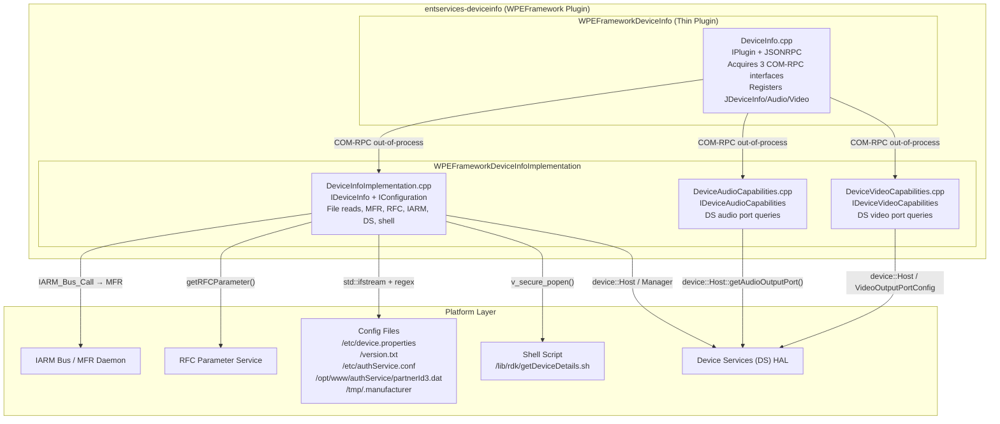

### Threading Model

- **Threading Architecture**: The implementation does not create any worker threads. All JSON-RPC method calls are dispatched synchronously on the WPEFramework COM-RPC thread that services the out-of-process host.
- **Main Thread**: Handles plugin lifecycle (`Initialize`, `Deinitialize`), COM-RPC interface acquisition, and JSON-RPC method dispatch.
- **Worker Threads**: None created by this plugin.
- **Synchronization**: No locks or mutexes are added inside the implementation classes. DS library calls are assumed to be thread-safe by the DS library itself. File reads are done per-call with local `std::ifstream` instances.
- **Async / Event Dispatch**: Not applicable. No events are fired.

---

## Design

The plugin is designed around the principle of aggregating multiple data sources behind a single stable Exchange interface set. Each of the three implementation classes independently owns its DS and IARM initialisation in its constructor, making them individually self-sufficient for out-of-process hosting. This avoids any single point of failure if one subsystem fails to initialise.

For device identity data, the implementation uses a cascading fallback strategy: a more authoritative source (MFR library) is tried first, and if it returns an empty result, the code falls back to a file read or RFC parameter. This pattern is applied per-field rather than globally, so different fields can have different primary and fallback sources without coupling them.

For MAC addresses and IP (`EthMac`, `EstbMac`, `WifiMac`, `EstbIp`), the implementation uses `v_secure_popen` to invoke `/lib/rdk/getDeviceDetails.sh`. The use of `v_secure_popen` rather than `popen` prevents shell injection from any externally influenced path or argument.

For the `SupportedVideoDisplays` method, the DS library may return multiple `VideoOutputPort` objects that share the same port name (because DS uses a separate entry per audio port associated with that video port). The implementation explicitly deduplicates by collecting unique names only.

The `HostEDID` method converts the raw byte vector returned by DS into a base64-encoded string using `Core::ToString`. It validates that the vector length does not exceed `uint16_t::max` before encoding.

The `Deactivated()` callback in `DeviceInfo.cpp` submits a deactivation job (`PluginHost::IShell::Job::Create`) if the out-of-process implementation host disconnects unexpectedly, preventing the plugin from remaining in a partially active state.

### Component Diagram

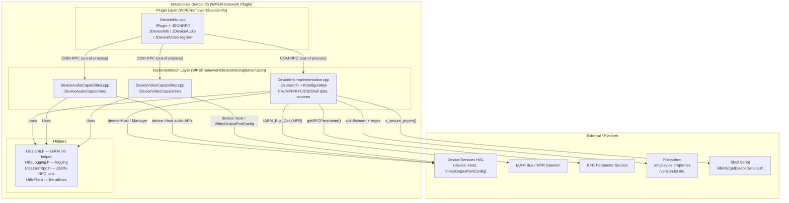

---

## Internal Modules

| Module / Class             | Description                                                                                                                                                                                                                                                                                                                                                                                           | Key Files                                                        |
| -------------------------- | ----------------------------------------------------------------------------------------------------------------------------------------------------------------------------------------------------------------------------------------------------------------------------------------------------------------------------------------------------------------------------------------------------- | ---------------------------------------------------------------- |
| `DeviceInfo`               | Thin Thunder plugin entry point. Implements `IPlugin` and `JSONRPC`. Spawns the implementation library out-of-process, acquires the three Exchange interfaces, and registers JSON-RPC dispatch for all three. Handles unexpected process disconnection via `Deactivated()`.                                                                                                                           | `DeviceInfo.cpp`, `DeviceInfo.h`                                 |
| `DeviceInfoImplementation` | Implements `IDeviceInfo` and `IConfiguration`. Handles all device identity queries (serial number, SKU, make, model, brand, chipset, firmware, release version, device type, distributor ID, SoC name), network identity (addresses, MAC addresses, eSB IP), and system information. Data comes from MFR library, RFC service, configuration files, shell scripts, DS library, and WPEFramework core. | `DeviceInfoImplementation.cpp`, `DeviceInfoImplementation.h`     |
| `DeviceAudioCapabilities`  | Implements `IDeviceAudioCapabilities`. Queries DS for audio capabilities (Atmos, DD, DDPLUS, DAD, DAPv2, MS12), MS12 sub-capabilities (Dolby Volume, Intelligent Equalizer, Dialogue Enhancer), and MS12 audio profile names per named audio port.                                                                                                                                                    | `DeviceAudioCapabilities.cpp`, `DeviceAudioCapabilities.h`       |
| `DeviceVideoCapabilities`  | Implements `IDeviceVideoCapabilities`. Queries DS for supported video display names, host EDID (as base64), default output resolution, supported resolutions list, and HDCP version per named video port. Deduplicates video display names.                                                                                                                                                           | `DeviceVideoCapabilities.cpp`, `DeviceVideoCapabilities.h`       |
| `Helpers`                  | Utility headers providing IARM initialisation (`Utils::IARM::init()`), logging macros, JSON-RPC utilities, and file utilities. Used by all three implementation classes.                                                                                                                                                                                                                              | `UtilsIarm.h`, `UtilsLogging.h`, `UtilsJsonRpc.h`, `UtilsFile.h` |

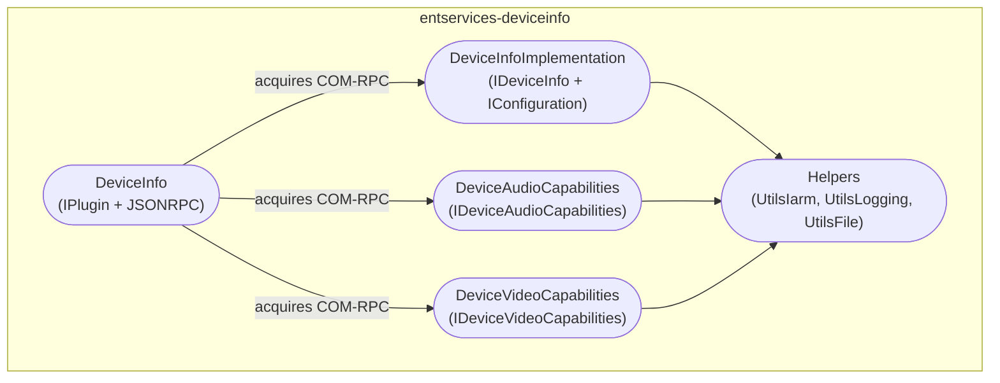

---

## Prerequisites & Dependencies

**Documentation Verification Checklist:**

- [x] **Thunder / WPEFramework APIs**: `IPlugin`, `JSONRPC`, `IConfiguration`, `Exchange::IDeviceInfo`, `Exchange::IDeviceAudioCapabilities`, `Exchange::IDeviceVideoCapabilities`, `JDeviceInfo`, `JDeviceAudioCapabilities`, `JDeviceVideoCapabilities` — all verified in source.
- [x] **IARM Bus**: `Utils::IARM::init()` confirmed in all three implementation constructors; `IARM_Bus_Call(IARM_BUS_MFRLIB_NAME, IARM_BUS_MFRLIB_API_GetSerializedData, ...)` confirmed in `DeviceInfoImplementation.cpp`.
- [x] **Device Services (DS) APIs**: `device::Manager::Initialize()`, `device::Host::getInstance()`, audio port and video port APIs — all confirmed in source.
- [x] **Persistent store**: No persistent store reads or writes found. Not implemented.
- [x] **Systemd services**: No `.service` file present in the repository. Not verified further.
- [x] **Configuration files**: `/etc/device.properties`, `/version.txt`, `/etc/authService.conf`, `/opt/www/authService/partnerId3.dat`, `/tmp/.manufacturer` — all confirmed opened by `std::ifstream` in `DeviceInfoImplementation.cpp`.
- [x] **RFC**: `getRFCParameter()` calls confirmed in `DeviceInfoImplementation.cpp`.
- [x] **Shell script**: `v_secure_popen("r", "/lib/rdk/getDeviceDetails.sh read eth_mac|estb_mac|wifi_mac|estb_ip")` confirmed.

### RDK-E Platform Requirements

- **WPEFramework Version**: Compatible with WPEFramework/Thunder as used in the RDK-E stack; `ThunderPortability.h` included in tests suggests adaptability across Thunder versions.
- **Build Dependencies**: `WPEFrameworkPlugins`, `WPEFrameworkDefinitions`, `CompileSettingsDebug`, RFC library (`rfcapi.h`), DS library (`FindDS.cmake` — provides `host.hpp`, `manager.hpp`, `exception.hpp`, `videoOutputPortConfig.hpp`), IARMBus library (`FindIARMBus.cmake`), `secure_wrapper` (for `v_secure_popen`/`v_secure_pclose`), MFR library (`mfrMgr.h`).
- **RDK-E Plugin Dependencies**: The plugin declares the `Platform` precondition in its configuration, meaning the Thunder Platform subsystem must be active before the plugin initialises.
- **Device Services / HAL**: DS library must be installed and the DS daemon running. `device::Manager::Initialize()` is called in all three implementation constructors.
- **IARM Bus**: IARM Bus daemon and the MFR library daemon (`IARM_BUS_MFRLIB_NAME`) must be running. `Utils::IARM::init()` is called in all three implementation constructors.
- **Systemd Services**: No explicit systemd ordering found in the repository.
- **Configuration Files**: The following files are read at query time (not at startup); missing files result in empty or default values rather than initialisation failure:
  - `/etc/device.properties` — MODEL_NUM, MFG_NAME, DEVICE_NAME, FRIENDLY_ID, DEVICE_TYPE, SOC, CHIPSET_NAME
  - `/version.txt` — firmware imagename, SDK_VERSION, MEDIARITE, YOCTO_VERSION
  - `/etc/authService.conf` — deviceType
  - `/opt/www/authService/partnerId3.dat` — partner/distributor ID
  - `/tmp/.manufacturer` — brand/manufacturer name
- **Runtime Scripts**: `/lib/rdk/getDeviceDetails.sh` must be present and executable on the device. It is invoked for `eth_mac`, `estb_mac`, `wifi_mac`, and `estb_ip` queries.
- **Startup Order**: Configurable via `PLUGIN_DEVICEINFO_STARTUPORDER` build variable.
- **C++ Standard**: C++11 for all production source files; C++14 for test files.

---

## Quick Start

### 1. Connect via ThunderJS

```js
import ThunderJS from "thunderjs";
const thunderJS = ThunderJS({ host: "127.0.0.1" });
```

### 2. Query device serial number

```js
thunderJS.DeviceInfo.serialnumber()
  .then((result) => console.log("Serial:", result.serialnumber))
  .catch((err) => console.error(err));
```

### 3. Query audio capabilities for a port

```js
thunderJS.DeviceInfo.audiocapabilities({ audioPort: "HDMI0" })
  .then((result) => console.log("Capabilities:", result.AudioCapabilities))
  .catch((err) => console.error(err));
```

### 4. Query HDCP version for a video display

```js
thunderJS.DeviceInfo.supportedhdcp({ videoDisplay: "HDMI0" })
  .then((result) => console.log("HDCP:", result.supportedHDCPVersion))
  .catch((err) => console.error(err));
```

---

## Configuration

### Configuration Priority

1. Built-in defaults (compile-time `PLUGIN_DEVICEINFO_MODE`, `PLUGIN_DEVICEINFO_STARTUPORDER`)
2. RFC parameters (fallback data source for some device identity fields)
3. On-device configuration files (primary or fallback for most identity fields)
4. MFR library (primary for serial number, manufacturer, model name)

### Key Configuration Files

| Configuration File                    | Purpose                                                                           | Override Mechanism                                                              |
| ------------------------------------- | --------------------------------------------------------------------------------- | ------------------------------------------------------------------------------- |
| `/etc/device.properties`              | Model number, manufacturer name, device name, device type, SoC name, chipset name | Replace file content on device                                                  |
| `/version.txt`                        | Firmware image name, SDK version, MEDIARITE, Yocto version                        | Updated by firmware upgrade                                                     |
| `/etc/authService.conf`               | Device type string (maps to `IpTv`, `IpStb`, `QamIpStb`)                          | Replace file content on device                                                  |
| `/opt/www/authService/partnerId3.dat` | Distributor/partner ID                                                            | Replace file content; fallback via RFC                                          |
| `/tmp/.manufacturer`                  | Brand/manufacturer name override                                                  | Write at runtime; cleared on reboot                                             |
| `DeviceInfo.conf` (Thunder config)    | Callsign, autostart, process mode, locator, startup order                         | Set `PLUGIN_DEVICEINFO_MODE` and `PLUGIN_DEVICEINFO_STARTUPORDER` at build time |

### Configuration Parameters

| Parameter                        | Type   | Default      | Description                                                                                     |
| -------------------------------- | ------ | ------------ | ----------------------------------------------------------------------------------------------- |
| `callsign`                       | string | `DeviceInfo` | Thunder callsign for the plugin                                                                 |
| `autostart`                      | bool   | `true`       | Plugin activates automatically on Thunder start                                                 |
| `precondition`                   | string | `Platform`   | Thunder subsystem that must be active before activation                                         |
| `PLUGIN_DEVICEINFO_MODE`         | string | `Off`        | Process hosting mode: `Off` = out-of-process, `Local` = in-process, `Container` = containerised |
| `PLUGIN_DEVICEINFO_STARTUPORDER` | string | (empty)      | Numeric startup order relative to other plugins                                                 |

### Configuration Persistence

Configuration changes (mode, startup order) are not persisted at runtime. They are set at build time and baked into the generated `DeviceInfo.conf`. Device identity data sourced from files and RFC is read on each method call; no caching is performed.

---

## API / Usage

### Interface Type

JSON-RPC over Thunder WebSocket (auto-generated from `JDeviceInfo`, `JDeviceAudioCapabilities`, `JDeviceVideoCapabilities`), COM-RPC Exchange interfaces (`IDeviceInfo`, `IDeviceAudioCapabilities`, `IDeviceVideoCapabilities`).

All methods are exposed under the single callsign `DeviceInfo`.

---

### IDeviceInfo Methods

#### `serialnumber`

Returns the device serial number. Primary source: MFR library (`mfrSERIALIZED_TYPE_SERIALNUMBER`). Fallback: RFC parameter `Device.DeviceInfo.SerialNumber`.

**Parameters**: None

**Response**

```json
{
  "serialnumber": "M11806TK0123"
}
```

**Example**

```js
thunderJS.DeviceInfo.serialnumber().then((r) => console.log(r.serialnumber));
```

---

#### `sku`

Returns the device SKU/model number. Primary: `/etc/device.properties` (MODEL_NUM regex). Fallback: MFR library (`mfrSERIALIZED_TYPE_MODELNAME`). Second fallback: RFC parameter `Device.DeviceInfo.ModelName`.

**Parameters**: None

**Response**

```json
{
  "sku": "AX013AN"
}
```

---

#### `make`

Returns the device manufacturer name. Primary: MFR library (`mfrSERIALIZED_TYPE_MANUFACTURER`). Fallback: `/etc/device.properties` (MFG_NAME regex).

**Parameters**: None

**Response**

```json
{
  "make": "Pace"
}
```

---

#### `model`

Returns the device model/friendly name. Source: `/etc/device.properties` DEVICE_NAME. For devices identified as PLATCO or LLAMA, the implementation additionally tries MFR library (`mfrSERIALIZED_TYPE_PROVISIONED_MODELNAME`) and then `FRIENDLY_ID` from the same file.

**Parameters**: None

**Response**

```json
{
  "model": "Arris Xi6"
}
```

---

#### `devicetype`

Returns the device type. Primary: `/etc/authService.conf` deviceType regex. Fallback: `/etc/device.properties` DEVICE_TYPE with the following mapping: `mediaclient` → `IpStb`, `hybrid` → `QamIpStb`, any other value → `IpTv`.

**Parameters**: None

**Response**

```json
{
  "devicetype": "IpStb"
}
```

---

#### `socname`

Returns the SoC name. Source: `/etc/device.properties` SOC regex. Returns empty string if not found.

**Parameters**: None

**Response**

```json
{
  "socname": "BROADCOM"
}
```

---

#### `distributorid`

Returns the distributor/partner ID. Primary: `/opt/www/authService/partnerId3.dat`. Fallback: RFC parameter `Device.DeviceInfo.X_RDKCENTRAL-COM_Syndication.PartnerId`.

**Parameters**: None

**Response**

```json
{
  "distributorid": "comcast"
}
```

---

#### `brand`

Returns the brand/manufacturer name. Primary: `/tmp/.manufacturer`. Fallback: MFR library (`mfrSERIALIZED_TYPE_MANUFACTURER`). Default if all sources empty: `"Unknown"`.

**Parameters**: None

**Response**

```json
{
  "brand": "Pace"
}
```

---

#### `releaseversion`

Returns the release version string. Source: `/version.txt` imagename field; the imagename is regex-parsed to extract a version of the form `N.Nsp`. Default if not found or not parseable: `"99.99.0.0"`.

**Parameters**: None

**Response**

```json
{
  "releaseversion": "1.14sp1"
}
```

---

#### `chipset`

Returns the chipset name. Source: `/etc/device.properties` CHIPSET_NAME regex. Returns empty string if not found.

**Parameters**: None

**Response**

```json
{
  "chipset": "BCM7271"
}
```

---

#### `firmwareversion`

Returns firmware version information. Image name source: `/version.txt` imagename. Optional fields `sdk`, `mediarite`, `yocto` are also parsed from `/version.txt` if present. PDRI version source: MFR library (`mfrSERIALIZED_TYPE_PDRIVERSION`). Optional fields are returned as empty strings if not present.

**Parameters**: None

**Response**

```json
{
  "imagename": "AX013AN_VBN_23Q4_sprint_20231101114822sdy",
  "sdk": "17.3",
  "mediarite": "8.3.53",
  "yocto": "4.0",
  "pdri": ""
}
```

---

#### `systeminfo`

Returns runtime system state. Sources: `Core::SystemInfo::Instance()` for uptime, memory, swap, CPU load, hostname; `_service->SubSystems()` for WPEFramework version and build hash; `clock_gettime(CLOCK_REALTIME)` for current time; `SerialNumber()` for the serial number field.

**Parameters**: None

**Response**

```json
{
  "version": "2.0.0.0#deadbeef",
  "uptime": 64428,
  "freeram": 321314816,
  "totalram": 1073741824,
  "totalswap": 0,
  "freeswap": 0,
  "devicename": "my-device",
  "cpuload": "15",
  "cpuloadavg": {
    "avg1min": 0.12,
    "avg5min": 0.1,
    "avg15min": 0.09
  },
  "serialnumber": "M11806TK0123",
  "time": "Mon, 01 Jan 2024 12:00:00 GMT"
}
```

---

#### `addresses`

Returns a list of all network interfaces with their name, MAC address, and current IP address. Source: `Core::AdapterIterator` (WPEFramework core, enumerates all system network interfaces).

**Parameters**: None

**Response**

```json
[
  {
    "name": "eth0",
    "mac": "AA:BB:CC:DD:EE:FF",
    "ip": "192.168.1.100"
  }
]
```

---

#### `ethmac`

Returns the Ethernet MAC address. Source: `v_secure_popen("r", "/lib/rdk/getDeviceDetails.sh read eth_mac")`.

**Parameters**: None

**Response**

```json
{
  "ethMac": "AA:BB:CC:DD:EE:FF"
}
```

---

#### `estbmac`

Returns the eSB (Electronic Set-top Box) MAC address. Source: `v_secure_popen("r", "/lib/rdk/getDeviceDetails.sh read estb_mac")`.

**Parameters**: None

**Response**

```json
{
  "estbMac": "AA:BB:CC:DD:EE:FF"
}
```

---

#### `wifimac`

Returns the Wi-Fi MAC address. Source: `v_secure_popen("r", "/lib/rdk/getDeviceDetails.sh read wifi_mac")`.

**Parameters**: None

**Response**

```json
{
  "wifiMac": "AA:BB:CC:DD:EE:FF"
}
```

---

#### `estbip`

Returns the eSB IP address. Source: `v_secure_popen("r", "/lib/rdk/getDeviceDetails.sh read estb_ip")`.

**Parameters**: None

**Response**

```json
{
  "estbIp": "192.168.1.100"
}
```

---

#### `supportedaudioports`

Returns a list of supported audio output port names. Source: `device::Host::getInstance().getAudioOutputPorts()` (DS library).

**Parameters**: None

**Response**

```json
{
  "supportedAudioPorts": ["HDMI0", "SPDIF0"],
  "success": true
}
```

---

### IDeviceAudioCapabilities Methods

#### `audiocapabilities`

Returns the audio capabilities supported by the specified audio output port. Source: `device::Host::getInstance().getAudioOutputPort(name).getAudioCapabilities()` (DS bitmask checked against `dsAUDIOSUPPORT_ATMOS`, `dsAUDIOSUPPORT_DD`, `dsAUDIOSUPPORT_DDPLUS`, `dsAUDIOSUPPORT_DAD`, `dsAUDIOSUPPORT_DAPv2`, `dsAUDIOSUPPORT_MS12`). If `audioPort` is empty, the default audio port is used.

**Parameters**

| Name        | Type   | Required | Description                                                                          |
| ----------- | ------ | -------- | ------------------------------------------------------------------------------------ |
| `audioPort` | string | No       | Name of the audio output port (e.g., `"HDMI0"`). Empty string uses the default port. |

**Response**

```json
{
  "AudioCapabilities": ["ATMOS", "DD", "DDPLUS", "MS12"],
  "success": true
}
```

**Possible AudioCapability values**: `AUDIOCAPABILITY_NONE`, `ATMOS`, `DD`, `DDPLUS`, `DAD`, `DAPV2`, `MS12`

---

#### `ms12capabilities`

Returns the MS12 sub-capabilities supported by the specified audio output port. Source: `device::Host::getInstance().getAudioOutputPort(name).getMS12Capabilities()` (DS bitmask checked against `dsMS12SUPPORT_DolbyVolume`, `dsMS12SUPPORT_InteligentEqualizer`, `dsMS12SUPPORT_DialogueEnhancer`). If `audioPort` is empty, the default audio port is used.

**Parameters**

| Name        | Type   | Required | Description                                                        |
| ----------- | ------ | -------- | ------------------------------------------------------------------ |
| `audioPort` | string | No       | Name of the audio output port. Empty string uses the default port. |

**Response**

```json
{
  "MS12Capabilities": ["DOLBYVOLUME", "INTELIGENTEQUALIZER"],
  "success": true
}
```

**Possible MS12Capability values**: `MS12CAPABILITY_NONE`, `DOLBYVOLUME`, `INTELIGENTEQUALIZER`, `DIALOGUEENHANCER`

---

#### `supportedms12audioprofiles`

Returns the list of MS12 audio profile names supported by the specified audio output port. Source: `device::Host::getInstance().getAudioOutputPort(name).getMS12AudioProfileList()`. If `audioPort` is empty, the default audio port is used.

**Parameters**

| Name        | Type   | Required | Description                                                        |
| ----------- | ------ | -------- | ------------------------------------------------------------------ |
| `audioPort` | string | No       | Name of the audio output port. Empty string uses the default port. |

**Response**

```json
{
  "supportedMS12AudioProfiles": ["Movie", "Music", "Voice"],
  "success": true
}
```

---

### IDeviceVideoCapabilities Methods

#### `supportedvideodisplays`

Returns a deduplicated list of supported video output display names. Source: `device::Host::getInstance().getVideoOutputPorts()` (DS library). Duplicate names are filtered out to handle the DS N:1 video-to-audio port mapping.

**Parameters**: None

**Response**

```json
{
  "supportedVideoDisplays": ["HDMI0", "COMPOSITE"],
  "success": true
}
```

---

#### `hostedid`

Returns the host EDID as a base64-encoded string. Source: `device::Host::getInstance().getHostEDID()`. The raw byte vector from DS is base64-encoded using `Core::ToString`. Default value if DS call fails: none (method returns `Core::ERROR_GENERAL`).

**Parameters**: None

**Response**

```json
{
  "EDID": "AP///////wAsAAAAAAA..."
}
```

---

#### `defaultresolution`

Returns the default output resolution for the specified video display. Source: `device::Host::getInstance().getVideoOutputPort(name).getDefaultResolution().getName()`. If `videoDisplay` is empty, the default video port is used.

**Parameters**

| Name           | Type   | Required | Description                                                                          |
| -------------- | ------ | -------- | ------------------------------------------------------------------------------------ |
| `videoDisplay` | string | No       | Name of the video output port (e.g., `"HDMI0"`). Empty string uses the default port. |

**Response**

```json
{
  "defaultResolution": "1080p"
}
```

---

#### `supportedresolutions`

Returns the list of resolutions supported by the specified video display's port type. Source: `device::VideoOutputPortConfig::getInstance().getPortType(vPort.getType().getId()).getSupportedResolutions()`. If `videoDisplay` is empty, the default video port is used.

**Parameters**

| Name           | Type   | Required | Description                                                        |
| -------------- | ------ | -------- | ------------------------------------------------------------------ |
| `videoDisplay` | string | No       | Name of the video output port. Empty string uses the default port. |

**Response**

```json
{
  "supportedResolutions": ["480i", "480p", "576p", "720p", "1080i", "1080p"],
  "success": true
}
```

---

#### `supportedhdcp`

Returns the HDCP version supported by the specified video output display. Source: `device::VideoOutputPortConfig::getInstance().getPort(name).getHDCPProtocol()`. Maps `dsHDCP_VERSION_2X` → `HDCP_22`, `dsHDCP_VERSION_1X` → `HDCP_14`. If `videoDisplay` is empty, the default video port is used.

**Parameters**

| Name           | Type   | Required | Description                                                        |
| -------------- | ------ | -------- | ------------------------------------------------------------------ |
| `videoDisplay` | string | No       | Name of the video output port. Empty string uses the default port. |

**Response**

```json
{
  "supportedHDCPVersion": "HDCP_22"
}
```

**Possible values**: `HDCP_14`, `HDCP_22`

---

### Events / Notifications

No events are defined or published by this plugin. The `DeviceInfo` thin plugin class does not contain a `Notification` inner class, and no `Register` calls for notifications are present in the source.

---

## Component Interactions

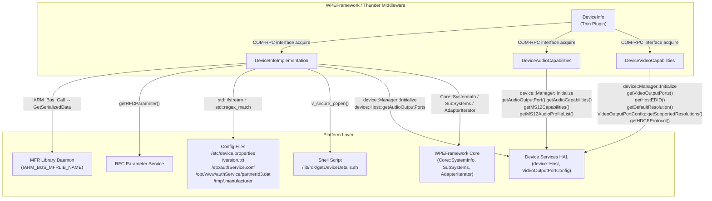

### Interaction Matrix

| Target Component / Layer              | Interaction Purpose                                                                                                                                  | Key APIs / Topics                                                                                                                                                                                                              |
| ------------------------------------- | ---------------------------------------------------------------------------------------------------------------------------------------------------- | ------------------------------------------------------------------------------------------------------------------------------------------------------------------------------------------------------------------------------ | -------- | -------- | ---------- |
| **Device Services (DS) HAL**          |                                                                                                                                                      |                                                                                                                                                                                                                                |
| `device::Manager`                     | DS library initialisation (called in all three implementation constructors)                                                                          | `device::Manager::Initialize()`                                                                                                                                                                                                |
| `device::Host`                        | Audio port enumeration, audio capabilities, MS12 capabilities, MS12 audio profiles; video port enumeration, host EDID, default/supported resolutions | `getAudioOutputPorts()`, `getAudioOutputPort()`, `getDefaultAudioPortName()`, `getVideoOutputPorts()`, `getVideoOutputPort()`, `getHostEDID()`, `getDefaultVideoPortName()`                                                    |
| `device::VideoOutputPortConfig`       | Supported video resolutions, HDCP protocol version per port                                                                                          | `getPortType().getSupportedResolutions()`, `getPort().getHDCPProtocol()`                                                                                                                                                       |
| **IARM Bus / MFR Daemon**             |                                                                                                                                                      |                                                                                                                                                                                                                                |
| `IARM_BUS_MFRLIB_NAME`                | Retrieve serialized device identity data (serial number, model name, manufacturer, provisioned model name, PDRI version)                             | `IARM_Bus_Call(IARM_BUS_MFRLIB_NAME, IARM_BUS_MFRLIB_API_GetSerializedData, ...)`                                                                                                                                              |
| **RFC Parameter Service**             |                                                                                                                                                      |                                                                                                                                                                                                                                |
| RFC                                   | Fallback data source for serial number, model name, and distributor ID                                                                               | `getRFCParameter(nullptr, "Device.DeviceInfo.SerialNumber", ...)`, `getRFCParameter(nullptr, "Device.DeviceInfo.ModelName", ...)`, `getRFCParameter(nullptr, "Device.DeviceInfo.X_RDKCENTRAL-COM_Syndication.PartnerId", ...)` |
| **Filesystem**                        |                                                                                                                                                      |                                                                                                                                                                                                                                |
| `/etc/device.properties`              | Model number, manufacturer name, device name, friendly name, device type, SoC, chipset                                                               | `std::ifstream` + `std::regex_match`                                                                                                                                                                                           |
| `/version.txt`                        | Firmware image name, SDK version, MEDIARITE, Yocto version                                                                                           | `std::ifstream` + `std::regex_match`                                                                                                                                                                                           |
| `/etc/authService.conf`               | Device type override                                                                                                                                 | `std::ifstream` + `std::regex_match`                                                                                                                                                                                           |
| `/opt/www/authService/partnerId3.dat` | Distributor/partner ID                                                                                                                               | `std::ifstream`                                                                                                                                                                                                                |
| `/tmp/.manufacturer`                  | Brand/manufacturer name override                                                                                                                     | `std::ifstream`                                                                                                                                                                                                                |
| **Shell Script**                      |                                                                                                                                                      |                                                                                                                                                                                                                                |
| `/lib/rdk/getDeviceDetails.sh`        | Read Ethernet MAC, eSB MAC, Wi-Fi MAC, eSB IP                                                                                                        | `v_secure_popen("r", "/lib/rdk/getDeviceDetails.sh read eth_mac                                                                                                                                                                | estb_mac | wifi_mac | estb_ip")` |
| **WPEFramework Core**                 |                                                                                                                                                      |                                                                                                                                                                                                                                |
| `Core::SystemInfo`                    | Runtime system metrics (uptime, RAM, swap, CPU load, hostname)                                                                                       | `Core::SystemInfo::Instance().GetUpTime()`, `GetFreeRam()`, `GetTotalRam()`, `GetCpuLoad()`, `GetCpuLoadAvg()`, `GetHostName()`                                                                                                |
| `ISubSystem`                          | WPEFramework version string and build hash                                                                                                           | `_service->SubSystems()`, `subSystem->Version()`, `subSystem->BuildTreeHash()`                                                                                                                                                 |
| `Core::AdapterIterator`               | Network interface enumeration (name, MAC, IP)                                                                                                        | `Core::AdapterIterator::Next()`, `Name()`, `MACAddress(':')`, `IPV4Addresses()`                                                                                                                                                |

---

## Testing

### Test Coverage

The repository includes both L1 (unit) and L2 (integration) tests.

**L1 Tests** (Google Test framework, C++14):

Located in `Tests/L1Tests/tests/`. Six test files cover the full implementation:

| Test File                          | Coverage Area                                                                                                                                                  |
| ---------------------------------- | -------------------------------------------------------------------------------------------------------------------------------------------------------------- |
| `test_DeviceInfo.cpp`              | Full plugin lifecycle, `DeviceInfoImplementation` all methods, `DeviceAudioCapabilities` all methods, `DeviceVideoCapabilities` all methods via mock injection |
| `test_DeviceInfoJsonRpc.cpp`       | JSON-RPC layer — method name dispatch, parameter parsing, response formatting                                                                                  |
| `test_DeviceInfoWeb.cpp`           | Web interface path (`/Service/DeviceInfo`) request handling                                                                                                    |
| `test_DeviceAudioCapabilities.cpp` | `DeviceAudioCapabilities` methods in isolation                                                                                                                 |
| `test_DeviceVideoCapabilities.cpp` | `DeviceVideoCapabilities` methods in isolation                                                                                                                 |
| `test_UtilsFile.cpp`               | `UtilsFile.h` utility functions                                                                                                                                |

**Mock infrastructure** (all confirmed used in `test_DeviceInfo.cpp`):

| Mock                            | Mocked Component                                                               |
| ------------------------------- | ------------------------------------------------------------------------------ |
| `IarmBusMock`                   | IARM Bus calls (`IARM_Bus_Call`)                                               |
| `ManagerMock`                   | `device::Manager::Initialize()`                                                |
| `HostMock`                      | `device::Host::getInstance()` and all port accessors                           |
| `AudioOutputPortMock`           | `getAudioCapabilities()`, `getMS12Capabilities()`, `getMS12AudioProfileList()` |
| `VideoOutputPortMock`           | `getDefaultResolution()`, `getName()`, `getType()`                             |
| `VideoOutputPortConfigImplMock` | `getPort()`, `getPortType()`                                                   |
| `VideoOutputPortTypeMock`       | `getId()`, `getSupportedResolutions()`                                         |
| `VideoResolutionMock`           | `getName()`                                                                    |
| `RfcApiMock`                    | `getRFCParameter()`                                                            |
| `COMLinkMock`                   | COM-RPC link                                                                   |
| `DeviceInfoMock`                | `Exchange::IDeviceInfo` interface                                              |
| `WrapsMock`                     | `v_secure_popen()`, `v_secure_pclose()`                                        |
| `ISubSystemMock`                | `ISubSystem::Version()`, `BuildTreeHash()`                                     |

Test files read and write the config files (`/etc/device.properties`, `/version.txt`, `/etc/authService.conf`, `/opt/www/authService/partnerId3.dat`, `/tmp/.manufacturer`) directly by creating them as real files on disk, and truncate them on teardown.

**L2 Tests**:

Located in `Tests/L2Tests/tests/DeviceInfo_L2Test.cpp`. Optionally links `TestMocklib` when `RDK_SERVICE_L2_TEST` is set.

### Running Tests

```bash
# L1 tests
cmake -DRDK_SERVICE_L1_TEST=ON .
make
./l1tests

# L2 tests
cmake -DRDK_SERVICE_L2_TEST=ON .
make
./l2tests
```

# Entservices-Displayinfo

---

## Overview

`entservices-displayinfo` is a WPEFramework (Thunder) plugin that exposes display, connection, HDR, and graphics properties of the device over JSON-RPC and COM-RPC. It abstracts the platform-specific video output stack behind four Exchange interfaces — `IGraphicsProperties`, `IConnectionProperties`, `IHDRProperties`, and `IDisplayProperties` — and fires a single event when display connection properties change.

At the product level, the plugin provides clients with display state information: whether a display is connected, its resolution (width, height, vertical frequency), physical dimensions in centimetres, EDID bytes, HDCP protection level, colour space, colour depth, quantization range, colorimetry, EOTF, frame rate, and HDR capabilities of both the STB and the connected TV. It also reports total and free GPU RAM. The HDCP protection level can be read and set.

At the module level, the plugin is a single shared library (`WPEFrameworkDisplayInfo.so`) that contains both the thin plugin entry point (`DisplayInfo`) and the platform implementation class (`DisplayInfoImplementation`). The platform implementation source file is selected at compile time from one of four platform backends (DeviceSettings, NEXUS, BCM_HOST, or Linux DRM). There is no separate implementation shared library.

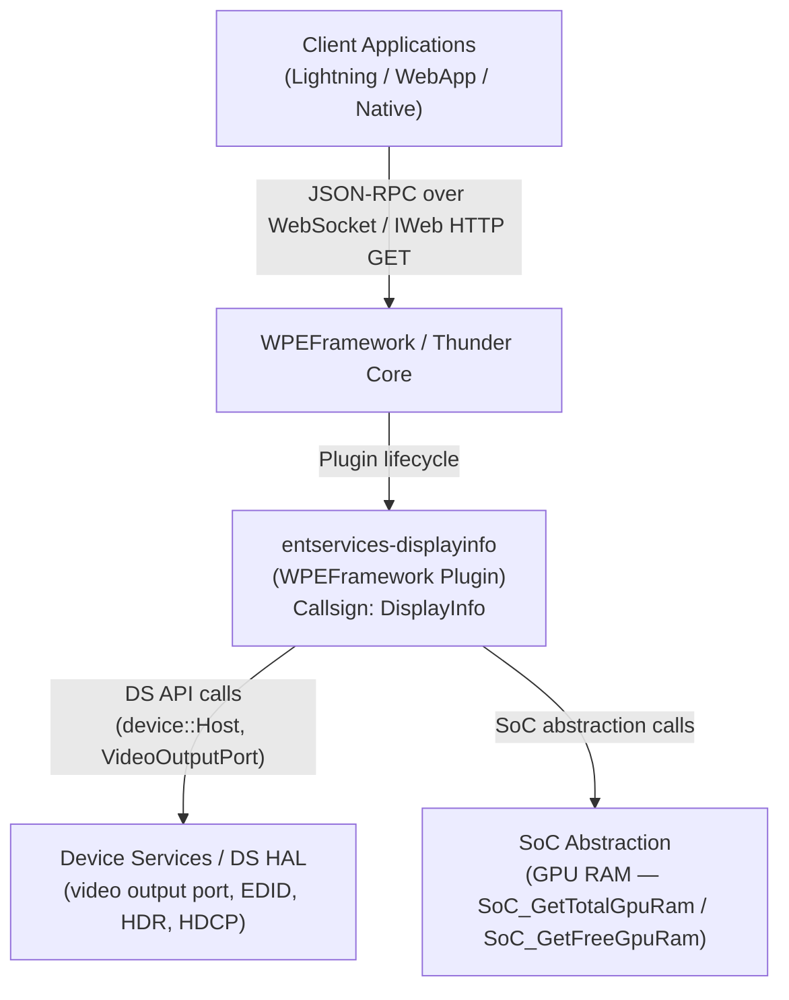

**Key Features & Responsibilities:**

- **Display connection status**: Reports whether a display is connected to the default video output port via `device::VideoOutputPort::isDisplayConnected()`.
- **EDID-based resolution**: Reads raw EDID bytes from the connected display via DS, parses them with `edid_parser`, and returns pixel width, pixel height, and vertical refresh frequency.
- **Physical display dimensions**: Returns the physical width and height of the connected display in centimetres by reading raw EDID bytes at defined offsets.
- **EDID byte access**: Returns the raw EDID byte array directly from DS for the connected display.
- **HDCP protection level**: Gets and sets the HDCP protocol preference (`HDCP_1X`, `HDCP_2X`, `HDCP_AUTO`) on the connected video output port using DS.
- **HDR capabilities**: Queries HDR standards supported by the connected TV (`TVCapabilities`) and by the STB (`STBCapabilities`), and reports the current HDR output mode (`HDRSetting`). Supported standards include HDR10, HDR10+, HLG, Dolby Vision, Technicolor Prime, and SDR.
- **Display properties (colour, frame rate, EOTF, colorimetry)**: Reports colour space, colour depth, quantization range, frame rate, electro-optical transfer function (EOTF), and colorimetry types for the active video output.
- **GPU RAM**: Reports total and free GPU RAM via SoC-specific abstraction functions.
- **Audio passthrough detection**: Reports whether the audio output on the default video port is in passthrough mode.
- **Connection change event**: Fires an `updated` event with a `Source` indicating `PRE_RESOLUTION_CHANGE` or `POST_RESOLUTION_CHANGE` when the DS library calls back via `device::Host::IVideoOutputPortEvents`.
- **IWeb HTTP interface**: Responds to HTTP GET on `/Service/DisplayInfo` with a JSON summary of GPU RAM, audio passthrough, connection state, width, height, HDCP protection, and HDR type (legacy interface).

---

## Architecture

### High-Level Architecture

`entservices-displayinfo` uses a single-library architecture. All production code — the thin plugin (`DisplayInfo`) and the platform implementation (`DisplayInfoImplementation`) — is compiled into a single shared library `WPEFrameworkDisplayInfo.so`. This differs from the common RDK-E two-library pattern (e.g., `entservices-deviceinfo`). There is no out-of-process hosting for the implementation; when `service->Root<Exchange::IConnectionProperties>()` is called in `Initialize()`, Thunder instantiates `DisplayInfoImplementation` from within the same library based on the `mode` setting in the root configuration object.

The platform implementation source file is selected at compile time by the CMakeLists.txt based on the available platform libraries:

| Build Condition                   | Implementation File                                                                |
| --------------------------------- | ---------------------------------------------------------------------------------- |
| `USE_DEVICESETTINGS` defined      | `DeviceSettings/PlatformImplementation.cpp` (DS + `edid-parser` + SoC abstraction) |
| NEXUS and NXCLIENT packages found | `Nexus/PlatformImplementation.cpp` (fetched from external repo)                    |
| BCM_HOST package found            | `RPI/PlatformImplementation.cpp`                                                   |
| LIBDRM package found              | `Linux/PlatformImplementation.cpp` (DRM + udev + file reads)                       |
| None of the above                 | CMake fatal error                                                                  |

Documentation below covers only the `DeviceSettings/PlatformImplementation.cpp` variant, as it is the variant confirmed present in this repository.

Northbound, clients access the plugin via Thunder JSON-RPC WebSocket or HTTP GET through the `IWeb` interface. All four Exchange interfaces (`IGraphicsProperties`, `IConnectionProperties`, `IHDRProperties`, `IDisplayProperties`) are aggregated under the single `DisplayInfo` callsign via `INTERFACE_AGGREGATE` entries in `DisplayInfo`'s interface map.

Southbound, `DisplayInfoImplementation` calls the DS library (`device::Host`, `device::VideoOutputPort`, `device::VideoDevice`) for all video output and EDID data. GPU RAM is delegated to SoC-specific functions (`SoC_GetTotalGpuRam`, `SoC_GetFreeGpuRam`) declared in `SoC_abstraction.h`. No IARM Bus calls, RFC parameter calls, or persistent store access are present in `DeviceSettings/PlatformImplementation.cpp`.

```mermaid
graph TD
    subgraph ContainerBoundary ["WPEFrameworkDisplayInfo.so (Single Library)"]
        subgraph PluginLayer ["Plugin Entry Point"]
            PL["DisplayInfo.cpp\nIPlugin + IWeb + JSONRPC\nAcquires IConnectionProperties\nRegisters JGraphics/JConnection/JHDR/JDisplay"]
            NT["Notification (inner class)\nIConnectionProperties::INotification\nRPC::IRemoteConnection::INotification"]
        end
        subgraph ImplLayer ["Platform Implementation (compile-time selected)"]
            DII["DeviceSettings/PlatformImplementation.cpp\nDisplayInfoImplementation\nIGraphicsProperties + IConnectionProperties\n+ IHDRProperties + IDisplayProperties\n+ device::Host::IVideoOutputPortEvents"]
        end
    end
    subgraph Platform ["Platform Layer"]
        DS["Device Services HAL\n(device::Host, VideoOutputPort,\nVideoDevice, edid-parser)"]
        SoC["SoC Abstraction\n(SoC_GetTotalGpuRam\nSoC_GetFreeGpuRam)"]
    end

    PL -->|"service->Root<IConnectionProperties>()\n+ QueryInterface for other interfaces"| DII
    PL -->|"Owns"| NT
    NT -->|"Updated(Source) fires"| PL
    DII -->|"device::Manager::Initialize()\ndevice::Host APIs\nedid_parser calls"| DS
    DII -->|"SoC_GetTotalGpuRam()\nSoC_GetFreeGpuRam()"| SoC
```

### Threading Model

- **Threading Architecture**: Event-driven with synchronous JSON-RPC dispatch.
- **Main Thread**: Handles `Initialize()`, `Deinitialize()`, all JSON-RPC property reads and writes.
- **DS Callback Thread**: DS library invokes `OnResolutionPreChange()` and `OnResolutionPostChange()` on a DS-owned thread. These callbacks acquire `_adminLock` and iterate the `_observers` list to call `Updated(Source)` on each registered `IConnectionProperties::INotification`.
- **Worker Threads**: No threads are created by this plugin. The `Deactivated()` path submits a job to `Core::IWorkerPool` but does not create a thread.
- **Synchronization**: `_adminLock` (`Core::CriticalSection`) protects the `_observers` list in `DisplayInfoImplementation` — held during `Register()`, `Unregister()`, and `ResolutionChangeImpl()`.
- **Async / Event Dispatch**: The `Notification::Updated()` method (called from the DS callback thread) calls `Exchange::JConnectionProperties::Event::Updated(_parent, event)`, which uses Thunder's internal JSONRPC event dispatch mechanism.

---

## Design

The plugin is designed around the CMake-time selection of a platform implementation. The Exchange interface set (`IGraphicsProperties`, `IConnectionProperties`, `IHDRProperties`, `IDisplayProperties`) is defined once in the Thunder interface headers, and the concrete implementation is swapped per platform at build time. `DisplayInfo.cpp` always acquires the implementation by calling `service->Root<Exchange::IConnectionProperties>()` with the name `"DisplayInfoImplementation"`, which Thunder resolves to whichever `SERVICE_REGISTRATION(DisplayInfoImplementation, ...)` was compiled in.

The `IConnectionProperties` interface is the primary interface acquired from the implementation. The other three — `IGraphicsProperties`, `IHDRProperties`, `IDisplayProperties` — are obtained via `QueryInterface` on the same object. If `IHDRProperties` or `IGraphicsProperties` cannot be acquired, `Initialize()` returns an error and `Deinitialize()` is called. `IDisplayProperties` is explicitly marked optional in the code; if it is null, the relevant JSON-RPC endpoints return `ERROR_UNAVAILABLE` and the plugin continues operating with the remaining interfaces.

EDID data is fetched from DS on every call to `Width()`, `Height()`, `VerticalFreq()`, `Colorimetry()`, and `EDID()`. There is no in-memory caching of EDID data; each call reads through to the DS library. For `WidthInCentimeters()`, the raw byte at EDID offset 21 is read from the EDID byte vector without using the `edid_parser`. For `HeightInCentimeters()`, the raw byte at EDID offset 22 is used.

`HDRSetting()` returns only `HDR_10` (if `IsOutputHDR()` returns true) or `HDR_OFF`. It does not distinguish between HDR10, HLG, Dolby Vision, or other HDR standards — only binary HDR on/off. `TVCapabilities()` and `STBCapabilities()` return a full bitmask-based list of supported HDR standards.

The DS event registration is done as `device::Host::getInstance().Register(baseInterface<device::Host::IVideoOutputPortEvents>(), "WPE::DisplayInfo")` in the `DisplayInfoImplementation` constructor. The unregistration is in the destructor.

`DisplayInfoJsonRpc.cpp` is present in the repository but is **not listed in the CMakeLists.txt** and is therefore not compiled into the production library. It defines a legacy `displayinfo` property endpoint and an `event_updated()` function. The current JSON-RPC interface is provided entirely by the `J*::Register()` calls in `DisplayInfo.cpp`.

No persistent store is used. No RFC parameters are read. No IARM Bus APIs are called directly from this plugin.

### Component Diagram

```mermaid
graph TD
    subgraph ComponentBoundary ["entservices-displayinfo (WPEFrameworkDisplayInfo.so)"]
        subgraph PluginLayer ["Plugin Layer"]
            PL["DisplayInfo.cpp\nIPlugin + IWeb + JSONRPC"]
        end
        subgraph NotifLayer ["Notification"]
            NT["Notification (inner class)\nIConnectionProperties::INotification\nRPC::IRemoteConnection::INotification"]
        end
        subgraph ImplLayer ["Implementation Layer (DeviceSettings build)"]
            DII["DisplayInfoImplementation\nIGraphicsProperties + IConnectionProperties\n+ IHDRProperties + IDisplayProperties\n+ device::Host::IVideoOutputPortEvents"]
        end
        subgraph helpers ["Helpers"]
            LOG["UtilsLogging.h\n(LOGINFO, LOGERR macros)"]
        end
    end
    subgraph ExternalSystems ["Platform"]
        DS["Device Services HAL\n(device::Host, VideoOutputPort, VideoDevice, edid-parser)"]
        SoC["SoC_abstraction\n(GPU RAM)"]
    end

    PL -->|"service->Root<> + QueryInterface"| DII
    PL -->|"owns"| NT
    NT -->|"Updated() → JConnectionProperties Event"| PL
    DII -->|"uses"| LOG
    DII -->|"device::Manager::Initialize()\ndevice::Host APIs"| DS
    DII -->|"SoC_GetTotalGpuRam/FreeGpuRam"| SoC
```

---

## Internal Modules

| Module / Class              | Description                                                                                                                                                                                                                                                                                                                                                                                                                   | Key Files                                      |
| --------------------------- | ----------------------------------------------------------------------------------------------------------------------------------------------------------------------------------------------------------------------------------------------------------------------------------------------------------------------------------------------------------------------------------------------------------------------------- | ---------------------------------------------- |
| `DisplayInfo`               | Thin plugin entry point. Implements `IPlugin`, `IWeb`, `JSONRPC`. Acquires `IConnectionProperties` from `DisplayInfoImplementation` via `service->Root<>()`, then gets the other three interfaces via `QueryInterface`. Registers JSON-RPC dispatch for all four interfaces. Handles HTTP GET at `/Service/DisplayInfo`. Handles remote connection loss via `Deactivated()`.                                                  | `DisplayInfo.cpp`, `DisplayInfo.h`             |
| `DisplayInfo::Notification` | Inner class registered with both `IConnectionProperties` and `RPC::IRemoteConnection`. Forwards DS resolution change callbacks to `JConnectionProperties::Event::Updated()`. Forwards remote connection deactivation to the parent plugin's cleanup path.                                                                                                                                                                     | `DisplayInfo.h`                                |
| `DisplayInfoImplementation` | Platform implementation (DeviceSettings variant). Implements all four Exchange interfaces and `device::Host::IVideoOutputPortEvents`. Calls DS library for all display data. Manages an observer list (`_observers`) behind `_adminLock` for connection change notifications. Uses `edid_parser` to decode EDID bytes for width, height, vertical frequency, and colorimetry. Delegates GPU RAM to SoC abstraction functions. | `DeviceSettings/PlatformImplementation.cpp`    |
| `SoC_abstraction`           | Declares `SoC_GetTotalGpuRam()` and `SoC_GetFreeGpuRam()`. The implementation is provided per platform (e.g., `DeviceSettings/RPI/SoC_abstraction.cpp`).                                                                                                                                                                                                                                                                      | `DeviceSettings/SoC_abstraction.h`             |
| `DisplayInfoJsonRpc.cpp`    | Legacy file defining a `displayinfo` property handler and `event_updated()`. **Not compiled** by the current `CMakeLists.txt`. The current JSON-RPC interface is provided by auto-generated `J*::Register()` calls.                                                                                                                                                                                                           | `DisplayInfoJsonRpc.cpp` (excluded from build) |

```mermaid
flowchart TD
    subgraph entservices_displayinfo ["entservices-displayinfo"]
        DI(["DisplayInfo\n(IPlugin + IWeb + JSONRPC)"])
        NT(["Notification\n(Connection + Remote observer)"])
        DII(["DisplayInfoImplementation\n(4 Exchange interfaces + DS events)"])
        SoC(["SoC_abstraction\n(GPU RAM)"])
    end
    DI -->|"acquires via service->Root<>"| DII
    DI -->|"owns"| NT
    NT -->|"Updated callback → fires JSON-RPC event"| DI
    DII -->|"GPU RAM delegation"| SoC
```

---

## Prerequisites & Dependencies

**Documentation Verification Checklist:**

- [x] **Thunder / WPEFramework APIs**: `IPlugin`, `IWeb`, `JSONRPC`, `IConfiguration` (optional, skipped if null), `Exchange::IGraphicsProperties`, `Exchange::IConnectionProperties`, `Exchange::IHDRProperties`, `Exchange::IDisplayProperties`, `JGraphicsProperties`, `JConnectionProperties`, `JHDRProperties`, `JDisplayProperties` — all verified in source.
- [x] **IARM Bus**: No `IARM_Bus_RegisterEventHandler` or `IARM_Bus_Call` calls found in `DeviceSettings/PlatformImplementation.cpp`. `UtilsIarm.h` is not included. IARM is not used directly; DS events are received via `device::Host::IVideoOutputPortEvents`.
- [x] **Device Services (DS) APIs**: `device::Manager::Initialize()`, `device::Host::getInstance().Register()` / `UnRegister()`, `getDefaultVideoPortName()`, `getVideoOutputPort()`, `getVideoOutputPorts()`, `getVideoDevices()`, `isDisplayConnected()`, `getAudioOutputPort()`, `getStereoMode()`, `GetHdmiPreference()`, `SetHdmiPreference()`, `getTVHDRCapabilities()`, `getHDRCapabilities()`, `IsOutputHDR()`, `getColorSpace()`, `getColorDepth()`, `getQuantizationRange()`, `getVideoEOTF()`, `getResolution()`, `getDisplay().getEDIDBytes()` — all confirmed in source.
- [x] **Persistent store**: No persistent store reads or writes found. Not implemented.
- [x] **Systemd services**: No systemd service file found in the repository.
- [x] **Configuration files**: No configuration files opened via `std::ifstream` in `DeviceSettings/PlatformImplementation.cpp`. Configuration files are used in the Linux DRM backend (`Linux/PlatformImplementation.cpp`) via optional plugin config parameters.
- [x] **RFC**: No `getRFCParameter()` calls found. Not used.

### RDK-E Platform Requirements

- **WPEFramework Version**: Thunder branch R4.4.1 (confirmed in `build_dependencies.sh`). Thunder Tools R4.4.3.
- **Build Dependencies**: `WPEFrameworkPlugins`, `WPEFrameworkDefinitions`, `CompileSettingsDebug`, `edid-parser` (from DS library), `entservices-apis` (Exchange interface headers). For DeviceSettings build: DS library (`FindDS.cmake`), IARMBus library (`FindIARMBus.cmake`). For Linux DRM build: `libdrm`, `libdrm-dev`. Optionally: BCM_HOST, NEXUS, NXCLIENT.
- **RDK-E Plugin Dependencies**: No preconditions are declared in the plugin metadata (`preconditions = {}`). The `DisplayInfo.conf.in` does not set a precondition field, so no Thunder subsystem must be active first.
- **Device Services / HAL**: DS library and the DS manager daemon must be running. `device::Manager::Initialize()` is called in the `DisplayInfoImplementation` constructor.
- **IARM Bus**: Not used directly. DS library internally uses IARM, but the plugin does not call IARM APIs.
- **Systemd Services**: No explicit `After=` or `Requires=` entries found in the repository.
- **Configuration Files**: No configuration files are read at runtime in the DeviceSettings backend. Optional configuration parameters (e.g., `drmDeviceName`, `gpuMemoryFile`, `hdcpLevelFilepath`) are used only by the Linux DRM backend.
- **Startup Order**: Configurable via `PLUGIN_DISPLAYINFO_STARTUPORDER` build variable.
- **C++ Standard**: C++11 for all production source files. Test files use additional standard library features.

---

## Quick Start

### 1. Connect via ThunderJS

```js
import ThunderJS from "thunderjs";
const thunderJS = ThunderJS({ host: "127.0.0.1" });
```

### 2. Check if display is connected

```js
thunderJS.DisplayInfo.connected()
  .then((result) => console.log("Connected:", result.connected))
  .catch((err) => console.error(err));
```

### 3. Get HDR capabilities of the connected TV

```js
thunderJS.DisplayInfo.tvcapabilities()
  .then((result) => console.log("TV HDR:", result.type))
  .catch((err) => console.error(err));
```

### 4. Set HDCP protection level

```js
thunderJS.DisplayInfo.hdcpprotection({ hdcpprotection: "HDCP_2X" })
  .then((result) => console.log(result))
  .catch((err) => console.error(err));
```

### 5. Subscribe to connection change events

```js
thunderJS.on("DisplayInfo", "updated", (event) => {
  console.log("Display connection updated:", event);
});
```

---

## Configuration

### Configuration Priority

1. Built-in defaults (compile-time `PLUGIN_DISPLAYINFO_AUTOSTART`, `PLUGIN_DISPLAYINFO_MODE`, `PLUGIN_DISPLAYINFO_STARTUPORDER`)
2. Optional platform-specific parameters set at build time (GPU memory patterns, HDCP/HDR level file paths, DRM device name)

### Key Configuration Files

The `DisplayInfo.conf` (generated from `DisplayInfo.conf.in`) is the only configuration file used. No runtime configuration files are read by the DeviceSettings backend.

| Configuration File                  | Purpose                                                                        | Override Mechanism                |
| ----------------------------------- | ------------------------------------------------------------------------------ | --------------------------------- |
| `DisplayInfo.conf` (Thunder config) | Callsign, autostart, startup order, process mode, optional platform parameters | Set build variables at CMake time |

### Configuration Parameters

| Parameter                 | Type   | Default       | Description                                                                                                               |
| ------------------------- | ------ | ------------- | ------------------------------------------------------------------------------------------------------------------------- |
| `callsign`                | string | `DisplayInfo` | Thunder callsign for this plugin                                                                                          |
| `autostart`               | bool   | `true`        | Plugin activates automatically on Thunder start (`PLUGIN_DISPLAYINFO_AUTOSTART`)                                          |
| `startuporder`            | string | (empty)       | Numeric startup order (`PLUGIN_DISPLAYINFO_STARTUPORDER`)                                                                 |
| `root.mode`               | string | `Off`         | Process hosting mode for the implementation: `Off` = same process, `Local` = separate process (`PLUGIN_DISPLAYINFO_MODE`) |
| `useBestMode`             | bool   | (not set)     | Optional — Linux DRM backend: use best display mode                                                                       |
| `drmDeviceName`           | string | (not set)     | Optional — Linux DRM backend: DRM device node name                                                                        |
| `drmSubsystemPath`        | string | (not set)     | Optional — Linux DRM backend: EDID subsystem path                                                                         |
| `hdcpLevelFilepath`       | string | (not set)     | Optional — Linux DRM backend: path to HDCP level file                                                                     |
| `hdrLevelFilepath`        | string | (not set)     | Optional — Linux DRM backend: path to HDR level file                                                                      |
| `gpuMemoryFile`           | string | (not set)     | Optional — Linux DRM backend: path to GPU memory file                                                                     |
| `gpuMemoryFreePattern`    | string | (not set)     | Optional — Linux DRM backend: regex for free GPU memory                                                                   |
| `gpuMemoryTotalPattern`   | string | (not set)     | Optional — Linux DRM backend: regex for total GPU memory                                                                  |
| `gpuMemoryUnitMultiplier` | number | (not set)     | Optional — Linux DRM backend: multiplier for GPU memory unit                                                              |
| `hdcplevel`               | string | (not set)     | Optional — HDCP level override                                                                                            |

### Configuration Persistence

Configuration changes are not persisted at runtime. There is no persistent store integration in this plugin.

---

## API / Usage

### Interface Type

JSON-RPC over Thunder WebSocket (auto-generated from `JGraphicsProperties`, `JConnectionProperties`, `JHDRProperties`, `JDisplayProperties`). COM-RPC Exchange interfaces (`IGraphicsProperties`, `IConnectionProperties`, `IHDRProperties`, `IDisplayProperties`). HTTP GET via IWeb (`/Service/DisplayInfo`).

All methods are exposed under the callsign `DisplayInfo`.

---

### IGraphicsProperties Methods

#### `totalgpuram`

Returns the total GPU RAM available on the platform. Source: `SoC_GetTotalGpuRam()`.

**Parameters**: None

**Response**

```json
{
  "total": 209715200
}
```

---

#### `freegpuram`

Returns the currently free GPU RAM. Source: `SoC_GetFreeGpuRam()`.

**Parameters**: None

**Response**

```json
{
  "free": 157286400
}
```

---

### IConnectionProperties Methods

#### `connected`

Returns whether a display is currently connected to the default video output port. Source: `device::Host::getVideoOutputPort(defaultPort).isDisplayConnected()`.

**Parameters**: None

**Response**

```json
{
  "connected": true
}
```

---

#### `isaudiopassthrough`

Returns whether the audio output on the default video port is in passthrough mode. Source: `device::Host::getVideoOutputPort(defaultPort).getAudioOutputPort().getStereoMode(true)`, checks if result equals `device::AudioStereoMode::kPassThru`.

**Parameters**: None

**Response**

```json
{
  "passthrough": false
}
```

---

#### `width`

Returns the width in pixels of the connected display, read from EDID via DS and parsed with `edid_parser::EDID_Parse()`. Returns 0 and `ERROR_NONE` if display is not connected or EDID verification fails.

**Parameters**: None

**Response**

```json
{
  "width": 1920
}
```

---

#### `height`

Returns the height in pixels of the connected display, read from EDID via DS and parsed with `edid_parser::EDID_Parse()`. Returns 0 and `ERROR_NONE` if display is not connected or EDID verification fails.

**Parameters**: None

**Response**

```json
{
  "height": 1080
}
```

---

#### `verticalfrequency`

Returns the vertical refresh frequency (in Hz) of the connected display, parsed from EDID. Returns `ERROR_GENERAL` if display is not connected or EDID verification fails.

**Parameters**: None

**Response**

```json
{
  "vertical_freq": 60
}
```

---

#### `hdcpprotection`

Gets or sets the HDCP protocol preference for the connected video output port. Source: `device::VideoOutputPort::GetHdmiPreference()` / `SetHdmiPreference()`. The port used is the first connected HDMI or Internal port returned by `PortName()`.

**Parameters (set)**

| Name             | Type   | Required | Description                                                                      |
| ---------------- | ------ | -------- | -------------------------------------------------------------------------------- |
| `hdcpprotection` | string | Yes      | HDCP level to set: `"HDCP_UNENCRYPTED"`, `"HDCP_1X"`, `"HDCP_2X"`, `"HDCP_AUTO"` |

**Response (get)**

```json
{
  "hdcpprotection": "HDCP_2X"
}
```

**HDCP mapping:**

- `dsHDCP_VERSION_1X` → `HDCP_1X`
- `dsHDCP_VERSION_2X` → `HDCP_2X`
- `dsHDCP_VERSION_MAX` → `HDCP_AUTO`

---

#### `widthincentimeters`

Returns the physical width of the connected display in centimetres. Read directly from raw EDID byte at offset `EDID_MAX_HORIZONTAL_SIZE` (21). Returns 0 if not connected or EDID cannot be retrieved.

**Parameters**: None

**Response**

```json
{
  "width": 52
}
```

---

#### `heightincentimeters`

Returns the physical height of the connected display in centimetres. Read directly from raw EDID byte at offset `EDID_MAX_VERTICAL_SIZE` (22) via `vPort.getDisplay().getEDIDBytes()`. Returns 0 if not connected.

**Parameters**: None

**Response**

```json
{
  "height": 30
}
```

---

#### `edid`

Returns the raw EDID bytes for the connected display. Source: `device::VideoOutputPort::getDisplay().getEDIDBytes()`. Returns `ERROR_GENERAL` if display is not connected. The data is returned as a byte array with the length parameter used as input (buffer size) and output (actual bytes written).

**Parameters**

| Name     | Type   | Required | Description                                                                  |
| -------- | ------ | -------- | ---------------------------------------------------------------------------- |
| `length` | uint16 | Yes      | (inout) Size of the output buffer on input; bytes actually written on output |

**Response**

```json
{
  "length": 256,
  "data": "..."
}
```

---

### IHDRProperties Methods

#### `tvcapabilities`

Returns the list of HDR standards supported by the connected TV. Source: `device::VideoOutputPort::getTVHDRCapabilities()`. Returns `HDR_OFF` if HDMI is not connected. Maps the DS bitmask (`dsHDRSTANDARD_*`) to the `HDRType` enum.

**Parameters**: None

**Response**

```json
{
  "type": ["HDR_10", "HDR_HLG", "HDR_DOLBYVISION"]
}
```

**Possible values**: `HDR_OFF`, `HDR_10`, `HDR_10PLUS`, `HDR_HLG`, `HDR_DOLBYVISION`, `HDR_TECHNICOLOR`, `HDR_SDR`

---

#### `stbcapabilities`

Returns the list of HDR standards supported by the STB (source device). Source: `device::Host::getVideoDevices().at(0).getHDRCapabilities()`. Maps the DS bitmask to the `HDRType` enum.

**Parameters**: None

**Response**

```json
{
  "type": ["HDR_10", "HDR_HLG"]
}
```

**Possible values**: `HDR_OFF`, `HDR_10`, `HDR_10PLUS`, `HDR_HLG`, `HDR_DOLBYVISION`, `HDR_TECHNICOLOR`

---

#### `hdrsetting`

Returns whether the current output is HDR. Source: `device::VideoOutputPort::IsOutputHDR()`. Returns `HDR_10` if HDR is active, `HDR_OFF` otherwise. Does not distinguish between HDR10, HLG, Dolby Vision, or other HDR standards for this method.

**Parameters**: None

**Response**

```json
{
  "hdrtype": "HDR_10"
}
```

**Possible values**: `HDR_OFF`, `HDR_10`

---

### IDisplayProperties Methods

#### `colorspace`

Returns the colour space (format) of the active video output on the default port. Source: `device::VideoOutputPort::getColorSpace()`. Returns `ERROR_GENERAL` if display is not connected.

**Parameters**: None

**Response**

```json
{
  "colorspace": "FORMAT_YCBCR_420"
}
```

**DS mapping:**

- `dsDISPLAY_COLORSPACE_RGB` → `FORMAT_RGB_444`
- `dsDISPLAY_COLORSPACE_YCbCr444` → `FORMAT_YCBCR_444`
- `dsDISPLAY_COLORSPACE_YCbCr422` → `FORMAT_YCBCR_422`
- `dsDISPLAY_COLORSPACE_YCbCr420` → `FORMAT_YCBCR_420`
- `dsDISPLAY_COLORSPACE_AUTO` → `FORMAT_OTHER`
- `dsDISPLAY_COLORSPACE_UNKNOWN` (default) → `FORMAT_UNKNOWN`

---

#### `framerate`

Returns the frame rate of the current video output. Source: `device::VideoOutputPort::getResolution().getFrameRate()`. Returns `ERROR_GENERAL` if DS call fails.

**Parameters**: None

**Response**

```json
{
  "framerate": "FRAMERATE_60"
}
```

**Possible values**: `FRAMERATE_UNKNOWN`, `FRAMERATE_23_976`, `FRAMERATE_24`, `FRAMERATE_25`, `FRAMERATE_29_97`, `FRAMERATE_30`, `FRAMERATE_50`, `FRAMERATE_59_94`, `FRAMERATE_60`

---

#### `colourdepth`

Returns the colour depth of the active video output. Source: `device::VideoOutputPort::getColorDepth()`. Returns `ERROR_GENERAL` if display is not connected.

**Parameters**: None

**Response**

```json
{
  "colourdepth": "COLORDEPTH_10_BIT"
}
```

**DS mapping:**

- `8` → `COLORDEPTH_8_BIT`
- `10` → `COLORDEPTH_10_BIT`
- `12` → `COLORDEPTH_12_BIT`
- `0` (default) → `COLORDEPTH_UNKNOWN`

---

#### `quantizationrange`

Returns the quantization range of the active video output on the default port. Source: `device::VideoOutputPort::getQuantizationRange()`. Returns `ERROR_GENERAL` if display is not connected.

**Parameters**: None

**Response**

```json
{
  "quantizationrange": "QUANTIZATIONRANGE_LIMITED"
}
```

**DS mapping:**

- `dsDISPLAY_QUANTIZATIONRANGE_LIMITED` → `QUANTIZATIONRANGE_LIMITED`
- `dsDISPLAY_QUANTIZATIONRANGE_FULL` → `QUANTIZATIONRANGE_FULL`
- `dsDISPLAY_QUANTIZATIONRANGE_UNKNOWN` (default) → `QUANTIZATIONRANGE_UNKNOWN`

---

#### `colorimetry`

Returns the colorimetry types supported by the connected display, parsed from EDID colorimetry data block. Source: EDID bytes via DS, parsed with `edid_parser::EDID_Parse()`. Returns `ERROR_GENERAL` if display is not connected or EDID parse fails.

**Parameters**: None

**Response**

```json
{
  "colorimetry": ["COLORIMETRY_BT2020YCCBCBRC", "COLORIMETRY_BT2020RGB_YCBCR"]
}
```

**Possible values**: `COLORIMETRY_UNKNOWN`, `COLORIMETRY_XVYCC601`, `COLORIMETRY_XVYCC709`, `COLORIMETRY_SYCC601`, `COLORIMETRY_OPYCC601`, `COLORIMETRY_OPRGB`, `COLORIMETRY_BT2020YCCBCBRC`, `COLORIMETRY_BT2020RGB_YCBCR`, `COLORIMETRY_OTHER`

**Colorimetry info bitmask mapping (edid_parser):**

- `COLORIMETRY_INFO_XVYCC601` → `COLORIMETRY_XVYCC601`
- `COLORIMETRY_INFO_XVYCC709` → `COLORIMETRY_XVYCC709`
- `COLORIMETRY_INFO_SYCC601` → `COLORIMETRY_SYCC601`
- `COLORIMETRY_INFO_ADOBEYCC601` → `COLORIMETRY_OPYCC601`
- `COLORIMETRY_INFO_ADOBERGB` → `COLORIMETRY_OPRGB`
- `COLORIMETRY_INFO_BT2020CL` or `BT2020NCL` → `COLORIMETRY_BT2020YCCBCBRC`
- `COLORIMETRY_INFO_BT2020RGB` → `COLORIMETRY_BT2020RGB_YCBCR`
- `COLORIMETRY_INFO_DCI_P3` → `COLORIMETRY_OTHER`

---

#### `eotf`

Returns the Electro-Optical Transfer Function (EOTF) of the active video output. Source: `device::VideoOutputPort::getVideoEOTF()`. Returns `ERROR_GENERAL` if display is not connected.

**Parameters**: None

**Response**

```json
{
  "eotf": "EOTF_SMPTE_ST_2084"
}
```

**DS mapping:**

- `dsHDRSTANDARD_HDR10` → `EOTF_SMPTE_ST_2084`
- `dsHDRSTANDARD_HLG` → `EOTF_BT2100`
- Any other value → `EOTF_UNKNOWN`

---

### IWeb (HTTP) Interface

#### `GET /Service/DisplayInfo`

Returns a JSON object combining data from all four interfaces. Calls `Info()` which calls `TotalGpuRam()`, `FreeGpuRam()`, `IsAudioPassthrough()`, `Connected()`, `Width()`, `Height()`, `HDCPProtection()`, and `HDRSetting()`.

**Response**

```json
{
  "totalgpuram": 209715200,
  "freegpuram": 157286400,
  "audiopassthrough": false,
  "connected": true,
  "width": 1920,
  "height": 1080,
  "hdcpprotection": "HDCP_2X",
  "hdrtype": "HDR_10"
}
```

---

### Events / Notifications

| Event     | Trigger Condition                                                                                                       | Payload                                                                                         | Notes                                                         |
| --------- | ----------------------------------------------------------------------------------------------------------------------- | ----------------------------------------------------------------------------------------------- | ------------------------------------------------------------- |
| `updated` | DS calls `OnResolutionPreChange()` or `OnResolutionPostChange()` on the `device::Host::IVideoOutputPortEvents` listener | `{ "event": "PRE_RESOLUTION_CHANGE" }` or `{ "event": "POST_RESOLUTION_CHANGE" }` (Source enum) | Fired via `Exchange::JConnectionProperties::Event::Updated()` |

---

## Component Interactions

```mermaid
flowchart TD
    subgraph ThunderMiddleware ["WPEFramework / Thunder Middleware"]
        DI["DisplayInfo\n(Thin Plugin + IWeb)"]
        NT["Notification\n(inner class)"]
    end

    subgraph ImplLayer ["Implementation (same .so)"]
        DII["DisplayInfoImplementation\n(4 Exchange interfaces + DS event listener)"]
    end

    subgraph PlatformLayer ["Platform Layer"]
        DS["Device Services HAL\n(device::Host, VideoOutputPort,\nVideoDevice, edid-parser)"]
        SoC["SoC Abstraction\n(GPU RAM)"]
    end

    subgraph Clients ["Clients"]
        Client["JSON-RPC / HTTP Client"]
    end

    Client -->|"JSON-RPC WebSocket"| DI
    Client -->|"HTTP GET /Service/DisplayInfo"| DI
    DI -->|"service->Root<IConnectionProperties>()\n+ QueryInterface"| DII
    DI -->|"IConnectionProperties::Register(notification)"| DII
    DII -->|"OnResolutionPreChange / OnResolutionPostChange callback"| NT
    NT -->|"JConnectionProperties::Event::Updated()"| DI
    DII -->|"device::Manager::Initialize()\ndevice::Host::Register/UnRegister\nAll VideoOutputPort queries\nedid_parser calls"| DS
    DII -->|"SoC_GetTotalGpuRam()\nSoC_GetFreeGpuRam()"| SoC
```

### Interaction Matrix

| Target Component / Layer     | Interaction Purpose                                                                       | Key APIs                                                                                                                                                                                                                                                                                    |
| ---------------------------- | ----------------------------------------------------------------------------------------- | ------------------------------------------------------------------------------------------------------------------------------------------------------------------------------------------------------------------------------------------------------------------------------------------- |
| **Device Services (DS) HAL** |                                                                                           |                                                                                                                                                                                                                                                                                             |
| `device::Manager`            | DS library initialisation in `DisplayInfoImplementation` constructor                      | `device::Manager::Initialize()`                                                                                                                                                                                                                                                             |
| `device::Host`               | All video output port and display data queries; event registration for resolution changes | `device::Host::getInstance().Register(IVideoOutputPortEvents*, "WPE::DisplayInfo")`, `UnRegister()`, `getDefaultVideoPortName()`, `getVideoOutputPort()`, `getVideoOutputPorts()`, `getVideoDevices()`                                                                                      |
| `device::VideoOutputPort`    | Per-port display state, EDID, HDCP, HDR, colour, frame rate                               | `isDisplayConnected()`, `getDisplay().getEDIDBytes()`, `GetHdmiPreference()`, `SetHdmiPreference()`, `getTVHDRCapabilities()`, `IsOutputHDR()`, `getColorSpace()`, `getColorDepth()`, `getQuantizationRange()`, `getVideoEOTF()`, `getResolution()`, `getAudioOutputPort().getStereoMode()` |
| `device::VideoDevice`        | STB HDR capability query                                                                  | `device::Host::getVideoDevices().at(0).getHDRCapabilities()`                                                                                                                                                                                                                                |
| `edid_parser`                | Parse EDID bytes into structured data (resolution, colorimetry, refresh rate)             | `edid_parser::EDID_Verify()`, `edid_parser::EDID_Parse()`                                                                                                                                                                                                                                   |
| **SoC Abstraction**          |                                                                                           |                                                                                                                                                                                                                                                                                             |
| `SoC_abstraction`            | GPU RAM reporting                                                                         | `SoC_GetTotalGpuRam()`, `SoC_GetFreeGpuRam()`                                                                                                                                                                                                                                               |
| **IARM Bus**                 | Not used directly                                                                         | —                                                                                                                                                                                                                                                                                           |
| **RFC**                      | Not used                                                                                  | —                                                                                                                                                                                                                                                                                           |
| **Persistent Store**         | Not used                                                                                  | —                                                                                                                                                                                                                                                                                           |

### IPC Flow Patterns

**Property Read Flow (DeviceSettings backend):**

```mermaid
sequenceDiagram
    participant Client as Client Application
    participant Thunder as WPEFramework / Thunder
    participant DI as DisplayInfo (thin plugin)
    participant DII as DisplayInfoImplementation
    participant DS as Device Services HAL

    Client->>Thunder: JSON-RPC request (e.g., connected())
    Thunder->>DI: Dispatch to JSONRPC handler
    DI->>DII: IConnectionProperties::Connected(value)
    DII->>DS: device::Host::getVideoOutputPort(defaultPort).isDisplayConnected()
    DS-->>DII: bool connected
    DII-->>DI: Core::ERROR_NONE, connected = true
    DI-->>Thunder: JSON-RPC response { connected: true }
    Thunder-->>Client: Response
```

**Resolution Change Event Flow:**

```mermaid
sequenceDiagram
    participant DS as Device Services HAL
    participant DII as DisplayInfoImplementation
    participant NT as Notification (inner class)
    participant DI as DisplayInfo (thin plugin)
    participant Client as Subscribed Client

    DS->>DII: OnResolutionPostChange(width, height)
    DII->>DII: ResolutionChangeImpl(POST_RESOLUTION_CHANGE)
    DII->>NT: Updated(POST_RESOLUTION_CHANGE)
    NT->>DI: JConnectionProperties::Event::Updated(parent, POST_RESOLUTION_CHANGE)
    DI-->>Client: JSON-RPC notification: "updated" event
```

---

## Component State Flow

### Initialization to Active State

```mermaid
sequenceDiagram
    participant System as System / PluginActivator
    participant DI as DisplayInfo
    participant Thunder as WPEFramework Core
    participant DII as DisplayInfoImplementation

    System->>Thunder: Activate "DisplayInfo" callsign
    Thunder->>DI: Initialize(service)
    Note over DI: Register _notification with service
    DI->>Thunder: service->Root<IConnectionProperties>(_connectionId, 2000, "DisplayInfoImplementation")
    Thunder->>DII: Construct DisplayInfoImplementation
    DII->>DII: device::Host::getInstance().Register(IVideoOutputPortEvents, "WPE::DisplayInfo")
    DII->>DII: device::Manager::Initialize()
    Thunder-->>DI: _connectionProperties (IConnectionProperties*)
    DI->>DII: _connectionProperties->Register(&_notification)
    DI->>DII: QueryInterface<IConfiguration>() → skipped if null
    DI->>DII: QueryInterface<IGraphicsProperties>() → _graphicsProperties
    DI->>DI: JGraphicsProperties::Register(*this, _graphicsProperties)
    DI->>DII: QueryInterface<IHDRProperties>() → _hdrProperties
    DI->>DI: JHDRProperties::Register(*this, _hdrProperties)
    DI->>DII: QueryInterface<IDisplayProperties>() → _displayProperties (optional)
    DI->>DI: JDisplayProperties::Register(*this, _displayProperties) [if not null]
    DI->>DI: JConnectionProperties::Register(*this, _connectionProperties)
    DI-->>Thunder: Initialize() returns "" (success)
    Thunder-->>System: Plugin active

    loop Runtime
        Note over DI: Active — handles JSON-RPC and IWeb requests
    end

    System->>Thunder: Deactivate "DisplayInfo"
    Thunder->>DI: Deinitialize(service)
    Note over DI: Unregister notifications, release all interfaces
    DI-->>Thunder: Deinitialize() complete
```

### Runtime State Changes

**Display connection change:**
When the connected display's resolution changes, DS calls `OnResolutionPreChange(width, height)` and then `OnResolutionPostChange(width, height)` on the registered `device::Host::IVideoOutputPortEvents`. `DisplayInfoImplementation::ResolutionChangeImpl()` iterates the `_observers` list and calls `Updated(Source)` on each observer. The `Notification` inner class forwards this to `JConnectionProperties::Event::Updated()`, which sends the `updated` JSON-RPC event to all subscribed clients.

**Remote process disconnection:**
If the `_connectionId` process disconnects, `Notification::Deactivated(connection)` is called. If the connection ID matches, a deactivation job is submitted to `Core::IWorkerPool` with `PluginHost::IShell::DEACTIVATED` and `PluginHost::IShell::FAILURE`. This ensures the plugin is deactivated rather than left in a partially active state.

---

## Call Flows

### Initialization Call Flow

```mermaid
sequenceDiagram
    participant Activator as PluginActivator
    participant DI as DisplayInfo
    participant DII as DisplayInfoImplementation
    participant DS as Device Services

    Activator->>DI: Initialize(service)
    DI->>DI: service->Register(&_notification)
    DI->>DI: service->Root<IConnectionProperties>(..., "DisplayInfoImplementation")
    Note over DII: Constructor: Host::Register + Manager::Initialize
    DI->>DII: _connectionProperties->Register(&_notification)
    DI->>DII: QueryInterface<IGraphicsProperties>()
    DI->>DII: QueryInterface<IHDRProperties>()
    DI->>DII: QueryInterface<IDisplayProperties>() [optional]
    DI->>DI: JGraphicsProperties/JHDRProperties/JDisplayProperties/JConnectionProperties::Register
    DI-->>Activator: "" (success)
```

### HDCP Set Call Flow

```mermaid
sequenceDiagram
    participant Client as Client / ThunderJS
    participant Thunder as WPEFramework
    participant DI as DisplayInfo
    participant DII as DisplayInfoImplementation
    participant DS as Device Services

    Client->>Thunder: JSON-RPC: hdcpprotection({ hdcpprotection: "HDCP_2X" })
    Thunder->>DI: Dispatch to JConnectionProperties handler
    DI->>DII: IConnectionProperties::HDCPProtection(HDCP_2X)
    DII->>DII: PortName() → find connected HDMI/Internal port
    DII->>DS: device::Host::getVideoOutputPort(portname).SetHdmiPreference(dsHDCP_VERSION_2X)
    DS-->>DII: Result
    DII-->>DI: Core::ERROR_NONE
    DI-->>Thunder: JSON-RPC response { success: true }
    Thunder-->>Client: Response
```

---

## Implementation Details

### HAL / DS API Integration

| HAL / DS API                                                               | Purpose                                               | Implementation File                                      |
| -------------------------------------------------------------------------- | ----------------------------------------------------- | -------------------------------------------------------- |
| `device::Manager::Initialize()`                                            | DS library initialisation                             | `DeviceSettings/PlatformImplementation.cpp`              |
| `device::Host::getInstance().Register(IVideoOutputPortEvents*, name)`      | Register for resolution pre/post change callbacks     | `DeviceSettings/PlatformImplementation.cpp`              |
| `device::Host::getInstance().UnRegister(IVideoOutputPortEvents*)`          | Unregister resolution change callbacks on destruction | `DeviceSettings/PlatformImplementation.cpp`              |
| `device::Host::getInstance().getDefaultVideoPortName()`                    | Get name of the default video output port             | Used in most methods                                     |
| `device::Host::getInstance().getVideoOutputPort(name)`                     | Get a specific video output port by name              | Used in most methods                                     |
| `device::Host::getInstance().getVideoOutputPorts()`                        | Enumerate all video output ports                      | `PortName()`                                             |
| `device::Host::getInstance().getVideoDevices().at(0).getHDRCapabilities()` | Query STB HDR capabilities from video device          | `STBCapabilities()`                                      |
| `vPort.isDisplayConnected()`                                               | Check if a display is connected to the port           | `Connected()`, `PortName()`, many others                 |
| `vPort.getDisplay().getEDIDBytes(edid)`                                    | Read raw EDID bytes from the connected display        | `GetEdidBytes()`, `HeightInCentimeters()`, `EDID()`      |
| `vPort.getAudioOutputPort().getStereoMode(true)`                           | Get audio stereo mode to determine passthrough        | `IsAudioPassthrough()`                                   |
| `vPort.GetHdmiPreference()`                                                | Get HDCP protocol preference                          | `HDCPProtection()` (get)                                 |
| `vPort.SetHdmiPreference(version)`                                         | Set HDCP protocol preference                          | `HDCPProtection()` (set)                                 |
| `vPort.getTVHDRCapabilities(&caps)`                                        | Get HDR bitmask of capabilities of connected TV       | `TVCapabilities()`                                       |
| `vPort.IsOutputHDR()`                                                      | Check if current output is HDR                        | `HDRSetting()`                                           |
| `vPort.getColorSpace()`                                                    | Get colour space of current output                    | `ColorSpace()`                                           |
| `vPort.getColorDepth()`                                                    | Get colour depth (8/10/12 bits)                       | `ColourDepth()`                                          |
| `vPort.getQuantizationRange()`                                             | Get quantization range                                | `QuantizationRange()`                                    |
| `vPort.getVideoEOTF()`                                                     | Get EOTF of current output                            | `EOTF()`                                                 |
| `vPort.getResolution().getFrameRate()`                                     | Get current frame rate                                | `FrameRate()`                                            |
| `edid_parser::EDID_Verify(bytes, len)`                                     | Verify EDID data integrity                            | `Width()`, `Height()`, `VerticalFreq()`, `Colorimetry()` |
| `edid_parser::EDID_Parse(bytes, len, &data)`                               | Parse EDID data into structured fields                | `Width()`, `Height()`, `VerticalFreq()`, `Colorimetry()` |
| `SoC_GetTotalGpuRam()`                                                     | Get total GPU RAM from SoC                            | `TotalGpuRam()`                                          |
| `SoC_GetFreeGpuRam()`                                                      | Get free GPU RAM from SoC                             | `FreeGpuRam()`                                           |

### Key Implementation Logic

- **Observer pattern for connection events**: `DisplayInfoImplementation` maintains `_observers` (a `std::list<IConnectionProperties::INotification*>`) protected by `_adminLock` (`Core::CriticalSection`). `Register()` and `Unregister()` add/remove observers. DS resolution change callbacks iterate this list and call `Updated(Source)` on each observer.

- **EDID caching**: EDID bytes are not cached. `GetEdidBytes()` (private helper) calls `vPort.getDisplay().getEDIDBytes()` on every invocation. `Width()`, `Height()`, `VerticalFreq()`, and `Colorimetry()` each get their own copy of EDID bytes and run `edid_parser` independently.

- **IDisplayProperties as optional**: In `Initialize()`, if `QueryInterface<Exchange::IDisplayProperties>()` returns null, a `SYSLOG(Logging::Startup, ...)` warning is emitted but the plugin continues. `JDisplayProperties::Register()` is skipped, and those JSON-RPC endpoints return `ERROR_UNAVAILABLE`.

- **Error handling from DS**: All DS API calls are wrapped in try-catch for `device::Exception`, `std::exception`, and `...`. DS errors are traced with `TRACE(Trace::Error, ...)` using `UtilsLogging.h` macros. Most methods return `Core::ERROR_GENERAL` on DS failure; `Width()` and `Height()` return `Core::ERROR_NONE` even when EDID verification fails, outputting value 0.

- **PortName helper**: The private `PortName()` method enumerates all video output ports and returns the name of the first connected port of type `kHDMI` or `kInternal`. This result is used by `HDCPProtection()` (get and set). If no connected port is found, the port name is empty and HDCP operations are skipped.

- **HDRSetting binary limitation**: `HDRSetting()` only distinguishes between HDR on (`HDR_10`) and off (`HDR_OFF`) via `IsOutputHDR()`. It does not return the specific active HDR standard.

---

## Data Flow

**Typical read flow (e.g., `colorspace`):**

```
JSON-RPC Client request: { method: "DisplayInfo.colorspace" }
        |
        v
WPEFramework Thunder Core — dispatches to DisplayInfo JSONRPC handler
        |
        v
JDisplayProperties auto-generated handler → calls IDisplayProperties::ColorSpace(cs)
        |
        v
DisplayInfoImplementation::ColorSpace() — calls device::Host::getVideoOutputPort(defaultPort)
        |
        v
Device Services HAL — vPort.isDisplayConnected() + vPort.getColorSpace()
        |
        v
DS returns dsDISPLAY_COLORSPACE_YCbCr420
        |
        v
DisplayInfoImplementation maps to FORMAT_YCBCR_420
        |
        v
JSON-RPC response: { "colorspace": "FORMAT_YCBCR_420" }
```

**Event flow (resolution change):**

```
Device Services HAL — calls OnResolutionPostChange(width, height) on IVideoOutputPortEvents
        |
        v
DisplayInfoImplementation::ResolutionChangeImpl(POST_RESOLUTION_CHANGE)
        |
        v
Iterates _observers list (under _adminLock) → calls Updated(POST_RESOLUTION_CHANGE) on each
        |
        v
Notification::Updated() → Exchange::JConnectionProperties::Event::Updated(parent, source)
        |
        v
Thunder sends JSON-RPC notification "updated" to all subscribed clients
```

---

## Error Handling

### Layered Error Handling

| Layer                          | Error Type                  | Handling Strategy                                                                                                                     |
| ------------------------------ | --------------------------- | ------------------------------------------------------------------------------------------------------------------------------------- |
| Device Services / DS           | `device::Exception`         | Caught in all DS calls; traced with `TRACE(Trace::Error, ...)` including error code and message; method returns `Core::ERROR_GENERAL` |
| Device Services / DS           | `std::exception`            | Caught separately in most methods; traced; returns `Core::ERROR_GENERAL`                                                              |
| Device Services / DS           | `...` (unknown)             | Caught in HDR methods; traced; returns `Core::ERROR_GENERAL`                                                                          |
| EDID Parsing                   | `EDID_Verify` failure       | Traced; `Width()` and `Height()` return `ERROR_NONE` with value 0; `VerticalFreq()`, `Colorimetry()` return `ERROR_GENERAL`           |
| Plugin Lifecycle               | Remote connection loss      | `Notification::Deactivated()` submits `PluginHost::IShell::Job::Create(_service, DEACTIVATED, FAILURE)` to `Core::IWorkerPool`        |
| IDisplayProperties unavailable | QueryInterface returns null | Logged with `SYSLOG(Logging::Startup, ...)`; `JDisplayProperties::Register()` skipped; plugin continues without those endpoints       |

---

## Testing

### Test Coverage

| Level            | Scope                                                                    | Location                                   |
| ---------------- | ------------------------------------------------------------------------ | ------------------------------------------ |
| L1 – Unit        | Full plugin lifecycle, all Exchange interface methods, DS mock injection | `Tests/L1Tests/tests/test_DisplayInfo.cpp` |
| L2 – Integration | No L2 test files present in repository (only CMakeLists.txt)             | `Tests/L2Tests/`                           |

**L1 Tests** (Google Test framework):

One test file covers the full plugin. It directly includes `DeviceSettings/PlatformImplementation.cpp` rather than using a separate compilation unit, enabling injection of mock DS objects.

**Mock infrastructure confirmed in `test_DisplayInfo.cpp`:**

| Mock                       | Mocked Component                                                            |
| -------------------------- | --------------------------------------------------------------------------- |
| `ManagerImplMock`          | `device::Manager::Initialize()`                                             |
| `HostImplMock`             | `device::Host::getInstance()` and all port/device accessors                 |
| `AudioOutputPortMock`      | `getAudioOutputPort()`, `getStereoMode()`                                   |
| `VideoOutputPortMock`      | All `VideoOutputPort` methods (isDisplayConnected, GetHdmiPreference, etc.) |
| `VideoResolutionMock`      | `getFrameRate()`, `getPixelResolution()`                                    |
| `VideoDeviceMock`          | `getHDRCapabilities()`                                                      |
| `DisplayMock`              | `getEDIDBytes()`                                                            |
| `EdidParserMock`           | `edid_parser::EDID_Verify()`, `edid_parser::EDID_Parse()`                   |
| `DRMMock`                  | DRM API mocking                                                             |
| `ConnectionPropertiesMock` | `Exchange::IConnectionProperties` interface mock                            |
| `ServiceMock`              | `PluginHost::IShell` mock                                                   |
| `FactoriesImplementation`  | Thunder factories mock                                                      |
| `WorkerPoolImplementation` | Thunder worker pool mock                                                    |
| `COMLinkMock`              | COM-RPC link mock                                                           |
| `WrapsImplMock`            | Various system call wrappers                                                |

### Running Tests

```bash
# L1 tests (DeviceSettings backend)
cmake -G Ninja -S . -B build \
    -DRDK_SERVICES_L1_TEST=ON \
    -DUSE_DEVICESETTINGS=ON \
    -DCMAKE_INSTALL_PREFIX="$WORKSPACE/install/usr"
cmake --build build
ctest --output-on-failure
```

# Entservices-DisplaySettings

---

## Overview

`entservices-displaysettings` is a WPEFramework (Thunder) plugin that exposes control and query APIs for video output and audio output settings of the RDK-E device. It is registered under the callsign `org.rdk.DisplaySettings` and provides JSON-RPC methods for managing display resolution, zoom, HDCP, HDR, EDID, audio ports, audio modes, MS12 audio processing, volume, ARC/eARC routing, and associated audio mixing.

At the product level, the plugin enables applications to change the current video resolution, query what video displays and audio ports are connected, control audio processing parameters (MS12 compression, dialog enhancement, surround virtualizer, volume leveller, bass enhancer, dolby volume, graphic and intelligent equalizer, DRC mode, Atmos output mode), and manage HDMI ARC/eARC routing through the `org.rdk.HdmiCecSink` plugin.

At the module level, the plugin is a single shared library (`WPEFrameworkDisplaySettings.so`) implementing `IPlugin`, `JSONRPC`, and `IDeviceOptimizeStateActivator`, plus six DS event listener interfaces (`IDisplayEvents`, `IAudioOutputPortEvents`, `IDisplayDeviceEvents`, `IHdmiInEvents`, `IVideoDeviceEvents`, `IVideoOutputPortEvents`). All JSON-RPC handlers are registered using `registerMethodLockedApi` (a macro over `Utils::Synchro::RegisterLockedApiForHandler`) to serialize concurrent handler calls.

```mermaid
graph TD
    Client["Client Applications\n(Lightning / WebApp / Native)"]
    ThunderCore["WPEFramework / Thunder Core"]
    DisplaySettings["entservices-displaysettings\nCallsign: org.rdk.DisplaySettings"]
    PowerManager["org.rdk.PowerManager\n(Exchange::IPowerManager)"]
    SystemMode["org.rdk.SystemMode\n(Exchange::ISystemMode)"]
    HdmiCecSink["org.rdk.HdmiCecSink\n(JSON-RPC over WebSocket)"]
    DS["Device Services / DS HAL\n(video output, audio output, host)"]

    Client -->|"JSON-RPC over WebSocket"| ThunderCore
    ThunderCore -->|"Plugin lifecycle"| DisplaySettings
    DisplaySettings -->|"IPowerManager (COM-RPC)\npower state subscription"| PowerManager
    DisplaySettings -->|"ISystemMode (COM-RPC)\nClientActivated / ClientDeactivated"| SystemMode
    DisplaySettings -->|"JSON-RPC over WebSocket\nHDMI CEC ARC events"| HdmiCecSink
    DisplaySettings -->|"device::Manager, device::Host\nDS event registration"| DS
```

**Key Features & Responsibilities:**

- **Video output control**: Gets and sets the current resolution on a named video output port via DS API; caches resolution state in `currentResolutionCache` to avoid redundant DS calls.
- **Audio output control**: Gets and sets sound mode, audio port enable/disable, gain, mute, volume level, audio delay, and associated audio mixing on named audio output ports via DS API.
- **MS12 audio processing**: Gets and sets MS12 audio compression, Dolby Volume mode, dialog enhancement, intelligent equalizer, graphic equalizer, MS12 audio profile, surround virtualizer, volume leveller, bass enhancer, MI steering, DRC mode, Atmos output mode, and MS12 profile override settings.
- **HDR and colour depth**: Gets current HDR output settings, TV HDR capabilities, STB HDR capabilities, and colour depth preferences; sets force HDR mode and preferred colour depth via DS API.
- **EDID access**: Reads raw EDID bytes from a connected display and host EDID from the DS library.
- **HDMI ARC/eARC management**: Subscribes to `org.rdk.HdmiCecSink` events for ARC initiation, ARC termination, short audio descriptor (SAD), system audio mode, and audio device power status; manages ARC routing state machine through a dedicated message queue thread.
- **Power state integration**: Connects to `org.rdk.PowerManager` via COM-RPC, subscribes to `IModeChangedNotification`, and initialises audio ports only when the system is in `POWER_STATE_ON`.
- **System mode integration**: Registers with `org.rdk.SystemMode` under the `DEVICE_OPTIMIZE` mode on activation and deregisters on deactivation. Uses this to evaluate ALLM (Auto Low Latency Mode) state on HDMI hotplug events.
- **Event notifications**: Fires JSON-RPC notifications for resolution changes, zoom updates, active input changes, connected display updates, audio port hotplug, audio format changes, Atmos capability changes, video format changes, volume, mute, and audio processing parameter changes.
- **Zoom setting**: Gets and sets the display format conversion (DFC/zoom) setting on the video device via DS API.
- **Zoom persistence**: The zoom settings file path `/opt/persistent/rdkservices/zoomSettings.json` is defined as a constant (`ZOOM_SETTINGS_FILE`) in the source but a search of the source confirms it is not read or written by any method in the plugin at runtime.

---

## Architecture

### High-Level Architecture

`entservices-displaysettings` is a monolithic single-library Thunder plugin. All functionality — plugin lifecycle, JSON-RPC dispatch, DS event handling, power manager integration, HdmiCecSink JSON-RPC subscription, and SysteMode registration — is implemented in a single class (`DisplaySettings`) in a single shared library. There is no out-of-process implementation library.

The plugin uses the standard `PluginHost::JSONRPC` registration pattern but applies it through a `registerMethodLockedApi` macro that wraps every handler with `Utils::Synchro::RegisterLockedApiForHandler`, ensuring that concurrent JSON-RPC calls are serialized. Some handlers that have both a v1 and v2 behavior (e.g., `getVolumeLeveller` / `setVolumeLeveller`, `getSurroundVirtualizer` / `setSurroundVirtualizer`) are registered separately for handler version 1 and handler version 2 using `GetHandler(2)`.

Northbound, all client access is through Thunder's JSON-RPC WebSocket endpoint. No IWeb HTTP interface is implemented.

Southbound, the plugin makes direct DS library calls (`device::Host`, `device::VideoOutputPort`, `device::AudioOutputPort`, `device::VideoDevice`, `device::Manager`) for all hardware control. It does not call `IARM_Bus_RegisterEventHandler` or `IARM_Bus_Call` directly — DS events are received via six registered `device::Host::I*Events` listener interfaces. Power state changes are received via the `Exchange::IPowerManager::IModeChangedNotification` COM-RPC callback from `org.rdk.PowerManager`.

The HDMI ARC/eARC path uses a separate `m_sendMsgThread` (started in `Initialize()`) that processes messages from a queue (`m_sendMsgQueue`) using a `std::mutex` + `std::condition_variable` (`m_sendMsgMutex`, `m_sendMsgCV`). This thread handles operations that need to occur asynchronously relative to event callbacks, such as sending power-on messages to audio devices and requesting short audio descriptors.

No persistent store APIs are called. The only persistent file path defined is `ZOOM_SETTINGS_FILE` (`/opt/persistent/rdkservices/zoomSettings.json`), which is defined as a macro but not read or written at runtime. The `tr181api` library is linked (for `tr181_get` style calls) but no `tr181api` or `getTr181*` function calls are found in the plugin source.

```mermaid
graph TD
    subgraph ContainerBoundary ["WPEFrameworkDisplaySettings.so (Single Library)"]
        subgraph PluginLayer ["Plugin + JSONRPC"]
            PL["DisplaySettings.cpp\nIPlugin + JSONRPC + IDeviceOptimizeStateActivator\n90+ JSON-RPC methods registered\nAll handlers use registerMethodLockedApi"]
        end
        subgraph EventListeners ["DS Event Listeners (6 interfaces)"]
            EL["IDisplayEvents\nIAudioOutputPortEvents\nIDisplayDeviceEvents\nIHdmiInEvents\nIVideoDeviceEvents\nIVideoOutputPortEvents"]
        end
        subgraph MsgThread ["ARC Message Thread"]
            MT["m_sendMsgThread\nProcesses ARC/eARC async messages\nvia queue + mutex + condvar"]
        end
        subgraph Timers ["Timers (TpTimer)"]
            TM["m_timer — HdmiCecSink reconnect\nm_AudioDeviceDetectTimer\nm_ArcDetectionTimer\nm_SADDetectionTimer\nm_AudioDevicePowerOnStatusTimer"]
        end
        subgraph PowerNotif ["Power Notification"]
            PN["PowerManagerNotification\n(IModeChangedNotification)"]
        end
    end
    subgraph External ["External / Platform"]
        DS["Device Services HAL\n(device::Host, AudioOutputPort, VideoOutputPort, VideoDevice)"]
        PM["org.rdk.PowerManager\n(IPowerManager COM-RPC)"]
        SM["org.rdk.SystemMode\n(ISystemMode COM-RPC)"]
        CEC["org.rdk.HdmiCecSink\n(JSON-RPC WebSocket)"]
    end

    PL --> EL
    PL --> MT
    PL --> TM
    PL --> PN
    EL -->|"DS callbacks"| DS
    PL -->|"DS API calls"| DS
    PN -->|"COM-RPC"| PM
    PL -->|"COM-RPC"| SM
    MT -->|"JSON-RPC"| CEC
```

### Threading Model

- **Threading Architecture**: Multi-threaded.
- **Main Thread (Thunder COM-RPC / JSON-RPC thread)**: Handles all `Initialize()`, `Deinitialize()`, and JSON-RPC method dispatch. All handlers are serialized through `Utils::Synchro::RegisterLockedApiForHandler`.
- **DS Callback Threads**: DS library invokes the six `device::Host::I*Events` callbacks (`OnResolutionPreChange`, `OnResolutionPostChange`, `OnAudioOutHotPlug`, `OnAudioFormatUpdate`, `OnDisplayHDMIHotPlug`, `OnZoomSettingsChanged`, etc.) on DS-owned threads. These callbacks call `sendNotify()` to fire JSON-RPC events and update cached state.
- **`m_sendMsgThread`**: Started in `Initialize()`. Waits on `m_sendMsgCV` (with `m_sendMsgMutex`). Processes messages from `m_sendMsgQueue` such as `SEND_AUDIO_DEVICE_POWERON_MSG`, `REQUEST_SHORT_AUDIO_DESCRIPTOR`, `REQUEST_AUDIO_DEVICE_POWER_STATUS`, `SEND_DEVICE_AUDIO_STATUS`, `SEND_MUTE_KEY_EVENT`, `SEND_REQUEST_ARC_INITIATION`, `SEND_REQUEST_ARC_TERMINATION`. Joined in `Deinitialize()` after setting `m_sendMsgThreadExit`.
- **Timer callbacks** (`m_timer`, `m_AudioDeviceDetectTimer`, `m_ArcDetectionTimer`, `m_SADDetectionTimer`, `m_AudioDevicePowerOnStatusTimer`): Run on the WPEFramework worker pool thread. Used for retrying HdmiCecSink subscription, checking ARC device connection, checking SAD updates, and checking audio device power status.
- **Synchronization**:
  - `m_sendMsgMutex` + `m_sendMsgCV`: Protects `m_sendMsgQueue`, `m_sendMsgThreadExit`, `m_sendMsgThreadRun`.
  - `m_callMutex`: General call mutex.
  - `m_SadMutex`: Protects `m_AudioDeviceSADState`.
  - `m_AudioDeviceStatesUpdateMutex`: Protects `m_currentArcRoutingState`.
  - `_adminLock` (`Core::CriticalSection`): Plugin-wide admin lock.
- **Async / Event Dispatch**: DS callbacks call `sendNotify()` directly to fire JSON-RPC events. Heavy ARC operations are dispatched to `m_sendMsgThread` via `sendMsgToQueue()`.

---

## Design

`DisplaySettings` registers itself with six DS event listener interfaces and two Thunder plugin interfaces (PowerManager COM-RPC, SystemMode COM-RPC) during `Initialize()`. This avoids polling and lets the plugin react to hardware events (hotplug, resolution change, audio format change, zoom change) via callbacks.

For DS event registration, `registerDsEventHandlers()` calls `device::Host::getInstance().Register(baseInterface<device::Host::I*>(), "WPE[DisplaySettings]")` for all six listener types once `device::Manager::Initialize()` succeeds. All six are unregistered in `Deinitialize()` via corresponding `UnRegister` calls.

Audio ports are initialised in `InitAudioPorts()`, which is only called when the system is in `POWER_STATE_ON`. On power-state transitions to ON, `onPowerModeChanged` re-runs `InitAudioPorts()` via `AudioPortsReInitialize()` and `InitAudioPorts()` calls. This avoids enabling audio ports while the device is in standby.

The ARC/eARC flow uses the `org.rdk.HdmiCecSink` plugin. On `HDMI_ARC0` port detection in `InitAudioPorts()`, the plugin queries the HdmiCecSink state, subscribes to eight events (ARC initiation, ARC termination, SAD, system audio mode, audio device connected status, CEC enabled, audio device power status, and arc audio status), then sends power-on messages to the audio device and starts timers to check its responses. If HdmiCecSink is not yet active, `m_timer` retries the connection at 5500 ms intervals.

Resolution and display connection status are cached in module-local variables (`currentResolutionCache`, `isResCacheUpdated`, `isHdmiDisplayConnected`, `isDisplayConnectedCacheUpdated`) to reduce repeated DS calls for the same data. Cache validity is cleared on hotplug events.

The `IDeviceOptimizeStateActivator::Request(newState)` interface is implemented to handle `DEVICE_OPTIMIZE` state transitions (e.g., `"VIDEO"`, `"GAME"`). On HDMI hotplug events, `connectedVideoDisplaysUpdated()` reads the current `DEVICE_OPTIMIZE` state from a system file and calls `Request()` if the state is `"VIDEO"` or `"GAME"`.

### Component Diagram

```mermaid
graph TD
    subgraph ComponentBoundary ["entservices-displaysettings (WPEFrameworkDisplaySettings.so)"]
        subgraph PluginLayer ["Plugin Layer"]
            PL["DisplaySettings.cpp\nIPlugin + JSONRPC\n90+ methods registered\nregisterMethodLockedApi"]
        end
        subgraph DSListeners ["DS Event Listeners"]
            EL["IDisplayEvents → resolutionPreChange, activeInputChanged\nIAudioOutputPortEvents → connectedAudioPortUpdated, audioFormatChanged\nIDisplayDeviceEvents → connectedVideoDisplaysUpdated\nIHdmiInEvents → (hotplug)\nIVideoDeviceEvents → zoomSettingUpdated\nIVideoOutputPortEvents → resolutionChanged, videoFormatChanged"]
        end
        subgraph ArcThread ["ARC Message Thread"]
            AT["m_sendMsgThread\nQueue-based async CEC operations"]
        end
        subgraph TimerLayer ["Timers"]
            TL["m_timer, m_AudioDeviceDetectTimer\nm_ArcDetectionTimer, m_SADDetectionTimer\nm_AudioDevicePowerOnStatusTimer"]
        end
    end
    subgraph Ext ["External / Platform"]
        DS["DS HAL (device::Host, VideoOutputPort, AudioOutputPort, VideoDevice)"]
        PM["org.rdk.PowerManager (IModeChangedNotification)"]
        SM["org.rdk.SystemMode (ISystemMode)"]
        CEC["org.rdk.HdmiCecSink (JSON-RPC WebSocket)"]
    end

    PL -->|"DS API calls"| DS
    EL -->|"DS callbacks"| DS
    PL -->|"COM-RPC (register notification)"| PM
    PL -->|"COM-RPC (ClientActivated/Deactivated)"| SM
    AT -->|"JSON-RPC (ARC, SAD, power)"| CEC
    TL -->|"Retry subscription / CEC checks"| CEC
```

---

## Internal Modules

| Module / Class                 | Description                                                                                                                                                                                                                                                                                                | Key Files                                   |
| ------------------------------ | ---------------------------------------------------------------------------------------------------------------------------------------------------------------------------------------------------------------------------------------------------------------------------------------------------------- | ------------------------------------------- |
| `DisplaySettings`              | Main plugin class. Implements `IPlugin`, `JSONRPC`, `IDeviceOptimizeStateActivator`, and all six DS event listener interfaces. Registers all JSON-RPC methods, manages DS lifecycle, power manager integration, SystemMode integration, ARC/eARC state machine, resolution and display connection caching. | `DisplaySettings.cpp`, `DisplaySettings.h`  |
| `PowerManagerNotification`     | Inner class implementing `Exchange::IPowerManager::IModeChangedNotification`. Forwards `OnPowerModeChanged(currentState, newState)` to `DisplaySettings::onPowerModeChanged()`.                                                                                                                            | `DisplaySettings.h`                         |
| `Job`                          | Local anonymous namespace helper class implementing `Core::IDispatch` (or `Core::IDispatchType<void>` pre-Thunder-R4). Wraps a `std::function<void()>` for submission to the worker pool.                                                                                                                  | `DisplaySettings.cpp` (anonymous namespace) |
| `Utils::Synchro`               | Helper that provides `RegisterLockedApiForHandler` — wraps JSON-RPC handler registration with a mutex so concurrent calls to the same method are serialized.                                                                                                                                               | `helpers/UtilsSynchro.hpp`                  |
| `PowerManagerInterfaceBuilder` | Helper that builds a COM-RPC `IPowerManager` interface connection with retry logic (200 ms interval, 25 retries).                                                                                                                                                                                          | `helpers/PowerManagerInterface.h`           |
| `TpTimer`                      | Timer helper used for ARC reconnection, audio device detection, ARC detection, SAD update, and audio device power status checks.                                                                                                                                                                           | `helpers/tptimer.h`                         |

```mermaid
flowchart TD
    subgraph entservices_displaysettings ["entservices-displaysettings"]
        DS(["DisplaySettings\n(IPlugin + JSONRPC + 6 DS listeners)"])
        PNot(["PowerManagerNotification\n(IModeChangedNotification)"])
        AT(["ARC Message Thread\n(m_sendMsgThread)"])
        TM(["Timers\n(5× TpTimer)"])
        Sync(["Utils::Synchro\n(Locked API registration)"])
        PMB(["PowerManagerInterfaceBuilder\n(IPowerManager connection)"])
    end
    DS --> PNot
    DS --> AT
    DS --> TM
    DS --> Sync
    DS --> PMB
```

---

## Prerequisites & Dependencies

**Documentation Verification Checklist:**

- [x] **Thunder / WPEFramework APIs**: `IPlugin`, `JSONRPC`, `IDeviceOptimizeStateActivator`, `Exchange::IPowerManager`, `Exchange::ISystemMode` — all confirmed present and used in source.
- [x] **IARM Bus**: No `IARM_Bus_RegisterEventHandler` or `IARM_Bus_Call` calls found in `DisplaySettings.cpp`. DS events are received via `device::Host::I*Events` listener interfaces. IARMBus library is linked (transitively through DS library) but not called directly by the plugin.
- [x] **Device Services (DS) APIs**: `device::Manager::Initialize()` / `DeInitialize()`, all six `device::Host::Register` / `UnRegister` listener calls, plus numerous `device::Host`, `device::VideoOutputPort`, `device::AudioOutputPort`, `device::VideoDevice` API calls confirmed in source.
- [x] **Persistent store**: No persistent store reads or writes found. Not implemented.
- [x] **tr181api**: Linked in production build but no `tr181_get*` or `tr181api*` function calls found in `DisplaySettings.cpp`.
- [x] **Systemd services**: No systemd service files found in the repository.
- [x] **Configuration files**: `ZOOM_SETTINGS_FILE` (`/opt/persistent/rdkservices/zoomSettings.json`) is defined as a macro but confirmed not opened or parsed at runtime. `/tmp/SystemMode.txt` is referenced via `Utils::String::updateSystemModeFile()` as a fallback when `org.rdk.SystemMode` is unavailable.
- [x] **RFC**: `rfcapi.h` is included in `DisplaySettings.h` and `RFC_PWRMGR2` is defined (`"Device.DeviceInfo.X_RDKCENTRAL-COM_RFC.Feature.Power.PwrMgr2.Enable"`). RFC calls found only in `L2Tests` (mock usage); no `getRFCParameter` or `setRFCParameter` call found in `DisplaySettings.cpp` itself.

### RDK-E Platform Requirements

- **WPEFramework Version**: Compatible with WPEFramework/Thunder R4 and pre-R4 (guarded by `USE_THUNDER_R4` compile flag for `Core::IDispatch` vs. `Core::IDispatchType<void>`).
- **Build Dependencies**: `WPEFrameworkPlugins`, DS library (`FindDS.cmake`), IARMBus library (`FindIARMBus.cmake`), `tr181api` library (linked via `-ltr181api` in non-test builds), `entservices-apis` (Exchange interface headers for `IPowerManager`, `ISystemMode`, `IDeviceOptimizeStateActivator`). CXX standard: C++11.
- **RDK-E Plugin Dependencies**:
  - `org.rdk.PowerManager` — connected on init via `PowerManagerInterfaceBuilder`; retry 25 times at 200 ms intervals. Power state is queried to decide whether to initialise audio ports.
  - `org.rdk.SystemMode` — queried via `QueryInterfaceByCallsign<Exchange::ISystemMode>` on init and deinit for DEVICE_OPTIMIZE registration.
  - `org.rdk.HdmiCecSink` — subscribed for ARC/eARC events when `HDMI_ARC0` port is detected. Subscription retried via `m_timer` at 5500 ms intervals when HdmiCecSink is not yet active.
- **Device Services / HAL**: DS library and DS manager daemon must be running. `device::Manager::Initialize()` is called in `Initialize()`.
- **IARM Bus**: Not called directly. DS library internally uses IARM.
- **Systemd Services**: No explicit ordering found in the repository.
- **Configuration Files**: No configuration files are read at runtime by this plugin. `/tmp/SystemMode.txt` may be written as fallback for SystemMode registration when `org.rdk.SystemMode` is unavailable.
- **Startup Order**: Configurable via `PLUGIN_DISPLAYSETTINGS_STARTUPORDER` build variable. `autostart` defaults to `"false"`.
- **Preconditions**: `"Platform"` subsystem must be active (declared in `DisplaySettings.conf.in`).

---

## Quick Start

### 1. Connect via ThunderJS

```js
import ThunderJS from "thunderjs";
const thunderJS = ThunderJS({ host: "127.0.0.1" });
```

### 2. Get connected video displays

```js
thunderJS["org.rdk.DisplaySettings"]
  .getConnectedVideoDisplays()
  .then((result) => console.log("Displays:", result.connectedVideoDisplays))
  .catch((err) => console.error(err));
```

### 3. Set current resolution

```js
thunderJS["org.rdk.DisplaySettings"]
  .setCurrentResolution({
    videoDisplay: "HDMI0",
    resolution: "1080p",
  })
  .then((result) => console.log(result))
  .catch((err) => console.error(err));
```

### 4. Subscribe to resolution change events

```js
thunderJS.on("org.rdk.DisplaySettings", "resolutionChanged", (event) => {
  console.log("Resolution changed:", event);
});
```

---

## Configuration

### Key Configuration Files

| Configuration File                                                | Purpose                                          | Override Mechanism                |
| ----------------------------------------------------------------- | ------------------------------------------------ | --------------------------------- |
| `DisplaySettings.conf` (generated from `DisplaySettings.conf.in`) | Callsign, precondition, autostart, startup order | Set build variables at CMake time |

### Configuration Parameters

| Parameter      | Type   | Default                   | Description                                                                                  |
| -------------- | ------ | ------------------------- | -------------------------------------------------------------------------------------------- |
| `callsign`     | string | `org.rdk.DisplaySettings` | Thunder callsign for this plugin                                                             |
| `precondition` | string | `Platform`                | Thunder subsystem that must be active before activation                                      |
| `autostart`    | bool   | `false`                   | Plugin does not activate automatically on Thunder start (`PLUGIN_DISPLAYSETTINGS_AUTOSTART`) |
| `startuporder` | string | (empty)                   | Numeric startup order (`PLUGIN_DISPLAYSETTINGS_STARTUPORDER`)                                |

### Configuration Persistence

No runtime configuration parameters are persisted by this plugin. DS library persists port-level settings (e.g., audio port enable state via `vPort.getEnablePersist()`) independently.

---

## API / Usage

### Interface Type

JSON-RPC over Thunder WebSocket. Plugin API version: 2.0.5 (Major=2, Minor=0, Patch=5). Methods are registered on both handler version 1 and handler version 2 (`CreateHandler({ 2 })`). Handler version 2 overrides `getVolumeLeveller`, `setVolumeLeveller`, `getSurroundVirtualizer`, `setSurroundVirtualizer` with updated implementations.

All methods are accessed under callsign `org.rdk.DisplaySettings`.

---

### Video Display Methods

#### `getConnectedVideoDisplays`

Returns a list of connected video display port names. Source: iterates `device::Host::getVideoOutputPorts()` and checks `isDisplayConnected()` with a per-call cache for HDMI0.

**Parameters**: None

**Response**

```json
{
  "connectedVideoDisplays": ["HDMI0"],
  "success": true
}
```

---

#### `getSupportedVideoDisplays`

Returns all video output port names from DS, regardless of connection state.

**Parameters**: None

**Response**

```json
{
  "supportedVideoDisplays": ["HDMI0"],
  "success": true
}
```

---

#### `getSupportedResolutions`

Returns resolutions supported by the specified video display's port type, queried from `device::VideoOutputPortConfig`.

**Parameters**

| Name           | Type   | Required | Description                                                              |
| -------------- | ------ | -------- | ------------------------------------------------------------------------ |
| `videoDisplay` | string | No       | Video output port name. Defaults to the default video port name from DS. |

**Response**

```json
{
  "supportedResolutions": ["720p", "1080i", "1080p60"],
  "success": true
}
```

---

#### `getSupportedTvResolutions`

Returns resolutions supported by the connected TV, read from `vPort.getSupportedTvResolutions()` as a bitmask and expanded to string names. Maps `dsTV_RESOLUTION_*` bitmask flags to resolution strings.

**Parameters**

| Name           | Type   | Required | Description                                                      |
| -------------- | ------ | -------- | ---------------------------------------------------------------- |
| `videoDisplay` | string | No       | Video output port name. Defaults to the default video port name. |

**Response**

```json
{
  "supportedTvResolutions": [
    "480i",
    "480p",
    "720p",
    "1080i",
    "1080p",
    "2160p60"
  ],
  "success": true
}
```

---

#### `getSupportedSettopResolutions`

Returns resolutions supported by the STB's video device, queried from `device::VideoDevice::getSupportedResolutions()`.

**Parameters**: None

**Response**

```json
{
  "supportedSettopResolutions": ["720p", "1080i", "1080p60"],
  "success": true
}
```

---

#### `getCurrentResolution`

Returns the current output resolution for a video display. Caches the result in `currentResolutionCache`; cache is invalidated on resolution change events.

**Parameters**

| Name           | Type   | Required | Description                                                      |
| -------------- | ------ | -------- | ---------------------------------------------------------------- |
| `videoDisplay` | string | No       | Video output port name. Defaults to the default video port name. |

**Response**

```json
{
  "resolution": "1080p",
  "w": 1920,
  "h": 1080,
  "progressive": true,
  "success": true
}
```

---

#### `setCurrentResolution`

Sets the current output resolution on a video display via `vPort.setResolution(name)`.

**Parameters**

| Name           | Type   | Required | Description                                                      |
| -------------- | ------ | -------- | ---------------------------------------------------------------- |
| `videoDisplay` | string | No       | Video output port name. Defaults to the default video port name. |
| `resolution`   | string | Yes      | Resolution name (e.g., `"1080p60"`).                             |
| `persist`      | bool   | No       | If true, persists the resolution in DS.                          |

**Response**

```json
{
  "success": true
}
```

---

#### `getDefaultResolution`

Returns the default resolution for the specified video display from `vPort.getDefaultResolution().getName()`.

**Parameters**

| Name           | Type   | Required | Description             |
| -------------- | ------ | -------- | ----------------------- |
| `videoDisplay` | string | No       | Video output port name. |

**Response**

```json
{
  "defaultResolution": "1080p",
  "success": true
}
```

---

#### `getActiveInput`

Returns whether the connected display is detecting an active RxSense signal from the STB. Source: `device::VideoOutputPort::isDisplayConnected()`.

**Parameters**

| Name           | Type   | Required | Description             |
| -------------- | ------ | -------- | ----------------------- |
| `videoDisplay` | string | No       | Video output port name. |

**Response**

```json
{
  "activeInput": true,
  "success": true
}
```

---

#### `getTvHDRSupport` / `getSettopHDRSupport`

`getTvHDRSupport`: Returns HDR standards supported by the connected TV via `vPort.getTVHDRCapabilities()` bitmask.
`getSettopHDRSupport`: Returns HDR standards supported by the STB via `device::VideoDevice::getHDRCapabilities()` bitmask.

**Parameters**: None

**Response**

```json
{
  "standards": ["none", "HDR10", "Dolby Vision", "HDR10+"],
  "supportsHDR": true,
  "success": true
}
```

---

#### `getTVHDRCapabilities`

Returns raw TV HDR capabilities as a bitmask integer and as an array of string names.

**Parameters**

| Name           | Type   | Required | Description             |
| -------------- | ------ | -------- | ----------------------- |
| `videoDisplay` | string | No       | Video output port name. |

**Response**

```json
{
  "capabilities": 3,
  "supportsHDR10": true,
  "supportsHLG": true,
  "supportsDolbyVision": false,
  "supportsHDR10Plus": false,
  "supportsTechnicolorPrime": false,
  "success": true
}
```

---

#### `getCurrentOutputSettings`

Returns the current colour depth, colour space, matrix coefficients, video EOTF, quantization range, and frame rate for the video output port.

**Parameters**: None

**Response**

```json
{
  "colorDepth": 8,
  "colorSpace": 5,
  "colorimetry": 2,
  "matrixCoefficients": 0,
  "videoEOTF": 0,
  "quantizationRange": 235,
  "framerate": 60,
  "success": true
}
```

---

#### `getZoomSetting`

Returns the current display format conversion (DFC/zoom) setting from `device::VideoDevice::getDFC().getName()`. Under `USE_IARM`, the name is mapped through `iarm2svc()`.

**Parameters**: None

**Response**

```json
{
  "zoomSetting": "FULL",
  "success": true
}
```

---

#### `setZoomSetting`

Sets the zoom/DFC setting via `device::VideoDevice::setDFC(name)`. Under `USE_IARM`, the name is mapped through `svc2iarm()`.

**Parameters**

| Name          | Type   | Required | Description                                   |
| ------------- | ------ | -------- | --------------------------------------------- |
| `zoomSetting` | string | Yes      | Zoom setting name (e.g., `"FULL"`, `"NONE"`). |

**Response**

```json
{
  "success": true
}
```

---

#### `setForceHDRMode`

Forces the HDR output mode on the video device.

**Parameters**

| Name       | Type | Required | Description                 |
| ---------- | ---- | -------- | --------------------------- |
| `hdr_mode` | bool | Yes      | `true` to force HDR output. |

**Response**

```json
{
  "success": true
}
```

---

#### `readEDID`

Reads raw EDID bytes for the specified video display from `vPort.getDisplay().getEDIDBytes()` and returns them as a base64-encoded string.

**Parameters**

| Name           | Type   | Required | Description                                                      |
| -------------- | ------ | -------- | ---------------------------------------------------------------- |
| `videoDisplay` | string | No       | Video output port name. Defaults to the default video port name. |

**Response**

```json
{
  "EDID": "AP///////w...",
  "success": true
}
```

---

#### `readHostEDID`

Reads host EDID bytes from `device::Host::getHostEDID(edidVec)` and returns them base64-encoded.

**Parameters**: None

**Response**

```json
{
  "EDID": "AP///////w...",
  "success": true
}
```

---

#### `isConnectedDeviceRepeater`

Returns whether the connected HDMI device is an HDCP repeater via `vPort.isContentProtected()`.

**Parameters**: None

**Response**

```json
{
  "HdcpRepeater": false,
  "success": true
}
```

---

#### `setScartParameter`

Sets a SCART output parameter on the `SCART0` video port via `vPort.setScartParameter(parameter, parameterData)`.

**Parameters**

| Name                 | Type   | Required | Description            |
| -------------------- | ------ | -------- | ---------------------- |
| `scartParameter`     | string | Yes      | SCART parameter name.  |
| `scartParameterData` | string | Yes      | SCART parameter value. |

**Response**

```json
{
  "success": true
}
```

---

#### `getVideoFormat`

Returns the current video format (HDR standard) from `device::Host::getCurrentVideoFormat()`.

**Parameters**: None

**Response**

```json
{
  "currentVideoFormat": "HDR10",
  "supportedVideoFormat": ["SDR", "HDR10", "HDR10+"],
  "success": true
}
```

---

#### `setPreferredColorDepth` / `getPreferredColorDepth` / `getColorDepthCapabilities`

Set and get the preferred colour depth for the video output port, and retrieve the list of colour depths the port supports. Source: DS audio/video port APIs.

---

### Audio Port Methods

#### `getConnectedAudioPorts`

Returns audio port names that are currently connected. For `HDMI_ARC0`, the port is included only if `m_hdmiInAudioDeviceConnected` is true. Source: `device::AudioOutputPort::isConnected()`.

**Parameters**: None

**Response**

```json
{
  "connectedAudioPorts": ["HDMI0"],
  "success": true
}
```

---

#### `getSupportedAudioPorts`

Returns all audio output port names from DS.

**Parameters**: None

**Response**

```json
{
  "supportedAudioPorts": ["HDMI0", "SPDIF0", "HDMI_ARC0"],
  "success": true
}
```

---

#### `getSupportedAudioModes`

Returns audio modes supported by the specified audio port from `device::AudioOutputPort::getSupportedStereoModes()`.

**Parameters**

| Name        | Type   | Required | Description                             |
| ----------- | ------ | -------- | --------------------------------------- |
| `audioPort` | string | No       | Audio port name. Defaults to `"HDMI0"`. |

**Response**

```json
{
  "supportedAudioModes": ["STEREO", "SURROUND", "PASSTHRU"],
  "success": true
}
```

---

#### `setEnableAudioPort` / `getEnableAudioPort`

Enable or disable an audio port via `device::AudioOutputPort::enable()` / `disable()`. Tracks enable state per port in `audioPortEnableStatusMap`.

**Parameters**

| Name        | Type   | Required       | Description                           |
| ----------- | ------ | -------------- | ------------------------------------- |
| `audioPort` | string | Yes            | Audio port name.                      |
| `enable`    | bool   | Yes (set only) | `true` to enable, `false` to disable. |

**Response**

```json
{
  "success": true
}
```

---

#### `getSoundMode` / `setSoundMode`

Get or set the stereo / surround mode on an audio port via `device::AudioOutputPort::getStereoMode()` / `setStereoMode()`.

**Parameters**

| Name        | Type   | Required       | Description                                                |
| ----------- | ------ | -------------- | ---------------------------------------------------------- |
| `audioPort` | string | No             | Audio port name. Defaults to `"HDMI0"`.                    |
| `soundMode` | string | Yes (set only) | Sound mode (e.g., `"STEREO"`, `"SURROUND"`, `"PASSTHRU"`). |

---

#### `getAudioFormat`

Returns the current audio format from `device::Host::getCurrentAudioFormat()`.

**Parameters**: None

**Response**

```json
{
  "currentAudioFormat": "DOLBY AC3",
  "success": true
}
```

---

#### `getAudioDelay` / `setAudioDelay`

Get or set the audio output delay (in milliseconds) for an audio port via DS APIs.

**Parameters**

| Name         | Type   | Required       | Description                        |
| ------------ | ------ | -------------- | ---------------------------------- |
| `audioPort`  | string | No             | Audio port name.                   |
| `audioDelay` | string | Yes (set only) | Delay in milliseconds as a string. |

---

#### `setGain` / `getGain`

Get or set the gain level on an audio output port.

| Name        | Type   | Required       | Description      |
| ----------- | ------ | -------------- | ---------------- |
| `audioPort` | string | No             | Audio port name. |
| `gain`      | float  | Yes (set only) | Gain value.      |

---

#### `setMuted` / `getMuted`

Get or set mute status on an audio output port.

| Name        | Type   | Required       | Description      |
| ----------- | ------ | -------------- | ---------------- |
| `audioPort` | string | No             | Audio port name. |
| `muted`     | bool   | Yes (set only) | `true` to mute.  |

---

#### `setVolumeLevel` / `getVolumeLevel`

Get or set the volume level on an audio output port.

| Name          | Type   | Required       | Description      |
| ------------- | ------ | -------------- | ---------------- |
| `audioPort`   | string | No             | Audio port name. |
| `volumeLevel` | float  | Yes (set only) | Volume level.    |

---

#### `getSinkAtmosCapability`

Returns the Atmos capability of the sink device on the specified audio port from `device::AudioOutputPort::getSinkDeviceAtmosCapability()`.

**Parameters**

| Name        | Type   | Required | Description      |
| ----------- | ------ | -------- | ---------------- |
| `audioPort` | string | No       | Audio port name. |

**Response**

```json
{
  "atmos_capability": 2,
  "success": true
}
```

---

#### `setAudioAtmosOutputMode`

Sets the Atmos output mode on an audio port via `device::AudioOutputPort::setAtmosOutputMode()`.

| Name        | Type   | Required | Description                    |
| ----------- | ------ | -------- | ------------------------------ |
| `audioPort` | string | No       | Audio port name.               |
| `enable`    | bool   | Yes      | `true` to enable Atmos output. |

---

#### `getSettopAudioCapabilities` / `getSettopMS12Capabilities`

Return audio capabilities and MS12 capabilities of the STB for the specified audio port.

---

#### `setAssociatedAudioMixing` / `getAssociatedAudioMixing`

Get or set associated audio mixing (mixing of secondary audio stream) via DS APIs.

---

#### `setFaderControl` / `getFaderControl`

Get or set the fader/mixer balance between primary and secondary audio.

---

#### `setPrimaryLanguage` / `getPrimaryLanguage` / `setSecondaryLanguage` / `getSecondaryLanguage`

Get or set the primary and secondary audio languages (ISO 639-2 codes) for associated audio.

---

### MS12 Audio Processing Methods

All MS12 methods operate on a named audio port (default `"HDMI0"`) via DS `device::AudioOutputPort` APIs.

| Method                                                        | Description                                                          |
| ------------------------------------------------------------- | -------------------------------------------------------------------- |
| `setMS12AudioCompression` / `getMS12AudioCompression`         | Set/get MS12 dynamic range compression level (0–10)                  |
| `setDolbyVolumeMode` / `getDolbyVolumeMode`                   | Enable/disable Dolby Volume levelling                                |
| `setDialogEnhancement` / `getDialogEnhancement`               | Set/get dialog enhancement level (0–16)                              |
| `resetDialogEnhancement`                                      | Reset dialog enhancement to default                                  |
| `setIntelligentEqualizerMode` / `getIntelligentEqualizerMode` | Set/get intelligent equalizer mode (0–6)                             |
| `setGraphicEqualizerMode` / `getGraphicEqualizerMode`         | Set/get graphic equalizer mode (0–2)                                 |
| `setMS12AudioProfile` / `getMS12AudioProfile`                 | Set/get active MS12 audio profile by name                            |
| `getSupportedMS12AudioProfiles`                               | Return list of supported MS12 audio profile names                    |
| `setVolumeLeveller` / `getVolumeLeveller`                     | Set/get volume leveller enable and level (v1 and v2 variants)        |
| `resetVolumeLeveller`                                         | Reset volume leveller to default                                     |
| `setBassEnhancer` / `getBassEnhancer`                         | Set/get bass enhancer enable and boost level (0–100)                 |
| `resetBassEnhancer`                                           | Reset bass enhancer to default                                       |
| `enableSurroundDecoder` / `isSurroundDecoderEnabled`          | Enable/disable and query surround decoder                            |
| `setSurroundVirtualizer` / `getSurroundVirtualizer`           | Set/get surround virtualizer mode and boost (v1 and v2 variants)     |
| `resetSurroundVirtualizer`                                    | Reset surround virtualizer to default                                |
| `setMISteering` / `getMISteering`                             | Enable/disable media intelligent steering                            |
| `setDRCMode` / `getDRCMode`                                   | Set/get dynamic range control mode (0=Line, 1=RF)                    |
| `setMS12ProfileSettingsOverride`                              | Override MS12 profile settings for a specific audio port and profile |
| `getSupportedMS12Config`                                      | Returns the MS12 configurations supported                            |

---

### Events / Notifications

All events are fired via `sendNotify()` (which wraps Thunder's `Notify()`).

| Event                           | Trigger                                         | Payload Fields                                      |
| ------------------------------- | ----------------------------------------------- | --------------------------------------------------- |
| `resolutionPreChange`           | DS `OnResolutionPreChange()` callback           | (empty object)                                      |
| `resolutionChanged`             | DS `OnResolutionPostChange()` callback          | `width`, `height`, `videoDisplayType`, `resolution` |
| `zoomSettingUpdated`            | DS `OnZoomSettingsChanged()` callback           | `zoomSetting`, `videoDisplayType`                   |
| `activeInputChanged`            | DS `OnDisplayRxSense()` callback                | `activeInput` (bool)                                |
| `connectedVideoDisplaysUpdated` | DS `OnDisplayHDMIHotPlug()` callback            | `connectedVideoDisplays` (array)                    |
| `connectedAudioPortUpdated`     | DS `OnAudioOutHotPlug()` callback               | `HotpluggedAudioPort`, `isConnected`                |
| `audioFormatChanged`            | DS `OnAudioFormatUpdate()` callback             | `currentAudioFormat`                                |
| `AtmosCapabilityChanged`        | DS `OnDolbyAtmosCapabilitiesChanged()` callback | `currentAtmosCapability`                            |
| `videoFormatChanged`            | DS `OnVideoFormatUpdate()` callback             | `currentVideoFormat`, `supportedVideoFormat`        |
| `associatedAudioMixingChanged`  | DS `OnAssociatedAudioMixingChanged()` callback  | `mixing` (bool)                                     |
| `faderControlChanged`           | DS `OnAudioFaderControlChanged()` callback      | `mixerBalance` (bool)                               |
| `primaryLanguageChanged`        | DS `OnAudioPrimaryLanguageChanged()` callback   | `primaryLanguage`                                   |
| `secondaryLanguageChanged`      | DS `OnAudioSecondaryLanguageChanged()` callback | `secondaryLanguage`                                 |
| `muteStatusChanged`             | ARC/volume control path                         | `muted` (bool), `audioPort`                         |
| `volumeLevelChanged`            | ARC/volume control path                         | `volumeLevel`, `audioPort`                          |
| `audioPortEnableStatusChanged`  | `setEnableAudioPort` result                     | `audioPort`, `enabled`                              |

---

## Component Interactions

```mermaid
flowchart TD
    subgraph ThunderMiddleware ["WPEFramework / Thunder Middleware"]
        DS_plugin["org.rdk.DisplaySettings"]
        PM["org.rdk.PowerManager"]
        SM["org.rdk.SystemMode"]
        CEC["org.rdk.HdmiCecSink"]
    end

    subgraph PlatformLayer ["Platform Layer"]
        DS_hal["Device Services HAL\n(device::Host, AudioOutputPort, VideoOutputPort, VideoDevice)"]
    end

    subgraph Clients ["Clients"]
        Client["JSON-RPC Client"]
    end

    Client -->|"JSON-RPC WebSocket"| DS_plugin
    DS_plugin -->|"COM-RPC (IPowerManager)\nIModeChangedNotification subscription\nGetPowerState()"| PM
    DS_plugin -->|"COM-RPC (ISystemMode)\nClientActivated / ClientDeactivated"| SM
    DS_plugin -->|"JSON-RPC WebSocket\nsubscribeForHdmiCecSinkEvent\nARC initiation/termination\nSAD, system audio mode\npower status"| CEC
    DS_plugin -->|"device::Manager::Initialize/DeInitialize\ndevice::Host::Register/UnRegister (6 listeners)\nAll audio/video port DS calls"| DS_hal
    DS_hal -->|"DS event callbacks\n(OnResolutionPreChange/PostChange\nOnAudioOutHotPlug\nOnAudioFormatUpdate\nOnDisplayHDMIHotPlug\nOnZoomSettingsChanged\nOnVideoFormatUpdate\netc.)"| DS_plugin
    CEC -->|"JSON-RPC event callbacks\narcInitiationEvent\narcTerminationEvent\nshortAudiodescriptorEvent\nsetSystemAudioModeEvent\nreportAudioDeviceConnectedStatus\nreportCecEnabledEvent\nreportAudioDevicePowerStatus\nreportAudioStatusEvent"| DS_plugin
```

### Interaction Matrix

| Target Component / Layer     | Interaction Purpose                                             | Key APIs                                                                                                                                                                                                                                                                                                                                                                                                                                                                  |
| ---------------------------- | --------------------------------------------------------------- | ------------------------------------------------------------------------------------------------------------------------------------------------------------------------------------------------------------------------------------------------------------------------------------------------------------------------------------------------------------------------------------------------------------------------------------------------------------------------- |
| **Device Services (DS) HAL** |                                                                 |                                                                                                                                                                                                                                                                                                                                                                                                                                                                           |
| `device::Manager`            | DS library init/deinit                                          | `device::Manager::Initialize()`, `device::Manager::DeInitialize()`                                                                                                                                                                                                                                                                                                                                                                                                        |
| `device::Host`               | Event listener registration; enumerate ports; get ports by name | `Register(I*Events*, name)`, `UnRegister()`, `getAudioOutputPorts()`, `getVideoOutputPorts()`, `getVideoDevices()`, `getDefaultVideoPortName()`, `getVideoOutputPort(name)`, `getAudioOutputPort(name)`, `getCurrentAudioFormat()`, `getCurrentVideoFormat()`, `getHostEDID()`                                                                                                                                                                                            |
| `device::VideoOutputPort`    | Resolution, zoom, EDID, HDR, colour, SCART                      | `getResolution()`, `setResolution()`, `getDefaultResolution()`, `getSupportedTvResolutions()`, `isDisplayConnected()`, `getTVHDRCapabilities()`, `isContentProtected()`, `setScartParameter()`, `getDisplay().getEDIDBytes()`, `GetHdmiPreference()`, `SetHdmiPreference()`, etc.                                                                                                                                                                                         |
| `device::AudioOutputPort`    | Sound mode, MS12, volume, gain, mute, delay, Atmos              | `getStereoMode()`, `setStereoMode()`, `getBassEnhancer()`, `setBassEnhancer()`, `getMS12AudioCompression()`, `setMS12AudioCompression()`, `getVolumeLeveller()`, `setVolumeLeveller()`, `getSurroundVirtualizer()`, `setSurroundVirtualizer()`, `getSinkDeviceAtmosCapability()`, `setAtmosOutputMode()`, `getGain()`, `setGain()`, `getMute()`, `setMute()`, `getVolumeLevel()`, `setVolumeLevel()`, `getAudioDelay()`, `setAudioDelay()`, `enable()`, `disable()`, etc. |
| `device::VideoDevice`        | Zoom/DFC, STB HDR capabilities, supported resolutions           | `getDFC()`, `setDFC()`, `getHDRCapabilities()`, `getSupportedResolutions()`                                                                                                                                                                                                                                                                                                                                                                                               |
| **Thunder Plugins**          |                                                                 |                                                                                                                                                                                                                                                                                                                                                                                                                                                                           |
| `org.rdk.PowerManager`       | Subscribe to power mode changes; query current power state      | `PowerManagerInterfaceBuilder("org.rdk.PowerManager")`, `IPowerManager::Register(IModeChangedNotification*)`, `GetPowerState()`                                                                                                                                                                                                                                                                                                                                           |
| `org.rdk.SystemMode`         | Register/deregister as DEVICE_OPTIMIZE participant              | `QueryInterfaceByCallsign<Exchange::ISystemMode>("org.rdk.SystemMode")`, `ISystemMode::ClientActivated(callsign, systemMode)`, `ClientDeactivated()`                                                                                                                                                                                                                                                                                                                      |
| `org.rdk.HdmiCecSink`        | ARC/eARC setup and audio device lifecycle via CEC               | `subscribeForHdmiCecSinkEvent()` for 8 events; JSON-RPC method calls for ARC initiation/termination, SAD requests, power messages, user control press                                                                                                                                                                                                                                                                                                                     |

### IPC Flow Patterns

**JSON-RPC Method Call (e.g., `setCurrentResolution`):**

```mermaid
sequenceDiagram
    participant Client as Client Application
    participant Thunder as WPEFramework / Thunder
    participant DS_plugin as DisplaySettings
    participant DS_hal as Device Services HAL

    Client->>Thunder: JSON-RPC: org.rdk.DisplaySettings.setCurrentResolution({ videoDisplay: "HDMI0", resolution: "1080p" })
    Thunder->>DS_plugin: Dispatch (locked via Utils::Synchro)
    DS_plugin->>DS_hal: device::Host::getVideoOutputPort("HDMI0").setResolution("1080p")
    DS_hal-->>DS_plugin: Result
    DS_plugin-->>Thunder: { success: true }
    Thunder-->>Client: JSON-RPC Response
```

**DS Hardware Event → JSON-RPC Notification:**

```mermaid
sequenceDiagram
    participant DS_hal as Device Services HAL
    participant DS_plugin as DisplaySettings
    participant Client as Subscribed Client

    DS_hal->>DS_plugin: OnResolutionPostChange(width, height)
    DS_plugin->>DS_plugin: resolutionChanged(width, height)
    DS_plugin->>DS_plugin: getConnectedVideoDisplaysHelper() + DS port resolution query
    DS_plugin->>Client: sendNotify("resolutionChanged", { width, height, videoDisplayType, resolution })
```

---

## Component State Flow

### Initialization to Active State

```mermaid
sequenceDiagram
    participant System as System / PluginActivator
    participant DS_plugin as DisplaySettings
    participant Thunder as WPEFramework Core
    participant PM as org.rdk.PowerManager
    participant SM as org.rdk.SystemMode
    participant DS_hal as Device Services HAL

    System->>Thunder: Activate "org.rdk.DisplaySettings"
    Thunder->>DS_plugin: Initialize(service)
    DS_plugin->>DS_plugin: Start m_sendMsgThread
    DS_plugin->>DS_plugin: Connect TpTimers
    DS_plugin->>PM: PowerManagerInterfaceBuilder("org.rdk.PowerManager")\nIPowerManager::Register(IModeChangedNotification)\nGetPowerState()
    PM-->>DS_plugin: Current power state
    DS_plugin->>DS_hal: device::Manager::Initialize()
    DS_hal-->>DS_plugin: OK
    DS_plugin->>DS_hal: Register 6 × device::Host::I*Events listeners
    alt Power state == POWER_STATE_ON
        DS_plugin->>DS_plugin: InitAudioPorts()\n(enables audio ports, starts ARC/eARC flow)
    end
    DS_plugin->>SM: QueryInterfaceByCallsign<ISystemMode>("org.rdk.SystemMode")\nClientActivated("org.rdk.DisplaySettings", "DEVICE_OPTIMIZE")
    DS_plugin-->>Thunder: Initialize() returns ""
    Thunder-->>System: Plugin active
```

### Runtime State Changes

**Power state to POWER_STATE_ON**:
`onPowerModeChanged(currentState, POWER_STATE_ON)` is called by `PowerManagerNotification`. The handler calls `AudioPortsReInitialize()` followed by `InitAudioPorts()` to re-enable audio ports and restart ARC/eARC detection.

**HDMI hotplug (connect)**:
DS calls `OnDisplayHDMIHotPlug(HDMI_HOTPLUG_EVENT_CONNECTED)`. `connectedVideoDisplaysUpdated()` fires `connectedVideoDisplaysUpdated` JSON-RPC event with `["HDMI0"]` in the array, invalidates the display connection cache, and evaluates ALLM state.

**HDMI hotplug (disconnect)**:
DS calls `OnDisplayHDMIHotPlug()` with disconnect event. `connectedVideoDisplaysUpdated()` fires the event with an empty array.

**ARC audio device detection**:
When `HDMI_ARC0` hotplug is received (`OnAudioOutHotPlug`), the ARC state is updated and `connectedAudioPortUpdated()` fires the `connectedAudioPortUpdated` event.

---

## Implementation Details

### HAL / DS API Integration

| HAL / DS API                                            | Purpose                                         | Implementation File                                       |
| ------------------------------------------------------- | ----------------------------------------------- | --------------------------------------------------------- |
| `device::Manager::Initialize()`                         | DS library initialisation                       | `DisplaySettings.cpp`                                     |
| `device::Manager::DeInitialize()`                       | DS library teardown                             | `DisplaySettings.cpp`                                     |
| `device::Host::getInstance().Register(I*Events*, name)` | Register 6 DS event listener interfaces         | `DisplaySettings.cpp`                                     |
| `device::Host::getInstance().UnRegister(I*Events*)`     | Unregister 6 DS event listener interfaces       | `DisplaySettings.cpp`                                     |
| `device::Host::getAudioOutputPorts()`                   | Enumerate audio ports for init and port queries | Multiple methods                                          |
| `device::Host::getVideoOutputPorts()`                   | Enumerate video ports                           | Multiple methods                                          |
| `device::Host::getVideoDevices()`                       | Get video devices for zoom, STB HDR             | `getZoomSetting`, `setZoomSetting`, `getSettopHDRSupport` |
| `device::Host::getDefaultVideoPortName()`               | Get default video port name                     | Multiple methods                                          |
| `device::Host::getVideoOutputPort(name)`                | Get video port by name                          | Most video methods                                        |
| `device::Host::getAudioOutputPort(name)`                | Get audio port by name                          | Most audio methods                                        |
| `device::Host::getCurrentAudioFormat()`                 | Current audio format                            | `getAudioFormat`                                          |
| `device::Host::getCurrentVideoFormat()`                 | Current video format (HDR standard)             | `getVideoFormat`                                          |
| `device::Host::getHostEDID()`                           | Read host EDID bytes                            | `readHostEDID`                                            |
| `vPort.getSupportedTvResolutions(&bitmask)`             | TV supported resolution bitmask                 | `getSupportedTvResolutions`                               |
| `vPort.getResolution().getName()`                       | Current output resolution                       | `getCurrentResolution`                                    |
| `vPort.setResolution(name)`                             | Set output resolution                           | `setCurrentResolution`                                    |
| `vPort.isDisplayConnected()`                            | Display connection status                       | `isDisplayConnected` (cached)                             |
| `vPort.getTVHDRCapabilities(&caps)`                     | TV HDR bitmask                                  | `getTvHDRSupport`, `getTVHDRCapabilities`                 |
| `vPort.getDisplay().getEDIDBytes(vec)`                  | Raw EDID bytes                                  | `readEDID`                                                |
| `vPort.setScartParameter(param, data)`                  | SCART parameter                                 | `setScartParameter`                                       |
| `device::VideoDevice::getDFC().getName()`               | Current zoom/DFC name                           | `getZoomSetting`                                          |
| `device::VideoDevice::setDFC(name)`                     | Set zoom/DFC                                    | `setZoomSetting`                                          |
| `device::VideoDevice::getHDRCapabilities(&caps)`        | STB HDR bitmask                                 | `getSettopHDRSupport`                                     |
| `aPort.getStereoMode()` / `setStereoMode()`             | Sound mode                                      | `getSoundMode`, `setSoundMode`                            |
| `aPort.getMS12AudioCompression()` etc.                  | All MS12 audio processing APIs                  | MS12 methods                                              |
| `aPort.enable()` / `disable()`                          | Audio port enable/disable                       | `setEnableAudioPort`                                      |
| `aPort.getGain()` / `setGain()`                         | Gain                                            | `getGain`, `setGain`                                      |
| `aPort.getMute()` / `setMute()`                         | Mute                                            | `getMuted`, `setMuted`                                    |
| `aPort.getVolumeLevel()` / `setVolumeLevel()`           | Volume                                          | `getVolumeLevel`, `setVolumeLevel`                        |
| `aPort.getSinkDeviceAtmosCapability()`                  | Sink Atmos capability                           | `getSinkAtmosCapability`                                  |

### Key Implementation Logic

- **JSON-RPC handler locking**: All handlers are registered via `Utils::Synchro::RegisterLockedApiForHandler`, which wraps each handler call with a plugin-level mutex to prevent concurrent execution.
- **Resolution caching**: `currentResolutionCache` and `isResCacheUpdated` cache the current resolution. The cache is invalidated by DS resolution change callbacks. Similarly, `isHdmiDisplayConnected` and `isDisplayConnectedCacheUpdated` cache the HDMI connection state.
- **Audio port initialisation**: `InitAudioPorts()` reads port enable persistence from DS (`vPort.getEnablePersist()`), queries HdmiCecSink for audio device detection, and starts ARC/eARC flow for `HDMI_ARC0`. It is only called when `POWER_STATE_ON`.
- **ARC/eARC state machine**: Managed through `m_currentArcRoutingState` (protected by `m_AudioDeviceStatesUpdateMutex`), `m_AudioDeviceSADState` (protected by `m_SadMutex`), and `m_hdmiInAudioDeviceConnected`. State transitions are driven by HdmiCecSink event callbacks (`onARCInitiationEventHandler`, `onARCTerminationEventHandler`, `onAudioDevicePowerStatusEventHandler`, `onShortAudioDescriptorEventHandler`, `onSystemAudioModeEventHandler`). Heavy operations are dispatched to `m_sendMsgThread` via `sendMsgToQueue()`.
- **Error handling**: All DS calls are wrapped in try-catch for `device::Exception`. Errors are logged with `LOG_DEVICE_EXCEPTION0/1/2` macros. On failure, methods return `{ "success": false }` or a fallback value.
- **Static instance**: `DisplaySettings::_instance` is a static pointer to the active instance. Callbacks that arrive on DS threads use this pointer to call instance methods.

---

## Data Flow

**Typical audio setting change (e.g., `setDialogEnhancement`):**

```
JSON-RPC Client: org.rdk.DisplaySettings.setDialogEnhancement({ audioPort: "HDMI0", enhancementlevel: 8 })
        |
        v
Thunder dispatches → locked handler (Utils::Synchro mutex acquired)
        |
        v
DisplaySettings::setDialogEnhancement()
  → device::Host::getAudioOutputPort("HDMI0")
  → aPort.setDialogEnhancement(8)
        |
        v
JSON-RPC response: { "success": true }
```

**DS audio format change event:**

```
DS HAL fires OnAudioFormatUpdate(dsAUDIO_FORMAT_DOLBY_AC3)
        |
        v
DisplaySettings::notifyAudioFormatChange(dsAUDIO_FORMAT_DOLBY_AC3)
        |
        v
audioFormatToString() → maps enum to "DOLBY AC3"
        |
        v
sendNotify("audioFormatChanged", { "currentAudioFormat": "DOLBY AC3" })
        |
        v
All subscribed JSON-RPC clients receive the notification
```

---

## Error Handling

### Layered Error Handling

| Layer                    | Error Type          | Handling Strategy                                                                                      |
| ------------------------ | ------------------- | ------------------------------------------------------------------------------------------------------ |
| Device Services / DS     | `device::Exception` | Caught in all DS calls; logged with `LOG_DEVICE_EXCEPTION0/1/2`; method returns `{ "success": false }` |
| Device Services / DS     | `std::exception`    | Caught separately in some methods; logged with `LOGERR`; method returns `{ "success": false }`         |
| Device Services / DS     | `...` (unknown)     | Caught in some methods; logged with `LOGWARN`; returns `{ "success": false }`                          |
| PowerManager connection  | COM-RPC failure     | `PowerManagerInterfaceBuilder` retries 25 times at 200 ms; logs warning if still unavailable           |
| HdmiCecSink subscription | Plugin not active   | `m_timer` retries subscription at 5500 ms intervals                                                    |
| Plugin lifecycle         | DS init failure     | Logged; plugin continues without DS functionality                                                      |

---

## Testing

### Test Coverage

| Level            | Scope                                                                                                                   | Location                                         |
| ---------------- | ----------------------------------------------------------------------------------------------------------------------- | ------------------------------------------------ |
| L1 – Unit        | No L1 test files found in the repository — `Tests/L1Tests/` contains only build configuration (CMakeLists.txt)          | `Tests/L1Tests/`                                 |
| L2 – Integration | DS, power manager, and RFC mocks via L2TestMocks framework; tests plugin activation with mock DS and power manager HALs | `Tests/L2Tests/tests/DisplaySettings_L2Test.cpp` |

**L2 Test infrastructure confirmed (`DisplaySettings_L2Test.cpp`):**

| Mock                  | Mocked Component                                                                                                                                                                                |
| --------------------- | ----------------------------------------------------------------------------------------------------------------------------------------------------------------------------------------------- |
| `PowerManagerHalMock` | `PLAT_DS_INIT`, `PLAT_INIT`, `PLAT_API_SetWakeupSrc`                                                                                                                                            |
| `rfcApiImplMock`      | `getRFCParameter` (used by PowerManager, not DisplaySettings directly)                                                                                                                          |
| `ManagerImplMock`     | `device::Manager`                                                                                                                                                                               |
| `HostImplMock`        | `device::Host`                                                                                                                                                                                  |
| DS listener capture   | L2 test captures `IDisplayEvents`, `IAudioOutputPortEvents`, `IDisplayDeviceEvents`, `IHdmiInEvents`, `IVideoDeviceEvents`, `IVideoOutputPortEvents` listener references for callback injection |

### Running Tests

```bash
# L2 tests
cmake -G Ninja -S . -B build \
    -DRDK_SERVICE_L2_TEST=ON \
    -DCMAKE_INSTALL_PREFIX="$WORKSPACE/install/usr"
cmake --build build
ctest --output-on-failure
```

# Entservices-FirmwareDownload

---

## Overview

`entservices-firmwaredownload` is a WPEFramework (Thunder) plugin that exposes JSON-RPC APIs for firmware update operations on RDK-E devices. It is registered under the callsign `org.rdk.FirmwareDownload` and provides methods for initiating a firmware availability search, querying download state and progress, retrieving downloaded firmware information, and receiving event notifications when firmware availability results are ready.

At the product level, the plugin provides a structured Thunder interface for firmware update workflows: applications can trigger a firmware search, poll for download state and failure reasons, and subscribe to the `OnFirmwareAvailable` event to be notified of results asynchronously.

At the module level, the plugin follows the standard WPEFramework two-library out-of-process pattern. The plugin library (`WPEFrameworkFirmwareDownload.so`) handles JSON-RPC dispatch, client notification forwarding, and plugin lifecycle management. The implementation library (`WPEFrameworkFirmwareDownloadImplementation.so`) hosts the `Exchange::IFirmwareDownload` business logic and runs in a separate process (or in-process, depending on the `PLUGIN_FIRMWAREDOWNLOAD_MODE` build configuration). JSON-RPC method registration is handled via the auto-generated `Exchange::JFirmwareDownload` adapter.

> **Note on implementation state**: All five interface methods in `FirmwareDownloadImplementation.cpp` (`GetDownloadedFirmwareInfo`, `GetFirmwareDownloadPercent`, `SearchFirmware`, `GetDownloadState`, `GetDownloadFailureReason`) currently return `Core::ERROR_NONE` with no platform-specific logic. They are stubs.

```mermaid
graph TD
    Client["Client Applications\n(Lightning / WebApp / Native)"]
    ThunderCore["WPEFramework / Thunder Core"]
    FD["org.rdk.FirmwareDownload\n(WPEFrameworkFirmwareDownload.so)"]
    FDImpl["FirmwareDownloadImplementation\n(WPEFrameworkFirmwareDownloadImplementation.so)"]

    Client -->|"JSON-RPC over WebSocket"| ThunderCore
    ThunderCore -->|"Plugin lifecycle"| FD
    FD -->|"COM-RPC (Exchange::IFirmwareDownload)\nout-of-process / in-process"| FDImpl
```

**Key Features & Responsibilities:**

- **Firmware availability search**: Exposes `SearchFirmware()` to initiate a firmware availability check. The result is delivered asynchronously via the `OnFirmwareAvailable` event notification.
- **Download state and progress queries**: Exposes `GetDownloadState()`, `GetFirmwareDownloadPercent()`, and `GetDownloadFailureReason()` for callers to poll download status after initiating a search.
- **Downloaded firmware information**: Exposes `GetDownloadedFirmwareInfo()` to retrieve current firmware version, downloaded firmware version, download location, and deferred reboot status.
- **Asynchronous event notification**: Fires `OnFirmwareAvailable` to all registered JSON-RPC subscribers using Thunder's `Core::IWorkerPool` for non-blocking dispatch from the implementation layer.
- **Out-of-process hosting**: The implementation library is loaded via `_service->Root<Exchange::IFirmwareDownload>()` with a 5000 ms connection timeout, supporting out-of-process isolation when `PLUGIN_FIRMWAREDOWNLOAD_MODE` is set accordingly. If the out-of-process connection drops, the plugin self-deactivates via `PluginHost::IShell::DEACTIVATED`.

---

## Architecture

### High-Level Architecture

`entservices-firmwaredownload` uses the standard WPEFramework two-library out-of-process plugin pattern. The plugin library (`WPEFrameworkFirmwareDownload.so`) contains the `FirmwareDownload` class, which implements `IPlugin` and `JSONRPC`. At initialization, this plugin instantiates the implementation via `_service->Root<Exchange::IFirmwareDownload>(_connectionId, 5000, _T("FirmwareDownloadImplementation"))`, which either loads `WPEFrameworkFirmwareDownloadImplementation.so` in a separate host process or in-process depending on the configured `mode`. The two libraries communicate over COM-RPC using the `Exchange::IFirmwareDownload` interface.

JSON-RPC method and event registration is handled by the auto-generated `Exchange::JFirmwareDownload` adapter (`JFirmwareDownload.h`). Calling `Exchange::JFirmwareDownload::Register(*this, _firmwareDownload)` in `Initialize()` binds the interface implementation to the plugin's JSONRPC dispatcher so that incoming JSON-RPC calls are forwarded to the implementation and events from the implementation are forwarded to subscribed JSON-RPC clients.

Northbound, all client access is through Thunder's JSON-RPC WebSocket endpoint. No COM-RPC northbound interface or HTTP endpoint is exposed.

Southbound, the plugin makes no Device Services (DS) HAL calls, no IARM Bus calls, and no persistent store reads or writes. The implementation stubs return `Core::ERROR_NONE` without calling any platform APIs. Platform-specific firmware download logic is expected to be layered below the stub methods in a device-specific integration.

No configuration files are read at runtime by the plugin. No filesystem paths are opened or parsed in either `FirmwareDownload.cpp` or `FirmwareDownloadImplementation.cpp`.

```mermaid
graph TD
    subgraph PluginLibrary ["WPEFrameworkFirmwareDownload.so"]
        subgraph PluginLayer ["Plugin Layer"]
            PL["FirmwareDownload.cpp\nIPlugin + JSONRPC\nJFirmwareDownload::Register / Unregister\nLifecycle + notification forwarding"]
        end
        subgraph NotifLayer ["Notification Bridge"]
            NL["FirmwareDownload::Notification\nRPC::IRemoteConnection::INotification\nExchange::IFirmwareDownload::INotification\nForwards OnFirmwareAvailable to JFirmwareDownload::Event"]
        end
    end
    subgraph ImplLibrary ["WPEFrameworkFirmwareDownloadImplementation.so"]
        subgraph ImplLayer ["Implementation Layer"]
            IL["FirmwareDownloadImplementation.cpp\nExchange::IFirmwareDownload\nStub methods (SearchFirmware etc.)\nNotification list management"]
        end
        subgraph JobLayer ["Async Dispatch"]
            JL["FirmwareDownloadImplementation::Job\nCore::IDispatch\nDispatched via Core::IWorkerPool"]
        end
    end
    subgraph External ["External / Platform"]
        WP["Core::IWorkerPool\n(Thunder worker threads)"]
    end

    PL --> NL
    IL --> JL
    JL -->|"Submit"| WP
    WP -->|"Dispatch()"| IL
    NL -->|"COM-RPC callback"| IL
    PL -->|"COM-RPC (Exchange::IFirmwareDownload)"| IL
```

### Threading Model

- **Threading Architecture**: Multi-threaded (plugin thread + Thunder worker pool).
- **Main Thread (Thunder JSON-RPC / COM-RPC thread)**: Handles all JSON-RPC method dispatch routed through `Exchange::JFirmwareDownload` and all plugin lifecycle calls (`Initialize`, `Deinitialize`). Also handles `RPC::IRemoteConnection::INotification` callbacks (`Activated`, `Deactivated`).
- **Worker Pool (`Core::IWorkerPool`)**: Used by `FirmwareDownloadImplementation` to dispatch event notifications asynchronously. When `OnFirmwareAvailable()` is called (from any context), it creates a `Job` object and submits it to `Core::IWorkerPool::Instance().Submit(...)`. The worker pool picks up the job and calls `Dispatch(event, params)` on the implementation, which then iterates the notification list and calls `(*index)->OnFirmwareAvailable(...)` on each registered `INotification`.
- **Synchronization**: `Core::CriticalSection _adminLock` in `FirmwareDownloadImplementation` protects the `_firmwareDownloadNotification` list for all `Register`, `Unregister`, and `Dispatch` calls. Reference counting (`AddRef`/`Release`) is used to manage notification object lifetimes.
- **Async / Event Dispatch**: `OnFirmwareAvailable()` → `dispatchEvent()` → `Core::IWorkerPool::Submit(Job)` → `Job::Dispatch()` → `FirmwareDownloadImplementation::Dispatch()` → per-notification `OnFirmwareAvailable()` callback → `Exchange::JFirmwareDownload::Event::OnFirmwareAvailable()` → Thunder sends JSON-RPC notification to all subscribed clients.

---

## Design

`entservices-firmwaredownload` separates JSON-RPC dispatch from business logic using the WPEFramework two-library out-of-process plugin pattern. The `FirmwareDownload` plugin class contains no firmware logic; it only manages the connection to the implementation, registers/unregisters the notification bridge, and delegates all method calls through the `Exchange::IFirmwareDownload` COM-RPC interface.

The `Exchange::JFirmwareDownload` adapter (auto-generated from the interface definition) handles JSON-RPC method binding. `Register(*this, _firmwareDownload)` wires the JSONRPC dispatcher to the `IFirmwareDownload` instance, and `Unregister(*this)` tears it down in `Deinitialize()`. Event forwarding follows the same path: the `Notification` inner class implements `IFirmwareDownload::INotification` so that events fired from the implementation (via the worker pool) traverse the COM-RPC boundary, arrive in the `Notification::OnFirmwareAvailable()` method, and are forwarded to `Exchange::JFirmwareDownload::Event::OnFirmwareAvailable()` which calls Thunder's `Notify()` to push the JSON-RPC event to subscribed clients.

The implementation loading uses a 5000 ms timeout (`_service->Root<>(_, 5000, _)`). If the implementation process fails to connect within that window, `Initialize()` returns an error string and the plugin is not made active. If the out-of-process connection drops at runtime, `Deactivated(connection)` is called on the `Notification` class, which submits a `PluginHost::IShell::DEACTIVATED` + `PluginHost::IShell::FAILURE` job to cause the plugin to be deactivated by Thunder.

There is no data persistence, no filesystem I/O, no IARM Bus registration, and no Device Services integration in the current source.

### Component Diagram

```mermaid
graph TD
    subgraph ComponentBoundary ["org.rdk.FirmwareDownload"]
        subgraph PluginLayer ["Plugin Layer (WPEFrameworkFirmwareDownload.so)"]
            PL["FirmwareDownload\nIPlugin + JSONRPC\nJFirmwareDownload::Register"]
            NL["FirmwareDownload::Notification\nIFirmwareDownload::INotification\nIRemoteConnection::INotification"]
        end
        subgraph ImplLayer ["Implementation Layer (WPEFrameworkFirmwareDownloadImplementation.so)"]
            IL["FirmwareDownloadImplementation\nExchange::IFirmwareDownload\nCore::CriticalSection _adminLock\nstd::list notification registry"]
            JB["FirmwareDownloadImplementation::Job\nCore::IDispatch\nAsync event wrapper"]
        end
    end
    subgraph ExternalSystems ["External / Platform"]
        WP["Core::IWorkerPool\n(Thunder worker threads)"]
        TC["Thunder JSON-RPC Clients"]
    end

    PL -->|"_service->Root<IFirmwareDownload>(5000ms)"| IL
    PL --> NL
    NL -->|"Register/Unregister (INotification)"| IL
    IL --> JB
    JB -->|"Submit()"| WP
    WP -->|"Dispatch()"| IL
    IL -->|"COM-RPC callback\nOnFirmwareAvailable"| NL
    NL -->|"JFirmwareDownload::Event::OnFirmwareAvailable"| TC
```

---

## Internal Modules

| Module / Class                        | Description                                                                                                                                                                                                                                                                                                                                                                                  | Key Files                                                                |
| ------------------------------------- | -------------------------------------------------------------------------------------------------------------------------------------------------------------------------------------------------------------------------------------------------------------------------------------------------------------------------------------------------------------------------------------------- | ------------------------------------------------------------------------ |
| `FirmwareDownload`                    | Main plugin class. Implements `IPlugin` and `JSONRPC`. Manages the out-of-process connection to `FirmwareDownloadImplementation`, registers/unregisters the `JFirmwareDownload` adapter, and handles out-of-process connection drop via `Deactivated()`.                                                                                                                                     | `FirmwareDownload.cpp`, `FirmwareDownload.h`                             |
| `FirmwareDownload::Notification`      | Inner class implementing both `Exchange::IFirmwareDownload::INotification` and `RPC::IRemoteConnection::INotification`. Receives `OnFirmwareAvailable` callbacks from the implementation and forwards them to `JFirmwareDownload::Event::OnFirmwareAvailable()`. Receives `Deactivated(connection)` from the RPC layer when the implementation process drops.                                | `FirmwareDownload.h`                                                     |
| `FirmwareDownloadImplementation`      | Implements `Exchange::IFirmwareDownload`. Maintains the notification subscriber list (`std::list<INotification*>`) protected by `Core::CriticalSection _adminLock`. All five interface methods are currently stubs returning `Core::ERROR_NONE`. Fires `OnFirmwareAvailable` by building a `JsonObject` and submitting a `Job` to `Core::IWorkerPool`. Static singleton pointer `_instance`. | `FirmwareDownloadImplementation.cpp`, `FirmwareDownloadImplementation.h` |
| `FirmwareDownloadImplementation::Job` | Implements `Core::IDispatch`. Created by `FirmwareDownloadImplementation::dispatchEvent()`, holds a reference to the implementation and a snapshot of the event params. `Dispatch()` calls `_firmwareDownloadImplementation->Dispatch(event, params)`, which iterates all registered notifications.                                                                                          | `FirmwareDownloadImplementation.h`                                       |

```mermaid
flowchart TD
    subgraph entservices_firmwaredownload ["entservices-firmwaredownload"]
        FD(["FirmwareDownload\n(IPlugin + JSONRPC)"])
        Notif(["FirmwareDownload::Notification\n(IFirmwareDownload::INotification\n+ IRemoteConnection::INotification)"])
        FDImpl(["FirmwareDownloadImplementation\n(Exchange::IFirmwareDownload)"])
        Job(["FirmwareDownloadImplementation::Job\n(Core::IDispatch)"])
    end
    FD --> Notif
    FD -->|"COM-RPC"| FDImpl
    Notif -->|"Register / Unregister"| FDImpl
    FDImpl --> Job
```

---

## Prerequisites & Dependencies

**Documentation Verification Checklist:**

- [x] **Thunder / WPEFramework APIs**: `IPlugin`, `JSONRPC`, `Exchange::IFirmwareDownload`, `Exchange::JFirmwareDownload`, `RPC::IRemoteConnection::INotification`, `Core::IWorkerPool`, `Core::CriticalSection`, `Core::ProxyType` — all confirmed present and used in source.
- [x] **IARM Bus**: No `IARM_Bus_RegisterEventHandler` or `IARM_Bus_Call` calls found in any source file. Not implemented.
- [x] **Device Services (DS) APIs**: No DS API calls found in any source file. Not implemented.
- [x] **Persistent store**: No persistent store reads or writes found. Not implemented.
- [x] **Systemd services**: No systemd service files found in the repository.
- [x] **Configuration files**: No configuration files are opened or parsed at runtime by either `FirmwareDownload.cpp` or `FirmwareDownloadImplementation.cpp`.
- [x] **Implementation stubs**: All five `IFirmwareDownload` interface methods in `FirmwareDownloadImplementation.cpp` return `Core::ERROR_NONE` with no platform logic.

### RDK-E Platform Requirements

- **WPEFramework Version**: Compatible with WPEFramework/Thunder R4 and pre-R4 (guarded by `USE_THUNDER_R4` compile flag in `FirmwareDownloadImplementation::Job::Create()` for `Core::IDispatch` vs. `Core::ProxyType<Core::IDispatch>`).
- **Build Dependencies**: `WPEFrameworkPlugins` (`${NAMESPACE}Plugins`), `WPEFrameworkDefinitions` (`${NAMESPACE}Definitions`), `CompileSettingsDebug`. Exchange interface headers (`<interfaces/IFirmwareDownload.h>`, `<interfaces/json/JFirmwareDownload.h>`, `<interfaces/json/JsonData_FirmwareDownload.h>`) from the Thunder Definitions package. CXX standard: C++11.
- **RDK-E Plugin Dependencies**: None. `FirmwareDownload` does not connect to any other Thunder plugin at runtime.
- **Device Services / HAL**: No Device Services or HAL integration implemented.
- **IARM Bus**: Not used.
- **Systemd Services**: No systemd service ordering found in the repository.
- **Configuration Files**: None read at runtime.
- **Startup Order**: Configurable via `PLUGIN_FIRMWAREDOWNLOAD_STARTUPORDER` build variable.
- **Preconditions**: `["Platform"]` subsystem declared in `FirmwareDownload.conf.in`; plugin metadata in `FirmwareDownload.cpp` declares `{}` (empty).
- **Autostart**: `"false"` (default).
- **Plugin mode**: Configured via `PLUGIN_FIRMWAREDOWNLOAD_MODE` build variable. The `conf.in` sets the `root.mode` and `root.locator` fields, determining whether the implementation runs in-process or out-of-process.

---

## Quick Start

### 1. Connect via ThunderJS

```js
import ThunderJS from "thunderjs";
const thunderJS = ThunderJS({ host: "127.0.0.1" });
```

### 2. Subscribe to firmware availability event

```js
thunderJS.on("org.rdk.FirmwareDownload", "OnFirmwareAvailable", (event) => {
  console.log("Firmware search result:", event);
});
```

### 3. Initiate a firmware search

```js
thunderJS["org.rdk.FirmwareDownload"]
  .SearchFirmware()
  .then((result) => console.log(result))
  .catch((err) => console.error(err));
```

### 4. Query download state

```js
thunderJS["org.rdk.FirmwareDownload"]
  .GetDownloadState()
  .then((result) => console.log("State:", result))
  .catch((err) => console.error(err));
```

---

## Configuration

### Key Configuration Files

| Configuration File                                                  | Purpose                                                                           | Override Mechanism                |
| ------------------------------------------------------------------- | --------------------------------------------------------------------------------- | --------------------------------- |
| `FirmwareDownload.conf` (generated from `FirmwareDownload.conf.in`) | Callsign, precondition, autostart, startup order, implementation mode and locator | Set build variables at CMake time |

### Configuration Parameters

| Parameter      | Type   | Default                                            | Description                                                                 |
| -------------- | ------ | -------------------------------------------------- | --------------------------------------------------------------------------- |
| `callsign`     | string | `org.rdk.FirmwareDownload`                         | Thunder callsign for this plugin                                            |
| `precondition` | string | `Platform`                                         | Thunder subsystem that must be active before activation (from `conf.in`)    |
| `autostart`    | bool   | `false`                                            | Plugin does not activate automatically on Thunder start                     |
| `startuporder` | string | (empty)                                            | Numeric startup order (`PLUGIN_FIRMWAREDOWNLOAD_STARTUPORDER`)              |
| `root.mode`    | string | `PLUGIN_FIRMWAREDOWNLOAD_MODE`                     | Controls in-process or out-of-process hosting of the implementation library |
| `root.locator` | string | `libWPEFrameworkFirmwareDownloadImplementation.so` | Path to the implementation shared library                                   |

### Configuration Persistence

No runtime configuration parameters are persisted by this plugin. Configuration changes are not persisted across reboots.

---

## API / Usage

### Interface Type

JSON-RPC over Thunder WebSocket. Plugin API version: 1.0.0 (Major=1, Minor=0, Patch=0). All methods and the one event are registered automatically via `Exchange::JFirmwareDownload::Register(*this, _firmwareDownload)` in `Initialize()`.

All methods are accessed under callsign `org.rdk.FirmwareDownload`.

---

### Methods

#### `SearchFirmware`

Initiates a firmware availability search. The result is delivered asynchronously via the `OnFirmwareAvailable` event. The implementation stub currently returns `Core::ERROR_NONE` with no platform-specific action.

**Parameters**: None

**Response**

```json
{
  "success": true
}
```

**Example**

```js
thunderJS["org.rdk.FirmwareDownload"]
  .SearchFirmware()
  .then((result) => console.log(result))
  .catch((err) => console.error(err));
```

---

#### `GetDownloadedFirmwareInfo`

Returns information about the current firmware version, the downloaded firmware version, the download location, and whether a reboot has been deferred. The implementation stub currently returns `Core::ERROR_NONE` with empty values.

**Parameters**: None

**Response**

```json
{
  "currentFWVersion": "",
  "downloadedFWVersion": "",
  "downloadedFWLocation": "",
  "isRebootDeferred": false,
  "success": true
}
```

**Example**

```js
thunderJS["org.rdk.FirmwareDownload"]
  .GetDownloadedFirmwareInfo()
  .then((result) => console.log(result))
  .catch((err) => console.error(err));
```

---

#### `GetFirmwareDownloadPercent`

Returns the current download progress as a percentage. The implementation stub currently returns `Core::ERROR_NONE` with a zero/default value.

**Parameters**: None

**Response**

```json
{
  "firmwareDownloadPercent": 0,
  "success": true
}
```

**Example**

```js
thunderJS["org.rdk.FirmwareDownload"]
  .GetFirmwareDownloadPercent()
  .then((result) => console.log(result))
  .catch((err) => console.error(err));
```

---

#### `GetDownloadState`

Returns the current firmware download state. The implementation stub currently returns `Core::ERROR_NONE` with a zero/default value.

**Parameters**: None

**Response**

```json
{
  "downloadState": 0,
  "success": true
}
```

**Example**

```js
thunderJS["org.rdk.FirmwareDownload"]
  .GetDownloadState()
  .then((result) => console.log(result))
  .catch((err) => console.error(err));
```

---

#### `GetDownloadFailureReason`

Returns the reason for the last download failure. The implementation stub currently returns `Core::ERROR_NONE` with a zero/default value.

**Parameters**: None

**Response**

```json
{
  "downloadFailureReason": 0,
  "success": true
}
```

**Example**

```js
thunderJS["org.rdk.FirmwareDownload"]
  .GetDownloadFailureReason()
  .then((result) => console.log(result))
  .catch((err) => console.error(err));
```

---

### Events / Notifications

| Event                 | Trigger                                                                                                                                                                                                                  | Payload Fields                                                                                                                      |
| --------------------- | ------------------------------------------------------------------------------------------------------------------------------------------------------------------------------------------------------------------------ | ----------------------------------------------------------------------------------------------------------------------------------- |
| `OnFirmwareAvailable` | Called by `FirmwareDownloadImplementation::OnFirmwareAvailable()`, dispatched asynchronously via `Core::IWorkerPool`. Forwarded through the `Notification` bridge and `JFirmwareDownload::Event::OnFirmwareAvailable()`. | `searchStatus` (int), `serverResponse` (string), `firmwareAvailable` (bool), `firmwareVersion` (string), `rebootImmediately` (bool) |

**Example subscription:**

```js
thunderJS.on("org.rdk.FirmwareDownload", "OnFirmwareAvailable", (event) => {
  console.log("searchStatus:", event.searchStatus);
  console.log("firmwareAvailable:", event.firmwareAvailable);
  console.log("firmwareVersion:", event.firmwareVersion);
  console.log("rebootImmediately:", event.rebootImmediately);
  console.log("serverResponse:", event.serverResponse);
});
```

---

## Component Interactions

```mermaid
flowchart TD
    subgraph ThunderMiddleware ["WPEFramework / Thunder Middleware"]
        FD["org.rdk.FirmwareDownload\n(WPEFrameworkFirmwareDownload.so)"]
        FDImpl["FirmwareDownloadImplementation\n(WPEFrameworkFirmwareDownloadImplementation.so)"]
        WP["Core::IWorkerPool\n(Thunder worker pool)"]
    end

    subgraph Clients ["Clients"]
        Client["JSON-RPC Client"]
    end

    Client -->|"JSON-RPC WebSocket"| FD
    FD -->|"COM-RPC (Exchange::IFirmwareDownload)\n5000ms connection timeout"| FDImpl
    FDImpl -->|"Submit Job"| WP
    WP -->|"Dispatch() → notification callback"| FDImpl
    FDImpl -->|"COM-RPC INotification callback\nOnFirmwareAvailable"| FD
    FD -->|"JFirmwareDownload::Event::OnFirmwareAvailable\n(JSON-RPC event)"| Client
```

### Interaction Matrix

| Target Component / Layer      | Interaction Purpose                                                      | Key APIs                                                                                                                                           |
| ----------------------------- | ------------------------------------------------------------------------ | -------------------------------------------------------------------------------------------------------------------------------------------------- |
| **Thunder / WPEFramework**    |                                                                          |                                                                                                                                                    |
| `Core::IWorkerPool`           | Asynchronous event dispatch from implementation to notification list     | `Core::IWorkerPool::Instance().Submit(Job::Create(...))`                                                                                           |
| `PluginHost::IShell`          | Root implementation loading; plugin self-deactivation on connection drop | `_service->Root<Exchange::IFirmwareDownload>(_connectionId, 5000, ...)`, `PluginHost::IShell::Job::Create(service, DEACTIVATED, FAILURE)`          |
| `Exchange::JFirmwareDownload` | JSON-RPC method and event wiring                                         | `JFirmwareDownload::Register(*this, _firmwareDownload)`, `JFirmwareDownload::Unregister(*this)`, `JFirmwareDownload::Event::OnFirmwareAvailable()` |
| `RPC::IRemoteConnection`      | Out-of-process connection lifecycle                                      | `_service->RemoteConnection(_connectionId)`, `connection->Terminate()`, `connection->Release()`                                                    |
| **Other RDK-E Plugins**       | None                                                                     | —                                                                                                                                                  |
| **Device Services / HAL**     | None                                                                     | —                                                                                                                                                  |
| **IARM Bus**                  | None                                                                     | —                                                                                                                                                  |
| **Persistent Store**          | None                                                                     | —                                                                                                                                                  |

### IPC Flow Patterns

**JSON-RPC Method Call (e.g., `SearchFirmware`):**

```mermaid
sequenceDiagram
    participant Client as Client Application
    participant Thunder as WPEFramework / Thunder
    participant FD as FirmwareDownload (plugin)
    participant FDImpl as FirmwareDownloadImplementation

    Client->>Thunder: JSON-RPC: org.rdk.FirmwareDownload.SearchFirmware()
    Thunder->>FD: JFirmwareDownload dispatch
    FD->>FDImpl: COM-RPC: SearchFirmware()
    FDImpl-->>FD: Core::ERROR_NONE
    FD-->>Thunder: success=true
    Thunder-->>Client: JSON-RPC Response
```

**Event Notification Flow (`OnFirmwareAvailable`):**

```mermaid
sequenceDiagram
    participant FDImpl as FirmwareDownloadImplementation
    participant WP as Core::IWorkerPool
    participant Job as FirmwareDownloadImplementation::Job
    participant Notif as FirmwareDownload::Notification
    participant Client as Subscribed JSON-RPC Client

    FDImpl->>FDImpl: OnFirmwareAvailable(searchStatus, serverResponse, firmwareAvailable, firmwareVersion, rebootImmediately)
    FDImpl->>WP: Submit(Job::Create(this, FIRMWAREDOWNLOAD_EVT_ONFIRMWAREAVAILABLE, params))
    WP->>Job: Dispatch()
    Job->>FDImpl: Dispatch(event, params)
    FDImpl->>Notif: (*index)->OnFirmwareAvailable(searchStatus, serverResponse, firmwareAvailable, firmwareVersion, rebootImmediately)
    Notif->>Client: JFirmwareDownload::Event::OnFirmwareAvailable() → JSON-RPC notification
```

---

## Component State Flow

### Initialization to Active State

```mermaid
sequenceDiagram
    participant System as System / PluginActivator
    participant FD as FirmwareDownload (plugin)
    participant Thunder as WPEFramework Core
    participant FDImpl as FirmwareDownloadImplementation

    System->>Thunder: Activate "org.rdk.FirmwareDownload"
    Thunder->>FD: Initialize(service)
    FD->>FD: _service->Register(&_firmwareDownloadNotification)
    FD->>FDImpl: _service->Root<IFirmwareDownload>(_connectionId, 5000ms, "FirmwareDownloadImplementation")
    alt Connection succeeds within 5000 ms
        FDImpl-->>FD: Exchange::IFirmwareDownload*
        FD->>FDImpl: _firmwareDownload->Register(&_firmwareDownloadNotification)
        FD->>FD: JFirmwareDownload::Register(*this, _firmwareDownload)
        FD-->>Thunder: Initialize() returns ""
        Thunder-->>System: Plugin active
    else Connection fails
        FD-->>Thunder: Initialize() returns "FirmwareDownload plugin could not be initialised"
        Thunder-->>System: Plugin activation failed
    end
```

### Runtime State Changes

**Out-of-process connection drop:**
If the `FirmwareDownloadImplementation` host process exits, Thunder calls `FirmwareDownload::Notification::Deactivated(connection)`. The handler checks if `connection->Id() == _connectionId` and submits `PluginHost::IShell::Job::Create(_service, DEACTIVATED, FAILURE)` to the worker pool, causing Thunder to deactivate the plugin.

**Plugin deactivation (normal):**
`Deinitialize(service)`: unregisters the `_firmwareDownloadNotification` from `_service`, unregisters from `_firmwareDownload`, calls `JFirmwareDownload::Unregister(*this)`, releases `_firmwareDownload`, terminates the remote connection if out-of-process, releases `_service`.

---

## Implementation Details

### HAL / DS API Integration

No Device Services or HAL API calls are present in `FirmwareDownload.cpp` or `FirmwareDownloadImplementation.cpp`.

### Key Implementation Logic

- **Out-of-process instantiation**: `_service->Root<Exchange::IFirmwareDownload>(_connectionId, 5000, _T("FirmwareDownloadImplementation"))` in `Initialize()` instantiates the implementation. The 5000 ms parameter is the connection timeout. On success, `_connectionId` holds the IPC connection ID used for lifecycle tracking.
- **Notification registration**: `_firmwareDownload->Register(&_firmwareDownloadNotification)` registers the plugin-side `Notification` object as an observer on the implementation. The implementation stores it in `_firmwareDownloadNotification` (a `std::list<INotification*>`), protected by `_adminLock`. Duplicate registrations are detected and rejected with `LOGERR`.
- **Event dispatch**: `OnFirmwareAvailable()` builds a `JsonObject` with five fields (`searchStatus`, `serverResponse`, `firmwareAvailable`, `firmwareVersion`, `rebootImmediately`) and calls `dispatchEvent(FIRMWAREDOWNLOAD_EVT_ONFIRMWAREAVAILABLE, params)`, which submits a `Job` to `Core::IWorkerPool`. The `Job::Dispatch()` calls `FirmwareDownloadImplementation::Dispatch()`, which locks `_adminLock` and iterates the notification list.
- **Implementation stubs**: `SearchFirmware()`, `GetDownloadedFirmwareInfo()`, `GetFirmwareDownloadPercent()`, `GetDownloadState()`, `GetDownloadFailureReason()` all return `Core::ERROR_NONE` immediately with no platform operations.
- **Error handling**: `Initialize()` logs startup failure with `SYSLOG(Logging::Startup, ...)` and returns the error string. `Deinitialize()` catches `std::exception` from `connection->Terminate()` and logs via `LOGWARN`. Implementation `Unregister()` returns `Core::ERROR_GENERAL` if the notification is not found.
- **Singleton**: `FirmwareDownloadImplementation::_instance` is a static pointer set in the constructor and cleared in the destructor. It is declared in the implementation but there are no confirmed call sites in the source using it.
- **Logging**: `LOGINFO`, `LOGWARN`, `LOGERR` macros from `UtilsLogging.h` write to `stderr` with thread ID (`syscall(SYS_gettid)`), filename (via `WPEFramework::Core::FileNameOnly`), line number, and function name. `SYSLOG(Logging::Startup, ...)` and `SYSLOG(Logging::Shutdown, ...)` are used for plugin lifecycle messages.

---

## Data Flow

**Typical firmware availability query:**

```
JSON-RPC Client: org.rdk.FirmwareDownload.SearchFirmware()
        |
        v
Thunder: JFirmwareDownload dispatch → FirmwareDownload plugin (in-process)
        |
        v
COM-RPC: Exchange::IFirmwareDownload::SearchFirmware()
        |
        v
FirmwareDownloadImplementation::SearchFirmware()
→ returns Core::ERROR_NONE (stub)
        |
        v
JSON-RPC response: { "success": true }
```

**Asynchronous event delivery:**

```
FirmwareDownloadImplementation::OnFirmwareAvailable(searchStatus, serverResponse, firmwareAvailable, firmwareVersion, rebootImmediately)
        |
        v
dispatchEvent() → Core::IWorkerPool::Submit(Job::Create(...))
        |
        v
[Worker pool thread] Job::Dispatch() → FirmwareDownloadImplementation::Dispatch(event, params)
        |  [_adminLock held]
        v
(*index)->OnFirmwareAvailable(...) → FirmwareDownload::Notification::OnFirmwareAvailable()
        |
        v
JFirmwareDownload::Event::OnFirmwareAvailable(_parent, ...) → Thunder Notify()
        |
        v
All subscribed JSON-RPC clients receive: OnFirmwareAvailable event
```

---

## Error Handling

### Layered Error Handling

| Layer                                                 | Error Type                                | Handling Strategy                                                                                               |
| ----------------------------------------------------- | ----------------------------------------- | --------------------------------------------------------------------------------------------------------------- |
| Plugin (`FirmwareDownload.cpp`)                       | Implementation connection failure         | `Initialize()` logs with `SYSLOG` and returns error string `"FirmwareDownload plugin could not be initialised"` |
| Plugin (`FirmwareDownload.cpp`)                       | Out-of-process connection drop            | `Deactivated()` submits `PluginHost::IShell::DEACTIVATED + FAILURE` job to self-deactivate                      |
| Plugin (`FirmwareDownload.cpp`)                       | `connection->Terminate()` exception       | Caught as `std::exception`, logged with `LOGWARN`                                                               |
| Implementation (`FirmwareDownloadImplementation.cpp`) | Duplicate notification registration       | Detected and logged with `LOGERR`; not added again                                                              |
| Implementation (`FirmwareDownloadImplementation.cpp`) | Unregister for unknown notification       | Returns `Core::ERROR_GENERAL`, logged with `LOGERR`                                                             |
| Implementation (`FirmwareDownloadImplementation.cpp`) | Unhandled event type in `Dispatch()`      | Logged with `LOGWARN("Event[%u] not handled", event)`                                                           |
| Implementation methods                                | All `IFirmwareDownload` interface methods | Return `Core::ERROR_NONE` (stubs; no platform error mapping)                                                    |

---

## Testing

### Test Coverage

No test directories or test source files were found in the repository.

| Level            | Scope               | Location |
| ---------------- | ------------------- | -------- |
| L1 – Unit        | No test files found | —        |
| L2 – Integration | No test files found | —        |

# AAMP

## Overview

AAMP (Advanced Adaptive Media Player) is an open-source native video engine built on top of GStreamer, designed for performance, low memory use, and a minimal code footprint on RDK-based embedded devices. It downloads and parses HLS and DASH manifests, and is integrated with multiple DRM systems including Adobe Access, PlayReady, CONSEC agnostic, and Widevine. On RDK platforms, AAMP operates as a native C++ library (`libaamp`) fronted by JavaScript bindings (Universal Video Engine — UVE) delivered via WebKit InjectedBundle, making it the primary media engine for web-based applications on RDK set-top boxes.

At the device level, AAMP provides the full media pipeline from network retrieval through decryption to GStreamer-based rendering. It supports live, VOD, and time-shift playback modes with adaptive bitrate switching, closed caption rendering, and multi-DRM content protection. It exposes both a native C++ API (`PlayerInstanceAAMP`) and a JavaScript API (`UVE`) for application developers.

At the module level, AAMP is organized into distinct subsystems for manifest handling (HLS, DASH), fragment collection and injection, adaptive bitrate (ABR) management, DRM license acquisition, time-shift buffer (TSB) management, subtitle rendering, telemetry, and event dispatching. Each subsystem is independently maintained and communicates through well-defined interfaces and a shared `PrivateInstanceAAMP` core context.

```mermaid
graph TD
    WebApp["Web Application\n(Lightning / HTML5)"]
    NativeApp["Native C++ Application"]
    UVE["UVE JavaScript API\n(WebKit InjectedBundle)"]
    PlayerAPI["PlayerInstanceAAMP\n(C++ Public API)"]
    AAMP["aamp\n(Native Media Engine)"]
    GStreamer["GStreamer\n(Media Pipeline)"]
    DRM["DRM Middleware\n(PlayReady / Widevine / ClearKey)"]
    FOG["FOG\n(CDN Proxy)"]
    CDN["CDN / Manifest Server"]
    TSBStore["TSB Store\n(Time-Shift Buffer)"]

    WebApp -->|UVE JS calls| UVE
    UVE -->|PlayerInstanceAAMP| PlayerAPI
    NativeApp -->|PlayerInstanceAAMP| PlayerAPI
    PlayerAPI --> AAMP
    AAMP -->|libcurl HTTP| CDN
    AAMP -->|libcurl HTTP| FOG
    AAMP -->|GstAppSrc buffers| GStreamer
    AAMP -->|License requests| DRM
    AAMP -->|Segment read/write| TSBStore
```

**Key Features & Responsibilities:**

- **HLS Playback**: Parses HLS master and media playlists, collects audio and video fragments per track, handles discontinuities, timed metadata (ID3), and trick-play via I-frame playlists (`fragmentcollector_hls.cpp`).
- **DASH Playback**: Downloads and parses MPEG-DASH MPD manifests using libdash, segments periods into adaptation sets, manages period transitions, and handles Low Latency DASH (LL-DASH) live edge correction (`fragmentcollector_mpd.cpp`, `AampMPDDownloader`).
- **Progressive MP4 Playback**: Supports direct playback of fragmented and progressive MP4 content (`fragmentcollector_progressive.cpp`).
- **Adaptive Bitrate (ABR)**: Continuously estimates available network bandwidth using rolling median or harmonic EWMA algorithms and selects the appropriate quality profile (`abr/abr.h`, `abr/abr.cpp`).
- **DRM Content Protection**: Acquires and manages DRM licenses for Clear Key, AES-128, PlayReady, and Widevine. Supports pre-fetching of licenses for upcoming DASH periods to reduce license latency (`AampDRMLicPreFetcher`, `drm/DrmInterface`).
- **Time-Shift Buffer (TSB)**: Writes incoming live segments to a local TSB store and reads from it to enable pause, rewind, and trick-play on live streams (`AampTSBSessionManager`, `tsb/api/TsbApi.h`).
- **GStreamer Pipeline Integration**: Feeds decoded (or encrypted, for HW DRM) audio and video buffers into GStreamer `appsrc` elements. Manages pipeline state, trick-play rates, underflow detection, and first-frame reporting (`aampgstplayer.cpp`, `AampBufferControl`).
- **Client-Side Dynamic Ad Insertion (DAI)**: Manages ad break scheduling and period stitching in DASH manifests, tracking ad reservation and placement lifecycle events (`admanager_mpd.cpp`, `CDAIObjectMPD`).
- **Event System**: Dispatches typed events (tune success, tune failure, bitrate change, progress, EOS, DRM metadata, anomaly reports, etc.) to registered JavaScript or native listeners asynchronously via GLib idle callbacks (`AampEventManager`).
- **Configuration System**: Accepts player configuration from five priority layers — code defaults, RFC/environment variables, stream-provided values, application settings, and developer override files (`/opt/aamp.cfg`, `/opt/aampcfg.json`) — without requiring rebuilds (`AampConfig`).
- **CMCD Support**: Collects and appends Common Media Client Data headers (bitrate, next object request, buffer state) to HTTP segment and manifest requests (`AampCMCDCollector`).
- **Telemetry**: Emits RDK Telemetry 2.0 markers for milestone events during tune and playback, and records per-tune profiling buckets (manifest, playlist, init fragment, DRM, first frame) that are reported as `AAMP_EVENT_TUNE_PROFILING` events (`AampTelemetry2`, `AampProfiler`).
- **Underflow Monitoring**: Tracks a wall-clock deadline derived from the buffered downstream position and declared underflow without relying on GStreamer position polling or platform-specific heuristics (`AampUnderflowMonitor`).
- **Latency Monitoring**: For LL-DASH and live HLS streams, measures stream latency and adjusts playback rate (within configured min/max bounds) to maintain a target latency (`AampLatencyMonitor`).
- **Subtitle Rendering**: Parses and renders WebVTT cues and CEA-608/708 closed captions via the `subtec` subsystem (`subtitle/`, `subtec/`).

---

## Architecture

### High-Level Architecture

AAMP is structured as a single native C++ library (`libaamp`) that embeds all playback logic. The public interface is `PlayerInstanceAAMP` (`main_aamp.h`), which holds a `shared_ptr` to `PrivateInstanceAAMP` — the central coordination object that owns all subsystem references. This split keeps the public API stable while allowing internal subsystem evolution. JavaScript access is provided through WebKit InjectedBundle JS bindings (`jsbindings/jsbindings.cpp`) that wrap `PlayerInstanceAAMP` calls into a `UVE` JavaScript object available to web applications. The design avoids inter-process communication for the media path: the JS binding, the C++ engine, and the GStreamer pipeline all execute within the same process.

Northbound interaction is through either the UVE JavaScript API (for web apps via WebKit InjectedBundle) or the native C++ `PlayerInstanceAAMP` API (for native integrators). Southbound interaction is through GStreamer (`appsrc` buffers for media data), libcurl (HTTP downloads of manifests and fragments), libdash (DASH manifest parsing), and the DRM middleware interface (`DrmInterface`, `DrmSession`). Thunder/WPEFramework access is used only where needed — for example, `ThunderAccess.cpp` connects to Thunder plugins (e.g., security token retrieval for license requests).

IPC within AAMP is handled through two mechanisms: the `AampScheduler` queues async tasks to a dedicated worker thread using a `std::deque` of `AsyncTaskObj` function objects protected by a `std::mutex`/`std::condition_variable`; the `AampEventManager` dispatches typed `AAMPEventPtr` objects to registered listeners using GLib idle sources (`g_idle_add`) on the main GLib loop, keeping event delivery on the GLib thread and decoupled from the download threads.

Persistent data is not stored by AAMP itself. Playlist and initialization fragment caches (`AampCacheHandler`) are in-memory only and are purged on session exit or after approximately 10 seconds of inactivity. For static DASH VOD manifests, `AampMPDDownloader` maintains an in-memory MPD model. The TSB store is provided by an external TSB library accessed through `tsb/api/TsbApi.h`; AAMP writes segments to and reads them from this store but does not manage the underlying storage medium directly.

A component diagram showing AAMP's internal structure and external dependencies is given below:

```mermaid
graph TD
    subgraph AAMP ["aamp (libaamp)"]
        PIA["PrivateInstanceAAMP\n(Core Coordinator)"]
        PublicAPI["PlayerInstanceAAMP\n(Public C++ API)"]
        JSBind["JS Bindings\n(jsbindings / UVE)"]

        subgraph ManifestLayer ["Manifest & Fragment Collection"]
            HLS["fragmentcollector_hls\n(HLS playlist + fragment download)"]
            MPD["fragmentcollector_mpd\n(DASH MPD + segment download)"]
            Progressive["fragmentcollector_progressive\n(Progressive MP4)"]
            MPDDownloader["AampMPDDownloader\n(DASH MPD downloader + model)"]
            MPDHelper["AampMPDParseHelper\n(MPD parsing utilities)"]
        end

        subgraph ABRLayer ["ABR"]
            ABR["ABRManager\n(Bandwidth estimation + profile selection)"]
            RME["RollingMedianOutlierEstimator"]
            HEWMA["HarmonicEwmaEstimator"]
        end

        subgraph DRMLayer ["DRM"]
            DRMIface["DrmInterface\n(Session management)"]
            LicPrefetch["AampDRMLicPreFetcher\n(Pre-fetch licenses for DASH periods)"]
            LicMgr["AampDRMLicManager"]
        end

        subgraph BufferingLayer ["Buffering & Pipeline"]
            GSTPlayer["AAMPGstPlayer\n(GStreamer appsrc sink)"]
            BufCtrl["AampBufferControl\n(Download enable/disable control)"]
            TimeBuf["AampTimeBasedBufferManager\n(Time-based buffer fill tracking)"]
            SinkMgr["AampStreamSinkManager\n(Pipeline instance management)"]
        end

        subgraph MonitorLayer ["Monitoring"]
            Underflow["AampUnderflowMonitor\n(Deadline-based underflow detection)"]
            Latency["AampLatencyMonitor\n(LL-DASH / live latency + rate correction)"]
        end

        subgraph TSBLayer ["Time-Shift Buffer"]
            TSBSess["AampTSBSessionManager\n(Write queue + read coordination)"]
            TSBData["AampTsbDataManager\n(Segment metadata)"]
            TSBReader["AampTsbReader\n(Segment read-back)"]
        end

        subgraph InfraLayer ["Infrastructure"]
            Sched["AampScheduler\n(Async task queue)"]
            EvtMgr["AampEventManager\n(Event dispatch to listeners)"]
            Cache["AampCacheHandler\n(In-memory playlist + init fragment cache)"]
            Config["AampConfig\n(Layered configuration)"]
            Profiler["AampProfiler\n(Tune-time profiling buckets)"]
            Telemetry["AAMPTelemetry2\n(RDK Telemetry 2.0 markers)"]
            CMCD["AampCMCDCollector\n(CMCD header assembly)"]
            Logger["AampLogManager\n(Leveled logging)"]
            Workers["AampTrackWorkerManager\n(Per-track download worker threads)"]
        end

        subgraph AdLayer ["Ad Insertion"]
            DAI["CDAIObjectMPD\n(Client-side DAI for DASH)"]
        end

        subgraph SubtitleLayer ["Subtitle"]
            Subtec["subtec subsystem\n(WebVTT + CEA-608/708)"]
        end
    end

    WebApp["Web Application\n(WebKit)"]
    NativeApp["Native C++ Integrator"]
    CDN["CDN / Origin"]
    FOG["FOG Proxy"]
    GSTCore["GStreamer Core"]
    DRMMiddleware["DRM Middleware\n(PlayReady / Widevine / ClearKey)"]
    TSBLib["TSB Library\n(tsb/api/TsbApi.h)"]
    Thunder["Thunder Plugin\n(Security token)"]
    Telemetry2Bus["RDK Telemetry 2.0 Bus"]

    WebApp -->|UVE JS| JSBind
    NativeApp -->|C++ API| PublicAPI
    JSBind --> PublicAPI
    PublicAPI --> PIA
    PIA --> HLS
    PIA --> MPD
    PIA --> Progressive
    PIA --> ABR
    PIA --> DRMIface
    PIA --> GSTPlayer
    PIA --> Sched
    PIA --> EvtMgr
    PIA --> Cache
    PIA --> Config
    PIA --> TSBSess
    PIA --> Underflow
    PIA --> Latency
    PIA --> Profiler
    PIA --> CMCD
    MPD --> MPDDownloader
    MPD --> MPDHelper
    MPD --> DAI
    MPD --> LicPrefetch
    HLS --> LicPrefetch
    LicPrefetch --> LicMgr
    LicMgr --> DRMIface
    DRMIface -->|License HTTP| DRMMiddleware
    ABR --> RME
    ABR --> HEWMA
    GSTPlayer --> BufCtrl
    GSTPlayer --> TimeBuf
    SinkMgr --> GSTPlayer
    TSBSess --> TSBData
    TSBSess --> TSBReader
    Workers --> HLS
    Workers --> MPD
    Telemetry --> Telemetry2Bus
    HLS -->|libcurl| CDN
    HLS -->|libcurl| FOG
    MPD -->|libcurl| CDN
    MPDDownloader -->|libcurl| CDN
    GSTPlayer -->|appsrc buffers| GSTCore
    TSBSess -->|TsbApi| TSBLib
    PIA -->|ThunderAccess| Thunder
    Subtec --> GSTCore
```

### Threading Model

- **Threading Architecture**: Multi-threaded with a GLib main loop for event dispatch.
- **Main / GLib Thread**: Hosts the `AampEventManager` GLib idle callbacks. All event delivery to registered listeners occurs on this thread.
- **Download Worker Threads** (`AampTrackWorker` / `AampTrackWorkerManager`): One dedicated worker thread per media track (video, audio, subtitle). Each worker dequeues download jobs, fetches fragments via libcurl, and pushes data to the GStreamer pipeline. Workers are created and destroyed per stream session.
- **AampScheduler Thread**: A single background thread that executes deferred `AsyncTask` function objects enqueued from any thread. Used for tune retries, seek handling, and other async state transitions.
- **AampMPDDownloader Thread**: A background thread that performs periodic DASH MPD refresh for live streams, parsing updated manifests and notifying the DASH fragment collector.
- **AampUnderflowMonitor Thread**: A background thread that sleeps until the computed buffer-drain deadline, then fires an underflow callback into `PrivateInstanceAAMP` if no new fragment has arrived.
- **AampLatencyMonitor Thread**: A background thread that polls stream latency at a configured interval and adjusts GStreamer playback rate to remain within the target latency window.
- **TSB Write Thread** (`AampTSBSessionManager::ProcessWriteQueue`): Drains the TSB write queue, serializing segment data to the TSB store.
- **Synchronization**: `std::mutex` and `std::condition_variable` protect the download queues, event queues, TSB write queue, and ABR state. The `AampEventManager` uses a separate `mMutexVar` to protect the pending async event map. The `AampTrackWorkerManager` uses a `std::mutex` over the worker map. Smart pointers (`shared_ptr`, `unique_ptr`) enforce ownership and lifetime rather than manual locking where possible.
- **Async / Event Dispatch**: `AampEventManager` posts events via `g_idle_add` to the GLib main loop. Download threads do not invoke listener callbacks directly; they enqueue `AAMPEventPtr` objects into a queue and signal the GLib thread.

---

## Design

AAMP separates the public API surface (`PlayerInstanceAAMP`) from the implementation (`PrivateInstanceAAMP`) using a PIMPL-adjacent pattern with a `shared_ptr`. This prevents API consumers from depending on internal headers and allows internal changes without ABI breakage. All subsystems (ABR, DRM, TSB, event manager, scheduler, cache) are owned by `PrivateInstanceAAMP` and accessed through it. The configuration system (`AampConfig`) uses an enum-keyed array of typed values and a priority ownership model so that each configuration key tracks which source last wrote it, enabling deterministic override semantics.

Northbound interactions with the JavaScript layer go through the UVE API (`jsbindings/jsbindings.cpp`), which maps JavaScript property accesses and method calls to `PlayerInstanceAAMP` methods using JavaScriptCore C API. Events flow from internal subsystems through `AampEventManager` to JavaScript event listeners registered via `addEventHandler` calls. Southbound interactions with GStreamer use the `AAMPGstPlayer` / `StreamSink` abstraction: fragment data is pushed into GStreamer `appsrc` elements as `GstBuffer` objects, and GStreamer signals (`need-data`, `enough-data`, `eos`) drive buffer-level feedback via `AampBufferControl`.

IPC with Thunder is limited to security token retrieval (`ThunderAccess.cpp`). The access pattern connects to `127.0.0.1:9998` using the WPEFramework Core client, retrieves a security token via `GetSecurityToken`, and uses it as a bearer token on DRM license HTTP requests. No Thunder plugin registration or JSON-RPC server is present in AAMP itself; Thunder is used only as a client.

Data persistence is not performed by AAMP. Playlist and initialization fragment caches (`AampCacheHandler`) are in-memory structures purged on session tear-down. The TSB store is maintained by an external TSB library accessed via `TsbApi.h`; AAMP invokes `Write`, `Read`, and `Flush` operations through `AampTSBSessionManager` but does not manage storage media lifecycle.

### Component Diagram

A component diagram showing the internal structure and sub-module dependencies is given below:

```mermaid
graph TD
    subgraph AAMPBoundary ["aamp (libaamp)"]
        subgraph PublicFace ["Public Interface"]
            PIA_pub["PlayerInstanceAAMP\nmain_aamp.h / main_aamp.cpp"]
            UVE_bind["JS Bindings\njsbindings/jsbindings.cpp"]
        end

        subgraph CoreCoord ["Core Coordinator"]
            PIA_priv["PrivateInstanceAAMP\npriv_aamp.h / priv_aamp.cpp"]
        end

        subgraph StreamCollectors ["Stream Collectors"]
            HLS_col["StreamAbstractionAAMP_HLS\nfragmentcollector_hls.cpp/.h"]
            MPD_col["StreamAbstractionAAMP_MPD\nfragmentcollector_mpd.cpp/.h"]
            Prog_col["StreamAbstractionAAMP_Progressive\nfragmentcollector_progressive.cpp/.h"]
        end

        subgraph DashInfra ["DASH Infrastructure"]
            MPDDl["AampMPDDownloader\nAampMPDDownloader.cpp/.h"]
            MPDParse["AampMPDParseHelper\nAampMPDParseHelper.cpp/.h"]
            MPDUtils["AampMPDUtils\nAampMPDUtils.cpp/.h"]
        end

        subgraph ABRSub ["Adaptive Bitrate"]
            ABRMgr["ABRManager\nabr/abr.cpp/.h"]
            BwEst["BandwidthEstimators\nabr/HarmonicEwmaEstimator\nabr/RollingMedianOutlierEstimator"]
        end

        subgraph DRMSub ["DRM"]
            DrmIface["DrmInterface\ndrm/DrmInterface.cpp/.h"]
            DrmLicMgr["AampDRMLicManager\ndrm/AampDRMLicManager.cpp/.h"]
            LicPre["AampDRMLicPreFetcher\nAampDRMLicPreFetcher.cpp/.h"]
        end

        subgraph PipelineSub ["GStreamer Pipeline"]
            GstPlay["AAMPGstPlayer\naampgstplayer.cpp/.h"]
            BufCtrl["AampBufferControl\nAampBufferControl.cpp/.h"]
            SinkMgr2["AampStreamSinkManager\nAampStreamSinkManager.cpp/.h"]
            TimeBuf2["AampTimeBasedBufferManager\nAampTimeBasedBufferManager.cpp/.hpp"]
        end

        subgraph MonSub ["Monitoring"]
            UFMon["AampUnderflowMonitor\nAampUnderflowMonitor.cpp/.h"]
            LatMon["AampLatencyMonitor\nAampLatencyMonitor.cpp/.h"]
        end

        subgraph TSBSub ["Time-Shift Buffer"]
            TSBSess2["AampTSBSessionManager\nAampTSBSessionManager.cpp/.h"]
            TSBDat["AampTsbDataManager\nAampTsbDataManager.cpp/.h"]
            TSBRead["AampTsbReader\nAampTsbReader.cpp/.h"]
            TSBMeta["AampTsbMetaDataManager\nAampTsbMetaDataManager.cpp/.h"]
        end

        subgraph WorkerSub ["Track Workers"]
            TWMgr["AampTrackWorkerManager\nAampTrackWorkerManager.cpp/.hpp"]
            TW["AampTrackWorker\nAampTrackWorker.cpp/.hpp"]
        end

        subgraph InfraSub ["Infrastructure"]
            Sched2["AampScheduler\nAampScheduler.cpp/.h"]
            EvtMgr2["AampEventManager\nAampEventManager.cpp/.h"]
            Cache2["AampCacheHandler\nAampCacheHandler.cpp/.h"]
            Cfg2["AampConfig\nAampConfig.cpp/.h"]
            Prof2["AampProfiler\nAampProfiler.cpp/.h"]
            Tel2["AAMPTelemetry2\nAampTelemetry2.cpp/.hpp"]
            CMCD2["AampCMCDCollector\nAampCMCDCollector.cpp/.h"]
            Log2["AampLogManager\naamplogging.cpp / AampLogManager.h"]
        end

        subgraph AdSub ["Ad Insertion"]
            DAIMPD["CDAIObjectMPD\nadmanager_mpd.cpp/.h"]
        end

        subgraph SubtSub ["Subtitles"]
            SubtecSys["subtec / subtitle subsystem"]
        end
    end

    UVE_bind --> PIA_pub
    PIA_pub --> PIA_priv
    PIA_priv --> HLS_col
    PIA_priv --> MPD_col
    PIA_priv --> Prog_col
    PIA_priv --> ABRMgr
    PIA_priv --> DrmIface
    PIA_priv --> GstPlay
    PIA_priv --> Sched2
    PIA_priv --> EvtMgr2
    PIA_priv --> Cache2
    PIA_priv --> Cfg2
    PIA_priv --> TSBSess2
    PIA_priv --> UFMon
    PIA_priv --> LatMon
    PIA_priv --> Prof2
    PIA_priv --> CMCD2
    ABRMgr --> BwEst
    MPD_col --> MPDDl
    MPD_col --> MPDParse
    MPD_col --> DAIMPD
    MPD_col --> LicPre
    HLS_col --> LicPre
    MPDDl --> MPDUtils
    LicPre --> DrmLicMgr
    DrmLicMgr --> DrmIface
    GstPlay --> BufCtrl
    GstPlay --> TimeBuf2
    SinkMgr2 --> GstPlay
    TSBSess2 --> TSBDat
    TSBSess2 --> TSBRead
    TSBSess2 --> TSBMeta
    TWMgr --> TW
    TW --> HLS_col
    TW --> MPD_col
```

---

## Internal Modules

| Module / Class                      | Description                                                                                                                                                                                                                                                                                      | Key Files                                                                                            |
| ----------------------------------- | ------------------------------------------------------------------------------------------------------------------------------------------------------------------------------------------------------------------------------------------------------------------------------------------------ | ---------------------------------------------------------------------------------------------------- |
| `PlayerInstanceAAMP`                | Public C++ API class. Exposes `Tune`, `Stop`, `Seek`, `SetRate`, track selection, and configuration methods. Owns a `shared_ptr<PrivateInstanceAAMP>`.                                                                                                                                           | `main_aamp.cpp`, `main_aamp.h`                                                                       |
| `PrivateInstanceAAMP`               | Central coordinator. Holds references to all subsystem objects, manages tune state machine, pipeline lifecycle, error recovery, and retry logic.                                                                                                                                                 | `priv_aamp.cpp`, `priv_aamp.h`                                                                       |
| `JS Bindings (UVE)`                 | Maps JavaScriptCore property accesses and method calls to `PlayerInstanceAAMP`. Loaded into WebKit via InjectedBundle. Exposes the UVE API to web applications.                                                                                                                                  | `jsbindings/jsbindings.cpp`, `jsbindings/jsbindings.h`, `jsbindings/jsmediaplayer.cpp`               |
| `StreamAbstractionAAMP_HLS`         | HLS stream collector. Parses master and media playlists, schedules audio and video fragment downloads, handles discontinuities, ID3 timed metadata, AES-128 and OCDM/DRM key management, and I-frame trick-play.                                                                                 | `fragmentcollector_hls.cpp`, `fragmentcollector_hls.h`                                               |
| `StreamAbstractionAAMP_MPD`         | DASH stream collector. Consumes the MPD model from `AampMPDDownloader`, maps periods and adaptation sets to media tracks, manages segment templates, LL-DASH low-latency correction, VSS service zones, and ad period stitching.                                                                 | `fragmentcollector_mpd.cpp`, `fragmentcollector_mpd.h`                                               |
| `StreamAbstractionAAMP_Progressive` | Progressive / fragmented MP4 collector. Handles raw HTTP byte-range downloads for fMP4 and progressive MP4 assets.                                                                                                                                                                               | `fragmentcollector_progressive.cpp`, `fragmentcollector_progressive.h`                               |
| `AampMPDDownloader`                 | Downloads and maintains the DASH MPD model. Performs initial fetch and periodic refresh for live manifests. Parses the XML document using libdash and stores an `MPDModel` and `MPDSegmenter`. Produces manifest update callbacks consumed by `StreamAbstractionAAMP_MPD`.                       | `AampMPDDownloader.cpp`, `AampMPDDownloader.h`                                                       |
| `AampMPDParseHelper`                | Utility class consolidating DASH MPD traversal logic: period element resolution, content protection extraction, UTC time serverresolution, and representation selection. Used by both `AampMPDDownloader` and `StreamAbstractionAAMP_MPD`.                                                       | `AampMPDParseHelper.cpp`, `AampMPDParseHelper.h`                                                     |
| `ABRManager`                        | Adaptive bitrate manager. Accepts download bandwidth samples from track workers, computes available bandwidth using a pluggable estimator (`RollingMedianOutlierEstimator` or `HarmonicEwmaEstimator`), and selects quality profiles for audio and video tracks.                                 | `abr/abr.cpp`, `abr/abr.h`, `abr/HarmonicEwmaEstimator.cpp`, `abr/RollingMedianOutlierEstimator.cpp` |
| `AAMPGstPlayer`                     | GStreamer-based stream sink. Creates `appsrc` elements for video, audio, and subtitle tracks, pushes `GstBuffer` objects, manages pipeline state transitions (`PAUSED`/`PLAYING`/`NULL`), trick-play rate, EOS, and first-frame detection.                                                       | `aampgstplayer.cpp`, `aampgstplayer.h`                                                               |
| `AampBufferControl`                 | Controls whether the download workers for each track are enabled or paused based on GStreamer buffer level feedback (`need-data` / `enough-data` signals) and configurable time-based buffer thresholds.                                                                                         | `AampBufferControl.cpp`, `AampBufferControl.h`                                                       |
| `AampStreamSinkManager`             | Manages the lifecycle of `AAMPGstPlayer` instances across foreground/background (single/multi-pipeline) configurations. Caches media initialization headers for background to foreground transitions.                                                                                            | `AampStreamSinkManager.cpp`, `AampStreamSinkManager.h`                                               |
| `AampTimeBasedBufferManager`        | Tracks the amount of downloaded media content (in time) for a single track and reports whether the buffer is full relative to a configured maximum buffer duration.                                                                                                                              | `AampTimeBasedBufferManager.cpp`, `AampTimeBasedBufferManager.hpp`                                   |
| `DrmInterface`                      | Singleton interface between AAMP and the DRM middleware. Manages `DrmSession` lifecycle, registers callbacks for HLS OCDM and AES DRM paths, and terminates curl instances on cleanup.                                                                                                           | `drm/DrmInterface.cpp`, `drm/DrmInterface.h`                                                         |
| `AampDRMLicPreFetcher`              | Pre-fetches DRM licenses for upcoming DASH periods in a background thread, reducing license acquisition latency at period boundaries. Queues `LicensePreFetchObject` items per adaptation set.                                                                                                   | `AampDRMLicPreFetcher.cpp`, `AampDRMLicPreFetcher.h`                                                 |
| `AampDRMLicManager`                 | Manages DRM license sessions: acquires licenses, handles key rotation, tracks session state, and interfaces with the DRM middleware through `DrmInterface`.                                                                                                                                      | `drm/AampDRMLicManager.cpp`, `drm/AampDRMLicManager.h`                                               |
| `AampTSBSessionManager`             | Owns the time-shift buffer write pipeline. Maintains a write queue populated by fragment collectors during live playback, drains it on a dedicated thread via `TsbApi`, and coordinates `AampTsbReader` for read-back during seek or trick-play.                                                 | `AampTSBSessionManager.cpp`, `AampTSBSessionManager.h`                                               |
| `AampTsbReader`                     | Reads segments from the TSB store in sequence for live trick-play or seek-back operations, returning `CachedFragment` objects to the stream collector.                                                                                                                                           | `AampTsbReader.cpp`, `AampTsbReader.h`                                                               |
| `AampTsbDataManager`                | Maintains an index of segments written to the TSB store, tracking URL, period ID, media type, and byte range metadata per entry.                                                                                                                                                                 | `AampTsbDataManager.cpp`, `AampTsbDataManager.h`                                                     |
| `AampTsbMetaDataManager`            | Stores and retrieves ad-related metadata (reservation and placement) tied to TSB segment positions.                                                                                                                                                                                              | `AampTsbMetaDataManager.cpp`, `AampTsbMetaDataManager.h`                                             |
| `AampTrackWorkerManager`            | Factory and registry for `AampTrackWorker` instances keyed by `AampMediaType`. Creates, starts, resets, and removes workers in a thread-safe manner.                                                                                                                                             | `AampTrackWorkerManager.cpp`, `AampTrackWorkerManager.hpp`                                           |
| `AampTrackWorker`                   | Per-track download worker thread. Dequeues `AampTrackWorkerJob` objects, executes them sequentially, and signals completion via `std::shared_future`. Supports high-priority job insertion at the front of the queue.                                                                            | `AampTrackWorker.cpp`, `AampTrackWorker.hpp`                                                         |
| `AampScheduler`                     | Asynchronous task dispatcher. Maintains a `std::deque<AsyncTaskObj>` protected by a mutex and drains it on a dedicated thread. Tasks are identified by integer IDs for cancellation support.                                                                                                     | `AampScheduler.cpp`, `AampScheduler.h`                                                               |
| `AampEventManager`                  | Routes typed `AAMPEvent` objects to registered `EventListener` instances. Supports async mode (GLib idle dispatch) and synchronous dispatch. Tracks pending async event IDs to prevent double-dispatch during shutdown.                                                                          | `AampEventManager.cpp`, `AampEventManager.h`                                                         |
| `AampCacheHandler`                  | In-memory LRU cache for HLS playlists and initialization fragments. Uses sequence numbers for eviction. Not used for DASH manifest caching (handled by `AampMPDDownloader`). Cleared on session exit or after an inactivity timeout.                                                             | `AampCacheHandler.cpp`, `AampCacheHandler.h`                                                         |
| `AampConfig`                        | Layered configuration store. Holds bool, int, long, and string configuration parameters indexed by `AAMPConfigSettings` enum. Applies values from five sources (code defaults, RFC/ENV, stream, application, dev files) with explicit ownership tracking per key.                                | `AampConfig.cpp`, `AampConfig.h`                                                                     |
| `AampProfiler`                      | Records timestamps for named profiling buckets (`PROFILE_BUCKET_MANIFEST`, `PROFILE_BUCKET_PLAYLIST_VIDEO`, `PROFILE_BUCKET_INIT_VIDEO`, `PROFILE_BUCKET_LA_TOTAL`, `PROFILE_BUCKET_FIRST_FRAME`, etc.) and serializes them into the `AAMP_EVENT_TUNE_PROFILING` event payload.                  | `AampProfiler.cpp`, `AampProfiler.h`                                                                 |
| `AAMPTelemetry2`                    | Wraps the RDK Telemetry 2.0 C API. Sends named marker events with typed key-value maps (int, string, float) to the platform telemetry bus during tune milestones and error conditions.                                                                                                           | `AampTelemetry2.cpp`, `AampTelemetry2.hpp`                                                           |
| `AampCMCDCollector`                 | Assembles CMCD (Common Media Client Data) request headers for video, audio, manifest, and subtitle HTTP requests. Tracks next-object URL, estimated bandwidth, and session UUID.                                                                                                                 | `AampCMCDCollector.cpp`, `AampCMCDCollector.h`                                                       |
| `AampUnderflowMonitor`              | Maintains a deadline timestamp equal to `now + (bufferedEndPosition - currentPosition) / playRate`. A background thread sleeps until this deadline and fires an underflow notification into `PrivateInstanceAAMP` if no new fragment re-arms it before expiry.                                   | `AampUnderflowMonitor.cpp`, `AampUnderflowMonitor.h`                                                 |
| `AampLatencyMonitor`                | Measures current live edge latency for LL-DASH and live HLS streams at a configured polling interval. Adjusts the GStreamer playback rate within `[minPlaybackRate, maxPlaybackRate]` to converge toward `targetLatencyMs`. Supports adaptive latency threshold expansion on rebuffering events. | `AampLatencyMonitor.cpp`, `AampLatencyMonitor.h`                                                     |
| `AampLogManager`                    | Provides leveled logging macros (`AAMPLOG_TRACE`, `AAMPLOG_DEBUG`, `AAMPLOG_INFO`, `AAMPLOG_WARN`, `AAMPLOG_MIL`, `AAMPLOG_ERR`) gated by a global `aampLoglevel`. Includes download latency tracking per media type for diagnostics.                                                            | `aamplogging.cpp`, `AampLogManager.h`                                                                |
| `CDAIObjectMPD`                     | Client-side Dynamic Ad Insertion manager for DASH. Tracks ad break reservations and placements within the MPD period list, triggers ad-lifecycle events (`AAMP_EVENT_AD_STARTED`, `AAMP_EVENT_AD_COMPLETED`), and controls period stitching during ad playback.                                  | `admanager_mpd.cpp`, `admanager_mpd.h`                                                               |
| `subtec / subtitle`                 | Subtitle subsystem providing WebVTT cue parsing, rendering, and CEA-608/708 closed caption handling. Receives subtitle fragments from the stream collector and delivers rendered text to the display pipeline.                                                                                   | `subtec/`, `subtitle/`                                                                               |
| `isobmff`                           | ISO Base Media File Format box parser used for fragmented MP4 processing, extracting initialization segments, media data boxes, and sample information.                                                                                                                                          | `isobmff/`                                                                                           |
| `AampUtils`                         | Collection of standalone utility functions: URL manipulation, base64/base16 encoding, MIME type detection, ISO 639 language code mapping, and misc string helpers.                                                                                                                               | `AampUtils.cpp`, `AampUtils.h`                                                                       |

```mermaid
flowchart TD
    subgraph aamp ["aamp"]
        PlayerAPI["PlayerInstanceAAMP"]
        Core["PrivateInstanceAAMP"]
        HLSCol["StreamAbstractionAAMP_HLS"]
        MPDCol["StreamAbstractionAAMP_MPD"]
        MPDDl2["AampMPDDownloader"]
        ABR2["ABRManager"]
        GST2["AAMPGstPlayer"]
        DRM2["DrmInterface + AampDRMLicManager"]
        TSB2["AampTSBSessionManager"]
        Evt2["AampEventManager"]
        Cfg3["AampConfig"]
        Workers2["AampTrackWorkerManager"]
        Monitor2["AampUnderflowMonitor + AampLatencyMonitor"]
    end

    PlayerAPI --> Core
    Core --> HLSCol
    Core --> MPDCol
    Core --> ABR2
    Core --> GST2
    Core --> DRM2
    Core --> TSB2
    Core --> Evt2
    Core --> Cfg3
    Core --> Workers2
    Core --> Monitor2
    MPDCol --> MPDDl2
    Workers2 --> HLSCol
    Workers2 --> MPDCol
```

---

## Prerequisites & Dependencies

**Mandatory Build Dependencies** (verified in `CMakeLists.txt`):

| Dependency                        | Version              | Use                                                           |
| --------------------------------- | -------------------- | ------------------------------------------------------------- |
| GStreamer                         | ≥ 1.18.0             | Media pipeline, appsrc, pipeline state management             |
| GStreamer App (gstreamer-app-1.0) | ≥ 1.18.0             | appsrc element for pushing buffers                            |
| libcurl                           | any (≥ 8.5 on macOS) | HTTP downloads of manifests, fragments, and license requests  |
| libdash                           | any                  | DASH MPD XML parsing                                          |
| libxml-2.0                        | any                  | XML parsing (used alongside libdash)                          |
| OpenSSL                           | any                  | Cryptographic operations                                      |
| libcjson                          | any                  | JSON parsing for configuration and event payloads             |
| libuuid                           | any                  | UUID generation for CMCD session IDs and TSB entries          |
| Threads (pthreads)                | any                  | `std::thread` support                                         |
| C++17                             | —                    | Language standard required by CMake (`CMAKE_CXX_STANDARD 17`) |

**Optional / Platform-Conditional Dependencies** (verified in `CMakeLists.txt`):

| Dependency              | Condition                                      | Use                             |
| ----------------------- | ---------------------------------------------- | ------------------------------- |
| `libbaseconversion`     | `CMAKE_EXTERNAL_PLAYER_INTERFACE_DEPENDENCIES` | External player interface layer |
| `libplayerlogmanager`   | `CMAKE_EXTERNAL_PLAYER_INTERFACE_DEPENDENCIES` | External player log manager     |
| `libplayerfbinterface`  | `CMAKE_EXTERNAL_PLAYER_INTERFACE_DEPENDENCIES` | Firebolt interface bridge       |
| `libplayergstinterface` | `CMAKE_EXTERNAL_PLAYER_INTERFACE_DEPENDENCIES` | GStreamer interface abstraction |
| `libsubtec`             | `CMAKE_EXTERNAL_PLAYER_INTERFACE_DEPENDENCIES` | External subtitle engine        |
| OpenGL / GLEW           | Ubuntu simulator builds                        | Simulator rendering support     |

**Runtime Dependencies** (referenced in source, not pkg-config checked):

| Dependency                                       | Source Reference          | Use                                         |
| ------------------------------------------------ | ------------------------- | ------------------------------------------- |
| WPEFramework / Thunder                           | `ThunderAccess.cpp`       | Security token retrieval (`127.0.0.1:9998`) |
| TSB Library                                      | `tsb/api/TsbApi.h`        | Time-shift buffer segment storage           |
| DRM middleware (PlayReady / Widevine / ClearKey) | `drm/DrmInterface.h`      | DRM license session management              |
| RDK Telemetry 2.0                                | `AampTelemetry2.cpp`      | Platform telemetry marker emission          |
| JavaScriptCore                                   | `jsbindings/jsbindings.h` | JS binding API for UVE                      |
| WebKit InjectedBundle                            | `jsbindings/`             | UVE delivery to web applications            |

**Configuration Verification Checklist:**

- Thunder integration is confirmed present via `ThunderAccess.cpp` (`ThunderAccessAAMP` constructor connects to `127.0.0.1:9998` and calls `GetSecurityToken`).
- TSB integration is confirmed present via `AampTSBSessionManager` which includes `tsb/api/TsbApi.h` and calls `Write`, `Read`, `Flush` on the TSB store.
- DRM integration is confirmed present via `drm/DrmInterface.cpp` and `AampDRMLicManager`.
- RDK Telemetry 2.0 integration is confirmed present via `AampTelemetry2.cpp` (`AAMPTelemetry2::send` emits markers to the telemetry bus).
- CMCD integration is confirmed present via `AampCMCDCollector.cpp` (`CMCDSetNextObjectRequest`, `CMCDSetNextRangeRequest` called from fragment collectors).
- IARM/IARM bus integration: no IARM API calls are present in the AAMP source tree. AAMP does not use IARM directly.

---

## Configuration

AAMP configuration is applied at runtime through a priority hierarchy. A lower-priority source is overridden by any higher-priority source that explicitly sets the same key. The priority order from lowest to highest is:

1. AAMP code defaults (set in `AampConfig` constructor)
2. Operator settings via RFC environment variables
3. Stream-provided settings (e.g., from manifest metadata)
4. Application settings (provided via `InitAAMPConfig` JSON)
5. Developer override files: `/opt/aamp.cfg` (text key=value format) or `/opt/aampcfg.json` (JSON format)

Configuration values are typed (`bool`, `int`, `long`, `std::string`) and keyed by `AAMPConfigSettings` enum values. Selected defaults from `AampDefine.h`:

| Parameter                             | Default        | Description                                               |
| ------------------------------------- | -------------- | --------------------------------------------------------- |
| `abr`                                 | `true`         | Enable adaptive bitrate switching                         |
| `fog`                                 | `true`         | Enable FOG proxy                                          |
| Initial bitrate                       | 2,500,000 bps  | Starting quality profile for non-4K streams               |
| Initial bitrate (4K)                  | 13,000,000 bps | Starting quality profile for 4K streams                   |
| Live offset                           | 15 seconds     | Distance from live edge for live stream playback start    |
| CDVR live offset                      | 30 seconds     | Distance from live edge for cloud DVR hot recordings      |
| Progress report interval              | 1 second       | Frequency of `AAMP_EVENT_PROGRESS` events                 |
| DRM license acquire timeout           | 5,000 ms       | Maximum wait for a DRM license response                   |
| Max DRM license acquire timeout       | 12,000 ms      | Upper bound for DRM license with retries                  |
| ABR cache life                        | 5,000 ms       | Duration for which a bandwidth sample is considered valid |
| Cached fragments per track            | 4              | Maximum fragments buffered in memory per media track      |
| LL-DASH low buffer rampdown threshold | 3 seconds      | Buffer level below which ABR ramps down in LL-DASH mode   |
| LL-DASH high buffer rampup threshold  | 4 seconds      | Buffer level above which ABR ramps up in LL-DASH mode     |

---

## Events

`AampEventManager` dispatches the following event types to registered listeners:

| Event                             | Value | Description                                    |
| --------------------------------- | ----- | ---------------------------------------------- |
| `AAMP_EVENT_TUNED`                | 1     | Tune completed successfully                    |
| `AAMP_EVENT_TUNE_FAILED`          | 2     | Tune failed                                    |
| `AAMP_EVENT_SPEED_CHANGED`        | 3     | Playback speed changed internally              |
| `AAMP_EVENT_EOS`                  | 4     | End of stream reached                          |
| `AAMP_EVENT_PLAYLIST_INDEXED`     | 5     | Playlist downloaded and indexed                |
| `AAMP_EVENT_PROGRESS`             | 6     | Periodic playback progress report              |
| `AAMP_EVENT_MEDIA_METADATA`       | 9     | Asset metadata (duration, bitrates, languages) |
| `AAMP_EVENT_ENTERING_LIVE`        | 10    | Live edge reached during playback              |
| `AAMP_EVENT_BITRATE_CHANGED`      | 11    | ABR quality profile switched                   |
| `AAMP_EVENT_TIMED_METADATA`       | 12    | Timed metadata tag parsed from manifest        |
| `AAMP_EVENT_STATE_CHANGED`        | 14    | Player state machine transition                |
| `AAMP_EVENT_SEEKED`               | 16    | Seek operation completed                       |
| `AAMP_EVENT_TUNE_PROFILING`       | 17    | Per-tune timing bucket data                    |
| `AAMP_EVENT_BUFFERING_CHANGED`    | 18    | Buffering started or ended                     |
| `AAMP_EVENT_AUDIO_TRACKS_CHANGED` | 20    | Available audio track list changed             |
| `AAMP_EVENT_TEXT_TRACKS_CHANGED`  | 21    | Available text track list changed              |
| `AAMP_EVENT_AD_BREAKS_CHANGED`    | 22    | Ad break schedule updated                      |
| `AAMP_EVENT_AD_STARTED`           | 23    | Ad playback began                              |
| `AAMP_EVENT_AD_COMPLETED`         | 24    | Ad playback ended                              |
| `AAMP_EVENT_DRM_METADATA`         | 25    | DRM metadata (system ID, access attributes)    |
| `AAMP_EVENT_REPORT_ANOMALY`       | 26    | Playback anomaly reported                      |
| `AAMP_EVENT_WEBVTT_CUE_DATA`      | 27    | WebVTT cue data for rendering                  |
| `AAMP_EVENT_AD_RESOLVED`          | 28    | Ad fulfillment result                          |
| `AAMP_EVENT_AD_RESERVATION_START` | 29    | Ad break reservation started                   |

---

## Profiling Buckets

`AampProfiler` records timestamps for the following milestone buckets during each tune. These are emitted in the `AAMP_EVENT_TUNE_PROFILING` event:

| Bucket                             | Description                                              |
| ---------------------------------- | -------------------------------------------------------- |
| `PROFILE_BUCKET_MANIFEST`          | Manifest download duration                               |
| `PROFILE_BUCKET_PLAYLIST_VIDEO`    | Video playlist download duration                         |
| `PROFILE_BUCKET_PLAYLIST_AUDIO`    | Audio playlist download duration                         |
| `PROFILE_BUCKET_INIT_VIDEO`        | Video initialization fragment download                   |
| `PROFILE_BUCKET_INIT_AUDIO`        | Audio initialization fragment download                   |
| `PROFILE_BUCKET_FRAGMENT_VIDEO`    | First video fragment download                            |
| `PROFILE_BUCKET_DECRYPT_VIDEO`     | Video decryption duration                                |
| `PROFILE_BUCKET_LA_TOTAL`          | Total DRM license acquisition time                       |
| `PROFILE_BUCKET_LA_NETWORK`        | DRM license network round-trip                           |
| `PROFILE_BUCKET_FIRST_BUFFER`      | Time from tune start to first buffer pushed to GStreamer |
| `PROFILE_BUCKET_FIRST_FRAME`       | Time from tune start to first video frame rendered       |
| `PROFILE_BUCKET_DISCO_TOTAL`       | Total discontinuity transition duration                  |
| `PROFILE_BUCKET_DISCO_FIRST_FRAME` | First frame after discontinuity transition               |

---

## Version

AAMP version string is defined in `AampDefine.h` as `AAMP_VERSION "8.03"`. The tune-time event schema version is `AAMP_TUNETIME_VERSION 8`.

# Entservices-APIs

## Overview

Entertainment Services APIs (Ent Services APIs) are a set of C++ interface definitions that allows RDK middleware developers to build Thunder plugins as services. The interface definitions are designed so that services can provide applications access to various platform functionalities in entertainment devices powered by RDK middleware. The repository does not contain plugin implementations — it contains only the interface contracts (header files and JSON definitions) and the generated proxy stub shared library (`ThunderMarshalling`) that enables COM-RPC communication between Thunder processes.

At the device level, this repository supplies the Exchange interfaces through which Thunder plugins expose capabilities such as power management, persistent storage, device diagnostics, display management, content decryption, AV input, firmware update, user settings, analytics, telemetry, app lifecycle management, and more. Any Thunder plugin implementing or consuming a service defined here links against the installed headers and the `ThunderMarshalling` proxy stub library. Client applications communicate with these services through JSON-RPC (for web and Firebolt clients) or COM-RPC (for native in-process or cross-process Thunder plugin-to-plugin communication).

At the module level, each service is represented by one or more C++ pure-virtual interface structs (e.g., `IPowerManager`, `IUserSettings`, `IStore2`) in a per-service subdirectory under `apis/`. Each interface has a fixed numeric ID assigned in `apis/Ids.h`, which the COM-RPC framework uses to locate the correct proxy/stub pair across process boundaries. A parallel set of JSON definitions (`.json` files) and a documentation generator tool (`tools/md_generator/`) produce Markdown API reference pages from the header files and JSON.

```mermaid
graph TD
    WebApp["Web / Firebolt Application"]
    NativePlugin["Native Thunder Plugin\n(Consumer)"]
    ThunderCore["WPEFramework / Thunder Core\n(COM-RPC / JSON-RPC routing)"]
    EntAPIs["entservices-apis\n(Exchange Interfaces + Proxy Stubs)"]
    ImplPlugin["Thunder Plugin\n(Implementation, e.g. PowerManager)"]
    HAL["Device HAL / Platform Layer"]

    WebApp -->|JSON-RPC| ThunderCore
    NativePlugin -->|COM-RPC| ThunderCore
    ThunderCore -->|Loads proxy stubs from ThunderMarshalling| EntAPIs
    ThunderCore -->|Dispatches to| ImplPlugin
    ImplPlugin -->|Implements Exchange::I<Service>| EntAPIs
    ImplPlugin -->|Device-specific calls| HAL
```

**Key Features & Responsibilities:**

- **COM-RPC Interface Contracts**: Each service interface inherits from `Core::IUnknown` and is tagged with a fixed numeric ID from `apis/Ids.h`. This ID allows the WPEFramework COM-RPC layer to locate and bind the correct proxy/stub pair across process boundaries without relying on names.
- **JSON-RPC Exposure**: Interfaces annotated with `@json 1.0.0` and `@text:keep` are processed by the Thunder `JsonGenerator` tool to produce JSON-RPC dispatcher code. Method names exposed over JSON-RPC use camelCase as specified by `@text` annotations in the headers, while the COM-RPC names use PascalCase.
- **Proxy Stub Generation**: The top-level `CMakeLists.txt` runs `ProxyStubGenerator` over all `I*.h` headers to produce `ProxyStubs*.cpp` files, which are compiled into the shared library `ThunderMarshalling`. This library is installed to `lib/<namespace>/proxystubs/` and loaded at runtime by the Thunder framework.
- **Notification / Event Pattern**: Each interface that produces events defines one or more nested `INotification` structs (tagged `@event`). Implementations call `Register`/`Unregister` to subscribe and unsubscribe. All notification methods have default (empty) implementations in the interface header — they are not pure virtual — so that subscriber implementations do not need to override events they do not consume.
- **Fixed Interface ID Registry**: All numeric interface IDs are allocated in `apis/Ids.h` as a single `WPEFramework::Exchange::IDS` enum. The base offset is `RPC::IDS::ID_EXTERNAL_CC_INTERFACE_OFFSET`. Groups of IDs are spaced 16 apart by convention to allow future expansion of each service. Once assigned, an ID value must not be changed.
- **Governance-Controlled API Lifecycle**: New interfaces, changes to existing interfaces, and deprecations follow a defined governance process (documented in `governance.md`) that requires Governance Board approval. Interface headers are considered fixed after merge — changes to an existing interface require a new interface version.
- **Documentation Generation**: Markdown reference documentation is generated from header files using `tools/md_generator/h2md/generate_md_from_header.py` and from JSON definitions using a separate generator path. Generated docs are published to `docs/apis/`.
- **Error Code Registry**: A shared error code range (`-32000` to `-32099` per JSON-RPC spec) is defined in `apis/entservices_errorcodes.h` using an `X`-macro pattern. Defined codes include `ERROR_INVALID_DEVICENAME`, `ERROR_INVALID_MOUNTPOINT`, `ERROR_FIRMWAREUPDATE_INPROGRESS`, `ERROR_FIRMWAREUPDATE_UPTODATE`, and `ERROR_FILE_IO`. All error codes start at enum value `1000` (`ERROR_BASE`).

---

## Architecture

### High-Level Architecture

This repository is a pure interface and proxy stub library. It has no runtime daemon, no plugin lifecycle of its own, and no HAL calls. Its sole runtime artifact is the `ThunderMarshalling` shared library containing generated proxy stubs. The authoring discipline is that every interface defined here is stable once published — implementations in separate plugin repositories must conform to the interface contract without the interface itself being modified for backward-compatible changes.

All interfaces live within the `WPEFramework::Exchange` C++ namespace and inherit from `Core::IUnknown`. The WPEFramework COM-RPC framework uses `QueryInterface` (keyed by the numeric ID from `Ids.h`) to obtain a concrete interface pointer from a remote (or in-process) Thunder plugin. The `ThunderMarshalling` shared library, built from the generated `ProxyStubs*.cpp` files, is the mechanism by which COM-RPC calls are serialized and deserialized for cross-process communication.

Northbound, web and Firebolt applications communicate over JSON-RPC WebSocket with a Thunder plugin that implements the relevant Exchange interface. The JSON-RPC dispatcher code is generated from headers annotated with `@json 1.0.0` by the `JsonGenerator` CMake tool (used in `build/CMakeLists.txt`). Southbound, plugin implementations access HAL or platform APIs — those are outside the scope of this repository.

Persistence of interface IDs is enforced through the `apis/Ids.h` enum. Because proxy stubs compiled on one build will be loaded at runtime on a device that may have been compiled at a different time, the numeric IDs are treated as stable ABI: they must not change. This is the reason all IDs are explicitly assigned values rather than relying on compiler-generated sequential enum numbering.

A component diagram showing the repository's internal structure and its relationship to the Thunder framework is given below:

```mermaid
graph TD
    subgraph entservices_apis ["entservices-apis (Repository)"]
        subgraph Headers ["apis/ — Interface Headers"]
            IdsH["Ids.h\n(Fixed numeric IDs for all interfaces)"]
            ModuleH["Module.h\n(Includes WPEFramework core + Ids.h + errorcodes)"]
            ErrCodes["entservices_errorcodes.h\n(Shared plugin error codes)"]
            ServiceHeaders["apis/<Service>/I<Service>.h\n(One per service, Exchange::I<Service>)"]
            JSONDefs["apis/<Service>/*.json\n(JSON definitions for JSON-RPC generation)"]
        end

        subgraph BuildTargets ["Build Targets"]
            ProxyStubGen["ProxyStubGenerator\n(CMake tool - produces ProxyStubs*.cpp)"]
            JsonGen["JsonGenerator\n(CMake tool - produces J*.h dispatchers)"]
            Marshalling["ThunderMarshalling.so\n(libThunderMarshalling - proxy stubs)"]
            Definitions["ThunderDefinitions.so\n(libThunderDefinitions - JSON enum sources)"]
        end

        subgraph Tools ["tools/md_generator/"]
            MDGen["generate_md_from_header.py\n(h2md - header to Markdown)"]
        end

        subgraph Docs ["docs/apis/"]
            GeneratedMD["Generated Markdown API Reference"]
        end
    end

    subgraph Thunder ["WPEFramework / Thunder Runtime"]
        COMRPC["COM-RPC Framework\n(QueryInterface via numeric ID)"]
        JSONRPC["JSON-RPC Dispatcher\n(WebSocket JSON-RPC)"]
    end

    subgraph PluginImpl ["Thunder Plugin\n(In a separate repository)"]
        Impl["Plugin implements Exchange::I<Service>"]
    end

    ServiceHeaders --> ProxyStubGen
    ServiceHeaders --> JsonGen
    IdsH --> ServiceHeaders
    ModuleH --> ServiceHeaders
    ProxyStubGen --> Marshalling
    JsonGen --> Definitions
    JSONDefs --> JsonGen
    Marshalling -->|Loaded at runtime| COMRPC
    Definitions -->|JSON-RPC dispatch stubs| JSONRPC
    Impl -->|Inherits| ServiceHeaders
    COMRPC -->|QueryInterface| Impl
    JSONRPC -->|Routes to| Impl
    ServiceHeaders --> MDGen
    MDGen --> GeneratedMD
```

### Threading Model

- **Threading Architecture**: The interfaces defined in this repository are not executable code — they have no threads. The `ThunderMarshalling.so` library contains only serialization/deserialization stubs called on the thread that initiates a COM-RPC call. Threading model is determined by the WPEFramework COM-RPC framework and the implementing plugin, not by this repository.
- **Synchronization**: Not applicable to this repository. The `Module.h` header includes WPEFramework core headers which provide synchronization primitives available to implementing plugins, but this repository imposes no threading constraints.
- **Async / Event Dispatch**: Notification delivery is mediated by the Thunder framework's RPC mechanism. Implementing plugins call registered `INotification` methods; the Thunder COM-RPC proxy stubs (from `ThunderMarshalling`) marshal the call to the subscriber's process or thread as appropriate.

---

## Design

The interface design follows the Thunder Plugin Interface Guidelines. Each interface is a pure-virtual C++ struct deriving from `Core::IUnknown`. Return types are exclusively `Core::hresult`. Output parameters are tagged `@out`. Interfaces that need JSON-RPC availability carry `@json 1.0.0` at the struct level and `@text:keep` to preserve camelCase JSON-RPC names that match Firebolt conventions. Interfaces that must not have COM-RPC proxy stubs generated (JSON-RPC only) carry `@stubgen:omit`.

Northbound interaction: API consumers (Firebolt / web apps) call JSON-RPC methods over WebSocket. The JSON-RPC dispatcher stubs, produced by `JsonGenerator` from the interface headers, route calls to the plugin instance. For native in-process or cross-process plugin consumers, COM-RPC is used directly: the consumer calls `QueryInterface` on the plugin's `IShell` with the numeric interface ID, receives the proxy interface pointer, and calls methods directly — serialized by the `ThunderMarshalling` proxy stubs if the call crosses a process boundary.

IPC mechanism: COM-RPC is the primary IPC mechanism. Proxy stubs from `ThunderMarshalling` handle binary serialization. JSON-RPC over WebSocket is the secondary mechanism, generated from `@json`-annotated headers. No IARM bus usage exists in this repository. No persistent data is stored by this repository — persistence is handled by implementing plugins (e.g., `PersistentStore`).

Naming conventions enforced by governance:

- Plugin callsigns use prefix `org.rdk.` and PascalCase (e.g., `org.rdk.PersistentStore`).
- COM-RPC method names use PascalCase; JSON-RPC names use camelCase via `@text` annotations.
- Enum values use ALL_UPPER_SNAKE_CASE.
- Getter methods start with `Get`; setter methods start with `Set`.
- Event names follow `on[Object][Action]` convention.

### Component Diagram

A component diagram showing the internal structure and sub-module dependencies is given below:

```mermaid
graph TD
    subgraph entservices_apis ["entservices-apis"]
        subgraph IDRegistry ["ID Registry"]
            IdsH2["Ids.h\nWPEFramework::Exchange::IDS enum\n(all numeric interface IDs)"]
        end

        subgraph SharedInfra ["Shared Infrastructure"]
            ModH["Module.h\n(WPEFramework includes + Ids + errorcodes)"]
            Err["entservices_errorcodes.h\n(Plugin error codes 1000+)"]
            Port["Portability.h\n(Compiler compatibility macros)"]
        end

        subgraph ServiceInterfaces ["Per-Service Interface Headers (apis/<Service>/I<Service>.h)"]
            PM["IPowerManager.h\nPower states, wakeup sources,\nthermal, reboot notifications"]
            US["IUserSettings.h\nUser preference settings\n(audio, captions, privacy, parental)"]
            ST["IStore2.h / IStore.h\nKey-value persistent store\n(DEVICE and ACCOUNT scope)"]
            AL["IAnalytics.h\nEvent submission to analytics server"]
            TL["ITelemetry.h\nReport upload, app event logging,\nopt-out management"]
            DI["IDeviceInfo.h\nSystem info, firmware, serial, SKU,\nnetwork addresses, CPU load"]
            DX["IDisplayInfo.h\nGraphics properties, HDMI connection,\nHDCP, HDR properties, display mode"]
            CD["IContentDecryption.h\nOpenCDMi DRM session management"]
            AV["IAVInput.h\nHDMI/Composite input enumeration,\nsignal and status notifications"]
            FW["IFirmwareUpdate.h\nFirmware flash lifecycle, progress\nand state-change notifications"]
            USB["IUSBDevice.h\nUSB device enumeration,\nplug/unplug notifications"]
            MC["IMessageControl.h\nRuntime log/trace category control"]
            PKG["IPackageManager.h\nApp bundle install/uninstall/download/reset"]
            LM["ILifecycleManager.h\nApp lifecycle states\n(UNLOADED → ACTIVE → HIBERNATED)"]
            AM["IAppManager.h\nApp launch/suspend/resume/terminate"]
            RM["IRuntimeManager.h\nRuntime process state management"]
            XC["IXCast.h\nCast protocol application management"]
            TTS["ITextToSpeech.h\nText-to-speech synthesis"]
        end

        subgraph JSONDefs ["JSON Definitions (*.json)"]
            PersJSON["PersistentStore.json"]
            DispJSON["DisplayInfo.json"]
            OCDMJson["OCDM.json"]
            DevIdJson["DeviceIdentification.json"]
        end
    end

    ModH --> ServiceInterfaces
    IdsH2 --> ModH
    Err --> ModH
    Port --> ModH
```

---

## Interface Catalog

All interfaces are defined under `apis/` in the `WPEFramework::Exchange` namespace. The table below lists each service directory, its primary interface header(s), and its numeric ID group from `Ids.h`. ID group offsets are from `ID_ENTOS_OFFSET` (= `RPC::IDS::ID_EXTERNAL_CC_INTERFACE_OFFSET`).

| Service Directory               | Primary Interface                                                                      | ID Group Offset | JSON-RPC   | Notifications |
| ------------------------------- | -------------------------------------------------------------------------------------- | --------------- | ---------- | ------------- |
| `WebKitBrowser/`                | `IBrowser`, `IWebBrowser`                                                              | `+0x000`        | Yes        | Yes           |
| `Netflix/`                      | `INetflix`                                                                             | `+0x020`        | No         | Yes           |
| `OpenCDMi/`                     | `IContentDecryption`, `IDRM`, `IOCDM`                                                  | `+0x030`        | No         | Yes           |
| `FrameRate/`                    | `IFrameRate`                                                                           | `+0x040`        | No         | Yes           |
| `ScreenCapture/`                | `ICapture`                                                                             | `+0x050`        | No         | No            |
| `Packager/`                     | `IPackager`                                                                            | `+0x060`        | No         | Yes           |
| `wpeframework-clientlibraries/` | `IComposition`                                                                         | `+0x070`        | No         | Yes           |
| `DisplayInfo/`                  | `IGraphicsProperties`, `IConnectionProperties`, `IDisplayProperties`, `IHDRProperties` | `+0x080`        | Yes (JSON) | Yes           |
| `PlayerInfo/`                   | `IPlayerProperties`                                                                    | `+0x0A0`        | No         | No            |
| `DisplaySettings/`              | `IDolbyOutput`                                                                         | `+0x0B0`        | No         | Yes           |
| `DeviceInfo/`                   | `IDeviceInfo`                                                                          | `+0x0D0`        | Yes        | No            |
| `OpenCDMi/`                     | `IAccessorOCDM`, `ISession`                                                            | `+0x0F0`        | No         | Yes           |
| `MessageControl/`               | `IMessageControl`                                                                      | `+0x100`        | Yes        | No            |
| `PersistentStore/`              | `IStore`, `IStore2`, `IStoreCache`, `IStoreInspector`, `IStoreLimit`                   | `+0x110`        | Yes        | Yes           |
| `PackageManager/`               | `IPackageManager`, `IAppPackageManager`                                                | `+0x120`        | Yes        | Yes           |
| `TextToSpeech/`                 | `ITextToSpeech`                                                                        | `+0x130`        | Yes        | Yes           |
| `HomeKitTV/`                    | `IHomeKitTV`                                                                           | `+0x140`        | No         | Yes           |
| `UserSettings/`                 | `IUserSettings`                                                                        | `+0x150`        | Yes        | Yes           |
| `Analytics/`                    | `IAnalytics`                                                                           | `+0x160`        | Yes        | No            |
| `XCast/`                        | `IXCast`                                                                               | `+0x170`        | Yes        | Yes           |
| `PowerManager/`                 | `IPowerManager`                                                                        | `+0x180`        | Yes        | Yes           |
| `TextTrack/`                    | `ITextTrack`                                                                           | `+0x190`        | Yes        | Yes           |
| `USBDevice/`                    | `IUSBDevice`                                                                           | `+0x1A0`        | Yes        | Yes           |
| `USBMassStorage/`               | `IUSBMassStorage`                                                                      | `+0x1B0`        | Yes        | Yes           |
| `RDKWindowManager/`             | `IRDKWindowManager`                                                                    | `+0x1C0`        | Yes        | Yes           |
| `FirmwareUpdate/`               | `IFirmwareUpdate`                                                                      | `+0x1D0`        | Yes        | Yes           |
| `LifecycleManager/`             | `ILifecycleManager`, `ILifecycleManagerState`                                          | `+0x1E0`        | Yes        | Yes           |
| `AppManager/`                   | `IAppManager`                                                                          | `+0x1F0`        | Yes        | Yes           |
| `LISA/`                         | `ILISA`                                                                                | `+0x200`        | Yes        | Yes           |
| `SystemAudioPlayer/`            | `ISystemAudioPlayer`                                                                   | `+0x210`        | Yes        | Yes           |
| `RuntimeManager/`               | `IRuntimeManager`                                                                      | `+0x220`        | Yes        | Yes           |
| `SystemMode/`                   | `ISystemMode`                                                                          | `+0x240`        | Yes        | Yes           |
| `OCIContainer/`                 | `IOCIContainer`                                                                        | `+0x250`        | Yes        | Yes           |
| `Telemetry/`                    | `ITelemetry`                                                                           | `+0x260`        | Yes        | Yes           |
| `AppPackageManager/`            | `IAppPackageManager`, `IPackageDownloader`, `IPackageInstaller`                        | `+0x300`        | Yes        | Yes           |
| `AppStorageManager/`            | `IAppStorageManager`                                                                   | `+0x310`        | No         | No            |
| `HdmiCecSource/`                | `IHdmiCecSource`                                                                       | `+0x340`        | Yes        | Yes           |
| `AmazonPrime/`                  | `IAmazonPrime`                                                                         | `+0x350`        | No         | Yes           |
| `DeviceDiagnostics/`            | `IDeviceDiagnostics`                                                                   | `+0x370`        | Yes        | Yes           |
| `Warehouse/`                    | `IWarehouse`                                                                           | `+0x380`        | Yes        | Yes           |
| `HdcpProfile/`                  | `IHdcpProfile`                                                                         | `+0x390`        | Yes        | Yes           |
| `LEDControl/`                   | `ILEDControl`                                                                          | `+0x3A0`        | Yes        | No            |
| `AVInput/`                      | `IAVInput`                                                                             | (ID_AV_INPUT)   | Yes        | Yes           |

Directories containing only `.gitkeep` (e.g., `Bluetooth/`, `NetworkManager/`) have no interface headers currently defined.

---

## Internal Modules

| Module / Class                                  | Description                                                                                                                                                                                                                                                                                                                                                                                               | Key Files                                                                                 |
| ----------------------------------------------- | --------------------------------------------------------------------------------------------------------------------------------------------------------------------------------------------------------------------------------------------------------------------------------------------------------------------------------------------------------------------------------------------------------- | ----------------------------------------------------------------------------------------- |
| `IPowerManager`                                 | Defines power state transitions (`OFF`, `STANDBY`, `ON`, `LIGHT_SLEEP`, `DEEP_SLEEP`), thermal state, wakeup source configuration, and notifications for reboot, pre-change, mode-changed, deep sleep timeout, network standby change, and thermal mode change.                                                                                                                                           | `apis/PowerManager/IPowerManager.h`                                                       |
| `IUserSettings`                                 | Defines user preference settings: audio description, preferred audio languages, presentation language, captions, preferred caption languages, preferred closed caption service, privacy mode, pin control, viewing restrictions, viewing restrictions window, live watershed, playback watershed, content blocking, and high contrast. All notifications have default (non-pure-virtual) implementations. | `apis/UserSettings/IUserSettings.h`                                                       |
| `IStore2`                                       | Key-value persistent store interface with `DEVICE` and `ACCOUNT` scope. Provides `SetValue`, `GetValue`, `DeleteKey`, `DeleteNamespace` with TTL support. Separate `IStoreInspector` provides key/namespace enumeration and storage size queries. `IStoreLimit` sets per-namespace storage quotas. `IStore` (legacy) is provided alongside the current `IStore2`.                                         | `apis/PersistentStore/IStore2.h`, `IStore.h`, `IStoreCache.h`                             |
| `IAnalytics`                                    | Single-method interface for submitting named analytics events with version, source, source version, CET list, epoch timestamp, uptime timestamp, app ID, payload, and additional context to an analytics server.                                                                                                                                                                                          | `apis/Analytics/IAnalytics.h`                                                             |
| `ITelemetry`                                    | Manages telemetry report upload lifecycle (`UploadReport`, `AbortReport`), profile status, application event logging (`LogApplicationEvent`), and opt-out control (`SetOptOutTelemetry`, `IsOptOutTelemetry`). Notifies subscribers via `onReportUpload` when a report is uploaded.                                                                                                                       | `apis/Telemetry/ITelemetry.h`                                                             |
| `IDeviceInfo`                                   | Provides system information (`SystemInfos`: version, uptime, RAM, swap, CPU load, hostname, serial, time), firmware version (`FirmwareversionInfo`: imagename, SDK, mediarite, yocto, pdri), network addresses, device model, make, SKU, type (IPTV/IpStb/QamIpStb), SoC name, and distributor ID.                                                                                                        | `apis/DeviceInfo/IDeviceInfo.h`                                                           |
| `IGraphicsProperties` / `IConnectionProperties` | GPU RAM (total/free), HDMI connection state, audio passthrough, HDCP protection type, display resolution and colorimetry. Notifications on pre/post resolution change, HDMI change, HDCP change.                                                                                                                                                                                                          | `apis/DisplayInfo/IDisplayInfo.h`                                                         |
| `IContentDecryption`                            | OpenCDMi interface. Lists available DRM systems (`Systems()`), designators, and active sessions. Reports initialization status notifications per DRM system.                                                                                                                                                                                                                                              | `apis/OpenCDMi/IContentDecryption.h`                                                      |
| `IAVInput`                                      | Enumerates HDMI and composite input ports, handles start/stop of input, and reports signal change, input status change, video stream info update, and device list change notifications.                                                                                                                                                                                                                   | `apis/AVInput/IAVInput.h`                                                                 |
| `IFirmwareUpdate`                               | Drives firmware flashing lifecycle: `InitiateUpdate`, `GetUpdateState`. State machine covers `VALIDATION_FAILED`, `FLASHING_STARTED`, `FLASHING_FAILED`, `FLASHING_SUCCEEDED`, `WAITING_FOR_REBOOT`. Sub-states cover signature check failures and write failures. Notifies on state change and flashing progress percentage.                                                                             | `apis/FirmwareUpdate/IFirmwareUpdate.h`                                                   |
| `IUSBDevice`                                    | Enumerates USB devices (class, subclass, name, path), reports plug-in and plug-out events. Provides product info (serial, manufacturer, product) and device speed / flags / status.                                                                                                                                                                                                                       | `apis/USBDevice/IUSBDevice.h`                                                             |
| `IMessageControl`                               | Runtime enable/disable of message categories (TRACING, LOGGING, REPORTING, STANDARD_OUT, STANDARD_ERROR) per module. Retrieves current control list via iterator.                                                                                                                                                                                                                                         | `apis/MessageControl/IMessageControl.h`                                                   |
| `IPackageManager`                               | App bundle install, uninstall, download, and reset operations. Returns asynchronous operation handles. Provides storage info query, locks info, app info, and metadata storage per app. Notifies on operation state changes.                                                                                                                                                                              | `apis/PackageManager/IPackageManager.h`                                                   |
| `ILifecycleManager`                             | App lifecycle state machine: `UNLOADED` → `LOADING` → `INITIALIZING` → `PAUSED` → `ACTIVE` → `SUSPENDED` → `HIBERNATED` → `TERMINATING`. Provides activate, deactivate, suspend, resume, hibernate, wake operations and state change notifications.                                                                                                                                                       | `apis/LifecycleManager/ILifecycleManager.h`, `ILifecycleManagerState.h`                   |
| `IAppManager`                                   | Launch, suspend, resume, terminate named apps with `RuntimeConfig` (memory limits, userId, appPath, fireboltVersion, debugger enable, etc.). App state machine: `UNLOADED` → `LOADING` → `INITIALIZING` → `PAUSED` → `RUNNING` → `ACTIVE` → `SUSPENDED` → `HIBERNATED` → `TERMINATING`.                                                                                                                   | `apis/AppManager/IAppManager.h`                                                           |
| `IRuntimeManager`                               | Manages runtime process state: `STARTING` → `RUNNING` → `SUSPENDED` → `HIBERNATING` → `HIBERNATED` → `WAKING` → `TERMINATING` → `TERMINATED`. Accepts `RuntimeConfig` including memory limits, dial, wanLanAccess, thunder, environment variables, group/user IDs.                                                                                                                                        | `apis/RuntimeManager/IRuntimeManager.h`                                                   |
| `IXCast`                                        | Cast protocol app registration and management. Reports application launch requests and other cast events via notifications.                                                                                                                                                                                                                                                                               | `apis/XCast/IXCast.h`                                                                     |
| `Ids.h`                                         | Single `WPEFramework::Exchange::IDS` enum assigning all numeric COM-RPC interface IDs. Base offset is `RPC::IDS::ID_EXTERNAL_CC_INTERFACE_OFFSET`. IDs are grouped by service with 16-unit gaps. Must not be changed after assignment.                                                                                                                                                                    | `apis/Ids.h`                                                                              |
| `entservices_errorcodes.h`                      | Shared plugin error code definitions using X-macro pattern. Error codes start at `ERROR_BASE = 1000`. Defined codes: `ERROR_INVALID_DEVICENAME`, `ERROR_INVALID_MOUNTPOINT`, `ERROR_FIRMWAREUPDATE_INPROGRESS`, `ERROR_FIRMWAREUPDATE_UPTODATE`, `ERROR_FILE_IO`.                                                                                                                                         | `apis/entservices_errorcodes.h`                                                           |
| `Module.h`                                      | Convenience include that pulls in `WPEFramework::Core`, `IPlugin`, `ISubSystem`, `IShell`, `IStateControl`, `Ids.h`, and `entservices_errorcodes.h`. Every `I<Service>.h` includes this header.                                                                                                                                                                                                           | `apis/Module.h`                                                                           |
| `Portability.h`                                 | Compiler portability macros: `DEPRECATED`, `VARIABLE_IS_NOT_USED`, `WARNING_RESULT_NOT_USED`, `PUSH_WARNING` / `POP_WARNING` for GCC, Clang, and MSVC.                                                                                                                                                                                                                                                    | `apis/Portability.h`                                                                      |
| `ThunderMarshalling`                            | CMake build target. Shared library built from all `ProxyStubs*.cpp` files generated by `ProxyStubGenerator` from `I*.h` headers. Installed to `lib/<namespace>/proxystubs/`.                                                                                                                                                                                                                              | `CMakeLists.txt`                                                                          |
| `ThunderDefinitions`                            | CMake build target in `build/`. Shared library of JSON-RPC enum sources generated by `JsonGenerator` from both `.json` and `I*.h` files.                                                                                                                                                                                                                                                                  | `build/CMakeLists.txt`                                                                    |
| `md_generator`                                  | Python tool that generates Markdown API reference pages from interface header files and JSON definitions. Requires Python ≥ 3.5 and `jsonref`.                                                                                                                                                                                                                                                            | `tools/md_generator/generate_md.py`, `tools/md_generator/h2md/generate_md_from_header.py` |

```mermaid
flowchart TD
    subgraph entservices_apis ["entservices-apis"]
        ModuleH2["Module.h"]
        IdsH3["Ids.h"]
        ErrH["entservices_errorcodes.h"]
        ServiceH["I<Service>.h\n(Exchange interface)"]
        JSON2["*.json\n(JSON-RPC definitions)"]
        PSGen["ProxyStubGenerator → ProxyStubs*.cpp"]
        JGen["JsonGenerator → J*.h + JsonEnum*.cpp"]
        Marsh["ThunderMarshalling.so"]
        Defs["ThunderDefinitions.so"]
    end

    IdsH3 --> ModuleH2
    ErrH --> ModuleH2
    ModuleH2 --> ServiceH
    ServiceH --> PSGen
    ServiceH --> JGen
    JSON2 --> JGen
    PSGen --> Marsh
    JGen --> Defs
```

---

## Prerequisites & Dependencies

**Build Dependencies** (verified in `CMakeLists.txt` and `build/CMakeLists.txt`):

| Dependency                      | CMake Find Call                                         | Use                                                     |
| ------------------------------- | ------------------------------------------------------- | ------------------------------------------------------- |
| WPEFramework / Thunder          | `find_package(WPEFramework NAMES WPEFramework Thunder)` | Framework core, COM-RPC, plugin base                    |
| `${NAMESPACE}Core`              | `find_package(${NAMESPACE}Core REQUIRED)`               | Core types, `Core::IUnknown`, `Core::hresult`           |
| `${NAMESPACE}COM`               | `find_package(${NAMESPACE}COM REQUIRED)`                | COM-RPC transport and marshalling                       |
| `CompileSettingsDebug`          | `find_package(CompileSettingsDebug REQUIRED)`           | Compiler flag configuration                             |
| `ProxyStubGenerator`            | `find_package(ProxyStubGenerator REQUIRED)`             | Generates `ProxyStubs*.cpp` from `I*.h`                 |
| `JsonGenerator`                 | `find_package(JsonGenerator REQUIRED)`                  | Generates JSON-RPC dispatchers from headers and `.json` |
| `${NAMESPACE}PrivilegedRequest` | `find_package(${NAMESPACE}PrivilegedRequest QUIET)`     | Optional; used in definitions build                     |

**C++ Standard**: C++11 (`CXX_STANDARD 11`), as set on both `ThunderMarshalling` and `ThunderDefinitions` targets.

**Project Version**: `4.4.1` (set via `project_version(4.4.1)` in both top-level and `build/CMakeLists.txt`).

**Documentation Tool Dependencies**:

- Python ≥ 3.5 (for `tools/md_generator/`)
- Python `jsonref` library (`pip install jsonref`)

**Runtime Installation Layout**:

- Proxy stub library: `lib/<namespace>/proxystubs/ThunderMarshalling.so`
- Interface headers: `include/<namespace>/interfaces/` (all `I*.h` and shared headers)
- Symlink: `include/cdmi.h` → `include/<namespace>/interfaces/IDRM.h` (created by `CreateLink` in top-level `CMakeLists.txt`)

**IARM Bus**: No IARM bus usage is present in this repository. Interfaces are defined for Thunder COM-RPC and JSON-RPC only.

**Systemd Services**: None. This is a library/header-only package with no daemon or service file.

**Configuration Files**: None. This repository does not read or write any configuration files at runtime.

---

## Naming Conventions (from `governance.md`)

| Element                   | Convention                                              | Example                                               |
| ------------------------- | ------------------------------------------------------- | ----------------------------------------------------- |
| Plugin callsign           | `org.rdk.` prefix + PascalCase                          | `org.rdk.PersistentStore`                             |
| COM-RPC method name       | PascalCase                                              | `GetValue`, `SetValue`                                |
| JSON-RPC method name      | camelCase (via `@text` annotation)                      | `getValue`, `setValue`                                |
| Notification interface    | Nested `INotification` struct, non-pure-virtual methods | `virtual void OnPowerModeChanged(...) {}`             |
| Event name                | `on[Object][Action]` camelCase in JSON-RPC              | `onPowerModeChanged`                                  |
| Enum values               | ALL_UPPER_SNAKE_CASE                                    | `POWER_STATE_DEEP_SLEEP`, `WAKEUP_SRC_VOICE`          |
| Output parameters         | Tagged `@out`                                           | `GetValue(..., string& value /* @out */, ...)`        |
| Return type               | Always `Core::hresult`                                  | `virtual Core::hresult GetValue(...) = 0;`            |
| JSON-RPC annotation       | `@json 1.0.0` + `@text:keep` at struct level            | `/* @json 1.0.0 @text:keep */`                        |
| Notification registration | `Register` / `Unregister` pair                          | `virtual Core::hresult Register(INotification*) = 0;` |

---

## Error Codes

Defined in `apis/entservices_errorcodes.h`. The valid range per JSON-RPC spec is `-32000` to `-32099` (100 error slots across all entertainment services).

| Enum Name                         | String                                  |
| --------------------------------- | --------------------------------------- |
| `ERROR_INVALID_DEVICENAME`        | `"Invalid device name"`                 |
| `ERROR_INVALID_MOUNTPOINT`        | `"Invalid mount path"`                  |
| `ERROR_FIRMWAREUPDATE_INPROGRESS` | `"Firmware update already in progress"` |
| `ERROR_FIRMWAREUPDATE_UPTODATE`   | `"Firmware is already upto date"`       |
| `ERROR_FILE_IO`                   | `"File Read or Write error"`            |

Error codes are accessed via `ERROR_MESSAGE(errorcode)` macro. `IS_ENTSERVICES_ERRORCODE(errorcode)` validates that a code is within the defined range. All enum values start at `ERROR_BASE = 1000`.

---

## Documentation Generation

Markdown API reference documentation is generated from source — it is not hand-authored.

**From interface headers:**

```shell
# Change to tools/md_generator/h2md
python3 generate_md_from_header.py -i ../../../apis/<ServiceName> -o ../../../docs/apis/
```

**From JSON definitions:**
The `build/CMakeLists.txt` invokes `JsonGenerator` in `CODE` mode over both `*.json` files and `I*.h` files to produce JSON-RPC dispatchers and enum source files.

Generated documentation is published at `https://rdkcentral.github.io/entservices-apis/#/README`.

# Entservices-Appgateway

---

## Overview

Entservices-Appgateway is a WPEFramework (Thunder) plugin repository that provides the Firebolt gateway implementation for the RDK-E middleware stack. It replaces the Ripple Gateway component in the RDK Apps Managers Framework and acts as the translation layer between Firebolt API requests arriving from applications over WebSocket and the Thunder plugin ecosystem reachable via COM-RPC Exchange interfaces. The repository contains three separately buildable plugins — AppGateway, AppGatewayCommon, and AppNotifications — each with distinct responsibilities in the request lifecycle.

At the device level, AppGateway is the single network-facing entry point for Firebolt-speaking client applications. It accepts JSON-RPC 2.0 messages over WebSocket, resolves each method name against a configurable alias map, routes the resolved request to the appropriate Thunder plugin via COM-RPC, and dispatches the response back to the originating WebSocket connection. It also handles event subscription management, allowing applications to receive push notifications for device state changes, and enforces permission group checks on write operations.

At the module level, AppGatewayCommon implements the handler functions for device information, localization, accessibility, voice guidance, closed captions, audio descriptions, lifecycle signaling, and network status queries. It also provides the `IAppGatewayAuthenticator` COM-RPC interface, supplying session-based authentication to AppGateway. AppNotifications manages the subscriber registry for all event keys and coordinates with Thunder's notification system to fan out incoming events to registered WebSocket clients.

```mermaid
graph TD
    App["Client Applications\n(Firebolt / WebApp)"]
    AppGW["AppGateway\n(org.rdk.AppGateway)\nWPEFramework Plugin"]
    AGCommon["AppGatewayCommon\nWPEFramework Plugin"]
    AppNotif["AppNotifications\nWPEFramework Plugin"]
    ThunderCore["WPEFramework / Thunder Core"]
    OtherPlugins["Other Thunder Plugins\n(e.g., NetworkManager, UserSettings)"]
    Platform["Platform\n(precondition)"]

    App -->|"JSON-RPC 2.0 over WebSocket"| AppGW
    ThunderCore -->|"Plugin lifecycle"| AppGW
    ThunderCore -->|"Plugin lifecycle"| AGCommon
    ThunderCore -->|"Plugin lifecycle"| AppNotif
    AppGW -->|"IAppGatewayRequestHandler (COM-RPC)"| AGCommon
    AppGW -->|"IAppGatewayAuthenticator (COM-RPC)"| AGCommon
    AppGW -->|"IAppNotifications (COM-RPC)"| AppNotif
    AppNotif -->|"IAppGatewayResponder (COM-RPC)"| AppGW
    AppGW -->|"Resolver alias lookup → COM-RPC call"| OtherPlugins
    Platform -->|"precondition"| AppGW
```

**Key Features & Responsibilities:**

- **Firebolt API gateway**: Accepts JSON-RPC 2.0 requests from applications over WebSocket and routes them to the correct Thunder plugin using a JSON-defined alias resolution map.
- **Method alias resolution**: The Resolver component loads one or more JSON configuration files that map Firebolt method names to Thunder plugin callsigns, handling COM-RPC and JSON-RPC forwarding paths, permission group enforcement, and optional context inclusion.
- **Dual Firebolt version support**: Supports Legacy Firebolt (version `"0"`) and RDK8 Firebolt (version `"8"`). RDK8 compliance is detected via the `RPCV2=true` parameter in the WebSocket connection URL; versioned event names use a `.v8` suffix.
- **Event subscription management**: AppNotifications maintains a subscriber map keyed by event name; it subscribes to Thunder plugin events and dispatches notifications to all registered WebSocket clients.
- **Session-based authentication and permission groups**: AppGatewayCommon implements `IAppGatewayAuthenticator`, providing `Authenticate`, `GetSessionId`, and `CheckPermissionGroup` operations consumed by AppGateway during request processing.
- **Common device API handling**: AppGatewayCommon handles device information, localization, accessibility, user settings, lifecycle signaling, and network status through a static handler dispatch map.
- **Telemetry aggregation**: AppGatewayTelemetry is a singleton that tracks bootstrap timing, WebSocket connection counts, per-API call/error rates, and external service errors. It reports at a configured interval (default 3600 s) via the T2 telemetry framework.
- **Regional resolution configuration**: Resolution files are selected by country code from a regional configuration file, with fallback to a base resolution file when no country-specific paths are found.

---

## Architecture

### High-Level Architecture

AppGateway is structured as three cooperating Thunder plugins that communicate internally via COM-RPC Exchange interfaces. AppGateway is the only plugin with a public network surface; it owns the WebSocket server and the JSON-RPC dispatch loop. AppGatewayCommon and AppNotifications are loaded as out-of-process COM-RPC servers that AppGateway reaches by querying the Thunder shell for their Exchange interfaces. This separation keeps the gateway's network-facing logic decoupled from device API implementations, so each plugin can be updated or replaced independently.

The northbound boundary consists of WebSocket connections from Firebolt-speaking applications. A `WebSocketConnectionManager` maintains persistent channels identified by a connection ID. Each incoming JSON-RPC message is associated with a `GatewayContext` that carries the connection ID, application ID, origin, and Firebolt version. The southbound boundary is formed by COM-RPC calls to Exchange interfaces exposed by AppGatewayCommon (`IAppGatewayRequestHandler`, `IAppGatewayAuthenticator`) and AppNotifications (`IAppNotifications`), as well as direct COM-RPC or JSON-RPC calls forwarded to other Thunder plugins whose callsigns appear in the resolution alias map.

IPC is handled through two mechanisms. COM-RPC (WPEFramework Exchange interface pattern) is used for all intra-plugin communication — AppGateway holds lazy-acquired interface pointers to AppGatewayCommon and AppNotifications, protected by `Core::CriticalSection` locks. JSON-RPC over WebSocket is used for the Firebolt application-facing protocol; the `AppGatewayResponderImplementation` owns the WebSocket server and dispatches outbound messages asynchronously via `Core::IDispatch` jobs.

No persistent data storage is implemented within any of the three plugins. Resolution configuration files on the filesystem are read during plugin initialization and held in memory; there are no runtime write-back operations. The `AppGatewayTelemetry` singleton accumulates metrics in memory and emits them at the configured reporting interval without persisting them to storage.

A component diagram showing the internal structure and dependencies is given below:

```mermaid
graph TD
    subgraph AppGatewayPlugin ["AppGateway (WPEFramework Plugin — org.rdk.AppGateway)"]
        AGMain["AppGateway\nIPlugin + JSONRPC\nEntry point, plugin lifecycle"]
        AGImpl["AppGatewayImplementation\nIAppGatewayResolver + IConfiguration\nRequest resolution orchestration"]
        AGResp["AppGatewayResponderImplementation\nIAppGatewayResponder + IConfiguration\nWebSocket connection management and response dispatch"]
        Resolver["Resolver\nJSON alias config loader\nMaps Firebolt method → Thunder callsign"]
        AGTel["AppGatewayTelemetry\nIAppGatewayTelemetry singleton\nMetrics collection and T2 reporting"]
    end

    subgraph AppGatewayCommonPlugin ["AppGatewayCommon (WPEFramework Plugin)"]
        AGC["AppGatewayCommon\nIPlugin + IAppGatewayRequestHandler\n+ IAppNotificationHandler + IAppGatewayAuthenticator\nDevice/localization/lifecycle handlers; authentication"]
        SettingsDelegate["SettingsDelegate\nAbstracts UserSettings / persistence calls"]
    end

    subgraph AppNotificationsPlugin ["AppNotifications (WPEFramework Plugin)"]
        ANImpl["AppNotificationsImplementation\nIAppNotifications + IConfiguration\nEvent subscription registry and fan-out"]
        SubMap["SubscriberMap\nmutex-protected subscriber registry per event key"]
        ThunderSubMgr["ThunderSubscriptionManager\nSubscribes/unsubscribes to Thunder plugin events"]
    end

    subgraph Helpers ["Shared Helpers"]
        CtxUtils["ContextUtils\nGatewayContext ↔ AppNotificationContext conversion;\nFirebolt version handling"]
        WsMgr["WebSocketConnectionManager\nPersistent WebSocket channels; JSONObjectFactory"]
        Logging["UtilsLogging\nLOGDBG/LOGINFO/LOGWARN/LOGERR macros"]
        RFCUtil["UtilsgetRFCConfig\nRFC parameter reads via getRFCParameter()"]
        TelMarkers["AppGatewayTelemetryMarkers\nT2 marker macros"]
    end

    subgraph ExternalSystems ["External"]
        WS["WebSocket Client\n(Firebolt Application)"]
        OtherPlugins["Other Thunder Plugins\n(resolved via alias map)"]
        T2["T2 Telemetry\n(telemetry_msgsender)"]
        RFC["RFC Parameter Service\n(getRFCParameter)"]
        NMProxy["NetworkManagerProxy\n(WPEFrameworkNetworkManagerProxy)"]
    end

    WS -->|"JSON-RPC 2.0 over WebSocket"| AGResp
    AGMain -->|"Aggregates"| AGImpl
    AGMain -->|"Aggregates"| AGResp
    AGMain -->|"Aggregates"| AGTel
    AGImpl -->|"Uses"| Resolver
    AGImpl -->|"IAppGatewayResponder (COM-RPC)"| AGResp
    AGImpl -->|"IAppGatewayAuthenticator (COM-RPC)"| AGC
    AGImpl -->|"IAppGatewayRequestHandler (COM-RPC)"| AGC
    AGImpl -->|"IAppNotifications (COM-RPC)"| ANImpl
    ANImpl -->|"Contains"| SubMap
    ANImpl -->|"Contains"| ThunderSubMgr
    ANImpl -->|"IAppGatewayResponder (COM-RPC)"| AGResp
    AGC -->|"Uses"| SettingsDelegate
    AGC -->|"Uses"| NMProxy
    AGImpl -->|"Resolves alias → COM-RPC or JSON-RPC"| OtherPlugins
    AGTel -->|"T2 markers"| T2
    RFCUtil -->|"reads"| RFC
    CtxUtils --- AGImpl
    WsMgr --- AGResp
    Logging --- AGImpl
    Logging --- AGC
    TelMarkers --- AGTel
```

### Threading Model

- **Threading Architecture**: Multi-threaded; the WPEFramework COM-RPC and WebSocket machinery provide the base thread pool. Plugin logic dispatches work items via `Core::IDispatch`.
- **Main Thread**: Plugin initialization, `IPlugin::Initialize` / `IPlugin::Deinitialize`, and synchronous COM-RPC method invocations from the Thunder COM-RPC thread pool.
- **Async Dispatch Jobs**:
  - _`RespondJob`_ (in `AppGatewayImplementation`): Posts a resolved response to the originating WebSocket or LaunchDelegate. Selects the gateway responder or internal responder based on `ContextUtils::IsOriginGateway()`.
  - _`WsMsgJob`_ (in `AppGatewayResponderImplementation`): Sends a WebSocket message asynchronously without blocking the calling COM-RPC thread.
  - _`EventRegistrationJob`_ (in `AppGatewayCommon`): Registers Thunder plugin event handlers asynchronously during plugin activation.
- **Synchronization**: `Core::CriticalSection` guards lazy-acquired interface pointers: `mAppNotificationsLock`, `mAppGatewayResponderLock`, `mInternalGatewayResponderLock`, `mAuthenticatorLock` in `AppGatewayImplementation`; the `SubscriberMap` in `AppNotificationsImplementation` uses a `std::mutex`.
- **Async / Event Dispatch**: Incoming Thunder plugin events are received on the Thunder notification thread; `ThunderSubscriptionManager` forwards them to `AppNotificationsImplementation`, which dispatches to all registered `AppNotificationContext` entries — either via `IAppGatewayResponder::Emit` (gateway path) or the internal responder (LaunchDelegate path).

---

## Design

AppGateway is designed as a protocol bridge that keeps policy (what method maps to what plugin), transport (WebSocket), and device logic (actual handler implementations) in separate, independently replaceable layers. The Resolver owns policy by loading JSON alias maps at startup; the AppGatewayResponderImplementation owns transport by managing WebSocket channels; AppGatewayCommon owns device logic by implementing handler functions. AppGateway's implementation class orchestrates interactions between all three without embedding any policy, transport, or device-specific knowledge itself.

The northbound interface is a JSON-RPC 2.0 WebSocket server. Client applications connect with a URL that may include `RPCV2=true` to signal RDK8 Firebolt compliance; the `CompliantJsonRpcRegistry` inside `AppGatewayResponderImplementation` records this per connection ID. When processing a request, `AppGatewayImplementation::Resolve` looks up the method in the Resolver, determines whether to route via COM-RPC (`useComRpc: true`) or JSON-RPC (`useComRpc: false`), and invokes either `IAppGatewayRequestHandler::HandleAppGatewayRequest` (COM-RPC path to AppGatewayCommon or another plugin) or `Resolver::CallThunderPlugin` (JSON-RPC path). The response is returned to the caller's WebSocket via a `RespondJob`.

The southbound interface is COM-RPC toward AppGatewayCommon (`IAppGatewayRequestHandler`, `IAppGatewayAuthenticator`), AppNotifications (`IAppNotifications`), and other Thunder plugins whose callsigns appear in the resolution alias map. Interface pointers are acquired lazily from the Thunder shell and cached under `Core::CriticalSection` locks. No IARM bus events or IARM bus calls are present in any plugin in this repository.

No persistent data storage is implemented. All configuration is read from JSON files on the filesystem at startup. The `AppGatewayTelemetry` singleton accumulates call counts and error rates in memory; these are not written to persistent storage between sessions.

### Component Diagram

```mermaid
graph TD
    subgraph AppGWBoundary ["AppGateway Plugin (WPEFramework)"]
        subgraph PluginLayer ["Plugin Layer"]
            AGMain["AppGateway\nIPlugin + JSONRPC lifecycle management\nAggregates IAppGatewayResolver, IAppGatewayResponder, IAppGatewayTelemetry"]
        end
        subgraph ImplLayer ["Implementation Layer"]
            AGImpl["AppGatewayImplementation\nIAppGatewayResolver + IConfiguration\nOrchestrates request resolution:\nResolve → alias lookup → COM-RPC or JSON-RPC dispatch → RespondJob"]
            Resolver["Resolver\nLoads resolution.base.json and regional overrides\nMaps Firebolt method to alias, permissionGroup,\nuseComRpc, event, includeContext, versionedEvent"]
            AGResp["AppGatewayResponderImplementation\nIAppGatewayResponder + IConfiguration\nWebSocket server; WsMsgJob for async send;\nCompliantJsonRpcRegistry for RDK8 detection;\nAppIdRegistry for connection metadata"]
            AGTel["AppGatewayTelemetry\nSingleton IAppGatewayTelemetry\nBootstrap time, WebSocket stats,\nAPI error rates, T2 reporting (3600 s interval)"]
        end
    end

    subgraph AGCBoundary ["AppGatewayCommon Plugin (WPEFramework)"]
        AGC["AppGatewayCommon\nIPlugin + IAppGatewayRequestHandler\n+ IAppNotificationHandler + IAppGatewayAuthenticator\nHandler dispatch map; device/localization/accessibility/lifecycle;\nAuthenticate / GetSessionId / CheckPermissionGroup"]
        SettingsDelegate["SettingsDelegate\nAbstracts user settings and persistence layer"]
    end

    subgraph ANBoundary ["AppNotifications Plugin (WPEFramework)"]
        ANImpl["AppNotificationsImplementation\nIAppNotifications + IConfiguration"]
        SubMap["SubscriberMap\nPer-event subscriber list\n(mutex-protected)"]
        ThunderSubMgr["ThunderSubscriptionManager\nSubscribes to Thunder plugin events"]
    end

    WSClients["WebSocket Clients\n(Firebolt Applications)"]
    OtherThunderPlugins["Other Thunder Plugins\n(resolved via alias)"]
    T2["T2 Telemetry Framework\n(telemetry_msgsender)"]
    NMProxy["NetworkManagerProxy"]

    WSClients -->|"JSON-RPC 2.0 / WebSocket"| AGResp
    AGMain --> AGImpl
    AGMain --> AGResp
    AGMain --> AGTel
    AGImpl --> Resolver
    AGImpl -->|"IAppGatewayRequestHandler"| AGC
    AGImpl -->|"IAppGatewayAuthenticator"| AGC
    AGImpl -->|"IAppNotifications"| ANImpl
    ANImpl --> SubMap
    ANImpl --> ThunderSubMgr
    ANImpl -->|"IAppGatewayResponder::Emit"| AGResp
    AGC --> SettingsDelegate
    AGC --> NMProxy
    AGImpl -->|"COM-RPC or JSON-RPC"| OtherThunderPlugins
    AGTel --> T2
```

---

## Internal Modules

| Module / Class                      | Description                                                                                                                                                                                                                                                                                                                                                                                                                                                                                                                                                                                                                                                                                                                                                                                                                                                               | Key Files                                                                                                  |
| ----------------------------------- | ------------------------------------------------------------------------------------------------------------------------------------------------------------------------------------------------------------------------------------------------------------------------------------------------------------------------------------------------------------------------------------------------------------------------------------------------------------------------------------------------------------------------------------------------------------------------------------------------------------------------------------------------------------------------------------------------------------------------------------------------------------------------------------------------------------------------------------------------------------------------- | ---------------------------------------------------------------------------------------------------------- |
| `AppGateway`                        | Thunder plugin entry point. Implements `IPlugin` and `JSONRPC`. Aggregates `IAppGatewayResolver`, `IAppGatewayResponder`, and `IAppGatewayTelemetry` through `INTERFACE_AGGREGATE`. Manages plugin lifecycle (`Initialize` / `Deinitialize`) and monitors remote COM-RPC connection status via `Deactivated(RPC::IRemoteConnection*)`. Callsign: `org.rdk.AppGateway`.                                                                                                                                                                                                                                                                                                                                                                                                                                                                                                    | `AppGateway/AppGateway.h`, `AppGateway/AppGateway.cpp`                                                     |
| `AppGatewayImplementation`          | Implements `IAppGatewayResolver` and `IConfiguration`. Owns the request resolution pipeline: receives a `GatewayContext`, origin, method, and params from the responder; looks up the alias in the `Resolver`; dispatches via COM-RPC (`IAppGatewayRequestHandler`) or JSON-RPC (`Resolver::CallThunderPlugin`); posts the result via `RespondJob`. Holds lazy-acquired interface pointers to AppGatewayCommon and AppNotifications under `Core::CriticalSection` locks. Manages regional resolution configuration loading from `/etc/app-gateway/resolutions.json` and country-based path selection.                                                                                                                                                                                                                                                                     | `AppGateway/AppGatewayImplementation.h`, `AppGateway/AppGatewayImplementation.cpp`                         |
| `AppGatewayResponderImplementation` | Implements `IAppGatewayResponder` and `IConfiguration`. Owns the WebSocket server via `WebSocketConnectionManager`. Provides `Respond`, `Emit`, `Request`, `GetGatewayConnectionContext`, and `RecordGatewayConnectionContext` methods. Maintains `AppIdRegistry` for per-connection metadata and `CompliantJsonRpcRegistry` for RDK8 detection. Dispatches outbound WebSocket messages asynchronously via `WsMsgJob : Core::IDispatch`.                                                                                                                                                                                                                                                                                                                                                                                                                                  | `AppGateway/AppGatewayResponderImplementation.h`, `AppGateway/AppGatewayResponderImplementation.cpp`       |
| `Resolver`                          | Loads JSON resolution configuration files and maintains an in-memory alias map. Each entry maps a Firebolt method name to a `Resolution` struct containing: `alias` (Thunder callsign), `event`, `permissionGroup`, `additionalContext`, `includeContext`, `useComRpc`, `versionedEvent`. Provides `ResolveAlias`, `CallThunderPlugin`, `HasComRpcRequestSupport`, `HasEvent`, `HasIncludeContext`, `HasPermissionGroup`, and `IsVersionedEvent` queries. Later-loaded config files override earlier entries.                                                                                                                                                                                                                                                                                                                                                             | `AppGateway/Resolver.h`, `AppGateway/Resolver.cpp`                                                         |
| `AppGatewayTelemetry`               | Singleton implementing `IAppGatewayTelemetry`. Collects bootstrap time, WebSocket connection counts, total/successful/failed API call counts, per-API error stats, and external service error stats. Reports at a configurable interval (default 3600 s) in `JSON` or `COMPACT` (CSV) format via T2 telemetry markers. Default cache threshold: 1000 records.                                                                                                                                                                                                                                                                                                                                                                                                                                                                                                             | `AppGateway/AppGatewayTelemetry.h`, `AppGateway/AppGatewayTelemetry.cpp`                                   |
| `AppGatewayCommon`                  | Thunder plugin implementing `IPlugin`, `IAppGatewayRequestHandler`, `IAppNotificationHandler`, and `IAppGatewayAuthenticator`. Dispatches incoming method calls through a static `unordered_map<string, HandlerFunction>` keyed by Firebolt method name. Handler categories: device (make, name, setName, sku), localization (countryCode, timeZone, language, locale, preferredAudioLanguages), accessibility (closedCaptions, audioDescriptions, highContrastUI), voice guidance, user settings, network (internet connection status), and lifecycle (Ready, Finished, Close, State). Provides `Authenticate`, `GetSessionId`, `CheckPermissionGroup` for the authenticator interface. Uses `SettingsDelegate` for underlying data access and `WPEFrameworkNetworkManagerProxy` for network status. Registers event handlers asynchronously via `EventRegistrationJob`. | `AppGatewayCommon/AppGatewayCommon.h`, `AppGatewayCommon/AppGatewayCommon.cpp`                             |
| `SettingsDelegate`                  | Abstracts the access to user-facing settings and persistence within AppGatewayCommon. Used by handler functions in `AppGatewayCommon` to read and write settings values.                                                                                                                                                                                                                                                                                                                                                                                                                                                                                                                                                                                                                                                                                                  | `AppGatewayCommon/delegate/`                                                                               |
| `AppNotificationsImplementation`    | Implements `IAppNotifications` and `IConfiguration`. Owns the `SubscriberMap` and `ThunderSubscriptionManager`. Provides `Subscribe` and `Unsubscribe` for event keys and dispatches incoming Thunder events to registered WebSocket clients via `IAppGatewayResponder::Emit` (gateway path) or the internal LaunchDelegate responder. Performs `CleanupNotifications` when a connection closes.                                                                                                                                                                                                                                                                                                                                                                                                                                                                          | `AppNotifications/AppNotificationsImplementation.h`, `AppNotifications/AppNotificationsImplementation.cpp` |
| `SubscriberMap`                     | Mutex-protected `map<string, vector<AppNotificationContext>>` held inside `AppNotificationsImplementation`. Maps event keys to lists of subscriber contexts (each carrying connection ID, app ID, and origin). Provides `Add`, `Remove`, `Get`, `Exists`, `EventUpdate`, `Dispatch`, `DispatchToGateway`, and `DispatchToLaunchDelegate` operations.                                                                                                                                                                                                                                                                                                                                                                                                                                                                                                                      | `AppNotifications/AppNotificationsImplementation.h`                                                        |
| `ThunderSubscriptionManager`        | Inner class of `AppNotificationsImplementation`. Calls `Subscribe(module, event)` and `Unsubscribe(module, event)` on Thunder plugins, creating notification handler objects that forward events into `AppNotificationsImplementation`.                                                                                                                                                                                                                                                                                                                                                                                                                                                                                                                                                                                                                                   | `AppNotifications/AppNotificationsImplementation.h`                                                        |
| `ContextUtils`                      | Converts between `Exchange::GatewayContext` and `Exchange::IAppNotifications::AppNotificationContext`. Provides `IsOriginGateway`, `IsRDK8Compliant`, `GetEventNameFromContextBasedonVersion`, and `GetRDK8VersionedEventName`. Defines version constants `LEGACY_FIREBOLT_VERSION="0"`, `RDK8_FIREBOLT_VERSION="8"`, and `RDK8_SUFFIX=".v8"`.                                                                                                                                                                                                                                                                                                                                                                                                                                                                                                                            | `helpers/ContextUtils.h`                                                                                   |
| `WebSocketConnectionManager`        | Manages persistent WebSocket channels for the AppGatewayResponderImplementation. Config JSON container includes `Connector` field (default `"127.0.0.1"`). Contains `WebSocketChannel` and `JSONObjectFactory` (FactoryType singleton for JSON-RPC JSON object pooling).                                                                                                                                                                                                                                                                                                                                                                                                                                                                                                                                                                                                  | `helpers/WsManager.h`                                                                                      |
| `AppGatewayTelemetryMarkers`        | Defines T2 marker name constants following the pattern `AppGw<Category><Type>_split`, unit string constants (`ms`, `sec`, `count`, `bytes`, `KB`, `MB`, `kbps`, `Mbps`, `percent`), and helper macros `AGW_REPORT_API_ERROR`, `AGW_REPORT_EXTERNAL_SERVICE_ERROR`, `AGW_REPORT_API_LATENCY`, `AGW_REPORT_SERVICE_LATENCY`.                                                                                                                                                                                                                                                                                                                                                                                                                                                                                                                                                | `helpers/AppGatewayTelemetryMarkers.h`                                                                     |

```mermaid
flowchart TD
    subgraph APPGATEWAY ["Entservices-Appgateway"]
        AGMain(["AppGateway\n(Plugin Entry)"])
        AGImpl(["AppGatewayImplementation\n(Request Pipeline)"])
        AGResp(["AppGatewayResponderImplementation\n(WebSocket Transport)"])
        Resolver(["Resolver\n(Alias Config)"])
        AGTel(["AppGatewayTelemetry\n(Metrics)"])
        AGC(["AppGatewayCommon\n(Device Handlers + Auth)"])
        SettDel(["SettingsDelegate"])
        ANImpl(["AppNotificationsImplementation\n(Event Registry)"])
        SubMap(["SubscriberMap"])
        ThunderSubMgr(["ThunderSubscriptionManager"])
        CtxUtils(["ContextUtils"])
        WsMgr(["WebSocketConnectionManager"])
        TelMarkers(["AppGatewayTelemetryMarkers"])
    end

    AGMain --> AGImpl
    AGMain --> AGResp
    AGMain --> AGTel
    AGImpl --> Resolver
    AGImpl --> AGResp
    AGImpl --> AGC
    AGImpl --> ANImpl
    AGImpl --> CtxUtils
    AGResp --> WsMgr
    AGTel --> TelMarkers
    AGC --> SettDel
    ANImpl --> SubMap
    ANImpl --> ThunderSubMgr
    ANImpl --> AGResp
```

---

## Prerequisites & Dependencies

**Documentation Verification Checklist:**

- [x] **Thunder / WPEFramework APIs**: `IPlugin`, `JSONRPC`, `IConfiguration`, and Exchange interfaces (`IAppGatewayResolver`, `IAppGatewayResponder`, `IAppGatewayTelemetry`, `IAppGatewayRequestHandler`, `IAppNotificationHandler`, `IAppGatewayAuthenticator`, `IAppNotifications`) confirmed implemented in source.
- [x] **IARM Bus**: No `IARM_Bus_RegisterEventHandler` or `IARM_Bus_Call` calls found in any source file. IARM bus is not used in this repository.
- [x] **Device Services (DS) APIs**: No DS API calls found. Device data is accessed through AppGatewayCommon handler functions via `SettingsDelegate` and `WPEFrameworkNetworkManagerProxy`.
- [x] **Persistent store**: No store read/write calls found. Configuration is read from filesystem JSON files at startup; no runtime persistence.
- [x] **Systemd services**: No systemd service file found in this repository.
- [x] **Configuration files**: `/etc/app-gateway/resolution.base.json` and `/etc/app-gateway/resolutions.json` are opened and parsed by `AppGatewayImplementation::InitializeResolver()`.

### RDK-E Platform Requirements

- **Build Dependencies**:

| Library                           | Consumer Plugin                                | Notes                                                              |
| --------------------------------- | ---------------------------------------------- | ------------------------------------------------------------------ |
| `WPEFrameworkPlugins`             | AppGateway, AppGatewayCommon, AppNotifications | Required for all three plugins                                     |
| `WPEFrameworkDefinitions`         | AppGateway, AppGatewayCommon, AppNotifications | Required for all three plugins                                     |
| `CompileSettingsDebug`            | AppGateway, AppGatewayCommon, AppNotifications | Debug compile settings                                             |
| `uuid`                            | AppGatewayCommon                               | Session/UUID generation                                            |
| `telemetry_msgsender`             | AppGateway                                     | Optional; enabled by `BUILD_ENABLE_TELEMETRY_LOGGING` CMake option |
| `WPEFrameworkNetworkManagerProxy` | AppGatewayCommon                               | Network status queries                                             |
| `rfcapi`                          | All (via `UtilsgetRFCConfig.h`)                | RFC parameter reads via `getRFCParameter()`                        |

- **C++ Standard**: C++11 (`CXX_STANDARD 11`), enforced for all three plugin CMakeLists files.
- **RDK-E Plugin Dependencies**: AppGateway has `precondition = ["Platform"]` in its `.conf` file. AppGatewayCommon and AppNotifications are loaded as COM-RPC out-of-process services by AppGateway; they must be available in the Thunder plugin search path.
- **IARM Bus**: Not used. No IARM dependency.
- **Systemd Services**: No `.service` file is present in this repository.
- **Configuration Files**:

| File                                    | Consumer                    | Purpose                                                                                                |
| --------------------------------------- | --------------------------- | ------------------------------------------------------------------------------------------------------ |
| `/etc/app-gateway/resolution.base.json` | `AppGatewayImplementation`  | Default base resolution alias map; loaded when no country-specific paths are found                     |
| `/etc/app-gateway/resolutions.json`     | `AppGatewayImplementation`  | Regional resolution configuration; maps country codes to ordered lists of resolution config file paths |
| `${BUILD_CONFIG_PATH}`                  | `AppGatewayImplementation`  | Build-time config path defined via CMake; used to read the device country code                         |
| `${VENDOR_CONFIG_PATH}`                 | `AppGateway/CMakeLists.txt` | Vendor-specific resolution override path; defined at build time                                        |

- **Startup Order**: AppGateway `autostart` defaults to `false`; startup order is configurable via CMake variables `PLUGIN_APPGATEWAY_AUTOSTART` and `PLUGIN_APPGATEWAY_STARTUPORDER`.

### Optional Build Flags

| CMake Option                     | Effect                                                                          |
| -------------------------------- | ------------------------------------------------------------------------------- |
| `PLUGIN_APPGATEWAY`              | Enables the AppGateway plugin build                                             |
| `PLUGIN_APPNOTIFICATIONS`        | Enables the AppNotifications plugin build                                       |
| `PLUGIN_APPGATEWAYCOMMON`        | Enables the AppGatewayCommon plugin build                                       |
| `BUILD_ENABLE_TELEMETRY_LOGGING` | Adds `-DENABLE_TELEMETRY_LOGGING` and links `telemetry_msgsender` to AppGateway |
| `DISABLE_SECURITY_TOKEN`         | Adds `-DDISABLE_SECURITY_TOKEN`; disables security token validation             |
| `USE_THUNDER_R4`                 | Adds `-DUSE_THUNDER_R4` for Thunder R4 compatibility                            |
| `ENABLE_FIREBOLT_TEXTTRACK`      | Adds `-DENABLE_FIREBOLT_TEXTTRACK` to AppGatewayCommon                          |
| `ENABLE_APP_GATEWAY_AUTOMATION`  | Enables automation test build in AppGateway                                     |
| `RDK_SERVICES_L1_TEST`           | Builds L1 tests from `Tests/L1Tests`                                            |
| `RDK_SERVICE_L2_TEST`            | Builds L2 tests from `Tests/L2Tests`                                            |

---

## Configuration

### Configuration Priority

Resolution configuration loading follows this precedence order (lowest to highest):

1. Compiled-in default path: `DEFAULT_CONFIG_PATH` = `/etc/app-gateway/resolution.base.json`
2. Regional configuration from `/etc/app-gateway/resolutions.json` — selects country-specific paths based on `defaultCountryCode`
3. Country-specific resolution files identified by the device country code read from `BUILD_CONFIG_PATH`
4. Runtime override via `IAppGatewayResolver::Configure(IStringIterator* paths)` — later paths override earlier entries

### Key Configuration Files

| Configuration File                      | Purpose                                                                                                               | Notes                                                              |
| --------------------------------------- | --------------------------------------------------------------------------------------------------------------------- | ------------------------------------------------------------------ |
| `/etc/app-gateway/resolution.base.json` | Base Firebolt-to-Thunder alias map; used as fallback when regional config is absent or country not matched            | Parsed by `Resolver::LoadConfig`                                   |
| `/etc/app-gateway/resolutions.json`     | Regional resolution config; JSON with `defaultCountryCode` and `regions[]` (each with `countryCodes[]` and `paths[]`) | Parsed by `RegionalResolutionConfig` in `AppGatewayImplementation` |
| `${BUILD_CONFIG_PATH}`                  | Platform-specific config path set at build time; read to determine device country code for regional path selection    | Set via CMake `-DBUILD_CONFIG_PATH`                                |

### Resolution Configuration Format

Resolution config files use the following JSON schema:

```json
{
  "resolutions": {
    "<firebolt.method>": {
      "alias": "<thunder-callsign>",
      "useComRpc": true,
      "permissionGroup": "<optional-permission-group>",
      "event": "<optional-event-name>",
      "includeContext": false,
      "additionalContext": {},
      "versionedEvent": false
    }
  }
}
```

Example entries from the base resolution file:

```json
{
  "resolutions": {
    "device.make": {
      "alias": "org.rdk.AppGatewayCommon",
      "useComRpc": true
    },
    "device.setName": {
      "alias": "org.rdk.AppGatewayCommon",
      "useComRpc": true,
      "permissionGroup": "org.rdk.permission.group.enhanced"
    },
    "localization.countryCode": {
      "alias": "org.rdk.AppGatewayCommon",
      "useComRpc": true
    }
  }
}
```

### Regional Resolution Configuration Format

```json
{
  "defaultCountryCode": "<country-code>",
  "regions": [
    {
      "countryCodes": ["<code1>", "<code2>"],
      "paths": [
        "/path/to/resolution.base.json",
        "/path/to/resolution.override.json"
      ]
    }
  ]
}
```

### Runtime Configuration

Resolution configuration can be reloaded at runtime by calling `IAppGatewayResolver::Configure` with a new set of paths. This is the COM-RPC interface exposed by `AppGatewayImplementation`. Later paths in the list override earlier entries.

### Configuration Persistence

Configuration changes are not persisted across reboots. All resolution data is loaded from filesystem files at plugin initialization and held in memory.

---

## API / Usage

### Interface Type

The AppGateway system exposes two interface types:

1. **JSON-RPC 2.0 over WebSocket** — the Firebolt application-facing protocol. Applications connect to the WebSocket server managed by `AppGatewayResponderImplementation`. RDK8-compliant applications append `RPCV2=true` to the connection URL.
2. **COM-RPC Exchange interfaces** — used for all intra-plugin communication between AppGateway, AppGatewayCommon, and AppNotifications.

### WebSocket Connection

Applications connect via WebSocket:

```
ws://<gateway-host>:<port>/appgateway
```

For RDK8 Firebolt compliance (version 8), include the `RPCV2=true` parameter:

```
ws://<gateway-host>:<port>/appgateway?session=<session-token>&RPCV2=true
```

### JSON-RPC 2.0 Request Format

```json
{
  "jsonrpc": "2.0",
  "id": 1,
  "method": "device.name",
  "params": {}
}
```

### JSON-RPC 2.0 Response (Success)

```json
{
  "jsonrpc": "2.0",
  "id": 1,
  "result": {
    "name": "My Device"
  }
}
```

### JSON-RPC 2.0 Response (Error)

```json
{
  "jsonrpc": "2.0",
  "id": 1,
  "error": {
    "code": -32603,
    "message": "Internal error"
  }
}
```

### Event Subscription

Subscribe to events by appending `.listen` to the method name:

```json
{
  "jsonrpc": "2.0",
  "id": 2,
  "method": "device.nameChanged.listen",
  "params": { "listen": true }
}
```

### Handled Method Categories

The following Firebolt method categories are handled by the base resolution configuration, all routed via COM-RPC to `org.rdk.AppGatewayCommon`:

| Category           | Example Methods                                                                                                                                                                                                                                                             |
| ------------------ | --------------------------------------------------------------------------------------------------------------------------------------------------------------------------------------------------------------------------------------------------------------------------- |
| Device Information | `device.make`, `device.name`, `device.setName`, `device.sku`                                                                                                                                                                                                                |
| Localization       | `localization.countryCode`, `localization.setCountryCode`, `localization.timeZone`, `localization.setTimeZone`, `localization.language`, `localization.locale`, `localization.setLocale`, `localization.preferredAudioLanguages`, `localization.setPreferredAudioLanguages` |
| Accessibility      | `accessibility.closedCaptions`, `accessibility.closedCaptionsSettings`, `accessibility.audioDescriptionSettings`, `accessibility.highContrastUI`                                                                                                                            |
| Voice Guidance     | `voiceguidance.setEnabled`, `voiceguidance.setSpeed`                                                                                                                                                                                                                        |
| Closed Captions    | `closedcaptions.enabled`, `closedcaptions.setEnabled`                                                                                                                                                                                                                       |
| Audio Descriptions | `audiodescriptions.enabled`, `audiodescriptions.setEnabled`                                                                                                                                                                                                                 |
| Lifecycle          | `lifecycle.ready`, `lifecycle.finished`, `lifecycle.close`, `lifecycle.state`                                                                                                                                                                                               |

Methods marked with `permissionGroup: "org.rdk.permission.group.enhanced"` require the application to be a member of that permission group. Authentication and permission checking is performed by `AppGatewayCommon` via the `IAppGatewayAuthenticator` interface.

### COM-RPC Exchange Interfaces

| Interface                   | Implementor                         | Consumers                                                    | Purpose                                                          |
| --------------------------- | ----------------------------------- | ------------------------------------------------------------ | ---------------------------------------------------------------- |
| `IAppGatewayResolver`       | `AppGatewayImplementation`          | `AppGateway` (plugin)                                        | Resolve Firebolt API requests; dynamic resolution config loading |
| `IAppGatewayResponder`      | `AppGatewayResponderImplementation` | `AppGatewayImplementation`, `AppNotificationsImplementation` | Send responses and events to WebSocket clients                   |
| `IAppGatewayTelemetry`      | `AppGatewayTelemetry`               | `AppGateway` (plugin), external plugins                      | Record telemetry events and metrics                              |
| `IAppGatewayRequestHandler` | `AppGatewayCommon`                  | `AppGatewayImplementation`                                   | Handle resolved Firebolt method calls                            |
| `IAppNotificationHandler`   | `AppGatewayCommon`                  | `AppNotificationsImplementation`                             | Handle incoming event notifications                              |
| `IAppGatewayAuthenticator`  | `AppGatewayCommon`                  | `AppGatewayImplementation`                                   | Authenticate sessions and check permission groups                |
| `IAppNotifications`         | `AppNotificationsImplementation`    | `AppGatewayImplementation`                                   | Subscribe/unsubscribe to events; dispatch notifications          |

### RDK8 vs Legacy Firebolt Version Handling

| Aspect                   | Legacy (Version `"0"`)                                | RDK8 (Version `"8"`)                                                                                              |
| ------------------------ | ----------------------------------------------------- | ----------------------------------------------------------------------------------------------------------------- |
| Detection                | Default for connections without `RPCV2=true`          | WebSocket URL contains `RPCV2=true`                                                                               |
| Event name format        | Base event name (e.g., `TextToSpeech.onVoiceChanged`) | Base name for dispatch; `.v8` suffix (e.g., `TextToSpeech.onVoiceChanged.v8`) used for internal subscription keys |
| Subscription key storage | Base event name                                       | Versioned name with `.v8` suffix                                                                                  |

---

## Version

Initial release version: `0.1.0` (released 2025-12-23). All three plugin modules (`WPEFrameworkAppGateway`, `WPEFrameworkAppGatewayCommon`, `WPEFrameworkAppNotifications`) are versioned `1.0.0` in their respective CMakeLists files. Licensed under the Apache License, Version 2.0.

# Entservices-Appmanagers

---

## Overview

Entservices-Appmanagers is a WPEFramework (Thunder) plugin repository that provides the application management infrastructure for RDK-based set-top boxes and streaming devices. The repository contains nine separately buildable plugins — AppManager, LifecycleManager, RuntimeManager, RDKWindowManager, AppStorageManager, PackageManager, DownloadManager, PreinstallManager, and TelemetryMetrics — along with a shared `AppManagersHelpers` static library. Each plugin addresses a distinct concern in the application management stack, and they cooperate exclusively through COM-RPC Exchange interfaces. The repository is extracted from the `entservices-infra` monorepo.

At the device level, this suite handles the end-to-end lifecycle of applications on the device: discovering installable packages, downloading and installing them to persistent storage, allocating filesystem quota for each app, launching apps inside OCI containers through Dobby, controlling display surfaces through the RDK Window Manager, transitioning apps through defined lifecycle states (Unloaded → Loading → Initializing → Paused → Active → Suspended → Hibernated → Terminated), and collecting telemetry metrics for all those operations.

At the module level, AppManager is the single external-facing Thunder plugin that clients interact with via JSON-RPC or COM-RPC. It delegates to LifecycleManager for state machine transitions, which in turn delegates to RuntimeManager for container orchestration and to RDKWindowManager for display surface management. PackageManager handles installation state and exposes it to AppManager via `IPackageInstaller` and `IPackageHandler`. AppStorageManager provides per-app filesystem quota management and is consumed by both AppManager and RuntimeManager. DownloadManager handles HTTP downloads with retry logic. PreinstallManager drives batch installations from a pre-determined directory. TelemetryMetrics collects and publishes per-event telemetry payloads through an interface available to all other plugins.

```mermaid
graph TD
    Client["Client Applications\n(Firebolt / WebApp / Native)"]
    AppMgr["AppManager\n(org.rdk.AppManager)\nWPEFramework Plugin"]
    LCM["LifecycleManager\n(org.rdk.LifecycleManager)\nWPEFramework Plugin"]
    RTM["RuntimeManager\n(org.rdk.RuntimeManager)\nWPEFramework Plugin"]
    WinMgr["RDKWindowManager\n(org.rdk.RDKWindowManager)\nWPEFramework Plugin"]
    PkgMgr["PackageManager\n(org.rdk.PackageManagerRDKEMS)\nWPEFramework Plugin"]
    StorMgr["AppStorageManager\n(org.rdk.AppStorageManager)\nWPEFramework Plugin"]
    DLMgr["DownloadManager\n(org.rdk.DownloadManager)\nWPEFramework Plugin"]
    PreMgr["PreinstallManager\n(org.rdk.PreinstallManager)\nWPEFramework Plugin"]
    TelMgr["TelemetryMetrics\n(org.rdk.TelemetryMetrics)\nWPEFramework Plugin"]
    ThunderCore["WPEFramework / Thunder Core"]
    PersistentStore["org.rdk.PersistentStore\n(Thunder Plugin)"]
    Dobby["Dobby OCI Container Runtime\n(Platform)"]
    RdkWM["rdkwindowmanager\n(Platform Library)"]
    libPackage["libPackage.so\n(Platform Library)"]
    Platform["Platform\n(precondition)"]

    Client -->|"JSON-RPC / COM-RPC"| AppMgr
    ThunderCore -->|"Plugin lifecycle"| AppMgr
    ThunderCore -->|"Plugin lifecycle"| LCM
    ThunderCore -->|"Plugin lifecycle"| RTM
    ThunderCore -->|"Plugin lifecycle"| WinMgr
    ThunderCore -->|"Plugin lifecycle"| PkgMgr
    ThunderCore -->|"Plugin lifecycle"| StorMgr
    ThunderCore -->|"Plugin lifecycle"| DLMgr
    ThunderCore -->|"Plugin lifecycle"| PreMgr
    ThunderCore -->|"Plugin lifecycle"| TelMgr
    AppMgr -->|"ILifecycleManager (COM-RPC)"| LCM
    AppMgr -->|"IPackageInstaller / IPackageHandler (COM-RPC)"| PkgMgr
    AppMgr -->|"IAppStorageManager (COM-RPC)"| StorMgr
    AppMgr -->|"IStore2 (COM-RPC)"| PersistentStore
    LCM -->|"IRuntimeManager (COM-RPC)"| RTM
    LCM -->|"IRDKWindowManager (COM-RPC)"| WinMgr
    RTM -->|"IOCIContainer (COM-RPC)"| Dobby
    RTM -->|"IRDKWindowManager (COM-RPC)"| WinMgr
    RTM -->|"IAppStorageManager (COM-RPC)"| StorMgr
    WinMgr -->|"rdkwindowmanager APIs"| RdkWM
    PkgMgr -->|"libPackage.so API"| libPackage
    PkgMgr -->|"IAppStorageManager (COM-RPC)"| StorMgr
    PreMgr -->|"IPackageInstaller (COM-RPC)"| PkgMgr
    Platform -->|"precondition"| AppMgr
    Platform -->|"precondition"| LCM
    Platform -->|"precondition"| RTM
    Platform -->|"precondition"| WinMgr
    Platform -->|"precondition"| StorMgr
```

**Key Features & Responsibilities:**

- **Application launch, preload, close, terminate, kill, and suspend**: AppManager exposes `LaunchApp`, `PreloadApp`, `CloseApp`, `TerminateApp`, `KillApp` methods over its `IAppManager` Exchange interface. It queues requests to a worker thread and delegates execution to LifecycleManager via `LifecycleInterfaceConnector`.
- **Application lifecycle state machine**: LifecycleManager implements a state machine with states `UNLOADED`, `LOADING`, `INITIALIZING`, `PAUSED`, `ACTIVE`, `SUSPENDED`, `HIBERNATED`, and `TERMINATED`. Each application has an `ApplicationContext` holding the current state, target state, semaphores for synchronization, and launch parameters.
- **OCI container orchestration through Dobby**: RuntimeManager calls `IOCIContainer::Run`, `Hibernate`, `Wake`, `Suspend`, `Resume`, `Terminate`, and `Kill` on the Dobby OCI container plugin. It generates Dobby-compatible OCI spec JSON through `DobbySpecGenerator`, which constructs mount tables, RDK plugin sections, resource limits, environment variables, and network settings from `ApplicationConfiguration` and `RuntimeConfig`.
- **Display surface management**: RDKWindowManager wraps the `rdkwindowmanager` platform library to create and manage Wayland display surfaces per application instance. RuntimeManager connects to it through `WindowManagerConnector`, which implements `IRDKWindowManager`.
- **Package installation and lifecycle locking**: PackageManager implements `IPackageInstaller`, `IPackageDownloader`, and `IPackageHandler`. It wraps `libPackage.so` for the actual installation steps, maintains per-package install state and lock counts, and integrates with AppStorageManager to query storage paths.
- **Per-app filesystem quota management**: AppStorageManager implements `IAppStorageManager` and its `CreateStorage`, `GetStorage`, `DeleteStorage`, `Clear`, and `ClearAll` methods manage a configurable base storage path on the filesystem using POSIX file tree walk (`ftw`). It also queries `org.rdk.PersistentStore` via `IStore2` for storage metadata.
- **HTTP downloads with retry**: DownloadManager manages a download queue through `DownloadManagerHttpClient`. It uses a priority queue, per-download retry counts with exponential backoff (golden ratio), rate limiting, and cancellation.
- **Batch pre-installation**: PreinstallManager reads a configurable directory (`appPreinstallDirectory`) and drives package installations through `IPackageInstaller`. It reports completion via `IPreinstallManager` notifications.
- **Persistent property storage per app**: AppManager calls `IStore2::GetValue` and `IStore2::SetValue` on `org.rdk.PersistentStore` with `ScopeType::DEVICE` to implement `GetAppProperty` and `SetAppProperty`.
- **Telemetry collection and publishing**: All plugins use the `AppManagersHelpers` library (`TelemetryReportingBase`, `TelemetryMetricsClient`) to record and publish metrics via `ITelemetryMetrics` on `org.rdk.TelemetryMetrics`. Markers follow the `ENTS_INFO_RDKAM<Event>` pattern, covering download, install, launch, close, suspend, resume, hibernate, wake, and crash events.

---

## Architecture

### High-Level Architecture

All plugins are structured as a two-library pair per plugin: a thin `WPEFramework<PluginName>` shared library containing only the `IPlugin` and `JSONRPC` entry point, and a separate implementation shared library containing the business logic. The implementation library is loaded in a configurable process mode (`Off` for out-of-process, `Local` for in-process, or `Remote`). Inter-plugin communication happens exclusively through COM-RPC `QueryInterfaceByCallsign` calls on the Thunder shell, which returns typed Exchange interface pointers. These interface pointers are released in the destructor and re-acquired on demand; access is protected by `Core::CriticalSection`.

The northbound boundary is the `IAppManager` Exchange interface (and its corresponding JSON-RPC surface in the `AppManager` plugin). Client applications or other Thunder plugins call methods such as `LaunchApp`, `CloseApp`, `GetInstalledApps`, and `GetAppMetadata`. AppManager serializes these into a request queue processed by a dedicated worker thread. The southbound boundaries are: `ILifecycleManager` toward LifecycleManager, `IPackageHandler`/`IPackageInstaller` toward PackageManager, `IAppStorageManager` toward AppStorageManager, `IStore2` toward `org.rdk.PersistentStore`, and `ITelemetryMetrics` toward TelemetryMetrics.

IPC within the repository is entirely COM-RPC. No IARM bus calls (`IARM_Bus_RegisterEventHandler`, `IARM_Bus_Call`) were found in any production plugin source file. The `UtilsIarm.h` and `UtilsSynchroIarm.hpp` helpers are present in the `helpers/` directory and expose `IARM_Bus_Init` and `IARM_Bus_RegisterEventHandler` wrappers, but no plugin in this repository includes them in its production compilation units. Event notifications from Thunder plugins (e.g., OCI container events from Dobby, window manager events) are received over COM-RPC notification interfaces (`IOCIContainer::INotification`, `IRDKWindowManager::INotification`) and re-dispatched to LifecycleManager and RuntimeManager via their respective `IEventHandler` interface.

AppManager persists app properties by calling `IStore2::SetValue` and `IStore2::GetValue` on `org.rdk.PersistentStore` with `ScopeType::DEVICE`. AppStorageManager manages per-app storage directories under a configurable base path on the filesystem. No other persistent storage mechanism is implemented within this repository's plugins.

A component diagram showing the internal structure and dependencies is given below:

```mermaid
graph TD
    subgraph AppManagerPlugin ["AppManager (WPEFramework Plugin — org.rdk.AppManager)"]
        AM["AppManager\nIPlugin + JSONRPC\nPlugin entry point, notification fan-out"]
        AMImpl["AppManagerImplementation\nIAppManager + IConfiguration\nWorker thread request queue;\npackageLock/packageUnlock;\nGetAppProperty / SetAppProperty"]
        LIC["LifecycleInterfaceConnector\nCOM-RPC connector to org.rdk.LifecycleManager\nILifecycleManager + ILifecycleManagerState"]
        AIM["AppInfoManager\nThread-safe singleton registry\nPer-app AppInfo snapshots"]
        AMTR["AppManagerTelemetryReporting\nSingleton, wraps TelemetryReportingBase\nRecords launch, close, crash metrics"]
    end

    subgraph LifecycleManagerPlugin ["LifecycleManager (WPEFramework Plugin — org.rdk.LifecycleManager)"]
        LCM["LifecycleManager\nIPlugin + JSONRPC\nAggregates ILifecycleManager + ILifecycleManagerState"]
        LCMImpl["LifecycleManagerImplementation\nILifecycleManager + ILifecycleManagerState + IConfiguration\nState machine; mLoadedApplications list;\nSpawnApp / SetTargetAppState / UnloadApp / KillApp"]
        AppCtx["ApplicationContext\nPer-app context:\ncurrent state, target state, semaphores,\nlaunch params, kill params, requestType"]
        StateClasses["State / UnloadedState / LoadingState /\nInitializingState / PausedState / ActiveState /\nSuspendedState / HibernatedState / TerminatedState\nState pattern; each handles transition logic"]
        RTMHandler["RuntimeManagerHandler\nCOM-RPC connector to org.rdk.RuntimeManager\nCalls Run, Kill, Terminate, Suspend, Resume,\nHibernate, Wake on IRuntimeManager"]
        WMHandler["WindowManagerHandler\nCOM-RPC connector to org.rdk.RDKWindowManager"]
        STHandler["StateTransitionHandler\nQueues and processes state transition requests"]
        LCMTR["LifecycleManagerTelemetryReporting\nRecords state-change and failure metrics"]
    end

    subgraph RuntimeManagerPlugin ["RuntimeManager (WPEFramework Plugin — org.rdk.RuntimeManager)"]
        RTM["RuntimeManager\nIPlugin + JSONRPC\nAggregates IRuntimeManager"]
        RTMImpl["RuntimeManagerImplementation\nIRuntimeManager + IConfiguration + IEventHandler\nRun / Hibernate / Wake / Suspend / Resume /\nTerminate / Kill / GetInfo / Annotate\nmRuntimeAppInfo map"]
        DSG["DobbySpecGenerator\nGenerates OCI JSON spec for Dobby:\nmounts, env vars, rdkPlugins, resource limits,\nnetwork, VPU, GPU, ion memory, AppServiceSDK"]
        DEL["DobbyEventListener\nListens to IOCIContainer::INotification:\nOnContainerStarted / Stopped / Failed / StateChanged"]
        WMC["WindowManagerConnector\nCOM-RPC connector to org.rdk.RDKWindowManager\nCreateDisplay; handles OnDisconnected"]
        UID["UserIdManager\nResolves OS user/group IDs for app containers"]
        RTMTel["RuntimeManagerTelemetryReporting\nRecords container run, fail, stop metrics"]
    end

    subgraph RDKWindowManagerPlugin ["RDKWindowManager (WPEFramework Plugin — org.rdk.RDKWindowManager)"]
        WM["RDKWindowManagerImplementation\nIRDKWindowManager\nWraps rdkwindowmanager platform library:\nCompositorController, Application, display creation,\nkey event injection, screenshot"]
    end

    subgraph AppStorageManagerPlugin ["AppStorageManager (WPEFramework Plugin — org.rdk.AppStorageManager)"]
        SM["StorageManagerImplementation\nIAppStorageManager + IConfiguration\nCreateStorage / GetStorage / DeleteStorage /\nClear / ClearAll using POSIX ftw;\nconfigurable base path"]
    end

    subgraph PackageManagerPlugin ["PackageManager (org.rdk.PackageManagerRDKEMS)"]
        PM["PackageManagerImplementation\nIPackageDownloader + IPackageInstaller + IPackageHandler\nPer-package State map (install state, lock count,\nunpackedPath, runtimeConfig);\nwraps libPackage.so for install/uninstall;\nHttpClient for download"]
    end

    subgraph DownloadManagerPlugin ["DownloadManager (org.rdk.DownloadManager)"]
        DM["DownloadManagerImplementation\nIDownloadManager\nPriority download queue; retry with golden-ratio backoff;\nrate limiting; cancellation;\nDownloadManagerHttpClient for HTTP"]
    end

    subgraph PreinstallManagerPlugin ["PreinstallManager (org.rdk.PreinstallManager)"]
        PIM["PreinstallManagerImplementation\nIPreinstallManager + IConfiguration\nReads appPreinstallDirectory;\ndrives IPackageInstaller for batch install"]
    end

    subgraph TelemetryMetricsPlugin ["TelemetryMetrics (org.rdk.TelemetryMetrics)"]
        TM["TelemetryMetricsImplementation\nITelemetryMetrics\nRecord / Publish;\nin-memory mMetricsRecord map"]
    end

    subgraph Helpers ["AppManagersHelpers (shared library)"]
        TRB["TelemetryReportingBase\nBase class for all telemetry reporters;\ninitializeTelemetryClient via ITelemetryMetrics;\nbuildTelemetryPayload / recordTelemetry / publishTelemetry"]
        TUTM["TelemetryMetricsClient\nCOM-RPC connector to org.rdk.TelemetryMetrics"]
    end

    subgraph ExternalSystems ["External / Platform"]
        PersistentStore["org.rdk.PersistentStore\n(IStore2)"]
        DobbyOCI["Dobby OCI Container\n(IOCIContainer)"]
        RdkWM["rdkwindowmanager\n(platform library)"]
        LibPackage["libPackage.so\n(platform library)"]
    end

    AM --> AMImpl
    AMImpl --> LIC
    AMImpl --> AIM
    AMImpl --> AMTR
    AMTR --> TRB
    LIC -->|"ILifecycleManager (COM-RPC)"| LCM
    AMImpl -->|"IPackageHandler / IPackageInstaller (COM-RPC)"| PM
    AMImpl -->|"IAppStorageManager (COM-RPC)"| SM
    AMImpl -->|"IStore2 (COM-RPC)"| PersistentStore

    LCM --> LCMImpl
    LCMImpl --> AppCtx
    LCMImpl --> StateClasses
    LCMImpl --> RTMHandler
    LCMImpl --> WMHandler
    LCMImpl --> STHandler
    LCMImpl --> LCMTR
    LCMTR --> TRB
    RTMHandler -->|"IRuntimeManager (COM-RPC)"| RTM
    WMHandler -->|"IRDKWindowManager (COM-RPC)"| WM

    RTM --> RTMImpl
    RTMImpl --> DSG
    RTMImpl --> DEL
    RTMImpl --> WMC
    RTMImpl --> UID
    RTMImpl --> RTMTel
    RTMTel --> TRB
    DEL -->|"IOCIContainer::INotification"| DobbyOCI
    RTMImpl -->|"IOCIContainer (COM-RPC)"| DobbyOCI
    WMC -->|"IRDKWindowManager (COM-RPC)"| WM
    RTMImpl -->|"IAppStorageManager (COM-RPC)"| SM

    WM -->|"rdkwindowmanager APIs"| RdkWM

    PM -->|"libPackage.so API"| LibPackage
    PM -->|"IAppStorageManager (COM-RPC)"| SM

    PIM -->|"IPackageInstaller (COM-RPC)"| PM

    TRB --> TUTM
    TUTM -->|"ITelemetryMetrics (COM-RPC)"| TM
```

### Threading Model

- **Threading Architecture**: Multi-threaded. Each plugin runs its own thread(s) in addition to the WPEFramework COM-RPC thread pool.
- **AppManager Worker Thread**: A dedicated `std::thread` (`AppManagerWorkerThread`) processes the `mAppRequestList` queue. It waits on a `std::condition_variable` (`mAppRequestListCV`) and dequeues one `AppManagerRequest` at a time. It calls `LifecycleInterfaceConnector::launch` or `preLoadApp` after acquiring a package lock.
- **LifecycleManager dispatch**: Event dispatching uses `Core::IWorkerPool::Instance().Submit(Job::Create(...))`. The `Job` class inherits `Core::IDispatch` and its `Dispatch()` method calls `LifecycleManagerImplementation::Dispatch()`.
- **RuntimeManager dispatch**: Same `Core::IDispatch` / `Job` pattern used for OCI container events (`RUNTIME_MANAGER_EVENT_STATECHANGED`, `CONTAINERSTARTED`, `CONTAINERSTOPPED`, `CONTAINERFAILED`).
- **AppManager dispatch**: Same `Core::IDispatch` / `Job` pattern used for notification fan-out events (`APP_EVENT_LIFECYCLE_STATE_CHANGED`, `APP_EVENT_INSTALLATION_STATUS`, `APP_EVENT_LAUNCH_REQUEST`, `APP_EVENT_UNLOADED`).
- **RDKWindowManager shell thread**: `RDKWindowManagerImplementation` creates a `std::thread` named `shellThread` for the Wayland compositor run loop; display creation requests are posted via a shared vector and synchronized with a `sem_t` semaphore per `CreateDisplayRequest`.
- **DownloadManager downloader thread**: `DownloadManagerImplementation` runs a `downloaderRoutine` thread that processes the download queue, calling `DownloadManagerHttpClient` synchronously per job and sleeping between retries.
- **ApplicationContext semaphores**: `ApplicationContext` holds three `sem_t` semaphores (`mReachedLoadingStateSemaphore`, `mAppReadySemaphore`, `mFirstFrameAfterResumeSemaphore`) used between the LifecycleManager state machine thread and the thread waiting for a state milestone.
- **Synchronization**: `Core::CriticalSection mAdminLock` protects notification subscriber lists and interface pointer caches in AppManager, LifecycleManager, and RuntimeManager. `std::mutex` protects the `mAppRequestList` in AppManager. `AppInfoManager` documents a copy-update-swap strategy: the updater callback is invoked without the internal lock held; single-field setters acquire the lock atomically.
- **Async / Event Dispatch**: All notification callbacks from COM-RPC notification interfaces are invoked on the WPEFramework COM-RPC thread. They marshal data into a `JsonObject` or `JsonValue` and call `Core::IWorkerPool::Instance().Submit(Job::Create(...))` to avoid blocking the notification thread.

---

## Design

AppManager is designed as an orchestrator that holds no application logic itself — it translates JSON-RPC calls into a typed request queue, acquires package locks to prevent concurrent operations on the same app, and delegates every substantive action to a specialist plugin via a COM-RPC interface. This division allows each plugin to be versioned, deployed, or replaced independently. The plugin-to-plugin coupling is through Exchange interfaces only; plugins obtain interface pointers lazily using `QueryInterfaceByCallsign` and cache them under a `Core::CriticalSection`.

LifecycleManager implements the State pattern for application lifecycle management. Each loaded application is represented by an `ApplicationContext` object held in a `mLoadedApplications` list. The State pattern is realized through a class hierarchy (`UnloadedState`, `LoadingState`, `InitializingState`, `PausedState`, `ActiveState`, `SuspendedState`, `HibernatedState`, `TerminatedState`), each with a `handle(errorReason)` method that performs the transition-specific work and advances to the next state. State transition requests are queued in `StateTransitionHandler` and dispatched sequentially to avoid race conditions between concurrent requests for the same app.

RuntimeManager communicates southward to Dobby via `IOCIContainer`, which is itself a Thunder Exchange interface. Before calling `Run`, RuntimeManager calls `DobbySpecGenerator::generate` which uses the jsoncpp library (not Thunder's `core::json`) to construct the OCI spec, then assembles Dobby plugin sections for network, ion memory, AppServiceSDK, OpenCDM, resource management, and others. MountPoint generation, environment variable injection, and GPU/VPU capability flags are all derived from `ApplicationConfiguration` (loaded from a platform JSON file) and `RuntimeConfig` (supplied by PackageManager at install time).

No IARM bus calls are made by any production plugin in this repository. IARM helper utilities are available in `helpers/UtilsIarm.h` and `helpers/UtilsSynchroIarm.hpp`, but no plugin's production source includes them.

Persistent storage for app properties is implemented in AppManager by calling `IStore2::GetValue` and `IStore2::SetValue` on `org.rdk.PersistentStore` with scope `DEVICE`. AppStorageManager maintains filesystem directories for app data under a configurable base path and does not itself use persistent settings.

### Component Diagram

```mermaid
graph TD
    subgraph AppManagerBoundary ["AppManager (WPEFramework Plugin)"]
        subgraph PluginLayer ["Plugin Layer"]
            PL["AppManager.cpp\nIPlugin + JSONRPC\nEvent fan-out, connection monitoring"]
        end
        subgraph ImplLayer ["Implementation Layer"]
            IL["AppManagerImplementation.cpp\nWorker thread, package lock/unlock,\nGetAppProperty / SetAppProperty,\nGetInstalledApps, GetLoadedApps"]
            LIC2["LifecycleInterfaceConnector.cpp\nCOM-RPC connector;\nILifecycleManagerState notifications"]
            AIM2["AppInfoManager.cpp\nPer-app snapshot registry"]
        end
    end

    subgraph LifecycleManagerBoundary ["LifecycleManager (WPEFramework Plugin)"]
        subgraph LCMImpl ["Implementation"]
            LCMI["LifecycleManagerImplementation.cpp\nState machine; mLoadedApplications;\nSpawnApp / SetTargetAppState /\nUnloadApp / KillApp / AppReady /\nStateChangeComplete / CloseApp"]
            STHI["StateTransitionHandler.cpp\nQueues transition requests"]
            STI["State.cpp\nState subclasses; handle()"]
            ACTI["ApplicationContext.cpp\nPer-app context; semaphores"]
            RMHI["RuntimeManagerHandler.cpp\nCOM-RPC caller to IRuntimeManager"]
            WMHI["WindowManagerHandler.cpp\nCOM-RPC caller to IRDKWindowManager"]
        end
    end

    subgraph RuntimeManagerBoundary ["RuntimeManager (WPEFramework Plugin)"]
        subgraph RTMImpl ["Implementation"]
            RTMI["RuntimeManagerImplementation.cpp\nRun / Hibernate / Wake / Suspend /\nResume / Terminate / Kill / GetInfo"]
            DSGI["DobbySpecGenerator.cpp\nOCI spec JSON generation using jsoncpp"]
            DELI["DobbyEventListener.cpp\nIOCIContainer::INotification receiver"]
            WMCI["WindowManagerConnector.cpp\nCOM-RPC caller to IRDKWindowManager"]
            UIDI["UserIdManager.cpp\nOS user/group ID resolution"]
        end
    end

    subgraph RDKWMBoundary ["RDKWindowManager (WPEFramework Plugin)"]
        WMI["RDKWindowManagerImplementation.cpp\nCompositorController / Application wrapping;\ndisplay creation; key injection; screenshot"]
    end

    PL -->|"delegates to"| IL
    IL --> LIC2
    IL --> AIM2
    LIC2 -->|"ILifecycleManager (COM-RPC)"| LCMI
    LCMI --> STHI
    LCMI --> STI
    LCMI --> ACTI
    LCMI --> RMHI
    LCMI --> WMHI
    RMHI -->|"IRuntimeManager (COM-RPC)"| RTMI
    WMHI -->|"IRDKWindowManager (COM-RPC)"| WMI
    RTMI --> DSGI
    RTMI --> DELI
    RTMI --> WMCI
    RTMI --> UIDI
    WMCI -->|"IRDKWindowManager (COM-RPC)"| WMI
```

---

## Internal Modules

| Module / Class                    | Description                                                                                                                                                                                                                                                                                                                                                                                                                                                                                              | Key Files                                                                                                      |
| --------------------------------- | -------------------------------------------------------------------------------------------------------------------------------------------------------------------------------------------------------------------------------------------------------------------------------------------------------------------------------------------------------------------------------------------------------------------------------------------------------------------------------------------------------- | -------------------------------------------------------------------------------------------------------------- |
| `AppManager`                      | Thunder plugin entry point. Implements `IPlugin` and `JSONRPC`. Aggregates `IAppManager` via `INTERFACE_AGGREGATE`. Monitors remote COM-RPC connection state via `RPC::IRemoteConnection::INotification`. Fans out `IAppManager::INotification` events (`OnAppInstalled`, `OnAppUninstalled`, `OnAppLifecycleStateChanged`, `OnAppLaunchRequest`, `OnAppUnloaded`). Callsign: `org.rdk.AppManager`.                                                                                                      | `AppManager/AppManager.h`, `AppManager/AppManager.cpp`                                                         |
| `AppManagerImplementation`        | Implements `IAppManager` and `IConfiguration`. Owns a `std::deque<AppManagerRequest>` processed by a dedicated worker thread. Acquires/releases package locks before and after lifecycle operations. Delegates launch/close/terminate/kill to `LifecycleInterfaceConnector`. Calls `IStore2` on `org.rdk.PersistentStore` for `GetAppProperty` / `SetAppProperty`. Lazily acquires `IPackageHandler`, `IPackageInstaller`, and `IAppStorageManager` via `QueryInterfaceByCallsign`.                      | `AppManager/AppManagerImplementation.h`, `AppManager/AppManagerImplementation.cpp`                             |
| `LifecycleInterfaceConnector`     | Wraps COM-RPC acquisition of `ILifecycleManager` and `ILifecycleManagerState` from `org.rdk.LifecycleManager`. Provides `launch`, `preLoadApp`, `closeApp`, `terminateApp`, `killApp`, `sendIntent`, `getLoadedApps` methods. Receives `OnAppLifecycleStateChanged` and `OnAppStateChanged` notifications and translates them to `IAppManager::AppLifecycleState` values.                                                                                                                                | `AppManager/LifecycleInterfaceConnector.h`, `AppManager/LifecycleInterfaceConnector.cpp`                       |
| `AppInfoManager`                  | Thread-safe singleton registry for per-app `AppInfo` snapshots. Uses a copy-update-swap strategy for multi-field updates to avoid holding the internal lock during the update callback. Provides convenience field getters and atomic single-field setters.                                                                                                                                                                                                                                              | `AppManager/AppInfoManager.h`, `AppManager/AppInfoManager.cpp`                                                 |
| `AppManagerTelemetryReporting`    | Singleton inheriting `TelemetryReportingBase`. Reports launch time, action outcomes, state-change events, and crash events using `ENTS_INFO_RDKAMApp*` telemetry markers.                                                                                                                                                                                                                                                                                                                                | `AppManager/AppManagerTelemetryReporting.h`, `AppManager/AppManagerTelemetryReporting.cpp`                     |
| `LifecycleManager`                | Thunder plugin entry point. Implements `IPlugin` and `JSONRPC`. Aggregates `ILifecycleManager` and `ILifecycleManagerState`. Exposes `OnAppLifecycleStateChanged` JSON-RPC events via `JLifecycleManagerState`. Callsign: `org.rdk.LifecycleManager`.                                                                                                                                                                                                                                                    | `LifecycleManager/LifecycleManager.h`, `LifecycleManager/LifecycleManager.cpp`                                 |
| `LifecycleManagerImplementation`  | Implements `ILifecycleManager`, `ILifecycleManagerState`, `IConfiguration`, and `IEventHandler`. Manages a `mLoadedApplications` list of `ApplicationContext*`. Implements `SpawnApp`, `SetTargetAppState`, `UnloadApp`, `KillApp`, `AppReady`, `StateChangeComplete`, `CloseApp`. Dispatches runtime and window manager events to the state machine.                                                                                                                                                    | `LifecycleManager/LifecycleManagerImplementation.h`, `LifecycleManager/LifecycleManagerImplementation.cpp`     |
| `ApplicationContext`              | Per-application context object. Holds app ID, instance ID, current and target lifecycle states, semaphores for synchronization milestones (`mReachedLoadingStateSemaphore`, `mAppReadySemaphore`, `mFirstFrameAfterResumeSemaphore`), launch parameters, kill parameters, and pending state transition data.                                                                                                                                                                                             | `LifecycleManager/ApplicationContext.h`, `LifecycleManager/ApplicationContext.cpp`                             |
| `State` (and subclasses)          | State pattern implementation. Base class `State` holds the current `LifecycleState` and an `ApplicationContext*`. Subclasses (`UnloadedState`, `LoadingState`, `InitializingState`, `PausedState`, `ActiveState`, `SuspendedState`, `HibernatedState`, `TerminatedState`) each implement `handle(errorReason)` to perform transition-specific work.                                                                                                                                                      | `LifecycleManager/State.h`, `LifecycleManager/State.cpp`                                                       |
| `RuntimeManagerHandler`           | Acquires `IRuntimeManager` from `org.rdk.RuntimeManager` via `QueryInterfaceByCallsign`. Provides `run`, `kill`, `terminate`, `suspend`, `resume`, `hibernate`, `wake`, `getRuntimeStats` methods to LifecycleManager. Listens to `IRuntimeManager::INotification` (`OnStarted`, `OnTerminated`, `OnFailure`, `OnStateChanged`).                                                                                                                                                                         | `LifecycleManager/RuntimeManagerHandler.h`, `LifecycleManager/RuntimeManagerHandler.cpp`                       |
| `RuntimeManager`                  | Thunder plugin entry point. Aggregates `IRuntimeManager`. Callsign: `org.rdk.RuntimeManager`.                                                                                                                                                                                                                                                                                                                                                                                                            | `RuntimeManager/RuntimeManager.h`, `RuntimeManager/RuntimeManager.cpp`                                         |
| `RuntimeManagerImplementation`    | Implements `IRuntimeManager`, `IConfiguration`, and `IEventHandler`. Provides `Run`, `Hibernate`, `Wake`, `Suspend`, `Resume`, `Terminate`, `Kill`, `GetInfo`, `Annotate`, `Mount`, `Unmount`. Maintains `mRuntimeAppInfo` map keyed by app instance ID. Acquires `IOCIContainer` from Dobby plugin and `IAppStorageManager` from AppStorageManager.                                                                                                                                                     | `RuntimeManager/RuntimeManagerImplementation.h`, `RuntimeManager/RuntimeManagerImplementation.cpp`             |
| `DobbySpecGenerator`              | Generates OCI container spec JSON using the jsoncpp library. Constructs mount sections, environment variables, RDK plugin sections (network, ion memory, AppServiceSDK, OpenCDM, ethanlog, multicast socket, minidump, Thunder plugin, FKPS mounts, resource manager, private data mount). Applies system memory limits, GPU memory limits, VPU enable flags, and CPU core settings from `ApplicationConfiguration` and `RuntimeConfig`.                                                                 | `RuntimeManager/DobbySpecGenerator.h`, `RuntimeManager/DobbySpecGenerator.cpp`                                 |
| `DobbyEventListener`              | Registers `OCIContainerNotification` as an `IOCIContainer::INotification`. Forwards `OnContainerStarted`, `OnContainerStopped`, `OnContainerFailed`, and `OnContainerStateChanged` events to `RuntimeManagerImplementation` via the `IEventHandler` interface.                                                                                                                                                                                                                                           | `RuntimeManager/DobbyEventListener.h`, `RuntimeManager/DobbyEventListener.cpp`                                 |
| `WindowManagerConnector`          | Acquires `IRDKWindowManager` from `org.rdk.RDKWindowManager`. Provides `createDisplay`, `getDisplayInfo`, and handles `OnDisconnected` notifications. Used by RuntimeManager to set up per-container Wayland displays.                                                                                                                                                                                                                                                                                   | `RuntimeManager/WindowManagerConnector.h`, `RuntimeManager/WindowManagerConnector.cpp`                         |
| `UserIdManager`                   | Resolves OS user and group IDs for application containers at launch time.                                                                                                                                                                                                                                                                                                                                                                                                                                | `RuntimeManager/UserIdManager.h`, `RuntimeManager/UserIdManager.cpp`                                           |
| `RDKWindowManagerImplementation`  | Implements `IRDKWindowManager`. Wraps the `rdkwindowmanager` platform library (`CompositorController`, `Application`). Manages display surface creation via a shell thread and `CreateDisplayRequest` semaphore-synchronized queue. Dispatches events (`APPLICATION_DISCONNECTED`, `APPLICATION_CONNECTED`, `APPLICATION_VISIBLE`, `APPLICATION_HIDDEN`, `APPLICATION_FOCUS`, `APPLICATION_BLUR`, `ON_READY`, `SCREENSHOT_COMPLETE`) using `Core::IDispatch` jobs. Callsign: `org.rdk.RDKWindowManager`. | `RDKWindowManager/RDKWindowManagerImplementation.h`, `RDKWindowManager/RDKWindowManagerImplementation.cpp`     |
| `StorageManagerImplementation`    | Implements `IAppStorageManager` and `IConfiguration`. Manages per-app storage directories under a configurable `path` set in the plugin config. `CreateStorage` and `DeleteStorage` use POSIX `mkdir`/`ftw` file tree operations. `Clear` and `ClearAll` delete directory contents. `GetStorage` returns path, allocated size, and used size. Callsign: `org.rdk.AppStorageManager`.                                                                                                                     | `AppStorageManager/AppStorageManagerImplementation.h`, `AppStorageManager/AppStorageManagerImplementation.cpp` |
| `PackageManagerImplementation`    | Implements `IPackageDownloader`, `IPackageInstaller`, and `IPackageHandler`. Maintains a `StateMap` (keyed by package ID and version) tracking install state, lock count, unpacked path, and runtime config per package. Wraps `libPackage.so` for install/uninstall operations. Uses `HttpClient` (libcurl) for HTTP download in the download flow. Acquires `IAppStorageManager` from AppStorageManager. Callsign: `org.rdk.PackageManagerRDKEMS`.                                                     | `PackageManager/PackageManagerImplementation.h`, `PackageManager/PackageManagerImplementation.cpp`             |
| `DownloadManagerImplementation`   | Implements `IDownloadManager`. Manages a priority download queue with `DownloadInfo` entries (URL, ID, priority, retry count, rate limit). Uses `DownloadManagerHttpClient` for HTTP operations. Applies golden-ratio exponential backoff between retries. Supports cancellation via a per-download `isCancelled` flag.                                                                                                                                                                                  | `DownloadManager/DownloadManagerImplementation.h`, `DownloadManager/DownloadManagerImplementation.cpp`         |
| `PreinstallManagerImplementation` | Implements `IPreinstallManager` and `IConfiguration`. Reads the `appPreinstallDirectory` config field and drives package installation calls on `IPackageInstaller` for all packages found in the directory. Fires `OnPreinstallationComplete` notifications.                                                                                                                                                                                                                                             | `PreinstallManager/PreinstallManagerImplementation.h`, `PreinstallManager/PreinstallManagerImplementation.cpp` |
| `TelemetryMetricsImplementation`  | Implements `ITelemetryMetrics`. `Record(id, metrics, name)` accumulates metrics into an in-memory `unordered_map<string, Json::Value>` keyed by ID. `Publish(id, name)` emits accumulated metrics with the given marker name. Protected by `std::mutex`. Callsign: `org.rdk.TelemetryMetrics`.                                                                                                                                                                                                           | `TelemetryMetrics/TelemetryMetricsImplementation.h`, `TelemetryMetrics/TelemetryMetricsImplementation.cpp`     |
| `TelemetryReportingBase`          | Shared base class for all plugin telemetry reporters (`AppManagersHelpers` library). Provides `initializeTelemetryClient`, `buildTelemetryPayload`, `recordTelemetry`, `publishTelemetry`, and `recordAndPublishTelemetry`. Acquires `ITelemetryMetrics` via `QueryInterfaceByCallsign` on `org.rdk.TelemetryMetrics`.                                                                                                                                                                                   | `helpers/Telemetry/TelemetryReportingBase.h`, `helpers/Telemetry/TelemetryReportingBase.cpp`                   |

```mermaid
flowchart TD
    subgraph APPMANAGERS ["Entservices-Appmanagers"]
        AppMgr(["AppManager"])
        AMImpl(["AppManagerImplementation"])
        LIC3(["LifecycleInterfaceConnector"])
        AIM3(["AppInfoManager"])
        AMTR3(["AppManagerTelemetryReporting"])
        LCM3(["LifecycleManager"])
        LCMImpl3(["LifecycleManagerImplementation"])
        AppCtx3(["ApplicationContext"])
        States(["State + Subclasses"])
        RTMHndl(["RuntimeManagerHandler"])
        RTM3(["RuntimeManager"])
        RTMImpl3(["RuntimeManagerImplementation"])
        DSG3(["DobbySpecGenerator"])
        DEL3(["DobbyEventListener"])
        WMC3(["WindowManagerConnector"])
        WM3(["RDKWindowManager"])
        SM3(["AppStorageManager"])
        PM3(["PackageManager"])
        DM3(["DownloadManager"])
        PIM3(["PreinstallManager"])
        TM3(["TelemetryMetrics"])
        TRB3(["TelemetryReportingBase"])
    end

    AppMgr --> AMImpl
    AMImpl --> LIC3
    AMImpl --> AIM3
    AMImpl --> AMTR3
    AMTR3 --> TRB3
    LIC3 --> LCM3
    LCM3 --> LCMImpl3
    LCMImpl3 --> AppCtx3
    LCMImpl3 --> States
    LCMImpl3 --> RTMHndl
    RTMHndl --> RTM3
    RTM3 --> RTMImpl3
    RTMImpl3 --> DSG3
    RTMImpl3 --> DEL3
    RTMImpl3 --> WMC3
    WMC3 --> WM3
    RTMImpl3 --> SM3
    AMImpl --> PM3
    AMImpl --> SM3
    PM3 --> SM3
    PIM3 --> PM3
    TRB3 --> TM3
```

---

## Prerequisites & Dependencies

**Documentation Verification Checklist:**

- [x] **Thunder / WPEFramework APIs**: `IPlugin`, `JSONRPC`, `IConfiguration`, `IAppManager`, `ILifecycleManager`, `ILifecycleManagerState`, `IRuntimeManager`, `IRDKWindowManager`, `IAppStorageManager`, `IPackageInstaller`, `IPackageDownloader`, `IPackageHandler`, `IPreinstallManager`, `IDownloadManager`, `ITelemetryMetrics`, `IOCIContainer` confirmed implemented in source.
- [x] **IARM Bus**: No `IARM_Bus_RegisterEventHandler` or `IARM_Bus_Call` calls found in any production plugin source file. `UtilsIarm.h` and `UtilsSynchroIarm.hpp` are present in helpers but are not included by any plugin in this repository.
- [x] **Device Services (DS) APIs**: No DS API calls found. No `dsGetAudioPort` or similar DS function calls in any source file.
- [x] **Persistent store**: `AppManagerImplementation.cpp` calls `mPersistentStoreRemoteStoreObject->GetValue` and `SetValue` on `org.rdk.PersistentStore` (`IStore2`). `AppStorageManager/RequestHandler.cpp` also calls `QueryInterfaceByCallsign<IStore2>` on `org.rdk.PersistentStore`.
- [x] **Systemd services**: No `.service` file was found in this repository.
- [x] **Configuration files**: `AppStorageManager.conf.in` reads `path` for the base storage directory. `RuntimeManager.conf.in` reads `runtimeAppPortal`. `DownloadManager.conf.in` reads `downloadDir` and `downloadId`. `PreinstallManager.conf.in` reads `appPreinstallDirectory`. All are read during `Configure(IShell*)`.

### RDK-E Platform Requirements

- **Build Dependencies**:

| Library / Package                    | Consumer Plugin(s)                                                                               | Notes                                                                                                     |
| ------------------------------------ | ------------------------------------------------------------------------------------------------ | --------------------------------------------------------------------------------------------------------- |
| `WPEFrameworkPlugins`                | All plugins                                                                                      | Required by all                                                                                           |
| `WPEFrameworkDefinitions`            | All plugins                                                                                      | Required by all                                                                                           |
| `CompileSettingsDebug`               | AppManager, LifecycleManager, RuntimeManager, AppStorageManager, DownloadManager                 | Debug compile settings                                                                                    |
| `AppManagersHelpers`                 | AppManager, LifecycleManager, RuntimeManager, AppStorageManager, DownloadManager, PackageManager | Shared helper library built from `helpers/`                                                               |
| `rdkwindowmanager` platform library  | RDKWindowManager                                                                                 | `rdkwindowmanager/include/rdkwindowmanager.h`, `compositorcontroller.h`, `application.h`                  |
| `libPackage.so`                      | PackageManager                                                                                   | External package management library; found at `${SYSROOT_PATH}/${CMAKE_INSTALL_PREFIX}/lib/libPackage.so` |
| `libcurl`                            | PackageManager, DownloadManager                                                                  | HTTP client for downloads                                                                                 |
| `jsoncpp`                            | RuntimeManager (`DobbySpecGenerator`)                                                            | Used for OCI spec generation; `json/json.h`                                                               |
| `boost::filesystem`, `boost::format` | RDKWindowManager                                                                                 | Used in `RDKWindowManagerImplementation.cpp`                                                              |
| `yaml-cpp`                           | RuntimeManager                                                                                   | Optional; enabled by `ENABLE_RDKAPPMANAGERS_RUNTIMECONFIG`                                                |

- **C++ Standard**: C++11 (`CXX_STANDARD 11`), enforced for all plugin CMakeLists files.
- **RDK-E Plugin Dependencies**: All plugins require `precondition = ["Platform"]`. Inter-plugin dependencies confirmed by `QueryInterfaceByCallsign` calls in source:

| Calling Plugin                           | Called Plugin                                   | Interface                                     | Confirmed In                                  |
| ---------------------------------------- | ----------------------------------------------- | --------------------------------------------- | --------------------------------------------- |
| AppManager                               | LifecycleManager                                | `ILifecycleManager`, `ILifecycleManagerState` | `LifecycleInterfaceConnector.cpp`             |
| AppManager                               | PackageManager (`org.rdk.PackageManagerRDKEMS`) | `IPackageHandler`, `IPackageInstaller`        | `AppManagerImplementation.cpp`                |
| AppManager                               | AppStorageManager                               | `IAppStorageManager`                          | `AppManagerImplementation.cpp`                |
| AppManager                               | PersistentStore                                 | `IStore2`                                     | `AppManagerImplementation.cpp`                |
| AppStorageManager                        | PersistentStore                                 | `IStore2`                                     | `AppStorageManager/RequestHandler.cpp`        |
| LifecycleManager                         | RuntimeManager                                  | `IRuntimeManager`                             | `RuntimeManagerHandler.cpp`                   |
| LifecycleManager                         | RDKWindowManager                                | `IRDKWindowManager`                           | `WindowManagerHandler.cpp`                    |
| RuntimeManager                           | Dobby OCI Container plugin                      | `IOCIContainer`                               | `RuntimeManagerImplementation.cpp`            |
| RuntimeManager                           | RDKWindowManager                                | `IRDKWindowManager`                           | `WindowManagerConnector.cpp`                  |
| RuntimeManager                           | AppStorageManager                               | `IAppStorageManager`                          | `RuntimeManagerImplementation.cpp`            |
| PackageManager                           | AppStorageManager                               | `IAppStorageManager`                          | `PackageManagerImplementation.cpp`            |
| PreinstallManager                        | PackageManager                                  | `IPackageInstaller`                           | `PreinstallManagerImplementation.cpp`         |
| All plugins (via TelemetryReportingBase) | TelemetryMetrics                                | `ITelemetryMetrics`                           | `helpers/Telemetry/UtilsTelemetryMetrics.cpp` |

- **IARM Bus**: Not used in any production plugin source. No IARM dependency at runtime.
- **Systemd Services**: No `.service` file is present in this repository.
- **Configuration Files**: All configuration is supplied through the Thunder plugin `.conf.in` files parsed by `Configure(IShell*)` at plugin initialization.

| Plugin Config Field      | Plugin            | Purpose                                              |
| ------------------------ | ----------------- | ---------------------------------------------------- |
| `path`                   | AppStorageManager | Base filesystem path for per-app storage directories |
| `runtimeAppPortal`       | RuntimeManager    | Runtime application portal identifier                |
| `downloadDir`            | DownloadManager   | Directory for downloaded package files               |
| `downloadId`             | DownloadManager   | Default download identifier (default: `2000`)        |
| `appPreinstallDirectory` | PreinstallManager | Directory to scan for pre-installed packages         |

- **Startup Order**: All plugins default to `autostart = false`. Startup order is configurable via CMake variables (`PLUGIN_APP_MANAGER_STARTUPORDER`, `PLUGIN_RUNTIME_MANAGER_STARTUPORDER`, etc.).

### Optional Build Flags

| CMake Option                           | Effect                                                               |
| -------------------------------------- | -------------------------------------------------------------------- |
| `PLUGIN_APPMANAGER`                    | Enables AppManager plugin build                                      |
| `PLUGIN_LIFECYCLE_MANAGER`             | Enables LifecycleManager plugin build                                |
| `PLUGIN_RUNTIME_MANAGER`               | Enables RuntimeManager plugin build                                  |
| `PLUGIN_RDK_WINDOW_MANAGER`            | Enables RDKWindowManager plugin build                                |
| `PLUGIN_APP_STORAGE_MANAGER`           | Enables AppStorageManager plugin build                               |
| `PLUGIN_PACKAGE_MANAGER`               | Enables PackageManager plugin build                                  |
| `PLUGIN_DOWNLOADMANAGER`               | Enables DownloadManager plugin build                                 |
| `PLUGIN_PREINSTALL_MANAGER`            | Enables PreinstallManager plugin build                               |
| `PLUGIN_TELEMETRYMETRICS`              | Enables TelemetryMetrics plugin build                                |
| `AIMANAGERS_TELEMETRY_METRICS_SUPPORT` | Adds `-DENABLE_AIMANAGERS_TELEMETRY_METRICS` to `AppManagersHelpers` |
| `RALF_PACKAGE_SUPPORT`                 | Enables RALF package support in RuntimeManager and AppStorageManager |
| `RIALTO_IN_DAC_FEATURE`                | Adds `RialtoConnector` to RuntimeManager                             |
| `ENABLE_RDKAPPMANAGERS_RUNTIMECONFIG`  | Enables yaml-cpp-based runtime config in RuntimeManager              |
| `DISABLE_SECURITY_TOKEN`               | Adds `-DDISABLE_SECURITY_TOKEN`                                      |
| `RDK_SERVICES_L1_TEST`                 | Builds L1 tests from `Tests/L1Tests`                                 |
| `RDK_SERVICE_L2_TEST`                  | Builds L2 tests from `Tests/L2Tests`                                 |

---

## Configuration

### Configuration Priority

Configuration for all plugins in this repository is loaded at plugin initialization via `Configure(PluginHost::IShell*)`. There is no runtime override mechanism for plugin configuration parameters:

1. Built-in defaults (CMake cache variables set at build time, e.g., `PLUGIN_APP_STORAGE_MANAGER_PATH`, `PLUGIN_DOWNLOADMANAGER_DOWNLOAD_ID`)
2. Plugin configuration file on filesystem (parsed via `Core::JSON::Container` from `PluginHost::IShell` config)

### Key Configuration Files

| Plugin            | Configuration Field      | Default                                                      | Source                      |
| ----------------- | ------------------------ | ------------------------------------------------------------ | --------------------------- |
| AppStorageManager | `path`                   | `PLUGIN_APP_STORAGE_MANAGER_PATH` (CMake)                    | `AppStorageManager.conf.in` |
| RuntimeManager    | `runtimeAppPortal`       | `PLUGIN_RUNTIME_APP_PORTAL` (CMake)                          | `RuntimeManager.conf.in`    |
| DownloadManager   | `downloadDir`            | `PLUGIN_DOWNLOADMANAGER_DOWNLOAD_DIR` (CMake)                | `DownloadManager.conf.in`   |
| DownloadManager   | `downloadId`             | `2000`                                                       | `DownloadManager.conf.in`   |
| PreinstallManager | `appPreinstallDirectory` | `PLUGIN_PREINSTALL_MANAGER_APP_PREINSTALL_DIRECTORY` (CMake) | `PreinstallManager.conf.in` |

### Plugin Process Mode

Each plugin supports a configurable process mode via the `root.mode` configuration field, set at build time:

| Value    | Meaning                                          |
| -------- | ------------------------------------------------ |
| `Off`    | Out-of-process (separate COM-RPC server process) |
| `Local`  | In-process (loaded in the Thunder host process)  |
| `Remote` | Remote COM-RPC (external process)                |

AppManager, RuntimeManager, and AppStorageManager default to `"Off"`. LifecycleManager defaults to `"Local"`.

### Configuration Persistence

Configuration changes are not persisted across reboots. All configuration is read from `*.conf` files at plugin initialization. App properties stored via `SetAppProperty` are persisted by `org.rdk.PersistentStore` (an external plugin), not by this repository.

---

## API / Usage

### Interface Type

All plugins expose their functionality through two interface types:

1. **COM-RPC Exchange interfaces** — the primary inter-plugin API consumed by other Thunder plugins.
2. **JSON-RPC over Thunder WebSocket** — available for the plugins that implement `JSONRPC` (`AppManager`, `LifecycleManager`, `RuntimeManager`) for direct client application access.

### AppManager Methods (IAppManager / JSON-RPC)

| Method                                                | Description                                                                                             |
| ----------------------------------------------------- | ------------------------------------------------------------------------------------------------------- |
| `LaunchApp(appId, intent, launchArgs)`                | Enqueues an `APP_ACTION_LAUNCH` request; acquires a package lock and calls `LifecycleManager::SpawnApp` |
| `PreloadApp(appId, launchArgs, error)`                | Enqueues an `APP_ACTION_PRELOAD` request                                                                |
| `CloseApp(appId)`                                     | Requests the LifecycleManager to transition the app to a closed state                                   |
| `TerminateApp(appId)`                                 | Requests container termination                                                                          |
| `KillApp(appId)`                                      | Requests forceful container kill                                                                        |
| `SendIntent(appId, intent)`                           | Sends a navigation intent to a loaded app via LifecycleManager                                          |
| `GetLoadedApps(appData)`                              | Returns `ILoadedAppInfoIterator` for all currently loaded applications                                  |
| `GetInstalledApps(apps)`                              | Returns JSON string of installed packages from PackageManager                                           |
| `IsInstalled(appId, installed)`                       | Queries PackageManager for install status                                                               |
| `StartSystemApp(appId)`                               | Starts a system-type application                                                                        |
| `StopSystemApp(appId)`                                | Stops a system-type application                                                                         |
| `GetAppProperty(appId, key, value)`                   | Reads from `org.rdk.PersistentStore` via `IStore2::GetValue`                                            |
| `SetAppProperty(appId, key, value)`                   | Writes to `org.rdk.PersistentStore` via `IStore2::SetValue`                                             |
| `ClearAppData(appId)`                                 | Calls `IAppStorageManager::Clear` for the app                                                           |
| `ClearAllAppData()`                                   | Calls `IAppStorageManager::ClearAll`                                                                    |
| `GetAppMetadata(appId, metaData, result)`             | Retrieves app metadata from PackageManager                                                              |
| `GetMaxRunningApps(maxRunningApps)`                   | Returns the platform-configured max concurrent running apps                                             |
| `GetMaxHibernatedApps(maxHibernatedApps)`             | Returns the platform-configured max concurrent hibernated apps                                          |
| `GetMaxHibernatedFlashUsage(maxHibernatedFlashUsage)` | Returns the max flash usage for hibernated apps                                                         |
| `GetMaxInactiveRamUsage(maxInactiveRamUsage)`         | Returns the max RAM usage for inactive apps                                                             |

### AppManager Events (IAppManager::INotification / JSON-RPC)

| Event                                                                               | Trigger                                                 |
| ----------------------------------------------------------------------------------- | ------------------------------------------------------- |
| `OnAppInstalled(appId, version)`                                                    | PackageManager reports a successful installation        |
| `OnAppUninstalled(appId)`                                                           | PackageManager reports an uninstallation                |
| `OnAppLifecycleStateChanged(appId, appInstanceId, newState, oldState, errorReason)` | Application transitions between lifecycle states        |
| `OnAppLaunchRequest(appId, intent, source)`                                         | An external launch request is received                  |
| `OnAppUnloaded(appId, appInstanceId)`                                               | Application has been unloaded and package lock released |

### AppLifecycleState Values

| State                    | Description                                                  |
| ------------------------ | ------------------------------------------------------------ |
| `APP_STATE_UNLOADED`     | Application is not running                                   |
| `APP_STATE_LOADING`      | Container is being started; application binary is loading    |
| `APP_STATE_INITIALIZING` | Application is initializing internal state                   |
| `APP_STATE_PAUSED`       | Application is paused (rendered but not receiving input)     |
| `APP_STATE_ACTIVE`       | Application is fully active and visible                      |
| `APP_STATE_SUSPENDED`    | Application is suspended (not rendered, not receiving input) |
| `APP_STATE_HIBERNATED`   | Application state is saved to persistent storage             |
| `APP_STATE_TERMINATED`   | Application container has been stopped                       |
| `APP_STATE_UNKNOWN`      | State is not known                                           |

### Telemetry Markers

All telemetry markers use the prefix `ENTS_INFO_RDKAM`.

| Marker                          | Event                   |
| ------------------------------- | ----------------------- |
| `ENTS_INFO_RDKAMDownloadTime`   | Download duration       |
| `ENTS_INFO_RDKAMDownloadError`  | Download failure        |
| `ENTS_INFO_RDKAMInstallTime`    | Installation duration   |
| `ENTS_INFO_RDKAMInstallError`   | Installation failure    |
| `ENTS_INFO_RDKAMUninstallTime`  | Uninstallation duration |
| `ENTS_INFO_RDKAMUninstallError` | Uninstallation failure  |
| `ENTS_INFO_RDKAMAppLaunchTime`  | App launch duration     |
| `ENTS_INFO_RDKAMAppLaunchError` | App launch failure      |
| `ENTS_INFO_RDKAMAppCloseTime`   | App close duration      |
| `ENTS_INFO_RDKAMAppCloseError`  | App close failure       |
| `ENTS_INFO_RDKAMSuspendTime`    | Suspend duration        |
| `ENTS_INFO_RDKAMResumeTime`     | Resume duration         |
| `ENTS_INFO_RDKAMHibernateTime`  | Hibernate duration      |
| `ENTS_INFO_RDKAMWakeTime`       | Wake duration           |
| `ENTS_INFO_RDKAMAppCrashed`     | Application crash event |

---

## Testing

### Test Levels

| Level            | Scope                                                                | Location         |
| ---------------- | -------------------------------------------------------------------- | ---------------- |
| L1 – Unit        | Individual classes and methods; all inter-plugin dependencies mocked | `Tests/L1Tests/` |
| L2 – Integration | Real or stub plugin interfaces                                       | `Tests/L2Tests/` |

### Mock Framework

The `Tests/mocks/` directory contains mock implementations for inter-plugin interfaces. `Tests/mocks/Iarm.h` provides mock IARM bus function pointers (`IARM_Bus_Init`, `IARM_Bus_RegisterEventHandler`, `IARM_Bus_Call`, `IARM_Bus_Call_with_IPCTimeout`) allowing L1 tests to exercise IARM-capable helpers without a running IARM daemon. The L1 build wraps `stat` via `-Wl,--wrap,stat` (AppManager) to allow filesystem operation mocking. L1 tests use `UNIT_TEST` / `ENABLE_UNIT_TESTS` preprocessor flags to expose otherwise private APIs.

---

## Version

Initial changelog entries originate from `entservices-infra` at version `3.14.x`. All plugin modules (`WPEFrameworkAppManager`, `WPEFrameworkLifecycleManager`, `WPEFrameworkRuntimeManager`, `WPEFrameworkRDKWindowManager`, `WPEFrameworkAppStorageManager`, `WPEFrameworkPackageManagerRDKEMS`, `WPEFrameworkDownloadManager`, `WPEFrameworkPreinstallManager`, `WPEFrameworkTelemetryMetrics`) are versioned `1.0.0` in their respective CMakeLists files. Licensed under the Apache License, Version 2.0. Product configuration directory: `/etc/entservices`.

# Entservices-Avinput

---

## Overview

The `entservices-avinput` component is a WPEFramework Thunder plugin that manages HDMI and Composite AV input ports on RDK-E devices. It exposes port discovery, input selection, video scaling, EDID management, audio mixer control, signal status monitoring, and game feature querying (ALLM, VRR) through a COM-RPC Exchange interface (`Exchange::IAVInput`) and JSON‑RPC over the Thunder WebSocket.

At the device level, the plugin abstracts the Device Services (DS) library APIs for `device::HdmiInput` and `device::CompositeInput` into a unified interface that lets client applications enumerate connected AV inputs, start or stop presentation on a selected port, and receive asynchronous notifications when hardware events occur (hot-plug, signal change, video mode change, game feature status change).

At the module level, the plugin follows the standard two-library Thunder pattern: a thin plugin layer (`WPEFrameworkAVInput`) hosts the `IPlugin` and JSON-RPC endpoint, while a separate implementation library (`WPEFrameworkAVInputImplementation`) owns the DS interaction and event dispatch logic. The plugin's callsign is `org.rdk.AVInput`.

```mermaid
graph TD
    Client["Client Applications\n(WebApp / Lightning / ThunderJS)"]
    ThunderCore["WPEFramework / Thunder Core"]
    AVInput["org.rdk.AVInput\n(WPEFramework Plugin)"]
    Platform["Precondition: Platform"]
    DS["Device Services Library\ndevice::HdmiInput\ndevice::CompositeInput\ndevice::Host"]

    Client -->|"JSON-RPC / COM-RPC\n(Exchange::IAVInput)"| ThunderCore
    ThunderCore -->|"Plugin lifecycle\n(IPlugin::Initialize)"| AVInput
    AVInput -->|"DS API calls\n(HdmiInput / CompositeInput / Host)"| DS
    Platform -->|"Must activate before AVInput"| ThunderCore
```

**Key Features & Responsibilities:**

- **HDMI and Composite port discovery**: Queries `device::HdmiInput` and `device::CompositeInput` for the number of available input ports and their connection status, building locator URIs of the form `hdmiin://localhost/deviceid/N` and `cvbsin://localhost/deviceid/N`.
- **Input port selection and deselection**: Routes presentation to a specific HDMI port (with audio mix, plane index, and top-most flags) or a Composite port via `selectPort()`, and deselects by passing port index `-1`.
- **Video rectangle scaling**: Calls `device::HdmiInput::scaleVideo()` or `device::CompositeInput::scaleVideo()` to position and size the input video within the display.
- **EDID management**: Reads EDID bytes from the DS HDMI layer (`getEDIDBytesInfo`) and returns them base64-encoded. Writing EDID is declared in the interface but is not implemented (stub, returns success). EDID version can be read and set as `HDMI1.4` or `HDMI2.0`.
- **EDID ALLM and VRR support control**: Reads and writes ALLM EDID support (`getEdid2AllmSupport` / `setEdid2AllmSupport`) and VRR support (`getVRRSupport` / `setVRRSupport`) on HDMI input ports via DS.
- **Source Product Descriptor (SPD) reading**: Retrieves raw SPD data as base64 (`GetRawSPD`) or as a decoded structured string containing packet type, version, length, vendor name, product description, and source info (`GetSPD`), using `device::HdmiInput::getHDMISPDInfo`.
- **HDMI version query**: Retrieves the maximum HDMI capability version supported by a port (`1.4`, `2.0`, or `2.1`) via `device::HdmiInput::getHdmiVersion`.
- **Audio mixer level control**: Sets primary and input audio mixer levels via `device::Host::setAudioMixerLevels`. On stop-input, audio levels are restored to defaults (`MAX_PRIM_VOL_LEVEL=100`, `DEFAULT_INPUT_VOL_LEVEL=100`).
- **Game feature querying**: Queries the list of supported game features from DS (`getSupportedGameFeatures`) and retrieves per-port ALLM status (`getHdmiALLMStatus`) and VRR status (`getVRRStatus`) including current VRR frame rate.
- **Asynchronous event notifications**: Delivers six categories of hardware-originated events to all registered subscribers over COM-RPC and JSON-RPC: devices changed, signal changed, input status changed, video stream info update, game feature status update, and AVI content type update.
- **Content protection status**: `ContentProtected()` is hardcoded to return `true` for all ports, consistent with the legacy Service Manager behavior.

---

## Architecture

### High-Level Architecture

`entservices-avinput` follows the standard WPEFramework two-library out-of-process plugin architecture. The thin plugin library (`WPEFrameworkAVInput`) registers the service callsign, exposes zero-copy COM-RPC via `Exchange::IAVInput`, and hosts one manually registered JSON-RPC method (`getInputDevices`) for backward compatibility with clients that require optional query parameters not supported by the Thunder 4.x auto-generation path. The implementation library (`WPEFrameworkAVInputImplementation`) runs in a separate process and holds all business logic, DS interaction, and event routing.

The northbound interface is dual: clients using ThunderJS or any WebSocket consumer call JSON-RPC methods on `org.rdk.AVInput`, while in-process Thunder plugins can use the `Exchange::IAVInput` COM-RPC interface via `INTERFACE_AGGREGATE`. The southbound interface is exclusively the Device Services C++ library — the plugin directly instantiates DS singletons (`device::HdmiInput::getInstance()`, `device::CompositeInput::getInstance()`, `device::Host::getInstance()`), calls their methods, and registers DS listener interfaces (`device::Host::IHdmiInEvents`, `device::Host::ICompositeInEvents`) to receive hardware events.

Hardware events from DS are dispatched asynchronously. The DS listener callbacks (e.g., `OnHdmiInEventHotPlug`, `OnCompositeInSignalStatus`) execute on the DS internal thread. Each callback translates the DS-specific types into plugin-domain parameters and submits a `Job` to `Core::IWorkerPool::Instance()`. The worker pool thread then acquires `_adminLock` and iterates the appropriate notification subscriber list, calling each registered `IAVInput::I*Notification` callback. This design decouples DS callback threads from plugin subscriber threads.

Inter-process communication between the thin plugin and the implementation uses Thunder's `RPC::IRemoteConnection` mechanism. The plugin layer acquires a remote interface reference via `service->Root<Exchange::IAVInput>(_connectionId, 5000, "AVInputImplementation")` and communicates with it over COM-RPC proxy/stub. If the implementation process terminates unexpectedly, `Deactivated()` submits a shell deactivation job to recover the plugin gracefully.

No IARM Bus calls (`IARM_Bus_RegisterEventHandler`, `IARM_Bus_Call`, `IARM_Bus_Init`) are present in the production implementation, despite the header declaring six static IARM event handler methods. All hardware event delivery is done exclusively through the DS listener interfaces. No persistent store reads or writes are performed; all state is in-memory and is reset on plugin deactivation.

```mermaid
graph TD
    subgraph AVInputBoundary ["org.rdk.AVInput (WPEFramework Plugin)"]
        subgraph PluginLayer ["Plugin Layer (WPEFrameworkAVInput)"]
            PL["AVInput.cpp\nIPlugin + JSONRPC\nCallsign: org.rdk.AVInput\nAPIv1.7.1"]
        end
        subgraph ImplLayer ["Implementation Layer (WPEFrameworkAVInputImplementation)"]
            IL["AVInputImplementation.cpp\nExchange::IAVInput impl\nDS interaction + event routing"]
        end
        subgraph HelperLayer ["Helpers / Utils"]
            HL["AVInputUtils.cpp\nType string↔int mapping:\nHDMI=0, COMPOSITE=1, ALL=-1"]
        end
        subgraph JobLayer ["Async Dispatch"]
            JB["Job (Core::IDispatch)\nSubmitted to IWorkerPool\nDispatches events under _adminLock"]
        end
    end
    subgraph DS ["Device Services Library"]
        HdmiIn["device::HdmiInput\n(HDMI port management)"]
        CompIn["device::CompositeInput\n(Composite port management)"]
        Host["device::Host\n(Audio mixer, event registration)"]
        Mgr["device::Manager\n(Initialize / DeInitialize)"]
    end

    PL -->|"COM-RPC proxy\nservice->Root()"| IL
    IL -->|"Type lookup"| HL
    IL -->|"dispatchEvent()"| JB
    JB -->|"Notifies subscribers"| PL
    IL -->|"HdmiInput calls\n(selectPort, scaleVideo, etc.)"| HdmiIn
    IL -->|"CompositeInput calls\n(selectPort, scaleVideo, etc.)"| CompIn
    IL -->|"setAudioMixerLevels\nRegister/UnRegister listeners"| Host
    IL -->|"Initialize / DeInitialize"| Mgr
    HdmiIn -->|"IHdmiInEvents callbacks\n(OnHdmiInEventHotPlug etc.)"| IL
    CompIn -->|"ICompositeInEvents callbacks\n(OnCompositeInHotPlug etc.)"| IL
```

### Threading Model

- **Threading Architecture**: Multi-threaded with event-driven notifications. The plugin uses the WPEFramework worker pool for asynchronous event dispatch and relies on the DS library for the event delivery thread.
- **Main Thread / COM-RPC Dispatch Thread**: Handles JSON-RPC method calls forwarded from Thunder and COM-RPC calls from client plugins. Executes `IAVInput` methods such as `StartInput`, `GetInputDevices`, `ReadEDID`, etc.
- **DS Event Callback Thread**: DS listener callbacks (`OnHdmiInEventHotPlug`, `OnHdmiInEventSignalStatus`, `OnHdmiInEventStatus`, `OnHdmiInVideoModeUpdate`, `OnHdmiInAllmStatus`, `OnHdmiInAVIContentType`, `OnHdmiInVRRStatus`, `OnCompositeInHotPlug`, `OnCompositeInSignalStatus`, `OnCompositeInStatus`, `OnCompositeInVideoModeUpdate`) run on the DS-internal thread. They immediately submit a `Job` to `Core::IWorkerPool` and return without blocking.
- **Worker Pool Thread**: Dequeues submitted `Job` instances and calls `AVInputImplementation::Dispatch()`, which acquires `_adminLock`, selects the appropriate notification list by event type, and iterates all registered subscriber callbacks.
- **Synchronization**: A single `Core::CriticalSection _adminLock` guards all six notification subscriber lists. The `Register()` and `Unregister()` template methods also acquire `_adminLock` when modifying subscriber lists.
- **Async / Event Dispatch**: `dispatchEvent(event, params)` → `Core::IWorkerPool::Instance().Submit(Job::Create(this, event, params))`. The `params` argument uses `boost::variant` to carry any of the six event payload types without heap allocation of individual fields.

---

## Design

The `entservices-avinput` plugin is designed around the Thunder plugin separation principle: the `AVInput` thin plugin handles service registration, JSON-RPC surface, and COM-RPC lifecycle, while `AVInputImplementation` owns all hardware interaction and downstream notification management. This separation allows the implementation to run in a dedicated out-of-process container, isolating DS crashes from the Thunder host process.

The northbound interface is dual-mode. Auto-generated JSON-RPC bindings from `Exchange::JAVInput::Register(*this, _avInput)` expose most methods automatically. The `getInputDevices` method is manually registered (`Register<JsonObject, JsonObject>`) in the `AVInput` constructor to support the optional `typeOfInput` parameter that Thunder 4.x auto-generation cannot express.

The southbound DS calls use the singleton pattern (`device::HdmiInput::getInstance()`, etc.) consistently. Input type dispatch is handled through `AVInputUtils::getTypeOfInput()` which maps between the string domain (`"HDMI"`, `"COMPOSITE"`, `"ALL"`) and integer domain (0, 1, -1). All DS calls are wrapped in try-catch blocks; DS exceptions cause the method to return `Core::ERROR_GENERAL` with `success=false`.

VRR state transitions are statefully tracked in `m_currentVrrType` (type `dsVRRType_t`). When a new VRR type arrives from DS, `OnHdmiInVRRStatus` first deactivates the previous VRR type (if any) and then activates the new one. This produces a pair of `ON_AVINPUT_GAME_FEATURE_STATUS_UPDATE` events to inform subscribers of the transition.

No data persistence is implemented. All configuration (mixer levels, VRR state, registered notifications, plane type) is held in-memory and is reset when the plugin deactivates. No filesystem reads beyond the DS library occur at runtime.

### Component Diagram

A component diagram showing the internal structure and sub-module dependencies is given below.

```mermaid
graph TD
    subgraph AVInputPlugin ["org.rdk.AVInput (WPEFramework Plugin)"]
        subgraph ThinPlugin ["AVInput (Plugin Layer)"]
            AVInputCpp["AVInput.cpp\n- IPlugin::Initialize / Deinitialize\n- JSON-RPC: getInputDevices (manual)\n- Exchange::JAVInput::Register (auto)\n- Notification→JSON-RPC bridge"]
        end
        subgraph Implementation ["AVInputImplementation (Impl Layer)"]
            ImplCpp["AVInputImplementation.cpp\n- IAVInput all methods\n- IHdmiInEvents / ICompositeInEvents\n- device::Manager::Initialize\n- DS API dispatch\n- _adminLock + subscriber lists\n- dispatchEvent → IWorkerPool"]
        end
        subgraph Utils ["AVInputUtils"]
            UtilsCpp["AVInputUtils.cpp\n- getTypeOfInput(string): int\n- getTypeOfInput(int): string"]
        end
        subgraph Async ["Job (async dispatch)"]
            JobCls["Job : Core::IDispatch\n- Wraps event + ParamsType\n- Calls Dispatch() on worker thread"]
        end
    end
    subgraph DS ["Device Services Library"]
        HdmiIn["device::HdmiInput\n- getNumberOfInputs\n- selectPort / isPortConnected\n- scaleVideo / getCurrentVideoMode\n- getEDIDBytesInfo / setEdidVersion / getEdidVersion\n- setEdid2AllmSupport / getEdid2AllmSupport\n- setVRRSupport / getVRRSupport\n- getHdmiVersion / getHDMISPDInfo\n- getHdmiALLMStatus / getVRRStatus\n- getSupportedGameFeatures"]
        CompIn["device::CompositeInput\n- getNumberOfInputs\n- selectPort / isPortConnected\n- scaleVideo"]
        HostDS["device::Host\n- Register / UnRegister IHdmiInEvents\n- Register / UnRegister ICompositeInEvents\n- setAudioMixerLevels"]
        MgrDS["device::Manager\n- Initialize / DeInitialize"]
    end

    AVInputCpp -->|"COM-RPC (Root)"| ImplCpp
    ImplCpp --> UtilsCpp
    ImplCpp -->|"Submit(Job)"| JobCls
    JobCls -->|"Dispatch() → subscriber lists"| ImplCpp
    ImplCpp -->|"DS calls"| HdmiIn
    ImplCpp -->|"DS calls"| CompIn
    ImplCpp -->|"Register / setAudioMixerLevels"| HostDS
    ImplCpp -->|"Initialize / DeInitialize"| MgrDS
    HdmiIn -->|"IHdmiInEvents callbacks"| ImplCpp
    CompIn -->|"ICompositeInEvents callbacks"| ImplCpp
    AVInputCpp -->|"DS calls\n(legacy getInputDevices)"| HdmiIn
    AVInputCpp -->|"DS calls\n(legacy getInputDevices)"| CompIn
```

---

## Internal Modules

| Module / Class          | Description                                                                                                                                                                                                                                                                                                                                                                                       | Key Files                                                            |
| ----------------------- | ------------------------------------------------------------------------------------------------------------------------------------------------------------------------------------------------------------------------------------------------------------------------------------------------------------------------------------------------------------------------------------------------- | -------------------------------------------------------------------- |
| `AVInput`               | Thin plugin layer. Implements `PluginHost::IPlugin` and `PluginHost::JSONRPC`. Acquires the `IAVInput` COM-RPC interface from the implementation process, registers all six notification subscriptions, and bridges COM-RPC notifications to JSON-RPC events. Also implements a legacy `getInputDevices` JSON-RPC method that queries DS directly for backward compatibility.                     | `plugin/AVInput.h`, `plugin/AVInput.cpp`                             |
| `AVInputImplementation` | Implementation layer. Implements `Exchange::IAVInput`, `device::Host::IHdmiInEvents`, and `device::Host::ICompositeInEvents`. Calls `device::Manager::Initialize()` in `Configure()`, registers DS listener interfaces, handles all 23 `IAVInput` methods, translates DS callbacks into plugin events, and dispatches events to subscriber lists asynchronously via the WPEFramework worker pool. | `plugin/AVInputImplementation.h`, `plugin/AVInputImplementation.cpp` |
| `AVInputUtils`          | Stateless utility class providing bidirectional mapping between input type strings (`"HDMI"`, `"COMPOSITE"`, `"ALL"`) and their integer constants (0, 1, -1). Used by both the plugin layer and the implementation layer.                                                                                                                                                                         | `plugin/AVInputUtils.h`, `plugin/AVInputUtils.cpp`                   |
| `Job`                   | Inner class of `AVInputImplementation` implementing `Core::IDispatch`. Created via `Job::Create(this, event, params)` and submitted to `Core::IWorkerPool`. On execution it calls `AVInputImplementation::Dispatch()` which iterates the appropriate subscriber list under `_adminLock`.                                                                                                          | `plugin/AVInputImplementation.h`                                     |
| `AVInput::Notification` | Inner class of `AVInput` implementing all six `IAVInput::I*Notification` interfaces plus `RPC::IRemoteConnection::INotification`. Bridges COM-RPC notifications from the implementation into `JSONRPC::Notify` calls (e.g., `onDevicesChanged`) and handles remote connection deactivation.                                                                                                       | `plugin/AVInput.h`, `plugin/AVInput.cpp`                             |

```mermaid
flowchart TD
    Notification(["AVInput::Notification\n(COM-RPC → JSON-RPC bridge)"])
    AVInputPlugin(["AVInput\n(Thin Plugin)"])
    AVInputImpl(["AVInputImplementation\n(Business Logic + DS)"])
    AVInputUtils(["AVInputUtils\n(Type mapping)"])
    JobCls(["Job\n(Core::IDispatch)"])

    AVInputPlugin --> Notification
    AVInputPlugin -->|"COM-RPC Root"| AVInputImpl
    AVInputImpl --> AVInputUtils
    AVInputImpl --> JobCls
    JobCls -->|"Dispatch()"| AVInputImpl
    AVInputImpl -->|"notification callbacks"| Notification
    Notification -->|"JSONRPC::Notify"| AVInputPlugin
```

---

## Prerequisites & Dependencies

**Northbound verification:**

- `Exchange::IAVInput` COM-RPC interface — confirmed via `INTERFACE_AGGREGATE` in `AVInput.h` and `SERVICE_REGISTRATION(AVInputImplementation, ...)` in `AVInputImplementation.cpp`.
- `Exchange::JAVInput::Register` auto-generated JSON-RPC bindings — confirmed in `AVInput.cpp::Initialize()`.

**IARM Bus verification:**

- `AVInputImplementation.h` declares six static IARM event handler methods (`dsAVEventHandler`, `dsAVSignalStatusEventHandler`, `dsAVStatusEventHandler`, `dsAVVideoModeEventHandler`, `dsAVGameFeatureStatusEventHandler`, `dsAviContentTypeEventHandler`) but no `IARM_Bus_RegisterEventHandler`, `IARM_Bus_Call`, or `IARM_Bus_Init` call is present in the production implementation. IARM Bus is **not used** at runtime; all hardware events are received through DS listener interfaces.

**Device Services verification:**
Confirmed calls in `AVInputImplementation.cpp`: `device::Manager::Initialize()`, `device::Manager::DeInitialize()`, `device::Host::getInstance().Register/UnRegister(IHdmiInEvents/ICompositeInEvents)`, `device::Host::getInstance().setAudioMixerLevels()`, `device::HdmiInput::getInstance().getNumberOfInputs()`, `selectPort()`, `isPortConnected()`, `scaleVideo()`, `getCurrentVideoMode()`, `getEDIDBytesInfo()`, `setEdidVersion()`, `getEdidVersion()`, `setEdid2AllmSupport()`, `getEdid2AllmSupport()`, `setVRRSupport()`, `getVRRSupport()`, `getHdmiVersion()`, `getHDMISPDInfo()`, `getHdmiALLMStatus()`, `getVRRStatus()`, `getSupportedGameFeatures()`, and `device::CompositeInput::getInstance().getNumberOfInputs()`, `selectPort()`, `isPortConnected()`, `scaleVideo()`.

**Persistent store verification:**
No persistent store reads or writes are present in the implementation.

### RDK-E Platform Requirements

- **WPEFramework Version**: Built for Thunder R4. A `USE_THUNDER_R4` CMake option switches the implementation library link between `WPEFrameworkCOM` (R4) and `WPEFrameworkProtocols` (non-R4).
- **C++ Standard**: C++11 (set via `CMAKE_CXX_STANDARD 11` in `CMakeLists.txt`).
- **Build Dependencies**:
  - `WPEFrameworkPlugins` and `WPEFrameworkDefinitions`
  - `DS` package (found via `cmake/FindDS.cmake`) — provides `device::HdmiInput`, `device::CompositeInput`, `device::Host`, `device::Manager`
  - `IARMBus` package (found via `cmake/FindIARMBus.cmake`) — linked but not called at runtime
  - `curl` — included in `AVInputImplementation.cpp` (`#include <curl/curl.h>`), though no curl API calls are visible in the implementation
  - `boost/variant.hpp` — used for the `ParamsType` variant in event dispatch
- **RDK-E Plugin Dependencies**: None declared in `AVInput.conf.in` (preconditions list is `{}`).
- **Precondition**: `precondition = ["Platform"]` — the Platform plugin must activate before `org.rdk.AVInput` starts.
- **Device Services / HAL**: Requires DS library at runtime supporting `dsHdmiInPort_t`, `dsCompositeInPort_t`, `dsHdmiInSignalStatus_t`, `dsCompInSignalStatus_t`, `dsVideoPortResolution_t`, `dsAviContentType_t`, `dsVRRType_t`, `dsHdmiInVrrStatus_t`, `dsHdmiMaxCapabilityVersion_t`, and `dsSpd_infoframe_st` types.
- **IARM Bus**: Linked but not used at runtime (no `IARM_Bus_*` calls in the production code).
- **Startup Order**: Configured via `PLUGIN_AVINPUT_STARTUPORDER` CMake variable written into `AVInput.conf.in`.
- **Autostart**: `autostart = "false"` — the plugin does not start automatically; it must be activated by a client or supervisor.

---

## Quick Start

### 1. Initialize via ThunderJS

```js
import ThunderJS from "thunderjs";
const thunderJS = ThunderJS({ host: "localhost", port: 9998 });
```

### 2. Activate the plugin

```js
await thunderJS.Controller.activate({ callsign: "org.rdk.AVInput" });
```

### 3. List available AV inputs

```js
// Get all HDMI and Composite input devices
thunderJS["org.rdk.AVInput"]
  .getInputDevices()
  .then((result) => console.log(result.devices))
  .catch((err) => console.error(err));

// Alternatively filter by type
thunderJS["org.rdk.AVInput"]
  .getInputDevices({ typeOfInput: "HDMI" })
  .then((result) => console.log(result.devices))
  .catch((err) => console.error(err));
```

### 4. Start presentation on HDMI port 0

```js
thunderJS["org.rdk.AVInput"]
  .startInput({
    portId: "0",
    typeOfInput: "HDMI",
    requestAudioMix: false,
    plane: 0,
    topMost: false,
  })
  .then((r) => console.log(r));
```

### 5. Subscribe to events

```js
thunderJS.on("org.rdk.AVInput", "onDevicesChanged", (payload) => {
  console.log("Devices changed:", payload.devices);
});
thunderJS.on("org.rdk.AVInput", "onSignalChanged", (payload) => {
  console.log("Signal:", payload.id, payload.signalStatus);
});
```

### 6. Stop input

```js
thunderJS["org.rdk.AVInput"].stopInput({ typeOfInput: "HDMI" });
```

---

## Configuration

### Configuration Priority

1. Built-in defaults (compile-time): `DEFAULT_PRIM_VOL_LEVEL=25`, `MAX_PRIM_VOL_LEVEL=100`, `DEFAULT_INPUT_VOL_LEVEL=100`
2. `PLUGIN_AVINPUT_STARTUPORDER` — set at build time, written into `AVInput.conf.in`

### Key Configuration Files

| Configuration File       | Purpose                                                                                                     | Override Mechanism                                                     |
| ------------------------ | ----------------------------------------------------------------------------------------------------------- | ---------------------------------------------------------------------- |
| `plugin/AVInput.conf.in` | Thunder plugin activation config — sets callsign, autostart, startup order, mode, locator, and precondition | CMake variable `PLUGIN_AVINPUT_STARTUPORDER` substituted at build time |

### Configuration Parameters

| Parameter                 | Type   | Default                         | Source       | Description                                                   |
| ------------------------- | ------ | ------------------------------- | ------------ | ------------------------------------------------------------- |
| `callsign`                | string | `org.rdk.AVInput`               | conf.in      | Thunder plugin callsign used for JSON-RPC addressing          |
| `autostart`               | bool   | `false`                         | conf.in      | Plugin does not start automatically on Thunder boot           |
| `startuporder`            | int    | `@PLUGIN_AVINPUT_STARTUPORDER@` | CMake        | Relative activation order among Thunder plugins               |
| `DEFAULT_PRIM_VOL_LEVEL`  | int    | `25`                            | compile-time | Default primary audio mixer level at plugin startup           |
| `MAX_PRIM_VOL_LEVEL`      | int    | `100`                           | compile-time | Maximum primary audio mixer level; clamps values above this   |
| `DEFAULT_INPUT_VOL_LEVEL` | int    | `100`                           | compile-time | Default input audio mixer level; used during stop-input reset |

### Configuration Persistence

Configuration changes are not persisted across reboots. Mixer level state (`m_primVolume`, `m_inputVolume`), VRR state (`m_currentVrrType`), and the current plane index (`planeType`) are held in-memory and reset when the plugin deactivates.

---

## API / Usage

### Interface Type

- **JSON-RPC over Thunder WebSocket** (`ws://host:9998/jsonrpc`) — available to all WebSocket clients using the callsign `org.rdk.AVInput`.
- **COM-RPC Exchange interface** (`Exchange::IAVInput`) — available in-process to other Thunder plugins via `INTERFACE_AGGREGATE`.

---

### Methods

#### `getInputDevices`

Returns the list of available HDMI and/or Composite AV input devices with their connection state and locator URI. This method is manually registered in the plugin layer (not auto-generated) to allow the optional `typeOfInput` parameter.

**Parameters**

| Name          | Type   | Required | Description                                                                                                   |
| ------------- | ------ | -------- | ------------------------------------------------------------------------------------------------------------- |
| `typeOfInput` | string | No       | Filter by type: `"HDMI"`, `"COMPOSITE"`, or `"ALL"`. If omitted, all HDMI and Composite devices are returned. |

**Response**

```json
{
  "devices": [
    { "id": 0, "locator": "hdmiin://localhost/deviceid/0", "connected": true },
    { "id": 1, "locator": "hdmiin://localhost/deviceid/1", "connected": false },
    { "id": 0, "locator": "cvbsin://localhost/deviceid/0", "connected": false }
  ]
}
```

**Example**

```js
thunderJS["org.rdk.AVInput"]
  .getInputDevices({ typeOfInput: "HDMI" })
  .then((r) => console.log(r.devices));
```

---

#### `startInput`

Selects an AV input port for presentation. For HDMI, the request supports audio mix mode, display plane index, and top-most layering flag. For Composite, only the port ID is used.

**Parameters**

| Name              | Type   | Required       | Description                                        |
| ----------------- | ------ | -------------- | -------------------------------------------------- |
| `portId`          | string | Yes            | Zero-based port index as a string (e.g., `"0"`).   |
| `typeOfInput`     | string | Yes            | `"HDMI"` or `"COMPOSITE"`.                         |
| `requestAudioMix` | bool   | No (HDMI only) | Whether to request audio mixing for this port.     |
| `plane`           | int    | No (HDMI only) | Display plane index; must be `0` or `1`.           |
| `topMost`         | bool   | No (HDMI only) | Whether the input layer should be rendered on top. |

**Response**

```json
{ "success": true }
```

**Example**

```js
thunderJS["org.rdk.AVInput"].startInput({
  portId: "0",
  typeOfInput: "HDMI",
  requestAudioMix: false,
  plane: 0,
  topMost: false,
});
```

---

#### `stopInput`

Deselects the active AV input port. If audio mixer levels were modified during the active session (`isAudioBalanceSet=true`), they are restored to `MAX_PRIM_VOL_LEVEL=100` (primary) and `DEFAULT_INPUT_VOL_LEVEL=100` (input).

**Parameters**

| Name          | Type   | Required | Description                |
| ------------- | ------ | -------- | -------------------------- |
| `typeOfInput` | string | Yes      | `"HDMI"` or `"COMPOSITE"`. |

**Response**

```json
{ "success": true }
```

---

#### `setVideoRectangle`

Scales and positions the input video within the display output via `device::HdmiInput::scaleVideo()` or `device::CompositeInput::scaleVideo()`.

**Parameters**

| Name          | Type   | Required | Description                          |
| ------------- | ------ | -------- | ------------------------------------ |
| `x`           | uint16 | Yes      | x-coordinate of the top-left corner. |
| `y`           | uint16 | Yes      | y-coordinate of the top-left corner. |
| `w`           | uint16 | Yes      | Width of the video rectangle.        |
| `h`           | uint16 | Yes      | Height of the video rectangle.       |
| `typeOfInput` | string | Yes      | `"HDMI"` or `"COMPOSITE"`.           |

**Response**

```json
{ "success": true }
```

---

#### `numberOfInputs`

Returns the total number of available HDMI input ports from `device::HdmiInput::getNumberOfInputs()`.

**Parameters**: None.

**Response**

```json
{ "numberOfInputs": 3, "success": true }
```

---

#### `currentVideoMode`

Returns the current HDMI video mode string from `device::HdmiInput::getCurrentVideoMode()`.

**Parameters**: None.

**Response**

```json
{ "currentVideoMode": "1920x1080p60", "success": true }
```

---

#### `contentProtected`

Returns whether the currently active input is content-protected. This is hardcoded to `true` for all ports, consistent with legacy Service Manager behavior.

**Parameters**: None.

**Response**

```json
{ "isContentProtected": true, "success": true }
```

---

#### `readEDID`

Reads EDID bytes from HDMI input port N via `device::HdmiInput::getEDIDBytesInfo(id, ...)` and returns them as a base64-encoded string.

**Parameters**

| Name     | Type   | Required | Description                 |
| -------- | ------ | -------- | --------------------------- |
| `portId` | string | Yes      | Zero-based HDMI port index. |

**Response**

```json
{ "EDID": "<base64-encoded EDID bytes>", "success": true }
```

---

#### `writeEDID`

Declares writing EDID data to an HDMI input port. This method is a stub — it was not implemented in the original codebase. It validates `portId` format but performs no DS write; it always returns `success: true`.

**Parameters**

| Name      | Type   | Required | Description                          |
| --------- | ------ | -------- | ------------------------------------ |
| `portId`  | string | Yes      | Zero-based HDMI port index.          |
| `message` | string | Yes      | EDID data (not written to hardware). |

**Response**

```json
{ "success": true }
```

---

#### `getRawSPD`

Reads raw Source Product Descriptor data from an HDMI input port via `device::HdmiInput::getHDMISPDInfo()` and returns it as a base64-encoded string.

**Parameters**

| Name     | Type   | Required | Description                 |
| -------- | ------ | -------- | --------------------------- |
| `portId` | string | Yes      | Zero-based HDMI port index. |

**Response**

```json
{ "HDMISPD": "<base64 raw SPD bytes>", "success": true }
```

---

#### `getSPD`

Reads SPD data from an HDMI input port via `device::HdmiInput::getHDMISPDInfo()` and returns it as a human-readable formatted string.

**Parameters**

| Name     | Type   | Required | Description                 |
| -------- | ------ | -------- | --------------------------- |
| `portId` | string | Yes      | Zero-based HDMI port index. |

**Response**

```json
{
  "HDMISPD": "Packet Type:82,Version:1,Length:25,vendor name:ACME,product des:TV,source info:01",
  "success": true
}
```

---

#### `setEdidVersion`

Sets the EDID version advertised on an HDMI input port via `device::HdmiInput::setEdidVersion()`.

**Parameters**

| Name          | Type   | Required | Description                                                   |
| ------------- | ------ | -------- | ------------------------------------------------------------- |
| `portId`      | string | Yes      | Zero-based HDMI port index.                                   |
| `edidVersion` | string | Yes      | `"HDMI1.4"` or `"HDMI2.0"`. Any other value returns an error. |

**Response**

```json
{ "success": true }
```

---

#### `getEdidVersion`

Returns the current EDID version for an HDMI input port via `device::HdmiInput::getEdidVersion()`.

**Parameters**

| Name     | Type   | Required | Description                 |
| -------- | ------ | -------- | --------------------------- |
| `portId` | string | Yes      | Zero-based HDMI port index. |

**Response**

```json
{ "edidVersion": "HDMI2.0", "success": true }
```

---

#### `setEdid2AllmSupport`

Enables or disables ALLM support in the EDID of an HDMI input port via `device::HdmiInput::setEdid2AllmSupport()`.

**Parameters**

| Name          | Type   | Required | Description                               |
| ------------- | ------ | -------- | ----------------------------------------- |
| `portId`      | string | Yes      | Zero-based HDMI port index.               |
| `allmSupport` | bool   | Yes      | `true` to advertise ALLM support in EDID. |

**Response**

```json
{ "success": true }
```

---

#### `getEdid2AllmSupport`

Returns whether ALLM support is advertised in the EDID of an HDMI port via `device::HdmiInput::getEdid2AllmSupport()`.

**Parameters**

| Name     | Type   | Required | Description                 |
| -------- | ------ | -------- | --------------------------- |
| `portId` | string | Yes      | Zero-based HDMI port index. |

**Response**

```json
{ "allmSupport": true, "success": true }
```

---

#### `setVRRSupport`

Enables or disables VRR support on an HDMI input port via `device::HdmiInput::setVRRSupport()`.

**Parameters**

| Name         | Type   | Required | Description                 |
| ------------ | ------ | -------- | --------------------------- |
| `portId`     | string | Yes      | Zero-based HDMI port index. |
| `vrrSupport` | bool   | Yes      | `true` to enable VRR.       |

**Response**

```json
{ "success": true }
```

---

#### `getVRRSupport`

Returns whether VRR is supported on an HDMI input port via `device::HdmiInput::getVRRSupport()`.

**Parameters**

| Name     | Type   | Required | Description                 |
| -------- | ------ | -------- | --------------------------- |
| `portId` | string | Yes      | Zero-based HDMI port index. |

**Response**

```json
{ "vrrSupport": true, "success": true }
```

---

#### `getHdmiVersion`

Returns the maximum HDMI capability version of a port via `device::HdmiInput::getHdmiVersion()`.

**Parameters**

| Name     | Type   | Required | Description                 |
| -------- | ------ | -------- | --------------------------- |
| `portId` | string | Yes      | Zero-based HDMI port index. |

**Response**

```json
{ "HdmiCapabilityVersion": "2.1", "success": true }
```

Possible values: `"1.4"`, `"2.0"`, `"2.1"`.

---

#### `setMixerLevels`

Sets the primary and input audio mixer levels via `device::Host::setAudioMixerLevels()`. Primary volume is clamped to `MAX_PRIM_VOL_LEVEL=100`. Input volume is clamped to `DEFAULT_INPUT_VOL_LEVEL=100`. Both values must be non-negative.

**Parameters**

| Name            | Type | Required | Description                        |
| --------------- | ---- | -------- | ---------------------------------- |
| `primaryVolume` | int  | Yes      | Primary audio mixer level (0–100). |
| `inputVolume`   | int  | Yes      | Input audio mixer level (0–100).   |

**Response**

```json
{ "success": true }
```

---

#### `getSupportedGameFeatures`

Returns the list of game features supported by the HDMI hardware via `device::HdmiInput::getSupportedGameFeatures()`.

**Parameters**: None.

**Response**

```json
{ "features": ["ALLM", "VRR-HDMI", "VRR-FREESYNC"], "success": true }
```

---

#### `getGameFeatureStatus`

Returns the current state of a specific game feature on an HDMI port. For ALLM, calls `device::HdmiInput::getHdmiALLMStatus()`. For VRR types, calls `device::HdmiInput::getVRRStatus()` and compares the returned `vrrType` with the requested type.

**Parameters**

| Name          | Type   | Required | Description                                                                                          |
| ------------- | ------ | -------- | ---------------------------------------------------------------------------------------------------- |
| `portId`      | string | Yes      | Zero-based HDMI port index.                                                                          |
| `gameFeature` | string | Yes      | `"ALLM"`, `"VRR-HDMI"`, `"VRR-FREESYNC"`, `"VRR-FREESYNC-PREMIUM"`, or `"VRR-FREESYNC-PREMIUM-PRO"`. |

**Response**

```json
{ "mode": true, "success": true }
```

---

#### `getVRRFrameRate`

Returns the current VRR frame rate (in Hz) from the AMD FreeSync VRR status of an HDMI port via `device::HdmiInput::getVRRStatus()`.

**Parameters**

| Name     | Type   | Required | Description                 |
| -------- | ------ | -------- | --------------------------- |
| `portId` | string | Yes      | Zero-based HDMI port index. |

**Response**

```json
{ "currentVRRVideoFrameRate": 120.0, "success": true }
```

---

### Events / Notifications

| Event                     | Trigger Condition                                                                                                                                              | Payload                                                                                                                                  |
| ------------------------- | -------------------------------------------------------------------------------------------------------------------------------------------------------------- | ---------------------------------------------------------------------------------------------------------------------------------------- |
| `onDevicesChanged`        | HDMI or Composite port hot-plug (connect or disconnect) detected by DS via `IHdmiInEvents::OnHdmiInEventHotPlug` or `ICompositeInEvents::OnCompositeInHotPlug` | `{ "devices": [ { "id": 0, "locator": "hdmiin://localhost/deviceid/0", "connected": true }, ... ] }`                                     |
| `onSignalChanged`         | HDMI or Composite signal status transition detected by DS via `OnHdmiInEventSignalStatus` or `OnCompositeInSignalStatus`                                       | `{ "id": <port>, "locator": "<uri>", "signalStatus": "<noSignal\|unstableSignal\|notSupportedSignal\|stableSignal\|none>" }`             |
| `onInputStatusChanged`    | Input presentation started or stopped, from `OnHdmiInEventStatus` or `OnCompositeInStatus`                                                                     | `{ "id": <port>, "locator": "<uri>", "status": "<started\|stopped>", "plane": <int> }`                                                   |
| `videoStreamInfoUpdate`   | Video mode change detected by DS via `OnHdmiInVideoModeUpdate` or `OnCompositeInVideoModeUpdate`. Resolution is decoded from `dsVideoPortResolution_t`.        | `{ "id": <port>, "locator": "<uri>", "width": <int>, "height": <int>, "progressive": <bool>, "frameRateN": <int>, "frameRateD": <int> }` |
| `gameFeatureStatusUpdate` | ALLM or VRR state change on HDMI port, from `OnHdmiInAllmStatus` or `OnHdmiInVRRStatus`                                                                        | `{ "id": <port>, "gameFeature": "<ALLM\|VRR-HDMI\|VRR-FREESYNC\|VRR-FREESYNC-PREMIUM\|VRR-FREESYNC-PREMIUM-PRO>", "mode": <bool> }`      |
| `aviContentTypeUpdate`    | AVI content type change on HDMI port, from `OnHdmiInAVIContentType`                                                                                            | `{ "id": <port>, "aviContentType": <dsAviContentType_t int> }`                                                                           |

**VRR transition note:** When a VRR type transitions from one type to another (e.g., from `VRR-HDMI` to `VRR-FREESYNC`), two `gameFeatureStatusUpdate` events are fired in sequence — first a `mode: false` for the previous type, then a `mode: true` for the new type.

**Frame rate encoding:** `videoStreamInfoUpdate` encodes frame rate as a numerator/denominator pair to represent exact fractional rates:

- 60 fps → `frameRateN: 60000, frameRateD: 1000`
- 59.94 fps → `frameRateN: 60000, frameRateD: 1001`
- 23.98 fps → `frameRateN: 24000, frameRateD: 1001`

---

## Component Interactions

```mermaid
flowchart TD
    subgraph ThunderMiddleware ["WPEFramework / Thunder Middleware"]
        AVInput["org.rdk.AVInput\n(AVInput + AVInputImplementation)"]
    end
    subgraph PlatformLayer ["Device Services Library"]
        HdmiIn["device::HdmiInput"]
        CompIn["device::CompositeInput"]
        HostDS["device::Host"]
        MgrDS["device::Manager"]
    end
    subgraph Clients ["Client Applications"]
        ThJS["ThunderJS / WebApp\n(JSON-RPC)"]
        Plugin["Other Thunder Plugin\n(COM-RPC IAVInput)"]
    end

    ThJS -->|"JSON-RPC\norg.rdk.AVInput"| AVInput
    Plugin -->|"Exchange::IAVInput\nCOM-RPC"| AVInput
    AVInput -->|"selectPort / scaleVideo\nisPortConnected\ngetNumberOfInputs\ngetEDIDBytesInfo / setEdidVersion etc."| HdmiIn
    AVInput -->|"selectPort / scaleVideo\nisPortConnected\ngetNumberOfInputs"| CompIn
    AVInput -->|"Register/UnRegister listeners\nsetAudioMixerLevels(dsAUDIO_INPUT_PRIMARY)\nsetAudioMixerLevels(dsAUDIO_INPUT_SYSTEM)"| HostDS
    AVInput -->|"Initialize / DeInitialize"| MgrDS
    HdmiIn -->|"IHdmiInEvents callbacks\n(hot-plug, signal, status,\nvideo mode, ALLM, VRR, AVI)"| AVInput
    CompIn -->|"ICompositeInEvents callbacks\n(hot-plug, signal, status, video mode)"| AVInput
    AVInput -->|"onDevicesChanged\nonSignalChanged\nonInputStatusChanged\nvideoStreamInfoUpdate\ngameFeatureStatusUpdate\naviContentTypeUpdate"| ThJS
```

### Interaction Matrix

| Target Component / Layer  | Interaction Purpose                        | Key APIs                                                                                                                                                                                                                                                                                                                                                                 |
| ------------------------- | ------------------------------------------ | ------------------------------------------------------------------------------------------------------------------------------------------------------------------------------------------------------------------------------------------------------------------------------------------------------------------------------------------------------------------------ |
| **Device Services / HAL** |                                            |                                                                                                                                                                                                                                                                                                                                                                          |
| `device::Manager`         | DS lifecycle management                    | `Initialize()`, `DeInitialize()`                                                                                                                                                                                                                                                                                                                                         |
| `device::HdmiInput`       | HDMI port queries and control              | `getNumberOfInputs()`, `selectPort()`, `isPortConnected()`, `scaleVideo()`, `getCurrentVideoMode()`, `getEDIDBytesInfo()`, `setEdidVersion()`, `getEdidVersion()`, `setEdid2AllmSupport()`, `getEdid2AllmSupport()`, `setVRRSupport()`, `getVRRSupport()`, `getHdmiVersion()`, `getHDMISPDInfo()`, `getHdmiALLMStatus()`, `getVRRStatus()`, `getSupportedGameFeatures()` |
| `device::CompositeInput`  | Composite port queries and control         | `getNumberOfInputs()`, `selectPort()`, `isPortConnected()`, `scaleVideo()`                                                                                                                                                                                                                                                                                               |
| `device::Host`            | Listener registration, audio mixer control | `Register(IHdmiInEvents*)`, `Register(ICompositeInEvents*)`, `UnRegister()`, `setAudioMixerLevels(dsAUDIO_INPUT_PRIMARY, ...)`, `setAudioMixerLevels(dsAUDIO_INPUT_SYSTEM, ...)`                                                                                                                                                                                         |
| **IARM Bus**              | Not used at runtime                        | —                                                                                                                                                                                                                                                                                                                                                                        |
| **Persistent Store**      | Not used                                   | —                                                                                                                                                                                                                                                                                                                                                                        |

### IPC Flow Patterns

**Request / Response Flow (e.g., `startInput`):**

```mermaid
sequenceDiagram
    participant Client as ThunderJS Client
    participant Thunder as WPEFramework / Thunder
    participant Plugin as AVInput (Thin Plugin)
    participant Impl as AVInputImplementation
    participant DS as device::HdmiInput

    Client->>Thunder: JSON-RPC startInput {portId, typeOfInput, ...}
    Thunder->>Plugin: Dispatch JSON-RPC method
    Plugin->>Impl: COM-RPC IAVInput::StartInput()
    Impl->>Impl: AVInputUtils::getTypeOfInput("HDMI") → 0
    Impl->>DS: selectPort(id, requestAudioMix, plane, topMost)
    DS-->>Impl: return
    Impl-->>Plugin: Core::ERROR_NONE, success=true
    Plugin-->>Thunder: Method result
    Thunder-->>Client: { "success": true }
```

**Event Notification Flow (e.g., HDMI hot-plug):**

```mermaid
sequenceDiagram
    participant DS as device::HdmiInput (DS Thread)
    participant Impl as AVInputImplementation
    participant Pool as WPEFramework IWorkerPool
    participant Job as Job (Core::IDispatch)
    participant Plugin as AVInput::Notification
    participant Client as ThunderJS Client

    DS->>Impl: OnHdmiInEventHotPlug(port, isConnected)
    Impl->>Impl: AVInputHotplug() → GetInputDevices()
    Impl->>Pool: Submit(Job::Create(ON_AVINPUT_DEVICES_CHANGED, devices))
    Pool->>Job: Execute()
    Job->>Impl: Dispatch(ON_AVINPUT_DEVICES_CHANGED, params)
    Impl->>Impl: _adminLock.Lock()
    Impl->>Plugin: IDevicesChangedNotification::OnDevicesChanged(devices)
    Impl->>Impl: _adminLock.Unlock()
    Plugin->>Client: JSONRPC::Notify "onDevicesChanged" {devices:[...]}
```
