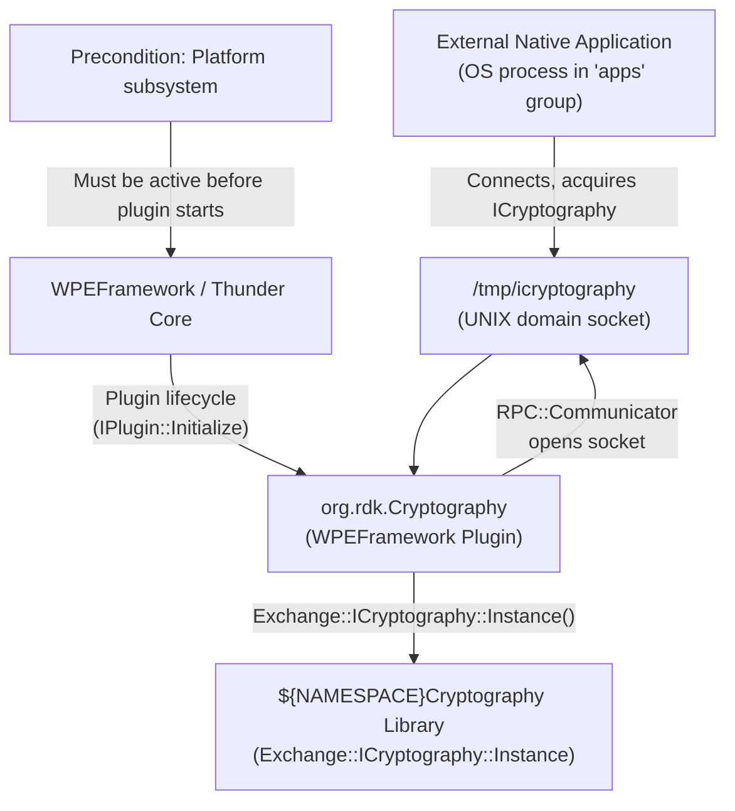
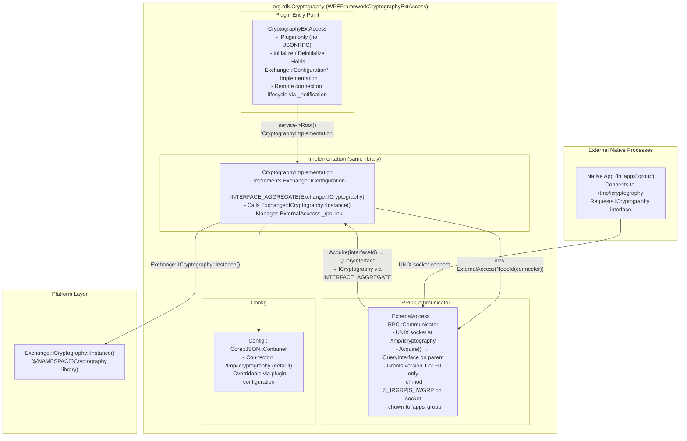
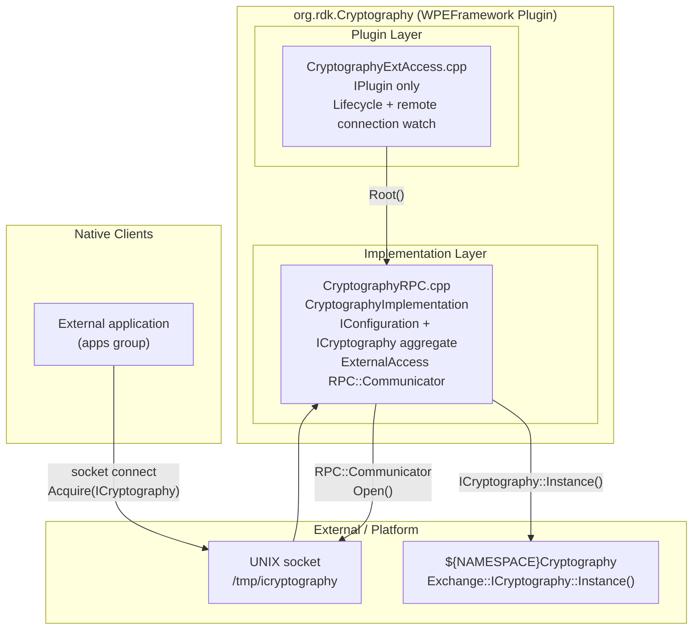
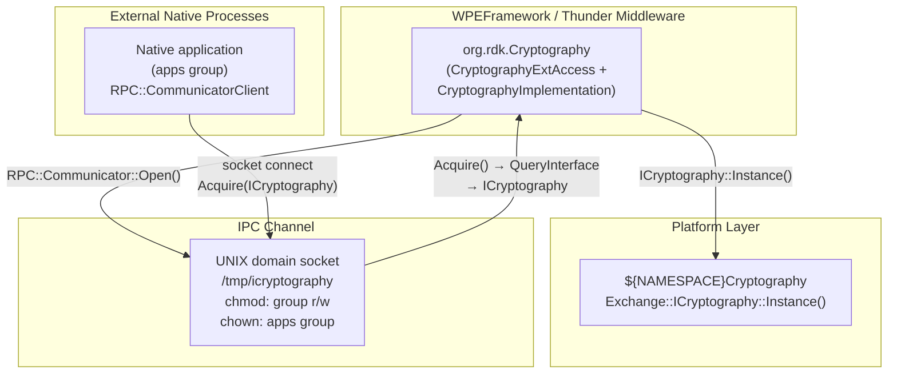
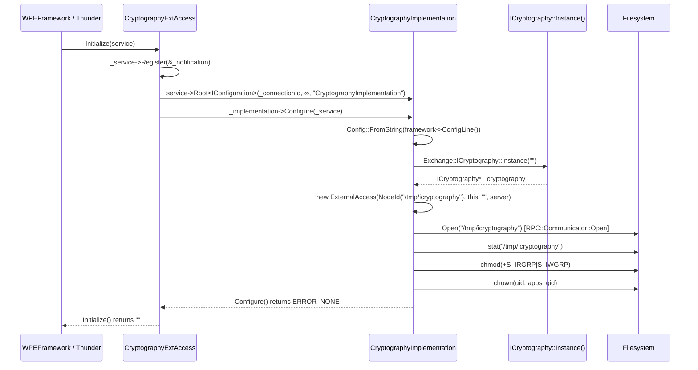
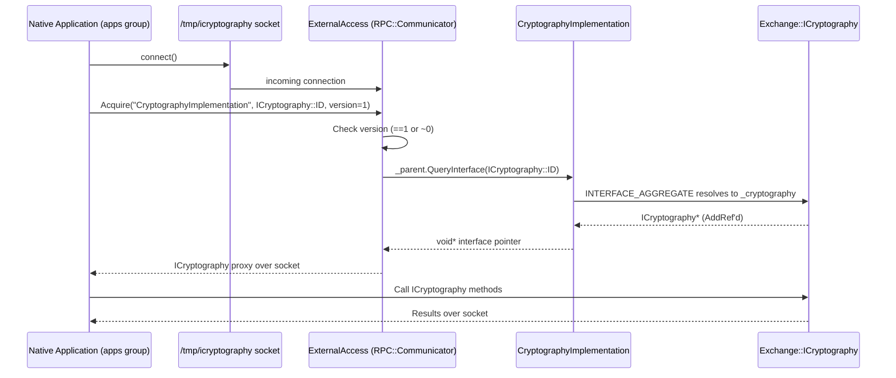

# Entservices-Cryptography

---

## Overview

`entservices-cryptography` is a WPEFramework Thunder plugin that acts as an external access broker for the Thunder `Exchange::ICryptography` interface. It does not expose JSON-RPC methods and does not implement a JSON-RPC endpoint. Instead, it makes the Thunder cryptography library accessible to native processes outside the Thunder runtime by hosting a UNIX domain socket at `/tmp/icryptography`, through which external clients can acquire `ICryptography` interface handles via Thunder's `RPC::Communicator` mechanism.

At the device level, the plugin enables OS processes in the `apps` group to perform cryptographic operations (backed by the platform's `${NAMESPACE}Cryptography` library) by connecting to the UNIX socket. The socket is chmod'd with group read/write permissions and chown'd to the `apps` group after creation.

At the module level, the plugin is structured as a single library (`WPEFrameworkCryptographyExtAccess`) containing both the Thunder plugin entry point (`CryptographyExtAccess`) and the implementation (`CryptographyImplementation` + `ExternalAccess`). The `CryptographyImplementation` class acquires `Exchange::ICryptography::Instance("")` from the platform library and aggregates it via `INTERFACE_AGGREGATE`, making it available to external callers through `ExternalAccess::Acquire()`.



**Key Features & Responsibilities:**

- **UNIX socket gateway for ICryptography**: Opens a `RPC::Communicator` on `/tmp/icryptography` at initialization, through which external native processes can request `Exchange::ICryptography` interface handles.
- **ICryptography instance acquisition**: Calls `Exchange::ICryptography::Instance("")` to obtain the platform-provided cryptography implementation and aggregates it via `INTERFACE_AGGREGATE(Exchange::ICryptography, _cryptography)`.
- **Access control via filesystem permissions**: After the UNIX socket is created, sets group read/write permissions (`chmod` adds `S_IRGRP | S_IWGRP`) and transfers group ownership to the `apps` OS group (`chown` via `getgrnam("apps")`).
- **Interface version gating**: `ExternalAccess::Acquire()` grants interface requests only for version 1 or the wildcard version (`~0`).
- **Out-of-process lifecycle management**: The `CryptographyImplementation` class is instantiated via `service->Root<Exchange::IConfiguration>(...)` as a remote object. If the remote process terminates unexpectedly, `Deactivated()` submits a deactivation job to the Thunder worker pool.
- **Configurable connector path**: The UNIX socket path defaults to `/tmp/icryptography` but can be overridden at runtime via the plugin's `connector` JSON configuration key.

---

## Architecture

### High-Level Architecture

`entservices-cryptography` departs from the standard two-library Thunder plugin pattern. The single library `WPEFrameworkCryptographyExtAccess` contains both the `IPlugin` entry point (`CryptographyExtAccess`) and the full service implementation (`CryptographyImplementation`, `ExternalAccess`). The thin plugin layer (`CryptographyExtAccess`) implements only `PluginHost::IPlugin` — there is no `PluginHost::JSONRPC` in its interface map, meaning no JSON-RPC surface is exposed to WebSocket clients.

The design pattern is: Thunder plugin lifecycle management on one side, native process IPC on the other. `CryptographyExtAccess::Initialize()` uses Thunder's RPC root mechanism (`service->Root<Exchange::IConfiguration>(...)`) to bring up `CryptographyImplementation`. That implementation then calls `Exchange::ICryptography::Instance("")` to obtain the platform cryptography backend and spins up an `ExternalAccess` UNIX socket server. Any native process that connects to `/tmp/icryptography` and requests the correct interface ID receives a COM-RPC proxy to `ICryptography` back through the socket.

The northbound interface is limited to the Thunder plugin host (lifecycle only) — there are no JSON-RPC methods. The southbound interface is `Exchange::ICryptography::Instance("")`, which is provided by the `${NAMESPACE}Cryptography` CMake package. No Device Services (DS) APIs are called. No IARM Bus calls are made in the production code.

No persistent store reads or writes occur at any point. All state is in-memory and is released on `Deinitialize()`.

A component diagram showing the internal structure is given below:



### Threading Model

- **Threading Architecture**: Multi-threaded via the WPEFramework worker pool, with the `RPC::Communicator`/`InvokeServer` handling external socket connections on their own threads.
- **Main Thread / Plugin Dispatch Thread**: Executes `IPlugin::Initialize()` and `Deinitialize()`. Calls `Exchange::ICryptography::Instance()`, creates `ExternalAccess`, applies file permissions.
- **RPC InvokeServer Threads**: `CryptographyImplementation::Configure()` creates a `Core::ProxyType<RPC::InvokeServer>` bound to `Core::IWorkerPool::Instance()`. Worker pool threads service incoming RPC requests from external clients on the UNIX socket.
- **Synchronization**: No explicit `CriticalSection` or mutex is declared in the plugin source. Thread safety for external RPC calls is managed by the Thunder `RPC::Communicator` and `InvokeServer` infrastructure.
- **Async / Event Dispatch**: If the remote `CryptographyImplementation` process deactivates unexpectedly, `Deactivated()` submits `PluginHost::IShell::Job::Create(_service, DEACTIVATED, FAILURE)` to `Core::IWorkerPool::Instance()`.

---

## Design

`entservices-cryptography` is designed as a process-boundary bridge: the Thunder plugin lifecycle and the platform cryptography library run in the same or a separate process (controlled by `PLUGIN_CRYPTOGRAPHYEXTACCESS_MODE`), while native OS applications access cryptographic operations over a UNIX domain socket without being part of the Thunder plugin system.

The `CryptographyExtAccess` plugin entry point holds an `Exchange::IConfiguration*` pointer to `CryptographyImplementation`, acquired through Thunder's COM-RPC root mechanism. `CryptographyImplementation` is the real service: it instantiates `Exchange::ICryptography` from the platform library, and through `INTERFACE_AGGREGATE`, exposes that interface to any caller querying via `QueryInterface`. `ExternalAccess` inherits `RPC::Communicator` and overrides `Acquire()` to call `_parent.QueryInterface(interfaceId)`, which resolves through the interface aggregate to the live `ICryptography` instance.

The connector path (`/tmp/icryptography`) is configurable via the plugin configuration JSON key `connector`. After the socket is bound, permissions are set with `chmod` (adds group read/write) and `chown` (sets group to `apps`) using POSIX `getgrnam()` / `chown()`. This is the sole access control mechanism — no Thunder-level authentication is applied.

Because `CryptographyExtAccess` implements only `PluginHost::IPlugin` (not `PluginHost::JSONRPC`), the plugin registers no JSON-RPC methods and is invisible to ThunderJS or WebSocket clients. It does not appear in the Thunder JSON-RPC service surface.

No data persistence is implemented. No filesystem paths other than the UNIX socket are read or written at runtime.

### Component Diagram



---

## Internal Modules

| Module / Class                        | Description                                                                                                                                                                                                                                                     | Key Files                                                            |
| ------------------------------------- | --------------------------------------------------------------------------------------------------------------------------------------------------------------------------------------------------------------------------------------------------------------- | -------------------------------------------------------------------- |
| `CryptographyExtAccess`               | Plugin entry point. Implements `PluginHost::IPlugin` only — no JSONRPC. Acquires `Exchange::IConfiguration*` from `CryptographyImplementation` via Thunder RPC root, calls `Configure()`, and monitors the remote connection via `Core::Sink<Notification>`.    | `plugin/CryptographyExtAccess.h`, `plugin/CryptographyExtAccess.cpp` |
| `CryptographyImplementation`          | Service core. Implements `Exchange::IConfiguration` and aggregates `Exchange::ICryptography`. In `Configure()`, calls `Exchange::ICryptography::Instance("")`, creates `ExternalAccess` on the configured connector path, and applies socket permissions.       | `plugin/CryptographyRPC.cpp`                                         |
| `ExternalAccess`                      | Inner class of `CryptographyImplementation`. Extends `RPC::Communicator`. Opens a UNIX domain socket and overrides `Acquire()` to forward interface requests to the parent's `QueryInterface()`, which routes through `INTERFACE_AGGREGATE` to `ICryptography`. | `plugin/CryptographyRPC.cpp`                                         |
| `Config`                              | Inner class of `CryptographyImplementation`. Extends `Core::JSON::Container`. Holds a single `Connector` string field; default is `"/tmp/icryptography"`. Parsed from `framework->ConfigLine()` in `Configure()`.                                               | `plugin/CryptographyRPC.cpp`                                         |
| `CryptographyExtAccess::Notification` | Inner class of `CryptographyExtAccess`. Implements `RPC::IRemoteConnection::INotification`. Calls `CryptographyExtAccess::Deactivated()` when the remote connection terminates, which submits a shell deactivation job to the Thunder worker pool.              | `plugin/CryptographyExtAccess.h`                                     |


---

## Prerequisites & Dependencies

**Thunder / WPEFramework APIs verification:**

- `PluginHost::IPlugin` — confirmed via `INTERFACE_ENTRY(PluginHost::IPlugin)` in `CryptographyExtAccess.h`.
- `PluginHost::JSONRPC` — **not implemented**. No JSON-RPC surface is exposed.
- `Exchange::IConfiguration` — confirmed via `_service->Root<Exchange::IConfiguration>(...)` in `CryptographyExtAccess.cpp` and `INTERFACE_ENTRY(Exchange::IConfiguration)` in `CryptographyRPC.cpp`.
- `Exchange::ICryptography` — confirmed via `Exchange::ICryptography::Instance("")` and `INTERFACE_AGGREGATE(Exchange::ICryptography, _cryptography)` in `CryptographyRPC.cpp`.

**IARM Bus verification:**
IARM Bus headers appear in `build_dependencies.sh` as empty stub files created for the test build environment only (`touch rdk/iarmbus/libIARM.h` etc.). No `IARM_Bus_RegisterEventHandler`, `IARM_Bus_Call`, or `IARM_Bus_Init` calls are present in any production source file. **IARM Bus is not used at runtime.**

**Device Services (DS) verification:**
No DS API calls are present in any production source file. **Device Services are not used.**

**Persistent store verification:**
No persistent store reads or writes are present. **No data persistence is implemented.**

### RDK-E Platform Requirements

- **WPEFramework Version**: Requires Thunder R4-compatible build. `build_dependencies.sh` clones Thunder at branch `R4.4.1` and ThunderTools at `R4.4.3`.
- **C++ Standard**: C++11 (`CXX_STANDARD 11` in `plugin/CMakeLists.txt`). Tests use C++14.
- **Build Dependencies**:
  - `${NAMESPACE}Plugins` — Thunder plugin infrastructure
  - `${NAMESPACE}Definitions` — Thunder common type definitions
  - `${NAMESPACE}Cryptography` (CMake `find_package`) — provides `Exchange::ICryptography::Instance()` and the platform-specific cryptography backend
  - `CompileSettingsDebug` — compile settings package
  - `FindDL.cmake` in `cmake/` — provides the `dl` library (dynamic linking)
- **Build-time CMake options**:
  - `PLUGIN_CRYPTOGRAPHYEXTACCESS_AUTOSTART` (default: `"true"`) — whether the plugin activates automatically at Thunder startup
  - `PLUGIN_CRYPTOGRAPHYEXTACCESS_MODE` (default: `"Off"`) — process mode (`"Off"`, `"Local"`, or container); `"Off"` runs in-process within Thunder
  - `PLUGIN_CRYPTOGRAPHYEXTACCESS_USER` — optional OS user identity for the plugin process
  - `PLUGIN_CRYPTOGRAPHYEXTACCESS_GROUP` — optional OS group identity for the plugin process
  - `PLUGIN_CRYPTOGRAPHY` (top-level `CMakeLists.txt`) — gates inclusion of the `plugin/` subdirectory
- **RDK-E Plugin Dependencies**: None declared via COM-RPC or IARM. The only declared dependency is the `PLATFORM` subsystem (`{ subsystem::PLATFORM }` in the plugin metadata preconditions).
- **Runtime system dependency**: The `apps` OS group must exist on the target system. `getgrnam("apps")` is called during `Configure()`; if the group does not exist, `chown` of the UNIX socket is skipped and a trace warning is logged.
- **Autostart**: Defaults to `"true"` — the plugin activates automatically when Thunder starts.
- **Connector path**: `/tmp/icryptography` (default). Configurable via the plugin JSON configuration key `connector`.
- **IARM Bus**: Not used at runtime.
- **Systemd services**: No systemd service file is present in this repository.

---

## Quick Start

### 1. Activate the plugin (if not autostarted)

```js
// JavaScript — ThunderJS
import ThunderJS from "thunderjs";
const thunderJS = ThunderJS({ host: "localhost", port: 9998 });
await thunderJS.Controller.activate({ callsign: "org.rdk.Cryptography" });
```

### 2. Access cryptographic operations from a native process

The plugin is not JSON-RPC accessible. Native processes use Thunder's COM-RPC client library to connect to `/tmp/icryptography` and acquire an `ICryptography` interface.

```cpp
// C++ — native client connecting to the UNIX socket
#include <com/com.h>
#include <cryptography/cryptography.h>

WPEFramework::RPC::CommunicatorClient client(
    WPEFramework::Core::NodeId("/tmp/icryptography"));

Exchange::ICryptography* crypto = client.Open<Exchange::ICryptography>(
    _T("CryptographyImplementation"),
    Exchange::ICryptography::ID,
    ~0u,  // version wildcard
    Core::infinite);

if (crypto != nullptr) {
    // Use ICryptography interface
    crypto->Release();
}
```

### 3. Cleanup

The plugin does not expose a JSON-RPC deactivation path. Deactivation is handled through the Thunder Controller plugin.

```js
await thunderJS.Controller.deactivate({ callsign: "org.rdk.Cryptography" });
```

---

## Configuration

### Key Configuration Files

| Configuration File                     | Purpose                                                                        | Override Mechanism                        |
| -------------------------------------- | ------------------------------------------------------------------------------ | ----------------------------------------- |
| `plugin/CryptographyExtAccess.conf.in` | Thunder plugin activation config — sets callsign, autostart, mode, user, group | CMake variables substituted at build time |
| `plugin/CryptographyExtAccess.config`  | CMake helper that generates the `.conf.in` substitution map                    | CMake variables                           |

### Configuration Parameters

| Parameter   | Type   | Default                | Source                                             | Description                                                                      |
| ----------- | ------ | ---------------------- | -------------------------------------------------- | -------------------------------------------------------------------------------- |
| `callsign`  | string | `org.rdk.Cryptography` | conf.in                                            | Thunder plugin callsign                                                          |
| `autostart` | bool   | `true`                 | `PLUGIN_CRYPTOGRAPHYEXTACCESS_AUTOSTART` CMake var | Plugin activates automatically at Thunder startup                                |
| `mode`      | string | `"Off"`                | `PLUGIN_CRYPTOGRAPHYEXTACCESS_MODE` CMake var      | Process mode: `"Off"` (in-process), `"Local"` (out-of-process), or container     |
| `user`      | string | not set                | `PLUGIN_CRYPTOGRAPHYEXTACCESS_USER` CMake var      | Optional OS user for the plugin process (only written to config if set)          |
| `group`     | string | not set                | `PLUGIN_CRYPTOGRAPHYEXTACCESS_GROUP` CMake var     | Optional OS group for the plugin process (only written to config if set)         |
| `connector` | string | `/tmp/icryptography`   | plugin JSON config at runtime                      | UNIX domain socket path. Parsed from `framework->ConfigLine()` in `Configure()`. |

### Configuration Persistence

Configuration changes are not persisted across reboots. No persistent store is written by this plugin.

---

## API / Usage

### Interface Type

This plugin does **not** expose a JSON-RPC API. It has no `PluginHost::JSONRPC` interface.

The interface exposed to external consumers is `Exchange::ICryptography`, accessed over a UNIX domain socket at `/tmp/icryptography` using Thunder's `RPC::Communicator` / `CommunicatorClient` COM-RPC mechanism. The socket is readable and writable by members of the `apps` OS group.

The plugin's role in Thunder is purely lifecycle management (it appears in the Thunder Controller as `org.rdk.Cryptography`) and brokering the UNIX socket setup. Cryptographic operations are fully defined by `Exchange::ICryptography` in the Thunder framework's Cryptography package.

---

## Component Interactions



### Interaction Matrix

| Target Component / Layer           | Interaction Purpose                                  | Key APIs                                                  |
| ---------------------------------- | ---------------------------------------------------- | --------------------------------------------------------- |
| **Platform Layer**                 |                                                      |                                                           |
| `${NAMESPACE}Cryptography` library | Obtain the platform cryptography implementation      | `Exchange::ICryptography::Instance("")`                   |
| **IARM Bus**                       | Not used at runtime                                  | —                                                         |
| **Device Services / HAL**          | Not used                                             | —                                                         |
| **Persistent Store**               | Not used                                             | —                                                         |
| **External Native Processes**      | Provide ICryptography access to apps-group processes | `RPC::Communicator` over UNIX socket `/tmp/icryptography` |

### IPC Flow Patterns

**Plugin Initialization Flow:**



**External Client Request Flow:**



---

## Testing

### Test Levels

| Level            | Scope                                   | Location                                                                                                                                                      |
| ---------------- | --------------------------------------- | ------------------------------------------------------------------------------------------------------------------------------------------------------------- |
| L1 – Unit        | Individual classes, dependencies mocked | `Tests/L1Tests/` — CMakeLists.txt present; no test source files present in this repository                                                                    |
| L2 – Integration | Thunder runtime integration             | `Tests/L2Tests/` — CMakeLists.txt present; references `entservices-testframework` and `MockAccessor` library; no test source files present in this repository |

The L1 test CMakeLists.txt defines the `add_plugin_test_ex` macro infrastructure but lists no test source files (`TEST_SRC` is empty). The L2 test CMakeLists.txt links against `TestMocklib` and `MockAccessor` from an external `entservices-testframework` repository and uses GoogleTest fetched at build time.

### Running Tests

```bash
# L1 tests
cmake -G Ninja -B build -DRDK_SERVICES_L1_TEST=ON -DPLUGIN_CRYPTOGRAPHY=ON
cmake --build build
ctest --output-on-failure

# L2 tests
cmake -G Ninja -B build -DRDK_SERVICE_L2_TEST=ON -DPLUGIN_CRYPTOGRAPHY=ON
cmake --build build
ctest --output-on-failure
```
