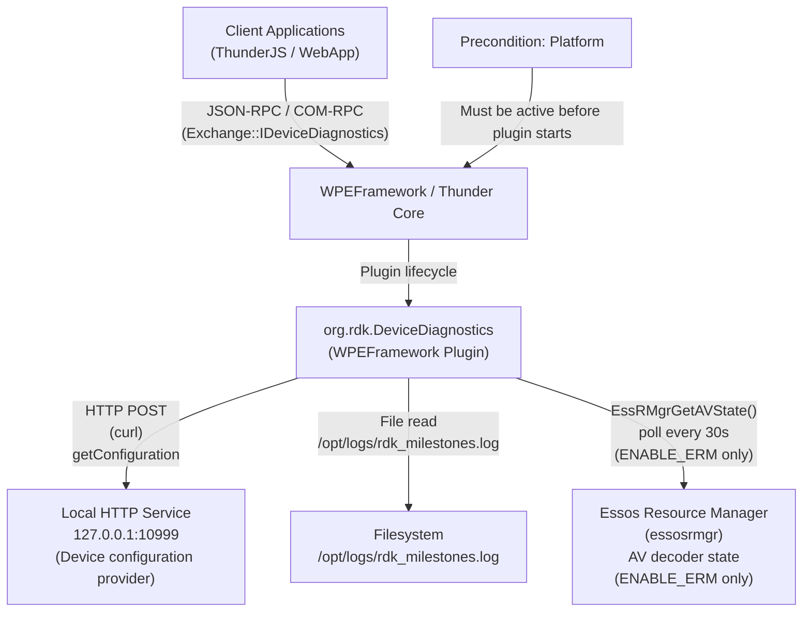
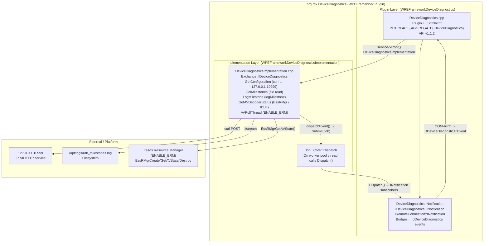
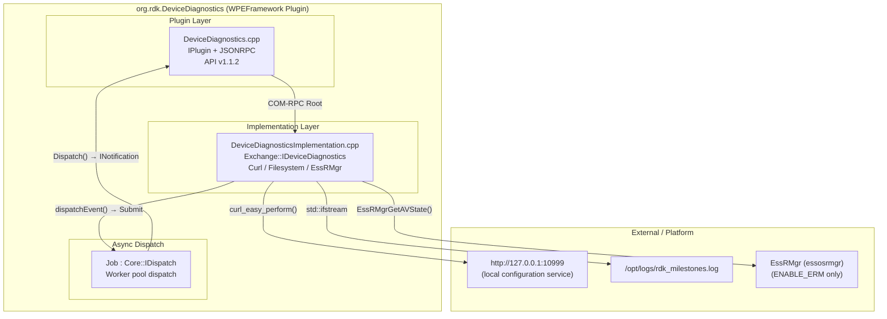
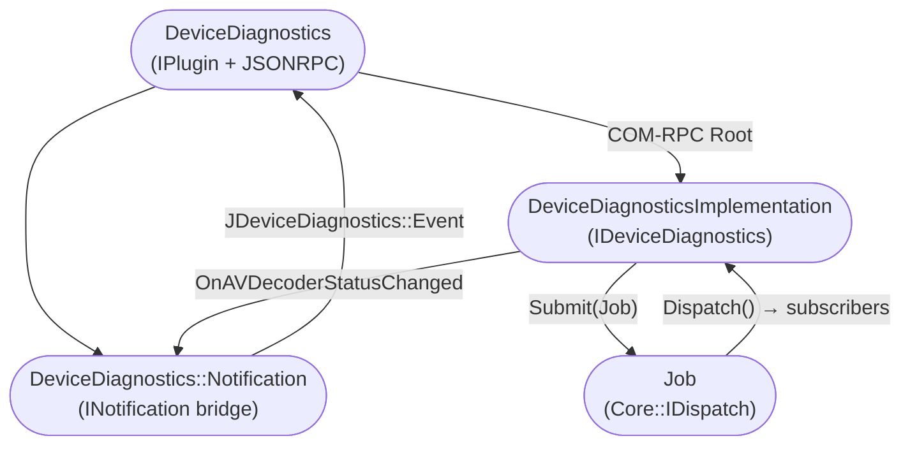
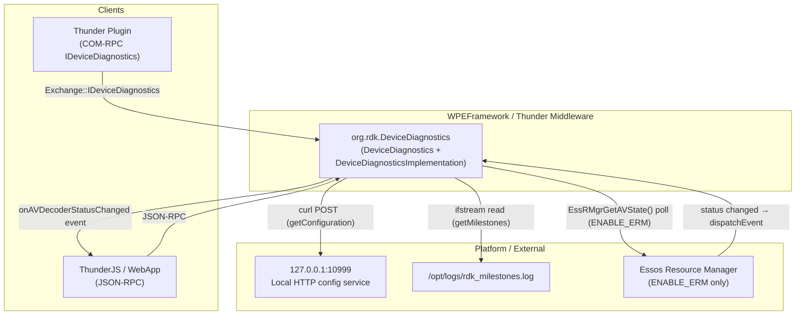
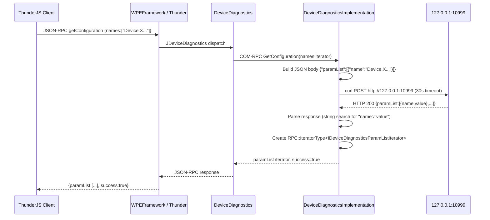
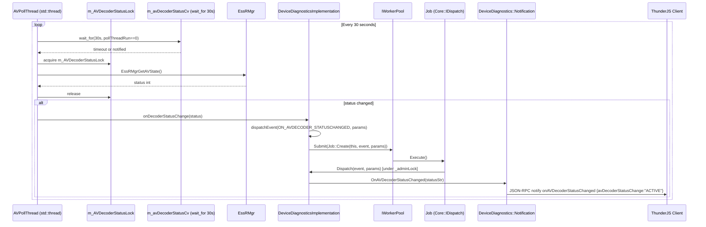

# Entservices-Devicediagnostics

---

## Overview

`entservices-devicediagnostics` is a WPEFramework Thunder plugin that provides device configuration queries, milestone log access, milestone logging, and AV decoder status monitoring. Its callsign is `org.rdk.DeviceDiagnostics` and it exposes a JSON-RPC surface via the auto-generated `Exchange::JDeviceDiagnostics` bindings as well as a COM-RPC `Exchange::IDeviceDiagnostics` interface.

At the device level, the plugin serves two distinct functions: it retrieves named device configuration parameters by posting a JSON request to a local HTTP service running on `127.0.0.1:10999`, and it monitors AV decoder activity using the Essos Resource Manager (`essosrmgr`) library (conditionally compiled under `ENABLE_ERM`). When decoder status changes are detected, an `onAVDecoderStatusChanged` event is fired to all registered notification subscribers.

At the module level, the plugin follows the standard two-library Thunder pattern. `WPEFrameworkDeviceDiagnostics` is the thin plugin library that implements `PluginHost::IPlugin` and `PluginHost::JSONRPC`. `WPEFrameworkDeviceDiagnosticsImplementation` is the separate implementation library that holds all business logic, the curl-based device configuration query, filesystem reads of the milestone log file, AV decoder polling via EssRMgr (when enabled), and asynchronous event dispatch.



**Key Features & Responsibilities:**

- **Device configuration query**: Posts a JSON body containing a list of named parameters to a local HTTP server at `127.0.0.1:10999` using libcurl (30-second timeout), parses the response, and returns a list of name/value pairs via `GetConfiguration`.
- **Milestone log retrieval**: Reads `/opt/logs/rdk_milestones.log` line by line and returns the contents as a string iterator via `GetMilestones`.
- **Milestone logging**: Writes a caller-supplied marker string to the platform milestone log via `logMilestone()` (compiled in when `RDK_LOG_MILESTONE` is defined). Returns success without writing if `RDK_LOG_MILESTONE` is not defined.
- **AV decoder status query**: Returns the current most-active AV decoder status (`IDLE`, `PAUSED`, or `ACTIVE`) from the Essos Resource Manager via `GetAVDecoderStatus`. Without `ENABLE_ERM`, always returns `IDLE`.
- **AV decoder status change notification**: When `ENABLE_ERM` is defined, a dedicated background poll thread queries `EssRMgrGetAVState()` every 30 seconds. When the status changes, an `onAVDecoderStatusChanged` event is dispatched asynchronously to all registered `IDeviceDiagnostics::INotification` subscribers.

---

## Architecture

### High-Level Architecture

`entservices-devicediagnostics` uses the standard WPEFramework two-library out-of-process plugin architecture. The thin plugin library (`WPEFrameworkDeviceDiagnostics`) registers the service callsign, exposes the auto-generated JSON-RPC methods from `Exchange::JDeviceDiagnostics`, and aggregates `Exchange::IDeviceDiagnostics` for COM-RPC clients via `INTERFACE_AGGREGATE`. The implementation library (`WPEFrameworkDeviceDiagnosticsImplementation`) runs in a separate process and holds all business logic.

The northbound interface is dual: JSON-RPC clients (ThunderJS, WebSocket) call methods on `org.rdk.DeviceDiagnostics`, and COM-RPC clients use the `Exchange::IDeviceDiagnostics` interface. The southbound interface has two paths: libcurl HTTP POST to `127.0.0.1:10999` for device configuration, and direct filesystem reads of `/opt/logs/rdk_milestones.log` for milestone data. AV decoder status is pulled from Essos Resource Manager (`EssRMgrGetAVState`) when `ENABLE_ERM` is defined at build time.

The AV decoder polling is done in a dedicated `std::thread` (`AVPollThread`) launched at implementation construction (when `ENABLE_ERM` is set). It waits on a `std::condition_variable` with a 30-second timeout, calls `getMostActiveDecoderStatus()`, and if the status has changed, posts an `ON_AVDECODER_STATUSCHANGED` event to the worker pool via `Job::Create`. The worker pool thread then acquires `_adminLock` and iterates all registered `INotification` subscribers.

No IARM Bus calls are made in any production source file. No persistent store reads or writes occur at runtime.

A component diagram showing the internal structure is given below:



### Threading Model

- **Threading Architecture**: Multi-threaded. The plugin uses the WPEFramework worker pool for asynchronous event dispatch and, when `ENABLE_ERM` is defined, a dedicated `std::thread` for AV decoder status polling.
- **Main Thread / COM-RPC Dispatch Thread**: Executes `IPlugin::Initialize()`, `Deinitialize()`, and all `IDeviceDiagnostics` method implementations (`GetConfiguration`, `GetMilestones`, `LogMilestone`, `GetAVDecoderStatus`).
- **AVPollThread** (when `ENABLE_ERM` is defined): Created in `DeviceDiagnosticsImplementation` constructor. Waits on `m_avDecoderStatusCv` with a 30-second timeout, calls `getMostActiveDecoderStatus()` each cycle. When status changes, calls `onDecoderStatusChange()` → `dispatchEvent()` → `Core::IWorkerPool::Instance().Submit(Job::Create(...))`. Exits when `m_pollThreadRun == 0`.
- **Worker Pool Thread**: Dequeues `Job` instances submitted by `dispatchEvent()` and calls `DeviceDiagnosticsImplementation::Dispatch()`, which acquires `_adminLock` and iterates all `INotification` subscribers.
- **Synchronization**:
  - `Core::CriticalSection _adminLock` — guards the `_deviceDiagnosticsNotification` subscriber list and is held during `Register`, `Unregister`, and `Dispatch`.
  - `std::mutex m_AVDecoderStatusLock` — guards `m_pollThreadRun` and `getMostActiveDecoderStatus()` access in `AVPollThread` and `GetAVDecoderStatus`.
  - `std::condition_variable m_avDecoderStatusCv` — used to wake `AVPollThread` early on shutdown.
- **Async / Event Dispatch**: `dispatchEvent(event, params)` → `Core::IWorkerPool::Instance().Submit(Job::Create(this, event, params))`. The `Job::Dispatch()` call on the worker thread invokes `Dispatch()` under `_adminLock`.

---

## Design

`entservices-devicediagnostics` separates plugin lifecycle (thin layer) from business logic (implementation layer). `DeviceDiagnostics` handles COM-RPC lifecycle, JSON-RPC registration, and notification bridging. `DeviceDiagnosticsImplementation` owns the actual data fetching, filesystem access, and AV state tracking.

Device configuration retrieval is done by building a JSON payload (`{"paramList":[{"name":"<param>"},...]}`) and POSTing it via libcurl to `http://127.0.0.1:10999` with a 30-second timeout. The implementation parses the raw response text using string search for `"name":` and `"value":` substrings without a JSON parser, extracting name/value pairs into a `ParamList` list. The result is wrapped in a COM-RPC iterator (`RPC::IteratorType<IDeviceDiagnosticsParamListIterator>`).

AV decoder status polling avoids ERM's lack of event support by running a periodically waking thread. The poll interval is `AVDECODERSTATUS_RETRY_INTERVAL` (30 seconds). Only status transitions are reported — if the status is unchanged, the event is not fired. Decoder states are mapped to strings: `0 → "IDLE"`, `1 → "PAUSED"`, `2 → "ACTIVE"`.

`LogMilestone` fully depends on the `RDK_LOG_MILESTONE` compile-time define. If not defined, it returns `success: true` without writing anything. `GetMilestones` fails if `/opt/logs/rdk_milestones.log` does not exist on the filesystem, returning `success: false` in that case.

No data persistence is implemented by the plugin itself. The milestone log file is written by the platform milestone logging subsystem, not by this plugin (the plugin only reads it, or appends via `logMilestone` on platforms where `RDK_LOG_MILESTONE` is defined).

### Component Diagram



---

## Internal Modules

| Module / Class                    | Description                                                                                                                                                                                                                                                                                                                                                                               | Key Files                                                                                |
| --------------------------------- | ----------------------------------------------------------------------------------------------------------------------------------------------------------------------------------------------------------------------------------------------------------------------------------------------------------------------------------------------------------------------------------------- | ---------------------------------------------------------------------------------------- |
| `DeviceDiagnostics`               | Thin plugin entry point. Implements `PluginHost::IPlugin` and `PluginHost::JSONRPC`. Aggregates `Exchange::IDeviceDiagnostics` via `INTERFACE_AGGREGATE`. Registers auto-generated JSON-RPC bindings via `Exchange::JDeviceDiagnostics::Register`. Manages the remote connection lifecycle and bridges COM-RPC notifications to JSON-RPC events.                                          | `plugin/DeviceDiagnostics.h`, `plugin/DeviceDiagnostics.cpp`                             |
| `DeviceDiagnostics::Notification` | Inner class of `DeviceDiagnostics`. Implements `Exchange::IDeviceDiagnostics::INotification` and `RPC::IRemoteConnection::INotification`. `OnAVDecoderStatusChanged` calls `Exchange::JDeviceDiagnostics::Event::OnAVDecoderStatusChanged` to fire the JSON-RPC notification. `Deactivated` submits a shell deactivation job to the worker pool on unexpected remote process termination. | `plugin/DeviceDiagnostics.h`, `plugin/DeviceDiagnostics.cpp`                             |
| `DeviceDiagnosticsImplementation` | Implementation layer. Implements `Exchange::IDeviceDiagnostics`. Provides `GetConfiguration` (curl HTTP POST), `GetMilestones` (file read), `LogMilestone` (via `logMilestone()`), `GetAVDecoderStatus` (EssRMgr or hardcoded `IDLE`), and manages the AV decoder status poll thread under `ENABLE_ERM`.                                                                                  | `plugin/DeviceDiagnosticsImplementation.h`, `plugin/DeviceDiagnosticsImplementation.cpp` |
| `Job`                             | Inner class of `DeviceDiagnosticsImplementation`. Implements `Core::IDispatch`. Created via `Job::Create(this, event, params)` and submitted to `Core::IWorkerPool`. On execution, calls `DeviceDiagnosticsImplementation::Dispatch()` which iterates all registered `INotification` subscriber under `_adminLock`.                                                                       | `plugin/DeviceDiagnosticsImplementation.h`                                               |



---

## Prerequisites & Dependencies

**Thunder / WPEFramework APIs verification:**

- `PluginHost::IPlugin` — confirmed via `INTERFACE_ENTRY(PluginHost::IPlugin)` in `DeviceDiagnostics.h`.
- `PluginHost::JSONRPC` (`IDispatcher`) — confirmed via `INTERFACE_ENTRY(PluginHost::IDispatcher)` in `DeviceDiagnostics.h`.
- `Exchange::IDeviceDiagnostics` — confirmed via `INTERFACE_AGGREGATE(Exchange::IDeviceDiagnostics, _deviceDiagnostics)` and `service->Root<Exchange::IDeviceDiagnostics>(...)` in `DeviceDiagnostics.cpp`.
- `Exchange::JDeviceDiagnostics::Register/Unregister` — confirmed in `DeviceDiagnostics.cpp::Initialize/Deinitialize`.

**IARM Bus verification:**
No `IARM_Bus_RegisterEventHandler`, `IARM_Bus_Call`, `IARM_Bus_Init`, or any `IARM_Bus_*` call is present in any production source file. **IARM Bus is not used at runtime.**

**Device Services (DS) verification:**
No DS API calls are present. **Device Services are not used.**

**Curl verification:**
`curl_easy_init()`, `curl_easy_setopt()`, `curl_easy_perform()`, `curl_easy_getinfo()`, and `curl_easy_cleanup()` are called in `getConfig()` in `DeviceDiagnosticsImplementation.cpp`. The `cmake/FindCurl.cmake` locates `libcurl` at build time.

**EssRMgr (Essos Resource Manager) verification:**
`EssRMgrCreate()`, `EssRMgrGetAVState()`, and `EssRMgrDestroy()` are called in `DeviceDiagnosticsImplementation.cpp` within `#ifdef ENABLE_ERM` guards. Linked via `essosrmgr` when `BUILD_ENABLE_ERM` is set in CMake.

**Milestone logging verification:**
`logMilestone(marker.c_str())` is called in `LogMilestone()` within `#ifdef RDK_LOG_MILESTONE` guards. The header `rdk_logger_milestone.h` is included when `RDK_LOG_MILESTONE` is defined.

**Persistent store verification:**
No persistent store reads or writes are present. **No data persistence is implemented.**

### RDK-E Platform Requirements

- **WPEFramework Version**: Supports Thunder R4 and non-R4. `Job::Create` uses `USE_THUNDER_R4` preprocessor define to choose the correct `Core::ProxyType` cast.
- **C++ Standard**: C++11 for both plugin and implementation libraries; C++14 for tests.
- **Build Dependencies**:
  - `${NAMESPACE}Plugins` — Thunder plugin infrastructure
  - `${NAMESPACE}Definitions` — Thunder common type definitions
  - `CompileSettingsDebug` — compile settings package
  - `libcurl` — found via `cmake/FindCurl.cmake`; used for device configuration HTTP queries
  - `essosrmgr` — linked when `BUILD_ENABLE_ERM=ON`; provides `EssRMgrCreate/GetAVState/Destroy`
  - `rdk_logger_milestone.h` / `logMilestone()` — used when `RDK_LOG_MILESTONE` is defined
  - `TestMocklib` — linked to implementation in L2 test builds when `RDK_SERVICE_L2_TEST=ON`
- **Build-time CMake options**:
  - `PLUGIN_DEVICEDIAGNOSTICS_STARTUPORDER` — sets the numeric startup order of the plugin
  - `PLUGIN_DEVICEDIAGNOSTICS_MODE` — sets the process isolation mode (`"Off"`, `"Local"`, etc.)
  - `BUILD_ENABLE_ERM` — enables Essos Resource Manager integration and AV decoder status polling
  - `RDK_LOG_MILESTONE` — enables actual milestone writing via `logMilestone()`
- **Precondition**: `precondition = ["Platform"]` — the Platform plugin must activate before `org.rdk.DeviceDiagnostics`.
- **Autostart**: `autostart = "false"` — the plugin does not start automatically; it must be activated.
- **External service dependency**: `GetConfiguration` depends on an HTTP service running at `127.0.0.1:10999`. If the service is not available, `curl_easy_perform` returns a non-`CURLE_OK` result, the method returns `Core::ERROR_GENERAL` with `success: false`.
- **Filesystem dependency**: `GetMilestones` requires `/opt/logs/rdk_milestones.log` to exist.
- **IARM Bus**: Not used at runtime.
- **Systemd services**: No systemd service file is present in this repository.

---

## Quick Start

### 1. Activate the plugin

```js
import ThunderJS from "thunderjs";
const thunderJS = ThunderJS({ host: "localhost", port: 9998 });
await thunderJS.Controller.activate({ callsign: "org.rdk.DeviceDiagnostics" });
```

### 2. Query device configuration parameters

```js
thunderJS["org.rdk.DeviceDiagnostics"]
  .getConfiguration({
    names: ["Device.X_CISCO_COM_LED.RedPwm", "Device.DeviceInfo.Manufacturer"],
  })
  .then((result) => console.log(result.paramList))
  .catch((err) => console.error(err));
```

### 3. Get AV decoder status

```js
thunderJS["org.rdk.DeviceDiagnostics"]
  .getAVDecoderStatus()
  .then((result) => console.log(result.avDecoderStatus)) // "IDLE", "PAUSED", or "ACTIVE"
  .catch((err) => console.error(err));
```

### 4. Get milestone log entries

```js
thunderJS["org.rdk.DeviceDiagnostics"]
  .getMilestones()
  .then((result) => console.log(result.milestones))
  .catch((err) => console.error(err));
```

### 5. Subscribe to AV decoder status changes

```js
thunderJS.on(
  "org.rdk.DeviceDiagnostics",
  "onAVDecoderStatusChanged",
  (payload) => {
    console.log("Decoder status:", payload.avDecoderStatusChange);
  },
);
```

---

## Configuration

### Key Configuration Files

| Configuration File                 | Purpose                                                                                                                   | Override Mechanism                        |
| ---------------------------------- | ------------------------------------------------------------------------------------------------------------------------- | ----------------------------------------- |
| `plugin/DeviceDiagnostics.conf.in` | Thunder plugin activation config — callsign, autostart, precondition, startup order, process mode, implementation locator | CMake variables substituted at build time |
| `plugin/DeviceDiagnostics.config`  | CMake helper that generates the conf.in substitution map                                                                  | CMake variables                           |

### Configuration Parameters

| Parameter                        | Type   | Default                                                 | Source                                             | Description                                                                      |
| -------------------------------- | ------ | ------------------------------------------------------- | -------------------------------------------------- | -------------------------------------------------------------------------------- |
| `callsign`                       | string | `org.rdk.DeviceDiagnostics`                             | conf.in                                            | Thunder plugin callsign                                                          |
| `autostart`                      | bool   | `false`                                                 | conf.in                                            | Plugin does not activate automatically at Thunder startup                        |
| `preconditions`                  | array  | `["Platform"]`                                          | conf.in                                            | Required active subsystems before this plugin can start                          |
| `startuporder`                   | int    | (empty, set by `PLUGIN_DEVICEDIAGNOSTICS_STARTUPORDER`) | CMake                                              | Relative activation order                                                        |
| `mode`                           | string | `PLUGIN_DEVICEDIAGNOSTICS_MODE`                         | CMake                                              | Process isolation mode (`"Off"` = in-process, `"Local"` = out-of-process)        |
| `connector` HTTP endpoint        | string | `http://127.0.0.1:10999`                                | hardcoded in `DeviceDiagnosticsImplementation.cpp` | Local HTTP service endpoint for `GetConfiguration` — not configurable at runtime |
| `curlTimeoutInSeconds`           | int    | `30`                                                    | hardcoded in `DeviceDiagnosticsImplementation.cpp` | libcurl timeout for `GetConfiguration` HTTP calls                                |
| `AVDECODERSTATUS_RETRY_INTERVAL` | int    | `30` (seconds)                                          | compile-time `#define`                             | Poll interval for AV decoder status thread (ENABLE_ERM only)                     |
| Milestone log path               | string | `/opt/logs/rdk_milestones.log`                          | hardcoded (`MILESTONES_LOG_FILE`)                  | Path read by `GetMilestones` — not configurable at runtime                       |

### Configuration Persistence

Configuration changes are not persisted across reboots. No persistent store is written by this plugin.

---

## API / Usage

### Interface Type

- **JSON-RPC over Thunder WebSocket** (`ws://host:9998/jsonrpc`) using callsign `org.rdk.DeviceDiagnostics`.
- **COM-RPC Exchange interface** (`Exchange::IDeviceDiagnostics`) — available in-process to other Thunder plugins via `INTERFACE_AGGREGATE`.

---

### Methods

#### `getConfiguration`

Returns device configuration values for a given list of named parameters. The implementation POSTs the names to `http://127.0.0.1:10999` using libcurl and parses the response for name/value pairs.

**Parameters**

| Name    | Type             | Required | Description                                                                   |
| ------- | ---------------- | -------- | ----------------------------------------------------------------------------- |
| `names` | array of strings | Yes      | List of parameter names to query (e.g., `["Device.X_CISCO_COM_LED.RedPwm"]`). |

**Response**

```json
{
  "paramList": [{ "name": "Device.X_CISCO_COM_LED.RedPwm", "value": "123" }],
  "success": true
}
```

Returns `success: false` if the curl request fails or the HTTP response code is not `0` or `200`.

**Example**

```js
thunderJS["org.rdk.DeviceDiagnostics"]
  .getConfiguration({
    names: ["Device.X_CISCO_COM_LED.RedPwm"],
  })
  .then((r) => console.log(r.paramList));
```

---

#### `getMilestones`

Reads `/opt/logs/rdk_milestones.log` and returns its non-empty lines as an array of strings.

**Parameters**: None.

**Response**

```json
{
  "milestones": [
    "2025-01-01T00:00:00 Boot started",
    "2025-01-01T00:00:05 Network up"
  ],
  "success": true
}
```

Returns `success: false` if the file does not exist or cannot be opened.

**Example**

```js
thunderJS["org.rdk.DeviceDiagnostics"]
  .getMilestones()
  .then((r) => console.log(r.milestones));
```

---

#### `logMilestone`

Writes a marker string to the platform milestone log via `logMilestone()`. If the build does not define `RDK_LOG_MILESTONE`, the call is a no-op but still returns `success: true`.

**Parameters**

| Name     | Type   | Required | Description                                            |
| -------- | ------ | -------- | ------------------------------------------------------ |
| `marker` | string | Yes      | Non-empty marker string to write to the milestone log. |

**Response**

```json
{ "success": true }
```

Returns `success: false` if `marker` is empty.

**Example**

```js
thunderJS["org.rdk.DeviceDiagnostics"]
  .logMilestone({ marker: "AppLaunched" })
  .then((r) => console.log(r.success));
```

---

#### `getAVDecoderStatus`

Returns the current most-active AV decoder status. When `ENABLE_ERM` is defined, queries `EssRMgrGetAVState` under `m_AVDecoderStatusLock`. Without `ENABLE_ERM`, always returns `"IDLE"`.

**Parameters**: None.

**Response**

```json
{ "avDecoderStatus": "IDLE" }
```

Possible values: `"IDLE"`, `"PAUSED"`, `"ACTIVE"`.

**Example**

```js
thunderJS["org.rdk.DeviceDiagnostics"]
  .getAVDecoderStatus()
  .then((r) => console.log(r.avDecoderStatus));
```

---

### Events / Notifications

| Event                      | Trigger Condition                                                                                                                                                                         | Payload                                                 |
| -------------------------- | ----------------------------------------------------------------------------------------------------------------------------------------------------------------------------------------- | ------------------------------------------------------- |
| `onAVDecoderStatusChanged` | AV decoder state changes from one value to another, detected by `AVPollThread` via `EssRMgrGetAVState()` (fires only when `ENABLE_ERM` is defined at build time; does not fire otherwise) | `{ "avDecoderStatusChange": "<IDLE\|PAUSED\|ACTIVE>" }` |

---

## Component Interactions



### Interaction Matrix

| Target Component / Layer   | Interaction Purpose                         | Key APIs                                                                                                                                                       |
| -------------------------- | ------------------------------------------- | -------------------------------------------------------------------------------------------------------------------------------------------------------------- |
| **Local HTTP service**     | Fetch device configuration name/value pairs | `curl_easy_init`, `curl_easy_setopt(CURLOPT_URL, "http://127.0.0.1:10999")`, `curl_easy_perform`, `curl_easy_cleanup` in `DeviceDiagnosticsImplementation.cpp` |
| **Filesystem**             | Read milestone log entries                  | `std::ifstream` on `/opt/logs/rdk_milestones.log` in `DeviceDiagnosticsImplementation.cpp`                                                                     |
| **Essos Resource Manager** | Poll AV decoder state                       | `EssRMgrCreate()`, `EssRMgrGetAVState()`, `EssRMgrDestroy()` in `DeviceDiagnosticsImplementation.cpp` (ENABLE_ERM only)                                        |
| **IARM Bus**               | Not used at runtime                         | —                                                                                                                                                              |
| **Device Services / HAL**  | Not used                                    | —                                                                                                                                                              |
| **Persistent Store**       | Not used                                    | —                                                                                                                                                              |

### IPC Flow Patterns

**GetConfiguration request flow:**



**AV decoder status change event flow (ENABLE_ERM only):**



---

## Testing

### Test Levels

| Level            | Scope                                                                                                   | Location                                           |
| ---------------- | ------------------------------------------------------------------------------------------------------- | -------------------------------------------------- |
| L1 – Unit        | `DeviceDiagnostics` + `DeviceDiagnosticsImplementation` with mocked Thunder, curl, and ERM dependencies | `Tests/L1Tests/tests/test_DeviceDiagnostics.cpp`   |
| L2 – Integration | Thunder runtime integration using COM-RPC `IDeviceDiagnostics`                                          | `Tests/L2Tests/tests/DeviceDiagnostics_L2Test.cpp` |

### L1 Test Coverage (confirmed in source)

- `RegisterMethod` — verifies `getConfiguration` and `getAVDecoderStatus` JSON-RPC methods are registered.
- `getConfiguration` — sets up a real TCP server on port 10999 in a thread, invokes the JSON-RPC handler, and verifies the HTTP POST body format (`{"paramList":[{"name":"test"}]}`).
- `getAVDecoderStatus` — invokes handler, verifies response is `{"avDecoderStatus":"IDLE"}` (no ERM in test environment).

### L2 Test Coverage (confirmed in source)

L2 tests use `Exchange::IDeviceDiagnostics::INotification` (`DiagnosticsNotificationHandler`) via COM-RPC and verify `onAVDecoderStatusChanged` event delivery using a `std::condition_variable` with a 31-second wait timeout (`AV_POLL_TIMEOUT`). Callsign used: `org.rdk.DeviceDiagnostics.1`.

### Mock Framework

L1 tests mock: `ServiceMock`, `COMLinkMock`, `DeviceDiagnosticsMock`, `WrapsImplMock`, `WorkerPoolImplementation`.
L2 tests link against `TestMocklib` (when `RDK_SERVICE_L2_TEST=ON` and `L2_TEST_OOP_RPC` not set) and `MockAccessor`.

### Running Tests

```bash
# L1 tests
cmake -G Ninja -B build -DRDK_SERVICES_L1_TEST=ON -DPLUGIN_DEVICEDIAGNOSTICS=ON
cmake --build build
ctest --output-on-failure

# L2 tests
cmake -G Ninja -B build -DRDK_SERVICE_L2_TEST=ON -DPLUGIN_DEVICEDIAGNOSTICS=ON
cmake --build build
ctest --output-on-failure
```
