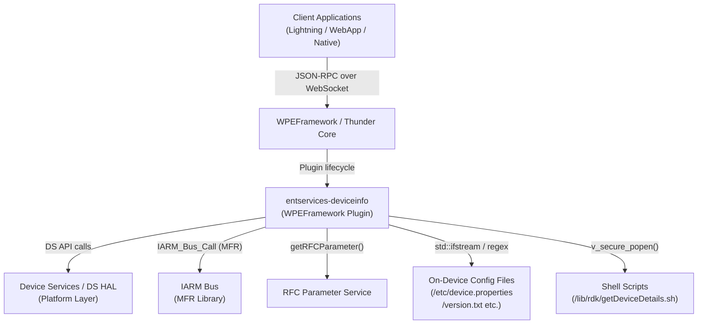
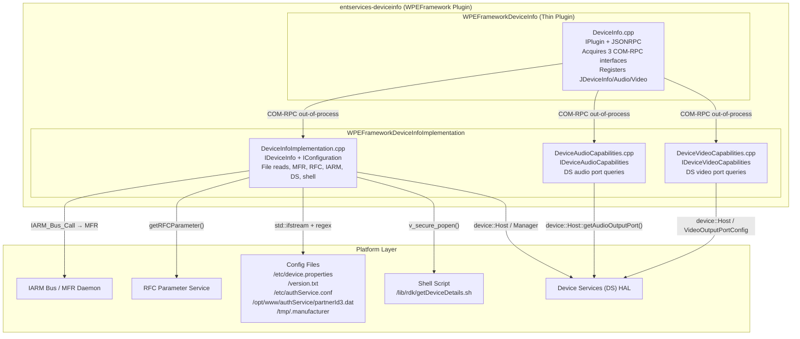
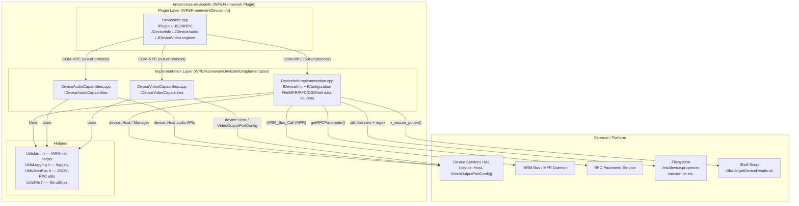
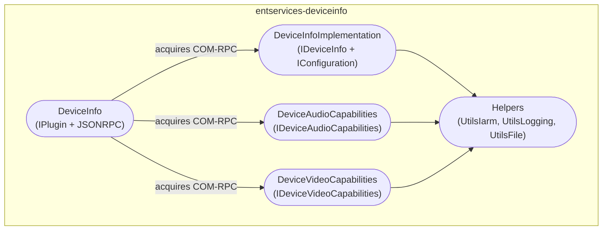
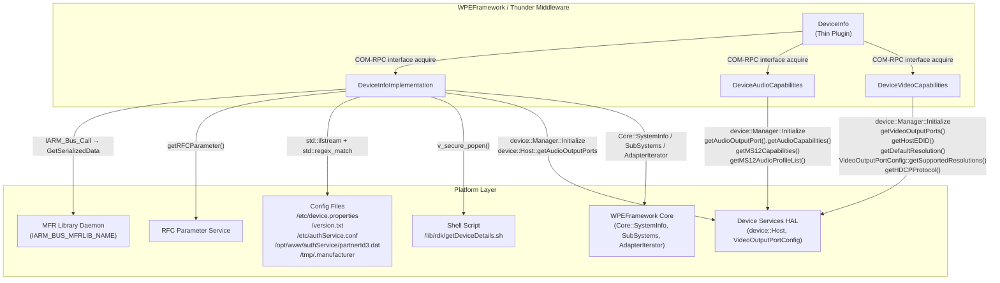

# entservices-deviceinfo

---

## Overview

`entservices-deviceinfo` is a WPEFramework (Thunder) plugin that exposes device identity and capability information over JSON-RPC and COM-RPC. It aggregates data from multiple platform sources — the MFR library, Device Settings (DS), RFC parameters, shell scripts, and on-device configuration files — and presents them through three standardised Exchange interfaces: `IDeviceInfo`, `IDeviceAudioCapabilities`, and `IDeviceVideoCapabilities`.

At the product level the plugin enables applications and management systems to discover what hardware they are running on. They can retrieve the device serial number, model, chipset, firmware version, supported audio and video output capabilities, MAC addresses, IP configuration, and HDCP version without accessing platform-specific APIs directly.

At the module level the plugin is structured as two shared libraries: a thin entry-point library (`WPEFrameworkDeviceInfo`) that handles only Thunder registration and JSON-RPC wiring, and an implementation library (`WPEFrameworkDeviceInfoImplementation`) that contains all business logic in three class implementations — `DeviceInfoImplementation`, `DeviceAudioCapabilities`, and `DeviceVideoCapabilities`.



**Key Features & Responsibilities:**

- **Device identity retrieval**: Provides serial number, SKU/model number, manufacturer name, chipset, firmware version, distributor/partner ID, and release version sourced from MFR library, RFC service, and configuration files.
- **Audio capability reporting**: Queries the DS library to enumerate supported audio capabilities (Atmos, Dolby Digital, Dolby Digital Plus, DAD, DAPv2, MS12) and MS12 sub-capabilities (Dolby Volume, Intelligent Equalizer, Dialogue Enhancer) per audio port.
- **Video capability reporting**: Queries the DS library to enumerate supported video displays, supported output resolutions, the default resolution, HDCP version support (1.4 or 2.2), and host EDID (returned as a base64-encoded string).
- **Network identity**: Enumerates active network interfaces and their IP and MAC addresses using WPEFramework's `Core::AdapterIterator`, and reads Ethernet, eSB, and Wi-Fi MAC addresses and eSB IP via a platform shell script.
- **System information**: Provides uptime, free/total RAM, swap usage, CPU load (1/5/15-minute averages), hostname, WPEFramework subsystem version and build hash, and current time.
- **Three-interface aggregation**: Exposes `IDeviceInfo`, `IDeviceAudioCapabilities`, and `IDeviceVideoCapabilities` Exchange interfaces under a single callsign (`DeviceInfo`) with auto-generated JSON-RPC dispatch through `JDeviceInfo`, `JDeviceAudioCapabilities`, and `JDeviceVideoCapabilities`.
- **No events**: The plugin does not publish any Thunder notifications or IARM events.

---

## Architecture

### High-Level Architecture

`entservices-deviceinfo` follows the standard two-library Thunder plugin pattern. The thin plugin library (`WPEFrameworkDeviceInfo`) implements only `IPlugin` and `JSONRPC`. Its `Initialize()` method spawns the implementation library (in its own host process when `mode` is set to `Off`) and acquires three remote COM-RPC interfaces — `IDeviceInfo`, `IDeviceAudioCapabilities`, and `IDeviceVideoCapabilities` — each with a 2000 ms connection timeout. It then registers JSON-RPC dispatch through `JDeviceInfo::Register`, `JDeviceAudioCapabilities::Register`, and `JDeviceVideoCapabilities::Register`. No business logic lives in the thin library.

The implementation library is split across three classes that each independently initialise the IARM Bus (`Utils::IARM::init()`) and the DS library (`device::Manager::Initialize()`). `DeviceInfoImplementation` handles all device identity and system information queries. `DeviceAudioCapabilities` handles all audio port queries. `DeviceVideoCapabilities` handles all video port queries.

Northbound, all client access is through Thunder's JSON-RPC WebSocket endpoint or directly over COM-RPC. The three Exchange interfaces are aggregated under the single `DeviceInfo` callsign using `INTERFACE_AGGREGATE` entries in the thin plugin's interface map, so external consumers only need to connect to one callsign.

Southbound, the implementation layer calls the DS library (`device::Host`, `device::VideoOutputPortConfig`) for audio and video capability data, uses `IARM_Bus_Call` to the MFR library daemon (`IARM_BUS_MFRLIB_NAME`) for serialized device identity data, calls `getRFCParameter()` as a fallback data source, and reads several on-device configuration files using `std::ifstream` with `std::regex_match`. MAC addresses and IP details are additionally retrieved via `v_secure_popen` executing `/lib/rdk/getDeviceDetails.sh`.

No persistent store is used. No data is written back to any storage by this plugin.



### Threading Model

- **Threading Architecture**: The implementation does not create any worker threads. All JSON-RPC method calls are dispatched synchronously on the WPEFramework COM-RPC thread that services the out-of-process host.
- **Main Thread**: Handles plugin lifecycle (`Initialize`, `Deinitialize`), COM-RPC interface acquisition, and JSON-RPC method dispatch.
- **Worker Threads**: None created by this plugin.
- **Synchronization**: No locks or mutexes are added inside the implementation classes. DS library calls are assumed to be thread-safe by the DS library itself. File reads are done per-call with local `std::ifstream` instances.
- **Async / Event Dispatch**: Not applicable. No events are fired.

---

## Design

The plugin is designed around the principle of aggregating multiple data sources behind a single stable Exchange interface set. Each of the three implementation classes independently owns its DS and IARM initialisation in its constructor, making them individually self-sufficient for out-of-process hosting. This avoids any single point of failure if one subsystem fails to initialise.

For device identity data, the implementation uses a cascading fallback strategy: a more authoritative source (MFR library) is tried first, and if it returns an empty result, the code falls back to a file read or RFC parameter. This pattern is applied per-field rather than globally, so different fields can have different primary and fallback sources without coupling them.

For MAC addresses and IP (`EthMac`, `EstbMac`, `WifiMac`, `EstbIp`), the implementation uses `v_secure_popen` to invoke `/lib/rdk/getDeviceDetails.sh`. The use of `v_secure_popen` rather than `popen` prevents shell injection from any externally influenced path or argument.

For the `SupportedVideoDisplays` method, the DS library may return multiple `VideoOutputPort` objects that share the same port name (because DS uses a separate entry per audio port associated with that video port). The implementation explicitly deduplicates by collecting unique names only.

The `HostEDID` method converts the raw byte vector returned by DS into a base64-encoded string using `Core::ToString`. It validates that the vector length does not exceed `uint16_t::max` before encoding.

The `Deactivated()` callback in `DeviceInfo.cpp` submits a deactivation job (`PluginHost::IShell::Job::Create`) if the out-of-process implementation host disconnects unexpectedly, preventing the plugin from remaining in a partially active state.

### Component Diagram



---

## Internal Modules

| Module / Class             | Description                                                                                                                                                                                                                                                                                                                                                                                           | Key Files                                                        |
| -------------------------- | ----------------------------------------------------------------------------------------------------------------------------------------------------------------------------------------------------------------------------------------------------------------------------------------------------------------------------------------------------------------------------------------------------- | ---------------------------------------------------------------- |
| `DeviceInfo`               | Thin Thunder plugin entry point. Implements `IPlugin` and `JSONRPC`. Spawns the implementation library out-of-process, acquires the three Exchange interfaces, and registers JSON-RPC dispatch for all three. Handles unexpected process disconnection via `Deactivated()`.                                                                                                                           | `DeviceInfo.cpp`, `DeviceInfo.h`                                 |
| `DeviceInfoImplementation` | Implements `IDeviceInfo` and `IConfiguration`. Handles all device identity queries (serial number, SKU, make, model, brand, chipset, firmware, release version, device type, distributor ID, SoC name), network identity (addresses, MAC addresses, eSB IP), and system information. Data comes from MFR library, RFC service, configuration files, shell scripts, DS library, and WPEFramework core. | `DeviceInfoImplementation.cpp`, `DeviceInfoImplementation.h`     |
| `DeviceAudioCapabilities`  | Implements `IDeviceAudioCapabilities`. Queries DS for audio capabilities (Atmos, DD, DDPLUS, DAD, DAPv2, MS12), MS12 sub-capabilities (Dolby Volume, Intelligent Equalizer, Dialogue Enhancer), and MS12 audio profile names per named audio port.                                                                                                                                                    | `DeviceAudioCapabilities.cpp`, `DeviceAudioCapabilities.h`       |
| `DeviceVideoCapabilities`  | Implements `IDeviceVideoCapabilities`. Queries DS for supported video display names, host EDID (as base64), default output resolution, supported resolutions list, and HDCP version per named video port. Deduplicates video display names.                                                                                                                                                           | `DeviceVideoCapabilities.cpp`, `DeviceVideoCapabilities.h`       |
| `Helpers`                  | Utility headers providing IARM initialisation (`Utils::IARM::init()`), logging macros, JSON-RPC utilities, and file utilities. Used by all three implementation classes.                                                                                                                                                                                                                              | `UtilsIarm.h`, `UtilsLogging.h`, `UtilsJsonRpc.h`, `UtilsFile.h` |



---

## Prerequisites & Dependencies

**Documentation Verification Checklist:**

- [x] **Thunder / WPEFramework APIs**: `IPlugin`, `JSONRPC`, `IConfiguration`, `Exchange::IDeviceInfo`, `Exchange::IDeviceAudioCapabilities`, `Exchange::IDeviceVideoCapabilities`, `JDeviceInfo`, `JDeviceAudioCapabilities`, `JDeviceVideoCapabilities` — all verified in source.
- [x] **IARM Bus**: `Utils::IARM::init()` confirmed in all three implementation constructors; `IARM_Bus_Call(IARM_BUS_MFRLIB_NAME, IARM_BUS_MFRLIB_API_GetSerializedData, ...)` confirmed in `DeviceInfoImplementation.cpp`.
- [x] **Device Services (DS) APIs**: `device::Manager::Initialize()`, `device::Host::getInstance()`, audio port and video port APIs — all confirmed in source.
- [x] **Persistent store**: No persistent store reads or writes found. Not implemented.
- [x] **Systemd services**: No `.service` file present in the repository. Not verified further.
- [x] **Configuration files**: `/etc/device.properties`, `/version.txt`, `/etc/authService.conf`, `/opt/www/authService/partnerId3.dat`, `/tmp/.manufacturer` — all confirmed opened by `std::ifstream` in `DeviceInfoImplementation.cpp`.
- [x] **RFC**: `getRFCParameter()` calls confirmed in `DeviceInfoImplementation.cpp`.
- [x] **Shell script**: `v_secure_popen("r", "/lib/rdk/getDeviceDetails.sh read eth_mac|estb_mac|wifi_mac|estb_ip")` confirmed.

### RDK-E Platform Requirements

- **WPEFramework Version**: Compatible with WPEFramework/Thunder as used in the RDK-E stack; `ThunderPortability.h` included in tests suggests adaptability across Thunder versions.
- **Build Dependencies**: `WPEFrameworkPlugins`, `WPEFrameworkDefinitions`, `CompileSettingsDebug`, RFC library (`rfcapi.h`), DS library (`FindDS.cmake` — provides `host.hpp`, `manager.hpp`, `exception.hpp`, `videoOutputPortConfig.hpp`), IARMBus library (`FindIARMBus.cmake`), `secure_wrapper` (for `v_secure_popen`/`v_secure_pclose`), MFR library (`mfrMgr.h`).
- **RDK-E Plugin Dependencies**: The plugin declares the `Platform` precondition in its configuration, meaning the Thunder Platform subsystem must be active before the plugin initialises.
- **Device Services / HAL**: DS library must be installed and the DS daemon running. `device::Manager::Initialize()` is called in all three implementation constructors.
- **IARM Bus**: IARM Bus daemon and the MFR library daemon (`IARM_BUS_MFRLIB_NAME`) must be running. `Utils::IARM::init()` is called in all three implementation constructors.
- **Systemd Services**: No explicit systemd ordering found in the repository.
- **Configuration Files**: The following files are read at query time (not at startup); missing files result in empty or default values rather than initialisation failure:
  - `/etc/device.properties` — MODEL_NUM, MFG_NAME, DEVICE_NAME, FRIENDLY_ID, DEVICE_TYPE, SOC, CHIPSET_NAME
  - `/version.txt` — firmware imagename, SDK_VERSION, MEDIARITE, YOCTO_VERSION
  - `/etc/authService.conf` — deviceType
  - `/opt/www/authService/partnerId3.dat` — partner/distributor ID
  - `/tmp/.manufacturer` — brand/manufacturer name
- **Runtime Scripts**: `/lib/rdk/getDeviceDetails.sh` must be present and executable on the device. It is invoked for `eth_mac`, `estb_mac`, `wifi_mac`, and `estb_ip` queries.
- **Startup Order**: Configurable via `PLUGIN_DEVICEINFO_STARTUPORDER` build variable.
- **C++ Standard**: C++11 for all production source files; C++14 for test files.

---

## Quick Start

### 1. Connect via ThunderJS

```js
import ThunderJS from "thunderjs";
const thunderJS = ThunderJS({ host: "127.0.0.1" });
```

### 2. Query device serial number

```js
thunderJS.DeviceInfo.serialnumber()
  .then((result) => console.log("Serial:", result.serialnumber))
  .catch((err) => console.error(err));
```

### 3. Query audio capabilities for a port

```js
thunderJS.DeviceInfo.audiocapabilities({ audioPort: "HDMI0" })
  .then((result) => console.log("Capabilities:", result.AudioCapabilities))
  .catch((err) => console.error(err));
```

### 4. Query HDCP version for a video display

```js
thunderJS.DeviceInfo.supportedhdcp({ videoDisplay: "HDMI0" })
  .then((result) => console.log("HDCP:", result.supportedHDCPVersion))
  .catch((err) => console.error(err));
```

---

## Configuration

### Configuration Priority

1. Built-in defaults (compile-time `PLUGIN_DEVICEINFO_MODE`, `PLUGIN_DEVICEINFO_STARTUPORDER`)
2. RFC parameters (fallback data source for some device identity fields)
3. On-device configuration files (primary or fallback for most identity fields)
4. MFR library (primary for serial number, manufacturer, model name)

### Key Configuration Files

| Configuration File                    | Purpose                                                                           | Override Mechanism                                                              |
| ------------------------------------- | --------------------------------------------------------------------------------- | ------------------------------------------------------------------------------- |
| `/etc/device.properties`              | Model number, manufacturer name, device name, device type, SoC name, chipset name | Replace file content on device                                                  |
| `/version.txt`                        | Firmware image name, SDK version, MEDIARITE, Yocto version                        | Updated by firmware upgrade                                                     |
| `/etc/authService.conf`               | Device type string (maps to `IpTv`, `IpStb`, `QamIpStb`)                          | Replace file content on device                                                  |
| `/opt/www/authService/partnerId3.dat` | Distributor/partner ID                                                            | Replace file content; fallback via RFC                                          |
| `/tmp/.manufacturer`                  | Brand/manufacturer name override                                                  | Write at runtime; cleared on reboot                                             |
| `DeviceInfo.conf` (Thunder config)    | Callsign, autostart, process mode, locator, startup order                         | Set `PLUGIN_DEVICEINFO_MODE` and `PLUGIN_DEVICEINFO_STARTUPORDER` at build time |

### Configuration Parameters

| Parameter                        | Type   | Default      | Description                                                                                     |
| -------------------------------- | ------ | ------------ | ----------------------------------------------------------------------------------------------- |
| `callsign`                       | string | `DeviceInfo` | Thunder callsign for the plugin                                                                 |
| `autostart`                      | bool   | `true`       | Plugin activates automatically on Thunder start                                                 |
| `precondition`                   | string | `Platform`   | Thunder subsystem that must be active before activation                                         |
| `PLUGIN_DEVICEINFO_MODE`         | string | `Off`        | Process hosting mode: `Off` = out-of-process, `Local` = in-process, `Container` = containerised |
| `PLUGIN_DEVICEINFO_STARTUPORDER` | string | (empty)      | Numeric startup order relative to other plugins                                                 |

### Configuration Persistence

Configuration changes (mode, startup order) are not persisted at runtime. They are set at build time and baked into the generated `DeviceInfo.conf`. Device identity data sourced from files and RFC is read on each method call; no caching is performed.

---

## API / Usage

### Interface Type

JSON-RPC over Thunder WebSocket (auto-generated from `JDeviceInfo`, `JDeviceAudioCapabilities`, `JDeviceVideoCapabilities`), COM-RPC Exchange interfaces (`IDeviceInfo`, `IDeviceAudioCapabilities`, `IDeviceVideoCapabilities`).

All methods are exposed under the single callsign `DeviceInfo`.

---

### IDeviceInfo Methods

#### `serialnumber`

Returns the device serial number. Primary source: MFR library (`mfrSERIALIZED_TYPE_SERIALNUMBER`). Fallback: RFC parameter `Device.DeviceInfo.SerialNumber`.

**Parameters**: None

**Response**

```json
{
  "serialnumber": "M11806TK0123"
}
```

**Example**

```js
thunderJS.DeviceInfo.serialnumber().then((r) => console.log(r.serialnumber));
```

---

#### `sku`

Returns the device SKU/model number. Primary: `/etc/device.properties` (MODEL_NUM regex). Fallback: MFR library (`mfrSERIALIZED_TYPE_MODELNAME`). Second fallback: RFC parameter `Device.DeviceInfo.ModelName`.

**Parameters**: None

**Response**

```json
{
  "sku": "AX013AN"
}
```

---

#### `make`

Returns the device manufacturer name. Primary: MFR library (`mfrSERIALIZED_TYPE_MANUFACTURER`). Fallback: `/etc/device.properties` (MFG_NAME regex).

**Parameters**: None

**Response**

```json
{
  "make": "Pace"
}
```

---

#### `model`

Returns the device model/friendly name. Source: `/etc/device.properties` DEVICE_NAME. For devices identified as PLATCO or LLAMA, the implementation additionally tries MFR library (`mfrSERIALIZED_TYPE_PROVISIONED_MODELNAME`) and then `FRIENDLY_ID` from the same file.

**Parameters**: None

**Response**

```json
{
  "model": "Arris Xi6"
}
```

---

#### `devicetype`

Returns the device type. Primary: `/etc/authService.conf` deviceType regex. Fallback: `/etc/device.properties` DEVICE_TYPE with the following mapping: `mediaclient` → `IpStb`, `hybrid` → `QamIpStb`, any other value → `IpTv`.

**Parameters**: None

**Response**

```json
{
  "devicetype": "IpStb"
}
```

---

#### `socname`

Returns the SoC name. Source: `/etc/device.properties` SOC regex. Returns empty string if not found.

**Parameters**: None

**Response**

```json
{
  "socname": "BROADCOM"
}
```

---

#### `distributorid`

Returns the distributor/partner ID. Primary: `/opt/www/authService/partnerId3.dat`. Fallback: RFC parameter `Device.DeviceInfo.X_RDKCENTRAL-COM_Syndication.PartnerId`.

**Parameters**: None

**Response**

```json
{
  "distributorid": "comcast"
}
```

---

#### `brand`

Returns the brand/manufacturer name. Primary: `/tmp/.manufacturer`. Fallback: MFR library (`mfrSERIALIZED_TYPE_MANUFACTURER`). Default if all sources empty: `"Unknown"`.

**Parameters**: None

**Response**

```json
{
  "brand": "Pace"
}
```

---

#### `releaseversion`

Returns the release version string. Source: `/version.txt` imagename field; the imagename is regex-parsed to extract a version of the form `N.Nsp`. Default if not found or not parseable: `"99.99.0.0"`.

**Parameters**: None

**Response**

```json
{
  "releaseversion": "1.14sp1"
}
```

---

#### `chipset`

Returns the chipset name. Source: `/etc/device.properties` CHIPSET_NAME regex. Returns empty string if not found.

**Parameters**: None

**Response**

```json
{
  "chipset": "BCM7271"
}
```

---

#### `firmwareversion`

Returns firmware version information. Image name source: `/version.txt` imagename. Optional fields `sdk`, `mediarite`, `yocto` are also parsed from `/version.txt` if present. PDRI version source: MFR library (`mfrSERIALIZED_TYPE_PDRIVERSION`). Optional fields are returned as empty strings if not present.

**Parameters**: None

**Response**

```json
{
  "imagename": "AX013AN_VBN_23Q4_sprint_20231101114822sdy",
  "sdk": "17.3",
  "mediarite": "8.3.53",
  "yocto": "4.0",
  "pdri": ""
}
```

---

#### `systeminfo`

Returns runtime system state. Sources: `Core::SystemInfo::Instance()` for uptime, memory, swap, CPU load, hostname; `_service->SubSystems()` for WPEFramework version and build hash; `clock_gettime(CLOCK_REALTIME)` for current time; `SerialNumber()` for the serial number field.

**Parameters**: None

**Response**

```json
{
  "version": "2.0.0.0#deadbeef",
  "uptime": 64428,
  "freeram": 321314816,
  "totalram": 1073741824,
  "totalswap": 0,
  "freeswap": 0,
  "devicename": "my-device",
  "cpuload": "15",
  "cpuloadavg": {
    "avg1min": 0.12,
    "avg5min": 0.1,
    "avg15min": 0.09
  },
  "serialnumber": "M11806TK0123",
  "time": "Mon, 01 Jan 2024 12:00:00 GMT"
}
```

---

#### `addresses`

Returns a list of all network interfaces with their name, MAC address, and current IP address. Source: `Core::AdapterIterator` (WPEFramework core, enumerates all system network interfaces).

**Parameters**: None

**Response**

```json
[
  {
    "name": "eth0",
    "mac": "AA:BB:CC:DD:EE:FF",
    "ip": "192.168.1.100"
  }
]
```

---

#### `ethmac`

Returns the Ethernet MAC address. Source: `v_secure_popen("r", "/lib/rdk/getDeviceDetails.sh read eth_mac")`.

**Parameters**: None

**Response**

```json
{
  "ethMac": "AA:BB:CC:DD:EE:FF"
}
```

---

#### `estbmac`

Returns the eSB (Electronic Set-top Box) MAC address. Source: `v_secure_popen("r", "/lib/rdk/getDeviceDetails.sh read estb_mac")`.

**Parameters**: None

**Response**

```json
{
  "estbMac": "AA:BB:CC:DD:EE:FF"
}
```

---

#### `wifimac`

Returns the Wi-Fi MAC address. Source: `v_secure_popen("r", "/lib/rdk/getDeviceDetails.sh read wifi_mac")`.

**Parameters**: None

**Response**

```json
{
  "wifiMac": "AA:BB:CC:DD:EE:FF"
}
```

---

#### `estbip`

Returns the eSB IP address. Source: `v_secure_popen("r", "/lib/rdk/getDeviceDetails.sh read estb_ip")`.

**Parameters**: None

**Response**

```json
{
  "estbIp": "192.168.1.100"
}
```

---

#### `supportedaudioports`

Returns a list of supported audio output port names. Source: `device::Host::getInstance().getAudioOutputPorts()` (DS library).

**Parameters**: None

**Response**

```json
{
  "supportedAudioPorts": ["HDMI0", "SPDIF0"],
  "success": true
}
```

---

### IDeviceAudioCapabilities Methods

#### `audiocapabilities`

Returns the audio capabilities supported by the specified audio output port. Source: `device::Host::getInstance().getAudioOutputPort(name).getAudioCapabilities()` (DS bitmask checked against `dsAUDIOSUPPORT_ATMOS`, `dsAUDIOSUPPORT_DD`, `dsAUDIOSUPPORT_DDPLUS`, `dsAUDIOSUPPORT_DAD`, `dsAUDIOSUPPORT_DAPv2`, `dsAUDIOSUPPORT_MS12`). If `audioPort` is empty, the default audio port is used.

**Parameters**

| Name        | Type   | Required | Description                                                                          |
| ----------- | ------ | -------- | ------------------------------------------------------------------------------------ |
| `audioPort` | string | No       | Name of the audio output port (e.g., `"HDMI0"`). Empty string uses the default port. |

**Response**

```json
{
  "AudioCapabilities": ["ATMOS", "DD", "DDPLUS", "MS12"],
  "success": true
}
```

**Possible AudioCapability values**: `AUDIOCAPABILITY_NONE`, `ATMOS`, `DD`, `DDPLUS`, `DAD`, `DAPV2`, `MS12`

---

#### `ms12capabilities`

Returns the MS12 sub-capabilities supported by the specified audio output port. Source: `device::Host::getInstance().getAudioOutputPort(name).getMS12Capabilities()` (DS bitmask checked against `dsMS12SUPPORT_DolbyVolume`, `dsMS12SUPPORT_InteligentEqualizer`, `dsMS12SUPPORT_DialogueEnhancer`). If `audioPort` is empty, the default audio port is used.

**Parameters**

| Name        | Type   | Required | Description                                                        |
| ----------- | ------ | -------- | ------------------------------------------------------------------ |
| `audioPort` | string | No       | Name of the audio output port. Empty string uses the default port. |

**Response**

```json
{
  "MS12Capabilities": ["DOLBYVOLUME", "INTELIGENTEQUALIZER"],
  "success": true
}
```

**Possible MS12Capability values**: `MS12CAPABILITY_NONE`, `DOLBYVOLUME`, `INTELIGENTEQUALIZER`, `DIALOGUEENHANCER`

---

#### `supportedms12audioprofiles`

Returns the list of MS12 audio profile names supported by the specified audio output port. Source: `device::Host::getInstance().getAudioOutputPort(name).getMS12AudioProfileList()`. If `audioPort` is empty, the default audio port is used.

**Parameters**

| Name        | Type   | Required | Description                                                        |
| ----------- | ------ | -------- | ------------------------------------------------------------------ |
| `audioPort` | string | No       | Name of the audio output port. Empty string uses the default port. |

**Response**

```json
{
  "supportedMS12AudioProfiles": ["Movie", "Music", "Voice"],
  "success": true
}
```

---

### IDeviceVideoCapabilities Methods

#### `supportedvideodisplays`

Returns a deduplicated list of supported video output display names. Source: `device::Host::getInstance().getVideoOutputPorts()` (DS library). Duplicate names are filtered out to handle the DS N:1 video-to-audio port mapping.

**Parameters**: None

**Response**

```json
{
  "supportedVideoDisplays": ["HDMI0", "COMPOSITE"],
  "success": true
}
```

---

#### `hostedid`

Returns the host EDID as a base64-encoded string. Source: `device::Host::getInstance().getHostEDID()`. The raw byte vector from DS is base64-encoded using `Core::ToString`. Default value if DS call fails: none (method returns `Core::ERROR_GENERAL`).

**Parameters**: None

**Response**

```json
{
  "EDID": "AP///////wAsAAAAAAA..."
}
```

---

#### `defaultresolution`

Returns the default output resolution for the specified video display. Source: `device::Host::getInstance().getVideoOutputPort(name).getDefaultResolution().getName()`. If `videoDisplay` is empty, the default video port is used.

**Parameters**

| Name           | Type   | Required | Description                                                                          |
| -------------- | ------ | -------- | ------------------------------------------------------------------------------------ |
| `videoDisplay` | string | No       | Name of the video output port (e.g., `"HDMI0"`). Empty string uses the default port. |

**Response**

```json
{
  "defaultResolution": "1080p"
}
```

---

#### `supportedresolutions`

Returns the list of resolutions supported by the specified video display's port type. Source: `device::VideoOutputPortConfig::getInstance().getPortType(vPort.getType().getId()).getSupportedResolutions()`. If `videoDisplay` is empty, the default video port is used.

**Parameters**

| Name           | Type   | Required | Description                                                        |
| -------------- | ------ | -------- | ------------------------------------------------------------------ |
| `videoDisplay` | string | No       | Name of the video output port. Empty string uses the default port. |

**Response**

```json
{
  "supportedResolutions": ["480i", "480p", "576p", "720p", "1080i", "1080p"],
  "success": true
}
```

---

#### `supportedhdcp`

Returns the HDCP version supported by the specified video output display. Source: `device::VideoOutputPortConfig::getInstance().getPort(name).getHDCPProtocol()`. Maps `dsHDCP_VERSION_2X` → `HDCP_22`, `dsHDCP_VERSION_1X` → `HDCP_14`. If `videoDisplay` is empty, the default video port is used.

**Parameters**

| Name           | Type   | Required | Description                                                        |
| -------------- | ------ | -------- | ------------------------------------------------------------------ |
| `videoDisplay` | string | No       | Name of the video output port. Empty string uses the default port. |

**Response**

```json
{
  "supportedHDCPVersion": "HDCP_22"
}
```

**Possible values**: `HDCP_14`, `HDCP_22`

---

### Events / Notifications

No events are defined or published by this plugin. The `DeviceInfo` thin plugin class does not contain a `Notification` inner class, and no `Register` calls for notifications are present in the source.

---

## Component Interactions



### Interaction Matrix

| Target Component / Layer              | Interaction Purpose                                                                                                                                  | Key APIs / Topics                                                                                                                                                                                                              |
| ------------------------------------- | ---------------------------------------------------------------------------------------------------------------------------------------------------- | ------------------------------------------------------------------------------------------------------------------------------------------------------------------------------------------------------------------------------ | -------- | -------- | ---------- |
| **Device Services (DS) HAL**          |                                                                                                                                                      |                                                                                                                                                                                                                                |
| `device::Manager`                     | DS library initialisation (called in all three implementation constructors)                                                                          | `device::Manager::Initialize()`                                                                                                                                                                                                |
| `device::Host`                        | Audio port enumeration, audio capabilities, MS12 capabilities, MS12 audio profiles; video port enumeration, host EDID, default/supported resolutions | `getAudioOutputPorts()`, `getAudioOutputPort()`, `getDefaultAudioPortName()`, `getVideoOutputPorts()`, `getVideoOutputPort()`, `getHostEDID()`, `getDefaultVideoPortName()`                                                    |
| `device::VideoOutputPortConfig`       | Supported video resolutions, HDCP protocol version per port                                                                                          | `getPortType().getSupportedResolutions()`, `getPort().getHDCPProtocol()`                                                                                                                                                       |
| **IARM Bus / MFR Daemon**             |                                                                                                                                                      |                                                                                                                                                                                                                                |
| `IARM_BUS_MFRLIB_NAME`                | Retrieve serialized device identity data (serial number, model name, manufacturer, provisioned model name, PDRI version)                             | `IARM_Bus_Call(IARM_BUS_MFRLIB_NAME, IARM_BUS_MFRLIB_API_GetSerializedData, ...)`                                                                                                                                              |
| **RFC Parameter Service**             |                                                                                                                                                      |                                                                                                                                                                                                                                |
| RFC                                   | Fallback data source for serial number, model name, and distributor ID                                                                               | `getRFCParameter(nullptr, "Device.DeviceInfo.SerialNumber", ...)`, `getRFCParameter(nullptr, "Device.DeviceInfo.ModelName", ...)`, `getRFCParameter(nullptr, "Device.DeviceInfo.X_RDKCENTRAL-COM_Syndication.PartnerId", ...)` |
| **Filesystem**                        |                                                                                                                                                      |                                                                                                                                                                                                                                |
| `/etc/device.properties`              | Model number, manufacturer name, device name, friendly name, device type, SoC, chipset                                                               | `std::ifstream` + `std::regex_match`                                                                                                                                                                                           |
| `/version.txt`                        | Firmware image name, SDK version, MEDIARITE, Yocto version                                                                                           | `std::ifstream` + `std::regex_match`                                                                                                                                                                                           |
| `/etc/authService.conf`               | Device type override                                                                                                                                 | `std::ifstream` + `std::regex_match`                                                                                                                                                                                           |
| `/opt/www/authService/partnerId3.dat` | Distributor/partner ID                                                                                                                               | `std::ifstream`                                                                                                                                                                                                                |
| `/tmp/.manufacturer`                  | Brand/manufacturer name override                                                                                                                     | `std::ifstream`                                                                                                                                                                                                                |
| **Shell Script**                      |                                                                                                                                                      |                                                                                                                                                                                                                                |
| `/lib/rdk/getDeviceDetails.sh`        | Read Ethernet MAC, eSB MAC, Wi-Fi MAC, eSB IP                                                                                                        | `v_secure_popen("r", "/lib/rdk/getDeviceDetails.sh read eth_mac                                                                                                                                                                | estb_mac | wifi_mac | estb_ip")` |
| **WPEFramework Core**                 |                                                                                                                                                      |                                                                                                                                                                                                                                |
| `Core::SystemInfo`                    | Runtime system metrics (uptime, RAM, swap, CPU load, hostname)                                                                                       | `Core::SystemInfo::Instance().GetUpTime()`, `GetFreeRam()`, `GetTotalRam()`, `GetCpuLoad()`, `GetCpuLoadAvg()`, `GetHostName()`                                                                                                |
| `ISubSystem`                          | WPEFramework version string and build hash                                                                                                           | `_service->SubSystems()`, `subSystem->Version()`, `subSystem->BuildTreeHash()`                                                                                                                                                 |
| `Core::AdapterIterator`               | Network interface enumeration (name, MAC, IP)                                                                                                        | `Core::AdapterIterator::Next()`, `Name()`, `MACAddress(':')`, `IPV4Addresses()`                                                                                                                                                |

---

## Testing

### Test Coverage

The repository includes both L1 (unit) and L2 (integration) tests.

**L1 Tests** (Google Test framework, C++14):

Located in `Tests/L1Tests/tests/`. Six test files cover the full implementation:

| Test File                          | Coverage Area                                                                                                                                                  |
| ---------------------------------- | -------------------------------------------------------------------------------------------------------------------------------------------------------------- |
| `test_DeviceInfo.cpp`              | Full plugin lifecycle, `DeviceInfoImplementation` all methods, `DeviceAudioCapabilities` all methods, `DeviceVideoCapabilities` all methods via mock injection |
| `test_DeviceInfoJsonRpc.cpp`       | JSON-RPC layer — method name dispatch, parameter parsing, response formatting                                                                                  |
| `test_DeviceInfoWeb.cpp`           | Web interface path (`/Service/DeviceInfo`) request handling                                                                                                    |
| `test_DeviceAudioCapabilities.cpp` | `DeviceAudioCapabilities` methods in isolation                                                                                                                 |
| `test_DeviceVideoCapabilities.cpp` | `DeviceVideoCapabilities` methods in isolation                                                                                                                 |
| `test_UtilsFile.cpp`               | `UtilsFile.h` utility functions                                                                                                                                |

**Mock infrastructure** (all confirmed used in `test_DeviceInfo.cpp`):

| Mock                            | Mocked Component                                                               |
| ------------------------------- | ------------------------------------------------------------------------------ |
| `IarmBusMock`                   | IARM Bus calls (`IARM_Bus_Call`)                                               |
| `ManagerMock`                   | `device::Manager::Initialize()`                                                |
| `HostMock`                      | `device::Host::getInstance()` and all port accessors                           |
| `AudioOutputPortMock`           | `getAudioCapabilities()`, `getMS12Capabilities()`, `getMS12AudioProfileList()` |
| `VideoOutputPortMock`           | `getDefaultResolution()`, `getName()`, `getType()`                             |
| `VideoOutputPortConfigImplMock` | `getPort()`, `getPortType()`                                                   |
| `VideoOutputPortTypeMock`       | `getId()`, `getSupportedResolutions()`                                         |
| `VideoResolutionMock`           | `getName()`                                                                    |
| `RfcApiMock`                    | `getRFCParameter()`                                                            |
| `COMLinkMock`                   | COM-RPC link                                                                   |
| `DeviceInfoMock`                | `Exchange::IDeviceInfo` interface                                              |
| `WrapsMock`                     | `v_secure_popen()`, `v_secure_pclose()`                                        |
| `ISubSystemMock`                | `ISubSystem::Version()`, `BuildTreeHash()`                                     |

Test files read and write the config files (`/etc/device.properties`, `/version.txt`, `/etc/authService.conf`, `/opt/www/authService/partnerId3.dat`, `/tmp/.manufacturer`) directly by creating them as real files on disk, and truncate them on teardown.

**L2 Tests**:

Located in `Tests/L2Tests/tests/DeviceInfo_L2Test.cpp`. Optionally links `TestMocklib` when `RDK_SERVICE_L2_TEST` is set.

### Running Tests

```bash
# L1 tests
cmake -DRDK_SERVICE_L1_TEST=ON .
make
./l1tests

# L2 tests
cmake -DRDK_SERVICE_L2_TEST=ON .
make
./l2tests
```
