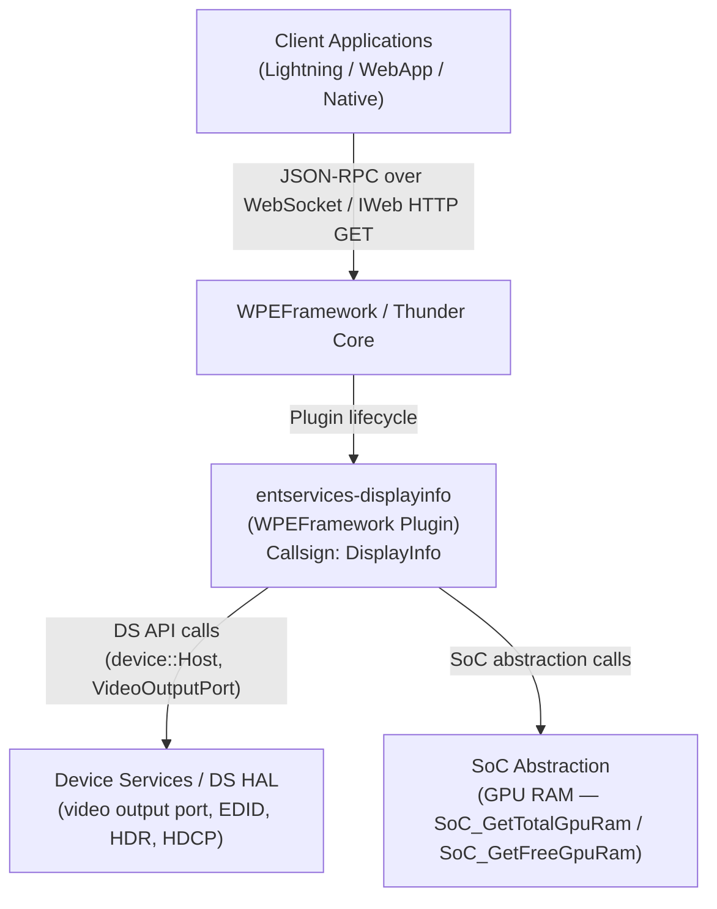
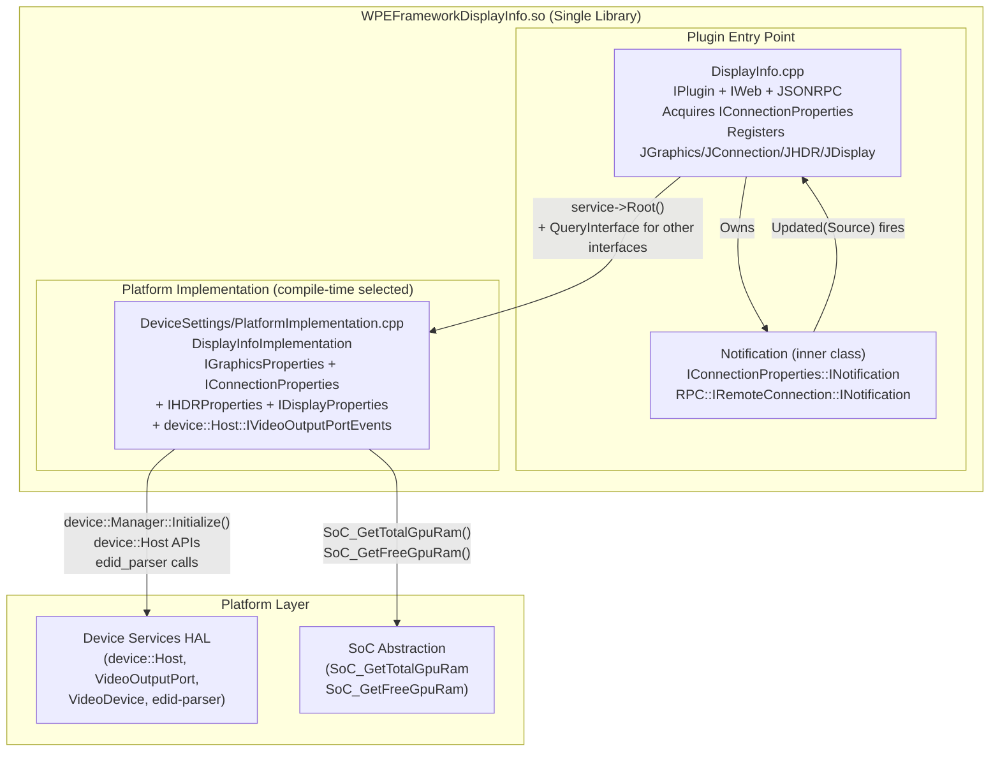
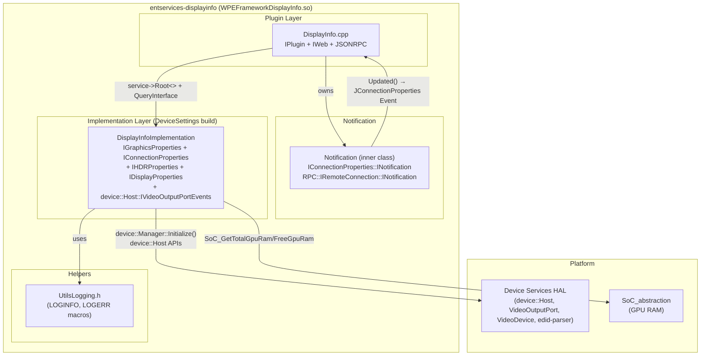
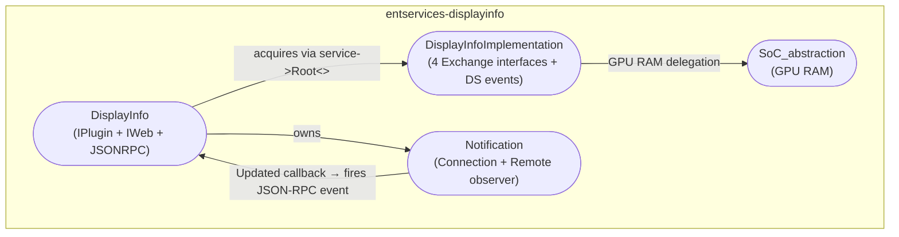
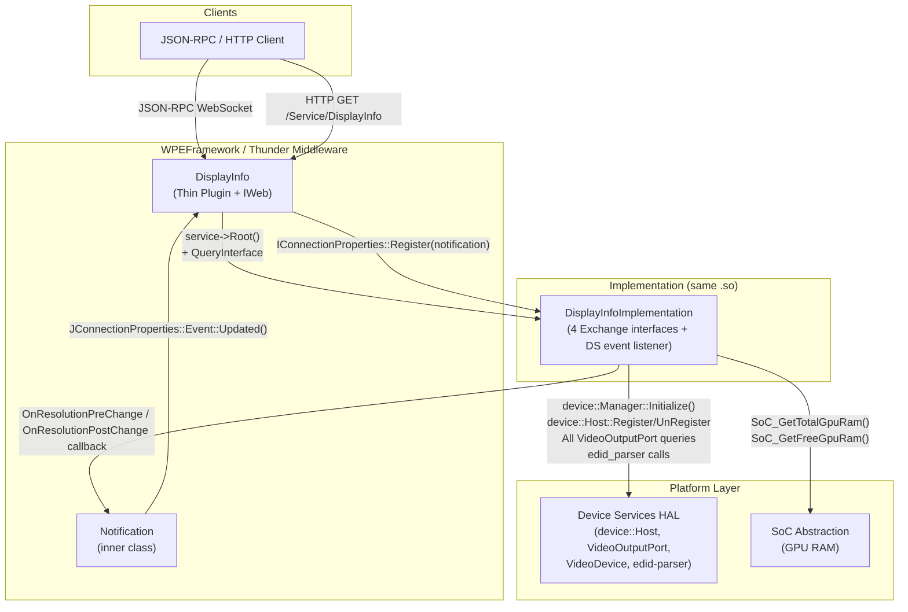
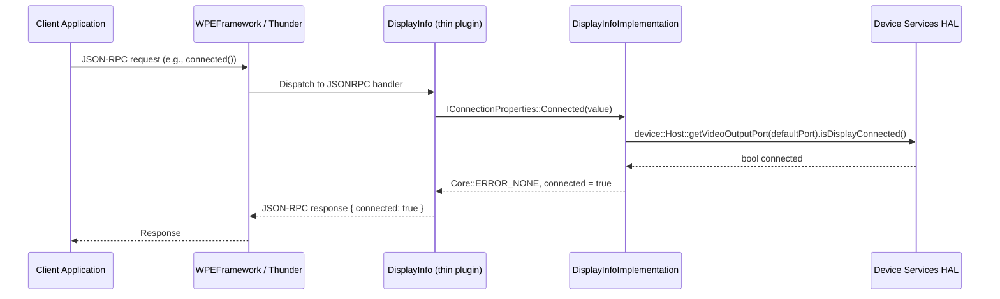
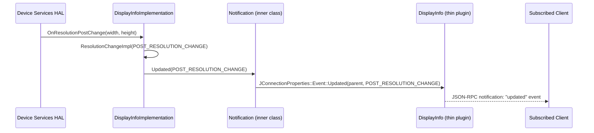
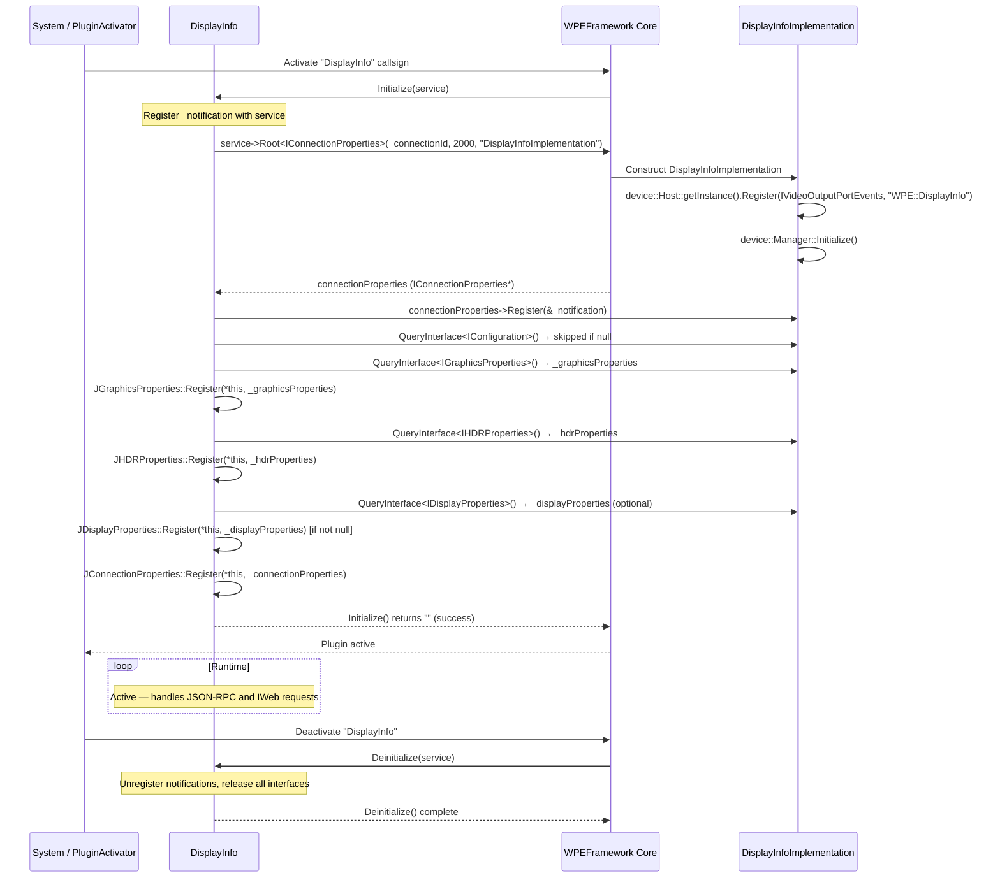
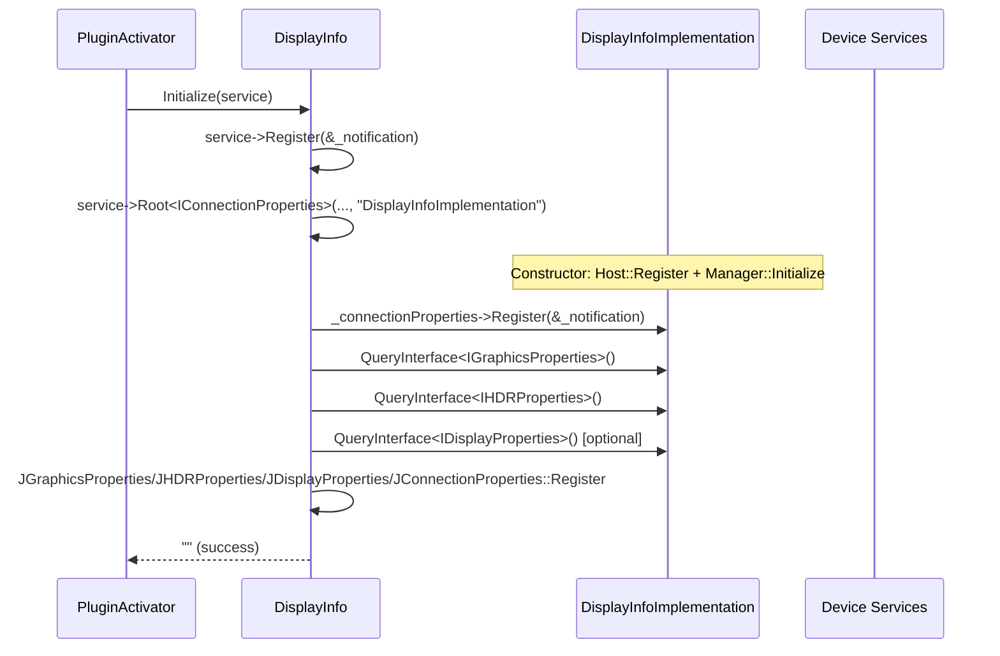
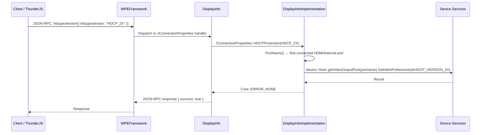

# Entservices-Displayinfo

---

## Overview

`entservices-displayinfo` is a WPEFramework (Thunder) plugin that exposes display, connection, HDR, and graphics properties of the device over JSON-RPC and COM-RPC. It abstracts the platform-specific video output stack behind four Exchange interfaces — `IGraphicsProperties`, `IConnectionProperties`, `IHDRProperties`, and `IDisplayProperties` — and fires a single event when display connection properties change.

At the product level, the plugin provides clients with display state information: whether a display is connected, its resolution (width, height, vertical frequency), physical dimensions in centimetres, EDID bytes, HDCP protection level, colour space, colour depth, quantization range, colorimetry, EOTF, frame rate, and HDR capabilities of both the STB and the connected TV. It also reports total and free GPU RAM. The HDCP protection level can be read and set.

At the module level, the plugin is a single shared library (`WPEFrameworkDisplayInfo.so`) that contains both the thin plugin entry point (`DisplayInfo`) and the platform implementation class (`DisplayInfoImplementation`). The platform implementation source file is selected at compile time from one of four platform backends (DeviceSettings, NEXUS, BCM_HOST, or Linux DRM). There is no separate implementation shared library.



**Key Features & Responsibilities:**

- **Display connection status**: Reports whether a display is connected to the default video output port via `device::VideoOutputPort::isDisplayConnected()`.
- **EDID-based resolution**: Reads raw EDID bytes from the connected display via DS, parses them with `edid_parser`, and returns pixel width, pixel height, and vertical refresh frequency.
- **Physical display dimensions**: Returns the physical width and height of the connected display in centimetres by reading raw EDID bytes at defined offsets.
- **EDID byte access**: Returns the raw EDID byte array directly from DS for the connected display.
- **HDCP protection level**: Gets and sets the HDCP protocol preference (`HDCP_1X`, `HDCP_2X`, `HDCP_AUTO`) on the connected video output port using DS.
- **HDR capabilities**: Queries HDR standards supported by the connected TV (`TVCapabilities`) and by the STB (`STBCapabilities`), and reports the current HDR output mode (`HDRSetting`). Supported standards include HDR10, HDR10+, HLG, Dolby Vision, Technicolor Prime, and SDR.
- **Display properties (colour, frame rate, EOTF, colorimetry)**: Reports colour space, colour depth, quantization range, frame rate, electro-optical transfer function (EOTF), and colorimetry types for the active video output.
- **GPU RAM**: Reports total and free GPU RAM via SoC-specific abstraction functions.
- **Audio passthrough detection**: Reports whether the audio output on the default video port is in passthrough mode.
- **Connection change event**: Fires an `updated` event with a `Source` indicating `PRE_RESOLUTION_CHANGE` or `POST_RESOLUTION_CHANGE` when the DS library calls back via `device::Host::IVideoOutputPortEvents`.
- **IWeb HTTP interface**: Responds to HTTP GET on `/Service/DisplayInfo` with a JSON summary of GPU RAM, audio passthrough, connection state, width, height, HDCP protection, and HDR type (legacy interface).

---

## Architecture

### High-Level Architecture

`entservices-displayinfo` uses a single-library architecture. All production code — the thin plugin (`DisplayInfo`) and the platform implementation (`DisplayInfoImplementation`) — is compiled into a single shared library `WPEFrameworkDisplayInfo.so`. This differs from the common RDK-E two-library pattern (e.g., `entservices-deviceinfo`). There is no out-of-process hosting for the implementation; when `service->Root<Exchange::IConnectionProperties>()` is called in `Initialize()`, Thunder instantiates `DisplayInfoImplementation` from within the same library based on the `mode` setting in the root configuration object.

The platform implementation source file is selected at compile time by the CMakeLists.txt based on the available platform libraries:

| Build Condition                   | Implementation File                                                                |
| --------------------------------- | ---------------------------------------------------------------------------------- |
| `USE_DEVICESETTINGS` defined      | `DeviceSettings/PlatformImplementation.cpp` (DS + `edid-parser` + SoC abstraction) |
| NEXUS and NXCLIENT packages found | `Nexus/PlatformImplementation.cpp` (fetched from external repo)                    |
| BCM_HOST package found            | `RPI/PlatformImplementation.cpp`                                                   |
| LIBDRM package found              | `Linux/PlatformImplementation.cpp` (DRM + udev + file reads)                       |
| None of the above                 | CMake fatal error                                                                  |

Documentation below covers only the `DeviceSettings/PlatformImplementation.cpp` variant, as it is the variant confirmed present in this repository.

Northbound, clients access the plugin via Thunder JSON-RPC WebSocket or HTTP GET through the `IWeb` interface. All four Exchange interfaces (`IGraphicsProperties`, `IConnectionProperties`, `IHDRProperties`, `IDisplayProperties`) are aggregated under the single `DisplayInfo` callsign via `INTERFACE_AGGREGATE` entries in `DisplayInfo`'s interface map.

Southbound, `DisplayInfoImplementation` calls the DS library (`device::Host`, `device::VideoOutputPort`, `device::VideoDevice`) for all video output and EDID data. GPU RAM is delegated to SoC-specific functions (`SoC_GetTotalGpuRam`, `SoC_GetFreeGpuRam`) declared in `SoC_abstraction.h`. No IARM Bus calls, RFC parameter calls, or persistent store access are present in `DeviceSettings/PlatformImplementation.cpp`.



### Threading Model

- **Threading Architecture**: Event-driven with synchronous JSON-RPC dispatch.
- **Main Thread**: Handles `Initialize()`, `Deinitialize()`, all JSON-RPC property reads and writes.
- **DS Callback Thread**: DS library invokes `OnResolutionPreChange()` and `OnResolutionPostChange()` on a DS-owned thread. These callbacks acquire `_adminLock` and iterate the `_observers` list to call `Updated(Source)` on each registered `IConnectionProperties::INotification`.
- **Worker Threads**: No threads are created by this plugin. The `Deactivated()` path submits a job to `Core::IWorkerPool` but does not create a thread.
- **Synchronization**: `_adminLock` (`Core::CriticalSection`) protects the `_observers` list in `DisplayInfoImplementation` — held during `Register()`, `Unregister()`, and `ResolutionChangeImpl()`.
- **Async / Event Dispatch**: The `Notification::Updated()` method (called from the DS callback thread) calls `Exchange::JConnectionProperties::Event::Updated(_parent, event)`, which uses Thunder's internal JSONRPC event dispatch mechanism.

---

## Design

The plugin is designed around the CMake-time selection of a platform implementation. The Exchange interface set (`IGraphicsProperties`, `IConnectionProperties`, `IHDRProperties`, `IDisplayProperties`) is defined once in the Thunder interface headers, and the concrete implementation is swapped per platform at build time. `DisplayInfo.cpp` always acquires the implementation by calling `service->Root<Exchange::IConnectionProperties>()` with the name `"DisplayInfoImplementation"`, which Thunder resolves to whichever `SERVICE_REGISTRATION(DisplayInfoImplementation, ...)` was compiled in.

The `IConnectionProperties` interface is the primary interface acquired from the implementation. The other three — `IGraphicsProperties`, `IHDRProperties`, `IDisplayProperties` — are obtained via `QueryInterface` on the same object. If `IHDRProperties` or `IGraphicsProperties` cannot be acquired, `Initialize()` returns an error and `Deinitialize()` is called. `IDisplayProperties` is explicitly marked optional in the code; if it is null, the relevant JSON-RPC endpoints return `ERROR_UNAVAILABLE` and the plugin continues operating with the remaining interfaces.

EDID data is fetched from DS on every call to `Width()`, `Height()`, `VerticalFreq()`, `Colorimetry()`, and `EDID()`. There is no in-memory caching of EDID data; each call reads through to the DS library. For `WidthInCentimeters()`, the raw byte at EDID offset 21 is read from the EDID byte vector without using the `edid_parser`. For `HeightInCentimeters()`, the raw byte at EDID offset 22 is used.

`HDRSetting()` returns only `HDR_10` (if `IsOutputHDR()` returns true) or `HDR_OFF`. It does not distinguish between HDR10, HLG, Dolby Vision, or other HDR standards — only binary HDR on/off. `TVCapabilities()` and `STBCapabilities()` return a full bitmask-based list of supported HDR standards.

The DS event registration is done as `device::Host::getInstance().Register(baseInterface<device::Host::IVideoOutputPortEvents>(), "WPE::DisplayInfo")` in the `DisplayInfoImplementation` constructor. The unregistration is in the destructor.

`DisplayInfoJsonRpc.cpp` is present in the repository but is **not listed in the CMakeLists.txt** and is therefore not compiled into the production library. It defines a legacy `displayinfo` property endpoint and an `event_updated()` function. The current JSON-RPC interface is provided entirely by the `J*::Register()` calls in `DisplayInfo.cpp`.

No persistent store is used. No RFC parameters are read. No IARM Bus APIs are called directly from this plugin.

### Component Diagram



---

## Internal Modules

| Module / Class              | Description                                                                                                                                                                                                                                                                                                                                                                                                                   | Key Files                                      |
| --------------------------- | ----------------------------------------------------------------------------------------------------------------------------------------------------------------------------------------------------------------------------------------------------------------------------------------------------------------------------------------------------------------------------------------------------------------------------- | ---------------------------------------------- |
| `DisplayInfo`               | Thin plugin entry point. Implements `IPlugin`, `IWeb`, `JSONRPC`. Acquires `IConnectionProperties` from `DisplayInfoImplementation` via `service->Root<>()`, then gets the other three interfaces via `QueryInterface`. Registers JSON-RPC dispatch for all four interfaces. Handles HTTP GET at `/Service/DisplayInfo`. Handles remote connection loss via `Deactivated()`.                                                  | `DisplayInfo.cpp`, `DisplayInfo.h`             |
| `DisplayInfo::Notification` | Inner class registered with both `IConnectionProperties` and `RPC::IRemoteConnection`. Forwards DS resolution change callbacks to `JConnectionProperties::Event::Updated()`. Forwards remote connection deactivation to the parent plugin's cleanup path.                                                                                                                                                                     | `DisplayInfo.h`                                |
| `DisplayInfoImplementation` | Platform implementation (DeviceSettings variant). Implements all four Exchange interfaces and `device::Host::IVideoOutputPortEvents`. Calls DS library for all display data. Manages an observer list (`_observers`) behind `_adminLock` for connection change notifications. Uses `edid_parser` to decode EDID bytes for width, height, vertical frequency, and colorimetry. Delegates GPU RAM to SoC abstraction functions. | `DeviceSettings/PlatformImplementation.cpp`    |
| `SoC_abstraction`           | Declares `SoC_GetTotalGpuRam()` and `SoC_GetFreeGpuRam()`. The implementation is provided per platform (e.g., `DeviceSettings/RPI/SoC_abstraction.cpp`).                                                                                                                                                                                                                                                                      | `DeviceSettings/SoC_abstraction.h`             |
| `DisplayInfoJsonRpc.cpp`    | Legacy file defining a `displayinfo` property handler and `event_updated()`. **Not compiled** by the current `CMakeLists.txt`. The current JSON-RPC interface is provided by auto-generated `J*::Register()` calls.                                                                                                                                                                                                           | `DisplayInfoJsonRpc.cpp` (excluded from build) |



---

## Prerequisites & Dependencies

**Documentation Verification Checklist:**

- [x] **Thunder / WPEFramework APIs**: `IPlugin`, `IWeb`, `JSONRPC`, `IConfiguration` (optional, skipped if null), `Exchange::IGraphicsProperties`, `Exchange::IConnectionProperties`, `Exchange::IHDRProperties`, `Exchange::IDisplayProperties`, `JGraphicsProperties`, `JConnectionProperties`, `JHDRProperties`, `JDisplayProperties` — all verified in source.
- [x] **IARM Bus**: No `IARM_Bus_RegisterEventHandler` or `IARM_Bus_Call` calls found in `DeviceSettings/PlatformImplementation.cpp`. `UtilsIarm.h` is not included. IARM is not used directly; DS events are received via `device::Host::IVideoOutputPortEvents`.
- [x] **Device Services (DS) APIs**: `device::Manager::Initialize()`, `device::Host::getInstance().Register()` / `UnRegister()`, `getDefaultVideoPortName()`, `getVideoOutputPort()`, `getVideoOutputPorts()`, `getVideoDevices()`, `isDisplayConnected()`, `getAudioOutputPort()`, `getStereoMode()`, `GetHdmiPreference()`, `SetHdmiPreference()`, `getTVHDRCapabilities()`, `getHDRCapabilities()`, `IsOutputHDR()`, `getColorSpace()`, `getColorDepth()`, `getQuantizationRange()`, `getVideoEOTF()`, `getResolution()`, `getDisplay().getEDIDBytes()` — all confirmed in source.
- [x] **Persistent store**: No persistent store reads or writes found. Not implemented.
- [x] **Systemd services**: No systemd service file found in the repository.
- [x] **Configuration files**: No configuration files opened via `std::ifstream` in `DeviceSettings/PlatformImplementation.cpp`. Configuration files are used in the Linux DRM backend (`Linux/PlatformImplementation.cpp`) via optional plugin config parameters.
- [x] **RFC**: No `getRFCParameter()` calls found. Not used.

### RDK-E Platform Requirements

- **WPEFramework Version**: Thunder branch R4.4.1 (confirmed in `build_dependencies.sh`). Thunder Tools R4.4.3.
- **Build Dependencies**: `WPEFrameworkPlugins`, `WPEFrameworkDefinitions`, `CompileSettingsDebug`, `edid-parser` (from DS library), `entservices-apis` (Exchange interface headers). For DeviceSettings build: DS library (`FindDS.cmake`), IARMBus library (`FindIARMBus.cmake`). For Linux DRM build: `libdrm`, `libdrm-dev`. Optionally: BCM_HOST, NEXUS, NXCLIENT.
- **RDK-E Plugin Dependencies**: No preconditions are declared in the plugin metadata (`preconditions = {}`). The `DisplayInfo.conf.in` does not set a precondition field, so no Thunder subsystem must be active first.
- **Device Services / HAL**: DS library and the DS manager daemon must be running. `device::Manager::Initialize()` is called in the `DisplayInfoImplementation` constructor.
- **IARM Bus**: Not used directly. DS library internally uses IARM, but the plugin does not call IARM APIs.
- **Systemd Services**: No explicit `After=` or `Requires=` entries found in the repository.
- **Configuration Files**: No configuration files are read at runtime in the DeviceSettings backend. Optional configuration parameters (e.g., `drmDeviceName`, `gpuMemoryFile`, `hdcpLevelFilepath`) are used only by the Linux DRM backend.
- **Startup Order**: Configurable via `PLUGIN_DISPLAYINFO_STARTUPORDER` build variable.
- **C++ Standard**: C++11 for all production source files. Test files use additional standard library features.

---

## Quick Start

### 1. Connect via ThunderJS

```js
import ThunderJS from "thunderjs";
const thunderJS = ThunderJS({ host: "127.0.0.1" });
```

### 2. Check if display is connected

```js
thunderJS.DisplayInfo.connected()
  .then((result) => console.log("Connected:", result.connected))
  .catch((err) => console.error(err));
```

### 3. Get HDR capabilities of the connected TV

```js
thunderJS.DisplayInfo.tvcapabilities()
  .then((result) => console.log("TV HDR:", result.type))
  .catch((err) => console.error(err));
```

### 4. Set HDCP protection level

```js
thunderJS.DisplayInfo.hdcpprotection({ hdcpprotection: "HDCP_2X" })
  .then((result) => console.log(result))
  .catch((err) => console.error(err));
```

### 5. Subscribe to connection change events

```js
thunderJS.on("DisplayInfo", "updated", (event) => {
  console.log("Display connection updated:", event);
});
```

---

## Configuration

### Configuration Priority

1. Built-in defaults (compile-time `PLUGIN_DISPLAYINFO_AUTOSTART`, `PLUGIN_DISPLAYINFO_MODE`, `PLUGIN_DISPLAYINFO_STARTUPORDER`)
2. Optional platform-specific parameters set at build time (GPU memory patterns, HDCP/HDR level file paths, DRM device name)

### Key Configuration Files

The `DisplayInfo.conf` (generated from `DisplayInfo.conf.in`) is the only configuration file used. No runtime configuration files are read by the DeviceSettings backend.

| Configuration File                  | Purpose                                                                        | Override Mechanism                |
| ----------------------------------- | ------------------------------------------------------------------------------ | --------------------------------- |
| `DisplayInfo.conf` (Thunder config) | Callsign, autostart, startup order, process mode, optional platform parameters | Set build variables at CMake time |

### Configuration Parameters

| Parameter                 | Type   | Default       | Description                                                                                                               |
| ------------------------- | ------ | ------------- | ------------------------------------------------------------------------------------------------------------------------- |
| `callsign`                | string | `DisplayInfo` | Thunder callsign for this plugin                                                                                          |
| `autostart`               | bool   | `true`        | Plugin activates automatically on Thunder start (`PLUGIN_DISPLAYINFO_AUTOSTART`)                                          |
| `startuporder`            | string | (empty)       | Numeric startup order (`PLUGIN_DISPLAYINFO_STARTUPORDER`)                                                                 |
| `root.mode`               | string | `Off`         | Process hosting mode for the implementation: `Off` = same process, `Local` = separate process (`PLUGIN_DISPLAYINFO_MODE`) |
| `useBestMode`             | bool   | (not set)     | Optional — Linux DRM backend: use best display mode                                                                       |
| `drmDeviceName`           | string | (not set)     | Optional — Linux DRM backend: DRM device node name                                                                        |
| `drmSubsystemPath`        | string | (not set)     | Optional — Linux DRM backend: EDID subsystem path                                                                         |
| `hdcpLevelFilepath`       | string | (not set)     | Optional — Linux DRM backend: path to HDCP level file                                                                     |
| `hdrLevelFilepath`        | string | (not set)     | Optional — Linux DRM backend: path to HDR level file                                                                      |
| `gpuMemoryFile`           | string | (not set)     | Optional — Linux DRM backend: path to GPU memory file                                                                     |
| `gpuMemoryFreePattern`    | string | (not set)     | Optional — Linux DRM backend: regex for free GPU memory                                                                   |
| `gpuMemoryTotalPattern`   | string | (not set)     | Optional — Linux DRM backend: regex for total GPU memory                                                                  |
| `gpuMemoryUnitMultiplier` | number | (not set)     | Optional — Linux DRM backend: multiplier for GPU memory unit                                                              |
| `hdcplevel`               | string | (not set)     | Optional — HDCP level override                                                                                            |

### Configuration Persistence

Configuration changes are not persisted at runtime. There is no persistent store integration in this plugin.

---

## API / Usage

### Interface Type

JSON-RPC over Thunder WebSocket (auto-generated from `JGraphicsProperties`, `JConnectionProperties`, `JHDRProperties`, `JDisplayProperties`). COM-RPC Exchange interfaces (`IGraphicsProperties`, `IConnectionProperties`, `IHDRProperties`, `IDisplayProperties`). HTTP GET via IWeb (`/Service/DisplayInfo`).

All methods are exposed under the callsign `DisplayInfo`.

---

### IGraphicsProperties Methods

#### `totalgpuram`

Returns the total GPU RAM available on the platform. Source: `SoC_GetTotalGpuRam()`.

**Parameters**: None

**Response**

```json
{
  "total": 209715200
}
```

---

#### `freegpuram`

Returns the currently free GPU RAM. Source: `SoC_GetFreeGpuRam()`.

**Parameters**: None

**Response**

```json
{
  "free": 157286400
}
```

---

### IConnectionProperties Methods

#### `connected`

Returns whether a display is currently connected to the default video output port. Source: `device::Host::getVideoOutputPort(defaultPort).isDisplayConnected()`.

**Parameters**: None

**Response**

```json
{
  "connected": true
}
```

---

#### `isaudiopassthrough`

Returns whether the audio output on the default video port is in passthrough mode. Source: `device::Host::getVideoOutputPort(defaultPort).getAudioOutputPort().getStereoMode(true)`, checks if result equals `device::AudioStereoMode::kPassThru`.

**Parameters**: None

**Response**

```json
{
  "passthrough": false
}
```

---

#### `width`

Returns the width in pixels of the connected display, read from EDID via DS and parsed with `edid_parser::EDID_Parse()`. Returns 0 and `ERROR_NONE` if display is not connected or EDID verification fails.

**Parameters**: None

**Response**

```json
{
  "width": 1920
}
```

---

#### `height`

Returns the height in pixels of the connected display, read from EDID via DS and parsed with `edid_parser::EDID_Parse()`. Returns 0 and `ERROR_NONE` if display is not connected or EDID verification fails.

**Parameters**: None

**Response**

```json
{
  "height": 1080
}
```

---

#### `verticalfrequency`

Returns the vertical refresh frequency (in Hz) of the connected display, parsed from EDID. Returns `ERROR_GENERAL` if display is not connected or EDID verification fails.

**Parameters**: None

**Response**

```json
{
  "vertical_freq": 60
}
```

---

#### `hdcpprotection`

Gets or sets the HDCP protocol preference for the connected video output port. Source: `device::VideoOutputPort::GetHdmiPreference()` / `SetHdmiPreference()`. The port used is the first connected HDMI or Internal port returned by `PortName()`.

**Parameters (set)**

| Name             | Type   | Required | Description                                                                      |
| ---------------- | ------ | -------- | -------------------------------------------------------------------------------- |
| `hdcpprotection` | string | Yes      | HDCP level to set: `"HDCP_UNENCRYPTED"`, `"HDCP_1X"`, `"HDCP_2X"`, `"HDCP_AUTO"` |

**Response (get)**

```json
{
  "hdcpprotection": "HDCP_2X"
}
```

**HDCP mapping:**

- `dsHDCP_VERSION_1X` → `HDCP_1X`
- `dsHDCP_VERSION_2X` → `HDCP_2X`
- `dsHDCP_VERSION_MAX` → `HDCP_AUTO`

---

#### `widthincentimeters`

Returns the physical width of the connected display in centimetres. Read directly from raw EDID byte at offset `EDID_MAX_HORIZONTAL_SIZE` (21). Returns 0 if not connected or EDID cannot be retrieved.

**Parameters**: None

**Response**

```json
{
  "width": 52
}
```

---

#### `heightincentimeters`

Returns the physical height of the connected display in centimetres. Read directly from raw EDID byte at offset `EDID_MAX_VERTICAL_SIZE` (22) via `vPort.getDisplay().getEDIDBytes()`. Returns 0 if not connected.

**Parameters**: None

**Response**

```json
{
  "height": 30
}
```

---

#### `edid`

Returns the raw EDID bytes for the connected display. Source: `device::VideoOutputPort::getDisplay().getEDIDBytes()`. Returns `ERROR_GENERAL` if display is not connected. The data is returned as a byte array with the length parameter used as input (buffer size) and output (actual bytes written).

**Parameters**

| Name     | Type   | Required | Description                                                                  |
| -------- | ------ | -------- | ---------------------------------------------------------------------------- |
| `length` | uint16 | Yes      | (inout) Size of the output buffer on input; bytes actually written on output |

**Response**

```json
{
  "length": 256,
  "data": "..."
}
```

---

### IHDRProperties Methods

#### `tvcapabilities`

Returns the list of HDR standards supported by the connected TV. Source: `device::VideoOutputPort::getTVHDRCapabilities()`. Returns `HDR_OFF` if HDMI is not connected. Maps the DS bitmask (`dsHDRSTANDARD_*`) to the `HDRType` enum.

**Parameters**: None

**Response**

```json
{
  "type": ["HDR_10", "HDR_HLG", "HDR_DOLBYVISION"]
}
```

**Possible values**: `HDR_OFF`, `HDR_10`, `HDR_10PLUS`, `HDR_HLG`, `HDR_DOLBYVISION`, `HDR_TECHNICOLOR`, `HDR_SDR`

---

#### `stbcapabilities`

Returns the list of HDR standards supported by the STB (source device). Source: `device::Host::getVideoDevices().at(0).getHDRCapabilities()`. Maps the DS bitmask to the `HDRType` enum.

**Parameters**: None

**Response**

```json
{
  "type": ["HDR_10", "HDR_HLG"]
}
```

**Possible values**: `HDR_OFF`, `HDR_10`, `HDR_10PLUS`, `HDR_HLG`, `HDR_DOLBYVISION`, `HDR_TECHNICOLOR`

---

#### `hdrsetting`

Returns whether the current output is HDR. Source: `device::VideoOutputPort::IsOutputHDR()`. Returns `HDR_10` if HDR is active, `HDR_OFF` otherwise. Does not distinguish between HDR10, HLG, Dolby Vision, or other HDR standards for this method.

**Parameters**: None

**Response**

```json
{
  "hdrtype": "HDR_10"
}
```

**Possible values**: `HDR_OFF`, `HDR_10`

---

### IDisplayProperties Methods

#### `colorspace`

Returns the colour space (format) of the active video output on the default port. Source: `device::VideoOutputPort::getColorSpace()`. Returns `ERROR_GENERAL` if display is not connected.

**Parameters**: None

**Response**

```json
{
  "colorspace": "FORMAT_YCBCR_420"
}
```

**DS mapping:**

- `dsDISPLAY_COLORSPACE_RGB` → `FORMAT_RGB_444`
- `dsDISPLAY_COLORSPACE_YCbCr444` → `FORMAT_YCBCR_444`
- `dsDISPLAY_COLORSPACE_YCbCr422` → `FORMAT_YCBCR_422`
- `dsDISPLAY_COLORSPACE_YCbCr420` → `FORMAT_YCBCR_420`
- `dsDISPLAY_COLORSPACE_AUTO` → `FORMAT_OTHER`
- `dsDISPLAY_COLORSPACE_UNKNOWN` (default) → `FORMAT_UNKNOWN`

---

#### `framerate`

Returns the frame rate of the current video output. Source: `device::VideoOutputPort::getResolution().getFrameRate()`. Returns `ERROR_GENERAL` if DS call fails.

**Parameters**: None

**Response**

```json
{
  "framerate": "FRAMERATE_60"
}
```

**Possible values**: `FRAMERATE_UNKNOWN`, `FRAMERATE_23_976`, `FRAMERATE_24`, `FRAMERATE_25`, `FRAMERATE_29_97`, `FRAMERATE_30`, `FRAMERATE_50`, `FRAMERATE_59_94`, `FRAMERATE_60`

---

#### `colourdepth`

Returns the colour depth of the active video output. Source: `device::VideoOutputPort::getColorDepth()`. Returns `ERROR_GENERAL` if display is not connected.

**Parameters**: None

**Response**

```json
{
  "colourdepth": "COLORDEPTH_10_BIT"
}
```

**DS mapping:**

- `8` → `COLORDEPTH_8_BIT`
- `10` → `COLORDEPTH_10_BIT`
- `12` → `COLORDEPTH_12_BIT`
- `0` (default) → `COLORDEPTH_UNKNOWN`

---

#### `quantizationrange`

Returns the quantization range of the active video output on the default port. Source: `device::VideoOutputPort::getQuantizationRange()`. Returns `ERROR_GENERAL` if display is not connected.

**Parameters**: None

**Response**

```json
{
  "quantizationrange": "QUANTIZATIONRANGE_LIMITED"
}
```

**DS mapping:**

- `dsDISPLAY_QUANTIZATIONRANGE_LIMITED` → `QUANTIZATIONRANGE_LIMITED`
- `dsDISPLAY_QUANTIZATIONRANGE_FULL` → `QUANTIZATIONRANGE_FULL`
- `dsDISPLAY_QUANTIZATIONRANGE_UNKNOWN` (default) → `QUANTIZATIONRANGE_UNKNOWN`

---

#### `colorimetry`

Returns the colorimetry types supported by the connected display, parsed from EDID colorimetry data block. Source: EDID bytes via DS, parsed with `edid_parser::EDID_Parse()`. Returns `ERROR_GENERAL` if display is not connected or EDID parse fails.

**Parameters**: None

**Response**

```json
{
  "colorimetry": ["COLORIMETRY_BT2020YCCBCBRC", "COLORIMETRY_BT2020RGB_YCBCR"]
}
```

**Possible values**: `COLORIMETRY_UNKNOWN`, `COLORIMETRY_XVYCC601`, `COLORIMETRY_XVYCC709`, `COLORIMETRY_SYCC601`, `COLORIMETRY_OPYCC601`, `COLORIMETRY_OPRGB`, `COLORIMETRY_BT2020YCCBCBRC`, `COLORIMETRY_BT2020RGB_YCBCR`, `COLORIMETRY_OTHER`

**Colorimetry info bitmask mapping (edid_parser):**

- `COLORIMETRY_INFO_XVYCC601` → `COLORIMETRY_XVYCC601`
- `COLORIMETRY_INFO_XVYCC709` → `COLORIMETRY_XVYCC709`
- `COLORIMETRY_INFO_SYCC601` → `COLORIMETRY_SYCC601`
- `COLORIMETRY_INFO_ADOBEYCC601` → `COLORIMETRY_OPYCC601`
- `COLORIMETRY_INFO_ADOBERGB` → `COLORIMETRY_OPRGB`
- `COLORIMETRY_INFO_BT2020CL` or `BT2020NCL` → `COLORIMETRY_BT2020YCCBCBRC`
- `COLORIMETRY_INFO_BT2020RGB` → `COLORIMETRY_BT2020RGB_YCBCR`
- `COLORIMETRY_INFO_DCI_P3` → `COLORIMETRY_OTHER`

---

#### `eotf`

Returns the Electro-Optical Transfer Function (EOTF) of the active video output. Source: `device::VideoOutputPort::getVideoEOTF()`. Returns `ERROR_GENERAL` if display is not connected.

**Parameters**: None

**Response**

```json
{
  "eotf": "EOTF_SMPTE_ST_2084"
}
```

**DS mapping:**

- `dsHDRSTANDARD_HDR10` → `EOTF_SMPTE_ST_2084`
- `dsHDRSTANDARD_HLG` → `EOTF_BT2100`
- Any other value → `EOTF_UNKNOWN`

---

### IWeb (HTTP) Interface

#### `GET /Service/DisplayInfo`

Returns a JSON object combining data from all four interfaces. Calls `Info()` which calls `TotalGpuRam()`, `FreeGpuRam()`, `IsAudioPassthrough()`, `Connected()`, `Width()`, `Height()`, `HDCPProtection()`, and `HDRSetting()`.

**Response**

```json
{
  "totalgpuram": 209715200,
  "freegpuram": 157286400,
  "audiopassthrough": false,
  "connected": true,
  "width": 1920,
  "height": 1080,
  "hdcpprotection": "HDCP_2X",
  "hdrtype": "HDR_10"
}
```

---

### Events / Notifications

| Event     | Trigger Condition                                                                                                       | Payload                                                                                         | Notes                                                         |
| --------- | ----------------------------------------------------------------------------------------------------------------------- | ----------------------------------------------------------------------------------------------- | ------------------------------------------------------------- |
| `updated` | DS calls `OnResolutionPreChange()` or `OnResolutionPostChange()` on the `device::Host::IVideoOutputPortEvents` listener | `{ "event": "PRE_RESOLUTION_CHANGE" }` or `{ "event": "POST_RESOLUTION_CHANGE" }` (Source enum) | Fired via `Exchange::JConnectionProperties::Event::Updated()` |

---

## Component Interactions



### Interaction Matrix

| Target Component / Layer     | Interaction Purpose                                                                       | Key APIs                                                                                                                                                                                                                                                                                    |
| ---------------------------- | ----------------------------------------------------------------------------------------- | ------------------------------------------------------------------------------------------------------------------------------------------------------------------------------------------------------------------------------------------------------------------------------------------- |
| **Device Services (DS) HAL** |                                                                                           |                                                                                                                                                                                                                                                                                             |
| `device::Manager`            | DS library initialisation in `DisplayInfoImplementation` constructor                      | `device::Manager::Initialize()`                                                                                                                                                                                                                                                             |
| `device::Host`               | All video output port and display data queries; event registration for resolution changes | `device::Host::getInstance().Register(IVideoOutputPortEvents*, "WPE::DisplayInfo")`, `UnRegister()`, `getDefaultVideoPortName()`, `getVideoOutputPort()`, `getVideoOutputPorts()`, `getVideoDevices()`                                                                                      |
| `device::VideoOutputPort`    | Per-port display state, EDID, HDCP, HDR, colour, frame rate                               | `isDisplayConnected()`, `getDisplay().getEDIDBytes()`, `GetHdmiPreference()`, `SetHdmiPreference()`, `getTVHDRCapabilities()`, `IsOutputHDR()`, `getColorSpace()`, `getColorDepth()`, `getQuantizationRange()`, `getVideoEOTF()`, `getResolution()`, `getAudioOutputPort().getStereoMode()` |
| `device::VideoDevice`        | STB HDR capability query                                                                  | `device::Host::getVideoDevices().at(0).getHDRCapabilities()`                                                                                                                                                                                                                                |
| `edid_parser`                | Parse EDID bytes into structured data (resolution, colorimetry, refresh rate)             | `edid_parser::EDID_Verify()`, `edid_parser::EDID_Parse()`                                                                                                                                                                                                                                   |
| **SoC Abstraction**          |                                                                                           |                                                                                                                                                                                                                                                                                             |
| `SoC_abstraction`            | GPU RAM reporting                                                                         | `SoC_GetTotalGpuRam()`, `SoC_GetFreeGpuRam()`                                                                                                                                                                                                                                               |
| **IARM Bus**                 | Not used directly                                                                         | —                                                                                                                                                                                                                                                                                           |
| **RFC**                      | Not used                                                                                  | —                                                                                                                                                                                                                                                                                           |
| **Persistent Store**         | Not used                                                                                  | —                                                                                                                                                                                                                                                                                           |

### IPC Flow Patterns

**Property Read Flow (DeviceSettings backend):**



**Resolution Change Event Flow:**



---

## Component State Flow

### Initialization to Active State



### Runtime State Changes

**Display connection change:**
When the connected display's resolution changes, DS calls `OnResolutionPreChange(width, height)` and then `OnResolutionPostChange(width, height)` on the registered `device::Host::IVideoOutputPortEvents`. `DisplayInfoImplementation::ResolutionChangeImpl()` iterates the `_observers` list and calls `Updated(Source)` on each observer. The `Notification` inner class forwards this to `JConnectionProperties::Event::Updated()`, which sends the `updated` JSON-RPC event to all subscribed clients.

**Remote process disconnection:**
If the `_connectionId` process disconnects, `Notification::Deactivated(connection)` is called. If the connection ID matches, a deactivation job is submitted to `Core::IWorkerPool` with `PluginHost::IShell::DEACTIVATED` and `PluginHost::IShell::FAILURE`. This ensures the plugin is deactivated rather than left in a partially active state.

---

## Call Flows

### Initialization Call Flow



### HDCP Set Call Flow



---

## Implementation Details

### HAL / DS API Integration

| HAL / DS API                                                               | Purpose                                               | Implementation File                                      |
| -------------------------------------------------------------------------- | ----------------------------------------------------- | -------------------------------------------------------- |
| `device::Manager::Initialize()`                                            | DS library initialisation                             | `DeviceSettings/PlatformImplementation.cpp`              |
| `device::Host::getInstance().Register(IVideoOutputPortEvents*, name)`      | Register for resolution pre/post change callbacks     | `DeviceSettings/PlatformImplementation.cpp`              |
| `device::Host::getInstance().UnRegister(IVideoOutputPortEvents*)`          | Unregister resolution change callbacks on destruction | `DeviceSettings/PlatformImplementation.cpp`              |
| `device::Host::getInstance().getDefaultVideoPortName()`                    | Get name of the default video output port             | Used in most methods                                     |
| `device::Host::getInstance().getVideoOutputPort(name)`                     | Get a specific video output port by name              | Used in most methods                                     |
| `device::Host::getInstance().getVideoOutputPorts()`                        | Enumerate all video output ports                      | `PortName()`                                             |
| `device::Host::getInstance().getVideoDevices().at(0).getHDRCapabilities()` | Query STB HDR capabilities from video device          | `STBCapabilities()`                                      |
| `vPort.isDisplayConnected()`                                               | Check if a display is connected to the port           | `Connected()`, `PortName()`, many others                 |
| `vPort.getDisplay().getEDIDBytes(edid)`                                    | Read raw EDID bytes from the connected display        | `GetEdidBytes()`, `HeightInCentimeters()`, `EDID()`      |
| `vPort.getAudioOutputPort().getStereoMode(true)`                           | Get audio stereo mode to determine passthrough        | `IsAudioPassthrough()`                                   |
| `vPort.GetHdmiPreference()`                                                | Get HDCP protocol preference                          | `HDCPProtection()` (get)                                 |
| `vPort.SetHdmiPreference(version)`                                         | Set HDCP protocol preference                          | `HDCPProtection()` (set)                                 |
| `vPort.getTVHDRCapabilities(&caps)`                                        | Get HDR bitmask of capabilities of connected TV       | `TVCapabilities()`                                       |
| `vPort.IsOutputHDR()`                                                      | Check if current output is HDR                        | `HDRSetting()`                                           |
| `vPort.getColorSpace()`                                                    | Get colour space of current output                    | `ColorSpace()`                                           |
| `vPort.getColorDepth()`                                                    | Get colour depth (8/10/12 bits)                       | `ColourDepth()`                                          |
| `vPort.getQuantizationRange()`                                             | Get quantization range                                | `QuantizationRange()`                                    |
| `vPort.getVideoEOTF()`                                                     | Get EOTF of current output                            | `EOTF()`                                                 |
| `vPort.getResolution().getFrameRate()`                                     | Get current frame rate                                | `FrameRate()`                                            |
| `edid_parser::EDID_Verify(bytes, len)`                                     | Verify EDID data integrity                            | `Width()`, `Height()`, `VerticalFreq()`, `Colorimetry()` |
| `edid_parser::EDID_Parse(bytes, len, &data)`                               | Parse EDID data into structured fields                | `Width()`, `Height()`, `VerticalFreq()`, `Colorimetry()` |
| `SoC_GetTotalGpuRam()`                                                     | Get total GPU RAM from SoC                            | `TotalGpuRam()`                                          |
| `SoC_GetFreeGpuRam()`                                                      | Get free GPU RAM from SoC                             | `FreeGpuRam()`                                           |

### Key Implementation Logic

- **Observer pattern for connection events**: `DisplayInfoImplementation` maintains `_observers` (a `std::list<IConnectionProperties::INotification*>`) protected by `_adminLock` (`Core::CriticalSection`). `Register()` and `Unregister()` add/remove observers. DS resolution change callbacks iterate this list and call `Updated(Source)` on each observer.

- **EDID caching**: EDID bytes are not cached. `GetEdidBytes()` (private helper) calls `vPort.getDisplay().getEDIDBytes()` on every invocation. `Width()`, `Height()`, `VerticalFreq()`, and `Colorimetry()` each get their own copy of EDID bytes and run `edid_parser` independently.

- **IDisplayProperties as optional**: In `Initialize()`, if `QueryInterface<Exchange::IDisplayProperties>()` returns null, a `SYSLOG(Logging::Startup, ...)` warning is emitted but the plugin continues. `JDisplayProperties::Register()` is skipped, and those JSON-RPC endpoints return `ERROR_UNAVAILABLE`.

- **Error handling from DS**: All DS API calls are wrapped in try-catch for `device::Exception`, `std::exception`, and `...`. DS errors are traced with `TRACE(Trace::Error, ...)` using `UtilsLogging.h` macros. Most methods return `Core::ERROR_GENERAL` on DS failure; `Width()` and `Height()` return `Core::ERROR_NONE` even when EDID verification fails, outputting value 0.

- **PortName helper**: The private `PortName()` method enumerates all video output ports and returns the name of the first connected port of type `kHDMI` or `kInternal`. This result is used by `HDCPProtection()` (get and set). If no connected port is found, the port name is empty and HDCP operations are skipped.

- **HDRSetting binary limitation**: `HDRSetting()` only distinguishes between HDR on (`HDR_10`) and off (`HDR_OFF`) via `IsOutputHDR()`. It does not return the specific active HDR standard.

---

## Data Flow

**Typical read flow (e.g., `colorspace`):**

```
JSON-RPC Client request: { method: "DisplayInfo.colorspace" }
        |
        v
WPEFramework Thunder Core — dispatches to DisplayInfo JSONRPC handler
        |
        v
JDisplayProperties auto-generated handler → calls IDisplayProperties::ColorSpace(cs)
        |
        v
DisplayInfoImplementation::ColorSpace() — calls device::Host::getVideoOutputPort(defaultPort)
        |
        v
Device Services HAL — vPort.isDisplayConnected() + vPort.getColorSpace()
        |
        v
DS returns dsDISPLAY_COLORSPACE_YCbCr420
        |
        v
DisplayInfoImplementation maps to FORMAT_YCBCR_420
        |
        v
JSON-RPC response: { "colorspace": "FORMAT_YCBCR_420" }
```

**Event flow (resolution change):**

```
Device Services HAL — calls OnResolutionPostChange(width, height) on IVideoOutputPortEvents
        |
        v
DisplayInfoImplementation::ResolutionChangeImpl(POST_RESOLUTION_CHANGE)
        |
        v
Iterates _observers list (under _adminLock) → calls Updated(POST_RESOLUTION_CHANGE) on each
        |
        v
Notification::Updated() → Exchange::JConnectionProperties::Event::Updated(parent, source)
        |
        v
Thunder sends JSON-RPC notification "updated" to all subscribed clients
```

---

## Error Handling

### Layered Error Handling

| Layer                          | Error Type                  | Handling Strategy                                                                                                                     |
| ------------------------------ | --------------------------- | ------------------------------------------------------------------------------------------------------------------------------------- |
| Device Services / DS           | `device::Exception`         | Caught in all DS calls; traced with `TRACE(Trace::Error, ...)` including error code and message; method returns `Core::ERROR_GENERAL` |
| Device Services / DS           | `std::exception`            | Caught separately in most methods; traced; returns `Core::ERROR_GENERAL`                                                              |
| Device Services / DS           | `...` (unknown)             | Caught in HDR methods; traced; returns `Core::ERROR_GENERAL`                                                                          |
| EDID Parsing                   | `EDID_Verify` failure       | Traced; `Width()` and `Height()` return `ERROR_NONE` with value 0; `VerticalFreq()`, `Colorimetry()` return `ERROR_GENERAL`           |
| Plugin Lifecycle               | Remote connection loss      | `Notification::Deactivated()` submits `PluginHost::IShell::Job::Create(_service, DEACTIVATED, FAILURE)` to `Core::IWorkerPool`        |
| IDisplayProperties unavailable | QueryInterface returns null | Logged with `SYSLOG(Logging::Startup, ...)`; `JDisplayProperties::Register()` skipped; plugin continues without those endpoints       |

---

## Testing

### Test Coverage

| Level            | Scope                                                                    | Location                                   |
| ---------------- | ------------------------------------------------------------------------ | ------------------------------------------ |
| L1 – Unit        | Full plugin lifecycle, all Exchange interface methods, DS mock injection | `Tests/L1Tests/tests/test_DisplayInfo.cpp` |
| L2 – Integration | No L2 test files present in repository (only CMakeLists.txt)             | `Tests/L2Tests/`                           |

**L1 Tests** (Google Test framework):

One test file covers the full plugin. It directly includes `DeviceSettings/PlatformImplementation.cpp` rather than using a separate compilation unit, enabling injection of mock DS objects.

**Mock infrastructure confirmed in `test_DisplayInfo.cpp`:**

| Mock                       | Mocked Component                                                            |
| -------------------------- | --------------------------------------------------------------------------- |
| `ManagerImplMock`          | `device::Manager::Initialize()`                                             |
| `HostImplMock`             | `device::Host::getInstance()` and all port/device accessors                 |
| `AudioOutputPortMock`      | `getAudioOutputPort()`, `getStereoMode()`                                   |
| `VideoOutputPortMock`      | All `VideoOutputPort` methods (isDisplayConnected, GetHdmiPreference, etc.) |
| `VideoResolutionMock`      | `getFrameRate()`, `getPixelResolution()`                                    |
| `VideoDeviceMock`          | `getHDRCapabilities()`                                                      |
| `DisplayMock`              | `getEDIDBytes()`                                                            |
| `EdidParserMock`           | `edid_parser::EDID_Verify()`, `edid_parser::EDID_Parse()`                   |
| `DRMMock`                  | DRM API mocking                                                             |
| `ConnectionPropertiesMock` | `Exchange::IConnectionProperties` interface mock                            |
| `ServiceMock`              | `PluginHost::IShell` mock                                                   |
| `FactoriesImplementation`  | Thunder factories mock                                                      |
| `WorkerPoolImplementation` | Thunder worker pool mock                                                    |
| `COMLinkMock`              | COM-RPC link mock                                                           |
| `WrapsImplMock`            | Various system call wrappers                                                |

### Running Tests

```bash
# L1 tests (DeviceSettings backend)
cmake -G Ninja -S . -B build \
    -DRDK_SERVICES_L1_TEST=ON \
    -DUSE_DEVICESETTINGS=ON \
    -DCMAKE_INSTALL_PREFIX="$WORKSPACE/install/usr"
cmake --build build
ctest --output-on-failure
```
