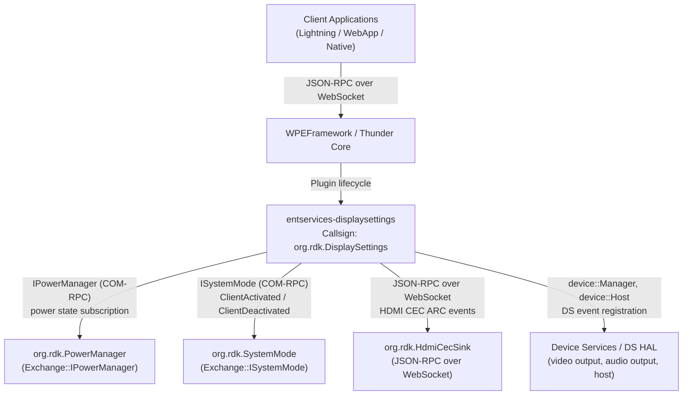
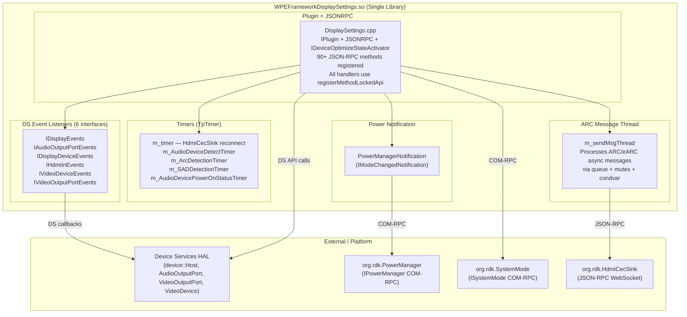
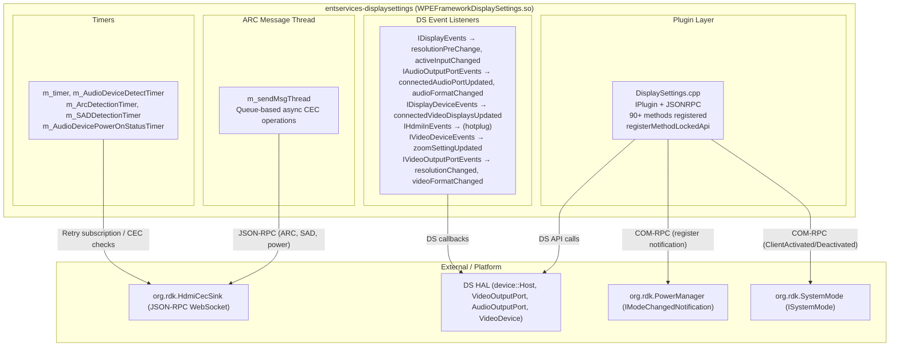
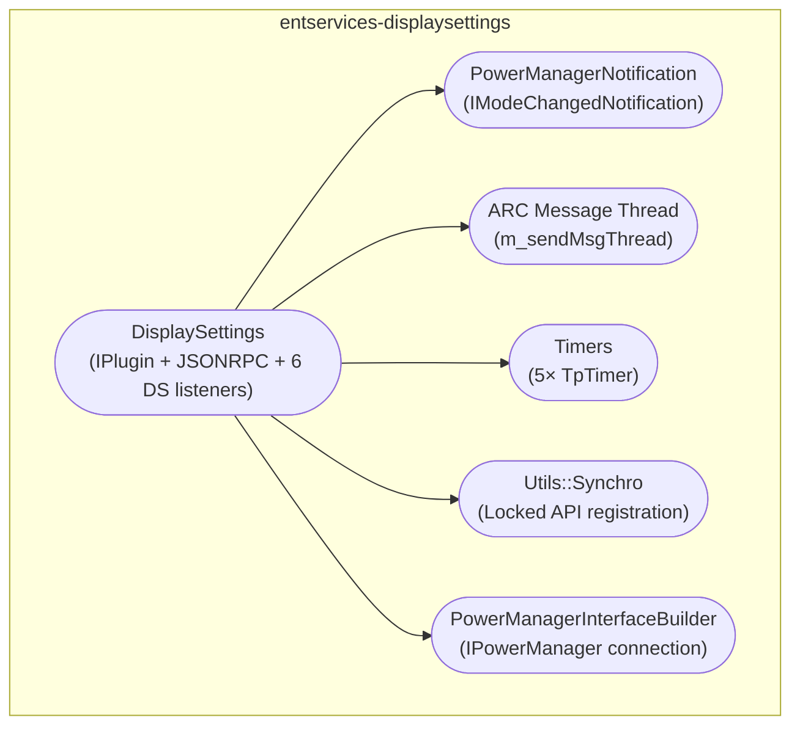
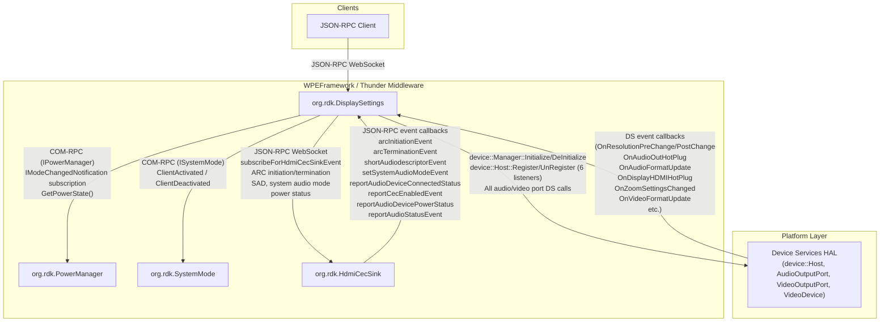
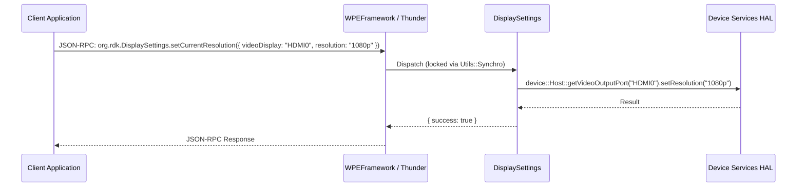
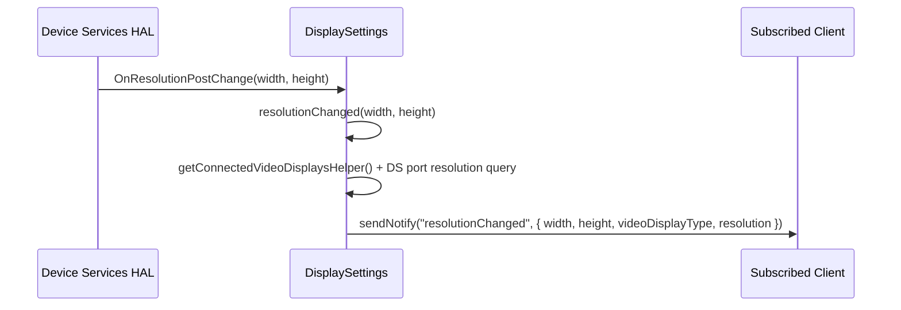
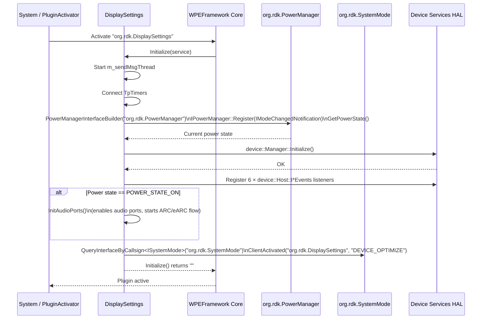

# Entservices-DisplaySettings

---

## Overview

`entservices-displaysettings` is a WPEFramework (Thunder) plugin that exposes control and query APIs for video output and audio output settings of the RDK-E device. It is registered under the callsign `org.rdk.DisplaySettings` and provides JSON-RPC methods for managing display resolution, zoom, HDCP, HDR, EDID, audio ports, audio modes, MS12 audio processing, volume, ARC/eARC routing, and associated audio mixing.

At the product level, the plugin enables applications to change the current video resolution, query what video displays and audio ports are connected, control audio processing parameters (MS12 compression, dialog enhancement, surround virtualizer, volume leveller, bass enhancer, dolby volume, graphic and intelligent equalizer, DRC mode, Atmos output mode), and manage HDMI ARC/eARC routing through the `org.rdk.HdmiCecSink` plugin.

At the module level, the plugin is a single shared library (`WPEFrameworkDisplaySettings.so`) implementing `IPlugin`, `JSONRPC`, and `IDeviceOptimizeStateActivator`, plus six DS event listener interfaces (`IDisplayEvents`, `IAudioOutputPortEvents`, `IDisplayDeviceEvents`, `IHdmiInEvents`, `IVideoDeviceEvents`, `IVideoOutputPortEvents`). All JSON-RPC handlers are registered using `registerMethodLockedApi` (a macro over `Utils::Synchro::RegisterLockedApiForHandler`) to serialize concurrent handler calls.



**Key Features & Responsibilities:**

- **Video output control**: Gets and sets the current resolution on a named video output port via DS API; caches resolution state in `currentResolutionCache` to avoid redundant DS calls.
- **Audio output control**: Gets and sets sound mode, audio port enable/disable, gain, mute, volume level, audio delay, and associated audio mixing on named audio output ports via DS API.
- **MS12 audio processing**: Gets and sets MS12 audio compression, Dolby Volume mode, dialog enhancement, intelligent equalizer, graphic equalizer, MS12 audio profile, surround virtualizer, volume leveller, bass enhancer, MI steering, DRC mode, Atmos output mode, and MS12 profile override settings.
- **HDR and colour depth**: Gets current HDR output settings, TV HDR capabilities, STB HDR capabilities, and colour depth preferences; sets force HDR mode and preferred colour depth via DS API.
- **EDID access**: Reads raw EDID bytes from a connected display and host EDID from the DS library.
- **HDMI ARC/eARC management**: Subscribes to `org.rdk.HdmiCecSink` events for ARC initiation, ARC termination, short audio descriptor (SAD), system audio mode, and audio device power status; manages ARC routing state machine through a dedicated message queue thread.
- **Power state integration**: Connects to `org.rdk.PowerManager` via COM-RPC, subscribes to `IModeChangedNotification`, and initialises audio ports only when the system is in `POWER_STATE_ON`.
- **System mode integration**: Registers with `org.rdk.SystemMode` under the `DEVICE_OPTIMIZE` mode on activation and deregisters on deactivation. Uses this to evaluate ALLM (Auto Low Latency Mode) state on HDMI hotplug events.
- **Event notifications**: Fires JSON-RPC notifications for resolution changes, zoom updates, active input changes, connected display updates, audio port hotplug, audio format changes, Atmos capability changes, video format changes, volume, mute, and audio processing parameter changes.
- **Zoom setting**: Gets and sets the display format conversion (DFC/zoom) setting on the video device via DS API.
- **Zoom persistence**: The zoom settings file path `/opt/persistent/rdkservices/zoomSettings.json` is defined as a constant (`ZOOM_SETTINGS_FILE`) in the source but a search of the source confirms it is not read or written by any method in the plugin at runtime.

---

## Architecture

### High-Level Architecture

`entservices-displaysettings` is a monolithic single-library Thunder plugin. All functionality — plugin lifecycle, JSON-RPC dispatch, DS event handling, power manager integration, HdmiCecSink JSON-RPC subscription, and SysteMode registration — is implemented in a single class (`DisplaySettings`) in a single shared library. There is no out-of-process implementation library.

The plugin uses the standard `PluginHost::JSONRPC` registration pattern but applies it through a `registerMethodLockedApi` macro that wraps every handler with `Utils::Synchro::RegisterLockedApiForHandler`, ensuring that concurrent JSON-RPC calls are serialized. Some handlers that have both a v1 and v2 behavior (e.g., `getVolumeLeveller` / `setVolumeLeveller`, `getSurroundVirtualizer` / `setSurroundVirtualizer`) are registered separately for handler version 1 and handler version 2 using `GetHandler(2)`.

Northbound, all client access is through Thunder's JSON-RPC WebSocket endpoint. No IWeb HTTP interface is implemented.

Southbound, the plugin makes direct DS library calls (`device::Host`, `device::VideoOutputPort`, `device::AudioOutputPort`, `device::VideoDevice`, `device::Manager`) for all hardware control. It does not call `IARM_Bus_RegisterEventHandler` or `IARM_Bus_Call` directly — DS events are received via six registered `device::Host::I*Events` listener interfaces. Power state changes are received via the `Exchange::IPowerManager::IModeChangedNotification` COM-RPC callback from `org.rdk.PowerManager`.

The HDMI ARC/eARC path uses a separate `m_sendMsgThread` (started in `Initialize()`) that processes messages from a queue (`m_sendMsgQueue`) using a `std::mutex` + `std::condition_variable` (`m_sendMsgMutex`, `m_sendMsgCV`). This thread handles operations that need to occur asynchronously relative to event callbacks, such as sending power-on messages to audio devices and requesting short audio descriptors.

No persistent store APIs are called. The only persistent file path defined is `ZOOM_SETTINGS_FILE` (`/opt/persistent/rdkservices/zoomSettings.json`), which is defined as a macro but not read or written at runtime. The `tr181api` library is linked (for `tr181_get` style calls) but no `tr181api` or `getTr181*` function calls are found in the plugin source.



### Threading Model

- **Threading Architecture**: Multi-threaded.
- **Main Thread (Thunder COM-RPC / JSON-RPC thread)**: Handles all `Initialize()`, `Deinitialize()`, and JSON-RPC method dispatch. All handlers are serialized through `Utils::Synchro::RegisterLockedApiForHandler`.
- **DS Callback Threads**: DS library invokes the six `device::Host::I*Events` callbacks (`OnResolutionPreChange`, `OnResolutionPostChange`, `OnAudioOutHotPlug`, `OnAudioFormatUpdate`, `OnDisplayHDMIHotPlug`, `OnZoomSettingsChanged`, etc.) on DS-owned threads. These callbacks call `sendNotify()` to fire JSON-RPC events and update cached state.
- **`m_sendMsgThread`**: Started in `Initialize()`. Waits on `m_sendMsgCV` (with `m_sendMsgMutex`). Processes messages from `m_sendMsgQueue` such as `SEND_AUDIO_DEVICE_POWERON_MSG`, `REQUEST_SHORT_AUDIO_DESCRIPTOR`, `REQUEST_AUDIO_DEVICE_POWER_STATUS`, `SEND_DEVICE_AUDIO_STATUS`, `SEND_MUTE_KEY_EVENT`, `SEND_REQUEST_ARC_INITIATION`, `SEND_REQUEST_ARC_TERMINATION`. Joined in `Deinitialize()` after setting `m_sendMsgThreadExit`.
- **Timer callbacks** (`m_timer`, `m_AudioDeviceDetectTimer`, `m_ArcDetectionTimer`, `m_SADDetectionTimer`, `m_AudioDevicePowerOnStatusTimer`): Run on the WPEFramework worker pool thread. Used for retrying HdmiCecSink subscription, checking ARC device connection, checking SAD updates, and checking audio device power status.
- **Synchronization**:
  - `m_sendMsgMutex` + `m_sendMsgCV`: Protects `m_sendMsgQueue`, `m_sendMsgThreadExit`, `m_sendMsgThreadRun`.
  - `m_callMutex`: General call mutex.
  - `m_SadMutex`: Protects `m_AudioDeviceSADState`.
  - `m_AudioDeviceStatesUpdateMutex`: Protects `m_currentArcRoutingState`.
  - `_adminLock` (`Core::CriticalSection`): Plugin-wide admin lock.
- **Async / Event Dispatch**: DS callbacks call `sendNotify()` directly to fire JSON-RPC events. Heavy ARC operations are dispatched to `m_sendMsgThread` via `sendMsgToQueue()`.

---

## Design

`DisplaySettings` registers itself with six DS event listener interfaces and two Thunder plugin interfaces (PowerManager COM-RPC, SystemMode COM-RPC) during `Initialize()`. This avoids polling and lets the plugin react to hardware events (hotplug, resolution change, audio format change, zoom change) via callbacks.

For DS event registration, `registerDsEventHandlers()` calls `device::Host::getInstance().Register(baseInterface<device::Host::I*>(), "WPE[DisplaySettings]")` for all six listener types once `device::Manager::Initialize()` succeeds. All six are unregistered in `Deinitialize()` via corresponding `UnRegister` calls.

Audio ports are initialised in `InitAudioPorts()`, which is only called when the system is in `POWER_STATE_ON`. On power-state transitions to ON, `onPowerModeChanged` re-runs `InitAudioPorts()` via `AudioPortsReInitialize()` and `InitAudioPorts()` calls. This avoids enabling audio ports while the device is in standby.

The ARC/eARC flow uses the `org.rdk.HdmiCecSink` plugin. On `HDMI_ARC0` port detection in `InitAudioPorts()`, the plugin queries the HdmiCecSink state, subscribes to eight events (ARC initiation, ARC termination, SAD, system audio mode, audio device connected status, CEC enabled, audio device power status, and arc audio status), then sends power-on messages to the audio device and starts timers to check its responses. If HdmiCecSink is not yet active, `m_timer` retries the connection at 5500 ms intervals.

Resolution and display connection status are cached in module-local variables (`currentResolutionCache`, `isResCacheUpdated`, `isHdmiDisplayConnected`, `isDisplayConnectedCacheUpdated`) to reduce repeated DS calls for the same data. Cache validity is cleared on hotplug events.

The `IDeviceOptimizeStateActivator::Request(newState)` interface is implemented to handle `DEVICE_OPTIMIZE` state transitions (e.g., `"VIDEO"`, `"GAME"`). On HDMI hotplug events, `connectedVideoDisplaysUpdated()` reads the current `DEVICE_OPTIMIZE` state from a system file and calls `Request()` if the state is `"VIDEO"` or `"GAME"`.

### Component Diagram



---

## Internal Modules

| Module / Class                 | Description                                                                                                                                                                                                                                                                                                | Key Files                                   |
| ------------------------------ | ---------------------------------------------------------------------------------------------------------------------------------------------------------------------------------------------------------------------------------------------------------------------------------------------------------- | ------------------------------------------- |
| `DisplaySettings`              | Main plugin class. Implements `IPlugin`, `JSONRPC`, `IDeviceOptimizeStateActivator`, and all six DS event listener interfaces. Registers all JSON-RPC methods, manages DS lifecycle, power manager integration, SystemMode integration, ARC/eARC state machine, resolution and display connection caching. | `DisplaySettings.cpp`, `DisplaySettings.h`  |
| `PowerManagerNotification`     | Inner class implementing `Exchange::IPowerManager::IModeChangedNotification`. Forwards `OnPowerModeChanged(currentState, newState)` to `DisplaySettings::onPowerModeChanged()`.                                                                                                                            | `DisplaySettings.h`                         |
| `Job`                          | Local anonymous namespace helper class implementing `Core::IDispatch` (or `Core::IDispatchType<void>` pre-Thunder-R4). Wraps a `std::function<void()>` for submission to the worker pool.                                                                                                                  | `DisplaySettings.cpp` (anonymous namespace) |
| `Utils::Synchro`               | Helper that provides `RegisterLockedApiForHandler` — wraps JSON-RPC handler registration with a mutex so concurrent calls to the same method are serialized.                                                                                                                                               | `helpers/UtilsSynchro.hpp`                  |
| `PowerManagerInterfaceBuilder` | Helper that builds a COM-RPC `IPowerManager` interface connection with retry logic (200 ms interval, 25 retries).                                                                                                                                                                                          | `helpers/PowerManagerInterface.h`           |
| `TpTimer`                      | Timer helper used for ARC reconnection, audio device detection, ARC detection, SAD update, and audio device power status checks.                                                                                                                                                                           | `helpers/tptimer.h`                         |



---

## Prerequisites & Dependencies

**Documentation Verification Checklist:**

- [x] **Thunder / WPEFramework APIs**: `IPlugin`, `JSONRPC`, `IDeviceOptimizeStateActivator`, `Exchange::IPowerManager`, `Exchange::ISystemMode` — all confirmed present and used in source.
- [x] **IARM Bus**: No `IARM_Bus_RegisterEventHandler` or `IARM_Bus_Call` calls found in `DisplaySettings.cpp`. DS events are received via `device::Host::I*Events` listener interfaces. IARMBus library is linked (transitively through DS library) but not called directly by the plugin.
- [x] **Device Services (DS) APIs**: `device::Manager::Initialize()` / `DeInitialize()`, all six `device::Host::Register` / `UnRegister` listener calls, plus numerous `device::Host`, `device::VideoOutputPort`, `device::AudioOutputPort`, `device::VideoDevice` API calls confirmed in source.
- [x] **Persistent store**: No persistent store reads or writes found. Not implemented.
- [x] **tr181api**: Linked in production build but no `tr181_get*` or `tr181api*` function calls found in `DisplaySettings.cpp`.
- [x] **Systemd services**: No systemd service files found in the repository.
- [x] **Configuration files**: `ZOOM_SETTINGS_FILE` (`/opt/persistent/rdkservices/zoomSettings.json`) is defined as a macro but confirmed not opened or parsed at runtime. `/tmp/SystemMode.txt` is referenced via `Utils::String::updateSystemModeFile()` as a fallback when `org.rdk.SystemMode` is unavailable.
- [x] **RFC**: `rfcapi.h` is included in `DisplaySettings.h` and `RFC_PWRMGR2` is defined (`"Device.DeviceInfo.X_RDKCENTRAL-COM_RFC.Feature.Power.PwrMgr2.Enable"`). RFC calls found only in `L2Tests` (mock usage); no `getRFCParameter` or `setRFCParameter` call found in `DisplaySettings.cpp` itself.

### RDK-E Platform Requirements

- **WPEFramework Version**: Compatible with WPEFramework/Thunder R4 and pre-R4 (guarded by `USE_THUNDER_R4` compile flag for `Core::IDispatch` vs. `Core::IDispatchType<void>`).
- **Build Dependencies**: `WPEFrameworkPlugins`, DS library (`FindDS.cmake`), IARMBus library (`FindIARMBus.cmake`), `tr181api` library (linked via `-ltr181api` in non-test builds), `entservices-apis` (Exchange interface headers for `IPowerManager`, `ISystemMode`, `IDeviceOptimizeStateActivator`). CXX standard: C++11.
- **RDK-E Plugin Dependencies**:
  - `org.rdk.PowerManager` — connected on init via `PowerManagerInterfaceBuilder`; retry 25 times at 200 ms intervals. Power state is queried to decide whether to initialise audio ports.
  - `org.rdk.SystemMode` — queried via `QueryInterfaceByCallsign<Exchange::ISystemMode>` on init and deinit for DEVICE_OPTIMIZE registration.
  - `org.rdk.HdmiCecSink` — subscribed for ARC/eARC events when `HDMI_ARC0` port is detected. Subscription retried via `m_timer` at 5500 ms intervals when HdmiCecSink is not yet active.
- **Device Services / HAL**: DS library and DS manager daemon must be running. `device::Manager::Initialize()` is called in `Initialize()`.
- **IARM Bus**: Not called directly. DS library internally uses IARM.
- **Systemd Services**: No explicit ordering found in the repository.
- **Configuration Files**: No configuration files are read at runtime by this plugin. `/tmp/SystemMode.txt` may be written as fallback for SystemMode registration when `org.rdk.SystemMode` is unavailable.
- **Startup Order**: Configurable via `PLUGIN_DISPLAYSETTINGS_STARTUPORDER` build variable. `autostart` defaults to `"false"`.
- **Preconditions**: `"Platform"` subsystem must be active (declared in `DisplaySettings.conf.in`).

---

## Quick Start

### 1. Connect via ThunderJS

```js
import ThunderJS from "thunderjs";
const thunderJS = ThunderJS({ host: "127.0.0.1" });
```

### 2. Get connected video displays

```js
thunderJS["org.rdk.DisplaySettings"]
  .getConnectedVideoDisplays()
  .then((result) => console.log("Displays:", result.connectedVideoDisplays))
  .catch((err) => console.error(err));
```

### 3. Set current resolution

```js
thunderJS["org.rdk.DisplaySettings"]
  .setCurrentResolution({
    videoDisplay: "HDMI0",
    resolution: "1080p",
  })
  .then((result) => console.log(result))
  .catch((err) => console.error(err));
```

### 4. Subscribe to resolution change events

```js
thunderJS.on("org.rdk.DisplaySettings", "resolutionChanged", (event) => {
  console.log("Resolution changed:", event);
});
```

---

## Configuration

### Key Configuration Files

| Configuration File                                                | Purpose                                          | Override Mechanism                |
| ----------------------------------------------------------------- | ------------------------------------------------ | --------------------------------- |
| `DisplaySettings.conf` (generated from `DisplaySettings.conf.in`) | Callsign, precondition, autostart, startup order | Set build variables at CMake time |

### Configuration Parameters

| Parameter      | Type   | Default                   | Description                                                                                  |
| -------------- | ------ | ------------------------- | -------------------------------------------------------------------------------------------- |
| `callsign`     | string | `org.rdk.DisplaySettings` | Thunder callsign for this plugin                                                             |
| `precondition` | string | `Platform`                | Thunder subsystem that must be active before activation                                      |
| `autostart`    | bool   | `false`                   | Plugin does not activate automatically on Thunder start (`PLUGIN_DISPLAYSETTINGS_AUTOSTART`) |
| `startuporder` | string | (empty)                   | Numeric startup order (`PLUGIN_DISPLAYSETTINGS_STARTUPORDER`)                                |

### Configuration Persistence

No runtime configuration parameters are persisted by this plugin. DS library persists port-level settings (e.g., audio port enable state via `vPort.getEnablePersist()`) independently.

---

## API / Usage

### Interface Type

JSON-RPC over Thunder WebSocket. Plugin API version: 2.0.5 (Major=2, Minor=0, Patch=5). Methods are registered on both handler version 1 and handler version 2 (`CreateHandler({ 2 })`). Handler version 2 overrides `getVolumeLeveller`, `setVolumeLeveller`, `getSurroundVirtualizer`, `setSurroundVirtualizer` with updated implementations.

All methods are accessed under callsign `org.rdk.DisplaySettings`.

---

### Video Display Methods

#### `getConnectedVideoDisplays`

Returns a list of connected video display port names. Source: iterates `device::Host::getVideoOutputPorts()` and checks `isDisplayConnected()` with a per-call cache for HDMI0.

**Parameters**: None

**Response**

```json
{
  "connectedVideoDisplays": ["HDMI0"],
  "success": true
}
```

---

#### `getSupportedVideoDisplays`

Returns all video output port names from DS, regardless of connection state.

**Parameters**: None

**Response**

```json
{
  "supportedVideoDisplays": ["HDMI0"],
  "success": true
}
```

---

#### `getSupportedResolutions`

Returns resolutions supported by the specified video display's port type, queried from `device::VideoOutputPortConfig`.

**Parameters**

| Name           | Type   | Required | Description                                                              |
| -------------- | ------ | -------- | ------------------------------------------------------------------------ |
| `videoDisplay` | string | No       | Video output port name. Defaults to the default video port name from DS. |

**Response**

```json
{
  "supportedResolutions": ["720p", "1080i", "1080p60"],
  "success": true
}
```

---

#### `getSupportedTvResolutions`

Returns resolutions supported by the connected TV, read from `vPort.getSupportedTvResolutions()` as a bitmask and expanded to string names. Maps `dsTV_RESOLUTION_*` bitmask flags to resolution strings.

**Parameters**

| Name           | Type   | Required | Description                                                      |
| -------------- | ------ | -------- | ---------------------------------------------------------------- |
| `videoDisplay` | string | No       | Video output port name. Defaults to the default video port name. |

**Response**

```json
{
  "supportedTvResolutions": [
    "480i",
    "480p",
    "720p",
    "1080i",
    "1080p",
    "2160p60"
  ],
  "success": true
}
```

---

#### `getSupportedSettopResolutions`

Returns resolutions supported by the STB's video device, queried from `device::VideoDevice::getSupportedResolutions()`.

**Parameters**: None

**Response**

```json
{
  "supportedSettopResolutions": ["720p", "1080i", "1080p60"],
  "success": true
}
```

---

#### `getCurrentResolution`

Returns the current output resolution for a video display. Caches the result in `currentResolutionCache`; cache is invalidated on resolution change events.

**Parameters**

| Name           | Type   | Required | Description                                                      |
| -------------- | ------ | -------- | ---------------------------------------------------------------- |
| `videoDisplay` | string | No       | Video output port name. Defaults to the default video port name. |

**Response**

```json
{
  "resolution": "1080p",
  "w": 1920,
  "h": 1080,
  "progressive": true,
  "success": true
}
```

---

#### `setCurrentResolution`

Sets the current output resolution on a video display via `vPort.setResolution(name)`.

**Parameters**

| Name           | Type   | Required | Description                                                      |
| -------------- | ------ | -------- | ---------------------------------------------------------------- |
| `videoDisplay` | string | No       | Video output port name. Defaults to the default video port name. |
| `resolution`   | string | Yes      | Resolution name (e.g., `"1080p60"`).                             |
| `persist`      | bool   | No       | If true, persists the resolution in DS.                          |

**Response**

```json
{
  "success": true
}
```

---

#### `getDefaultResolution`

Returns the default resolution for the specified video display from `vPort.getDefaultResolution().getName()`.

**Parameters**

| Name           | Type   | Required | Description             |
| -------------- | ------ | -------- | ----------------------- |
| `videoDisplay` | string | No       | Video output port name. |

**Response**

```json
{
  "defaultResolution": "1080p",
  "success": true
}
```

---

#### `getActiveInput`

Returns whether the connected display is detecting an active RxSense signal from the STB. Source: `device::VideoOutputPort::isDisplayConnected()`.

**Parameters**

| Name           | Type   | Required | Description             |
| -------------- | ------ | -------- | ----------------------- |
| `videoDisplay` | string | No       | Video output port name. |

**Response**

```json
{
  "activeInput": true,
  "success": true
}
```

---

#### `getTvHDRSupport` / `getSettopHDRSupport`

`getTvHDRSupport`: Returns HDR standards supported by the connected TV via `vPort.getTVHDRCapabilities()` bitmask.
`getSettopHDRSupport`: Returns HDR standards supported by the STB via `device::VideoDevice::getHDRCapabilities()` bitmask.

**Parameters**: None

**Response**

```json
{
  "standards": ["none", "HDR10", "Dolby Vision", "HDR10+"],
  "supportsHDR": true,
  "success": true
}
```

---

#### `getTVHDRCapabilities`

Returns raw TV HDR capabilities as a bitmask integer and as an array of string names.

**Parameters**

| Name           | Type   | Required | Description             |
| -------------- | ------ | -------- | ----------------------- |
| `videoDisplay` | string | No       | Video output port name. |

**Response**

```json
{
  "capabilities": 3,
  "supportsHDR10": true,
  "supportsHLG": true,
  "supportsDolbyVision": false,
  "supportsHDR10Plus": false,
  "supportsTechnicolorPrime": false,
  "success": true
}
```

---

#### `getCurrentOutputSettings`

Returns the current colour depth, colour space, matrix coefficients, video EOTF, quantization range, and frame rate for the video output port.

**Parameters**: None

**Response**

```json
{
  "colorDepth": 8,
  "colorSpace": 5,
  "colorimetry": 2,
  "matrixCoefficients": 0,
  "videoEOTF": 0,
  "quantizationRange": 235,
  "framerate": 60,
  "success": true
}
```

---

#### `getZoomSetting`

Returns the current display format conversion (DFC/zoom) setting from `device::VideoDevice::getDFC().getName()`. Under `USE_IARM`, the name is mapped through `iarm2svc()`.

**Parameters**: None

**Response**

```json
{
  "zoomSetting": "FULL",
  "success": true
}
```

---

#### `setZoomSetting`

Sets the zoom/DFC setting via `device::VideoDevice::setDFC(name)`. Under `USE_IARM`, the name is mapped through `svc2iarm()`.

**Parameters**

| Name          | Type   | Required | Description                                   |
| ------------- | ------ | -------- | --------------------------------------------- |
| `zoomSetting` | string | Yes      | Zoom setting name (e.g., `"FULL"`, `"NONE"`). |

**Response**

```json
{
  "success": true
}
```

---

#### `setForceHDRMode`

Forces the HDR output mode on the video device.

**Parameters**

| Name       | Type | Required | Description                 |
| ---------- | ---- | -------- | --------------------------- |
| `hdr_mode` | bool | Yes      | `true` to force HDR output. |

**Response**

```json
{
  "success": true
}
```

---

#### `readEDID`

Reads raw EDID bytes for the specified video display from `vPort.getDisplay().getEDIDBytes()` and returns them as a base64-encoded string.

**Parameters**

| Name           | Type   | Required | Description                                                      |
| -------------- | ------ | -------- | ---------------------------------------------------------------- |
| `videoDisplay` | string | No       | Video output port name. Defaults to the default video port name. |

**Response**

```json
{
  "EDID": "AP///////w...",
  "success": true
}
```

---

#### `readHostEDID`

Reads host EDID bytes from `device::Host::getHostEDID(edidVec)` and returns them base64-encoded.

**Parameters**: None

**Response**

```json
{
  "EDID": "AP///////w...",
  "success": true
}
```

---

#### `isConnectedDeviceRepeater`

Returns whether the connected HDMI device is an HDCP repeater via `vPort.isContentProtected()`.

**Parameters**: None

**Response**

```json
{
  "HdcpRepeater": false,
  "success": true
}
```

---

#### `setScartParameter`

Sets a SCART output parameter on the `SCART0` video port via `vPort.setScartParameter(parameter, parameterData)`.

**Parameters**

| Name                 | Type   | Required | Description            |
| -------------------- | ------ | -------- | ---------------------- |
| `scartParameter`     | string | Yes      | SCART parameter name.  |
| `scartParameterData` | string | Yes      | SCART parameter value. |

**Response**

```json
{
  "success": true
}
```

---

#### `getVideoFormat`

Returns the current video format (HDR standard) from `device::Host::getCurrentVideoFormat()`.

**Parameters**: None

**Response**

```json
{
  "currentVideoFormat": "HDR10",
  "supportedVideoFormat": ["SDR", "HDR10", "HDR10+"],
  "success": true
}
```

---

#### `setPreferredColorDepth` / `getPreferredColorDepth` / `getColorDepthCapabilities`

Set and get the preferred colour depth for the video output port, and retrieve the list of colour depths the port supports. Source: DS audio/video port APIs.

---

### Audio Port Methods

#### `getConnectedAudioPorts`

Returns audio port names that are currently connected. For `HDMI_ARC0`, the port is included only if `m_hdmiInAudioDeviceConnected` is true. Source: `device::AudioOutputPort::isConnected()`.

**Parameters**: None

**Response**

```json
{
  "connectedAudioPorts": ["HDMI0"],
  "success": true
}
```

---

#### `getSupportedAudioPorts`

Returns all audio output port names from DS.

**Parameters**: None

**Response**

```json
{
  "supportedAudioPorts": ["HDMI0", "SPDIF0", "HDMI_ARC0"],
  "success": true
}
```

---

#### `getSupportedAudioModes`

Returns audio modes supported by the specified audio port from `device::AudioOutputPort::getSupportedStereoModes()`.

**Parameters**

| Name        | Type   | Required | Description                             |
| ----------- | ------ | -------- | --------------------------------------- |
| `audioPort` | string | No       | Audio port name. Defaults to `"HDMI0"`. |

**Response**

```json
{
  "supportedAudioModes": ["STEREO", "SURROUND", "PASSTHRU"],
  "success": true
}
```

---

#### `setEnableAudioPort` / `getEnableAudioPort`

Enable or disable an audio port via `device::AudioOutputPort::enable()` / `disable()`. Tracks enable state per port in `audioPortEnableStatusMap`.

**Parameters**

| Name        | Type   | Required       | Description                           |
| ----------- | ------ | -------------- | ------------------------------------- |
| `audioPort` | string | Yes            | Audio port name.                      |
| `enable`    | bool   | Yes (set only) | `true` to enable, `false` to disable. |

**Response**

```json
{
  "success": true
}
```

---

#### `getSoundMode` / `setSoundMode`

Get or set the stereo / surround mode on an audio port via `device::AudioOutputPort::getStereoMode()` / `setStereoMode()`.

**Parameters**

| Name        | Type   | Required       | Description                                                |
| ----------- | ------ | -------------- | ---------------------------------------------------------- |
| `audioPort` | string | No             | Audio port name. Defaults to `"HDMI0"`.                    |
| `soundMode` | string | Yes (set only) | Sound mode (e.g., `"STEREO"`, `"SURROUND"`, `"PASSTHRU"`). |

---

#### `getAudioFormat`

Returns the current audio format from `device::Host::getCurrentAudioFormat()`.

**Parameters**: None

**Response**

```json
{
  "currentAudioFormat": "DOLBY AC3",
  "success": true
}
```

---

#### `getAudioDelay` / `setAudioDelay`

Get or set the audio output delay (in milliseconds) for an audio port via DS APIs.

**Parameters**

| Name         | Type   | Required       | Description                        |
| ------------ | ------ | -------------- | ---------------------------------- |
| `audioPort`  | string | No             | Audio port name.                   |
| `audioDelay` | string | Yes (set only) | Delay in milliseconds as a string. |

---

#### `setGain` / `getGain`

Get or set the gain level on an audio output port.

| Name        | Type   | Required       | Description      |
| ----------- | ------ | -------------- | ---------------- |
| `audioPort` | string | No             | Audio port name. |
| `gain`      | float  | Yes (set only) | Gain value.      |

---

#### `setMuted` / `getMuted`

Get or set mute status on an audio output port.

| Name        | Type   | Required       | Description      |
| ----------- | ------ | -------------- | ---------------- |
| `audioPort` | string | No             | Audio port name. |
| `muted`     | bool   | Yes (set only) | `true` to mute.  |

---

#### `setVolumeLevel` / `getVolumeLevel`

Get or set the volume level on an audio output port.

| Name          | Type   | Required       | Description      |
| ------------- | ------ | -------------- | ---------------- |
| `audioPort`   | string | No             | Audio port name. |
| `volumeLevel` | float  | Yes (set only) | Volume level.    |

---

#### `getSinkAtmosCapability`

Returns the Atmos capability of the sink device on the specified audio port from `device::AudioOutputPort::getSinkDeviceAtmosCapability()`.

**Parameters**

| Name        | Type   | Required | Description      |
| ----------- | ------ | -------- | ---------------- |
| `audioPort` | string | No       | Audio port name. |

**Response**

```json
{
  "atmos_capability": 2,
  "success": true
}
```

---

#### `setAudioAtmosOutputMode`

Sets the Atmos output mode on an audio port via `device::AudioOutputPort::setAtmosOutputMode()`.

| Name        | Type   | Required | Description                    |
| ----------- | ------ | -------- | ------------------------------ |
| `audioPort` | string | No       | Audio port name.               |
| `enable`    | bool   | Yes      | `true` to enable Atmos output. |

---

#### `getSettopAudioCapabilities` / `getSettopMS12Capabilities`

Return audio capabilities and MS12 capabilities of the STB for the specified audio port.

---

#### `setAssociatedAudioMixing` / `getAssociatedAudioMixing`

Get or set associated audio mixing (mixing of secondary audio stream) via DS APIs.

---

#### `setFaderControl` / `getFaderControl`

Get or set the fader/mixer balance between primary and secondary audio.

---

#### `setPrimaryLanguage` / `getPrimaryLanguage` / `setSecondaryLanguage` / `getSecondaryLanguage`

Get or set the primary and secondary audio languages (ISO 639-2 codes) for associated audio.

---

### MS12 Audio Processing Methods

All MS12 methods operate on a named audio port (default `"HDMI0"`) via DS `device::AudioOutputPort` APIs.

| Method                                                        | Description                                                          |
| ------------------------------------------------------------- | -------------------------------------------------------------------- |
| `setMS12AudioCompression` / `getMS12AudioCompression`         | Set/get MS12 dynamic range compression level (0–10)                  |
| `setDolbyVolumeMode` / `getDolbyVolumeMode`                   | Enable/disable Dolby Volume levelling                                |
| `setDialogEnhancement` / `getDialogEnhancement`               | Set/get dialog enhancement level (0–16)                              |
| `resetDialogEnhancement`                                      | Reset dialog enhancement to default                                  |
| `setIntelligentEqualizerMode` / `getIntelligentEqualizerMode` | Set/get intelligent equalizer mode (0–6)                             |
| `setGraphicEqualizerMode` / `getGraphicEqualizerMode`         | Set/get graphic equalizer mode (0–2)                                 |
| `setMS12AudioProfile` / `getMS12AudioProfile`                 | Set/get active MS12 audio profile by name                            |
| `getSupportedMS12AudioProfiles`                               | Return list of supported MS12 audio profile names                    |
| `setVolumeLeveller` / `getVolumeLeveller`                     | Set/get volume leveller enable and level (v1 and v2 variants)        |
| `resetVolumeLeveller`                                         | Reset volume leveller to default                                     |
| `setBassEnhancer` / `getBassEnhancer`                         | Set/get bass enhancer enable and boost level (0–100)                 |
| `resetBassEnhancer`                                           | Reset bass enhancer to default                                       |
| `enableSurroundDecoder` / `isSurroundDecoderEnabled`          | Enable/disable and query surround decoder                            |
| `setSurroundVirtualizer` / `getSurroundVirtualizer`           | Set/get surround virtualizer mode and boost (v1 and v2 variants)     |
| `resetSurroundVirtualizer`                                    | Reset surround virtualizer to default                                |
| `setMISteering` / `getMISteering`                             | Enable/disable media intelligent steering                            |
| `setDRCMode` / `getDRCMode`                                   | Set/get dynamic range control mode (0=Line, 1=RF)                    |
| `setMS12ProfileSettingsOverride`                              | Override MS12 profile settings for a specific audio port and profile |
| `getSupportedMS12Config`                                      | Returns the MS12 configurations supported                            |

---

### Events / Notifications

All events are fired via `sendNotify()` (which wraps Thunder's `Notify()`).

| Event                           | Trigger                                         | Payload Fields                                      |
| ------------------------------- | ----------------------------------------------- | --------------------------------------------------- |
| `resolutionPreChange`           | DS `OnResolutionPreChange()` callback           | (empty object)                                      |
| `resolutionChanged`             | DS `OnResolutionPostChange()` callback          | `width`, `height`, `videoDisplayType`, `resolution` |
| `zoomSettingUpdated`            | DS `OnZoomSettingsChanged()` callback           | `zoomSetting`, `videoDisplayType`                   |
| `activeInputChanged`            | DS `OnDisplayRxSense()` callback                | `activeInput` (bool)                                |
| `connectedVideoDisplaysUpdated` | DS `OnDisplayHDMIHotPlug()` callback            | `connectedVideoDisplays` (array)                    |
| `connectedAudioPortUpdated`     | DS `OnAudioOutHotPlug()` callback               | `HotpluggedAudioPort`, `isConnected`                |
| `audioFormatChanged`            | DS `OnAudioFormatUpdate()` callback             | `currentAudioFormat`                                |
| `AtmosCapabilityChanged`        | DS `OnDolbyAtmosCapabilitiesChanged()` callback | `currentAtmosCapability`                            |
| `videoFormatChanged`            | DS `OnVideoFormatUpdate()` callback             | `currentVideoFormat`, `supportedVideoFormat`        |
| `associatedAudioMixingChanged`  | DS `OnAssociatedAudioMixingChanged()` callback  | `mixing` (bool)                                     |
| `faderControlChanged`           | DS `OnAudioFaderControlChanged()` callback      | `mixerBalance` (bool)                               |
| `primaryLanguageChanged`        | DS `OnAudioPrimaryLanguageChanged()` callback   | `primaryLanguage`                                   |
| `secondaryLanguageChanged`      | DS `OnAudioSecondaryLanguageChanged()` callback | `secondaryLanguage`                                 |
| `muteStatusChanged`             | ARC/volume control path                         | `muted` (bool), `audioPort`                         |
| `volumeLevelChanged`            | ARC/volume control path                         | `volumeLevel`, `audioPort`                          |
| `audioPortEnableStatusChanged`  | `setEnableAudioPort` result                     | `audioPort`, `enabled`                              |

---

## Component Interactions



### Interaction Matrix

| Target Component / Layer     | Interaction Purpose                                             | Key APIs                                                                                                                                                                                                                                                                                                                                                                                                                                                                  |
| ---------------------------- | --------------------------------------------------------------- | ------------------------------------------------------------------------------------------------------------------------------------------------------------------------------------------------------------------------------------------------------------------------------------------------------------------------------------------------------------------------------------------------------------------------------------------------------------------------- |
| **Device Services (DS) HAL** |                                                                 |                                                                                                                                                                                                                                                                                                                                                                                                                                                                           |
| `device::Manager`            | DS library init/deinit                                          | `device::Manager::Initialize()`, `device::Manager::DeInitialize()`                                                                                                                                                                                                                                                                                                                                                                                                        |
| `device::Host`               | Event listener registration; enumerate ports; get ports by name | `Register(I*Events*, name)`, `UnRegister()`, `getAudioOutputPorts()`, `getVideoOutputPorts()`, `getVideoDevices()`, `getDefaultVideoPortName()`, `getVideoOutputPort(name)`, `getAudioOutputPort(name)`, `getCurrentAudioFormat()`, `getCurrentVideoFormat()`, `getHostEDID()`                                                                                                                                                                                            |
| `device::VideoOutputPort`    | Resolution, zoom, EDID, HDR, colour, SCART                      | `getResolution()`, `setResolution()`, `getDefaultResolution()`, `getSupportedTvResolutions()`, `isDisplayConnected()`, `getTVHDRCapabilities()`, `isContentProtected()`, `setScartParameter()`, `getDisplay().getEDIDBytes()`, `GetHdmiPreference()`, `SetHdmiPreference()`, etc.                                                                                                                                                                                         |
| `device::AudioOutputPort`    | Sound mode, MS12, volume, gain, mute, delay, Atmos              | `getStereoMode()`, `setStereoMode()`, `getBassEnhancer()`, `setBassEnhancer()`, `getMS12AudioCompression()`, `setMS12AudioCompression()`, `getVolumeLeveller()`, `setVolumeLeveller()`, `getSurroundVirtualizer()`, `setSurroundVirtualizer()`, `getSinkDeviceAtmosCapability()`, `setAtmosOutputMode()`, `getGain()`, `setGain()`, `getMute()`, `setMute()`, `getVolumeLevel()`, `setVolumeLevel()`, `getAudioDelay()`, `setAudioDelay()`, `enable()`, `disable()`, etc. |
| `device::VideoDevice`        | Zoom/DFC, STB HDR capabilities, supported resolutions           | `getDFC()`, `setDFC()`, `getHDRCapabilities()`, `getSupportedResolutions()`                                                                                                                                                                                                                                                                                                                                                                                               |
| **Thunder Plugins**          |                                                                 |                                                                                                                                                                                                                                                                                                                                                                                                                                                                           |
| `org.rdk.PowerManager`       | Subscribe to power mode changes; query current power state      | `PowerManagerInterfaceBuilder("org.rdk.PowerManager")`, `IPowerManager::Register(IModeChangedNotification*)`, `GetPowerState()`                                                                                                                                                                                                                                                                                                                                           |
| `org.rdk.SystemMode`         | Register/deregister as DEVICE_OPTIMIZE participant              | `QueryInterfaceByCallsign<Exchange::ISystemMode>("org.rdk.SystemMode")`, `ISystemMode::ClientActivated(callsign, systemMode)`, `ClientDeactivated()`                                                                                                                                                                                                                                                                                                                      |
| `org.rdk.HdmiCecSink`        | ARC/eARC setup and audio device lifecycle via CEC               | `subscribeForHdmiCecSinkEvent()` for 8 events; JSON-RPC method calls for ARC initiation/termination, SAD requests, power messages, user control press                                                                                                                                                                                                                                                                                                                     |

### IPC Flow Patterns

**JSON-RPC Method Call (e.g., `setCurrentResolution`):**



**DS Hardware Event → JSON-RPC Notification:**



---

## Component State Flow

### Initialization to Active State



### Runtime State Changes

**Power state to POWER_STATE_ON**:
`onPowerModeChanged(currentState, POWER_STATE_ON)` is called by `PowerManagerNotification`. The handler calls `AudioPortsReInitialize()` followed by `InitAudioPorts()` to re-enable audio ports and restart ARC/eARC detection.

**HDMI hotplug (connect)**:
DS calls `OnDisplayHDMIHotPlug(HDMI_HOTPLUG_EVENT_CONNECTED)`. `connectedVideoDisplaysUpdated()` fires `connectedVideoDisplaysUpdated` JSON-RPC event with `["HDMI0"]` in the array, invalidates the display connection cache, and evaluates ALLM state.

**HDMI hotplug (disconnect)**:
DS calls `OnDisplayHDMIHotPlug()` with disconnect event. `connectedVideoDisplaysUpdated()` fires the event with an empty array.

**ARC audio device detection**:
When `HDMI_ARC0` hotplug is received (`OnAudioOutHotPlug`), the ARC state is updated and `connectedAudioPortUpdated()` fires the `connectedAudioPortUpdated` event.

---

## Implementation Details

### HAL / DS API Integration

| HAL / DS API                                            | Purpose                                         | Implementation File                                       |
| ------------------------------------------------------- | ----------------------------------------------- | --------------------------------------------------------- |
| `device::Manager::Initialize()`                         | DS library initialisation                       | `DisplaySettings.cpp`                                     |
| `device::Manager::DeInitialize()`                       | DS library teardown                             | `DisplaySettings.cpp`                                     |
| `device::Host::getInstance().Register(I*Events*, name)` | Register 6 DS event listener interfaces         | `DisplaySettings.cpp`                                     |
| `device::Host::getInstance().UnRegister(I*Events*)`     | Unregister 6 DS event listener interfaces       | `DisplaySettings.cpp`                                     |
| `device::Host::getAudioOutputPorts()`                   | Enumerate audio ports for init and port queries | Multiple methods                                          |
| `device::Host::getVideoOutputPorts()`                   | Enumerate video ports                           | Multiple methods                                          |
| `device::Host::getVideoDevices()`                       | Get video devices for zoom, STB HDR             | `getZoomSetting`, `setZoomSetting`, `getSettopHDRSupport` |
| `device::Host::getDefaultVideoPortName()`               | Get default video port name                     | Multiple methods                                          |
| `device::Host::getVideoOutputPort(name)`                | Get video port by name                          | Most video methods                                        |
| `device::Host::getAudioOutputPort(name)`                | Get audio port by name                          | Most audio methods                                        |
| `device::Host::getCurrentAudioFormat()`                 | Current audio format                            | `getAudioFormat`                                          |
| `device::Host::getCurrentVideoFormat()`                 | Current video format (HDR standard)             | `getVideoFormat`                                          |
| `device::Host::getHostEDID()`                           | Read host EDID bytes                            | `readHostEDID`                                            |
| `vPort.getSupportedTvResolutions(&bitmask)`             | TV supported resolution bitmask                 | `getSupportedTvResolutions`                               |
| `vPort.getResolution().getName()`                       | Current output resolution                       | `getCurrentResolution`                                    |
| `vPort.setResolution(name)`                             | Set output resolution                           | `setCurrentResolution`                                    |
| `vPort.isDisplayConnected()`                            | Display connection status                       | `isDisplayConnected` (cached)                             |
| `vPort.getTVHDRCapabilities(&caps)`                     | TV HDR bitmask                                  | `getTvHDRSupport`, `getTVHDRCapabilities`                 |
| `vPort.getDisplay().getEDIDBytes(vec)`                  | Raw EDID bytes                                  | `readEDID`                                                |
| `vPort.setScartParameter(param, data)`                  | SCART parameter                                 | `setScartParameter`                                       |
| `device::VideoDevice::getDFC().getName()`               | Current zoom/DFC name                           | `getZoomSetting`                                          |
| `device::VideoDevice::setDFC(name)`                     | Set zoom/DFC                                    | `setZoomSetting`                                          |
| `device::VideoDevice::getHDRCapabilities(&caps)`        | STB HDR bitmask                                 | `getSettopHDRSupport`                                     |
| `aPort.getStereoMode()` / `setStereoMode()`             | Sound mode                                      | `getSoundMode`, `setSoundMode`                            |
| `aPort.getMS12AudioCompression()` etc.                  | All MS12 audio processing APIs                  | MS12 methods                                              |
| `aPort.enable()` / `disable()`                          | Audio port enable/disable                       | `setEnableAudioPort`                                      |
| `aPort.getGain()` / `setGain()`                         | Gain                                            | `getGain`, `setGain`                                      |
| `aPort.getMute()` / `setMute()`                         | Mute                                            | `getMuted`, `setMuted`                                    |
| `aPort.getVolumeLevel()` / `setVolumeLevel()`           | Volume                                          | `getVolumeLevel`, `setVolumeLevel`                        |
| `aPort.getSinkDeviceAtmosCapability()`                  | Sink Atmos capability                           | `getSinkAtmosCapability`                                  |

### Key Implementation Logic

- **JSON-RPC handler locking**: All handlers are registered via `Utils::Synchro::RegisterLockedApiForHandler`, which wraps each handler call with a plugin-level mutex to prevent concurrent execution.
- **Resolution caching**: `currentResolutionCache` and `isResCacheUpdated` cache the current resolution. The cache is invalidated by DS resolution change callbacks. Similarly, `isHdmiDisplayConnected` and `isDisplayConnectedCacheUpdated` cache the HDMI connection state.
- **Audio port initialisation**: `InitAudioPorts()` reads port enable persistence from DS (`vPort.getEnablePersist()`), queries HdmiCecSink for audio device detection, and starts ARC/eARC flow for `HDMI_ARC0`. It is only called when `POWER_STATE_ON`.
- **ARC/eARC state machine**: Managed through `m_currentArcRoutingState` (protected by `m_AudioDeviceStatesUpdateMutex`), `m_AudioDeviceSADState` (protected by `m_SadMutex`), and `m_hdmiInAudioDeviceConnected`. State transitions are driven by HdmiCecSink event callbacks (`onARCInitiationEventHandler`, `onARCTerminationEventHandler`, `onAudioDevicePowerStatusEventHandler`, `onShortAudioDescriptorEventHandler`, `onSystemAudioModeEventHandler`). Heavy operations are dispatched to `m_sendMsgThread` via `sendMsgToQueue()`.
- **Error handling**: All DS calls are wrapped in try-catch for `device::Exception`. Errors are logged with `LOG_DEVICE_EXCEPTION0/1/2` macros. On failure, methods return `{ "success": false }` or a fallback value.
- **Static instance**: `DisplaySettings::_instance` is a static pointer to the active instance. Callbacks that arrive on DS threads use this pointer to call instance methods.

---

## Data Flow

**Typical audio setting change (e.g., `setDialogEnhancement`):**

```
JSON-RPC Client: org.rdk.DisplaySettings.setDialogEnhancement({ audioPort: "HDMI0", enhancementlevel: 8 })
        |
        v
Thunder dispatches → locked handler (Utils::Synchro mutex acquired)
        |
        v
DisplaySettings::setDialogEnhancement()
  → device::Host::getAudioOutputPort("HDMI0")
  → aPort.setDialogEnhancement(8)
        |
        v
JSON-RPC response: { "success": true }
```

**DS audio format change event:**

```
DS HAL fires OnAudioFormatUpdate(dsAUDIO_FORMAT_DOLBY_AC3)
        |
        v
DisplaySettings::notifyAudioFormatChange(dsAUDIO_FORMAT_DOLBY_AC3)
        |
        v
audioFormatToString() → maps enum to "DOLBY AC3"
        |
        v
sendNotify("audioFormatChanged", { "currentAudioFormat": "DOLBY AC3" })
        |
        v
All subscribed JSON-RPC clients receive the notification
```

---

## Error Handling

### Layered Error Handling

| Layer                    | Error Type          | Handling Strategy                                                                                      |
| ------------------------ | ------------------- | ------------------------------------------------------------------------------------------------------ |
| Device Services / DS     | `device::Exception` | Caught in all DS calls; logged with `LOG_DEVICE_EXCEPTION0/1/2`; method returns `{ "success": false }` |
| Device Services / DS     | `std::exception`    | Caught separately in some methods; logged with `LOGERR`; method returns `{ "success": false }`         |
| Device Services / DS     | `...` (unknown)     | Caught in some methods; logged with `LOGWARN`; returns `{ "success": false }`                          |
| PowerManager connection  | COM-RPC failure     | `PowerManagerInterfaceBuilder` retries 25 times at 200 ms; logs warning if still unavailable           |
| HdmiCecSink subscription | Plugin not active   | `m_timer` retries subscription at 5500 ms intervals                                                    |
| Plugin lifecycle         | DS init failure     | Logged; plugin continues without DS functionality                                                      |

---

## Testing

### Test Coverage

| Level            | Scope                                                                                                                   | Location                                         |
| ---------------- | ----------------------------------------------------------------------------------------------------------------------- | ------------------------------------------------ |
| L1 – Unit        | No L1 test files found in the repository — `Tests/L1Tests/` contains only build configuration (CMakeLists.txt)          | `Tests/L1Tests/`                                 |
| L2 – Integration | DS, power manager, and RFC mocks via L2TestMocks framework; tests plugin activation with mock DS and power manager HALs | `Tests/L2Tests/tests/DisplaySettings_L2Test.cpp` |

**L2 Test infrastructure confirmed (`DisplaySettings_L2Test.cpp`):**

| Mock                  | Mocked Component                                                                                                                                                                                |
| --------------------- | ----------------------------------------------------------------------------------------------------------------------------------------------------------------------------------------------- |
| `PowerManagerHalMock` | `PLAT_DS_INIT`, `PLAT_INIT`, `PLAT_API_SetWakeupSrc`                                                                                                                                            |
| `rfcApiImplMock`      | `getRFCParameter` (used by PowerManager, not DisplaySettings directly)                                                                                                                          |
| `ManagerImplMock`     | `device::Manager`                                                                                                                                                                               |
| `HostImplMock`        | `device::Host`                                                                                                                                                                                  |
| DS listener capture   | L2 test captures `IDisplayEvents`, `IAudioOutputPortEvents`, `IDisplayDeviceEvents`, `IHdmiInEvents`, `IVideoDeviceEvents`, `IVideoOutputPortEvents` listener references for callback injection |

### Running Tests

```bash
# L2 tests
cmake -G Ninja -S . -B build \
    -DRDK_SERVICE_L2_TEST=ON \
    -DCMAKE_INSTALL_PREFIX="$WORKSPACE/install/usr"
cmake --build build
ctest --output-on-failure
```
