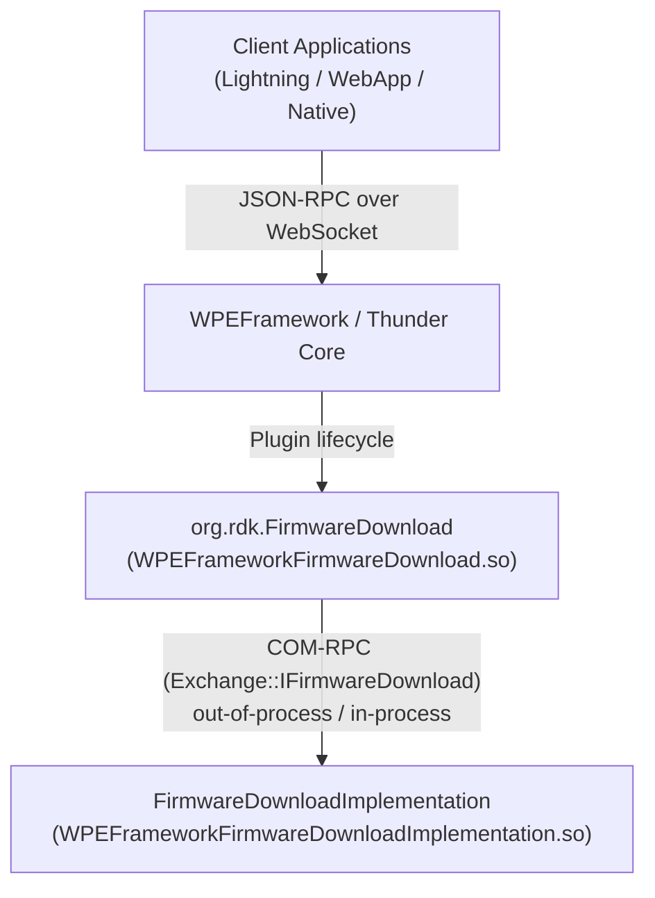
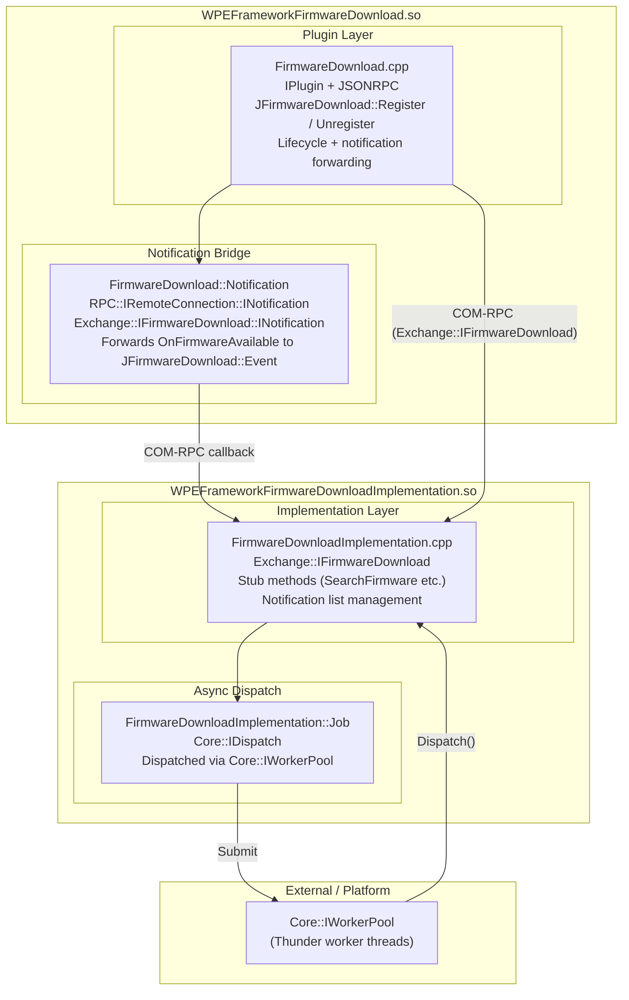
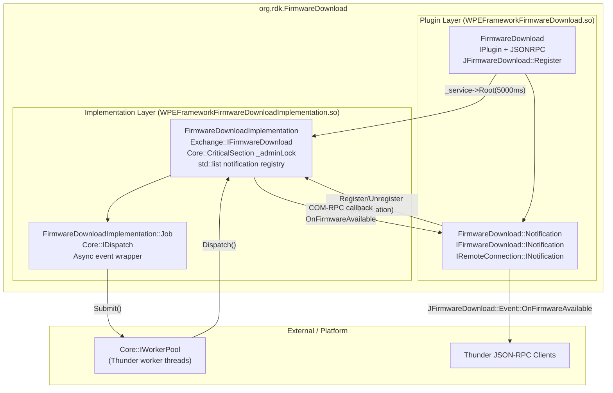
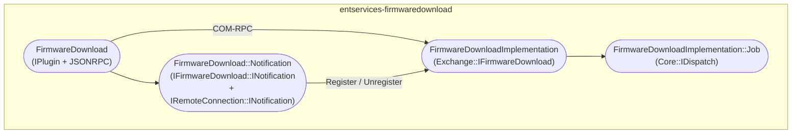
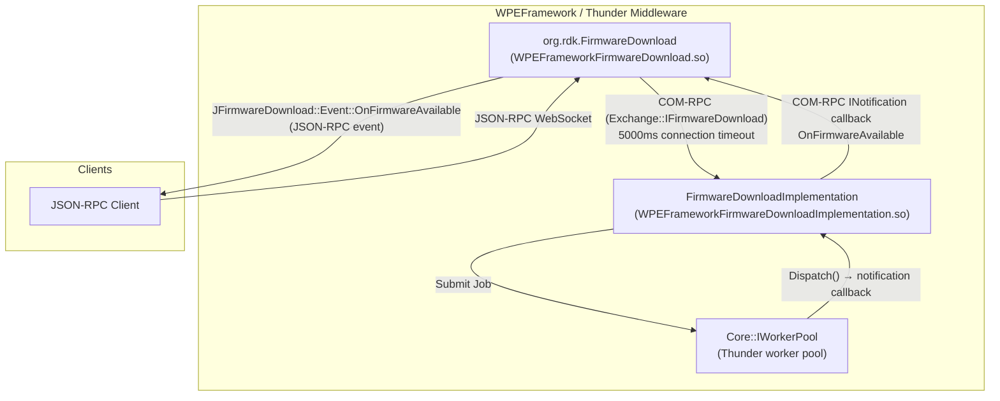
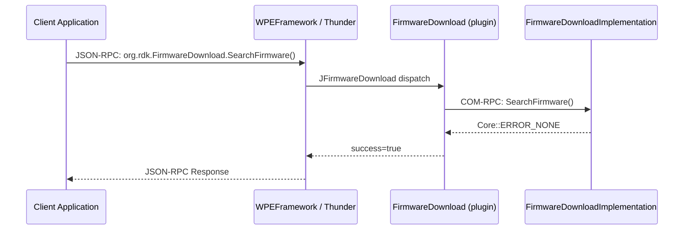
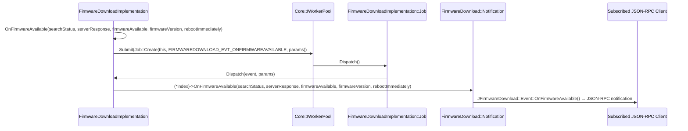
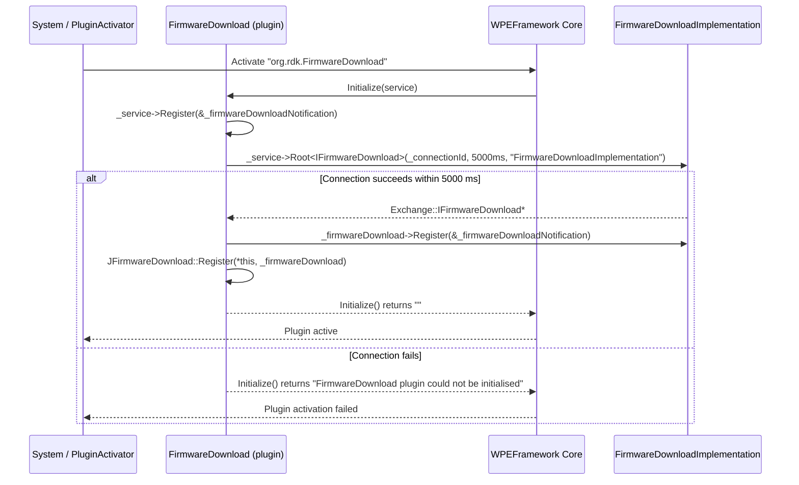

# Entservices-FirmwareDownload

---

## Overview

`entservices-firmwaredownload` is a WPEFramework (Thunder) plugin that exposes JSON-RPC APIs for firmware update operations on RDK-E devices. It is registered under the callsign `org.rdk.FirmwareDownload` and provides methods for initiating a firmware availability search, querying download state and progress, retrieving downloaded firmware information, and receiving event notifications when firmware availability results are ready.

At the product level, the plugin provides a structured Thunder interface for firmware update workflows: applications can trigger a firmware search, poll for download state and failure reasons, and subscribe to the `OnFirmwareAvailable` event to be notified of results asynchronously.

At the module level, the plugin follows the standard WPEFramework two-library out-of-process pattern. The plugin library (`WPEFrameworkFirmwareDownload.so`) handles JSON-RPC dispatch, client notification forwarding, and plugin lifecycle management. The implementation library (`WPEFrameworkFirmwareDownloadImplementation.so`) hosts the `Exchange::IFirmwareDownload` business logic and runs in a separate process (or in-process, depending on the `PLUGIN_FIRMWAREDOWNLOAD_MODE` build configuration). JSON-RPC method registration is handled via the auto-generated `Exchange::JFirmwareDownload` adapter.

> **Note on implementation state**: All five interface methods in `FirmwareDownloadImplementation.cpp` (`GetDownloadedFirmwareInfo`, `GetFirmwareDownloadPercent`, `SearchFirmware`, `GetDownloadState`, `GetDownloadFailureReason`) currently return `Core::ERROR_NONE` with no platform-specific logic. They are stubs.



**Key Features & Responsibilities:**

- **Firmware availability search**: Exposes `SearchFirmware()` to initiate a firmware availability check. The result is delivered asynchronously via the `OnFirmwareAvailable` event notification.
- **Download state and progress queries**: Exposes `GetDownloadState()`, `GetFirmwareDownloadPercent()`, and `GetDownloadFailureReason()` for callers to poll download status after initiating a search.
- **Downloaded firmware information**: Exposes `GetDownloadedFirmwareInfo()` to retrieve current firmware version, downloaded firmware version, download location, and deferred reboot status.
- **Asynchronous event notification**: Fires `OnFirmwareAvailable` to all registered JSON-RPC subscribers using Thunder's `Core::IWorkerPool` for non-blocking dispatch from the implementation layer.
- **Out-of-process hosting**: The implementation library is loaded via `_service->Root<Exchange::IFirmwareDownload>()` with a 5000 ms connection timeout, supporting out-of-process isolation when `PLUGIN_FIRMWAREDOWNLOAD_MODE` is set accordingly. If the out-of-process connection drops, the plugin self-deactivates via `PluginHost::IShell::DEACTIVATED`.

---

## Architecture

### High-Level Architecture

`entservices-firmwaredownload` uses the standard WPEFramework two-library out-of-process plugin pattern. The plugin library (`WPEFrameworkFirmwareDownload.so`) contains the `FirmwareDownload` class, which implements `IPlugin` and `JSONRPC`. At initialization, this plugin instantiates the implementation via `_service->Root<Exchange::IFirmwareDownload>(_connectionId, 5000, _T("FirmwareDownloadImplementation"))`, which either loads `WPEFrameworkFirmwareDownloadImplementation.so` in a separate host process or in-process depending on the configured `mode`. The two libraries communicate over COM-RPC using the `Exchange::IFirmwareDownload` interface.

JSON-RPC method and event registration is handled by the auto-generated `Exchange::JFirmwareDownload` adapter (`JFirmwareDownload.h`). Calling `Exchange::JFirmwareDownload::Register(*this, _firmwareDownload)` in `Initialize()` binds the interface implementation to the plugin's JSONRPC dispatcher so that incoming JSON-RPC calls are forwarded to the implementation and events from the implementation are forwarded to subscribed JSON-RPC clients.

Northbound, all client access is through Thunder's JSON-RPC WebSocket endpoint. No COM-RPC northbound interface or HTTP endpoint is exposed.

Southbound, the plugin makes no Device Services (DS) HAL calls, no IARM Bus calls, and no persistent store reads or writes. The implementation stubs return `Core::ERROR_NONE` without calling any platform APIs. Platform-specific firmware download logic is expected to be layered below the stub methods in a device-specific integration.

No configuration files are read at runtime by the plugin. No filesystem paths are opened or parsed in either `FirmwareDownload.cpp` or `FirmwareDownloadImplementation.cpp`.



### Threading Model

- **Threading Architecture**: Multi-threaded (plugin thread + Thunder worker pool).
- **Main Thread (Thunder JSON-RPC / COM-RPC thread)**: Handles all JSON-RPC method dispatch routed through `Exchange::JFirmwareDownload` and all plugin lifecycle calls (`Initialize`, `Deinitialize`). Also handles `RPC::IRemoteConnection::INotification` callbacks (`Activated`, `Deactivated`).
- **Worker Pool (`Core::IWorkerPool`)**: Used by `FirmwareDownloadImplementation` to dispatch event notifications asynchronously. When `OnFirmwareAvailable()` is called (from any context), it creates a `Job` object and submits it to `Core::IWorkerPool::Instance().Submit(...)`. The worker pool picks up the job and calls `Dispatch(event, params)` on the implementation, which then iterates the notification list and calls `(*index)->OnFirmwareAvailable(...)` on each registered `INotification`.
- **Synchronization**: `Core::CriticalSection _adminLock` in `FirmwareDownloadImplementation` protects the `_firmwareDownloadNotification` list for all `Register`, `Unregister`, and `Dispatch` calls. Reference counting (`AddRef`/`Release`) is used to manage notification object lifetimes.
- **Async / Event Dispatch**: `OnFirmwareAvailable()` → `dispatchEvent()` → `Core::IWorkerPool::Submit(Job)` → `Job::Dispatch()` → `FirmwareDownloadImplementation::Dispatch()` → per-notification `OnFirmwareAvailable()` callback → `Exchange::JFirmwareDownload::Event::OnFirmwareAvailable()` → Thunder sends JSON-RPC notification to all subscribed clients.

---

## Design

`entservices-firmwaredownload` separates JSON-RPC dispatch from business logic using the WPEFramework two-library out-of-process plugin pattern. The `FirmwareDownload` plugin class contains no firmware logic; it only manages the connection to the implementation, registers/unregisters the notification bridge, and delegates all method calls through the `Exchange::IFirmwareDownload` COM-RPC interface.

The `Exchange::JFirmwareDownload` adapter (auto-generated from the interface definition) handles JSON-RPC method binding. `Register(*this, _firmwareDownload)` wires the JSONRPC dispatcher to the `IFirmwareDownload` instance, and `Unregister(*this)` tears it down in `Deinitialize()`. Event forwarding follows the same path: the `Notification` inner class implements `IFirmwareDownload::INotification` so that events fired from the implementation (via the worker pool) traverse the COM-RPC boundary, arrive in the `Notification::OnFirmwareAvailable()` method, and are forwarded to `Exchange::JFirmwareDownload::Event::OnFirmwareAvailable()` which calls Thunder's `Notify()` to push the JSON-RPC event to subscribed clients.

The implementation loading uses a 5000 ms timeout (`_service->Root<>(_, 5000, _)`). If the implementation process fails to connect within that window, `Initialize()` returns an error string and the plugin is not made active. If the out-of-process connection drops at runtime, `Deactivated(connection)` is called on the `Notification` class, which submits a `PluginHost::IShell::DEACTIVATED` + `PluginHost::IShell::FAILURE` job to cause the plugin to be deactivated by Thunder.

There is no data persistence, no filesystem I/O, no IARM Bus registration, and no Device Services integration in the current source.

### Component Diagram



---

## Internal Modules

| Module / Class                        | Description                                                                                                                                                                                                                                                                                                                                                                                  | Key Files                                                                |
| ------------------------------------- | -------------------------------------------------------------------------------------------------------------------------------------------------------------------------------------------------------------------------------------------------------------------------------------------------------------------------------------------------------------------------------------------- | ------------------------------------------------------------------------ |
| `FirmwareDownload`                    | Main plugin class. Implements `IPlugin` and `JSONRPC`. Manages the out-of-process connection to `FirmwareDownloadImplementation`, registers/unregisters the `JFirmwareDownload` adapter, and handles out-of-process connection drop via `Deactivated()`.                                                                                                                                     | `FirmwareDownload.cpp`, `FirmwareDownload.h`                             |
| `FirmwareDownload::Notification`      | Inner class implementing both `Exchange::IFirmwareDownload::INotification` and `RPC::IRemoteConnection::INotification`. Receives `OnFirmwareAvailable` callbacks from the implementation and forwards them to `JFirmwareDownload::Event::OnFirmwareAvailable()`. Receives `Deactivated(connection)` from the RPC layer when the implementation process drops.                                | `FirmwareDownload.h`                                                     |
| `FirmwareDownloadImplementation`      | Implements `Exchange::IFirmwareDownload`. Maintains the notification subscriber list (`std::list<INotification*>`) protected by `Core::CriticalSection _adminLock`. All five interface methods are currently stubs returning `Core::ERROR_NONE`. Fires `OnFirmwareAvailable` by building a `JsonObject` and submitting a `Job` to `Core::IWorkerPool`. Static singleton pointer `_instance`. | `FirmwareDownloadImplementation.cpp`, `FirmwareDownloadImplementation.h` |
| `FirmwareDownloadImplementation::Job` | Implements `Core::IDispatch`. Created by `FirmwareDownloadImplementation::dispatchEvent()`, holds a reference to the implementation and a snapshot of the event params. `Dispatch()` calls `_firmwareDownloadImplementation->Dispatch(event, params)`, which iterates all registered notifications.                                                                                          | `FirmwareDownloadImplementation.h`                                       |



---

## Prerequisites & Dependencies

**Documentation Verification Checklist:**

- [x] **Thunder / WPEFramework APIs**: `IPlugin`, `JSONRPC`, `Exchange::IFirmwareDownload`, `Exchange::JFirmwareDownload`, `RPC::IRemoteConnection::INotification`, `Core::IWorkerPool`, `Core::CriticalSection`, `Core::ProxyType` — all confirmed present and used in source.
- [x] **IARM Bus**: No `IARM_Bus_RegisterEventHandler` or `IARM_Bus_Call` calls found in any source file. Not implemented.
- [x] **Device Services (DS) APIs**: No DS API calls found in any source file. Not implemented.
- [x] **Persistent store**: No persistent store reads or writes found. Not implemented.
- [x] **Systemd services**: No systemd service files found in the repository.
- [x] **Configuration files**: No configuration files are opened or parsed at runtime by either `FirmwareDownload.cpp` or `FirmwareDownloadImplementation.cpp`.
- [x] **Implementation stubs**: All five `IFirmwareDownload` interface methods in `FirmwareDownloadImplementation.cpp` return `Core::ERROR_NONE` with no platform logic.

### RDK-E Platform Requirements

- **WPEFramework Version**: Compatible with WPEFramework/Thunder R4 and pre-R4 (guarded by `USE_THUNDER_R4` compile flag in `FirmwareDownloadImplementation::Job::Create()` for `Core::IDispatch` vs. `Core::ProxyType<Core::IDispatch>`).
- **Build Dependencies**: `WPEFrameworkPlugins` (`${NAMESPACE}Plugins`), `WPEFrameworkDefinitions` (`${NAMESPACE}Definitions`), `CompileSettingsDebug`. Exchange interface headers (`<interfaces/IFirmwareDownload.h>`, `<interfaces/json/JFirmwareDownload.h>`, `<interfaces/json/JsonData_FirmwareDownload.h>`) from the Thunder Definitions package. CXX standard: C++11.
- **RDK-E Plugin Dependencies**: None. `FirmwareDownload` does not connect to any other Thunder plugin at runtime.
- **Device Services / HAL**: No Device Services or HAL integration implemented.
- **IARM Bus**: Not used.
- **Systemd Services**: No systemd service ordering found in the repository.
- **Configuration Files**: None read at runtime.
- **Startup Order**: Configurable via `PLUGIN_FIRMWAREDOWNLOAD_STARTUPORDER` build variable.
- **Preconditions**: `["Platform"]` subsystem declared in `FirmwareDownload.conf.in`; plugin metadata in `FirmwareDownload.cpp` declares `{}` (empty).
- **Autostart**: `"false"` (default).
- **Plugin mode**: Configured via `PLUGIN_FIRMWAREDOWNLOAD_MODE` build variable. The `conf.in` sets the `root.mode` and `root.locator` fields, determining whether the implementation runs in-process or out-of-process.

---

## Quick Start

### 1. Connect via ThunderJS

```js
import ThunderJS from "thunderjs";
const thunderJS = ThunderJS({ host: "127.0.0.1" });
```

### 2. Subscribe to firmware availability event

```js
thunderJS.on("org.rdk.FirmwareDownload", "OnFirmwareAvailable", (event) => {
  console.log("Firmware search result:", event);
});
```

### 3. Initiate a firmware search

```js
thunderJS["org.rdk.FirmwareDownload"]
  .SearchFirmware()
  .then((result) => console.log(result))
  .catch((err) => console.error(err));
```

### 4. Query download state

```js
thunderJS["org.rdk.FirmwareDownload"]
  .GetDownloadState()
  .then((result) => console.log("State:", result))
  .catch((err) => console.error(err));
```

---

## Configuration

### Key Configuration Files

| Configuration File                                                  | Purpose                                                                           | Override Mechanism                |
| ------------------------------------------------------------------- | --------------------------------------------------------------------------------- | --------------------------------- |
| `FirmwareDownload.conf` (generated from `FirmwareDownload.conf.in`) | Callsign, precondition, autostart, startup order, implementation mode and locator | Set build variables at CMake time |

### Configuration Parameters

| Parameter      | Type   | Default                                            | Description                                                                 |
| -------------- | ------ | -------------------------------------------------- | --------------------------------------------------------------------------- |
| `callsign`     | string | `org.rdk.FirmwareDownload`                         | Thunder callsign for this plugin                                            |
| `precondition` | string | `Platform`                                         | Thunder subsystem that must be active before activation (from `conf.in`)    |
| `autostart`    | bool   | `false`                                            | Plugin does not activate automatically on Thunder start                     |
| `startuporder` | string | (empty)                                            | Numeric startup order (`PLUGIN_FIRMWAREDOWNLOAD_STARTUPORDER`)              |
| `root.mode`    | string | `PLUGIN_FIRMWAREDOWNLOAD_MODE`                     | Controls in-process or out-of-process hosting of the implementation library |
| `root.locator` | string | `libWPEFrameworkFirmwareDownloadImplementation.so` | Path to the implementation shared library                                   |

### Configuration Persistence

No runtime configuration parameters are persisted by this plugin. Configuration changes are not persisted across reboots.

---

## API / Usage

### Interface Type

JSON-RPC over Thunder WebSocket. Plugin API version: 1.0.0 (Major=1, Minor=0, Patch=0). All methods and the one event are registered automatically via `Exchange::JFirmwareDownload::Register(*this, _firmwareDownload)` in `Initialize()`.

All methods are accessed under callsign `org.rdk.FirmwareDownload`.

---

### Methods

#### `SearchFirmware`

Initiates a firmware availability search. The result is delivered asynchronously via the `OnFirmwareAvailable` event. The implementation stub currently returns `Core::ERROR_NONE` with no platform-specific action.

**Parameters**: None

**Response**

```json
{
  "success": true
}
```

**Example**

```js
thunderJS["org.rdk.FirmwareDownload"]
  .SearchFirmware()
  .then((result) => console.log(result))
  .catch((err) => console.error(err));
```

---

#### `GetDownloadedFirmwareInfo`

Returns information about the current firmware version, the downloaded firmware version, the download location, and whether a reboot has been deferred. The implementation stub currently returns `Core::ERROR_NONE` with empty values.

**Parameters**: None

**Response**

```json
{
  "currentFWVersion": "",
  "downloadedFWVersion": "",
  "downloadedFWLocation": "",
  "isRebootDeferred": false,
  "success": true
}
```

**Example**

```js
thunderJS["org.rdk.FirmwareDownload"]
  .GetDownloadedFirmwareInfo()
  .then((result) => console.log(result))
  .catch((err) => console.error(err));
```

---

#### `GetFirmwareDownloadPercent`

Returns the current download progress as a percentage. The implementation stub currently returns `Core::ERROR_NONE` with a zero/default value.

**Parameters**: None

**Response**

```json
{
  "firmwareDownloadPercent": 0,
  "success": true
}
```

**Example**

```js
thunderJS["org.rdk.FirmwareDownload"]
  .GetFirmwareDownloadPercent()
  .then((result) => console.log(result))
  .catch((err) => console.error(err));
```

---

#### `GetDownloadState`

Returns the current firmware download state. The implementation stub currently returns `Core::ERROR_NONE` with a zero/default value.

**Parameters**: None

**Response**

```json
{
  "downloadState": 0,
  "success": true
}
```

**Example**

```js
thunderJS["org.rdk.FirmwareDownload"]
  .GetDownloadState()
  .then((result) => console.log(result))
  .catch((err) => console.error(err));
```

---

#### `GetDownloadFailureReason`

Returns the reason for the last download failure. The implementation stub currently returns `Core::ERROR_NONE` with a zero/default value.

**Parameters**: None

**Response**

```json
{
  "downloadFailureReason": 0,
  "success": true
}
```

**Example**

```js
thunderJS["org.rdk.FirmwareDownload"]
  .GetDownloadFailureReason()
  .then((result) => console.log(result))
  .catch((err) => console.error(err));
```

---

### Events / Notifications

| Event                 | Trigger                                                                                                                                                                                                                  | Payload Fields                                                                                                                      |
| --------------------- | ------------------------------------------------------------------------------------------------------------------------------------------------------------------------------------------------------------------------ | ----------------------------------------------------------------------------------------------------------------------------------- |
| `OnFirmwareAvailable` | Called by `FirmwareDownloadImplementation::OnFirmwareAvailable()`, dispatched asynchronously via `Core::IWorkerPool`. Forwarded through the `Notification` bridge and `JFirmwareDownload::Event::OnFirmwareAvailable()`. | `searchStatus` (int), `serverResponse` (string), `firmwareAvailable` (bool), `firmwareVersion` (string), `rebootImmediately` (bool) |

**Example subscription:**

```js
thunderJS.on("org.rdk.FirmwareDownload", "OnFirmwareAvailable", (event) => {
  console.log("searchStatus:", event.searchStatus);
  console.log("firmwareAvailable:", event.firmwareAvailable);
  console.log("firmwareVersion:", event.firmwareVersion);
  console.log("rebootImmediately:", event.rebootImmediately);
  console.log("serverResponse:", event.serverResponse);
});
```

---

## Component Interactions



### Interaction Matrix

| Target Component / Layer      | Interaction Purpose                                                      | Key APIs                                                                                                                                           |
| ----------------------------- | ------------------------------------------------------------------------ | -------------------------------------------------------------------------------------------------------------------------------------------------- |
| **Thunder / WPEFramework**    |                                                                          |                                                                                                                                                    |
| `Core::IWorkerPool`           | Asynchronous event dispatch from implementation to notification list     | `Core::IWorkerPool::Instance().Submit(Job::Create(...))`                                                                                           |
| `PluginHost::IShell`          | Root implementation loading; plugin self-deactivation on connection drop | `_service->Root<Exchange::IFirmwareDownload>(_connectionId, 5000, ...)`, `PluginHost::IShell::Job::Create(service, DEACTIVATED, FAILURE)`          |
| `Exchange::JFirmwareDownload` | JSON-RPC method and event wiring                                         | `JFirmwareDownload::Register(*this, _firmwareDownload)`, `JFirmwareDownload::Unregister(*this)`, `JFirmwareDownload::Event::OnFirmwareAvailable()` |
| `RPC::IRemoteConnection`      | Out-of-process connection lifecycle                                      | `_service->RemoteConnection(_connectionId)`, `connection->Terminate()`, `connection->Release()`                                                    |
| **Other RDK-E Plugins**       | None                                                                     | —                                                                                                                                                  |
| **Device Services / HAL**     | None                                                                     | —                                                                                                                                                  |
| **IARM Bus**                  | None                                                                     | —                                                                                                                                                  |
| **Persistent Store**          | None                                                                     | —                                                                                                                                                  |

### IPC Flow Patterns

**JSON-RPC Method Call (e.g., `SearchFirmware`):**



**Event Notification Flow (`OnFirmwareAvailable`):**



---

## Component State Flow

### Initialization to Active State



### Runtime State Changes

**Out-of-process connection drop:**
If the `FirmwareDownloadImplementation` host process exits, Thunder calls `FirmwareDownload::Notification::Deactivated(connection)`. The handler checks if `connection->Id() == _connectionId` and submits `PluginHost::IShell::Job::Create(_service, DEACTIVATED, FAILURE)` to the worker pool, causing Thunder to deactivate the plugin.

**Plugin deactivation (normal):**
`Deinitialize(service)`: unregisters the `_firmwareDownloadNotification` from `_service`, unregisters from `_firmwareDownload`, calls `JFirmwareDownload::Unregister(*this)`, releases `_firmwareDownload`, terminates the remote connection if out-of-process, releases `_service`.

---

## Implementation Details

### HAL / DS API Integration

No Device Services or HAL API calls are present in `FirmwareDownload.cpp` or `FirmwareDownloadImplementation.cpp`.

### Key Implementation Logic

- **Out-of-process instantiation**: `_service->Root<Exchange::IFirmwareDownload>(_connectionId, 5000, _T("FirmwareDownloadImplementation"))` in `Initialize()` instantiates the implementation. The 5000 ms parameter is the connection timeout. On success, `_connectionId` holds the IPC connection ID used for lifecycle tracking.
- **Notification registration**: `_firmwareDownload->Register(&_firmwareDownloadNotification)` registers the plugin-side `Notification` object as an observer on the implementation. The implementation stores it in `_firmwareDownloadNotification` (a `std::list<INotification*>`), protected by `_adminLock`. Duplicate registrations are detected and rejected with `LOGERR`.
- **Event dispatch**: `OnFirmwareAvailable()` builds a `JsonObject` with five fields (`searchStatus`, `serverResponse`, `firmwareAvailable`, `firmwareVersion`, `rebootImmediately`) and calls `dispatchEvent(FIRMWAREDOWNLOAD_EVT_ONFIRMWAREAVAILABLE, params)`, which submits a `Job` to `Core::IWorkerPool`. The `Job::Dispatch()` calls `FirmwareDownloadImplementation::Dispatch()`, which locks `_adminLock` and iterates the notification list.
- **Implementation stubs**: `SearchFirmware()`, `GetDownloadedFirmwareInfo()`, `GetFirmwareDownloadPercent()`, `GetDownloadState()`, `GetDownloadFailureReason()` all return `Core::ERROR_NONE` immediately with no platform operations.
- **Error handling**: `Initialize()` logs startup failure with `SYSLOG(Logging::Startup, ...)` and returns the error string. `Deinitialize()` catches `std::exception` from `connection->Terminate()` and logs via `LOGWARN`. Implementation `Unregister()` returns `Core::ERROR_GENERAL` if the notification is not found.
- **Singleton**: `FirmwareDownloadImplementation::_instance` is a static pointer set in the constructor and cleared in the destructor. It is declared in the implementation but there are no confirmed call sites in the source using it.
- **Logging**: `LOGINFO`, `LOGWARN`, `LOGERR` macros from `UtilsLogging.h` write to `stderr` with thread ID (`syscall(SYS_gettid)`), filename (via `WPEFramework::Core::FileNameOnly`), line number, and function name. `SYSLOG(Logging::Startup, ...)` and `SYSLOG(Logging::Shutdown, ...)` are used for plugin lifecycle messages.

---

## Data Flow

**Typical firmware availability query:**

```
JSON-RPC Client: org.rdk.FirmwareDownload.SearchFirmware()
        |
        v
Thunder: JFirmwareDownload dispatch → FirmwareDownload plugin (in-process)
        |
        v
COM-RPC: Exchange::IFirmwareDownload::SearchFirmware()
        |
        v
FirmwareDownloadImplementation::SearchFirmware()
→ returns Core::ERROR_NONE (stub)
        |
        v
JSON-RPC response: { "success": true }
```

**Asynchronous event delivery:**

```
FirmwareDownloadImplementation::OnFirmwareAvailable(searchStatus, serverResponse, firmwareAvailable, firmwareVersion, rebootImmediately)
        |
        v
dispatchEvent() → Core::IWorkerPool::Submit(Job::Create(...))
        |
        v
[Worker pool thread] Job::Dispatch() → FirmwareDownloadImplementation::Dispatch(event, params)
        |  [_adminLock held]
        v
(*index)->OnFirmwareAvailable(...) → FirmwareDownload::Notification::OnFirmwareAvailable()
        |
        v
JFirmwareDownload::Event::OnFirmwareAvailable(_parent, ...) → Thunder Notify()
        |
        v
All subscribed JSON-RPC clients receive: OnFirmwareAvailable event
```

---

## Error Handling

### Layered Error Handling

| Layer                                                 | Error Type                                | Handling Strategy                                                                                               |
| ----------------------------------------------------- | ----------------------------------------- | --------------------------------------------------------------------------------------------------------------- |
| Plugin (`FirmwareDownload.cpp`)                       | Implementation connection failure         | `Initialize()` logs with `SYSLOG` and returns error string `"FirmwareDownload plugin could not be initialised"` |
| Plugin (`FirmwareDownload.cpp`)                       | Out-of-process connection drop            | `Deactivated()` submits `PluginHost::IShell::DEACTIVATED + FAILURE` job to self-deactivate                      |
| Plugin (`FirmwareDownload.cpp`)                       | `connection->Terminate()` exception       | Caught as `std::exception`, logged with `LOGWARN`                                                               |
| Implementation (`FirmwareDownloadImplementation.cpp`) | Duplicate notification registration       | Detected and logged with `LOGERR`; not added again                                                              |
| Implementation (`FirmwareDownloadImplementation.cpp`) | Unregister for unknown notification       | Returns `Core::ERROR_GENERAL`, logged with `LOGERR`                                                             |
| Implementation (`FirmwareDownloadImplementation.cpp`) | Unhandled event type in `Dispatch()`      | Logged with `LOGWARN("Event[%u] not handled", event)`                                                           |
| Implementation methods                                | All `IFirmwareDownload` interface methods | Return `Core::ERROR_NONE` (stubs; no platform error mapping)                                                    |

---

## Testing

### Test Coverage

No test directories or test source files were found in the repository.

| Level            | Scope               | Location |
| ---------------- | ------------------- | -------- |
| L1 – Unit        | No test files found | —        |
| L2 – Integration | No test files found | —        |
