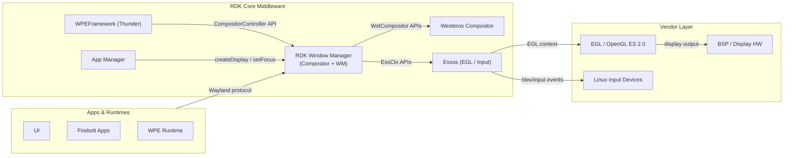
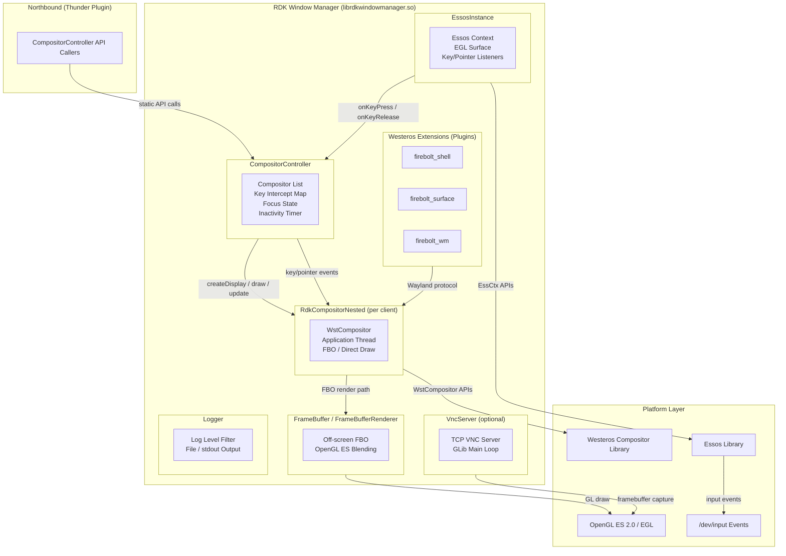
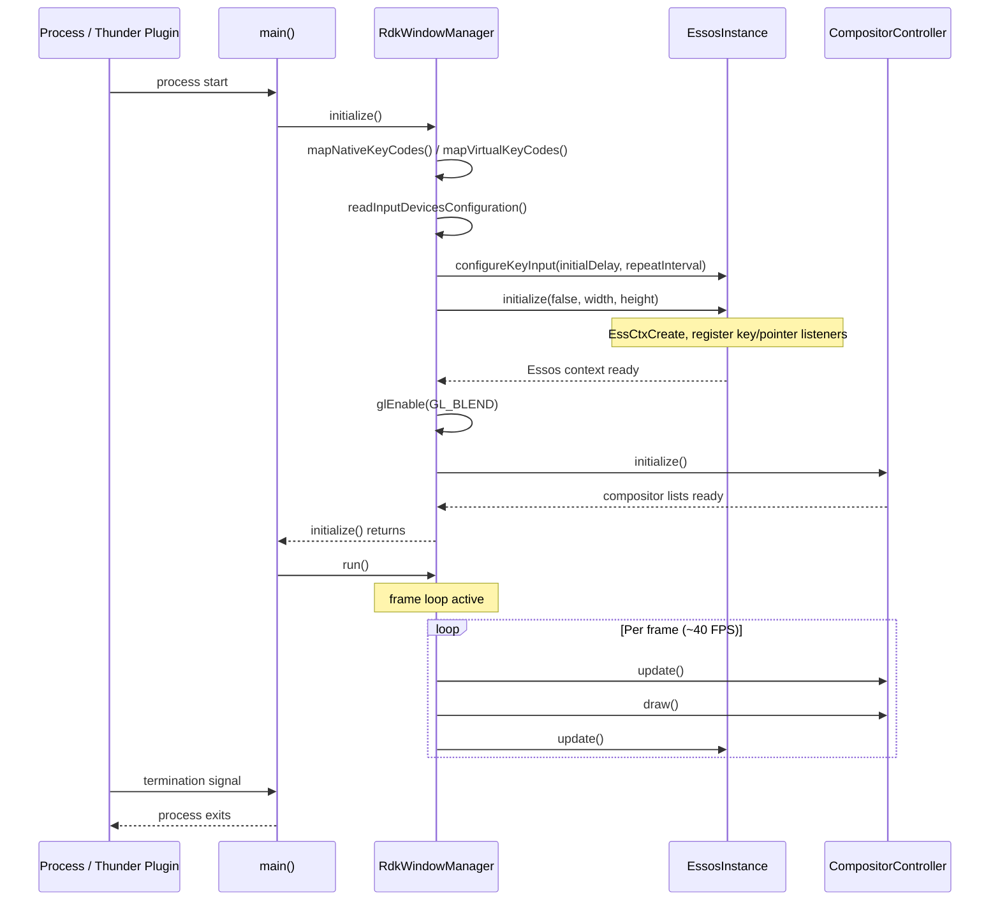
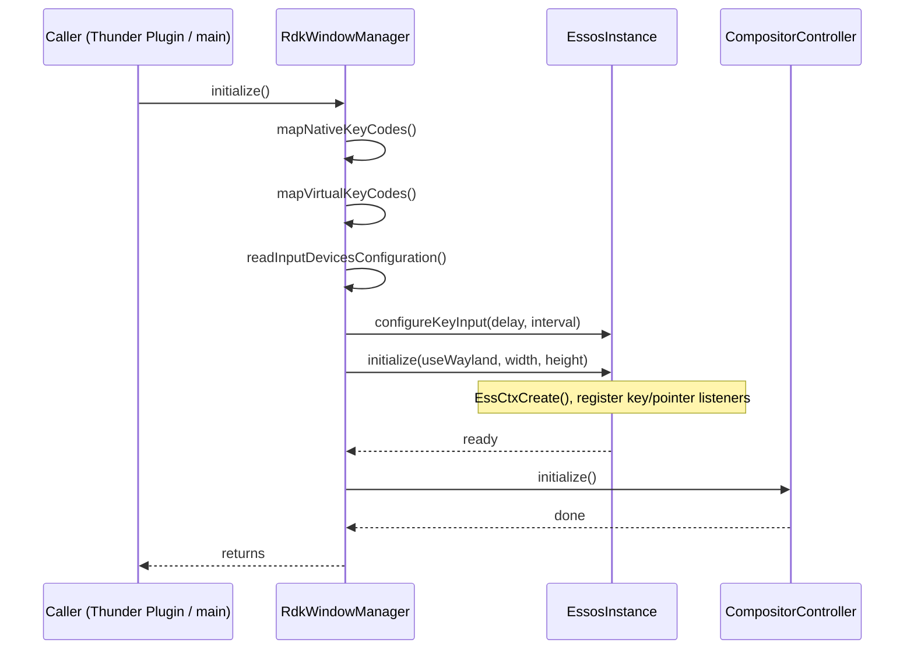
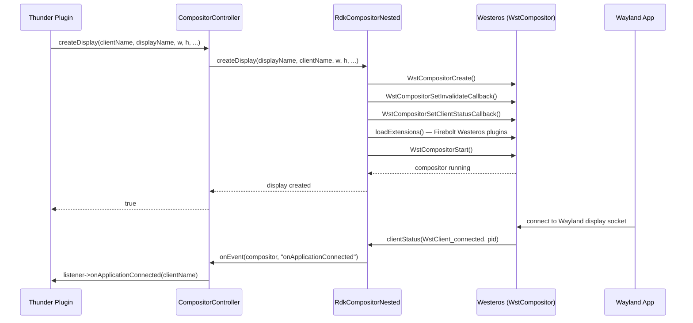
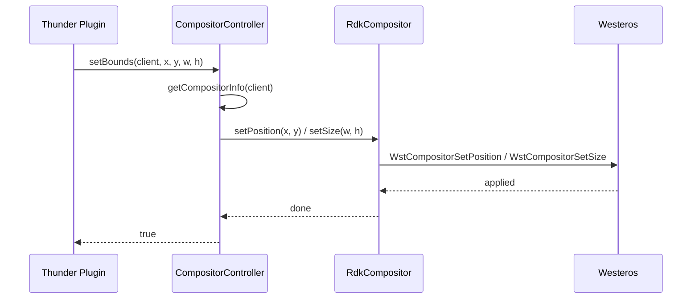
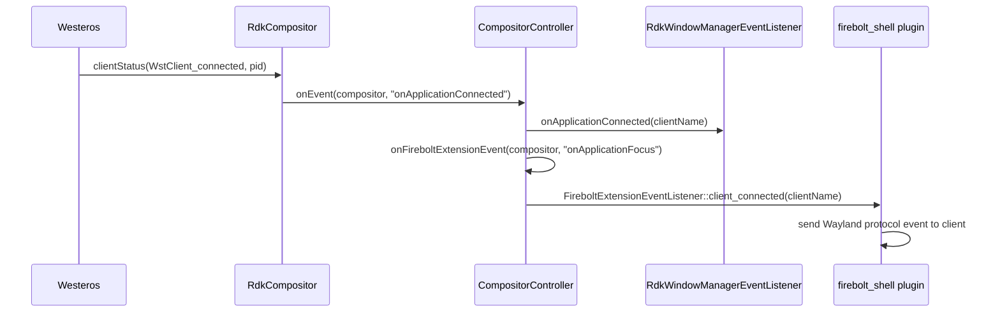

# RDK Window Manager

RDK Window Manager (`rdkwindowmanager`) is the compositing and window management component in the RDK middleware stack. It creates and manages Wayland display surfaces for client applications, composites application windows onto the screen using OpenGL ES 2.0, and routes all keyboard and pointer input events to the correct application. The component is built as a shared library (`librdkwindowmanager.so`) that exposes a `CompositorController` API surface, and optionally as a standalone process entrypoint that embeds that library.

**As a device-level service**, RDK Window Manager gives every connected Wayland client its own isolated display surface, enforces z-order layering and visibility rules, delivers focus-based and intercepted key events, and emits lifecycle notifications (connect, disconnect, first-frame, focus, blur) to registered listeners. Applications are identified by a display name and may be assigned virtual resolutions, cropped viewports, opacity levels, and scaled bounds independently of one another.

**At the module level**, the component is organised around a `CompositorController` singleton that owns a list of active `RdkCompositor` objects (one per client display). The `EssosInstance` singleton wraps the Essos EGL and input context; all key and pointer events enter through Essos callbacks and are forwarded to `CompositorController` for routing. Firebolt protocol extensions — `firebolt_shell`, `firebolt_surface`, and `firebolt_wm` — are loadable Westeros plugins that extend the Wayland protocol surface available to Firebolt-capable clients.



**Key Features & Responsibilities:**

- **Multi-client Wayland compositing**: Creates an independent nested Westeros compositor for each application that connects, allowing simultaneous on-screen display of multiple Wayland clients with independent z-order, bounds, opacity, crop, and scale.
- **Input routing and key interception**: Dispatches keyboard and pointer events from Essos to the focused compositor by default, with a priority-based key intercept and key listener layer that can redirect or duplicate specific key codes to non-focused clients.
- **Focus and z-order management**: Maintains an ordered compositor list and a separate topmost compositor list; `setFocus`, `moveToFront`, `moveToBack`, and `moveBehind` operations update both lists atomically.
- **Firebolt protocol extensions**: Loads `firebolt_shell`, `firebolt_surface`, and `firebolt_wm` as Westeros plugins, extending the Wayland protocol to support typed surface creation (standard, video, popup, notification) and focus event delivery.
- **Framebuffer-based off-screen rendering**: Supports FBO (framebuffer object) composition paths via `FrameBuffer` and `FrameBufferRenderer`, enabling per-compositor render-to-texture and subsequent blending onto the screen.
- **Software cursor overlay**: Renders a configurable software cursor image (JPEG, PNG, or BMP) at the pointer position using the OpenGL ES rendering pipeline, with automatic hide after an inactivity period.
- **VNC server (optional)**: When enabled at build time, starts a TCP-based VNC server (`VncServer`) backed by `libsoup` and GLib that captures framebuffer content and streams it to remote VNC clients.
- **Application lifecycle events**: Notifies registered `RdkWindowManagerEventListener` instances of connect, disconnect, terminate, first-frame, visibility change, focus, and blur events originating from Westeros client status callbacks.
- **Inactivity reporting**: Tracks the elapsed time since the last key event and fires `onUserInactive` notifications at a configurable interval when no input is received.

---

## Design

RDK Window Manager follows a single-process, render-loop architecture where all compositing, input dispatch, and state mutations occur on one main thread. This removes the need for cross-thread locking on the compositor list and simplifies the event delivery model. The `CompositorController` is a stateless collection of static methods that operate on module-level global state, keeping the internal data structures (compositor list, key intercept map, focused compositor record) centralised. The `EssosInstance` singleton acts as the boundary between the platform EGL/input layer and the compositing logic: all Essos callbacks convert raw Wayland key codes into mapped RDK key codes and immediately invoke `CompositorController::onKeyPress` / `onKeyRelease`.

Northbound interaction is provided through the `CompositorController` API, which is exposed via `librdkwindowmanager.so`. A Thunder plugin in a separate component calls into this API to service JSON-RPC requests from application managers and test clients. Southbound interaction is through Westeros compositor APIs (`WstCompositor*`) for display management and through Essos APIs (`EssCtx*`) for EGL surface and input context management.

IPC within the compositing layer uses the Wayland protocol exclusively. Each client application communicates with the RDK Window Manager through a Wayland socket, using either the standard Wayland interfaces or the custom Firebolt Wayland protocol extensions provided by the Westeros plugins. The northbound interface is the in-process `librdkwindowmanager.so` shared library API, consumed directly by the Thunder plugin wrapper.

Configuration is runtime-driven through environment variables. The splash screen state is communicated via a sentinel file (`/tmp/.rdkwindowmanagersplash`) and the display resolution override via `/tmp/rdkwindowmanager720`, both read once at initialization.



### Threading Model

- **Threading Architecture**: Multi-threaded. The main render loop and all compositing operations execute on the main thread; individual application processes run in detached background threads.
- **Main Thread**: Drives the render loop at the configured frame rate (default 40 FPS). Calls `CompositorController::update()` and `CompositorController::draw()` each frame, then calls `EssosInstance::update()` to pump the Essos/Wayland dispatch loop. All key and pointer event callbacks from Essos execute synchronously on this thread.
- **Worker Threads**:
  - _Application launch thread_ (`launchApplicationInBackground`): Started per client compositor to launch the Wayland client process without blocking the render loop. The thread terminates once the application process exits.
  - _VNC GLib main loop thread_ (`VncServer::mainLoopThread`): Runs the GLib `GMainLoop` for the VNC TCP server when VNC support is compiled in.
- **Synchronization**: A `std::mutex` (`gFireboltExtensionListenerMapMutex`) protects the Firebolt extension listener map accessed by the Westeros plugin callbacks. `RdkCompositor` uses `mInputLock` and `mStateChangeLock` mutexes to protect listener registration from concurrent access. `FireboltShell::mContextLock` protects the client list map in the Westeros plugin context.
- **Async / Event Dispatch**: Westeros client status callbacks (`WstClient_connected`, `WstClient_disconnected`, `WstClient_firstFrame`, etc.) are delivered synchronously on the Westeros compositor dispatch thread, which is then marshalled into `CompositorController::onEvent()`. Registered `RdkWindowManagerEventListener` instances are called directly within that callback path.

### RDK-V Platform and Integration Requirements

- **Build Dependencies**: `westeros`, `wayland-client`, `wayland-server`, `essos`, `EGL`, `GLESv2`, `rapidjson`, `jpeg`, `libpng`. For VNC server builds: `libsoup-2.4`, `boost`, `libsyswrapper`, `glib-2.0` (`gobject`, `gio`, `gio-unix`).
- **Westeros Plugins**: Firebolt extensions (`libwstplugin_rdkwmfireboltshell.so`, `libwstplugin_rdkwmfireboltsurface.so`, `libwstplugin_rdkwmfireboltwm.so`) must be installed under `/usr/lib/plugins/westeros/` (configurable via `RDK_WINDOW_MANAGER_WESTEROS_PLUGIN_DIRECTORY` at build time).
- **Configuration Files**: An optional input device configuration JSON file, whose path is supplied via the `RDK_WINDOW_MANAGER_INPUT_DEVICES_CONFIG` environment variable. The file maps device vendor/product/path to device type and mode values.
- **Startup Order**: The Essos EGL context must be available (display hardware and EGL stack ready) before `EssosInstance::initialize()` is called. Westeros compositor libraries must be present on the filesystem for `WstCompositorCreate()` to succeed.

---

### Component State Flow

#### Initialization to Active State

The component transitions through the following states during its lifecycle: **Initializing** (set up logging, map key codes, read input device configuration, configure Essos key repeat parameters) → **DisplaySetup** (initialise Essos EGL context at the configured resolution, enable GL blending) → **CompositorReady** (call `CompositorController::initialize()` to prepare the compositor lists) → **Active** (enter the frame render loop, processing input events and servicing API calls each frame) → **Shutdown** (exit the render loop on process termination; `deinitialize()` is a no-op stub).



#### Runtime State Changes

**State Change Triggers:**

- When a Wayland client connects to a display created by `CompositorController::createDisplay()`, Westeros fires `WstClient_connected`, which maps to an `onApplicationConnected` event delivered to all registered listeners. The compositor is added to the active list and begins participating in draw calls.
- When a client disconnects or terminates, `WstClient_disconnected` / `WstClient_stoppedNormal` / `WstClient_stoppedAbnormal` fires and `onApplicationDisconnected` / `onApplicationTerminated` is emitted. The compositor entry remains in the deleted list until the next update cycle cleans it up.
- `WstClient_firstFrame` triggers `onApplicationFirstFrame` / `onReady`, marking the compositor's `mFirstFrameRendered` flag.

**Context Switching Scenarios:**

- **Focus change via `setFocus()`**: Updates `gFocusedCompositor`; the previously focused compositor receives a blur event and the new one receives a focus event via `onFireboltExtensionEvent`.
- **Display resolution change**: `EssosInstance::onDisplaySizeChanged()` receives the new dimensions from Essos and updates the internal resolution state; subsequent draw calls use the new viewport.
- **Key input inhibition via `ignoreKeyInputs(true)`**: Sets `gIgnoreKeyInputEnabled`; all subsequent key events from Essos are dropped before reaching the compositor list.

---

### Call Flows

#### Initialization Call Flow



#### Request Processing Call Flow

The following flow illustrates creating a new application display and routing the subsequent client connection event back to the API caller.



---

## Internal Modules

| Module / Class                        | Description                                                                                                                                                                                                                                                                                          | Key Files                                                                                                      |
| ------------------------------------- | ---------------------------------------------------------------------------------------------------------------------------------------------------------------------------------------------------------------------------------------------------------------------------------------------------- | -------------------------------------------------------------------------------------------------------------- |
| `RdkWindowManager`                    | Top-level namespace providing `initialize()`, `run()`, `update()`, `draw()`, and `deinitialize()`. Drives the main render loop at the configured frame rate and orchestrates Essos and `CompositorController` per-frame calls.                                                                       | `src/rdkwindowmanager.cpp`, `include/rdkwindowmanager.h`                                                       |
| `CompositorController`                | Static singleton manager for all active client compositors. Owns the compositor list, topmost compositor list, focused compositor record, key intercept map, and key listener map. Provides the entire northbound API surface consumed by the Thunder plugin wrapper.                                | `src/compositorcontroller.cpp`, `include/compositorcontroller.h`                                               |
| `EssosInstance`                       | Singleton wrapper around the Essos `EssCtx` context. Initialises the EGL display surface, registers Essos key and pointer listener callbacks, maps modifier key state, and forwards events to `CompositorController`.                                                                                | `src/essosinstance.cpp`, `include/essosinstance.h`                                                             |
| `RdkCompositor`                       | Abstract base class for per-client compositor objects. Wraps a `WstCompositor` context, manages application state machine (Unknown, Running, Suspended, Stopped), handles FBO vs direct draw selection, and propagates Westeros client status callbacks as `RdkWindowManagerEventListener` events.   | `src/rdkcompositor.cpp`, `include/rdkcompositor.h`                                                             |
| `RdkCompositorNested`                 | Concrete subclass of `RdkCompositor` for the nested Wayland compositor mode. Implements `createDisplay()` by constructing a `WstCompositor` and setting the Wayland display name, loading Westeros protocol extensions.                                                                              | `src/rdkcompositornested.cpp`, `include/rdkcompositornested.h`                                                 |
| `FrameBuffer` / `FrameBufferRenderer` | Manages OpenGL ES framebuffer objects for off-screen composite rendering. `FrameBuffer` owns the FBO and its backing texture; `FrameBufferRenderer` is a singleton that holds the GLSL shader program used to blit the FBO texture onto the screen with position, crop, scale, and alpha parameters. | `src/framebuffer.cpp`, `src/framebufferrenderer.cpp`, `include/framebuffer.h`, `include/framebufferrenderer.h` |
| `Cursor`                              | Renders a software pointer cursor image (loaded from JPEG/PNG/BMP) at the current pointer position using the `Image` rendering pipeline. Automatically hides itself after a configurable inactivity duration.                                                                                        | `src/cursor.cpp`, `include/cursor.h`                                                                           |
| `Image`                               | OpenGL ES image loader and renderer. Supports JPEG (via `libjpeg`), PNG (via `libpng`), and BMP formats. Uploads decoded pixels as a GL texture and renders it to the screen using a simple GLSL shader. Receives external image data when constructing from a raw pixel buffer.                     | `src/rdkwindowmanagerimage.cpp`, `include/rdkwindowmanagerimage.h`                                             |
| `Logger`                              | Internal logging facility with configurable verbosity levels: Debug, Information, Warn, Error, Fatal. Writes to stdout (or an optional log file when `RDK_WINDOW_MANAGER_LOGGER` is defined). Log level is controlled at runtime via the `RDK_WINDOW_MANAGER_LOG_LEVEL` environment variable.        | `src/logger.cpp`, `include/logger.h`                                                                           |
| `RdkWindowManagerJson`                | Thin wrapper around RapidJSON that opens and parses a JSON file from a given filesystem path. Used by `readInputDevicesConfiguration()` to load the input device type-to-mode mapping table.                                                                                                         | `src/rdkwindowmanagerjson.cpp`, `include/rdkwindowmanagerjson.h`                                               |
| `LinuxInput` / `LinuxKeys`            | `LinuxInput` reads the input device configuration JSON and populates a vector of `LinuxInputDevice` entries keyed by vendor/product/path. `LinuxKeys` provides `keyCodeFromWayland()` and the native/virtual key code mapping tables consumed by Essos key callbacks.                                | `src/linuxinput.cpp`, `src/linuxkeys.cpp`, `include/linuxinput.h`, `include/linuxkeys.h`                       |
| `firebolt_shell` extension            | Westeros plugin implementing the `firebolt_shell` Wayland protocol. Handles `get_firebolt_surface` requests from Firebolt-capable clients, associates the surface with a typed surface ID in `CompositorController`, and delivers `on_focus` / `on_blur` events back to Wayland clients.             | `extensions/firebolt_shell/src/firebolt_shell.cpp`, `extensions/firebolt_shell/include/firebolt_shell.h`       |
| `firebolt_surface` extension          | Westeros plugin implementing the `firebolt_surface` Wayland protocol for per-surface management (z-order, bounds, crop, opacity, visibility, destroy).                                                                                                                                               | `extensions/firebolt_surface/src/`                                                                             |
| `firebolt_wm` extension               | Westeros plugin implementing the `firebolt_wm` Wayland protocol for window manager level operations exposed to Firebolt clients.                                                                                                                                                                     | `extensions/firebolt_wm/src/`                                                                                  |
| `VncServer`                           | Optional TCP VNC server. When enabled, starts a GLib `GMainLoop` on a background thread, listens for VNC client connections via `VncSoupTcpServer` (libsoup), captures the OpenGL ES framebuffer using `VncFrameBuffer`, and streams encoded frame updates to connected VNC clients.                 | `src/VncServer/`, `include/VncServer/`                                                                         |

---

## Component Interactions

### Interaction Matrix

| Target Component / Layer     | Interaction Purpose                                                                        | Key APIs / Topics                                                                                                                                                                                 |
| ---------------------------- | ------------------------------------------------------------------------------------------ | ------------------------------------------------------------------------------------------------------------------------------------------------------------------------------------------------- |
| **Westeros**                 |                                                                                            |                                                                                                                                                                                                   |
| Westeros Compositor          | Create and manage per-client nested Wayland compositors; receive client status callbacks   | `WstCompositorCreate()`, `WstCompositorStart()`, `WstCompositorDestroy()`, `WstCompositorSetInvalidateCallback()`, `WstCompositorSetClientStatusCallback()`, `WstCompositorSetDispatchCallback()` |
| Westeros Plugin Loader       | Load Firebolt protocol extension plugins at compositor creation time                       | `RdkCompositor::loadExtensions()`, `loadfireboltExtensions()`                                                                                                                                     |
| **Essos**                    |                                                                                            |                                                                                                                                                                                                   |
| Essos EGL Context            | Initialise EGL display surface, set display resolution, pump Wayland dispatch loop         | `EssCtxCreate()`, `EssContextSetKeyListener()`, `EssContextSetPointerListener()`, `EssContextStart()`, `EssContextRunEventLoopOnce()`                                                             |
| Essos Resource Manager (ERM) | Optional resource arbitration for AV blocking per application                              | `EssRMgrCreate()`, `EssRMgrSetAVBlocked()` — conditional on `ENABLE_ERM`                                                                                                                          |
| **OpenGL ES 2.0 / EGL**      |                                                                                            |                                                                                                                                                                                                   |
| GLES Rendering               | Viewport setup, frame clear, alpha blending, FBO composition, shader-based image rendering | `glEnable()`, `glBlendFunc()`, `glViewport()`, `glClearColor()`, `glClear()`, `glGenFramebuffers()`, GLSL shader programs                                                                         |
| **Northbound Callers**       |                                                                                            |                                                                                                                                                                                                   |
| Thunder Plugin (external)    | Exposes the full compositor API to JSON-RPC clients via the shared library interface       | All `CompositorController::*` static methods                                                                                                                                                      |
| **Filesystem**               |                                                                                            |                                                                                                                                                                                                   |
| Input device config file     | Read once at startup to populate input device type and mode table                          | JSON file path from `RDK_WINDOW_MANAGER_INPUT_DEVICES_CONFIG` env var                                                                                                                             |
| Resolution override file     | Read once at startup to determine 720p override                                            | `/tmp/rdkwindowmanager720`                                                                                                                                                                        |

### Events Published

| Event Name                            | Topic                                               | Trigger Condition                                                                      | Subscriber Components                                                                      |
| ------------------------------------- | --------------------------------------------------- | -------------------------------------------------------------------------------------- | ------------------------------------------------------------------------------------------ |
| `onApplicationConnected`              | `RDK_WINDOW_MANAGER_EVENT_APPLICATION_CONNECTED`    | Westeros `WstClient_connected` callback fires (first connection for a client)          | Registered `RdkWindowManagerEventListener` instances; Firebolt shell `client_connected`    |
| `onApplicationDisconnected`           | `RDK_WINDOW_MANAGER_EVENT_APPLICATION_DISCONNECTED` | Westeros `WstClient_disconnected` callback fires (last connection for a client closed) | Registered `RdkWindowManagerEventListener` instances; Firebolt shell `client_disconnected` |
| `onApplicationTerminated`             | `RDK_WINDOW_MANAGER_EVENT_APPLICATION_TERMINATED`   | Westeros `WstClient_stoppedNormal` or `WstClient_stoppedAbnormal` callback fires       | Registered `RdkWindowManagerEventListener` instances                                       |
| `onApplicationFirstFrame` / `onReady` | `RDK_WINDOW_MANAGER_EVENT_APPLICATION_FIRST_FRAME`  | Westeros `WstClient_firstFrame` callback fires                                         | Registered `RdkWindowManagerEventListener` instances                                       |
| `onApplicationFocus`                  | `RDK_WINDOW_MANAGER_EVENT_APPLICATION_FOCUS`        | `CompositorController::setFocus()` changes the focused compositor                      | Registered listeners; Firebolt shell `on_focus`                                            |
| `onApplicationBlur`                   | `RDK_WINDOW_MANAGER_EVENT_APPLICATION_BLUR`         | Previously focused compositor loses focus                                              | Registered listeners; Firebolt shell `on_blur`                                             |
| `onApplicationVisible`                | `RDK_WINDOW_MANAGER_EVENT_APPLICATION_VISIBLE`      | `setVisibility(client, true)` invoked                                                  | Registered `RdkWindowManagerEventListener` instances                                       |
| `onApplicationHidden`                 | `RDK_WINDOW_MANAGER_EVENT_APPLICATION_HIDDEN`       | `setVisibility(client, false)` invoked                                                 | Registered `RdkWindowManagerEventListener` instances                                       |
| `onUserInactive`                      | `RDK_WINDOW_MANAGER_EVENT_USER_INACTIVE`            | No key event received for `gInactivityIntervalInSeconds` (default 15 minutes)          | Registered `RdkWindowManagerEventListener` instances                                       |

### IPC Flow Patterns

**Primary Request / Response Flow:**

API callers (typically a Thunder plugin in a separate component) invoke `CompositorController` static methods in-process via the shared library interface. The call is routed to the target `RdkCompositor`, which calls the corresponding Westeros API. The result is returned synchronously.



**Event Notification Flow:**

Westeros client status callbacks arrive on the Westeros dispatch thread and are forwarded to `CompositorController::onEvent()`, which iterates the registered listeners and invokes the appropriate virtual method. For Firebolt extensions, the same event is forwarded via `onFireboltExtensionEvent()` to the Westeros plugin listener, which then sends a Wayland protocol event to the connected Wayland client.



---

## Implementation Details

### Major HAL APIs Integration

| API                                      | Purpose                                                                                  | Implementation File           |
| ---------------------------------------- | ---------------------------------------------------------------------------------------- | ----------------------------- |
| `WstCompositorCreate()`                  | Allocate a new Westeros compositor context for a client display                          | `src/rdkcompositornested.cpp` |
| `WstCompositorSetInvalidateCallback()`   | Register a callback to be notified when the compositor surface needs redraw              | `src/rdkcompositor.cpp`       |
| `WstCompositorSetClientStatusCallback()` | Register a callback for client lifecycle events (connect, disconnect, first-frame, etc.) | `src/rdkcompositor.cpp`       |
| `WstCompositorSetDispatchCallback()`     | Register a callback for compositor size change completion dispatch                       | `src/rdkcompositor.cpp`       |
| `WstCompositorStart()`                   | Start the Westeros compositor and begin listening for Wayland client connections         | `src/rdkcompositornested.cpp` |
| `WstCompositorDestroy()`                 | Release all resources associated with a Westeros compositor context                      | `src/rdkcompositor.cpp`       |
| `EssCtxCreate()`                         | Create the Essos context encapsulating the EGL display surface and input framework       | `src/essosinstance.cpp`       |
| `EssContextSetKeyListener()`             | Register key press/release callbacks with the Essos context                              | `src/essosinstance.cpp`       |
| `EssContextSetPointerListener()`         | Register pointer motion and button callbacks with the Essos context                      | `src/essosinstance.cpp`       |
| `EssContextStart()`                      | Activate the Essos EGL context and begin dispatching input events                        | `src/essosinstance.cpp`       |
| `EssContextRunEventLoopOnce()`           | Poll the Essos/Wayland event queue once per render frame                                 | `src/essosinstance.cpp`       |
| `EssContextSetDisplaySize()`             | Update the Essos context with a new display resolution                                   | `src/essosinstance.cpp`       |

### Key Implementation Logic

- **State / Lifecycle Management**: The compositor lifecycle is tracked through `ApplicationState` (Unknown, Running, Suspended, Stopped) held in each `RdkCompositor`. Transitions are driven by Westeros `clientStatus` callbacks. The compositor is inserted into `gCompositorList` or `gTopmostCompositorList` on creation and removed on disconnect. The focused compositor is tracked as a copy (`gFocusedCompositor`) rather than a pointer to avoid dangling references.
  - Core implementation: `src/compositorcontroller.cpp`
  - State transition handlers: `src/rdkcompositor.cpp` (`onClientStatus()`)

- **Event Processing**: All Essos key and pointer callbacks execute synchronously on the main thread. The key event path in `processKeyEvent()` (`src/essosinstance.cpp`) constructs modifier flags from tracked shift/ctrl/alt state, maps the Wayland key code to an RDK key code via `keyCodeFromWayland()`, then calls `EssosInstance::onKeyPress/onKeyRelease`, which forwards to `CompositorController::onKeyPress/onKeyRelease`. `CompositorController` first checks the key intercept map, then routes to the focused compositor, and finally bubbles through key listeners. The key bubble direction is configurable: with `RDK_WINDOW_MANAGER_ENABLE_KEYBUBBING_TOP_MODE`, bubbling starts from the top of the compositor list rather than from the focused compositor.

- **Error Handling Strategy**: Failed Westeros or Essos API calls are logged via `Logger::log(LogLevel::Error, ...)` and the calling function returns `false`. The northbound API callers receive the boolean return value and are responsible for propagating it. Failed compositor creation leaves the compositor absent from the active list.

- **Logging & Diagnostics**: The `Logger` class supports five levels: Debug, Information, Warn, Error, Fatal. The active level is set at startup from the `RDK_WINDOW_MANAGER_LOG_LEVEL` environment variable. Key log points include EssosInstance initialization, each Westeros `clientStatus` transition, key intercept and bubble decisions (at Debug level), compositor create/destroy operations, and memory threshold crossings. When `RDK_WINDOW_MANAGER_LOGGER` is defined at build time, log output is redirected to a file specified by `RDK_WINDOW_MANAGER_LOGFILE`.

---

## Configuration

### Key Configuration Parameters

| Parameter (Environment Variable)                     | Type   | Default                      | Description                                                                                                                               |
| ---------------------------------------------------- | ------ | ---------------------------- | ----------------------------------------------------------------------------------------------------------------------------------------- |
| `RDK_WINDOW_MANAGER_INPUT_DEVICES_CONFIG`            | string | unset                        | Path to a JSON file mapping Linux input device vendor/product/path to internal device type and mode values used for key metadata tagging. |
| `/tmp/rdkwindowmanager720`                           | file   | absent                       | Sentinel file; if present at startup, forces the Essos display to initialise at 1280×720 instead of 1920×1080.                            |
| `RDK_WINDOW_MANAGER_LOG_LEVEL`                       | string | `Information`                | Sets the minimum log level. Accepted values: `Debug`, `Information`, `Warn`, `Error`, `Fatal`.                                            |
| `RDK_WINDOW_MANAGER_FRAMERATE`                       | int    | `40`                         | Target render loop frame rate in frames per second.                                                                                       |
| `RDK_WINDOW_MANAGER_LOW_MEMORY_THRESHOLD`            | double | `200`                        | RAM threshold in MB below which a low-memory notification is prepared.                                                                    |
| `RDK_WINDOW_MANAGER_CRITICALLY_LOW_MEMORY_THRESHOLD` | double | `100`                        | RAM threshold in MB below which a critically-low-memory notification is prepared. Must be ≤ `RDK_WINDOW_MANAGER_LOW_MEMORY_THRESHOLD`.    |
| `RDK_WINDOW_MANAGER_SWAP_MEMORY_INCREASE_THRESHOLD`  | double | `50`                         | Swap usage increase in MB that triggers a swap notification.                                                                              |
| `RDK_WINDOW_MANAGER_KEY_INITIAL_DELAY`               | int    | `500`                        | Initial delay in milliseconds before key repeat begins.                                                                                   |
| `RDK_WINDOW_MANAGER_KEY_REPEAT_INTERVAL`             | int    | `100`                        | Interval in milliseconds between subsequent key repeat events.                                                                            |
| `RDK_WINDOW_MANAGER_SET_GRAPHICS_720`                | string | unset                        | Set to `"1"` to force 1280×720 display initialisation regardless of the `/tmp/rdkwindowmanager720` file.                                  |
| `RDK_WINDOW_MANAGER_WESTEROS_PLUGIN_DIRECTORY`       | string | `/usr/lib/plugins/westeros/` | Directory scanned for Westeros protocol extension plugins at compositor creation. Set at build time; not runtime-configurable.            |

### Runtime Configuration

The following parameters can be changed at runtime through the `CompositorController` API (called by the Thunder plugin wrapper):

```
CompositorController::setLogLevel(level)         — change log verbosity
CompositorController::setKeyRepeatConfig(enabled, initialDelay, repeatInterval)
CompositorController::setInactivityInterval(minutes)
CompositorController::enableInactivityReporting(enable)
CompositorController::enableKeyRepeats(enable)
CompositorController::ignoreKeyInputs(ignore)
CompositorController::setScreenResolution(width, height)
```
