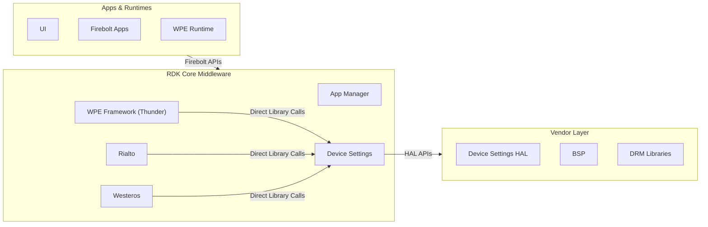
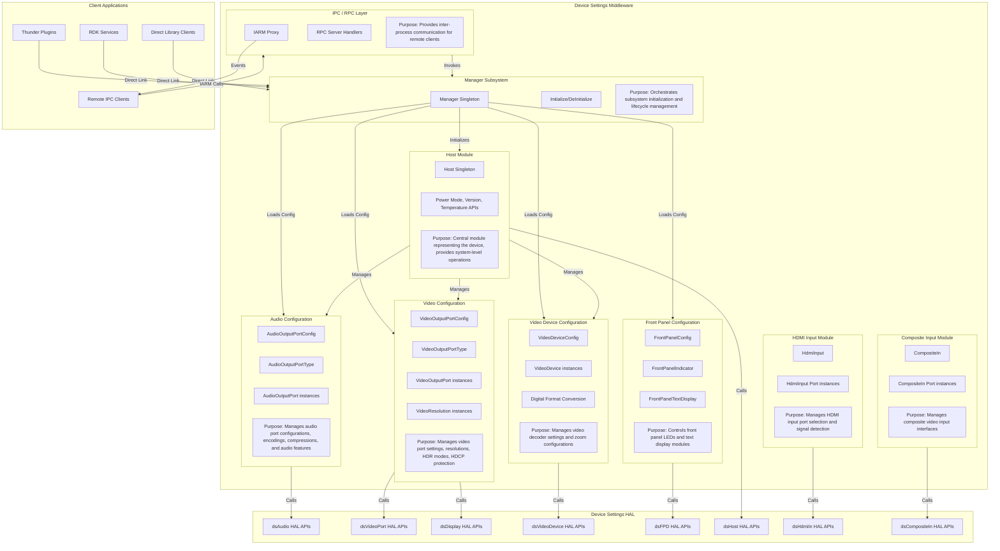
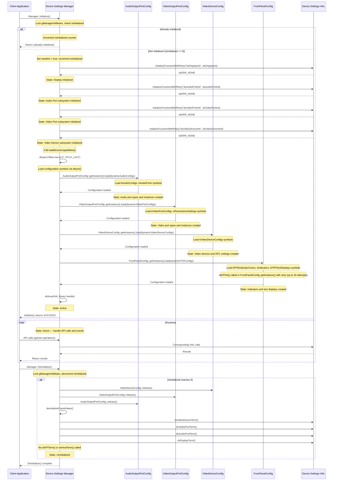
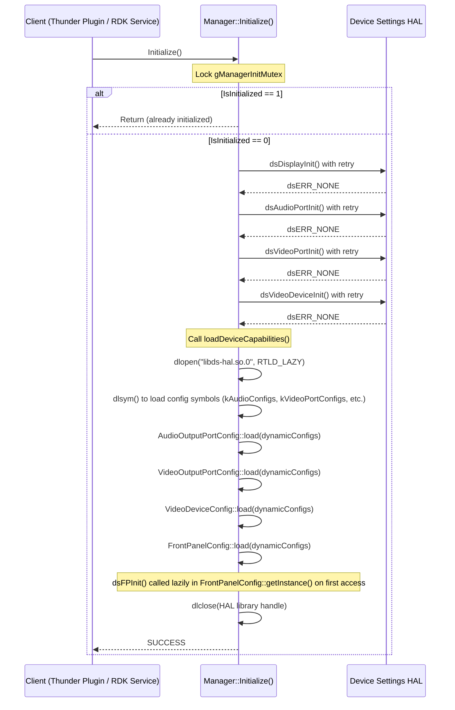
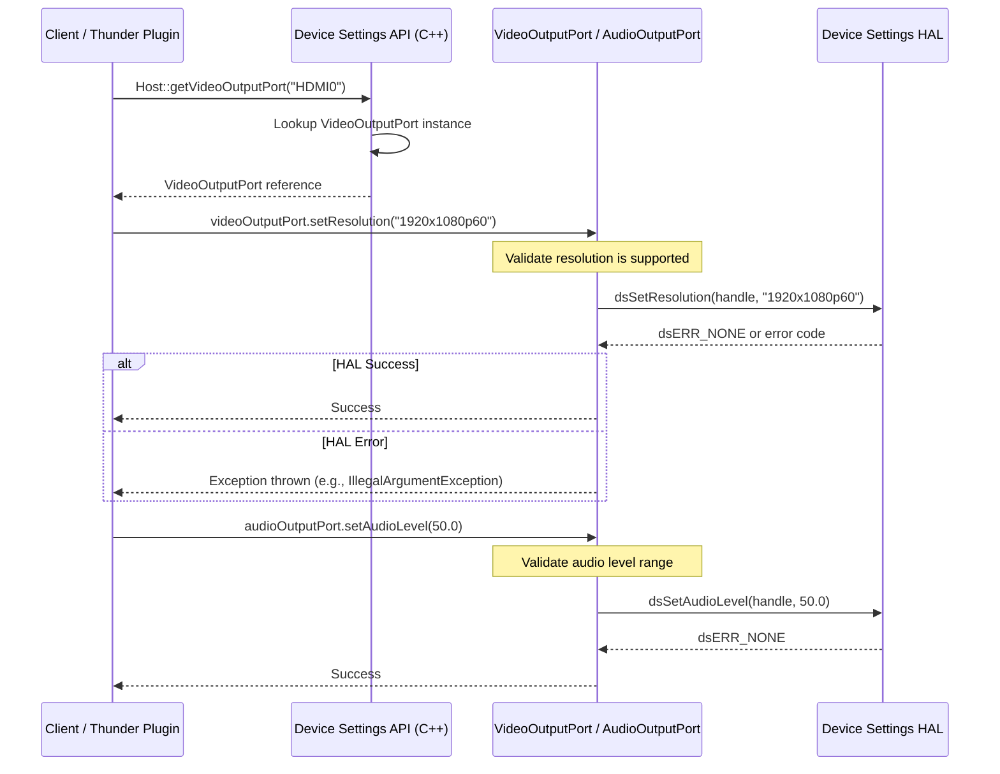
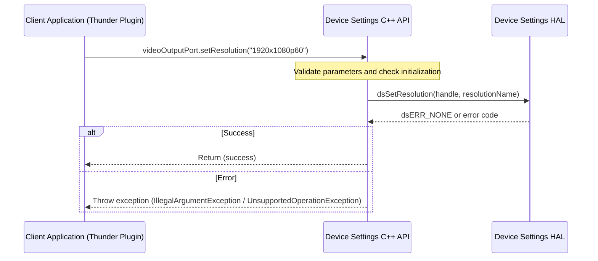
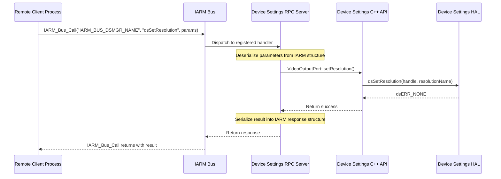
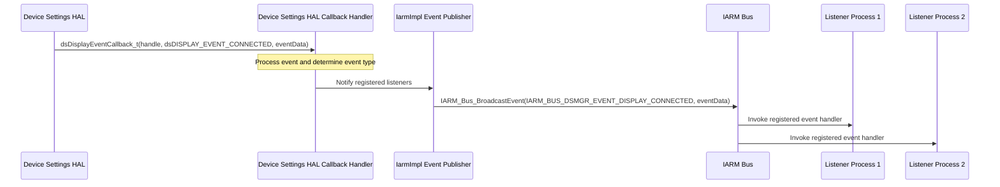

# Device Settings

Device Settings is a cross-platform middleware library within the RDK software stack that provides an abstraction layer for managing hardware configurations of set-top boxes and other RDK devices. This component serves as a centralized interface between higher-level RDK services and the underlying Hardware Abstraction Layer (HAL), enabling consistent device configuration management across different hardware platforms. The module facilitates control and monitoring of audio output ports, video output ports, display characteristics, video decoder settings, front panel displays and indicators, HDMI input capabilities, and composite input interfaces. Device Settings operates as a service-oriented component that can be accessed either through direct library linkage or via Inter-Process Communication (IPC) using the IARM Bus framework, making it suitable for both in-process and out-of-process client applications within the RDK ecosystem.

**Key Features & Responsibilities:**

- **Audio Output Port Management**: Controls audio port configurations including volume levels, mute states, audio encoding formats, compression modes, stereo modes, audio delays, MS12 audio processing features, dialogue enhancement, bass enhancement, surround virtualizer, and audio ducking capabilities.

- **Video Output Port Configuration**: Manages video output port properties such as display resolutions, aspect ratios, HDR/Dolby Vision output modes, HDCP protection settings, video color spaces, EDID management, and output port enable/disable states.

- **Display Interface Management**: Provides access to display device capabilities, EDID data parsing, display connection status monitoring, aspect ratio settings, and supported resolution enumeration.

- **Video Device Control**: Handles video decoder configurations including Digital Format Conversion (DFC/Zoom) settings, video codec management, HDR capabilities, frame rate management, and video device-specific features.

- **Front Panel Management**: Controls front panel LED indicators with configurable colors, brightness levels, and blink patterns, as well as text display modules supporting scrolling text, clock display with configurable time formats.

- **HDMI Input Management**: Manages HDMI input port selection, signal presence detection, scaling configuration, EDCP protection status, and audio-video format detection for HDMI input sources.

- **Composite Input Support**: Provides interface for composite video input port management including port selection and signal detection capabilities.

- **Configuration Abstraction**: Loads device-specific configurations from platform-provided data structures and templates, enabling hardware-agnostic application development across different SOC platforms.

- **Event Distribution**: Publishes hardware state change events through IARM Bus for system-wide notification of connection changes, format changes, power state transitions, and display capability updates.

---

## Design

Device Settings is architecturally designed as a configuration management middleware layer that abstracts hardware-specific device control operations from higher-level RDK components. The design follows a modular subsystem approach where each hardware category (audio, video, display, front panel) is encapsulated in separate configuration modules with dedicated initialization and termination lifecycles. The component employs a singleton pattern for the Manager class which orchestrates the initialization sequence across all subsystems and maintains a centralized state indicating whether the module has been initialized. Each subsystem consists of type-level objects that represent classes of hardware (such as HDMI port type or SPDIF audio port type) and instance-level objects that represent individual physical ports available on the device.

The design implements a two-layer architecture: the upper layer consists of C++ classes providing object-oriented interfaces with exception handling and resource management, while the lower layer directly invokes HAL C APIs. This layering enables the component to present a structured, type-safe API to RDK middleware clients while maintaining compatibility with vendor-provided C-based HAL implementations. Configuration data such as supported resolutions, audio encoding formats, and port capabilities are loaded dynamically at initialization time through device-specific configuration structures, allowing the same middleware binary to adapt to different hardware platforms without recompilation.

Inter-process communication is facilitated through a dedicated RPC layer built atop the IARM Bus framework. This allows remote clients to access Device Settings functionality through synchronous IARM call operations, with serialization and deserialization logic handling parameter marshalling. The RPC server implementation registers handlers for each Device Settings API, executes the corresponding C++ method, and returns results through IARM response structures. For asynchronous hardware events such as HDMI hotplug or audio format changes, Device Settings implements callback registration mechanisms where the HAL invokes callbacks into the middleware, which then broadcasts IARM events to all registered listeners across the system.

The design incorporates a retry mechanism with configurable retry counts for HAL initialization operations to handle transient failures during system startup. Resource acquisition follows a strict ordered initialization where Host subsystem initializes first, followed by Display, Audio Port, Video Port, Video Device, and Front Panel modules. This ordering ensures that dependencies between subsystems are satisfied before dependent modules attempt initialization. Error propagation from HAL is mapped to Device Settings error codes, and failures during initialization are logged with contextual information to aid in platform bring-up and debugging.

Configuration persistence is not implemented within Device Settings itself; the component reads device capabilities and configurations on every initialization cycle from HAL-provided data structures. Any persistent settings management, such as remembered volume levels or preferred resolution settings, is expected to be handled by higher-layer components or through platform-specific persistence mechanisms external to this module.

### Threading Model

Device Settings is a single-threaded library with thread-safe initialization. The component does not create or manage any worker threads internally. All API calls execute synchronously in the caller's thread context, directly invoking the underlying HAL functions and returning results to the caller before the function returns.

- **Threading Architecture**: Single-threaded library with synchronous API execution model

- **Main Thread**: Device Settings executes all operations in the calling thread's context. When a client invokes a Device Settings API (such as setting audio volume or querying video resolution), the call flows through the C++ wrapper layer to the HAL function and returns synchronously with the result or error code.

- **Initialization Synchronization**: The Manager::Initialize() method uses a mutex (gManagerInitMutex) to ensure thread-safe initialization. This prevents race conditions when multiple threads or processes attempt to initialize Device Settings concurrently. Once initialization completes, the IsInitialized flag is set atomically to indicate readiness.

- **Callback Execution Context**: HAL callbacks for asynchronous events (such as audio format changes, HDMI connection status, or HDCP state changes) are invoked in the HAL's thread context. When these callbacks are received, Device Settings immediately forwards them to registered IARM event listeners. The callback execution remains synchronous within the HAL thread, and any processing in the callback should be minimal to avoid blocking the HAL's event thread.

- **IARM Event Handlers**: For components using IARM-based event distribution, event handlers registered via IarmImpl::Register() are invoked in the IARM Bus event dispatch thread when IARM events arrive. Multiple listeners may be registered for the same event type, and they are notified sequentially in the order of registration.

- **No Async / Event Dispatch Mechanism**: Device Settings does not implement queuing, thread pools, or asynchronous dispatch mechanisms. All operations are blocking and synchronous. If a HAL call takes significant time to execute, it will block the caller's thread until completion.

- **Synchronization**: Initialization uses a std::mutex (gManagerInitMutex) to protect concurrent access to the IsInitialized state. IarmImpl uses per-callback-list mutexes (m_mutex) to protect the listener registration data structures from concurrent modification during Register, Unregister, and notification dispatch operations.

### RDK-V Platform and Integration Requirements

- **Build Dependencies**: 
  - Yocto recipe dependencies: `json-c`, `iarmbus`, `rdk-logger`, `virtual/vendor-devicesettings-hal`, `devicesettings-hal-headers`, `safec-common-wrapper`, `rfc`, `wdmp-c`, `telemetry`, `glib-2.0 >= 2.24.0`, `gthread-2.0 >= 2.24.0`, `dbus-1`, `direct`, `fusion`
  - Linked libraries (LDFLAGS): `-lrdkloggers`, `-lpthread`, `-lglib-2.0`, `-lIARMBus`, `-ldl`, `-ltelemetry_msgsender`, `-lrfcapi`
  - HAL library name: `libds-hal.so.0` (loaded dynamically via dlopen at runtime)
  - Autotools build system using configure.ac with pkg-config for dependency resolution

- **Compile-Time Features**:
  - `DS_AUDIO_SETTINGS_PERSISTENCE`: Enables audio settings persistence
  - `DSMGR_LOGGER_ENABLED`: Enables Device Settings Manager logging
  - `HAS_FLASH_PERSISTENT`: Enables flash-based persistence support
  - `HAS_THERMAL_API`: Enables thermal/temperature API support
  - `HAS_HDCP_CALLBACK`: Enables HDCP callback support in RPC server
  - `HAS_4K_SUPPORT`: Enabled when uhd_enabled is in DISTRO_FEATURES
  - `ENABLE_DEEP_SLEEP`: Enables deep sleep power mode support
  - `IGNORE_EDID_LOGIC`: Enabled for non-TV platforms
  - `HAS_HDMI_IN_SUPPORT`: Conditional - enabled when enable_hdmiin_support is in DISTRO_FEATURES
  - `HAS_COMPOSITE_IN_SUPPORT`: Conditional - enabled when enable_compositein_support is in DISTRO_FEATURES
  - `HAS_SPDIF_SUPPORT`: Conditional - enabled when enable_spdif_support is in DISTRO_FEATURES
  - `HAS_HEADPHONE_SUPPORT`: Conditional - enabled when enable_headphone_support is in DISTRO_FEATURES
  - Resolution configurations: `ENABLE_EU_RESOLUTION`, `ENABLE_US_RESOLUTION`, `ENABLE_FLEX2_RESOLUTION` (region-specific)
  - LED configuration: `ENABLE_US_LED_CONFIG` for all-white LED config

- **Device Services / HAL**: 
  - Required DS HAL APIs: dsAudio.h, dsVideoPort.h, dsVideoDevice.h, dsDisplay.h, dsFPD.h
  - Optional DS HAL APIs (conditional): dsHdmiIn.h (if HAS_HDMI_IN_SUPPORT), dsCompositeIn.h (if HAS_COMPOSITE_IN_SUPPORT), dsHost.h (for temperature and SoC ID queries)
  - HAL version compatibility: Must implement Device Settings HAL specification as defined in rdk-halif-device_settings
  - Platform configuration symbols: HAL library must export configuration symbols (kAudioConfigs, kVideoPortConfigs, kVideoDeviceConfigs, kFPDIndicatorColors, etc.) that Device Settings loads via dlsym

- **IARM Bus**: 
  - IARM namespace: `IARM_BUS_DSMGR_NAME` for RPC server registration
  - Event groups registered: Audio output port events, Video output port events, Video device events, Display device events, HDMI input events (conditional), Composite input events (conditional)
  - IARM must be initialized and running before Device Settings RPC server can register

- **Configuration Files**: 
  - No traditional configuration files - HAL shared library (`libds-hal.so.0`) contains configuration as exported symbols
  - Platform-specific configuration data embedded in HAL library as symbols: kAudioConfigs, kVideoPortConfigs, kVideoDeviceConfigs, kFPDIndicatorColors, kIndicators, kFPDTextDisplays, kResolutionsSettings

- **External Service Integration**:
  - **RFC (Remote Feature Control)**: Linked with `-lrfcapi` for runtime feature configuration queries. RFC integration enables dynamic feature control based on remote configuration parameters.
  - **Telemetry**: Linked with `-ltelemetry_msgsender` for diagnostic data collection and reporting. Telemetry support allows Device Settings to report operational metrics and hardware state information.

- **Startup Order**: 
  - Device Settings library can be initialized at any time after system libraries (libc, libstdc++, glib) are available
  - For RPC server mode: IARM Bus must be initialized before Device Settings RPC server starts
  - Typical ordering in RDK-V stack: System services → IARM Bus → Device Settings RPC Server → Thunder plugins/RDK Services → Applications

---

### Component State Flow

#### Initialization to Active State

Device Settings initialization progresses through distinct phases: Pre-Initialization where the Manager verifies the module is not already initialized using a mutex-protected check, HAL Subsystem Initialization where HAL modules (Display, Audio Port, Video Port, Video Device) are initialized sequentially with retry logic for transient failures, Configuration Loading where the HAL shared library (libds-hal.so.0) is opened via dlopen and configuration symbols are loaded via dlsym into C++ configuration objects, and finally transitioning to the Active state where all APIs become available for client invocations. Front Panel initialization occurs on-demand when first accessed, rather than during the main initialization sequence.

#### Runtime State Changes

During normal operation, Device Settings responds to hardware state changes reported by the HAL through registered callbacks. These include display connection status changes (HDMI hotplug events), audio format changes during playback, video format and resolution changes, HDCP status updates, and front panel state modifications. When HAL invokes a callback, Device Settings processes the event and publishes it through the IARM Bus to notify all registered listeners across the system.

**State Change Triggers:**

- **Display Connection Changes**: When a display is connected or disconnected on a video output port, the HAL invokes the dsDisplayEventCallback_t callback registered via dsRegisterDisplayEventCallback(). Device Settings propagates this event to IARM listeners, triggering potential resolution adjustments or output enabling/disabling in higher-layer components.

- **Audio Format Changes**: When the audio format of the current playback content changes (e.g., from stereo to Dolby Digital), the HAL invokes the dsAudioFormatUpdateCB_t callback. Device Settings broadcasts this to applications, allowing them to update UI indicators or adjust audio processing settings.

- **HDCP Status Updates**: When HDCP authentication state changes on a video output port, the HAL notifies through callbacks. Device Settings publishes the HDCP state change event, which may trigger content protection decisions in higher-layer DRM or media playback components.

- **Power State Transitions**: Device Settings does not directly manage power states. Higher-layer components (such as Power Manager) control power transitions and may use Device Settings APIs to disable output ports or adjust display settings during standby transitions.

**Context Switching Scenarios:**

- **Resolution Change Requests**: When a client requests a resolution change via setResolution(), Device Settings validates the requested resolution against supported resolutions, invokes the HAL to apply the change, and the HAL may trigger a display re-initialization sequence. Post-change callbacks inform clients of the new active resolution.

- **Audio Port Configuration Changes**: Volume, mute, audio mode, and encoding changes are applied immediately through HAL APIs with synchronous responses. No state machine transitions occur; the component remains in Active state throughout.

- **Front Panel State Updates**: Text display and LED indicator state changes are applied synchronously via HAL calls. The component does not maintain complex state machines for front panel operations.

---

### Call Flows

#### Initialization Call Flow

The initialization flow orchestrates the sequential setup of all Device Settings subsystems followed by configuration loading.

#### Request Processing Call Flow

Client requests for hardware configuration changes flow through Device Settings C++ API layer to the HAL, with synchronous result propagation.

---

## Internal Modules

Device Settings consists of multiple internal modules organized by functional category. Each module encapsulates the configuration and management logic for a specific hardware subsystem.

| Module / Class | Description | Key Files |
| -------------- | ----------- | --------- |
| `Manager` | Central orchestration module responsible for initializing and deinitializing all Device Settings subsystems. Provides the primary entry point for library initialization and maintains the global initialization state. | `manager.cpp`, `manager.hpp` |
| `Host` | Represents the device as a whole and provides system-level APIs such as retrieving video output ports, audio output ports, CPU temperature, SOC ID, host EDID, and version information. Singleton pattern ensures only one Host instance exists per process. | `host.cpp`, `host.hpp` |
| `AudioOutputPortConfig` | Configuration management for audio output ports. Loads supported audio encodings, compressions, stereo modes, and audio port types. Manages instances of AudioOutputPort objects representing physical audio ports (SPDIF, HDMI_ARC, Speaker, etc.). | `audioOutputPortConfig.cpp`, `audioOutputPortConfig.hpp` |
| `AudioOutputPort` | Represents an individual audio output port instance. Provides APIs for setting volume, mute state, audio encoding, compression mode, audio delay, dialogue enhancement, bass enhancement, surround virtualizer, MS12 capabilities, audio ducking, and other audio processing features. | `audioOutputPort.cpp`, `audioOutputPort.hpp` |
| `AudioOutputPortType` | Defines the type-level properties shared by all audio ports of the same type (e.g., all HDMI_ARC ports). Manages supported encodings, compressions, and capabilities for that port type. | `audioOutputPortType.cpp`, `audioOutputPortType.hpp` |
| `VideoOutputPortConfig` | Configuration management for video output ports. Loads supported video resolutions, port types (HDMI, Component, Composite), and creates VideoOutputPort instances. Manages resolution objects representing available video modes. | `videoOutputPortConfig.cpp`, `videoOutputPortConfig.hpp` |
| `VideoOutputPort` | Represents an individual video output port instance. Provides APIs for enabling/disabling the port, setting display resolution, querying EDID, managing HDCP settings, controlling HDR and Dolby Vision modes, setting display color space, and handling display connections. | `videoOutputPort.cpp`, `videoOutputPort.hpp` |
| `VideoOutputPortType` | Defines type-level properties for video port types (HDMI, Component, etc.), including supported resolutions and capabilities. | `videoOutputPortType.cpp`, `videoOutputPortType.hpp` |
| `VideoDeviceConfig` | Configuration module for video decoder devices. Loads supported Digital Format Conversion (DFC/Zoom) settings and video device capabilities from HAL configuration data. | `videoDeviceConfig.cpp`, `videoDeviceConfig.hpp` |
| `VideoDevice` | Represents a video decoder instance. Provides APIs for setting DFC/zoom mode, managing HDR capabilities, querying frame rate, video codec, and other decoder-specific settings. | `videoDevice.cpp`, `videoDevice.hpp` |
| `VideoDFC` | Encapsulates Digital Format Conversion (zoom) settings and modes. Provides APIs for querying and applying zoom/scaling configurations. | `videoDFC.cpp`, `videoDFC.hpp` |
| `FrontPanelConfig` | Configuration module for front panel hardware. Loads indicator definitions (LEDs with color and blink capabilities) and text display configurations. Manages FrontPanelIndicator and FrontPanelTextDisplay instances. | `frontPanelConfig.cpp`, `frontPanelConfig.hpp` |
| `FrontPanelIndicator` | Represents a single LED indicator on the front panel. Provides APIs for setting brightness, color (RGB or predefined colors), and blink rate. | `frontPanelIndicator.cpp`, `frontPanelIndicator.hpp` |
| `FrontPanelTextDisplay` | Represents a text display module on the front panel. Supports displaying text strings, setting scroll speed, enabling clock mode with 12/24-hour format selection. | `frontPanelTextDisplay.cpp`, `frontPanelTextDisplay.hpp` |
| `HdmiInput` | Manages HDMI input port selection and capabilities. Provides APIs for selecting active HDMI input port, querying HDMI input signal status, and receiving HDMI input events. | `hdmiIn.cpp`, `hdmiIn.hpp` |
| `CompositeIn` | Manages composite video input interface. Provides APIs for port selection and signal presence detection. | `compositeIn.cpp`, `compositeIn.hpp` |
| `IarmImpl` | IARM Bus integration layer for event distribution. Manages registration of event listeners and dispatches HAL callbacks to IARM event subscribers. Provides event grouping by subsystem (Audio, Video, Display, HDMI Input, Composite Input). | `IarmImpl.cpp`, `IarmImpl.hpp` |
| `IARMProxy` | Proxy for IARM power event handler registration. Used for legacy power event handling integration. | `iarmProxy.cpp`, `iarmProxy.hpp` |
| `EDID Parser` | Parses EDID data structures to extract display capabilities such as supported resolutions, manufacturer information, and display timings. | `edid-parser.cpp`, `edid-parser.hpp` |

---

## Component Interactions

Device Settings interacts with client applications through direct library linkage or RPC over IARM Bus, with the HAL layer below, and publishes hardware events through IARM for system-wide distribution.

### Interaction Matrix

| Target Component / Layer | Interaction Purpose | Key APIs / Topics |
| ------------------------ | ------------------- | ----------------- |
| **RDK-E Plugins** | | |
| Thunder Plugins (DisplaySettings, DeviceSettings, etc.) | Thunder plugins link directly to Device Settings library and invoke C++ APIs to control hardware settings and subscribe to hardware events. | `device::Manager::Initialize()`, `device::Host::getInstance()`, `VideoOutputPort::setResolution()`, `AudioOutputPort::setAudioLevel()` |
| RDK Services (Device Settings Service) | RDK Services use Device Settings for querying and configuring device capabilities, output port states, and display properties. | `Host::getVideoOutputPorts()`, `VideoOutputPort::getResolution()`, `AudioOutputPort::getMuted()` |
| Rialto Media Pipeline | Media playback components may query audio and video capabilities, set audio formats, and receive format change notifications. | `AudioOutputPort::getSupportedEncodings()`, `VideoDevice::getHDRCapabilities()` |
| **Device Services / HAL** | | |
| DS Audio HAL | Audio port initialization, volume control, mute control, audio format selection, MS12 audio processing control, audio delay settings, audio capability queries. | `dsAudioPortInit()`, `dsSetAudioLevel()`, `dsSetAudioMute()`, `dsSetAudioEncoding()`, `dsSetAudioCompression()`, `dsSetDialogEnhancement()`, `dsSetBassEnhancer()` |
| DS Video Port HAL | Video port initialization, resolution setting, display enable/disable, EDID retrieval, HDCP management, HDR mode control, color space settings. | `dsVideoPortInit()`, `dsSetResolution()`, `dsEnableVideoPort()`, `dsGetEDID()`, `dsEnableHDCP()`, `dsSetHdmiPreference()`, `dsSetForceHDRMode()` |
| DS Video Device HAL | Video decoder initialization, DFC/zoom control, HDR capability queries, codec information, frame rate queries. | `dsVideoDeviceInit()`, `dsSetDFC()`, `dsGetHDRCapabilities()`, `dsGetVideoCodecInfo()` |
| DS Display HAL | Display subsystem initialization, display connection status, display event registration. | `dsDisplayInit()`, `dsRegisterDisplayEventCallback()` |
| DS Host HAL | Host subsystem initialization, CPU temperature retrieval, SOC ID query, host EDID retrieval, version information. | `dsHostInit()`, `dsGetCPUTemperature()`, `dsGetSocIDFromSDK()`, `dsGetHostEDID()` |
| DS Front Panel HAL | Front panel initialization, LED indicator control, text display control. | `dsFPInit()`, `dsSetFPBrightness()`, `dsSetFPColor()`, `dsFPSetLED()`, `dsFPSetText()`, `dsFPEnableCLockDisplay()` |
| DS HDMI Input HAL | HDMI input port initialization, port selection, signal status query, HDMI input event registration. | `dsHdmiInInit()`, `dsHdmiInSelectPort()`, `dsHdmiInGetCurrentVideoMode()`, `dsHdmiInRegisterConnectCB()` |
| DS Composite Input HAL | Composite input initialization, port selection, signal detection. | `dsCompositeInInit()`, `dsCompositeInSelectPort()` |
| IARM Bus | System-wide event distribution for hardware state changes. Device Settings publishes events when hardware configuration changes occur (display connection, audio format changes, HDCP status). | `IARM_Bus_RegisterEventHandler()`, `IARM_Bus_BroadcastEvent()`, Event groups: `IARM_BUS_DSMGR_EVENT_*` |

### Events Published

| Event Name | IARM / JSON-RPC Topic | Trigger Condition | Subscriber Components |
| ---------- | --------------------- | ----------------- | --------------------- |
| Display Connected | `IARM_BUS_DSMGR_EVENT_DISPLAY_CONNECTED` | HAL reports display connection on a video output port (HDMI hotplug detected). | Thunder DisplaySettings plugin, UI components, resolution management services |
| Display Disconnected | `IARM_BUS_DSMGR_EVENT_DISPLAY_DISCONNECTED` | HAL reports display disconnection on a video output port (HDMI cable removed). | Thunder DisplaySettings plugin, UI components, resolution management services |
| HDCP Status Change | `IARM_BUS_DSMGR_EVENT_HDCP_STATUS` | HDCP authentication state changes on a video output port (authentication success, failure, or protocol version change). | DRM components, content playback services, Thunder plugins monitoring content protection |
| Audio Format Change | `IARM_BUS_DSMGR_EVENT_AUDIO_FORMAT_UPDATE` | Audio format of the current playback content changes (e.g., PCM to Dolby Digital, stereo to 5.1 surround). | Audio processing components, UI indicators, Thunder AudioOutputPort plugin |
| Video Format Change | `IARM_BUS_DSMGR_EVENT_VIDEO_FORMAT_UPDATE` | Video resolution or format changes during playback or on output port. | Video processing pipelines, UI resolution indicators, display management services |
| HDMI Input Signal Change | `IARM_BUS_DSMGR_EVENT_HDMI_IN_STATUS` | HDMI input signal presence or video mode changes on an HDMI input port. | HDMI input management services, UI source selection components |
| Composite Input Signal Change | `IARM_BUS_DSMGR_EVENT_COMPOSITE_IN_STATUS` | Composite input signal presence changes. | Composite input management services, source selection UI |
| Rx Sense Status | `IARM_BUS_DSMGR_EVENT_RX_SENSE` | HDMI Rx Sense status change indicating whether a sink device is actively monitoring the HDMI connection. | Power management services, display power state management |
| Atmos Capability Change | `IARM_BUS_DSMGR_EVENT_ATMOS_CAPS_CHANGE` | Dolby Atmos capability status change on audio sink (connected display/AVR supports or no longer supports Atmos). | Audio capability management, codec selection logic, media playback pipelines |

### IPC Flow Patterns

**Primary Request / Response Flow (Direct Library Linkage):**

**Primary Request / Response Flow (RPC over IARM Bus):**

**Event Notification Flow:**

---

## Implementation Details

### Major HAL APIs Integration

Device Settings invokes the following HAL functions as verified in source code. Each subsystem's initialization and operational APIs are called from corresponding Device Settings modules.

| HAL / DS API | Purpose | Implementation File |
| ------------ | ------- | ------------------- |
| `dsDisplayInit()` | Initialize display subsystem and display event handling capabilities. | `manager.cpp` (called during Manager::Initialize) |
| `dsDisplayTerm()` | Terminate display subsystem and release display-related resources. | `manager.cpp` (called during Manager::DeInitialize) |
| `dsRegisterDisplayEventCallback()` | Register callback for display connection/disconnection events. | `videoOutputPort.cpp`, `IarmImpl.cpp` |
| `dsAudioPortInit()` | Initialize audio output port subsystem. | `manager.cpp` |
| `dsAudioPortTerm()` | Terminate audio output port subsystem. | `manager.cpp` |
| `dsGetAudioPort()` | Retrieve handle for a specific audio output port by type and index. | `audioOutputPort.cpp` |
| `dsSetAudioLevel()` | Set audio volume level on an audio output port. | `audioOutputPort.cpp` |
| `dsGetAudioLevel()` | Query current audio volume level. | `audioOutputPort.cpp` |
| `dsSetAudioMute()` | Enable or disable mute on an audio output port. | `audioOutputPort.cpp` |
| `dsSetAudioEncoding()` | Set audio encoding format (PCM, AC3, EAC3, etc.) on audio port. | `audioOutputPort.cpp` |
| `dsSetAudioCompression()` | Configure audio compression mode. | `audioOutputPort.cpp` |
| `dsSetDialogEnhancement()` | Enable/disable dialogue enhancement feature. | `audioOutputPort.cpp` |
| `dsSetBassEnhancer()` | Control bass enhancement level. | `audioOutputPort.cpp` |
| `dsSetSurroundVirtualizer()` | Configure surround sound virtualizer mode. | `audioOutputPort.cpp` |
| `dsSetAudioDelay()` | Set audio delay/offset for audio-video synchronization. | `audioOutputPort.cpp` |
| `dsAudioOutRegisterConnectCB()` | Register callback for audio port connection status changes. | `audioOutputPort.cpp`, `IarmImpl.cpp` |
| `dsAudioFormatUpdateRegisterCB()` | Register callback for audio format updates during playback. | `audioOutputPort.cpp`, `IarmImpl.cpp` |
| `dsVideoPortInit()` | Initialize video output port subsystem. | `manager.cpp` |
| `dsVideoPortTerm()` | Terminate video output port subsystem. | `manager.cpp` |
| `dsGetVideoPort()` | Retrieve handle for a specific video output port by type and index. | `videoOutputPort.cpp` |
| `dsSetResolution()` | Set display resolution on a video output port. | `videoOutputPort.cpp` |
| `dsGetResolution()` | Query current display resolution. | `videoOutputPort.cpp` |
| `dsEnableVideoPort()` | Enable or disable a video output port. | `videoOutputPort.cpp` |
| `dsIsVideoPortEnabled()` | Check if a video output port is enabled. | `videoOutputPort.cpp` |
| `dsIsDisplayConnected()` | Query display connection status on a video output port. | `videoOutputPort.cpp` |
| `dsGetEDID()` | Retrieve EDID data from connected display. | `videoOutputPort.cpp` |
| `dsEnableHDCP()` | Enable or disable HDCP content protection. | `videoOutputPort.cpp` |
| `dsIsHDCPEnabled()` | Query HDCP enabled status. | `videoOutputPort.cpp` |
| `dsGetHDCPStatus()` | Retrieve detailed HDCP authentication status. | `videoOutputPort.cpp` |
| `dsSetForceHDRMode()` | Force HDR output mode (HDR10, Dolby Vision, etc.). | `videoOutputPort.cpp` |
| `dsGetForceHDRMode()` | Query currently configured HDR mode. | `videoOutputPort.cpp` |
| `dsSetHdmiPreference()` | Set HDMI output preference (EDID-based or forced mode). | `videoOutputPort.cpp` |
| `dsVideoDeviceInit()` | Initialize video decoder/device subsystem. | `manager.cpp` |
| `dsVideoDeviceTerm()` | Terminate video decoder subsystem. | `manager.cpp` |
| `dsSetDFC()` | Set Digital Format Conversion (zoom) mode on video decoder. | `videoDevice.cpp` |
| `dsGetDFC()` | Query current DFC/zoom mode. | `videoDevice.cpp` |
| `dsGetHDRCapabilities()` | Query HDR capabilities of video decoder. | `videoDevice.cpp` |
| `dsGetVideoCodecInfo()` | Retrieve information about active video codec. | `videoDevice.cpp` |
| `dsFPInit()` | Initialize front panel display and indicator subsystem. | `frontPanelConfig.cpp` |
| `dsFPTerm()` | Terminate front panel subsystem. | `frontPanelConfig.cpp` |
| `dsSetFPBrightness()` | Set brightness level of front panel LED indicators. | `frontPanelIndicator.cpp` |
| `dsSetFPColor()` | Set color of front panel LED indicators (predefined colors). | `frontPanelIndicator.cpp` |
| `dsSetFPBlink()` | Configure blink pattern for front panel LEDs. | `frontPanelIndicator.cpp` |
| `dsFPSetText()` | Display text string on front panel text display. | `frontPanelTextDisplay.cpp` |
| `dsFPEnableCLockDisplay()` | Enable clock mode on front panel text display with time format selection. | `frontPanelTextDisplay.cpp` |
| `dsGetCPUTemperature()` | Query CPU temperature in degrees Celsius (if HAS_THERMAL_API is enabled). | `host.cpp` (called on-demand, not during initialization) |
| `dsGetSocIDFromSDK()` | Retrieve SoC chip identifier. | `host.cpp` (called on-demand, not during initialization) |
| `dsGetHostEDID()` | Retrieve host EDID data (for HDMI input devices). | `host.cpp` (called on-demand, not during initialization) |
| Note: `dsHostInit()` and `dsHostTerm()` | These HAL APIs are defined in the HAL specification but are NOT called by the current Device Settings implementation. | Not used in current implementation |
| `dsHdmiInInit()` | Initialize HDMI input subsystem. | `hdmiIn.cpp` |
| `dsHdmiInTerm()` | Terminate HDMI input subsystem. | `hdmiIn.cpp` |
| `dsHdmiInSelectPort()` | Select active HDMI input port. | `hdmiIn.cpp` |
| `dsHdmiInRegisterConnectCB()` | Register callback for HDMI input connection events. | `hdmiIn.cpp`, `IarmImpl.cpp` |
| `dsCompositeInInit()` | Initialize composite input subsystem. | `compositeIn.cpp` |
| `dsCompositeInTerm()` | Terminate composite input subsystem. | `compositeIn.cpp` |
| `dsCompositeInSelectPort()` | Select active composite input port. | `compositeIn.cpp` |

### Key Implementation Logic

- **State / Lifecycle Management**: Device Settings uses a simple integer flag `Manager::IsInitialized` protected by a mutex (`gManagerInitMutex`) to track initialization state. The Manager class coordinates initialization of all subsystems in a fixed order: Display → Audio → Video Port → Video Device → Front Panel → Host. Each subsystem's initialization function is called with retry logic to handle transient HAL failures. After successful HAL initialization, configuration loading populates C++ objects with device capabilities. Deinitialization reverses the initialization order, releasing configuration data structures before terminating HAL subsystems.
  - Core implementation: `manager.cpp` (Initialize, DeInitialize, load methods)
  - State transition logic: Atomic update of IsInitialized flag after all subsystems initialize successfully

- **Event Processing**: HAL callbacks are registered during initialization for asynchronous hardware events. When the HAL invokes a callback (e.g., `dsDisplayEventCallback_t` for display connection changes), Device Settings immediately processes the event in the HAL's callback context and broadcasts it through IARM. The IarmImpl class maintains lists of registered event listeners per event type. When a hardware event arrives, IarmImpl iterates the listener list and invokes each registered callback sequentially. There is no event queuing or prioritization; all callbacks execute synchronously in the HAL's callback thread.
  - Event registration: `IarmImpl.cpp` (Register method adds listeners to callback lists)
  - Event dispatch: IarmImpl callbacks invoke all registered listeners sequentially
  - No event queue or debounce logic implemented

- **Error Handling Strategy**: HAL error codes (`dsError_t` enumeration values) are returned from HAL API calls. Device Settings maps these to C++ exceptions in the object-oriented API layer:
  - `dsERR_NONE` → Success, normal return
  - `dsERR_INVALID_PARAM` → Throw `IllegalArgumentException`
  - `dsERR_OPERATION_NOT_SUPPORTED` → Throw `UnsupportedOperationException`
  - `dsERR_GENERAL`, `dsERR_NOT_INITIALIZED`, other errors → Throw generic `Exception`
  - RPC layer: Error codes are serialized in IARM response structures and returned to remote clients as integer error codes
  - Retry logic: During initialization, HAL init functions that return `dsERR_INVALID_STATE` are retried up to a configured count. Other error codes cause initialization to fail immediately.
  - Timeout handling: No explicit timeout mechanism. HAL calls are assumed to return within reasonable time or block indefinitely on hardware operations.

- **Logging & Diagnostics**: Device Settings uses a custom logging framework defined in `dslogger.h`. Log macros include `INT_DEBUG`, `INT_INFO`, `INT_WARN`, `INT_ERROR` for different severity levels. Logging is used extensively during initialization to trace subsystem initialization progress and to log HAL API call results. Each major operation logs entry and exit points with contextual information. Error conditions from HAL APIs are logged with error codes and function names to assist in debugging.
  - RDK Logger module name: `LOG.RDK.DEVICESETTINGS` (configured in dslogger.h)
  - Key log points: Manager::Initialize entry/exit, each HAL init call result, configuration loading stages, HAL API errors with error codes

---

## Configuration

### Key Configuration Files

Device Settings does not use traditional text-based configuration files. Configuration data is dynamically loaded from the HAL shared library at initialization time.

| Configuration File | Purpose | Override Mechanism |
| ------------------ | ------- | ------------------ |
| N/A - HAL Library Symbols (`libds-hal.so.0`) | Device-specific configurations (supported resolutions, audio encodings, port types, front panel capabilities) are embedded in the HAL implementation as exported symbols (`kAudioConfigs`, `kVideoPortConfigs`, `kVideoDeviceConfigs`, `kFPDIndicatorColors`, `kIndicators`, `kFPDTextDisplays`, etc.). Device Settings opens the HAL library using `dlopen("libds-hal.so.0", RTLD_LAZY)` and loads these symbols using `dlsym()` during `loadDeviceCapabilities()` in Manager::Initialize(). | Configuration is compiled into the HAL library as exported symbols. Changes require HAL library rebuild and Device Settings reinitialization (or device reboot). |
| Parameter | Type | Default | Description |
| --------- | ---- | ------- | ----------- |
| `numSupportedResolutions` | int | Platform-specific | Number of video resolutions supported by the platform. Loaded from `videoOutputPortConfig_t`. |
| `supportedAudioEncodings` | Array of `dsAudioEncoding_t` | Platform-specific | List of audio encoding formats supported by audio output ports (PCM, AC3, EAC3, AAC, Atmos). Loaded from `audioOutputPortConfig_t`. |
| `supportedVideoPortTypes` | Array of `dsVideoPortType_t` | Platform-specific | List of video output port types available (HDMI, Component, Composite, Internal). Loaded from `videoOutputPortConfig_t`. |
| `numFrontPanelIndicators` | int | Platform-specific | Number of LED indicators on the front panel. Loaded from `frontPanelConfig_t`. |
| `numFrontPanelTextDisplays` | int | Platform-specific | Number of text display modules on the front panel. Loaded from `frontPanelConfig_t`. |
| `supportedDFCModes` | Array of DFC modes | Platform-specific | List of Digital Format Conversion (zoom) modes supported by video decoders. Loaded from `videoDeviceConfig_t`. |

### Runtime Configuration

No runtime configuration changes supported. All configuration is loaded at initialization time from HAL library symbols and remains static for the lifetime of the initialization session. To change configuration, the HAL library must be updated and the system must reinitialize Device Settings (typically requiring a device reboot or service restart).

### Configuration Persistence

Configuration changes are not persisted across reboots by Device Settings. The component operates as a stateless hardware abstraction layer. Any persistent settings (such as user-selected volume levels, preferred resolutions, or audio modes) must be managed by higher-layer components (Thunder plugins, RDK Services) using separate persistence mechanisms (such as persistent storage APIs or configuration databases).
