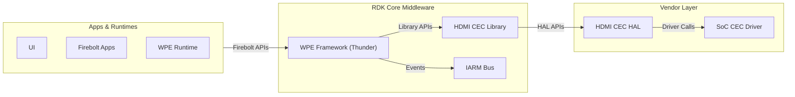
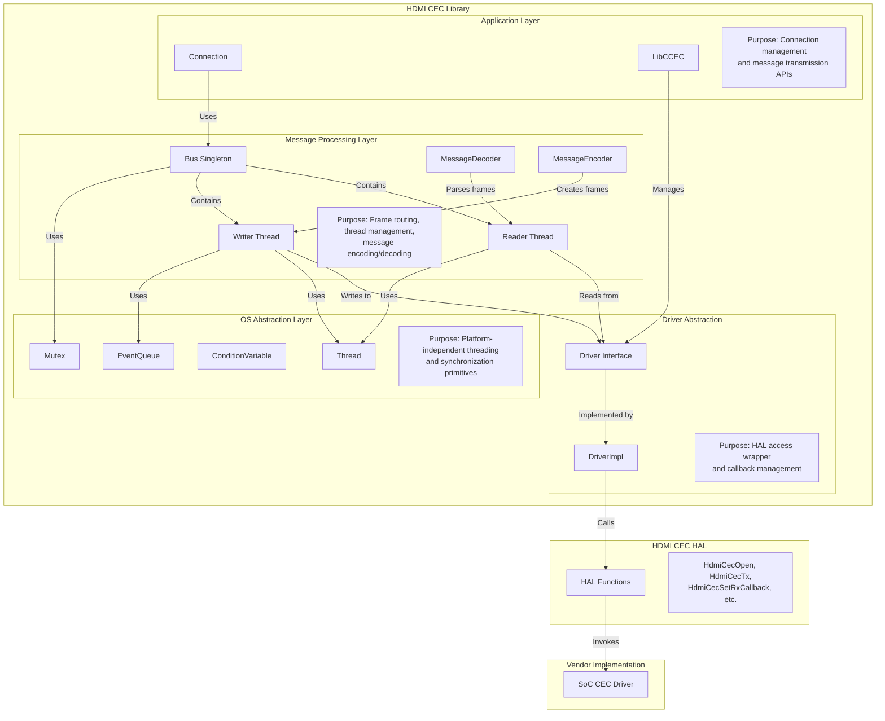
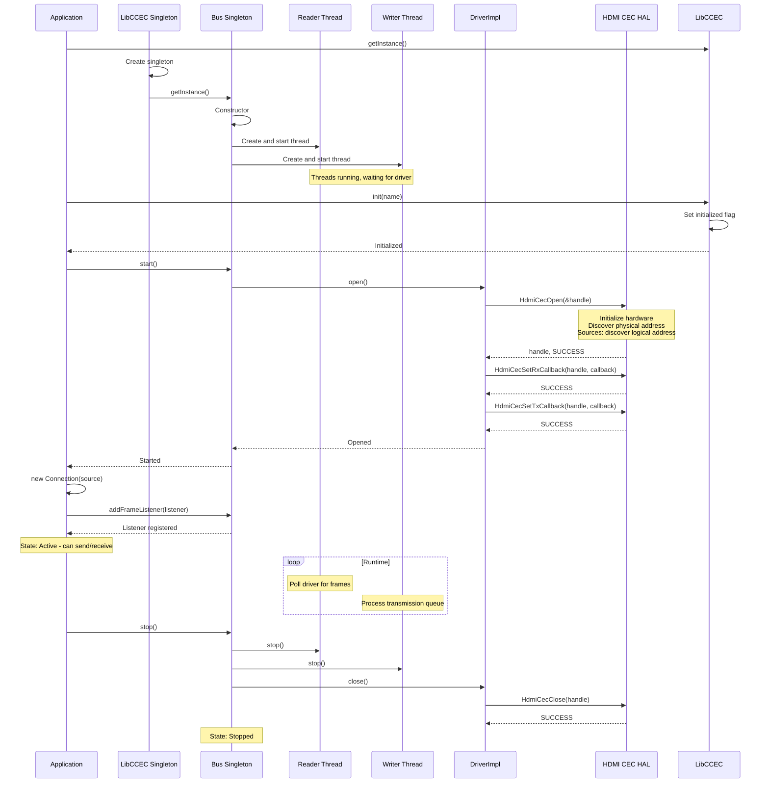
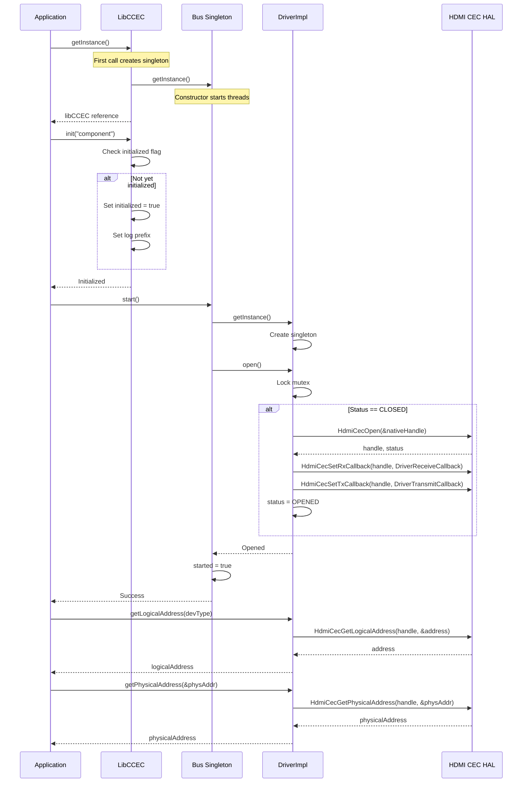
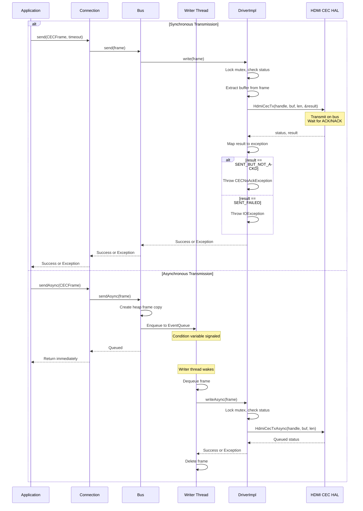
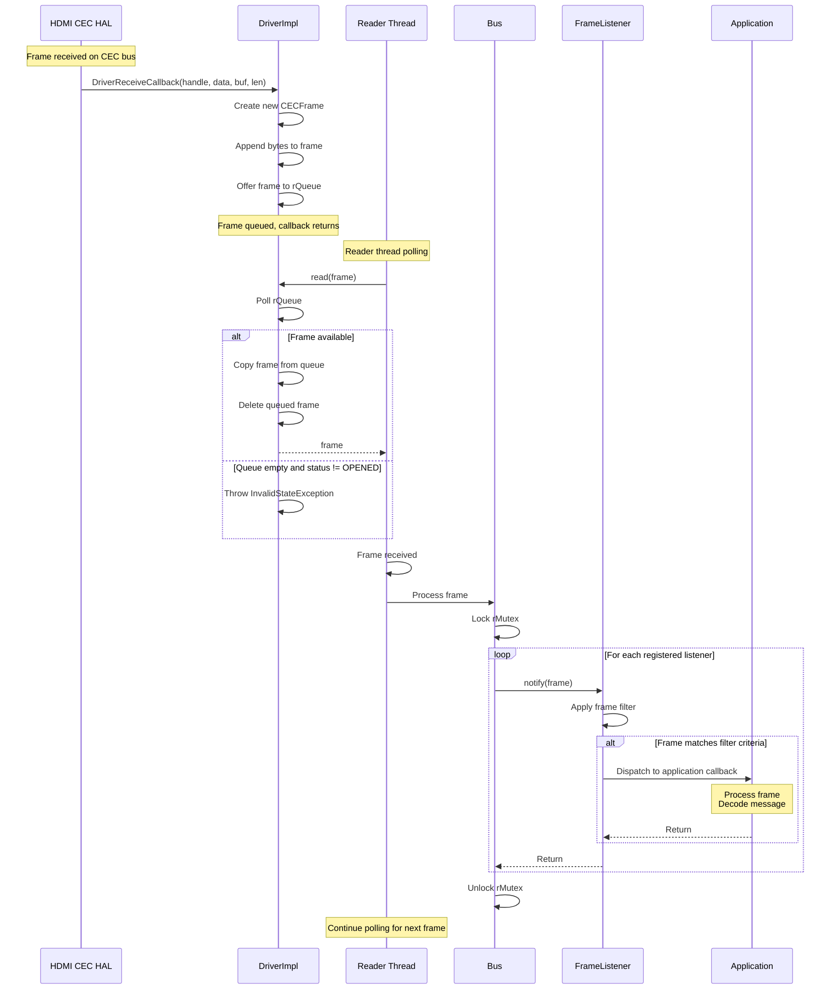
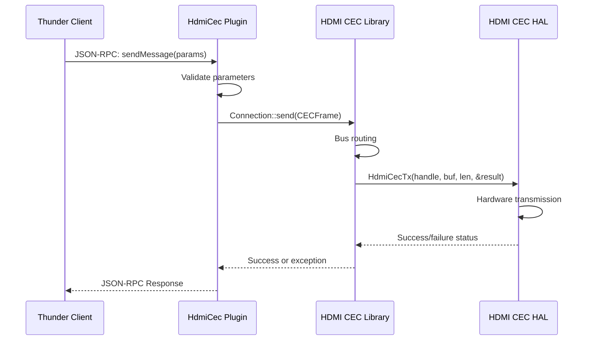
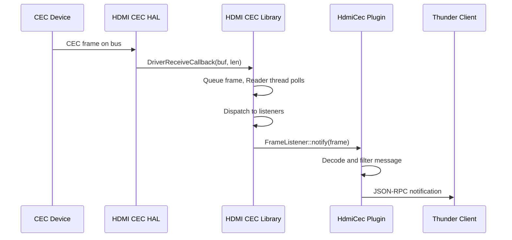

# HDMI CEC

HDMI CEC (Consumer Electronics Control) is a middleware library component in RDK that enables devices to communicate and control each other over HDMI connections through standardized control messages defined in the HDMI specification.

The library serves as an abstraction layer between application components and the hardware abstraction layer. It manages the complexities of CEC communication including address management, message routing, and protocol timing. The component provides both synchronous and asynchronous APIs for transmitting CEC messages and receiving messages from connected devices through a callback-based mechanism.

Operating within the RDK core middleware layer, the HDMI CEC library sits between Thunder plugins and the vendor HAL implementation. It provides a unified programming interface that handles CEC bus management, multi-threaded message processing, and frame-level protocol operations. The library enables features such as device power control coordination, input source switching, system audio control, and device capability discovery across the HDMI ecosystem.

**Key Features & Responsibilities:**

- **CEC Message Transmission and Reception**: Provides synchronous and asynchronous APIs for transmitting CEC frames onto the HDMI bus and receiving frames from connected devices through registered callback handlers.

- **Logical and Physical Address Management**: Handles logical address discovery for source devices during initialization and provides APIs for sink devices to manage address allocation on the CEC network.

- **Multi-threaded Bus Management**: Implements dedicated reader and writer threads for concurrent message processing, with thread-safe frame routing between the HAL driver and application listeners.

- **Message Type Support**: Supports encoding and decoding of CEC message types including power control, routing control, OSD operations, device information queries, system audio control, and ARC management commands.

- **Protocol Abstraction**: Encapsulates low-level protocol details including frame structure, header construction, operand handling, and timing requirements while providing clean object-oriented interfaces.

---

## Design

The HDMI CEC component implements a layered architecture that separates bus management, protocol handling, and hardware abstraction. At the core is the Bus singleton which manages the CEC communication channel through dedicated reader and writer threads. The reader thread continuously polls the driver for incoming frames and dispatches them to registered listeners, while the writer thread processes an event queue of outgoing frames. This design ensures non-blocking operations and meets CEC protocol timing requirements.

Applications interact with the CEC bus through Connection objects that represent logical taps into the bus. Each Connection is associated with a source logical address and can register FrameListener instances to receive incoming messages. The Bus dispatches received frames to all registered listeners, with each Connection applying its own filtering based on destination address. This design allows multiple concurrent connections to coexist, each handling messages for specific logical addresses.

Message handling uses a visitor pattern through the MessageProcessor class. Raw CEC frames are decoded into strongly-typed message objects by MessageDecoder, which then dispatches to appropriate process() methods. The MessageEncoder performs the inverse operation, converting message objects into byte-level frames for transmission. This separation allows applications to work with high-level message abstractions while the library handles protocol-level encoding details.

The southbound interface to hardware is provided through the Driver abstraction. DriverImpl wraps the HDMI CEC HAL functions, managing handle allocation, callback registration, and error translation. The HAL provides the actual hardware access through vendor-specific implementations. All HAL interactions are synchronized through mutexes to ensure thread safety.

The library does not implement direct inter-process communication mechanisms. Applications using this library typically integrate with IARM Bus for system-wide event distribution, but this integration happens at the application layer rather than within the library itself. The library focuses solely on CEC bus management and message transport.

Data persistence is not implemented within the library. Address discovery occurs at runtime during initialization, and no configuration state is stored. Applications are responsible for persisting any settings or preferences that need to survive across reboots.

### Prerequisites & Dependencies

The HDMI CEC library is designed as a standalone middleware library with minimal external dependencies. It requires a vendor-specific HAL implementation to interface with hardware and uses glib for basic utilities. The library does not directly depend on IARM, Device Settings, or Thunder framework components - these are used by applications that consume the library, not by the library itself. Build-time dependencies are limited to essential libraries that are actually invoked in the library source code.

#### Threading Model

The HDMI CEC component implements a multi-threaded architecture with explicit separation between message reception and transmission.

- **Threading Architecture**: Multi-threaded with dedicated reader and writer threads managed by the Bus singleton.

- **Main Thread**: Applications interact with the library through their own thread context when calling Connection, LibCCEC, and Driver APIs. All API calls are protected by mutexes to ensure thread safety.

- **Worker Threads**:
  - _Bus Reader Thread_: Continuously polls Driver.read() to receive incoming CEC frames. When a frame arrives, it locks the reader mutex and iterates through all registered FrameListener instances, invoking their notify() method synchronously. Owns the frame dispatch logic.
  - _Bus Writer Thread_: Processes an EventQueue of outgoing CECFrame pointers. Dequeues frames, invokes Driver.write() or Driver.writeAsync(), and handles transmission errors. Uses condition variables for efficient waiting when the queue is empty.

- **Synchronization**: 
  - Bus maintains separate reader mutex (rMutex) and writer mutex (wMutex) to protect listener lists and queue operations.
  - EventQueue uses internal condition variables for producer-consumer signaling between sendAsync() callers and the writer thread.
  - DriverImpl uses a single mutex to protect HAL handle and status state across all operations.
  - Connection uses a mutex to protect its local FrameListener list during add/remove operations.

- **Async / Event Dispatch**: Asynchronous transmission queues frames to the writer thread's EventQueue. The sendAsync() method returns immediately after queuing. The writer thread wakes on queue insert and processes frames sequentially. Incoming frame callbacks execute synchronously in the reader thread context, so FrameListener implementations must be thread-safe and complete quickly to avoid blocking reception of subsequent frames.

#### RDK-V Platform and Integration Requirements

- **WPEFramework Version**: Not a Thunder plugin. Used as a library by Thunder plugins. Compatible with Thunder R4 and later.

- **Build Dependencies**: 
  - virtual/vendor-hdmicec-hal: Vendor-specific HAL implementation that the library wraps. This is the primary interface to hardware and is directly called throughout DriverImpl.
  - glib-2.0 (>= 0.10.28): Provides core data structures and utilities used across the library codebase.
  - telemetry: Used for error event logging via t2_event_s() calls in Bus exception handling.
  - safec-common-wrapper or safec: Provides secure string operations when DISTRO_FEATURES includes 'safec', with SAFEC_DUMMY_API defined otherwise.

- **Device Services / HAL**: Requires vendor implementation of HDMI CEC HAL as defined in rdk-halif-hdmi_cec. The HAL must implement HdmiCecOpen, HdmiCecClose, HdmiCecTx, HdmiCecTxAsync, HdmiCecSetRxCallback, HdmiCecSetTxCallback, HdmiCecAddLogicalAddress, HdmiCecRemoveLogicalAddress, HdmiCecGetLogicalAddress, and HdmiCecGetPhysicalAddress functions.

- **IARM Bus**: The library itself does not use IARM directly. Applications consuming this library may use IARM for system-wide event distribution.

- **Systemd Services**: Library is linked into consuming processes. No dedicated systemd service.

- **Configuration Files**: Runtime logging level can be configured via /tmp/cec_log_enabled file containing one of: FATAL, ERROR, WARN, EXP, NOTICE, INFO, DEBUG, or TRACE.

- **Startup Order**: Library initialization via LibCCEC::init() must occur after the HAL driver is available. Bus singleton automatically starts reader and writer threads on first getInstance() call.

---

### Component State Flow

#### Initialization to Active State

The HDMI CEC library initialization begins when an application calls LibCCEC::getInstance() which creates the singleton instance and implicitly starts the Bus singleton. The Bus constructor automatically launches reader and writer threads that immediately begin running. The application then calls LibCCEC::init() to mark the library as initialized and optionally calls Bus::start() to open the driver. When the driver opens via DriverImpl::open(), it calls HdmiCecOpen() and registers receive and transmit callbacks. For source devices, the HAL performs logical address discovery during HdmiCecOpen(). The application creates Connection instances which register FrameListener objects with the Bus to begin receiving frames.

#### Runtime State Changes

During active operation, the component maintains stable state with continuous frame processing. State changes occur primarily in response to errors or explicit shutdown requests.

**State Change Triggers:**

- Reader thread encountering InvalidStateException from driver read indicates the driver is no longer open. The thread continues looping but will not receive valid frames until the driver is reopened.

- Writer thread receiving NULL frame from queue (sentinel value) indicates shutdown sequence initiated by Bus::stop(). The thread exits its processing loop.

- DriverImpl detects CLOSING state and injects NULL sentinel into receive queue to unblock the reader thread during shutdown.

- HAL transmission errors cause IOException exceptions propagated to the caller. The driver state remains OPENED and subsequent operations can proceed normally.

**Context Switching Scenarios:**

- Physical HDMI disconnection is handled by the HAL layer which may return errors on subsequent operations. The library does not automatically detect or recover from disconnection - the application must handle error returns and potentially reinitialize.

- Logical address changes for sink devices require explicit removeLogicalAddress() and addLogicalAddress() calls by the application. The library maintains the new address mapping after successful HAL calls.

- Power state transitions at the system level are transparent to the library. The HAL implementation is responsible for maintaining hardware state across suspend/resume cycles.

---

### Call Flows

#### Initialization Call Flow

#### Message Transmission Call Flow

#### Message Reception Call Flow

---

## Internal Modules

The HDMI CEC library is structured into functional modules that separate concerns across abstraction layers.

| Module / Class | Description                                                                    | Key Files                  |
| -------------- | ------------------------------------------------------------------------------ | -------------------------- |
| `Connection`   | Application interface for CEC bus access. Represents a logical tap into the bus with a specific source address. Manages FrameListener registration and filtering. | `Connection.cpp`, `Connection.hpp` |
| `LibCCEC`      | Library singleton managing initialization state and providing logical address allocation interface. Entry point for library setup. | `LibCCEC.cpp`, `LibCCEC.hpp` |
| `Bus`          | Central message routing hub. Manages reader and writer threads. Dispatches incoming frames to all registered listeners and queues outgoing frames for transmission. | `Bus.cpp`, `Bus.hpp` |
| `Driver`       | Abstract interface defining CEC driver operations. DriverImpl provides concrete implementation wrapping HAL function calls. Manages HAL handle and callback registration. | `Driver.cpp`, `Driver.hpp`, `DriverImpl.cpp`, `DriverImpl.hpp` |
| `CECFrame`     | Represents a raw CEC frame as a byte sequence. Provides methods for appending bytes, extracting buffer, and frame manipulation. | `CECFrame.cpp`, `CECFrame.hpp` |
| `MessageEncoder` | Converts strongly-typed CEC message objects into raw CECFrame byte sequences with proper header, opcode, and operand encoding. | `MessageEncoder.hpp` |
| `MessageDecoder` | Parses incoming CECFrame byte sequences into strongly-typed message objects. Receives external data from the CEC bus via HAL callbacks and decodes it into application-level messages. | `MessageDecoder.cpp`, `MessageDecoder.hpp` |
| `MessageProcessor` | Base class defining virtual process() methods for each supported CEC message type. Applications extend this class to implement custom message handling logic. | `MessageProcessor.hpp` |
| `Messages`     | Defines strongly-typed classes for CEC messages including ActiveSource, Standby, ReportPhysicalAddress, UserControlPressed, SetSystemAudioMode, and others. | `Messages.hpp` |
| `Operands`     | Defines operand classes for CEC message parameters including PhysicalAddress, Version, PowerStatus, and device type enumerations. | `Operands.hpp` |
| `OpCode`       | Enumerates all CEC operation codes and provides opcode-related utilities. | `OpCode.cpp`, `OpCode.hpp` |
| `Header`       | Represents the CEC header block containing source and destination logical addresses. | `Header.hpp` |
| `FrameListener` | Abstract callback interface for receiving frame notifications. Implementations receive external CEC frames from connected devices via the Bus dispatcher. | `FrameListener.hpp` |
| `Thread`       | OS abstraction for pthread management. Wraps Runnable instances and provides start/stop lifecycle control. | `Thread.cpp`, `Thread.hpp` |
| `Mutex`        | OS abstraction for pthread mutex. Provides AutoLock RAII wrapper for exception-safe locking. | `Mutex.cpp`, `Mutex.hpp` |
| `ConditionVariable` | OS abstraction for pthread condition variables. Used by EventQueue for thread signaling. | `ConditionVariable.cpp`, `ConditionVariable.hpp` |
| `EventQueue`   | Template-based thread-safe queue with condition variable signaling. Used by writer thread to queue outgoing frames. | `EventQueue.hpp` |

---

## Component Interactions

The HDMI CEC library interacts primarily with the vendor HAL layer and is consumed by Thunder plugins or other middleware components. The library itself does not directly participate in inter-process communication.

### Interaction Matrix

| Target Component / Layer  | Interaction Purpose                        | Key APIs / Topics                                |
| ------------------------- | ------------------------------------------ | ------------------------------------------------ |
| **RDK-E Plugins**         |                                            |                                                  |
| Thunder HdmiCec Plugin    | Exposes CEC functionality via JSON-RPC APIs to applications | Connection::send(), Connection::sendAsync(), FrameListener::notify() |
| **Device Services / HAL** |                                            |                                                  |
| HDMI CEC HAL              | Hardware abstraction for CEC transmission, reception, and address management | HdmiCecOpen(), HdmiCecClose(), HdmiCecTx(), HdmiCecTxAsync(), HdmiCecSetRxCallback(), HdmiCecSetTxCallback(), HdmiCecAddLogicalAddress(), HdmiCecRemoveLogicalAddress(), HdmiCecGetLogicalAddress(), HdmiCecGetPhysicalAddress() |
| Telemetry                 | Logging of error events and diagnostics | t2_event_s() for exception telemetry markers |
| **External Systems**      |                                            |                                                  |
| Connected CEC Devices     | Bi-directional CEC protocol messaging over HDMI physical layer | CEC protocol messages per HDMI Specification 1.4b |

### Events Published

The library itself does not publish events. Applications using this library publish events through their own mechanisms:

| Event Name  | IARM / JSON-RPC Topic  | Trigger Condition                 | Subscriber Components |
| ----------- | ---------------------- | --------------------------------- | --------------------- |
| `cecAddressesChanged` | Thunder JSON-RPC | Logical address added or removed (published by Thunder plugin) | UI applications, management services |
| `onMessage` | Thunder JSON-RPC | CEC frame received matching application filter (published by Thunder plugin) | UI applications requiring message visibility |

### IPC Flow Patterns

The library provides direct function call APIs and does not implement IPC itself. Applications using the library may implement IPC:

**Primary Request / Response Flow:**

**Event Notification Flow:**

---

## Implementation Details

### Major HAL APIs Integration

The library integrates with all HDMI CEC HAL functions defined in rdk-halif-hdmi_cec.

| HAL / DS API        | Purpose               | Implementation File |
| ------------------- | --------------------- | ------------------- |
| `HdmiCecOpen()` | Initializes the HAL and returns a handle. For source devices, performs logical address discovery. | `DriverImpl.cpp` in open() method |
| `HdmiCecClose()` | Closes the HAL instance and releases resources associated with the handle. | `DriverImpl.cpp` in close() method |
| `HdmiCecTx()` | Synchronously transmits a CEC message and waits for acknowledgment. Returns transmission result. | `DriverImpl.cpp` in write() method |
| `HdmiCecTxAsync()` | Asynchronously transmits a CEC message without blocking. Result delivered via callback. | `DriverImpl.cpp` in writeAsync() method |
| `HdmiCecSetRxCallback()` | Registers DriverReceiveCallback to receive incoming CEC messages from hardware. | `DriverImpl.cpp` in open() method |
| `HdmiCecSetTxCallback()` | Registers DriverTransmitCallback to receive asynchronous transmission status. | `DriverImpl.cpp` in open() method |
| `HdmiCecAddLogicalAddress()` | Adds a logical address for sink devices. Only applicable to sink devices. | `DriverImpl.cpp` in addLogicalAddress() |
| `HdmiCecRemoveLogicalAddress()` | Removes a previously added logical address for sink devices. | `DriverImpl.cpp` in removeLogicalAddress() |
| `HdmiCecGetLogicalAddress()` | Queries the current logical address assigned to the device. | `DriverImpl.cpp` in getLogicalAddress() |
| `HdmiCecGetPhysicalAddress()` | Retrieves the physical address based on HDMI connection topology. | `DriverImpl.cpp` in getPhysicalAddress() |

### Key Implementation Logic

- **State / Lifecycle Management**: Bus singleton maintains started flag indicating whether start() has been called. DriverImpl tracks status enum (CLOSED, OPENED, CLOSING) protected by mutex. LibCCEC singleton tracks initialized and connected flags.
  - Core implementation: `Bus.cpp` manages thread lifecycle
  - State transition: `DriverImpl.cpp` handles OPENED/CLOSED/CLOSING states
  - Thread management: `Bus.cpp` Reader::run() and Writer::run()

- **Event Processing**: Reader thread polls Driver::read() in a continuous loop. Driver::read() blocks on rQueue.poll() until a frame is available. When a frame arrives via DriverReceiveCallback, it's offered to the queue. Reader locks rMutex and iterates through all FrameListener instances calling notify() synchronously. No explicit event queue for received messages - dispatch happens immediately in reader thread context. Writer thread blocks on wQueue.poll() waiting for frames to transmit.
  - Frame dispatch: `Bus.cpp` Reader::run() iterates listener list
  - Queue management: `DriverImpl.cpp` uses EventQueue<CECFrame*> for receive queue
  - No prioritization or debouncing implemented

- **Error Handling Strategy**: HAL status codes are checked after each HAL call. DriverImpl maps specific status codes to typed exceptions: InvalidStateException for driver not open, CECNoAckException for HDMI_CEC_IO_SENT_BUT_NOT_ACKD, IOException for general failures. Exceptions propagate to callers who must handle them. No automatic retry logic implemented.
  - HAL error mapping: `DriverImpl.cpp` checks HDMI_CEC_IO_SUCCESS and throws exceptions
  - Exception types: IOException, CECNoAckException, InvalidStateException defined in Exception.hpp
  - No retry logic: Callers responsible for implementing retries per CEC specification requirements
  - Async error handling: DriverTransmitCallback logs errors but does not propagate to application

- **Logging & Diagnostics**: Uses CCEC_LOG macro throughout codebase. Log level configurable via /tmp/cec_log_enabled file. Supports levels: FATAL, ERROR, WARN, EXP, NOTICE, INFO, DEBUG, TRACE. Default level is LOG_INFO. Frame details logged showing hex dumps of transmitted and received byte sequences. Telemetry integration via t2_event_s() for error markers.
  - Log macro: CCEC_LOG(level, format, ...) defined in Util.hpp
  - Log levels: check_cec_log_status() reads /tmp/cec_log_enabled in Util.cpp
  - Key log points: Bus start/stop, driver open/close, frame transmission/reception, HAL errors
  - Frame dumps: dump_buffer() utility logs hex bytes, printFrameDetails() shows decoded frame structure

---

## Configuration

### Key Configuration Files

| Configuration File | Purpose        | Override Mechanism           |
| ------------------ | -------------- | ---------------------------- |
| `/tmp/cec_log_enabled` | Controls runtime log verbosity level | Create file with single line containing desired level: FATAL, ERROR, WARN, EXP, NOTICE, INFO, DEBUG, or TRACE |

### Key Configuration Parameters

No persistent configuration parameters. Runtime behavior controlled through:

| Parameter | Type | Default | Description                           |
| --------- | ---- | ------- | ------------------------------------- |
| Log Level | string | INFO | Runtime logging verbosity configured via /tmp/cec_log_enabled file |
| Logical Address | int (0x0-0xF) | Discovered at runtime | CEC logical address for message routing |
| Physical Address | uint (0x0000-0xFFFF) | Discovered at runtime | Four-nibble physical address from HDMI topology |
| Timeout | int (milliseconds) | 0 | Optional timeout parameter for synchronous send operations |

### Runtime Configuration

Log level can be changed at runtime by writing to /tmp/cec_log_enabled file. The check_cec_log_status() function reads this file but there is no active file monitoring - level changes take effect based on when the check function is called.

Address changes require API calls:
- For sink devices: Call HdmiCecRemoveLogicalAddress() then HdmiCecAddLogicalAddress() through Driver interface
- For source devices: Close and reopen the driver to trigger new address discovery

### Configuration Persistence

Configuration changes are not persisted across reboots. Logical and physical addresses are rediscovered during each initialization. Log level configuration via /tmp/cec_log_enabled persists only as long as the tmpfs filesystem retains the file.

---
