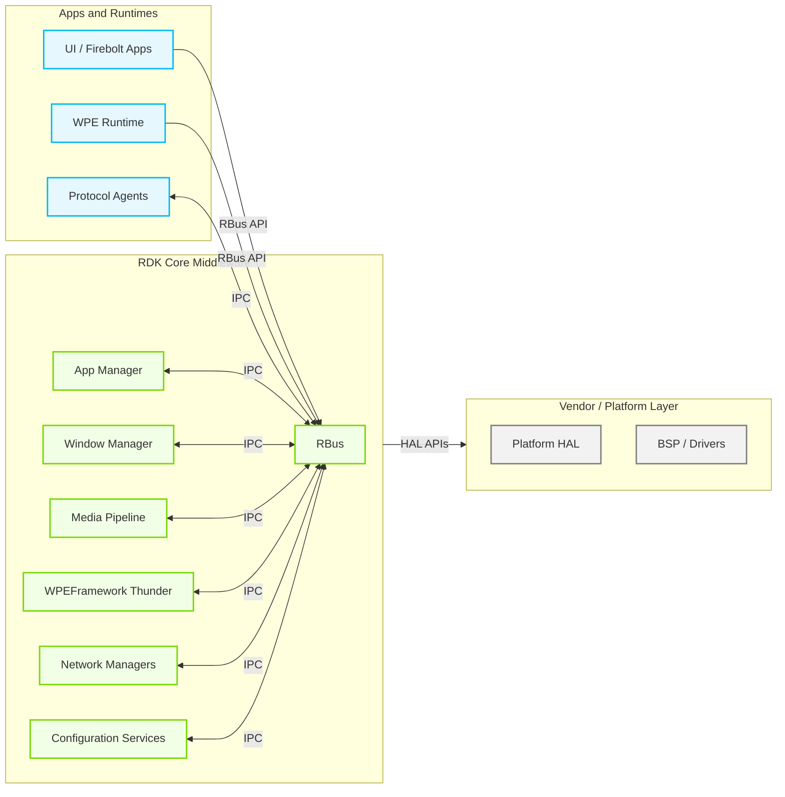
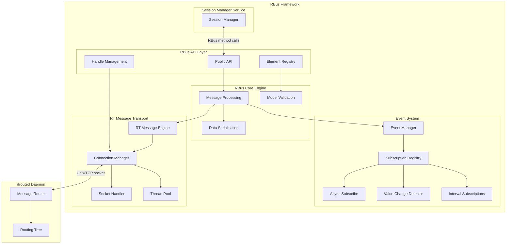
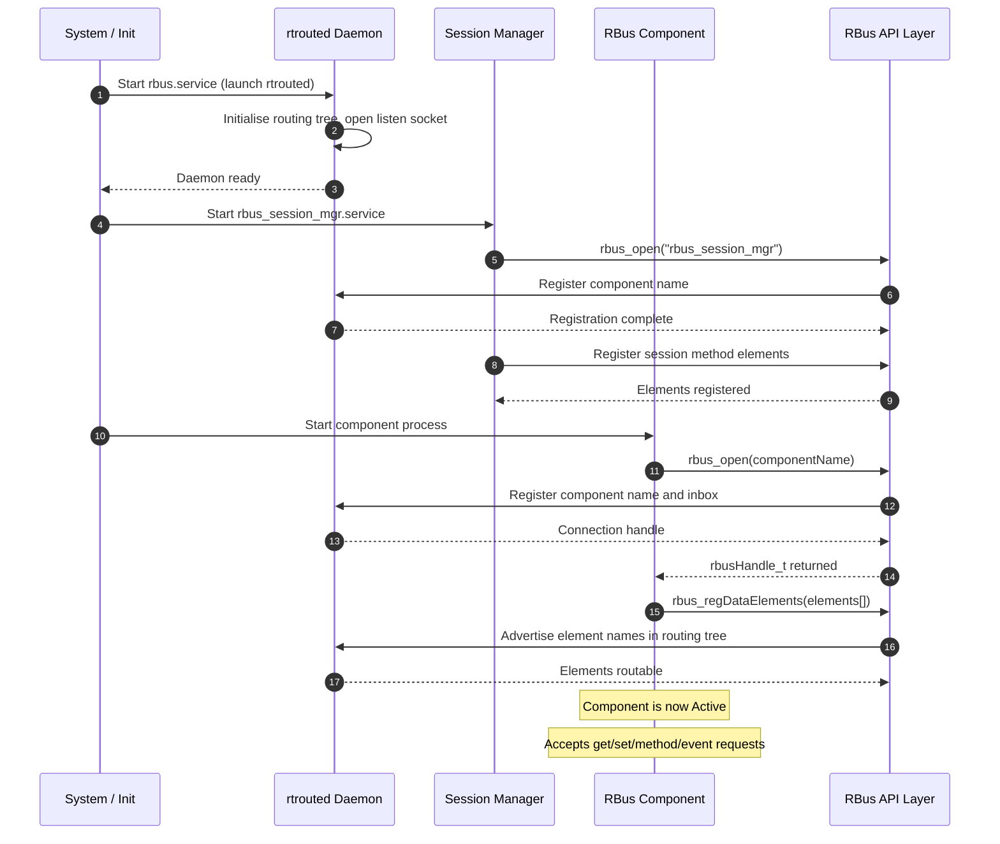
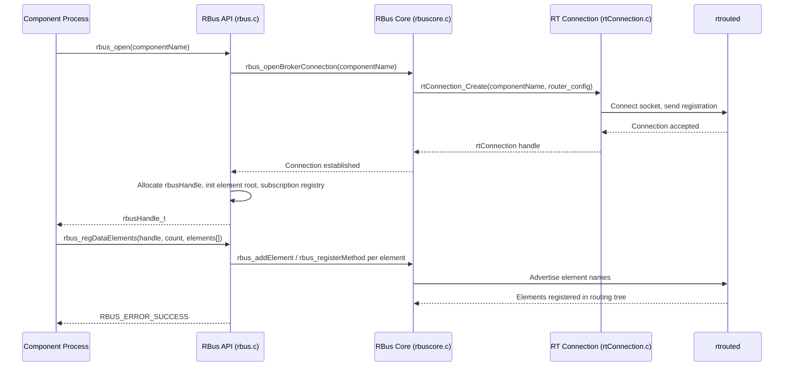
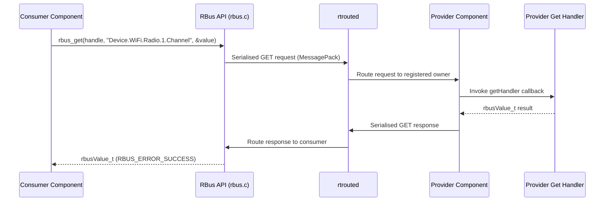
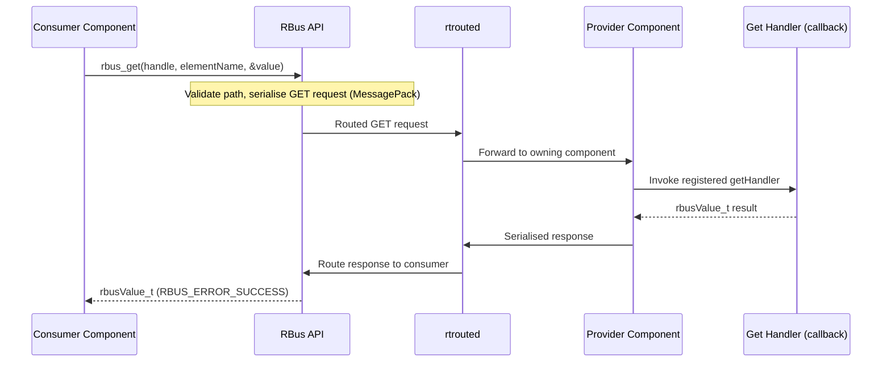
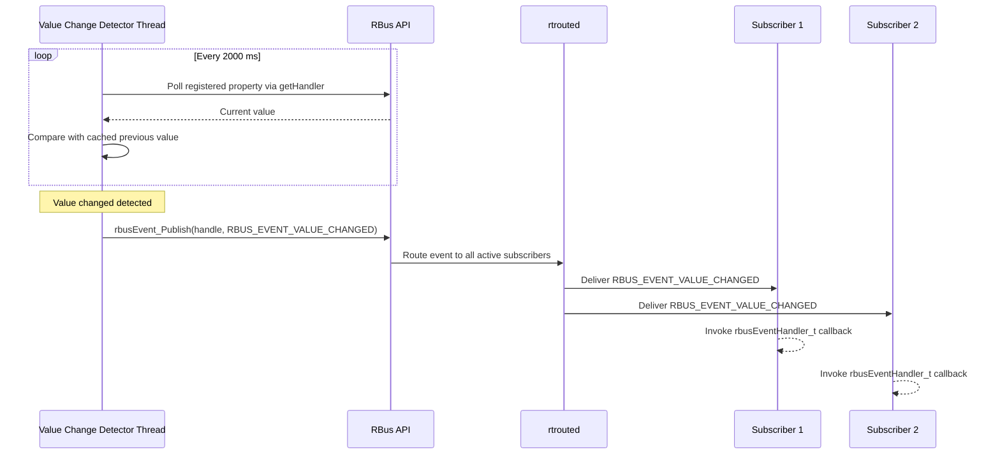
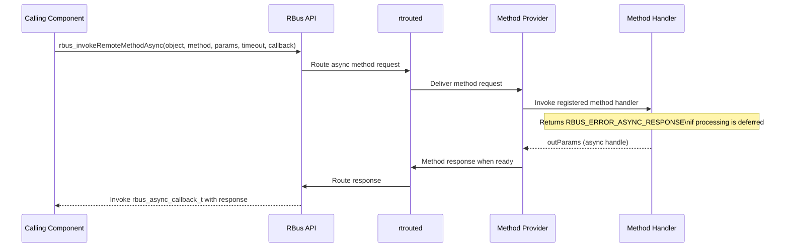

# RBus

RBus (RDK Bus) is a lightweight, fast, and efficient inter-process communication (IPC) framework used across RDK middleware. It allows multiple processes running on a hardware device to communicate through remote procedure calls (RPC), property get/set operations, and event-based messaging. RBus supports the creation and use of a hierarchical data model — a named tree of objects with properties, events, and methods — making it suitable for implementing parameter management specifications such as TR-181.

RBus follows a provider-consumer model. Providers register named objects, properties, events, and methods in the data model and implement the corresponding handlers. Consumers look up and interact with those elements across process boundaries. A single process can act as both a provider and a consumer simultaneously. The central message-routing daemon, `rtrouted`, serves as the broker through which all inter-process messages flow, decoupling components from direct peer-to-peer communication.

The framework is applicable across RDK middleware deployments covering both broadband and video platforms. It serves as the backbone IPC mechanism for components such as protocol agents, network managers, and configuration services on broadband platforms, and equally underpins application managers, window managers, media pipeline components, and browser runtimes on video platforms.



**Key Features & Responsibilities:**

- **Property Access**: Provides synchronous `get` and `set` operations over named, dot-separated parameter paths, supporting the full TR-181 naming convention including wildcards and instance notation (`{i}`).
- **Remote Method Invocation**: Supports both synchronous and asynchronous remote procedure calls with structured input and output parameter marshalling, configurable timeouts, and error propagation back to the caller.
- **Event System**: Implements a publish-subscribe mechanism for value-change detection, table row creation/deletion, interval-based notifications, and provider-defined general events. Subscriptions support optional filters and duration limits.
- **Hierarchical Data Model**: Manages a named tree of elements (properties, objects, tables, methods, events) that providers register and consumers traverse or query, including wildcard discovery.
- **Central Message Routing**: The `rtrouted` daemon routes all messages between registered components, enabling loose coupling. Clients connect to the daemon rather than to each other directly.
- **Session Management**: The `rbus_session_mgr` service serialises multi-step set operations by assigning session identifiers, ensuring that a group of parameter changes is committed atomically.
- **Optional Transport Security**: Supports the SPAKE2+ key-exchange cipher for encrypting messages between the router and clients when built with the corresponding compile-time option.
- **Subscription Persistence**: Caches active subscriptions to a temporary directory so that they can be restored automatically after a provider restarts, avoiding the need for consumers to re-subscribe.

---

## Design

RBus is structured as a layered C library with a clear separation between the public API, the core message-processing engine, the low-level transport, and supporting services. The public API (`rbus.h`) exposes all provider and consumer operations through opaque handle types, hiding all routing and serialisation details from callers. Internally, the core layer (`rbuscore`) translates API calls into typed messages serialised with MessagePack and forwards them through the RT Message transport layer to `rtrouted`, which routes each message to the appropriate destination process. This hub-and-spoke topology means that every component connects only to the central daemon, with all message routing handled centrally.

Northbound, the API layer presents a unified C interface covering property get/set and table management operations used in data model-driven middleware as well as event-driven patterns used by application and media middleware. Southbound, the RT Message transport layer provides the connection management, socket lifecycle, and message framing needed to communicate with `rtrouted`. Hardware-specific values are accessed by the provider component through its own HAL before being exposed via the data model.

Data persistence is handled externally. RBus itself writes subscription state to a configurable temporary directory (default `/tmp`) so that subscriptions survive provider restarts. Persistent parameter values are the responsibility of each provider component, which may use the platform's persistent storage facilities independently of RBus.



The northbound interface is the C API defined in `rbus.h`, which components include to open connections, register data elements, and invoke or respond to remote operations. The southbound interface is the `rtConnection` abstraction, which wraps the socket-level communication with `rtrouted`. The session manager service (`rbus_session_mgr`) is a separate process that communicates with other components exclusively over RBus method calls, providing session-ID allocation without any dedicated IPC channel.

### Threading Model

- **Threading Architecture**: Multi-threaded with per-handle and per-element synchronisation.
- **Main Thread**: Handles API entry points for synchronous operations such as `rbus_open`, `rbus_get`, `rbus_set`, `rbus_regDataElements`, and `rbus_close`. Protected by a process-wide mutex (`gMutex`).
- **Worker Threads**:
  - _Callback Thread_ (one per `rtConnection`): Reads inbound messages from the socket and dispatches them to registered handlers. Created and managed within `rtConnection.c`.
  - _Thread Pool Workers_ (`rtThreadPool`): Processes asynchronous tasks submitted by the callback thread, including async method responses and subscription deliveries.
  - _Value Change Detector Thread_: Polls registered property nodes at a fixed 2000 ms interval to detect value changes and trigger `RBUS_EVENT_VALUE_CHANGED` notifications to active subscribers.
  - _Async Subscribe Thread_: Manages subscription retry logic, backing off up to 60 000 ms between retries within a 600 000 ms total timeout window.
- **Synchronization**: Per-handle mutexes (`handle_eventSubsMutex`, `handle_subsMutex`) protect the consumer and provider subscription lists respectively. Per-element mutexes (`elmMutex`) serialise access to individual element nodes in the registration tree.

### Prerequisites and Dependencies

**Build-Time Configurations:**

| CMake Option                  | Build Flag             | Purpose                                                                                               | Default                              |
| ----------------------------- | ---------------------- | ----------------------------------------------------------------------------------------------------- | ------------------------------------ |
| `MSG_ROUNDTRIP_TIME=ON`       | `MSG_ROUNDTRIP_TIME=1` | Records per-message round-trip timestamps for latency diagnostics in `rtrouted`                       | OFF (ON when `BUILD_FOR_DESKTOP=ON`) |
| `WITH_SPAKE2=ON`              | `WITH_SPAKE2=1`        | Enables SPAKE2+ key-exchange cipher between `rtrouted` and clients                                    | OFF                                  |
| `ENABLE_ADDRESS_SANITIZER=ON` | `-fsanitize=address`   | Enables AddressSanitizer for memory-error detection during development                                | OFF                                  |
| `ENABLE_RDKLOGGER=ON`         | `ENABLE_RDKLOGGER`     | Routes internal log output through the RDK Logger instead of the built-in `rtLog` handler             | OFF                                  |
| `BUILD_RBUS_DAEMON=ON`        | —                      | Builds the `rtrouted` daemon and `rbus_session_mgr` service                                           | ON                                   |
| `BUILD_ONLY_RTMESSAGE=ON`     | —                      | Builds only the RT Message transport layer, omitting the RBus API and core layers                     | OFF                                  |
| `BUILD_FOR_DESKTOP=ON`        | —                      | Configures the build for a Linux desktop host, fetching and linking `linenoise` as an ExternalProject | OFF                                  |

**Platform and Integration Requirements:**

- **Build Dependencies**: cJSON library (required for all builds); MessagePack (`msgpack-c`) and `linenoise` required unless `BUILD_ONLY_RTMESSAGE=ON`; optional `rdklogger` when `ENABLE_RDKLOGGER=ON`; optional `breakpad` crash-reporting library.
- **Systemd Services**: `rbus.service` (launches `rtrouted`) must be active before any RBus-connected component starts. A session manager service (`rbus_session_mgr.service` or `rbus_sessmgr_rdkv.service`, depending on the platform) must also be running for session-based set operations.
- **Startup Order**: Two ordering variants exist across platforms. In one variant, `rbus.service` starts first and `rbus_session_mgr.service` is ordered `After=rbus.service`. In the other, `rbus_sessmgr_rdkv.service` is ordered `Before=rbus.service`, allowing the session manager to be present before any component registers.
- **Configuration Files**: Platform-specific router configuration (e.g., `rbus_rdkv.conf`) may override systemd `ExecStart` arguments via `RTROUTER_OPTIONAL_ARGS`. Client configurations that need to reach `rtrouted` over TCP specify the address `tcp://127.0.0.1:10001` explicitly.
- **Temporary Storage**: The subscription cache and runtime socket files are stored under `/tmp`. The `rbus.service` ExecStopPost cleans `/tmp/rtrouted*` on daemon exit.

---

### Component State Flow

#### Initialization to Active State

RBus transitions through a structured sequence from daemon startup through element registration to active message processing. The `rtrouted` daemon must be fully running before any component calls `rbus_open`. The session manager connects to the daemon over RBus itself, so it blocks internally until the daemon is available even when started concurrently.



#### Runtime State Changes

**State Change Triggers:**

- A consumer calling `rbusEvent_Subscribe` causes the provider to record the subscription and begin detecting value changes or accepting event publications for that subscriber.
- A subscriber process crash or clean disconnect triggers `rbusSubscriptions_handleClientDisconnect`, which removes all subscriptions associated with that listener address without requiring explicit unsubscribe calls.
- A provider process restart causes `rtrouted` to signal its clients; pending subscriptions are restored from the subscription cache file in `/tmp` when the provider re-registers its elements.
- Under high message load, the thread pool in the transport layer absorbs bursty traffic through queuing, maintaining consistent component behavior.

**Context Switching Scenarios:**

- When a component calls `rbus_close`, all registered elements are de-registered, all provider-side subscriptions are cleaned up, and the `rtConnection` to `rtrouted` is torn down.
- A component may hold up to `RBUS_MAX_HANDLES` (16) simultaneous open handles, allowing a single process to register elements under multiple logical component names.

---

### Call Flows

#### Initialization Call Flow



#### Request Processing Call Flow

Property get and set operations follow a synchronous request-response pattern. The RBus API serialises the request using MessagePack, routes it through `rtrouted` to the provider process, and blocks until the provider returns a value or an error.



---

## Internal Modules

| Module / Class            | Description                                                                                                                                                                                                                                                                                                                                 | Key Files                                                                                              |
| ------------------------- | ------------------------------------------------------------------------------------------------------------------------------------------------------------------------------------------------------------------------------------------------------------------------------------------------------------------------------------------- | ------------------------------------------------------------------------------------------------------ |
| **RBus API Layer**        | Public C interface for all provider and consumer operations. Implements `rbus_open`, `rbus_close`, `rbus_get`, `rbus_set`, `rbus_regDataElements`, `rbusEvent_Subscribe`, `rbusEvent_Publish`, `rbus_invokeRemoteMethod`, and table management. Translates API calls into core-layer operations and handles legacy data-type compatibility. | `rbus.c`, `rbus.h`                                                                                     |
| **Handle Management**     | Maintains a process-wide list of at most 16 open `rbusHandle_t` instances. Each handle tracks the component name, element registration tree root, consumer event-subscription list, provider subscription registry, and the underlying `rtConnection`.                                                                                      | `rbus_handle.c`, `rbus_handle.h`                                                                       |
| **Element Registry**      | Stores registered data model elements in an in-process tree (`elementNode`). Each node carries the element type, callback table, subscription list, last-change metadata, and a per-element mutex. Supports insertion, retrieval by exact name, wildcard traversal, and table row instantiation/deletion.                                   | `rbus_element.c`, `rbus_element.h`                                                                     |
| **RBus Core Engine**      | Translates high-level API operations into typed wire messages and invokes the RT Message transport. Implements object registration (`rbus_registerObj`), element management (`rbus_addElement`), method registration, event registration, and the synchronous/asynchronous RPC primitives (`rbus_invokeRemoteMethod`).                      | `rbuscore.c`, `rbuscore.h`, `rbuscore_message.c`, `rbuscore_message.h`                                 |
| **RT Message Transport**  | Low-level message framing, socket management, and connection lifecycle. `rtrouted.c` is the standalone routing daemon that maintains a routing tree of all registered component names and element paths. `rtConnection.c` provides the per-process client connection, including a dedicated callback thread for inbound messages.           | `rtrouted.c`, `rtConnection.c`, `rtMessage.c`, `rtSocket.c`, `rtRoutingTree.c`                         |
| **Thread Pool**           | Fixed-size worker thread pool used by the transport layer to process inbound message callbacks concurrently without blocking the network I/O thread.                                                                                                                                                                                        | `rtThreadPool.c`, `rtThreadPool.h`                                                                     |
| **Event System**          | Manages provider-side subscription registrations keyed by `[listener, eventName, filter]`. Persists subscription state to a file under `/tmp` for recovery after provider restarts. Handles table-row-added and table-row-removed subscriptions automatically.                                                                              | `rbus_subscriptions.c`, `rbus_subscriptions.h`                                                         |
| **Async Subscribe**       | Implements the consumer-side retry loop for `rbusEvent_SubscribeAsync`. Retries failed subscriptions with exponential back-off up to `RBUS_SUBSCRIBE_MAXWAIT` (60 000 ms) within a total window of `RBUS_SUBSCRIBE_TIMEOUT` (600 000 ms).                                                                                                   | `rbus_asyncsubscribe.c`, `rbus_asyncsubscribe.h`                                                       |
| **Value Change Detector** | Polls properties registered by active value-change subscribers at a fixed 2000 ms period. Compares the current provider-returned value against the cached previous value and calls `rbusEvent_Publish` when a change is detected.                                                                                                           | `rbus_valuechange.c`, `rbus_valuechange.h`                                                             |
| **Interval Subscription** | Delivers periodic `RBUS_EVENT_INTERVAL` events to subscribers that request time-based updates at a specified interval in milliseconds.                                                                                                                                                                                                      | `rbus_intervalsubscription.c`, `rbus_intervalsubscription.h`                                           |
| **Value Management**      | Reference-counted variant type (`rbusValue_t`) covering all supported data types: boolean, char, byte, int8/16/32/64, uint8/16/32/64, float, double, datetime, string, byte array, property, and object. All instances are non-thread-safe by design; callers are responsible for synchronisation.                                          | `rbus_value.c`, `rbus_value.h`, `rbus_property.c`, `rbus_property.h`, `rbus_object.c`, `rbus_object.h` |
| **Filter**                | Optional subscription filter attached at subscribe time. The provider evaluates the filter before delivering events, reducing unnecessary deliveries to consumers.                                                                                                                                                                          | `rbus_filter.c`, `rbus_filter.h`                                                                       |
| **Session Manager**       | Standalone service process that serialises multi-step set sessions. Exposes `RBUS_SMGR_METHOD_REQUEST_SESSION_ID` and `RBUS_SMGR_METHOD_GET_CURRENT_SESSION_ID` as RBus methods, and publishes a general event (`currentSessionIDSignal`) when the active session changes.                                                                  | `session_manager.c`, `rbus_session_mgr.h`                                                              |
| **Cipher (SPAKE2+)**      | Optional message encryption layer built on the SPAKE2+ password-authenticated key-exchange protocol. Encrypts message payloads between `rtrouted` and clients when enabled at compile time.                                                                                                                                                 | `rtCipher.c`, `rtCipher.h`                                                                             |
| **Logging**               | Dual-backend logging abstraction: selects between the built-in `rtLog` handler and the platform RDK Logger at build time or at runtime via `rtLog_SetOption`. Supports five levels: DEBUG, INFO, WARN, ERROR, FATAL.                                                                                                                        | `rtLog.c`, `rtLog.h`, `rbus_log.h`                                                                     |

---

## Component Interactions

RBus serves as the central IPC backbone for RDK middleware across all platform variants. Every component that opens an `rbus_open` connection becomes reachable by all other connected components through the `rtrouted` message router.

### Interaction Matrix

| Target Component / Layer                 | Interaction Purpose                                                                          | IPC Mechanism             | Communication Pattern      | Key APIs / Endpoints                                                             |
| ---------------------------------------- | -------------------------------------------------------------------------------------------- | ------------------------- | -------------------------- | -------------------------------------------------------------------------------- |
| **Data Model and Management Middleware** |                                                                                              |                           |                            |                                                                                  |
| Protocol Agents (TR-069 / WebPA / USP)   | Read and write data model parameters; receive value-change notifications for ACS reporting   | RBus Native (MessagePack) | Request-Response / Pub-Sub | `rbus_get()`, `rbus_set()`, `Device.*` namespace                                 |
| Network Managers                         | Expose network configuration parameters; publish link-state events                           | RBus Native               | Request-Response / Events  | `rbus_regDataElements()`, `rbusEvent_Publish()`                                  |
| Configuration Services                   | Persistent parameter storage; device configuration management                                | RBus Native               | Synchronous Calls          | `rbus_get()`, `rbus_set()`                                                       |
| **Application and Media Middleware**     |                                                                                              |                           |                            |                                                                                  |
| WPEFramework (Thunder) Plugins           | Expose device capability parameters; subscribe to state-change events from platform services | RBus Native               | Request-Response / Events  | `rbus_get()`, `rbusEvent_Subscribe()`                                            |
| Application Manager                      | Query application lifecycle state; receive readiness or termination events                   | RBus Native               | Event-Driven               | `rbusEvent_Subscribe()`, `rbusEvent_Publish()`                                   |
| Window Manager                           | Receive display configuration parameters; publish compositor state changes                   | RBus Native               | Request-Response / Events  | `rbus_get()`, `rbusEvent_Publish()`                                              |
| Media Pipeline Components                | Publish playback state and quality metrics; receive configuration updates                    | RBus Native               | Events / Polling           | `rbusEvent_Publish()`, `rbus_set()`                                              |
| Native Script Runtime                    | Access device parameters through the data model for script-driven automation                 | RBus Native               | Request-Response           | `rbus_get()`, `rbus_set()`                                                       |
| **System Layer**                         |                                                                                              |                           |                            |                                                                                  |
| rtrouted Daemon                          | Central message broker for all inter-process routing                                         | Unix domain socket / TCP  | Connection-Oriented        | `rtConnection_Create()`, `rtConnection_SendMessage()`                            |
| Session Manager Service                  | Session-ID allocation for multi-step set operations                                          | RBus method call          | Synchronous RPC            | `RBUS_SMGR_METHOD_REQUEST_SESSION_ID`, `RBUS_SMGR_METHOD_GET_CURRENT_SESSION_ID` |
| Systemd                                  | Service lifecycle ordering; rbus.service and rbus_session_mgr.service dependency chain       | systemd D-Bus             | Service Ordering           | `After=`, `Before=` directives                                                   |

### Events Published

| Event Name / Type                         | Event Path / Name        | Trigger Condition                                                                | Payload                                              | Subscriber Components                         |
| ----------------------------------------- | ------------------------ | -------------------------------------------------------------------------------- | ---------------------------------------------------- | --------------------------------------------- |
| `RBUS_EVENT_VALUE_CHANGED`                | `{element.path}`         | A registered property value changes, detected by the value-change polling thread | `{name, type=VALUE_CHANGED, data={value}}`           | Any subscriber to that element path           |
| `RBUS_EVENT_OBJECT_CREATED`               | `{table.path}`           | A new table row instance is added to a registered table element                  | `{name, type=OBJECT_CREATED, data={instNum, alias}}` | Subscribers to the table path                 |
| `RBUS_EVENT_OBJECT_DELETED`               | `{table.path}`           | A table row instance is removed from a registered table element                  | `{name, type=OBJECT_DELETED, data={instNum}}`        | Subscribers to the table path                 |
| `RBUS_EVENT_GENERAL`                      | Provider-defined name    | Provider explicitly calls `rbusEvent_Publish`                                    | Provider-defined `rbusObject_t` payload              | Any subscriber to that event name             |
| `RBUS_EVENT_INTERVAL`                     | Provider-defined name    | Elapsed interval timer fires                                                     | Provider-defined `rbusObject_t` payload              | Subscribers that specified an interval        |
| `currentSessionIDSignal`                  | `currentSessionIDSignal` | Session Manager creates or closes a session                                      | `{return_value, sessionid}` (int32)                  | Components using session-based set operations |
| Advisory: client connected / disconnected | Internal advisory topic  | A component calls `rbus_open` or `rbus_close`                                    | Client identifier                                    | Internal subscription cleanup handlers        |

### IPC Flow Patterns

**Primary Request / Response Flow — Property Get:**



**Event Notification Flow — Value Change:**



**Async Method Invocation Flow:**



---

## Implementation Details

### Key Implementation Logic

- **Handle and Element Lifecycle**: `rbus_open` allocates a `_rbusHandle` structure, establishes the `rtConnection` to `rtrouted`, registers the component name, and initialises an empty element tree and subscription registries. `rbus_close` reverses this sequence, de-registering all elements, cleaning up subscriptions, and releasing the connection. Up to 16 handles may be open simultaneously per process (`RBUS_MAX_HANDLES`). Core implementation in `rbus.c` and `rbus_handle.c`; element tree operations in `rbus_element.c`.

- **Event Processing**: Provider-side subscriptions are stored in `rbusSubscriptions_t`, serialised to a file in `/tmp` under the component name for crash recovery. When a provider restarts and re-registers its elements, `rbusSubscriptions_resubscribeElementCache` reloads the file and re-activates matching subscriptions. Consumer-side subscriptions are stored in the handle's `eventSubs` vector; disconnecting subscribers are cleaned up automatically via `rbusSubscriptions_handleClientDisconnect` when `rtrouted` delivers a client-disconnect advisory. Subscription retry for async subscriptions is managed in `rbus_asyncsubscribe.c` with back-off up to `RBUS_SUBSCRIBE_MAXWAIT`.

- **Error Handling Strategy**: The `rbusError_t` enumeration covers all error conditions from transport failures (`RBUS_ERROR_DESTINATION_NOT_FOUND`, `RBUS_ERROR_DESTINATION_NOT_REACHABLE`) to validation errors (`RBUS_ERROR_INVALID_INPUT`, `RBUS_ERROR_INVALID_PARAMETER_TYPE`) and access control rejections (`RBUS_ERROR_ACCESS_NOT_ALLOWED`, `RBUS_ERROR_NOT_WRITABLE`). Core-layer `rbusCoreError_t` values are mapped to `rbusError_t` by `rbusCoreError_to_rbusError()` in `rbus.c`. Timeout handling uses `RBUS_ERROR_TIMEOUT`; asynchronous method handlers that defer processing return `RBUS_ERROR_ASYNC_RESPONSE`.

- **Logging and Diagnostics**: The logging subsystem (`rtLog`) supports DEBUG, INFO, WARN, ERROR, and FATAL levels, selectable at runtime via `rtLog_SetLevel`. The backend can be switched between the built-in handler and the RDK Logger via `rtLog_SetOption`. The `rbuscli` interactive utility (`utils/rbuscli/`) allows operators to register data model elements, execute get/set/method/subscribe operations, and observe event deliveries from a shell, providing a diagnostic surface for integration testing and field debugging. When `MSG_ROUNDTRIP_TIME` is enabled, `rtrouted` records per-message entry and exit timestamps accessible via the `RTROUTED_TRANSACTION_TIME_INFO` field.

---

## Configuration

### Key Configuration Files

| Configuration File                                       | Purpose                                                                                                                                                  | Override Mechanism                                           |
| -------------------------------------------------------- | -------------------------------------------------------------------------------------------------------------------------------------------------------- | ------------------------------------------------------------ |
| `/usr/lib/systemd/system/rbus.service`                   | Launches `rtrouted` as a forking service. `ExecStopPost` clears `/tmp/rbus_stopped`.                                                                     | `RTROUTER_OPTIONAL_ARGS` environment variable in `ExecStart` |
| `/usr/lib/systemd/system/rbus_session_mgr.service`       | Launches `rbus_session_mgr` ordered `After=rbus.service`. Blocks internally until `rtrouted` is available.                                               | Systemd drop-in overrides                                    |
| `/usr/lib/systemd/system/rbus_sessmgr_rdkv.service`      | Alternate session manager service unit ordered `Before=rbus.service`, used on platforms where the session manager must be present before daemon startup. | Systemd drop-in overrides                                    |
| `/etc/rbus/rbus_rdkv.conf` (or equivalent platform conf) | Provides router startup arguments and service identity for `rtrouted`. Sets `SyslogIdentifier` and `Restart=always`. Ordered `After=nvram.service`.      | Platform image build                                         |
| `rbus_client_rdkc.conf`                                  | Specifies the router connection address for client processes that connect over TCP (`tcp://127.0.0.1:10001`).                                            | Replaced per platform during image build                     |
| `/tmp/rtrouted*`                                         | Runtime socket and routing-state files created by `rtrouted` at startup. Removed on service stop via `ExecStopPost`.                                     | Managed by `rtrouted`                                        |

### Key Configuration Parameters

| Parameter                       | Source           | Default                 | Description                                                                |
| ------------------------------- | ---------------- | ----------------------- | -------------------------------------------------------------------------- |
| `RBUS_MAX_HANDLES`              | `rbus_handle.h`  | 16                      | Maximum number of simultaneously open `rbusHandle_t` instances per process |
| `MAX_REGISTERED_OBJECTS`        | `rbuscore.h`     | 64                      | Maximum number of objects a single component may register                  |
| `MAX_SUPPORTED_METHODS`         | `rbuscore.h`     | 32                      | Maximum number of methods per registered object                            |
| `RBUS_MAX_NAME_LENGTH`          | `rbus.h`         | 256                     | Maximum character length of any element name                               |
| `RBUS_MAX_NAME_DEPTH`           | `rbus.h`         | 16                      | Maximum dot-separated depth of any element path                            |
| `RBUS_SUBSCRIBE_TIMEOUT`        | `rbus_handle.h`  | 600 000 ms              | Total async-subscribe retry window before the subscription is abandoned    |
| `RBUS_SUBSCRIBE_MAXWAIT`        | `rbus_handle.h`  | 60 000 ms               | Maximum back-off interval between async-subscribe retry attempts           |
| `RBUS_VALUECHANGE_PERIOD`       | `rbus_handle.h`  | 2 000 ms                | Polling interval used by the value-change detector thread                  |
| `RTMSG_DEFAULT_ROUTER_LOCATION` | `rtConnection.h` | `tcp://127.0.0.1:10001` | Default TCP address used by `rtConnection` to reach `rtrouted`             |

### Runtime Configuration

The router address used by client processes can be overridden at runtime by supplying a configuration file path to `rtConnection_CreateWithConfig`. The `rbuscli` utility accepts the router address as a command-line argument, allowing it to target a non-default `rtrouted` instance:

```bash
# Start the interactive rbuscli tool
rbuscli -i

# Register a property element as a provider
> reg prop Device.Example.Parameter1

# Set and get the value as a consumer (from a second rbuscli session)
> set Device.Example.Parameter1 string "value"
> get Device.Example.Parameter1

# Subscribe to value-change events
> log events
> sub Device.Example.Parameter1
```

### Configuration Persistence

Parameter value persistence is managed by each provider component independently. Subscription state is written to `/tmp` by `rbus_subscriptions.c` to support provider process restarts within a boot session. This cache is removed when `rtrouted` exits.
