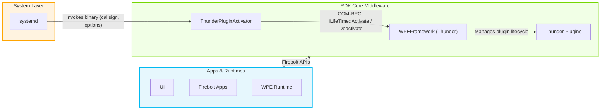
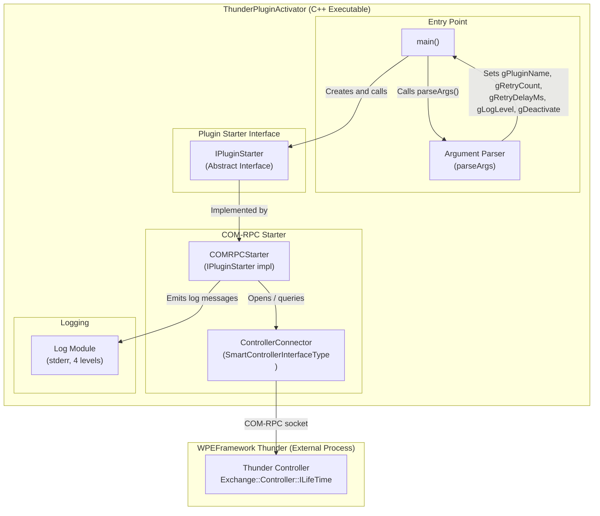
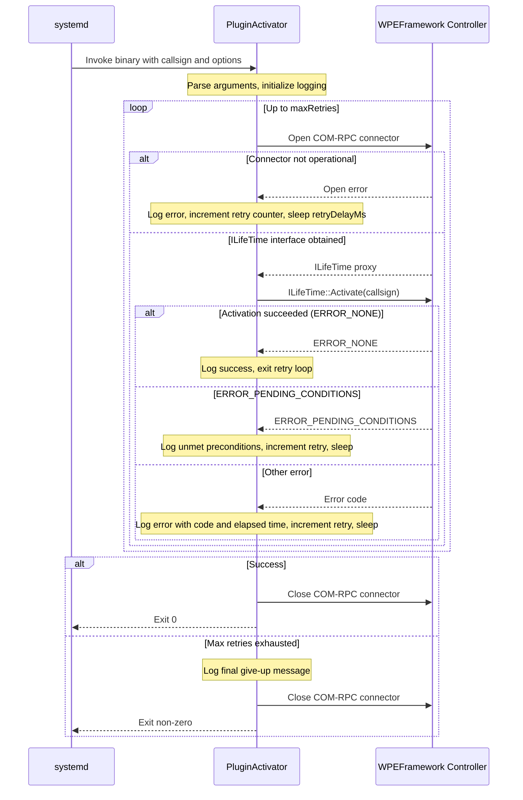
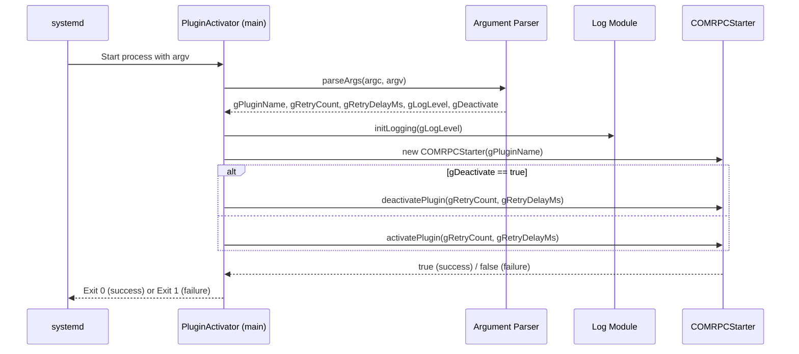
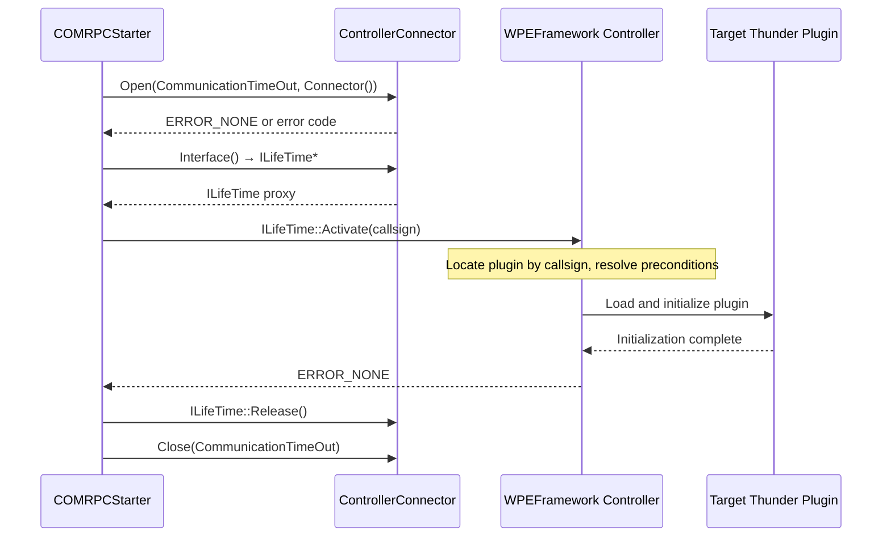
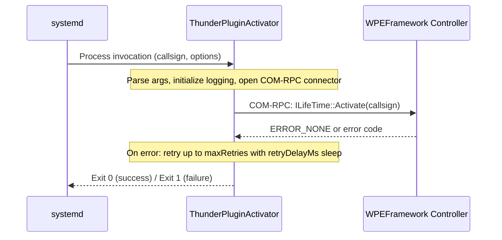

# ThunderPluginActivator

ThunderPluginActivator is a command-line utility for the RDK middleware stack that manages the lifecycle of Thunder (WPEFramework) plugins. It connects to the running Thunder process over COM-RPC and issues activate or deactivate requests for a named plugin identified by its callsign. The tool is designed to be invoked by a systemd service unit, giving each Thunder plugin an independent service identity with its own start and stop semantics managed entirely through standard OS service primitives.

From a device perspective, ThunderPluginActivator allows platform integrators and service operators to bring Thunder plugins into service selectively and in a controlled order. Because each plugin activation is driven by a discrete systemd service unit, standard systemd dependency and ordering directives can govern plugin startup sequencing without embedding any ordering logic inside Thunder itself. This keeps the Thunder core decoupled from device-specific startup orchestration.

At the module level, ThunderPluginActivator is a single-process, single-invocation executable. It parses command-line arguments to determine the target plugin callsign and operational parameters, opens a COM-RPC channel to Thunder's controller, obtains the `Exchange::Controller::ILifeTime` interface proxy, and calls `Activate()` or `Deactivate()` on the specified callsign. If a call fails, the tool retries up to a configurable maximum count with a configurable inter-retry delay before exiting with a non-zero status that systemd can interpret as a service failure.

---



**Key Features & Responsibilities:**

- **Plugin Lifecycle Management**: Issues activate and deactivate requests to the Thunder controller for a named plugin callsign using the `Exchange::Controller::ILifeTime` COM-RPC interface, providing a controlled mechanism to bring plugins in and out of service.
- **Retry with Configurable Back-off**: Retries failed activation or deactivation attempts up to a user-defined maximum, pausing for a configurable delay between each attempt to tolerate transient unavailability of the Thunder process or unmet plugin preconditions.
- **Systemd Integration**: Designed to serve as the `ExecStart` command of a systemd service unit, enabling standard service dependency and ordering directives to govern Thunder plugin startup sequencing at the OS level.
- **Deactivation Support**: Supports deactivating a running plugin via the `--deactivate` flag, enabling orderly teardown as part of a systemd service stop action.
- **Structured Logging**: Emits severity-tagged log messages to stderr across four levels (ERROR, WARN, INFO, DEBUG) with file, line, and function context, with verbosity adjustable at invocation time via command-line flags.

---

## Design

ThunderPluginActivator follows a minimal, single-purpose design: it is a one-shot command-line binary rather than a long-running daemon or a Thunder plugin in its own right. The design separates argument handling, COM-RPC connectivity, and plugin lifecycle invocation into distinct source units. An abstract `IPluginStarter` interface decouples the activation logic from the IPC transport mechanism, meaning a JSON-RPC–based implementation could be introduced without altering the core retry loop or the entry point. The current implementation uses COM-RPC exclusively, connecting to Thunder's built-in controller over the WPEFramework IPC socket. The binary is stateless between invocations; all operational parameters are supplied as command-line arguments and no persistent state is read from or written to disk.

Northbound, ThunderPluginActivator is driven by systemd. Each Thunder plugin that requires explicit activation is assigned a systemd service unit whose `ExecStart` entry invokes `PluginActivator` with the appropriate callsign. Systemd dependency declarations then determine the ordering relative to other services. Southbound, the tool communicates with the Thunder controller process over COM-RPC, using the `ILifeTime` interface to manage plugin lifecycle.

IPC is handled entirely through WPEFramework COM-RPC. `COMRPCStarter` instantiates a `RPC::SmartControllerInterfaceType<Exchange::Controller::ILifeTime>` connector that opens the controller's IPC socket, retrieves the `ILifeTime` proxy interface, and issues `Activate()` or `Deactivate()` synchronously. The call blocks inside the COM-RPC runtime until Thunder responds or the connector is determined to be non-operational. If the connector cannot be opened or the interface cannot be obtained, the current attempt is abandoned and the retry counter is incremented.



### Threading Model

- **Threading Architecture**: Single-threaded.
- **Main Thread**: Parses command-line arguments, constructs the `COMRPCStarter` instance, drives the retry loop by calling `activatePlugin()` or `deactivatePlugin()`, and terminates when the operation succeeds or the maximum retry count is exhausted.
- **Synchronization**: The COM-RPC call to `ILifeTime::Activate()` or `ILifeTime::Deactivate()` is blocking; the main thread suspends between retry attempts using `std::this_thread::sleep_for`.

### RDK-V Platform and Integration Requirements

- **WPEFramework Version**: Requires a WPEFramework build that exposes `Exchange::Controller::ILifeTime` through the `${NAMESPACE}COM` package.
- **Build Dependencies**: `${NAMESPACE}Core`, `${NAMESPACE}COM`, `${NAMESPACE}Plugins`, `CompileSettingsDebug`, `cmake-native`, `wpeframework-tools-native` (required for COM-RPC stub and proxy code generation at build time).
- **Plugin Dependencies**: ThunderPluginActivator requires the Thunder controller process to be reachable over COM-RPC before invocation.
- **Systemd Services**: The Thunder daemon must be running and its COM-RPC socket must be accepting connections before `PluginActivator` is invoked.
- **Startup Order**: Systemd service units using this tool should declare an appropriate ordering dependency on the Thunder service.

---

### Component State Flow

#### Initialization to Active State

ThunderPluginActivator is a one-shot process; its lifecycle spans from invocation to exit. The sequence below describes the activation path. The deactivation path follows the same structure with `ILifeTime::Deactivate()` replacing `ILifeTime::Activate()`.



#### Runtime State Changes

ThunderPluginActivator is a one-shot binary; each invocation performs a single activation or deactivation operation and exits.

**State Change Triggers:**

- If `ILifeTime::Activate()` returns `ERROR_PENDING_CONDITIONS`, the tool logs that preconditions are unmet and retries after the configured delay. This handles cases where a plugin's dependencies have not yet been satisfied at the time of the activation attempt.
- If the COM-RPC connector cannot be opened, the tool closes the connector, increments the retry counter, and sleeps before the next attempt. This tolerates transient unavailability of the Thunder process during system startup.

**Context Switching Scenarios:**

- When the retry limit is reached without a successful activation or deactivation, the process exits with a non-zero code, which systemd interprets as a service failure and handles according to the unit's restart policy.

---

### Call Flows

#### Initialization Call Flow



#### Request Processing Call Flow

The primary call flow is the COM-RPC activation request issued to the Thunder controller.



---

## Internal Modules

| Module / Class | Description | Key Files |
|---|---|---|
| `main` | Entry point. Parses command-line arguments using `getopt_long`, initializes logging, constructs the `COMRPCStarter` instance, and dispatches to `activatePlugin()` or `deactivatePlugin()` based on the `--deactivate` flag. Exits with status `0` on success and `1` on failure. | `main.cpp` |
| `IPluginStarter` | Abstract interface defining the `activatePlugin()` and `deactivatePlugin()` contracts. Decouples the retry and dispatch logic from the underlying IPC transport, allowing alternative transport implementations (such as JSON-RPC) to be introduced without modifying the entry point. | `IPluginStarter.h` |
| `COMRPCStarter` | COM-RPC implementation of `IPluginStarter`. Opens a `SmartControllerInterfaceType<Exchange::Controller::ILifeTime>` connector to the Thunder controller, obtains the `ILifeTime` proxy, and issues `Activate()` or `Deactivate()`. Implements the configurable retry loop with timed inter-attempt sleep and elapsed-time logging. | `COMRPCStarter.cpp`, `COMRPCStarter.h` |
| `Log` | Lightweight logging module providing four severity macros (`LOG_DBG`, `LOG_INF`, `LOG_WARN`, `LOG_ERROR`) that write formatted messages to stderr. Each message includes a severity tag, source filename, line number, function name, and the plugin callsign. Verbosity is controlled by the global `gActivatorLogLevel` variable. | `Log.cpp`, `Log.h` |
| `Module` | WPEFramework module registration unit. Declares the module name `PluginStarter` and embeds the build reference string via `MODULE_NAME_DECLARATION(BUILD_REFERENCE)`. Includes the WPEFramework core, COM, and plugins headers required across all translation units. | `Module.cpp`, `Module.h` |

---

## Component Interactions

ThunderPluginActivator communicates with the WPEFramework Thunder controller over COM-RPC to manage plugin lifecycle.

### Interaction Matrix

| Target Component / Layer | Interaction Purpose | Key APIs / Topics |
|---|---|---|
| **WPEFramework Thunder Controller** | Activate or deactivate a named Thunder plugin by callsign | `Exchange::Controller::ILifeTime::Activate()`, `Exchange::Controller::ILifeTime::Deactivate()` |

### IPC Flow Patterns

**Primary Request / Response Flow:**



---

## Implementation Details

### Key Implementation Logic

- **State / Lifecycle Management**: Each invocation of the binary starts fresh. The retry counter and success flag are local variables within `activatePlugin()` and `deactivatePlugin()` in `COMRPCStarter.cpp`. The elapsed time of each activation attempt is measured using `Core::Time::Now()` and included in log output.

- **Error Handling Strategy**: Error codes returned by `ILifeTime::Activate()` and `ILifeTime::Deactivate()` are logged with their string representation via `Core::ErrorToString()`. The code `ERROR_PENDING_CONDITIONS` is identified and logged distinctly to communicate that plugin preconditions are unmet. All other non-zero results are treated as retriable failures. After exhausting the maximum retry count, a final error is logged and the function returns `false`, causing the process to exit with status `1`. COM-RPC connector open failures are also logged and treated as retriable.

- **Logging & Diagnostics**: Log messages are written to stderr. Each message includes a severity tag (`[ERR]`, `[WRN]`, `[NFO]`, `[DBG]`), the source filename, line number, function name, and the plugin callsign context. The default log level is INFO. Verbosity can be raised to DEBUG by passing one or more `-v` flags at invocation. The log level is stored in the global `gActivatorLogLevel` variable, initialized in `Log.cpp` via `initLogging()`.

---

## Configuration

### Key Configuration Parameters

| Parameter | Type | Default | Description |
|---|---|---|---|
| `callsign` | string | _(required)_ | Callsign of the Thunder plugin to activate or deactivate. |
| `--retries` / `-r` | int | `100` | Maximum number of activation or deactivation attempts before giving up. |
| `--delay` / `-d` | int | `500` | Delay in milliseconds between consecutive retry attempts. |
| `--verbose` / `-v` | flag | INFO level | Increases the log level by one step per flag occurrence, up to DEBUG. |
| `--deactivate` / `-x` | flag | `false` | When set, deactivates the named plugin instead of activating it. |

### Runtime Configuration

Configuration is supplied entirely via command-line arguments at process start.

```bash
# Activate a plugin with default retry settings
PluginActivator <callsign>

# Activate with custom retry count and delay
PluginActivator --retries 20 --delay 1000 <callsign>

# Deactivate a plugin
PluginActivator --deactivate <callsign>

# Increase log verbosity to DEBUG
PluginActivator -v -v <callsign>
```

### Configuration Persistence

All operational parameters are passed at invocation time. Each execution of `PluginActivator` operates solely on the arguments supplied to it.
