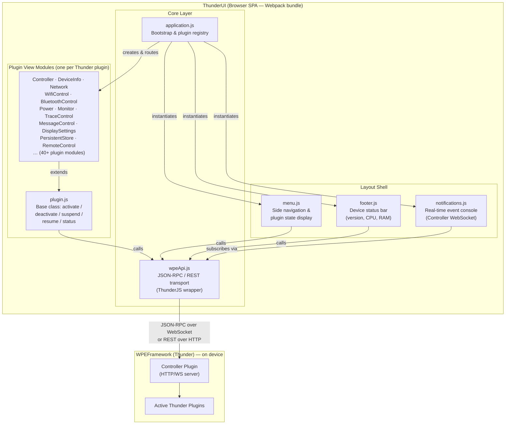
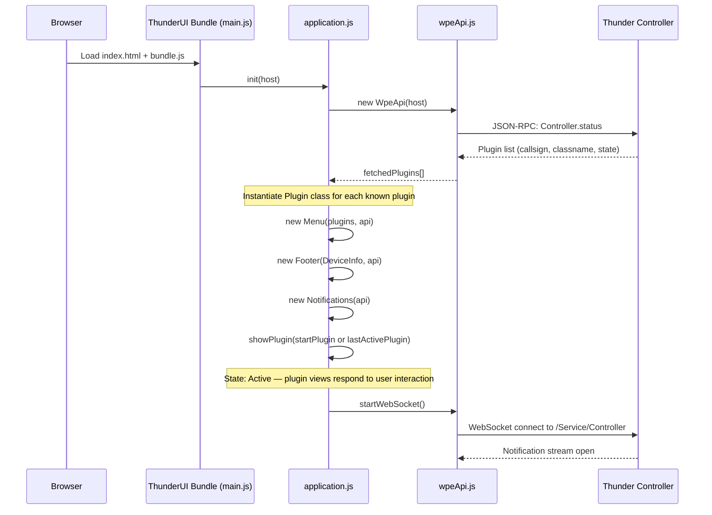
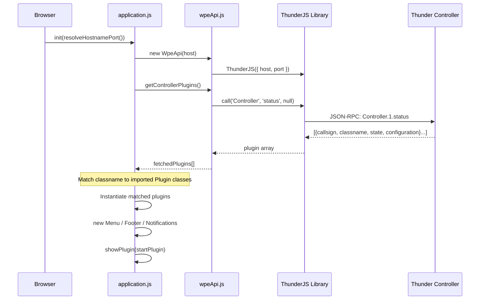
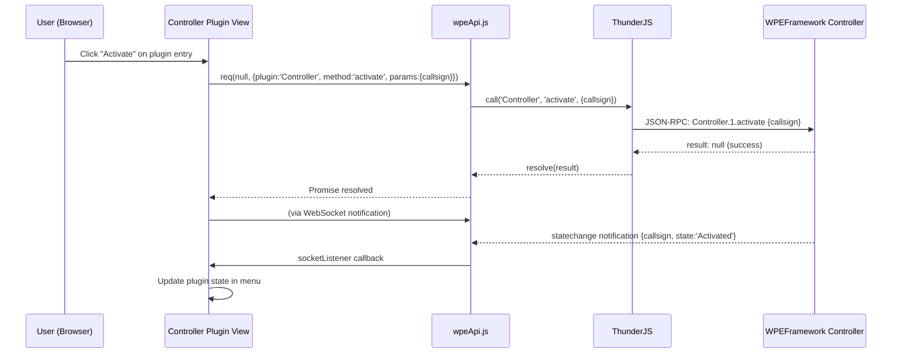
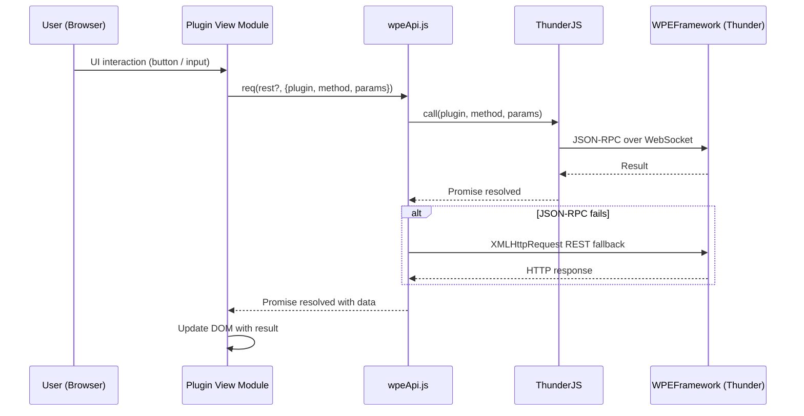
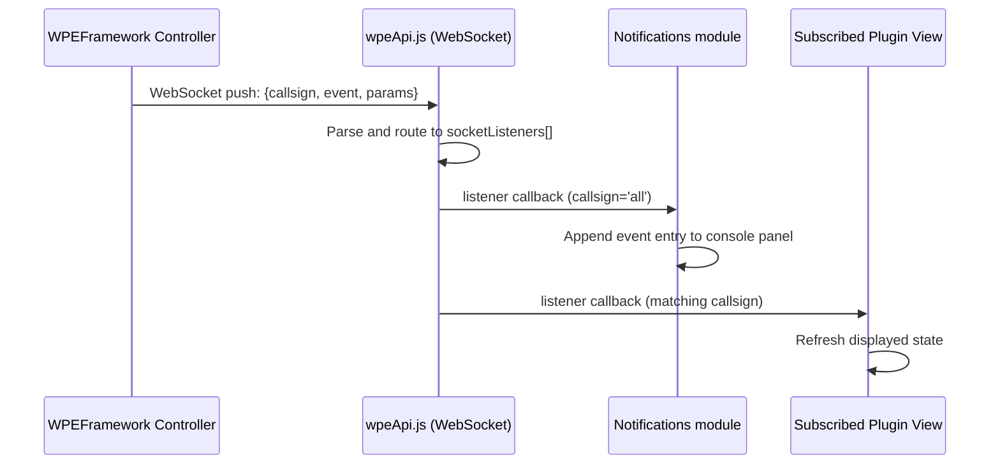

# ThunderUI

ThunderUI is a browser-based development and test interface that runs on top of the WPEFramework (Thunder) middleware. It enables remote control, inspection, and management of a Thunder-enabled device through a web browser, serving as the built-in UI surface for the Thunder Controller plugin.

ThunderUI provides a single-page web application that communicates with Thunder's Controller plugin over JSON-RPC (via WebSocket) and REST HTTP. On startup, it queries the Controller for the list of active plugins on the device and dynamically constructs a navigation menu and per-plugin views. Each plugin view exposes the operations and data surfaces offered by the corresponding Thunder plugin, ranging from network configuration and device diagnostics to browser control and tracing. The UI runs entirely in the browser; all persistent device state resides in Thunder and is accessed through the API layer. User session state (last active plugin, last navigated URL) is kept in browser `localStorage`.

ThunderUI is deployed as static web assets (`bundle.js`, `index.html`, `img/`) under `${datadir}/WPEFramework/Controller/UI` on the target device and is served directly by the Thunder Controller's built-in HTTP server.

**Key Features & Responsibilities:**

- **Dynamic plugin discovery**: At startup, ThunderUI queries the Thunder Controller for the full list of active plugins on the device and constructs the navigation menu and plugin views dynamically based on what is present.
- **Dual-transport API layer**: All Thunder communication is attempted first over JSON-RPC (WebSocket via the ThunderJS library); if that fails, the request automatically falls back to REST over HTTP, maintaining compatibility across Thunder versions.
- **Real-time event console**: A persistent WebSocket connection to the Controller's notification channel surfaces all plugin lifecycle and state-change events in an on-screen console, providing live observability of the Thunder runtime.
- **Per-plugin management views**: Each supported Thunder plugin has a dedicated UI view that exposes its specific operations — activate, deactivate, suspend, resume, and plugin-specific controls — without requiring any server-side rendering.
- **Device status footer**: A polled status bar shows device version, serial number, uptime, CPU load, RAM usage (system and GPU), and the last forwarded key press, updated at a configurable interval.
- **Composite plugin support**: ThunderUI supports bridged/composite Thunder instances by detecting and routing API calls through the appropriate prefixed controller, allowing a single UI session to manage plugins on remote Thunder instances.
- **Remote control forwarding**: An on-screen keyboard and key-forwarding mechanism sends key events directly to the RemoteControl Thunder plugin, enabling keyboard-based interaction with the device from the browser.

---

## Design

ThunderUI is designed as a single-page application (SPA) built with Webpack. The application has a strict separation between the API transport layer, the layout shell, and the per-plugin view modules. The core principle is that the UI is entirely data-driven: the set of visible plugin views is determined at runtime by querying Thunder, not by a static configuration. Each plugin view is an independent ES6 class extending a common `Plugin` base class, giving every plugin a uniform lifecycle (`render`, `close`, `activate`, `deactivate`). The application maintains no server-side session state; all UI state is local to the browser.

Northbound interactions (from the browser to Thunder) use the `WpeApi` class, which wraps the ThunderJS library for JSON-RPC over WebSocket and falls back to `XMLHttpRequest`-based REST calls when the WebSocket path is unavailable. Southbound interactions (from the device to ThunderUI) arrive as WebSocket push notifications from the Controller, dispatched to registered per-plugin callbacks by `WpeApi.addWebSocketListener`.

Communication with the device is mediated entirely through Thunder's built-in HTTP/WebSocket server, using JSON-RPC over WebSocket as the primary transport and REST over HTTP as a fallback.

ThunderUI reads and displays device state from Thunder on demand. Across browser sessions, the last active plugin and the last manually entered browser URL are preserved in browser `localStorage`.



### Threading Model

- **Threading Architecture**: Single-threaded (browser JavaScript event loop)
- **Main Thread**: All UI rendering, JSON-RPC dispatch, WebSocket event handling, and periodic polling are executed on the single browser main thread.
- **Worker Threads**: None. ThunderUI does not use Web Workers.
- **Synchronization**: Not applicable. The JavaScript event loop provides implicit single-threaded execution.
- **Async / Event Dispatch**: All Thunder API calls return Promises resolved asynchronously. WebSocket push notifications are dispatched through registered listener callbacks stored in `WpeApi.socketListeners`. The status footer and plugin views use `setInterval` for periodic polling without blocking the event loop.

---

### RDK-V Platform and Integration Requirements

- **WPEFramework Version**: Requires a Thunder instance exposing the Controller plugin via HTTP on port 80 and WebSocket notification channel at `/Service/Controller`.
- **Build Dependencies**: Node.js (≥ 17 handled automatically with OpenSSL legacy provider), npm, Webpack 4, ThunderJS v1.2.4, `copy-webpack-plugin`, `css-loader`, `style-loader`, `dotenv-webpack`.
- **Plugin Dependencies**: Thunder Controller plugin must be active and accessible at boot. Individual feature views are rendered only if the corresponding Thunder plugin is present in the Controller's status response.
- **Systemd Services**: ThunderUI is served by WPEFramework's internal HTTP server; the WPEFramework service must be running.
- **Configuration Files**: `conf.js` (compiled into bundle) — sets `refresh_interval` (5000 ms), `cache_period` (500 ms), and `startPlugin` (Controller). At build time, an optional `.env.local` file supplies `HOST` for local development builds.
- **Startup Order**: ThunderUI is loaded by a browser navigating to `http://<device-ip>/UI/`. No explicit plugin activation ordering is required from ThunderUI's side; it discovers active plugins dynamically via `Controller.status`.

---

### Component State Flow

#### Initialization to Active State



#### Runtime State Changes

Plugin views respond to live Controller WebSocket notifications. The `Notifications` module subscribes to all Controller events and displays them in the on-screen console as they arrive. Individual plugin views (e.g., `WifiControl`, `BluetoothControl`) subscribe to plugin-specific events via `WpeApi.addWebSocketListener` to refresh their displayed state when device conditions change.

**State Change Triggers:**

- A Thunder plugin activation or deactivation event received over the Controller WebSocket causes the navigation menu to refresh its plugin state indicators.
- A WebSocket disconnect triggers automatic reconnection after `conf.refresh_interval` (5000 ms).
- Navigating to a new plugin view calls `close()` on the previously active plugin (stopping any active intervals or sockets) and `render()` on the newly selected plugin.

**Context Switching Scenarios:**

- If the `WifiControl` or `BluetoothControl` view is active when a scan result or connection change event arrives, the view data is refreshed in-place without requiring user interaction.
- If the selected plugin is part of a composite (bridged) Thunder instance, the API prefix is updated so all subsequent calls are routed through the appropriate remote Controller.
- If the `TraceControl` or `MessageControl` view is closed, the dedicated WebSocket to the plugin's streaming endpoint is explicitly closed to release the connection.

---

### Call Flows

#### Initialization Call Flow



#### Request Processing Call Flow

The following illustrates a plugin activate operation triggered from the Controller view.



---

## Internal Modules

| Module / Class                   | Description                                                                                                                                                                                                                                                             | Key Files                           |
| -------------------------------- | ----------------------------------------------------------------------------------------------------------------------------------------------------------------------------------------------------------------------------------------------------------------------- | ----------------------------------- |
| `application.js`                 | Application bootstrap. Calls `WpeApi.getControllerPlugins`, instantiates plugin view objects, constructs the layout shell, and routes navigation. Exposes `showPlugin` globally for the menu.                                                                           | `src/js/core/application.js`        |
| `WpeApi`                         | API transport layer. Wraps ThunderJS for JSON-RPC over WebSocket. Falls back to `XMLHttpRequest` REST calls on JSON-RPC failure. Manages the Controller WebSocket notification channel and per-plugin event listener registry. Handles composite plugin prefix routing. | `src/js/core/wpeApi.js`             |
| `Plugin` (base class)            | Base class for all plugin view modules. Provides common `activate`, `deactivate`, `suspend`, `resume`, and `status` methods that call the Thunder Controller. Defines the `render` / `close` lifecycle contract.                                                        | `src/js/core/plugin.js`             |
| `Menu`                           | Side navigation bar. Reads the plugin registry to build menu entries with current activation state. Manages composite instance selector buttons. Persists the selected instance and current plugin to `localStorage`.                                                   | `src/js/layout/menu.js`             |
| `Footer`                         | Status bar. Polls `DeviceInfo` at `conf.refresh_interval` to display version, serial number, uptime, CPU load, and RAM (system and GPU). Listens for ThunderJS `connect`/`disconnect` events to show connection state.                                                  | `src/js/layout/footer.js`           |
| `Notifications`                  | On-screen event console. Subscribes to all Controller WebSocket notifications and appends formatted event entries to the notification panel in real time.                                                                                                               | `src/js/layout/notifications.js`    |
| `Controller` (plugin view)       | Renders the full list of Thunder plugins with their state and activation controls. Handles composite plugin detection, prefix routing for bridged instances, and dynamic menu refresh after state changes.                                                              | `src/js/plugins/controller.js`      |
| `DeviceInfo` (plugin view)       | Displays device name, serial number, firmware version, uptime, RAM/GPU usage, CPU load, and network interface details with live-updating charts.                                                                                                                        | `src/js/plugins/deviceinfo.js`      |
| `Network` (plugin view)          | Displays network interfaces, current IP address, default interface, and provides a ping tool. Allows changing the default network interface.                                                                                                                            | `src/js/plugins/network.js`         |
| `WifiControl` (plugin view)      | Displays Wi-Fi connection status, scans for available networks, and manages connection configurations. Subscribes to `scanresults` and `connectionchange` events from the WifiControl plugin.                                                                           | `src/js/plugins/wificontrol.js`     |
| `BluetoothControl` (plugin view) | Displays paired and discovered Bluetooth devices, supports scanning, and provides connect/disconnect/pair controls.                                                                                                                                                     | `src/js/plugins/bluetooth.js`       |
| `Monitor` (plugin view)          | Displays the list of Thunder plugins being observed by the Monitor plugin and allows configuring restart thresholds. Provides memory consumption data consumed by other plugin views.                                                                                   | `src/js/plugins/monitor.js`         |
| `TraceControl` (plugin view)     | Manages trace categories and their enabled/disabled state by opening a dedicated WebSocket to the TraceControl plugin's streaming endpoint.                                                                                                                             | `src/js/plugins/tracing.js`         |
| `MessageControl` (plugin view)   | Manages message control categories (type, module, category, enabled/disabled) and streams live debug messages via a dedicated WebSocket to the MessageControl plugin.                                                                                                   | `src/js/plugins/messaging.js`       |
| `Power` (plugin view)            | Displays the current device power state and allows setting a timed power state transition (On, Active standby, Passive standby, Suspend to RAM, Hibernate, Power Off).                                                                                                  | `src/js/plugins/power.js`           |
| `DisplaySettings` (plugin view)  | Displays supported and current video resolutions, TV resolutions, sound mode, zoom setting, and connected/supported video displays.                                                                                                                                     | `src/js/plugins/displaySettings.js` |
| `RemoteControl` (plugin view)    | Renders an on-screen keyboard and forwards key events (as WPE key codes) to the RemoteControl Thunder plugin.                                                                                                                                                           | `src/js/plugins/remotecontrol.js`   |
| `ScreenCapture` (plugin view)    | Triggers an `uploadScreenCapture` call on the ScreenCapture plugin, uploading a screenshot to a specified URL with an optional GUID identifier.                                                                                                                         | `src/js/plugins/screencapture.js`   |
| `PersistentStore` (plugin view)  | Provides a UI to set, read, and delete key-value pairs in namespaces via the PersistentStore Thunder plugin.                                                                                                                                                            | `src/js/plugins/persistentStore.js` |
| `LocationSync` (plugin view)     | Displays the device's GeoIP-resolved location (city, country, region, timezone, public IP) and provides a manual sync trigger.                                                                                                                                          | `src/js/plugins/locationsync.js`    |
| `TimeSync` (plugin view)         | Displays current device time, NTP source, and last sync timestamp. Allows manually setting the device time.                                                                                                                                                             | `src/js/plugins/timesync.js`        |
| `conf.js`                        | Static configuration values compiled into the bundle: polling interval, API cache period, and the default start plugin.                                                                                                                                                 | `src/js/conf.js`                    |
| `helpers.js`                     | Resolves the Thunder host address from the browser's `window.location` when no explicit host is provided.                                                                                                                                                               | `src/js/helpers.js`                 |

---

## Component Interactions

ThunderUI communicates with the Thunder runtime exclusively over JSON-RPC (WebSocket) and REST HTTP.

### Interaction Matrix

| Target Component / Layer | Interaction Purpose                                                                          | Key APIs / Topics                                                                                                        |
| ------------------------ | -------------------------------------------------------------------------------------------- | ------------------------------------------------------------------------------------------------------------------------ |
| **Thunder Plugins**      |                                                                                              |                                                                                                                          |
| `Controller`             | Plugin lifecycle management: enumerate active plugins, activate, deactivate, suspend, resume | `Controller.1.status`, `Controller.1.activate`, `Controller.1.deactivate`, `Controller.1.suspend`, `Controller.1.resume` |
| `DeviceInfo`             | Read device identity and resource metrics for the status footer and Device Info view         | `DeviceInfo.1.status` (system info, network interfaces)                                                                  |
| `Network`                | Read network interface list and IP addresses; set default interface; execute ping            | `Network.1.interfaces`, `Network.1.defaultinterface`, `Network.1.ping`                                                   |
| `WifiControl`            | Read connected SSID, scan networks, connect/disconnect                                       | `WifiControl.1.networks`, `WifiControl.1.connect`, `WifiControl.1.disconnect`; events: `scanresults`, `connectionchange` |
| `BluetoothControl`       | Scan for Bluetooth devices, connect, disconnect, pair                                        | `BluetoothControl.1.scan`, `BluetoothControl.1.connect`; device discovery events                                         |
| `Monitor`                | Read memory and CPU consumption per observed plugin; configure restart thresholds            | `Monitor.1.status`, `Monitor.1.restartlimits`                                                                            |
| `TraceControl`           | Read and set trace module enable/disable state; stream live trace output                     | `TraceControl.1.set`; WebSocket stream at `/Service/TraceControl`                                                        |
| `MessageControl`         | Read and set message control enable/disable state; stream live debug messages                | `MessageControl.1.enable`; WebSocket stream at `/Service/MessageControl`                                                 |
| `Power`                  | Read current power state; trigger power state transitions                                    | `Power.1.state` (read/write)                                                                                             |
| `DisplaySettings`        | Read/set video resolution, sound mode, zoom setting, connected displays                      | `DisplaySettings.1.currentresolution`, `DisplaySettings.1.supportedresolutions`, `DisplaySettings.1.setsoundmode`        |
| `RemoteControl`          | Send key presses to the device                                                               | `RemoteControl.1.send`                                                                                                   |
| `ScreenCapture`          | Trigger screenshot upload to a URL                                                           | `ScreenCapture.1.uploadScreenCapture`                                                                                    |
| `PersistentStore`        | Read, write, and delete namespaced key-value pairs                                           | `PersistentStore.1.setValue`, `PersistentStore.1.getValue`, `PersistentStore.1.deleteNamespace`                          |
| `LocationSync`           | Read device GeoIP location; trigger sync                                                     | `LocationSync.1.location`, `LocationSync.1.sync`                                                                         |
| `TimeSync`               | Read device time and source; set time                                                        | `TimeSync.1.time`, `TimeSync.1.source`, `TimeSync.1.synced`                                                              |
| **Controller WebSocket** | Receive all plugin state-change and lifecycle notifications in real time                     | WebSocket at `ws://<host>/Service/Controller`, notification channel                                                      |

### Events Published

| Event Source  | JSON-RPC / WebSocket Topic            | How ThunderUI Handles It                                                                                       |
| ------------- | ------------------------------------- | -------------------------------------------------------------------------------------------------------------- |
| Controller    | All plugin state-change notifications | Displayed in on-screen Notifications console; Menu refreshes plugin state indicators                           |
| `WifiControl` | `scanresults`                         | WifiControl view re-fetches and renders the network list                                                       |
| `WifiControl` | `connectionchange`                    | WifiControl view updates the connected SSID display                                                            |
| ThunderJS     | `connect`                             | Footer updates connection indicator to connected                                                               |
| ThunderJS     | `disconnect`                          | Footer updates connection indicator to disconnected; WebSocket reconnection scheduled after `refresh_interval` |

### IPC Flow Patterns

**Primary Request / Response Flow:**



**Event Notification Flow:**



---

## Implementation Details

### Key Implementation Logic

- **State / Lifecycle Management**: Application state (active plugin, API prefix for composite instances) is held in `application.js` module-scope variables. Plugin view instances are created once at boot and persist in the `plugins` map for the application lifetime. Plugin views are shown and hidden by calling `render()` and `close()` respectively; `close()` is responsible for stopping any active timers or WebSocket connections opened by that view.
  - Bootstrap and routing: `src/js/core/application.js`
  - Per-plugin lifecycle: `src/js/core/plugin.js`

- **Event Processing**: All incoming WebSocket messages from the Controller notification channel are parsed in `WpeApi.startWebSocket`. Each message is matched against the `socketListeners` array by callsign; listeners registered with callsign `'all'` receive every notification. Individual plugin views register and unregister listeners via `addWebSocketListener` / `removeWebSocketListener`.
  - Event dispatch: `src/js/core/wpeApi.js` (`startWebSocket`, `addWebSocketListener`)

- **Error Handling Strategy**: JSON-RPC call failures are caught in `WpeApi.req` and trigger an automatic REST fallback for the same operation. If REST also fails, the Promise is rejected and the calling plugin view typically leaves the UI in its current state without crashing. WebSocket disconnections are handled by scheduling a reconnection after `conf.refresh_interval`.
  - Transport fallback: `src/js/core/wpeApi.js` (`req`)

- **Logging & Diagnostics**: ThunderUI uses browser `console.debug` for JSON-RPC and REST request traces, and `console.error` for unrecoverable errors. No device-side logging is performed. The on-screen Notifications console provides live Thunder event visibility to the operator.

---

## Configuration

### Key Configuration Files

| Configuration File      | Purpose                                                                                                                | Override Mechanism                                                           |
| ----------------------- | ---------------------------------------------------------------------------------------------------------------------- | ---------------------------------------------------------------------------- |
| `src/js/conf.js`        | Compiled into the bundle. Sets polling interval, API cache period, and default start plugin.                           | Edit source before building                                                  |
| `.env.local` (dev only) | Supplies the `HOST` environment variable used during local development builds to point the UI at a specific device IP. | Created from `.env.example`; consumed by `dotenv-webpack` at build time only |

### Key Configuration Parameters

| Parameter          | Type   | Default        | Description                                                                                                                                    |
| ------------------ | ------ | -------------- | ---------------------------------------------------------------------------------------------------------------------------------------------- |
| `refresh_interval` | int    | `5000`         | Polling interval in milliseconds for the device status footer and WebSocket reconnection delay. Defined in `conf.js`.                          |
| `cache_period`     | int    | `500`          | Duration in milliseconds during which the WPE API will serve a cached response to prevent excessive requests. Defined in `conf.js`.            |
| `startPlugin`      | string | `'Controller'` | The plugin view rendered on initial load when no previous session state exists. Defined in `conf.js`.                                          |
| `HOST`             | string | `127.0.0.1`    | Target device IP address used for development builds. Set in `.env.local` (not deployed). Falls back to `window.location.hostname` at runtime. |

### Runtime Configuration

The target device host is resolved at page load from `window.location`. For development builds, the host is configured in `.env.local` before running the build:

```bash
# Set target device IP for a local development build
echo "HOST=192.168.1.100" > .env.local
npm start
```

### Configuration Persistence

Configuration changes (`conf.js` parameters) are not persisted across reboots. They are compiled into the static bundle at build time. The only items written to persistent storage by ThunderUI are browser `localStorage` entries:

| Key                          | Content                                                             |
| ---------------------------- | ------------------------------------------------------------------- |
| `lastActivePlugin`           | Callsign of the last active plugin view, restored on next page load |
| `thunderUI_selectedInstance` | Last selected composite Thunder instance name                       |
| `thunderUI_currentPlugin`    | Last active plugin in the context of the selected instance          |
| `paused`                     | Whether the device status footer statistics display was hidden      |
| `autoFwdKeys`                | Whether automatic key forwarding to RemoteControl is enabled        |

These entries are local to the browser session and have no effect on device-side state.
