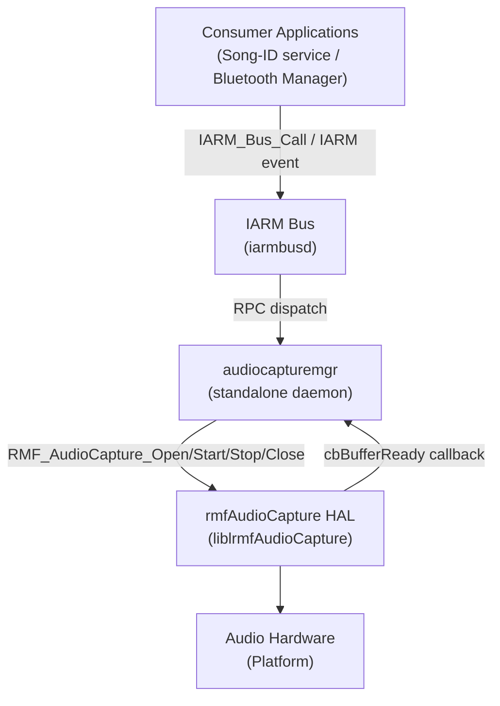
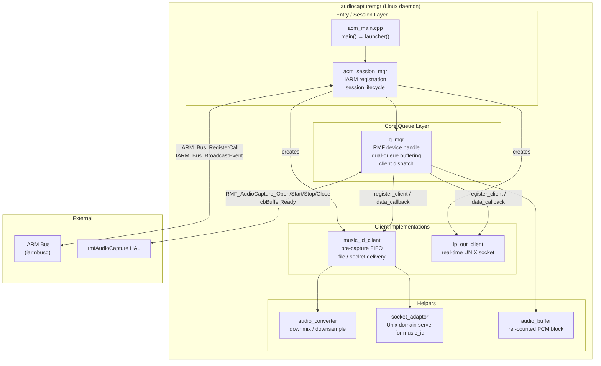
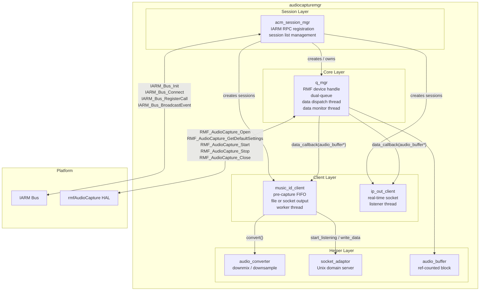
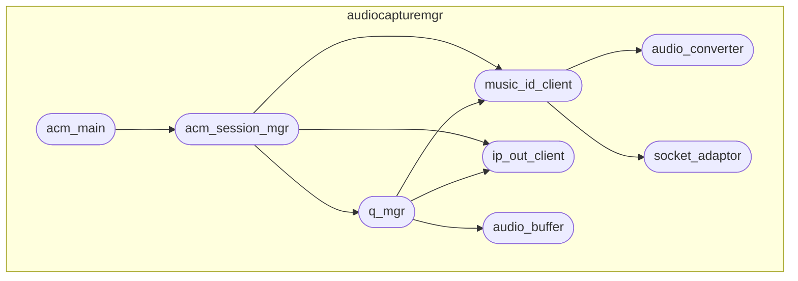
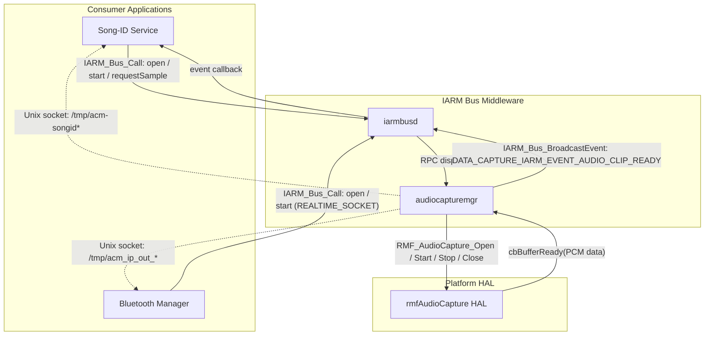
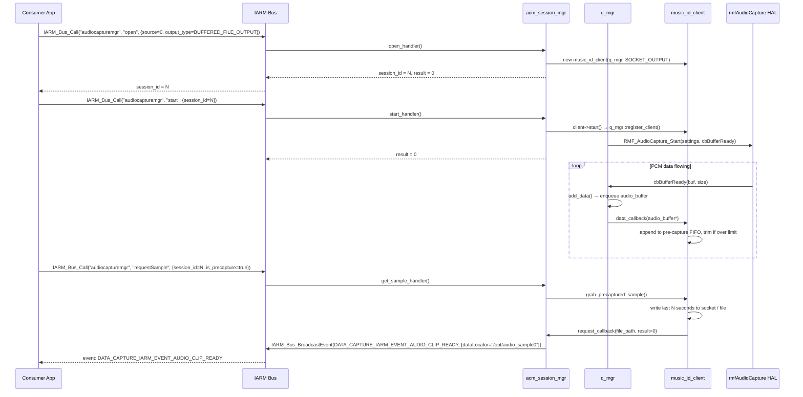
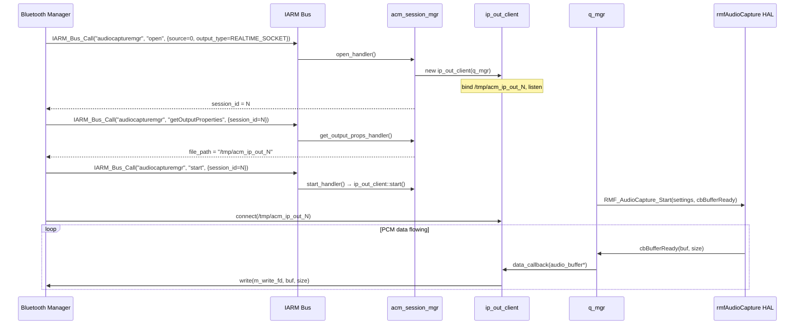
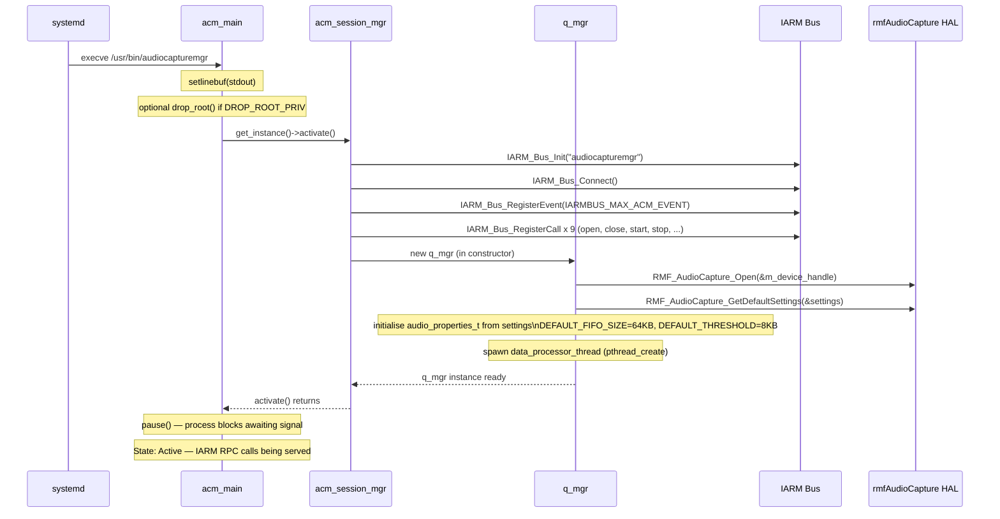
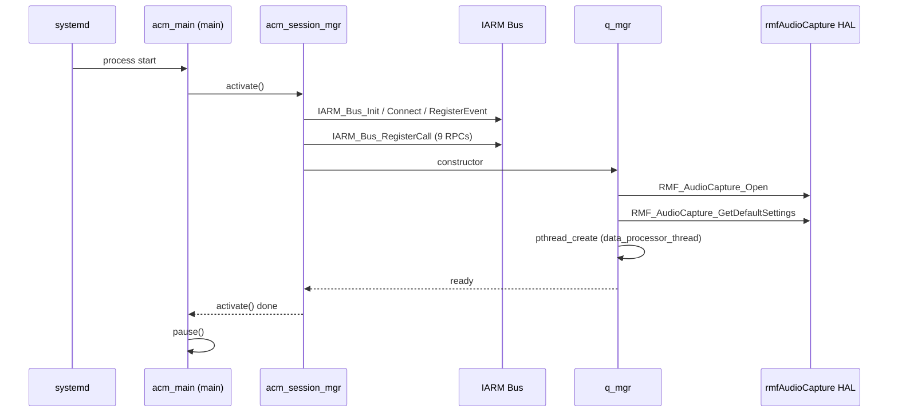
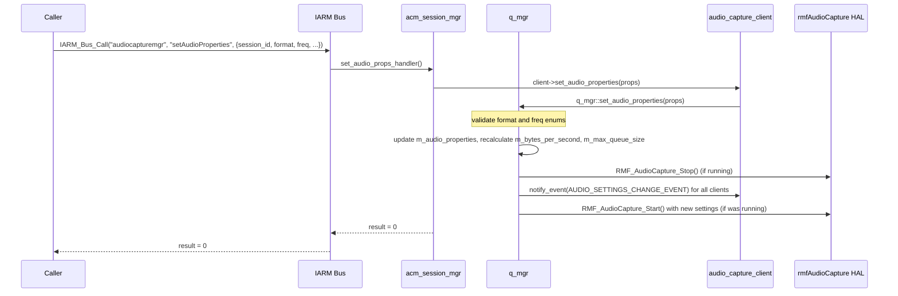

# audiocapturemgr

---

## Overview

`audiocapturemgr` is a standalone Linux daemon that captures currently-playing audio from the primary audio source of an RDK-V set-top device and delivers it to registered consumers. It sits between the RMF (RDK Media Framework) audio capture HAL and upper-layer consumers such as a song-identification service and a Bluetooth audio streaming path. The daemon opens a single primary audio source via the `rmfAudioCapture` HAL, buffers incoming PCM data in a reference-counted queue, and fans the data out to one or more registered client sessions simultaneously.

At the device level, the daemon provides two audio delivery services: a buffered file/socket path where a pre-captured rolling window of audio is saved and can be flushed to a file or Unix domain socket on demand (used by song-identification), and a real-time socket path where live PCM data is streamed to a Unix domain socket connection as it arrives (used by Bluetooth audio streaming).

At the module level, the daemon registers its RPC interface on the IARM bus under the name `"audiocapturemgr"`. Remote callers open sessions, configure audio properties, start or stop capture, and retrieve audio clips entirely through IARM bus RPC calls. When a buffered clip is ready, the daemon broadcasts an `DATA_CAPTURE_IARM_EVENT_AUDIO_CLIP_READY` event on the IARM bus.



**Key Features & Responsibilities:**

- **Audio capture via RMF HAL**: Opens the primary audio source using `RMF_AudioCapture_Open()`, starts and stops capture with `RMF_AudioCapture_Start()` / `RMF_AudioCapture_Stop()`, and receives PCM buffers through the `cbBufferReady` callback.
- **Dual-queue buffer management**: Maintains separate incoming and outgoing `std::vector<audio_buffer*>` queues and swaps them under a mutex so the HAL callback path and the consumer dispatch path do not contend.
- **Session-based client management**: Allows multiple sessions to be opened simultaneously. Each session is assigned a session ID, an output type (`BUFFERED_FILE_OUTPUT` or `REALTIME_SOCKET`), and an audio source index. Only one primary audio source (`MAX_SUPPORTED_SOURCES = 1`) is supported.
- **Buffered pre-capture for song identification**: `music_id_client` maintains a rolling FIFO of PCM data up to a configurable pre-capture duration (default 6 seconds). On demand, it writes the buffered audio to a file or a Unix domain socket at `/tmp/acm-songid*`.
- **Real-time socket streaming**: `ip_out_client` accepts a single incoming connection on a Unix domain socket at `/tmp/acm_ip_out_*` and writes raw PCM data to it as buffers arrive from the queue manager.
- **IARM RPC interface**: Registers ten RPC methods on the IARM bus under the name `"audiocapturemgr"` and broadcasts one event (`DATA_CAPTURE_IARM_EVENT_AUDIO_CLIP_READY`) when a buffered audio clip is ready.
- **Audio format conversion**: `audio_converter` performs downmix (stereo → mono) and integer-ratio downsampling without anti-aliasing. This conversion path is conditionally enabled per session; the RFC flag controlling it is present in the code but returns `false` unconditionally.

---

## Architecture

### High-Level Architecture

`audiocapturemgr` is a single-process C++ daemon. On startup, `acm_main.cpp` calls `acm_session_mgr::get_instance()->activate()`, which initialises the IARM bus connection and registers all RPC handlers. The session manager owns a single `q_mgr` instance representing the primary audio source. The `q_mgr` constructor calls `RMF_AudioCapture_Open()` immediately and spawns a data-processor thread. Actual PCM capture does not start until the first client session calls `start`.

Northbound communication is exclusively through IARM bus RPC and events. There is no HTTP, WebSocket, or Thunder/WPEFramework interface. Southbound communication is exclusively through the `rmfAudioCapture` HAL API.

No configuration files are read at runtime. Audio clip output path defaults to `/opt/` with prefix `audio_sample`. The socket path for song-ID delivery defaults to `/tmp/acm-songid` with a numeric suffix. The socket path for real-time streaming defaults to `/tmp/acm_ip_out_` with a numeric suffix.

No data is persisted to disk beyond the temporary audio clip files written under `/opt/` during a `requestSample` operation. There is no persistent store integration.

A component diagram showing the internal structure is given below:



### Threading Model

- **Threading Architecture**: Multi-threaded
- **Main Thread**: Calls `acm_session_mgr::activate()`, then blocks in `pause()` until process termination.
- **Worker Threads**:
  - _`q_mgr::m_thread` (data processor)_: Launched in `q_mgr` constructor via `pthread_create`. Runs `data_processor_thread()`. Waits on a POSIX semaphore (`m_sem`) when no data is available. When woken, swaps incoming/outgoing queues under `m_q_mutex` and calls each registered client's `data_callback()` under `m_client_mutex`.
  - _`q_mgr::m_data_monitor_thread` (data monitor)_: Runs `data_monitor()`. Wakes every 5 seconds using `std::condition_variable::wait_for`. Compares `m_inflow_byte_counter` snapshots and logs a warning if the counter has not advanced (data stall detection).
  - _`music_id_client::m_worker_thread`_: `std::thread` running `worker_thread()`. Processes queued sample requests (pre-capture and fresh capture).
  - _`ip_out_client::m_thread`_: `pthread_t` running `worker_thread()`. Calls `select()` on the listen socket and the control pipe. Accepts a single connection at a time and stores the write file descriptor.
  - _`socket_adaptor::m_thread`_: `std::thread` running `worker_thread()`. Accepts connections on the Unix domain socket used by `music_id_client` in socket delivery mode and calls a registered callback (`connected_callback`) which invokes `send_clip_via_socket()`.
- **Synchronization**:
  - `q_mgr::m_q_mutex` (`pthread_mutex_t`, `PTHREAD_MUTEX_ERRORCHECK`) — protects incoming/outgoing queue swap and `m_notify_new_data`.
  - `q_mgr::m_client_mutex` (`pthread_mutex_t`, `PTHREAD_MUTEX_ERRORCHECK`) — protects the client list and start/stop operations.
  - `q_mgr::m_sem` (`sem_t`) — signals the data processor thread when new data arrives.
  - `audio_buffer` global lock (`audio_buffer_get_global_lock` / `audio_buffer_release_global_lock`) — protects reference count updates across all `q_mgr` instances.
  - `acm_session_mgr::m_mutex` (`pthread_mutex_t`, `PTHREAD_MUTEX_ERRORCHECK`) — protects the session list.
  - `music_id_client` inherits `audio_capture_client::m_mutex` (`pthread_mutex_t`) — protects the PCM queue and request list.
  - `socket_adaptor::m_mutex` (`std::mutex`) — protects connection state.
  - `q_mgr::m_data_monitor_mutex` / `m_data_monitor_cv` (`std::mutex` / `std::condition_variable`) — used to wake or stop the data monitor thread.
- **Async / Event Dispatch**: When a fresh audio clip is complete, `music_id_client`'s worker thread invokes the `request_callback` function pointer, which calls `IARM_Bus_BroadcastEvent()` with the file path in the payload. There is no additional internal event queue; the callback executes synchronously on the worker thread.

---

## Design

The design separates the HAL-facing capture path from the consumer-facing delivery path using a producer-consumer queue. `q_mgr` is the sole producer: it receives raw PCM from the HAL via `cbBufferReady`, wraps each chunk in a reference-counted `audio_buffer`, and enqueues it. A dedicated data-processor thread dequeues batches and delivers them to all registered `audio_capture_client` instances. This keeps the HAL callback path short and non-blocking.

Northbound interactions are mediated entirely by the IARM bus. `acm_session_mgr` registers one RPC handler per supported operation. Each handler validates the session ID, locates the `acm_session_t` record, and delegates to the appropriate `audio_capture_client` or `q_mgr` method. All IARM handlers run on the IARM bus dispatch thread; session-list access is protected by `m_mutex`.

Southbound interactions are mediated entirely by the `rmfAudioCapture` HAL. `q_mgr` holds the single `RMF_AudioCaptureHandle` and translates `audio_properties_t` enum values (the internal representation) to `RMF_AudioCapture_Settings` struct fields before passing them to `RMF_AudioCapture_Start`. The data callback registered with the HAL is the static method `q_mgr::data_callback`, which casts the context pointer back to `q_mgr*` and calls `add_data`.

There is no configuration file reader, no persistent store, and no RFC client integration that is currently active. The RFC helper `get_rfc_output_conversion_config()` present in `acm_session_mgr.cpp` unconditionally returns `false`.

### Component Diagram



---

## Internal Modules

| Module / Class            | Description                                                                                                                                                                                                                                                                                                                                                                                                                                                                                | Key Files                                              |
| ------------------------- | ------------------------------------------------------------------------------------------------------------------------------------------------------------------------------------------------------------------------------------------------------------------------------------------------------------------------------------------------------------------------------------------------------------------------------------------------------------------------------------------ | ------------------------------------------------------ |
| `acm_session_mgr`         | Singleton session manager. On `activate()`, calls `IARM_Bus_Init`, `IARM_Bus_Connect`, `IARM_Bus_RegisterEvent`, and registers ten RPC handlers. Maintains a `std::list<acm_session_t*>` and a `std::vector<q_mgr*>` with one entry. Handles open, close, start, stop, property get/set, and sample-request operations. Receives external data via IARM RPC calls.                                                                                                                         | `acm_session_mgr.cpp`, `acm_session_mgr.h`             |
| `q_mgr`                   | Queue manager and HAL interface. In its constructor, calls `RMF_AudioCapture_Open()` and `RMF_AudioCapture_GetDefaultSettings()` to initialise audio properties, and spawns the data-processor thread. Maintains two `std::vector<audio_buffer*>` queues that are swapped under mutex. When started, calls `RMF_AudioCapture_Start()` with settings built from stored `audio_properties_t`. Distributes PCM buffers to all registered `audio_capture_client` instances.                    | `audio_capture_manager.cpp`, `audio_capture_manager.h` |
| `audio_capture_client`    | Abstract base class for audio consumers. Holds a pointer to `q_mgr` and a `pthread_mutex_t`. Subclasses override `data_callback(audio_buffer*)`. Calling `start()` registers the instance with `q_mgr`; calling `stop()` unregisters it.                                                                                                                                                                                                                                                   | `audio_capture_manager.cpp`, `audio_capture_manager.h` |
| `music_id_client`         | Concrete `audio_capture_client` for buffered audio capture. Maintains a `std::list<audio_buffer*>` FIFO trimmed to `m_precapture_size_bytes`. Default pre-capture duration is 6 seconds. Supports two delivery modes: `FILE_OUTPUT` (writes WAV/raw to a file path) and `SOCKET_OUTPUT` (writes to a Unix domain socket at `/tmp/acm-songid*` via `socket_adaptor`). A `std::thread` (`worker_thread`) processes queued sample requests. Optional format conversion via `audio_converter`. | `music_id.cpp`, `music_id.h`                           |
| `ip_out_client`           | Concrete `audio_capture_client` for real-time socket streaming. On construction, creates a UNIX domain socket at `/tmp/acm_ip_out_<N>`, binds, listens, and spawns a `pthread_t` to accept connections. Accepts one connection at a time. In `data_callback`, writes raw PCM directly to the connected socket file descriptor.                                                                                                                                                             | `ip_out.cpp`, `ip_out.h`                               |
| `audio_converter`         | Stateless conversion helper. Supports `NO_CONVERSION`, `DOWNMIX` (16-bit stereo → mono), `DOWNSAMPLE` (integer-ratio, no anti-aliasing), and `DOWNMIX_AND_DOWNSAMPLE`. Unsupported conversions are detected at construction. Writes converted output to an `audio_converter_sink` (either `audio_converter_file_sink` or `audio_converter_memory_sink`).                                                                                                                                   | `audio_converter.cpp`, `audio_converter.h`             |
| `socket_adaptor`          | Unix domain socket server. Used by `music_id_client` in `SOCKET_OUTPUT` mode. Calls `start_listening(path)` to bind and listen. Accepts one connection, then invokes a registered callback (`socket_adaptor_cb_t`). The callback (`connected_callback` in `music_id.cpp`) calls `music_id_client::send_clip_via_socket()`.                                                                                                                                                                 | `socket_adaptor.cpp`, `socket_adaptor.h`               |
| `audio_buffer`            | Reference-counted PCM data block. Created by `create_new_audio_buffer()` with a copy of the incoming data. `unref_audio_buffer()` decrements the reference count and frees the block when it reaches zero. A global lock (`audio_buffer_get_global_lock`) protects reference count modifications across threads.                                                                                                                                                                           | `audio_buffer.cpp`, `audio_buffer.h`                   |
| `acm_session_mgr` (entry) | `acm_main.cpp` contains `main()`. Calls `acm_session_mgr::get_instance()->activate()` then `pause()`. On signal, calls `deactivate()`. Optionally calls `drop_root()` if compiled with `DROP_ROOT_PRIV`.                                                                                                                                                                                                                                                                                   | `acm_main.cpp`                                         |
| `acm_iarm_interface`      | Legacy interface file present in the source tree (`acm_iarm_interface.cpp`) but **not included in any build target** in `src/Makefile.am`. It provides the original two-method API (`enableCapture`, `requestSample`) backed by a single `music_id_client`. It is not compiled or linked in the current build.                                                                                                                                                                             | `acm_iarm_interface.cpp`, `acm_iarm_interface.h`       |



---

## Prerequisites & Dependencies

**Documentation Verification Checklist:**

- [x] **IARM Bus**: Verified — `IARM_Bus_Init`, `IARM_Bus_Connect`, `IARM_Bus_RegisterEvent`, `IARM_Bus_RegisterCall`, `IARM_Bus_BroadcastEvent` called in `acm_session_mgr.cpp`.
- [x] **rmfAudioCapture HAL**: Verified — `RMF_AudioCapture_Open`, `RMF_AudioCapture_Close`, `RMF_AudioCapture_GetDefaultSettings`, `RMF_AudioCapture_Start`, `RMF_AudioCapture_Stop` called in `audio_capture_manager.cpp`.
- [x] **Persistent store**: No persistent store calls found anywhere in the source. Configuration changes are not persisted.
- [x] **Systemd service**: `After=iarmbusd.service` and `Requires=iarmbusd.service` verified in `conf/audiocapturemgr.service`.
- [x] **Configuration files**: No configuration files are opened or parsed by the daemon.
- [x] **Thunder / WPEFramework**: Not used. This is not a WPEFramework plugin.

### Platform Requirements

- **Build Dependencies**: `liblrmfAudioCapture` (provides `rmfAudioCapture.h` and the HAL shared library), `libIARMBus` (provides `libIARM.h`, `libIBus.h`), `safec_lib` (safe string operations), `libpthread`.
- **IARM Bus**: The daemon registers on the bus as `"audiocapturemgr"`. `iarmbusd` must be running before the daemon starts (enforced by `Requires=iarmbusd.service` in the systemd unit).
- **Systemd Services**: `iarmbusd.service` must be active before `audiocapturemgr.service` starts.
- **Configuration Files**: None.
- **Startup Order**: `iarmbusd.service` → `audiocapturemgr.service`.
- **Build System**: Autotools (`configure.ac`, `Makefile.am`). Version defined as `0.10` in `configure.ac`.
- **Compiler**: C++11 (`-std=c++0x` flags in `Makefile.am`).
- **Optional**: `DROP_ROOT_PRIV` compile-time flag enables privilege dropping via `cap.h` / `isBlocklisted()`.

---

## Quick Start

### 1. Include

```c
#include "audiocapturemgr_iarm.h"
#include "libIBus.h"
```

### 2. Initialize IARM and open a session

```c
using namespace audiocapturemgr;

IARM_Bus_Init("my_app");
IARM_Bus_Connect();

/* Register to receive the clip-ready event */
IARM_Bus_RegisterEventHandler(IARMBUS_AUDIOCAPTUREMGR_NAME,
    DATA_CAPTURE_IARM_EVENT_AUDIO_CLIP_READY, my_event_handler);

/* Open a buffered-file session on source 0 */
iarmbus_acm_arg_t arg;
memset(&arg, 0, sizeof(arg));
arg.details.arg_open.source      = 0;  /* primary source */
arg.details.arg_open.output_type = BUFFERED_FILE_OUTPUT;
IARM_Bus_Call(IARMBUS_AUDIOCAPTUREMGR_NAME, IARMBUS_AUDIOCAPTUREMGR_OPEN,
              &arg, sizeof(arg));
int session_id = arg.session_id;
```

### 3. Start capture and request a sample

```c
/* Start the session */
iarmbus_acm_arg_t start_arg;
memset(&start_arg, 0, sizeof(start_arg));
start_arg.session_id = session_id;
IARM_Bus_Call(IARMBUS_AUDIOCAPTUREMGR_NAME, IARMBUS_AUDIOCAPTUREMGR_START,
              &start_arg, sizeof(start_arg));

/* Request a pre-captured sample */
iarmbus_acm_arg_t req_arg;
memset(&req_arg, 0, sizeof(req_arg));
req_arg.session_id                        = session_id;
req_arg.details.arg_sample_request.duration     = 6.0f;
req_arg.details.arg_sample_request.is_precapture = true;
IARM_Bus_Call(IARMBUS_AUDIOCAPTUREMGR_NAME, IARMBUS_AUDIOCAPTUREMGR_REQUEST_SAMPLE,
              &req_arg, sizeof(req_arg));
/* DATA_CAPTURE_IARM_EVENT_AUDIO_CLIP_READY event will carry the file path */
```

### 4. Cleanup

```c
iarmbus_acm_arg_t stop_arg;
stop_arg.session_id = session_id;
IARM_Bus_Call(IARMBUS_AUDIOCAPTUREMGR_NAME, IARMBUS_AUDIOCAPTUREMGR_STOP,
              &stop_arg, sizeof(stop_arg));

iarmbus_acm_arg_t close_arg;
close_arg.session_id = session_id;
IARM_Bus_Call(IARMBUS_AUDIOCAPTUREMGR_NAME, IARMBUS_AUDIOCAPTUREMGR_CLOSE,
              &close_arg, sizeof(close_arg));

IARM_Bus_Disconnect();
IARM_Bus_Term();
```

---

## Configuration

### Configuration Priority

There is no runtime configuration file. All defaults are compile-time constants.

### Key Configuration Files

No configuration files are read by this component at runtime.

### Configuration Parameters (Compile-time Defaults)

| Parameter                         | Value                | Source                      | Description                                                                                                                |
| --------------------------------- | -------------------- | --------------------------- | -------------------------------------------------------------------------------------------------------------------------- |
| `DEFAULT_FIFO_SIZE`               | 65536 bytes (64 KB)  | `audio_capture_manager.cpp` | FIFO size passed to `RMF_AudioCapture_Start`.                                                                              |
| `DEFAULT_THRESHOLD`               | 8192 bytes (8 KB)    | `audio_capture_manager.cpp` | Threshold passed to `RMF_AudioCapture_Start`.                                                                              |
| `DEFAULT_DELAY_COMPENSATION`      | 0 ms                 | `audio_capture_manager.cpp` | Delay compensation passed to `RMF_AudioCapture_Start`.                                                                     |
| `MAX_QMGR_BUFFER_DURATION_S`      | 30 seconds           | `audio_capture_manager.cpp` | Maximum duration of data kept in the incoming queue before a forced flush.                                                 |
| `DEFAULT_PRECAPTURE_DURATION_SEC` | 6 seconds            | `music_id.cpp`              | Initial pre-capture window for `music_id_client`.                                                                          |
| `AUDIOCAPTUREMGR_FILENAME_PREFIX` | `"audio_sample"`     | `audiocapturemgr_iarm.h`    | Filename prefix for audio clip output files.                                                                               |
| `AUDIOCAPTUREMGR_FILE_PATH`       | `"/opt/"`            | `audiocapturemgr_iarm.h`    | Output directory for audio clip files.                                                                                     |
| `SOCKET_PATH` (music_id)          | `"/tmp/acm-songid"`  | `music_id.cpp`              | Base path for the Unix domain socket used by `music_id_client` socket delivery. A numeric suffix is appended per instance. |
| `SOCKNAME_PREFIX` (ip_out)        | `"/tmp/acm_ip_out_"` | `ip_out.cpp`                | Base path for the Unix domain socket used by `ip_out_client`. A numeric suffix is appended per instance.                   |
| `MAX_SUPPORTED_SOURCES`           | 1                    | `acm_session_mgr.cpp`       | Only one audio source (primary) is supported.                                                                              |

### Configuration Persistence

Configuration changes are not persisted across reboots. There is no persistent store integration.

---

## API / Usage

### Interface Type

IARM Bus RPC (`IARM_Bus_Call`) and IARM Bus events (`IARM_Bus_BroadcastEvent` / `IARM_Bus_RegisterEventHandler`). All calls use the bus name `"audiocapturemgr"` and the unified argument struct `iarmbus_acm_arg_t`.

### Methods

All methods use `iarmbus_acm_arg_t` as the argument structure. The `session_id` field must be populated for all methods except `open` (which returns the newly created session ID). The `result` field in the returned structure carries one of the `iarmbus_audiocapturemgr_result_t` values.

#### `open` — `IARMBUS_AUDIOCAPTUREMGR_OPEN`

Creates a new capture session. For `BUFFERED_FILE_OUTPUT`, only one session per source is allowed; a duplicate open replaces the previous session silently.

**Input fields in `iarmbus_acm_arg_t`**

| Field                          | Type                    | Description                                          |
| ------------------------------ | ----------------------- | ---------------------------------------------------- |
| `details.arg_open.source`      | `int`                   | Audio source index. Only `0` (primary) is supported. |
| `details.arg_open.output_type` | `iarmbus_output_type_t` | `BUFFERED_FILE_OUTPUT` (0) or `REALTIME_SOCKET` (1). |

**Output fields**

| Field        | Type                 | Description                                                 |
| ------------ | -------------------- | ----------------------------------------------------------- |
| `session_id` | `session_id_t` (int) | Assigned session identifier.                                |
| `result`     | `int`                | `ACM_RESULT_SUCCESS` (0) or `ACM_RESULT_INVALID_ARGUMENTS`. |

---

#### `close` — `IARMBUS_AUDIOCAPTUREMGR_CLOSE`

Destroys a session. If the session was active, stops it first.

**Input fields**

| Field        | Type           | Description       |
| ------------ | -------------- | ----------------- |
| `session_id` | `session_id_t` | Session to close. |

**Output fields**

| Field    | Type  | Description                                              |
| -------- | ----- | -------------------------------------------------------- |
| `result` | `int` | `ACM_RESULT_SUCCESS` (0) or `ACM_RESULT_BAD_SESSION_ID`. |

---

#### `start` — `IARMBUS_AUDIOCAPTUREMGR_START`

Starts audio capture for the session. If this is the first client registered with `q_mgr`, also starts `RMF_AudioCapture_Start`.

**Input / Output**: `session_id` in, `result` out.

---

#### `stop` — `IARMBUS_AUDIOCAPTUREMGR_STOP`

Stops audio capture for the session. If this is the last registered client, also calls `RMF_AudioCapture_Stop`.

**Input / Output**: `session_id` in, `result` out.

---

#### `getDefaultAudioProperties` — `IARMBUS_AUDIOCAPTUREMGR_GET_DEFAULT_AUDIO_PROPS`

Returns the default properties as reported by `RMF_AudioCapture_GetDefaultSettings`.

**Output fields**

| Field                                                | Type                 | Description                 |
| ---------------------------------------------------- | -------------------- | --------------------------- |
| `details.arg_audio_properties.format`                | `iarmbus_acm_format` | Default PCM format.         |
| `details.arg_audio_properties.sampling_frequency`    | `iarmbus_acm_freq`   | Default sampling frequency. |
| `details.arg_audio_properties.fifo_size`             | `size_t`             | Default FIFO size.          |
| `details.arg_audio_properties.threshold`             | `size_t`             | Default threshold.          |
| `details.arg_audio_properties.delay_compensation_ms` | `unsigned int`       | Default delay compensation. |

---

#### `getAudioProperties` — `IARMBUS_AUDIOCAPTUREMGR_GET_AUDIO_PROPS`

Returns the current audio properties of the specified session.

**Input / Output**: `session_id` in, `details.arg_audio_properties` and `result` out.

---

#### `setAudioProperties` — `IARMBUS_AUDIOCAPTUREMGR_SET_AUDIO_PROPERTIES`

Sets audio properties for the specified session. If capture is currently running, it is stopped, the settings applied, and capture restarted.

**Input fields**

| Field                                                | Type                 | Description                                 |
| ---------------------------------------------------- | -------------------- | ------------------------------------------- |
| `session_id`                                         | `session_id_t`       | Target session.                             |
| `details.arg_audio_properties.format`                | `iarmbus_acm_format` | Desired PCM format.                         |
| `details.arg_audio_properties.sampling_frequency`    | `iarmbus_acm_freq`   | Desired sampling frequency.                 |
| `details.arg_audio_properties.fifo_size`             | `size_t`             | Desired FIFO size.                          |
| `details.arg_audio_properties.threshold`             | `size_t`             | Desired threshold.                          |
| `details.arg_audio_properties.delay_compensation_ms` | `unsigned int`       | Desired delay compensation in milliseconds. |

---

#### `getOutputProperties` — `IARMBUS_AUDIOCAPTUREMGR_GET_OUTPUT_PROPS`

For `REALTIME_SOCKET` sessions, returns the Unix domain socket path that the consumer must connect to. For `BUFFERED_FILE_OUTPUT` sessions, returns the maximum pre-capture duration in seconds.

**Output fields** (union, interpretation depends on output type)

| Field                                                 | Type           | Description                                                     |
| ----------------------------------------------------- | -------------- | --------------------------------------------------------------- |
| `details.arg_output_props.output.file_path`           | `char[256]`    | Unix socket path (REALTIME_SOCKET).                             |
| `details.arg_output_props.output.max_buffer_duration` | `unsigned int` | Maximum pre-capture duration in seconds (BUFFERED_FILE_OUTPUT). |

---

#### `setOutputProperties` — `IARMBUS_AUDIOCAPTUREMGR_SET_OUTPUT_PROPERTIES`

For `BUFFERED_FILE_OUTPUT` sessions, sets the pre-capture duration in seconds.

**Input fields**

| Field                                             | Type           | Description                              |
| ------------------------------------------------- | -------------- | ---------------------------------------- |
| `session_id`                                      | `session_id_t` | Target session.                          |
| `details.arg_output_props.output.buffer_duration` | `unsigned int` | Desired pre-capture duration in seconds. |

---

#### `requestSample` — `IARMBUS_AUDIOCAPTUREMGR_REQUEST_SAMPLE`

Requests an audio clip. If `is_precapture` is true and capture is active, immediately writes the pre-captured buffer and fires the event. If false, captures a fresh sample of the specified duration. The clip-ready event carries the file path (file delivery mode) or notifies via the socket (socket delivery mode).

**Input fields**

| Field                                      | Type           | Description                                       |
| ------------------------------------------ | -------------- | ------------------------------------------------- |
| `session_id`                               | `session_id_t` | Target session.                                   |
| `details.arg_sample_request.duration`      | `float`        | Duration in seconds.                              |
| `details.arg_sample_request.is_precapture` | `bool`         | If true, use the pre-captured buffer immediately. |

**Output fields**

| Field    | Type  | Description                                                                                 |
| -------- | ----- | ------------------------------------------------------------------------------------------- |
| `result` | `int` | `ACM_RESULT_SUCCESS`, `ACM_RESULT_DURATION_OUT_OF_BOUNDS`, or `ACM_RESULT_GENERAL_FAILURE`. |

---

### Events

| Event                                      | IARM Topic                              | Trigger Condition                                        | Payload                                                                                                    |
| ------------------------------------------ | --------------------------------------- | -------------------------------------------------------- | ---------------------------------------------------------------------------------------------------------- |
| `DATA_CAPTURE_IARM_EVENT_AUDIO_CLIP_READY` | Bus: `"audiocapturemgr"`, event index 0 | A buffered or fresh audio clip has been written to disk. | `iarmbus_notification_payload_t` — `dataLocator[64]`: path to the audio file (e.g., `/opt/audio_sample0`). |

---

### Audio Format Enumeration

| `iarmbus_acm_format` value     | Description                                                      |
| ------------------------------ | ---------------------------------------------------------------- |
| `acmFormate16BitStereo` (0)    | Stereo, 16-bit per sample, interleaved into a 32-bit word.       |
| `acmFormate24BitStereo` (1)    | Stereo, 24-bit per sample, aligned to 32-bit, left-justified.    |
| `acmFormate16BitMonoLeft` (2)  | Mono, 16-bit, left channel samples only.                         |
| `acmFormate16BitMonoRight` (3) | Mono, 16-bit, right channel samples only.                        |
| `acmFormate16BitMono` (4)      | Mono, 16-bit, left and right channels mixed.                     |
| `acmFormate24Bit5_1` (5)       | 5.1 multichannel, 24-bit, channels ordered L, R, Ls, Rs, C, LFE. |

### Sampling Frequency Enumeration

| `iarmbus_acm_freq` value | Frequency |
| ------------------------ | --------- |
| `acmFreqe16000`          | 16 kHz    |
| `acmFreqe24000`          | 24 kHz    |
| `acmFreqe32000`          | 32 kHz    |
| `acmFreqe44100`          | 44.1 kHz  |
| `acmFreqe48000`          | 48 kHz    |

### Result Codes

| Code                                      | Value | Meaning                                           |
| ----------------------------------------- | ----- | ------------------------------------------------- |
| `ACM_RESULT_SUCCESS`                      | 0     | Operation succeeded.                              |
| `ACM_RESULT_UNSUPPORTED_API`              | 1     | API not supported on this platform.               |
| `ACM_RESULT_STREAM_UNAVAILABLE`           | 2     | Audio stream not available.                       |
| `ACM_RESULT_DURATION_OUT_OF_BOUNDS`       | 3     | Requested duration exceeds the maximum supported. |
| `ACM_RESULT_BAD_SESSION_ID`               | 4     | The provided session ID does not exist.           |
| `ACM_RESULT_INVALID_ARGUMENTS`            | 5     | One or more arguments are invalid.                |
| `ACM_RESULT_GENERAL_FAILURE`              | 6     | Unspecified failure.                              |
| `ACM_RESULT_PRECAPTURE_DURATION_TOO_LONG` | 254   | Requested pre-capture duration exceeds maximum.   |
| `ACM_RESULT_PRECAPTURE_NOT_SUPPORTED`     | 255   | Pre-capture is not supported.                     |

---

## Component Interactions



### Interaction Matrix

| Target                           | Interaction Purpose                                             | Key APIs                                                                                                                                                  |
| -------------------------------- | --------------------------------------------------------------- | --------------------------------------------------------------------------------------------------------------------------------------------------------- |
| **IARM Bus**                     | RPC registration and event broadcast                            | `IARM_Bus_Init`, `IARM_Bus_Connect`, `IARM_Bus_RegisterEvent`, `IARM_Bus_RegisterCall`, `IARM_Bus_BroadcastEvent`, `IARM_Bus_Disconnect`, `IARM_Bus_Term` |
| **rmfAudioCapture HAL**          | Open capture device, configure settings, start/stop PCM capture | `RMF_AudioCapture_Open`, `RMF_AudioCapture_Close`, `RMF_AudioCapture_GetDefaultSettings`, `RMF_AudioCapture_Start`, `RMF_AudioCapture_Stop`               |
| **Song-ID service** (consumer)   | Delivers buffered audio clips as files or via Unix socket       | Unix domain socket `/tmp/acm-songid*`; IARM event `DATA_CAPTURE_IARM_EVENT_AUDIO_CLIP_READY` with file path in payload                                    |
| **Bluetooth Manager** (consumer) | Delivers real-time PCM stream                                   | Unix domain socket `/tmp/acm_ip_out_*`; socket path returned by `getOutputProperties`                                                                     |

### Events Published

| Event Name                                 | Bus Name            | Event Index | Trigger                                                                         | Payload                                                                           |
| ------------------------------------------ | ------------------- | ----------- | ------------------------------------------------------------------------------- | --------------------------------------------------------------------------------- |
| `DATA_CAPTURE_IARM_EVENT_AUDIO_CLIP_READY` | `"audiocapturemgr"` | 0           | A `requestSample` call completes (pre-capture write or fresh capture callback). | `iarmbus_notification_payload_t.dataLocator[64]` — file path of the written clip. |

### IPC Flow — Buffered File Output (requestSample)



### IPC Flow — Real-time Socket Output



---

## Component State Flow

### Initialization to Active State



### Runtime State Changes

State changes in `q_mgr` depend on client registration count:

- When the first `audio_capture_client` registers via `register_client()`, `q_mgr::start()` is called, which calls `RMF_AudioCapture_Start()`.
- When the last client unregisters via `unregister_client()`, `q_mgr::stop()` is called, which calls `RMF_AudioCapture_Stop()`.
- When `set_audio_properties()` is called on a running `q_mgr`, capture is stopped, the new settings are applied, all clients are notified with `AUDIO_SETTINGS_CHANGE_EVENT`, and capture is restarted.
- The data monitor thread logs a warning if `m_inflow_byte_counter` does not advance within 5 seconds while capture is active.

---

## Call Flows

### Initialization Call Flow



### setAudioProperties Call Flow



---

## Implementation Details

### HAL / RMF API Integration

| HAL / RMF API                           | Purpose                                                                                                                                                                        | Implementation File         |
| --------------------------------------- | ------------------------------------------------------------------------------------------------------------------------------------------------------------------------------ | --------------------------- |
| `RMF_AudioCapture_Open()`               | Opens the audio capture device and returns a handle. Called in `q_mgr` constructor.                                                                                            | `audio_capture_manager.cpp` |
| `RMF_AudioCapture_Close()`              | Closes the capture device. Called in `q_mgr` destructor.                                                                                                                       | `audio_capture_manager.cpp` |
| `RMF_AudioCapture_GetDefaultSettings()` | Retrieves default capture settings (format, sampling frequency, FIFO size, threshold, delay compensation). Called in `q_mgr` constructor and `get_default_audio_properties()`. | `audio_capture_manager.cpp` |
| `RMF_AudioCapture_Start()`              | Starts PCM capture with the configured settings. Registers `q_mgr::data_callback` as `cbBufferReady`. Called from `q_mgr::start()`.                                            | `audio_capture_manager.cpp` |
| `RMF_AudioCapture_Stop()`               | Stops PCM capture. Called from `q_mgr::stop()`.                                                                                                                                | `audio_capture_manager.cpp` |

### Key Implementation Logic

- **Session lifecycle**: `acm_session_mgr` maintains a `std::list<acm_session_t*>`. Each entry holds a session ID, a pointer to the `q_mgr` source, a pointer to the `audio_capture_client` instance, and the output type. Session IDs are assigned by incrementing `m_session_counter`. The list is protected by `m_mutex`.

- **Duplicate session handling**: When a new `BUFFERED_FILE_OUTPUT` open request arrives for a source that already has an active `BUFFERED_FILE_OUTPUT` session, the existing session is removed from the list, its client is stopped and deleted, and the new session takes its place. This handles the case where a caller has lost track of its previous session (e.g., after a process restart). Logged as a warning.

- **Buffer reference counting**: Each `audio_buffer` is created with a reference count equal to the current number of registered clients (`m_num_clients`). Before dispatching to clients, `update_buffer_references()` sets the count to the current client count under the global lock. Each client's `release_buffer()` call decrements the count; when it reaches zero, `free_audio_buffer()` deallocates the memory.

- **Queue overflow protection**: If the incoming queue size exceeds `m_max_queue_size` (computed as `MAX_QMGR_BUFFER_DURATION_S * bytes_per_second / threshold = 30s worth of data`), the entire incoming queue is flushed and a warning is logged.

- **Data stall monitoring**: The `data_monitor` thread wakes every 5 seconds and compares the current `m_inflow_byte_counter` against a saved snapshot. If no new bytes have arrived, a warning is logged once. If flow resumes, an info log is emitted. The thread shuts down when `m_stop_data_monitor` is set.

- **Pre-capture queue trimming**: `music_id_client::trim_queue()` removes buffers from the front of the FIFO until the total size is within `m_queue_upper_limit_bytes`. It does not split individual buffers, so the retained size may be slightly higher than the target after trimming.

- **Error handling for IARM calls**: All `IARM_Bus_*` return values are checked with `REPORT_IF_UNEQUAL(IARM_RESULT_SUCCESS, ret)`. There is no early exit on failure in the `activate()` path; all registrations are attempted sequentially.

- **Safe string handling**: All `strcpy` operations use `strcpy_s` from `safec_lib`. Truncation conditions are logged using `ERR_CHK(rc)` and `WARN`.

- **Logging**: The component uses `INFO`, `DEBUG`, `WARN`, and `ERROR` macros (from the RDK logging infrastructure). Log output is line-buffered (`setlinebuf(stdout)` in `main`).

---

## Data Flow

### Buffered File Output Path

```
HAL (rmfAudioCapture)
        |  cbBufferReady(context, buf, size)
        v
q_mgr::data_callback()
  → add_data(): create_new_audio_buffer(), enqueue to m_current_incoming_q, sem_post
        |
        v
q_mgr::data_processor_thread()
  → swap_queues(), process_data()
  → for each client: audio_capture_client::data_callback(audio_buffer*)
        |
        v
music_id_client::data_callback()
  → append audio_buffer* to m_queue, update m_total_size
  → trim_queue() if over precapture limit
        |  (on requestSample)
        v
music_id_client::grab_precaptured_sample()  OR  grab_fresh_sample()
  → [optional] audio_converter::convert() — downmix / downsample
  → write to file  OR  enqueue audio_converter_memory_sink to m_outbox
        |
        v
request_callback()
  → IARM_Bus_BroadcastEvent(DATA_CAPTURE_IARM_EVENT_AUDIO_CLIP_READY, {dataLocator})
```

### Real-time Socket Output Path

```
HAL (rmfAudioCapture)
        |  cbBufferReady(context, buf, size)
        v
q_mgr::data_callback() → add_data() → enqueue → sem_post
        |
        v
q_mgr::data_processor_thread() → process_data()
  → ip_out_client::data_callback(audio_buffer*)
        |
        v
ip_out_client::data_callback()
  → write(m_write_fd, buf->m_start_ptr, buf->m_size)  [to connected Unix socket]
  → release_buffer(buf)
```

---

## Error Handling

| Layer                          | Error Type                                    | Handling                                                                                                |
| ------------------------------ | --------------------------------------------- | ------------------------------------------------------------------------------------------------------- |
| RMF HAL (`RMF_AudioCapture_*`) | Non-zero return code                          | Logged with `INFO` ("open() result is 0x%x"). No retry or recovery logic in the current implementation. |
| IARM Bus registration          | `IARM_Result_t` != `IARM_RESULT_SUCCESS`      | Logged via `REPORT_IF_UNEQUAL`. Execution continues with remaining registrations.                       |
| IARM RPC handlers              | Bad session ID                                | Returns `ACM_RESULT_BAD_SESSION_ID` in `param->result`.                                                 |
| IARM RPC handlers              | Invalid arguments (bad source or output type) | Returns `ACM_RESULT_INVALID_ARGUMENTS`.                                                                 |
| Audio capture request          | Duration exceeds maximum                      | Returns `ACM_RESULT_DURATION_OUT_OF_BOUNDS`.                                                            |
| `music_id_client` worker       | Request processing failure                    | Returns `ACM_RESULT_GENERAL_FAILURE` via result field.                                                  |
| `ip_out_client::data_callback` | `write()` failure on socket                   | Closes the socket, decrements `m_num_connections`, logs a warning.                                      |
| Queue overflow                 | Incoming queue exceeds 30 seconds of data     | Entire incoming queue flushed; warning logged.                                                          |
| Safe string copy (`strcpy_s`)  | Destination buffer too small                  | Logs `ERR_CHK(rc)` and a warning; operation is skipped.                                                 |

---

## Testing

### Test Applications

The `test/` directory contains three standalone test applications:

| Application              | Description                                                                                                                                                                               | File                              |
| ------------------------ | ----------------------------------------------------------------------------------------------------------------------------------------------------------------------------------------- | --------------------------------- |
| `rmfAudioCaptureTestApp` | Interactive menu-driven application. Directly instantiates `q_mgr` and `music_id_client` without IARM. Exercises pre-capture, fresh capture, start/stop, and precapture duration setting. | `test/rmfAudioCaptureTestApp.cpp` |
| `musicIdTestApp`         | Test application for the `music_id_client` path.                                                                                                                                          | `test/musicIdTestApp.cpp`         |
| `ipOutTestApp`           | Test application for the `ip_out_client` path.                                                                                                                                            | `test/ipOutTestApp.cpp`           |

Test applications are built only when `--enable-testapp` is passed to `./configure` (controlled by `AM_CONDITIONAL([ENABLE_TESTAPP], ...)` in `configure.ac`).

### Building

```bash
./configure --enable-testapp
make
```

No automated unit test framework (e.g., gtest, cppunit) is present in this repository. There are no `tests/l1/` or `tests/l2/` directories. Testing relies on the manual test applications in `test/`.
