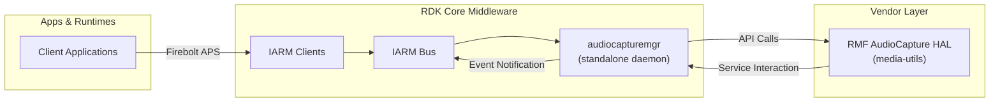
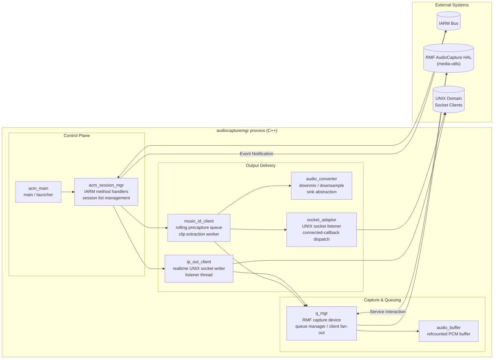
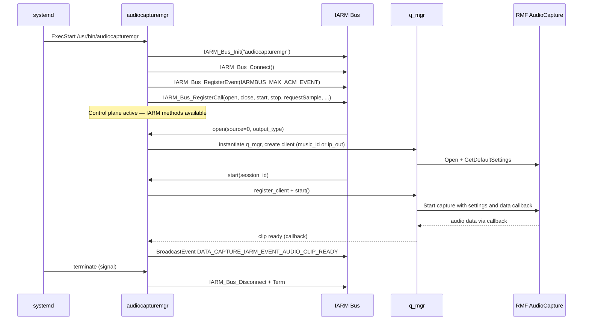
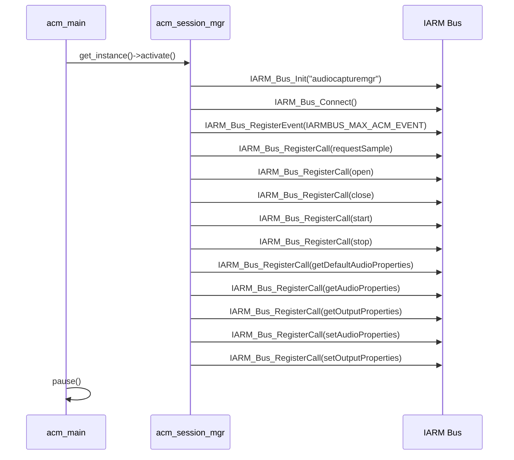
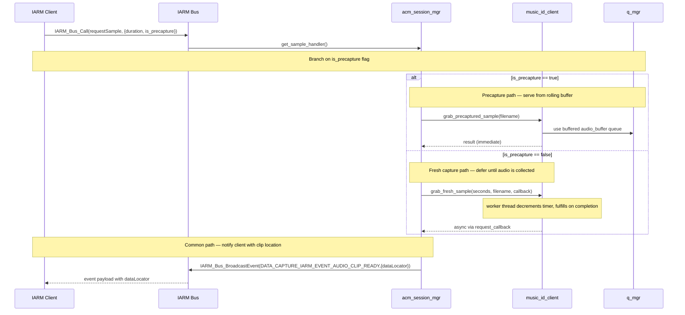
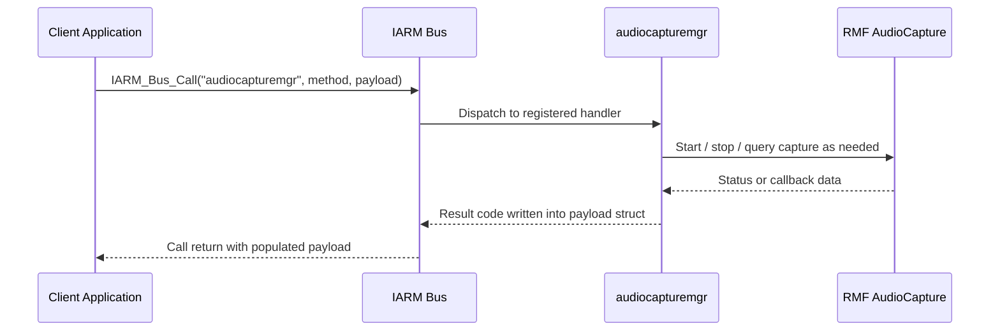
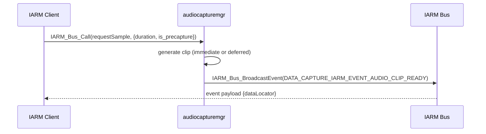

# Audiocapturemgr

`audiocapturemgr` is a userspace daemon that captures live audio from the platform audio subsystem and serves audio data to clients over the IARM inter-process communication bus. It runs as a standalone background service that remains active for the lifetime of the system session, registering control methods on the bus at startup and tearing them down on process termination.

The service exposes audio capture sessions on a per-client basis. Each session is associated with the primary audio source and a delivery mode chosen at session open time: a buffered mode that maintains a rolling precapture queue and extracts audio clips on demand, or a realtime streaming mode that pushes live audio directly to the requesting client over a local socket connection. Clients are notified asynchronously over the bus when a requested audio clip becomes available.

Internally, a central capture manager owns the connection to the audio hardware, maintains data queues, and distributes incoming audio to all active client sessions. Each delivery mode is handled by a dedicated subsystem responsible for either managing the precapture buffer and scheduling clip extraction, or forwarding live audio buffers to a connected socket consumer.



**Key Features & Responsibilities:**

- **IARM service endpoint for audio capture control**: Exposes session lifecycle operations (open, close, start, stop, sample request) and audio/output property management as callable methods on the IARM bus, allowing any authorized process to control audio capture without direct hardware access.
- **Session-based output routing**: Directs captured audio to either buffered clip extraction or realtime local socket streaming depending on the delivery mode selected when a session is opened.
- **Audio capture queue management**: Maintains incoming and outgoing data queues between the hardware capture callback and active client sessions, with background monitoring to detect and log periods where audio inflow stalls.
- **Clip request scheduling**: Satisfies audio clip requests either immediately from the precaptured rolling buffer or after a configured fresh-capture window, then notifies the requesting client asynchronously over the bus when the clip is ready.
- **Audio format conversion**: Supports passthrough, channel downmix, sample-rate downsample, and combined conversion paths to adapt captured audio to the format required by each client session.

---

## Design

The component is organized around a single capture source manager (`q_mgr`) with a client registration model. Audio data arrives through the `RMF_AudioCapture_Start()` callback (`q_mgr::data_callback`) and is enqueued as `audio_buffer` objects with reference counting. A dedicated `data_processor_thread` swaps incoming and outgoing queues under mutex protection and dispatches buffer pointers to all registered clients, while `update_buffer_references()` adjusts refcounts based on active clients. A `data_monitor` thread runs independently to detect and log periods where inflow byte count stops advancing. Session orchestration in `acm_session_mgr` separates control-plane concerns (IARM method dispatch, session lookup, result mapping) from data-plane processing (capture, queuing, conversion, output transport). Queue overflow is bounded by `MAX_QMGR_BUFFER_DURATION_S = 30` seconds, beyond which the incoming queue is flushed.

Northbound interaction flows exclusively through IARM, where clients invoke named calls and receive result codes and events. Southbound interaction uses the full RMF AudioCapture API surface — `Open`, `Open_Type`, `GetDefaultSettings`, `GetCurrentSettings`, `GetStatus`, `Start`, `Stop`, and `Close`.

IPC mechanisms include IARM call registration and event broadcast for control and asynchronous notifications, UNIX domain sockets (`AF_UNIX`, `SOCK_STREAM`) for realtime PCM streaming (`ip_out_client`) and socket-delivery clip output (`music_id_client`/`socket_adaptor`), and internal control pipes combined with `select()` loops to shut down listener threads in `ip_out_client`.

Buffered clip file output is written via `std::ofstream` when using file-mode delivery. Socket-mode delivery writes clip bytes directly to an accepted UNIX socket connection. No component-owned configuration files are opened or parsed at runtime.



#### Threading Model

- **Threading Architecture**: Multi-threaded, event-driven around RMF capture callbacks and semaphore/worker loops.
- **Main Thread**: Process startup, IARM `activate`/`deactivate`, and blocked wait via `pause()`.
- **Worker Threads**:
  - _`q_mgr` processing thread_ (`pthread_create`): waits on `sem_t m_sem` and wakes on `notify_data_ready()` to swap queues and dispatch buffers to clients.
  - _`q_mgr` data monitor thread_ (`std::thread`): checks `m_inflow_byte_counter` every 5 seconds via `std::condition_variable` and logs stall and resume events.
  - _`music_id_client` worker thread_ (`std::thread`): decrements `time_remaining` on pending requests and calls `grab_last_n_seconds()` to fulfill them.
  - _`ip_out_client` listener thread_ (`pthread_create`): runs `select()` over the listen socket and a control pipe, accepts connections, and stores write fd.
  - _`socket_adaptor` listener thread_ (`std::thread`): accepts one connection and invokes the registered `connected_callback`.
- **Synchronization**: `pthread_mutex_t` (session manager, queue, client list), `std::mutex` (data monitor), `sem_t` (queue wakeup), and a global audio-buffer mutex for refcount operations.
- **Async / Event Dispatch**: RMF capture callback pushes data into the incoming queue and posts the semaphore. IARM `BroadcastEvent` delivers `AUDIO_CLIP_READY` to subscribed clients. Socket callbacks trigger clip delivery for socket-output mode.

### Prerequisites and Dependencies

#### Platform and Integration Requirements

- **Build Dependencies**: Build-time recipe dependencies: `virtual/vendor-media-utils` (RMF AudioCapture provider), `media-utils-headers` (supplies `rmfAudioCapture.h`), `iarmbus`, `iarmmgrs`, `libunpriv`, `safec-common-wrapper`, and `safec` (conditional on `safec` in `DISTRO_FEATURES`); runtime dependency on `virtual/vendor-media-utils`; link flags: `-lprivilege`, and conditionally `pkg-config --libs libsafec` when `safec` is in `DISTRO_FEATURES`; compile flags: `-DDROP_ROOT_PRIV` (enables privilege-drop path at build time), conditionally `pkg-config --cflags libsafec` or `-fPIC`, and `-DSAFEC_DUMMY_API` when `safec` is absent from `DISTRO_FEATURES`.
- **HAL**: RMF AudioCapture HAL (`rmfAudioCapture.h`). See [Major HAL APIs Integration](#major-hal-apis-integration) for the full API surface and return values.
- **IARM Bus**: Bus name `audiocapturemgr` method names defined in `include/audiocapturemgr_iarm.h`.
- **Systemd Services**: `iarmbusd.service` must be running before `audiocapturemgr` starts.
- **Startup Order**: Defined by systemd unit `After=` / `Requires=` dependency on `iarmbusd.service`.

---

### Component State Flow

#### Initialization to Active State



#### Runtime State Changes

**State Change Triggers** _(all via IARM calls)_:

- `open` creates a session and binds the output-mode client implementation, output type cannot change without closing and reopening the session.
- `start` registers the client to `q_mgr` and initiates audio capture; data flow begins.
- `stop` unregisters the client and halts audio capture, data flow stops.
- `close` destroys the session object and releases resources.
- `setAudioProperties` may trigger a capture restart after applying new properties to `q_mgr`.

**Context Switching Scenarios:**

- Output mode switch (buffered vs. realtime) requires close/open because the client type is fixed at `open_handler()` time.
- If a write error occurs on the realtime socket in `ip_out_client::data_callback`, the write fd is closed and `m_num_connections` is decremented.
- When the incoming queue exceeds `MAX_QMGR_BUFFER_DURATION_S` seconds of buffered data, `flush_system()` is called to discard all queued buffers.

---

### Call Flows

#### Initialization Call Flow



#### Request Processing Call Flow



---

## Internal Modules

| Module / Class       | Description                                                                                                                                                                                                                                                                                                      | Key Files                                                                                                                          |
| -------------------- | ---------------------------------------------------------------------------------------------------------------------------------------------------------------------------------------------------------------------------------------------------------------------------------------------------------------- | ---------------------------------------------------------------------------------------------------------------------------------- |
| `acm_main`           | Process entry point. Calls `acm_session_mgr::activate()`, blocks in `pause()`, and calls `deactivate()` on exit. Optionally drops root privileges when built with `DROP_ROOT_PRIV`.                                                                                                                              | [src/acm_main.cpp](src/acm_main.cpp)                                                                                               |
| `acm_session_mgr`    | IARM API surface that manages the session list (`m_sessions`), dispatches all IARM method handlers, creates/destroys client and source objects, and issues `BroadcastEvent` calls. Singleton via `g_singleton`.                                                                                                  | [src/acm_session_mgr.cpp](src/acm_session_mgr.cpp), [include/acm_session_mgr.h](include/acm_session_mgr.h)                         |
| `q_mgr`              | Owns the RMF capture device handle, dual buffer queues, processing thread (semaphore-driven), data-monitor thread, and the list of registered `audio_capture_client` objects. Calls `RMF_AudioCapture_Open`, `Open_Type`, `GetDefaultSettings`, `GetCurrentSettings`, `GetStatus`, `Start`, `Stop`, and `Close`. | [src/audio_capture_manager.cpp](src/audio_capture_manager.cpp), [include/audio_capture_manager.h](include/audio_capture_manager.h) |
| `music_id_client`    | Buffered clip extraction client. Maintains a rolling `std::list<audio_buffer*>` queue sized by precapture duration. Fulfills clip requests immediately (precapture) or via a worker thread timer (fresh sample). Supports file-output and socket-output delivery modes, using `socket_adaptor` for the latter.   | [src/music_id.cpp](src/music_id.cpp), [include/music_id.h](include/music_id.h)                                                     |
| `ip_out_client`      | Realtime UNIX socket streaming client. Opens a listening UNIX socket on a path prefixed `/tmp/acm_ip_out_`. Accepts one connection (`MAX_CONNECTIONS = 1`) via a `pthread`-based listener thread controlled by a non-blocking pipe. Writes live PCM buffers on each `data_callback` invocation.                  | [src/ip_out.cpp](src/ip_out.cpp), [include/ip_out.h](include/ip_out.h)                                                             |
| `audio_converter`    | Determines the required conversion operation (passthrough, downmix, downsample, or combined) from input/output `audio_properties_t` structs and applies it to a `std::list<audio_buffer*>`. Writes converted output via an `audio_converter_sink` abstraction (file or memory).                                  | [src/audio_converter.cpp](src/audio_converter.cpp), [include/audio_converter.h](include/audio_converter.h)                         |
| `audio_buffer`       | Refcounted PCM buffer object. Created by `q_mgr` per incoming capture callback and freed when refcount reaches zero via `unref_audio_buffer()`. A global mutex protects refcount operations.                                                                                                                     | [src/audio_buffer.cpp](src/audio_buffer.cpp), [include/audio_buffer.h](include/audio_buffer.h)                                     |
| `socket_adaptor`     | UNIX domain socket listener helper for `music_id_client` socket-delivery mode. Starts listening on a supplied path, accepts one connection on a `std::thread`, and invokes a registered data-ready callback.                                                                                                     | [src/socket_adaptor.cpp](src/socket_adaptor.cpp), [include/socket_adaptor.h](include/socket_adaptor.h)                             |
| `acm_iarm_interface` | Legacy IARM interface (original `enableCapture` / `requestSample` API). Kept alongside the session manager for backward compatibility.                                                                                                                                                                           | [src/acm_iarm_interface.cpp](src/acm_iarm_interface.cpp)                                                                           |

---

## Component Interactions

### Interaction Matrix

| Target Component / Layer   | Interaction Purpose                                                                          | Key APIs / Topics                                                                                                                                                                                                                              |
| -------------------------- | -------------------------------------------------------------------------------------------- | ---------------------------------------------------------------------------------------------------------------------------------------------------------------------------------------------------------------------------------------------- |
| **HAL**                    |                                                                                              |                                                                                                                                                                                                                                                |
| RMF AudioCapture           | Open, configure, query, and control the capture device; receive PCM audio data via callback. | `RMF_AudioCapture_Open`, `RMF_AudioCapture_Open_Type`, `RMF_AudioCapture_GetDefaultSettings`, `RMF_AudioCapture_GetCurrentSettings`, `RMF_AudioCapture_GetStatus`, `RMF_AudioCapture_Start`, `RMF_AudioCapture_Stop`, `RMF_AudioCapture_Close` |
| **Component APIs**         |                                                                                              |                                                                                                                                                                                                                                                |
| IARM Bus                   | Receive control calls from clients and publish clip-ready events.                            | `IARM_Bus_Init`, `IARM_Bus_Connect`, `IARM_Bus_RegisterEvent`, `IARM_Bus_RegisterCall`, `IARM_Bus_BroadcastEvent`, `IARM_Bus_Disconnect`, `IARM_Bus_Term`                                                                                      |
| **External Systems**       |                                                                                              |                                                                                                                                                                                                                                                |
| UNIX domain socket clients | Receive realtime PCM stream (ip_out) or audio clip bytes (music_id socket mode).             | `socket`, `bind`, `listen`, `accept`, `write` on paths under `/tmp/`                                                                                                                                                                           |

### Events Published

| Event Name                                 | IARM / JSON-RPC Topic                         | Trigger Condition                                                                                         | Subscriber Components                                   |
| ------------------------------------------ | --------------------------------------------- | --------------------------------------------------------------------------------------------------------- | ------------------------------------------------------- |
| `DATA_CAPTURE_IARM_EVENT_AUDIO_CLIP_READY` | IARM event on bus `audiocapturemgr` (index 0) | `request_callback` invoked after clip generation completes (immediate precapture or fresh-sample timeout) | Any IARM client that registers a handler for this event |

### IPC Flow Patterns

**Primary Request / Response Flow:**



**Event Notification Flow:**



---

## Implementation Details

### Major HAL APIs Integration

| HAL API                                 | Purpose                                                                                                                                             | Implementation File                                                                                                            |
| --------------------------------------- | --------------------------------------------------------------------------------------------------------------------------------------------------- | ------------------------------------------------------------------------------------------------------------------------------ |
| `RMF_AudioCapture_Open()`               | Opens the capture device for the primary audio source and obtains a handle during `q_mgr` construction.                                             | [src/audio_capture_manager.cpp](src/audio_capture_manager.cpp)                                                                 |
| `RMF_AudioCapture_Open_Type()`          | Opens the capture device for a specified source type (`RMF_AC_TYPE_PRIMARY` or `RMF_AC_TYPE_AUXILIARY`), used when source selection is explicit.    | [src/audio_capture_manager.cpp](src/audio_capture_manager.cpp)                                                                 |
| `RMF_AudioCapture_GetDefaultSettings()` | Queries default audio format and FIFO settings, used to initialize `m_audio_properties` before starting capture.                                    | [src/audio_capture_manager.cpp](src/audio_capture_manager.cpp)                                                                 |
| `RMF_AudioCapture_GetCurrentSettings()` | Retrieves the `RMF_AudioCapture_Settings` currently in effect on a started handle and confirms the applied configuration after `Start()`.           | [src/audio_capture_manager.cpp](https://github.com/rdkcentral/rdk-halif-rmf_audio_capture/blob/main/include/rmfAudioCapture.h) |
| `RMF_AudioCapture_GetStatus()`          | Queries the `RMF_AudioCapture_Status` struct (started flag, format, sampling rate, FIFO depth, overflow/underflow counts), callable after `Open()`. | [src/audio_capture_manager.cpp](https://github.com/rdkcentral/rdk-halif-rmf_audio_capture/blob/main/include/rmfAudioCapture.h) |
| `RMF_AudioCapture_Start()`              | Starts capture with current settings and registers `q_mgr::data_callback` as the data handler.                                                      | [src/audio_capture_manager.cpp](src/audio_capture_manager.cpp)                                                                 |
| `RMF_AudioCapture_Stop()`               | Stops active audio capture, called on IARM `stop` or before property reconfiguration.                                                               | [src/audio_capture_manager.cpp](src/audio_capture_manager.cpp)                                                                 |
| `RMF_AudioCapture_Close()`              | Releases the capture handle and all hardware resources, called in `q_mgr` destructor.                                                               | [src/audio_capture_manager.cpp](src/audio_capture_manager.cpp)                                                                 |

### Key Implementation Logic

- **State / Lifecycle Management**:
  - Process lifecycle (`activate` / `pause` / `deactivate`) is implemented in [src/acm_main.cpp](src/acm_main.cpp) and [src/acm_session_mgr.cpp](src/acm_session_mgr.cpp).
  - Per-session state (`enable` flag, session lookup by ID, create/destroy) is managed in [src/acm_session_mgr.cpp](src/acm_session_mgr.cpp) using the `acm_session_t` struct.

- **Event Processing**:
  - `q_mgr::data_callback` (called from RMF capture thread) creates an `audio_buffer` and calls `add_data()` which enqueues it and posts `m_sem`.
  - `q_mgr::data_processor_thread` wakes on the semaphore, locks `m_q_mutex`, swaps queues, calls `update_buffer_references()` to set refcounts per registered client count, and invokes `data_callback()` on each client.
  - Clip-ready notifications flow through `request_callback` → `IARM_Bus_BroadcastEvent(DATA_CAPTURE_IARM_EVENT_AUDIO_CLIP_READY)`.

- **Error Handling Strategy**:
  - Invalid session IDs return `ACM_RESULT_BAD_SESSION_ID`.
  - Unsupported API paths return `ACM_RESULT_UNSUPPORTED_API`.
  - Duration values outside allowed range return `ACM_RESULT_DURATION_OUT_OF_BOUNDS`.
  - Precapture-specific failure codes: `ACM_RESULT_PRECAPTURE_DURATION_TOO_LONG` (254) and `ACM_RESULT_PRECAPTURE_NOT_SUPPORTED` (255).
  - Generic failures return `ACM_RESULT_GENERAL_FAILURE`.
  - Write failures on the realtime socket cause the connection to be closed and the write fd reset to `-1`.

- **Logging & Diagnostics**:
  - Source files use `INFO`, `WARN`, `ERROR`, and `DEBUG` macros throughout.
  - `q_mgr::data_monitor` logs data stall and resume events with a 5-second polling interval.
  - Queue flush events and incomplete writes are logged at `WARN` level.

---

## Configuration

### Key Configuration Parameters

| Parameter                         | Type                    | Default              | Description                                                                                                                                               |
| --------------------------------- | ----------------------- | -------------------- | --------------------------------------------------------------------------------------------------------------------------------------------------------- |
| `AUDIOCAPTUREMGR_FILENAME_PREFIX` | string macro            | `"audio_sample"`     | Filename prefix constant used in session manager request naming paths. Defined in [include/audiocapturemgr_iarm.h](include/audiocapturemgr_iarm.h).       |
| `AUDIOCAPTUREMGR_FILE_PATH`       | string macro            | `"/opt/"`            | Base path constant used alongside the filename prefix. Defined in [include/audiocapturemgr_iarm.h](include/audiocapturemgr_iarm.h).                       |
| `DEFAULT_PRECAPTURE_DURATION_SEC` | `unsigned int` constant | `6`                  | Default precapture rolling window in seconds. Set via `music_id_client::set_precapture_duration()`. Defined in [src/music_id.cpp](src/music_id.cpp).      |
| `MAX_QMGR_BUFFER_DURATION_S`      | `unsigned int` constant | `30`                 | Maximum queued audio duration in seconds before `flush_system()` is triggered. Defined in [src/audio_capture_manager.cpp](src/audio_capture_manager.cpp). |
| `SOCKNAME_PREFIX` (`ip_out`)      | `std::string`           | `"/tmp/acm_ip_out_"` | Base path for the realtime output UNIX socket. Defined in [src/ip_out.cpp](src/ip_out.cpp).                                                               |
| `SOCKET_PATH` (`music_id`)        | string constant         | `"/tmp/acm-songid"`  | Base path for the music-id UNIX socket. Suffix appended per instance. Defined in [src/music_id.cpp](src/music_id.cpp).                                    |
| `DEFAULT_FIFO_SIZE`               | `size_t` constant       | `65536` (64 KiB)     | Default RMF capture FIFO size in bytes. Defined in [src/audio_capture_manager.cpp](src/audio_capture_manager.cpp).                                        |
| `DEFAULT_THRESHOLD`               | `size_t` constant       | `8192` (8 KiB)       | Default RMF capture callback threshold in bytes. Defined in [src/audio_capture_manager.cpp](src/audio_capture_manager.cpp).                               |

### Runtime Configuration

Runtime behavior is changed via IARM calls.

```bash
# Open a session (source=0, output_type=BUFFERED_FILE_OUTPUT or REALTIME_SOCKET)
IARM_Bus_Call("audiocapturemgr", "open", iarmbus_open_args)

# Change audio capture properties for an open session
IARM_Bus_Call("audiocapturemgr", "setAudioProperties", iarmbus_acm_arg_t)

# Change output delivery properties (e.g., precapture buffer duration)
IARM_Bus_Call("audiocapturemgr", "setOutputProperties", iarmbus_acm_arg_t)
```

### Configuration Persistence

Configuration changes are not persisted across reboots.
