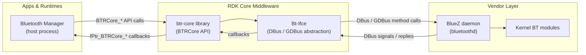
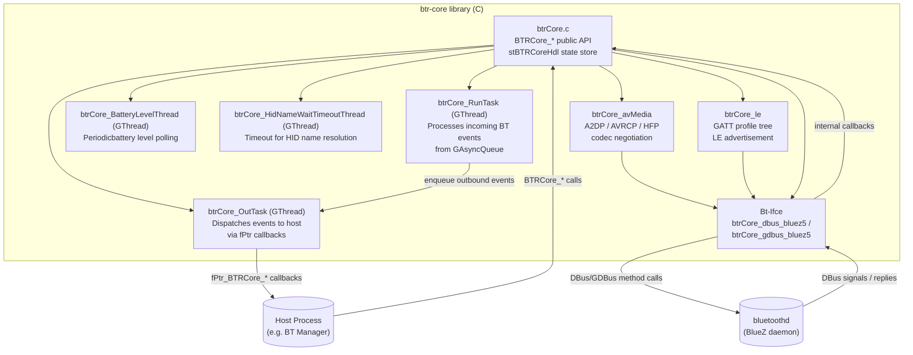
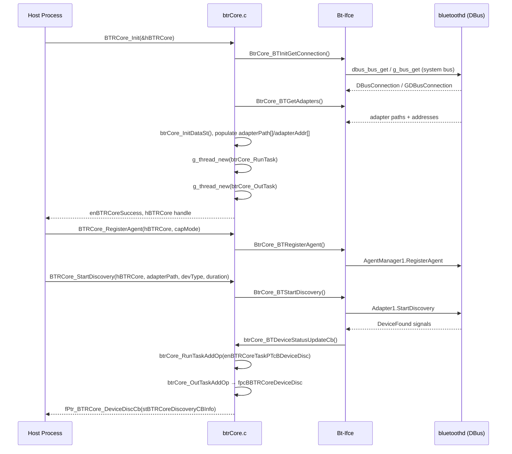
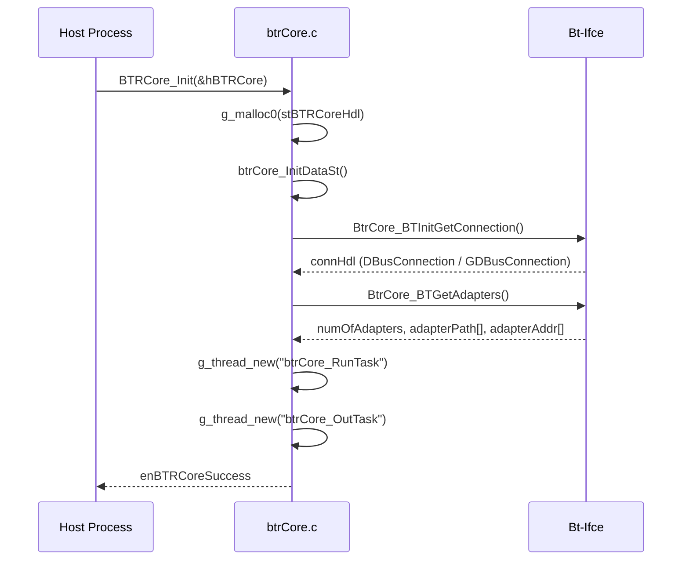
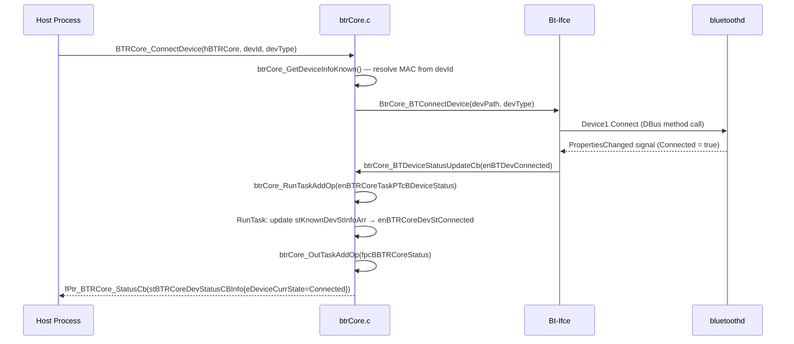
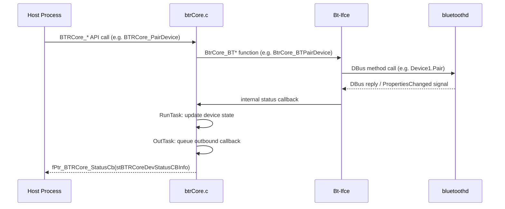
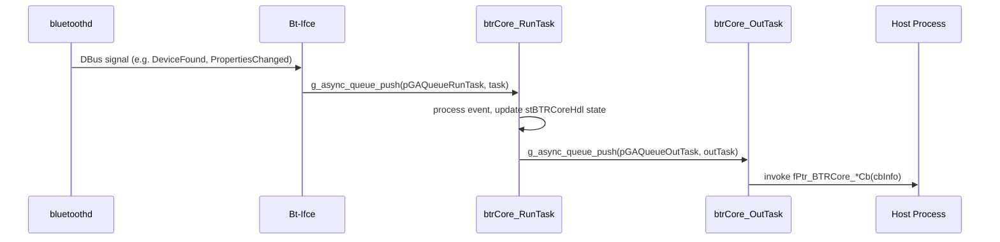

# Bluetooth (btr-core)

`btr-core` is a C library that implements the Bluetooth HAL for RDK middleware. It provides a software abstraction layer that interfaces with the BlueZ Bluetooth stack through DBus, isolating callers from BlueZ version differences and DBus protocol details. The library is not a standalone daemon; it is linked into a host process (such as a Bluetooth Manager application) that initializes it to obtain a handle and drives event handling through registered callbacks.

`btr-core` exposes APIs for adapter lifecycle, device discovery, pairing, connection, audio/video media session management (A2DP/AVRCP), and Bluetooth Low Energy (GATT) operations. It supports multiple adapters, a pool of paired devices, and a larger set of concurrently scanned devices.

Internally, the library coordinates adapter and device state through a central module, using decoupled event queues to separate BlueZ signal dispatch from host-process callback delivery. Dedicated sub-modules handle AV media (A2DP/AVRCP/HFP) and Low Energy/GATT operations. A transport-abstraction layer isolates the rest of the library from the specific DBus binding in use.

> **Note:** No IARM Bus, Thunder/WPEFramework `IPlugin`, or `JSONRPC` interfaces are implemented in this source folder. The library is consumed by a host process directly via its C API.

**Key Features & Responsibilities:**

- **Adapter management**: Provides APIs to enumerate, select, power on/off, rename, enable discoverable state, reset, and query version information for Bluetooth adapters.
- **Device discovery, pairing, and connection**: Supports scanning for nearby devices, pairing and unpairing, and managing the full connection lifecycle for both classic and LE devices.
- **A/V media session management**: Handles A2DP sink/source and HFP media endpoint registration, codec negotiation (SBC, MPEG, AAC), AVRCP transport paths, and media player metadata and control commands.
- **Bluetooth Low Energy (GATT)**: Manages GATT profile hierarchies, LE advertisement registration and release, GATT read/write/notify operations, and OTA firmware transfer.
- **Battery level monitoring**: Periodically polls battery levels for connected devices and delivers low-battery threshold notifications to the host process.
- **Callback-based event dispatch**: Delivers device discovery, status, media, connection intimation, and connection authorization events to the host process through registered callbacks, without blocking the BlueZ DBus dispatch path.
- **Telemetry integration**: Optionally reports Bluetooth events to the platform telemetry service, enabled or disabled at build time.

---

## Design

The library is structured as a three-layer stack: the `BTRCore` API layer in `btrCore.c`, a sub-module layer (`btrCore_avMedia`, `btrCore_le`), and a transport-abstraction layer (`Bt-Ifce`). The top layer maintains all device and adapter state in the opaque `stBTRCoreHdl` structure allocated at `BTRCore_Init()`. Incoming DBus/GDBus events from BlueZ are received on the Bt-Ifce callback thread and enqueued onto a GLib asynchronous queue (`pGAQueueRunTask`) for processing in a dedicated `btrCore_RunTask` GThread. Processed events that need to be surfaced to the host process are similarly queued onto `pGAQueueOutTask` and dispatched by `btrCore_OutTask`, decoupling DBus dispatch latency from host-process callback execution. Device identity is represented by a `tBTRCoreDevId` derived from the device MAC address via `btrCore_GenerateUniqueDeviceID`. Known (paired) devices are stored in `stKnownDevicesArr` and scanned devices in `stScannedDevicesArr`, each tracked with a parallel `stBTRCoreDevStateInfo` array.

Northbound interaction is exclusively through C function calls: the host process calls `BTRCore_*` functions and receives asynchronous events via function pointer callbacks. Southbound interaction is through DBus method calls and signal subscriptions to BlueZ's `org.bluez.*` interfaces (`Adapter1`, `Device1`, `AgentManager1`, `Media1`, `MediaTransport1`, `MediaPlayer1`, `GattManager1`, `LEAdvertisingManager1`, `Battery1`, etc.) implemented in `btrCore_dbus_bluez5.c` or `btrCore_gdbus_bluez5.c` depending on the build configuration.

IPC mechanisms: DBus (via `libdbus-1`) or GDBus (via `gio-2.0` / `gio-unix-2.0`) to communicate with `bluetoothd`. There is no inter-process mechanism between `btr-core` and its host process beyond direct C function calls and registered callbacks. UNIX domain socket connections are not used by this library.

Data persistence: No persistent key-value store, database, or configuration files are read or written at runtime. The known-device list is populated at init time by querying BlueZ's paired-device list via DBus. No state is persisted by the library itself across process restarts.

### Threading Model

- **Threading Architecture**: Multi-threaded, event-driven; all GLib-based threads.
- **Main Thread**: Calls `BTRCore_Init()` and `BTRCore_*` API functions. Registers callbacks and submits operations.
- **Worker Threads**:
  - _`btrCore_RunTask`_ (`GThread`): Dequeues tasks from `pGAQueueRunTask`; processes incoming adapter status, device discovery/removal/loss, device status, media status, connection intimation, authentication, and modalias update events from the Bt-Ifce callbacks.
  - _`btrCore_OutTask`_ (`GThread`): Dequeues tasks from `pGAQueueOutTask`; invokes the host-process-registered callback functions (`fpcBBTRCoreDeviceDisc`, `fpcBBTRCoreStatus`, `fpcBBTRCoreMediaStatus`, `fpcBBTRCoreConnIntim`, `fpcBBTRCoreConnAuth`).
  - _`btrCore_BatteryLevelThread`_ (`GThread`): Sleeps on `batteryLevelCond` (GMutex/GCond); wakes periodically at `batteryLevelRefreshInterval` to query battery levels for connected devices via GATT; exits on `batteryLevelThreadExit`.
  - _`btrCore_HidNameWaitTimeoutThread`_ (`GThread`, per-device): Waits `BTRCORE_HID_NAME_WAIT_TIMEOUT_SEC = 7` seconds for a HID controller name to be resolved after connection; cancels or confirms pending name information in `stPendingHidNameInfo`.
- **Synchronization**: `GMutex` + `GCond` for battery thread coordination and HID name wait; `GAsyncQueue` (internally lock-free) for task hand-off between Bt-Ifce callback thread and RunTask/OutTask threads.
- **Async / Event Dispatch**: BlueZ events arrive as DBus signal callbacks in the Bt-Ifce layer; these callbacks post `stBTRCoreTaskGAqData` items to `pGAQueueRunTask`. RunTask processes and posts to `pGAQueueOutTask`. OutTask invokes the host-registered callback. This two-queue chain keeps the DBus dispatch thread free.

### Prerequisites & Dependencies

**Documentation Verification Checklist:**

- [x] **Thunder / WPEFramework APIs**: No `IPlugin`, `JSONRPC`, or `Exchange` implementation found.
- [x] **IARM Bus**: No `IARM_Bus_*` usage found in any source file.
- [x] **Device Services (DS) APIs**: No DS API calls found; BlueZ is accessed directly via DBus.
- [x] **Persistent store**: No persistent store read/write calls found.
- [x] **Systemd services**: No `.service` file found in this source folder.
- [x] **Configuration files**: No runtime configuration-file parsing found in the component source.

### RDK-V Platform and Integration Requirements

- **WPEFramework Version**: Not applicable — no Thunder plugin implementation.
- **Build Dependencies**: C toolchain; autoconf >= 2.69, automake, libtool; `dbus-1` (required, all modes); `glib-2.0 >= 2.32.0` (bluez4/bluez5 modes); `glib-2.0 >= 2.58.0` + `gio-2.0` + `gio-unix-2.0` + `libffi >= 3.0.0` + `gdbus-codegen` (gdbus_bluez5 mode); `bluetooth/audio/a2dp-codecs.h` from BlueZ source; optional `libbluetooth-dev` for `bluetooth/bluetooth.h` (bluez5 mode).
- **Plugin Dependencies**: None.
- **Device Services / HAL**: BlueZ daemon (`bluetoothd`) must be running and reachable on the system DBus.
- **IARM Bus**: Not used.
- **Systemd Services**: `bluetoothd` must be running. No systemd service file is provided by this component.
- **Configuration Files**: None parsed at runtime.
- **Startup Order**: `bluetoothd` must be available before `BTRCore_Init()` is called; the library queries BlueZ for adapters and paired devices at init time.
- **Optional build flags**:
  - `--enable-btr-ifce=bluez4|bluez5|gdbus_bluez5` — selects Bt-Ifce backend.
  - `--enable-leonly=yes` — builds with `LE_MODE` defined, disabling A/V media code paths.
  - `--enable-rdk-logger=yes` — links `librdkloggers` and enables `RDK_LOGGER_ENABLED`.
  - `--enable-telemetry=yes|no` — links `libtelemetry_msgsender` for T2 event reporting.
  - `--enable-safec=yes` — links `libsafec`; otherwise uses `SAFEC_DUMMY_API` stubs.

---

### Component State Flow

#### Initialization to Active State

#### Runtime State Changes

**State Change Triggers:**

- `BTRCore_PairDevice()` transitions a scanned device to `enBTRCoreDevStPaired`; failure leaves it at `enBTRCoreDevStFound`.
- `BTRCore_ConnectDevice()` transitions a known device through `enBTRCoreDevStConnecting` → `enBTRCoreDevStConnected`; `BTRCore_DisconnectDevice()` transitions it through `enBTRCoreDevStDisconnecting` → `enBTRCoreDevStDisconnected`.
- `enBTRCoreDevStPlaying` is set when an A2DP/AVRCP transport path becomes active.
- `enBTRCoreDevStLost` is set when BlueZ reports a device has disappeared from scan results; `enBTRCoreDevStUnpaired` is set on unpairing.
- Connection intimation (`fPtr_BTRCore_ConnIntimCb`) and authentication (`fPtr_BTRCore_ConnAuthCb`) callbacks give the host process the opportunity to accept or reject incoming connection and pairing requests.

**Context Switching Scenarios:**

- LE-only build (`--enable-leonly=yes`) compiles out `btrCore_avMedia` and all A/V media paths; only GATT/LE operations are available.
- `btrCore_CheckLeHidConnectionStability()` tracks disconnect timestamps (`disconnect_ts`, `last_disconnect_ts`) on `stBTRCoreBTDevice` to detect unstable LE HID connections and calls `btrCore_RemoveUnstableDeviceFromActionList()` to suppress reconnect attempts.
- HID controller name resolution uses `stPendingHidNameInfo` and a per-device timeout thread (`btrCore_HidNameWaitTimeoutThread`, `BTRCORE_HID_NAME_WAIT_TIMEOUT_SEC = 7`) because BlueZ may deliver the name asynchronously after the connection event.

---

### Call Flows

#### Initialization Call Flow

#### Request Processing Call Flow

---

## Internal Modules

| Module / Class | Description | Key Files |
| --- | --- | --- |
| `btrCore` | Main BTRCore API implementation. Manages `stBTRCoreHdl`, adapter and device state arrays, task queue threads, battery thread, and routes Bt-Ifce callbacks into the two-stage task dispatch pipeline. | [src/btrCore.c](src/btrCore.c), [include/btrCore.h](include/btrCore.h) |
| `btrCore_avMedia` | Audio/Video media session management. Handles A2DP media endpoint registration with BlueZ, SBC/MPEG/AAC codec capability negotiation, A2DP transport path acquisition, and AVRCP player/browser path callbacks. Guarded by `#ifndef LE_MODE`. | [src/btrCore_avMedia.c](src/btrCore_avMedia.c), [include/btrCore_avMedia.h](include/btrCore_avMedia.h) |
| `btrCore_le` | Bluetooth Low Energy / GATT implementation. Maintains the GATT profile tree (up to `BTR_MAX_GATT_PROFILE = 16` profiles, `BTR_MAX_GATT_SERVICE = 6` services, `BTR_MAX_GATT_CHAR = 28` characteristics, `BTR_MAX_GATT_DESC = 6` descriptors). Provides LE advertisement registration/release, GATT read/write/notify operations, and OTA transfer helpers (`BtrCore_LE_BatteryOTATransfer`). | [src/btrCore_le.c](src/btrCore_le.c), [include/btrCore_le.h](include/btrCore_le.h) |
| `Bt-Ifce (btrCore_dbus_bluez5)` | DBus/BlueZ5 transport layer. Connects to the system DBus, proxies all `org.bluez.*` method calls, and registers DBus message filter handlers for `org.freedesktop.DBus.ObjectManager` signals and property change events. Selected with `--enable-btr-ifce=bluez5`. | [src/bt-ifce/btrCore_dbus_bluez5.c](src/bt-ifce/btrCore_dbus_bluez5.c), [include/bt-ifce/btrCore_bt_ifce.h](include/bt-ifce/btrCore_bt_ifce.h) |
| `Bt-Ifce (btrCore_gdbus_bluez5)` | GDBus/BlueZ5 transport layer. Uses GLib GDBus bindings generated by `gdbus-codegen` for type-safe BlueZ interface proxies. Selected with `--enable-btr-ifce=gdbus_bluez5`. | [src/bt-ifce/btrCore_gdbus_bluez5.c](src/bt-ifce/btrCore_gdbus_bluez5.c) |
| `Bt-Ifce (btrCore_dbus_bluez4)` | DBus/BlueZ4 transport layer. Legacy BlueZ4 interface. Selected with `--enable-btr-ifce=bluez4` (default). | [src/bt-ifce/btrCore_dbus_bluez4.c](src/bt-ifce/btrCore_dbus_bluez4.c) |
| `bt-telemetry` | Thin wrapper for T2 telemetry reporting. Provides `telemetry_init()`, `telemetry_event_s()`, `telemetry_event_d()`, `telemetry_event_f()`. When built without `HAVE_TELEMETRY_MSGSENDER`, all calls are stubbed. | [src/bt-telemetry.c](src/bt-telemetry.c) |
| `btrCore_service` | Header-only UUID/service string definitions. Maps Bluetooth SDP UUIDs (A2DP source/sink, AVRCP, HFP, Headset, GATT, Tile, Battery, etc.) to shorthand name constants used in UUID-to-service classification logic. | [include/btrCore_service.h](include/btrCore_service.h) |

---

## Component Interactions

### Interaction Matrix

| Target Component / Layer | Interaction Purpose | Key APIs / Topics |
| --- | --- | --- |
| **RDK-E Plugins** | | |
| None found | No Thunder plugin, IARM, or other RDK middleware IPC implemented. | N/A |
| **Device Services / HAL** | | |
| BlueZ daemon (`bluetoothd`) | All Bluetooth operations — adapter control, device discovery, pairing, connection, A2DP media, GATT — are performed via DBus or GDBus method calls and signal subscriptions to BlueZ interfaces. | `org.bluez.Adapter1`, `org.bluez.Device1`, `org.bluez.AgentManager1`, `org.bluez.Media1`, `org.bluez.MediaTransport1`, `org.bluez.MediaPlayer1`, `org.bluez.GattManager1`, `org.bluez.LEAdvertisingManager1`, `org.bluez.Battery1` |
| **External Systems** | | |
| T2 Telemetry (`libtelemetry_msgsender`) | Reports Bluetooth events as T2 markers (string, integer, float values). | `t2_init`, `t2_event_s`, `t2_event_d`, `t2_event_f` |

### Events Published

No IARM or JSON-RPC events are published. Outbound notifications are delivered synchronously to the host process via registered C function pointer callbacks:

| Callback Type | Trigger Condition | Data Structure |
| --- | --- | --- |
| `fPtr_BTRCore_DeviceDiscCb` | A device is found or an adapter property changes during discovery. | `stBTRCoreDiscoveryCBInfo` |
| `fPtr_BTRCore_StatusCb` | A known or scanned device changes state (connected, disconnected, paired, lost, LE property update, etc.). | `stBTRCoreDevStatusCBInfo` |
| `fPtr_BTRCore_MediaStatusCb` | A media player state changes (track started/paused/stopped/changed, position update, player name, volume, AVRCP playback controls). | `stBTRCoreMediaStatusCBInfo` |
| `fPtr_BTRCore_ConnIntimCb` | An incoming connection request requires the host's decision (accept/reject). Passkey delivered in `stBTRCoreConnCBInfo`. | `stBTRCoreConnCBInfo` |
| `fPtr_BTRCore_ConnAuthCb` | An incoming pairing/authentication request requires the host's authorization response. | `stBTRCoreConnCBInfo` |

### IPC Flow Patterns

**Primary Request / Response Flow:**

**Event Notification Flow:**

---

## Implementation Details

### Major HAL APIs Integration

This component does not call a Device Services (DS) HAL. All southbound calls go directly to BlueZ over DBus/GDBus. The key BlueZ interfaces invoked are listed below; all calls are made from within the Bt-Ifce layer.

| BlueZ Interface / Method | Purpose | Implementation File |
| --- | --- | --- |
| `org.bluez.Adapter1.StartDiscovery` / `StopDiscovery` | Start and stop BT device scanning. | [src/bt-ifce/btrCore_dbus_bluez5.c](src/bt-ifce/btrCore_dbus_bluez5.c) |
| `org.bluez.Device1.Pair` / `CancelPairing` | Initiate and cancel pairing with a remote device. | [src/bt-ifce/btrCore_dbus_bluez5.c](src/bt-ifce/btrCore_dbus_bluez5.c) |
| `org.bluez.Device1.Connect` / `Disconnect` | Connect and disconnect a paired device. | [src/bt-ifce/btrCore_dbus_bluez5.c](src/bt-ifce/btrCore_dbus_bluez5.c) |
| `org.bluez.AgentManager1.RegisterAgent` / `UnregisterAgent` | Register/unregister the pairing agent for passkey handling. | [src/bt-ifce/btrCore_dbus_bluez5.c](src/bt-ifce/btrCore_dbus_bluez5.c) |
| `org.bluez.Media1.RegisterEndpoint` / `UnregisterEndpoint` | Register A2DP/HFP media endpoints with codec capabilities. | [src/bt-ifce/btrCore_dbus_bluez5.c](src/bt-ifce/btrCore_dbus_bluez5.c) |
| `org.bluez.MediaTransport1.Acquire` / `Release` | Acquire the file descriptor for A2DP PCM/SBC audio streaming. | [src/bt-ifce/btrCore_dbus_bluez5.c](src/bt-ifce/btrCore_dbus_bluez5.c) |
| `org.bluez.GattManager1.RegisterApplication` / `UnregisterApplication` | Register GATT server application for LE GATT service hosting. | [src/bt-ifce/btrCore_dbus_bluez5.c](src/bt-ifce/btrCore_dbus_bluez5.c) |
| `org.bluez.LEAdvertisingManager1.RegisterAdvertisement` / `UnregisterAdvertisement` | Register and unregister LE advertisement data. | [src/bt-ifce/btrCore_dbus_bluez5.c](src/bt-ifce/btrCore_dbus_bluez5.c) |
| `org.bluez.Battery1` (property read) | Read battery level from connected devices that expose the Battery service. | [src/bt-ifce/btrCore_dbus_bluez5.c](src/bt-ifce/btrCore_dbus_bluez5.c) |

### Key Implementation Logic

- **State / Lifecycle Management**:
  - Device state transitions are tracked in `stBTRCoreDevStateInfo.eDevicePrevState` / `eDeviceCurrState` arrays parallel to `stKnownDevicesArr` and `stScannedDevicesArr`.
  - State transition logic is in [src/btrCore.c](src/btrCore.c) within `btrCore_RunTask`.
  - Device IDs are generated deterministically from MAC address via `btrCore_GenerateUniqueDeviceID()` so they are stable across discovery sessions.

- **Event Processing**:
  - All Bt-Ifce callbacks post a `stBTRCoreTaskGAqData` item (containing `enBTRCoreTaskOp`, `enBTRCoreTaskProcessType`, and the event data pointer) to `pGAQueueRunTask`.
  - `btrCore_RunTask` pops items and processes them by type (`enBTRCoreTaskPTcBAdapterStatus`, `enBTRCoreTaskPTcBDeviceDisc`, `enBTRCoreTaskPTcBDeviceStatus`, `enBTRCoreTaskPTcBMediaStatus`, `enBTRCoreTaskPTcBDevOpInfoStatus`, `enBTRCoreTaskPTcBConnIntim`, `enBTRCoreTaskPTcBConnAuth`, `enBTRCoreTaskPTcBModaliasUpdate`).
  - Events destined for the host are posted to `pGAQueueOutTask` and dispatched by `btrCore_OutTask`.

- **Error Handling Strategy**:
  - All public API functions return `enBTRCoreRet`; failure codes include `enBTRCoreFailure`, `enBTRCoreInitFailure`, `enBTRCoreNotInitialized`, `enBTRCoreInvalidAdapter`, `enBTRCorePairingFailed`, `enBTRCoreDiscoveryFailure`, `enBTRCoreDeviceNotFound`, `enBTRCoreInvalidArg`.
  - DBus errors in Bt-Ifce are handled by `btrCore_BTHandleDusError()` which logs the error name and message.
  - REPORT_IF_UNEQUAL macro is used throughout to log unexpected return codes without aborting.

- **Logging & Diagnostics**:
  - When built with `--enable-rdk-logger=yes` and `RDK_LOGGER_ENABLED` defined, logging uses `rdk_debug.h` macros.
  - Without RDK logger, `BTRCORELOG_INFO`, `BTRCORELOG_WARN`, `BTRCORELOG_ERROR`, `BTRCORELOG_DEBUG` macros defined in `btrCore_logger.h` are used.
  - Telemetry events for key operational milestones are emitted via `bt-telemetry.c` wrappers.

---

## Configuration

### Key Configuration Files

No runtime configuration file parsing by this component was found in the source code.

### Key Configuration Parameters

| Parameter | Type | Default | Description |
| --- | --- | --- | --- |
| `BTRCORE_MAX_NUM_BT_ADAPTERS` | `unsigned int` macro | `4` | Maximum number of BT adapters tracked simultaneously. Defined in [include/btrCore.h](include/btrCore.h). |
| `BTRCORE_MAX_NUM_BT_DEVICES` | `unsigned int` macro | `64` | Maximum number of paired (known) devices. Defined in [include/btrCore.h](include/btrCore.h). |
| `BTRCORE_MAX_NUM_BT_DISCOVERED_DEVICES` | `unsigned int` macro | `128` | Maximum number of scanned devices held concurrently. Defined in [include/btrCore.h](include/btrCore.h). |
| `BTRCORE_LOW_BATTERY_THRESHOLD` | `int` constant | `10` | Battery level percentage below which a low-battery condition is flagged. Defined in [src/btrCore.c](src/btrCore.c). |
| `BTRCORE_BATTERY_REFRESH_INTERVAL` | `int` constant | `300` | Default battery level polling interval in seconds. Defined in [src/btrCore.c](src/btrCore.c). |
| `BTRCORE_LOW_BATTERY_REFRESH_INTERVAL` | `int` constant | `60` | Battery polling interval in seconds when a low-battery device is found. Defined in [src/btrCore.c](src/btrCore.c). |
| `BTRCORE_HID_NAME_WAIT_TIMEOUT_SEC` | `int` constant | `7` | Maximum seconds to wait for a HID controller name to be resolved after connection. Defined in [src/btrCore.c](src/btrCore.c). |
| `BT_MAX_NUM_GATT_SERVICE` | `int` constant | `6` | Maximum GATT services per profile in the LE sub-module. Defined in [include/bt-ifce/btrCore_bt_ifce.h](include/bt-ifce/btrCore_bt_ifce.h). |
| `BT_MAX_NUM_GATT_CHAR` | `int` constant | `28` | Maximum GATT characteristics per service. Defined in [include/bt-ifce/btrCore_bt_ifce.h](include/bt-ifce/btrCore_bt_ifce.h). |

### Runtime Configuration

There is no runtime configuration API, CLI, or file mechanism in this library. All behavioral parameters are compile-time constants. Build-time feature selection (Bt-Ifce backend, LE-only mode, RDK logger, telemetry, safec) is controlled via `configure` flags.

### Configuration Persistence

Configuration changes are not persisted across reboots. The library does not write any state to storage.
