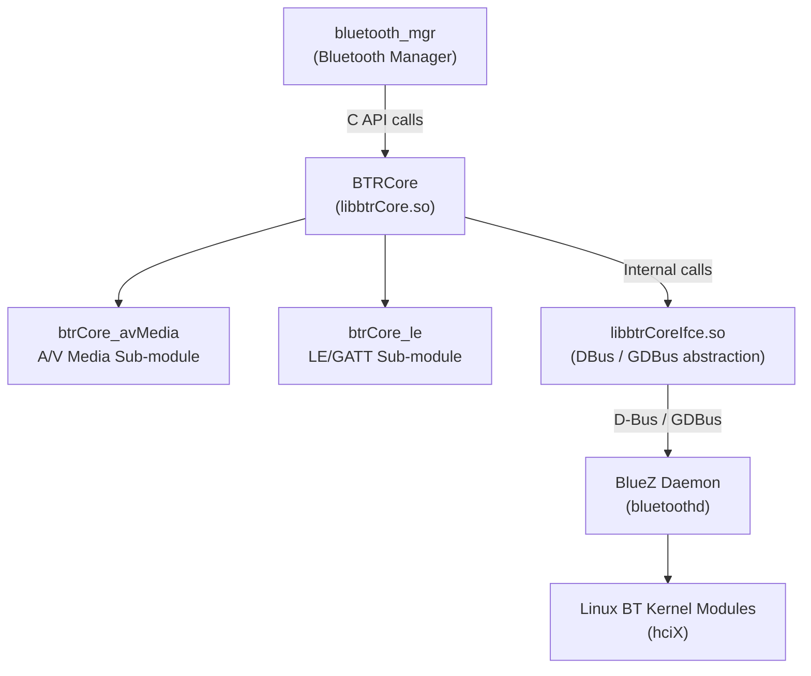
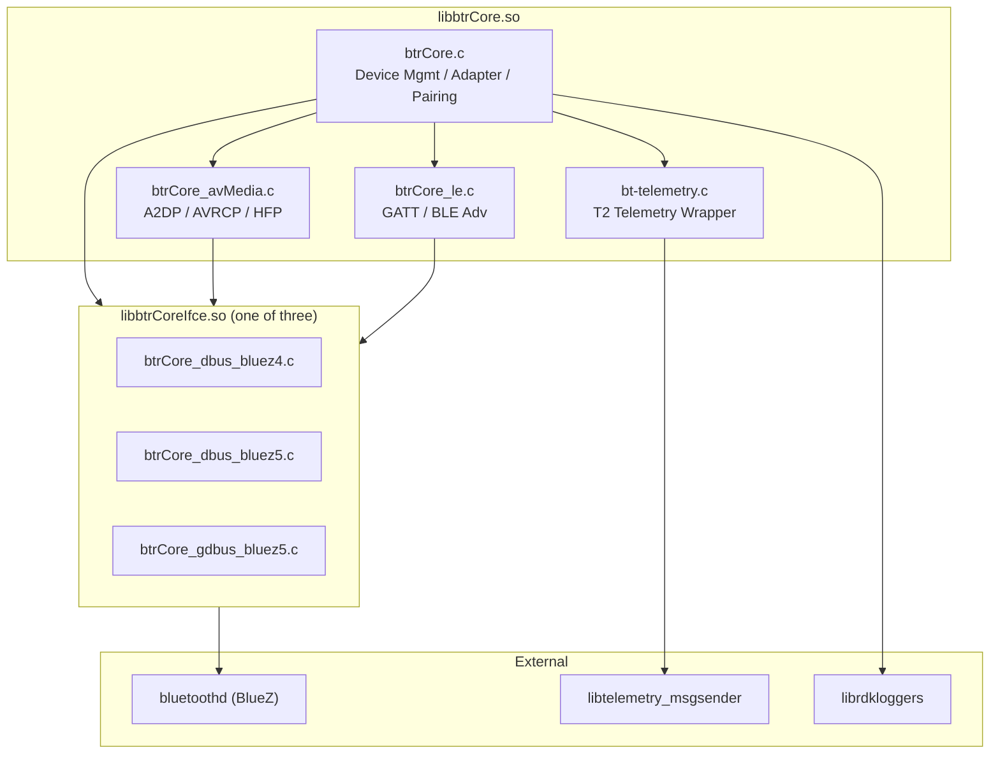
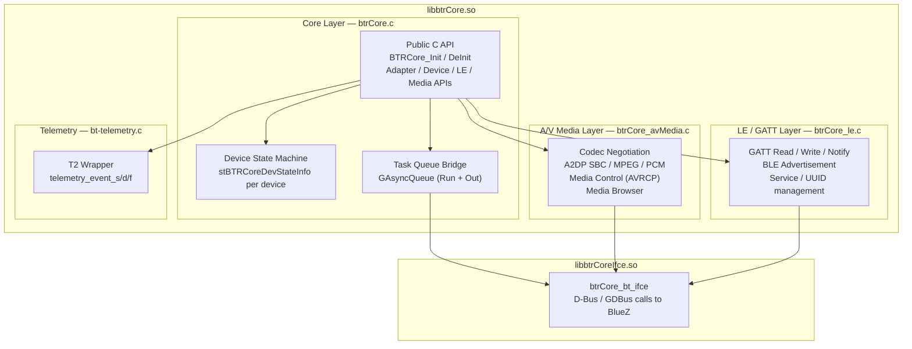
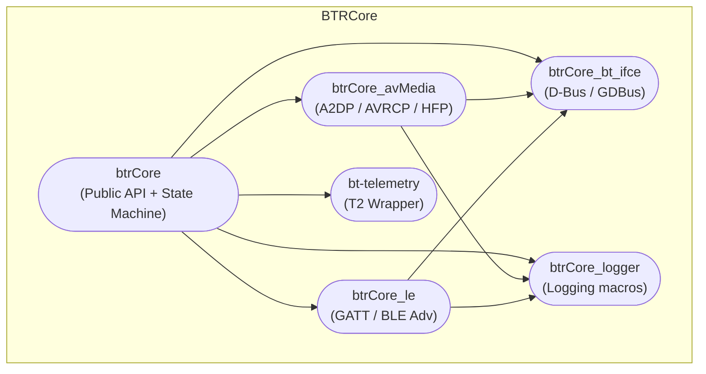
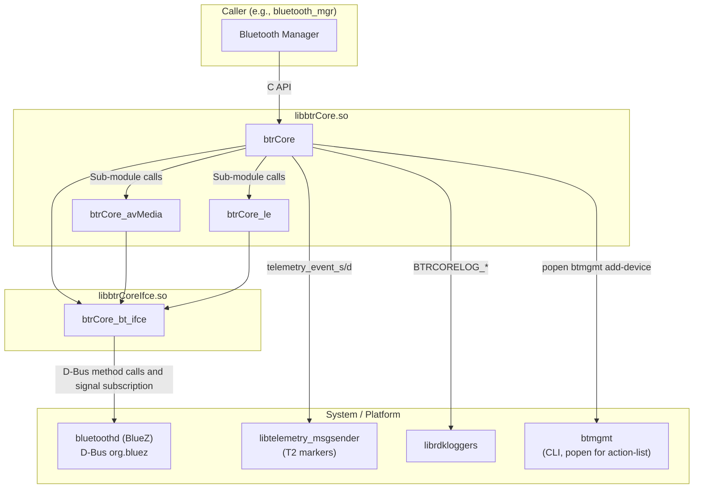
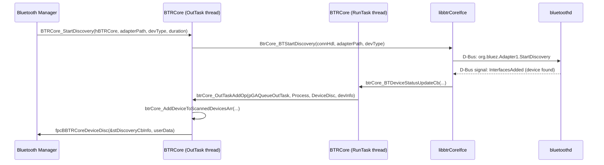
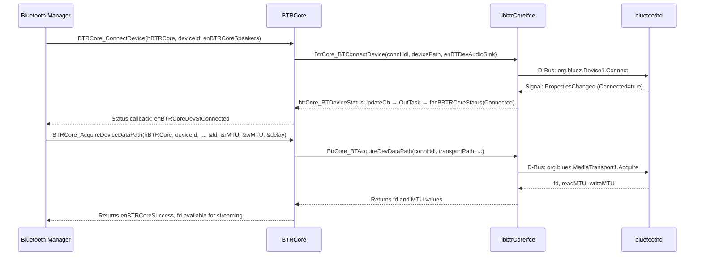
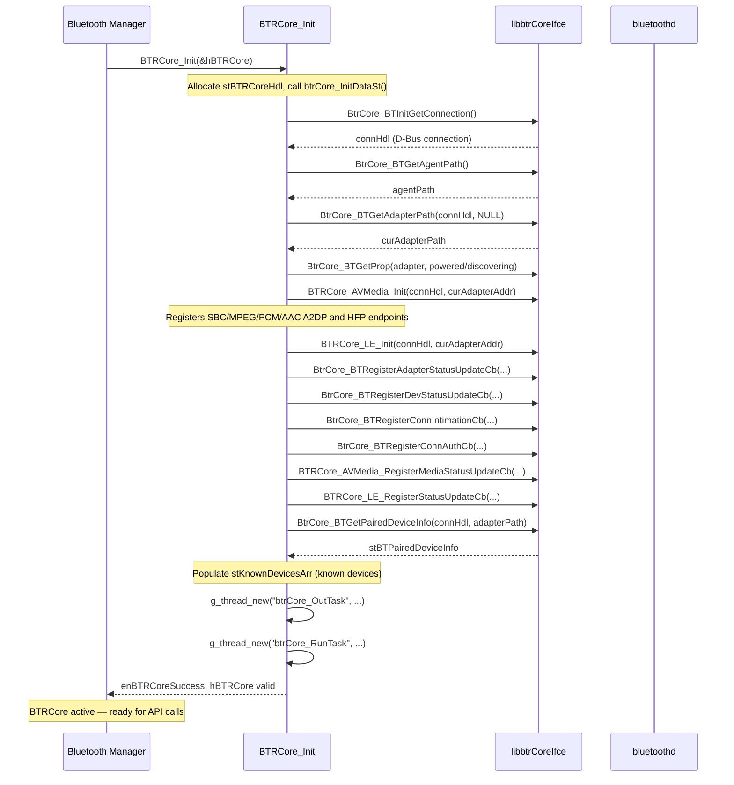
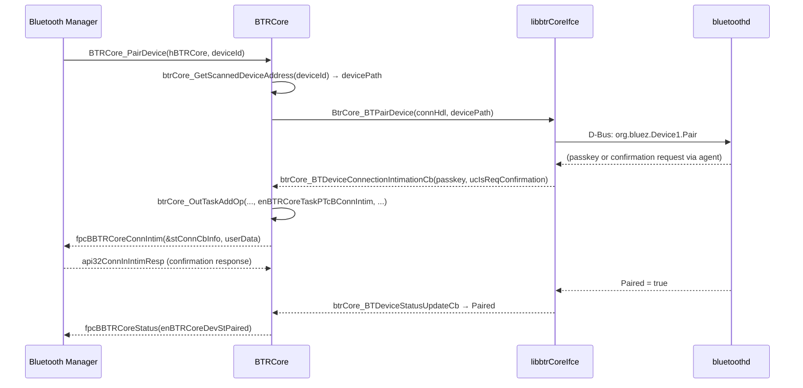
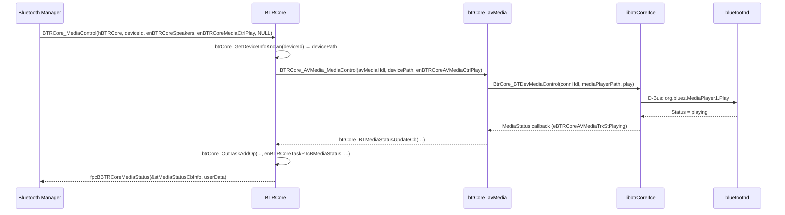

# BTRCore — Bluetooth Core

---

## Overview

BTRCore is the Bluetooth Hardware Abstraction Layer (HAL) in the RDK stack. It is delivered as a shared library (`libbtrCore.so`) and exposes a C API defined in `btrCore.h`. The library abstracts the complexity of interacting with the BlueZ Bluetooth daemon over D-Bus or GDBus, giving the layer above it (Bluetooth Manager, `bluetooth_mgr`) a stable, platform-agnostic interface for all Bluetooth operations.

At the device level, BTRCore enables a product to discover, pair, connect, and exchange data with Bluetooth peripherals including audio sinks and sources, Hands-Free Profile (HFP) headsets, Human Interface Devices (HID), Bluetooth Low Energy (LE) GATT devices, and LE advertisement beacons. Audio transport data paths are acquired and released through the library, enabling streaming pipelines to be established by upper layers without direct BlueZ interaction.

As a module, BTRCore is structured as three functional sub-libraries: the core device-management layer (`btrCore.c`), an A/V media layer (`btrCore_avMedia.c`), and an LE/GATT layer (`btrCore_le.c`). Below all of these sits a compile-time-selected Bluetooth interface library (`libbtrCoreIfce.so`) that translates BTRCore's internal calls into D-Bus or GDBus messages directed at BlueZ. A telemetry wrapper (`bt-telemetry.c`) provides a thin layer over `libtelemetry_msgsender` used for emitting T2 markers from within the library.



**Key Features & Responsibilities:**

- **Adapter management**: Provides APIs to enumerate, select, power, name, and set the discoverable state of local Bluetooth adapters. Up to four adapters (`BTRCORE_MAX_NUM_BT_ADAPTERS = 4`) are tracked simultaneously.
- **Device discovery**: Starts and stops Bluetooth inquiry sessions scoped to a specified device type (speakers, HID, LE, etc.). Discovered devices are stored in an internal scanned-devices array of up to 128 entries (`BTRCORE_MAX_NUM_BT_DISCOVERED_DEVICES = 128`).
- **Pairing and connection**: Manages the full pairing lifecycle including SDP retrieval, passkey/confirmation agent callbacks, and profile-specific connect and disconnect operations. Up to 64 paired devices (`BTRCORE_MAX_NUM_BT_DEVICES = 64`) are maintained in a known-devices array.
- **A/V media transport**: Negotiates A2DP codec configuration (SBC, MPEG, PCM; AAC support is conditionally compiled), registers BlueZ media endpoints, and acquires/releases file descriptor–based data paths for streaming (`BTRCore_AcquireDeviceDataPath` / `BTRCore_ReleaseDeviceDataPath`). AVRCP playback control and media browser operations are also supported.
- **HFP support**: Registers PCM and SBC media endpoints for Hands-Free Profile Audio Gateway and Headset roles.
- **LE / GATT**: Reads, writes, and subscribes to notifications on GATT characteristics and descriptors. Manages BLE advertisement registration, service UUID and manufacturer data configuration, and Tx power settings.
- **Battery level monitoring**: Periodically polls the `org.bluez.Battery1` interface for connected HID devices. A dedicated background thread refreshes battery levels at 300-second intervals, reducing to 60-second intervals when any device is below 10%.
- **Telemetry integration**: Emits T2 telemetry markers (e.g., `BTPairFail_split`, `BT_INFO_NotSupp_split`) for pair failures and detection of unsupported devices. Integration is conditional on `HAVE_TELEMETRY_MSGSENDER` being defined at build time.

---

## Architecture

### High-Level Architecture

BTRCore is a C shared library with no daemon lifecycle of its own. It is initialized by a caller (Bluetooth Manager) via `BTRCore_Init()`, which establishes a D-Bus or GDBus connection to the BlueZ daemon, obtains an adapter path, registers a BlueZ agent, populates the initial list of paired devices, registers all media endpoints, and launches the internal processing threads. The library operates through a handle (`tBTRCoreHandle`) that the caller retains and passes to every subsequent API call.

Northbound, BTRCore exposes a C function API. The caller registers function-pointer callbacks for four asynchronous event categories: device discovery, device status changes, media status updates, and connection intimation/authentication. All callbacks are dispatched from a dedicated output thread, ensuring the BlueZ message-receive loop is never blocked by upper-layer processing.

Southbound, BTRCore delegates all BlueZ interactions to a compile-time-selected interface library (`libbtrCoreIfce`). Three implementations exist: `btrCore_dbus_bluez4.c` (BlueZ 4, using libdbus-1), `btrCore_dbus_bluez5.c` (BlueZ 5, using libdbus-1 + libudev), and `btrCore_gdbus_bluez5.c` (BlueZ 5, using GLib GIO / GDBus). The selected implementation is transparent to the rest of BTRCore.

No persistent storage is read or written by BTRCore itself. Paired device data is sourced entirely from BlueZ via `BtrCore_BTGetPairedDeviceInfo()` at initialization and kept synchronized in memory. There are no configuration files read at runtime by BTRCore.



### Threading Model

- **Threading Architecture**: Multi-threaded. Four GLib thread types are used.
- **Main Thread** (caller's thread): Executes all synchronous API calls (`BTRCore_Init`, `BTRCore_StartDiscovery`, `BTRCore_ConnectDevice`, etc.) and registers callbacks. API calls are not thread-safe relative to each other; callers are expected to serialize them.
- **Worker Threads**:
  - _btrCore_RunTask_: Continuously calls `BtrCore_BTSendReceiveMessages()` in a 20 ms poll loop to drain the D-Bus connection queue and invoke incoming D-Bus signal callbacks. Runs until `BTRCore_DeInit()` signals `enBTRCoreTaskOpExit` on its `GAsyncQueue`.
  - _btrCore_OutTask_: Receives operation descriptors from a `GAsyncQueue` (`pGAQueueOutTask`) with a 50 ms timeout pop. Processes device discovery results, device state transitions, media status updates, adapter status changes, modialias updates, and connection events, then invokes the registered C callbacks. This decouples callback dispatch from the D-Bus receive loop.
  - _btrCore_BatteryLevelThread_: Polls battery levels for connected HID devices at a configurable interval (300 s normally, 60 s when any device reports below 10%). Started by `BTRCore_newBatteryLevelDevice()` and exits when no queryable devices remain or `batteryLevelThreadExit` is set.
  - _btrCore_HidNameWaitTimeoutThread_ (per-device, short-lived): Spawned when a HID device is discovered without a resolved name. Waits up to 7 seconds (`BTRCORE_HID_NAME_WAIT_TIMEOUT_SEC`) for a name-update event; if none arrives, emits a discovery callback with the fallback name `"Game Controller"`.
  - _btrCore_AVMedia_PlaybackPositionPolling_ (inside `libbtrCoreIfce`): Spawned by `btrCore_avMedia.c` to periodically query playback position from a connected A/V player.
- **Synchronization**:
  - `GMutex batteryLevelMutex` + `GCond batteryLevelCond`: guards the battery level thread's sleep/wake cycle and `batteryLevelThread` pointer.
  - `GMutex hidNameWaitMutex` + `GCond hidNameWaitCond`: guards the `stPendingHidNameInfo` array and coordinates HID name timeout threads.
  - `GAsyncQueue pGAQueueRunTask` / `pGAQueueOutTask`: thread-safe FIFO queues for inter-thread operation dispatch.
- **Async / Event Dispatch**: D-Bus signal callbacks from BlueZ arrive on the btrCore_RunTask thread. They are serialized as `stBTRCoreTaskGAqData` structures and pushed onto `pGAQueueOutTask`. The btrCore_OutTask thread pops them and invokes the registered upper-layer callbacks. This ensures callbacks are never called from within the D-Bus receive loop.

---

## Design

BTRCore follows a handle-based C library design. All state is encapsulated in an opaque `stBTRCoreHdl` structure allocated during `BTRCore_Init()` and freed during `BTRCore_DeInit()`. No global state is used beyond the RDK logger initialization flag (`b_rdk_logger_enabled`). Callers hold a `tBTRCoreHandle` (a `void*`) and pass it to every API function.

The northbound interface is a flat C function API. Asynchronous events from BlueZ are surfaced upward through five function-pointer callback slots in the handle. Callbacks carry typed structures (`stBTRCoreDevStatusCBInfo`, `stBTRCoreMediaStatusCBInfo`, `stBTRCoreDiscoveryCBInfo`, `stBTRCoreConnCBInfo`) that contain the device ID, name, address, device class, previous state, current state, and where applicable codec/media details.

Southbound, BTRCore communicates with BlueZ exclusively through `libbtrCoreIfce`. The interface functions used at runtime (from `btrCore_bt_ifce.h`) include adapter and device property queries, discovery control, pairing, connection, media endpoint registration, GATT service queries, and D-Bus message dispatch. The calling code in `btrCore.c` never directly constructs D-Bus messages.

The data persistence model is stateless on disk. Device lists (scanned and paired) are maintained entirely in heap-allocated arrays within `stBTRCoreHdl`. The paired list is reconstructed from BlueZ at `BTRCore_Init()` via `BtrCore_BTGetPairedDeviceInfo()` and kept consistent with BlueZ through event-driven updates and the `btrCore_PopulateListOfPairedDevices()` helper. Scanned device IDs are generated deterministically from the MAC address by stripping colons and parsing as a 48-bit hex integer.

### Component Diagram



---

## Internal Modules

| Module / Class    | Description                                                                                                                                                                                                                                                                | Key Files                                                                                                                                           |
| ----------------- | -------------------------------------------------------------------------------------------------------------------------------------------------------------------------------------------------------------------------------------------------------------------------- | --------------------------------------------------------------------------------------------------------------------------------------------------- |
| `btrCore`         | Main public API. Manages handle lifecycle, adapter enumeration, device discovery, pairing, connection/disconnection, data path acquisition, device state machine, and callback dispatch. Owns the RunTask and OutTask threads.                                             | `src/btrCore.c`, `include/btrCore.h`                                                                                                                |
| `btrCore_avMedia` | A/V and media sub-module. Handles BlueZ media endpoint registration (SBC, MPEG, PCM A2DP/HFP), codec capability negotiation, media transport acquisition, AVRCP playback control, and media browser element traversal.                                                     | `src/btrCore_avMedia.c`, `include/btrCore_avMedia.h`                                                                                                |
| `btrCore_le`      | LE and GATT sub-module. Manages GATT service/characteristic/descriptor discovery, read/write/notify operations, and BLE advertisement registration (type, service UUIDs, manufacturer data, Tx power).                                                                     | `src/btrCore_le.c`, `include/btrCore_le.h`                                                                                                          |
| `btrCore_bt_ifce` | D-Bus / GDBus abstraction layer. Translates higher-level requests into BlueZ D-Bus method calls and properties, and routes BlueZ signals back into the BTRCore callback chain. Three implementations exist for BlueZ 4 (DBus), BlueZ 5 (DBus + udev), and BlueZ 5 (GDBus). | `src/bt-ifce/btrCore_dbus_bluez4.c`, `src/bt-ifce/btrCore_dbus_bluez5.c`, `src/bt-ifce/btrCore_gdbus_bluez5.c`, `include/bt-ifce/btrCore_bt_ifce.h` |
| `bt-telemetry`    | Telemetry wrapper. Wraps `t2_init`, `t2_event_s`, `t2_event_d`, `t2_event_f` from `libtelemetry_msgsender`. Compiled conditionally; when `HAVE_TELEMETRY_MSGSENDER` is not defined, all functions are no-ops that log via `BTRCORELOG_INFO`.                               | `src/bt-telemetry.c`, `include/telemetry/bt-telemetry.h`                                                                                            |
| `btrCore_logger`  | Logging macros wrapping RDK Logger or `fprintf(stderr)`. Defines `BTRCORELOG_ERROR/WARN/INFO/DEBUG/TRACE`. When built with `--enable-rdk-logger`, routes to `RDK_LOG(…, "LOG.RDK.BTRCORE", …)`.                                                                            | `include/logger/btrCore_logger.h`                                                                                                                   |
| `btrCore_service` | Compile-time constant definitions for standard Bluetooth service UUIDs (SP, A2DP, AVRCP, HFP, GATT profiles, Battery Service, HID, Tile, XBB, etc.). No runtime logic.                                                                                                     | `include/btrCore_service.h`                                                                                                                         |
| `btrCoreTypes`    | Fundamental type definitions: `tBTRCoreHandle`, `tBTRCoreDevId`, `enBTRCoreRet`, `BOOLEAN`.                                                                                                                                                                                | `include/btrCoreTypes.h`                                                                                                                            |



---

## Prerequisites & Dependencies

**Documentation Verification Checklist:**

- [x] **D-Bus / GDBus**: Confirmed — all BlueZ communication in `btrCore_dbus_bluez5.c` and `btrCore_gdbus_bluez5.c` uses `dbus-1` and/or GLib GIO.
- [x] **BlueZ**: Confirmed — D-Bus service `org.bluez`, interfaces `org.bluez.Adapter1`, `org.bluez.Device1`, `org.bluez.Media1`, `org.bluez.GattManager1`, `org.bluez.LEAdvertisingManager1`, `org.bluez.Battery1`.
- [x] **Telemetry**: Confirmed — `t2_init`, `t2_event_s`, `t2_event_d` called in `bt-telemetry.c` when `HAVE_TELEMETRY_MSGSENDER` is defined.
- [x] **RDK Logger**: Confirmed — `rdk_debug.h` and `librdkloggers` used when `RDK_LOGGER_ENABLED` is defined.
- [x] **safec**: Confirmed — `MEMSET_S`, `MEMCPY_S`, `STRCPY_S` used throughout source files via `safec_lib.h`.
- [x] **Systemd service**: No `.service` file exists in the `bluetooth/` directory. BTRCore is a library, not a standalone daemon.
- [x] **Configuration files**: No runtime configuration files are read by BTRCore. There are no `/opt/` or `/etc/` file reads in `btrCore.c` beyond the RDK Logger debug config (`/etc/debug.ini` or `/opt/debug.ini`).
- [x] **libudev**: Confirmed — linked by `btrCore_dbus_bluez5.c` via `UDEV_LIB = -ludev` in `src/bt-ifce/Makefile.am`.

### Platform Requirements

- **Build System**: Autotools (autoconf 2.69+, automake, libtool).
- **Build Dependencies**:
  - `dbus-1` (all BlueZ 4/5 backends)
  - `glib-2.0 >= 2.32.0` (BlueZ 4 and DBus BlueZ 5 backends)
  - `glib-2.0 >= 2.58.0`, `gio-2.0 >= 2.58.0`, `gio-unix-2.0 >= 2.58.0`, `libffi >= 3.0.0`, `gdbus-codegen` (GDBus BlueZ 5 backend only)
  - `libudev` (DBus BlueZ 5 backend only)
  - `libtelemetry_msgsender` + `telemetry_busmessage_sender.h` (when `--enable-telemetry=yes`, which is the default)
  - `librdkloggers` + `rdk_debug.h` (when `--enable-rdk-logger=yes`)
  - `libsafec` / `safec` headers (when `--enable-safec=yes`; otherwise `SAFEC_DUMMY_API` is defined)
  - `libsecure_wrapper` (when `--enable-wrapper=yes`)
  - `bluetooth/audio/a2dp-codecs.h` from BlueZ source tree
  - `libbluetooth-dev` (`bluetooth/bluetooth.h`) for BlueZ 5 DBus backend
- **BlueZ Daemon**: A running `bluetoothd` process is required. Versions explicitly handled in the codebase: 5.45, 5.48, 5.54, 5.55, 5.77.
- **No IARM Bus dependency**: BTRCore does not use IARM. There are no `IARM_Bus_RegisterEventHandler` or `IARM_Bus_Call` calls anywhere in the `bluetooth/` source tree.
- **No Device Services (DS) API dependency**: BTRCore does not call DS APIs. It communicates directly with BlueZ over D-Bus.
- **No Thunder/WPEFramework dependency**: BTRCore is a plain C library with no WPEFramework plugin interfaces.
- **Startup Order**: No `.service` file. The library is initialized by its caller (Bluetooth Manager). The caller must ensure `bluetoothd` is running before calling `BTRCore_Init()`.

### Build Options Summary

| Option                            | Default                     | Effect                                                                                |
| --------------------------------- | --------------------------- | ------------------------------------------------------------------------------------- |
| `--enable-btr-ifce=bluez4`        | yes (if no other specified) | Selects `btrCore_dbus_bluez4.c`                                                       |
| `--enable-btr-ifce=bluez5`        | no                          | Selects `btrCore_dbus_bluez5.c` + libudev                                             |
| `--enable-btr-ifce=gdbus_bluez5`  | no                          | Selects `btrCore_gdbus_bluez5.c` + GIO                                                |
| `--enable-rdk-logger=yes`         | no                          | Enables `librdkloggers`; routes logs to `LOG.RDK.BTRCORE`                             |
| `--enable-telemetry=yes`          | yes                         | Links `libtelemetry_msgsender`; enables T2 events                                     |
| `--enable-safec=yes`              | no                          | Links `libsafec`; uses safe string functions                                          |
| `--enable-wrapper=yes`            | no                          | Links `libsecure_wrapper` for system command wrapping                                 |
| `--enable-streaming-in=yes`       | yes                         | Defines `STREAM_IN_SUPPORTED`; enables A2DP Sink endpoints                            |
| `--enable-leonly=yes`             | no                          | Defines `LE_MODE`; excludes `btrCore_avMedia.c` from the build                        |
| `--enable-gattclient=yes`         | no                          | Defines `GATT_CLIENT`; enables GATT client operations                                 |
| `--enable-unsupportedgamepad=yes` | no                          | Defines `BT_UNSUPPORTED_GAMEPAD_ENABLED`; enables unsupported gamepad detection logic |

---

## Quick Start

### 1. Include

```c
#include "btrCore.h"
#include "btrCoreTypes.h"
```

### 2. Initialize

```c
tBTRCoreHandle hBTRCore = NULL;
enBTRCoreRet ret = BTRCore_Init(&hBTRCore);
if (ret != enBTRCoreSuccess) {
    /* initialization failed */
    return -1;
}
```

`BTRCore_Init` connects to the D-Bus session, discovers the first available Bluetooth adapter, loads the paired device list from BlueZ, registers BlueZ media endpoints, and starts the RunTask and OutTask internal threads.

### 3. Register Callbacks

There are no dedicated callback-registration API functions in `btrCore.h`. Callbacks are set by casting the opaque handle and writing directly to the function-pointer fields of `stBTRCoreHdl`. In practice, the Bluetooth Manager assigns these before starting discovery.

### 4. Start Discovery

```c
stBTRCoreListAdapters listAdapters;
BTRCore_GetListOfAdapters(hBTRCore, &listAdapters);

BTRCore_StartDiscovery(hBTRCore,
                       listAdapters.adapter_path[0],
                       enBTRCoreSpeakers,   /* device type filter */
                       30);                 /* timeout in seconds */
```

### 5. Connect a Device

```c
BTRCore_ConnectDevice(hBTRCore, deviceId, enBTRCoreSpeakers);
```

### 6. Acquire Data Path for Streaming

```c
int dataPath = -1, readMTU = 0, writeMTU = 0;
unsigned int delay = 0;
BTRCore_AcquireDeviceDataPath(hBTRCore, deviceId, enBTRCoreSpeakers,
                               &dataPath, &readMTU, &writeMTU, &delay);
/* dataPath is a file descriptor for audio streaming */
```

### 7. Cleanup

```c
BTRCore_ReleaseDeviceDataPath(hBTRCore, deviceId, enBTRCoreSpeakers);
BTRCore_DisconnectDevice(hBTRCore, deviceId, enBTRCoreSpeakers);
BTRCore_DeInit(hBTRCore);
```

---

## Configuration

### Configuration Parameters (compile-time)

BTRCore has no runtime configuration file. All behavioral parameters are compile-time constants in `btrCore.c`.

| Parameter                                  | Value               | Description                                                                         |
| ------------------------------------------ | ------------------- | ----------------------------------------------------------------------------------- |
| `BTRCORE_MAX_NUM_BT_ADAPTERS`              | 4                   | Maximum simultaneous Bluetooth adapters tracked                                     |
| `BTRCORE_MAX_NUM_BT_DEVICES`               | 64                  | Maximum entries in the paired (known) devices array                                 |
| `BTRCORE_MAX_NUM_BT_DISCOVERED_DEVICES`    | 128                 | Maximum entries in the scanned devices array                                        |
| `BTRCORE_MAX_DEVICE_PROFILE`               | 32                  | Maximum UUID/profile entries per device                                             |
| `BTRCORE_MAX_MEDIA_ELEMENTS`               | 64                  | Maximum media browser elements per query                                            |
| `BTRCORE_LOW_BATTERY_THRESHOLD`            | 10                  | Battery percentage below which fast-refresh activates                               |
| `BTRCORE_LOW_BATTERY_REFRESH_INTERVAL`     | 60                  | Seconds between battery polls when a low-battery device is present                  |
| `BTRCORE_BATTERY_REFRESH_INTERVAL`         | 300                 | Seconds between battery polls under normal conditions                               |
| `BATTERY_LEVEL_RETRY_ATTEMPTS`             | 6                   | Retries before battery thread exits when no readable device is found                |
| `BATTERY_LEVEL_NOT_FOUND_REFRESH_INTERVAL` | 5                   | Seconds between retries when battery level cannot be read                           |
| `BTRCORE_HID_NAME_WAIT_TIMEOUT_SEC`        | 7                   | Seconds to wait for a HID device name before using fallback                         |
| `BTCORE_DEFAULT_CONTROLLER_NAME`           | `"Game Controller"` | Fallback name assigned to HID devices whose name does not arrive before the timeout |
| `BTRCORE_REMOTE_CONTROL_APPEARANCE`        | 0x0180              | BLE GAP appearance value identifying a remote control                               |
| `BTRCORE_LE_HID_DEVICE_APPEARANCE`         | 0x03c4              | BLE GAP appearance value identifying an LE HID device (gamepad)                     |

### Configuration Persistence

No configuration changes are persisted by BTRCore. The paired device list is owned by BlueZ and queried fresh at each `BTRCore_Init()` call.

---

## API / Usage

### Interface Type

BTRCore exposes a C function API. There is no JSON-RPC, COM-RPC, or IARM interface. Functions are called synchronously on the caller's thread. Asynchronous events are delivered through function-pointer callbacks registered in the opaque handle.

### Return Type

All API functions return `enBTRCoreRet`:

| Value                       | Meaning                                        |
| --------------------------- | ---------------------------------------------- |
| `enBTRCoreSuccess`          | Operation succeeded                            |
| `enBTRCoreFailure`          | Generic failure                                |
| `enBTRCoreInitFailure`      | Initialization failure                         |
| `enBTRCoreNotInitialized`   | Handle not initialized                         |
| `enBTRCoreInvalidAdapter`   | Adapter path invalid or not found              |
| `enBTRCorePairingFailed`    | Pairing operation failed                       |
| `enBTRCoreDiscoveryFailure` | Discovery start/stop failed                    |
| `enBTRCoreDeviceNotFound`   | Device ID not found in scanned or paired lists |
| `enBTRCoreInvalidArg`       | NULL or out-of-range argument                  |

### Core API Functions

#### Lifecycle

| Function                                       | Description                                                                                                                                                                  |
| ---------------------------------------------- | ---------------------------------------------------------------------------------------------------------------------------------------------------------------------------- |
| `BTRCore_Init(tBTRCoreHandle* phBTRCore)`      | Connects to D-Bus, discovers adapter, loads paired devices, registers media endpoints, starts RunTask and OutTask threads.                                                   |
| `BTRCore_DeInit(tBTRCoreHandle hBTRCore)`      | Stops internal threads, unregisters BlueZ agent and media endpoints, releases all allocated memory.                                                                          |
| `BTRCore_RegisterAgent(hBTRCore, iBTRCapMode)` | Registers a BlueZ agent with the specified capability mode. Capability modes: `"DisplayOnly"`, `"DisplayYesNo"`, `"KeyboardOnly"`, `"NoInputNoOutput"`, `"KeyboardDisplay"`. |
| `BTRCore_UnregisterAgent(hBTRCore)`            | Unregisters the previously registered agent.                                                                                                                                 |

#### Adapter Management

| Function                                                                      | Description                                                           |
| ----------------------------------------------------------------------------- | --------------------------------------------------------------------- |
| `BTRCore_GetListOfAdapters(hBTRCore, pstListAdapters)`                        | Returns paths and addresses of all adapters found under `/org/bluez`. |
| `BTRCore_GetAdapters(hBTRCore, pstGetAdapters)`                               | Returns the count of available adapters.                              |
| `BTRCore_GetAdapter(hBTRCore, apstBTRCoreAdapter)`                            | Returns the path of the currently selected adapter.                   |
| `BTRCore_SetAdapter(hBTRCore, adapter_number)`                                | Sets the active adapter by index.                                     |
| `BTRCore_SetAdapterPower(hBTRCore, pAdapterPath, powerStatus)`                | Powers an adapter on (1) or off (0).                                  |
| `BTRCore_GetAdapterPower(hBTRCore, pAdapterPath, pAdapterPower)`              | Reads the current power state of an adapter.                          |
| `BTRCore_SetAdapterDiscoverable(hBTRCore, pAdapterPath, discoverable)`        | Sets or clears the adapter's discoverable property.                   |
| `BTRCore_SetAdapterDiscoverableTimeout(hBTRCore, pAdapterPath, timeout)`      | Sets the discoverable timeout in seconds.                             |
| `BTRCore_GetAdapterDiscoverableStatus(hBTRCore, pAdapterPath, pDiscoverable)` | Returns the current discoverable state.                               |
| `BTRCore_SetAdapterName / GetAdapterName`                                     | Gets or sets the local adapter name.                                  |
| `BTRCore_GetAdapterAddr(hBTRCore, adapterIdx, apui8adapterAddr)`              | Returns the BD address of the adapter at the given index.             |
| `BTRCore_GetVersionInfo(hBTRCore, apcBtVersion)`                              | Returns the BlueZ version string (e.g., `"Bluez-5.54"`).              |

#### Discovery

| Function                                                                               | Description                                                                                                                                                                                                                  |
| -------------------------------------------------------------------------------------- | ---------------------------------------------------------------------------------------------------------------------------------------------------------------------------------------------------------------------------- |
| `BTRCore_StartDiscovery(hBTRCore, pAdapterPath, aenBTRCoreDevType, aui32DiscDuration)` | Starts an inquiry filtered to the specified device type. Device type values: `enBTRCoreSpeakers`, `enBTRCoreHeadSet`, `enBTRCoreMobileAudioIn`, `enBTRCorePCAudioIn`, `enBTRCoreLE`, `enBTRCoreHID`, `enBTRCoreAudioAndHID`. |
| `BTRCore_StopDiscovery(hBTRCore, pAdapterPath, aenBTRCoreDevType)`                     | Cancels the active discovery session.                                                                                                                                                                                        |
| `BTRCore_GetListOfScannedDevices(hBTRCore, pListOfScannedDevices)`                     | Returns the current scanned device array including name, address, RSSI, device class, and UUID list.                                                                                                                         |

#### Pairing

| Function                                                              | Description                                                                                    |
| --------------------------------------------------------------------- | ---------------------------------------------------------------------------------------------- |
| `BTRCore_PairDevice(hBTRCore, aBTRCoreDevId)`                         | Initiates pairing with the specified scanned device. Retrieves SDP records and exchanges keys. |
| `BTRCore_UnPairDevice(hBTRCore, aBTRCoreDevId)`                       | Removes the device from BlueZ, deleting pairing information. Equivalent to ForgetDevice.       |
| `BTRCore_GetListOfPairedDevices(hBTRCore, pListOfDevices)`            | Returns the paired (known) device array.                                                       |
| `BTRCore_FindDevice(hBTRCore, aBTRCoreDevId)`                         | Checks if a device ID is present in the scanned device list.                                   |
| `BTRCore_FindService(hBTRCore, aBTRCoreDevId, UUID, XMLdata, found)`  | Confirms whether a given service UUID is present on a device.                                  |
| `BTRCore_GetSupportedServices(hBTRCore, aBTRCoreDevId, pProfileList)` | Returns the list of services supported by a device.                                            |
| `BTRCore_IsDeviceConnectable(hBTRCore, aBTRCoreDevId)`                | Checks connectivity using a ping utility.                                                      |

#### Connection

| Function                                                                                         | Description                                                                         |
| ------------------------------------------------------------------------------------------------ | ----------------------------------------------------------------------------------- |
| `BTRCore_ConnectDevice(hBTRCore, aBTRCoreDevId, aenBTRCoreDevType)`                              | Connects all profiles supported by the device that are flagged as auto-connectable. |
| `BTRCore_DisconnectDevice(hBTRCore, aBTRCoreDevId, aenBTRCoreDevType)`                           | Gracefully disconnects all profiles and terminates the connection.                  |
| `BTRCore_GetDeviceConnected / GetDeviceDisconnected`                                             | Queries whether the device is currently connected or disconnected.                  |
| `BTRCore_GetDeviceTypeClass(hBTRCore, aBTRCoreDevId, …)`                                         | Returns the device type and device class enumerations for a given device ID.        |
| `BTRCore_GetDeviceBatteryLevel(hBTRCore, aBTRCoreDevId, aenBTRCoreDevType, pDeviceBatteryLevel)` | Returns the battery level (0–100%) for a device via `org.bluez.Battery1`.           |

#### Media Transport

| Function                                                                                                                            | Description                                                                                                    |
| ----------------------------------------------------------------------------------------------------------------------------------- | -------------------------------------------------------------------------------------------------------------- |
| `BTRCore_AcquireDeviceDataPath(hBTRCore, aBTRCoreDevId, aenBTRCoreDevType, aiDataPath, aidataReadMTU, aidataWriteMTU, apui32Delay)` | Acquires the media transport and returns a file descriptor for audio streaming, plus read and write MTU sizes. |
| `BTRCore_ReleaseDeviceDataPath(hBTRCore, aBTRCoreDevId, enDeviceType)`                                                              | Releases the acquired transport.                                                                               |
| `BTRCore_SetDeviceDataAckTimeout(hBTRCore, aui32AckTOutms)`                                                                         | Sets the write acknowledgment timeout in milliseconds.                                                         |
| `BTRCore_GetDeviceMediaInfo(hBTRCore, aBTRCoreDevId, aenBTRCoreDevType, apstBTRCoreDevMediaInfo)`                                   | Returns current codec type and codec parameters (channel mode, frequency, SBC subbands/bitpool, etc.).         |

#### Media Control (AVRCP)

| Function                                                                                                       | Description                                                                                                                                                                                                                                                                      |
| -------------------------------------------------------------------------------------------------------------- | -------------------------------------------------------------------------------------------------------------------------------------------------------------------------------------------------------------------------------------------------------------------------------- |
| `BTRCore_MediaControl(hBTRCore, aBTRCoreDevId, aenBTRCoreDevType, aenBTRCoreMediaCtrl, apstBTRCoreMediaCData)` | Issues a media control command. Supported controls: `Play`, `Pause`, `Stop`, `Next`, `Previous`, `FastForward`, `Rewind`, `VolumeUp`, `VolumeDown`, `EqlzrOff/On`, `ShflOff/AllTracks/Group`, `RptOff/SingleTrack/AllTracks/Group`, `ScanOff/AllTracks/Group`, `Mute`, `UnMute`. |
| `BTRCore_GetMediaTrackInfo`                                                                                    | Returns album, genre, title, artist, track number, duration, and total track count.                                                                                                                                                                                              |
| `BTRCore_GetMediaPositionInfo`                                                                                 | Returns current playback position and duration.                                                                                                                                                                                                                                  |
| `BTRCore_GetMediaProperty`                                                                                     | Returns a named media property value.                                                                                                                                                                                                                                            |
| `BTRCore_SetMediaElementActive / GetMediaElementList / SelectMediaElement`                                     | Media browser operations for listing and selecting albums, artists, genres, compilations, playlists, and tracks.                                                                                                                                                                 |

#### LE / GATT

| Function                                                                                                | Description                                                                                                                                |
| ------------------------------------------------------------------------------------------------------- | ------------------------------------------------------------------------------------------------------------------------------------------ |
| `BTRCore_GetLEProperty(hBTRCore, aBTRCoreDevId, apcBTRCoreLEUuid, aenBTRCoreLeProp, apvBTRCorePropVal)` | Reads a GATT property (UUID, primary flag, device, service, value, notifying state, flags, characteristic, descriptor) identified by UUID. |
| `BTRCore_PerformLEOp(hBTRCore, aBTRCoreDevId, apcBTRCoreLEUuid, aenBTRCoreLeOp, apLeOpArg, rpLeOpRes)`  | Performs a GATT operation: `ReadValue`, `WriteValue`, `StartNotify`, `StopNotify`.                                                         |
| `BTRCore_StartAdvertisement / StopAdvertisement / ReleaseAdvertisement`                                 | Controls BLE advertisement registration with BlueZ.                                                                                        |
| `BTRCore_SetAdvertisementInfo(hBTRCore, aAdvtType, aAdvtBeaconName)`                                    | Sets the advertisement type string and beacon name.                                                                                        |
| `BTRCore_SetServiceUUIDs(hBTRCore, aUUID)`                                                              | Adds a service UUID to the advertisement payload.                                                                                          |
| `BTRCore_SetManufacturerData(hBTRCore, aManfId, aDeviceDetails, aLenManfData)`                          | Sets manufacturer-specific data in the advertisement.                                                                                      |
| `BTRCore_SetEnableTxPower(hBTRCore, lTxPower)`                                                          | Enables or disables Tx power inclusion in the advertisement.                                                                               |
| `BTRCore_SetServiceInfo(hBTRCore, aUUID, aServiceType)`                                                 | Registers a GATT service (primary or secondary) for the GATT server.                                                                       |
| `BTRCore_GetPropertyValue(hBTRCore, aUUID, aValue, aElement)`                                           | Reads a GATT property value by UUID and property selector.                                                                                 |

#### HID / Gamepad

| Function                                           | Description                                                             |
| -------------------------------------------------- | ----------------------------------------------------------------------- |
| `BTRCore_refreshLEActionListForGamepads(hBTRCore)` | Re-adds all LE gamepads to the BlueZ action list so they can reconnect. |
| `BTRCore_clearLEActionListForGamepads(hBTRCore)`   | Removes all LE gamepads from the BlueZ action list.                     |
| `BTRCore_newBatteryLevelDevice(hBTRCore)`          | Starts the battery level polling thread for a newly connected device.   |

### Callback Types

| Callback Type                | Trigger                                                                                                                                                                                           | Payload Struct                                                                                                   |
| ---------------------------- | ------------------------------------------------------------------------------------------------------------------------------------------------------------------------------------------------- | ---------------------------------------------------------------------------------------------------------------- |
| `fPtr_BTRCore_DeviceDiscCb`  | A device is found, updated, or removed during discovery; adapter discovering state changes                                                                                                        | `stBTRCoreDiscoveryCBInfo` (type, adapter or device info)                                                        |
| `fPtr_BTRCore_StatusCb`      | A paired or scanned device changes connection state (Found → Paired → Connecting → Connected → Playing → Disconnected → Lost → Unsupported)                                                       | `stBTRCoreDevStatusCBInfo` (deviceId, name, address, type, class, prev/curr state, isPaired, vendor/product IDs) |
| `fPtr_BTRCore_MediaStatusCb` | Media player state changes (track started/playing/paused/stopped/changed, position, playback ended, player name/volume/delay, shuffle/repeat/scan/equalizer changes, media element scope changes) | `stBTRCoreMediaStatusCBInfo` (deviceId, name, class, media status update union)                                  |
| `fPtr_BTRCore_ConnIntimCb`   | Incoming connection request needing passkey display or confirmation                                                                                                                               | `stBTRCoreConnCBInfo` (passkey, confirmation flag, device name, device info)                                     |
| `fPtr_BTRCore_ConnAuthCb`    | Authentication required for an incoming connection                                                                                                                                                | `stBTRCoreConnCBInfo`                                                                                            |

---

## Component Interactions

BTRCore interacts only with the BlueZ daemon (via D-Bus/GDBus) and optionally with `libtelemetry_msgsender` and `librdkloggers`. There are no IARM Bus interactions and no Device Services API calls.



### Interaction Matrix

| Target                   | Interaction                                                                                                                            | Key APIs / Interfaces                                                                                                                                                                                                                                                                                                                                        |
| ------------------------ | -------------------------------------------------------------------------------------------------------------------------------------- | ------------------------------------------------------------------------------------------------------------------------------------------------------------------------------------------------------------------------------------------------------------------------------------------------------------------------------------------------------------ |
| `bluetoothd` (BlueZ)     | Adapter management, device discovery/pairing/connection, media endpoint registration, GATT queries, BLE advertisement, battery queries | D-Bus: `org.bluez.Adapter1`, `org.bluez.Device1`, `org.bluez.Media1`, `org.bluez.MediaTransport1`, `org.bluez.MediaControl1`, `org.bluez.MediaPlayer1`, `org.bluez.GattService1`, `org.bluez.GattCharacteristic1`, `org.bluez.GattDescriptor1`, `org.bluez.GattManager1`, `org.bluez.LEAdvertisingManager1`, `org.bluez.Battery1`, `org.bluez.AgentManager1` |
| `libtelemetry_msgsender` | Emits T2 markers for pair failures and unsupported device detection                                                                    | `t2_init()`, `t2_event_s("BTPairFail_split", …)`, `t2_event_s("BT_INFO_NotSupp_split", …)`                                                                                                                                                                                                                                                                   |
| `librdkloggers`          | Log routing to `LOG.RDK.BTRCORE`                                                                                                       | `RDK_LOG(RDK_LOG_ERROR/WARN/INFO/DEBUG/TRACE1, "LOG.RDK.BTRCORE", …)`                                                                                                                                                                                                                                                                                        |
| `btmgmt` (CLI tool)      | Removes an unstable LE HID device from the controller action list via `btmgmt add-device -t 1 -a 0 <addr>`                             | `popen()` call in `btrCore_RemoveUnstableDeviceFromActionList()`                                                                                                                                                                                                                                                                                             |

### IPC Flow — Device Discovery



### IPC Flow — Connect and Acquire Data Path



---

## Component State Flow

### Initialization to Active State



### Device State Transitions

Device states are tracked per device in `stBTRCoreDevStateInfo` (eDevicePrevState, eDeviceCurrState). Transitions are driven by D-Bus property changes received via the `btrCore_BTDeviceStatusUpdateCb` and processed by the OutTask thread.

```
Initialized
    → Found          (device discovered during inquiry)
    → Paired         (pairing completed)
    → Connecting     (connection attempt in progress)
    → Connected      (connected, profile active)
    → Playing        (A2DP/HFP transport active and streaming)
    → Suspended      (transport suspended by BlueZ)
    → Disconnecting  (disconnect in progress)
    → Disconnected   (graceful disconnect)
    → Lost           (device went out of range or powered off unexpectedly)
    → Unsupported    (device detected as unsupported via modalias check)
```

**Special state handling:**

- If a device transitions `Playing → Disconnected` (unexpected power-off), it is mapped to `Lost`.
- If an LE HID device (appearance `0x03c4`) disconnects twice within one second, it is flagged as unstable and `btmgmt add-device -t 1 -a 0 <addr>` is called to remove it from the controller action list.
- Xbox controller connections disable ERTM (`BtrCore_BTDisableEnhancedRetransmissionMode`) on connect and re-enable it on disconnect.

---

## Call Flows

### Pairing Call Flow



### Media Control Call Flow



---

## Implementation Details

### Media Endpoint Registration

At `BTRCore_Init()`, `BTRCore_AVMedia_Init()` registers the following BlueZ media endpoints with `org.bluez.Media1.RegisterEndpoint`:

| Endpoint Path                         | Codec | Profile                                      |
| ------------------------------------- | ----- | -------------------------------------------- |
| `/MediaEndpoint/SBC/A2DP/Sink`        | SBC   | A2DP Sink (when `STREAM_IN_SUPPORTED`)       |
| `/MediaEndpoint/SBC/A2DP/Source`      | SBC   | A2DP Source                                  |
| `/MediaEndpoint/Mp3/A2DP/Sink`        | MPEG  | A2DP Sink                                    |
| `/MediaEndpoint/Mp3/A2DP/Source`      | MPEG  | A2DP Source                                  |
| `/MediaEndpoint/AAC/A2DP/Sink`        | AAC   | A2DP Sink (conditional on `AAC_SUPPORTED`)   |
| `/MediaEndpoint/AAC/A2DP/Source`      | AAC   | A2DP Source (conditional on `AAC_SUPPORTED`) |
| `/MediaEndpoint/PCM/HFP/AudioGateway` | PCM   | HFP Audio Gateway                            |
| `/MediaEndpoint/SBC/HFP/AudioGateway` | SBC   | HFP Audio Gateway                            |
| `/MediaEndpoint/PCM/HFP/Headset`      | PCM   | HFP Headset                                  |

SBC capability parameters: sampling frequencies 16 kHz, 32 kHz, 44.1 kHz, 48 kHz; channel modes mono, dual-channel, stereo, joint-stereo; subbands 4 and 8; block lengths 4, 8, 12, 16; allocation methods SNR and loudness; bitpool min `SBC_MIN_BITPOOL`, max 53.

### Device Type Classification

Incoming device class-of-device (CoD) bitmasks are decoded by `btrCore_MapClassIDtoDevClass()` and `btrCore_MapClassIDToDevType()`. Device type is also resolved from BlueZ device type (`enBTDeviceType`) returned by `libbtrCoreIfce`. Fallback resolution uses:

1. Service class bits (bits 18–22 of CoD) for audio/telephony/rendering
2. Major/minor device class bits for HID subtypes (keyboard, mouse, joystick, gamepad)
3. UUID list scan for A2DP Sink, A2DP Source, GATT Tile UUIDs, HID UUIDs, XBB UUIDs
4. GAP appearance value (bits 6–10 = 0x0f → gamepad)
5. Device name pattern matching (Luna, Amazon, Stadia, Xbox, pcIcon `"input-gaming"`)
6. OUI prefix matching against known remote-control, Amazon (Luna), and Google (Stadia) OUI lists

### Battery Level Implementation

`BTRCore_newBatteryLevelDevice()` creates the `btrCore_BatteryLevelThread` thread (via `g_thread_new`). The thread calls `btrCore_updateBatteryLevelsForConnectedDevices()` which iterates the known-devices array and calls `BTRCore_GetDeviceBatteryLevel()` for each connected HID device that is not identified as an RCU. Battery values are stored in `stKnownDevicesArr[i].ui8batteryLevel` under `batteryLevelMutex`. The thread uses `g_cond_wait_until` on `batteryLevelCond` to sleep between polls. When no readable devices remain after `BATTERY_LEVEL_RETRY_ATTEMPTS` attempts, the thread unreferences itself and exits.

### Error Handling

- All API functions validate the handle and input parameters at entry; `enBTRCoreInvalidArg` is returned for NULL handles or pointers.
- D-Bus failures from `libbtrCoreIfce` are mapped to `enBTRCoreFailure` or device-specific codes.
- Internal thread failures (memory allocation) log via `BTRCORELOG_ERROR` and return `enBTRCoreFailure` from the thread function.
- No retry logic exists at the BTRCore layer for failed D-Bus calls. Retries are the responsibility of the caller (Bluetooth Manager).
- Telemetry T2 errors (`t2_event_s` return non-`T2ERROR_SUCCESS`) are logged but not propagated.

### Logging

- RDK Logger module name: `LOG.RDK.BTRCORE`
- Log macros: `BTRCORELOG_ERROR`, `BTRCORELOG_WARN`, `BTRCORELOG_INFO`, `BTRCORELOG_DEBUG`, `BTRCORELOG_TRACE`
- All macros prepend the source line number and function name via `PREFIX(format)` = `"%d\t: %s - " format`.
- When `RDK_LOGGER_ENABLED` is not defined, all log output goes to `stderr`.
- Debug configuration is read from `/opt/debug.ini` (override) or `/etc/debug.ini` (default) at `BTRCore_Init()` time.

---

## Data Flow

Primary flow: audio stream setup from discovery to data path acquisition.

```
[BlueZ: InterfacesAdded signal (device found)]
        |
        v
[btrCore_BTDeviceStatusUpdateCb — RunTask thread]
        |  push to pGAQueueOutTask
        v
[btrCore_OutTask — dequeue, call btrCore_AddDeviceToScannedDevicesArr]
        |
        v
[fpcBBTRCoreDeviceDisc callback → Bluetooth Manager]
        |
        v
[BTRCore_PairDevice → BtrCore_BTPairDevice → BlueZ D-Bus Pair]
        |
        v
[fpcBBTRCoreConnIntim / ConnAuth callbacks for passkey / confirmation]
        |
        v
[fpcBBTRCoreStatus callback: enBTRCoreDevStPaired → enBTRCoreDevStConnected]
        |
        v
[BTRCore_AcquireDeviceDataPath → org.bluez.MediaTransport1.Acquire]
        |
        v
[Returns file descriptor + MTU → Bluetooth Manager pipes audio data]
```

---

## Error Handling

| Layer                              | Error Type                                   | Handling Strategy                                                                                                                                   |
| ---------------------------------- | -------------------------------------------- | --------------------------------------------------------------------------------------------------------------------------------------------------- |
| `libbtrCoreIfce` / D-Bus           | D-Bus method call failure, BlueZ error reply | Returns non-zero integer; mapped to `enBTRCoreFailure` or `enBTRCoreDeviceNotFound` by `btrCore.c`                                                  |
| `btrCore.c` API layer              | Invalid arguments, device not in arrays      | Returns `enBTRCoreInvalidArg` or `enBTRCoreDeviceNotFound`; logs via `BTRCORELOG_ERROR`                                                             |
| `bt-telemetry.c`                   | `t2_event_*` returns non-`T2ERROR_SUCCESS`   | Logs the error code via `BTRCORELOG_ERROR`; does not propagate                                                                                      |
| `btrCore_BatteryLevelThread`       | Battery read failure                         | Logs via `BTRCORELOG_TRACE`; skips that device for the current cycle; retries up to `BATTERY_LEVEL_RETRY_ATTEMPTS` times if no devices are readable |
| `btrCore_HidNameWaitTimeoutThread` | Name not received within 7 s                 | Uses `"Game Controller"` as fallback name; posts a discovery callback                                                                               |

---

## Testing

### Test Levels

| Level            | Scope                                                                                                          | Location            |
| ---------------- | -------------------------------------------------------------------------------------------------------------- | ------------------- |
| L1 – Unit        | Individual functions in `btrCore.c`, `btrCore_avMedia.c`, `btrCore_dbus_bluez5.c` with all dependencies mocked | `unitTest/`         |
| L2 – Integration | Full library linked against real BlueZ via `tests/btrCore_test.c`                                              | `tests/`            |
| L3 – System      | End-to-end on a target RDK device with physical BT hardware                                                    | Device lab / manual |

### Unit Test Files

| File                                  | Coverage                                                                                                                |
| ------------------------------------- | ----------------------------------------------------------------------------------------------------------------------- |
| `unitTest/test_btrCore.c`             | `btrCore.c` public and internal functions; uses `mock_btrCore_avMedia.h`, `mock_btrCore_le.h`, `mock_btrCore_bt_ifce.h` |
| `unitTest/test_btrCore_avMedia.c`     | `btrCore_avMedia.c` functions                                                                                           |
| `unitTest/test_btrCore_dbus_bluez5.c` | `btrCore_dbus_bluez5.c` D-Bus layer functions                                                                           |

### Building Tests

Unit tests are compiled with `-DUNIT_TEST`, which redefines `STATIC` to empty (exposing static functions) and enables `STREAM_IN_SUPPORTED`:

```bash
libtoolize --force ; aclocal ; autoheader
automake --force-missing --add-missing ; autoconf ; autoreconf --install

# BlueZ 5 DBus backend example
CPPFLAGS=-I/path/to/local/include \
./configure --prefix=/path/to/local/ --enable-btr-ifce=bluez5 --enable-telemetry=no

make V=1
make install
```

For standalone CI builds, use `--enable-telemetry=no` to avoid requiring `libtelemetry_msgsender`.

### Mock Framework

Unit tests use a CMock-style pattern. Mock header files (`mock_btrCore_avMedia.h`, `mock_btrCore_le.h`, `mock_btrCore_bt_ifce.h`) provide `_IgnoreAndReturn` and `_ExpectAndReturn` stubs for all functions defined in the corresponding real headers. The `UNIT_TEST` preprocessor macro is defined before including the source file under test, enabling direct access to otherwise-static functions.

---
