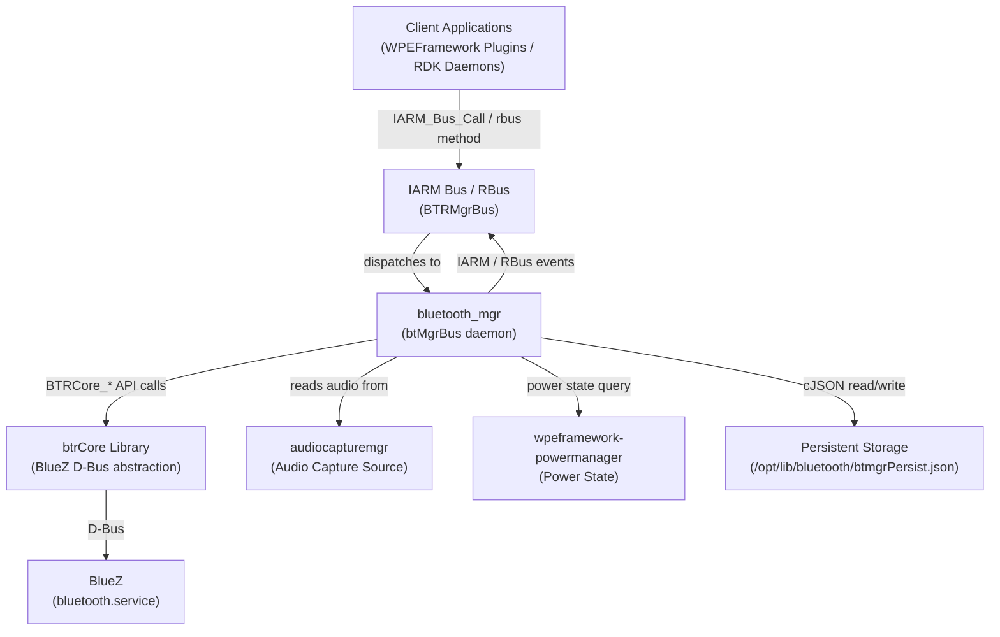
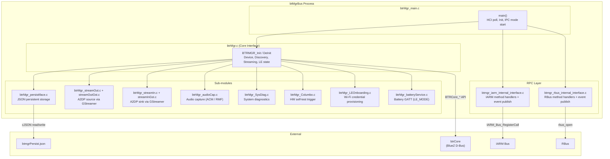
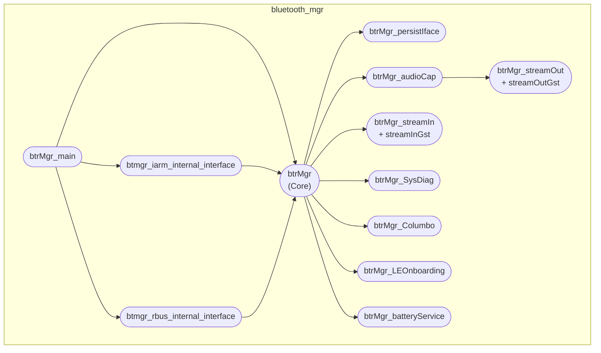
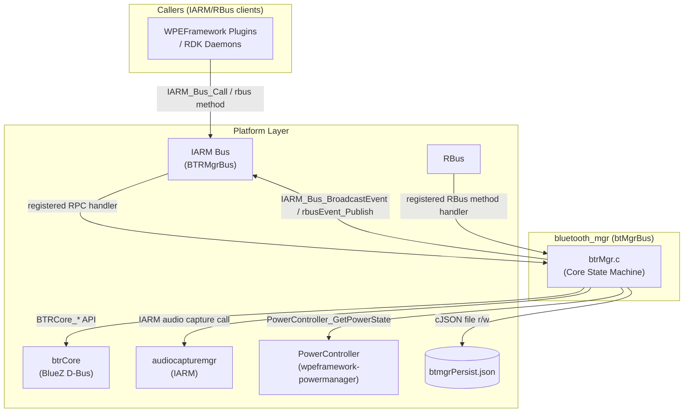
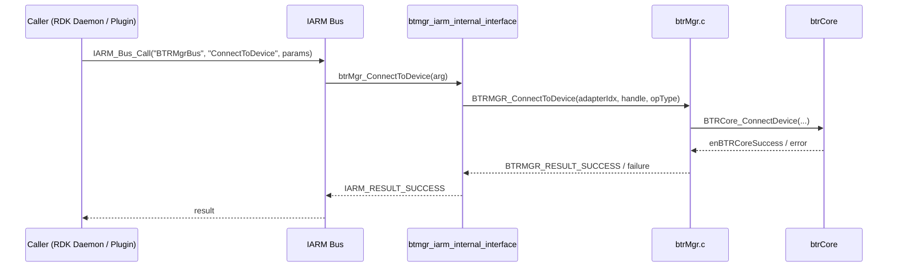
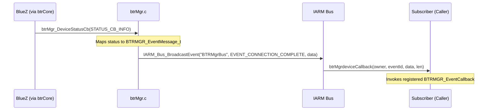
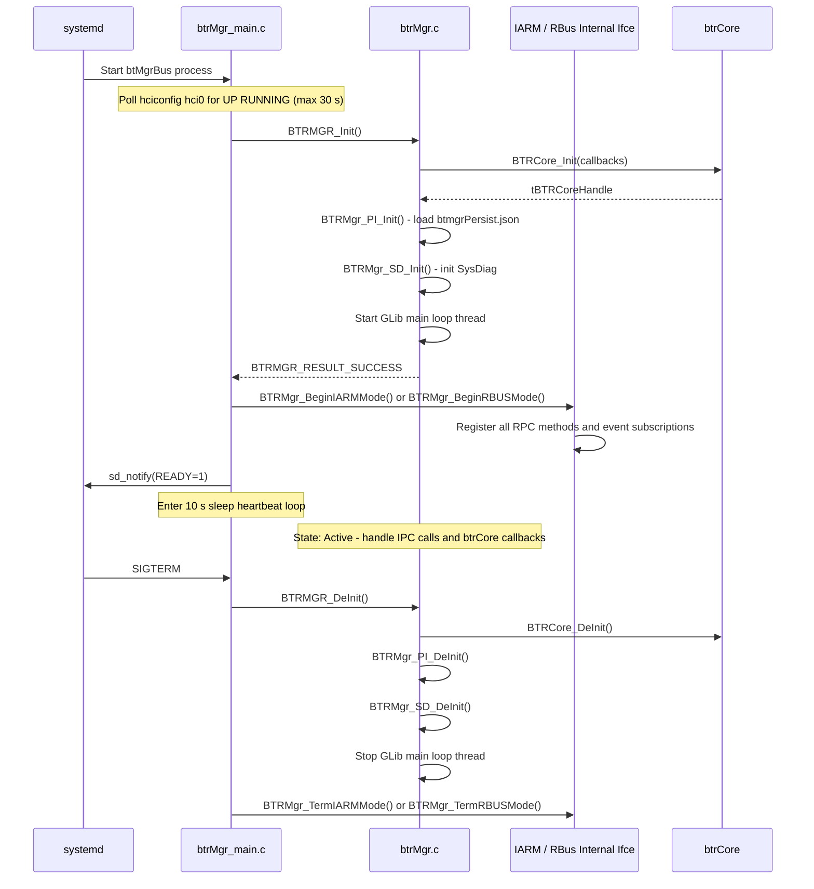
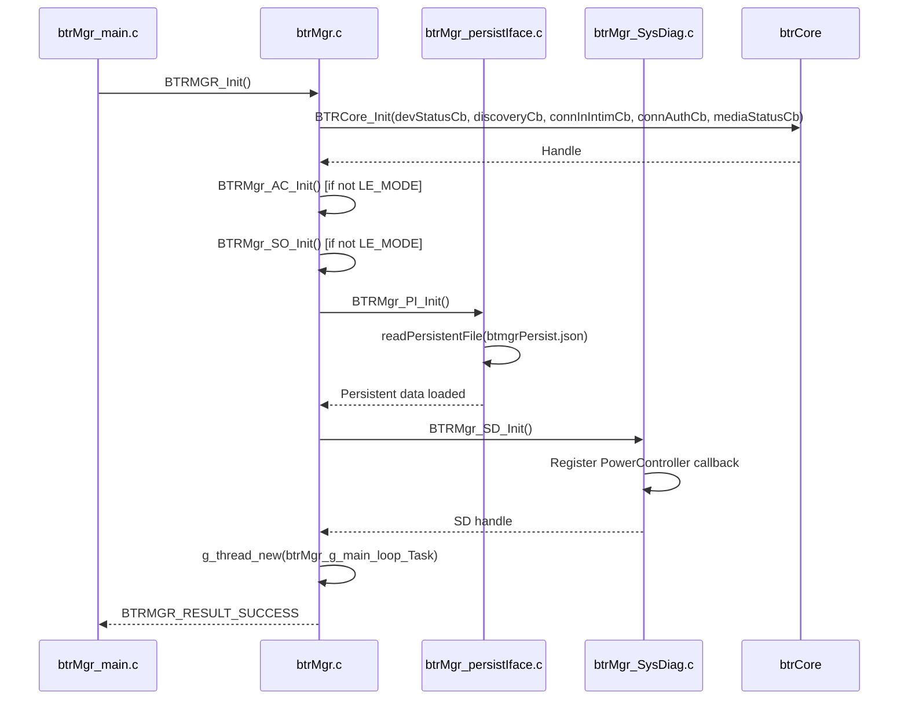
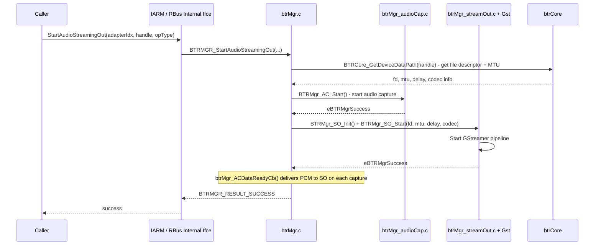

# Bluetooth Manager (bluetooth_mgr)

---

## Overview

Bluetooth Manager (`btMgrBus`) is an RDK daemon that manages Bluetooth services on RDK-based devices. It interfaces with the BlueZ Bluetooth stack through D-Bus via the `btrCore` library — there is no direct linking of BlueZ libraries with Bluetooth Manager. The daemon manages device discovery, pairing, connection, audio streaming, Low Energy (LE) operations, and system diagnostics over Bluetooth.

At the device level, Bluetooth Manager exposes all Bluetooth capabilities to the RDK software stack — adapter control, audio output and input streaming (A2DP sink/source), HID device support (gamepads, remote controls), LE GATT services, and device provisioning (LE onboarding for Wi-Fi credential delivery). It persists paired device profiles and connection state across reboots in a local JSON file.

At the module level, Bluetooth Manager sits between the IARM Bus or RBus IPC layer (northbound, serving callers such as WPEFramework plugins and other RDK daemons) and the `btrCore` library (southbound, which communicates with BlueZ over D-Bus). It manages all Bluetooth state transitions internally using GLib main loop timers and callbacks.



**Key Features & Responsibilities:**

- **Device Discovery**: Starts, stops, pauses, and resumes Bluetooth device discovery for multiple operation types: audio output, audio input, LE, HID, and combined audio+HID.
- **Pairing and Connection Management**: Manages device pairing, unpairing, connection, and disconnection with configurable retry counts (pair: 10 attempts, connect: 2 attempts, reconnect: 3 attempts).
- **Audio Streaming Out (A2DP Source)**: Captures audio via `audiocapturemgr` (ACM via IARM) or RMF Audio Capture, and streams it to connected Bluetooth audio devices using GStreamer.
- **Audio Streaming In (A2DP Sink)**: Receives audio streams from Bluetooth devices when built with `STREAM_IN_SUPPORTED`, processed via GStreamer.
- **HID Device Support**: Connects and manages Human Interface Devices including gamepads (Xbox Elite, Xbox Adaptive, PS4, GameSir, Stadia, Nintendo GameSir), remote controls, and generic HID devices.
- **Low Energy (LE) Operations**: Performs GATT read, write, start notify, and stop notify operations on LE devices. Supports LE advertisement and custom GATT service/characteristic registration.
- **LE Onboarding**: Provisions Wi-Fi credentials to devices over a BLE GATT channel using ECDH key exchange (`btrMgr_LEOnboarding.c`).
- **Battery Service**: In `LE_MODE` builds, monitors battery level, error status, and flags via GATT notifications from battery devices (`btrMgr_batteryService.c`).
- **System Diagnostics**: Exposes device diagnostic data (device MAC, power state, Wi-Fi status, firmware status) over GATT UUIDs and via the `SysDiagInfo` IPC method. Integrates with `PowerController` and optionally with sysMgr over IARM or syscfg over RBus.
- **Columbo Integration**: Triggers hardware self-test scripts (`hwst_flex_demo.sh`) on Columbo GATT characteristic write operations (`btrMgr_Columbo.c`).
- **Persistent Storage**: Reads and writes paired device profiles, last connected device, connection status, LE beacon limit flag, and (optionally) volume/mute state to a JSON file using cJSON.
- **IPC**: Supports two IPC backends selected at build time — IARM Bus (`IARM_RPC_ENABLED`) and RBus. Both expose the same Bluetooth management operations as remote methods and publish state-change events.

---

## Architecture

### High-Level Architecture

Bluetooth Manager is implemented as a standalone C daemon process (`btMgrBus`) that starts via systemd. The process entry point in `btrMgr_main.c` polls for the HCI interface (`hci0`) to be `UP RUNNING` (up to 30 seconds) before calling `BTRMGR_Init()`. After initialization, it selects either IARM or RBus mode based on build configuration and enters a heartbeat loop, sleeping 10 seconds between iterations until `SIGTERM` is received.

The northbound IPC layer is split into two sides: an internal interface (`btmgr_iarm_internal_interface.c` or `btmgr_rbus_internal_interface.c`) which registers RPC method handlers and publishes events from inside the daemon, and an external interface (`btmgr_iarm_external_interface.c` or `btmgr_rbus_external_interface.c`) which is the client-side API used by callers to invoke Bluetooth Manager methods and register for event callbacks.

The southbound layer calls into `btrCore` using `BTRCore_*` API functions. All D-Bus communication with BlueZ is encapsulated inside `btrCore`; Bluetooth Manager never calls D-Bus directly. Callbacks from `btrCore` for device status, device discovery, incoming connection requests, and media status are registered during `BTRMGR_Init()` in `btrMgr.c` and drive internal state transitions.

The GLib main loop runs on a dedicated thread (`btrMgr_g_main_loop_Task`). Multiple GLib timer callbacks (hold-off timers for discovery, disconnection, out-of-range events, power state changes, pair completion reset, battery operations, and volume changes) are managed by this loop. Incoming Bluetooth authentication requests are handled on a separate thread, synchronized with `gBtrMgrAuthMutex`.



### Threading Model

- **Threading Architecture**: Multi-threaded with a GLib main loop thread and a per-authentication-request thread.
- **Main Thread**: Runs the `main()` function in `btrMgr_main.c`. Calls `BTRMGR_Init()`, starts the IPC mode (IARM or RBus), then enters a 10-second sleep loop waiting for `SIGTERM`.
- **Worker Threads**:
  - _GLib main loop thread_ (`btrMgr_g_main_loop_Task`): Created during `BTRMGR_Init()`. Runs a `GMainLoop` that drives all GLib timer callbacks (discovery hold-off, out-of-range hold-off, disconnect hold-off, power state change timers, pair-complete reset, battery timers, volume timers) and processes `btrCore` callbacks for device status and discovery events.
  - _Incoming connection authentication thread_: Spawned per incoming connection authentication request to call `btrMgr_IncomingConnectionAuthentication()` without blocking the GLib loop.
- **Synchronization**: `gBtrMgrAuthMutex` (`GMutex`) protects shared authentication state accessed from the authentication thread and the GLib loop. All other global state variables (discovery handle, paired device list, discovered device list, streaming info) are accessed from the GLib loop thread only and are not separately mutex-protected.
- **Async / Event Dispatch**: `btrCore` callbacks (`btrMgr_DeviceStatusCb`, `btrMgr_DeviceDiscoveryCb`, `btrMgr_ConnectionInIntimationCb`, `btrMgr_MediaStatusCb`) are invoked from `btrCore` context. These callbacks post IARM events or RBus events to notify registered callers without blocking the `btrCore` layer.

---

## Design

The daemon is designed around a single authoritative state machine in `btrMgr.c` that owns all Bluetooth device handles, lists, and streaming state. All IPC method handlers (IARM or RBus) delegate directly to `BTRMGR_*` API functions defined in `btrMgr.c`, keeping the RPC layer thin. The `btrCore` library provides a hardware-agnostic abstraction over BlueZ D-Bus; Bluetooth Manager does not contain any BlueZ-specific logic.

IPC is selected at build time via the `IARM_RPC_ENABLED` preprocessor flag. When enabled, the IARM Bus is used with bus name `"BTRMgrBus"` (constant `IARM_BUS_BTRMGR_NAME`). When not enabled, RBus is used. Both paths register the same set of operations: the internal interface registers RPC methods and event subscriptions on the server (daemon) side; the external interface connects as a client and routes `BTRMGR_*` API calls to the server via IPC.

Audio streaming out uses a pipeline: `audiocapturemgr` or `rmfAudioCapture` supplies PCM data → `btrMgr_audioCap.c` delivers it via callback → `btrMgr_streamOut.c` encodes and writes to a GStreamer pipeline (`btrMgr_streamOutGst.c`). Audio streaming in uses the reverse pipeline via `btrMgr_streamIn.c` and `btrMgr_streamInGst.c`. The build flag `USE_GST1` enables the GStreamer 1.x backend for both streaming directions.

Persistent data is stored as JSON using cJSON. At init, `BTRMgr_PI_Init()` reads the JSON from `/opt/lib/bluetooth/btmgrPersist.json` if it exists; otherwise it falls back to `/opt/secure/lib/bluetooth/btmgrPersist.json`. Writes are done synchronously via `writeToPersistentFile()` using `cJSON_Print()`.

### Component Diagram

```mermaid
graph TD
    subgraph DaemonBoundary ["bluetooth_mgr Daemon (btMgrBus)"]
        subgraph EntryLayer ["Entry / Lifecycle"]
            ML["btrMgr_main.c\nHCI readiness check, Init/DeInit, SIGTERM"]
        end

        subgraph CoreLayer ["Core Management"]
            CL["btrMgr.c\nGlobal state, all BTRMGR_* public APIs\nDevice/discovery/streaming/LE state machine"]
        end

        subgraph IPCLayer ["IPC Layer"]
            II["btmgr_iarm_internal_interface.c\nIARM RPC method registrations"]
            IE["btmgr_iarm_external_interface.c\nIARM client API + event subscriptions"]
            RI["btmgr_rbus_internal_interface.c\nRBus method + event registrations"]
            RE["btmgr_rbus_external_interface.c\nRBus client API + event subscriptions"]
        end

        subgraph StorageLayer ["Persistence"]
            PI["btrMgr_persistIface.c\ncJSON-based JSON r/w\nProfiles, last device, beacon flag, volume"]
        end

        subgraph MediaLayer ["Audio / Media"]
            AC["btrMgr_audioCap.c\nAudio capture from ACM or RMF"]
            SO["btrMgr_streamOut.c\nbtrMgr_streamOutGst.c\nA2DP Source streaming"]
            SI["btrMgr_streamIn.c\nbtrMgr_streamInGst.c\nA2DP Sink streaming"]
        end

        subgraph AuxLayer ["Auxiliary Services"]
            SD["btrMgr_SysDiag.c\nPower state, device diagnostics"]
            COL["btrMgr_Columbo.c\nHW self-test via hwst_flex_demo.sh"]
            LEO["btrMgr_LEOnboarding.c\nBLE Wi-Fi provisioning via ECDH + GATT"]
            BAT["btrMgr_batteryService.c\nLE battery GATT notify (LE_MODE)"]
        end
    end

    subgraph Platform ["Platform / External"]
        BTRCORE["btrCore\n(libbtrCore)"]
        IARMBUS["IARM Bus\n(iarmbusd.service)"]
        RBUS["RBus"]
        BLUEZ["BlueZ\n(bluetooth.service)"]
        ACM["audiocapturemgr"]
        PWRCTRL["PowerController\n(wpeframework-powermanager)"]
        JSFILE[("btmgrPersist.json")]
    end

    ML --> CL
    ML --> II
    ML --> RI
    CL --> PI
    CL --> AC
    CL --> SO
    CL --> SI
    CL --> SD
    CL --> COL
    CL --> LEO
    CL --> BAT
    CL -->|BTRCore_* | BTRCORE
    BTRCORE -->|D-Bus| BLUEZ
    II -->|IARM_Bus_RegisterCall| IARMBUS
    IE -->|IARM_Bus_Call| IARMBUS
    RI -->|rbus_open| RBUS
    RE -->|rbus method call| RBUS
    AC --> ACM
    SD --> PWRCTRL
    PI --> JSFILE
```



---

## Internal Modules

| Module / Class                  | Description                                                                                                                                                                                                                                                                                                             | Key Files                                                                          |
| ------------------------------- | ----------------------------------------------------------------------------------------------------------------------------------------------------------------------------------------------------------------------------------------------------------------------------------------------------------------------- | ---------------------------------------------------------------------------------- |
| `btrMgr_main`                   | Process entry point. Checks HCI interface readiness (up to 30 s), calls `BTRMGR_Init()`, starts IARM or RBus mode, handles `SIGTERM`. Uses `sd_notify` when built with `ENABLE_SD_NOTIFY`.                                                                                                                              | `src/main/btrMgr_main.c`                                                           |
| `btrMgr`                        | Core state machine. Owns all global device handles, paired/discovered device lists, streaming state, discovery handles, and LE state. Implements all public `BTRMGR_*` API functions. Registers `btrCore` callbacks. Runs GLib main loop on a worker thread.                                                            | `src/ifce/btrMgr.c`, `include/btmgr.h`                                             |
| `btmgr_iarm_internal_interface` | Server-side IARM handler. Registers IARM RPC methods on bus `"BTRMgrBus"` and publishes IARM events. Called from within the daemon.                                                                                                                                                                                     | `src/rpc/btmgr_iarm_internal_interface.c`, `include/rpc/btrMgr_IarmInternalIfce.h` |
| `btmgr_iarm_external_interface` | Client-side IARM API. Used by callers outside the daemon. Initializes IARM connection, registers for IARM event callbacks, and routes `BTRMGR_*` calls to the server via `IARM_Bus_Call`.                                                                                                                               | `src/rpc/btmgr_iarm_external_interface.c`, `include/rpc/btmgr_iarm_interface.h`    |
| `btmgr_rbus_internal_interface` | Server-side RBus handler. Registers RBus method and event data elements via `rbus_regDataElements`. Publishes events using `rbusEvent_Publish`.                                                                                                                                                                         | `src/rpc/btmgr_rbus_internal_interface.c`                                          |
| `btmgr_rbus_external_interface` | Client-side RBus API. Opens an RBus connection as `"BTRMgrExternalInterface"` and routes calls to the daemon. Subscribes to RBus events.                                                                                                                                                                                | `src/rpc/btmgr_rbus_external_interface.c`, `include/rpc/btmgr_rbus_interface.h`    |
| `btrMgr_persistIface`           | Persistent storage interface. Reads and writes a cJSON-formatted file at `/opt/lib/bluetooth/btmgrPersist.json` (falls back to `/opt/secure/lib/bluetooth/btmgrPersist.json`). Stores paired profiles (up to 5 per profile, up to 5 profiles), last connected device, LE beacon limit flag, and optionally volume/mute. | `src/persistIf/btrMgr_persistIface.c`, `include/persistIf/btrMgr_persistIface.h`   |
| `btrMgr_audioCap`               | Audio capture module. Supports two build-time backends: `USE_ACM` (captures from `audiocapturemgr` via IARM bus `"BTRMgrBus"`) and `USE_AC_RMF` (uses `RMF_AudioCapture_Open`). Delivers PCM data via `btrMgr_ACDataReadyCb`.                                                                                           | `src/audioCap/btrMgr_audioCap.c`, `include/audioCap/btrMgr_audioCap.h`             |
| `btrMgr_streamOut`              | Audio streaming out. Manages A2DP source streaming state. When `USE_GST1` is enabled, delegates to `btrMgr_streamOutGst.c` for GStreamer pipeline management.                                                                                                                                                           | `src/streamOut/btrMgr_streamOut.c`, `src/streamOut/btrMgr_streamOutGst.c`          |
| `btrMgr_streamIn`               | Audio streaming in. Manages A2DP sink streaming state. Available when built with `STREAM_IN_SUPPORTED`. Delegates to `btrMgr_streamInGst.c` when `USE_GST1` is enabled.                                                                                                                                                 | `src/streamIn/btrMgr_streamIn.c`, `src/streamIn/btrMgr_streamInGst.c`              |
| `btrMgr_SysDiag`                | System diagnostics. Reads power state from `PowerController`, device MAC from filesystem, and diagnostic parameters from IARM sysMgr or RBus syscfg (build-flag selected). Registers power state change callbacks.                                                                                                      | `src/sysDiag/btrMgr_SysDiag.c`, `src/sysDiag/btrMgr_DeviceUtils.c`                 |
| `btrMgr_Columbo`                | Hardware diagnostic integration. On `BTRMGR_SYSDIAG_COLUMBO_START`, launches `/usr/bin/hwst_flex_demo.sh launch` via `popen`. On `BTRMGR_SYSDIAG_COLUMBO_STOP`, launches `/usr/bin/hwst_flex_demo.sh exit`.                                                                                                             | `src/columbo/btrMgr_Columbo.c`                                                     |
| `btrMgr_LEOnboarding`           | LE-based Wi-Fi credential provisioning. Uses ECDH key exchange (`ecdh.c`) and cJSON to decode Wi-Fi payloads received over BLE GATT characteristics. GATT UUIDs are defined in `btmgr.h` under `BTRMGR_LEONBRDG_*`.                                                                                                     | `src/leOnboarding/btrMgr_LEOnboarding.c`, `src/leOnboarding/ecdh.c`                |
| `btrMgr_batteryService`         | Battery GATT service handler (active only in `LE_MODE` builds). Stores battery GATT characteristic UUIDs (battery level, error status, battery flags) and calls `BTRCore_PerformLEOp` with `enBTRCoreLeOpGStartNotify` to start notifications on each.                                                                  | `src/batteryService/btrMgr_batteryService.c`                                       |



---

## Prerequisites & Dependencies

**Documentation Verification Checklist:**

- [x] **IARM Bus**: Verified — `IARM_Bus_Init`, `IARM_Bus_Connect`, `IARM_Bus_RegisterCall`, `IARM_Bus_RegisterEventHandler`, `IARM_Bus_Call`, `IARM_Bus_BroadcastEvent` are called in `btmgr_iarm_internal_interface.c` and `btmgr_iarm_external_interface.c`.
- [x] **RBus**: Verified — `rbus_open`, `rbus_regDataElements`, `rbusEvent_Publish`, `rbus_subscribeToEvents` are called in `btmgr_rbus_internal_interface.c` and `btmgr_rbus_external_interface.c`.
- [x] **btrCore**: Verified — `BTRCore_Init`, `BTRCore_DeInit`, `BTRCore_StartDiscovery`, `BTRCore_StopDiscovery`, `BTRCore_PairDevice`, `BTRCore_ConnectDevice`, `BTRCore_DisconnectDevice`, `BTRCore_PerformLEOp`, and many others are called from `btrMgr.c`.
- [x] **PowerController**: Verified — `PowerController_Term()` is called in `btmgr_iarm_external_interface.c` during `BTRMGR_DeInit()`. `btrMgr_SysDiag.c` uses `PowerController_PowerState_t` and registers power callbacks.
- [x] **audiocapturemgr**: Verified — `btrMgr_audioCap.c` uses IARM bus name `"BTRMgrBus"` to call audiocapturemgr when `USE_ACM` is defined.
- [x] **GStreamer**: Verified — `btrMgr_streamOutGst.c` and `btrMgr_streamInGst.c` are compiled when `USE_GST1` is defined.
- [x] **Persistent store**: Verified — `btrMgr_persistIface.c` opens and writes to `btmgrPersist.json` using `fopen`/`fread`/`fwrite` and cJSON.
- [x] **Systemd services**: Verified — `btmgr.service` `After=` and `Requires=` are confirmed from the service file.
- [x] **rfcapi**: Verified — `rfcapi.h` is included in `btrMgr.c` for non-`BUILD_FOR_PI` builds; RFC APIs are used for feature flag checks (`btrMgr_CheckAudioInServiceAvailability`, `btrMgr_CheckHidGamePadServiceAvailability`, `btrMgr_CheckDebugModeAvailability`).

### RDK Platform Requirements

- **Build Dependencies**: `libbtrCore` (mandatory — detected at configure time via `AC_CHECK_LIB`), `glib-2.0`, `cJSON`, `safec`. Optional: `librmfAudioCapture` (`--enable-ac_rmf`), GStreamer 1.x (`USE_GST1`), `libIBus`/`libIARM` (`IARM_RPC_ENABLED`), `rbus`, `libbreakpad` (`INCLUDE_BREAKPAD`), `libcurl`, `rfcapi`.
- **RDK Plugin Dependencies**: No Thunder plugin dependencies. Communicates with other RDK daemons via IARM/RBus.
- **IARM Bus**: Bus name `"BTRMgrBus"`. Registers as `"btMgrBus"` process on startup. Depends on `iarmbusd.service` being active.
- **Systemd Services** (from `conf/btmgr.service`):
  - `After=iarmbusd.service bluetooth.service audiocapturemgr.service wpeframework-powermanager.service`
  - `Requires=iarmbusd.service bluetooth.service audiocapturemgr.service wpeframework-powermanager.service`
- **Configuration Files**: Logger configuration from `/etc/debug.ini` (overridden by `/opt/debug.ini` if present).
- **Startup Order**: Waits up to 30 seconds for `hciconfig hci0` to report `UP RUNNING` before calling `BTRMGR_Init()`. Notifies systemd via `sd_notify(READY=1)` after successful init.
- **GStreamer Environment** (set by `btmgr.service`):
  - `GST_REGISTRY=/opt/.gstreamer/registry.bin`
  - `GST_REGISTRY_UPDATE=no`
  - `GST_REGISTRY_FORK=no`
  - `XDG_RUNTIME_DIR=/tmp`

---

## Quick Start

### 1. Include

```c
#include "btmgr.h"
```

### 2. Initialize

```c
BTRMGR_Result_t rc = BTRMGR_Init();
if (rc != BTRMGR_RESULT_SUCCESS) {
    fprintf(stderr, "BTRMGR_Init failed: %d\n", rc);
    return -1;
}
```

On the client side (`btmgr_iarm_external_interface.c` / `btmgr_rbus_external_interface.c`), `BTRMGR_Init()` connects to IARM Bus or RBus and registers event callbacks. The daemon's own init (`btrMgr.c`) connects to `btrCore`, starts the GLib main loop thread, initializes persistent storage, and registers `btrCore` callbacks.

### 3. Register for Events

```c
BTRMGR_RegisterEventCallback(myEventHandler);
```

### 4. Start Discovery

```c
BTRMGR_Result_t rc = BTRMGR_StartDeviceDiscovery(0, BTRMGR_DEVICE_OP_TYPE_AUDIO_OUTPUT);
```

### 5. Connect to a Device

```c
BTRMGR_Result_t rc = BTRMGR_ConnectToDevice(0, deviceHandle, BTRMGR_DEVICE_OP_TYPE_AUDIO_OUTPUT);
```

### 6. Deinitialize

```c
BTRMGR_DeInit();
```

---

## Configuration

### Configuration Priority

1. Built-in compile-time defaults (retry counts, timeout constants in `btrMgr.c`)
2. RFC parameters (checked at runtime via `rfcapi` for audio-in, HID gamepad, and debug mode service availability)
3. `/opt/debug.ini` logger override (overrides `/etc/debug.ini`)

### Key Configuration Files

| Configuration File                            | Purpose                                                                    | Override Mechanism                                        |
| --------------------------------------------- | -------------------------------------------------------------------------- | --------------------------------------------------------- |
| `/opt/lib/bluetooth/btmgrPersist.json`        | Persistent paired device profiles, connection status, LE beacon limit flag | Direct file write via `btrMgr_persistIface.c`             |
| `/opt/secure/lib/bluetooth/btmgrPersist.json` | Fallback path when `/opt/lib/bluetooth/` directory does not exist          | Automatic fallback in `btrMgr_PI_GetPersistentDataPath()` |
| `/etc/debug.ini`                              | RDK Logger configuration                                                   | Override with `/opt/debug.ini`                            |

### Configuration Parameters (Compile-time Constants)

| Parameter                                    | Value    | Description                                |
| -------------------------------------------- | -------- | ------------------------------------------ |
| `BTRMGR_PAIR_RETRY_ATTEMPTS`                 | 10       | Maximum pair retry attempts                |
| `BTRMGR_CONNECT_RETRY_ATTEMPTS`              | 2        | Maximum connect retry attempts             |
| `BTMGR_RECONNECTION_ATTEMPTS`                | 3        | Maximum reconnection attempts              |
| `BTRMGR_MODALIAS_RETRY_ATTEMPTS`             | 5        | Maximum modalias read retries              |
| `BTRMGR_DEVCONN_CHECK_RETRY_ATTEMPTS`        | 3        | Device connection check retries            |
| `BTRMGR_DISCOVERY_HOLD_OFF_TIME`             | 120 s    | Hold-off time after discovery stop         |
| `BTRMGR_AUTOCONNECT_ON_STARTUP_TIMEOUT`      | 40 s     | Auto-connect on startup timeout            |
| `BTMGR_RECONNECTION_HOLD_OFF`                | 3 s      | Delay before reconnection attempt          |
| `BTRMGR_BATTERY_DISCOVERY_TIMEOUT`           | 360 s    | Battery device discovery timeout (LE_MODE) |
| `BTRMGR_IARM_METHOD_CALL_TIMEOUT_DEFAULT_MS` | 15000 ms | Default IARM method call timeout           |
| `BTRMGR_DEVICE_COUNT_MAX`                    | 32       | Maximum paired/connected devices           |
| `BTRMGR_DISCOVERED_DEVICE_COUNT_MAX`         | 128      | Maximum discovered devices in list         |
| `BTRMGR_MAX_PERSISTENT_DEVICE_COUNT`         | 5        | Max devices per profile in persist storage |
| `BTRMGR_MAX_PERSISTENT_PROFILE_COUNT`        | 5        | Max profiles in persist storage            |

### Configuration Persistence

The following data is persisted across reboots in `btmgrPersist.json`:

- Adapter ID, paired device profiles (A2DP source `0x110a`, A2DP sink `0x110b`), per-device connection status and last-connected flag.
- LE beacon limit detection flag.
- Volume and mute state when built with `RDKTV_PERSIST_VOLUME`.

Discovery filters, current streaming state, and runtime flags are not persisted across reboots.

---

## API / Usage

### Interface Type

Bluetooth Manager exposes a C API defined in `btmgr.h`. This API is backed by two transport options selected at build time:

- **IARM Bus** (`IARM_RPC_ENABLED`): `IARM_Bus_Call()` to bus `"BTRMgrBus"`, method timeout 15000 ms.
- **RBus**: RBus method invocations.

In both cases the caller links against the Bluetooth Manager library, calls `BTRMGR_Init()` to set up the transport, and then uses `BTRMGR_*` functions. Events are delivered via a registered `BTRMGR_EventCallback` function pointer.

### Methods / Functions

#### Adapter Management

| Function                                                                                           | Description                                           |
| -------------------------------------------------------------------------------------------------- | ----------------------------------------------------- |
| `BTRMGR_GetNumberOfAdapters(unsigned char *pNumOfAdapters)`                                        | Returns the number of Bluetooth adapters present.     |
| `BTRMGR_SetAdapterName(unsigned char adapterIdx, const char *pNameOfAdapter)`                      | Sets the name of the adapter at the given index.      |
| `BTRMGR_GetAdapterName(unsigned char adapterIdx, char *pNameOfAdapter)`                            | Gets the name of the adapter.                         |
| `BTRMGR_SetAdapterPowerStatus(unsigned char adapterIdx, unsigned char powerStatus)`                | Powers on or off the adapter.                         |
| `BTRMGR_GetAdapterPowerStatus(unsigned char adapterIdx, unsigned char *pPowerStatus)`              | Gets adapter power status.                            |
| `BTRMGR_SetAdapterDiscoverable(unsigned char adapterIdx, unsigned char discoverable, int timeout)` | Makes the adapter discoverable for the given timeout. |
| `BTRMGR_IsAdapterDiscoverable(unsigned char adapterIdx, unsigned char *pDiscoverable)`             | Queries if the adapter is currently discoverable.     |
| `BTRMGR_ResetAdapter(unsigned char adapterIdx)`                                                    | Resets the Bluetooth adapter.                         |

#### Device Discovery

| Function                                                                                                                                     | Description                                     |
| -------------------------------------------------------------------------------------------------------------------------------------------- | ----------------------------------------------- |
| `BTRMGR_StartDeviceDiscovery(unsigned char adapterIdx, BTRMGR_DeviceOperationType_t opType)`                                                 | Starts discovery for the given operation type.  |
| `BTRMGR_StopDeviceDiscovery(unsigned char adapterIdx, BTRMGR_DeviceOperationType_t opType)`                                                  | Stops discovery for the given operation type.   |
| `BTRMGR_GetDiscoveredDevices(unsigned char adapterIdx, BTRMGR_DiscoveredDevicesList_t *pDiscoveredDevices)`                                  | Returns the current list of discovered devices. |
| `BTRMGR_GetDeviceDiscoveryStatus(unsigned char adapterIdx, BTRMGR_DeviceOperationType_t opType, BTRMGR_DiscoveryStatus_t *pDiscoveryStatus)` | Queries whether discovery is in progress.       |

#### Pairing

| Function                                                                                        | Description                                |
| ----------------------------------------------------------------------------------------------- | ------------------------------------------ |
| `BTRMGR_PairDevice(unsigned char adapterIdx, BTRMgrDeviceHandle deviceHandle)`                  | Pairs with the specified device.           |
| `BTRMGR_UnpairDevice(unsigned char adapterIdx, BTRMgrDeviceHandle deviceHandle)`                | Removes pairing with the specified device. |
| `BTRMGR_GetPairedDevices(unsigned char adapterIdx, BTRMGR_PairedDevicesList_t *pPairedDevices)` | Returns the list of paired devices.        |

#### Connection

| Function                                                                                                                           | Description                                                                |
| ---------------------------------------------------------------------------------------------------------------------------------- | -------------------------------------------------------------------------- |
| `BTRMGR_ConnectToDevice(unsigned char adapterIdx, BTRMgrDeviceHandle deviceHandle, BTRMGR_DeviceOperationType_t connectAs)`        | Connects to a paired device for the given operation type.                  |
| `BTRMGR_DisconnectFromDevice(unsigned char adapterIdx, BTRMgrDeviceHandle deviceHandle)`                                           | Disconnects from a connected device.                                       |
| `BTRMGR_GetConnectedDevices(unsigned char adapterIdx, BTRMGR_ConnectedDevicesList_t *pConnectedDevices)`                           | Returns currently connected devices.                                       |
| `BTRMGR_GetDeviceProperties(unsigned char adapterIdx, BTRMgrDeviceHandle deviceHandle, BTRMGR_DevicesProperty_t *pDeviceProperty)` | Returns properties (name, address, RSSI, services, vendor ID) of a device. |

#### Audio Streaming

| Function                                                                                                                               | Description                                         |
| -------------------------------------------------------------------------------------------------------------------------------------- | --------------------------------------------------- |
| `BTRMGR_StartAudioStreamingOut(unsigned char adapterIdx, BTRMgrDeviceHandle deviceHandle, BTRMGR_DeviceOperationType_t streamOutPref)` | Starts streaming audio out to the device.           |
| `BTRMGR_StopAudioStreamingOut(unsigned char adapterIdx, BTRMgrDeviceHandle deviceHandle)`                                              | Stops audio streaming out.                          |
| `BTRMGR_IsAudioStreamingOut(unsigned char adapterIdx, unsigned char *pStreamingStatus)`                                                | Queries if audio streaming out is active.           |
| `BTRMGR_SetAudioStreamOutType(unsigned char adapterIdx, BTRMGR_StreamOut_Type_t streamType)`                                           | Sets the stream out type (primary or auxiliary).    |
| `BTRMGR_StartAudioStreamingIn(unsigned char adapterIdx, BTRMgrDeviceHandle deviceHandle, BTRMGR_DeviceOperationType_t streamInPref)`   | Starts receiving audio from the device (A2DP sink). |
| `BTRMGR_StopAudioStreamingIn(unsigned char adapterIdx, BTRMgrDeviceHandle deviceHandle)`                                               | Stops audio streaming in.                           |
| `BTRMGR_IsAudioStreamingIn(unsigned char adapterIdx, unsigned char *pStreamingStatus)`                                                 | Queries if audio streaming in is active.            |

#### Media Control

| Function                                                                                                                                                                                                                                                                | Description                                                                                                                                              |
| ----------------------------------------------------------------------------------------------------------------------------------------------------------------------------------------------------------------------------------------------------------------------- | -------------------------------------------------------------------------------------------------------------------------------------------------------- |
| `BTRMGR_MediaControl(unsigned char adapterIdx, BTRMgrDeviceHandle deviceHandle, BTRMGR_MediaControlCommand_t mediaCtrlCmd)`                                                                                                                                             | Sends a media control command (play, pause, stop, next, previous, fast-forward, rewind, volume up/down, equalizer, shuffle, repeat, scan, mute, unmute). |
| `BTRMGR_GetMediaTrackInfo(unsigned char adapterIdx, BTRMgrDeviceHandle deviceHandle, BTRMGR_MediaTrackInfo_t *pMediaTrackInfo)`                                                                                                                                         | Gets current media track metadata.                                                                                                                       |
| `BTRMGR_GetMediaCurrentPosition(unsigned char adapterIdx, BTRMgrDeviceHandle deviceHandle, BTRMGR_MediaPositionInfo_t *pMediaPositionInfo)`                                                                                                                             | Gets current track position and duration.                                                                                                                |
| `BTRMGR_GetMediaElementList(unsigned char adapterIdx, BTRMgrDeviceHandle deviceHandle, BTRMgrMediaElementHandle mediaElementHdl, unsigned short startIdx, unsigned short endIdx, unsigned char mediaElementType, BTRMGR_MediaElementListInfo_t *pMediaElementListInfo)` | Gets a list of media elements (album, artist, genre, etc.).                                                                                              |
| `BTRMGR_SetMediaElementActive(unsigned char adapterIdx, BTRMgrDeviceHandle deviceHandle, BTRMgrMediaElementHandle mediaElementHdl, BTRMGR_MediaElementType_t mediaElementType)`                                                                                         | Sets the active media element.                                                                                                                           |
| `BTRMGR_SetDeviceVolumeMute(unsigned char adapterIdx, BTRMgrDeviceHandle deviceHandle, BTRMGR_DeviceOperationType_t deviceOpType, unsigned char volume, unsigned char mute)`                                                                                            | Sets volume and mute on a connected device.                                                                                                              |
| `BTRMGR_GetDeviceVolumeMute(unsigned char adapterIdx, BTRMgrDeviceHandle deviceHandle, BTRMGR_DeviceOperationType_t deviceOpType, unsigned char *pVolume, unsigned char *pMute)`                                                                                        | Gets current volume and mute state of a device.                                                                                                          |

#### Low Energy (LE) Operations

| Function                                                                                                                                                                | Description                                                     |
| ----------------------------------------------------------------------------------------------------------------------------------------------------------------------- | --------------------------------------------------------------- |
| `BTRMGR_GetLeProperty(unsigned char adapterIdx, BTRMgrDeviceHandle deviceHandle, const char *pUUID, BTRMGR_LeProperty_t leProperty, void *pPropertyValue)`              | Reads a GATT property value from a connected LE device.         |
| `BTRMGR_PerformLeOp(unsigned char adapterIdx, BTRMgrDeviceHandle deviceHandle, const char *pUUID, BTRMGR_LeOp_t leOpType, char *pLeOpArg, char *pOpResult)`             | Performs an LE GATT operation (read, write, start/stop notify). |
| `BTRMGR_LE_StartAdvertisement(unsigned char adapterIdx, BTRMGR_LeCustomAdvertisement_t *pstBTRMgrLeCustomAdvt)`                                                         | Starts LE advertisement with custom advertisement data.         |
| `BTRMGR_LE_StopAdvertisement(unsigned char adapterIdx)`                                                                                                                 | Stops LE advertisement.                                         |
| `BTRMGR_LE_SetServiceInfo(unsigned char adapterIdx, const char *pUUID, unsigned char serviceType)`                                                                      | Registers a GATT service on the local adapter.                  |
| `BTRMGR_LE_SetGattInfo(unsigned char adapterIdx, const char *pParentUUID, const char *pUUID, unsigned short flags, const char *pValue, BTRMGR_LeProperty_t leProperty)` | Registers a GATT characteristic or descriptor.                  |
| `BTRMGR_LE_SetGattPropertyValue(unsigned char adapterIdx, const char *pUUID, const char *pValue, BTRMGR_LeProperty_t leProperty)`                                       | Updates the value of a registered GATT property.                |

#### Miscellaneous

| Function                                                                                                                           | Description                                                                                                                       |
| ---------------------------------------------------------------------------------------------------------------------------------- | --------------------------------------------------------------------------------------------------------------------------------- |
| `BTRMGR_SetLimitBeaconDetection(unsigned char adapterIdx, unsigned char limitBeaconDetection)`                                     | Enables or disables LE beacon detection limiting; persisted to JSON.                                                              |
| `BTRMGR_GetLimitBeaconDetection(unsigned char adapterIdx, unsigned char *pLimitBeaconDetection)`                                   | Reads the current LE beacon detection limit flag.                                                                                 |
| `BTRMGR_SetEventResponse(unsigned char adapterIdx, BTRMGR_EventResponse_t *pEventResponse)`                                        | Sends an accept or reject response to a pending incoming pair/connect request.                                                    |
| `BTRMGR_GetDeviceProperties(unsigned char adapterIdx, BTRMgrDeviceHandle deviceHandle, BTRMGR_DevicesProperty_t *pDeviceProperty)` | Returns device properties including RSSI, services, vendor ID, modalias, and firmware revision.                                   |
| `BTRMGR_GetDeviceBatteryLevel(unsigned char adapterIdx, BTRMgrDeviceHandle deviceHandle, unsigned char *pBatteryLevel)`            | Returns the battery level of a connected LE device.                                                                               |
| `BTRMGR_SysDiagInfo(unsigned char adapterIdx, char *pUUID, char *pData, BTRMGR_LeOp_t leOpType)`                                   | Reads or writes system diagnostic GATT characteristics (device MAC, firmware status, WiFi radio status, WebPA status, RF status). |
| `BTRMGR_RegisterEventCallback(BTRMGR_EventCallback afpcEventHandler)`                                                              | Registers a callback for all Bluetooth Manager events.                                                                            |
| `BTRMGR_SetAudioInServiceState(unsigned char adapterIdx, unsigned char serviceState)`                                              | Enables or disables the audio-in (A2DP sink) service. Checked via RFC at runtime.                                                 |

### Events / Notifications

Events are delivered to callers registered via `BTRMGR_RegisterEventCallback`. Over IARM, they are published as `IARM_Bus_BroadcastEvent` on bus `"BTRMgrBus"`. Over RBus, they are published via `rbusEvent_Publish`.

| Event                              | IARM Constant                                           | Trigger Condition                                  |
| ---------------------------------- | ------------------------------------------------------- | -------------------------------------------------- |
| Device out of range                | `BTRMGR_IARM_EVENT_DEVICE_OUT_OF_RANGE`                 | A previously detected device is no longer in range |
| Discovery started                  | `BTRMGR_IARM_EVENT_DEVICE_DISCOVERY_STARTED`            | Device discovery started                           |
| Discovery update                   | `BTRMGR_IARM_EVENT_DEVICE_DISCOVERY_UPDATE`             | A device is found or updated during scan           |
| Discovery complete                 | `BTRMGR_IARM_EVENT_DEVICE_DISCOVERY_COMPLETE`           | Discovery scan finished                            |
| Device found                       | `BTRMGR_IARM_EVENT_DEVICE_FOUND`                        | A specific device advertisement is detected        |
| Pairing complete                   | `BTRMGR_IARM_EVENT_DEVICE_PAIRING_COMPLETE`             | Pairing with a device succeeded                    |
| Pairing failed                     | `BTRMGR_IARM_EVENT_DEVICE_PAIRING_FAILED`               | Pairing attempt failed                             |
| Unpairing complete                 | `BTRMGR_IARM_EVENT_DEVICE_UNPAIRING_COMPLETE`           | Device was unpaired                                |
| Unpairing failed                   | `BTRMGR_IARM_EVENT_DEVICE_UNPAIRING_FAILED`             | Unpairing attempt failed                           |
| Connection complete                | `BTRMGR_IARM_EVENT_DEVICE_CONNECTION_COMPLETE`          | Connection to a device succeeded                   |
| Connection failed                  | `BTRMGR_IARM_EVENT_DEVICE_CONNECTION_FAILED`            | Connection attempt failed                          |
| Disconnect complete                | `BTRMGR_IARM_EVENT_DEVICE_DISCONNECT_COMPLETE`          | Device disconnected successfully                   |
| Disconnect failed                  | `BTRMGR_IARM_EVENT_DEVICE_DISCONNECT_FAILED`            | Disconnect attempt failed                          |
| External pair request              | `BTRMGR_IARM_EVENT_RECEIVED_EXTERNAL_PAIR_REQUEST`      | A remote device initiated a pairing request        |
| External connect request           | `BTRMGR_IARM_EVENT_RECEIVED_EXTERNAL_CONNECT_REQUEST`   | A remote device initiated a connection request     |
| External playback request          | `BTRMGR_IARM_EVENT_RECEIVED_EXTERNAL_PLAYBACK_REQUEST`  | A remote device initiated playback                 |
| Device unsupported                 | `BTRMGR_IARM_EVENT_DEVICE_UNSUPPORTED`                  | Device type not supported                          |
| Device op ready                    | `BTRMGR_IARM_EVENT_DEVICE_OP_READY`                     | Device is ready for operation                      |
| Device op information              | `BTRMGR_IARM_EVENT_DEVICE_OP_INFORMATION`               | Informational update from a device operation       |
| Media track started                | `BTRMGR_IARM_EVENT_MEDIA_TRACK_STARTED`                 | Media track started playing                        |
| Media track playing                | `BTRMGR_IARM_EVENT_MEDIA_TRACK_PLAYING`                 | Media track resumed after pause                    |
| Media track paused                 | `BTRMGR_IARM_EVENT_MEDIA_TRACK_PAUSED`                  | Media track paused                                 |
| Media track stopped                | `BTRMGR_IARM_EVENT_MEDIA_TRACK_STOPPED`                 | Media track stopped                                |
| Media track position               | `BTRMGR_IARM_EVENT_MEDIA_TRACK_POSITION`                | Playback position updated                          |
| Media track changed                | `BTRMGR_IARM_EVENT_MEDIA_TRACK_CHANGED`                 | Current track changed                              |
| Media playback ended               | `BTRMGR_IARM_EVENT_MEDIA_PLAYBACK_ENDED`                | End of media playback                              |
| Media player name                  | `BTRMGR_IARM_EVENT_MEDIA_PLAYER_NAME`                   | Media player name changed                          |
| Media player volume                | `BTRMGR_IARM_EVENT_MEDIA_PLAYER_VOLUME`                 | Remote device volume changed                       |
| Media player mute/unmute           | `BTRMGR_IARM_EVENT_MEDIA_PLAYER_MUTE` / `_UNMUTE`       | Mute state changed                                 |
| Media player equalizer             | `BTRMGR_IARM_EVENT_MEDIA_PLAYER_EQUALIZER_ON/OFF`       | Equalizer state changed                            |
| Media player shuffle               | `BTRMGR_IARM_EVENT_MEDIA_PLAYER_SHUFFLE_*`              | Shuffle mode changed                               |
| Media player repeat                | `BTRMGR_IARM_EVENT_MEDIA_PLAYER_REPEAT_*`               | Repeat mode changed                                |
| Media album/artist/genre/etc. info | `BTRMGR_IARM_EVENT_MEDIA_ALBUM_INFO` etc.               | Media metadata received                            |
| Device media status                | `BTRMGR_IARM_EVENT_DEVICE_MEDIA_STATUS`                 | Combined device media status update                |
| Battery info                       | `BTRMGR_IARM_EVENT_BATTERY_INFO` (RBus: `BatteryInfo!`) | Battery level/status notification from LE device   |

---

## Component Interactions



### Interaction Matrix

| Target Component / Layer | Interaction Purpose                                                         | Key APIs / Topics                                                                                                          |
| ------------------------ | --------------------------------------------------------------------------- | -------------------------------------------------------------------------------------------------------------------------- |
| **IARM Bus**             | RPC method registration and event publish (when `IARM_RPC_ENABLED`)         | `IARM_Bus_RegisterCall`, `IARM_Bus_BroadcastEvent`, `IARM_Bus_Call`                                                        |
| **RBus**                 | RPC method registration and event publish (when `IARM_RPC_ENABLED` not set) | `rbus_open`, `rbus_regDataElements`, `rbusEvent_Publish`                                                                   |
| **btrCore**              | All Bluetooth adapter, device, streaming, and LE operations                 | `BTRCore_Init`, `BTRCore_StartDiscovery`, `BTRCore_PairDevice`, `BTRCore_ConnectDevice`, `BTRCore_PerformLEOp`, and others |
| **audiocapturemgr**      | PCM audio capture for A2DP source streaming (when `USE_ACM` defined)        | IARM bus call on `"BTRMgrBus"`                                                                                             |
| **rmfAudioCapture**      | PCM audio capture alternative (when `USE_AC_RMF` defined)                   | `RMF_AudioCapture_Open`, `RMF_AudioCapture_Start`                                                                          |
| **PowerController**      | Device power state query and change notification                            | `PowerController_GetPowerState`, `PowerController_Term`                                                                    |
| **sysMgr (IARM)**        | System diagnostic data retrieval (when `BTR_SYS_DIAG_IARM_ENABLE`)          | IARM sysMgr events                                                                                                         |
| **syscfg / RBus**        | System diagnostic data retrieval (when `BTR_SYS_DIAG_RBUS_ENABLE`)          | RBus property reads                                                                                                        |
| **GStreamer**            | Audio encode/decode pipelines for A2DP streaming                            | Internal GStreamer pipeline via `btrMgr_streamOutGst.c`, `btrMgr_streamInGst.c`                                            |
| **Persistent JSON file** | Store/retrieve paired profiles, last device, beacon flag                    | `fopen`, `fread`, `fwrite`, cJSON                                                                                          |

### IPC Flow Patterns

**IARM Request / Response Flow:**



**Event Notification Flow:**



---

## Component State Flow

### Initialization to Active State



### Runtime State Changes

Discovery is controlled through `BTRMGR_DiscoveryHandle_t` structures (`ghBTRMgrDiscoveryHdl` for foreground, `ghBTRMgrBgDiscoveryHdl` for background). Discovery transitions between `BTRMGR_DISCOVERY_ST_STARTED`, `BTRMGR_DISCOVERY_ST_PAUSED`, `BTRMGR_DISCOVERY_ST_RESUMED`, and `BTRMGR_DISCOVERY_ST_STOPPED`. A hold-off timer (`BTRMGR_DISCOVERY_HOLD_OFF_TIME` = 120 s) prevents immediate restart after a stop.

Power state changes from `PowerController` are received via callback in `btrMgr_SysDiag.c` and trigger `BTRMGR_DEVCONN_PWRST_CHANGE_TIME` (3 s) timer callbacks that adjust connection handling.

In `LE_MODE`, battery device management uses its own set of timers: discovery (`BTRMGR_BATTERY_DISCOVERY_TIMEOUT` = 360 s), connect (`BTRMGR_BATTERY_CONNECT_TIME_INTERVAL` = 15 s), connection status check (`BTRMGR_BATTERY_CONNECT_TIME_INTERVAL`), and start-notify (`BTRMGR_BATTERY_START_NOTIFY_TIME_INTERVAL` = 20 s).

---

## Call Flows

### Initialization Call Flow



### Audio Streaming Out Call Flow



---

## Implementation Details

### Key Implementation Logic

- **Discovery State Management**: Two `BTRMGR_DiscoveryHandle_t` instances (`ghBTRMgrDiscoveryHdl`, `ghBTRMgrBgDiscoveryHdl`) track foreground and background discovery independently. Each tracks operation type, state, and filter. `btrMgr_PreCheckDiscoveryStatus()` and `btrMgr_PostCheckDiscoveryStatus()` pause/resume the foreground discovery around background discovery operations.

- **Reconnect on Startup**: When `AUTO_CONNECT_ENABLED` is defined, `BTRMGR_StartAudioStreamingOut_StartUp()` iterates through paired devices in the persistent store and attempts reconnection within `BTRMGR_AUTOCONNECT_ON_STARTUP_TIMEOUT` (40 s).

- **HID Gamepad Reconnect**: `BTRMGR_ConnectGamepads_StartUp()` is called at startup (non-LE builds) to reconnect HID gamepads. RFC flag `btrMgr_CheckHidGamePadServiceAvailability()` controls whether this is active.

- **Audio Capture Source Selection**: `btrMgr_audioCap.c` selects between `USE_ACM` (audiocapturemgr via IARM) and `USE_AC_RMF` (RMF Audio Capture library) at compile time. Only one can be active per build.

- **Streaming Info State**: `gstBTRMgrStreamingInfo` (`stBTRMgrStreamingInfo`) holds the active audio capture handle, stream-out handle, stream-in handle, stream type, bytes written, and codec parameters. This struct is only present in non-`LE_MODE` builds.

- **Event Processing**: `btrMgr_DeviceStatusCb()` is the primary `btrCore` callback. It maps `stBTRCoreDevStatusCBInfo` to `BTRMGR_EventMessage_t` via `btrMgr_MapDevstatusInfoToEventInfo()`, then either publishes an IARM/RBus event or invokes the locally registered `gfpcBBTRMgrEventOut` callback.

- **Authentication Handling**: Incoming connection authentication runs on a dedicated thread. `gBtrMgrAuthMutex` serializes access between the auth thread and the main loop.

- **Error Handling**: `btrCore` return values are mapped to `BTRMGR_Result_t` (`BTRMGR_RESULT_SUCCESS`, `BTRMGR_RESULT_GENERIC_FAILURE`, `BTRMGR_RESULT_INVALID_INPUT`, `BTRMGR_RESULT_INIT_FAILED`). IPC method handlers map these to `IARM_RESULT_IPCCORE_FAIL` when no more specific IARM error code is available.

- **Logging**: RDK Logger module names: `LOG.RDK.BTRMGR` (bluetooth manager) and `LOG.RDK.BTRCORE` (btrCore). Logger initialized from `/etc/debug.ini`, overridden by `/opt/debug.ini`. Debug artifacts written to `/tmp/btrMgr_DebugArtifacts`. Debug mode enabled/disabled via `SetBtmgrDebugModeState` IARM method (checked via RFC via `btrMgr_CheckDebugModeAvailability()`).

- **Volume Persistence** (`RDKTV_PERSIST_VOLUME`): When enabled, volume changes have a hold-off timer (`BTRMGR_DEFAULT_SET_VOLUME_INTERVAL` = 2 s) before writing to the JSON file, and a skip-update flag suppressed by `BTRMGR_SKIP_VOLUME_UPDATE_INTERVAL` (6 s) after reconnection to avoid overwriting with stale values.

---

## Data Flow

```
[External Trigger: IARM_Bus_Call or RBus method invocation from a caller]
        |
        v
[IPC Layer: btmgr_iarm_internal_interface.c or btmgr_rbus_internal_interface.c]
  - Validate handle / argument pointer
  - Check gIsBTRMGR_Internal_Inited
        |
        v
[Core: btrMgr.c BTRMGR_* function]
  - Validate parameters
  - Manage discovery/streaming/LE state
  - Update in-memory device lists
        |
        v
[btrCore API call: BTRCore_* function]
  - D-Bus call to BlueZ
        |
        v
[Result path — one of:]
  A) Return value propagated back up the call chain to IARM/RBus caller
  B) Async event: btrMgr_DeviceStatusCb() or btrMgr_MediaStatusCb() fires
       → IARM_Bus_BroadcastEvent() or rbusEvent_Publish()
       → Subscriber callbacks invoked in caller process
  C) Persistent write: btrMgr_AddPersistentEntry() → BTRMgr_PI_SetConnectionStatus()
       → cJSON write → btmgrPersist.json updated
```

---

## Error Handling

### Layered Error Handling

| Layer                   | Error Type                                                              | Handling Strategy                                                                 |
| ----------------------- | ----------------------------------------------------------------------- | --------------------------------------------------------------------------------- |
| btrCore / BlueZ         | `enBTRCoreRet` error codes                                              | Mapped to `BTRMGR_Result_t` in `btrMgr.c`                                         |
| btrMgr sub-modules      | `eBTRMgrRet` (`eBTRMgrSuccess`, `eBTRMgrFailure`, `eBTRMgrInitFailure`) | Logged via `BTRMGRLOG_ERROR`, propagated to caller                                |
| IARM Internal Interface | `BTRMGR_Result_t` → `IARM_Result_t`                                     | Maps `BTRMGR_RESULT_GENERIC_FAILURE` to `IARM_RESULT_IPCCORE_FAIL`                |
| RBus Internal Interface | `BTRMGR_Result_t` → `rbusError_t`                                       | Error logged, rbusError returned                                                  |
| Retry logic             | Connect / pair / reconnect failures                                     | Fixed retry counts with sleep intervals; final failure results in event broadcast |

---

## Testing

### Test Levels

| Level            | Scope                                                | Location                   |
| ---------------- | ---------------------------------------------------- | -------------------------- |
| Unit             | Individual module functions with mocked dependencies | `unitTest/unitTest_btmgr/` |
| Integration (L2) | Real IARM/RBus and btrCore interfaces                | `tests/`                   |
| Manual / device  | Full end-to-end on target hardware                   | Device lab                 |

### Test Files

| File                                             | Description                                               |
| ------------------------------------------------ | --------------------------------------------------------- |
| `tests/btrMgr_test.c`                            | Manual functional tests for Bluetooth Manager APIs        |
| `tests/btrMgr_autoTests.c`                       | Automated test sequences                                  |
| `tests/btrMgr_inputMonitor.c`                    | HID input monitoring test                                 |
| `tests/btrMgr_testFcgi.c`                        | FastCGI-based test interface                              |
| `tests/btrMgr_testRbus.c`                        | RBus interface tests                                      |
| `tests/streamInOut/btrMgr_streamInOutCoreTest.c` | Stream in/out core pipeline test                          |
| `unitTest/unitTest_btmgr/`                       | Unit tests with JSON fixture files for persistent storage |

### CI Workflows

- `.github/workflows/unitTest.yml`: Runs unit tests
- `.github/workflows/L2_test.yml`: Runs L2 integration tests

### Mock Framework

Unit tests use fixture JSON files in `unitTest/support/` (e.g., `correct_param.json`, `Duplicate.json`, `AddLimitDetection.json`, `get_Limit_Beacon_CorruptedFile.json`) to exercise `btrMgr_persistIface.c` code paths. The `UNIT_TEST` preprocessor define replaces `STATIC` with no-op to expose internal functions for direct testing and substitutes the persistent data file path with a test path (`JSON_PATH_UNIT_TEST`).
