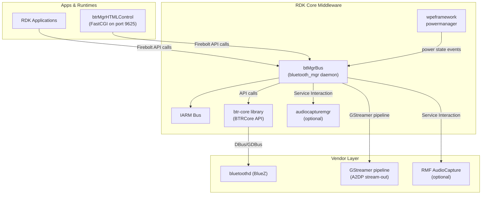
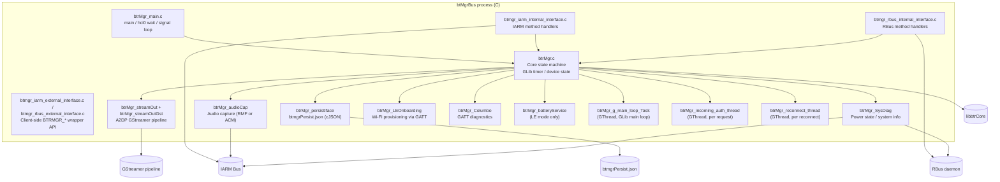
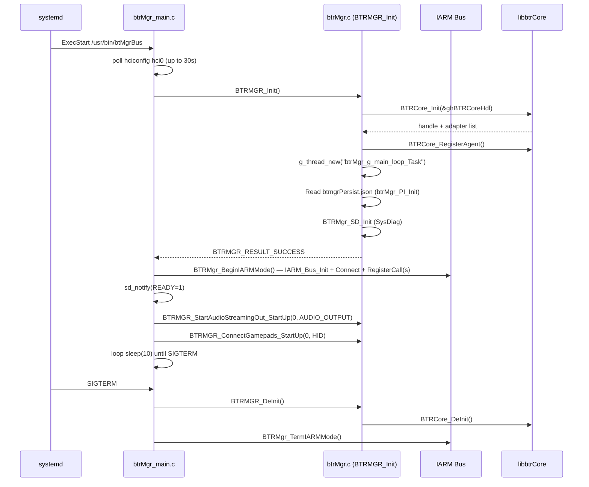
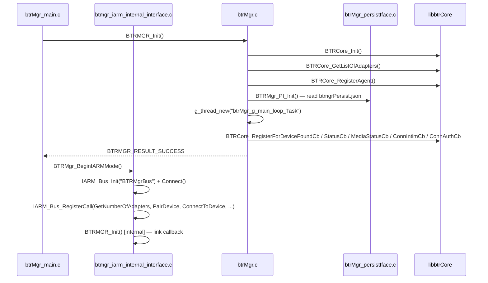
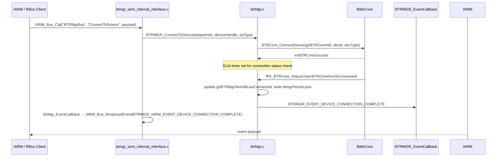
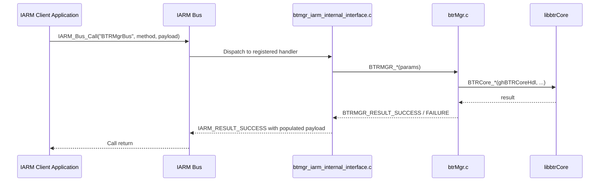
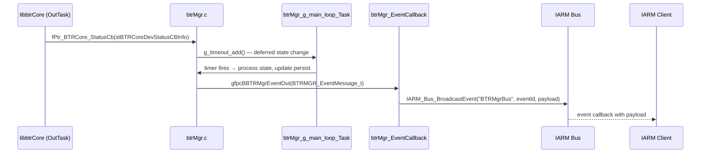

# Bluetoothmgr

`btr-mgr` is the Bluetooth Manager daemon for RDK middleware. It runs as a background process and manages all Bluetooth services on the device. It interfaces with the `btr-core` library (which communicates with BlueZ over DBus), and exposes its control API northbound over either IARM Bus or RBus — selected at build time. The daemon manages device discovery, pairing, connection, A/V audio streaming (A2DP), audio capture, HID gamepad connections, Bluetooth Low Energy operations, and a persistent device registry.

`btr-mgr` provides a unified northbound API for other RDK processes and applications to perform all Bluetooth operations without direct knowledge of the BlueZ stack. On startup, it waits for the Bluetooth hardware interface to become available, initializes all subsystems, signals readiness to the init system, attempts to auto-connect the last-paired audio output device and any paired gamepads, and then runs until a termination signal is received.

Internally, a core state machine drives all device lifecycle and session management, using timer-based retry and hold-off logic for robustness. Northbound IPC handlers act as thin pass-through layers that validate initialization state and forward calls to the core API. Dedicated subsystems provide A2DP audio streaming via GStreamer, audio capture via the platform audio subsystem, persistent device storage, system diagnostics, LE onboarding, and LE battery service management.

**Key Features & Responsibilities:**

- **IARM Bus or RBus northbound interface**: Registers all Bluetooth control methods (adapter management, discovery, pairing, connection, streaming, media control, LE operations, system diagnostics) as callable IPC endpoints, allowing any authorized RDK process or application to manage Bluetooth without direct library access. The IPC transport is selected at build time.
- **A/V audio stream-out**: Manages A2DP audio streaming sessions via GStreamer pipelines. On startup, attempts automatic reconnection to the last-paired audio output device.
- **Audio capture (stream-in)**: Captures audio from external Bluetooth sources via either direct RMF AudioCapture integration or via the audio capture manager service, selectable at build time.
- **HID gamepad management**: On startup, connects any paired gamepads and tracks their enable state and standby mode independently from audio devices.
- **LE/GATT operations and advertising**: Supports GATT property read/write/notify, LE advertisement start/stop, service and characteristic registration, and LE onboarding for Wi-Fi provisioning over GATT.
- **Persistent device registry**: Reads and writes a JSON file to track paired profiles, per-device connection status, last-connected device, and optionally volume and mute settings.
- **System diagnostics and Columbo**: Queries device system state (power, QR code, mesh backhaul status) via the platform IPC bus, and exposes GATT characteristics for remote diagnostics.
- **LE battery service** (LE mode only): Manages periodic battery level polling, OTA firmware update flow, and battery threshold notifications for LE devices.

---

## Design

`btr-mgr` is designed as a single-process daemon with a GLib main loop for timer-driven operations and separate per-operation GThreads for blocking activities. The core state machine in `btrMgr.c` holds all module handles (`ghBTRCoreHdl`, `ghBTRMgrPiHdl`, `ghBTRMgrSdHdl`, streaming handle, discovery handles) as process-level global state and uses timer sources for retry logic, hold-off delays, and deferred state transitions. Northbound IPC (IARM or RBus) is separated into `src/rpc/` files which act as thin pass-through layers that validate initialization state and forward calls to `BTRMGR_*` functions.

Northbound interaction operates over IARM Bus (`BTRMgr_BeginIARMMode()` registers IARM calls and connects to the bus) or RBus (`BTRMgr_BeginRBUSMode()`) depending on the build. Southbound interaction operates through direct C API calls to the `libbtrCore` library (`BTRCore_Init`, `BTRCore_StartDiscovery`, `BTRCore_PairDevice`, `BTRCore_ConnectDevice`, etc.) and optionally to GStreamer APIs for audio and to `librmfAudioCapture` or IARM calls to `audiocapturemgr` for audio capture.

The IPC mechanisms in use include IARM Bus for northbound (IARM build) and for calling `audiocapturemgr`, RBus for northbound (RBus build) and for system diagnostics queries, a main loop timer thread for all deferred and retry operations, and per-operation worker threads for blocking connection and authentication operations.

`btrMgr_persistIface` manages data persistence by reading and writing `btmgrPersist.json` using `libcjson`. The file is stored at `/opt/lib/bluetooth/btmgrPersist.json` when that directory is accessible, otherwise at `/opt/secure/lib/bluetooth/btmgrPersist.json`. It stores adapter ID, profile list, per-device connection status, last-connected device, and optionally persisted volume/mute values (`RDKTV_PERSIST_VOLUME` build flag).

### Threading Model

- **Threading Architecture**: Multi-threaded with GLib-based threads around a GLib main loop.
- **Main Thread**: Waits for `hci0` to come up (`hciconfig hci0` polled up to `BT_HCI0_TIMEOUT = 30` seconds), calls `BTRMGR_Init()`, starts IPC mode, then waits in a loop until a `SIGTERM` signal is received.
- **Worker Threads**:
  - _`btrMgr_g_main_loop_Task`_ (`GThread`): Runs `g_main_loop_run()` on `gmainContext`. Processes all GLib timeout sources (retry timers, hold-off timers, deferred state change timers) registered by the core state machine.
  - _`btrMgr_incoming_auth_thread`_ (`GThread`, created per incoming connection/auth event): Handles incoming pairing/authentication requests from `btrCore_BTDeviceConnectionIntimationCb` or `btrCore_BTDeviceAuthenticationCb`. Protected by `gBtrMgrAuthMutex` (GMutex).
  - _`btrMgr_reconnect_thread`_ (`GThread`, created per reconnect operation): Executes reconnection logic for devices after transient disconnections.
- **Synchronization**: `GMutex gBtrMgrAuthMutex` for serializing incoming auth thread creation. GLib atomic operations for timer reference tracking.
- **Async / Event Dispatch**: `btr-core` status callbacks (device status, media status, discovery, connection intimation/auth) are received in the `btrCore` event thread and dispatched into the core state machine handler functions, which schedule deferred processing on the main loop thread or spawn per-operation threads for blocking operations.

### RDK-V Platform and Integration Requirements

- **Build Dependencies**: Required (all platforms): `bluetooth-core` (`libbtrCore`), `cjson`, `wpeframework-clientlibraries`, `fcgi`, `rfc`, `rdk-logger`, `commonutilities`, `rdkfwupgrader`, `libsyswrapper`. Platform-specific build-time: `iarmbus` (client and hybrid platforms); `netsrvmgr` (client platform only, when `ENABLE_NETWORKMANAGER` distro feature is absent). Feature-conditional: `gstreamer1.0` + `gstreamer1.0-plugins-base` (when `gstreamer1` distro feature is set); `virtual/vendor-media-utils` + `audiocapturemgr` (client and hybrid platforms). Runtime dependencies (`RDEPENDS`): `bluetooth-core`, `cjson`, `rdk-logger`; `virtual/vendor-media-utils` and `audiocapturemgr` on client and hybrid platforms.
- **Device Services / HAL**: `libbtrCore` must be present and BlueZ `bluetoothd` must be running. HCI adapter (`hci0`) must be up.
- **IARM Bus**: Bus name `BTRMgrBus`. IARM method names are defined in `btmgr_iarm_interface.h`. Subscribes to events from the `audiocapturemgr` bus.
- **Systemd Services**: `iarmbusd.service`, `bluetooth.service` (BlueZ), `audiocapturemgr.service`, and `wpeframework-powermanager.service` must all be running before `btmgr.service` starts.
- **Configuration Files**: `btmgrPersist.json` (read/write at runtime, path resolved dynamically). RDK logger config at `/etc/debug.ini` or `/opt/debug.ini` (override).
- **Startup Order**: Systemd `After=` / `Requires=` in `conf/btmgr.service` enforces startup order. A systemd drop-in (`btmgr.conf`) applies a configurable startup delay (default `BTMGR_STARTUP_DELAY = 3` seconds). The daemon additionally polls `hciconfig hci0` for up to `BT_HCI0_TIMEOUT = 30` seconds before proceeding.
- **Build flags** (`EXTRA_OECONF`):
  - `--enable-gstreamer1=yes/no` → GStreamer 1.x for A2DP stream-out; auto-set from `gstreamer1` distro feature.
  - `--enable-safec=yes/no` → SafeC string library; auto-set from `safec` distro feature.
  - `--enable-brcm-build=yes/no` → Broadcom PCM sink support; auto-set from `btr_bcm_pcm_sink` distro feature.
  - `--enable-rpc` → northbound IARM interface (`IARM_RPC_ENABLED`); applied on client and hybrid platforms only.
  - `--enable-acm=yes/no` → IARM calls to `audiocapturemgr` for audio-in; auto-detected from `audiocapturemgr` runtime dependency.
  - `--enable-ac_rmf=yes/no` → direct RMF AudioCapture for audio-in; auto-detected from `virtual/vendor-media-utils` runtime dependency.
  - `--enable-rdktv-build=yes` → RDK-TV build mode; always enabled.
  - `--enable-rdk-logger=yes/no` → RDK logger integration; auto-detected from `rdk-logger` runtime dependency.
  - `--enable-autoconnectfeature=yes` → automatic reconnection to last-paired audio device on startup; always enabled.
  - `--enable-systemd-notify` → `ENABLE_SD_NOTIFY`: systemd `sd_notify` readiness signaling (`Type=notify` in service file); applied when `systemd` distro feature is set.
  - `--enable-sys-diag` → system diagnostics queries (power state, QR code, mesh status); applied on client platforms only.

---

### Component State Flow

#### Initialization to Active State

#### Runtime State Changes

**State Change Triggers:**

- Discovery state transitions through `BTRMGR_DISCOVERY_ST_STARTED` → `BTRMGR_DISCOVERY_ST_STOPPED`. A `BTRMGR_DISCOVERY_HOLD_OFF_TIME = 120` second hold-off prevents immediate restart.
- Device pairing completion posts `BTRMGR_EVENT_DEVICE_PAIRING_COMPLETE` or `BTRMGR_EVENT_DEVICE_PAIRING_FAILED` to the registered `BTRMGR_EventCallback`. Pairing is retried up to `BTRMGR_PAIR_RETRY_ATTEMPTS = 10` times.
- Connection completion posts `BTRMGR_EVENT_DEVICE_CONNECTION_COMPLETE` or `BTRMGR_EVENT_DEVICE_CONNECTION_FAILED`. Auto-reconnect is attempted up to `BTMGR_RECONNECTION_ATTEMPTS = 3` times after a hold-off of `BTMGR_RECONNECTION_HOLD_OFF = 3` seconds.
- `BTRMGR_EVENT_DEVICE_OUT_OF_RANGE` is fired when a connected device is lost. A `BTRMGR_POST_OUT_OF_RANGE_HOLD_OFF_TIME = 6` second timer guards against flapping.
- AVDTP suspend causes a stream restart retry up to `BTMGR_AVDTP_SUSPEND_MAX_RETRIES = 3` times before giving up.

**Context Switching Scenarios:**

- Power state changes from `wpeframework-powermanager` (received via `PowerController` or IARM) cause discovery to be paused/resumed and streaming sessions to be stopped/restarted depending on device type.
- LE mode (`--enable-leonly`) completely removes all audio streaming code paths and substitutes LE battery service and cellular modem state checks in the init and reconnect flows.
- RFC parameter changes via `rfcapi.h` affect audio-in service state and HID gamepad enable state at runtime.

---

### Call Flows

#### Initialization Call Flow

#### Request Processing Call Flow

---

## Internal Modules

| Module / Class                             | Description                                                                                                                                                                                                                                      | Key Files                                                                                                                                                      |
| ------------------------------------------ | ------------------------------------------------------------------------------------------------------------------------------------------------------------------------------------------------------------------------------------------------ | -------------------------------------------------------------------------------------------------------------------------------------------------------------- |
| `btrMgr_main`                              | Process entry point. Polls `hci0` readiness, calls `BTRMGR_Init()`, starts IARM or RBus IPC mode, starts audio/gamepad auto-connect (non-LE mode), runs heartbeat loop, calls `BTRMGR_DeInit()` on `SIGTERM`.                                    | [src/main/btrMgr_main.c](src/main/btrMgr_main.c)                                                                                                               |
| `btrMgr` (core interface)                  | Core Bluetooth state machine. Holds all module handles, GLib timer references, device and streaming state. Implements all `BTRMGR_*` public API functions, registers `btr-core` callbacks, and manages GLib main loop and per-operation threads. | [src/ifce/btrMgr.c](src/ifce/btrMgr.c), [include/btmgr.h](include/btmgr.h)                                                                                     |
| `btmgr_iarm_internal_interface`            | IARM northbound handler. Registers all Bluetooth control methods as IARM callable functions and translates IARM calls to `BTRMGR_*` API calls. Broadcasts `BTRMGR_Events_t` events over IARM. Selected by `--enable-rpc`.                        | [src/rpc/btmgr_iarm_internal_interface.c](src/rpc/btmgr_iarm_internal_interface.c)                                                                             |
| `btmgr_iarm_external_interface`            | IARM client-side wrapper API (`BTRMGR_Init`, `BTRMGR_GetNumberOfAdapters`, etc.). Used by other processes to interact with `btr-mgr` via IARM without knowing bus internals. Registers IARM event handlers for device and media events.          | [src/rpc/btmgr_iarm_external_interface.c](src/rpc/btmgr_iarm_external_interface.c)                                                                             |
| `btmgr_rbus_internal_interface`            | RBus northbound handler. Registers Bluetooth control methods and properties on the RBus data model. Selected by `--enable-rbusrpc`.                                                                                                              | [src/rpc/btmgr_rbus_internal_interface.c](src/rpc/btmgr_rbus_internal_interface.c)                                                                             |
| `btmgr_rbus_external_interface`            | RBus client-side wrapper API. Provides `BTRMGR_*` public API backed by RBus method invocations.                                                                                                                                                  | [src/rpc/btmgr_rbus_external_interface.c](src/rpc/btmgr_rbus_external_interface.c)                                                                             |
| `btrMgr_streamOut` + `btrMgr_streamOutGst` | A2DP audio stream-out. `btrMgr_streamOut.c` provides generic streaming state and callback management. `btrMgr_streamOutGst.c` implements the GStreamer 1.x pipeline for encoding and streaming PCM to A2DP sink.                                 | [src/streamOut/btrMgr_streamOut.c](src/streamOut/btrMgr_streamOut.c), [src/streamOut/btrMgr_streamOutGst.c](src/streamOut/btrMgr_streamOutGst.c)               |
| `btrMgr_audioCap`                          | Audio capture (stream-in) abstraction. Captures audio from an external BT audio source device. Backed by either direct RMF AudioCapture library (`USE_AC_RMF`) or by IARM calls to `audiocapturemgr` (`USE_ACM`).                                | [src/audioCap/btrMgr_audioCap.c](src/audioCap/btrMgr_audioCap.c)                                                                                               |
| `btrMgr_persistIface`                      | Persistent device and profile registry using `libcjson`. Reads/writes `btmgrPersist.json`. Stores adapter ID, paired profile/device lists, last-connected device, connection status, and (RDKTV) volume/mute.                                    | [src/persistIf/btrMgr_persistIface.c](src/persistIf/btrMgr_persistIface.c), [include/persistIf/btrMgr_persistIface.h](include/persistIf/btrMgr_persistIface.h) |
| `btrMgr_SysDiag`                           | System diagnostics. Queries device power state via `PowerController`, QR code, and mesh backhaul status via IARM (`sysMgr`) or RBus (`syscfg`). Responds to `SysDiagInfo` IARM/RBus calls.                                                       | [src/sysDiag/btrMgr_SysDiag.c](src/sysDiag/btrMgr_SysDiag.c)                                                                                                   |
| `btrMgr_LEOnboarding`                      | Wi-Fi provisioning over GATT. Exposes GATT characteristics for SSID list, public key, Wi-Fi config, and provision status. Uses ECDH (`libecdhlib`) for key exchange.                                                                             | [src/leOnboarding/btrMgr_LEOnboarding.c](src/leOnboarding/btrMgr_LEOnboarding.c)                                                                               |
| `btrMgr_Columbo`                           | GATT-based diagnostics interface (Columbo UUID: `64d9f574-7756-4ebc-9ebe-ed5f7f2871ab`). Exposes start/stop/status/report characteristics for remote diagnostic triggering.                                                                      | [src/columbo/](src/columbo/)                                                                                                                                   |
| `btrMgr_batteryService`                    | LE battery service (LE mode only). Manages periodic battery level polling, connection/reconnection to battery devices, GATT start-notify, and OTA firmware update flow for LE devices.                                                           | [src/batteryService/](src/batteryService/)                                                                                                                     |

---

## Component Interactions

### Interaction Matrix

| Target Component / Layer    | Interaction Purpose                                                                                             | Key APIs / Topics                                                                                                                                      |
| --------------------------- | --------------------------------------------------------------------------------------------------------------- | ------------------------------------------------------------------------------------------------------------------------------------------------------ |
| **Plugins**           |                                                                                                                 |                                                                                                                                                        |
| `wpeframework-powermanager` | Receive power state change events to pause/resume BT operations (discovery, streaming).                         | `PowerController` API (IARM or direct library)                                                                                                         |
| **Device Services / HAL**   |                                                                                                                 |                                                                                                                                                        |
| `libbtrCore`                | All Bluetooth operations — adapter control, device discovery, pairing, connection, A/V media sessions, LE/GATT. | `BTRCore_Init`, `BTRCore_StartDiscovery`, `BTRCore_PairDevice`, `BTRCore_ConnectDevice`, `BTRCore_GetMediaTrackInfo`, `BtrCore_LE_PerformGattOp`, etc. |
| RMF AudioCapture            | Direct audio capture from BT audio source device (when `USE_AC_RMF` build flag set).                            | `RMF_AudioCapture_Open`, `RMF_AudioCapture_Start`, `RMF_AudioCapture_Stop`, `RMF_AudioCapture_Close`                                                   |
| GStreamer                   | A2DP audio stream-out pipeline management.                                                                      | GStreamer 1.x element pipeline in `btrMgr_streamOutGst.c`                                                                                              |
| **IARM Bus**                |                                                                                                                 |                                                                                                                                                        |
| `audiocapturemgr`           | Audio-in capture control when built with `--enable-acm`.                                                        | `IARM_Bus_Call(audiocapturemgr, open/start/stop/close, ...)`                                                                                           |
| `sysMgr`                    | System diagnostics queries (device info, network status).                                                       | `IARM_Bus_Call(sysMgr, ...)`                                                                                                                           |
| **External Systems**        |                                                                                                                 |                                                                                                                                                        |
| RFC (`rfcapi.h`)            | Query RFC parameters for audio-in service enable state and HID gamepad enable state.                            | `getRFCParameter()`                                                                                                                                    |

### Events Published

| Event Name                                            | IARM / RBus Topic             | Trigger Condition                                                               | Subscriber Components                     |
| ----------------------------------------------------- | ----------------------------- | ------------------------------------------------------------------------------- | ----------------------------------------- |
| `BTRMGR_EVENT_DEVICE_DISCOVERY_UPDATE`                | IARM event on bus `BTRMgrBus` | Device found or updated during active scan                                      | IARM clients that register event handlers |
| `BTRMGR_EVENT_DEVICE_PAIRING_COMPLETE` / `_FAILED`    | IARM event on bus `BTRMgrBus` | Pairing operation completes or fails                                            | IARM clients                              |
| `BTRMGR_EVENT_DEVICE_CONNECTION_COMPLETE` / `_FAILED` | IARM event on bus `BTRMgrBus` | Connection operation completes or fails                                         | IARM clients                              |
| `BTRMGR_EVENT_DEVICE_DISCONNECT_COMPLETE`             | IARM event on bus `BTRMgrBus` | Device disconnects                                                              | IARM clients                              |
| `BTRMGR_EVENT_MEDIA_TRACK_*`                          | IARM event on bus `BTRMgrBus` | AVRCP track state change (started, playing, paused, stopped, changed, position) | IARM clients                              |
| `BTRMGR_EVENT_MEDIA_PLAYER_*`                         | IARM event on bus `BTRMgrBus` | AVRCP player property change (name, volume, delay, equalizer, shuffle, repeat)  | IARM clients                              |
| `BTRMGR_EVENT_RECEIVED_EXTERNAL_PAIR_REQUEST`         | IARM event on bus `BTRMgrBus` | Incoming pairing request from a remote device                                   | IARM clients                              |
| `BTRMGR_EVENT_BATTERY_INFO`                           | IARM event on bus `BTRMgrBus` | Battery level update from a connected LE device                                 | IARM clients                              |
| `BTRMGR_EVENT_DEVICE_OUT_OF_RANGE`                    | IARM event on bus `BTRMgrBus` | Connected device goes out of range                                              | IARM clients                              |

### IPC Flow Patterns

**Primary Request / Response Flow:**

**Event Notification Flow:**

---

## Implementation Details

### Major HAL APIs Integration

All BT hardware operations go through `libbtrCore`. The audio streaming pipeline uses GStreamer.

| API / Library                                                    | Purpose                                                                 | Implementation File                                              |
| ---------------------------------------------------------------- | ----------------------------------------------------------------------- | ---------------------------------------------------------------- |
| `BTRCore_Init` / `BTRCore_DeInit`                                | Initialize and teardown the btr-core library and BlueZ DBus connection. | [src/ifce/btrMgr.c](src/ifce/btrMgr.c)                           |
| `BTRCore_StartDiscovery` / `BTRCore_StopDiscovery`               | Start and stop BT device scanning.                                      | [src/ifce/btrMgr.c](src/ifce/btrMgr.c)                           |
| `BTRCore_PairDevice` / `BTRCore_UnPairDevice`                    | Pair and unpair a BT device.                                            | [src/ifce/btrMgr.c](src/ifce/btrMgr.c)                           |
| `BTRCore_ConnectDevice` / `BTRCore_DisconnectDevice`             | Connect and disconnect a paired device.                                 | [src/ifce/btrMgr.c](src/ifce/btrMgr.c)                           |
| `BTRCore_GetMediaTrackInfo` / `BTRCore_MediaControl`             | AVRCP media track queries and playback control.                         | [src/ifce/btrMgr.c](src/ifce/btrMgr.c)                           |
| `BtrCore_LE_PerformGattOp` / `BTRCore_LE_GetGattProperty`        | GATT read/write/notify operations for LE devices.                       | [src/ifce/btrMgr.c](src/ifce/btrMgr.c)                           |
| `BTRCore_LE_StartAdvertisement` / `BTRCore_LE_StopAdvertisement` | LE advertisement registration and release.                              | [src/ifce/btrMgr.c](src/ifce/btrMgr.c)                           |
| `RMF_AudioCapture_Open/Start/Stop/Close`                         | Direct audio capture from BT source (when `USE_AC_RMF` is set).         | [src/audioCap/btrMgr_audioCap.c](src/audioCap/btrMgr_audioCap.c) |

### Key Implementation Logic

- **State / Lifecycle Management**:
  - Device handle tracking uses a set of per-role global handles: `ghBTRMgrDevHdlLastConnected`, `ghBTRMgrDevHdlCurStreaming`, `ghBTRMgrDevHdlLastPaired`, `ghBTRMgrDevHdlConnInProgress`, and others.
  - Connection retry (`BTRMGR_CONNECT_RETRY_ATTEMPTS = 2`), pairing retry (`BTRMGR_PAIR_RETRY_ATTEMPTS = 10`), and modalias retry (`BTRMGR_MODALIAS_RETRY_ATTEMPTS = 5`) are driven by GLib timeout sources.
  - A `BTRMGR_AUTOCONNECT_ON_STARTUP_TIMEOUT = 40` second timer guards the startup audio reconnection sequence.

- **Event Processing**:
  - `btr-core` status callbacks are invoked synchronously. Each callback schedules event processing on the main loop thread, updating device state and delivering the event to the registered listener (IARM or RBus interface layer).
  - Background discovery runs concurrently with foreground discovery for specific device types.

- **Error Handling Strategy**:
  - `BTRMGR_Result_t` return codes: `BTRMGR_RESULT_SUCCESS (0)`, `BTRMGR_RESULT_GENERIC_FAILURE (-1)`, `BTRMGR_RESULT_INVALID_INPUT (-2)`, `BTRMGR_RESULT_INIT_FAILED (-3)`.
  - IARM handlers return `IARM_RESULT_INVALID_STATE` when called before `BTRMGR_Init()` completes.
  - AVDTP suspend events trigger a stream restart. After `BTMGR_AVDTP_SUSPEND_MAX_RETRIES = 3` consecutive failures, the stream is abandoned.

- **Logging & Diagnostics**:
  - `RDK_LOGGER_BTMGR_NAME` = `"LOG.RDK.BTRMGR"` and `RDK_LOGGER_BTCORE_NAME` = `"LOG.RDK.BTRCORE"` are the RDK logger module names.
  - Syslog-ng routes daemon output to `btmgrlog.txt` (log rate: very-high, rotated at 512 KB / 5 rotations on persistent storage, 250 KB / 2 rotations in memory). Breakpad maps the `btMgrBus` process to this log file.
  - Debug artifacts are written to `BTRMGR_DEBUG_DIRECTORY = "/tmp/btrMgr_DebugArtifacts"` when `gDebugModeEnabled` is set.
  - Telemetry events are reported via `bt-telemetry.c` wrappers (same library as `btr-core`).

---

## Configuration

### Key Configuration Files

| Configuration File                                      | Purpose                                                                                                                                                                 | Override Mechanism                                                                                                                                          |
| ------------------------------------------------------- | ----------------------------------------------------------------------------------------------------------------------------------------------------------------------- | ----------------------------------------------------------------------------------------------------------------------------------------------------------- |
| `/opt/lib/bluetooth/btmgrPersist.json`                  | Primary persistent storage. Stores adapter ID, profile list, per-device connection status, last-connected device, beacon detection setting, and optionally volume/mute. | Written by `btrMgr_persistIface.c` at runtime. Path falls back to `/opt/secure/lib/bluetooth/btmgrPersist.json` if `/opt/lib/bluetooth/` is not accessible. |
| `${systemd_unitdir}/system/btmgr.service.d/btmgr.conf` | Systemd drop-in for `btmgr.service`. Sets the startup delay via `BTMGR_STARTUP_DELAY` (default: `3` seconds).                                                          | Override `BTMGR_STARTUP_DELAY` in the BitBake recipe or a higher-priority layer.                                                                            |
| `/etc/debug.ini`                                        | RDK logger configuration.                                                                                                                                               | Overridden by `/opt/debug.ini` if present.                                                                                                                  |

### Key Configuration Parameters

| Parameter                               | Type           | Default | Description                                                                                                                                    |
| --------------------------------------- | -------------- | ------- | ---------------------------------------------------------------------------------------------------------------------------------------------- |
| `BTRMGR_DEVICE_COUNT_MAX`               | `int` macro    | `32`    | Maximum number of paired devices tracked. Defined in [include/btmgr.h](include/btmgr.h).                                                       |
| `BTRMGR_DISCOVERED_DEVICE_COUNT_MAX`    | `int` macro    | `128`   | Maximum number of concurrently scanned devices. Defined in [include/btmgr.h](include/btmgr.h).                                                 |
| `BTRMGR_PAIR_RETRY_ATTEMPTS`            | `int` constant | `10`    | Maximum pairing retry attempts. Defined in [src/ifce/btrMgr.c](src/ifce/btrMgr.c).                                                             |
| `BTRMGR_CONNECT_RETRY_ATTEMPTS`         | `int` constant | `2`     | Maximum connection retry attempts per request. Defined in [src/ifce/btrMgr.c](src/ifce/btrMgr.c).                                              |
| `BTMGR_RECONNECTION_ATTEMPTS`           | `int` constant | `3`     | Maximum automatic reconnection attempts. Defined in [src/ifce/btrMgr.c](src/ifce/btrMgr.c).                                                    |
| `BTMGR_RECONNECTION_HOLD_OFF`           | `int` constant | `3`     | Seconds to wait before attempting auto-reconnect. Defined in [src/ifce/btrMgr.c](src/ifce/btrMgr.c).                                           |
| `BTRMGR_DISCOVERY_HOLD_OFF_TIME`        | `int` constant | `120`   | Seconds of hold-off after discovery stops before it can restart. Defined in [src/ifce/btrMgr.c](src/ifce/btrMgr.c).                            |
| `BTRMGR_AUTOCONNECT_ON_STARTUP_TIMEOUT` | `int` constant | `40`    | Seconds allowed for startup auto-connect sequence. Defined in [src/ifce/btrMgr.c](src/ifce/btrMgr.c).                                          |
| `BTMGR_AVDTP_SUSPEND_MAX_RETRIES`       | `int` constant | `3`     | Maximum AVDTP suspend restart retries before stream is abandoned. Defined in [src/ifce/btrMgr.c](src/ifce/btrMgr.c).                           |
| `BT_HCI0_TIMEOUT`                       | `int` constant | `30`    | Maximum seconds to wait for `hci0` to be up at startup. Defined in [src/main/btrMgr_main.c](src/main/btrMgr_main.c).                           |
| `BTRMGR_MAX_PERSISTENT_DEVICE_COUNT`    | `int` macro    | `5`     | Max devices stored per profile in persist file. Defined in [include/persistIf/btrMgr_persistIface.h](include/persistIf/btrMgr_persistIface.h). |
| `BTRMGR_MAX_PERSISTENT_PROFILE_COUNT`   | `int` macro    | `5`     | Max profiles stored in persist file. Defined in [include/persistIf/btrMgr_persistIface.h](include/persistIf/btrMgr_persistIface.h).            |

### Configuration Persistence

The following are persisted in `btmgrPersist.json` across reboots by `btrMgr_persistIface.c`:

- Adapter ID
- Per-profile paired device list (up to `BTRMGR_MAX_PERSISTENT_PROFILE_COUNT = 5` profiles, `BTRMGR_MAX_PERSISTENT_DEVICE_COUNT = 5` devices each)
- Per-device connection status and last-connected flag
- Beacon detection limit setting
- Volume and mute values (only when built with `RDKTV_PERSIST_VOLUME`)

All other runtime state (discovery results, current streaming session, active connection) is not persisted and is re-established after a restart.
