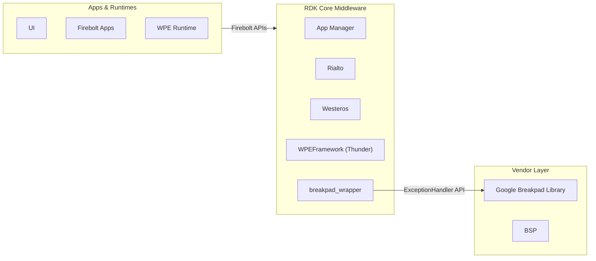
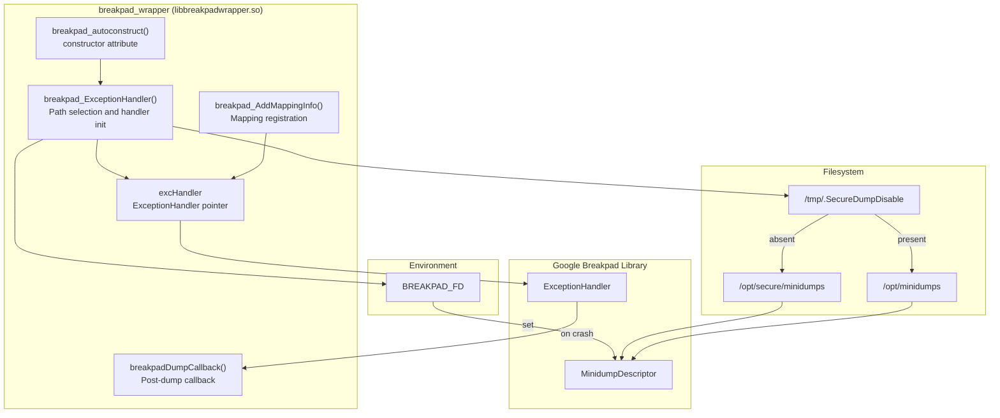
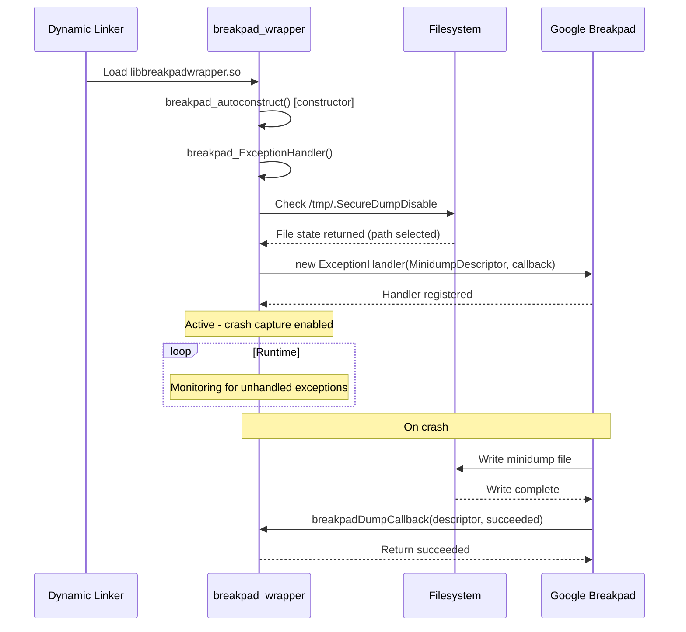
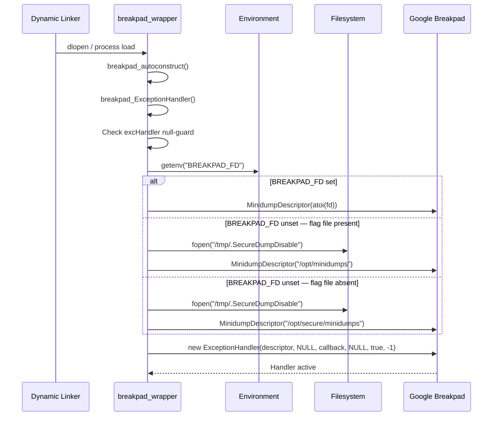
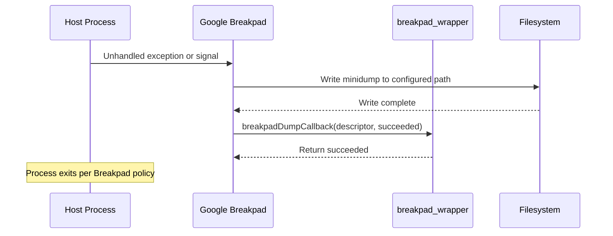

# Breakpad Wrapper

Breakpad wrapper is a C-compatible shared library (`libbreakpadwrapper.so`) that gives RDK middleware components automatic crash capture and minidump generation by wrapping the Google Breakpad exception handling framework. It exposes a minimal C interface, allowing any process that links against it to register a crash handler and annotate the handler with custom memory mapping metadata through a plain C interface.

At the device level, the library operates transparently. Any process that links against `libbreakpadwrapper.so` has a crash handler registered automatically at load time, before `main()` executes, with the host application needing only a link dependency. On an unhandled exception or crash signal, a minidump file is written to a configurable filesystem path for retrieval and post-mortem analysis.

At the module level, the library provides two distinct services: crash handler registration backed by a process-level `google_breakpad::ExceptionHandler`, and custom memory mapping registration for enriching crash reports with named region metadata. Minidump output path selection is governed by a runtime flag file and a build-time compilation flag, allowing operators to direct crash data to a secure or general storage location without rebuilding the library.



**Key Features & Responsibilities:**

- **Automatic Crash Handler Registration**: The library registers a Breakpad exception handler at process load time via a constructor-attributed function, with automatic self-activation at library load time.
- **Minidump File Generation**: On an unhandled exception or signal, a minidump capturing the process state is written to a configurable output directory for later retrieval and analysis.
- **Runtime Minidump Path Selection**: The output directory is chosen at initialization by probing a runtime flag file, directing crash data to either a secure or a general storage path without requiring a rebuild.
- **File Descriptor–Based Minidump Writing**: Supports targeting a pre-opened file descriptor for minidump output via the `BREAKPAD_FD` environment variable, enabling integration with privileged or sandboxed crash collection pipelines.
- **Memory Mapping Registration**: Provides an API to register named memory regions and their identifiers with the active exception handler, enriching crash reports with custom mapping metadata for improved symbolication.
- **C-Compatible Public API**: The public interface uses `extern "C"` linkage, allowing both C and C++ host processes to link against the library without name-mangling complications.

---

## Design

The library is designed around a single-instance crash handler model. A file-static `google_breakpad::ExceptionHandler` pointer (`excHandler`) holds the registered handler for the process lifetime; `breakpad_ExceptionHandler()` returns immediately if this pointer is already non-null, preventing duplicate handler registration even if called multiple times. The auto-initialization mechanism relies on the GCC/Clang `__attribute__((constructor))` annotation on `breakpad_autoconstruct()`, which the dynamic linker invokes automatically at library load time, before any application code executes. This design means the library is self-activating and imposes zero API burden on host processes.

Minidump path selection follows a two-tier policy driven by both build-time and runtime inputs. When the `MINIDUMP_RDKV` compile flag is active, the default output path is `/opt/secure/minidumps`. The presence of `/tmp/.SecureDumpDisable` at initialization time overrides this to `/opt/minidumps`, giving platform operators a filesystem-level control point to redirect crash data without a rebuild. When the `BREAKPAD_FD` environment variable is set, the `MinidumpDescriptor` is constructed from an integer file descriptor rather than a directory path, bypassing all path selection logic entirely.

The northbound interface is the C API declared in `breakpad_wrapper.h`. Host processes may call `breakpad_AddMappingInfo()` at any point after the library is loaded to register memory region metadata. The southbound interface is the `google_breakpad::ExceptionHandler` and `MinidumpDescriptor` API from the Breakpad library. The library operates entirely within the host process address space. Crash data delivery to external collection systems is the responsibility of the Breakpad library, which writes the minidump synchronously from a signal-safe handler context.

The `excHandler` pointer is held in file-static scope for the process lifetime. Minidump files written to the output directory are the library's only durable output; their retention and upload are the responsibility of external collection components.



### Threading Model

- **Threading Architecture**: Single-threaded initialization. The Breakpad library manages crash capture internally using OS signal handling.
- **Main Thread**: Executes `breakpad_autoconstruct()` at library load time, completing all initialization before any application code runs. Handles calls to `breakpad_AddMappingInfo()` during normal operation.
- **Synchronization**: The `excHandler` null-check (`if (excHandler) return`) prevents duplicate initialization from concurrent or repeated call sites. The constructor attribute guarantees single invocation at load time.
- **Async / Event Dispatch**: Crash capture is handled asynchronously by Breakpad's internal signal handler. `breakpadDumpCallback` is invoked from within that signal-handling context and returns the `succeeded` boolean back to Breakpad.

### Platform and Integration Requirements

- **Build Dependencies**: `breakpad` library (`libbreakpad_client`), `pthread`. The Yocto recipe adds `-lbreakpad_client -lpthread` to `LDFLAGS` and adds the Breakpad include path to `CPPFLAGS`.
- **Configuration Files**: `/tmp/.SecureDumpDisable` — if present at handler initialization, redirects minidump output from `/opt/secure/minidumps` to `/opt/minidumps`.
- **Startup Order**: The library initializes at the moment the host process's dynamic linker maps it.

---

### Component State Flow

#### Initialization to Active State

When a process loads `libbreakpadwrapper.so`, the dynamic linker automatically invokes `breakpad_autoconstruct()` before `main()` executes. This function calls `breakpad_ExceptionHandler()`, which checks whether the handler has already been registered, probes the runtime flag file and the `BREAKPAD_FD` environment variable to select the minidump target, and constructs the `google_breakpad::ExceptionHandler`. Once construction completes, the library is active and will capture any subsequent crash in the host process.

The component transitions through the following states during its lifecycle: **Loading** (dynamic linker maps the shared library) → **Constructing** (`breakpad_autoconstruct` invoked by the linker) → **PathSelection** (flag file and environment variable evaluated) → **Active** (`ExceptionHandler` registered; crash capture enabled) → **Crashed** (Breakpad signal handler writes minidump; `breakpadDumpCallback` invoked).



#### Runtime State Changes

The library is stateless after initialization. The `ExceptionHandler` remains active for the entire process lifetime.

**State Change Triggers:**

- If `breakpad_ExceptionHandler()` is called again after initialization, the `excHandler` null-check causes it to return immediately, preserving the existing registration.

---

### Call Flows

#### Initialization Call Flow



#### Crash Event Call Flow

When an unhandled exception or signal occurs in the host process, Breakpad's internal signal handler takes control, writes the minidump to the configured target, and then invokes the registered callback. The callback receives the minidump descriptor and the write-success status, and returns it to Breakpad.



---

## Internal Modules

| Module / Class     | Description                                                                                                                                                                                                                                                                                                                                                                                  | Key Files                                    |
| ------------------ | -------------------------------------------------------------------------------------------------------------------------------------------------------------------------------------------------------------------------------------------------------------------------------------------------------------------------------------------------------------------------------------------- | -------------------------------------------- |
| `breakpad_wrapper` | Implements the complete public C API. Manages the `ExceptionHandler` lifecycle, performs minidump output path selection at initialization by probing the runtime flag file and environment variable, registers the post-dump callback, and delegates memory mapping registration to the Breakpad handler. Receives external input only via the filesystem flag file and process environment. | `breakpad_wrapper.cpp`, `breakpad_wrapper.h` |

---

## Component Interactions

breakpad_wrapper interacts with the Google Breakpad library and the local filesystem.

### Interaction Matrix

| Target Component / Layer              | Interaction Purpose                                                                                        | Key APIs / Topics                                                                                     |
| ------------------------------------- | ---------------------------------------------------------------------------------------------------------- | ----------------------------------------------------------------------------------------------------- |
| **Google Breakpad Library**           |                                                                                                            |                                                                                                       |
| `google_breakpad::ExceptionHandler`   | Registers the crash signal handler and initiates minidump writes on crash events                           | `ExceptionHandler(descriptor, filter, callback, ctx, install_handler, server_fd)`, `AddMappingInfo()` |
| `google_breakpad::MinidumpDescriptor` | Specifies the minidump output target as either a directory path or a file descriptor                       | `MinidumpDescriptor(path)`, `MinidumpDescriptor(fd)`                                                  |
| **Filesystem**                        |                                                                                                            |                                                                                                       |
| `/tmp/.SecureDumpDisable`             | Runtime flag file probed at initialization to select the minidump output directory                         | `fopen()` read-only probe                                                                             |
| `/opt/secure/minidumps`               | Default secure minidump output directory when `MINIDUMP_RDKV` is active and flag file is absent            | Written by Breakpad                                                                                   |
| `/opt/minidumps`                      | Fallback minidump output directory when flag file is present                                               | Written by Breakpad                                                                                   |
| **Environment**                       |                                                                                                            |                                                                                                       |
| `BREAKPAD_FD`                         | Integer file descriptor override for minidump output; bypasses all directory-based path selection when set | `getenv("BREAKPAD_FD")`                                                                               |

---

## Implementation Details

### Key Implementation Logic

- **State / Lifecycle Management**: A file-static pointer `excHandler` holds the registered handler for the process lifetime. `breakpad_ExceptionHandler()` returns immediately if this pointer is non-null, ensuring at most one handler is registered per process. The `__attribute__((constructor))` annotation on `breakpad_autoconstruct()` guarantees initialization at shared library load time.
  - Core implementation: `breakpad_wrapper.cpp`

- **Event Processing**: Crash capture is performed asynchronously by Breakpad's internal signal handler. After the minidump is written, `breakpadDumpCallback` is invoked with the `MinidumpDescriptor` (which exposes the output path) and the `succeeded` boolean. The callback returns `succeeded` unchanged, passing the result back to Breakpad for its own post-dump handling.

- **Error Handling Strategy**: Initialization proceeds unconditionally once path or file descriptor selection completes. `breakpad_AddMappingInfo()` checks the `excHandler` pointer before forwarding the mapping call, ensuring safe operation if called before handler initialization.

- **Logging & Diagnostics**: Diagnostic output is gated on the `_DEBUG_` compile flag. When active, `printf` statements trace entry into `breakpad_ExceptionHandler()`, its exit, and the minidump file path in the post-dump callback.

---

## Configuration

### Key Configuration Files

| Configuration File        | Purpose                                                                                                            | Override Mechanism                                           |
| ------------------------- | ------------------------------------------------------------------------------------------------------------------ | ------------------------------------------------------------ |
| `/tmp/.SecureDumpDisable` | When present at handler initialization, redirects minidump output from `/opt/secure/minidumps` to `/opt/minidumps` | Create or remove the file before the host process is started |

### Key Configuration Parameters

| Parameter       | Type                           | Default  | Description                                                                                                                                                              |
| --------------- | ------------------------------ | -------- | ------------------------------------------------------------------------------------------------------------------------------------------------------------------------ |
| `BREAKPAD_FD`   | Environment variable (integer) | Unset    | Pre-opened file descriptor to use as the minidump output target. When set, bypasses all directory-based path selection.                                                  |
| `MINIDUMP_RDKV` | Build-time compile flag        | Disabled | Enables RDK-V-specific path selection logic (`/opt/secure/minidumps` or `/opt/minidumps`) and `BREAKPAD_FD` support. When disabled, the fixed path `/minidumps` is used. |
| `_DEBUG_`       | Build-time compile flag        | Disabled | Enables verbose `printf` trace output in `breakpad_ExceptionHandler()` and `breakpadDumpCallback()`. Activated via `--enable-debug` at configure time.                   |

### Runtime Configuration

The minidump output directory can be changed without rebuilding by creating or removing `/tmp/.SecureDumpDisable` before the process that links `libbreakpadwrapper.so` is started. To use file descriptor–based output, set `BREAKPAD_FD` in the process environment:

```bash
BREAKPAD_FD=<fd_number> <host_process>
```

### Configuration Persistence

The flag file `/tmp/.SecureDumpDisable` resides on the `/tmp` tmpfs filesystem and is re-evaluated on each process start.
