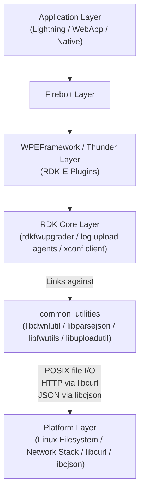
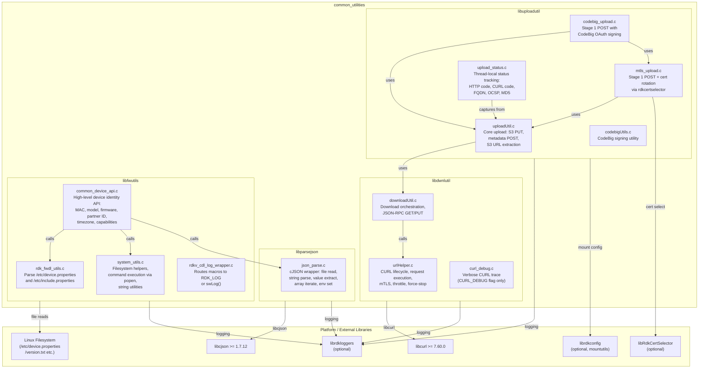
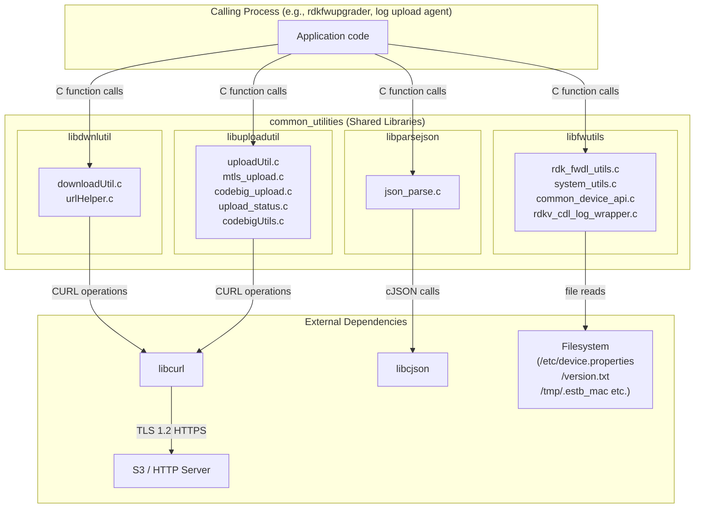
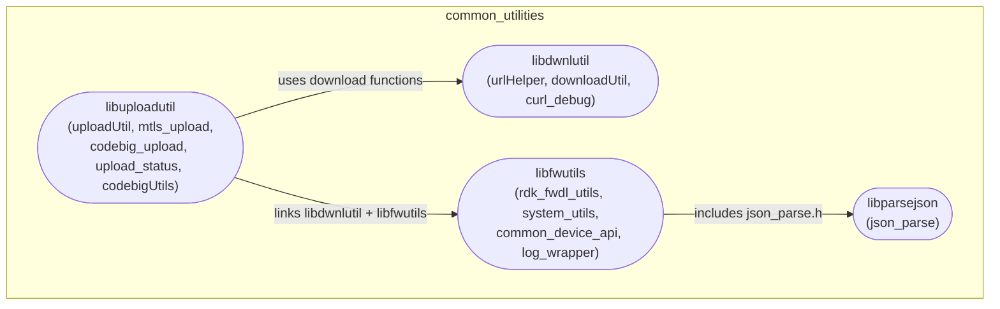

# common_utilities

---

## Overview

`common_utilities` is a collection of four shared C libraries used by RDK middleware components for firmware download, JSON parsing, device property access, and file upload operations. It has no dependency on WPEFramework/Thunder, IARM Bus, or Device Services APIs; it operates entirely through POSIX file I/O, libcurl, and libcjson.

At the device level, `common_utilities` provides the reusable plumbing that firmware upgrade daemons, log upload agents, and configuration fetch tools rely on. These components use `common_utilities` directly by linking against the four shared libraries it produces.

At the module level, each library has a distinct, narrowly scoped responsibility: `libdwnlutil` handles HTTP/HTTPS downloads, `libparsejson` wraps cJSON for file and string parsing, `libfwutils` reads device identity and filesystem state, and `libuploadutil` handles two-stage HTTP metadata POST + S3 PUT uploads with optional mTLS and CodeBig OAuth authentication.

The diagram below shows the position of `common_utilities` in the broader RDK stack. It sits in the RDK core layer as a utility library, consumed by firmware and log management components above it, and it accesses only the filesystem and network stack below it.



**Key Features & Responsibilities:**

- **HTTP/HTTPS file download (`libdwnlutil`)**: Wraps libcurl to provide file download, chunked download resumption, download speed throttling, interrupt/pause/resume, and JSON-RPC GET/PUT over HTTP. Supports plain HTTPS and mTLS using `MtlsAuth_t` credentials.
- **JSON parsing (`libparsejson`)**: Wraps libcjson to parse JSON from files or strings, extract named values, iterate arrays, and optionally write name=value pairs to an output file or set environment variables.
- **Device property and system utilities (`libfwutils`)**: Reads device identity fields (`/etc/device.properties`, `/version.txt`, `/tmp/.estb_mac`, partner ID file) and provides filesystem helpers (file existence check, command execution via popen, directory operations, tar/ar extraction, string utilities).
- **HTTP/S3 upload (`libuploadutil`)**: Implements a two-stage upload workflow — Stage 1 is an HTTP metadata POST that returns a presigned S3 URL (saved to `/tmp/httpresult.txt`), Stage 2 is an HTTP PUT to that S3 URL. Supports plain HTTPS, mTLS with `rdkcertselector` certificate rotation, and CodeBig OAuth signing.
- **Logging abstraction (`rdkv_cdl_log_wrapper`)**: Routes log output through `RDK_LOG` with categories `LOG.RDK.FWUPG` and `LOG.RDK.COMMONUTILITIES` when compiled with `RDK_LOGGER`, falling back to a console `swLog()` otherwise.

---

## Architecture

### High-Level Architecture

`common_utilities` is structured as four independent Autotools-built shared libraries under a single top-level `configure.ac`. Each library compiles its own source files and exposes its own public headers. There is a deliberate layering: `libuploadutil` links against `libdwnlutil` and `libfwutils`; `libfwutils` includes headers from `parsejson` and `dwnlutils`; `libdwnlutil` and `libparsejson` have no dependency on each other. Callers typically link against whichever subset they need.

No WPEFramework, IARM Bus, or Device Services integration is implemented. The libraries make no JSON-RPC calls, register no IARM event handlers, and call no DS API functions. All external interaction is through POSIX system calls, libcurl, and direct file reads.

The northbound interface for all libraries is a plain C API. Callers include the relevant header (e.g., `downloadUtil.h`, `json_parse.h`) and link against the corresponding `.la` target. No COM-RPC or JSON-RPC interface is present.

The southbound interface is the Linux platform: `libcurl` for all network operations, `libcjson` for JSON parsing, the POSIX filesystem for device property files, and `librdkloggers` for log routing when available.

Data persistence is not handled within `common_utilities`. It reads configuration from fixed filesystem paths (see Configuration section) and writes transient results to `/tmp/httpresult.txt` during the upload metadata POST stage. It does not maintain state across calls except for thread-local upload status variables in `libuploadutil`.

A component diagram showing `common_utilities` internal structure and dependencies is given below:



### Threading Model

- **Threading Architecture**: Single-threaded per library call. `libdwnlutil` uses `pthread_once` solely to ensure `curl_global_init` is called exactly once across threads. `libuploadutil` uses thread-local storage (`__thread`) for per-call HTTP/CURL status codes, FQDN, OCSP flag, and MD5 hash in `upload_status.c`.
- **Main Thread**: All library functions execute synchronously on the calling thread.
- **Synchronization**: `pthread_once` in `urlHelper.c` protects `curl_global_init`. No other mutexes or condition variables are present.
- **Async / Event Dispatch**: Not implemented. No callbacks or notification mechanisms are present.

---

## Design

`common_utilities` follows a layered shared library design where each library has a single well-scoped responsibility. All four libraries expose a C API with no C++ linkage except in the unit test layer. The libraries avoid global mutable state where possible; the sole exception is `force_stop` in `urlHelper.c` (written by `setForceStop()`) and the thread-local variables in `upload_status.c`.

The northbound interaction is the calling process linking against one or more libraries and calling the exported C functions directly. There is no IPC; the libraries are linked in-process.

The southbound interaction for `libdwnlutil` and `libuploadutil` is libcurl. TLS version is fixed to `CURL_SSLVERSION_TLSv1_2`. Idle connection timeout defaults to 118 seconds (`DEFAULT_CONN_IDLE_SECS`). The TLS timeout defaults to 7200 seconds and can be overridden at build time with `CURL_TLS_TIMEOUT`. mTLS is configured by populating `MtlsAuth_t` with a certificate name, type, key password, and optional engine name (when `LIBRDKCERTSELECTOR` is defined).

The southbound interaction for `libfwutils` is direct POSIX `fopen`/`fgets`/`popen` calls against fixed filesystem paths. No abstraction layer sits between the library and the filesystem.

`libparsejson` wraps cJSON without adding state. All returned `JSON*` pointers are allocated by cJSON and must be freed by the caller via `FreeJson()`.

No data persistence is implemented within `common_utilities`. Transient results (the S3 presigned URL from Stage 1 upload) are written to `/tmp/httpresult.txt` by `performHttpMetadataPost()` and read back by `extractS3PresignedUrl()`.

### Component Diagram



---

## Internal Modules

| Module / Class         | Description                                                                                                                                                                                                                                                                                                                                                                                                                                          | Key Files                                                      |
| ---------------------- | ---------------------------------------------------------------------------------------------------------------------------------------------------------------------------------------------------------------------------------------------------------------------------------------------------------------------------------------------------------------------------------------------------------------------------------------------------- | -------------------------------------------------------------- |
| `urlHelper`            | Low-level libcurl lifecycle management. Provides `urlHelperCreateCurl()`, `urlHelperDestroyCurl()`, `urlHelperDownloadFile()`, `urlHelperGetHeaderInfo()`, `setThrottleMode()`. Uses `pthread_once` to call `curl_global_init` once. Forces TLS 1.2. Sets `DEFAULT_CONN_IDLE_SECS=118` idle timeout. The static `force_stop` flag is checked in the progress callback to abort downloads.                                                            | `dwnlutils/urlHelper.c`, `dwnlutils/urlHelper.h`               |
| `downloadUtil`         | Download orchestration layer. Provides `doCurlInit()`, `doStopDownload()`, `doInteruptDwnl()`, `doGetDwnlBytes()`, `doHttpFileDownload()`, `doAuthHttpFileDownload()`, `getJsonRpcData()`, `doCurlPutRequest()`. Delegates all CURL operations to `urlHelper`.                                                                                                                                                                                       | `dwnlutils/downloadUtil.c`, `dwnlutils/downloadUtil.h`         |
| `curl_debug`           | Verbose CURL trace writing. Compiled only when `CURL_DEBUG` is defined. Provides `my_trace()` and `setCurlDebugOpt()` for capturing CURL internal data to a log file.                                                                                                                                                                                                                                                                                | `dwnlutils/curl_debug.c`                                       |
| `json_parse`           | cJSON wrapper. Parses JSON from a file (`GetJson`, `SetJsonVars`) or string (`ParseJsonStr`). Extracts values by name (`GetJsonVal`, `GetJsonValFromString`), supports partial-name matching (`GetJsonValContaining`), array access (`GetJsonArraySize`, `GetJsonArrayItem`), and JSON object allocation lifecycle (`FreeJson`).                                                                                                                     | `parsejson/json_parse.c`, `parsejson/json_parse.h`             |
| `rdk_fwdl_utils`       | Reads `/etc/device.properties` and `/etc/include.properties` into `DeviceProperty_t`. Also reads `/version.txt` into `ImageDetails_t`. Provides `getDeviceProperties()`, `getImageDetails()`, `getDevicePropertyData()`, `getIncludePropertyData()`, `isMediaClientDevice()`. The `PropNames[]` array maps property file keys to struct fields.                                                                                                      | `utils/rdk_fwdl_utils.c`, `utils/rdk_fwdl_utils.h`             |
| `system_utils`         | POSIX filesystem and system utilities. Provides `filePresentCheck()`, `cmdExec()` (popen-based), `getFileSize()`, `createDir()`, `createFile()`, `removeFile()`, `copyFiles()`, `tarExtract()`, `arExtract()`, `getFreeSpace()`, `findFile()`, `findPFile()`, `strSplit()`, `GetHwMacAddress()` (reads via getifaddrs), `getCurrentSysTimeSec()`, and others.                                                                                        | `utils/system_utils.c`, `utils/system_utils.h`                 |
| `common_device_api`    | High-level device identity API. Reads device identity by calling `rdk_fwdl_utils` and direct file reads. Provides `GetAccountID()`, `GetModelNum()`, `GetMFRName()`, `GetBuildType()`, `GetFirmwareVersion()`, `GetEstbMac()` (reads `/tmp/.estb_mac`), `GetPartnerId()` (reads `/opt/www/authService/partnerId3.dat`), `GetUTCTime()`, `GetCapabilities()`, `GetTimezone()`, `CurrentRunningInst()`. Uses `downloadUtil.h` as a transitive include. | `utils/common_device_api.c`, `utils/common_device_api.h`       |
| `rdkv_cdl_log_wrapper` | Logging macro bridge. When compiled with `RDK_LOGGER`, maps `COMMONUTILITIES_*` and `SWLOG_*` macros to `RDK_LOG(level, "LOG.RDK.COMMONUTILITIES", ...)` and `RDK_LOG(level, "LOG.RDK.FWUPG", ...)`. Without `RDK_LOGGER`, maps to `swLog()` which writes to console. Also provides `TLSLOG` macro writing to `/opt/logs/tlsError.log`.                                                                                                              | `utils/rdkv_cdl_log_wrapper.c`, `utils/rdkv_cdl_log_wrapper.h` |
| `uploadUtil`           | Core upload operations. Provides `performHttpMetadataPost()` (HTTP POST saving response to `/tmp/httpresult.txt`), `performS3PutUpload()` (HTTP PUT to S3 presigned URL, expects HTTP 2xx), `extractS3PresignedUrl()` (reads first line of `/tmp/httpresult.txt`), `doStopUpload()`. Supports optional mTLS via `MtlsAuth_t`.                                                                                                                        | `uploadutils/uploadUtil.c`, `uploadutils/uploadUtil.h`         |
| `mtls_upload`          | mTLS upload with certificate rotation. When compiled with `LIBRDKCERTSELECTOR`, provides `getCertificateForUpload()`, `performMetadataPostWithCertRotation()`, and `performMetadataPostWithCertRotationEx()`. On HTTP auth failure, rotates to the next certificate from `rdkcertselector` and retries. `performS3PutWithCert()` is unconditional and uses the cert that succeeded in Stage 1.                                                       | `uploadutils/mtls_upload.c`, `uploadutils/mtls_upload.h`       |
| `codebig_upload`       | CodeBig OAuth upload. Provides `doCodeBigSigningForUpload()` which calls the external `doCodeBigSigning()` to obtain a signed URL and authorization header. `performCodeBigMetadataPost()` performs Stage 1 POST using CodeBig credentials. `performCodeBigS3Put()` performs Stage 2 PUT using the presigned URL (no auth needed). Defines server type constants: `HTTP_SSR_DIRECT`, `HTTP_SSR_CODEBIG`, `HTTP_XCONF_DIRECT`, `HTTP_XCONF_CODEBIG`.  | `uploadutils/codebig_upload.c`, `uploadutils/codebig_upload.h` |
| `upload_status`        | Thread-local upload result tracking. Provides `UploadStatusDetail` struct (result code, HTTP code, CURL code, upload_completed flag, auth_success flag, error_message, FQDN). Internal `__uploadutil_set_status()`, `__uploadutil_get_status()`, `__uploadutil_set_fqdn()`, `__uploadutil_get_fqdn()`, OCSP flag accessors, and MD5 accessors. `performS3PutUploadEx()` wraps `performS3PutUpload()` and populates a `UploadStatusDetail` output.    | `uploadutils/upload_status.c`, `uploadutils/upload_status.h`   |



---

## Prerequisites & Dependencies

**Documentation Verification Checklist:**

- [x] **Thunder / WPEFramework APIs**: Not implemented. No `IPlugin`, `JSONRPC`, or `Exchange` interface present.
- [x] **IARM Bus**: Not implemented. No `IARM_Bus_RegisterEventHandler` or `IARM_Bus_Call` present in any source file.
- [x] **Device Services (DS) APIs**: Not implemented. No DS function calls present.
- [x] **Persistent store**: Not implemented. Data is read from and written to the filesystem directly.
- [x] **Systemd services**: No `.service` file present in this component.
- [x] **Configuration files**: Verified — files listed below are opened by `fopen()` in source code.

### Platform Requirements

- **Thunder / WPEFramework**: No dependency.
- **Build Dependencies**: Autotools (`autoconf >= 2.65`, `automake`, `libtool`). Required pkg-config modules: `libcjson >= 1.7.12`, `libcurl >= 7.60.0`. Required at link time: `librdkloggers`, `libpthread`.
- **RDK-E Plugin Dependencies**: None.
- **Device Services / HAL**: None.
- **IARM Bus**: None.
- **Systemd Services**: No `.service` file. No `After=` or `Requires=` ordering declared.
- **Optional Build Flags**:
  - `--enable-rdkcertselector`: Links `libRdkCertSelector`, enables certificate rotation in `libuploadutil` and `libdwnlutil`.
  - `--enable-mountutils`: Links `librdkconfig` and `libRdkCertSelector` for mount utility support.
  - `--enable-cpc-code`: Substitutes `codebigUtils.c` from a CPC-specific source path.
  - `CURL_DEBUG`: Compile-time flag enabling verbose CURL trace via `curl_debug.c`.
  - `RDK_LOGGER`: Compile-time flag routing log macros to `RDK_LOG`.

### Configuration Files

The following files are read at runtime by the libraries. None are written to except `/tmp/httpresult.txt` (upload result) and `/opt/curl_progress` (download progress).

| File                                  | Read by                  | Purpose                                                                    |
| ------------------------------------- | ------------------------ | -------------------------------------------------------------------------- |
| `/etc/device.properties`              | `rdk_fwdl_utils.c`       | Device build type, name, type, paths, mTLS flag, model, maintenance status |
| `/etc/include.properties`             | `rdk_fwdl_utils.c`       | Additional device properties                                               |
| `/version.txt`                        | `rdk_fwdl_utils.c`       | Current firmware image name                                                |
| `/opt/www/authService/partnerId3.dat` | `common_device_api.c`    | Partner ID                                                                 |
| `/tmp/.estb_mac`                      | `common_device_api.c`    | eSTB MAC address                                                           |
| `/opt/secure/RFC/bootstrap.ini`       | `common_device_api.c`    | Account ID (via `GetAccountID`)                                            |
| `/opt/persistent/timeZoneDST`         | `common_device_api.c`    | Timezone DST setting                                                       |
| `/etc/timeZone_offset_map`            | `common_device_api.c`    | Timezone offset mapping                                                    |
| `/etc/debug.ini`                      | `rdkv_cdl_log_wrapper.h` | RDK log configuration (via RDK logger)                                     |
| `/opt/logs/tlsError.log`              | `rdkv_cdl_log_wrapper.h` | TLS error log output destination                                           |
| `/opt/curl_progress`                  | `urlHelper.h`            | Download progress tracking (path constant defined in header)               |
| `/tmp/httpresult.txt`                 | `uploadUtil.c`           | Upload Stage 1 POST response (written by POST, read by S3 URL extractor)   |

---

## Quick Start

### 1. Include

```c
/* Download */
#include "downloadUtil.h"

/* JSON parsing */
#include "json_parse.h"

/* Device identity */
#include "common_device_api.h"

/* Upload */
#include "uploadUtil.h"
```

### 2. Download a file

```c
void *curl = doCurlInit();
if (!curl) {
    /* curl init failed */
    return -1;
}

FileDwnl_t file = {0};
snprintf(file.url, sizeof(file.url), "https://example.com/firmware.bin");
snprintf(file.pathname, sizeof(file.pathname), "/tmp/firmware.bin");
file.sslverify = true;

int httpCode = 0;
int result = doHttpFileDownload(curl, &file, NULL /* no mTLS */, 0 /* no speed limit */, NULL /* full download */, &httpCode);
doStopDownload(curl);
```

### 3. Parse a JSON file

```c
char value[256] = {0};
size_t len = GetJsonValFromString(NULL, "firmwareVersion", value, sizeof(value));
/* or parse from file: */
char *jsonStr = GetJson("/tmp/config.json");
if (jsonStr) {
    JSON *root = ParseJsonStr(jsonStr);
    GetJsonVal(root, "firmwareVersion", value, sizeof(value));
    FreeJson(root);
    free(jsonStr);
}
```

### 4. Read device identity

```c
char mac[64] = {0};
GetEstbMac(mac, sizeof(mac));

char model[64] = {0};
GetModelNum(model, sizeof(model));

char fw[256] = {0};
GetFirmwareVersion(fw, sizeof(fw));
```

### 5. Upload a file (two-stage)

```c
/* Stage 1: Metadata POST to get S3 presigned URL */
void *curl = doCurlInit();
FileUpload_t upload = {0};
upload.url = "https://upload-endpoint.example.com/metadata";
upload.pathname = "/tmp/logfile.tar.gz";
upload.sslverify = 1;

long httpCode = 0;
int rc = performHttpMetadataPost(curl, &upload, NULL /* no mTLS */, &httpCode);
doStopUpload(curl);

/* Stage 2: PUT to S3 presigned URL */
char s3url[1024] = {0};
extractS3PresignedUrl("/tmp/httpresult.txt", s3url, sizeof(s3url));
rc = performS3PutUpload(s3url, "/tmp/logfile.tar.gz", NULL /* no mTLS */);
```

---

## API / Usage

### Interface Type

Plain C library API. No JSON-RPC, COM-RPC, IARM, or Thunder interface. Callers link against the shared libraries and call exported C functions directly.

---

### libdwnlutil — Download Utility

#### `doCurlInit`

Allocates and initializes a CURL handle. Calls `curl_global_init` once via `pthread_once`.

**Return**: `void*` CURL handle on success, `NULL` on failure.

#### `doStopDownload`

Cleans up a CURL handle created by `doCurlInit`. Calls `curl_easy_cleanup` and `curl_global_cleanup`.

| Parameter | Type    | Description                            |
| --------- | ------- | -------------------------------------- |
| `curl`    | `void*` | CURL handle to clean up. NULL is safe. |

#### `doHttpFileDownload`

Downloads a file or memory buffer over HTTPS with optional mTLS and chunked download support.

| Parameter        | Type           | Description                                                                                                     |
| ---------------- | -------------- | --------------------------------------------------------------------------------------------------------------- |
| `in_curl`        | `void*`        | Initialized CURL handle                                                                                         |
| `pfile_dwnl`     | `FileDwnl_t*`  | Descriptor with URL, local path or memory buffer, optional POST fields, header data, SSL verify flag, hash data |
| `auth`           | `MtlsAuth_t*`  | mTLS certificate credentials; `NULL` for plain HTTPS                                                            |
| `max_dwnl_speed` | `unsigned int` | Speed cap in bytes/sec; `0` for unlimited                                                                       |
| `dnl_start_pos`  | `char*`        | Byte offset for chunk resume; `NULL` for full download                                                          |
| `out_httpCode`   | `int*`         | Output: HTTP response code                                                                                      |

**Return**: `DWNL_SUCCESS` (1) on success, `DWNL_FAIL` (-1) on error, `DWNL_UNPAUSE_FAIL` (-2) if unpause after throttle fails.

#### `doAuthHttpFileDownload`

Downloads a file using OAuth-signed URL (Authorization header in `pfile_dwnl->pHeaderData`).

| Parameter      | Type          | Description                                |
| -------------- | ------------- | ------------------------------------------ |
| `in_curl`      | `void*`       | Initialized CURL handle                    |
| `pfile_dwnl`   | `FileDwnl_t*` | Descriptor with signed URL and header data |
| `out_httpCode` | `int*`        | Output: HTTP response code                 |

#### `doInteruptDwnl`

Pauses, applies a new speed limit, and resumes a download in progress.

| Parameter        | Type           | Description                |
| ---------------- | -------------- | -------------------------- |
| `in_curl`        | `void*`        | Active CURL handle         |
| `max_dwnl_speed` | `unsigned int` | New speed cap in bytes/sec |

**Return**: `CURLE_OK` on success, `DWNL_FAIL` if pause fails, `DWNL_UNPAUSE_FAIL` if resume fails.

#### `doGetDwnlBytes`

Returns the number of bytes downloaded so far on the active CURL handle.

| Parameter | Type    | Description        |
| --------- | ------- | ------------------ |
| `in_curl` | `void*` | Active CURL handle |

**Return**: `unsigned int` bytes downloaded.

#### `setForceStop`

Sets a module-level flag that causes the CURL progress callback to abort the current download.

| Parameter | Type  | Description                          |
| --------- | ----- | ------------------------------------ |
| `value`   | `int` | Non-zero to request stop, 0 to clear |

#### `getJsonRpcData`

Issues an HTTP GET or POST with a Bearer token and stores the response body in `pfile_dwnl->pDlData`.

| Parameter            | Type          | Description                                  |
| -------------------- | ------------- | -------------------------------------------- |
| `in_curl`            | `void*`       | Initialized CURL handle                      |
| `pfile_dwnl`         | `FileDwnl_t*` | Descriptor with URL and optional POST fields |
| `jsonrpc_auth_token` | `char*`       | Bearer token string                          |
| `out_httpCode`       | `int*`        | Output: HTTP response code                   |

#### `doCurlPutRequest`

Issues an HTTP PUT with a Bearer token and stores the response body.

| Parameter            | Type          | Description                         |
| -------------------- | ------------- | ----------------------------------- |
| `in_curl`            | `void*`       | Initialized CURL handle             |
| `pfile_dwnl`         | `FileDwnl_t*` | Descriptor with URL and POST fields |
| `jsonrpc_auth_token` | `char*`       | Bearer token string                 |
| `out_httpCode`       | `int*`        | Output: HTTP response code          |

#### `urlHelperGetHeaderInfo`

Sends an HTTP HEAD request and writes response headers to a file.

| Parameter             | Type          | Description                              |
| --------------------- | ------------- | ---------------------------------------- |
| `url`                 | `const char*` | Target URL                               |
| `sec`                 | `MtlsAuth_t*` | mTLS credentials; `NULL` for plain HTTPS |
| `pathname`            | `const char*` | File path to write headers to            |
| `httpCode_ret_status` | `int*`        | Output: HTTP response code               |
| `curl_ret_status`     | `int*`        | Output: CURL return code                 |

---

### libparsejson — JSON Parsing

#### `GetJson`

Reads an entire JSON file into a dynamically allocated string. Caller must `free()` the result.

| Parameter     | Type    | Description       |
| ------------- | ------- | ----------------- |
| `filename_in` | `char*` | Path to JSON file |

**Return**: `char*` pointer to file contents, or `NULL` on failure.

#### `ParseJsonStr`

Parses a JSON string into a cJSON object. Caller must call `FreeJson()` when done.

| Parameter  | Type    | Description          |
| ---------- | ------- | -------------------- |
| `pJsonStr` | `char*` | JSON string to parse |

**Return**: `JSON*` (cJSON object pointer), or `NULL` on parse failure.

#### `FreeJson`

Deletes a `JSON*` object created by `ParseJsonStr`.

**Return**: `0` on success, non-zero otherwise.

#### `SetJsonVars`

Reads a JSON file and optionally writes name=value pairs to an output file and/or sets environment variables.

| Parameter    | Type    | Description                                  |
| ------------ | ------- | -------------------------------------------- |
| `fileIn`     | `char*` | Input JSON file path                         |
| `fileOut`    | `char*` | Output file path; `NULL` to skip file output |
| `setenvvars` | `int`   | Non-zero to call `setenv()` for each pair    |

**Return**: `0` on success, `1` on failure.

#### `GetJsonVal`

Searches a parsed JSON object for a named value and copies it to an output buffer.

| Parameter    | Type     | Description           |
| ------------ | -------- | --------------------- |
| `pJson`      | `JSON*`  | Parsed JSON object    |
| `pValToGet`  | `char*`  | Name to search for    |
| `pOutputVal` | `char*`  | Output buffer         |
| `maxlen`     | `size_t` | Size of output buffer |

**Return**: Number of characters copied. If greater than `maxlen`, output was truncated.

#### `GetJsonValFromString`

Searches a raw JSON string for a named value without pre-parsing.

| Parameter    | Type     | Description           |
| ------------ | -------- | --------------------- |
| `pJsonStr`   | `char*`  | Raw JSON string       |
| `pValToGet`  | `char*`  | Name to search for    |
| `pOutputVal` | `char*`  | Output buffer         |
| `maxlen`     | `size_t` | Size of output buffer |

#### `GetJsonItem`

Returns a child `JSON*` object by name from a parent `JSON*`.

#### `GetJsonValContaining` / `GetJsonValContainingFromString`

Partial-name match variants of `GetJsonVal` / `GetJsonValFromString`. Behave like grep on the key name.

#### `IsJsonArray`

Returns `true` if a `JSON*` object is a JSON array.

#### `GetJsonArraySize`

Returns the number of elements in a JSON array.

---

### libfwutils — Device Properties and System Utilities

#### `getDeviceProperties`

Parses `/etc/device.properties` and `/etc/include.properties` into a `DeviceProperty_t` struct.

| Parameter      | Type                | Description                                                               |
| -------------- | ------------------- | ------------------------------------------------------------------------- |
| `pDevice_info` | `DeviceProperty_t*` | Output struct with build type, device name, type, paths, mTLS flag, model |

**Return**: `UTILS_SUCCESS` or `UTILS_FAIL`.

#### `getDevicePropertyData`

Reads a single named property from `/etc/device.properties`.

| Parameter       | Type           | Description                          |
| --------------- | -------------- | ------------------------------------ |
| `dev_prop_name` | `const char*`  | Property key (e.g., `"BUILD_TYPE="`) |
| `out_data`      | `char*`        | Output buffer                        |
| `buff_size`     | `unsigned int` | Size of output buffer                |

#### `getImageDetails`

Reads `/version.txt` into an `ImageDetails_t` struct (current image name).

#### `isMediaClientDevice`

Returns `true` if `DEVICE_TYPE` in `/etc/device.properties` matches a mediaclient device type.

#### `GetEstbMac`

Reads eSTB MAC address from `/tmp/.estb_mac`.

#### `GetPartnerId`

Reads partner ID from `/opt/www/authService/partnerId3.dat`.

#### `GetModelNum`

Reads model number from `/etc/device.properties` (`MODEL_NUM` field).

#### `GetFirmwareVersion`

Reads current firmware version from `/version.txt`.

#### `GetBuildType`

Reads build type string from `/etc/device.properties` and optionally sets a `BUILDTYPE` enum (`eDEV`, `eVBN`, `ePROD`, `eQA`, `eUNKNOWN`).

#### `GetUTCTime`

Returns current UTC time formatted as a string (e.g., `Tue Jul 12 21:56:06 UTC 2022`).

#### `GetCapabilities`

Reads device capabilities string. (Source reads from `/etc/device.properties`.)

#### `GetTimezone`

Reads timezone from `/opt/persistent/timeZoneDST` and maps it against `/etc/timeZone_offset_map`.

| Parameter   | Type          | Description                          |
| ----------- | ------------- | ------------------------------------ |
| `pTimezone` | `char*`       | Output buffer                        |
| `cpuArch`   | `const char*` | CPU architecture hint; can be `NULL` |
| `szBufSize` | `size_t`      | Output buffer size                   |

#### `CurrentRunningInst`

Checks whether another instance of a process is running using a lock file.

| Parameter | Type          | Description           |
| --------- | ------------- | --------------------- |
| `file`    | `const char*` | Path to the lock file |

**Return**: `true` if another instance is running, `false` otherwise.

#### `cmdExec`

Executes a shell command via `popen()` and captures output.

| Parameter   | Type           | Description                                     |
| ----------- | -------------- | ----------------------------------------------- |
| `cmd`       | `const char*`  | Shell command string                            |
| `output`    | `char*`        | Output buffer (max `MAX_OUT_BUFF_POPEN` = 4096) |
| `size_buff` | `unsigned int` | Output buffer size                              |

**Return**: `RDK_API_SUCCESS` (0) or `RDK_API_FAILURE` (-1).

#### `filePresentCheck`

Checks whether a file exists using `access()`.

**Return**: `RDK_API_SUCCESS` (0) if file is present, `RDK_API_FAILURE` (-1) otherwise.

#### Additional system_utils functions

`getFileSize`, `logFileData`, `createDir`, `createFile`, `eraseFolderExceParamFile`, `eraseTGZItemsMatching`, `copyFiles`, `tarExtract`, `arExtract`, `getFreeSpace`, `checkFileSystem`, `findSize`, `findFile`, `findPFile`, `findPFileAll`, `emptyFolder`, `removeFile`, `fileCheck`, `getExtension`, `getPartStr`, `getPartChar`, `folderCheck`, `strSplit`, `qsString`, `strRmDuplicate`, `isDataInList`, `getStringValueFromFile`, `getProcessID`, `getFileLastModifyTime`, `getCurrentSysTimeSec`.

---

### libuploadutil — Upload Utility

#### Upload flow overview

The upload workflow is two stages:

1. **Metadata POST** (`performHttpMetadataPost` / `performMetadataPostWithCertRotation` / `performCodeBigMetadataPost`): Posts the filename and optional fields to a server endpoint. The server returns a presigned S3 URL in the response body, which is saved to `/tmp/httpresult.txt`.
2. **S3 PUT** (`performS3PutUpload` / `performS3PutWithCert` / `performCodeBigS3Put`): Reads the presigned URL from `/tmp/httpresult.txt` via `extractS3PresignedUrl()` and uploads the file via HTTP PUT. Expects an HTTP 2xx response.

#### `performHttpMetadataPost`

Posts upload metadata to obtain a presigned S3 URL. Saves response to `/tmp/httpresult.txt`.

| Parameter      | Type            | Description                                                                                  |
| -------------- | --------------- | -------------------------------------------------------------------------------------------- |
| `in_curl`      | `void*`         | Initialized CURL handle                                                                      |
| `pfile_upload` | `FileUpload_t*` | Upload descriptor (URL, local path, optional POST fields, SSL verify, optional hash headers) |
| `auth`         | `MtlsAuth_t*`   | mTLS credentials; `NULL` for plain HTTPS                                                     |
| `out_httpCode` | `long*`         | Output: HTTP response code                                                                   |

**Return**: `0` on success, CURL error code on failure.

#### `performS3PutUpload`

Uploads a local file to an S3 presigned URL via HTTP PUT. Expects HTTP 2xx.

| Parameter   | Type          | Description                              |
| ----------- | ------------- | ---------------------------------------- |
| `s3url`     | `const char*` | S3 presigned URL from Stage 1            |
| `localfile` | `const char*` | Local file path to upload                |
| `auth`      | `MtlsAuth_t*` | mTLS credentials; `NULL` for plain HTTPS |

**Return**: `0` on success, `-1` on failure.

#### `extractS3PresignedUrl`

Reads the first line from a response file (typically `/tmp/httpresult.txt`) and returns it as the S3 presigned URL.

| Parameter     | Type          | Description           |
| ------------- | ------------- | --------------------- |
| `result_file` | `const char*` | Path to response file |
| `out_url`     | `char*`       | Output buffer for URL |
| `out_url_sz`  | `size_t`      | Output buffer size    |

**Return**: `0` on success, `-1` on failure.

#### `performMetadataPostWithCertRotation` (requires `LIBRDKCERTSELECTOR`)

Stage 1 with automatic certificate rotation. Fetches a certificate from `rdkcertselector`, performs the metadata POST, and on auth failure rotates to the next certificate and retries. On success, populates `sec_out` with the credentials used (needed for Stage 2 with the same cert).

#### `performMetadataPostWithCertRotationEx` (requires `LIBRDKCERTSELECTOR`)

Simplified wrapper that manages the CURL handle and certificate selector internally. Certificate selector state persists across calls for rotation tracking.

#### `performS3PutWithCert`

Stage 2 PUT using the certificate returned by a successful `performMetadataPostWithCertRotation` call.

#### `performCodeBigMetadataPost`

Stage 1 POST using CodeBig OAuth signing. Calls `doCodeBigSigningForUpload()` to get a signed URL and Authorization header, then performs the POST.

| Parameter       | Type          | Description                                                       |
| --------------- | ------------- | ----------------------------------------------------------------- |
| `curl`          | `void*`       | Initialized CURL handle                                           |
| `filepath`      | `const char*` | Local file path (filename used in POST)                           |
| `extra_fields`  | `const char*` | Additional POST fields e.g. `"md5=<value>"`; `NULL` if not needed |
| `server_type`   | `int`         | `HTTP_SSR_CODEBIG` or `HTTP_XCONF_CODEBIG`                        |
| `http_code_out` | `long*`       | Output: HTTP response code                                        |

#### `performCodeBigS3Put`

Stage 2 PUT for CodeBig flow. Uses the presigned S3 URL directly with no authorization header.

#### `performS3PutUploadEx`

Enhanced S3 PUT with detailed status output via `UploadStatusDetail`. Captures HTTP code, CURL code, FQDN, and reports upload_completed and auth_success flags.

| Parameter      | Type                  | Description                                                |
| -------------- | --------------------- | ---------------------------------------------------------- |
| `upload_url`   | `const char*`         | S3 presigned URL                                           |
| `src_file`     | `const char*`         | Local file path to upload                                  |
| `auth`         | `MtlsAuth_t*`         | mTLS credentials; `NULL` for plain HTTPS                   |
| `md5_base64`   | `const char*`         | Base64-encoded MD5 for integrity check; `NULL` if not used |
| `ocsp_enabled` | `bool`                | Enable OCSP certificate validation                         |
| `status`       | `UploadStatusDetail*` | Output struct with detailed result                         |

---

## Component Interactions

`common_utilities` libraries have no runtime IPC interactions with other RDK components. They are statically linked into the calling process address space. All communication is in-process C function calls.

No IARM events are published or subscribed. No Thunder plugin-to-plugin calls are made. No DS API calls are present.

The only external communication is over the network via libcurl:

- `libdwnlutil`: HTTPS GET/POST/PUT to firmware download servers and JSON-RPC endpoints.
- `libuploadutil`: HTTPS POST to upload metadata endpoints and HTTPS PUT to S3.

---

## Data Flow

### Download Flow

```
Caller invokes doHttpFileDownload(curl, FileDwnl_t*, auth, speed, startPos, &httpCode)
        |
        v
urlHelper.c: setCommonCurlOpt() — sets URL, SSL options, TLS 1.2, mTLS cert if auth != NULL
        |
        v
urlHelper.c: performRequest() — curl_easy_perform()
        |
        v
CURL progress callback checks force_stop flag — aborts if set
        |
        v
Write callback fills FileDwnl_t.pDlData (memory) or writes to FileDwnl_t.pathname (file)
        |
        v
performRequest() returns HTTP code via curl_easy_getinfo(CURLINFO_RESPONSE_CODE)
        |
        v
doHttpFileDownload() returns DWNL_SUCCESS or DWNL_FAIL to caller
```

### Upload Flow (Two-Stage)

```
Stage 1: Caller invokes performHttpMetadataPost(curl, FileUpload_t*, auth, &httpCode)
        |
        v
uploadUtil.c: build POST fields from pathname + optional pPostFields + hash headers
        |
        v
urlHelper.c: performRequest() — HTTPS POST with optional mTLS
        |
        v
Response body written to /tmp/httpresult.txt
        |
        v
Stage 2: Caller invokes extractS3PresignedUrl("/tmp/httpresult.txt", s3url, size)
        |
        v
Caller invokes performS3PutUpload(s3url, localfile, auth)
        |
        v
uploadUtil.c: open localfile, set CURLOPT_UPLOAD + CURLOPT_READDATA
        |
        v
urlHelper.c: performRequest() — HTTPS PUT to S3
        |
        v
HTTP 2xx response → return 0; otherwise return -1
```

### Device Property Read Flow

```
Caller invokes GetEstbMac(buf, size)
        |
        v
common_device_api.c: fopen("/tmp/.estb_mac", "r")
        |
        v
fgets() reads first line
        |
        v
stripinvalidchar() truncates at first space or control character
        |
        v
Returns number of characters copied to caller buffer
```

---

## Implementation Details

### HAL / DS API Integration

No Device Services or HAL API integration is implemented in `common_utilities`. All device information is read directly from the filesystem.

### Key Implementation Logic

- **CURL lifecycle**: A CURL handle is created per operation session by `doCurlInit()` / `urlHelperCreateCurl()`. `curl_global_init` is called once per process via `pthread_once`. `urlHelperDestroyCurl()` calls both `curl_easy_cleanup` and `curl_global_cleanup`. Callers are expected to call `doStopDownload()` / `doStopUpload()` after each session.

- **Force-stop mechanism**: A module-level `static int force_stop` in `urlHelper.c` is set by `setForceStop(1)`. The CURL progress callback (`xferinfo`) checks this flag and returns `1` to abort the transfer. Callers must reset it to `0` before starting the next download.

- **Download throttling**: `doInteruptDwnl()` pauses the CURL handle with `CURLPAUSE_ALL`, calls `setThrottleMode()` to apply `CURLOPT_MAX_RECV_SPEED_LARGE`, then resumes with `CURLPAUSE_CONT`.

- **mTLS configuration**: `MtlsAuth_t` carries `cert_name` (certificate file path), `cert_type` (e.g. `"PEM"`), `key_pas` (private key password), and `engine` (PKCS#11 engine, only when `LIBRDKCERTSELECTOR` is defined). `urlHelper.c` sets `CURLOPT_SSLCERT`, `CURLOPT_SSLCERTTYPE`, `CURLOPT_KEYPASSWD`, and `CURLOPT_SSLENGINE` when `auth` is non-NULL.

- **Certificate rotation**: `mtls_upload.c` maintains a `rdkcertselector_h` across repeated calls. On HTTP 401/403, `getCertificateForUpload()` is called again to advance to the next certificate, and the POST is retried. The `file://` URI prefix is stripped from certificate paths before passing to `MtlsAuth_t`.

- **Thread-local upload status**: `upload_status.c` stores `g_last_http_code`, `g_last_curl_code`, `g_last_fqdn`, `g_ocsp_enabled`, and `g_md5_base64` as `__thread` variables. These are set by internal upload functions and read by `performS3PutUploadEx()` to populate `UploadStatusDetail`.

- **JSON parsing**: `json_parse.c` uses `mmap` to read JSON files for efficiency in `GetJson()`. The cJSON object tree returned by `ParseJsonStr()` must be freed by the caller via `FreeJson()` (which calls `cJSON_Delete()`). `GetJsonVal()` and related functions copy the string value of the found node into the caller-provided buffer with truncation protection.

- **Device property parsing**: `rdk_fwdl_utils.c` iterates `PropNames[]` against lines in both `DEVICE_PROPERTIES_FILE` and `INCLUDE_PROPERTIES_FILE`. Matched values are written into the `DeviceProperty_t` struct at offsets stored in `DevicePropertyIndexes[]`. `BUILD_TYPE` is converted from string to `BUILDTYPE` enum.

- **Error Handling**: CURL error codes are logged with `curl_easy_strerror()`. HTTP codes are obtained via `CURLINFO_RESPONSE_CODE`. `CURLE_SSL_CERTPROBLEM` is specifically logged as an mTLS certificate error. Upload functions return `0` on success and `-1` on failure. Download functions return `DWNL_SUCCESS` (1), `DWNL_FAIL` (-1), or `DWNL_UNPAUSE_FAIL` (-2). File I/O failures return `RDK_API_FAILURE` (-1).

- **Logging**: When `RDK_LOGGER` is defined, all macros route to `RDK_LOG()` with the `LOG.RDK.COMMONUTILITIES` category. TLS-specific errors use `TLSLOG` which appends to `/opt/logs/tlsError.log`. Without `RDK_LOGGER`, all levels map to `swLog()` which writes to stdout/stderr.

---

## Error Handling

| Layer             | Error Type                   | Handling Strategy                                                                                                   |
| ----------------- | ---------------------------- | ------------------------------------------------------------------------------------------------------------------- |
| libcurl           | `CURLcode` non-zero          | Logged with `curl_easy_strerror()`, returned to caller as `DWNL_FAIL` or `-1`                                       |
| libcurl           | `CURLE_SSL_CERTPROBLEM`      | Logged explicitly as mTLS certificate error; upload layer triggers cert rotation if `LIBRDKCERTSELECTOR` is enabled |
| HTTP              | Non-2xx response code        | Logged; upload functions check specifically for 2xx success                                                         |
| File I/O          | `fopen` / `fgets` failure    | Logged with `COMMONUTILITIES_ERROR`, function returns failure code                                                  |
| JSON              | `cJSON_Parse` failure        | `ParseJsonStr` returns `NULL`; callers check return before use                                                      |
| Device properties | File not found               | `getDevicePropertyData` returns `UTILS_FAIL`; fields remain at zero-initialized default                             |
| Upload Stage 1    | No presigned URL in response | `extractS3PresignedUrl` returns `-1` if response file is empty or missing                                           |

---

## Testing

### Test Levels

| Level           | Scope                                                      | Location                 |
| --------------- | ---------------------------------------------------------- | ------------------------ |
| L1 – Unit       | Individual functions with mocked libcurl and urlHelper     | `unit-test/`             |
| L2 – Functional | Integration scenarios (xconf communication, file download) | `test/functional-tests/` |

### Running L1 Tests

```bash
cd unit-test
autoreconf -fi
./configure --with-gtest CPPFLAGS="-I/usr/include" CFLAGS="-DGTEST_ENABLE"
make -j$(nproc)
./downloadUtil_gtest
./urlHelper_gtest
./json_parse_gtest
./common_device_api_gtest
./system_utils_gtest
./rdk_fwdl_utils_gtest
```

### L1 Test Binaries

| Binary                    | Source                                          | Coverage                                                                                                                                             |
| ------------------------- | ----------------------------------------------- | ---------------------------------------------------------------------------------------------------------------------------------------------------- |
| `downloadUtil_gtest`      | `unit-test/dwnlutils/downloadUtil_gtest.cpp`    | `doCurlInit`, `doStopDownload`, `doInteruptDwnl`, `doGetDwnlBytes`, `setForceStop`, `doHttpFileDownload`, `doAuthHttpFileDownload`, `getJsonRpcData` |
| `urlHelper_gtest`         | `unit-test/dwnlutils/urlHelper_gtest.cpp`       | `urlHelperCreateCurl`, `urlHelperDestroyCurl`, `urlHelperDownloadFile`, `urlHelperGetHeaderInfo`                                                     |
| `json_parse_gtest`        | `unit-test/parsejson/json_parse_gtest.cpp`      | `GetJson`, `ParseJsonStr`, `FreeJson`, `GetJsonVal`, `GetJsonValFromString`, `SetJsonVars`                                                           |
| `common_device_api_gtest` | `unit-test/utils/common_device_api_gtest.cpp`   | `GetEstbMac`, `GetPartnerId`, `GetModelNum`, `GetBuildType`, `GetFirmwareVersion`, `GetUTCTime`                                                      |
| `system_utils_gtest`      | `unit-test/utils/system_utils_gtest.cpp`        | `filePresentCheck`, `cmdExec`, `getFileSize`, `createDir`, `createFile`, filesystem helpers                                                          |
| `rdk_fwdl_utils_gtest`    | `unit-test/utils/rdk_fwdl_utils_gtest.cpp`      | `getDeviceProperties`, `getDevicePropertyData`, `isMediaClientDevice`, `getImageDetails`                                                             |
| `uploadUtil_gtest`        | `unit-test/uploadutil/uploadUtil_gtest.cpp`     | `performHttpMetadataPost`, `extractS3PresignedUrl`, `performS3PutUpload`                                                                             |
| `mtls_upload_gtest`       | `unit-test/uploadutil/mtls_upload_gtest.cpp`    | Certificate rotation logic                                                                                                                           |
| `upload_status_gtest`     | `unit-test/uploadutil/upload_status_gtest.cpp`  | `performS3PutUploadEx`, thread-local status accessors                                                                                                |
| `codebig_upload_gtest`    | `unit-test/uploadutil/codebig_upload_gtest.cpp` | CodeBig signing and upload stages                                                                                                                    |

### Mock Framework

L1 tests use Google Test (`gtest`) and Google Mock (`gmock`). libcurl is mocked via `unit-test/mocks/curl_mock.cpp` and `curl_mock.h` which provide a `CurlWrapperMock` class intercepting `curl_easy_pause`, `curl_easy_setopt`, `curl_easy_perform`, and `curl_easy_getinfo`. `urlHelper` functions are mocked via `unit-test/mocks/mock_urlHelper.cpp` (`urlHelperMock` class). Tests compile with `-DGTEST_ENABLE` which redirects all device property file paths to `/tmp/`.

### L2 Functional Test Scenarios

| Feature file                                    | Scenario                                                            |
| ----------------------------------------------- | ------------------------------------------------------------------- |
| `common_utilities_file_download.feature`        | Firmware download from SSR server after receiving XCONF response    |
| `common_utilities_xconf_communications.feature` | XCONF query request creation and data reception for firmware update |
