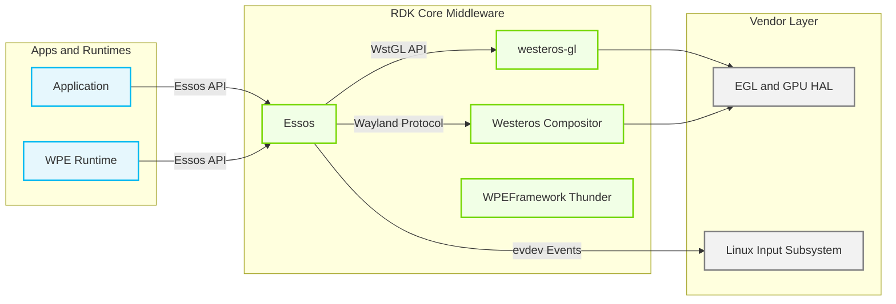
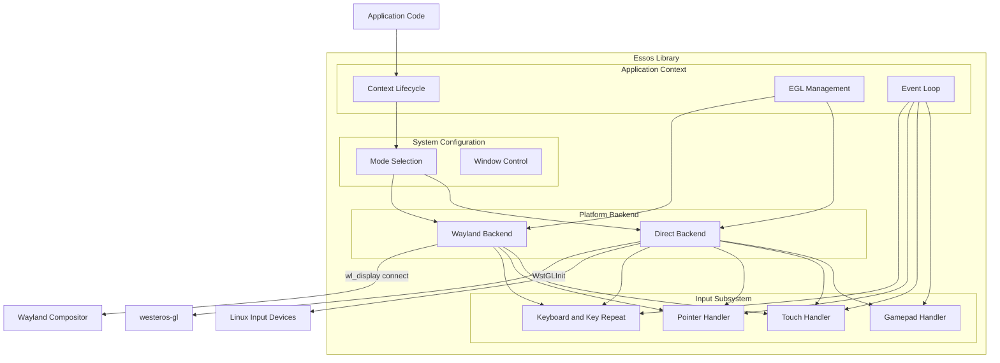
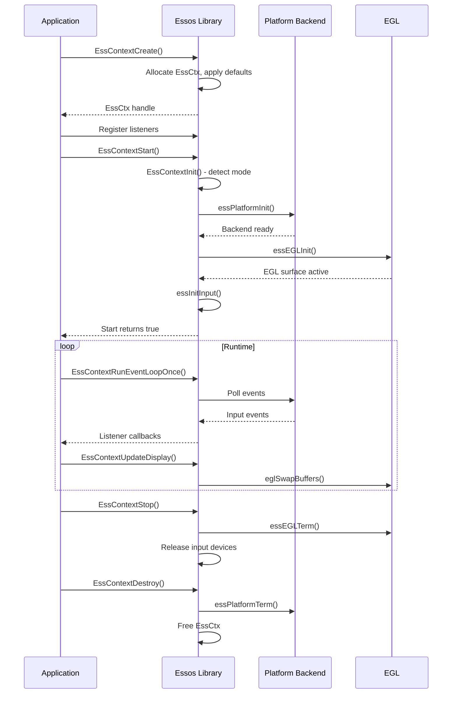
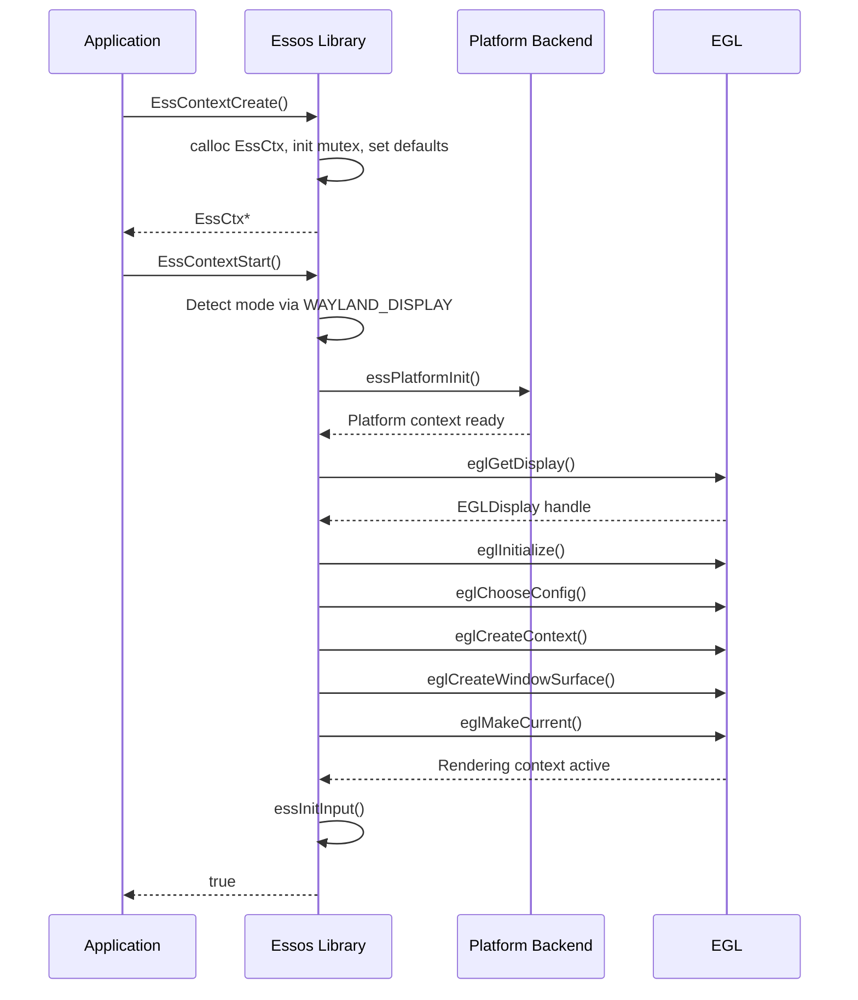
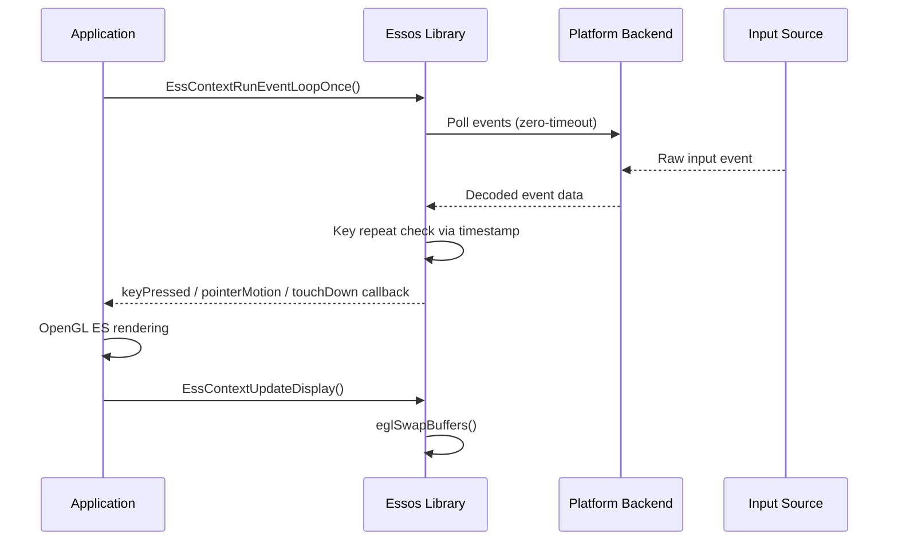
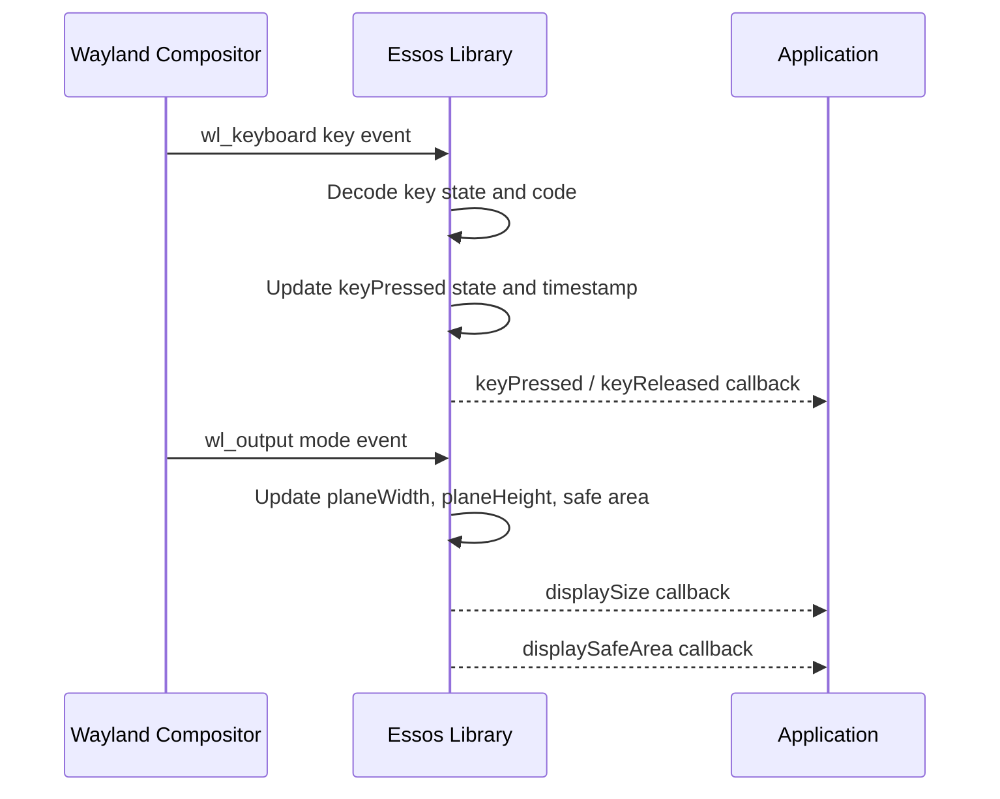
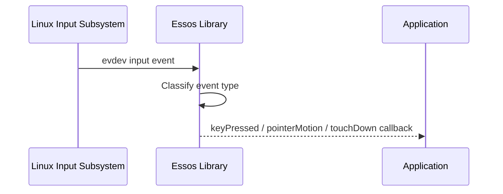

# Essos

Essos is a C library that abstracts the platform-level complexity of creating single-window, OpenGL ES2 rendering applications in the RDK middleware stack. It provides a unified context-based API that allows an application to target either a Wayland compositor or a native EGL surface without changing the application logic. At startup, Essos automatically selects the appropriate rendering backend based on the runtime environment, and it manages the full lifecycle of the EGL display, surface, and context on the application's behalf. Beyond graphics setup, Essos routes keyboard, pointer, touch, and gamepad input to the application through a set of listener callback interfaces, shielding the application from the differences between Wayland seat protocol and Linux evdev input handling.

Within the RDK stack, Essos sits at the boundary between application code and the graphics/input infrastructure. In Wayland mode it operates as a Wayland client, connecting to the Westeros compositor to receive display geometry updates and input events. In direct mode it uses westeros-gl, the RDK graphics abstraction layer, to obtain a native EGL window and to register for display-size-change notifications directly from the platform. This dual-mode design means that a single application binary can run both as an embedded Wayland surface managed by Westeros and as a standalone full-screen EGL application, depending solely on the availability of a Wayland display at runtime.

At the module level, Essos exposes three header-level subsystems to callers: the application context API for lifecycle and EGL management, the system configuration API for mode selection, window geometry, and EGL attribute control, and the gamepad API for controller discovery and event delivery. All state is encapsulated inside an opaque `EssCtx` handle, and all operations on that handle are protected by an internal mutex, allowing the application's render thread to coexist safely with asynchronous callbacks.



**Key Features & Responsibilities:**

- **Dual-mode rendering backend**: Supports running as either a Wayland client or a direct native EGL application, with automatic mode detection via the `WAYLAND_DISPLAY` environment variable at initialization time.
- **EGL lifecycle management**: Performs the full EGL setup sequence — display acquisition, configuration selection, context creation, and window surface creation — on behalf of the application, while also allowing applications to take over EGL creation manually.
- **Unified input routing**: Delivers keyboard, pointer, multi-touch (up to ten simultaneous contacts), and gamepad events to the application through typed listener callback structures, abstracting the difference between Wayland seat input and Linux evdev input.
- **Gamepad discovery and hotplug**: Monitors `/dev/input/` for gamepad devices using inotify in direct mode and notifies the application of connect and disconnect events; provides button and axis maps using Linux input identifiers.
- **Display geometry and safe-area notification**: Receives display size and safe-area information from the platform (either via the Wayland output protocol or the westeros-gl display-size callback) and forwards it to the application through the settings listener interface.
- **Window position and focus control**: In Wayland mode with an extended shell protocol, allows the application to set its window geometry and request input focus programmatically.
- **Key repeat generation**: Implements software key repeat with a configurable initial delay and repeat period, generating repeat events independently of the underlying input source.

---

## Design

Essos is designed around a single opaque context object (`EssCtx`) that aggregates all rendering, input, and platform state for one application window. The design principle is to minimise the boilerplate an application must write to go from process start to a rendering loop: after creating and starting a context, the application only needs to call the event loop function and the display update function on each frame. The context guards all shared state with a single mutex, which keeps the threading contract simple and explicit. Platform differences are encapsulated behind two compile-time code paths — a Wayland path and a direct (westeros-gl) path — selected by `HAVE_WAYLAND` and `HAVE_WESTEROS` preprocessor flags respectively, so the rest of the code remains platform-neutral.

The northbound interface is the public C API defined in `essos-app.h`, `essos-system.h`, and `essos-game.h`. Applications register typed listener structures containing function pointers; Essos invokes those pointers synchronously inside `EssContextRunEventLoopOnce()` on the application's thread. Callbacks are delivered on the application's own thread, so no additional synchronisation is needed between the application's render state and Essos callbacks.

The southbound interface in Wayland mode is the standard Wayland client protocol: Essos connects to the compositor display, binds `wl_compositor`, `wl_seat`, `wl_output`, `wl_shell`, and optionally `wl_simple_shell`, and registers listeners for each. In direct mode the southbound interface is westeros-gl, which is accessed both through its static API (`WstGLInit`, `WstGLCreateNativeWindow`) and through optional symbol lookup at runtime via `dlopen("libwesteros_gl.so.0.0.0")` for extended capabilities such as display-size listener registration, safe-area query, display capabilities query, and mode setting. This runtime lookup means Essos can operate even when those extended symbols are absent.

EGL setup in the automatic path follows the standard sequence: `eglGetDisplay` → `eglInitialize` → `eglChooseConfig` (matching the desired RGBA component sizes exactly) → `eglCreateContext` → `eglCreateWindowSurface` → `eglMakeCurrent`. The display type passed to `eglGetDisplay` is the native Wayland display handle in Wayland mode and `EGL_DEFAULT_DISPLAY` in direct mode, with westeros-gl providing the underlying native window. Applications that require control over EGL configuration can override the default attribute arrays for config selection, surface creation, and context creation before starting.



#### Threading Model

- **Threading Architecture**: Single-threaded event-driven
- **Main Thread**: The application's render thread owns the `EssCtx`. All public API calls, event processing, and listener callbacks execute on this thread. `EssContextRunEventLoopOnce()` must be called regularly from the same thread that called `EssContextStart()`.
- **Synchronization**: A single `pthread_mutex_t` embedded in `EssCtx` protects all fields that can be read or written by public API calls. The mutex is locked and unlocked inside each API function. Listener callbacks are invoked with the mutex released, so an application callback may safely call back into the Essos API.
- **Async / Event Dispatch**: In Wayland mode, the event loop polls the Wayland display file descriptor with `poll()` at zero timeout and then dispatches pending events synchronously before returning to the caller. In direct mode, evdev file descriptors for all open input devices are polled similarly. Key repeat events are generated synthetically inside the event loop based on wall-clock timestamps, so no additional timer mechanism is required.

### Prerequisites and Dependencies

#### Platform and Integration Requirements

- **Build Dependencies**: `wayland-client` (>= 1.6.0), `wayland-egl`, `libxkbcommon` (>= 0.5.0), EGL (any version). When the `westeros` package config is enabled: `westeros-simpleshell` client library and a platform-provided `virtual/westeros-soc` implementation.
- **Device Services / HAL**: westeros-gl provides the native-window and display-geometry HAL abstraction in direct mode. The extended capabilities (`_WstGLAddDisplaySizeListener`, `_WstGLGetDisplaySafeArea`, `_WstGLGetDisplayCaps`, `_WstGLSetDisplayMode`) are loaded at runtime via `dlopen` and are optional.

---

### Component State Flow

#### Initialization to Active State

Essos transitions through the following states during its lifecycle: **Uninitialized** (context allocated, defaults set) → **Initialized** (platform backend connected, display type resolved) → **Running** (EGL active, input devices open, event loop accepting calls) → **Stopped** (EGL torn down, input devices released) → **Destroyed** (all memory freed).

When `EssContextStart()` is called, Essos first checks whether `EssContextInit()` has already been executed; if not, it runs initialization inline. Initialization resolves the operating mode by inspecting the `WAYLAND_DISPLAY` environment variable if auto-mode is active: presence of the variable selects the Wayland backend; absence selects the direct backend. The chosen platform backend is then set up (Wayland display connection or westeros-gl context creation). After initialization, `EssContextStart()` proceeds to set up EGL and open input devices, at which point the context is marked running.



#### Runtime State Changes

**State Change Triggers:**

- A display size or mode change from the platform (westeros-gl callback or Wayland `wl_output.mode` event) sets an internal `resizePending` flag. On the next call to `EssContextRunEventLoopOnce()`, the pending resize is processed and the `displaySize` and `displaySafeArea` callbacks of the settings listener are invoked.
- A Wayland display connection error (detected via `POLLERR` or `POLLHUP` on the Wayland file descriptor, or a failed `wl_display_read_events`) causes the terminate listener's `terminated` callback to be invoked, signalling the application to shut down.
- In direct mode, inotify watches `/dev/input/` and detects device additions and removals, updating the set of open input file descriptors and notifying the application of gamepad connect or disconnect events via the gamepad connection listener.

**Context Switching Scenarios:**

- If the application calls `EssContextSetWindowFocus()`, Essos sends a `wl_simple_shell_set_focus` request to the Westeros compositor, transferring keyboard and pointer focus to this application's surface. This is relevant when multiple Essos clients are connected to the same compositor.
- Display mode changes requested via `EssContextSetDisplayMode()` are forwarded to westeros-gl in direct mode when the platform reports mode-setting capability via `WstGLDisplayCap_modeset`; in Wayland mode, display mode is managed by the compositor.

---

### Call Flows

#### Initialization Call Flow



#### Request Processing Call Flow

The primary runtime call flow is the per-frame event loop iteration. The application calls `EssContextRunEventLoopOnce()`, which polls for pending input or compositor events without blocking. Any received events are decoded and routed to the registered listener callbacks before the function returns. The application then performs its OpenGL ES rendering and calls `EssContextUpdateDisplay()` to swap the front and back buffers.



---

## Internal Modules

| Module / Class           | Description                                                                                                                                                                                                                                    | Key Files                     |
| ------------------------ | ---------------------------------------------------------------------------------------------------------------------------------------------------------------------------------------------------------------------------------------------- | ----------------------------- |
| `EssCtx`                 | Central context structure holding all rendering, input, and platform state. Every public API operates on this handle under mutex protection.                                                                                                   | `essos.cpp`                   |
| Application Context API  | Provides the full lifecycle API: context creation and destruction, EGL setup (automatic and manual), event loop execution, display update, listener registration for keyboard, pointer, touch, settings, terminate, and gamepad connection.    | `essos-app.h`, `essos.cpp`    |
| System Configuration API | Exposes mode selection (Wayland or direct), display size and safe-area queries, window geometry control, input focus, key repeat parameters, EGL attribute overrides, swap interval, and display mode setting.                                 | `essos-system.h`, `essos.cpp` |
| Gamepad API              | Discovers gamepad devices by examining event device capabilities, builds button and axis maps from Linux input identifiers, and delivers button and axis change events through a per-gamepad listener.                                         | `essos-game.h`, `essos.cpp`   |
| Wayland Backend          | Connects to the Wayland compositor display, binds the compositor, seat, shell, output, and optional extended shell globals, and processes keyboard, pointer, and touch events from the seat. Keyboard keymaps are decoded with `libxkbcommon`. | `essos.cpp`                   |
| Direct Backend           | Initialises a westeros-gl context (`WstGLInit`), registers for display size change notifications, and reads input events directly from `/dev/input/` device nodes. Uses inotify to monitor device lifecycle changes.                           | `essos.cpp`                   |
| EGL Manager              | Implements the full EGL setup and teardown sequence. Selects an EGL configuration that matches the requested component sizes, creates the EGL context and window surface, and calls `eglSwapBuffers` on each display update.                   | `essos.cpp`                   |
| Input Device Manager     | Opens and polls character device files under `/dev/input/`, reads metadata (device number, physical address, bus/vendor/product IDs), classifies devices as gamepads or generic input, and decodes key, pointer, and touch events.             | `essos.cpp`                   |
| Version                  | Defines the library version constants (`ESSOS_VERSION_MAJOR`, `ESSOS_VERSION_MINOR`, `ESSOS_VERSION_PATCH`). Current version is 2.1.1.                                                                                                         | `essos-version.h`             |

---

## Component Interactions

Essos delivers all output to the calling application through synchronous callback invocations. Its southbound interactions are with the Wayland protocol stack, westeros-gl, the Linux input subsystem, and EGL.

### Interaction Matrix

| Target Component / Layer      | Interaction Purpose                                                                                                                                                | Key APIs / Topics                                                                                                                                   |
| ----------------------------- | ------------------------------------------------------------------------------------------------------------------------------------------------------------------ | --------------------------------------------------------------------------------------------------------------------------------------------------- |
| **Wayland Compositor**        |                                                                                                                                                                    |                                                                                                                                                     |
| `wl_compositor`               | Create the application's Wayland surface                                                                                                                           | `wl_compositor_create_surface()`                                                                                                                    |
| `wl_shell`                    | Attach a shell surface and set the toplevel role                                                                                                                   | `wl_shell_get_shell_surface()`, `wl_shell_surface_set_toplevel()`                                                                                   |
| `wl_seat`                     | Bind keyboard, pointer, and touch capabilities                                                                                                                     | `wl_seat_get_keyboard()`, `wl_seat_get_pointer()`, `wl_seat_get_touch()`                                                                            |
| `wl_output`                   | Receive display resolution and mode from the compositor                                                                                                            | `wl_output` listener: `mode` callback                                                                                                               |
| `wl_simple_shell`             | Set surface name, geometry, and input focus (Westeros extension)                                                                                                   | `wl_simple_shell_set_name()`, `wl_simple_shell_set_geometry()`, `wl_simple_shell_set_focus()`                                                       |
| **westeros-gl (direct mode)** |                                                                                                                                                                    |                                                                                                                                                     |
| westeros-gl static API        | Initialise and terminate the GL platform context; create and destroy the native EGL window                                                                         | `WstGLInit()`, `WstGLTerm()`, `WstGLCreateNativeWindow()`, `WstGLDestroyNativeWindow()`                                                             |
| westeros-gl extended API      | Register for display size change callbacks; query safe area and display capabilities; set display mode                                                             | `_WstGLAddDisplaySizeListener()`, `_WstGLGetDisplaySafeArea()`, `_WstGLGetDisplayCaps()`, `_WstGLSetDisplayMode()`                                  |
| **EGL**                       |                                                                                                                                                                    |                                                                                                                                                     |
| EGL API                       | Obtain and initialise the EGL display, select a matching config, create a rendering context and window surface, make the context current, and perform buffer swaps | `eglGetDisplay()`, `eglInitialize()`, `eglChooseConfig()`, `eglCreateContext()`, `eglCreateWindowSurface()`, `eglMakeCurrent()`, `eglSwapBuffers()` |
| **Linux Input Subsystem**     |                                                                                                                                                                    |                                                                                                                                                     |
| `/dev/input/` (direct mode)   | Open event device files, read input events, and detect gamepad presence via ioctl capability queries                                                               | `open()`, `poll()`, `read()`, `ioctl(EVIOCGBIT, EVIOCGID, EVIOCGNAME, EVIOCGPHYS, EVIOCGUNIQ, EVIOCGVERSION)`                                       |
| inotify (direct mode)         | Monitor `/dev/input/` for device arrival and removal events                                                                                                        | `inotify_init()`, `inotify_add_watch()`                                                                                                             |

### Events Published

All output from Essos is delivered to the hosting application through the listener callback interfaces registered on the context. The table below summarises each callback, its trigger condition, and the recipient.

| Callback Interface                                                     | Trigger Condition                                                                                     | Delivered To                    |
| ---------------------------------------------------------------------- | ----------------------------------------------------------------------------------------------------- | ------------------------------- |
| `EssKeyListener.keyPressed`                                            | A key-down event is received from the Wayland keyboard or an evdev device                             | Registered application callback |
| `EssKeyListener.keyReleased`                                           | A key-up event is received                                                                            | Registered application callback |
| `EssKeyListener.keyRepeat`                                             | Key held beyond `keyRepeatInitialDelay` ms; repeated every `keyRepeatPeriod` ms thereafter            | Registered application callback |
| `EssKeyAndMetadataListener` variants                                   | Same triggers as `EssKeyListener` but includes `EssInputDeviceMetadata` identifying the source device | Registered application callback |
| `EssPointerListener.pointerMotion`                                     | Pointer position change event received                                                                | Registered application callback |
| `EssPointerListener.pointerButtonPressed` / `pointerButtonReleased`    | Pointer button state change received                                                                  | Registered application callback |
| `EssTouchListener.touchDown / touchUp / touchMotion / touchFrame`      | Touch contact events received (up to 10 simultaneous contacts)                                        | Registered application callback |
| `EssSettingsListener.displaySize`                                      | Display resolution reported or changed by compositor or platform                                      | Registered application callback |
| `EssSettingsListener.displaySafeArea`                                  | Safe area rectangle updated following a display size change                                           | Registered application callback |
| `EssTerminateListener.terminated`                                      | Wayland connection error detected                                                                     | Registered application callback |
| `EssGamepadConnectionListener.connected / disconnected`                | Gamepad device added to or removed from `/dev/input/`                                                 | Registered application callback |
| `EssGamepadEventListener.buttonPressed / buttonReleased / axisChanged` | Gamepad button or axis event received                                                                 | Registered per-gamepad callback |

### IPC Flow Patterns

**Wayland Event Flow:**

Wayland protocol messages from the compositor are the primary asynchronous input source in Wayland mode. Essos polls the Wayland display file descriptor on each event loop iteration and dispatches pending messages synchronously.



**Direct Mode Input Flow:**

In direct mode, Essos reads raw events from Linux input device file descriptors opened from `/dev/input/`, classifying and dispatching each event to the appropriate listener.



---

## Implementation Details

### Major HAL APIs Integration

| HAL / DS API                     | Purpose                                                                | Implementation File |
| -------------------------------- | ---------------------------------------------------------------------- | ------------------- |
| `WstGLInit()`                    | Create the westeros-gl platform context for direct EGL mode            | `essos.cpp`         |
| `WstGLTerm()`                    | Release the westeros-gl platform context on shutdown                   | `essos.cpp`         |
| `WstGLCreateNativeWindow()`      | Allocate a native EGL window of the specified dimensions               | `essos.cpp`         |
| `WstGLDestroyNativeWindow()`     | Free the native EGL window                                             | `essos.cpp`         |
| `_WstGLAddDisplaySizeListener()` | Register a callback to receive display resolution change notifications | `essos.cpp`         |
| `_WstGLGetDisplaySafeArea()`     | Query the visible safe area rectangle from the platform                | `essos.cpp`         |
| `_WstGLGetDisplayCaps()`         | Query platform display capabilities, including mode-setting support    | `essos.cpp`         |
| `_WstGLSetDisplayMode()`         | Request a display mode change when the platform supports it            | `essos.cpp`         |

### Key Implementation Logic

- **State / Lifecycle Management**: Context state is tracked through three boolean flags in `EssCtx`: `isInitialized`, `isRunning`, and `isExternalEGL`. The initialization and start functions check these flags before proceeding, ensuring idempotent behaviour. Shutdown releases resources in reverse order: input devices first, then EGL surfaces and context, then the platform backend.
  - Core implementation: `essos.cpp` (`EssContextCreate`, `EssContextInit`, `EssContextStart`, `EssContextStop`, `EssContextDestroy`)

- **Event Processing**: In Wayland mode, `essProcessRunWaylandEventLoopOnce()` calls `wl_display_flush()`, `wl_display_dispatch_pending()`, and then polls the Wayland file descriptor with zero timeout before dispatching any new events. In direct mode, `essProcessInputDevices()` polls all open evdev file descriptors, reads available event structs, and routes each to the appropriate handler. Key repeat is evaluated in both modes by comparing the current wall-clock time against the timestamp of the last key-down event using `essGetCurrentTimeMillis()` (backed by `gettimeofday`).

- **Error Handling Strategy**: Errors are recorded as null-terminated strings in the `lastErrorDetail` field of `EssCtx`, accessible via `EssContextGetLastErrorDetail()`. Public API functions return a `bool` indicating success or failure; on failure the caller should retrieve the detail string for logging. EGL errors are reported with the `eglGetError()` hex code. Errors from platform or EGL calls cause the affected operation to return `false`, at which point the error detail string holds the diagnostic information.

- **Logging and Diagnostics**: Essos uses an internal logging function (`essLog`) that writes to `stderr`. The active log level is controlled by the `ESSOS_DEBUG` environment variable (integer 0–4). At level 0 only fatal and error messages appear; levels 1 through 4 add warnings, info, debug, and trace respectively. The default level is 2 (info). The library identifies itself in log output with the prefix `"westeros (essos)"` and includes its version string on context creation.

---

## Configuration

### Key Configuration Parameters

| Parameter                             | Type             | Default | Description                                                                                                               |
| ------------------------------------- | ---------------- | ------- | ------------------------------------------------------------------------------------------------------------------------- |
| `ESSOS_DEBUG`                         | int (env var)    | `2`     | Sets the log verbosity level. 0 = fatal/error only; 2 = info; 4 = trace.                                                  |
| `WAYLAND_DISPLAY`                     | string (env var) | unset   | Presence of this variable causes auto-mode to select the Wayland backend.                                                 |
| `ESSOS_NO_EVENT_LOOP_THROTTLE`        | flag (env var)   | unset   | When set, disables the 16 ms event loop period throttle.                                                                  |
| `ESSOS_DIRECT_NO_EVENT_LOOP_THROTTLE` | flag (env var)   | unset   | Disables event loop throttle specifically for the direct EGL mode.                                                        |
| Key repeat initial delay              | int (ms)         | `500`   | Time in milliseconds from key-down until the first repeat event. Configurable via `EssContextSetKeyRepeatInitialDelay()`. |
| Key repeat period                     | int (ms)         | `100`   | Interval in milliseconds between successive repeat events. Configurable via `EssContextSetKeyRepeatPeriod()`.             |
| EGL swap interval                     | `EGLint`         | `1`     | EGL buffer swap interval. Configurable via `EssContextSetSwapInterval()`.                                                 |
| Default plane width                   | int (pixels)     | `1280`  | Initial display plane width before a platform size notification is received.                                              |
| Default plane height                  | int (pixels)     | `720`   | Initial display plane height before a platform size notification is received.                                             |
| Safe border                           | int (percent)    | `5`     | Percentage of each edge excluded from the safe area when no platform-specific safe area is provided.                      |

### Runtime Configuration

Window geometry and focus can be adjusted while the context is running:

```
EssContextSetWindowPosition(ctx, x, y);
EssContextResizeWindow(ctx, width, height);
EssContextSetWindowFocus(ctx);
```

Display mode can be changed at runtime in direct mode if the platform reports mode-setting capability:

```
EssContextSetDisplayMode(ctx, "1920x1080p60");
```
