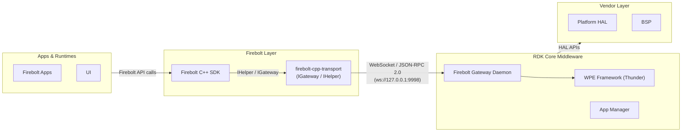
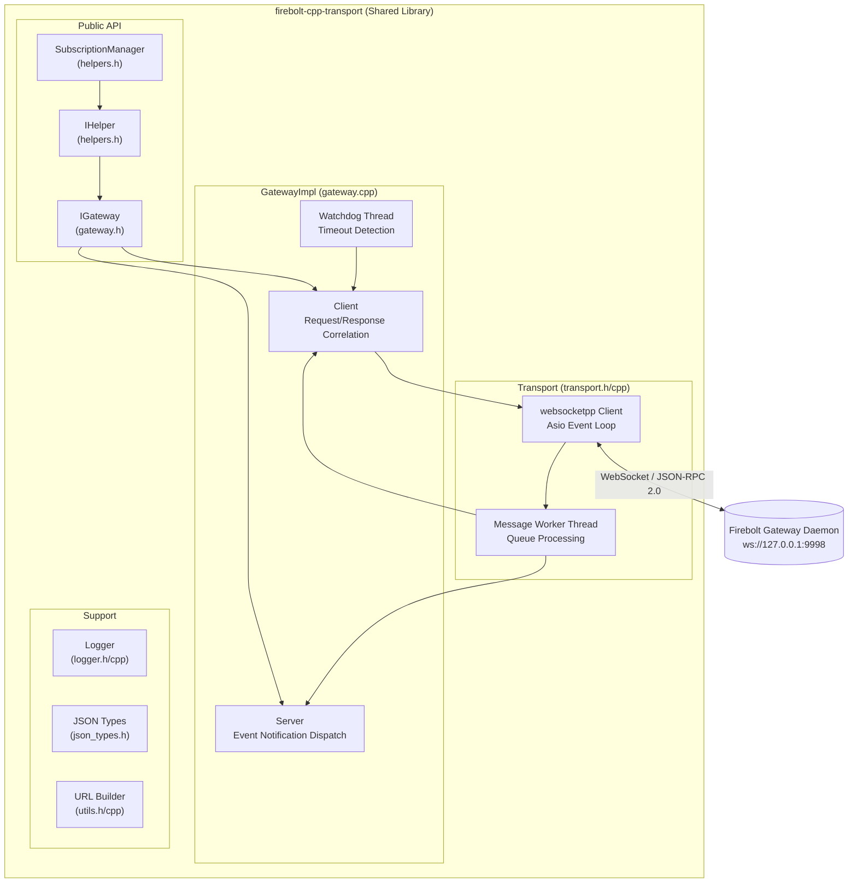
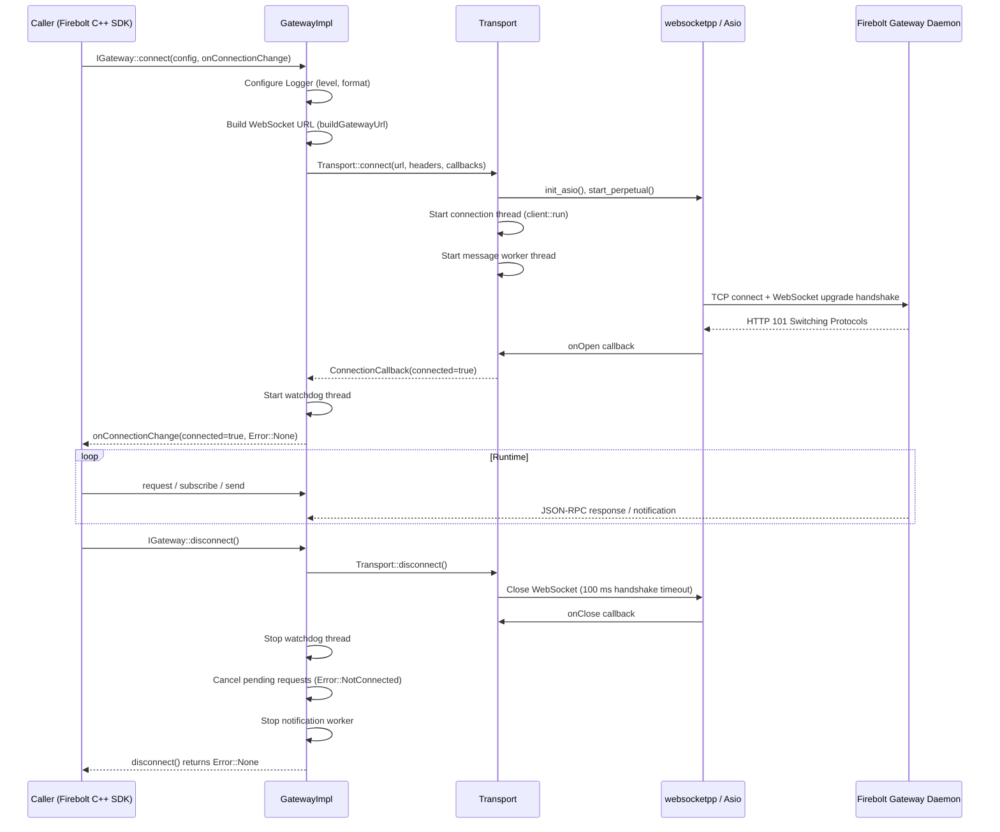
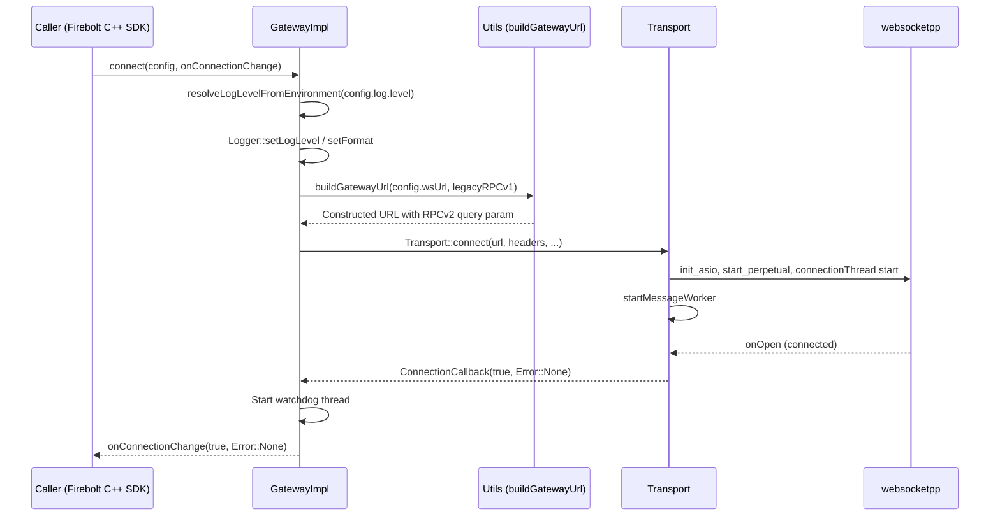
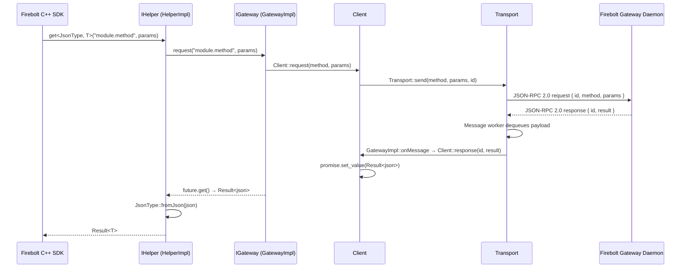
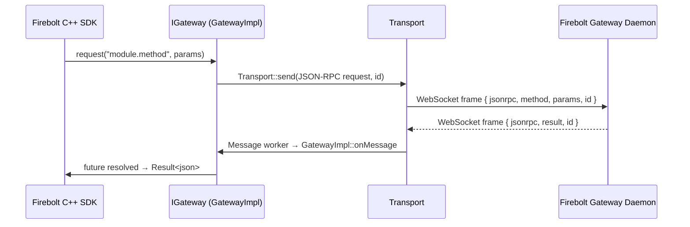
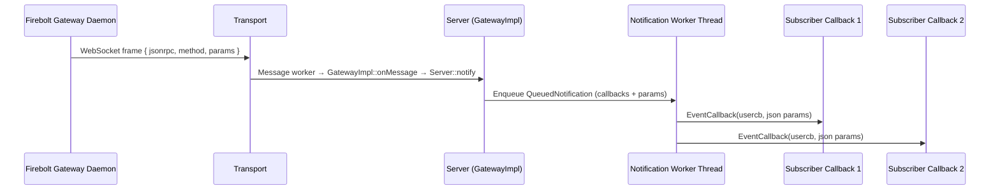

# firebolt-cpp-transport

`firebolt-cpp-transport` is a C++17 shared library that provides the WebSocket and JSON-RPC 2.0 transport layer shared by all Firebolt C++ SDKs. It abstracts connection management, request/response correlation, and event subscriptions, enabling higher-level SDK layers to work exclusively with typed method calls while the library manages wire-level messaging.

The library exposes two public interfaces: `IGateway`, which handles raw JSON-RPC framing over WebSocket, and `IHelper`, a typed wrapper that maps Firebolt SDK method calls onto `IGateway` operations. Applications and Firebolt C++ SDKs access these interfaces via `GetGatewayInstance()` and `GetHelperInstance()`.

At the device level, the library establishes an outbound-only WebSocket connection to a Firebolt gateway daemon running on the same device. All communication uses JSON-RPC 2.0 messages. The library is a pure-software component whose sole external runtime dependency is the Firebolt gateway endpoint.



**Key Features & Responsibilities:**

- **WebSocket Connection Management**: Establishes and maintains an outbound WebSocket connection to the Firebolt gateway daemon, tracking the full lifecycle from `NotStarted` through `Connecting`, `Connected`, and `Disconnected` states.
- **JSON-RPC 2.0 Request/Response Correlation**: Assigns unique message IDs to outgoing requests and matches incoming responses to the corresponding caller futures, surfacing results via `std::future<Result<T>>`.
- **Event Subscription and Dispatch**: Registers named event callbacks via `IGateway::subscribe()` and dispatches incoming JSON-RPC notifications to registered handlers on a dedicated notification worker thread.
- **Typed Helper Interface**: `IHelper` and `SubscriptionManager` wrap `IGateway` to provide type-safe property get/set, method invocation, and RAII subscription lifecycle management for SDK consumers.
- **Watchdog and Timeout Enforcement**: A dedicated watchdog thread periodically scans pending requests and fulfils their promises with `Error::Timedout` when the configured `waitTime_ms` threshold is exceeded.
- **Configurable Logging**: A built-in logger (`Firebolt::Logger`) with configurable log level, format flags (timestamp, thread ID, source location, function name), and output target controlled by `FIREBOLT_TRANSPORT_LOG_LEVEL` and `FIREBOLT_TRANSPORT_LOG_FILE` environment variables.
- **Custom HTTP Header Injection**: Supports injecting custom HTTP headers (for example, `Authorization`) during the WebSocket upgrade handshake and retrieving server response headers after connection.
- **Legacy Protocol Support**: A build-time and runtime flag (`legacyRPCv1`) enables compatibility with older event notification wire formats.

---

## Design

The library is structured as a layered stack. The outermost layer (`IHelper` / `SubscriptionManager`) provides a type-safe, RAII-managed interface that maps SDK-level operations to JSON-RPC method names and typed JSON deserializers. Beneath that, `IGateway` (implemented by `GatewayImpl`) owns the JSON-RPC protocol logic: it generates message IDs, tracks outstanding promises in a `Client` sub-object, manages event listeners in a `Server` sub-object, and runs a watchdog thread that enforces request timeouts. The innermost layer (`Transport`) owns the WebSocket connection using `websocketpp` with an Asio event loop and decouples received message payloads from protocol processing through an internal message queue.

Northbound callers interact only through the `IGateway` and `IHelper` abstract interfaces. Implementation types are kept internal; `GetGatewayInstance()` and `GetHelperInstance()` return stable references scoped to the process lifetime. All data flow through these interfaces is outbound toward the Firebolt gateway daemon.

The southbound boundary is a single outbound WebSocket connection to the Firebolt gateway daemon. The connection URL, retry policy, and timeout parameters are all supplied through the `Firebolt::Config` struct passed to `IGateway::connect()`.

The library holds in-memory state: the current connection handle, the pending request map, and the registered event callback list. This state is reset on `disconnect()`.



#### Threading Model

- **Threading Architecture**: Multi-threaded — four distinct threads collaborate to decouple I/O, message processing, event dispatch, and timeout enforcement.
- **Connection Thread** (`connectionThread_` in `Transport`): Runs the `websocketpp` Asio event loop (`client::run()`). Handles WebSocket open, close, fail, and message events. Invokes `onConnectionChange` callbacks on the calling thread for the initial result; subsequent connection-change callbacks fire on this thread.
- **Message Worker Thread** (`messageWorkerThread_` in `Transport`): Dequeues raw JSON payloads from `messageQueue_` and forwards parsed `nlohmann::json` objects to `GatewayImpl::onMessage()`. This thread owns the parse step and keeps the connection thread unblocked.
- **Notification Worker Thread** (`notificationWorkerThread_` in `Server`): Dequeues `QueuedNotification` entries and invokes registered `EventCallback` functions. Running callbacks on this separate thread prevents event handlers from blocking or deadlocking the message worker.
- **Watchdog Thread** (`watchdogThread` in `GatewayImpl`): Sleeps for `watchdogCycle_ms` (default 500 ms) between iterations and calls `Client::checkPromises()` to expire pending requests older than `waitTime_ms` with `Error::Timedout`.
- **Synchronization**: `messageQueueMutex_` / `messageQueueCv_` guard the message queue; `notificationQueueMutex_` / `notificationQueueCv_` guard the notification queue; `queue_mtx` in `Client` guards the pending request map; `eventMap_mtx` in `Server` guards the event listener list; `responseHeadersMutex_` guards the response header map. Promises are fulfilled and event callbacks are invoked outside their respective locks to minimise contention and prevent deadlocks.
- **Async / Event Dispatch**: Callers receive a `std::future<Result<nlohmann::json>>` from `IGateway::request()`. The connection thread fulfils the promise when the matching response arrives or when the watchdog times it out. Event notifications are posted from the connection thread onto the notification queue and dispatched asynchronously on the notification worker thread.

### Prerequisites and Dependencies

#### Platform and Integration Requirements

- **Build Dependencies**: `nlohmann-json` (JSON serialization), `websocketpp` (WebSocket transport), `boost` (Asio backend for websocketpp). At runtime, `boost-system` is required.
- **Gateway Availability**: The Firebolt gateway daemon must be reachable at the configured WebSocket URL before `IGateway::connect()` returns. The configurable retry policy (`reconnect_max_attempts`, `reconnect_delay_ms`, `connect_attempt_timeout_ms`) supports environments where the gateway starts after the calling process.

---

### Component State Flow

#### Initialization to Active State

The library lifecycle begins when a caller invokes `IGateway::connect()` with a populated `Firebolt::Config`. The library configures the logger, constructs the WebSocket URL (appending `RPCv2=true` for the default JSON-RPC v2 mode), starts the Asio event loop on the connection thread, and initiates the WebSocket handshake. If the handshake succeeds, the watchdog thread is started and the `ConnectionChangeCallback` is invoked with `connected = true`. The library then enters its active state and is ready to process requests and event subscriptions.

The component transitions through the following states during its lifecycle: **NotStarted** (no connection attempt made) → **Connecting** (WebSocket handshake in progress; transport started, Asio running) → **Connected** (handling requests, responses, and event notifications; watchdog active) → **Disconnected** (connection closed or lost; pending requests cancelled; resources released).



#### Runtime State Changes

During normal operation the library reacts to WebSocket close or fail events delivered by the connection thread. On `onClose` or `onFail`, `GatewayImpl::onConnectionChange()` is invoked, which notifies the registered `ConnectionChangeCallback` with `connected = false`. Pending requests are cancelled with `Error::NotConnected`. The watchdog thread continues running until `disconnect()` is called explicitly.

**State Change Triggers:**

- **Gateway daemon disconnect**: When the remote gateway closes the WebSocket, the connection thread fires `onClose`. All pending `Client` promises are resolved with `Error::NotConnected`. Callers must invoke `IGateway::connect()` again to re-establish the connection.
- **Handshake failure / network error**: Reported via `onFail`. The transport transitions to `Disconnected` and the caller's `ConnectionChangeCallback` is invoked with the mapped `Firebolt::Error`.
- **Request timeout**: Detected by the watchdog thread. The promise for the timed-out request is resolved with `Error::Timedout`; the connection itself is not affected.

**Context Switching Scenarios:**

- **Reconnection**: Callers may call `IGateway::connect()` again after a disconnect. The previous `ConnectionChangeCallback` is replaced atomically and the watchdog restarts.
- **Log level override at runtime**: The `FIREBOLT_TRANSPORT_LOG_FILE` environment variable is re-evaluated on every log call, allowing the log destination to be redirected without reconnection. `FIREBOLT_TRANSPORT_LOG_LEVEL` is resolved once at connect time; a reconnect is required for level changes to take effect.

---

### Call Flows

#### Initialization Call Flow



#### Request Processing Call Flow

Incoming parameters are forwarded to `IGateway::request()`, which generates a unique message ID and stores a `std::promise` keyed by that ID in the `Client` pending map. The request is serialised to JSON-RPC 2.0 format and sent via `Transport::send()`. When the response arrives on the connection thread, the message worker dequeues and parses it; `Client::response()` matches the `id` field, removes the entry from the map, and fulfils the promise. The `std::future` returned to the caller becomes ready with a typed `Result<T>` value.



---

## Internal Modules

| Module / Class           | Description                                                                                                                                                                                                   | Key Files                                                                  |
| ------------------------ | ------------------------------------------------------------------------------------------------------------------------------------------------------------------------------------------------------------- | -------------------------------------------------------------------------- |
| `IGateway`               | Public abstract interface for JSON-RPC 2.0 over WebSocket. Exposes `connect`, `disconnect`, `send`, `request`, `subscribe`, `unsubscribe`, and `getResponseHeader`.                                           | `include/firebolt/gateway.h`                                               |
| `GatewayImpl`            | Concrete implementation of `IGateway`. Coordinates the `Client`, `Server`, `Transport`, and watchdog thread. Implements JSON-RPC message routing and connection lifecycle.                                    | `src/gateway.cpp`                                                          |
| `Client`                 | Tracks outstanding JSON-RPC requests. Maps message IDs to `std::promise` instances. Fulfils promises on response receipt. Cancels all pending promises on disconnect.                                         | `src/gateway.cpp`                                                          |
| `Server`                 | Maintains the registered event callback list. Routes incoming JSON-RPC notifications to matching subscribers via a dedicated notification worker thread.                                                      | `src/gateway.cpp`                                                          |
| `Transport`              | Manages the `websocketpp` client, Asio event loop, connection thread, and message worker thread. Translates WebSocket events into typed callbacks for `GatewayImpl`.                                          | `src/transport.h`, `src/transport.cpp`                                     |
| `IHelper` / `HelperImpl` | Typed wrapper over `IGateway`. Provides `get<T>`, `set`, `invoke`, `subscribe`, and `unsubscribe` with `Result<T>` returns and automatic JSON de/serialisation.                                               | `include/firebolt/helpers.h`, `src/helpers_impl.h`, `src/helpers_impl.cpp` |
| `SubscriptionManager`    | RAII helper that owns a set of subscriptions on behalf of a caller. Automatically calls `unsubscribeAll()` on destruction to prevent dangling callbacks.                                                      | `include/firebolt/helpers.h`, `src/helpers_impl.cpp`                       |
| `Logger`                 | Thread-safe, level-filtered logger. Writes formatted lines to stderr or a file. Supports syslog output when built with `ENABLE_SYSLOG`. Log level and output path are configurable via environment variables. | `include/firebolt/logger.h`, `src/logger.cpp`                              |
| `JSON Types`             | Template utilities for serialising/deserialising Firebolt data types. Provides `NL_Json_Basic<T>`, `BasicType<T>`, `NL_Json_Array<T>`, and `toString()` for enum mapping.                                     | `include/firebolt/json_types.h`                                            |
| `Utils`                  | URL construction helper. `buildGatewayUrl()` ensures the WebSocket URL contains a path component and appends the `RPCv2=true` query parameter when legacy mode is inactive.                                   | `src/utils.h`, `src/utils.cpp`                                             |

---

---

## Component Interactions

The library communicates with the Firebolt gateway daemon over a WebSocket connection. All interactions are client-initiated and outbound.

### Interaction Matrix

| Target Component / Layer | Interaction Purpose                                                                  | Key APIs / Topics                                                                                         |
| ------------------------ | ------------------------------------------------------------------------------------ | --------------------------------------------------------------------------------------------------------- |
| **External Systems**     |                                                                                      |                                                                                                           |
| Firebolt Gateway Daemon  | JSON-RPC 2.0 request / response and event notification exchange                      | `IGateway::request()`, `IGateway::send()`, `IGateway::subscribe()` over `ws://127.0.0.1:9998`             |
| **Callers (Northbound)** |                                                                                      |                                                                                                           |
| Firebolt C++ SDK         | Provides typed access to Firebolt platform capabilities via `IHelper` and `IGateway` | `IHelper::get<T>()`, `IHelper::set()`, `IHelper::invoke()`, `IHelper::subscribe()`, `IGateway::connect()` |

### Events Received

The library receives JSON-RPC notifications from the Firebolt gateway daemon and dispatches them to locally registered callbacks.

| Incoming Notification                                    | Source                  | Dispatch Mechanism                                                | Local Subscriber                              |
| -------------------------------------------------------- | ----------------------- | ----------------------------------------------------------------- | --------------------------------------------- |
| Any registered event name (e.g., `device.onNameChanged`) | Firebolt Gateway Daemon | `Server::notify()` → notification worker thread → `EventCallback` | Caller-registered via `IGateway::subscribe()` |

### IPC Flow Patterns

**Primary Request / Response Flow:**

The library accepts a method name and JSON parameters from the caller. It assigns a unique message ID, serialises the call as a JSON-RPC 2.0 request, and sends it over the WebSocket. When the matching response arrives, the message worker thread deserialises it and fulfils the caller's future.



**Event Notification Flow:**

Incoming JSON-RPC notifications (messages without an `id` field) are matched by method name to registered callbacks. The matched callbacks are enqueued to the notification worker thread, which invokes them asynchronously.



---

## Implementation Details

### Key Implementation Logic

- **State / Lifecycle Management**: Connection state is tracked via the `TransportState` enum (`NotStarted`, `Connecting`, `Connected`, `Disconnected`) held in an `std::atomic` field in `Transport`. State transitions are driven by `websocketpp` callbacks (`onOpen`, `onClose`, `onFail`). The `GatewayImpl` watchdog thread is started on successful connection and stopped on `disconnect()`.
  - Connection state: `src/transport.cpp`, `src/transport.h`
  - Watchdog and gateway lifecycle: `src/gateway.cpp`

- **Event Processing**: Incoming WebSocket frames are pushed onto `messageQueue_` (protected by `messageQueueMutex_`) and signalled via `messageQueueCv_`. The message worker thread dequeues and parses each frame as JSON. Frames with an `id` field are routed to `Client::response()`; frames without an `id` are treated as notifications and routed to `Server::notify()`. `Server::notify()` collects matching callbacks under `eventMap_mtx`, enqueues the notification to the notification worker thread, and returns immediately. The notification worker thread dispatches each callback, catching and logging all exceptions to prevent one faulty callback from blocking others.
  - Message queue and worker: `src/transport.cpp`
  - Notification queue and worker: `src/gateway.cpp`

- **Error Handling Strategy**: All public API calls return `Firebolt::Error` or `Result<T>`. JSON-RPC error responses are parsed defensively: missing or incorrectly typed `code` / `message` fields are replaced with safe defaults and logged as warnings. Websocketpp error codes are mapped to `Firebolt::Error` values in `mapError()`. Timed-out requests are fulfilled with `Error::Timedout` by the watchdog without disrupting the connection. Pending requests at disconnect time are fulfilled with `Error::NotConnected` via `Client::cancelAll()`.
  - Error mapping: `src/transport.cpp` (`mapError`)
  - Request timeout: `src/gateway.cpp` (`Client::checkPromises`)
  - Disconnect cancellation: `src/gateway.cpp` (`Client::cancelAll`)

- **Security — URL Credential Redaction**: Before logging, the transport strips userinfo (user:pass@) and query parameters from the WebSocket URL to prevent credentials or tokens from appearing in log output.
  - URL redaction: `src/transport.cpp`, `src/gateway.cpp`

- **Logging & Diagnostics**: Log lines are prefixed with `[FireboltNative|<module>|<level>]`. The log level and output path are read from `FIREBOLT_TRANSPORT_LOG_LEVEL` and `FIREBOLT_TRANSPORT_LOG_FILE` environment variables. The log level is resolved once per `connect()` call; the log file path is re-evaluated on every log call, allowing dynamic redirection. When built with `ENABLE_SYSLOG`, output is routed to the system logger. Log format options (timestamp, thread ID, function name, source location) are configured via `Firebolt::Config::log.format`.
  - Logger implementation: `src/logger.cpp`
  - Log format macros: `include/firebolt/logger.h`

---

## Configuration

### Key Configuration Parameters

| Parameter                    | Type                 | Default               | Description                                                                                                                                                        |
| ---------------------------- | -------------------- | --------------------- | ------------------------------------------------------------------------------------------------------------------------------------------------------------------ |
| `wsUrl`                      | `std::string`        | `ws://127.0.0.1:9998` | WebSocket URL of the Firebolt gateway daemon.                                                                                                                      |
| `headers`                    | `map<string,string>` | `{}`                  | Custom HTTP headers injected during the WebSocket upgrade handshake (for example, `Authorization`).                                                                |
| `waitTime_ms`                | `unsigned`           | `3000`                | Timeout in milliseconds for an individual JSON-RPC response. Requests older than this value are expired by the watchdog with `Error::Timedout`.                    |
| `legacyRPCv1`                | `bool`               | Build-time flag       | When `true`, enables compatibility with the legacy event notification wire format. Controlled at build time by `ENABLE_LEGACY_RPC_V1`; overridable per connection. |
| `log.level`                  | `LogLevel`           | `Info`                | Log verbosity. Overridden at connect time by `FIREBOLT_TRANSPORT_LOG_LEVEL` if set.                                                                                |
| `log.transportInclude`       | `optional<unsigned>` | unset                 | Bitmask of `websocketpp` log categories to enable.                                                                                                                 |
| `log.transportExclude`       | `optional<unsigned>` | unset                 | Bitmask of `websocketpp` log categories to suppress.                                                                                                               |
| `log.format.ts`              | `bool`               | `true`                | Include a timestamp in each log line.                                                                                                                              |
| `log.format.thread`          | `bool`               | `true`                | Include the calling thread ID in each log line.                                                                                                                    |
| `log.format.function`        | `bool`               | `true`                | Include the function name in each log line.                                                                                                                        |
| `log.format.location`        | `bool`               | `false`               | Include the source file and line number in each log line.                                                                                                          |
| `watchdogCycle_ms`           | `unsigned`           | `500`                 | Interval in milliseconds between watchdog scans for timed-out requests.                                                                                            |
| `reconnect_max_attempts`     | `unsigned`           | `0`                   | Number of additional connection attempts if the initial attempt fails. When set to `0`, a single connection attempt is made. Capped internally at 100.             |
| `reconnect_delay_ms`         | `unsigned`           | `1000`                | Delay in milliseconds between successive reconnect attempts.                                                                                                       |
| `connect_attempt_timeout_ms` | `unsigned`           | `10000`               | Maximum time in milliseconds for a single connection attempt (DNS + TCP + WebSocket handshake) before it is aborted and counted as a failure.                      |

### Runtime Configuration

Log level and output path can be adjusted via environment variables without recompilation:

```bash
# Override log level (resolved once at IGateway::connect() time; reconnect required for changes)
export FIREBOLT_TRANSPORT_LOG_LEVEL=debug   # values: off | error | warning | notice | info | debug | 0..4

# Redirect log output to a file (re-evaluated on every log call; relative paths are rejected)
export FIREBOLT_TRANSPORT_LOG_FILE=/var/log/firebolt-transport.log
```

### Configuration Persistence

The `Firebolt::Config` struct is consumed at `IGateway::connect()` time and held in memory for the duration of the connection. Restarting the process requires passing the configuration again on the next `connect()` call.

---

## Build-Time Configurations

The following CMake options are exposed as Yocto `PACKAGECONFIG` entries in the bb file and control library behaviour at build time:

| Yocto PACKAGECONFIG  | CMake Option              | Effect                                                                                                                                                                                                                                    |
| -------------------- | ------------------------- | ----------------------------------------------------------------------------------------------------------------------------------------------------------------------------------------------------------------------------------------- |
| `legacy-rpc-v1`      | `ENABLE_LEGACY_RPC_V1=ON` | Sets the compiled-in default of `Firebolt::Config::legacyRPCv1` to `true`. When enabled, the library uses the legacy event notification wire format and connects without appending the `RPCv2=true` query parameter to the WebSocket URL. |
| `disable-so-version` | `DISABLE_SO_VERSION=ON`   | Suppresses `SONAME` and `SOVERSION` properties on the shared library (`NO_SONAME ON`, version strings cleared). Useful for platforms where SONAME versioning is managed externally or not required.                                       |
