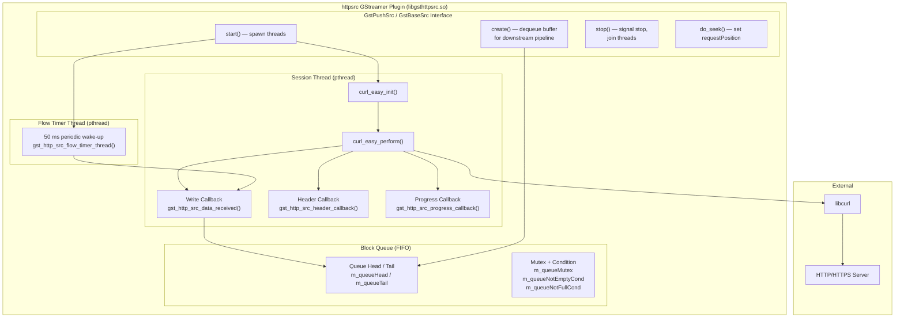
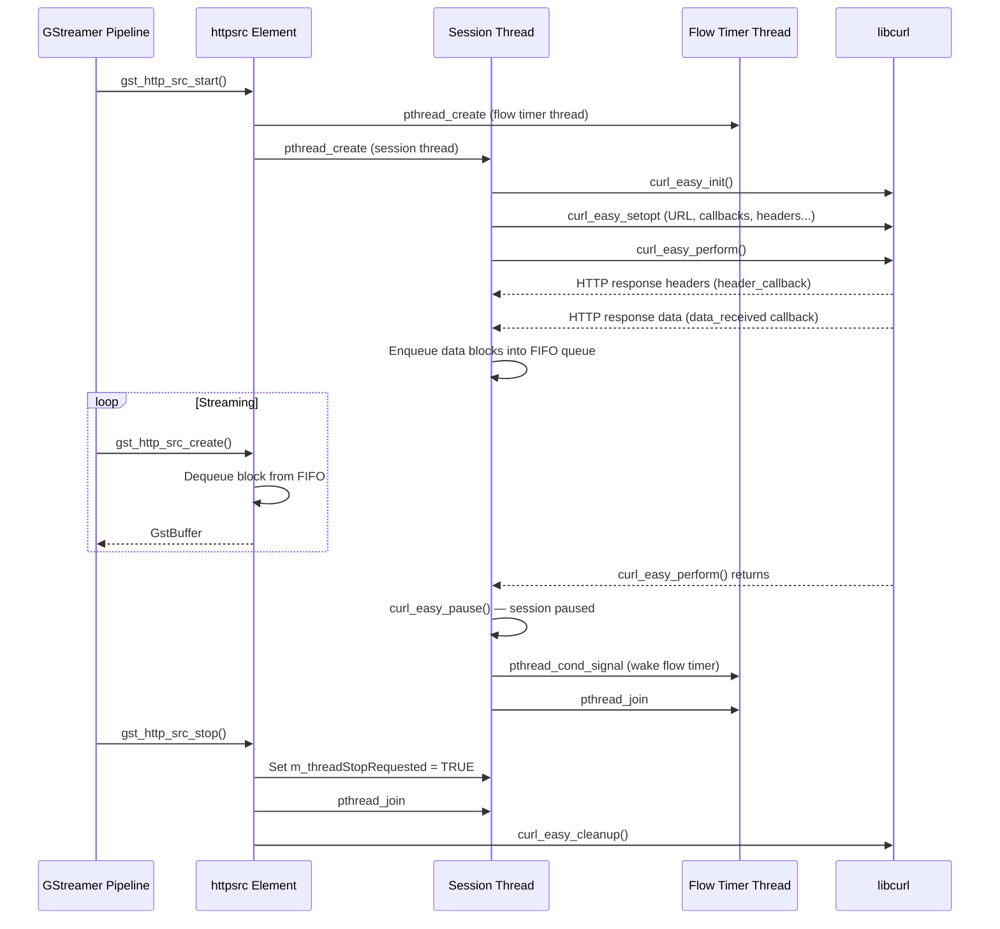
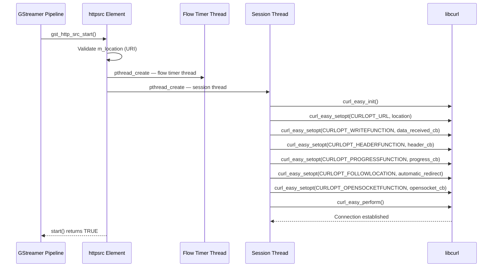
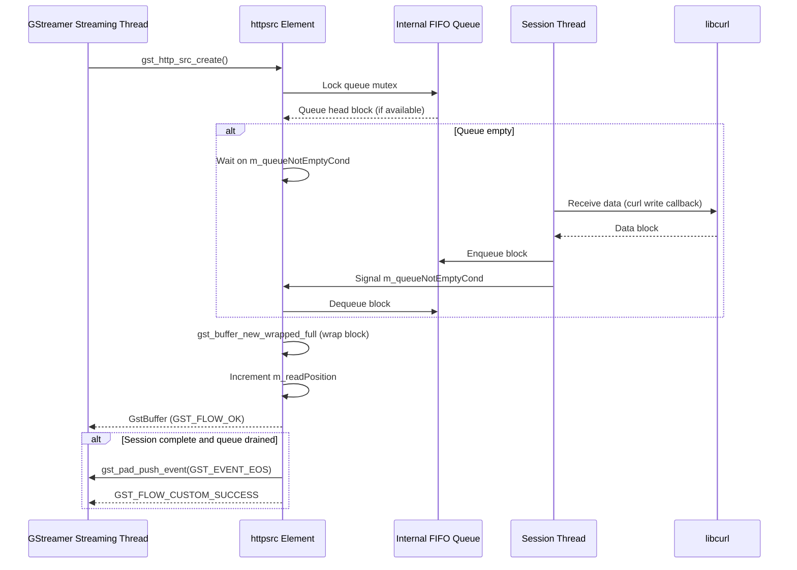
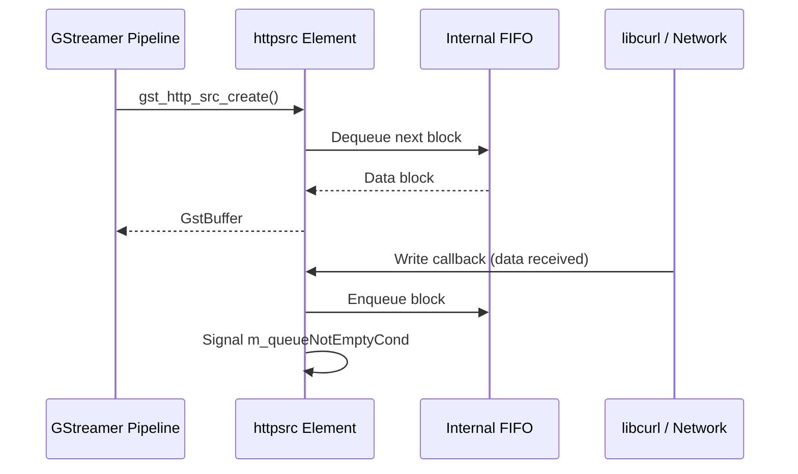
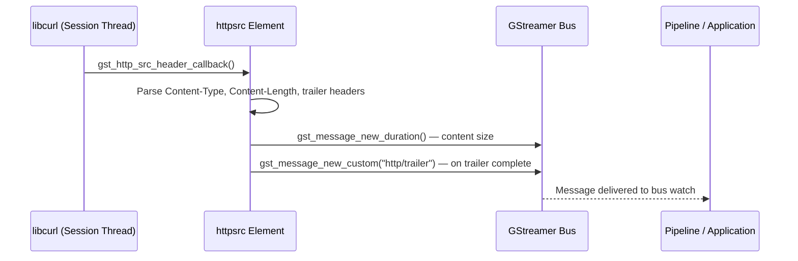

# gst-plugins-rdk

gst-plugins-rdk is a collection of RDK-specific GStreamer source plugins that extend the GStreamer media framework for use within the RDK middleware stack. The component currently provides the `httpsrc` plugin, which is a GStreamer push-source element responsible for fetching media content over HTTP and HTTPS using libcurl and delivering it downstream to the GStreamer pipeline.

The plugin enables the RDK media pipeline to retrieve live and on-demand content over HTTP, with support for byte-range seeking, chunked transfer encoding, proxy authentication, cookie management, custom request headers, and content-type-driven capability negotiation. It is designed to operate as a standards-compliant GStreamer URI handler for the `http://` and `https://` URI schemes.

At the platform level, the plugin is installed as a shared GStreamer plugin library (`libgsthttpsrc.so`) in the GStreamer plugin directory and is loaded automatically by the GStreamer plugin registry at runtime. It interacts with the network stack via libcurl, and with the GStreamer pipeline via the standard GstPushSrc and GstURIHandler interfaces.

```mermaid
flowchart LR

%% Styles
classDef Apps stroke:#00B9F1,fill:#E6F7FD,stroke-width:2px;
classDef RDKMW stroke:#75D701,fill:#F1FFE6,stroke-width:2px;
classDef VL stroke:#808080,fill:#F2F2F2,stroke-width:2px;

%% Apps Layer
    subgraph Apps["Apps & Runtimes"]
        FBApps["Firebolt Apps"]
        WPE_RT["WPE Runtime"]
    end

%% Middleware
    subgraph RDKMW["RDK Core Middleware"]
        AAMP["AAMP / Media Pipeline"]
        httpsrc["gst-plugins-rdk\n(httpsrc)"]
        GStreamer["GStreamer Framework"]
    end

%% Vendor Layer
    subgraph VL["Vendor Layer / Network"]
        CURL["libcurl"]
        NET["HTTP/HTTPS Network"]
    end

    Apps -->|Playback Request| AAMP
    AAMP -->|Pipeline Construction| GStreamer
    GStreamer -->|URI Source Element| httpsrc
    httpsrc -->|HTTP Transfer| CURL
    CURL -->|TCP/TLS| NET
```

**Key Features & Responsibilities:**

- **HTTP/HTTPS Media Retrieval**: Fetches media streams from remote servers using the `http://` and `https://` URI schemes, delivering data as GStreamer buffers to downstream pipeline elements.
- **Byte-Range Seek Support**: Supports random access and seek operations via HTTP Range requests; seekability is determined from the `Content-Length` response header.
- **Chunked Transfer and Live Source Mode**: Handles chunked HTTP transfer encoding and can operate as a live source (`is-live` property), enabling integration with live HLS and similar streaming formats.
- **Proxy and Authentication**: Supports HTTP proxy configuration with optional proxy credentials, as well as per-request user authentication via username and password properties.
- **Custom Request Headers and Cookie Management**: Allows downstream elements or applications to inject arbitrary HTTP request headers and cookies into each transfer session.
- **Content-Type Capability Negotiation**: Parses the HTTP `Content-Type` response header and sets corresponding GStreamer caps (e.g., `video/mpegts`, `video/vnd.dlna.mpeg-tts`) on the source pad.
- **Trailer Header Processing**: Monitors HTTP chunked trailer headers and posts a custom GStreamer bus message (`http/trailer`) when all expected trailer fields have been received.
- **Adaptive Socket Buffer Tuning**: Configures the socket receive low-water mark (`SO_RCVLOWAT`) adaptively based on content bitrate and redirect state to optimize buffer fill behavior.
- **GOP and PTS Metadata Extraction**: Reads custom response headers (`FramesPerGOP`, `BFramesPerGOP`, `PresentationTimeStamps`) and exposes them as GObject properties for downstream demuxers.

---

## Design

The `httpsrc` plugin is designed as a GStreamer push-source element that decouples HTTP data fetching from GStreamer pipeline scheduling. The core design separates the libcurl transfer session from the GStreamer data-request thread using a producer–consumer queue, allowing curl to operate at network speed while the pipeline consumes data at its own pace. This separation avoids blocking the GStreamer streaming thread on network I/O and allows backpressure signaling through the queue's full/empty conditions.

The element extends `GstPushSrc`, which means it drives data production by implementing the `create()` virtual method. The GStreamer framework calls `create()` each time it needs a new buffer; this call blocks on the internal queue until a data block is available or the session ends. On the producer side, libcurl's write callback (`CURLOPT_WRITEFUNCTION`) enqueues received blocks, and a separate flow-timer thread enforces a periodic wake-up to prevent indefinite stalls when data arrives slowly.

Interaction with the north-bound GStreamer layer is entirely through the standard `GstPushSrc`, `GstBaseSrc`, and `GstURIHandler` interfaces. The south-bound dependency is libcurl, accessed directly from the internal session thread.

State management follows GStreamer element state conventions: the session thread and flow-timer thread are created in `start()` and torn down in `stop()`. Seek operations update the internal `m_requestPosition`, which the session thread applies as a new HTTP Range request on the next curl transfer.

All element state is held in memory and scoped to the lifetime of a single `GstHttpSrc` instance.

### Threading Model

- **Threading Architecture**: Multi-threaded
- **Main Thread (GStreamer Streaming Thread)**: Calls `create()` on the push-source; blocks on the internal queue condition variable (`m_queueNotEmptyCond`) waiting for data blocks produced by the session thread.
- **Worker Threads**:
  - _Session Thread_ (`m_sessionThread`): Owns the libcurl easy handle; executes `curl_easy_perform()` which drives the HTTP transfer. Receives data via curl callbacks and enqueues blocks into the shared FIFO.
  - _Flow Timer Thread_ (`m_flowTimerThread`): Wakes every 50 ms (`MAX_WAIT_TIME_MS`) and triggers a synthetic data-received callback to flush any partially filled block accumulated in the curl write buffer.
- **Synchronization**: Six pthread primitives protect the shared queue and timer state:
  - `m_queueMutex` — guards all queue head/tail/count fields.
  - `m_queueNotEmptyMutex` / `m_queueNotEmptyCond` — signals the streaming thread when data is available.
  - `m_queueNotFullMutex` / `m_queueNotFullCond` — signals the session thread when space is available (backpressure).
  - `m_flowTimerMutex` / `m_flowTimerCond` — coordinates the flow timer thread with the session thread at startup and shutdown.
- **Async / Event Dispatch**: End-of-stream is signaled by pushing a `GST_EVENT_EOS` event directly on the source pad from within `create()` once the session thread has completed and the queue is drained. Trailer notifications are posted as custom `GST_MESSAGE_ELEMENT` messages on the GStreamer bus.

### Platform and Integration Requirements

- **Build Dependencies**: `gstreamer-1.0 >= 1.4` (or `gstreamer-0.10 >= 0.10.28` as fallback), `gstreamer-base-1.0 >= 1.4`, `glib-2.0 >= 2.22.0`, `libcurl >= 7.19.6`, `safec` (optional, controlled by `DISTRO_FEATURES`), `safec-common-wrapper`.
- **Startup Order**: The plugin is available for pipeline construction once the GStreamer plugin registry has loaded `libgsthttpsrc.so` and libcurl is present on the system.

---

### Component State Flow

#### Initialization to Active State

The plugin follows the standard GStreamer element state machine. When the containing pipeline transitions to `PLAYING`, GStreamer calls `gst_http_src_start()`, which spawns the flow-timer thread and the session thread. The session thread initializes a libcurl easy handle, configures all transfer options from the current GObject property values, and calls `curl_easy_perform()`. Meanwhile, the GStreamer streaming thread enters `gst_http_src_create()` and blocks on the queue-not-empty condition. Once curl begins receiving HTTP response data, the write callback enqueues blocks, the condition is signaled, and the streaming thread begins delivering GStreamer buffers downstream.

The component transitions through the following states: **Created** (default GObject construction) → **Starting** (`start()` spawns threads, curl initialized) → **Transferring** (`curl_easy_perform()` in progress, queue being filled) → **Paused** (curl session paused after all data received or trailer detected) → **Stopped** (`stop()` joins threads, resources released).

#### Runtime State Changes

**State Change Triggers:**

- **Seek Request**: `do_seek()` updates `m_requestPosition`. When the session thread detects a position change, it re-issues the HTTP GET request with a `Range` header starting at the new byte offset.
- **Timeout Change at Runtime**: If the `timeout` property is set while a curl session is active, the new value is applied immediately to the live curl handle via `curl_easy_setopt`.
- **Low Bitrate Mode**: Setting `low-bitrate-content` to `TRUE` at runtime reconfigures the socket receive low-water mark to `CURL_MAX_WRITE_SIZE/8` on the existing socket.
- **Trailer Reception**: On receiving the expected number of HTTP chunked trailer headers, the session is paused (`curl_easy_pause(CURLPAUSE_ALL)`) and an `http/trailer` bus message is posted. The pipeline can then retrieve trailer data via the `trailer` property and resume or terminate the session.
- **Session Error**: On fatal curl errors (e.g., `CURLE_HTTP_RETURNED_ERROR`, `CURLE_COULDNT_CONNECT`, `CURLE_OPERATION_TIMEDOUT`), a `GST_ELEMENT_ERROR` is posted and the element signals EOS.

**Context Switching Scenarios:**

- When the redirect-expected flag is set (`redirect-expected = TRUE`), the socket low-water mark is reset to `1` byte to avoid blocking on the initial redirect response.
- If `disable-process-signaling` is set, `CURLOPT_NOSIGNAL` is enabled to prevent libcurl from using signals for DNS timeout resolution — relevant in multi-threaded hosting processes.

---

### Call Flows

#### Initialization Call Flow

#### Request Processing Call Flow

The `create()` method is the primary data-path call from the GStreamer framework. It dequeues a data block from the internal FIFO and wraps it in a `GstBuffer` to return upstream. If the queue is empty, the call blocks on `m_queueNotEmptyCond`. When the session ends without error, a final EOS event is pushed downstream.

---

## Internal Modules

| Module / Class | Description | Key Files |
| --- | --- | --- |
| `GstHttpSrc` | The main plugin element struct; holds all state including curl handle, socket descriptor, queue pointers, property values, and thread handles. Receives data directly from the libcurl write callback. | `gsthttpsrc.c`, `gsthttpsrc.h` |
| `httpsrc_init` | GStreamer plugin entry point; registers the `httpsrc` element type with the GStreamer registry under the element name `httpsrc`. | `gsthttpsrc.c` |
| `gst_http_src_session_thread` | Producer thread function; owns the libcurl easy handle and drives the full HTTP transfer lifecycle, including range request construction on seek, error classification, and session pause/resume. | `gsthttpsrc.c` |
| `gst_http_src_flow_timer_thread` | Timer thread; wakes every 50 ms and calls `gst_http_src_data_received()` with a zero-length payload to flush any partially-assembled data block to the queue. | `gsthttpsrc.c` |
| `gst_http_src_data_received` | libcurl write callback; assembles incoming data into fixed-size blocks and enqueues them into the FIFO, signaling the streaming thread. Also applies the adaptive read delay if `ENABLE_READ_DELAY` is defined. | `gsthttpsrc.c` |
| `gst_http_src_header_callback` | libcurl header callback; parses response headers to extract content-type, content-length, seekability, custom GOP/PTS metadata, and trailer declarations. Posts GStreamer caps and duration messages. | `gsthttpsrc.c` |
| `gst_http_src_opensocket_callback` | libcurl open-socket callback; creates the network socket and configures `SO_RCVLOWAT` based on bitrate mode before returning the socket to libcurl. | `gsthttpsrc.c` |
| `GstHttpSrcBlockQueueElement` | Internal singly-linked list node used to implement the FIFO data queue between the session thread and the streaming thread. | `gsthttpsrc.h` |

---

## Component Interactions

The `httpsrc` plugin's interactions are scoped to the GStreamer framework and the libcurl network library.

### Interaction Matrix

| Target Component / Layer | Interaction Purpose | Key APIs / Topics |
| --- | --- | --- |
| **GStreamer Framework** | | |
| `GstPushSrc` | Base class providing the `create()` scheduling model for the streaming thread | `gst_http_src_create()`, `gst_pad_push()`, `gst_pad_push_event()` |
| `GstBaseSrc` | Base class for seek, size query, URI query, and start/stop lifecycle | `gst_http_src_start()`, `gst_http_src_stop()`, `gst_http_src_do_seek()`, `gst_http_src_get_size()` |
| `GstURIHandler` | Registers the element as a URI source for `http://` and `https://` schemes | `gst_http_src_uri_handler_init()`, `get_type`, `get_protocols`, `set_uri`, `get_uri` |
| GStreamer Bus | Posts duration, custom trailer, and element error messages | `gst_element_post_message()`, `gst_message_new_duration()`, `gst_message_new_custom()`, `GST_ELEMENT_ERROR()` |
| **External Libraries** | | |
| libcurl | HTTP/HTTPS transfer; all network I/O is performed through the libcurl easy interface | `curl_easy_init()`, `curl_easy_setopt()`, `curl_easy_perform()`, `curl_easy_pause()`, `curl_easy_getinfo()`, `curl_easy_cleanup()`, `curl_slist_append()` |
| libsafec | Bounds-checked memory operations (`memset_s`, `sprintf_s`, `strcat_s`) | `memset_s()`, `sprintf_s()`, `strcat_s()` (conditionally compiled via `DISTRO_FEATURES safec`) |

### Events Published

| Event Name | Topic | Trigger Condition | Subscriber Components |
| --- | --- | --- | --- |
| `http/trailer` | `GST_MESSAGE_ELEMENT` on GStreamer bus | All expected HTTP chunked trailer headers have been received; trailer count tracked via `Trailer:` response header | Any GStreamer element or application monitoring the pipeline bus |
| Duration message | `GST_MESSAGE_DURATION` on GStreamer bus | `Content-Length` is parsed from the HTTP response header | GStreamer pipeline / playback engine |
| EOS event | `GST_EVENT_EOS` on source pad | HTTP transfer complete and queue drained, or fatal error | Downstream GStreamer demuxer / decoder elements |
| Element error | `GST_MESSAGE_ERROR` on GStreamer bus | Fatal libcurl error (HTTP 4xx/5xx, connection failure, timeout) | GStreamer pipeline error handler |

### IPC Flow Patterns

**Primary Request / Response Flow:**

The GStreamer pipeline framework drives data flow by repeatedly calling `create()` on the push-source. Internally, `create()` dequeues a data block produced by the libcurl session thread and returns it as a `GstBuffer`.

**Event Notification Flow:**

Header and trailer events are detected in the libcurl header callback running on the session thread and are dispatched as GStreamer bus messages to the rest of the pipeline.

---

## Implementation Details

### Major HAL APIs Integration

| API | Purpose | Implementation File |
| --- | --- | --- |
| `curl_easy_init()` | Creates a new libcurl easy session handle for the transfer | `gsthttpsrc.c` |
| `curl_easy_setopt()` | Configures all transfer options: URL, callbacks, authentication, proxy, timeouts, signal handling | `gsthttpsrc.c` |
| `curl_easy_perform()` | Executes the blocking HTTP transfer, invoking registered callbacks for headers, data, and progress | `gsthttpsrc.c` |
| `curl_easy_getinfo()` | Retrieves response metadata (HTTP status code, content-length, content-type) and session timing diagnostics (name lookup, connect, transfer-start, total, redirect times) from the completed transfer | `gsthttpsrc.c` |
| `curl_easy_pause()` | Pauses the curl session after transfer completion or trailer detection | `gsthttpsrc.c` |
| `curl_easy_cleanup()` | Releases the curl handle and associated resources at session end | `gsthttpsrc.c` |
| `curl_slist_append()` / `curl_slist_free_all()` | Manages the linked list of custom HTTP request headers | `gsthttpsrc.c` |
| `setsockopt(SO_RCVLOWAT)` | Configures the socket receive low-water mark for adaptive buffer tuning | `gsthttpsrc.c` |

### Key Implementation Logic

- **State / Lifecycle Management**: Element state is tracked through boolean flags (`m_threadStarted`, `m_threadRunning`, `m_threadStopRequested`, `m_sessionPaused`, `m_sessionError`, `m_eosEventPushed`) on the `GstHttpSrc` struct. State reset is centralized in `gst_http_src_reset()`, which is called from both `stop()` and `finalize()`. The curl handle is cleaned up and reallocated on each `start()`/`stop()` cycle.
  - Core implementation: `gsthttpsrc.c`

- **Event Processing**: libcurl callbacks (`gst_http_src_data_received`, `gst_http_src_header_callback`, `gst_http_src_progress_callback`) run on the session thread. Data callbacks enqueue blocks into the FIFO and signal the streaming thread. Header callbacks parse response metadata and post GStreamer messages. The flow-timer thread provides a periodic fallback to flush stale partial blocks when curl's write callback has not been triggered within 50 ms.

- **Error Handling Strategy**: libcurl error codes are mapped to specific `GST_ELEMENT_ERROR` categories:
  - `CURLE_HTTP_RETURNED_ERROR` with HTTP 404 → `GST_RESOURCE_ERROR_NOT_FOUND`
  - `CURLE_HTTP_RETURNED_ERROR` (other 4xx/5xx) → `GST_RESOURCE_ERROR_FAILED`
  - `CURLE_OPERATION_TIMEDOUT` → `GST_RESOURCE_ERROR_READ`
  - `CURLE_COULDNT_CONNECT` / `CURLE_COULDNT_RESOLVE_HOST` / `CURLE_COULDNT_RESOLVE_PROXY` → `GST_RESOURCE_ERROR_OPEN_READ`
  - `CURLE_ABORTED_BY_CALLBACK` and `CURLE_RECV_ERROR` / `CURLE_PARTIAL_FILE` — treated as soft EOS without posting a pipeline error.
  - The `m_sessionError` flag distinguishes fatal errors from normal EOS in the `create()` function.

- **Logging & Diagnostics**: The plugin uses the GStreamer debug logging infrastructure with the category `httpsrc` (initialized via `GST_DEBUG_CATEGORY_INIT`). Log levels used:
  - `GST_LOG` — curl setopt return value checks.
  - `GST_DEBUG_OBJECT` — per-buffer and per-header detail.
  - `GST_WARNING_OBJECT` — timeout changes, redirect flags, curl transfer start/end markers, EOS push results.
  - `GST_ERROR_OBJECT` — all curl errors, socket errors, memory allocation failures.

---

## Configuration

### Key Configuration Parameters

The following GObject properties are exposed by the `httpsrc` element and may be set prior to or during a transfer session.

| Parameter | Type | Default | Description |
| --- | --- | --- | --- |
| `location` | string | `""` | URI to read from (`http://` or `https://`). |
| `automatic-redirect` | bool | `TRUE` | Automatically follow HTTP redirects. |
| `is-live` | bool | `FALSE` | Operate as a live source; disables pipeline buffering heuristics. |
| `timeout` | uint | `0` | Connect and low-speed timeout in seconds; `0` disables timeout enforcement. |
| `proxy` | string | `""` | Proxy server URI in the form `http://HOSTNAME:PORT`. |
| `proxy-id` | string | `""` | Username for proxy authentication. |
| `proxy-pw` | string | `""` | Password for proxy authentication. |
| `user-id` | string | `""` | Username for origin server authentication. |
| `user-pw` | string | `""` | Password for origin server authentication. |
| `user-agent` | string | `"RMF httpsrc "` | Value sent as the `User-Agent` HTTP request header. |
| `extra-headers` | GstStructure | `NULL` | Additional HTTP request headers appended to each request. |
| `cookies` | string array | `NULL` | HTTP cookies sent with each request. |
| `redirect-expected` | bool | `FALSE` | When `TRUE`, resets the socket receive low-water mark to 1 byte to handle redirect responses without stalling. |
| `low-bitrate-content` | bool | `FALSE` | When `TRUE`, reduces the socket receive low-water mark to `CURL_MAX_WRITE_SIZE/8` for low-bandwidth streams. |
| `disable-process-signaling` | bool | `FALSE` | Enables `CURLOPT_NOSIGNAL` to prevent libcurl from using POSIX signals for DNS timeout resolution. |
| `startPTS` | ulong | `0` | Content starting PTS in seconds, populated from the `PresentationTimeStamps` response header. |
| `endPTS` | ulong | `0` | Content ending PTS in seconds, populated from the `PresentationTimeStamps` response header. |
| `GopSize` | ulong | `15` | Number of frames per GOP, populated from the `FramesPerGOP` response header. |
| `numbframes` | ulong | `8` | Number of B-frames per GOP, populated from the `BFramesPerGOP` response header. |
| `http-status` | int | `0` | HTTP status code received from the server (readable after transfer). |
| `content-type` | string | `NULL` | MIME type from the HTTP `Content-Type` response header (read-only). |
| `content-length` | ulong | `-1` | Content duration in seconds from `availableSeekRange` header (read-only). |
| `trailer` | string | `NULL` | Concatenated trailer header values received after chunked body (read-only). |

### Runtime Configuration

The `timeout`, `redirect-expected`, and `low-bitrate-content` properties take effect immediately when set on a running element instance, updating the live libcurl handle or socket options without requiring a pipeline state change.

### Configuration Persistence

All property values are held in memory and reset to their defaults when the element instance is finalized.
