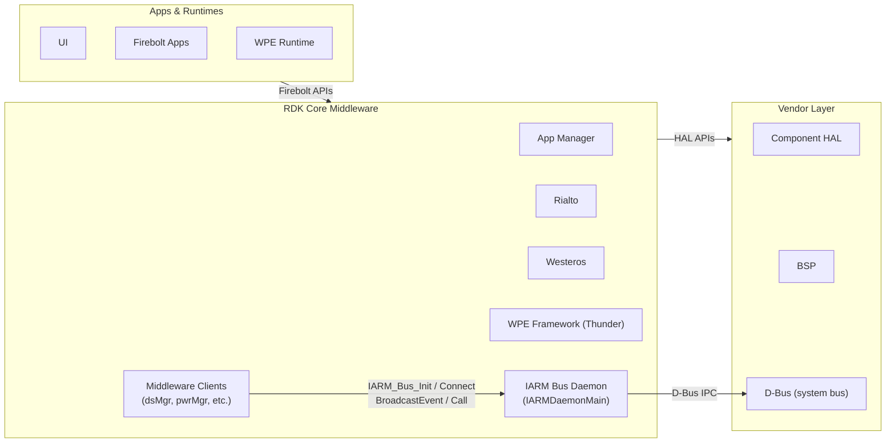
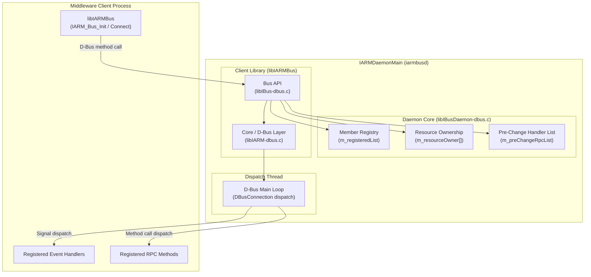
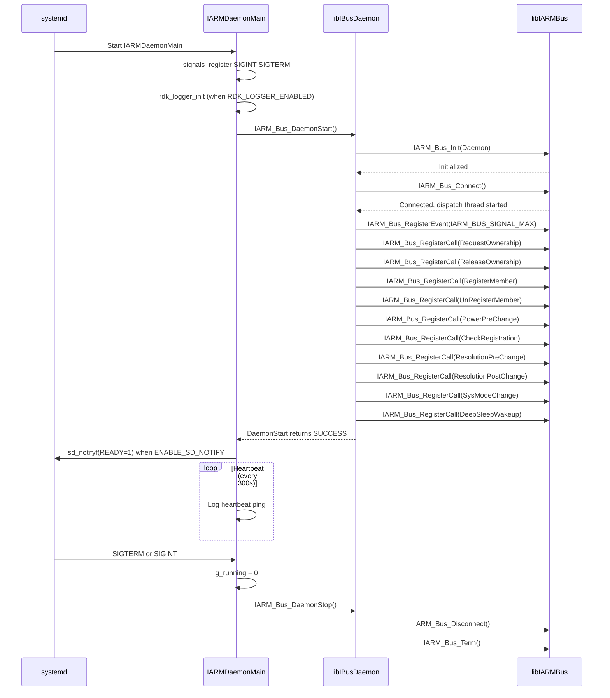
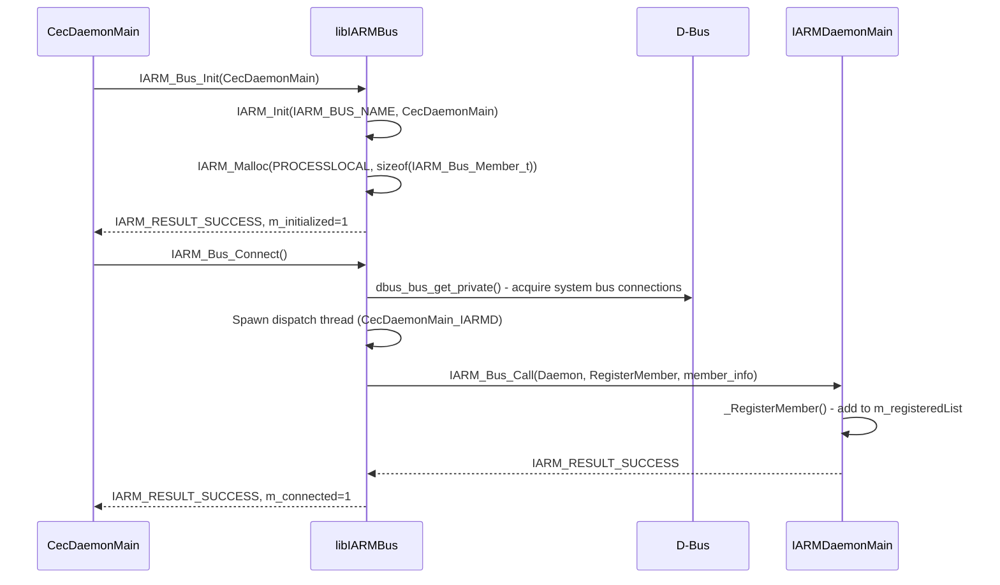
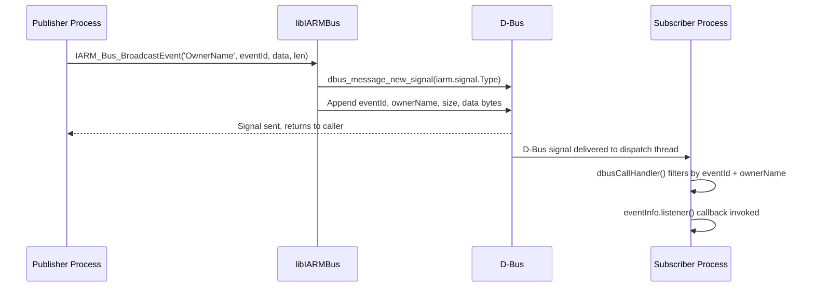
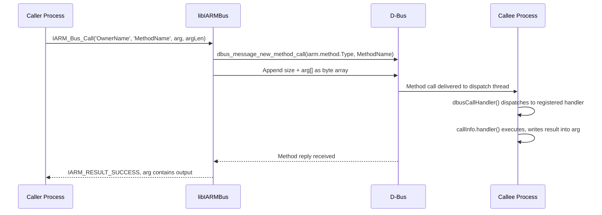
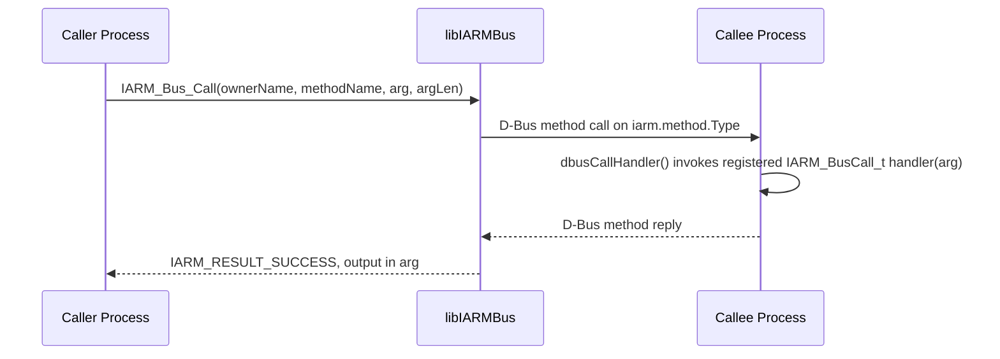
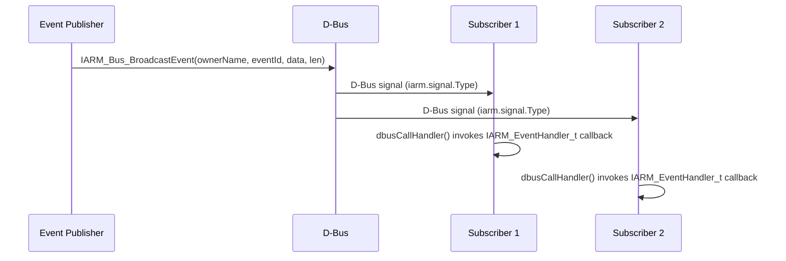

# IARM Bus

IARM Bus (Inter-Application Resource Manager Bus) is a platform-agnostic Inter-Process Communication (IPC) interface for the RDK middleware stack. It allows processes to communicate with each other by sending events or invoking Remote Procedure Calls (RPC). The programming API is independent of the operating system or the underlying IPC mechanism, making it usable across a variety of platforms. Two processes connected to the same bus instance can exchange events and RPC calls; processes on different bus instances cannot communicate with each other.

IARM Bus operates as a system-level service, launched early in the boot sequence before other RDK middleware daemons. Its core function is to provide a named, well-known message bus over which middleware components — such as the device settings manager, power manager, and display service manager — register, publish events, and invoke methods in other processes. All bus members are uniquely identified by a string name registered at connection time.

At the module level, IARM Bus provides a client library (`libIARMBus`) that middleware components link against, and a daemon (`IARMDaemonMain`) that acts as the central coordinator for member registration, resource ownership arbitration, and system-wide pre-change notifications. The daemon maintains the list of registered members and dispatches coordinated lifecycle calls (power pre-change, resolution pre-change, deep-sleep wakeup, and system-mode change) to all registered members before the corresponding state transition occurs.

**Key Features & Responsibilities:**

- **Event Publishing and Subscription**: Provides `IARM_Bus_BroadcastEvent()` and `IARM_Bus_RegisterEventHandler()` APIs so any middleware process can publish system-wide asynchronous events and any other process can register to receive them.
- **Remote Procedure Calls**: Exposes `IARM_Bus_RegisterCall()` and `IARM_Bus_Call()` / `IARM_Bus_Call_with_IPCTimeout()` APIs allowing one process to invoke a named function implemented in another process, with optional timeout control.
- **Member Registration and Discovery**: Maintains a list of all connected processes via `IARM_Bus_Init()` and `IARM_Bus_Connect()`, and provides `IARM_Bus_IsConnected()` for processes to check whether a named member is currently registered on the bus.
- **Resource Ownership Management**: Arbitrates exclusive access to shared device resources (decoder planes, focus, power, resolution) through `IARM_BusDaemon_RequestOwnership()` and `IARM_BusDaemon_ReleaseOwnership()`, broadcasting a resource-available event when a resource is freed.
- **Coordinated Pre-Change Notifications**: Before system-state transitions (power change, resolution change, deep-sleep wakeup, system-mode change), the daemon iterates all registered members and sequentially calls each member's registered pre-change handler, ensuring orderly preparation across the stack.
- **Memory Management**: Provides typed memory allocation (`IARM_Malloc` / `IARM_Free`) for process-local memory. Arguments and event data are serialized by value across process boundaries, with each allocation prefixed by a size field to support D-Bus byte-array transfer.

---

## Design

IARM Bus is designed around a daemon-centric hub-and-spoke model where a single long-running daemon process (`IARMDaemonMain`) acts as the coordinator, and all middleware clients link a shared library (`libIARMBus`) to connect to it. The underlying transport uses D-Bus as the IPC mechanism, selected at build time via the `_USE_DBUS` flag. The library abstracts all D-Bus message construction, dispatch, and filtering so that client code interacts only with the IARM API rather than D-Bus primitives. The daemon and client both share the same `libIARMBus`, meaning the daemon is itself a bus member registered under the name `"Daemon"`. The maximum string length for all member and method names on the bus is 64 characters (`IARM_MAX_NAME_LEN`), enforced throughout the API.

Northbound, the API surface (`libIBus.h`) exposes a lifecycle sequence: `IARM_Bus_Init()` → `IARM_Bus_Connect()` → use APIs → `IARM_Bus_Disconnect()` → `IARM_Bus_Term()`. Clients register event handlers and RPC methods only after connecting. Southbound, the D-Bus layer (`libIARM-dbus.c`) creates three `DBusConnection` handles per process — `conn` for incoming message dispatch, `connEvent` for outgoing event signals, and `connMethodCall` for outgoing blocking RPC calls — and spawns two dedicated dispatch threads each running a D-Bus read-write-dispatch loop. Method calls are serialized by a recursive `pthread_mutex` (`m_Lock`), which protects the registered call list and event handler list.

IPC is implemented exclusively over D-Bus. Method calls use `dbus_message_is_method_call()` against the `iarm.method.Type` interface, and events are dispatched as D-Bus signals on the `iarm.signal.Type` interface. Event data and RPC arguments are passed by value using a `memcpy`-equivalent byte-array serialization, which is why the API explicitly prohibits pointer members inside argument structures. The memory allocation layer prefixes each allocation with a `size_t` length field so the D-Bus serializer can determine the byte count without an additional parameter.

Membership information is maintained entirely in the daemon's in-memory `m_registeredList` (a GLib `GList`), and resource ownership is tracked in the `m_resourceOwner[]` array. Both structures are initialized fresh on each daemon startup. Log output is routed to `uimgr_log.txt` via the syslog-ng filter configured in the bb file.

### Threading Model

- **Threading Architecture**: Multi-threaded; each connected process has a dedicated dispatch thread in addition to the calling thread.
- **Main Thread**: Handles `IARM_Bus_Init`, `IARM_Bus_Connect`, `IARM_Bus_RegisterCall`, `IARM_Bus_RegisterEventHandler`, and all outgoing `IARM_Bus_BroadcastEvent` / `IARM_Bus_Call` invocations.
- **Worker Threads**:
  - _Dispatch thread_ (`<memberName>_IARMD`): Runs the D-Bus connection's main loop for a member, invoking registered event listeners and RPC handlers when messages arrive. The thread name is set via `prctl(PR_SET_NAME, ...)` using a suffix `_IARMD` appended to the member name, confirmed in `libIARM-dbus.c`.
  - _Method-call dispatch thread_: Runs `dbus_connection_read_write_dispatch()` on `connMethodCall`. Outgoing blocking RPC calls via `IARM_CallWithTimeout` also use `connMethodCall`, keeping outgoing calls off the main `conn` dispatch loop to avoid deadlock.
- **Synchronization**: A process-wide recursive `pthread_mutex_t m_Lock` (initialized as `PTHREAD_RECURSIVE_MUTEX_INITIALIZER_NP`) serializes access to the registered call list (`m_registeredCallList`) and event handler list (`m_eventHandlerList`).
- **Async / Event Dispatch**: Event callbacks are invoked from the dispatch thread. The `IARM_Bus_BroadcastEvent()` caller is unblocked immediately after the D-Bus signal is sent; listeners are notified asynchronously on their own dispatch threads.

### RDK-V Platform and Integration Requirements

- **Build Dependencies**: `libxml2`, `dbus`, `glib-2.0`, `safec-common-wrapper`. Conditionally depends on `directfb` (when the `directfb` distro feature is enabled) and `systemd` (when the `systemd` distro feature is enabled), as declared in the bb file.
- **Systemd Services**: The D-Bus system daemon (`dbus.service`) must be running before `iarmbusd` starts, as declared by `After=dbus.service` in the service unit.
- **Startup Order**: `iarmbusd.service` is ordered after `dbus.service` and is part of `multi-user.target`. All other RDK middleware services that use IARM Bus must start after `iarmbusd` is active.

---

### Component State Flow

#### Initialization to Active State

The daemon transitions through the following states: **Starting** (signal handlers registered, logger initialized) → **DaemonInit** (`IARM_Bus_DaemonStart`: `IARM_Bus_Init` + `IARM_Bus_Connect`) → **RPC Registration** (all daemon RPC methods registered with `IARM_Bus_RegisterCall`) → **Active** (heartbeat loop; accepting member registrations, events, and RPC calls) → **Shutdown** (`IARM_Bus_DaemonStop`: `Disconnect` + `Term`).

#### Runtime State Changes

The daemon's primary runtime role is processing incoming RPC calls from members. The key runtime state managed by the daemon is the member registry and resource ownership table, both held entirely in memory.

**State Change Triggers:**

- A middleware client calling `IARM_Bus_Connect()` triggers a `RegisterMember` RPC to the daemon, adding the member to `m_registeredList`. Disconnection triggers `UnRegisterMember`, which also force-releases any resources still owned by that member.
- A power manager or equivalent component calling `IARM_BusDaemon_RequestOwnership()` for a resource type triggers `_RequestOwnership` in the daemon; if the resource is currently held by another member, the daemon calls `IARM_Bus_Call(..., IARM_BUS_COMMON_API_ReleaseOwnership, ...)` on the current owner before transferring ownership.
- When a resource is released via `_ReleaseOwnership`, the daemon broadcasts `IARM_BUS_EVENT_RESOURCEAVAILABLE` so interested members can re-request the resource.

**Context Switching Scenarios:**

- Before a power state transition, the component managing the power change calls `IARM_BusDaemon_PowerPrechange()`, which causes the daemon to iterate all registered members and invoke each member's `IARM_BUS_COMMON_API_PowerPreChange` handler in sequence.
- Before and after a display resolution change, coordinated calls to `IARM_BusDaemon_ResolutionPrechange()` and `IARM_BusDaemon_ResolutionPostchange()` distribute the new width/height to all registered pre-change handlers.
- On deep-sleep wakeup, `IARM_BusDaemon_DeepSleepWakeup()` is called, triggering the equivalent pre-change iteration for all handlers registered for `IARM_BUS_COMMON_API_DeepSleepWakeup`.
- On system-mode change (Normal / EAS / Warehouse), the daemon dispatches to all members with a registered `IARM_BUS_COMMON_API_SysModeChange` handler.

---

### Call Flows

#### Initialization Call Flow

#### Request Processing Call Flow — Event Broadcast

#### Request Processing Call Flow — RPC Method Call

---

## Internal Modules

| Module / Class   | Description                                                                                                                                                                                                                                                                                                                                                                                                                                                                              | Key Files               |
| ---------------- | ---------------------------------------------------------------------------------------------------------------------------------------------------------------------------------------------------------------------------------------------------------------------------------------------------------------------------------------------------------------------------------------------------------------------------------------------------------------------------------------- | ----------------------- |
| `IARMDaemonMain` | Entry point for the bus daemon. Registers signal handlers (SIGINT, SIGTERM), initializes the logger, calls `IARM_Bus_DaemonStart()`, sends systemd readiness notification (when `ENABLE_SD_NOTIFY` is defined), and runs the heartbeat loop until shutdown.                                                                                                                                                                                                                              | `IARMDaemonMain-dbus.c` |
| `libIBusDaemon`  | Daemon-side logic. Implements all daemon RPC handlers (`_RegisterMember`, `_UnRegisterMember`, `_RequestOwnership`, `_ReleaseOwnership`, `_CheckRegistration`, `_PowerPreChange`, `_DeepSleepWakeup`, `_ResolutionPreChange`, `_ResolutionPostChange`, `_SysModeChange`, `_RegisterPreChange`). Maintains the member registry (`m_registeredList`) and resource ownership table (`m_resourceOwner[]`).                                                                                   | `libIBusDaemon-dbus.c`  |
| `libIBus`        | Client-facing Bus API layer. Implements `IARM_Bus_Init`, `IARM_Bus_Term`, `IARM_Bus_Connect`, `IARM_Bus_Disconnect`, `IARM_Bus_BroadcastEvent`, `IARM_Bus_RegisterEventHandler`, `IARM_Bus_UnRegisterEventHandler`, `IARM_Bus_RemoveEventHandler`, `IARM_Bus_RegisterCall`, `IARM_Bus_Call`, `IARM_Bus_Call_with_IPCTimeout`, `IARM_Bus_RegisterEvent`, and `IARM_Bus_IsConnected`. Wraps the core layer and manages the per-process call and event handler lists protected by `m_Lock`. | `libIBus-dbus.c`        |
| `libIARMCore`    | Core D-Bus transport layer. Manages `IARM_Ctx_t` per-process context holding three `DBusConnection` handles (`conn`, `connEvent`, `connMethodCall`) and two dispatch threads. Implements `IARM_Init`, `IARM_Malloc`, `IARM_Free`, `IARM_RegisterCall`, `IARM_Call`, `IARM_CallWithTimeout`, `IARM_RegisterListner`. Handles D-Bus message construction, filtering (`dbusCallHandler`), and memory size-prefixing for argument serialization.                                             | `libIARM-dbus.c`        |

---

## Component Interactions

IARM Bus operates as an infrastructure component, providing the IPC fabric that other middleware components use to communicate. Its interactions span the D-Bus transport layer, the systemd service manager, and the middleware clients that connect to the bus.

### Interaction Matrix

| Target Component / Layer    | Interaction Purpose                                                                | Key APIs / Topics                                                                                                                                                                                       |
| --------------------------- | ---------------------------------------------------------------------------------- | ------------------------------------------------------------------------------------------------------------------------------------------------------------------------------------------------------- |
| **D-Bus System Bus**        | Underlying transport for all IARM messages                                         | `dbus_bus_get_private()`, `dbus_message_new_method_call()`, `dbus_message_new_signal()`, `dbus_connection_send_with_reply_and_block()`, `dbus_connection_send()`                                        |
| **systemd**                 | Daemon readiness signaling and service lifecycle                                   | `sd_notifyf(READY=1, ...)` (when `ENABLE_SD_NOTIFY` is defined)                                                                                                                                         |
| **All IARM Bus members**    | Member registration and deregistration on connect/disconnect                       | `IARM_BUS_DAEMON_API_RegisterMember`, `IARM_BUS_DAEMON_API_UnRegisterMember`                                                                                                                            |
| **All IARM Bus members**    | Coordinated pre-change notification before power, resolution, and mode transitions | `IARM_BUS_COMMON_API_PowerPreChange`, `IARM_BUS_COMMON_API_ResolutionPreChange`, `IARM_BUS_COMMON_API_ResolutionPostChange`, `IARM_BUS_COMMON_API_DeepSleepWakeup`, `IARM_BUS_COMMON_API_SysModeChange` |
| **Resource-owning members** | Exclusive resource arbitration                                                     | `IARM_BUS_DAEMON_API_RequestOwnership`, `IARM_BUS_DAEMON_API_ReleaseOwnership`, `IARM_BUS_COMMON_API_ReleaseOwnership`                                                                                  |

### Events Published

| Event Name                         | IARM Topic                                    | Trigger Condition                                                                   | Subscriber Components                                                                                    |
| ---------------------------------- | --------------------------------------------- | ----------------------------------------------------------------------------------- | -------------------------------------------------------------------------------------------------------- |
| `IARM_BUS_EVENT_RESOURCEAVAILABLE` | `Daemon` / `IARM_BUS_EVENT_RESOURCEAVAILABLE` | A registered member releases ownership of a shared resource via `_ReleaseOwnership` | Any member that previously requested the resource and was denied, or that monitors resource availability |

### IPC Flow Patterns

**Primary Request / Response Flow (RPC):**

When a caller invokes `IARM_Bus_Call()`, the client library serializes the argument structure into a D-Bus byte-array method call and blocks on the reply. The callee's dispatch thread receives the D-Bus method call in `dbusCallHandler()`, extracts the argument buffer, invokes the registered `IARM_BusCall_t` handler, and the reply is sent back through the D-Bus connection. The result is written into the shared argument buffer and returned to the caller.

**Event Notification Flow:**

When a process calls `IARM_Bus_BroadcastEvent()`, the library constructs a D-Bus signal carrying the event ID, owner name, data size, and data bytes, and sends it on the session bus. Each subscriber process's dispatch thread receives the signal, and `dbusCallHandler()` filters it by event ID and owner name before invoking the registered `IARM_EventHandler_t` callback.

---

## Implementation Details

### Major HAL APIs Integration

The following D-Bus library and system functions are called directly by the IARM Bus implementation.

| API                                           | Purpose                                                           | Implementation File     |
| --------------------------------------------- | ----------------------------------------------------------------- | ----------------------- |
| `dbus_bus_get_private()`                      | Acquire private connections to the D-Bus system bus               | `libIARM-dbus.c`        |
| `dbus_message_new_method_call()`              | Construct an outgoing RPC method call message                     | `libIARM-dbus.c`        |
| `dbus_message_new_signal()`                   | Construct an outgoing event (signal) message                      | `libIARM-dbus.c`        |
| `dbus_connection_send_with_reply_and_block()` | Send a method call and block for the reply                        | `libIARM-dbus.c`        |
| `dbus_connection_send()`                      | Send a signal without waiting for reply                           | `libIARM-dbus.c`        |
| `dbus_connection_add_filter()`                | Register `dbusCallHandler` as the message filter for a connection | `libIARM-dbus.c`        |
| `sd_notifyf()`                                | Send systemd service-readiness notification                       | `IARMDaemonMain-dbus.c` |

### Key Implementation Logic

- **State / Lifecycle Management**: Process state is tracked with two `volatile int` flags — `m_initialized` and `m_connected` — guarded by the recursive `m_Lock` mutex. Both must be in the correct state for any API call to proceed; otherwise `IARM_RESULT_INVALID_STATE` or `IARM_RESULT_INVALID_PARAM` is returned.
  - Core init/term logic: `libIBus-dbus.c`, `libIARM-dbus.c`
  - Daemon member-list management: `libIBusDaemon-dbus.c`

- **Event Processing**: Events are dispatched by the per-process dispatch thread running the D-Bus main loop. The `dbusCallHandler` function is registered as a connection filter and distinguishes between incoming signals (`iarm.signal.Type`) and method calls (`iarm.method.Type`) by interface name. Event filtering by `eventId` and `ownerName` is applied before invoking the registered handler; mismatched messages fall through to `DBUS_HANDLER_RESULT_NOT_YET_HANDLED`.
  - Message filter and dispatch: `libIARM-dbus.c` (`dbusCallHandler`)
  - Handler registration list: `libIBus-dbus.c` (`m_eventHandlerList`)

- **Error Handling Strategy**: Each IARM API returns an `IARM_Result_t` code. Errors from the D-Bus layer are mapped to `IARM_RESULT_IPCCORE_FAIL`. Null or out-of-range parameters map to `IARM_RESULT_INVALID_PARAM`. Memory allocation failures return `IARM_RESULT_OOM`. The daemon's pre-change dispatchers (`_PowerPreChange`, `_ResolutionPreChange`, etc.) continue iterating through all registered members regardless of individual call outcomes, ensuring every member receives the notification.

- **Logging & Diagnostics**: When `RDK_LOGGER_ENABLED` is defined, log output is routed through `RDK_LOG(RDK_LOG_DEBUG, "LOG.RDK.IARMBUS", ...)`. When the flag is absent, output falls back to `printf`. The `IARM_Bus_RegisterForLog()` API allows a caller to inject a custom log callback (`IARM_Bus_LogCb`). Each log message is prefixed with the thread ID using `syscall(SYS_gettid)`. Log output is routed to `uimgr_log.txt` via the syslog-ng filter configured in the bb file.

---

## Configuration

### Key Configuration Files

| Configuration File      | Purpose                                                                                                                                | Override Mechanism                                          |
| ----------------------- | -------------------------------------------------------------------------------------------------------------------------------------- | ----------------------------------------------------------- |
| `conf/iarmbusd.service` | systemd unit that starts `IARMDaemonMain`, sets log output path, declares `After=dbus.service`, and marks the service type as `notify` | Replaced or masked via standard systemd override mechanisms |

### Key Configuration Parameters

| Parameter            | Type              | Default                                            | Description                                                                                                                                                                                            |
| -------------------- | ----------------- | -------------------------------------------------- | ------------------------------------------------------------------------------------------------------------------------------------------------------------------------------------------------------ |
| `ENABLE_SD_NOTIFY`   | Compile-time flag | Enabled (set in bb file)                           | When defined, the daemon calls `sd_notifyf(READY=1, ...)` after `IARM_Bus_DaemonStart()` completes, enabling systemd to track service readiness.                                                       |
| `_USE_DBUS`          | Compile-time flag | Enabled (set in `core/Makefile.am`)                | Selects the D-Bus-backed implementation files (`libIARM-dbus.c`, `libIBus-dbus.c`, `libIBusDaemon-dbus.c`) for compilation.                                                                            |
| `RDK_LOGGER_ENABLED` | Compile-time flag | Platform-dependent                                 | When defined, routes diagnostic output through the RDK logger (`LOG.RDK.IARMBUS`) instead of `printf`.                                                                                                 |
| `SAFEC_DUMMY_API`    | Compile-time flag | Set when `safec` is omitted from `DISTRO_FEATURES` | Activates stub implementations of safe-C string and memory functions, substituting standard library equivalents on platforms that build without the `safec` library.                                   |
| `PID_FILE_PATH`      | Compile-time path | Not set by default                                 | When defined, the daemon writes a PID file at `<PID_FILE_PATH>/iarmbusd.pid` after startup, providing a readiness indicator for container environments that rely on PID files rather than `sd_notify`. |
