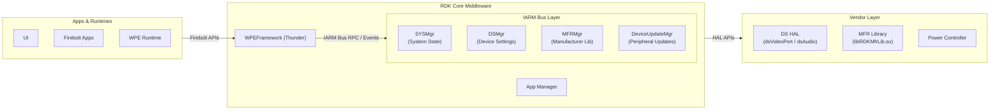
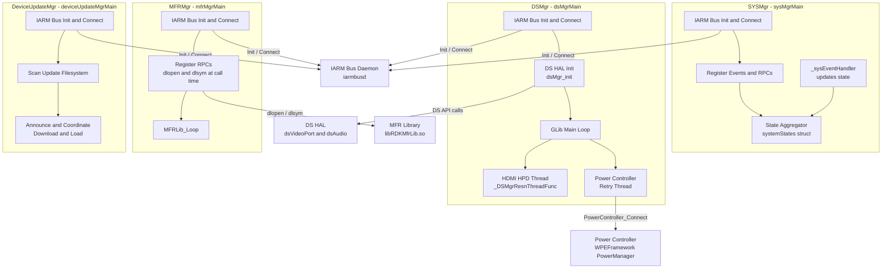
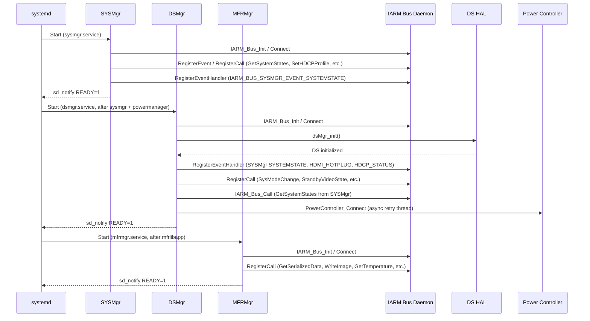
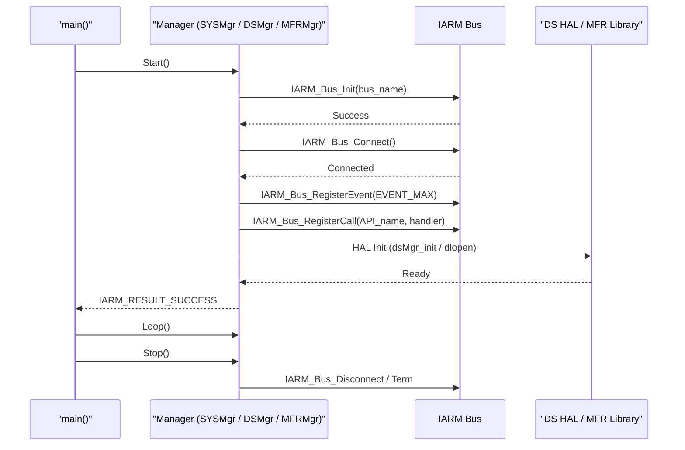
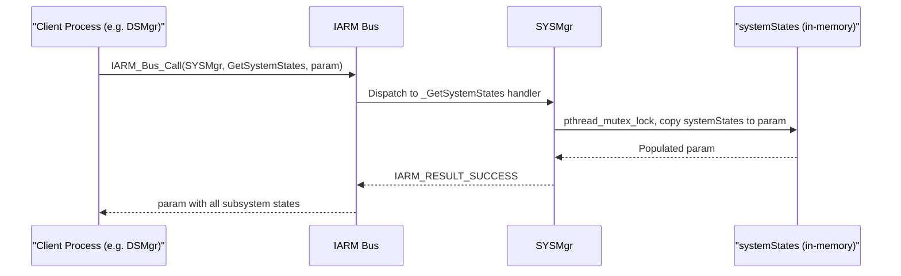
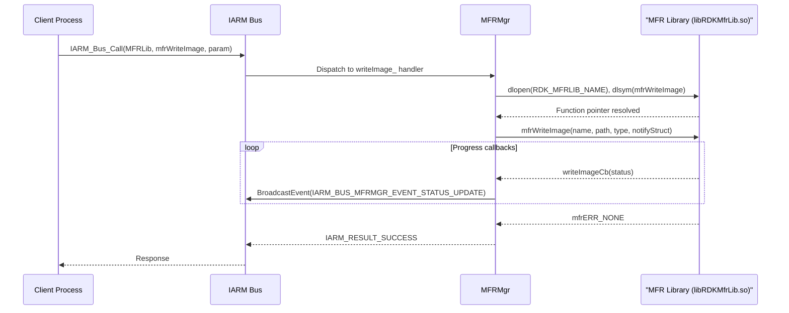
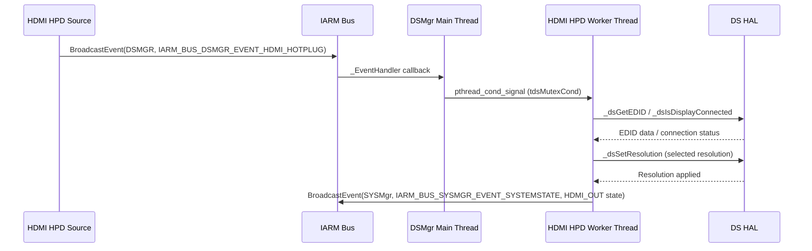
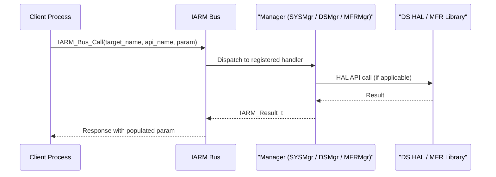
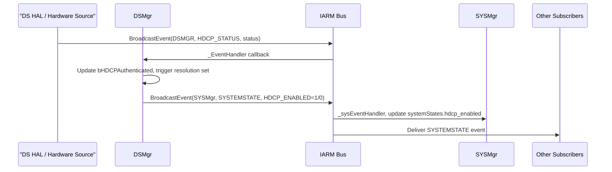

# IARM Managers (iarmmgrs)

The IARM Managers (`iarmmgrs`) package is a collection of standalone daemon processes that run on the IARM Bus and provide centralized management of hardware subsystems in RDK middleware. Each manager registers its own IARM Bus identity, exposes Remote Procedure Call (RPC) endpoints, and distributes events to other components over the bus. The package groups four managers that collectively cover system state aggregation, device settings and AV output, manufacturer hardware abstraction, and peripheral device firmware updates.

At the device level, these managers ensure that all processes sharing the IARM Bus have a consistent, up-to-date view of hardware states — from HDMI connectivity and HDCP authentication to thermal conditions and firmware flash progress. Any application or middleware component that needs to read or change the state of an AV port, query device identity data, or receive notifications about power transitions interacts through the RPC interfaces these managers expose.

At the module level, each manager is a self-contained process with its own lifecycle (`Start`, `Loop`, `Stop`), its own IARM Bus identity, and a defined set of events and RPC methods. They are orchestrated by systemd, with explicit dependency ordering that ensures the bus daemon and dependent services are live before each manager registers. This design keeps each manager replaceable and independently restartable without affecting the others.



**Key Features & Responsibilities:**

- **System State Aggregation (SYSMgr)**: Maintains a shared in-memory snapshot of all major subsystem states (HDMI, network connectivity, firmware download, time source, HDCP, and more) and exposes a `GetSystemStates` RPC so any bus participant can query the full state without subscribing to individual events.
- **Device Settings and AV Output Management (DSMgr)**: Initializes video and audio output ports via Device Services (DS) HAL, sets display resolutions based on EDID negotiation and HDCP authentication outcomes, and handles HDMI hot-plug and power state transitions.
- **Manufacturer Library Abstraction (MFRMgr)**: Bridges the IARM Bus to a dynamically loaded, platform-specific manufacturer library (`RDK_MFRLIB_NAME`) for operations such as firmware image writing, serialized device data retrieval, thermal monitoring, CPU clock management, and secure time access.
- **Peripheral Device Update Management (DeviceUpdateMgr)**: Scans the filesystem for available firmware images for attached peripheral devices, announces discovered images over the IARM Bus, coordinates download and load sequencing with Device Update Proxies, and gates interactive or background update flows.
- **Power Event Handling in DSMgr**: Connects to a Power Controller service to receive power state changes and adjusts AV port states, front-panel LED indicators, and audio modes according to the transition (e.g., active to standby).
- **HDCP Profile Management**: Allows callers to read and set the HDCP profile via SYSMgr RPC methods, with the current profile persisted to `/opt/.hdcp_profile_1`.

---

## Design

The iarmmgrs package follows a process-per-manager architecture in which each manager is a long-running daemon with a well-known IARM Bus name. All inter-process communication passes through the IARM Bus: state updates arrive as events, and read or write operations use the RPC call mechanism. This decouples producers of hardware state from consumers; all inter-manager communication flows exclusively through the IARM Bus. Initialization is strictly sequenced by systemd service dependencies, ensuring that the IARM Bus daemon is live and that SYSMgr has registered its RPC endpoints before DSMgr attempts to query system states during its own startup.

DSMgr interacts southbound with the Device Settings HAL through the DS RPC layer. Video and audio port handles are obtained once at startup and reused; the manager reacts to hardware-driven IARM events (HDMI hot-plug, HDCP status change, tune-ready) rather than polling. A dedicated worker thread handles resolution changes so that the main GLib event loop remains unblocked during EDID read and resolution negotiation.

MFRMgr resolves each manufacturer library function symbol at first call using `dlopen` / `dlsym` against the library name provided by the `RDK_MFRLIB_NAME` build macro. This allows the same MFRMgr binary to operate across different hardware platforms by binding to the platform-specific library at runtime.

SYSMgr accumulates state by subscribing to its own `IARM_BUS_SYSMGR_EVENT_SYSTEMSTATE` event, which any bus participant can fire with a state identifier and value. SYSMgr acts as the single, authoritative aggregator; when a consumer calls `GetSystemStates`, it receives a structure covering all tracked subsystems atomically under a mutex.

DSMgr connects to the Power Controller service asynchronously. A dedicated retry thread (`dsMgrPwrRetryEstablishConnThread`) loops until `PowerController_Connect()` succeeds, then fetches and initialises power state values. This ensures DSMgr startup completes while the Power Controller connection is established in the background.



### Threading Model

- **Threading Architecture**: Multi-threaded per manager. Each manager runs its own event or GLib main loop on the main thread while delegating blocking operations to worker threads.
- **SYSMgr Main Thread**: Runs `SYSMgr_Loop` with a 300-second heartbeat sleep; IARM event callbacks dispatched on IARM Bus callback threads, protected by `tMutexLock`.
- **DSMgr Main Thread**: Runs the GLib main loop (`g_main_loop_run`); issues heartbeat every 300 seconds.
- **Worker Threads** (DSMgr):
  - _HDMI HPD Thread_ (`_DSMgrResnThreadFunc`): Waits on a condition variable (`tdsMutexCond`) signalled on hot-plug or tune-ready events; performs EDID read and resolution negotiation.
  - _Power Controller Connect Thread_ (`dsMgrPwrRetryEstablishConnThread`): Retries `PowerController_Connect()` until success, then detaches.
  - _Power Event Handler Thread_ (`edsPwrEventHandlerThreadID`): Processes queued power state change events from `pwrEventQueue`.
- **MFRMgr Main Thread**: Runs `MFRLib_Loop`; all MFR RPC handlers execute on IARM Bus callback threads.
- **DeviceUpdateMgr Main Thread**: Runs the update coordination loop with RAII C++ mutexes (`tMutexLock`, `mapMutex`) protecting shared update state.
- **Synchronization**: `pthread_mutex_t` / `pthread_cond_t` pairs protect shared state in SYSMgr and DSMgr; `std::mutex` used in DeviceUpdateMgr.
- **Async / Event Dispatch**: IARM Bus callbacks are invoked on IARM-internal threads; managers either update local state under a mutex (SYSMgr) or signal a condition variable to unblock a worker thread (DSMgr).

### Platform and Integration Requirements

- **Build Dependencies**: `iarmbus`, `devicesettings`, `rdk-logger`, `glib-2.0`, `dbus-1`, `curl`, `yajl`, `openssl`, `systemd`, `telemetry`, `rfc`, `libsyswrapper`, `boost`, `c-ares`, `wpeframework-clientlibraries`, `virtual/mfrlib`, `virtual/vendor-devicesettings-hal`, `virtual/vendor-deepsleepmgr-hal`, `virtual/vendor-pwrmgr-hal`.
- **HAL Dependencies**: DS HAL (`dsVideoPort`, `dsAudio`, `dsDisplay`, `dsRpc`) for DSMgr; dynamically loaded MFR library (`libRDKMfrLib.so`) for MFRMgr.
- **IARM Bus**: All managers register under their respective bus names: `SYSMgr`, `DSMgr`, `MFRLib`, `DeviceUpdateManager`. DSMgr subscribes to `SYSMgr` and `DSMgr` events.
- **Systemd Services**:
  - `sysmgr.service`: Requires and starts after `iarmbusd.service`.
  - `dsmgr.service`: Requires `iarmbusd.service`; starts after `iarmbusd.service`, `sysmgr.service`, and `wpeframework-powermanager.service`.
  - `mfrmgr.service`: Requires `iarmbusd.service`; starts after `iarmbusd.service` and `mfrlibapp.service`.
  - `deviceupdatemgr.service`: Starts after `lighttpd.service` and `iarmbusd.service`.
- **Configuration Files**:
  - `/etc/device.properties` — Read by DSMgr and the `rdkProfile` utility to determine EU region (`FRIENDLY_ID`) and RDK profile type (TV or STB).
  - `/opt/ddcDelay` — Optional file read by DSMgr at startup to override the HDMI DDC line wait count before resolution negotiation.
  - `/opt/.hdcp_profile_1` — Stores the active HDCP profile selected via SYSMgr.
  - `/tmp/stt_received` — Checked by SYSMgr (under `MEDIA_CLIENT`) to confirm NTP time source availability.
  - `/opt/persistent/ds/` — Directory created by the DSMgr service before start for DS persistent state.
- **Startup Order**: `iarmbusd` → `sysmgr` → `wpeframework-powermanager` → `dsmgr`; `mfrlibapp` → `mfrmgr`.

---

### Component State Flow

#### Initialization to Active State

Each manager follows the same lifecycle pattern: initialize the IARM Bus identity, register events and RPC handlers, perform any HAL initialization, then enter a run loop. SYSMgr and MFRMgr signal systemd readiness via `sd_notify(READY=1)` immediately after successful setup. DSMgr does the same after `DSMgr_Start()` returns and a 10 ms settle delay.



#### Runtime State Changes

**State Change Triggers:**

- **HDMI Hot-Plug Connect/Disconnect**: DSMgr receives `IARM_BUS_DSMGR_EVENT_HDMI_HOTPLUG`; the HDMI HPD thread unblocks on `tdsMutexCond`, reads EDID, and renegotiates resolution. On connect, `dsVIDEO_BGCOLOR_NONE` is applied before resolution is set.
- **HDCP Authentication Status**: DSMgr receives `IARM_BUS_DSMGR_EVENT_HDCP_STATUS`; on authentication success, resolution is set and EDID dump is scheduled; on authentication failure, resolution is renegotiated and HDCP state `0` is broadcast to SYSMgr as `IARM_BUS_SYSMGR_SYSSTATE_HDCP_ENABLED`.
- **Tune Ready**: DSMgr subscribes to `IARM_BUS_SYSMGR_SYSSTATE_TUNEREADY` from SYSMgr; on first receipt (state = 1), audio mode is restored from persistence and the resolution thread is unblocked.
- **Power State Transitions**: DSMgr power event handler thread processes entries from `pwrEventQueue`; LED state and AV port enable/disable are updated via registered RPC handlers (`SetLEDStatus`, `SetAvPortState`, `SetStandbyVideoState`).
- **EAS Mode Change**: DSMgr handles `IARM_BUS_COMMON_API_SysModeChange`; transitions to EAS mode forces audio to stereo; returning to normal mode restores the persisted audio setting.
- **System State Events from Other Components**: Any IARM participant may fire `IARM_BUS_SYSMGR_EVENT_SYSTEMSTATE` with a `stateId` and value; SYSMgr updates the corresponding field in `systemStates` under `tMutexLock` so subsequent `GetSystemStates` calls reflect the change.

**Context Switching Scenarios:**

- The Power Controller retry thread operates in the background, continuing to establish the connection while DSMgr proceeds to full active state for AV management.
- MFRMgr resolves manufacturer library symbols on first call; the manager remains available on the bus throughout its lifecycle regardless of when the library becomes accessible.

---

### Call Flows

#### Initialization Call Flow



#### Request Processing Call Flow — SYSMgr GetSystemStates



#### Request Processing Call Flow — MFRMgr WriteImage



#### Request Processing Call Flow — DSMgr HDMI Hot-Plug Resolution Set



---

## Internal Modules

| Module / Class       | Description                                                                                                                                                                                                                                                                                                                        | Key Files                                                                                                                         |
| -------------------- | ---------------------------------------------------------------------------------------------------------------------------------------------------------------------------------------------------------------------------------------------------------------------------------------------------------------------------------- | --------------------------------------------------------------------------------------------------------------------------------- |
| `SYSMgr`             | Aggregates state for all tracked subsystems by subscribing to `IARM_BUS_SYSMGR_EVENT_SYSTEMSTATE`. Exposes `GetSystemStates`, `SetHDCPProfile`, `GetHDCPProfile`, `GetKeyCodeLoggingPref`, and `SetKeyCodeLoggingPref` as IARM RPC endpoints. Maintains the `systemStates` struct under a mutex.                                   | `sysmgr/sysMgr.c`, `sysmgr/sysMgrMain.c`, `sysmgr/include/sysMgr.h`                                                               |
| `DSMgr`              | Manages AV output port initialization, HDMI resolution negotiation, EDID parsing, HDCP monitoring, EAS audio mode, and power state–driven port toggling. Uses a GLib main loop plus a dedicated HDMI HPD thread and power event threads.                                                                                           | `dsmgr/dsMgr.c`, `dsmgr/dsMgrMain.c`, `dsmgr/dsMgrPwrEventListener.c`, `dsmgr/dsMgrProductTraitsHandler.cpp`                      |
| `MFRMgr`             | Provides IARM RPC wrappers for the manufacturer library. Each handler resolves its function symbol via `dlopen`/`dlsym` on first call. Handles firmware write, image verify, serialized data read/write, PDRI deletion, bank scrubbing, bootloader pattern, splash screen, secure time, thermal monitoring, and CPU clock control. | `mfr/mfrMgr.c`, `mfr/mfrMgrMain.c`, `mfr/include/mfrMgr.h`                                                                        |
| `DeviceUpdateMgr`    | Scans the update sub-filesystem for peripheral device firmware images, announces them via IARM events, accepts update session registrations from Device Update Proxies, and coordinates download/load sequencing. Reads a JSON configuration file for update path and behavior parameters.                                         | `deviceUpdateMgr/deviceUpdateMgrMain.cpp`, `deviceUpdateMgr/include/deviceUpdateMgr.h`, `deviceUpdateMgr/deviceUpdateConfig.json` |
| `rdkProfile utility` | Reads `/etc/device.properties` to determine the device RDK profile (TV or STB). Used by DSMgr and the power event listener to select appropriate UX controller behavior.                                                                                                                                                           | `utils/rdkProfile.c`, `utils/rdkProfile.h`                                                                                        |

---

## Component Interactions

### Interaction Matrix

| Target Component / Layer                         | Interaction Purpose                                                               | Key APIs / Topics                                                                                                                                                                                                                                                                                                                                                                                                     |
| ------------------------------------------------ | --------------------------------------------------------------------------------- | --------------------------------------------------------------------------------------------------------------------------------------------------------------------------------------------------------------------------------------------------------------------------------------------------------------------------------------------------------------------------------------------------------------------- |
| **IARM Bus Daemon**                              | Process registration, event subscription, RPC dispatch                            | `IARM_Bus_Init`, `IARM_Bus_Connect`, `IARM_Bus_RegisterCall`, `IARM_Bus_RegisterEventHandler`, `IARM_Bus_BroadcastEvent`, `IARM_Bus_Call`                                                                                                                                                                                                                                                                             |
| **SYSMgr** (consumed by DSMgr)                   | DSMgr queries system states at startup and listens for tune-ready and HDCP events | `IARM_BUS_SYSMGR_API_GetSystemStates`, `IARM_BUS_SYSMGR_EVENT_SYSTEMSTATE`                                                                                                                                                                                                                                                                                                                                            |
| **DS HAL**                                       | DSMgr initializes and drives video/audio hardware                                 | `_dsGetVideoPort`, `_dsSetResolution`, `_dsGetResolution`, `_dsGetEDID`, `_dsGetEDIDBytes`, `_dsIsDisplayConnected`, `_dsIsDisplaySurround`, `_dsGetAudioPort`, `_dsSetStereoMode`, `_dsEnableAudioPort`, `_dsEnableVideoPort`, `_dsSetBackgroundColor`, `_dsGetIgnoreEDIDStatus`                                                                                                                                     |
| **MFR Library (`libRDKMfrLib.so`)**              | MFRMgr resolves and calls manufacturer-specific functions at runtime              | `mfrGetSerializedData`, `mfrSetSerializedData`, `mfrWriteImage`, `mfrVerifyImage`, `mfrDeletePDRI`, `mfrScrubAllBanks`, `mfrSetBootloaderPattern`, `mfrGetSecureTime`, `mfrSetSecureTime`, `mfrMirrorImage`, `mfrSetBlSplashScreen`, `mfrGetTemperature`, `mfrSetTempThresholds`, `mfrDetemineClockSpeeds`, `mfrSetClockSpeed`, `mfrGetClockSpeed`, `WIFI_EraseAllData`, `WIFI_SetCredentials`, `WIFI_GetCredentials` |
| **Power Controller (WPEFramework PowerManager)** | DSMgr monitors power state transitions to manage AV ports, LEDs, and audio        | `PowerController_Init`, `PowerController_Connect`, `PowerController_Term`                                                                                                                                                                                                                                                                                                                                             |
| **RFC**                                          | DSMgr and other components may query RFC parameters via linked `rfcapi`           | `rfcapi` (linked via `LDFLAGS += "-lrfcapi"`)                                                                                                                                                                                                                                                                                                                                                                         |
| **Telemetry**                                    | DSMgr emits telemetry markers at key lifecycle points                             | `TELEMETRY_INIT`, `TELEMETRY_UNINIT` (via `telemetry_msgsender`)                                                                                                                                                                                                                                                                                                                                                      |

### Events Published

| Event Name                                       | IARM Bus Topic        | Trigger Condition                                                                 | Subscriber Components                                                   |
| ------------------------------------------------ | --------------------- | --------------------------------------------------------------------------------- | ----------------------------------------------------------------------- |
| `IARM_BUS_SYSMGR_EVENT_SYSTEMSTATE`              | `SYSMgr`              | Any tracked subsystem state change; re-broadcast by DSMgr for HDCP status updates | Any IARM participant monitoring system state                            |
| `IARM_BUS_SYSMGR_EVENT_HDCP_PROFILE_UPDATE`      | `SYSMgr`              | HDCP profile set via `SetHDCPProfile` RPC                                         | Components tracking HDCP configuration                                  |
| `IARM_BUS_SYSMGR_EVENT_KEYCODE_LOGGING_CHANGED`  | `SYSMgr`              | Key code logging preference changed via `SetKeyCodeLoggingPref`                   | Components that honour key logging policy                               |
| `IARM_BUS_DSMGR_EVENT_HDMI_HOTPLUG`              | `DSMgr`               | HDMI display connect or disconnect detected by DS HAL                             | DSMgr itself (internal loop-back), other AV management components       |
| `IARM_BUS_DSMGR_EVENT_HDCP_STATUS`               | `DSMgr`               | HDCP authentication success or failure reported by DS HAL                         | DSMgr itself; SYSMgr state updated with HDCP_ENABLED flag               |
| `IARM_BUS_MFRMGR_EVENT_STATUS_UPDATE`            | `MFRLib`              | Firmware write/verify progress callback received from MFR library                 | Caller of `mfrWriteImage` / `mfrVerifyImage` (via callback module name) |
| `IARM_BUS_DEVICE_UPDATE_EVENT_ANNOUNCE`          | `DeviceUpdateManager` | New firmware image discovered in update sub-filesystem                            | Device Update Proxies registered on bus                                 |
| `IARM_BUS_DEVICE_UPDATE_EVENT_DOWNLOAD_INITIATE` | `DeviceUpdateManager` | Download session approved and ready to begin                                      | Device Update Proxy managing the target device                          |
| `IARM_BUS_DEVICE_UPDATE_EVENT_LOAD_INITIATE`     | `DeviceUpdateManager` | Load phase triggered (immediate or scheduled)                                     | Device Update Proxy managing the target device                          |

### IPC Flow Patterns

**Primary Request / Response Flow:**

All RPC calls follow the IARM Bus synchronous call model. The requesting process calls `IARM_Bus_Call` with the target bus name, API name, and a shared-memory parameter structure. The manager receives the call on an IARM callback thread, executes the handler, and returns an `IARM_Result_t`. Handlers protect shared state with mutexes before reading or writing.



**Event Notification Flow:**

Hardware events arrive either directly from DS HAL callbacks or from other IARM participants. The receiving manager processes the event payload, updates internal state, and may rebroadcast a derived event to the bus.



---

## Implementation Details

### Major HAL APIs Integration

| HAL / DS API                | Purpose                                                                                     | Implementation File             |
| --------------------------- | ------------------------------------------------------------------------------------------- | ------------------------------- |
| `_dsGetVideoPort()`         | Obtains a handle to a video output port by type and index                                   | `dsmgr/dsMgr.c`                 |
| `_dsSetResolution()`        | Sets display resolution on a given video port                                               | `dsmgr/dsMgr.c`                 |
| `_dsGetResolution()`        | Reads current resolution from a video port                                                  | `dsmgr/dsMgr.c`                 |
| `_dsGetEDID()`              | Retrieves parsed EDID information from the connected display                                | `dsmgr/dsMgr.c`                 |
| `_dsGetEDIDBytes()`         | Retrieves raw EDID byte array from the connected display                                    | `dsmgr/dsMgr.c`                 |
| `_dsIsDisplayConnected()`   | Queries HDMI connection state                                                               | `dsmgr/dsMgr.c`                 |
| `_dsIsDisplaySurround()`    | Checks if the connected display supports surround audio                                     | `dsmgr/dsMgr.c`                 |
| `_dsGetAudioPort()`         | Obtains a handle to an audio output port                                                    | `dsmgr/dsMgr.c`                 |
| `_dsSetStereoMode()`        | Sets the stereo mode on an audio port                                                       | `dsmgr/dsMgr.c`                 |
| `_dsEnableAudioPort()`      | Enables or disables an audio output port                                                    | `dsmgr/dsMgrPwrEventListener.c` |
| `_dsEnableVideoPort()`      | Enables or disables a video output port during power transitions                            | `dsmgr/dsMgrPwrEventListener.c` |
| `_dsSetBackgroundColor()`   | Sets HDMI background colour (used to clear screen during hotplug)                           | `dsmgr/dsMgr.c`                 |
| `_dsGetIgnoreEDIDStatus()`  | Reads the EDID-ignore flag that controls whether EDID-based resolution selection is applied | `dsmgr/dsMgr.c`                 |
| `_dsSetFPState()`           | Controls front-panel display state during power transitions                                 | `dsmgr/dsMgrPwrEventListener.c` |
| `mfrGetSerializedData()`    | Reads manufacturer-provisioned device data (model, serial number, etc.)                     | `mfr/mfrMgr.c`                  |
| `mfrWriteImage()`           | Initiates asynchronous firmware flash with progress callbacks                               | `mfr/mfrMgr.c`                  |
| `mfrVerifyImage()`          | Validates a firmware image prior to the flash operation                                     | `mfr/mfrMgr.c`                  |
| `mfrDeletePDRI()`           | Deletes the PDRI partition from flash                                                       | `mfr/mfrMgr.c`                  |
| `mfrScrubAllBanks()`        | Erases all firmware bank partitions                                                         | `mfr/mfrMgr.c`                  |
| `mfrSetBootloaderPattern()` | Configures front-panel LED behaviour during bootloader execution                            | `mfr/mfrMgr.c`                  |
| `mfrGetSecureTime()`        | Retrieves secure time stored in the Trusted Execution Environment                           | `mfr/mfrMgr.c`                  |
| `mfrSetSecureTime()`        | Writes secure time to the Trusted Execution Environment                                     | `mfr/mfrMgr.c`                  |
| `mfrGetTemperature()`       | Returns current SoC thermal state and temperature values                                    | `mfr/mfrMgr.c`                  |
| `mfrSetTempThresholds()`    | Configures high and critical thermal threshold values                                       | `mfr/mfrMgr.c`                  |
| `mfrDetemineClockSpeeds()`  | Enumerates available CPU clock frequencies                                                  | `mfr/mfrMgr.c`                  |
| `mfrSetClockSpeed()`        | Sets active CPU clock frequency                                                             | `mfr/mfrMgr.c`                  |
| `mfrGetClockSpeed()`        | Reads current CPU clock frequency                                                           | `mfr/mfrMgr.c`                  |

### Key Implementation Logic

- **State / Lifecycle Management**: SYSMgr holds a single `IARM_Bus_SYSMgr_GetSystemStates_Param_t` struct (`systemStates`) as its authoritative state store. All field updates occur in `_sysEventHandler` under `tMutexLock`. DSMgr tracks HDCP authentication state (`bHDCPAuthenticated`), tune-ready flag (`iTuneReady`), and EAS mode flag (`isEAS`) as static variables; transitions are driven by IARM event callbacks.
  - Core SYSMgr implementation: `sysmgr/sysMgr.c`
  - Core DSMgr implementation: `dsmgr/dsMgr.c`
  - DSMgr power state transitions: `dsmgr/dsMgrPwrEventListener.c`

- **Event Processing**: IARM events are delivered to registered handlers on IARM Bus callback threads. SYSMgr locks `tMutexLock` inside `_sysEventHandler`, updates the relevant `systemStates` field, and returns. DSMgr's `_EventHandler` signals `tdsMutexCond` on HDMI hotplug and tune-ready events, unblocking the dedicated HDMI HPD worker thread, which then executes the potentially long resolution negotiation path outside the callback context. Power events are queued to `pwrEventQueue` and processed on a separate power event handler thread.

- **Error Handling Strategy**: Bus initialization errors during `Start()` cause the manager to return a non-success code; systemd handles restart recovery for services configured with `Restart=always`. HAL call errors in runtime handlers are logged and returned as `IARM_RESULT_IPCCORE_FAIL` or `IARM_RESULT_INVALID_STATE` in RPC responses. MFRMgr handlers require `RDK_MFRLIB_NAME` to be defined and the library to be accessible; handlers return `IARM_RESULT_INVALID_STATE` when library symbol resolution cannot be completed.

- **Logging & Diagnostics**:
  - SYSMgr: `LOG.RDK.SYSMGR` via `RDK_LOG(RDK_LOG_DEBUG, ...)`.
  - DSMgr: `LOG.RDK.DSMGR` via `RDK_LOG` at DEBUG, INFO, WARN, and ERROR levels; uses `printf` output when `b_rdk_logger_enabled` is false.
  - MFRMgr: `LOG.RDK` (inherits logger from `IARM_Bus_RegisterForLog`).
  - All managers accept a `--debugconfig` command-line argument pointing to a debug configuration file (`/etc/debug.ini` or `/opt/debug.ini` override).
  - DSMgr creates a `/tmp/dsmgr.ready` sentinel file via `ExecStartPost` once `READY=1` is confirmed by systemd.

---

## Configuration

### Key Configuration Files

| Configuration File                        | Purpose                                                                                                                            | Override Mechanism                                      |
| ----------------------------------------- | ---------------------------------------------------------------------------------------------------------------------------------- | ------------------------------------------------------- |
| `/etc/device.properties`                  | Device identity and region properties; used to detect EU region (`FRIENDLY_ID`) and RDK profile (TV / STB)                         | Read by processes at startup                            |
| `/opt/ddcDelay`                           | Overrides the DDC line wait-count used by DSMgr during HDMI resolution negotiation                                                 | Write the integer count to the file before DSMgr starts |
| `/opt/.hdcp_profile_1`                    | Marks HDCP Profile 1 as active; presence of the file sets the profile                                                              | Created / removed via `SetHDCPProfile` IARM RPC         |
| `/tmp/stt_received`                       | Sentinel file checked under `MEDIA_CLIENT` builds to confirm NTP time source readiness                                             | Created by the NTP sync process                         |
| `deviceUpdateMgr/deviceUpdateConfig.json` | DeviceUpdateMgr behaviour parameters: update scan paths, download background mode, load timing, and percentage increment reporting | Deployed to `/etc/deviceUpdateConfig.json` at install   |

### Key Configuration Parameters

| Parameter              | Type | Default | Description                                                                                                   |
| ---------------------- | ---- | ------- | ------------------------------------------------------------------------------------------------------------- |
| `iResnCount`           | int  | `5`     | Number of one-second DDC line wait cycles before forcing a resolution set; overridden by `/opt/ddcDelay`.     |
| `backgroundDownload`   | bool | `true`  | DeviceUpdateMgr: whether firmware downloads to peripheral devices run in the background.                      |
| `interactiveDownload`  | bool | `false` | DeviceUpdateMgr: whether a UI master gates download initiation.                                               |
| `interactiveLoad`      | bool | `false` | DeviceUpdateMgr: whether a UI master gates load initiation.                                                   |
| `recheckForUpdatesMin` | int  | `0`     | DeviceUpdateMgr: interval in minutes to re-scan for new images; when set to 0, scanning runs once at startup. |
| `loadBeforeHour`       | int  | `4`     | DeviceUpdateMgr: hour of day before which an unattended load must complete.                                   |

### Runtime Configuration

DSMgr's DDC wait count can be adjusted for the next startup by writing to `/opt/ddcDelay`:

```bash
echo 3 > /opt/ddcDelay
```

The HDCP profile can be toggled at runtime via the SYSMgr `SetHDCPProfile` IARM RPC call from any connected bus participant.

### Configuration Persistence

DSMgr persists audio mode settings to `/opt/persistent/ds/` through the Device Settings layer; these are restored at the next startup when `_setAudioMode()` is called after tune-ready. The DeviceUpdateMgr configuration in `deviceUpdateConfig.json` is read once at startup. HDCP profile selection is persisted to `/opt/.hdcp_profile_1`. Runtime state — system states in SYSMgr, resolution in DSMgr — is maintained in memory for the duration of the process lifetime.
