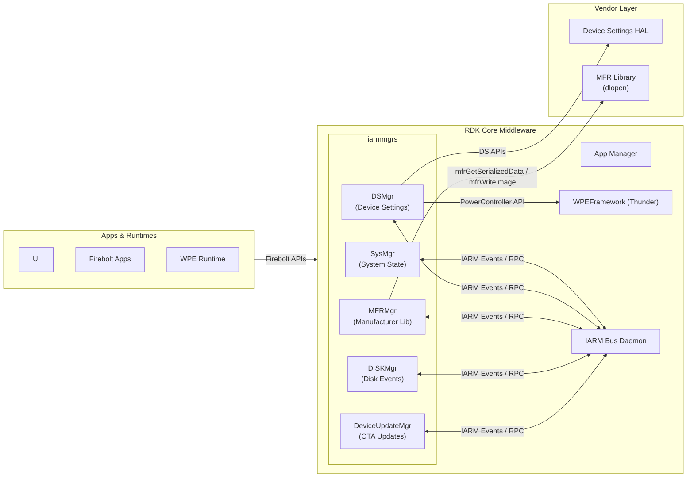
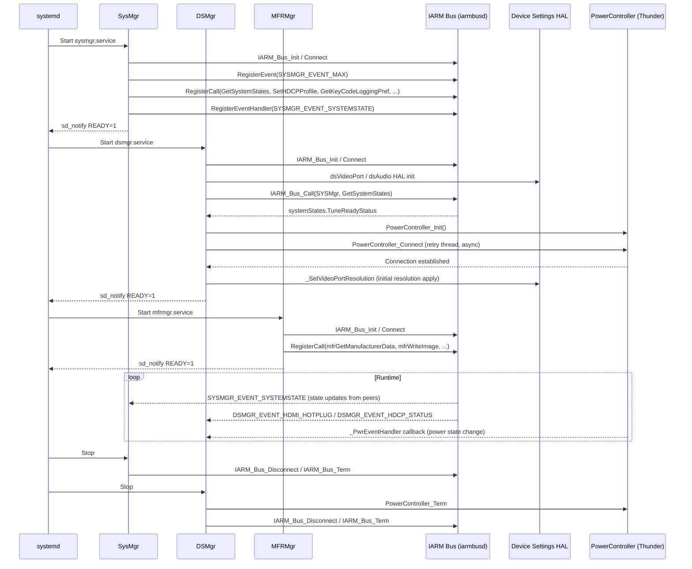
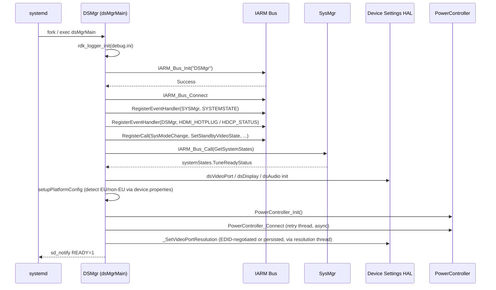
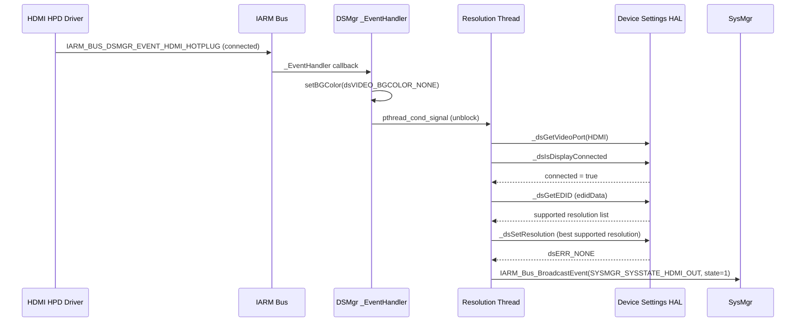
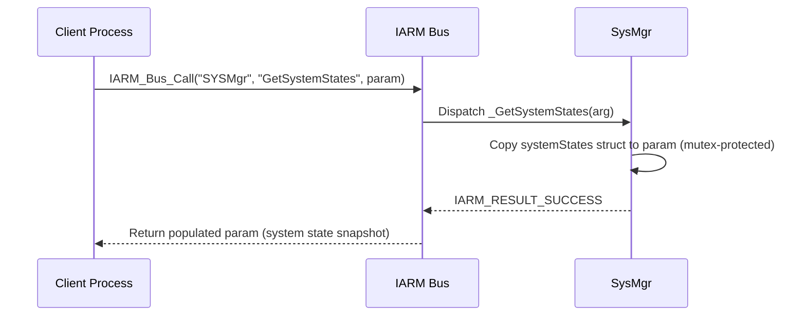

# IARM Managers (iarmmgrs)

---

The IARM Managers (`iarmmgrs`) component is a collection of daemon processes that run in the RDK middleware layer and expose platform subsystem capabilities to the rest of the software stack over the IARM Bus. Each manager registers itself on the bus under a well-known name, publishes events when platform state changes, and services RPC calls from peer processes. Together they provide a unified inter-process interface for device settings, system state tracking, manufacturer-specific operations, disk monitoring, and device update coordination.

At the device level, `iarmmgrs` acts as the bridge between platform hardware capabilities and the higher-level middleware stack. It ensures that audio and video output ports are configured correctly after boot and after HDMI hot-plug events, propagates power state transitions to hardware, manages HDCP authentication state, tracks firmware download progress, and provides other components with queryable snapshots of overall system readiness.

At the module level, each manager daemon is an independent process with its own IARM Bus identity. They interact through broadcast events and direct RPC calls, maintaining loose coupling while sharing a common system state model defined in `sysMgr.h`.



**Key Features & Responsibilities:**

- **System State Aggregation (SysMgr)**: Maintains a central, queryable snapshot of RDK system readiness states — including HDMI output status, HDCP state, firmware download progress, network IP assignment, NTP synchronization, and boot completion — and broadcasts state-change events over the IARM Bus.
- **Device Settings Management (DSMgr)**: Manages audio and video output ports by applying persisted and EDID-negotiated resolutions after boot, HDMI hot-plug, and HDCP authentication. Also handles EAS (Emergency Alert System) audio mode changes and propagates AV port and LED states through the PowerController interface.
- **Manufacturer Library Bridge (MFRMgr)**: Exposes vendor manufacturer library functions — including serialized data read/write, flash image write/verify, PDRI deletion, bank scrubbing, bootloader pattern, thermal monitoring, and CPU clock management — as IARM RPC calls by dynamically loading the MFR shared library at runtime via `dlopen`.
- **Disk Event Management (DISKMgr)**: Connects to the IARM Bus, registers disk events, and runs a signal-guarded loop to report disk-related state changes to peer processes.
- **Device Update Coordination (DeviceUpdateMgr)**: Monitors configured filesystem paths for device update packages, coordinates download and load operations, and broadcasts update status events over the IARM Bus.
- **Power State Integration**: DSMgr connects to the WPEFramework PowerController plugin to receive power state transitions, applying corresponding AV port enable/disable and front-panel LED configurations at each state transition.

---

## Design

The component follows a process-per-manager design where each sub-manager runs as an independent daemon with its own IARM Bus connection. Each daemon follows a common three-phase lifecycle: `Start()` (IARM registration and hardware initialization), `Loop()` (steady-state event processing), and `Stop()` (resource release and bus disconnection). This pattern ensures that each manager can restart independently without disrupting the others.

Southbound interaction with hardware is abstracted through Device Settings APIs for audio and video port management, and through the WPEFramework PowerController plugin interface for power state transitions. The MFR manager takes an additional layer of indirection by resolving all vendor functions at runtime via `dlopen`, allowing the same daemon binary to work across different platform hardware.

Northbound communication is entirely through the IARM Bus. Peer processes and higher-level middleware components subscribe to published events or invoke RPC methods. This decouples the managers from their consumers and allows multiple subscribers to receive the same state-change notification simultaneously.

Power state transitions are handled in DSMgr through a dedicated connection to the WPEFramework PowerController plugin using the `PowerController_Connect()` API. A retry thread ensures connection resiliency at startup. Once connected, power state events are dispatched to a dedicated handler thread that applies the appropriate AV port enable/disable and LED state transitions.

DSMgr uses a GLib main loop (`GMainLoop`) as its steady-state event processing framework. HDMI hot-plug events and resolution setting operations are serialized through the main loop via `g_timeout_add_seconds` and `pthread_cond_signal`, preventing race conditions between concurrent display events.

Configuration state (such as resolution preferences and HDCP profile) is read from the persistent store under `/opt/persistent/ds` and from system properties at `/etc/device.properties`. The platform profile (TV or STB) and geographic region (EU or non-EU) are detected at startup from `device.properties` and govern default resolution fallback behavior.

```mermaid
graph TD

    subgraph IARMMgrs["iarmmgrs (Daemon Processes)"]

        subgraph SYSMgr_Block["SysMgr Process"]
            SYS_INIT["IARM_Bus_Init / Connect\nRegisterEvent / RegisterCall"]
            SYS_STATE["System State Store\n(systemStates struct)"]
            SYS_EVT["_sysEventHandler\n(IARM event listener)"]
            SYS_RPC["RPC Handlers\nGetSystemStates\nSetHDCPProfile / GetHDCPProfile\nSet/GetKeyCodeLoggingPref"]
        end

        subgraph DSMgr_Block["DSMgr Process"]
            DS_INIT["IARM_Bus_Init / Connect\nDS HAL Init\nPowerController_Connect"]
            DS_GLOOP["GLib Main Loop\n(event dispatch)"]
            DS_HPD_THR["HDMI HPD Thread"]
            DS_RESN_THR["Resolution Thread"]
            DS_PWR_THR["Power Event Handler Thread"]
            DS_EVT["_EventHandler\n(SysMgr + DSMgr events)"]
            DS_PWR_EVT["_PwrEventHandler\n(PowerController callback)"]
        end

        subgraph MFRMgr_Block["MFRMgr Process"]
            MFR_INIT["IARM_Bus_Init / Connect\nRegisterCall for all MFR APIs"]
            MFR_DL["dlopen(RDK_MFRLIB_NAME)\ndlsym per API function"]
        end

        subgraph DISKMgr_Block["DISKMgr Process"]
            DISK_INIT["IARM_Bus_Init / Connect\nRegisterEvent"]
            DISK_LOOP["Signal-based loop\n(SIGTERM / SIGINT)"]
        end

        subgraph DevUpdateMgr_Block["DeviceUpdateMgr Process"]
            DU_INIT["IARM_Bus_Init / Connect\ndeviceUpdateStart"]
            DU_LOOP["Folder-watch loop\ndeviceUpdateRun"]
        end
    end

    subgraph External["External Systems"]
        IARMBUS[("IARM Bus Daemon")]
        PWR_CTRL["WPEFramework\nPowerController Plugin"]
        DS_HAL_EXT["Device Settings HAL"]
        MFRLIB_EXT["MFR Shared Library"]
    end

    SYS_INIT --> IARMBUS
    DS_INIT --> IARMBUS
    MFR_INIT --> IARMBUS
    DISK_INIT --> IARMBUS
    DU_INIT --> IARMBUS

    DS_INIT --> PWR_CTRL
    DS_INIT --> DS_HAL_EXT
    DS_PWR_EVT --> DS_HAL_EXT
    MFR_DL --> MFRLIB_EXT
```



### Threading Model

- **Threading Architecture**: Multi-threaded (DSMgr); Single-threaded with event loop (SysMgr, MFRMgr, DISKMgr, DeviceUpdateMgr)
- **Main Thread (DSMgr)**: Runs `DSMgr_Start()` for initialization then enters `g_main_loop_run()` for steady-state event dispatch.
- **Worker Threads (DSMgr)**:
  - _HDMI/Resolution Thread_ (`edsHDMIHPDThreadID`, running `_DSMgrResnThreadFunc`): Monitors HDMI hot-plug and display events and applies EDID-negotiated or persisted video resolutions; waits on a condition variable until tune-ready or HDMI connection events arrive.
  - _Power Event Handler Thread_ (`edsPwrEventHandlerThreadID`, running `dsMgrPwrEventHandlingThreadFunc`): Drains the power event queue and executes AV port and LED state transitions for each power state change.
  - _PowerController Connection Thread_ (`edsPwrConnectThreadID`, running `dsMgrPwrRetryEstablishConnThread`): Retries `PowerController_Connect()` in a loop until the WPEFramework PowerController plugin is available, then detaches.
- **Main Thread (SysMgr)**: Calls `SYSMgr_Start()` for IARM registration, then enters a heartbeat sleep loop in `SYSMgr_Loop()`.
- **Main Thread (MFRMgr)**: Calls `MFRLib_Start()` for IARM registration, then enters `MFRLib_Loop()`.
- **Synchronization**: `pthread_mutex_t` / `pthread_cond_t` pairs protect the HDMI event state and resolution thread wakeup in DSMgr. A separate mutex (`tdsPwrEventQueueMutexLock`) guards the power event queue. SysMgr uses a single mutex (`tMutexLock`) to protect the `systemStates` structure and initialization flag. DeviceUpdateMgr uses `std::mutex` via RAII `std::lock_guard`.
- **Async / Event Dispatch**: IARM event callbacks are invoked on the IARM Bus thread; DSMgr uses `pthread_cond_signal` to hand off work to the HDMI/resolution thread, keeping the callback path short.

### Prerequisites and Dependencies

- **Build Dependencies**: `iarmbus`, `devicesettings`, `devicesettings-hal`, `rdk-logger`, `openssl`, `libsyswrapper`, `rfcapi`, `telemetry`, `boost`, `glib-2.0`, `dbus-1`, `yajl`, `curl`, `deepsleep-manager-headers`, `power-manager-headers`, `wpeframework-clientlibraries`.
- **Plugin Dependencies**: `wpeframework-powermanager` — DSMgr connects to the PowerController plugin; `dsmgr.service` lists `wpeframework-powermanager.service` in `After=`.
- **Device Services / HAL**:
  - Device Settings HAL for video and audio port management.
  - MFR Library (resolved dynamically via `dlopen` at runtime using the path defined by `RDK_MFRLIB_NAME`).
- **IARM Bus**: All sub-managers register under their respective bus names: `SYSMgr`, `DSMgr`, `MFRLib`, `DISKMgr`, `DeviceUpdateMgr`.
- **Systemd Services**:
  - `sysmgr.service`: Requires `iarmbusd.service`; starts after `lighttpd.service` and `iarmbusd.service`.
  - `dsmgr.service`: Requires `iarmbusd.service`; starts after `lighttpd.service`, `iarmbusd.service`, `sysmgr.service`, and `wpeframework-powermanager.service`.
  - `mfrmgr.service`: Requires `iarmbusd.service`; starts after `iarmbusd.service` and `mfrlibapp.service`.
- **Configuration Files**:
  - `/etc/device.properties` — Platform profile and region detection (read at startup by `rdkProfile.c` and `dsMgr.c`).
  - `/etc/debug.ini` or `/opt/debug.ini` — RDK Logger debug configuration (override path takes precedence).
  - `/opt/persistent/ds` — Persistent device settings directory created by DSMgr service on start.
  - `/opt/.hdcp_profile_1` — HDCP profile persistence marker file managed by SysMgr.
  - `/opt/ddcDelay` — Optional file controlling DDC retry count during HDMI resolution negotiation.
  - `/etc/deviceUpdateConfig.json` — Device Update Manager configuration: folder paths to monitor and download/load behavior.
- **Startup Order**: `iarmbusd` → `sysmgr` → `wpeframework-powermanager` → `dsmgr`; `mfrlibapp` → `mfrmgr`.

---

### Component State Flow

#### Initialization to Active State

Each manager daemon follows a Start → Loop → Stop lifecycle. SysMgr initializes first (as required by `dsmgr.service` ordering), registers its system state structure and RPC handlers on the IARM Bus, then enters a heartbeat loop. DSMgr starts after SysMgr and the PowerController plugin are available; it initializes the DS HAL, queries the current tune-ready state from SysMgr, spawns worker threads, sets the initial video port resolution, and enters the GLib main loop. MFRMgr registers all MFR RPC handlers on the IARM Bus without loading the MFR library upfront; each RPC handler resolves its corresponding symbol via `dlopen` on first call.



#### Runtime State Changes

During normal operation, DSMgr responds to HDMI hot-plug events by re-evaluating the connected display's EDID and applying a compatible resolution. HDCP authentication events update the HDCP state in SysMgr's global state structure and trigger or suppress EDID dumps. Power state transitions from the PowerController plugin cause DSMgr to enable or disable AV ports and front-panel LEDs via the Device Settings HAL.

**State Change Triggers:**

- HDMI hot-plug (connect/disconnect): DSMgr re-negotiates video resolution and broadcasts the HDCP state update to SysMgr via `IARM_Bus_BroadcastEvent`.
- HDCP authentication success/failure: DSMgr broadcasts `IARM_BUS_SYSMGR_SYSSTATE_HDCP_ENABLED` and conditionally triggers resolution application or EDID dump.
- Power state transitions (ON / STANDBY / STANDBY_LIGHT_SLEEP / STANDBY_DEEP_SLEEP / OFF): DSMgr's power event handler applies AV port enable/disable, LED state, and HAL power state recording.
- Tune Ready event: DSMgr applies the persisted audio mode and unblocks the resolution thread.
- EAS mode change: DSMgr forces stereo audio during EAS and restores the previous mode when EAS ends.

**Context Switching Scenarios:**

- On receiving `IARM_BUS_SYS_MODE_EAS`, DSMgr switches audio output to stereo regardless of the persisted setting; it restores the saved mode upon EAS exit.
- On transitioning to `POWER_STATE_STANDBY_DEEP_SLEEP`, DSMgr's power event handler responds by disabling video output ports and AV paths via the Device Settings HAL, coordinated through the PowerController plugin callback.

---

### Call Flows

#### Initialization Call Flow



#### Request Processing Call Flow

The following shows how DSMgr processes an HDMI hot-plug connect event and applies the appropriate output resolution.



---

## Internal Modules

| Module / Class              | Description                                                                                                                                                                                                                                                                                                                                  | Key Files                                                                              |
| --------------------------- | -------------------------------------------------------------------------------------------------------------------------------------------------------------------------------------------------------------------------------------------------------------------------------------------------------------------------------------------- | -------------------------------------------------------------------------------------- |
| `SysMgr`                    | Maintains the central system state structure for the device. Registers `IARM_BUS_SYSMGR_EVENT_SYSTEMSTATE` handler to aggregate state updates from all peer components, and exposes `GetSystemStates`, `SetHDCPProfile`, `GetHDCPProfile`, `SetKeyCodeLoggingPref`, and `GetKeyCodeLoggingPref` RPC methods.                                 | `sysmgr/sysMgr.c`, `sysmgr/include/sysMgr.h`                                           |
| `DSMgr`                     | Manages audio and video output port configuration. Handles HDMI hot-plug and HDCP events, applies EDID-negotiated or persisted resolutions, integrates with the PowerController plugin for AV port state transitions, and handles EAS audio mode changes.                                                                                    | `dsmgr/dsMgr.c`, `dsmgr/dsMgrPwrEventListener.c`, `dsmgr/dsMgrInternal.h`              |
| `DSMgrPwrEventListener`     | Power event integration layer within DSMgr. Connects to the WPEFramework PowerController plugin, registers `_PwrEventHandler` as a callback, and dispatches power state changes to a dedicated handler thread that controls AV ports, front-panel LEDs, and HAL power state. Receives external data from PowerController plugin callbacks.   | `dsmgr/dsMgrPwrEventListener.c`, `dsmgr/dsMgrPwrEventListener.h`                       |
| `DSMgrProductTraitsHandler` | Implements UX profile management for TV and STB product variants. Reads `RDK_PROFILE` from `/etc/device.properties` and selects the appropriate default UX controller profile.                                                                                                                                                               | `dsmgr/dsMgrProductTraitsHandler.cpp`, `dsmgr/dsMgrProductTraitsHandler.h`             |
| `MFRMgr`                    | Bridges manufacturer library functions to IARM RPC. Resolves all MFR library symbols lazily via `dlopen` on first RPC invocation. Handles serialized data, flash image write/verify/mirror, PDRI deletion, bank scrubbing, bootloader pattern, splash screen management, and thermal/clock operations when `MFR_TEMP_CLOCK_READ` is enabled. | `mfr/mfrMgr.c`, `mfr/include/mfrMgr.h`, `mfr/mfrMgrInternal.h`                         |
| `DISKMgr`                   | Connects to the IARM Bus, registers disk events, and runs a signal-guarded loop. Handles `SIGTERM` and `SIGINT` for graceful shutdown.                                                                                                                                                                                                       | `disk/diskMgr.c`, `disk/include/diskMgr.h`                                             |
| `DeviceUpdateMgr`           | Monitors configured filesystem folder paths for device update package files, coordinates download acceptance and load operations, and broadcasts status events via the IARM Bus. Receives external data from the paths defined in `deviceUpdateConfig.json`.                                                                                 | `deviceUpdateMgr/deviceUpdateMgrMain.cpp`, `deviceUpdateMgr/include/deviceUpdateMgr.h` |
| `rdkProfile`                | Utility that reads `/etc/device.properties` to determine whether the device is in TV or STB profile mode. Used by DSMgr and DSMgrPwrEventListener for profile-specific behavior selection.                                                                                                                                                   | `utils/rdkProfile.c`, `utils/rdkProfile.h`                                             |
| `iarmutilslogger`           | Utility logger header providing IARM logging macros routed through RDK Logger when enabled, or `printf` otherwise.                                                                                                                                                                                                                           | `utils/iarmutilslogger.h`                                                              |

---

## Component Interactions

### Interaction Matrix

| Target Component / Layer     | Interaction Purpose                                                                                                 | Key APIs / Topics                                                                                                                                                                                                       |
| ---------------------------- | ------------------------------------------------------------------------------------------------------------------- | ----------------------------------------------------------------------------------------------------------------------------------------------------------------------------------------------------------------------- |
| **IARM Bus Peers**           |                                                                                                                     |                                                                                                                                                                                                                         |
| `SYSMgr`                     | DSMgr queries tune-ready state on startup; DSMgr broadcasts HDCP state updates back into SysMgr's event namespace   | `IARM_Bus_Call(SYSMgr, GetSystemStates)`, `IARM_Bus_BroadcastEvent(SYSMgr, SYSTEMSTATE)`                                                                                                                                |
| `DSMgr`                      | SysMgr subscribes to DSMgr events and receives HDCP and HDMI hot-plug status changes                                | `IARM_BUS_DSMGR_EVENT_HDCP_STATUS`, `IARM_BUS_DSMGR_EVENT_HDMI_HOTPLUG`                                                                                                                                                 |
| **Thunder Plugins**          |                                                                                                                     |                                                                                                                                                                                                                         |
| `PowerController`            | DSMgr connects to PowerController to receive power state transitions and applies AV port and LED states in response | `PowerController_Init()`, `PowerController_Term()`, `PowerController_Connect()`, `PowerController_GetPowerState()`, `PowerController_GetPowerStateBeforeReboot()`, `PowerController_RegisterPowerModeChangedCallback()` |
| **Device Services / HAL**    |                                                                                                                     |                                                                                                                                                                                                                         |
| DS Video Port API            | DSMgr applies and queries video output port resolutions                                                             | `_dsSetResolution()`, `_dsGetResolution()`, `_dsInitResolution()`, `_dsGetVideoPort()`, `_dsIsDisplayConnected()`, `_dsGetForceDisable4K()`                                                                             |
| DS Display / EDID API        | DSMgr reads EDID data to negotiate display-supported resolutions                                                    | `_dsGetEDID()`, `_dsGetEDIDBytes()`, `dsGetHDMIDDCLineStatus()`, `_dsGetIgnoreEDIDStatus()`                                                                                                                             |
| DS Audio API                 | DSMgr manages audio port state and stereo mode                                                                      | `_dsGetAudioPort()`, `_dsGetStereoMode()`, `_dsSetStereoMode()`, `_dsEnableAudioPort()`, `_dsGetStereoAuto()`, `_dsIsDisplaySurround()`, `_dsGetEnablePersist()`                                                        |
| DS Front Panel API           | DSMgr sets front-panel indicator state on power transitions                                                         | `_dsSetFPState()`                                                                                                                                                                                                       |
| MFR Library                  | MFRMgr loads vendor MFR functions at runtime via dynamic linking                                                    | `dlopen(RDK_MFRLIB_NAME)`, `dlsym("mfrGetSerializedData")`, `dlsym("mfrWriteImage")`, `dlsym("mfrDeletePDRI")`, `dlsym("mfrScrubAllBanks")`, `dlsym("mfrSetBootloaderPattern")`                                         |
| **IARM Bus**                 |                                                                                                                     |                                                                                                                                                                                                                         |
| IARM Bus Daemon              | All managers use the IARM Bus for event broadcast and RPC dispatch                                                  | `IARM_Bus_Init()`, `IARM_Bus_Connect()`, `IARM_Bus_RegisterEvent()`, `IARM_Bus_RegisterCall()`, `IARM_Bus_RegisterEventHandler()`, `IARM_Bus_BroadcastEvent()`                                                          |
| **External Systems**         |                                                                                                                     |                                                                                                                                                                                                                         |
| RFC (Remote Feature Control) | DSMgr queries RFC parameters for runtime configuration                                                              | `rfcapi` (linked as `-lrfcapi`)                                                                                                                                                                                         |
| Telemetry                    | DSMgr publishes telemetry messages for operational monitoring                                                       | `TELEMETRY_INIT()`, `TELEMETRY_UNINIT()`, `-ltelemetry_msgsender`                                                                                                                                                       |

### Events Published

| Event Name                                      | IARM Bus Name / Topic | Trigger Condition                                                            | Subscriber Components                             |
| ----------------------------------------------- | --------------------- | ---------------------------------------------------------------------------- | ------------------------------------------------- |
| `IARM_BUS_SYSMGR_EVENT_SYSTEMSTATE`             | `SYSMgr`              | Any system state field changes (firmware, network, HDMI, HDCP, bootup, etc.) | Middleware components that track system readiness |
| `IARM_BUS_SYSMGR_EVENT_HDCP_PROFILE_UPDATE`     | `SYSMgr`              | HDCP profile is set or changed                                               | Components managing HDCP-dependent behaviour      |
| `IARM_BUS_SYSMGR_EVENT_XUPNP_DATA_REQUEST`      | `SYSMgr`              | UPnP device info is requested                                                | UPnP manager                                      |
| `IARM_BUS_SYSMGR_EVENT_IMAGE_DNLD`              | `SYSMgr`              | Firmware image download status changes                                       | Receiver / UI                                     |
| `IARM_BUS_SYSMGR_EVENT_EISS_FILTER_STATUS`      | `SYSMgr`              | EISS filter status changes                                                   | EISS processor                                    |
| `IARM_BUS_SYSMGR_EVENT_KEYCODE_LOGGING_CHANGED` | `SYSMgr`              | Key code logging preference is changed                                       | Input manager                                     |
| `IARM_BUS_SYSMGR_EVENT_USB_MOUNT_CHANGED`       | `SYSMgr`              | USB storage device is mounted or unmounted                                   | Storage-aware components                          |
| `IARM_BUS_SYSMGR_EVENT_DEVICE_UPDATE_RECEIVED`  | `SYSMgr`              | Device management update is received                                         | Management plane                                  |
| `IARM_BUS_MFRMGR_EVENT_STATUS_UPDATE`           | `MFRLib`              | Flash image write or verify progress changes                                 | Firmware update orchestrator                      |

### IPC Flow Patterns

**Primary Request / Response Flow:**

IARM RPC calls are dispatched by the bus daemon to the registered handler function within the target manager process. The handler executes synchronously, reads or modifies the relevant hardware or state, and returns an `IARM_Result_t` status code that is relayed back to the caller.



**Event Notification Flow:**

Upon detecting a hardware or IARM event, the manager processes the event data and broadcasts a new event over the IARM Bus. All processes that have registered a handler for that event on that bus name receive the notification.

```mermaid
sequenceDiagram
    participant HDCP_HAL as DS HAL (HDCP Driver)
    participant IARM as IARM Bus
    participant DSMgr as DSMgr _EventHandler
    participant SYSMgr as SysMgr
    participant Other as Other Subscribers

    HDCP_HAL->>IARM: IARM_BUS_DSMGR_EVENT_HDCP_STATUS (authenticated)
    IARM->>DSMgr: _EventHandler callback
    DSMgr->>DSMgr: bHDCPAuthenticated = true; trigger resolution apply
    DSMgr->>IARM: IARM_Bus_BroadcastEvent("SYSMgr", SYSTEMSTATE, HDCP_ENABLED=1)
    IARM->>SYSMgr: _sysEventHandler (update systemStates.hdcp_enabled)
    IARM->>Other: Deliver SYSTEMSTATE event to all registered subscribers
```

---

## Implementation Details

### Major HAL APIs Integration

| HAL / DS API                | Purpose                                                                              | Implementation File                                                    |
| --------------------------- | ------------------------------------------------------------------------------------ | ---------------------------------------------------------------------- |
| `_dsSetResolution()`        | Sets the video output port resolution                                                | `dsmgr/dsMgr.c`                                                        |
| `_dsGetResolution()`        | Queries the current video output port resolution                                     | `dsmgr/dsMgr.c`                                                        |
| `_dsInitResolution()`       | Initialises the video port resolution settings                                       | `dsmgr/dsMgr.c`                                                        |
| `_dsGetEDID()`              | Retrieves EDID data from the connected display                                       | `dsmgr/dsMgr.c`                                                        |
| `_dsGetEDIDBytes()`         | Retrieves raw EDID bytes from the connected display                                  | `dsmgr/dsMgr.c`                                                        |
| `_dsIsDisplayConnected()`   | Checks whether a display is physically connected to the port                         | `dsmgr/dsMgr.c`                                                        |
| `_dsGetForceDisable4K()`    | Queries whether 4K resolution override is forced on the port                         | `dsmgr/dsMgr.c`                                                        |
| `_dsGetIgnoreEDIDStatus()`  | Queries whether EDID data should be ignored for resolution selection                 | `dsmgr/dsMgr.c`                                                        |
| `dsGetHDMIDDCLineStatus()`  | Checks HDMI DDC line readiness before resolution negotiation                         | `dsmgr/dsMgr.c`                                                        |
| `_dsGetVideoPort()`         | Obtains a handle to a video output port by type and index                            | `dsmgr/dsMgr.c`, `dsmgr/dsMgrPwrEventListener.c`                       |
| `_dsEnableVideoPort()`      | Enables or disables a video output port                                              | `dsmgr/dsMgrPwrEventListener.c`                                        |
| `_dsGetAudioPort()`         | Obtains a handle to an audio output port                                             | `dsmgr/dsMgr.c`, `dsmgr/dsMgrPwrEventListener.c`                       |
| `_dsGetStereoMode()`        | Queries the current stereo mode of an audio port                                     | `dsmgr/dsMgr.c`                                                        |
| `_dsSetStereoMode()`        | Sets the stereo mode of an audio port                                                | `dsmgr/dsMgr.c`                                                        |
| `_dsGetStereoAuto()`        | Queries whether the audio port stereo mode is in auto-detect mode                    | `dsmgr/dsMgr.c`                                                        |
| `_dsIsDisplaySurround()`    | Checks whether the connected display supports surround audio                         | `dsmgr/dsMgr.c`                                                        |
| `_dsEnableAudioPort()`      | Enables or disables an audio output port                                             | `dsmgr/dsMgrPwrEventListener.c`                                        |
| `_dsGetEnablePersist()`     | Reads the persistent enable state for an audio port                                  | `dsmgr/dsMgrPwrEventListener.c`                                        |
| `_dsSetFPState()`           | Sets the front-panel indicator state (LED on/off)                                    | `dsmgr/dsMgrPwrEventListener.c`, `dsmgr/dsMgrProductTraitsHandler.cpp` |
| `mfrGetSerializedData()`    | Reads manufacturer-specific serialized device data (resolved via `dlsym`)            | `mfr/mfrMgr.c`                                                         |
| `mfrSetSerializedData()`    | Writes manufacturer-specific serialized device data (resolved via `dlsym`)           | `mfr/mfrMgr.c`                                                         |
| `mfrWriteImage()`           | Validates and writes a firmware image to flash asynchronously (resolved via `dlsym`) | `mfr/mfrMgr.c`                                                         |
| `mfrVerifyImage()`          | Verifies a firmware image asynchronously (resolved via `dlsym`)                      | `mfr/mfrMgr.c`                                                         |
| `mfrDeletePDRI()`           | Deletes the PDRI image from flash (resolved via `dlsym`)                             | `mfr/mfrMgr.c`                                                         |
| `mfrScrubAllBanks()`        | Scrubs all flash banks (resolved via `dlsym`)                                        | `mfr/mfrMgr.c`                                                         |
| `mfrSetBootloaderPattern()` | Sets the front-panel LED bootloader pattern (resolved via `dlsym`)                   | `mfr/mfrMgr.c`                                                         |

### Key Implementation Logic

- **State / Lifecycle Management**: SysMgr holds the `systemStates` structure as a single in-memory store, protected by `tMutexLock`. State fields are initialized to zero at startup (except `hdcp_enabled.state` which defaults to 1) and updated by `_sysEventHandler` as peers broadcast state transitions. DSMgr tracks HDMI connection state, HDCP authentication state (`bHDCPAuthenticated`), and tune-ready flag (`iTuneReady`) as module-level statics.
  - Core SysMgr state: `sysmgr/sysMgr.c`
  - DSMgr connection and HDCP tracking: `dsmgr/dsMgr.c`
  - Power state machine: `dsmgr/dsMgrPwrEventListener.c`

- **Event Processing**: IARM event callbacks (`_sysEventHandler` in SysMgr, `_EventHandler` in DSMgr, `_PwrEventHandler` in DSMgr's power listener) execute on the IARM Bus dispatch thread. DSMgr uses `pthread_cond_signal` to wake its resolution and HDMI threads, keeping callback processing minimal. Power events are queued (`pwrEventQueue`) and drained on the dedicated power event handler thread to decouple event receipt from hardware operation.

- **Error Handling Strategy**: Each IARM call return value is checked against `IARM_RESULT_SUCCESS`. Failures are logged via RDK Logger macros (`INT_ERROR`, `INT_INFO`). DS API errors during resolution negotiation cause DSMgr to fall back through a prioritized resolution list (2160p → 1080p → 1080i → 720p → 576p → 480p, region-dependent) before defaulting to 720p. MFRMgr returns `IARM_RESULT_INVALID_STATE` when the MFR library symbol cannot be resolved. Persistent retries are applied exclusively to the PowerController plugin connection; other IARM RPC failures are handled through logging and error code propagation.

- **Logging & Diagnostics**: Each manager uses the RDK Logger framework when `RDK_LOGGER_ENABLED` is defined at build time, falling back to `printf` otherwise.
  - RDK Logger module names: `LOG.RDK.DSMGR` (DSMgr), `LOG.RDK.MFRMGR` (MFRMgr).
  - DSMgr emits a heartbeat log message every 300 seconds via a GLib timer callback (`heartbeatMsg`).
  - Debug configuration is read from `/opt/debug.ini` if present, otherwise from `/etc/debug.ini`.

---

## Configuration

### Key Configuration Files

| Configuration File             | Purpose                                                                                  | Override Mechanism                                                   |
| ------------------------------ | ---------------------------------------------------------------------------------------- | -------------------------------------------------------------------- |
| `/etc/device.properties`       | Platform profile (`RDK_PROFILE=TV` or `=STB`) and `FRIENDLY_ID` for EU region detection  | Read at startup; the value is determined by the system configuration |
| `/etc/debug.ini`               | RDK Logger verbosity and module filter configuration                                     | Overridden by `/opt/debug.ini` when that file is present             |
| `/opt/persistent/ds`           | Directory for persisted Device Settings state (resolutions, audio modes)                 | Written by DS HAL during operation                                   |
| `/opt/.hdcp_profile_1`         | HDCP profile persistence — presence indicates Profile 1 is active                        | Managed by SysMgr `SetHDCPProfile` / `GetHDCPProfile` handlers       |
| `/opt/ddcDelay`                | Integer controlling DDC retry iterations during HDMI resolution negotiation (default: 5) | Replace file content with desired integer value                      |
| `/etc/deviceUpdateConfig.json` | Device Update Manager configuration: folder paths to monitor and download/load behavior  | Deployed with the system image                                       |

### Key Configuration Parameters

| Parameter                     | Type         | Default              | Description                                                                                                                 |
| ----------------------------- | ------------ | -------------------- | --------------------------------------------------------------------------------------------------------------------------- |
| `ENABLE_DEEP_SLEEP`           | compile flag | enabled              | Enables deep sleep entry and wakeup event support in DSMgr.                                                                 |
| `ENABLE_DEEPSLEEP_WAKEUP_EVT` | compile flag | enabled              | Enables wakeup event processing after returning from deep sleep.                                                            |
| `ENABLE_THERMAL_PROTECTION`   | compile flag | enabled              | Enables thermal protection logic in DSMgr; thermal reset events are processed.                                              |
| `MFR_TEMP_CLOCK_READ`         | compile flag | platform-specific    | Enables MFRMgr RPC handlers for thermal temperature reading and CPU clock speed management.                                 |
| `ENABLE_MFR_WIFI`             | compile flag | distro-feature-gated | Enables MFRMgr Wi-Fi credential erase, get, and set RPC handlers.                                                           |
| `ENABLE_SD_NOTIFY`            | compile flag | enabled              | Enables `sd_notify(READY=1)` signaling to systemd after each manager completes initialization.                              |
| `PLATCO_BOOTTO_STANDBY`       | compile flag | enabled              | Enables boot-to-standby behavior in DSMgr power state handling.                                                             |
| `USE_WAKEUP_TIMER_EVT`        | compile flag | enabled              | Enables scheduled wakeup timer event processing.                                                                            |
| `ENABLE_EU_RESOLUTION`        | compile flag | region-distro-gated  | Activates EU-specific resolution fallback list (includes 576p; uses 50 Hz progressive and 25 Hz interlaced fallback rates). |

### Runtime Configuration

The DDC retry count can be adjusted at runtime without recompilation:

```bash
# Set HDMI DDC retry count to 10 iterations (takes effect on next DSMgr start)
echo "10" > /opt/ddcDelay
```

The debug log verbosity can be overridden at runtime:

```bash
# Place a modified debug.ini to override the system default
cp /etc/debug.ini /opt/debug.ini
# Edit /opt/debug.ini to set desired module log levels
# Changes take effect on next manager restart
```

### Configuration Persistence

- Resolution and audio mode selections are persisted by the Device Settings HAL layer in the `/opt/persistent/ds` directory and restored by DSMgr on the next initialization.
- The HDCP profile selection is persisted by SysMgr as a filesystem marker file (`/opt/.hdcp_profile_1`).
- The key code logging preference is maintained as a runtime in-memory flag in SysMgr (`keyLogStatus`) and resets to the default enabled state on each startup.
- All compile-time feature flags are embedded in the binary at build time and take effect when the binary is deployed.
