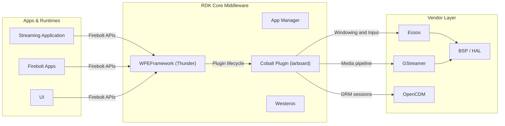
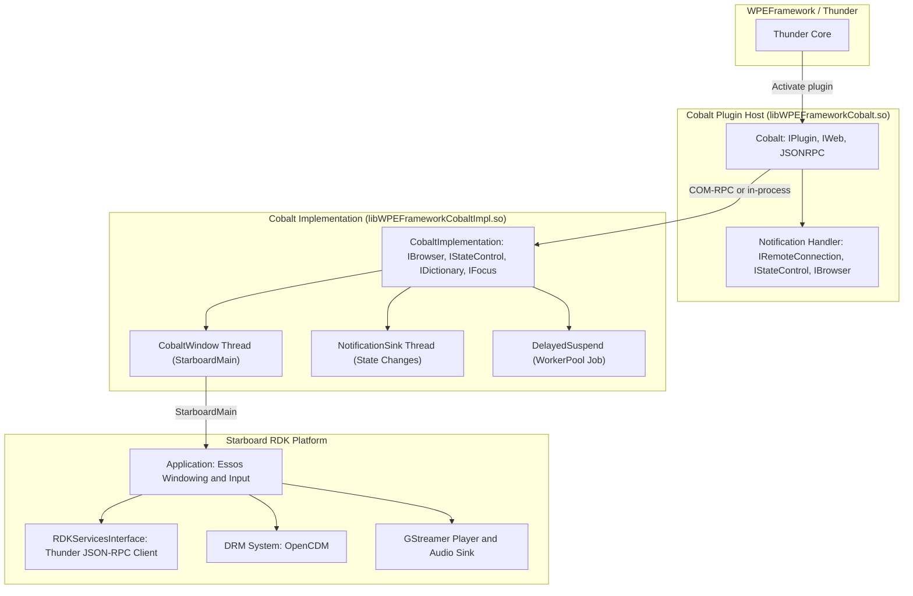
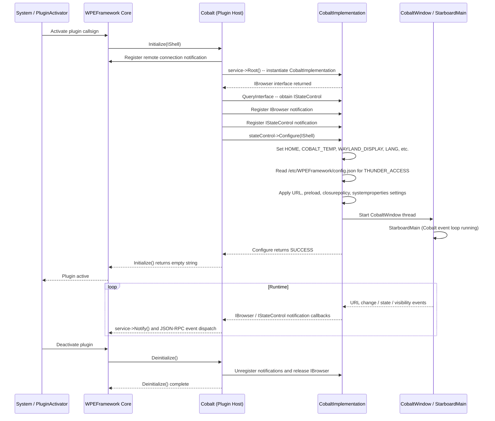
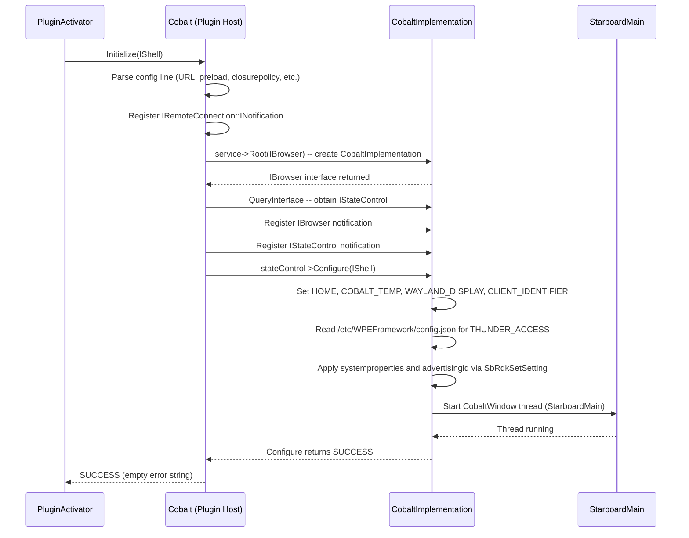
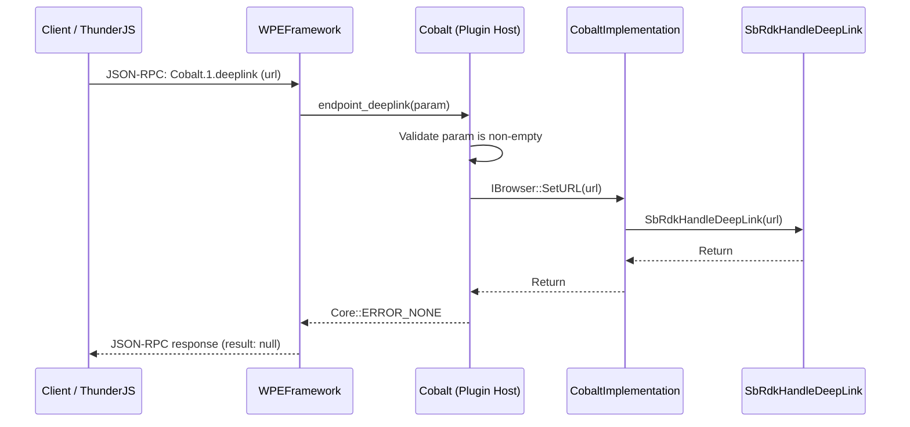
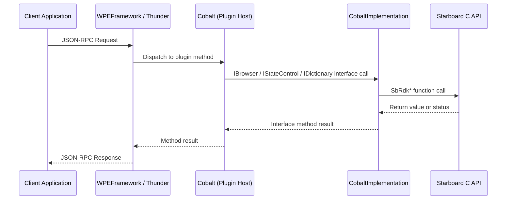
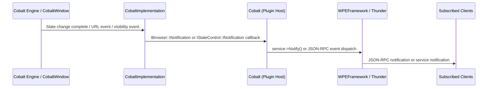

# Cobalt

The Cobalt component (hosted in the `larboard` repository) integrates the Cobalt web browser engine into the RDK middleware stack as a WPEFramework/Thunder plugin. It provides the runtime environment for web-based streaming applications on RDK devices, with YouTube TV as the primary target application.

The component is organized into two coupled parts. The first is a Thunder plugin front-end (`libWPEFrameworkCobalt.so`) that manages the plugin lifecycle, exposes JSON-RPC and REST interfaces, and monitors the browser process for crashes. The second is a platform implementation (`libWPEFrameworkCobaltImpl.so`) that hosts the Cobalt engine via the Starboard API, managing the engine thread, lifecycle state machine, and connections to the GStreamer media pipeline, Essos windowing system, and OpenCDM DRM.

The Starboard RDK platform layer within the repository implements all Cobalt platform abstractions for the RDK environment. This covers audio and video media playback via GStreamer, input handling via Essos, DRM session management via OpenCDM, display and device property queries via Thunder JSON-RPC to peer RDK middleware services, and speech synthesis via the Text-to-Speech service. Configuration is applied once at plugin activation; the engine's own persistent storage is anchored to the Thunder-managed persistent path for the plugin.

**Key Features & Responsibilities:**

- **Plugin Lifecycle Management**: The component initializes the Cobalt engine as a configurable out-of-process or in-process service under Thunder, monitoring the remote connection and recovering from crashes via process termination.
- **Suspend and Resume State Control**: Implements `IStateControl` to allow the system to suspend or resume the Cobalt engine, with a dedicated worker thread handling the asynchronous state transition and a delayed auto-suspend mechanism for preload scenarios.
- **Deep Link Navigation**: Accepts application-specific deep link URLs via JSON-RPC and forwards them to the running Cobalt engine via `SbRdkHandleDeepLink`.
- **Accessibility Settings**: Exposes closed caption and high contrast text settings as a JSON-RPC property that reads from and writes to Cobalt's internal settings store via `SbRdkGetSetting` and `SbRdkSetSetting`.
- **GStreamer-Based Media Pipeline**: Provides audio and video playback through a GStreamer pipeline implementation of the Starboard player API, supporting hardware-accelerated decode and DRM-protected content.
- **OpenCDM DRM Integration**: Implements the Starboard DRM API over OpenCDM, managing key sessions and communicating key status and update requests back to the Cobalt engine.
- **RDK Services Integration**: Queries display capabilities (resolution, HDR format), device properties, network state, advertising identifiers, and text-to-speech from other RDK middleware services via Thunder JSON-RPC links.
- **Evergreen Compatible**: Supports the Cobalt Evergreen loader model, enabling over-the-air updates of the Cobalt engine while the platform layer remains fixed on the device.

---

## Design

The design separates the Thunder plugin host from the browser implementation into two shared libraries. The plugin host (`Cobalt`) is lightweight: it manages plugin activation, the remote process connection for the out-of-process case, and forwards state changes and events between the Thunder layer and the implementation. The implementation (`CobaltImplementation`) owns the Cobalt engine lifecycle, running `StarboardMain` on a dedicated `CobaltWindow` thread. State change commands are dispatched asynchronously via a `NotificationSink` worker thread, ensuring that the Thunder dispatch thread is not blocked waiting on engine state transitions. A `DelayedSuspend` job, scheduled on the WPEFramework worker pool, handles the deferred auto-suspend required when the plugin starts in preload mode.

The northbound interface to Thunder and applications is through the `PluginHost::IPlugin`, `Exchange::IBrowser`, `PluginHost::IStateControl`, `Exchange::IFocus`, `Exchange::IMemory`, and `Exchange::IDictionary` interfaces. These are marshalled over COM-RPC when the implementation runs out-of-process. JSON-RPC methods and properties are registered via the `JSONRPC` base class and dispatched by Thunder. HTTP-based control (suspend, resume, URL set) is also available through the `IWeb` interface. The southbound interface is the Starboard C API, specifically the `SbRdk*` functions exported by `libcobalt.h` and the entry point `StarboardMain`.

The `RDKServicesInterface` within the Starboard platform layer communicates with peer Thunder plugins over Thunder's JSON-RPC link. The `THUNDER_ACCESS` environment variable, set during plugin configuration by reading `/etc/WPEFramework/config.json`, specifies the endpoint. A security token, obtained via `securityagent` when enabled, is attached to JSON-RPC connections as a query parameter.

#### Threading Model

- **Threading Architecture**: Multi-threaded
- **Main Thread**: Handles `Initialize()` and `Deinitialize()` calls, JSON-RPC dispatch (`deeplink`, `get_state`, `set_state`, `get_accessibility`, `set_accessibility`), and HTTP request processing (`Suspend`, `Resume`, URL set via REST).
- **Worker Threads**:
  - _CobaltWindow_: Runs `StarboardMain`, which drives the Cobalt application event loop, rendering, and all browser activity. Calls `SbRdkQuit()` and waits for termination during plugin shutdown.
  - _NotificationSink_: Processes a single pending state change command (SUSPEND, RESUME, or BACKGROUND) by calling the corresponding `SbRdk*` function. Re-schedules itself if a new command is queued while processing the previous one.
- **WorkerPool Job**:
  - _DelayedSuspend_: Scheduled on the WPEFramework worker pool when preload mode is active. Fires after `autosuspenddelay` seconds to issue a SUSPEND command if the engine remains in the suspended-pending state.
- **Synchronization**: A `Core::CriticalSection` (`_adminLock`) in `CobaltImplementation` protects the state variables (`_state`, `_statePending`), the browser notification client list, and the state control client list from concurrent access between the Thunder dispatch thread, the `NotificationSink` thread, and the `DelayedSuspend` job.
- **Async / Event Dispatch**: Browser notifications (`LoadFinished`, `URLChanged`, `Hidden`, `Closure`) originate on the `CobaltWindow` thread and are forwarded to the plugin host over the COM-RPC connection, which then calls `_service->Notify()` and fires JSON-RPC notifications on the Thunder dispatch thread.

### Prerequisites and Dependencies

#### Platform and Integration Requirements

- **Build Dependencies**: `essos`, `gstreamer1.0`, `gstreamer1.0-plugins-base`, `wpeframework`, `entservices-apis`, `wpeframework-clientlibraries`, `openssl`, `gn-native`, `ninja-native`, `bison-native`, `ccache-native`.
- **Runtime Dependencies**: `gstreamer1.0-plugins-base-app`, `gstreamer1.0-plugins-base-playback`, `libloader_app.so` (Cobalt Evergreen engine linked by `CobaltImplementation`).
- **Plugin Dependencies**: `Platform`, `Graphics`, and `Internet` Thunder plugins must be active before the Cobalt plugin initializes, as configured via the `precondition` field in `Cobalt.conf.in`.
- **Optional Build Features**:
  - `rdk_enable_ocdm=true` — OpenCDM DRM support, required for protected content playback.
  - `rdk_enable_securityagent=true` — Enables authenticated Thunder JSON-RPC connections via `securityagent`.
  - `rdk_enable_wpecryptography=true` — Enables WPEFramework Cryptography for platform-accelerated operations.
  - `rdk_enable_rdkservices_api=true` — Enables device, display, TTS, and network service queries (default enabled).
  - `rdk_enable_firebolt_api` — Firebolt RPC integration; when enabled, requires `firebolt-cpp-client` and `firebolt-cpp-transport`.
  - `sb_is_evergreen_compatible=true` — Always set; enables Evergreen loader mode.
  - `PLUGIN_COBALT_EVEGREEN_LITE` — CMake option to pass `--evergreen_lite` to `StarboardMain`.
- **Configuration Files**: `/etc/WPEFramework/config.json` — parsed at runtime to set the `THUNDER_ACCESS` endpoint for JSON-RPC connections to peer plugins.
- **Startup Order**: Cobalt plugin activation requires `Platform`, `Graphics`, and `Internet` plugins to be active. These constraints are enforced via Thunder's precondition mechanism.

---

### Component State Flow

#### Initialization to Active State

The component transitions through the following states during its lifecycle: **Initializing** (register remote connection notification, allocate resources) → **ConnectingImpl** (instantiate `CobaltImplementation` via `Root<Exchange::IBrowser>()`) → **ConfiguringEngine** (`Configure()` sets environment variables, prepares `StarboardMain` arguments, starts `CobaltWindow` thread) → **Active** (handling JSON-RPC calls and events) → **Shutdown** (unregister notifications, release interfaces, terminate remote process).

#### Runtime State Changes

State changes occur when the system requests suspend or resume via the `state` JSON-RPC property, when the application requests concealment, or when focus transitions via `IFocus::Focused()`.

**State Change Triggers:**

- A `set_state(SUSPENDED)` JSON-RPC call or an HTTP POST to `.../Suspend` causes `NotificationSink` to call `SbRdkSuspend()`. On completion, `StateChange(SUSPENDED)` is dispatched to all registered `IStateControl::INotification` clients and a `statechange` JSON-RPC event is emitted.
- A `set_state(RESUMED)` call cancels any pending `DelayedSuspend` and calls `SbRdkResume()`. On completion, `StateChange(RESUMED)` is dispatched to all registered clients.
- `IFocus::Focused(false)` triggers a BACKGROUND state change (calling `SbRdkPause()`), while `IFocus::Focused(true)` triggers a RESUME.
- The `SbRdkSetConcealRequestHandler` callback fires when the Cobalt engine requests concealment; this is mapped to a SUSPEND command followed by a `Closure` notification to all `IBrowser::INotification` clients.
- On remote process crash, the `Deactivated` notification fires and `ConnectionTermination()` forcibly terminates the remote connection.

**Context Switching Scenarios:**

- When `preload=true`, the engine starts in a pre-initialized suspended state. A `DelayedSuspend` job fires after `autosuspenddelay` seconds to issue the actual `SbRdkSuspend()` call if the engine is still in pending-suspended state.
- If the remote process exits unexpectedly, `StateChange(EXITED)` is propagated to all state control clients and the plugin host remains in a disconnected state until deactivated by Thunder.

---

### Call Flows

#### Initialization Call Flow

#### Request Processing Call Flow

The `deeplink` method is the primary request flow. The plugin validates that the parameter is non-empty, forwards the URL to `CobaltImplementation` via `IBrowser::SetURL`, and the implementation delegates to `SbRdkHandleDeepLink`. The call returns synchronously; the Cobalt engine processes the deep link asynchronously.

---

## Internal Modules

| Module / Class         | Description                                                                                                                                                                                                                                                                                             | Key Files                                         |
| ---------------------- | ------------------------------------------------------------------------------------------------------------------------------------------------------------------------------------------------------------------------------------------------------------------------------------------------------- | ------------------------------------------------- |
| `Cobalt`               | Thunder plugin host. Manages plugin lifecycle, remote process connection monitoring, HTTP REST endpoint processing (Suspend, Resume, URL set), JSON-RPC dispatch, and forwarding of browser and state events to Thunder service notifications.                                                          | `Cobalt.cpp`, `Cobalt.h`                          |
| `CobaltImplementation` | Core browser implementation. Implements `IBrowser`, `IStateControl`, `IDictionary`, and `IFocus`. Owns the engine state machine (`_state`, `_statePending`), manages the `CobaltWindow` thread, dispatches lifecycle commands to the Starboard C API, and notifies registered clients of state changes. | `CobaltImplementation.cpp`                        |
| `CobaltWindow`         | Dedicated thread that configures the engine runtime environment (environment variables, content directory, `StarboardMain` arguments) and calls `StarboardMain` to run the Cobalt event loop. Handles engine exit and issues `SbRdkQuit()` during plugin shutdown.                                      | `CobaltImplementation.cpp`                        |
| `NotificationSink`     | Worker thread that processes asynchronous state change commands (SUSPEND, RESUME, BACKGROUND) by calling the corresponding `SbRdk*` function. Re-runs if a new command is queued during processing.                                                                                                     | `CobaltImplementation.cpp`                        |
| `DelayedSuspend`       | WPEFramework worker pool job that fires a deferred SUSPEND command after a configured number of seconds, completing the suspended state transition after a preloaded start.                                                                                                                             | `CobaltImplementation.cpp`                        |
| `Application`          | RDK Starboard application class. Integrates Essos compositing for window creation, display size change events, and keyboard/remote input event injection. Receives external display and input data.                                                                                                     | `application_rdk.cc`, `application_rdk.h`         |
| `RDKServicesInterface` | Starboard platform interface that queries display capabilities (resolution, HDR), device properties, network connectivity, text-to-speech, and advertising identifiers from RDK middleware plugins via Thunder JSON-RPC. Receives external device and platform data.                                    | `rdkservices.cc`, `rdkservices.h`                 |
| `DrmSystemOcdm`        | OpenCDM-based DRM system. Manages DRM key sessions, generates license requests, processes key responses, and reports key status changes to the Cobalt engine via registered callbacks.                                                                                                                  | `drm/drm_system_ocdm.cc`, `drm/drm_system_ocdm.h` |
| `Essos Input`          | Translates Essos keyboard events to Starboard `SbInputData` events. Tracks modifier key state, generates key-repeat events, and maps Linux keycodes to Starboard key identifiers.                                                                                                                       | `ess_input.cc`, `ess_input.h`                     |
| `HangMonitor`          | Per-thread watchdog. Each monitored thread registers a `HangMonitor` instance and calls `Reset()` periodically; the `HangDetector` checks expiration times to identify hung threads.                                                                                                                    | `hang_detector.cc`, `hang_detector.h`             |
| GStreamer Media Player | Implements the Starboard player API over a GStreamer pipeline. Handles A/V demux, decode, HDR signalling, and synchronized playback.                                                                                                                                                                    | `player/`                                         |
| GStreamer Audio Sink   | Implements the Starboard audio sink API using a GStreamer pipeline for audio-only output paths.                                                                                                                                                                                                         | `audio_sink/`                                     |

---

## Component Interactions

The Cobalt plugin communicates northbound with Thunder and applications, and southbound with the Cobalt engine, GStreamer, Essos, OpenCDM, and RDK middleware services.

### Interaction Matrix

| Target Component / Layer        | Interaction Purpose                                                                                  | Key APIs / Topics                                                                                                       |
| ------------------------------- | ---------------------------------------------------------------------------------------------------- | ----------------------------------------------------------------------------------------------------------------------- |
| **Plugins**                     |                                                                                                      |                                                                                                                         |
| `DisplayInfo.1`                 | Query display resolution and HDR format for Starboard media capability reporting                     | `DisplayInfo.1` display resolution and HDR properties methods                                                           |
| `PlayerInfo.1`                  | Query audio output configuration for Starboard audio capability reporting                            | `PlayerInfo.1` audio output methods                                                                                     |
| `org.rdk.Network.1`             | Query network connection state for Starboard network API                                             | `org.rdk.Network.1` connection status methods                                                                           |
| `org.rdk.TextToSpeech.1`        | Text-to-speech: availability check, speak text, and cancel speech via Starboard speech synthesis API | `org.rdk.TextToSpeech.1` speak, cancel, and status methods                                                              |
| `DeviceInfo.1`                  | Query device model, brand, firmware version, and chipset for Starboard system properties             | `DeviceInfo.1` system info methods                                                                                      |
| `org.rdk.AuthService.1`         | Query auth service experience data                                                                   | `AuthService.1`                                                                                                         |
| `org.rdk.UserSettings.1`        | Query user preference settings                                                                       | `UserSettings.1`                                                                                                        |
| `org.rdk.Bluetooth.1`           | Query Bluetooth audio configuration                                                                  | `Bluetooth.1`                                                                                                           |
| **Vendor Layer**                |                                                                                                      |                                                                                                                         |
| Essos                           | Window creation, display resize notifications, keyboard and remote input events                      | Essos context and event listener API (`essos-app.h`)                                                                    |
| GStreamer                       | Audio and video decode pipeline, audio sink                                                          | GStreamer 1.0 pipeline elements                                                                                         |
| OpenCDM                         | DRM key session create, update, close; key status notifications                                      | OpenCDM session management API (`ocdm`)                                                                                 |
| `libloader_app.so`              | Cobalt engine entry point and lifecycle control                                                      | `StarboardMain()`, `SbRdkSuspend()`, `SbRdkResume()`, `SbRdkHandleDeepLink()`, `SbRdkSetSetting()`, `SbRdkGetSetting()` |
| **External Systems**            |                                                                                                      |                                                                                                                         |
| `/etc/WPEFramework/config.json` | Determine Thunder access endpoint for JSON-RPC connections to peer plugins                           | `binding`, `port` fields                                                                                                |

### Events Published

| Event Name         | JSON-RPC Topic              | Trigger Condition                                                            | Subscriber Components                            |
| ------------------ | --------------------------- | ---------------------------------------------------------------------------- | ------------------------------------------------ |
| `statechange`      | `Cobalt.1.statechange`      | Cobalt engine completes a suspend or resume transition, or the process exits | System, App Manager, registered JSON-RPC clients |
| `urlchange`        | `Cobalt.1.urlchange`        | Cobalt navigates to a new URL or finishes loading a page                     | Registered JSON-RPC clients                      |
| `visibilitychange` | `Cobalt.1.visibilitychange` | Cobalt visibility transitions between hidden and visible                     | Registered JSON-RPC clients                      |
| `closure`          | `Cobalt.1.closure`          | Cobalt requests window closure via the conceal request handler               | Registered JSON-RPC clients                      |

### IPC Flow Patterns

**Primary Request / Response Flow:**

The plugin validates the incoming parameter before forwarding the request to `CobaltImplementation` over the COM-RPC channel (out-of-process mode) or via a direct interface call (in-process mode). The implementation delegates to the Starboard C API and returns synchronously.

**Event Notification Flow:**

State change completions and browser events originate on the `CobaltWindow` or `NotificationSink` thread and are dispatched through the registered notification clients back to the plugin host. The plugin host forwards them as Thunder service notifications and JSON-RPC events.

---

## Implementation Details

### Major HAL APIs Integration

| Starboard API                     | Purpose                                                                                                             | Implementation File                       |
| --------------------------------- | ------------------------------------------------------------------------------------------------------------------- | ----------------------------------------- |
| `StarboardMain()`                 | Cobalt engine entry point; drives the application event loop until exit                                             | `main_rdk.cc`, `CobaltImplementation.cpp` |
| `SbRdkHandleDeepLink()`           | Delivers a deep link URL to the running Cobalt application                                                          | `CobaltImplementation.cpp`                |
| `SbRdkSuspend()`                  | Requests the Cobalt engine to enter suspended state                                                                 | `CobaltImplementation.cpp`                |
| `SbRdkResume()`                   | Requests the Cobalt engine to exit suspended state                                                                  | `CobaltImplementation.cpp`                |
| `SbRdkPause()`                    | Requests the Cobalt engine to enter background (non-rendering) state                                                | `CobaltImplementation.cpp`                |
| `SbRdkUnpause()`                  | Requests the Cobalt engine to exit background state                                                                 | `CobaltImplementation.cpp`                |
| `SbRdkQuit()`                     | Requests the Cobalt engine to exit cleanly                                                                          | `CobaltImplementation.cpp`                |
| `SbRdkSetSetting()`               | Passes a JSON-encoded value for a named key into the Cobalt engine (accessibility, advertisingid, systemproperties) | `CobaltImplementation.cpp`                |
| `SbRdkGetSetting()`               | Retrieves a JSON-encoded value for a named key from the Cobalt engine                                               | `CobaltImplementation.cpp`                |
| `SbRdkSetCobaltExitStrategy()`    | Configures whether a window close request results in a suspend or quit                                              | `CobaltImplementation.cpp`                |
| `SbRdkSetConcealRequestHandler()` | Registers a callback invoked when the Cobalt engine requests concealment                                            | `CobaltImplementation.cpp`                |

### Key Implementation Logic

- **State / Lifecycle Management**: `CobaltImplementation` maintains `_state` and `_statePending` under `_adminLock`. A `Request()` call sets `_statePending` and delegates the actual Starboard call to `NotificationSink`. On completion, `StateChangeCompleted()` updates `_state` and notifies all `IStateControl::INotification` clients. If the state change fails (e.g., engine crash), `StateChange(EXITED)` is propagated to all registered clients.
  - Core state machine: `CobaltImplementation.cpp`
  - State transition handler: `NotificationSink::Worker()` in `CobaltImplementation.cpp`

- **Event Processing**: Browser events (`LoadFinished`, `URLChanged`, `Hidden`, `Closure`) arrive as callbacks from the Cobalt engine on the `CobaltWindow` thread and are propagated through the `_cobaltClients` list under `_adminLock`. The plugin host's `Notification` sink receives these callbacks and calls `_service->Notify()` with a raw JSON message on the Thunder notification channel.

- **Error Handling Strategy**: When `service->Root<Exchange::IBrowser>()` returns null during initialization, `Initialize()` returns an error message to Thunder, aborting the activation sequence. When the remote process crashes, the `Deactivated()` notification fires and the plugin host calls `ConnectionTermination()` to terminate the stale connection and clears its interface pointers. During `Deinitialize()`, a return value other than `ERROR_DESTRUCTION_SUCCEEDED` from `_cobalt->Release()` causes `ConnectionTermination()` to be called for explicit connection cleanup.

- **Logging & Diagnostics**: Standard Thunder `TRACE` and `SYSLOG(Logging::Notification, ...)` calls are used throughout. The GStreamer debug level is configurable via the `gstdebug` configuration parameter, with a default of `gstplayer:4,2`. Signal handlers for `SIGINT` and `SIGTERM` are installed in `main_rdk.cc` to map OS signals to `SbSystemRequestStop`.

---

## Configuration

### Key Configuration Files

| Configuration File              | Purpose                                                                                                                                      | Override Mechanism                                            |
| ------------------------------- | -------------------------------------------------------------------------------------------------------------------------------------------- | ------------------------------------------------------------- |
| `/etc/WPEFramework/config.json` | Provides the Thunder binding address and port used to set the `THUNDER_ACCESS` environment variable for JSON-RPC connections to peer plugins | Read once at plugin activation; sourced from the system image |
| Thunder plugin config line      | Contains all plugin-specific parameters (`url`, `language`, `preload`, `closurepolicy`, etc.)                                                | Updated via Thunder configuration management at activation    |

### Key Configuration Parameters

| Parameter          | Type    | Default                       | Description                                                                                                                                                                                                    |
| ------------------ | ------- | ----------------------------- | -------------------------------------------------------------------------------------------------------------------------------------------------------------------------------------------------------------- |
| `url`              | string  | `https://www.youtube.com/tv`  | Initial URL loaded when the Cobalt engine starts                                                                                                                                                               |
| `language`         | string  | (system locale)               | POSIX-style locale ID passed to the Cobalt engine as the `LANG` environment variable (e.g., `en_US`)                                                                                                           |
| `preload`          | boolean | `false`                       | Start the engine in a pre-initialized suspended state without navigating to the URL                                                                                                                            |
| `autosuspenddelay` | number  | `30`                          | Seconds after which the engine is automatically suspended when started in preload mode                                                                                                                         |
| `gstdebug`         | string  | `gstplayer:4,2`               | GStreamer debug category and level string appended to the `GST_DEBUG` environment variable                                                                                                                     |
| `closurepolicy`    | string  | `quit`                        | Action on window close request from the engine: `suspend` or `quit`                                                                                                                                            |
| `contentdir`       | string  | `/usr/share/content/data:...` | Colon-separated list of paths searched for Cobalt content assets, set as `COBALT_CONTENT_DIR`                                                                                                                  |
| `fireboltendpoint` | string  | —                             | Firebolt RPC endpoint URL including session ID query parameter, set as `FIREBOLT_ENDPOINT`                                                                                                                     |
| `systemproperties` | object  | —                             | Device identity properties (modelname, brandname, modelyear, chipsetmodelnumber, firmwareversion, integratorname, friendlyname, devicetype) forwarded to Cobalt via `SbRdkSetSetting("systemproperties", ...)` |
| `advertisingid`    | object  | —                             | Advertising identifier fields (ifa, ifa_type, lmt) forwarded to Cobalt via `SbRdkSetSetting("advertisingid", ...)`                                                                                             |
| `sbmainargs`       | array   | `[]`                          | Additional arguments appended to the `StarboardMain` argument vector (e.g., `--evergreen_lite`)                                                                                                                |
| `clientidentifier` | string  | (callsign)                    | Wayland display name and client identifier suffix, used to set `WAYLAND_DISPLAY` and `CLIENT_IDENTIFIER` environment variables                                                                                 |

### Runtime Configuration

The `accessibility` JSON-RPC property can be written at runtime to update closed caption and high contrast text settings without restarting the plugin. Changes take effect within the running Cobalt engine and are applied internally via `SbRdkSetSetting("accessibility", ...)`.

The `state` JSON-RPC property can be written at runtime to suspend or resume the Cobalt engine. A write of `SUSPENDED` triggers `NotificationSink` to call `SbRdkSuspend()`, while `RESUMED` cancels any pending `DelayedSuspend` and calls `SbRdkResume()`.

### Configuration Persistence

Accessibility settings written via the `accessibility` property are stored within the Cobalt engine's internal settings store, which persists to the Thunder plugin's persistent path (configured as the `HOME` directory for the engine process). The initial URL, preload behavior, and closure policy are determined from the Thunder plugin configuration line at each activation.
