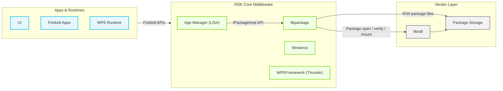
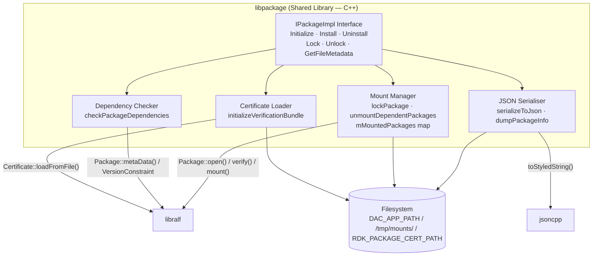
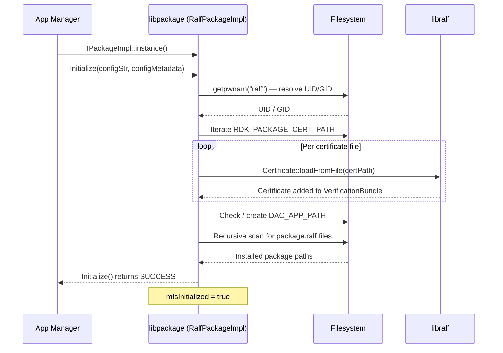
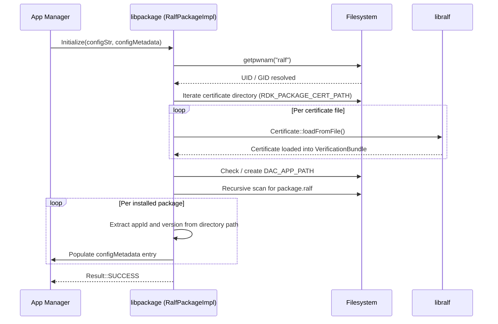
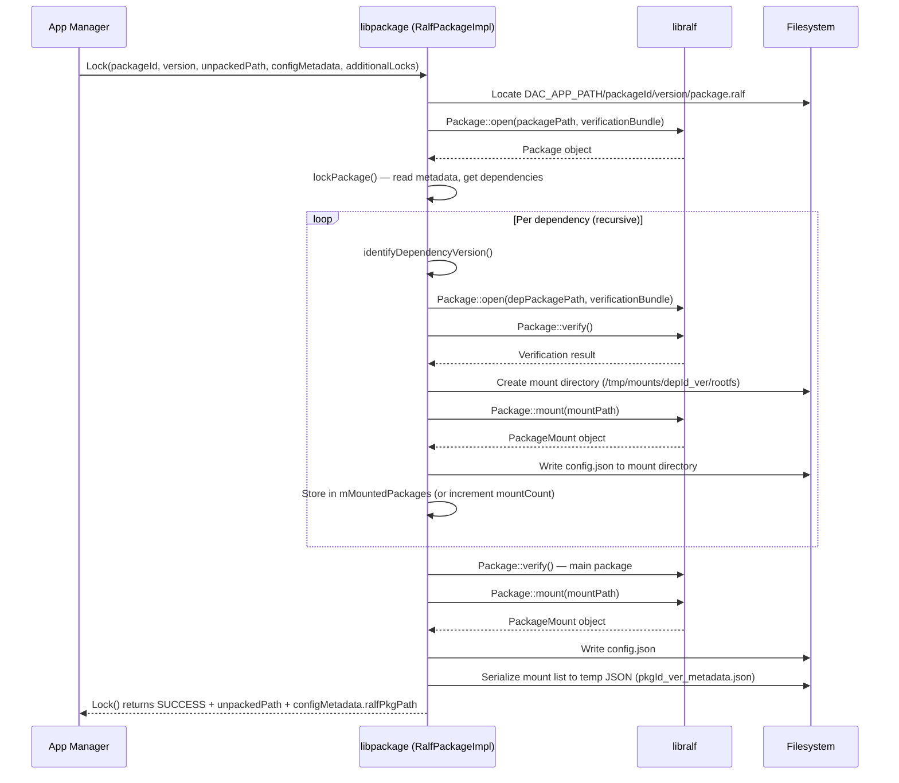
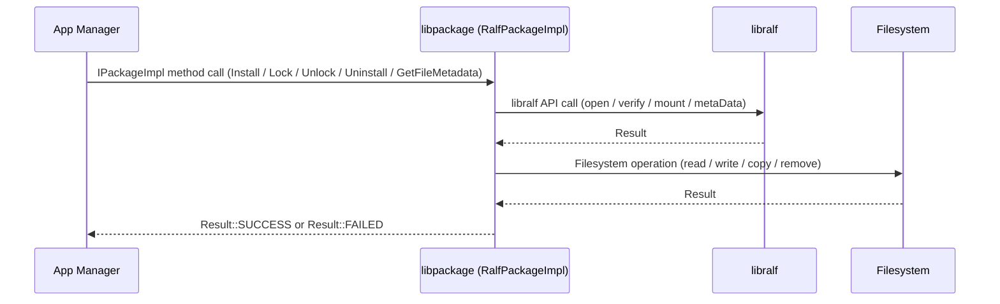

# libpackage

`libpackage` is a shared library that implements the `IPackageImpl` interface, providing the package management abstraction layer used by the Local Inventory & Storage Manager (LISA) for DAC (Downloadable Application Container) applications in the RDK AI 2.0 app management framework. It handles the complete lifecycle of DAC application packages in the RALF (`.ralf`) format: installation to persistent storage, dependency resolution, cryptographic signature verification, on-demand mounting, and removal.

The library sits between the app management layer above — which drives install, launch, and remove workflows — and the `libralf` package-format library below, which provides the underlying mechanics for opening, verifying, and mounting RALF package archives. `libpackage` adds the coordination logic on top: resolving and recursively handling package dependencies, managing mount reference counts, serialising mount metadata as JSON for consumers, and building the certificate verification bundle from the device certificate store.

At the device level, `libpackage` enables an app management stack that installs and runs containerised DAC applications directly from signed RALF packages. Packages are stored persistently on the filesystem, re-discovered at each library initialisation, and mounted on-demand into isolated directories under `/tmp/mounts/` so that the app runtime can locate and execute application content. Dependency packages are resolved and co-mounted in the same operation, ensuring all shared assets are available before the application is launched.

At the module level, `libpackage` exposes six operations through the `IPackageImpl` interface: `Initialize`, `Install`, `Uninstall`, `Lock`, `Unlock`, and `GetFileMetadata`. These map directly to the stages of a DAC application lifecycle as seen by LISA, and the library is obtained via the `IPackageImpl::instance()` factory, which returns the `RalfPackageImpl` implementation.

**Key Features & Responsibilities:**

- **Package Installation**: Accepts a RALF package file locator, performs full cryptographic verification against the device certificate bundle, resolves declared dependencies against the set of already-installed packages, and copies the package to the persistent installation path under `DAC_APP_PATH`.
- **Dependency Resolution**: Before installing or locking a package, reads the package's embedded metadata to enumerate declared dependencies and verifies that each dependency is already installed in a version that satisfies the declared version constraint.
- **Certificate-Based Package Verification**: Loads all certificate files from `RDK_PACKAGE_CERT_PATH` at initialisation to build a `VerificationBundle`, which is subsequently used by `libralf` to verify package signatures on every open and mount operation.
- **Package Locking (Mount Management)**: Mounts a requested package and all of its transitive dependencies into dedicated directories under `/tmp/mounts/`. Maintains a reference count per mounted package so that shared dependency packages are not prematurely unmounted when they are in use by more than one application.
- **Mount Metadata Serialisation**: After a successful lock, serialises the list of all mounted packages — including their mount paths and config JSON paths — into a temporary JSON file, which is returned via `ConfigMetaData.ralfPkgPath` for use by the runtime.
- **Package Unlocking**: Decrements the mount reference count for each package in the dependency tree and unmounts those packages whose count reaches zero.
- **Installed Package Discovery**: On `Initialize()`, scans `DAC_APP_PATH` recursively to discover all packages already present on the filesystem and populates the initial installed-package list and configuration metadata for the caller.

---

## Design

`libpackage` is designed as a single-class shared library that implements a well-defined interface contract (`IPackageImpl`) driven by the app management layer above. The design separates the public API surface — `Initialize`, `Install`, `Uninstall`, `Lock`, `Unlock`, and `GetFileMetadata` — from the private coordination logic in `RalfPackageImpl`, which handles certificate loading, dependency graph traversal, mount lifecycle, and JSON metadata serialisation. All operations guard against use before initialisation by checking `mIsInitialized` at entry, ensuring that callers receive a deterministic `FAILED` result rather than undefined behaviour if the initialisation sequence is incomplete.

Dependency handling uses a recursive descent strategy: the `lockPackage()` function resolves and mounts each dependency before mounting the package itself, matching the order in which the package metadata enumerates dependencies. Mount reference counting in `mMountedPackages` — a `std::map` keyed on `packageId + "_" + version` — ensures that a dependency shared by multiple applications is mounted once and only unmounted when the last consumer releases it. This design avoids redundant mounts while still allowing independent lock and unlock calls from multiple callers.

The northbound interaction with the app management layer is entirely through the `IPackageImpl` interface. The `IPackageImpl::instance()` factory in `RalfPackageHandler.cpp` constructs a `RalfPackageImpl` instance, which is returned as a `std::shared_ptr<IPackageImpl>`. This keeps the caller decoupled from the concrete implementation class.

The southbound interaction is with the `libralf` library, which handles the RALF archive format. `libpackage` calls `ralf::Package::open()` to parse and validate a package file against the verification bundle, `ralf::Package::verify()` for full signature verification, `ralf::Package::mount()` to mount the archive filesystem, and `ralf::Package::metaData()` to read embedded metadata including dependencies and permissions. `libpackage` holds the resulting `ralf::PackageMount` objects inside the `MountedPackageInfo` structure to ensure they remain live for the duration of the lock.

Communication with the app management layer is entirely through the `IPackageImpl` interface via direct in-process function calls. JSON serialisation via `jsoncpp` is scoped to writing mount metadata to the temporary file whose path is returned to the caller via `ConfigMetaData.ralfPkgPath`.

Package files are stored persistently on the filesystem at `DAC_APP_PATH/{packageId}/{version}/package.ralf`. Mount points are created transiently under `/tmp/mounts/{packageId}_{version}/rootfs/` and are cleaned up on `Unlock()`. Configuration metadata files (`config.json`) are written alongside each mount point and are re-used on subsequent lock requests to avoid redundant extraction from the archive.

#### Threading Model

- **Threading Architecture**: Single-threaded. All operations execute synchronously on the calling thread.
- **Main Thread**: All `IPackageImpl` operations — including recursive dependency traversal in `lockPackage()` and filesystem enumeration in `Initialize()` — run to completion on the caller's thread before returning.
- **Synchronization**: All operations are synchronous. Thread safety for concurrent access to the same instance is the caller's responsibility.

### Prerequisites and Dependencies

#### Platform and Integration Requirements

- **Build Dependencies**: `packager-headers` (provides the `IPackageImpl` interface and associated types); `ralf-utils` (provides the `libralf` package format library); `jsoncpp` (JSON value construction and serialisation).
- **Device Services / HAL**: `libralf` is the package-format library acting as the abstraction layer below `libpackage`. The full API surface used is: `ralf::Package::open()` (parse and validate a package file with certificate expiry check), `ralf::Package::verify()` (full cryptographic signature verification), `ralf::Package::mount()` (mount the RALF archive rootfs into a directory), `ralf::Package::metaData()` (read embedded package metadata including dependencies, type, and application info), `ralf::PackageMount::isMounted()` / `ralf::PackageMount::unmount()` (mount lifecycle control), `ralf::Certificate::loadFromFile()` (load a certificate from a PEM/DER file), `ralf::VersionNumber::fromString()` (parse a version string), `ralf::VersionConstraint::isSatisfiedBy()` (evaluate whether an installed version satisfies a declared constraint).
- **Configuration Files**: Certificate files located in `RDK_PACKAGE_CERT_PATH` (default `/etc/rdk/certs`) are loaded during `Initialize()` to build the package signature verification bundle.

---

### Component State Flow

#### Initialization to Active State

`libpackage` begins in an uninitialised state immediately after the `RalfPackageImpl` instance is created via `IPackageImpl::instance()`. The `Initialize()` call drives the library through its setup sequence: it first resolves the UID and GID of the designated package-management user via `getpwnam()`, then builds the verification bundle by loading all certificate files found in `RDK_PACKAGE_CERT_PATH`. If either step fails, `Initialize()` returns `FAILED` and `mIsInitialized` remains `false`. When `DAC_APP_PATH` does not yet exist it is created; if it already exists, all `package.ralf` files are discovered recursively and the caller's `ConfigMetadataArray` is populated with their identifiers, versions, and user/group ownership. On success, `mIsInitialized` is set to `true`.

The component transitions through the following states: **Uninitialised** (instance created, no operations permitted) → **Initialising** (user info lookup, certificate loading, package discovery) → **Active** (all six `IPackageImpl` operations available) → **Torn Down** (instance destroyed, all `PackageMount` RAII objects released).

#### Runtime State Changes

Once active, `libpackage` responds exclusively to direct API calls. Its internal state evolves only through those calls: the `mInstalledPackages` list grows on `Install()` and shrinks on `Uninstall()`, and the `mMountedPackages` map grows on `Lock()` and shrinks on `Unlock()`.

**State Change Triggers:**

- `Install()` called with a valid, verified package causes the package to be added to `mInstalledPackages` and its file to be copied to `DAC_APP_PATH`.
- `Lock()` called for an already-mounted package increments that package's mount count rather than performing a new mount, ensuring idempotent behaviour under concurrent launch requests for the same app.
- `Uninstall()` removes the package files from `DAC_APP_PATH`. When a package has active mounts, `Unlock()` should be called prior to `Uninstall()` to cleanly release the mount.

**Context Switching Scenarios:**

- A second call to `Initialize()` on the same instance triggers the full setup sequence again, reloading user/group and certificate information.

---

### Call Flows

#### Initialization Call Flow

#### Request Processing Call Flow

The Lock operation is the most representative call flow, as it combines package opening, dependency resolution, recursive mounting, config extraction, and JSON serialisation into a single synchronous operation.

When `Lock()` is called, the package file is opened and validated against the certificate bundle without performing full signature verification (full verification is deferred to explicit `verify()` calls at install time and during the lock mount step). The `lockPackage()` function then recurses into each declared dependency — opening, mounting, and reference-counting each — before mounting the requested package itself. On completion, the full list of mounted packages and their metadata paths is serialised to a temporary JSON file, whose path is returned via `configMetadata.ralfPkgPath`.

---

## Internal Modules

| Module / Class             | Description                                                                                                                                                                                                                                               | Key Files                                     |
| -------------------------- | --------------------------------------------------------------------------------------------------------------------------------------------------------------------------------------------------------------------------------------------------------- | --------------------------------------------- |
| `RalfPackageImpl`          | Primary implementation class. Implements all six `IPackageImpl` operations. Owns the verification bundle, the installed-package list, and the mounted-package map. Receives package file paths and serialised configuration strings from the App Manager. | `RalfPackageHandler.cpp`, `RalfPackageImpl.h` |
| `IPackageImpl::instance()` | Factory function that constructs and returns a `std::shared_ptr<IPackageImpl>` pointing to a new `RalfPackageImpl`. Acts as the sole entry point for callers obtaining a library instance.                                                                | `RalfPackageHandler.cpp`                      |
| `MountedPackageInfo`       | Internal bookkeeping structure. Holds the `ralf::PackageMount` RAII object, the path to the extracted `config.json`, and a reference count for tracking how many concurrent locks hold a given package mounted.                                           | `RalfPackageImpl.h`                           |
| `RalfPackageInfo`          | Plain data structure used during a lock operation to accumulate the mount path and metadata JSON path for each package in the dependency tree before they are serialised to the output JSON file.                                                         | `RalfPackageImpl.h`                           |
| `PackageImplTestApp`       | Interactive command-line test utility that exercises all `IPackageImpl` operations. Built only when `BUILD_TEST_APP=ON`. Not included in the production library.                                                                                          | `PackageImplTestApp.cpp`                      |

---

## Component Interactions

All interactions are in-process: the app management layer invokes library operations through the `IPackageImpl` interface, and `libpackage` in turn calls `libralf` and `jsoncpp` as direct shared-library dependencies.

### Interaction Matrix

| Target Component / Layer | Interaction Purpose                                                                                                    | Key APIs                                                                                                                                                                                                                                      |
| ------------------------ | ---------------------------------------------------------------------------------------------------------------------- | --------------------------------------------------------------------------------------------------------------------------------------------------------------------------------------------------------------------------------------------- |
| **Libraries**            |                                                                                                                        |                                                                                                                                                                                                                                               |
| `libralf`                | Open, verify, mount, and read metadata from RALF package archives; load X.509 certificates for the verification bundle | `Package::open()`, `Package::verify()`, `Package::mount()`, `Package::metaData()`, `PackageMount::isMounted()`, `PackageMount::unmount()`, `Certificate::loadFromFile()`, `VersionNumber::fromString()`, `VersionConstraint::isSatisfiedBy()` |
| `jsoncpp`                | Serialise the list of mounted packages (mount paths and metadata paths) to a JSON file                                 | `Json::Value`, `Json::arrayValue`, `Value::toStyledString()`                                                                                                                                                                                  |
| **Filesystem**           |                                                                                                                        |                                                                                                                                                                                                                                               |
| `DAC_APP_PATH`           | Persistent storage for installed RALF package files; enumerated on `Initialize()`                                      | `std::filesystem::copy_file()`, `create_directories()`, `remove_all()`, `recursive_directory_iterator()`                                                                                                                                      |
| `/tmp/mounts/`           | Transient mount points for locked packages and their dependencies                                                      | `std::filesystem::create_directories()`                                                                                                                                                                                                       |
| `RDK_PACKAGE_CERT_PATH`  | Certificate store read at initialisation to build the `VerificationBundle`                                             | `std::filesystem::directory_iterator()`, `Certificate::loadFromFile()`                                                                                                                                                                        |
| **POSIX System**         |                                                                                                                        |                                                                                                                                                                                                                                               |
| User/group lookup        | Resolve the UID and GID of the package-management user to set ownership on installed and mounted package directories   | `getpwnam()`                                                                                                                                                                                                                                  |

### IPC Flow Patterns

The App Manager accesses `libpackage` through direct in-process function calls via the `IPackageImpl` interface obtained from `IPackageImpl::instance()`.

**Primary Request / Response Flow:**

All operations follow a synchronous call-and-return pattern. The App Manager calls an `IPackageImpl` method, which executes synchronously (including any `libralf` calls and filesystem operations) and returns a `Result` enum (`SUCCESS` or `FAILED`) directly to the caller.

---

## Implementation Details

### Major HAL APIs Integration

| HAL / Library API                          | Purpose                                                                                                                                      | Implementation File      |
| ------------------------------------------ | -------------------------------------------------------------------------------------------------------------------------------------------- | ------------------------ |
| `ralf::Package::open()`                    | Parse a `.ralf` package archive, validate its certificate against the verification bundle (with expiry check), and return a `Package` object | `RalfPackageHandler.cpp` |
| `ralf::Package::verify()`                  | Perform full cryptographic signature verification on an opened package                                                                       | `RalfPackageHandler.cpp` |
| `ralf::Package::mount()`                   | Mount the package's rootfs archive into a specified directory path                                                                           | `RalfPackageHandler.cpp` |
| `ralf::Package::metaData()`                | Read the embedded `PackageMetaData` from the package, which includes declared dependencies, package type, and application permissions        | `RalfPackageHandler.cpp` |
| `ralf::Package::auxMetaDataFile()`         | Extract the embedded auxiliary metadata file matching a given MIME type (`application/vnd.rdk.package.config.v1+json`)                       | `RalfPackageHandler.cpp` |
| `ralf::PackageMount::isMounted()`          | Query whether a `PackageMount` instance's filesystem mount is still active                                                                   | `RalfPackageHandler.cpp` |
| `ralf::PackageMount::unmount()`            | Tear down the filesystem mount associated with a `PackageMount` instance                                                                     | `RalfPackageHandler.cpp` |
| `ralf::Certificate::loadFromFile()`        | Load an X.509 certificate from a filesystem path and return it for addition to the `VerificationBundle`                                      | `RalfPackageHandler.cpp` |
| `ralf::VersionNumber::fromString()`        | Parse a version string into a structured `VersionNumber` for comparison                                                                      | `RalfPackageHandler.cpp` |
| `ralf::VersionConstraint::isSatisfiedBy()` | Evaluate whether an installed package's version number satisfies a dependency's declared version constraint                                  | `RalfPackageHandler.cpp` |

### Key Implementation Logic

- **State / Lifecycle Management**: The `mIsInitialized` boolean in `RalfPackageImpl` acts as the sole lifecycle guard. All five non-`Initialize` operations check it at entry and return `Result::FAILED` immediately if `false`. State transition logic is confined to `Initialize()` in `RalfPackageHandler.cpp`.
  - Core implementation: `RalfPackageHandler.cpp`

- **Error Handling Strategy**: Errors from `libralf` (returned as `ralf::Result` types with embedded `ralf::Error`) are checked at each call site via the `bool` conversion of the result object. On failure, the specific error message is extracted via `.error().what()` and logged to `std::cerr` with the `[libPackage]` prefix before returning `Result::FAILED` or `false` to the caller. Filesystem errors from `std::filesystem` operations are caught as `std::filesystem::filesystem_error` exceptions in `Install()` and `Uninstall()` and translated to `Result::FAILED`. No retry logic is present; all failures are terminal for that operation.

- **Logging & Diagnostics**: All log output is written to `std::cout` (informational) or `std::cerr` (errors and warnings) using the `[libPackage]` prefix. The build revision string injected via the `BUILD_REFERENCE` compile-time define is logged to `std::cout` at construction time. Dependency check operations are additionally tagged with `[DEPENDENCY_CHECK]`, and mount failures with `[RALFMOUNT]`, to aid log filtering.

---

## Configuration

### Key Configuration Parameters

All configuration parameters are compile-time constants injected as preprocessor definitions. They cannot be changed at runtime without rebuilding the library.

| Parameter                  | Type                     | Default                 | Description                                                                                                                                                                |
| -------------------------- | ------------------------ | ----------------------- | -------------------------------------------------------------------------------------------------------------------------------------------------------------------------- |
| `DAC_APP_PATH`             | string (filesystem path) | `/opt/media/apps/`      | Root directory under which DAC application packages are installed. Created if absent on `Initialize()`.                                                                    |
| `RDK_PACKAGE_CERT_PATH`    | string (filesystem path) | `/etc/rdk/certs`        | Directory from which signing certificates are loaded to build the package `VerificationBundle` used for all package open and verification operations.                      |
| `DISABLE_DEPENDENCY_CHECK` | bool (compile flag)      | `false` (check enabled) | When defined, sets `RalfPackageImpl::enableDependencyCheck` to `false`, causing `Install()` and `Lock()` to skip dependency resolution against the installed-package list. |
| `BUILD_REFERENCE`          | string                   | `"undefined"`           | Build revision identifier (populated from `SRCREV` by the Yocto recipe). Logged to `std::cout` at library construction time.                                               |
| `BUILD_TEST_APP`           | bool (cmake option)      | `OFF`                   | When `ON`, the `PackageImplTestApp` interactive test executable is compiled and installed. Has no effect on the production `libPackage` shared library.                    |

### Configuration Persistence

Installed DAC application package files are persisted on the filesystem under `DAC_APP_PATH/{packageId}/{version}/package.ralf` and are re-discovered on each call to `Initialize()`. Mount directories under `/tmp/mounts/` and temporary JSON metadata files written during `Lock()` are transient and re-created on each lock operation.
