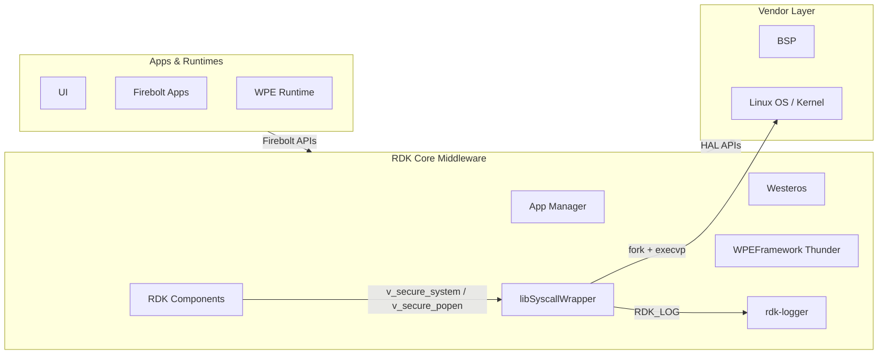
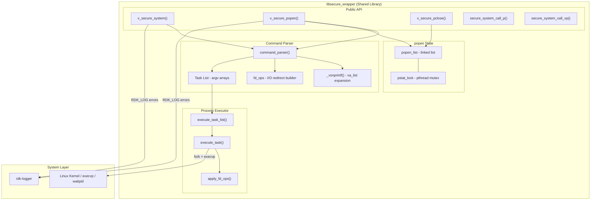
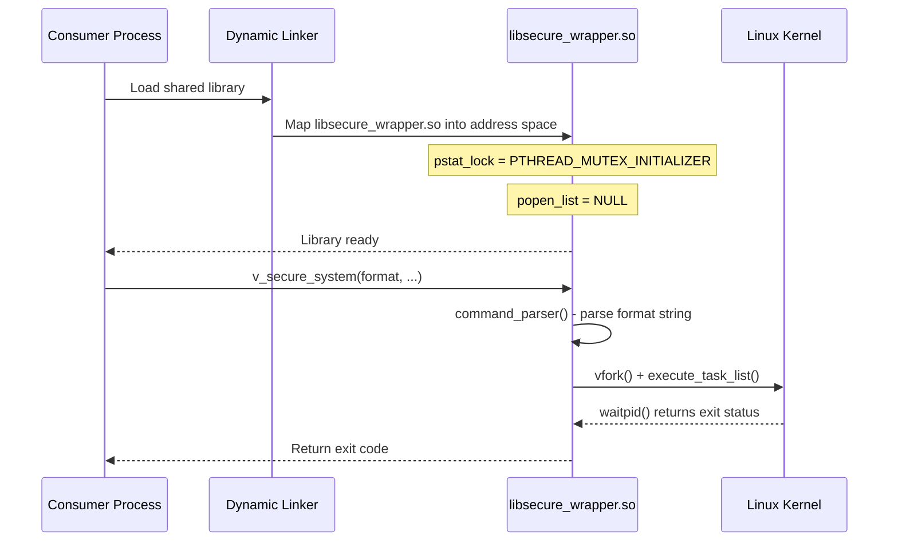
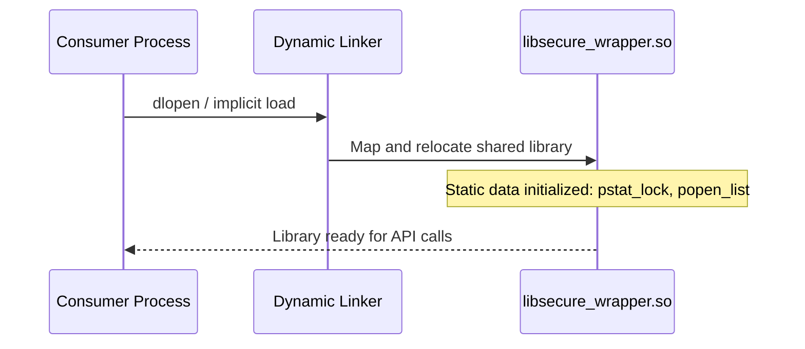
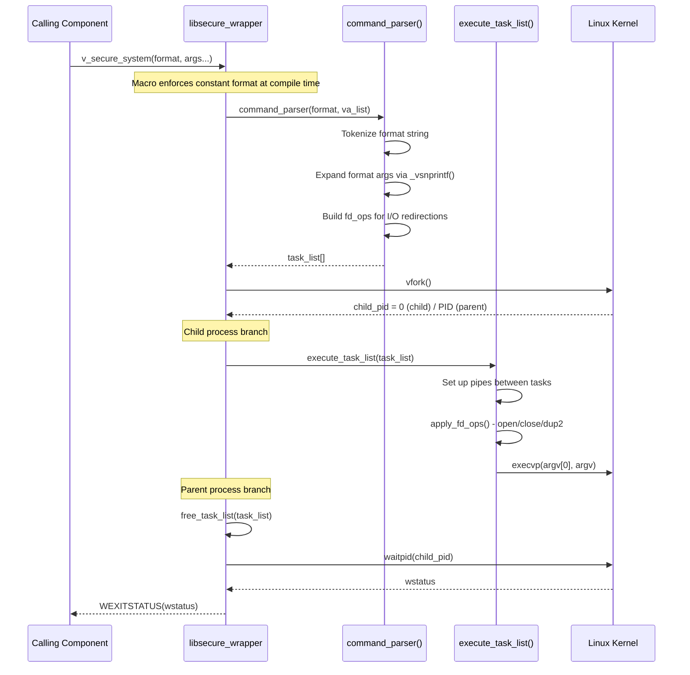
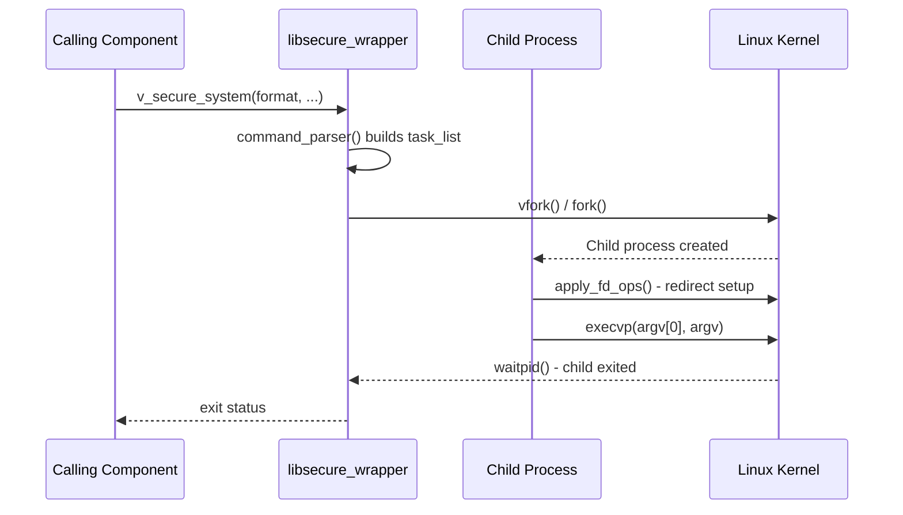
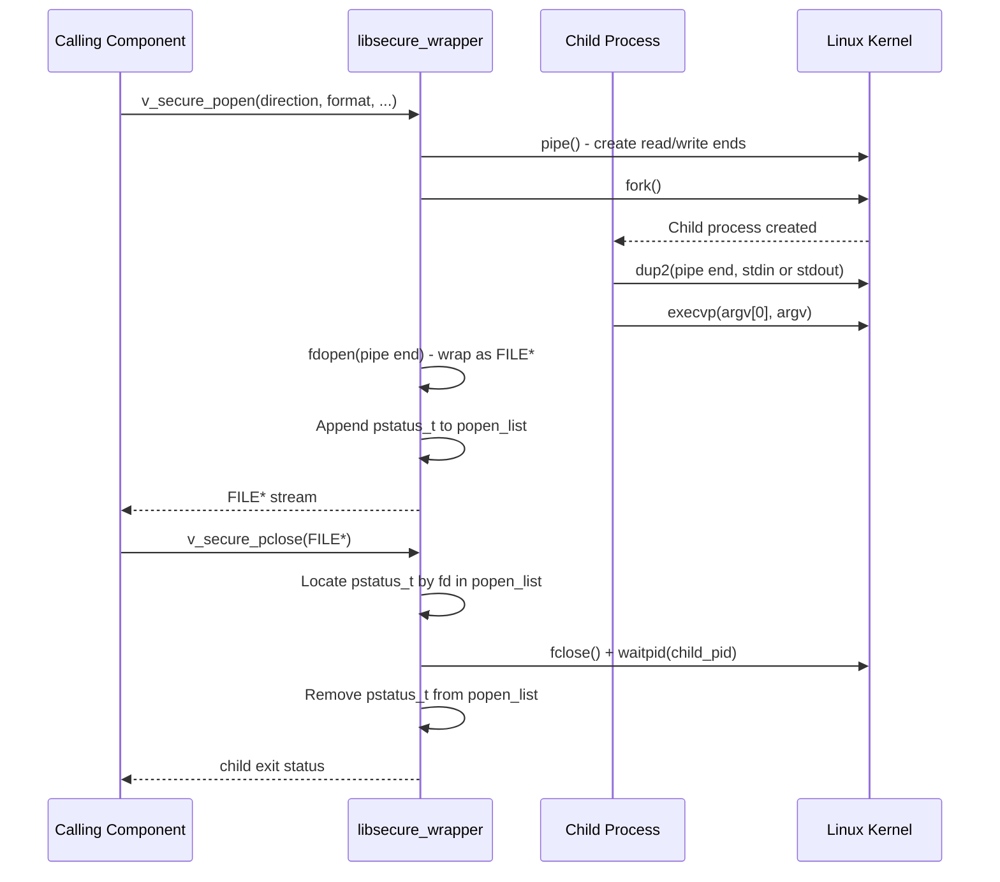

# libSyscallWrapper

libSyscallWrapper is an RDK middleware utility library that provides secure, injection-safe replacements for the standard POSIX `system()` and `popen()` functions. When other RDK components need to execute external processes or shell command pipelines, they use this library instead of calling the standard C library functions directly. The library eliminates shell injection vulnerabilities by parsing command strings internally and invoking processes through `fork` and `execvp` rather than through a shell interpreter. Format strings are enforced to be compile-time constants, ensuring that dynamic user-supplied data cannot be interpolated as command syntax.

As a device, libSyscallWrapper raises the security posture of the entire RDK software stack. Any middleware daemon or service that previously used `system()` or `popen()` calls — and therefore relied on `/bin/sh` to interpret the command — is a candidate for migration to this library. By doing so, the attack surface for command injection on deployed devices is reduced without requiring each individual component to implement its own sandboxing logic.

At the module level, libSyscallWrapper exposes a small, focused public API: `v_secure_system()` and `v_secure_popen()` as primary interfaces, `v_secure_pclose()` to close popen streams, and `secure_system_call_p()` / `secure_system_call_vp()` as legacy-compatible entry points that accept an argv array directly. Internally, the library implements a purpose-built command parser that handles pipes, semicolons, `&&`/`||` operators, subshell expressions, and I/O redirection without delegating any interpretation to a shell process.

**Key Features & Responsibilities:**

- **Shell-Free Process Execution**: Commands are parsed into an argv-based task list and executed directly via `fork` and `execvp`, bypassing `/bin/sh` entirely and eliminating the class of vulnerabilities that arise when user-controlled strings are passed to a shell interpreter.

- **Compile-Time Format Enforcement**: The `v_secure_system()` and `v_secure_popen()` macros leverage GCC compiler extensions (`__builtin_constant_p`, `__attribute__((format))`) to generate a compile-time error if the command template is not a string literal. This makes it structurally impossible to call the functions with a dynamically assembled command buffer.

- **Multi-Command Pipeline Support**: The internal command parser natively supports pipes (`|`), sequential execution (`;`), logical AND (`&&`), logical OR (`||`), background execution (`&`), subshell grouping (`(...)`), and all standard I/O redirection forms (`>`, `>>`, `<`, `2>`, `&>`, `2>&1`).

- **Thread-Safe popen Tracking**: Open popen streams are tracked in a linked list (`popen_list`) protected by a mutex. This ensures that `v_secure_pclose()` can safely locate and clean up any open child process from any thread.

- **Input Limits Enforcement**: The parser enforces upper bounds on argument length (2048 bytes), argument count (512 per command), and command chain depth (32 commands), failing safely when limits are exceeded.

- **Legacy API Compatibility**: `secure_system_call_p()` and `secure_system_call_vp()` provide a direct `execvp`-style interface for callers that already construct an explicit argv array, allowing migration of existing code without requiring format string adoption.

- **Integrated RDK Logging**: When built with rdk-logger support, the library emits diagnostics and error messages through the standard RDK logging subsystem under the module identifier `LOG.RDK.LIBSYSCALLWRAPPER`.

---

## Design

libSyscallWrapper is designed around the principle of structural command interpretation: rather than delegating command parsing to a shell, it implements its own parser that produces a structured task list. Each task in the list holds its own argv array, a list of file-descriptor operations (open, close, dup2), a connecting token (pipe, AND, OR, semicolon), and an optional subshell reference. This representation separates the data plane (arguments supplied by the caller) from the control plane (operators and redirections specified in the literal format string). Because the format string is required to be a compile-time constant, the control plane cannot be manipulated at runtime.

The parser (`command_parser`) processes the format string character by character, expanding `printf`-style format specifiers using a custom `_vsnprintf` wrapper that advances the `va_list` incrementally. Each expanded argument is stored as an independent `strdup`-ed string in the current task's argv array. Operators and redirection tokens in the format string are translated into task boundaries and `fd_ops` structures rather than being passed to any shell. Subshell expressions (enclosed in parentheses) are handled recursively.

Northbound interactions are entirely through the public C API. Southbound execution uses the standard `fork`/`vfork` + `execvp` POSIX model: the parent process maintains a task list, a child is forked for the entire pipeline, and each individual command in the pipeline is executed with `execvp`. Pipes between tasks are set up using `pipe()`, `dup2()`, and targeted `close()` calls in the child before `execvp`.

All per-call state is allocated on the heap and freed upon completion or error. The only library-wide state is the `popen_list` linked list, which tracks open popen streams and is protected by a mutex.

#### Threading Model

- **Threading Architecture**: Multi-threaded safe; the library uses no internal background threads but is safe to call concurrently from multiple application threads.
- **Main Thread**: Each call to `v_secure_system()` blocks the calling thread until the child process exits via `waitpid()`.
- **Synchronization**: A `pthread_mutex_t` (`pstat_lock`, statically initialized with `PTHREAD_MUTEX_INITIALIZER`) serializes access to the global `popen_list` linked list during `v_secure_popen()` and `v_secure_pclose()` operations. The mutex is held only for list manipulation, not during child process execution.
- **Async / Event Dispatch**: `v_secure_system()` uses `vfork()` + `waitpid()` and is synchronous. `v_secure_popen()` uses `fork()` and returns a `FILE *` to the caller immediately; the child process runs concurrently and is reaped by `v_secure_pclose()`.

### Prerequisites and Dependencies

#### Platform and Integration Requirements

- **Build Dependencies**: `rdk-logger` (Yocto recipe). Linked at build time as `-lrdkloggers`. Also links `-lpthread` and `-lcjson` (via `AM_LDFLAGS` in `source/Makefile.am`).

---

### Component State Flow

#### Initialization to Active State

libSyscallWrapper is a shared library that initializes its static state through the C runtime when loaded by the dynamic linker. The mutex `pstat_lock` is initialized through `PTHREAD_MUTEX_INITIALIZER` and `popen_list` is set to `NULL`. The library is ready to serve API calls as soon as it is mapped into the consuming process's address space.

#### Runtime State Changes

The library is stateless per call, with the exception of open popen streams tracked in `popen_list`. State transitions are driven entirely by API calls from the consuming process.

**State Change Triggers:**

- Each call to `v_secure_popen()` appends a `pstatus_t` node (holding the child PID and file descriptor) to the head of `popen_list`. The list grows with each unclosed popen stream.
- Each call to `v_secure_pclose()` locates the matching node by file descriptor, reaps the child with `waitpid()`, removes the node from the list, and frees the allocation.
- When the command parser encounters a limit violation (argument length or count exceeded), the function returns an error code and exits before forking a child process.

**Context Switching Scenarios:**

- If a consuming process calls `v_secure_popen()` from multiple threads concurrently, the `pstat_lock` mutex ensures the `popen_list` is not corrupted. Each thread receives its own independent `FILE *` stream backed by a separate pipe and child process.

---

### Call Flows

#### Initialization Call Flow

#### Request Processing Call Flow

The following describes the call flow for `v_secure_system()`. The function parses the format string into a task list without invoking a shell, forks a child process, executes the task list, and returns the child's exit status to the caller.

---

## Internal Modules

| Module / Class                                   | Description                                                                                                                                                                                                                                                                                          | Key Files                              |
| ------------------------------------------------ | ---------------------------------------------------------------------------------------------------------------------------------------------------------------------------------------------------------------------------------------------------------------------------------------------------- | -------------------------------------- |
| `v_secure_system`                                | Public API entry point and associated macro. Parses the format string, forks a child process using `vfork()`, executes the full task list in the child, and returns the exit status to the parent.                                                                                                   | `secure_wrapper.c`, `secure_wrapper.h` |
| `v_secure_popen` / `v_secure_pclose`             | Public popen-style API. `v_secure_popen()` forks a child connected via a pipe and returns a `FILE *` to the caller. `v_secure_pclose()` locates the associated child by file descriptor in `popen_list`, reaps it, and frees its tracking node. Both functions are thread-safe through `pstat_lock`. | `secure_wrapper.c`, `secure_wrapper.h` |
| `command_parser`                                 | Internal command parser that tokenizes the format string without invoking a shell. Builds a heap-allocated array of `task` structures representing the full command pipeline, including argv arrays, connecting operators, I/O redirect descriptors (`fd_ops`), and subshell references.             | `secure_wrapper.c`                     |
| `execute_task_list` / `execute_task`             | Execution engine that iterates over the task list, sets up inter-process pipes and short-circuit logic for `&&` and `\|\|`, applies `fd_ops` (open, close, dup2) in the child process, and calls `execvp()` for each command.                                                                        | `secure_wrapper.c`                     |
| `secure_system_call_p` / `secure_system_call_vp` | Legacy API compatibility layer. Accepts an explicit argv array (or varargs) and directly calls `fork()` + `execvp()`. `secure_system_call_vp()` collects varargs into an argv array and delegates to `secure_system_call_p()`.                                                                       | `secure_wrapper.c`, `secure_wrapper.h` |

---

## Component Interactions

libSyscallWrapper interacts with the Linux operating system for process management and with rdk-logger for diagnostics.

### Interaction Matrix

| Target Component / Layer | Interaction Purpose                | Key APIs / Topics                                                                     |
| ------------------------ | ---------------------------------- | ------------------------------------------------------------------------------------- |
| **System Layer**         |                                    |                                                                                       |
| Linux Kernel             | Process creation and management    | `vfork()`, `fork()`, `execvp()`, `waitpid()`, `pipe()`, `dup2()`, `open()`, `close()` |
| **Logging**              |                                    |                                                                                       |
| rdk-logger               | Emit error and diagnostic messages | `RDK_LOG(RDK_LOG_ERROR, LOG_LIB, ...)`, `RDK_LOG(RDK_LOG_INFO, LOG_LIB, ...)`         |

### IPC Flow Patterns

**Primary Request / Response Flow:**

The library's inter-process communication model is POSIX process creation. Upon receiving an API call, it forks a child process, sets up pipes between tasks in the child's address space, and executes each command with `execvp`. The parent waits for the child to exit and returns the exit status.

**Popen Stream Flow:**

---

## Implementation Details

### Major HAL APIs Integration

| POSIX API   | Purpose                                                                                  | Implementation File |
| ----------- | ---------------------------------------------------------------------------------------- | ------------------- |
| `vfork()`   | Create a child process for `v_secure_system()` execution (memory-efficient fork variant) | `secure_wrapper.c`  |
| `fork()`    | Create a child process for `v_secure_popen()` and legacy API execution                   | `secure_wrapper.c`  |
| `execvp()`  | Replace the child process image with the target command                                  | `secure_wrapper.c`  |
| `waitpid()` | Reap the child process and retrieve its exit status                                      | `secure_wrapper.c`  |
| `pipe()`    | Create anonymous pipes for inter-task communication within a pipeline                    | `secure_wrapper.c`  |
| `dup2()`    | Redirect file descriptors in the child process for piping and I/O redirection            | `secure_wrapper.c`  |
| `open()`    | Open files for I/O redirection as specified in the command format string                 | `secure_wrapper.c`  |

### Key Implementation Logic

- **Command Parsing**: The `command_parser()` function processes the format string character by character through a state machine. Whitespace separates arguments; `|`, `&&`, `||`, `;`, and `&` are recognized as task-boundary operators; `(` and `)` delimit subshell expressions that are parsed recursively; `>`, `>>`, `<`, `2>`, `&>`, and `2>&1` are translated into `fd_ops` structures attached to the current task. `printf`-style format specifiers (`%s`, `%d`, etc.) are expanded inline via `_vsnprintf()` using the caller's `va_list`.
  - Core implementation: `secure_wrapper.c`

- **Argument Injection Prevention**: The format string macros in `secure_wrapper.h` use `__builtin_constant_p()` to verify at compile time that the format argument is a string literal. If it is not, a `__attribute__((error(...)))` function reference causes the compiler to emit a fatal diagnostic. This check is enforced for both `v_secure_system()` and `v_secure_popen()`.

- **File Descriptor Operations**: Each task carries a linked list of `fd_ops_t` nodes representing pending file-descriptor manipulations (open a file, close a descriptor, dup2 from one fd to another). These are applied in the child process by `apply_fd_ops()` before `execvp()` is called, ensuring that the executed command inherits the correct file descriptors for redirections.

- **Pipeline Execution**: `execute_task_list()` iterates over the task array. For tasks connected by `|`, it creates a `pipe()`, remaps stdout to the write end for the producing task, and carries the read end as stdin for the consuming task. Short-circuit evaluation is implemented with a `skip` counter: a failing `&&`-connected command increments `skip`, causing subsequent tasks to be bypassed until a non-pipe boundary is reached.

- **Legacy API**: `secure_system_call_vp()` collects its varargs into a `char *argv[]` array and delegates to `secure_system_call_p()`, which calls `fork()` + `execvp()` directly using the caller-supplied argv array.

- **Error Handling Strategy**: On allocation failures or system call errors, the macro `FAIL()` logs a message through `RDK_LOG(RDK_LOG_ERROR, ...)` and to `stderr`, then jumps to a local `fail:` label where the function returns `-1` or `NULL`. Errors from system calls are propagated to the caller as a failed return value.

- **Logging & Diagnostics**:
  - RDK Logger module name: `LOG.RDK.LIBSYSCALLWRAPPER`
  - Error-level logs: allocation failures, `fork()` failures, `pipe()` failures, dup2 errors, argument limit violations.
  - Info-level verbose logs: command template and expanded command string. Enabled only when `VERBOSE_DEBUG` is defined at compile time.

---

## Configuration

### Key Configuration Parameters

| Parameter            | Type                  | Default  | Description                                                                                                                    |
| -------------------- | --------------------- | -------- | ------------------------------------------------------------------------------------------------------------------------------ |
| `WITH_RDKLOGGER`     | Preprocessor flag     | Enabled  | Activates `rdk_debug.h` inclusion and `RDK_LOG()` calls. Disabled by passing `--without-rdklogger` to `configure`.             |
| `--enable-testapp`   | Configure flag        | Disabled | Builds the `testapp/` test binary alongside the library. Disabled in production Yocto builds (commented out in the bb recipe). |
| `--enable-gtestapp`  | Configure flag        | Disabled | Enables the GTest-based unit test build under `source/test/`. Used for CI test runs only.                                      |
| `--enable-ccsptrace` | Configure flag        | Disabled | Enables CCSP-based tracing (adds `-DCCSP_TRACE` and links `-lccsp_common`).                                                    |
| `MAX_ARG_LEN`        | Compile-time constant | `2048`   | Maximum byte length of a single expanded argument.                                                                             |
| `MAX_NUM_ARGS`       | Compile-time constant | `512`    | Maximum number of arguments per command.                                                                                       |
| `MAX_NUM_CMDS`       | Compile-time constant | `32`     | Maximum number of commands in a pipeline or command chain.                                                                     |
