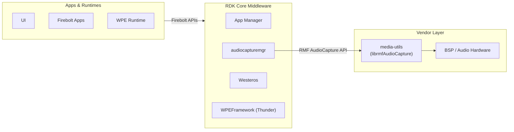
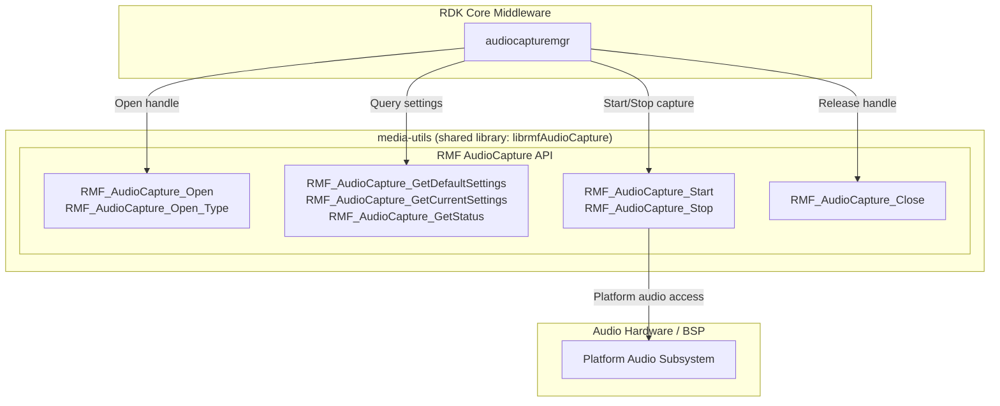
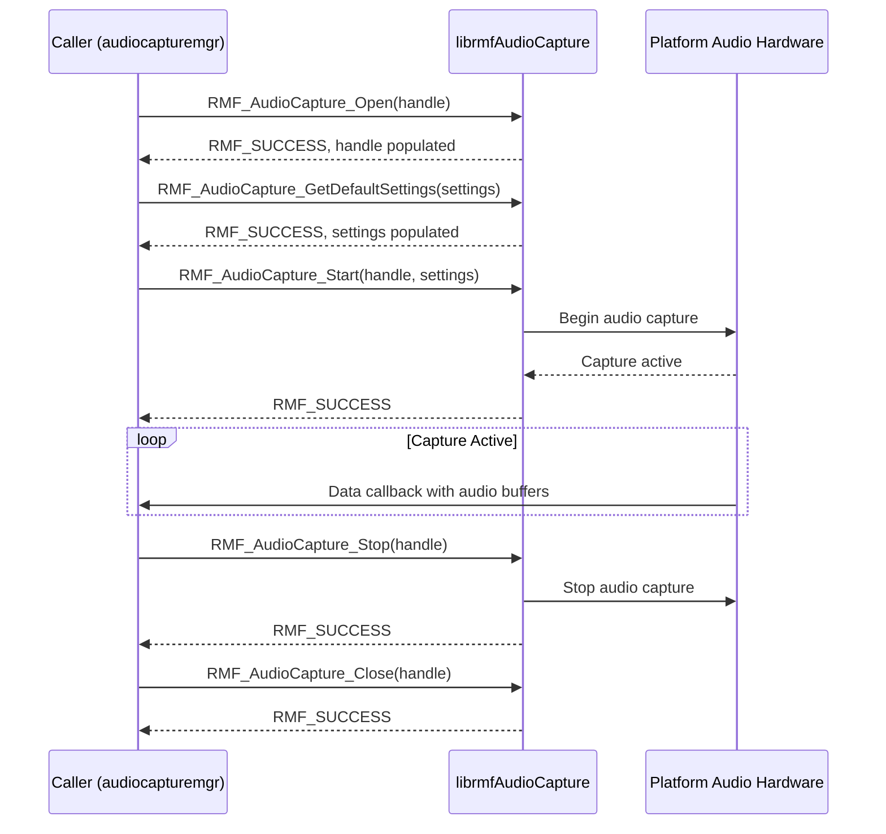
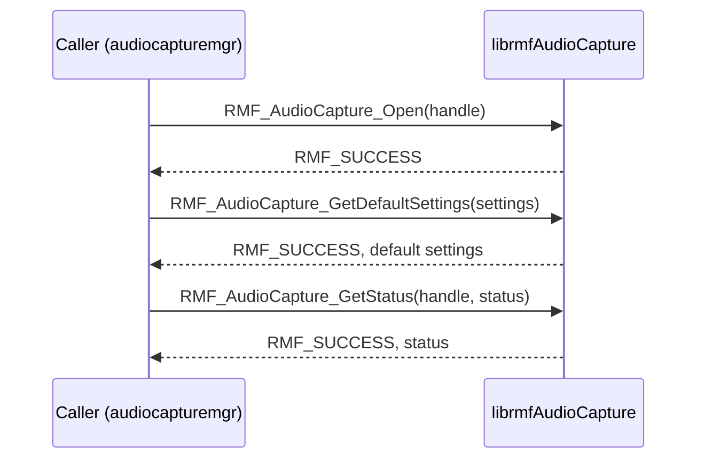
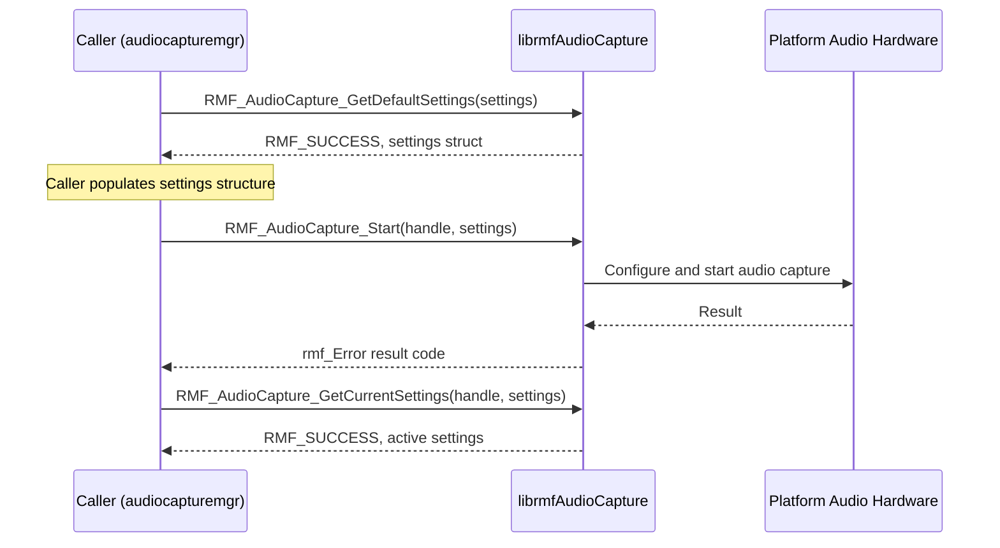
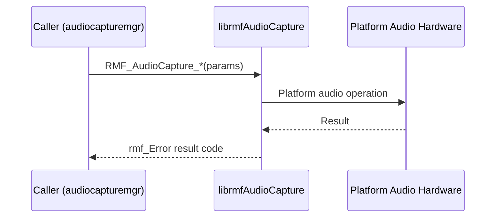
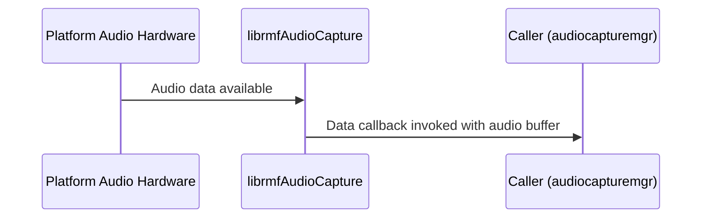

# media-utils

media-utils is the Hardware Abstraction Layer (HAL) library for audio capture in the RDK middleware stack. It defines and implements the RMF (RDK Media Framework) AudioCapture API — a C interface through which higher-level middleware components interact with the platform audio subsystem. The library exposes a handle-based API covering the full capture session lifecycle: opening a capture handle, querying and configuring capture settings, starting and stopping capture, and releasing the handle. It is packaged as a shared library (`librmfAudioCapture`) and fulfills the `virtual/vendor-media-utils` virtual package, allowing vendor-specific platform implementations to be substituted transparently at build time.

The component sits at the boundary between the RDK middleware and the vendor audio hardware layer. It is consumed directly by the `audiocapturemgr` daemon, which relies on this library to open capture sessions and receive audio data callbacks from the platform.

**Key Features & Responsibilities:**

- **RMF AudioCapture API surface**: Provides the full set of `RMF_AudioCapture_*` functions that define the contract between upper middleware layers and the audio hardware, covering handle lifecycle, settings retrieval, and capture control.
- **Handle-based session model**: Exposes an opaque handle type (`RMF_AudioCaptureHandle`) so that callers manage individual capture sessions without owning or knowing the underlying platform resource.
- **Typed capture session support**: Offers `RMF_AudioCapture_Open_Type()` alongside the default `RMF_AudioCapture_Open()`, allowing a caller to open a capture session for a specific capture type as defined by `RMF_AudioCaptureType`.
- **Settings query interface**: Provides both `RMF_AudioCapture_GetDefaultSettings()` and `RMF_AudioCapture_GetCurrentSettings()` so that callers can retrieve a baseline configuration before starting capture or inspect the active settings of a running session.
- **Virtual package fulfillment**: Satisfies `virtual/vendor-media-utils`, enabling a vendor-supplied platform implementation to replace this library without changing upstream build or runtime dependencies.

---

## Design

media-utils follows a minimal HAL boundary design. The library's responsibility is limited to presenting a stable, well-typed C API through which capture session management is performed; all platform-specific behavior resides in the implementation of this API. The handle-based model means the library allocates and tracks no shared global state visible to callers — each session is represented by its own `RMF_AudioCaptureHandle`, obtained through `Open` or `Open_Type` and released through `Close`. Settings are communicated by value via `RMF_AudioCapture_Settings` structures, so callers can retrieve defaults, modify them, and pass the final configuration to `Start` without the library retaining references.

Northbound interaction is entirely through the C API defined in `rmfAudioCapture.h`. `audiocapturemgr` links against `librmfAudioCapture` and drives the full session lifecycle. There is no JSON-RPC, no plugin activation, and no event bus registration at this layer; that coordination belongs to the consumers of this library.

Southbound interaction — the platform audio hardware access — is delegated to the platform-specific implementation provided by the vendor. The reference implementation in this package compiles successfully and returns `RMF_SUCCESS` from all entry points, serving as a build-time stub that vendor implementations replace via the `virtual/vendor-media-utils` mechanism.

All interactions with media-utils are in-process, synchronous function calls. The library operates as a direct C dependency linked into its consumer.

#### Threading Model

- **Threading Architecture**: Single-threaded. All API entry points execute synchronously on the calling thread.
- **Main Thread**: `RMF_AudioCapture_Open`, `RMF_AudioCapture_Open_Type`, `RMF_AudioCapture_GetStatus`, `RMF_AudioCapture_GetDefaultSettings`, `RMF_AudioCapture_GetCurrentSettings`, `RMF_AudioCapture_Start`, `RMF_AudioCapture_Stop`, and `RMF_AudioCapture_Close` each complete synchronously before returning.
- **Async / Event Dispatch**: Audio data delivery to the caller is driven through the callback registered in `RMF_AudioCapture_Settings` when `Start` is called. The callback is invoked by the platform implementation for each available audio buffer.

### Prerequisites and Dependencies

#### Platform and Integration Requirements

- **Build Dependencies**: `media-utils-headers` (provides `rmfAudioCapture.h` and related type definitions), `glib-2.0 >= 2.24.0`.

---

### Component State Flow

#### Initialization to Active State

The media-utils API follows a handle lifecycle model. A caller first obtains a handle through `Open` or `Open_Type`, optionally queries default or current settings, then starts capture by passing a populated `RMF_AudioCapture_Settings` structure to `Start`. The handle remains in the active (capturing) state until `Stop` is called, after which it can be started again or released with `Close`.

The component transitions through the following states during a capture session: **Closed** (no handle allocated) → **Open** (handle obtained, not yet capturing) → **Configured** (settings retrieved and prepared) → **Active** (capture started, data callbacks firing) → **Open** (capture stopped) → **Closed** (handle released).

#### Runtime State Changes

**State Change Triggers:**

- Calling `RMF_AudioCapture_Stop()` on an active handle transitions the session from Active to Open (idle). Data callbacks cease upon return.
- Calling `RMF_AudioCapture_Start()` on an Open handle with a new `RMF_AudioCapture_Settings` configuration transitions the session back to Active with the updated settings.

**Context Switching Scenarios:**

- A caller may stop and restart capture on the same handle to apply new settings without deallocating and re-opening the handle.
- When `RMF_AudioCapture_Open_Type()` is used, the capture type is fixed at open time and requires a close and re-open to change.

---

### Call Flows

#### Initialization Call Flow

#### Request Processing Call Flow

The caller retrieves default settings, populates the settings structure with the desired capture parameters, and passes the final configuration to `Start`. The return value indicates whether the platform accepted the configuration and began capture.

---

## Internal Modules

| Module / Class    | Description                                                                                                                                                                                                                                                                                   | Key Files           |
| ----------------- | --------------------------------------------------------------------------------------------------------------------------------------------------------------------------------------------------------------------------------------------------------------------------------------------- | ------------------- |
| `rmfAudioCapture` | Implements the full `RMF_AudioCapture_*` API surface. Provides the eight entry points for handle lifecycle management, settings retrieval, and capture control. Vendor implementations supply this module with platform-specific audio interaction in place of the reference build-time stub. | `rmfAudioCapture.c` |

---

## Component Interactions

media-utils exposes a C library API. All interactions are synchronous, in-process function calls driven by the consuming component.

### Interaction Matrix

| Target Component / Layer | Interaction Purpose                                                 | Key APIs / Topics                                                                                                                                                                                                                                              |
| ------------------------ | ------------------------------------------------------------------- | -------------------------------------------------------------------------------------------------------------------------------------------------------------------------------------------------------------------------------------------------------------- |
| **Consumers**            |                                                                     |                                                                                                                                                                                                                                                                |
| `audiocapturemgr`        | Opens, configures, starts, stops, and closes audio capture sessions | `RMF_AudioCapture_Open()`, `RMF_AudioCapture_Open_Type()`, `RMF_AudioCapture_GetDefaultSettings()`, `RMF_AudioCapture_GetCurrentSettings()`, `RMF_AudioCapture_GetStatus()`, `RMF_AudioCapture_Start()`, `RMF_AudioCapture_Stop()`, `RMF_AudioCapture_Close()` |
| **HAL**                  |                                                                     |                                                                                                                                                                                                                                                                |
| Platform Audio Hardware  | Audio capture session management and data delivery                  | Platform-specific; accessed by the vendor implementation of this API                                                                                                                                                                                           |

### IPC Flow Patterns

media-utils operates as a shared library linked in-process by its consumer. All function calls are synchronous and return an `rmf_Error` result code directly to the caller.

**Primary Request / Response Flow:**

The caller invokes an `RMF_AudioCapture_*` function directly (in-process, via dynamic linking). The implementation performs the requested operation and returns an `rmf_Error` result code synchronously.

**Data Callback Flow:**

After `RMF_AudioCapture_Start()` succeeds, the platform implementation invokes the data callback supplied in `RMF_AudioCapture_Settings` on each available audio buffer.

---

## Implementation Details

### Major HAL APIs Integration

media-utils provides the HAL API surface consumed by `audiocapturemgr`. The table below lists each entry point exposed by `librmfAudioCapture`.

| API Function                            | Purpose                                                                                                              | Implementation File |
| --------------------------------------- | -------------------------------------------------------------------------------------------------------------------- | ------------------- |
| `RMF_AudioCapture_Open()`               | Allocates and returns an audio capture handle using the default capture type                                         | `rmfAudioCapture.c` |
| `RMF_AudioCapture_Open_Type()`          | Allocates and returns an audio capture handle for the specified `RMF_AudioCaptureType`                               | `rmfAudioCapture.c` |
| `RMF_AudioCapture_GetStatus()`          | Retrieves the current operational status of an open capture handle into an `RMF_AudioCapture_Status` structure       | `rmfAudioCapture.c` |
| `RMF_AudioCapture_GetDefaultSettings()` | Populates an `RMF_AudioCapture_Settings` structure with platform default capture parameters                          | `rmfAudioCapture.c` |
| `RMF_AudioCapture_GetCurrentSettings()` | Populates an `RMF_AudioCapture_Settings` structure with the active settings of a running capture session             | `rmfAudioCapture.c` |
| `RMF_AudioCapture_Start()`              | Begins audio capture on the given handle using the provided `RMF_AudioCapture_Settings`, including the data callback | `rmfAudioCapture.c` |
| `RMF_AudioCapture_Stop()`               | Halts an active capture session                                                                                      | `rmfAudioCapture.c` |
| `RMF_AudioCapture_Close()`              | Releases all resources associated with the capture handle                                                            | `rmfAudioCapture.c` |

### Key Implementation Logic

- **State / Lifecycle Management**: The API enforces a sequential lifecycle — Open → Start → Stop → Close — through the handle parameter. The caller holds the handle state; session context is scoped to the handle returned at open time.
  - Core implementation: `rmfAudioCapture.c`

- **Event Processing**: Audio data is delivered to the caller via the callback pointer registered in `RMF_AudioCapture_Settings` at `Start` time. The callback is invoked by the platform implementation for each available buffer.

- **Error Handling Strategy**: All eight API entry points return an `rmf_Error` value indicating the outcome of the operation. Vendor implementations map platform-specific errors to the appropriate `rmf_Error` codes before returning to the caller.

---

## Configuration

### Runtime Configuration

Capture behavior is configured at session start time by populating an `RMF_AudioCapture_Settings` structure and passing it to `RMF_AudioCapture_Start()`. Session settings take effect for the duration of the active capture and are re-applied each time a new capture session is started.
