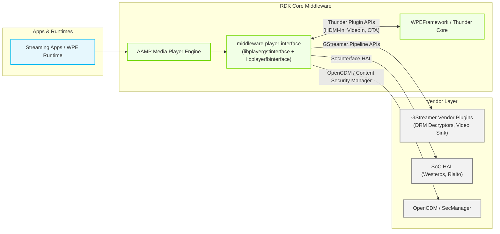
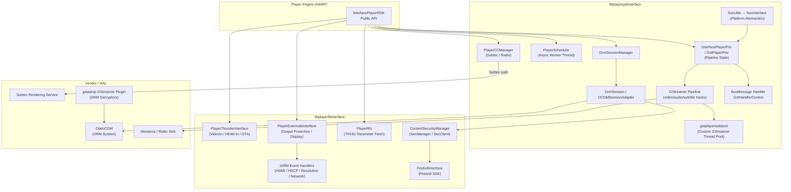
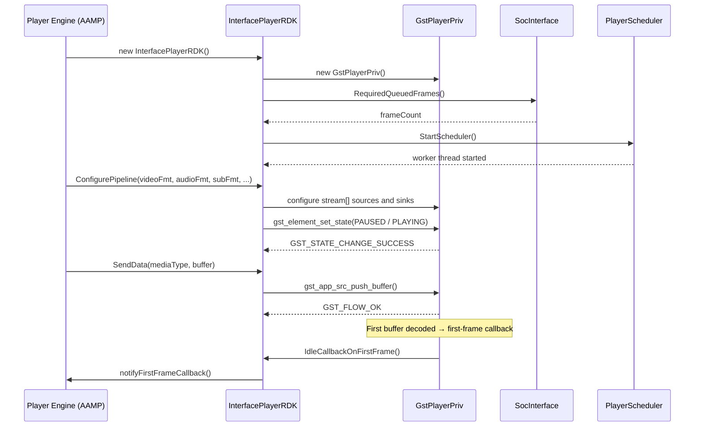
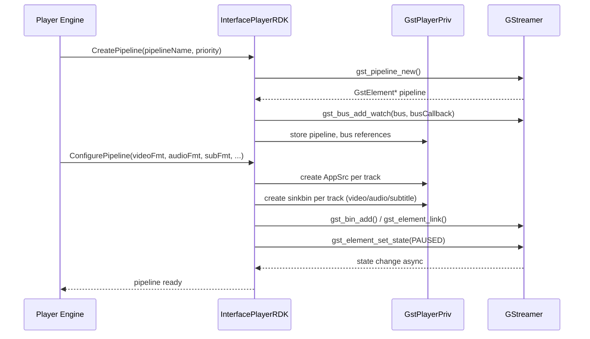
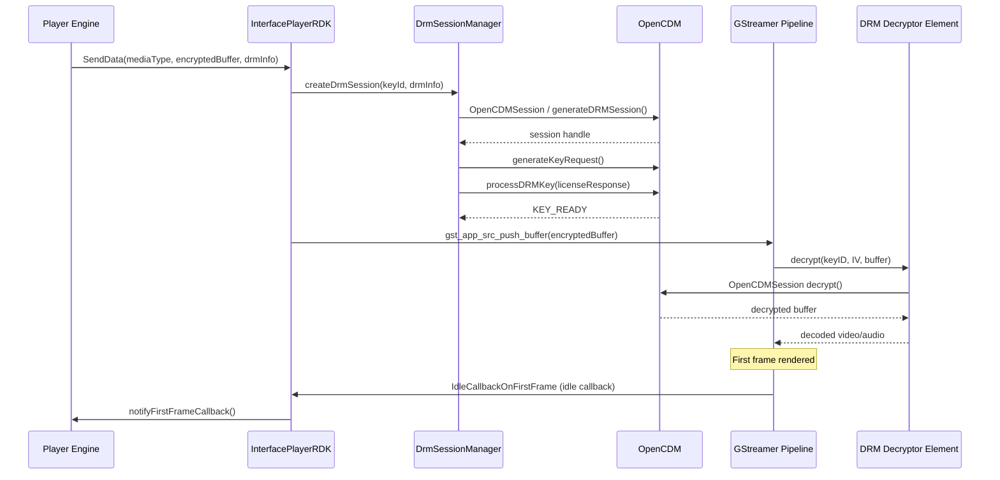
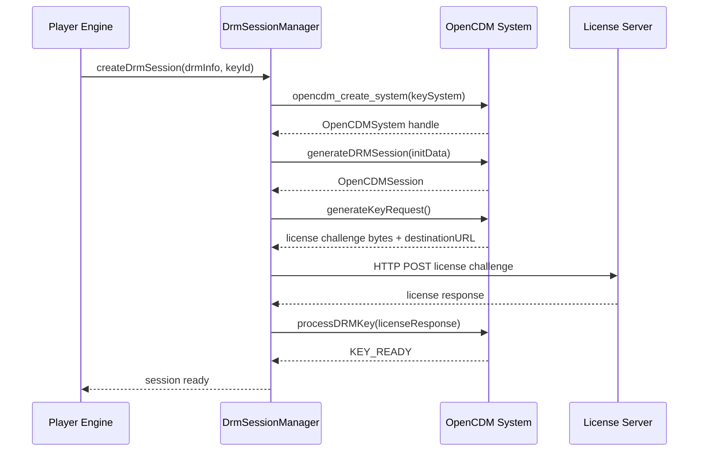
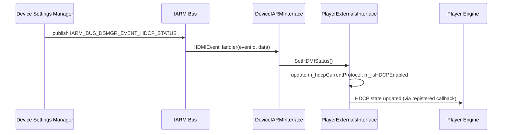

# middleware-player-interface

The `middleware-player-interface` library provides the GStreamer-based media pipeline integration layer for RDK middleware. It serves as the bridge between the upper media player stack (such as AAMP) and the underlying GStreamer framework, platform-specific SoC capabilities, and DRM infrastructure. The component encapsulates GStreamer pipeline lifecycle management, multi-track demux and decode coordination, DRM session handling, closed caption rendering, and platform abstraction — all within a single shared library that is consumed at runtime by the media player engine.

The component is structured as two cooperating shared libraries: `libplayergstinterface` (the core pipeline and DRM layer) and `libplayerfbinterface` (the external integrations layer covering Thunder, Device Settings, RFC, and content protection). A separate GStreamer plugin (`gstaamp`) is also produced, registering DRM decryptor elements into the GStreamer registry.

From an RDK architecture perspective, `middleware-player-interface` sits in the RDK Core Middleware layer, below the AAMP player engine and above the platform HAL and GStreamer vendor plugins. It has no direct dependency on a Thunder JSON-RPC server of its own; instead it consumes Thunder plugin APIs through the `PlayerThunderInterface` integration to interact with platform capabilities such as HDMI-In, VideoIn, and OTA services.

**Key Features & Responsibilities:**

- **GStreamer Pipeline Management**: Constructs, configures, and destroys GStreamer media pipelines for video, audio, and subtitle tracks. Manages pipeline state transitions from NULL through READY, PAUSED, and PLAYING, as well as tear-down on stop or error.

- **Multi-Track Media Support**: Handles concurrent video, audio, and subtitle elementary streams across multiple `gst_media_stream` contexts. Each track has its own `AppSrc` source element, sink bin, and per-track locking to allow independent management.

- **DRM Content Protection**: Integrates with OpenCDM to support PlayReady, Widevine, ClearKey, and Verimatrix OTT DRM systems. The `DrmSessionManager` orchestrates session creation, key request generation, and key delivery. GStreamer decryptor elements (`playreadydecryptor`, `widevinedecryptor`, `clearkeydecryptor`, `verimatrixdecryptor`) are registered as a custom GStreamer plugin.

- **Closed Caption Rendering**: Provides two backend paths for closed caption rendering — a Subtec path (`PlayerSubtecCCManager`) for devices with a subtec rendering service, and a Rialto path (`PlayerRialtoCCManager`) for containerized environments. Both implement the common `PlayerCCManagerBase` interface supporting EIA-608 and CEA-708 formats.

- **SoC Platform Abstraction**: Abstracts platform-specific capabilities through a `SocInterface` hierarchy. Concrete implementations exist for multiple SoC families. The abstraction surfaces capabilities such as Westeros sink availability, AppSrc usage for progressive playback, PTS re-stamping, required queued frames, and audio fragment synchronization.

- **Asynchronous Task Scheduling**: A dedicated `PlayerScheduler` worker thread serializes asynchronous operations submitted from GStreamer callbacks or the media player, preventing re-entrant pipeline calls and race conditions during state changes.

- **External Integration (Thunder, Device Settings, RFC)**: The `playerfbinterface` sub-library provides access to Thunder-managed plugins (HDMI-In, VideoIn, OTA), Device Settings HDCP and display resolution via the IARM bus, RFC parameter fetching, and content protection session management via SecManager or SecClient.

- **Output Protection and Display Awareness**: Monitors HDMI hotplug, HDCP protocol version, and display resolution changes, exposing this information to the player engine for UHD and HDCP compliance decisions.

- **Subtitle Parsing**: WebVTT and TTML subtitle streams are parsed inline through the `subtecparser` module and routed to the active subtitle backend for rendering.

---

## Design

`middleware-player-interface` is designed around the principle of separating the GStreamer pipeline control plane from the platform-specific and external integration concerns. The core library (`libplayergstinterface`) owns the GStreamer pipeline state machine and multi-track data flow, while the externals library (`libplayerfbinterface`) abstracts all out-of-process integrations. Both libraries are loaded as shared objects and linked by the consumer player engine at runtime. The design uses a private implementation object (`InterfacePlayerPriv` / `GstPlayerPriv`) to keep GStreamer internal state hidden from the public header, allowing the library's ABI to remain stable as internal state grows.

Pipeline configuration is driven by a `Configs` structure populated at tune time. Format selection for each track (video, audio, subtitle) is expressed as `GstStreamOutputFormat` enumerations, and the `ConfigurePipeline` method selects and connects the appropriate GStreamer elements accordingly. Bus messages from the pipeline are processed via registered `BusMessageCallback` and converted into typed `BusEventData` before being dispatched to the player engine. All GStreamer idle callbacks and timeout-based progress notifications are guarded by `GstHandlerControl` scope-helpers to prevent callbacks from executing after pipeline teardown.

The northbound interface toward the player engine consists entirely of C++ method calls on `InterfacePlayerRDK` and registered `std::function` callbacks. No inter-process communication is involved for the core pipeline path. The southbound interface toward the platform involves GStreamer element properties (for Westeros sink, Rialto sink, video rectangle), the `SocInterface` virtual dispatch for capability queries, and OpenCDM session APIs for DRM operations.

For platforms using IARM, the external integration layer registers event handlers on the IARM bus for HDMI hotplug (`IARM_BUS_DSMGR_EVENT_HDMI_HOTPLUG`), HDCP status change (`IARM_BUS_DSMGR_EVENT_HDCP_STATUS`), display resolution post-change (`IARM_BUS_DSMGR_EVENT_RES_POSTCHANGE`), and network interface IP address change (`NET_SRV_MGR` / `IARM_BUS_NETWORK_MANAGER_EVENT_INTERFACE_IPADDRESS`). These IARM registrations are conditional on the `CMAKE_IARM_MGR` build flag and are intended as a transitional path toward Device Settings and Firebolt APIs.

RFC parameter retrieval is handled through the `PlayerRfc` module, which calls into a platform TR181 API (`-ltr181api`) when `CMAKE_PLAYER_RFC_REQUIRED` is set. Thunder plugin interactions for VideoIn, HDMI-In, OTA player control, and video rectangle configuration are performed through `PlayerThunderInterface`, which maintains a WPEFramework remote object and a security token for authorized access.

All playback state is held in-memory within `GstPlayerPriv` and `InterfacePlayerRDK`. The Subtec closed caption service maintains its own session registry accessed through `SubtecConnector`; the component requests session IDs and drives start/stop rendering.

### Threading Model

- **Threading Architecture**: Multi-threaded
- **Main / Caller Thread**: Receives calls from the player engine (e.g., `ConfigurePipeline`, `Play`, `Stop`, `Seek`). Executes direct GStreamer API calls for pipeline configuration and state changes.
- **Worker Threads**:
  - _PlayerScheduler thread_: A single `std::thread` created by `PlayerScheduler::StartScheduler()`. Dequeues `PlayerAsyncTaskObj` items and executes them serially. Used for operations that must not block the caller or re-enter GStreamer from a callback context.
  - _GStreamer thread pool (gstplayertaskpool)_: A custom GStreamer task pool managing GStreamer-internal streaming threads for the pipeline.
  - _GStreamer bus watch / idle_: GLib main-loop idle sources (`gst_bus_add_watch`, `g_idle_add`) are used to deliver pipeline events (EOS, first-frame, progress) back to the player engine on the appropriate thread.
- **Synchronization**:
  - `pthread_mutex_t mProtectionLock` — guards DRM-related shared state.
  - Per-track `pthread_mutex_t sourceLock` on each `gst_media_stream` — serializes source element operations.
  - `std::mutex mSourceSetupMutex` + `std::condition_variable mSourceSetupCV` — coordinates source setup completion.
  - `std::mutex mMutex` on `InterfacePlayerRDK` — protects config map access.
  - `GstPlayerPriv::volumeMuteMutex` — protects audio volume and mute state.
  - `PlayerScheduler::mQMutex` + `mQCond` — protects the task queue.
  - `GstHandlerControl` — provides a reference-counted enable/disable gate that allows pending callbacks to complete before the pipeline is destroyed.
- **Async / Event Dispatch**: GStreamer events such as first-frame-received, EOS, and periodic progress are posted as GLib idle callbacks (`g_idle_add`). The `GstHandlerControl::ScopeHelper` guards each callback to ensure it exits cleanly if the pipeline has been disabled before the idle fires.

### RDK-V Platform and Integration Requirements

- **WPEFramework Version**: Thunder R3 (default) or Thunder R4 (selected via `USE_THUNDER_R4=ON`); the `cmake/FindWPEFramework.cmake` selects `WPEFrameworkCOM` or `WPEFrameworkProtocols` accordingly.
- **Build Dependencies**: `gstreamer-1.0`, `gstreamer-app-1.0`, `gstreamer-plugins-base-1.0`, `wpeframework`, `wpeframework-clientlibraries`, `openssl`, `essos`, `virtual/vendor-gst-drm-plugins`, `virtual/vendor-secapi2-adapter`, `iarmmgrs`, `devicesettings`.
- **Plugin Dependencies**: Thunder must be running before `PlayerThunderInterface` attempts plugin activation for VideoIn, HDMI-In, and OTA services.
- **Device Services / HAL**:
  - `GetDisplayResolution(int &width, int &height)` — queries current display resolution.
  - `SetHDMIStatus()` — reads HDCP protocol version and HDMI connection state.
  - `isHDCPConnection2_2()` — returns whether HDCP 2.2 is in use.
  - `SocInterface::UseWesterosSink()` — determines video sink type.
  - `SocInterface::RequiredQueuedFrames()` — determines pre-roll frame count.
  - `SocInterface::EnablePTSRestamp()` — controls PTS re-stamping in the pipeline.
- **IARM Bus**: `IARM_BUS_DSMGR_NAME` for HDMI/HDCP/resolution events; `NET_SRV_MGR` for network interface events (conditional on `CMAKE_IARM_MGR`).
- **Configuration Files**: RFC parameters accessed via `tr181api` using the TR181 namespace at runtime (conditional on `CMAKE_PLAYER_RFC_REQUIRED`).
- **Startup Order**: The component is initialized on first use by the media player engine. The player engine process is expected to start after GStreamer and the vendor GStreamer plugins are available in the system.

---

### Component State Flow

#### Initialization to Active State

When the player engine creates an `InterfacePlayerRDK` instance, the constructor initializes the private `GstPlayerPriv` context, queries the `SocInterface` for platform defaults (e.g., required queued frames), and starts the `PlayerScheduler` worker thread. The pipeline is then built lazily when `ConfigurePipeline` is called with the stream format and track configuration.

#### Runtime State Changes

During playback, the pipeline transitions through buffering, playing, paused, seeking, and stopping states tracked in `GstPrivPlayerState`. Bus messages (`GST_MESSAGE_EOS`, `GST_MESSAGE_ERROR`, `GST_MESSAGE_STATE_CHANGE`, `GST_MESSAGE_CLOCK_LOST`) arrive on the GStreamer bus, are handled by the registered `BusMessageCallback`, and converted into `BusEventData` dispatched to the player engine.

**State Change Triggers:**

- Buffer underflow (`HandleOnGstBufferUnderflowCb`) fires when a track runs out of data, prompting the player engine to accelerate fragment delivery.
- PTS stall detection (`HandleOnGstPtsErrorCb`) fires when the last known PTS has not advanced beyond `GST_MIN_PTS_UPDATE_INTERVAL` ms, allowing the engine to diagnose decoder hangs.
- Decode error notifications (`HandleOnGstDecodeErrorCb`) fire when a decoder element reports a consecutive error, with a minimum interval of `GST_MIN_DECODE_ERROR_INTERVAL` ms between callbacks.
- `GST_MESSAGE_CLOCK_LOST` triggers a pipeline flush and re-synchronization of the clock.

**Context Switching Scenarios:**

- Trick-play rate changes are applied via a segment seek; `trickTeardown` guards re-entrant teardown during rate transitions.
- EOS injection mode (`GstEOSInjectionModeCode`) controls whether EOS events are also pushed during `Stop()` before setting the pipeline to NULL, configurable per platform needs.
- Rialto-based deployments substitute the standard Westeros sink with a Rialto media pipeline sink, selected at configure time via `SocInterface::UseWesterosSink()`.

---

### Call Flows

#### Initialization Call Flow

#### Request Processing Call Flow

The most representative call flow is injecting an encrypted media fragment, triggering DRM decryption, and notifying the engine of the first decoded frame.

---

## Internal Modules

| Module / Class | Description | Key Files |
|---|---|---|
| `InterfacePlayerRDK` | Main GStreamer pipeline controller. Provides the public API for pipeline creation, configuration, data injection, playback control, and event callback registration. Owns the `PlayerScheduler` for async task dispatch. | `InterfacePlayerRDK.cpp`, `InterfacePlayerRDK.h` |
| `InterfacePlayerPriv` / `GstPlayerPriv` | Private implementation holders for all GStreamer internal state: pipeline, bus, per-track stream contexts, decoder element references, sink element references, playback quality counters, and synchronization objects. | `InterfacePlayerPriv.h`, `InterfacePlayerRDK.cpp` |
| `GstUtils` / `GstStreamOutputFormat` / `GstMediaType` | Enumerations and utilities for GStreamer media types, stream output formats, and media type name lookup. | `GstUtils.h`, `GstUtils.cpp` |
| `GstHandlerControl` | Thread-safe guard for GStreamer callbacks and idle handlers. Prevents callbacks from executing after the pipeline owner has been destroyed by maintaining an active-handler reference count. | `GstHandlerControl.h`, `GstHandlerControl.cpp` |
| `gstplayertaskpool` | Custom GStreamer task pool implementation, providing controlled thread allocation for GStreamer streaming tasks. | `gstplayertaskpool.h`, `gstplayertaskpool.cpp` |
| `PlayerScheduler` | A single background worker thread backed by a `std::deque` of `PlayerAsyncTaskObj` entries and a condition variable. Serializes asynchronous operations posted from GStreamer callbacks or the player engine. | `PlayerScheduler.h`, `PlayerScheduler.cpp` |
| `SocUtils` / `SocInterface` | SoC abstraction layer. `SocInterface` is an abstract base class with concrete implementations for multiple SoC families (Default, Amlogic, Realtek, Broadcom, MediaTek). `SocUtils` is a namespace-scoped façade delegating to a singleton `SocInterface` instance. | `SocUtils.h`, `SocUtils.cpp`, `vendor/SocInterface.h` |
| `DrmSessionManager` | Manages DRM session lifecycle including session creation, key ID tracking, failed-key detection, and per-track session context (`VIDEO_SESSION`, `AUDIO_SESSION`). | `drm/DrmSessionManager.h`, `drm/DrmSessionManager.cpp` |
| `DrmSession` / `OCDMSessionAdapter` | Abstract DRM session base and OpenCDM concrete adapter. Implements `generateDRMSession`, `generateKeyRequest`, `processDRMKey`, and `decrypt` against the OpenCDM API. | `drm/DrmSession.h`, `drm/ocdm/opencdmsessionadapter.h` |
| `HlsDrmSessionManager` / `HlsOcdmBridge` | HLS-specific DRM session management and the OCDM bridge for HLS encrypted streams, handling AES and OCDM-based protection for HLS content. | `drm/HlsDrmSessionManager.h`, `drm/HlsOcdmBridge.h` |
| `PlayerCCManagerBase` | Abstract base for closed caption management. Defines `Init`, `SetStatus`, `SetTrack`, `SetStyle`, `StartRendering`, and `StopRendering` contracts. | `closedcaptions/PlayerCCManager.h`, `closedcaptions/PlayerCCManager.cpp` |
| `PlayerSubtecCCManager` | Concrete closed caption manager using the Subtec rendering service. Connects to Subtec via `SubtecConnector`, manages session IDs, and drives start/stop rendering. | `closedcaptions/subtec/PlayerSubtecCCManager.h`, `closedcaptions/subtec/PlayerSubtecCCManager.cpp` |
| `PlayerRialtoCCManager` | Concrete closed caption manager for Rialto-based deployments. Overrides `SetTrack` and the rendering lifecycle to use the Rialto container runtime instead of Subtec. | `closedcaptions/rialto/PlayerRialtoCCManager.h`, `closedcaptions/rialto/PlayerRialtoCCManager.cpp` |
| `gstaamp` GStreamer Plugin | A GStreamer plugin that registers DRM decryptor elements (`playreadydecryptor`, `widevinedecryptor`, `clearkeydecryptor`, `verimatrixdecryptor`) at `GST_RANK_PRIMARY`. Built conditionally when `CMAKE_CDM_DRM` is set. | `gst-plugins/gstinit.cpp`, `gst-plugins/drm/` |
| `PlayerThunderInterface` | Interface to WPEFramework Thunder for VideoIn, HDMI-In, and OTA player plugin management. Handles plugin activation, security token acquisition, video rectangle setting, preferred audio language, and event subscription. | `externals/PlayerThunderInterface.h`, `externals/PlayerThunderInterface.cpp` |
| `PlayerExternalsInterface` / `PlayerExternalsInterfaceBase` | Output protection and display resolution interface. Provides HDCP protocol version query, display resolution query, UHD source detection, and TR181 parameter retrieval. An IARM-backed RDK implementation and a Firebolt-backed implementation both derive from the base class. | `externals/PlayerExternalsInterface.h`, `externals/PlayerExternalsInterfaceBase.h` |
| `ContentSecurityManager` | Manages content protection sessions for SecManager and SecClient integrations. `ContentSecurityManagerSession` uses RAII to automatically release sessions when the last reference is dropped. | `externals/contentsecuritymanager/ContentSecurityManager.h`, `externals/contentsecuritymanager/ContentSecurityManagerSession.h` |
| `FireboltInterface` | Singleton managing a Firebolt SDK connection. Used by the content protection path when `CMAKE_USE_SECCLIENT` or `CMAKE_USE_SECMANAGER` is active. | `externals/IFirebolt/FireboltInterface.h`, `externals/IFirebolt/FireboltInterface.cpp` |
| `PlayerRfc` | Fetches TR181 RFC parameter values via `tr181api` for runtime feature configuration. | `externals/PlayerRfc.h`, `externals/PlayerRfc.cpp` |
| `PlayerLogManager` | Logging subsystem supporting TRACE, DEBUG, INFO, WARN, MILESTONE, and ERROR levels. Supports optional redirection to systemd journal or Ethan logging APIs. | `playerLogManager/PlayerLogManager.h` |
| `ProcessHandler` | Process utility class for querying process names via `/proc/<pid>/status` and for process termination. Used by the player engine for subprocess management. | `ProcessHandler.h`, `ProcessHandler.cpp` |
| `PlayerUtils` | Context-free string utilities, base64-URL encode/decode, URL resolution, and thread ID helpers. | `PlayerUtils.h`, `PlayerUtils.cpp` |
| `baseConversion` | Base64 (MIME and URL-safe) and base16 encoding/decoding library produced as a separate static library (`libbaseconversion`). | `baseConversion/_base64.h`, `baseConversion/base16.h` |
| `playerJsonObject` | JSON object wrapper library (`libplayerjsonobject`), used for RFC and configuration data serialization. | `playerJsonObject/` |
| `subtec/subtecparser` | WebVTT and TTML subtitle stream parsers routing parsed cue data to the active subtitle rendering backend via `WebvttSubtecDevInterface`. | `subtec/subtecparser/WebVttSubtecParser.hpp`, `subtec/subtecparser/TtmlSubtecParser.hpp` |
| `playerisobmff` | ISO Base Media File Format (ISOBMFF) box and buffer parser for extracting media data from MP4-fragmented streams. | `playerisobmff/playerisobmffbox.cpp`, `playerisobmff/playerisobmffbuffer.cpp` |
| `mp4demux` | MP4 demux header providing data types for the MP4 demuxer path used in HLS-MP4 playback. | `mp4demux/mp4demux.hpp` |
| `PlayerMetadata` | Lightweight utility providing global player name get/set (`SetPlayerName` / `GetPlayerName`) used for logging identity across the library. | `PlayerMetadata.hpp` |

---

## Component Interactions

### Interaction Matrix

| Target Component / Layer | Interaction Purpose | Key APIs / Topics |
|---|---|---|
| **RDK Middleware Components** | | |
| WPEFramework / Thunder | Plugin activation, video rectangle, preferred audio, VideoIn/HDMI-In/OTA control, event subscription | `PlayerThunderInterface::ActivatePlugin()`, `SetVideoRectangle()`, `SetPreferredAudioLanguages()`, `RegisterAllEventsVideoin()`, `RegisterEventOnVideoStreamInfoUpdateHdmiin()`, `RegisterOnPlayerStatusOta()` |
| Subtec Rendering Service | Closed caption session management and rendering trigger | `SubtecConnector`, `PlayerSubtecCCManager::StartRendering()`, `PlayerSubtecCCManager::StopRendering()` |
| Rialto Container Runtime | Closed caption rendering for containerized deployments | `PlayerRialtoCCManager::SetTrack()`, `PlayerRialtoCCManager::StartRendering()` |
| **Device Services / HAL** | | |
| Device Settings (via IARM) | HDMI hotplug detection, HDCP protocol version, display resolution | `IARM_Bus_RegisterEventHandler(IARM_BUS_DSMGR_NAME, IARM_BUS_DSMGR_EVENT_HDMI_HOTPLUG)`, `IARM_BUS_DSMGR_EVENT_HDCP_STATUS`, `IARM_BUS_DSMGR_EVENT_RES_POSTCHANGE` |
| Network Manager (via IARM) | Active network interface IP address change notification | `IARM_Bus_RegisterEventHandler("NET_SRV_MGR", IARM_BUS_NETWORK_MANAGER_EVENT_INTERFACE_IPADDRESS)` |
| SoC HAL (`SocInterface`) | Platform capability queries (Westeros sink, AppSrc mode, PTS re-stamp, queued frames, live latency) | `UseWesterosSink()`, `UseAppSrc()`, `RequiredQueuedFrames()`, `EnablePTSRestamp()`, `IsAudioFragmentSyncSupported()`, `EnableLiveLatencyCorrection()` |
| OpenCDM / OCDM | DRM session lifecycle, key request generation, content decryption | `OpenCDMSession`, `opencdm_session_decrypt()`, `generateDRMSession()`, `generateKeyRequest()`, `processDRMKey()` |
| SecManager / SecClient (Firebolt) | Content protection session acquisition and license relay | `ContentSecurityManager::acquireLicence()`, `ContentSecurityManagerSession`, `FireboltInterface::GetInstance()` |
| GStreamer Vendor Plugins | Media decode, DRM decryption, video/audio rendering | `gst_element_register()` for `playreadydecryptor`, `widevinedecryptor`, `clearkeydecryptor`, `verimatrixdecryptor` |
| **External Systems** | | |
| RFC / TR181 | Runtime feature flag retrieval | `RFCSettings::readRFCValue()` via `tr181api` |

### Events Published

| Event Name | IARM / JSON-RPC Topic | Trigger Condition | Subscriber Components |
|---|---|---|---|
| First Frame Received | Internal callback (`notifyFirstFrameCallback`) | GStreamer first decoded video/audio buffer processed | Player Engine (AAMP) |
| First Video Frame Displayed | Internal callback (`IdleCallbackFirstVideoFrameDisplayed`) | GStreamer video sink renders the first frame | Player Engine (AAMP) |
| EOS | Internal callback (`IdleCallbackOnEOS`) | GStreamer `GST_MESSAGE_EOS` received on the bus | Player Engine (AAMP) |
| Buffer Underflow | Internal callback (`OnGstBufferUnderflowCb`) | GStreamer reports buffer underrun for a media track | Player Engine (AAMP) |
| Decode Error | Internal callback (`OnGstDecodeErrorCb`) | Decoder element reports decode failure | Player Engine (AAMP) |
| PTS Error | Internal callback (`OnGstPtsErrorCb`) | PTS not advancing beyond `GST_MIN_PTS_UPDATE_INTERVAL` | Player Engine (AAMP) |
| Buffering Timeout | Internal callback (`OnBuffering_timeoutCb`) | Buffering timer exceeds `DEFAULT_BUFFERING_MAX_MS` | Player Engine (AAMP) |
| Progress | Internal callback (`ProgressCallbackOnTimeout`) | Periodic timer fires during active playback | Player Engine (AAMP) |
| HDMI Hotplug | IARM `IARM_BUS_DSMGR_EVENT_HDMI_HOTPLUG` | HDMI connection or disconnection event from device manager | `PlayerExternalsInterface` |
| HDCP Status Change | IARM `IARM_BUS_DSMGR_EVENT_HDCP_STATUS` | HDCP handshake result change | `PlayerExternalsInterface` |
| Resolution Change | IARM `IARM_BUS_DSMGR_EVENT_RES_POSTCHANGE` | Display resolution changed | `PlayerExternalsInterface` |

### IPC Flow Patterns

**Primary Request / Response Flow (DRM Key Acquisition):**

**Event Notification Flow (HDMI/HDCP via IARM):**

---

## Implementation Details

### Major HAL APIs Integration

| HAL / DS API | Purpose | Implementation File |
|---|---|---|
| `SocInterface::UseWesterosSink()` | Determines whether the Westeros compositor sink is used as the video sink element | `SocUtils.cpp`, vendor SoC implementations under `vendor/` |
| `SocInterface::UseAppSrc()` | Determines whether `GstAppSrc` is used as the source element for progressive playback | `SocUtils.cpp` |
| `SocInterface::RequiredQueuedFrames()` | Returns the platform-specific pre-roll frame count (default: 6) | `SocUtils.cpp`, `InterfacePlayerRDK.cpp` |
| `SocInterface::EnablePTSRestamp()` | Enables PTS re-stamping for platforms that require it | `SocUtils.cpp` |
| `SocInterface::IsAudioFragmentSyncSupported()` | Queries whether audio fragment synchronization is supported | `SocUtils.cpp` |
| `SocInterface::EnableLiveLatencyCorrection()` | Queries whether live latency correction is active | `SocUtils.cpp` |
| `opencdm_create_system()` | Initializes the OpenCDM DRM system for a given key system string | `drm/ocdm/opencdmsessionadapter.h` |
| `opencdm_construct_session()` | Creates an OpenCDM DRM session with initialization data | `drm/ocdm/opencdmsessionadapter.h` |
| `opencdm_session_decrypt()` | Performs per-sample decryption via the active OpenCDM session | `drm/ocdm/opencdmsessionadapter.h` |
| `PlayerExternalsInterfaceBase::GetDisplayResolution()` | Returns current display width and height for output protection decisions | `externals/PlayerExternalsInterfaceBase.h` |
| `PlayerExternalsInterfaceBase::isHDCPConnection2_2()` | Returns whether the active HDCP connection is version 2.2 | `externals/PlayerExternalsInterfaceBase.h` |
| `PlayerExternalsInterfaceBase::IsSourceUHD()` | Queries video decoder GstElement properties to detect UHD source material | `externals/PlayerExternalsInterfaceBase.h` |
| `PlayerThunderInterface::SetVideoRectangle()` | Sets video display rectangle via a Thunder plugin for VideoIn/HDMI-In sources | `externals/PlayerThunderInterface.cpp` |
| `RFCSettings::readRFCValue()` | Fetches a named TR181 parameter value from the platform RFC service | `externals/PlayerRfc.cpp` |

### Key Implementation Logic

- **State / Lifecycle Management**: `GstPrivPlayerState` tracks the player state from `eGST_STATE_IDLE` through `eGST_STATE_COMPLETE` or `eGST_STATE_ERROR`. Pipeline state transitions map to GStreamer `GST_STATE_NULL`, `GST_STATE_READY`, `GST_STATE_PAUSED`, and `GST_STATE_PLAYING`. The `pendingPlayState` flag defers the transition to PLAYING until a source setup condition variable (`mSourceSetupCV`) is signaled.
  - Core implementation: `InterfacePlayerRDK.cpp`
  - State holder: `InterfacePlayerPriv.h`

- **Event Processing**: GStreamer bus messages are delivered through the `busMessageCallback` registered by the player engine. The callback receives a typed `BusEventData` struct. EOS and first-frame notifications are posted as GLib idle callbacks using `g_idle_add` to avoid blocking the GStreamer streaming thread. Each idle callback acquires a `GstHandlerControl::ScopeHelper` that prevents execution if the pipeline has already been disabled.

- **Error Handling Strategy**: Decoder errors are rate-limited with a `GST_MIN_DECODE_ERROR_INTERVAL` (10,000 ms) between consecutive `OnGstDecodeErrorCb` dispatches. PTS stall is detected by comparing `lastKnownPTS` against `ptsUpdatedTimeMS` with a `GST_MIN_PTS_UPDATE_INTERVAL` (4,000 ms) threshold. Buffer underflow triggers the `OnGstBufferUnderflowCb` which the player engine uses to accelerate data delivery. GStreamer `GST_MESSAGE_ERROR` messages are forwarded as `MESSAGE_ERROR` `BusEventData` entries.

- **Logging & Diagnostics**: `PlayerLogManager` provides macro-based logging (`MW_LOG_TRACE`, `MW_LOG_DEBUG`, `MW_LOG_INFO`, `MW_LOG_WARN`, `MW_LOG_MIL`, `MW_LOG_ERR`). Log level is runtime-configurable and lockable. Redirection to systemd journal or the Ethan logging service can be enabled independently via `SetLoggerInfo`. The `progressLogging` and `gstLogging` flags in `Configs` further control per-session verbosity.
  - Key log points: scheduler start/stop, pipeline state changes, DRM session key state transitions (`KEY_INIT` → `KEY_PENDING` → `KEY_READY` / `KEY_ERROR`), first-frame and EOS events.

---

## Configuration

Runtime behavior is driven by three mechanisms:

- **`Configs` structure**: Populated by the player engine at tune time. Controls network proxy, buffering behavior, EOS injection mode, audio/video buffer sizes, PTS sync, subtitle rendering path, Westeros/Rialto sink selection, progress timer interval, and AV sync thresholds.
- **RFC parameters**: Fetched at runtime via `RFCSettings::readRFCValue()` using named TR181 parameter paths. The specific parameters accessed are determined by the calling player engine.
- **Build-time CMake flags**: The following flags determine which features are compiled in:

| CMake Flag | Description | Source |
|---|---|---|
| `CMAKE_RDK_SVP` | Enables Secure Video Path (`USE_SVP=1`). Activates SVP buffer handling in the DRM decryptor pipeline. | `CMakeLists.txt` |
| `CMAKE_GST_SUBTEC_ENABLED` | Enables GStreamer-side Subtec subtitle rendering. Sets `GST_SUBTEC_ENABLED` and links the `gst_subtec` sub-library. | `gst-plugins/CMakeLists.txt` |
| `DISABLE_SECURITY_TOKEN` | Disables WPEFramework security token acquisition, skipping `WPEFrameworkSecurityUtil` linkage. For environments without a security token service. | `CMakeLists.txt`, `externals/CMakeLists.txt` |
| `CMAKE_CDM_DRM` | Enables CDM-based DRM. Compiles GStreamer decryptor elements (`gstplayreadydecryptor`, `gstwidevinedecryptor`, etc.) into the `gstaamp` plugin. | `gst-plugins/CMakeLists.txt` |
| `CMAKE_USE_OPENCDM_ADAPTER` | Selects the OpenCDM adapter API path, adding `-DUSE_OPENCDM_ADAPTER` and linking against `libocdm`. | `gst-plugins/CMakeLists.txt` |
| `CMAKE_USE_SECMANAGER` | Enables SecManager-based content protection. Compiles `SecManagerThunder.cpp` and sets `-DUSE_SECMANAGER`. Requires FireboltAamp. | `externals/CMakeLists.txt` |
| `CMAKE_USE_SECCLIENT` | Enables SecClient-based content protection. Sets `-DUSE_SECCLIENT` and links `libSecClient` and `libFireboltSDK`. | `externals/CMakeLists.txt` |
| `CMAKE_WPEFRAMEWORK_REQUIRED` | Links WPEFramework and compiles `PlayerThunderAccess.cpp` and `Module.cpp` for Thunder plugin access. Sets `-DUSE_CPP_THUNDER_PLUGIN_ACCESS`. | `externals/CMakeLists.txt` |
| `CMAKE_IARM_MGR` | Enables IARM bus integration. Compiles `DeviceIARMInterface.cpp`, `PlayerExternalsRdkInterface.cpp`, `DeviceFireboltInterface.cpp`, and `FireboltInterface.cpp`. Links `libIARMBus`, `libds`, `libdshalcli`. | `externals/CMakeLists.txt` |
| `CMAKE_PLAYER_RFC_REQUIRED` | Enables RFC parameter fetching. Sets `-DPLAYER_RFC_ENABLED` and links `libtr181api`. | `externals/CMakeLists.txt` |
| `USE_THUNDER_R4` | Selects Thunder R4 API (WPEFrameworkCOM) instead of the default R3 path (WPEFrameworkProtocols). Controlled via Yocto distro features `wpe_r4_4` or `wpe_r4`. | `cmake/FindWPEFramework.cmake`, `player-interface_git.bb` |
