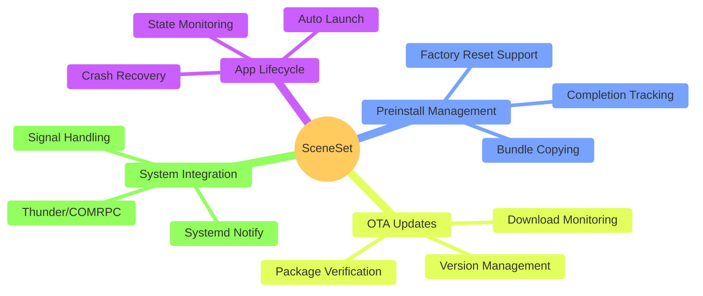
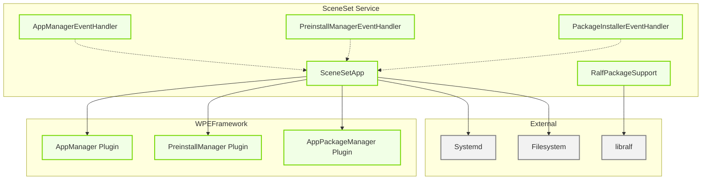
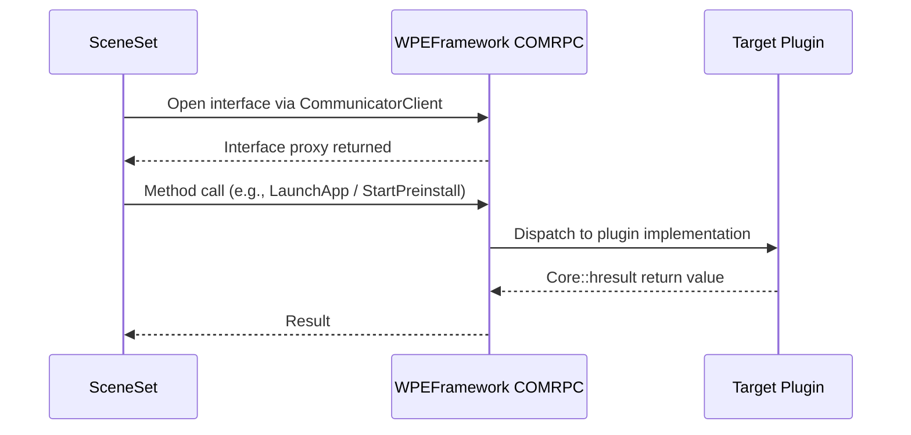
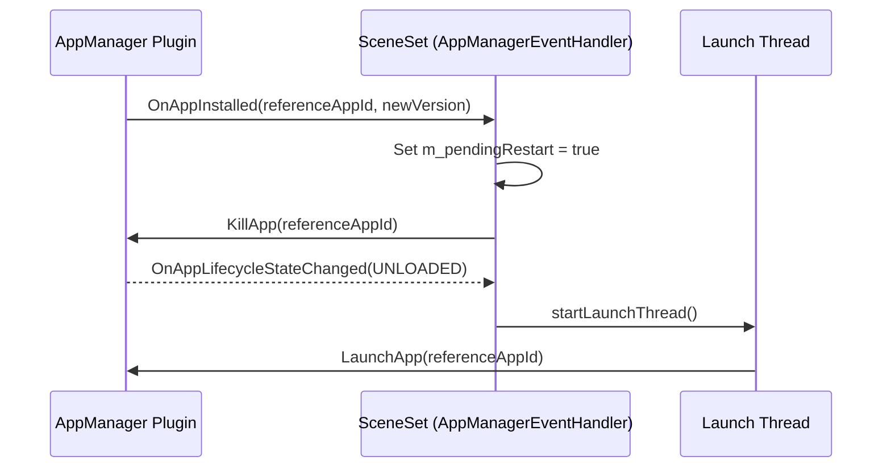

# SceneSet — OpenSpec Documentation

> **Repository:** `rdkcentral/sceneset`  
> **Purpose:** Specification, architecture, and design documentation for the SceneSet application launcher service  
> **Status:** Active — code-verified baseline

SceneSet is a standalone application launcher service for RDK-based devices. It runs as a systemd service and is responsible for coordinating boot-time preinstallation of app bundles and the launch of the configured reference application. All plugin communication is via WPEFramework COMRPC.

---

## Key Features

---

## Architecture at a Glance

---

## Quick Navigation

| Document                                                                   | What It Covers                                                                                    |
| -------------------------------------------------------------------------- | ------------------------------------------------------------------------------------------------- |
| [specs/app-launch/spec.md](specs/app-launch/spec.md)                       | App identity, initial launch, lifecycle tracking, crash recovery, OTA restart                     |
| [specs/preinstall-management/spec.md](specs/preinstall-management/spec.md) | First boot detection, factory app copy, StartPreinstall, completion wait, post-preinstall actions |
| [specs/ota-update-monitoring/spec.md](specs/ota-update-monitoring/spec.md) | inotify monitoring, settle delay, initial sweep, package staging                                  |
| [specs/thunder-integration/spec.md](specs/thunder-integration/spec.md)     | COMRPC connections, plugin interfaces, event registration, teardown                               |
| [specs/configuration/spec.md](specs/configuration/spec.md)                 | Config source layering, all config files, env variables, plugin-sourced values                    |
| [specs/sceneset-telemetry/spec.md](specs/sceneset-telemetry/spec.md)       | T2 marker contract, timing fields, relaunch behavior                                              |

---

## Document Structure

### `specs/` — Subsystem Specifications

Behavioral contracts per feature area. Each folder contains a `spec.md`.

| Spec                                                                | Subsystem                    | What It Defines                                                                                                                              |
| ------------------------------------------------------------------- | ---------------------------- | -------------------------------------------------------------------------------------------------------------------------------------------- |
| [specs/app-launch/](specs/app-launch/spec.md)                       | Reference App Launch         | Launch sequencing, lifecycle state tracking, crash recovery (ABORT), OTA restart via pending-restart flag                                    |
| [specs/preinstall-management/](specs/preinstall-management/spec.md) | Preinstall Management        | FSR detection via marker file, factory app copy, `StartPreinstall(forceInstall)`, per-package status tracking, cleanup decisions             |
| [specs/ota-update-monitoring/](specs/ota-update-monitoring/spec.md) | OTA Update Monitoring        | inotify `IN_CLOSE_WRITE`/`IN_MOVED_TO`, 1-second settle delay, RALF verification, preinstall staging                                         |
| [specs/thunder-integration/](specs/thunder-integration/spec.md)     | Thunder / COMRPC Integration | `CommunicatorClient` lifecycle, plugin open/close, notification registration, Controller config query                                        |
| [specs/configuration/](specs/configuration/spec.md)                 | Configuration                | `/opt/sceneset_app.conf`, `/etc/sceneset.conf`, `THUNDER_ACCESS`, CMake variables, plugin-sourced `downloadDir` and `appPreinstallDirectory` |
| [specs/sceneset-telemetry/](specs/sceneset-telemetry/spec.md)       | Telemetry                    | `ENTS_INFO_Sceneset_LaunchTime` marker, initial launch fields, relaunch-only fields, emission trigger                                        |

---

### `docs/` — Reference Documentation

Supplementary documentation outside the openspec folder.

| Document                                                           | What It Covers                                                                                       |
| ------------------------------------------------------------------ | ---------------------------------------------------------------------------------------------------- |
| [../docs/architecture.md](../docs/architecture.md)                 | High-level system design, role in RDK infrastructure, interacting subsystems diagram                 |
| [../docs/configuration.md](../docs/configuration.md)               | Full CMake variable reference, runtime config files, environment variables, plugin config resolution |
| [../docs/ralf-package-support.md](../docs/ralf-package-support.md) | libralf integration, `ExtractPackageMetadata()` API, certificate caching with mtime invalidation     |
| [../docs/sceneset-telemetry.md](../docs/sceneset-telemetry.md)     | Telemetry marker contract, always-present fields, initial launch fields, relaunch-only fields        |

---

### `changes/archive/` — Completed Change Records

| Entry                                                                                                                              | What It Covered                                                            |
| ---------------------------------------------------------------------------------------------------------------------------------- | -------------------------------------------------------------------------- |
| [changes/archive/2026-05-19-home-app-and-override/](changes/archive/2026-05-19-home-app-and-override/)                             | Home app identity resolution and `/opt/sceneset_app.conf` runtime override |
| [changes/archive/2026-05-19-preinstall-location-config-fallback/](changes/archive/2026-05-19-preinstall-location-config-fallback/) | Preinstall directory resolution fallback via `/etc/sceneset.conf`          |
| [changes/archive/2026-06-22-sceneset-home-app-telemetry-markers/](changes/archive/2026-06-22-sceneset-home-app-telemetry-markers/) | T2 telemetry marker for home app launch/relaunch timing                    |

---

## How to Update This Documentation

- **If an app launch or lifecycle behavior changes** → update `specs/app-launch/spec.md`
- **If preinstall logic changes** → update `specs/preinstall-management/spec.md`
- **If OTA monitoring behavior changes** → update `specs/ota-update-monitoring/spec.md`
- **If Thunder plugin interfaces or COMRPC setup changes** → update `specs/thunder-integration/spec.md`
- **If configuration options are added or removed** → update `specs/configuration/spec.md` and `../docs/configuration.md`
- **If telemetry markers change** → update `specs/sceneset-telemetry/spec.md` and `../docs/sceneset-telemetry.md`
- **If a new design change is planned** → create `changes/<change-name>/` with `proposal.md`, `design.md`, `tasks.md`

---

## Key Concepts

| Term                        | Meaning                                                                                                     |
| --------------------------- | ----------------------------------------------------------------------------------------------------------- |
| `SceneSetApp`               | The single C++ application class owning all COMRPC handles and orchestrating the full lifecycle             |
| Reference App               | The configured application launched at boot; identified by a single app ID string                           |
| COMRPC                      | WPEFramework out-of-process RPC mechanism; all plugin calls go over a Unix domain socket                    |
| `org.rdk.AppManager`        | Thunder plugin managing application launch, kill, install queries, and lifecycle events                     |
| `org.rdk.PreinstallManager` | Thunder plugin handling bundle preinstallation; notifies on completion                                      |
| `org.rdk.AppPackageManager` | Thunder plugin providing per-package install status events and download directory config                    |
| FSR                         | Factory Settings Reset — first boot, detected by absence of `/opt/persistent/.sceneset_factory_apps_copied` |
| RALF                        | RDK Application Lifecycle Format — package format verified by libralf before staging                        |
| Settle delay                | 1-second wait after inotify file detection to avoid processing partially written packages                   |
| `sd_notify`                 | systemd readiness notification; sent after COMRPC interfaces are acquired and handlers registered           |
| THUNDER_ACCESS              | Environment variable overriding the COMRPC socket path (default: `/tmp/communicator`)                       |

---

## Internal Modules

| Module / Class                  | Description                                                                                                                                                                                                                   | Key Files                                                |
| ------------------------------- | ----------------------------------------------------------------------------------------------------------------------------------------------------------------------------------------------------------------------------- | -------------------------------------------------------- |
| `SceneSetApp`                   | Application entry point and lifecycle coordinator. Owns all COMRPC interface handles and orchestrates initialization, preinstall sequencing, app launch, download monitoring, and shutdown.                                   | `src/SceneSet.cpp`, `src/SceneSet.h`                     |
| `AppManagerEventHandler`        | Inner class implementing `Exchange::IAppManager::INotification`. Handles app install, lifecycle state change, launch request, and unload events. Drives restart and crash recovery logic.                                     | `src/SceneSet.cpp`, `src/SceneSet.h`                     |
| `PreinstallManagerEventHandler` | Inner class implementing `Exchange::IPreinstallManager::INotification`. Receives per-package installation status and the `OnPreinstallationComplete` signal, which triggers the preinstall completion worker thread.          | `src/SceneSet.cpp`, `src/SceneSet.h`                     |
| `PackageInstallerEventHandler`  | Inner class implementing `Exchange::IPackageInstaller::INotification`. Receives per-package installation status from PackageManagerRDKEMS during the startup preinstall window. Records failure states for cleanup decisions. | `src/SceneSet.cpp`, `src/SceneSet.h`                     |
| `ralf_support` namespace        | RALF package metadata extraction and signature verification via libralf. Maintains a certificate cache invalidated by modification time of the certificate directory, avoiding redundant certificate loads.                   | `src/RalfPackageSupport.cpp`, `src/RalfPackageSupport.h` |

---

## Threading Model

| Thread                       | Role                                                                                                                                                                                                                             |
| ---------------------------- | -------------------------------------------------------------------------------------------------------------------------------------------------------------------------------------------------------------------------------- |
| Main thread                  | Runs `initialize()` then `run()`. Blocks on `sigwait()` after startup. SIGTERM/SIGINT blocked via `pthread_sigmask()` so only main thread consumes signals.                                                                      |
| Launch thread                | Executes `launchDefaultApp()` via `IAppManager::LaunchApp()`. Separated from the COMRPC dispatch thread to avoid blocking notification callbacks.                                                                                |
| Download monitor thread      | Runs the inotify event loop on the configured download directory. Watches for `IN_CLOSE_WRITE` and `IN_MOVED_TO` events.                                                                                                         |
| Settle worker thread         | Receives candidate file paths from the inotify loop and waits 1000 ms before processing each file to avoid acting on partially written packages.                                                                                 |
| Preinstall completion thread | Runs `completeStartupAfterPreinstall()` when `OnPreinstallationComplete` is received. Separated from the COMRPC callback thread to allow cleanup and launch logic to run without blocking PreinstallManager's notification path. |

**Synchronization:** `m_appLaunched`, `m_stopLaunchThread`, `m_stopDownloadMonitorThread`, `m_waitingForStartupPreinstallCompletion`, and `m_startupPreinstallHasFailure` are `std::atomic` variables. Per-thread lifecycle is protected by `m_launchThreadMutex`, `m_downloadMonitorMutex`, and `m_preinstallCompletionThreadMutex`.

---

## Component Interaction Matrix

| Target Component                  | Interaction Purpose                                                          | Key APIs                                                                                                                                                                      |
| --------------------------------- | ---------------------------------------------------------------------------- | ----------------------------------------------------------------------------------------------------------------------------------------------------------------------------- |
| `org.rdk.AppManager`              | App launch, kill, install query, lifecycle event subscription                | `IAppManager::LaunchApp()`, `IAppManager::KillApp()`, `IAppManager::IsInstalled()`, `IAppManager::GetInstalledApps()`, `IAppManager::Register()`, `IAppManager::Unregister()` |
| `org.rdk.PreinstallManager`       | Bundle preinstallation trigger and completion notification                   | `IPreinstallManager::StartPreinstall()`, `IPreinstallManager::Register()`, `IPreinstallManager::Unregister()`                                                                 |
| `org.rdk.AppPackageManager`       | Per-package installation status; download directory config source            | `IPackageInstaller::Register()`, `IPackageInstaller::Unregister()`, plugin config key `downloadDir` via Controller                                                            |
| WPEFramework Controller           | Plugin configuration key-value query at startup                              | `PluginHost::IShell::ConfigLine()`                                                                                                                                            |
| Filesystem (download directory)   | inotify-based watch for new RALF package files placed by a download manager  | `inotify_init1`, `inotify_add_watch` (`IN_CLOSE_WRITE`, `IN_MOVED_TO`)                                                                                                        |
| Filesystem (preinstall directory) | Staging location for app bundles consumed by PreinstallManager               | File copy and move via `std::filesystem`                                                                                                                                      |
| Filesystem (factory apps path)    | Source of pre-bundled app packages copied on first boot                      | Directory iteration and file copy via `std::filesystem`                                                                                                                       |
| libralf                           | RALF package signature verification and app ID / version metadata extraction | `ralf::Package::open()`, `ralf::Certificate::loadFromFile()`, `Package::metaData()`                                                                                           |
| systemd                           | Readiness notification                                                       | `sd_notify(0, "READY=1")`                                                                                                                                                     |

---

## Runtime State Change Triggers

| Event                                                                                | Trigger                                    | Action                                                                                |
| ------------------------------------------------------------------------------------ | ------------------------------------------ | ------------------------------------------------------------------------------------- |
| `OnAppLifecycleStateChanged` → `APP_STATE_RUNNING` or `APP_STATE_ACTIVE`             | Reference app became active                | Set `m_appLaunched = true`                                                            |
| `OnAppLifecycleStateChanged` → `APP_STATE_TERMINATING`                               | Reference app is terminating               | Set `m_appLaunched = false`                                                           |
| `OnAppLifecycleStateChanged` → `APP_STATE_UNLOADED` + `m_pendingRestart = true`      | Post-update restart path                   | Call `startLaunchThread()` to re-launch updated version                               |
| `OnAppLifecycleStateChanged` → `APP_STATE_UNLOADED` + error reason `APP_ERROR_ABORT` | App crashed (ABORT)                        | Call `startLaunchThread()` for crash recovery restart                                 |
| `OnAppInstalled` for reference app while `m_appLaunched = true`                      | New version installed while app is running | Set `m_pendingRestart = true`, call `KillApp()`                                       |
| `sigwait()` returns SIGTERM / SIGINT                                                 | Service shutdown requested                 | Call `onTerminate()`: stop threads, kill app, unregister handlers, release interfaces |

---

## IPC Flow Patterns

**COMRPC Request / Response:**

**Event Notification (callbacks → worker thread):**

---

## Configuration Reference

### Key Configuration Files

| File                                            | Purpose                                                                                                              | Override Mechanism                                                       |
| ----------------------------------------------- | -------------------------------------------------------------------------------------------------------------------- | ------------------------------------------------------------------------ |
| `/opt/sceneset_app.conf`                        | Optional plain-text file; first line overrides the compiled-in default app ID at runtime                             | Write a new app ID as the first line; takes effect on next service start |
| `/etc/sceneset.conf`                            | `key=value` file (when `ENABLE_SYSTEM_CONFIG=ON`); provides `defaultHomeApp` and `preinstallLocation`                | Platform-provided; read at startup                                       |
| `/opt/persistent/.sceneset_factory_apps_copied` | Marker written after first-boot factory app copy. Presence prevents repeated factory app copies on subsequent boots. | Delete to force factory app copy on next start                           |

### Key Build-Time Parameters

| Parameter                            | Type   | Default          | Description                                                                                    |
| ------------------------------------ | ------ | ---------------- | ---------------------------------------------------------------------------------------------- |
| `SCENESET_DEFAULT_APPNAME`           | string | `""`             | Compiled-in default app ID for the reference application                                       |
| `FACTORY_APP_PATH`                   | string | `""`             | Path to factory app bundles copied to preinstall directory on first boot                       |
| `APP_PREINSTALL_DIRECTORY`           | string | `""`             | Compile-time fallback for the preinstall directory; superseded by plugin config at runtime     |
| `DAC_APP_CERT_PATH`                  | string | `/etc/rdk/certs` | Directory containing DAC certificates used by libralf for RALF package signature verification  |
| `DISABLE_REFERENCE_APP_UPDATE`       | bool   | `OFF`            | When `ON`, disables download directory monitor and all OTA update staging                      |
| `RESTART_HOMEAPP_ALWAYS`             | bool   | `OFF`            | When `ON`, restarts app on any `TERMINATING → UNLOADED` transition, not only `APP_ERROR_ABORT` |
| `SCENESET_TELEMETRY_METRICS_SUPPORT` | bool   | `OFF`            | When `ON`, enables T2 `ENTS_INFO_Sceneset_LaunchTime` marker emission                          |
| `ENABLE_SYSTEM_CONFIG`               | bool   | `OFF`            | When `ON`, reads `/etc/sceneset.conf` for `defaultHomeApp` and `preinstallLocation`            |
| `ENABLE_CONFIG_OVERRIDE`             | bool   | `OFF`            | When `ON`, reads `/opt/sceneset.conf` as an additional override layer                          |

### Runtime Environment Variables

| Variable                          | Default             | Description                                                                                                                            |
| --------------------------------- | ------------------- | -------------------------------------------------------------------------------------------------------------------------------------- |
| `THUNDER_ACCESS`                  | `/tmp/communicator` | Overrides the Thunder COMRPC socket path used for all plugin connections                                                               |
| `SCENESET_INITIAL_DOWNLOAD_SWEEP` | disabled            | When set to `1`, `true`, `yes`, or `on`, enables a sweep of the download directory at monitor startup to process pre-existing packages |

---

## Logging & Diagnostics

All output goes to stdout/stderr. The Yocto recipe routes service output via syslog-ng to `/opt/logs/sceneset.log` (`SYSLOG-NG_DESTINATION_sceneset = "sceneset.log"`, `SYSLOG-NG_LOGRATE_sceneset = "high"`).

Key log points: COMRPC interface acquisition, `sd_notify` delivery, event handler registration, first-boot detection, preinstall start and completion, app launch and lifecycle transitions, OTA package detection, and shutdown sequence.
