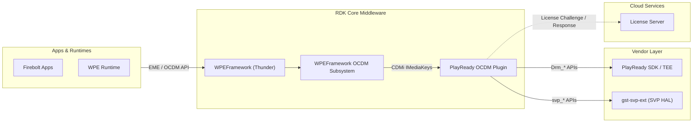
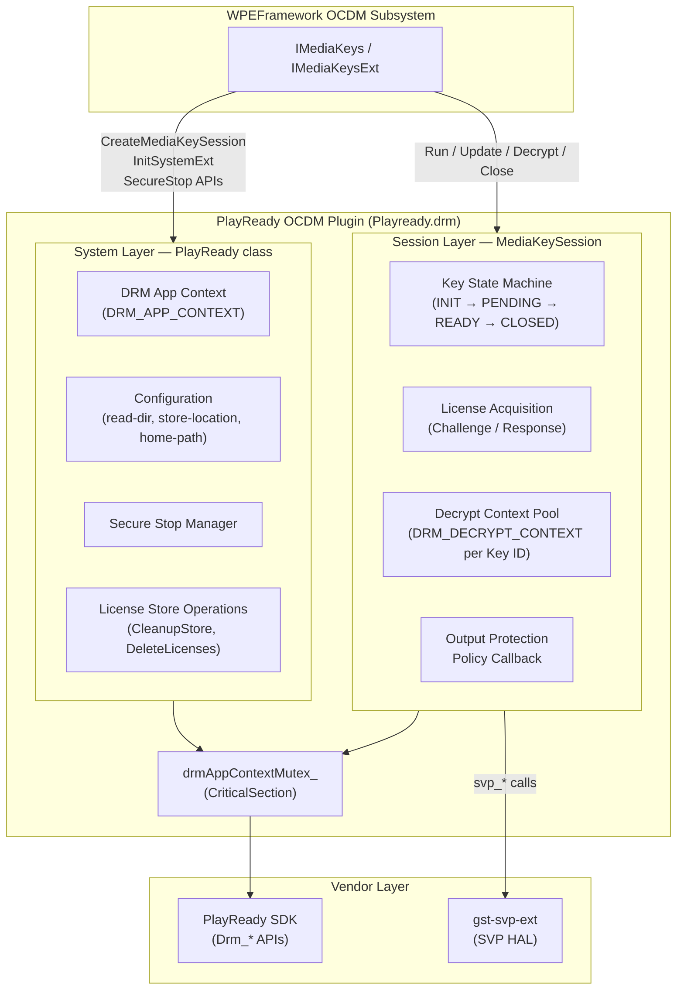
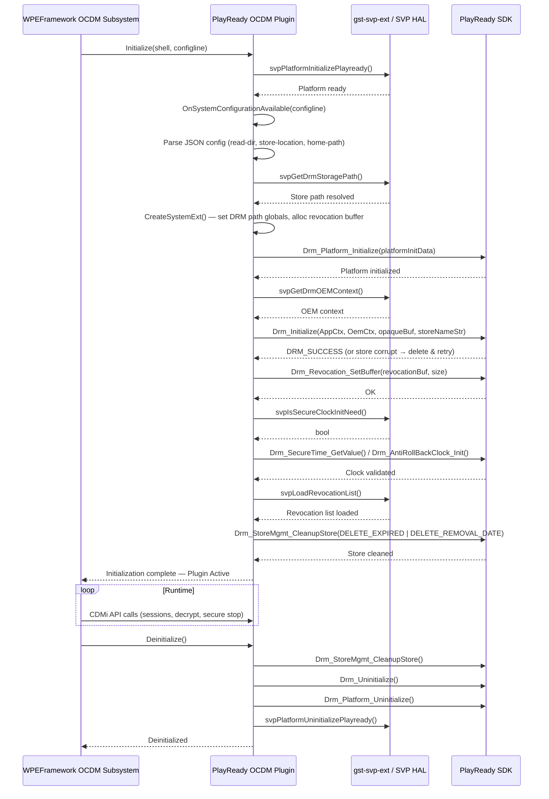
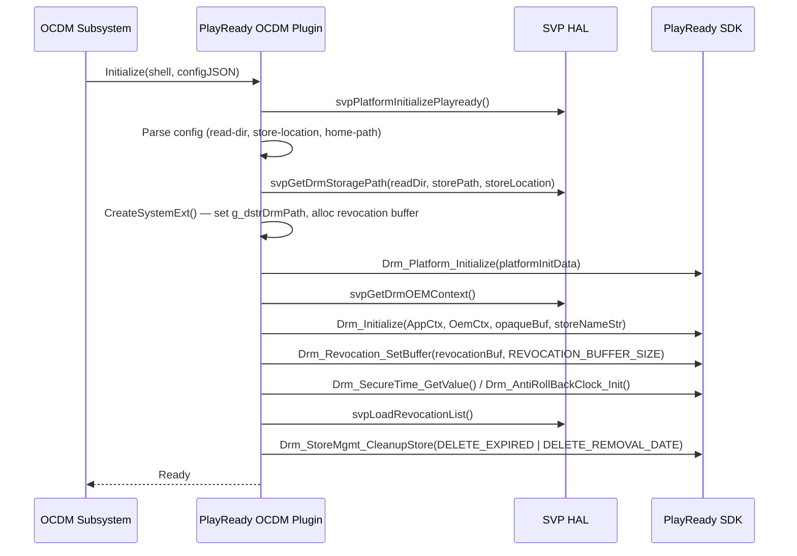
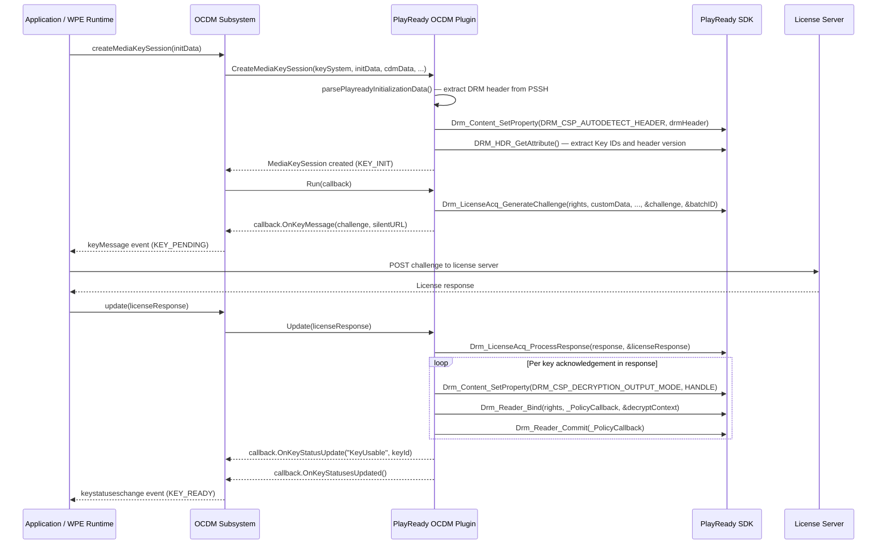
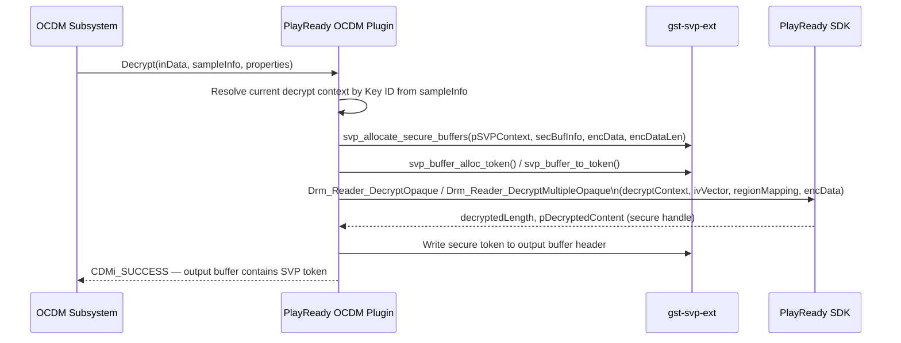
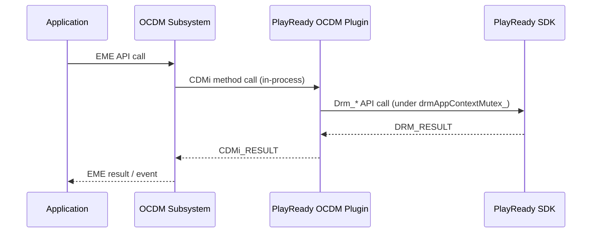
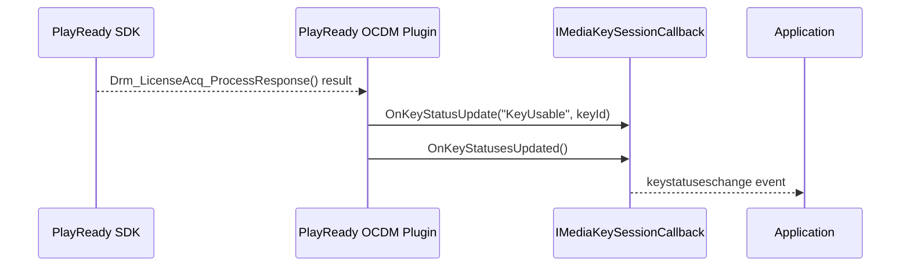

# PlayReady OCDM

The PlayReady OCDM (Open Content Decryption Module) component implements the Microsoft PlayReady DRM backend for WPEFramework (Thunder). It enables protected media playback by performing license acquisition, key binding, and hardware-accelerated content decryption through a standardized CDMi interface.

The component manages the complete lifecycle of a DRM session: parsing PlayReady PSSH initialization data extracted from the content manifest, generating a license challenge for dispatch to a license server, processing the license response to bind decryption keys, and decrypting encrypted media samples. The component is delivered as a shared object (`Playready.drm`) installed into the WPEFramework OCDM discovery directory and loaded by the OCDM subsystem at runtime.

From a stack perspective, the component resides within WPEFramework (Thunder) and exposes the CDMi `IMediaKeys` and `IMediaKeysExt` interfaces to the OCDM subsystem above it. Below, it depends on the PlayReady SDK for all DRM operations and on a platform-specific Secure Video Path (SVP) library (`gst-svp-ext`) for routing decrypted video content through protected memory without exposing it to normal accessible memory.

At the device level, the component allows PlayReady-protected video-on-demand and live streaming content to be played back on the device. At the module level, it manages the DRM application context lifecycle, session-scoped key state machines, license store maintenance, Secure Stop session tracking, and output protection policy enforcement.

**Key Features & Responsibilities:**

- **License Acquisition**: Generates a PlayReady license challenge from the DRM header present in the content and delivers it to the caller for dispatch to the license server. Processes the license server response and binds the resulting keys to per-key decrypt contexts.
- **Content Decryption**: Decrypts AES-CTR and AES-CBC/CBCS encrypted media samples using PlayReady opaque decrypt APIs, with subsample mapping support for mixed clear-and-encrypted content.
- **Secure Video Path Integration**: Routes decrypted video samples through protected memory regions using the SVP HAL, preventing video content from passing through normal accessible memory after decryption.
- **Secure Stop**: Tracks active playback sessions using the PlayReady Secure Stop mechanism and provides challenge generation and response processing APIs to allow a server to verify that playback has ended.
- **Output Protection Enforcement**: Evaluates license-specified output protection levels for compressed and uncompressed digital video, analog video, and digital audio outputs through a policy callback, and enforces maximum resolution decode constraints received from the license server.
- **License Store Management**: Maintains a persistent DRM store, performs cleanup of expired and removal-date licenses on initialization, supports store deletion, and provides a SHA-256 hash of the store for integrity verification.

---

## Design

The component is structured around two layers: a system-level context managed by the `PlayReady` class in `MediaSystem.cpp`, and a per-session context managed by `MediaKeySession` in `MediaSession.cpp` and `MediaSessionExt.cpp`. The system layer initializes the PlayReady platform and maintains the shared `DRM_APP_CONTEXT` that sessions within the same instance share. The session layer manages individual key state machines, license challenge-response cycles, and decrypt context binding. This separation allows multiple concurrent sessions — such as those needed for multi-period content or adaptive bitrate streams with multiple key IDs — to share a single application context while maintaining independent key states.

All interactions with the PlayReady SDK are serialized through a global `CriticalSection` (`drmAppContextMutex_`), ensuring thread safety for the shared `DRM_APP_CONTEXT`. A separate mutex (`prPlatformMutex_`) guards platform initialization using a reference counter so that concurrent callers do not double-initialize. Session construction is protected by `prSessionMutex_`.

The component's northbound interface is the CDMi `IMediaKeys` and `IMediaKeysExt` API consumed by the WPEFramework OCDM subsystem. Its southbound interface is the PlayReady SDK and the SVP HAL (`gst-svp-ext`). Configuration is delivered as a JSON string at `Initialize()` time, from which the DRM data directory, store path, and HOME environment variable are extracted.

The DRM store is persisted on the filesystem at the path specified by the `store-location` configuration parameter and is managed by the PlayReady SDK. The component performs a cleanup pass at startup to remove expired licenses. In-memory licenses are removed when the session closes. Temporary persistent licenses acquired during a session are tracked and deleted on session close to prevent unbounded accumulation.

### Threading Model

- **Threading Architecture**: Multi-threaded
- **Main Thread**: Handles `IMediaKeys` calls from the WPEFramework OCDM subsystem — initialization, session creation, Secure Stop operations, and configuration.
- **Worker Threads**:
  - _Decrypt caller thread_: Invokes `Decrypt()` on `MediaKeySession`; acquires `drmAppContextMutex_` for the duration of each decrypt operation.
- **Synchronization**:
  - `drmAppContextMutex_` — global `CriticalSection` protecting the shared `DRM_APP_CONTEXT` across all PlayReady SDK calls from both system and session layers.
  - `prPlatformMutex_` — `CriticalSection` with reference counting protecting `Drm_Platform_Initialize` and `Drm_Platform_Uninitialize` in `CPRDrmPlatform`.
  - `prSessionMutex_` — `CriticalSection` protecting `PlayreadySession::InitializeDRM` during session-local context setup.
- **Async / Event Dispatch**: Key status updates and key messages are delivered synchronously to the registered `IMediaKeySessionCallback` during `Update()`, `Run()`, and error paths. All callbacks are invoked inline on the calling thread.

### Platform and Integration Requirements

- **Build Dependencies**: `wpeframework`, `wpeframework-clientlibraries`, `wpeframework-tools-native`, `entservices-apis`, `gst-svp-ext`, `gstreamer1.0`, OpenSSL. Platform-specific PlayReady library resolved via `platform-playready-depends` and `platform-playready-flags` Yocto variables.
- **Plugin Dependencies**: WPEFramework OCDM subsystem must be active; the plugin is loaded as a CDMi backend by the OCDM plugin at startup.
- **Device Services / HAL**: The SVP HAL (`gst-svp-ext`) is the hardware abstraction used for secure memory allocation and token management during decryption.
- **Systemd Services**: When built with `systemd` in `DISTRO_FEATURES`, journal logging is enabled through `-DCMAKE_SYSTEMD_JOURNAL=1`.
- **Configuration Files**: JSON configuration string delivered by the WPEFramework configuration system at component initialization, containing `read-dir`, `store-location`, and `home-path` fields.
- **Startup Order**: The component is loaded by the WPEFramework OCDM subsystem. `svpPlatformInitializePlayready()` is called at the start of `Initialize()` before any DRM context setup.

---

### Component State Flow

#### Initialization to Active State

The component is initialized when the WPEFramework OCDM subsystem calls `Initialize()` on the system object. Platform-level PlayReady initialization is performed first (`svpPlatformInitializePlayready`), followed by JSON configuration parsing to extract the DRM data directory and store paths. The DRM path globals are set, directories are created, and the revocation buffer is allocated in `CreateSystemExt()`. The DRM application context is then initialized via `Drm_Initialize()`. If the store is found to be corrupt, it is deleted and initialization is retried automatically. After successful context setup, the revocation buffer is registered, the secure or anti-rollback clock is validated, and the revocation list is loaded. Finally, expired and removal-date licenses are removed from the store.

The component transitions through the following states during its lifecycle: **Initializing** (platform init, config parse) → **SystemExtCreated** (DRM path and revocation buffer allocated) → **AppCtxInitialized** (`Drm_Initialize` succeeded, revocation buffer registered, clock validated, revocation list loaded) → **Active** (serving CDMi calls and session creation) → **Shutdown** (store cleanup, `Drm_Uninitialize`, platform uninit).

#### Runtime State Changes

**State Change Triggers:**

- A new `MediaKeySession` is created per content stream. Each session transitions independently through `KEY_INIT` → `KEY_PENDING` → `KEY_READY` → `KEY_CLOSED`. `Update()` guards its entry with a state check (`KEY_PENDING` required).
- If `DRM_E_SECURESTORE_CORRUPT`, `DRM_E_SECURESTOP_STORE_CORRUPT`, or `DRM_E_DST_CORRUPTED` are returned from `Drm_Initialize`, the store file is deleted and initialization is automatically retried once.
- On `Close()`, in-memory licenses (tracked by batch ID) and any temporary persistent licenses acquired during the session are deleted from the store.

**Context Switching Scenarios:**

- When the license server response contains persistent licenses, they are tracked per session and removed when the session closes, preventing accumulation in the store across playback sessions.
- When `Drm_Reader_Bind` returns `DRM_E_BUFFERTOOSMALL`, the opaque buffer is doubled (up to 64× its initial size) and the bind operation is retried, allowing the session to adapt to license complexity without failing.

---

### Call Flows

#### Initialization Call Flow

#### Session License Acquisition Call Flow

#### Decrypt Call Flow

---

## Internal Modules

| Module / Class     | Description                                                                                                                                                                                                                                                                                                                                                    | Key Files                                                   |
| ------------------ | -------------------------------------------------------------------------------------------------------------------------------------------------------------------------------------------------------------------------------------------------------------------------------------------------------------------------------------------------------------- | ----------------------------------------------------------- |
| `PlayReady`        | Implements `IMediaKeys` and `IMediaKeysExt`. Manages the system-level DRM application context (`DRM_APP_CONTEXT`), configuration parsing, platform initialization, Secure Stop session enumeration and challenge/response, license store cleanup and deletion, and store integrity hashing. Receives JSON configuration from the WPEFramework host at startup. | `MediaSystem.cpp`                                           |
| `MediaKeySession`  | Implements `IMediaKeySession` and `IMediaKeySessionExt`. Manages per-session key state, license challenge generation, license response processing, decrypt context pool binding, sample decryption, output protection policy evaluation, and session teardown including license cleanup.                                                                       | `MediaSession.cpp`, `MediaSessionExt.cpp`, `MediaSession.h` |
| `PlayreadySession` | Base class for `MediaKeySession`. Owns a session-local `DRM_APP_CONTEXT` and manages reference-counted `DrmPlatformInitialize` / `Drm_Initialize` for sessions that do not share the system-level context.                                                                                                                                                     | `MediaSession.cpp`, `MediaSession.h`                        |
| `CPRDrmPlatform`   | Reference-counted wrapper for `Drm_Platform_Initialize` and `Drm_Platform_Uninitialize`. Ensures the PlayReady platform is initialized exactly once across multiple concurrent callers using `prPlatformMutex_`.                                                                                                                                               | `MediaSession.cpp`                                          |
| `KeyId`            | Utility class encapsulating a 16-byte DRM key identifier. Supports GUID little-endian and UUID big-endian byte orderings and toggling between them. Provides base64 and hex string representations for logging and protocol use.                                                                                                                               | `MediaSession.h`, `MediaSession.cpp`                        |

---

## Component Interactions

The component's interactions are with the WPEFramework OCDM subsystem (northbound, in-process), the PlayReady SDK (southbound, in-process), and the SVP HAL (`gst-svp-ext`) for secure memory management.

### Interaction Matrix

| Target Component / Layer        | Interaction Purpose                                                         | Key APIs / Topics                                                                                                                                                          |
| ------------------------------- | --------------------------------------------------------------------------- | -------------------------------------------------------------------------------------------------------------------------------------------------------------------------- |
| **WPEFramework OCDM Subsystem** |                                                                             |                                                                                                                                                                            |
| OCDM plugin                     | CDMi interface entry points for key system and session lifecycle management | `IMediaKeys::CreateMediaKeySession`, `IMediaKeysExt::InitSystemExt`, `IMediaKeysExt::TeardownSystemExt`, `IMediaKeysExt::GetSecureStop`, `IMediaKeysExt::CommitSecureStop` |
| `IMediaKeySessionCallback`      | Session event delivery to the OCDM caller                                   | `OnKeyMessage()`, `OnKeyStatusUpdate()`, `OnKeyStatusesUpdated()`, `OnError()`                                                                                             |
| **PlayReady SDK**               |                                                                             |                                                                                                                                                                            |
| PlayReady SDK                   | DRM platform and application context lifecycle                              | `Drm_Platform_Initialize()`, `Drm_Platform_Uninitialize()`, `Drm_Initialize()`, `Drm_Uninitialize()`, `Drm_Reinitialize()`                                                 |
| PlayReady SDK                   | Content header parsing and key selection                                    | `Drm_Content_SetProperty()` with `DRM_CSP_AUTODETECT_HEADER`, `DRM_CSP_SELECT_KID`, `DRM_CSP_DECRYPTION_OUTPUT_MODE`                                                       |
| PlayReady SDK                   | License acquisition                                                         | `Drm_LicenseAcq_GenerateChallenge()`, `Drm_LicenseAcq_ProcessResponse()`                                                                                                   |
| PlayReady SDK                   | Decrypt context binding and content decryption                              | `Drm_Reader_Bind()`, `Drm_Reader_Commit()`, `Drm_Reader_Close()`, `Drm_Reader_DecryptOpaque()`, `Drm_Reader_DecryptMultipleOpaque()`                                       |
| PlayReady SDK                   | Revocation data management                                                  | `Drm_Revocation_SetBuffer()`                                                                                                                                               |
| PlayReady SDK                   | Secure time and anti-rollback clock                                         | `Drm_SecureTime_GetValue()`, `Drm_AntiRollBackClock_Init()`                                                                                                                |
| PlayReady SDK                   | Secure Stop session management                                              | `Drm_SecureStop_EnumerateSessions()`, `Drm_SecureStop_GenerateChallenge()`, `Drm_SecureStop_ProcessResponse()`                                                             |
| PlayReady SDK                   | License store maintenance                                                   | `Drm_StoreMgmt_CleanupStore()`, `Drm_StoreMgmt_DeleteLicenses()`, `Drm_StoreMgmt_DeleteInMemoryLicenses()`                                                                 |
| **SVP HAL (gst-svp-ext)**       |                                                                             |                                                                                                                                                                            |
| gst-svp-ext                     | Platform PlayReady initialization and teardown                              | `svpPlatformInitializePlayready()`, `svpPlatformUninitializePlayready()`                                                                                                   |
| gst-svp-ext                     | DRM and platform context provisioning                                       | `svpGetDrmOEMContext()`, `svpGetDrmPlatformInitData()`                                                                                                                     |
| gst-svp-ext                     | DRM storage path resolution                                                 | `svpGetDrmStoragePath()`                                                                                                                                                   |
| gst-svp-ext                     | Revocation list loading and clock initialization flag                       | `svpLoadRevocationList()`, `svpIsSecureClockInitNeed()`                                                                                                                    |
| gst-svp-ext                     | Secure buffer lifecycle for decrypted video                                 | `svp_allocate_secure_buffers()`, `svp_release_secure_buffers()`, `svp_buffer_alloc_token()`, `svp_buffer_to_token()`, `svp_buffer_free_token()`, `svp_token_size()`        |
| gst-svp-ext                     | SVP context lifecycle                                                       | `gst_svp_ext_get_context()`, `gst_svp_ext_free_context()`                                                                                                                  |
| gst-svp-ext                     | SVP buffer header inspection and update                                     | `gst_svp_has_header()`, `gst_svp_header_get_start_of_data()`, `gst_svp_header_get_field()`, `gst_svp_header_set_field()`                                                   |
| gst-svp-ext                     | Per-stream decrypt path capability queries                                  | `svpIsAudioNeedNonSVPContext()`, `svpIsVideoResCheckNeed()`, `svpIsDynamicSVPEncEnabled()`, `svpIsMultipleOpaqueSupportCTR()`                                              |
| **External Systems**            |                                                                             |                                                                                                                                                                            |
| License Server                  | License challenge dispatch and response retrieval                           | HTTP POST (the caller handles transport; the component generates the challenge binary and processes the response binary)                                                      |

### Events Published

| Event Name           | IARM / JSON-RPC Topic                            | Trigger Condition                                                                                                                                                                                                                                               | Subscriber Components                    |
| -------------------- | ------------------------------------------------ | --------------------------------------------------------------------------------------------------------------------------------------------------------------------------------------------------------------------------------------------------------------- | ---------------------------------------- |
| Key message          | `IMediaKeySessionCallback::OnKeyMessage`         | License challenge successfully generated in `playreadyGenerateKeyRequest()`                                                                                                                                                                                     | OCDM subsystem → EME layer → application |
| Key status update    | `IMediaKeySessionCallback::OnKeyStatusUpdate`    | License bound successfully (`KeyUsable`), output restriction (`KeyOutputRestricted`, `KeyOutputRestrictedHDCP`, `KeyOutputRestrictedHDCP22`), license expired (`LicenseExpired`), license not found (`LicenseNotFound`), or internal error (`KeyInternalError`) | OCDM subsystem → application             |
| Key statuses updated | `IMediaKeySessionCallback::OnKeyStatusesUpdated` | Completion of all key status updates within an `Update()` cycle or persistent license pre-check                                                                                                                                                                 | OCDM subsystem                           |
| Error                | `IMediaKeySessionCallback::OnError`              | Decrypt failure or license challenge generation failure                                                                                                                                                                                                         | OCDM subsystem → application             |

### IPC Flow Patterns

**Primary Request / Response Flow:**

The OCDM subsystem dispatches CDMi API calls directly in-process to the component's C++ interface. The component then invokes PlayReady SDK APIs synchronously under the protection of `drmAppContextMutex_`.

**Event Notification Flow:**

Key status events are posted synchronously from within the `Update()` and `playreadyGenerateKeyRequest()` call paths by invoking the registered `IMediaKeySessionCallback` directly on the calling thread.

---

## Implementation Details

### Major HAL APIs Integration

| HAL / DS API                                         | Purpose                                                                               | Implementation File                                          |
| ---------------------------------------------------- | ------------------------------------------------------------------------------------- | ------------------------------------------------------------ |
| `Drm_Platform_Initialize()`                          | Initialize the PlayReady platform layer using platform-specific init data             | `MediaSession.cpp`                                           |
| `Drm_Platform_Uninitialize()`                        | Uninitialize the PlayReady platform layer                                             | `MediaSession.cpp`                                           |
| `Drm_Initialize()`                                   | Initialize the DRM application context with an opaque buffer and store path           | `MediaSystem.cpp`, `MediaSession.cpp`                        |
| `Drm_Uninitialize()`                                 | Release the DRM application context                                                   | `MediaSystem.cpp`, `MediaSession.cpp`                        |
| `Drm_Reinitialize()`                                 | Re-initialize an existing DRM application context on session reuse                    | `MediaSession.cpp`                                           |
| `Drm_Content_SetProperty()`                          | Set content properties: auto-detect header, select KID, set decryption output mode    | `MediaSystem.cpp`, `MediaSession.cpp`, `MediaSessionExt.cpp` |
| `Drm_LicenseAcq_GenerateChallenge()`                 | Generate a license acquisition challenge from the DRM header                          | `MediaSession.cpp`, `MediaSessionExt.cpp`                    |
| `Drm_LicenseAcq_ProcessResponse()`                   | Process a license server response and store acquired licenses                         | `MediaSession.cpp`                                           |
| `Drm_Reader_Bind()`                                  | Bind a decrypt context to a license for the specified key ID                          | `MediaSession.cpp`, `MediaSessionExt.cpp`                    |
| `Drm_Reader_Commit()`                                | Commit the bound reader context and apply output protection policy                    | `MediaSession.cpp`, `MediaSessionExt.cpp`                    |
| `Drm_Reader_Close()`                                 | Release a decrypt context                                                             | `MediaSession.cpp`                                           |
| `Drm_Reader_DecryptOpaque()`                         | Decrypt a single-region encrypted buffer into a secure opaque output                  | `MediaSession.cpp`                                           |
| `Drm_Reader_DecryptMultipleOpaque()`                 | Decrypt a multi-region encrypted buffer supporting multiple IV values                 | `MediaSession.cpp`                                           |
| `Drm_Revocation_SetBuffer()`                         | Register the revocation data buffer with the application context                      | `MediaSystem.cpp`, `MediaSession.cpp`                        |
| `Drm_SecureTime_GetValue()`                          | Read the secure clock value and type from the application context                     | `MediaSystem.cpp`                                            |
| `Drm_AntiRollBackClock_Init()`                       | Initialize the anti-rollback clock when the secure clock is unavailable               | `MediaSystem.cpp`                                            |
| `Drm_SecureStop_EnumerateSessions()`                 | List active Secure Stop session IDs from the store                                    | `MediaSystem.cpp`                                            |
| `Drm_SecureStop_GenerateChallenge()`                 | Generate a Secure Stop challenge for a given session ID                               | `MediaSystem.cpp`                                            |
| `Drm_SecureStop_ProcessResponse()`                   | Process a Secure Stop server response                                                 | `MediaSystem.cpp`                                            |
| `Drm_StoreMgmt_CleanupStore()`                       | Remove expired and removal-date licenses from the DRM store                           | `MediaSystem.cpp`                                            |
| `Drm_StoreMgmt_DeleteLicenses()`                     | Delete a specific license identified by KID and LID                                   | `MediaSession.cpp`                                           |
| `Drm_StoreMgmt_DeleteInMemoryLicenses()`             | Delete all in-memory licenses associated with a batch ID                              | `MediaSession.cpp`                                           |
| `svpPlatformInitializePlayready()`                   | Perform SVP-layer PlayReady platform initialization                                   | `MediaSystem.cpp`                                            |
| `svpPlatformUninitializePlayready()`                 | Perform SVP-layer PlayReady platform teardown                                         | `MediaSystem.cpp`                                            |
| `svpGetDrmOEMContext()`                              | Retrieve the OEM DRM context pointer for `Drm_Initialize`                             | `MediaSystem.cpp`, `MediaSession.cpp`                        |
| `svpGetDrmPlatformInitData()`                        | Retrieve platform-specific initialization data for `Drm_Platform_Initialize`          | `MediaSession.cpp`                                           |
| `svp_allocate_secure_buffers()`                      | Allocate protected memory regions for decrypted video content                         | `MediaSession.cpp`                                           |
| `svp_release_secure_buffers()`                       | Release protected memory regions after use                                            | `MediaSession.cpp`                                           |
| `svp_buffer_alloc_token()` / `svp_buffer_to_token()` | Convert a secure buffer handle to an opaque token for downstream pipeline consumption | `MediaSession.cpp`                                           |

### Key Implementation Logic

- **State / Lifecycle Management**: `MediaKeySession` maintains a `KeyState` enum with values `KEY_INIT`, `KEY_PENDING`, `KEY_READY`, `KEY_ERROR`, and `KEY_CLOSED`. State transitions are driven by `Run()` (→ `KEY_PENDING`), `Update()` (→ `KEY_READY` or `KEY_ERROR`), and `Close()` (→ `KEY_CLOSED`). The entry guard `ChkBOOL(m_eKeyState == KEY_PENDING)` at the start of `Update()` prevents out-of-order license response processing.
  - Core implementation: `MediaSession.cpp`
  - State transition handlers: `MediaSession.cpp` (`Run`, `Update`, `Close`, `playreadyGenerateKeyRequest`)

- **Event Processing**: Events are dispatched synchronously to `IMediaKeySessionCallback` from within `Update()`, `playreadyGenerateKeyRequest()`, and error paths. Key status strings (`"KeyUsable"`, `"KeyOutputRestricted"`, `"KeyOutputRestrictedHDCP"`, `"KeyOutputRestrictedHDCP22"`, `"LicenseExpired"`, `"LicenseNotFound"`, `"KeyInternalError"`) are mapped from `DRM_RESULT` values through `MapDrToKeyMessage()` in `MediaSession.cpp`.

- **Error Handling Strategy**: `DRM_RESULT` error codes are checked after every PlayReady SDK call. Non-fatal errors trigger retry logic: `DRM_E_BUFFERTOOSMALL` in `ReaderBind` causes the opaque buffer to be doubled (up to 64× its initial size) before retrying; two-pass challenge generation handles initial buffer sizing. Fatal errors set `m_eKeyState = KEY_ERROR` and invoke `OnError()` and `OnKeyStatusUpdate()` on the callback. Decrypt failures are handled in `DRM_DecryptFailure()`, which reports a hex-encoded error code string. Store corruption at `Drm_Initialize` triggers automatic store deletion and one retry.

- **Logging & Diagnostics**: Diagnostics are emitted via `fprintf(stderr, ...)` with function name, line number, and the DRM error code in hex. When `DRM_ERROR_NAME_SUPPORT` is enabled at build time, human-readable error name strings are appended to each log message via `DRM_ERR_GetErrorNameFromCode()`.

---

## Configuration

### Key Configuration Files

| Configuration File                            | Purpose                                                                                          | Override Mechanism                                                        |
| --------------------------------------------- | ------------------------------------------------------------------------------------------------ | ------------------------------------------------------------------------- |
| JSON configuration string (WPEFramework host) | Specifies the DRM data directory path, DRM store file path, and HOME path for the component process | Delivered by the WPEFramework configuration system at `Initialize()` time |

### Key Configuration Parameters

| Parameter        | Type   | Default | Description                                                                                                                       |
| ---------------- | ------ | ------- | --------------------------------------------------------------------------------------------------------------------------------- |
| `read-dir`       | string | —       | Filesystem path to the directory containing PlayReady data files (device certificate and related assets).                         |
| `store-location` | string | —       | Filesystem path to the PlayReady DRM store file where licenses are persisted.                                                     |
| `home-path`      | string | —       | Value set as the `HOME` environment variable for the component process; required for Secure Stop functionality to operate correctly. |

### Build-Time Configuration Parameters

| CMake Flag                        | Default            | Description                                                                                                                                                                          |
| --------------------------------- | ------------------ | ------------------------------------------------------------------------------------------------------------------------------------------------------------------------------------ |
| `USE_SVP`                         | On (unconditional) | Enables Secure Video Path integration via `gst-svp-ext`. Applied unconditionally across all build configurations.                                                                    |
| `DRM_ERROR_NAME_SUPPORT`          | Off                | When enabled, appends human-readable DRM error name strings to all log messages.                                                                                                     |
| `DRM_ANTI_ROLLBACK_CLOCK_SUPPORT` | Off                | When enabled, allows falling back to the anti-rollback clock when the secure clock is unavailable.                                                                                   |
| `PLAYREADY_VERSION_4_6`           | Off                | When enabled, uses the PlayReady 4.6 SDK version string global instead of the legacy global.                                                                                         |
| `NO_PERSISTENT_LICENSE_CHECK`     | Off                | When enabled, `PersistentLicenseCheck()` unconditionally returns failure, preventing key reuse from a prior session and always forcing a fresh license request.                      |
| `TEE_CONFIG_NEED`                 | Off                | When enabled, includes the TEE configuration header and calls `OEM_OPTEE_SetHandle()` in the decrypt path.                                                                           |
| `CLEAN_ON_INIT`                   | On (hardcoded)     | Unconditionally performs a license store cleanup on every `InitSystemExt()` call. Defined as a `#define` in `MediaSystem.cpp`, always active and independent of CMake configuration. |

### Configuration Persistence

The DRM store file at the path specified by `store-location` persists license data across reboots and is managed by the PlayReady SDK. In-memory licenses and temporary persistent licenses acquired during a session are deleted from the store when that session is closed.
