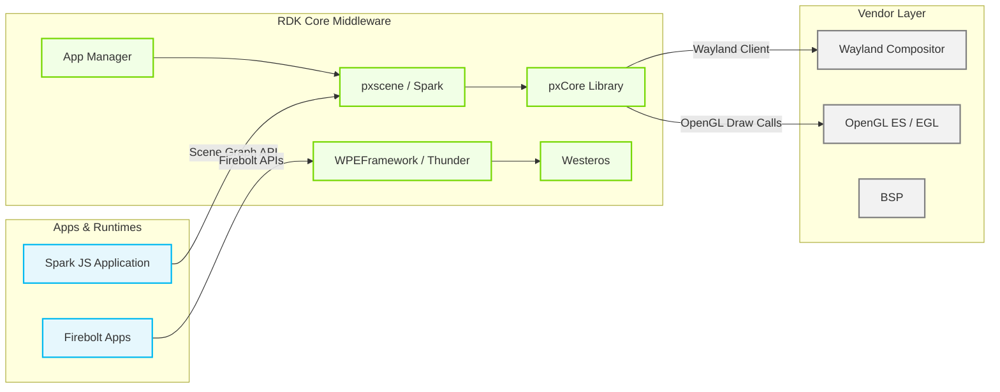
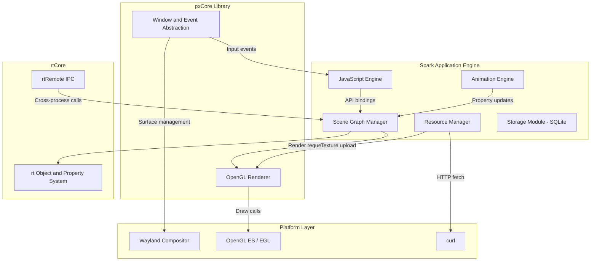
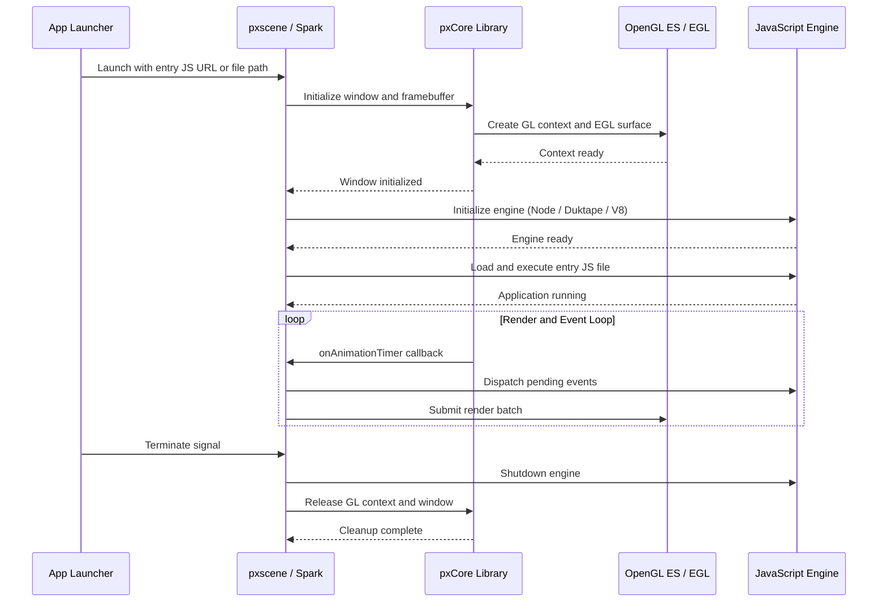
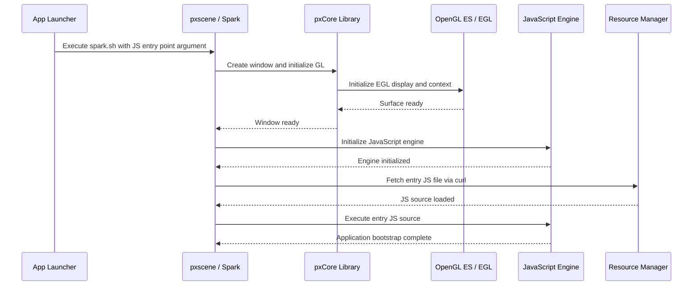
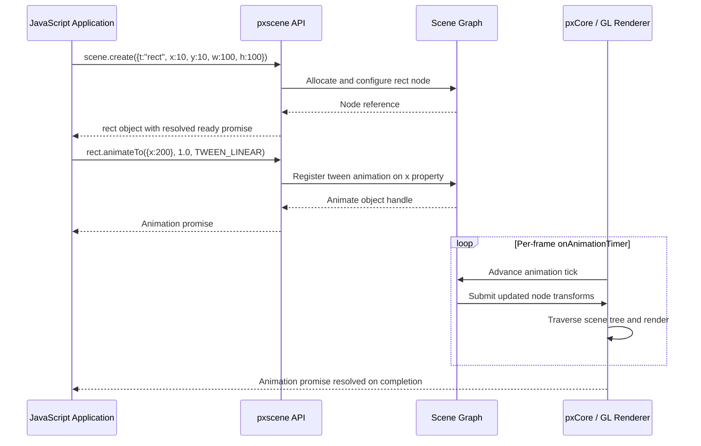
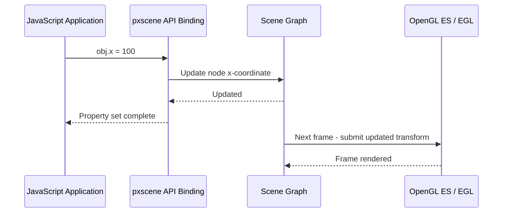
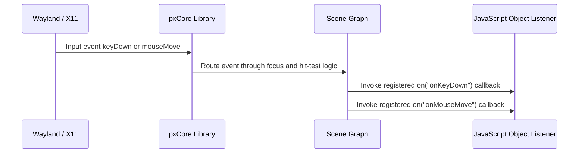

# pxCore

pxCore is a portable C++ library that provides framebuffer and windowing abstractions for building 2D/3D rasterizers, filter routines, image processing pipelines, and transition libraries across multiple platforms. It decouples the framebuffer abstraction from the windowing mechanism so that either subsystem can be used independently or combined with third-party toolkits, keeping the library minimal by design.

Built on top of pxCore is **pxscene**, also referred to as **Spark**, a JavaScript application engine that exposes a hierarchical 2D scene graph API to a JavaScript runtime. Spark enables JavaScript applications to compose and animate visual elements using a DOM-like programming model with W3C event-bubbling semantics and promise-based asynchronous behavior.

At the device and product level, Spark functions as a JavaScript application runtime in the RDK middleware. JavaScript-based applications interact with the scene graph through a well-defined API to create, transform, and animate on-screen elements. At the module level, pxCore supplies the windowing, event dispatch, framebuffer management, and OpenGL rendering substrate that Spark relies upon, while optional modules provide video playback (via AAMP) and cross-process object access (via rtRemote).



**Key Features & Responsibilities:**

- **Portable Framebuffer Abstraction**: Provides a platform-independent 32bpp framebuffer interface and windowing primitives, enabling rasterization code to run on Linux (X11, Wayland), macOS, Windows, and Raspberry Pi without platform-specific changes.
- **2D Hierarchical Scene Graph**: pxscene exposes a hierarchical affine scene graph to JavaScript, supporting compositing, clipping, masking, and z-ordering of visual elements including rectangles, images, nine-slice images, text, and text boxes.
- **JavaScript Application Runtime**: Spark supports Node.js, Duktape, and V8 as interchangeable JavaScript engines, allowing applications to be deployed with different memory and performance tradeoffs using the same scene graph API.
- **Animation Engine**: Provides promise-based `animateTo()` animation with configurable tween interpolators (linear, exponential, ease-in/out variants), looping, and oscillation options driven by a per-frame animation timer.
- **Asynchronous Resource Loading**: Image and font resources are fetched asynchronously via curl and decoded using FreeType2, libpng, and libjpeg, with promise-based readiness signaling back to the JavaScript application.
- **Wayland Compositor Integration**: Supports hosting Wayland client applications directly as `wayland` scene objects, enabling embedded Wayland child surfaces within a Spark scene.
- **Cross-Process Object Access (rtRemote)**: rtRemote serializes rtObject property reads, writes, and method calls over a network channel, supporting distributed Spark application architectures.
- **Optional Video Playback**: When built with `SPARK_ENABLE_VIDEO=ON`, integrates AAMP for adaptive video streaming and GStreamer for media pipeline management.

---

## Design

pxCore separates its framebuffer abstraction from its windowing abstraction by design, so that either subsystem can be integrated independently with external toolkits. The pxCore library is deliberately minimal — a simple windowed application can be built in as little as 8KB on Windows. pxscene (Spark) layers a full scene graph and JavaScript binding system on top of this substrate, keeping rendering policy in the application layer rather than the core library. The pluggable JavaScript engine architecture supports Node.js (default), Duktape (low-memory), and V8 as build-time-selectable choices, enabling the same application code to be deployed across different hardware classes. Resources (images, fonts, remote JavaScript files) are loaded asynchronously via curl to keep the event loop non-blocking. Dirty-rectangle rendering (`PXSCENE_DIRTY_RECTANGLES`) limits GPU work to changed screen regions on resource-constrained platforms.

Northbound, pxscene exposes a JavaScript API surface (`scene.create()`, `obj.animateTo()`, `scene.on()`) consumed directly by JavaScript applications following a DOM-like programming model with W3C event bubbling, promise-based async operations, and camelCase property conventions. Southbound, pxCore drives rendering through OpenGL ES/EGL and manages surface lifecycle through the Wayland client protocol on embedded deployments, or through X11/GLUT on desktop platforms.

IPC is addressed at two levels. The JavaScript engine's event loop (libuv in Node.js and Duktape configurations) provides in-process asynchronous I/O for network requests, file operations, and timer callbacks. At the inter-process level, rtRemote provides a network-serialized object access protocol that allows remote processes to call properties and methods on scene graph objects when `BUILD_RTREMOTE_LIBS=ON`.

Persistence for JavaScript application data is handled through a SQLite-backed storage API compiled in when `SUPPORT_STORAGE=ON`. Crash reporting uses Breakpad to capture and serialize minidump reports on unexpected exits. Log output uses `rtLog`, and debug-mode instrumentation is active by default; it can be disabled at build time via `DISABLE_DEBUG_MODE=ON`.



#### Threading Model

- **Threading Architecture**: Multi-threaded. The JavaScript event loop thread and the render/animation thread operate concurrently.
- **Main / Event Loop Thread**: Runs the libuv event loop (or equivalent per engine) that drives JavaScript execution, timer callbacks, network I/O completion, and scene graph property updates dispatched by the application.
- **Worker Threads** (if applicable):
  - _Render / Animation Thread_: Drives per-frame `onDraw` and `onAnimationTimer` callbacks to the scene graph and submits OpenGL draw calls to the GPU at the configured frame rate.
  - _Resource Loader Threads_: Asynchronously fetch and decode image and font assets using curl and the respective decode libraries; results are posted back to the event loop on completion.
- **Synchronization**: Scene graph state shared between the JavaScript event thread and the render thread is protected using mutex guards. libuv's async handle mechanism (`uv_async_send`) is used to signal the event loop from background threads.
- **Async / Event Dispatch**: JavaScript promise resolution and event callbacks are posted back onto the libuv event queue from background resource loading and render threads, ensuring non-blocking behavior in the JavaScript application layer.

### Prerequisites and Dependencies

#### Platform and Integration Requirements

- **Build Dependencies**: OpenSSL, curl, zlib (from Yocto recipe in `rtcore_git.bb`); FreeType2, libpng, libjpeg, libjpeg-turbo, giflib, GLEW, libuv (from `cmake/CommDeps.cmake` and external libraries). SQLite when `SUPPORT_STORAGE=ON`.
- **Startup Order**: Spark is launched as a standalone application or via the App Manager; it requires an active Wayland compositor (or X11 display server) before the window can be created.

---

### Component State Flow

#### Initialization to Active State

Spark transitions through the following states during its lifecycle: **Launching** (process start, argument parsing) → **GraphicsInit** (OpenGL context and Wayland surface creation) → **EngineInit** (JavaScript engine initialization) → **AppLoading** (entry-point JS file fetch and execution) → **Active** (render/event loop running) → **Shutdown** (JS engine teardown, GL context release).



#### Runtime State Changes

**State Change Triggers:**

- A window resize event causes the scene root dimensions (`scene.w`, `scene.h`) to update and an `onResize` JavaScript callback to fire, allowing the application to reflow its scene graph layout.
- Setting an object's `draw` property to `false` removes it from the render traversal without deleting it from the scene tree, functioning as a lightweight visibility toggle.
- Animation state transitions (running → completed) are signaled through the promise returned by `animateTo()`, allowing chained scene changes without polling.

**Context Switching Scenarios:**

- When a scene object's `painting` property is set to `false`, the object and its subtree are snapshotted and cease tracking live property changes until `painting` is restored to `true`.
- On Wayland platforms, a `wayland` scene object transitions from idle to connected when a Wayland client process attaches to the exported display name, resolving the `remoteReady` promise.

---

### Call Flows

#### Initialization Call Flow



#### Request Processing Call Flow

The JavaScript application creates and animates scene objects through the Spark scene graph API. Each property mutation or `animateTo()` call is routed through the JavaScript binding layer to the C++ scene graph, which schedules the change for the next frame render. The resulting OpenGL draw commands are batched and submitted to the GPU on each animation timer callback.



---

## Internal Modules

| Module / Class     | Description                                                                                                                                                                                                                                                            | Key Files                                 |
| ------------------ | ---------------------------------------------------------------------------------------------------------------------------------------------------------------------------------------------------------------------------------------------------------------------- | ----------------------------------------- |
| `pxCore Library`   | Portable C++ framebuffer and windowing substrate providing window creation, keyboard/mouse/resize event dispatch, 32bpp framebuffer access, platform-native surface construction, and per-frame animation timer callbacks. Supports X11/GLUT and Wayland+EGL backends. | `src/`                                    |
| `pxscene / Spark`  | JavaScript application engine that wraps pxCore with a 2D hierarchical scene graph and JavaScript bindings for all scene object types (rect, image, image9, text, textBox, wayland, sceneContainer). Drives the render and animation loop.                             | `examples/pxScene2d/src/`                 |
| `rtCore`           | Lightweight C++ object and property system compiled into `librtCoreExt.so`. Provides base type infrastructure (`rtObject`, `rtValue`) used throughout the scene graph. Headers installed under `/usr/include/rtcore` and `/usr/include/rtcore/unix`.                   | `src/` (rtcore branch)                    |
| `rtRemote`         | Cross-process scene graph object access layer that serializes rtObject property reads, writes, and method calls over a network channel. Compiled when `BUILD_RTREMOTE_LIBS=ON`.                                                                                        | `remote/`                                 |
| `dukluv`           | LibUV bindings for the Duktape JavaScript engine providing an asynchronous event loop with TCP, timers, file system, and DNS modules in a Node.js-compatible API style. Active when `SUPPORT_DUKTAPE=ON`. Receives data from external sources via libuv I/O callbacks. | `examples/pxScene2d/external/dukluv/src/` |
| `Resource Manager` | Asynchronously downloads image and font resources via curl and decodes them using FreeType2, libpng, and libjpeg. Uploads decoded data as GPU textures and exposes a promise-based `ready` property to JavaScript. Receives external data from remote HTTP endpoints.  | `examples/pxScene2d/src/`                 |
| `Storage Module`   | SQLite-backed persistent key-value store accessible from JavaScript when `SUPPORT_STORAGE=ON`. An optional encryption extension is controlled by `ENABLE_SQLITE_ENCRYPTION_EXTENSION`.                                                                                 | `examples/pxScene2d/src/`                 |

---

## Component Interactions

pxCore/Spark interacts with the JavaScript application layer above and with platform graphics, network, and decode libraries below.

### Interaction Matrix

| Target Component / Layer    | Interaction Purpose                                                                                           | Key APIs / Topics                                                                 |
| --------------------------- | ------------------------------------------------------------------------------------------------------------- | --------------------------------------------------------------------------------- |
| **JavaScript Applications** |                                                                                                               |                                                                                   |
| Spark Scene Graph API       | JavaScript applications create, modify, animate, and receive events on scene objects                          | `scene.create()`, `obj.animateTo()`, `scene.on()`, `obj.on()`, `scene.getFocus()` |
| **Platform / Graphics**     |                                                                                                               |                                                                                   |
| OpenGL ES / EGL             | Frame rendering — all visual output is submitted as OpenGL draw calls; EGL manages the on-screen surface      | OpenGL ES draw calls, `eglSwapBuffers()`                                          |
| Wayland Compositor          | Window and surface lifecycle on embedded platforms; Wayland client surfaces embedded as `wayland` scene nodes | Wayland client protocol                                                           |
| X11 / GLUT                  | Windowing and event backend on desktop / development platforms                                                | GLUT/X11 window and event API                                                     |
| **External Libraries**      |                                                                                                               |                                                                                   |
| curl                        | Asynchronous download of JavaScript source files and image/font resources                                     | curl multi-handle async API                                                       |
| FreeType2                   | Font rasterization for `text` and `textBox` scene objects; metrics via `getFontMetrics()`                     | FreeType2 API                                                                     |
| libpng / libjpeg            | Decoding of PNG and JPEG image resources for `image` and `image9` scene objects                               | libpng / libjpeg decode API                                                       |
| SQLite                      | Persistent key-value storage accessible from JavaScript when `SUPPORT_STORAGE=ON`                             | SQLite storage API                                                                |
| AAMP / GStreamer            | Adaptive video streaming and media pipeline when `SPARK_ENABLE_VIDEO=ON`                                      | AAMP JS bindings, GStreamer pipeline API                                          |
| rtRemote                    | Cross-process scene graph object access when `BUILD_RTREMOTE_LIBS=ON`                                         | rtRemote network serialization protocol                                           |
| Breakpad                    | Crash minidump capture on unexpected process termination                                                      | Breakpad exception handler API                                                    |

### Events Published

Scene object events are dispatched to JavaScript callback functions registered via `scene.on()` or `obj.on()`.

| Event Name           | JavaScript Registration          | Trigger Condition                                    | Receiver                                      |
| -------------------- | -------------------------------- | ---------------------------------------------------- | --------------------------------------------- |
| `onMouseDown`        | `obj.on("onMouseDown", fn)`      | Mouse button pressed over an interactive object      | Registered JavaScript listener on that object |
| `onMouseUp`          | `obj.on("onMouseUp", fn)`        | Mouse button released over an interactive object     | Registered JavaScript listener on that object |
| `onMouseMove`        | `obj.on("onMouseMove", fn)`      | Mouse pointer moved                                  | Registered JavaScript listener                |
| `onMouseEnter`       | `obj.on("onMouseEnter", fn)`     | Mouse pointer enters the object's bounding area      | Registered JavaScript listener                |
| `onMouseLeave`       | `obj.on("onMouseLeave", fn)`     | Mouse pointer leaves the object's bounding area      | Registered JavaScript listener                |
| `onKeyDown`          | `obj.on("onKeyDown", fn)`        | Key pressed while the object has keyboard focus      | Focused object's registered listener          |
| `onKeyUp`            | `obj.on("onKeyUp", fn)`          | Key released while the object has keyboard focus     | Focused object's registered listener          |
| `onChar`             | `obj.on("onChar", fn)`           | Character input generated while the object has focus | Focused object's registered listener          |
| `onFocus` / `onBlur` | `obj.on("onFocus"/"onBlur", fn)` | Keyboard focus gained or lost by the object          | Registered JavaScript listener                |
| `onResize`           | `scene.on("onResize", fn)`       | Window resize event from the windowing layer         | Scene-level registered listener               |

### IPC Flow Patterns

**Primary Request / Response Flow:**

The JavaScript application calls the pxscene API directly within the same process. The binding layer translates the call into a scene graph operation, executed immediately for property sets or deferred to the next animation frame for animated transitions.



**Event Notification Flow:**

Input events from the windowing layer are received by pxCore, routed through the scene graph hit-test and focus logic, and dispatched as JavaScript callback invocations on matching scene objects.



---

## Implementation Details

### Platform API Integration

| Platform API            | Purpose                                                                                                | Implementation Area                          |
| ----------------------- | ------------------------------------------------------------------------------------------------------ | -------------------------------------------- |
| OpenGL ES draw calls    | Submit geometry, textures, and shader programs for 2D scene rendering each frame                       | `src/` — pxCore GL renderer                  |
| EGL surface management  | Create and manage the on-screen rendering surface bound to the Wayland or X11 window                   | `src/` — pxCore windowing backend            |
| Wayland client protocol | Manage the application window, receive compositor events, embed Wayland client surfaces as scene nodes | `src/` — pxCore Wayland backend              |
| curl async API          | Asynchronous download of remote JS source files, images, and font resources                            | `examples/pxScene2d/src/` — Resource Manager |
| FreeType2 API           | Rasterize font glyphs and retrieve font metrics for `text` and `textBox` scene objects                 | `examples/pxScene2d/src/`                    |
| SQLite storage API      | Read and write persistent key-value pairs from the JavaScript storage API                              | `examples/pxScene2d/src/` — Storage Module   |

### Key Implementation Logic

- **State / Lifecycle Management**: The application lifecycle is managed by the JavaScript event loop. Startup loads the entry JS file, the steady state is the event loop iteration, and shutdown is triggered by process termination or an explicit exit call from JavaScript.
  - Core implementation: `examples/pxScene2d/src/`
  - Window and GL lifecycle: `src/` (pxCore)

- **Event Processing**: Input events from the windowing layer are received synchronously in the render/event loop callback and dispatched to the JavaScript layer via the JS engine's callback invocation mechanism. Propagation follows W3C event bubbling — events travel from the target object up through the parent chain until `stopPropagation()` is called or the scene root is reached.

- **Error Handling Strategy**: Resource loading failures (curl fetch error, unsupported image format) are surfaced to JavaScript through the rejection path of the `ready` promise on image and font resource objects. Unhandled JavaScript exceptions are logged via `rtLog`. On fatal errors, Breakpad captures a minidump before process exit.

- **Logging & Diagnostics**: Log output uses the `rtLog` subsystem, a lightweight logging interface included via `rtCore.h`. Debug instrumentation (`BUILD_DEBUG_METRICS=ON` in CI builds) provides additional render performance counters. Crash diagnostics are captured by Breakpad on unexpected exits.

---

## Configuration

### Key Configuration Parameters

The following CMake options govern the feature set compiled into pxCore/Spark. Values listed are the defaults defined in the top-level `CMakeLists.txt` unless noted otherwise.

| Parameter                            | Type | Default           | Description                                                                                              |
| ------------------------------------ | ---- | ----------------- | -------------------------------------------------------------------------------------------------------- |
| `BUILD_PXCORE`                       | bool | `ON`              | Build the pxCore framebuffer and windowing library.                                                      |
| `BUILD_PXSCENE`                      | bool | `ON`              | Build the pxscene/Spark JavaScript application engine.                                                   |
| `SUPPORT_NODE`                       | bool | `ON`              | Enable Node.js as the JavaScript engine.                                                                 |
| `SUPPORT_DUKTAPE`                    | bool | `ON`              | Enable Duktape as the JavaScript engine (sets `RTSCRIPT_SUPPORT_DUKTAPE`).                               |
| `SUPPORT_V8`                         | bool | `OFF`             | Enable the V8 JavaScript engine (mutually exclusive with Node when statically linked).                   |
| `USE_NODE_10`                        | bool | `ON`              | Select Node.js 10 as the Node runtime version.                                                           |
| `SUPPORT_STORAGE`                    | bool | `ON`              | Enable SQLite-backed persistent storage accessible from JavaScript.                                      |
| `ENABLE_SQLITE_ENCRYPTION_EXTENSION` | bool | `OFF`             | Enable the optional SQLite encryption extension.                                                         |
| `SPARK_ENABLE_VIDEO`                 | bool | `OFF`             | Enable video playback via AAMP and GStreamer.                                                            |
| `BUILD_WITH_GIF`                     | bool | `ON`              | Enable GIF image format support.                                                                         |
| `DISABLE_DEBUG_MODE`                 | bool | `OFF`             | When `ON`, removes the `ENABLE_DEBUG_MODE` compile definition.                                           |
| `BUILD_RTREMOTE_LIBS`                | bool | `OFF`             | Build the rtRemote cross-process object access libraries.                                                |
| `PXSCENE_DIRTY_RECTANGLES`           | bool | `OFF`             | Enable dirty-rectangle render optimization.                                                              |
| `BUILD_PX_TESTS`                     | bool | `OFF`             | Build the C++ and JavaScript unit test suite.                                                            |
| `RTCORE_COMPILE_WARNINGS_AS_ERRORS`  | bool | `OFF` (RDK build) | Disables treating compiler warnings as errors; set via `EXTRA_OECMAKE` in the Yocto recipe.              |
| `CMAKE_SKIP_RPATH`                   | bool | `ON` (RDK build)  | Skips embedding runtime library paths in the output binary; set via `EXTRA_OECMAKE` in the Yocto recipe. |

### Runtime Invocation

The entry-point JavaScript application is specified as a command-line argument to the Spark executable:

```bash
# Run a local JavaScript application
./spark.sh path/to/application.js

# Run a remote JavaScript application
./spark.sh http://example.com/application.js
```

### Configuration Persistence

Application data can be persisted across sessions using the SQLite-backed JavaScript storage API when `SUPPORT_STORAGE=ON`. All build-time settings are compiled into the binary.
