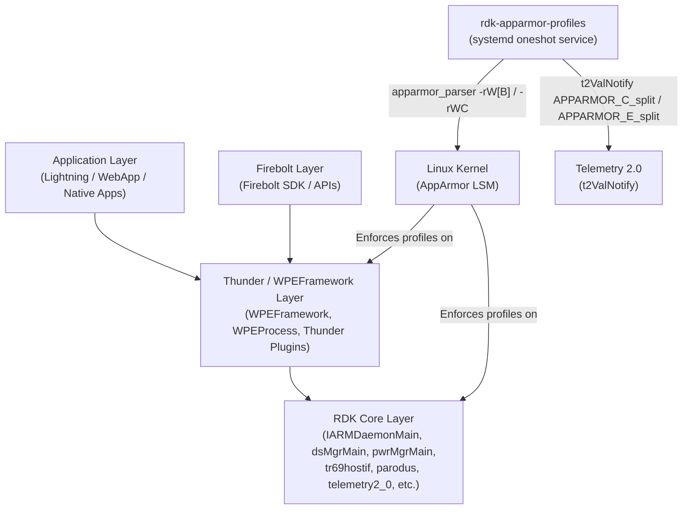
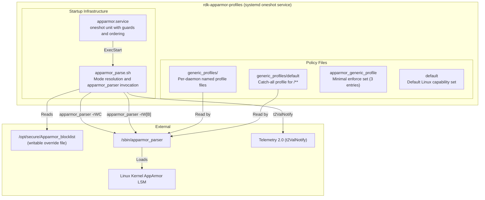
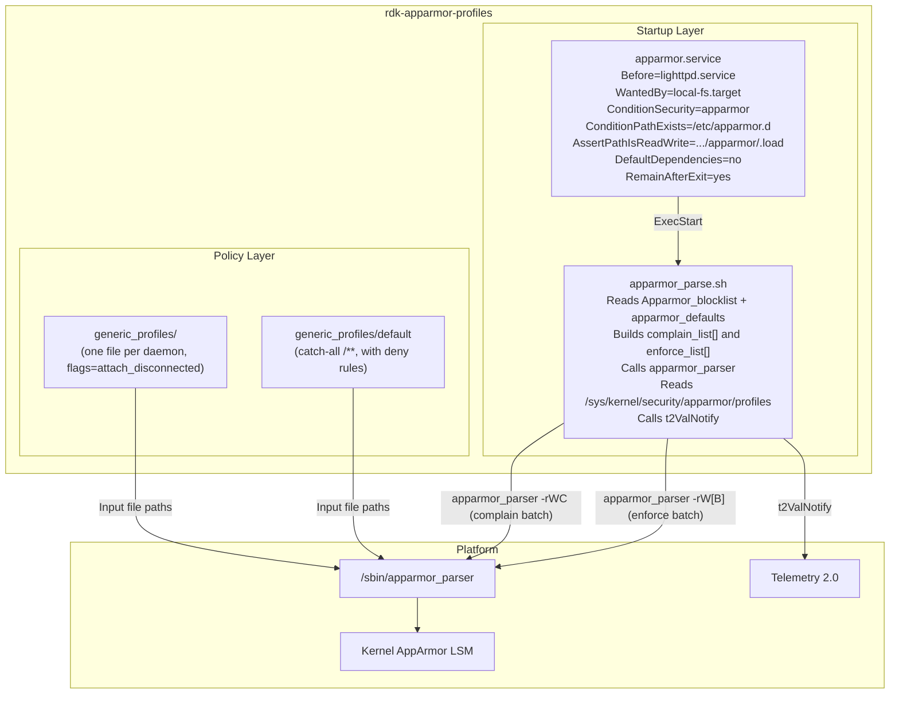
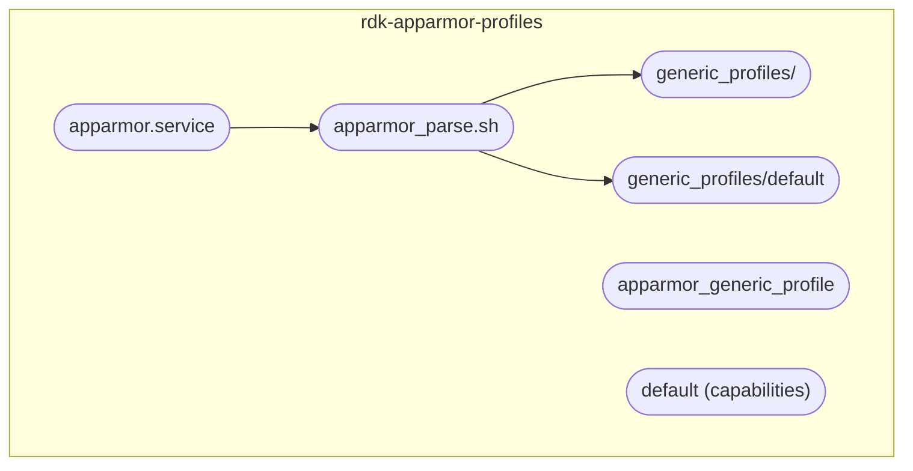
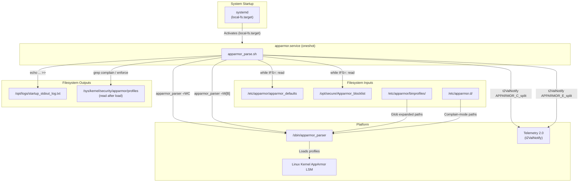
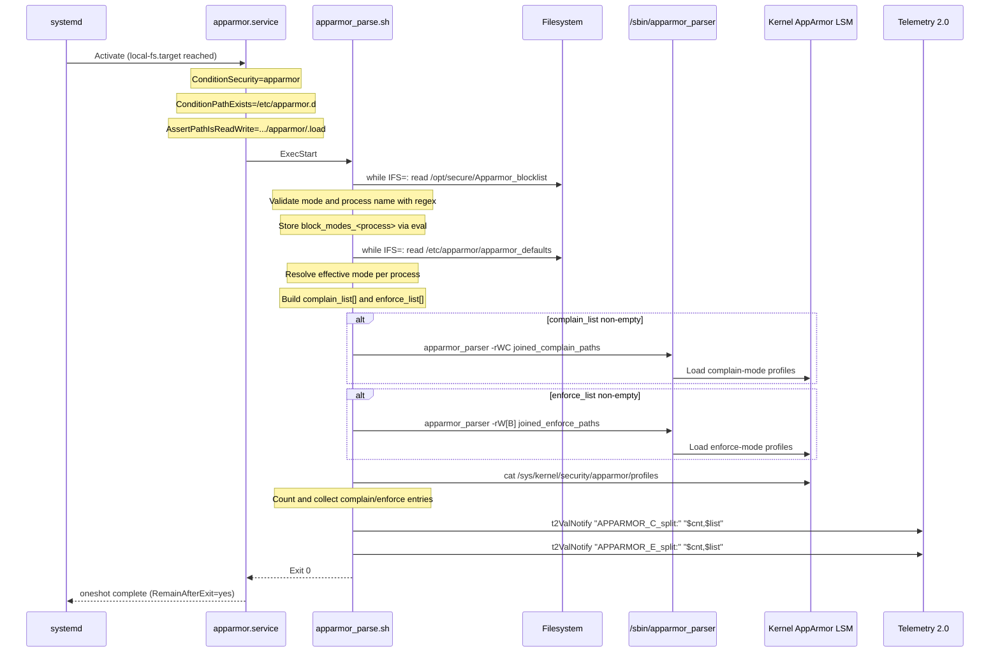
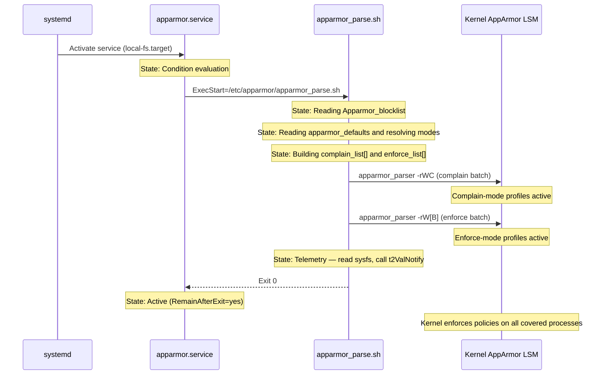
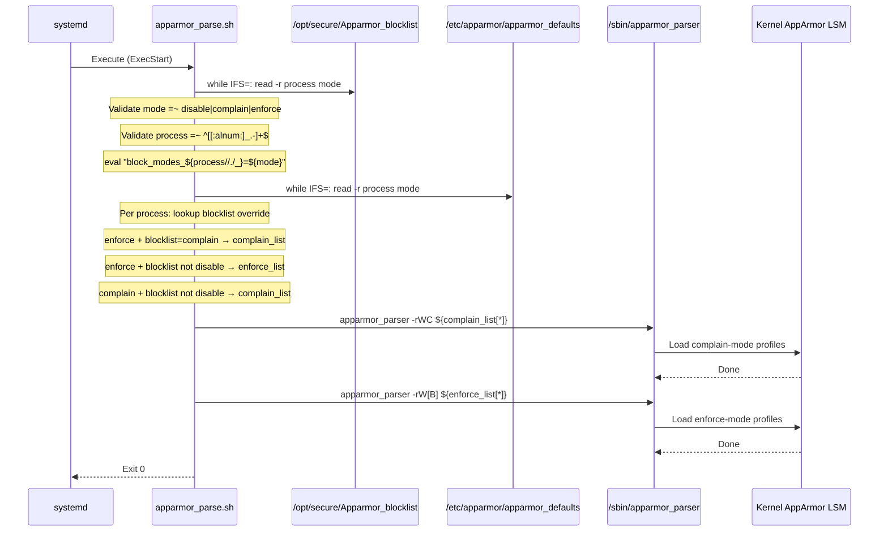

# rdk-apparmor-profiles

---

## Overview

`rdk-apparmor-profiles` is an RDK-E/RDK-V platform component that provides AppArmor Mandatory Access Control security profiles for RDK daemons and services. AppArmor is a Linux kernel security module that confines processes to a defined set of permitted resources. This repository contains the per-process profile files, the systemd service unit that triggers profile loading at boot, the shell script that performs mode resolution and loading, and a Python-based CI/CD tool that detects security violations in profile changes.

At the device level, this component enforces access restrictions on RDK daemons and services, including middleware services (`IARMDaemonMain`, `dsMgrMain`, `pwrMgrMain`, `tr69hostif`, `parodus`, `webconfig`) and the WPEFramework processes (`WPEFramework`, `WPEProcess`). Each process is confined to the files, capabilities, and kernel objects explicitly listed in its profile. A profile operates in either `enforce` mode (violations are denied and logged by the kernel) or `complain` mode (violations are logged but not denied). An operator-writable blocklist at `/opt/secure/Apparmor_blocklist` allows per-process mode override at runtime without reflashing.

At the module level, this component delivers: `apparmor.service` — a systemd oneshot unit that loads profiles before other services start; `apparmor_parse.sh` — a shell script that reads the defaults file and blocklist, resolves the effective mode for each process, invokes `apparmor_parser`, and emits telemetry; a set of named per-daemon profile files under `generic_profiles/`; and `apparmor_cicd.py` — a Python security violation checker used in CI via a GitHub Actions workflow.



**Key Features & Responsibilities:**

- **Per-process AppArmor profiles**: Each RDK daemon has a named profile file in `generic_profiles/` that lists allowed files (with `r`, `w`, `m`, `x` permissions), Linux capabilities, network access, signal, ptrace, dbus, and unix rules. The `flags=(attach_disconnected)` flag is present on all profiles.
- **Blocklist-driven mode override**: `/opt/secure/Apparmor_blocklist` is read at service start and can override the default mode (`enforce`, `complain`, or `disable`) for any individual process without modifying profile files or rootfs.
- **Vendor profile extension**: Each profile file includes `#include if exists "/etc/apparmor.d/vendor/<profile>"`, allowing platform-specific additions to be layered over generic profiles without modifying the base files.
- **Telemetry reporting**: After loading profiles, `apparmor_parse.sh` reads `/sys/kernel/security/apparmor/profiles`, counts processes in each mode, and calls `t2ValNotify "APPARMOR_C_split:"` and `t2ValNotify "APPARMOR_E_split:"` with the count and process name list.
- **CI/CD security violation detection**: `apparmor_cicd.py` and `.github/workflows/apparmor_violation_check.yml` check every changed profile file in a pull request against a defined `check_list` of 20 `SecurityCheckRule` entries and fail the CI job if new violations are introduced.
- **Default catch-all profile**: `generic_profiles/default` applies to all processes not matched by a named profile (`/**`). It grants broad access but explicitly denies writes to `/sys/firmware/`, `/proc/sysrq-trigger`, `/proc/kcore`, and selected `/proc/sys/kernel/` paths.

---

## Architecture

### High-Level Architecture

The component is structured into three distinct parts: startup infrastructure, policy files, and development tooling. These parts operate independently — the startup infrastructure runs once at boot, the policy files are static data installed into the rootfs, and the development tooling runs only in CI. The startup infrastructure consists of `apparmor.service` and `apparmor_parse.sh`. The service unit declares ordering constraints and guards, then delegates all work to the shell script. The shell script reads two configuration files, resolves per-process modes, and invokes `apparmor_parser` twice — once for the complain-mode batch and once for the enforce-mode batch.

Northbound, the component integrates with systemd via a oneshot unit. `apparmor.service` declares `Before=lighttpd.service` and `WantedBy=local-fs.target`. The `DefaultDependencies=no` directive prevents implicit systemd ordering from interfering. The unit skips silently if `ConditionSecurity=apparmor` fails (AppArmor not enabled in kernel) or if `ConditionPathExists=/etc/apparmor.d` fails. It fails with an assertion error if `AssertPathIsReadWrite=/sys/kernel/security/apparmor/.load` is not satisfied. Southbound, the component calls `/sbin/apparmor_parser` to load compiled profiles into the kernel. Loaded policies are then enforced by the kernel's AppArmor LSM against all covered processes for the duration of the system session.

`apparmor_parse.sh` calls `t2ValNotify` from `/lib/rdk/t2Shared_api.sh` (sourced if the file is present) for one-way telemetry after profile loading completes. Runtime communication is limited to this telemetry call; all other interactions are file-based reads and writes.

The only persistent runtime data is `/opt/secure/Apparmor_blocklist`, which resides in writable storage and survives reboots. All profile files and the defaults file are part of the read-only rootfs and remain unchanged at runtime. The blocklist file is created empty by `touch` in `apparmor_parse.sh` if it does not exist at service start.

A component diagram showing the component's internal structure and dependencies is given below:



### Threading Model

- **Threading Architecture**: Single-threaded. `apparmor_parse.sh` is a shell script executed once as a systemd oneshot service. `apparmor_cicd.py` is a single-threaded Python program.
- **Main Thread**: Sequential execution — read blocklist, read defaults, build lists, invoke `apparmor_parser`, read sysfs, emit telemetry.
- **Synchronization**: Systemd service ordering (`Before=lighttpd.service`, `local-fs.target`) ensures profiles are fully loaded before any profiled process is started.
- **Execution model**: Sequential oneshot — the service runs to completion at boot and exits after profile loading is done.

---

## Design

The component separates policy from mechanism. Profile files in `generic_profiles/` contain only AppArmor policy rules and are independent of the loading logic. `apparmor_parse.sh` contains all loading and mode-resolution logic, keeping policy rules strictly in the profile files. This allows profile files to be updated in source control without touching the startup script, and vice versa. The blocklist file provides a runtime escape hatch for operators to adjust enforcement without modifying read-only filesystem content.

Mode resolution gives the blocklist priority over the defaults file. For each `process:mode` entry read from `/etc/apparmor/apparmor_defaults`, the script checks whether the process has an entry in `/opt/secure/Apparmor_blocklist`. If an override exists and is valid, the override mode takes effect. If not, the defaults-file mode applies. The result per process is one of: added to `complain_list[]`, added to `enforce_list[]`, or skipped (disabled). Both lists are passed to `apparmor_parser` as single batch invocations — `apparmor_parser -rWC` for complain mode and `apparmor_parser -rW[B]` for enforce mode — to minimise the number of parser invocations at startup.

Northbound interaction is via systemd service ordering only. Profiles are loaded once at boot; runtime mode changes take effect on the next service restart via the blocklist file. Southbound, the only interaction is via `/sbin/apparmor_parser` and the kernel sysfs path at `/sys/kernel/security/apparmor/`.

Data persistence is limited to `/opt/secure/Apparmor_blocklist`. This file is created empty by `apparmor_parse.sh` via `touch` if it does not exist. Profile files and the defaults file reside in the read-only rootfs and remain unchanged at runtime. The only persistent configuration mechanism is this single plain text file in writable storage.

### Component Diagram

A component diagram showing the internal structure and sub-module dependencies is given below:



---

## Internal Modules

| Module / Class                 | Description                                                                                                                                                                                                                                                                                                                                                                                                                                      | Key Files                                                                                 |
| ------------------------------ | ------------------------------------------------------------------------------------------------------------------------------------------------------------------------------------------------------------------------------------------------------------------------------------------------------------------------------------------------------------------------------------------------------------------------------------------------ | ----------------------------------------------------------------------------------------- |
| `apparmor.service`             | Systemd oneshot service unit. Declares startup guards (`ConditionSecurity=apparmor`, `ConditionPathExists=/etc/apparmor.d`, `AssertPathIsReadWrite=/sys/kernel/security/apparmor/.load`), ordering (`Before=lighttpd.service`, `WantedBy=local-fs.target`), `DefaultDependencies=no`, `RemainAfterExit=yes`, and invokes `apparmor_parse.sh` as `ExecStart`.                                                                                     | `apparmor.service`                                                                        |
| `apparmor_parse.sh`            | Shell script that reads `/opt/secure/Apparmor_blocklist` and `/etc/apparmor/apparmor_defaults`, validates entries via regex, resolves effective mode per process, builds `complain_list[]` and `enforce_list[]`, calls `apparmor_parser`, reads `/sys/kernel/security/apparmor/profiles`, writes to `/opt/logs/startup_stdout_log.txt`, and calls `t2ValNotify`. Sources `/lib/rdk/apparmor_utils.sh` and `/lib/rdk/t2Shared_api.sh` if present. | `apparmor_parse.sh`                                                                       |
| `generic_profiles/`            | Per-daemon AppArmor profile files. Each defines one named profile with `flags=(attach_disconnected)` and explicit allow rules for files, capabilities, network, signal, ptrace, dbus, and unix. Each includes `#include if exists "/etc/apparmor.d/vendor/<name>"`.                                                                                                                                                                              | `generic_profiles/usr.bin.*`, `generic_profiles/usr.sbin.*`, `generic_profiles/usr.lib.*` |
| `generic_profiles/default`     | Named profile `default` attached to `/**`. Grants `capability`, `network`, `mount`, `remount`, `umount`, `pivot_root`, `ptrace`, `signal`, `dbus`, `unix`, `/{,**} mrwlk`, `/{,**} pix`, `change_profile -> **`. Explicitly denies writes to `/sys/f[^s]*/**`, `/sys/firmware/**`, selected `/proc/sys/kernel/` paths, `/proc/sysrq-trigger rwklx`, `/proc/kcore rwklx`.                                                                         | `generic_profiles/default`                                                                |
| `apparmor_generic_profile`     | Three-entry defaults file listing the minimal enforce set shipped in the repository: `default:enforce`, `audiocapturemgr:enforce`, `lighttpd:enforce`.                                                                                                                                                                                                                                                                                           | `apparmor_generic_profile`                                                                |
| `default`                      | One-line file listing the default Linux capabilities: `chown dac_read_search fowner fsetid kill ipc_lock sys_nice setpcap ipc_owner sys_ptrace sys_chroot net_bind_service net_admin sys_resource`.                                                                                                                                                                                                                                              | `default`                                                                                 |
| `SecurityCheckRule`            | Python class. Each instance holds a violation rule: `objtype`, `name` (unique string), `rule` (two-element tuple: `(CheckType, CheckData)`), `msg`, `raw` (bool), `priority` (`"High"`, `"Medium"`, `"Low"`). `checkRule()` performs either raw regex match or typed permission-character match depending on `raw` and `objtype`. `getProfileType()` identifies rule type from first token.                                                      | `apparmor_cicd.py`                                                                        |
| `SecurityCheck`                | Python class. Runs all `check_list` entries against one profile file. `skip_list` excludes lines starting with `{`, `}`, `#include`, `profile `. Tracks violations in `self.violations` list and `self.violation_dict` (keyed `"<rule_name>:<line>"`). Implements `checkExceptions()` against `exception_list` (empty in current source).                                                                                                        | `apparmor_cicd.py`                                                                        |
| `apparmor_violation_check.yml` | GitHub Actions workflow, triggered on pull requests. Ignores `.sh`, `.py`, `.yml`, `.yaml`, `.md`, and config file changes. For each changed file: checks for `profile ` header via `grep`, runs `python3 ./apparmor_cicd.py -f new -a old -N filename`, fails CI if Python exits non-zero or output matches `Total violations found in file: [1-9][0-9]*`.                                                                                      | `.github/workflows/apparmor_violation_check.yml`                                          |



---

## Prerequisites & Dependencies

- [x] **Persistent store**: `/opt/secure/Apparmor_blocklist` is the only persistent file. It is read via shell `read` and created via `touch`.
- [x] **Systemd services**: `apparmor.service` declares `Before=lighttpd.service`.
- [x] **Configuration files**: `/etc/apparmor/apparmor_defaults` and `/opt/secure/Apparmor_blocklist` are read via `while IFS=: read -r process mode` in `apparmor_parse.sh`. `/etc/apparmor.d` existence is verified via `ConditionPathExists`.

### Platform Requirements

- **Build Dependencies**: AppArmor userspace tools (`apparmor_parser` at `/sbin/apparmor_parser`). Linux kernel with `CONFIG_SECURITY_APPARMOR=y` (enforced at runtime by `ConditionSecurity=apparmor`).
- **Systemd Services**: The service runs before `lighttpd.service` and is attached to `local-fs.target`.
- **Configuration Files**:
  - `/etc/apparmor/apparmor_defaults` — required; lists process names and default modes.
  - `/etc/apparmor.d` — directory must exist (`ConditionPathExists=/etc/apparmor.d`).
  - `/etc/apparmor/binprofiles/` — glob base directory for enforce-mode profile paths (hardcoded as `PROFILES_DIR="/etc/apparmor/binprofiles/*/"`).
  - `/opt/secure/Apparmor_blocklist` — optional at startup; created empty by `touch` if absent.
  - `/lib/rdk/apparmor_utils.sh` — optional; sourced with `if [ -f /lib/rdk/apparmor_utils.sh ]`.
  - `/lib/rdk/t2Shared_api.sh` — optional; sourced with `if [ -f /lib/rdk/t2Shared_api.sh ]`.
- **Startup Order**: `local-fs.target` → `apparmor.service` → `lighttpd.service`. `DefaultDependencies=no` disables implicit systemd ordering.
- **Kernel sysfs**: `/sys/kernel/security/apparmor/.load` must be read-write (`AssertPathIsReadWrite`). `/sys/kernel/security/apparmor/profiles` is read after loading to build telemetry.

---

## Quick Start

### 1. Install profiles

Profile files from `generic_profiles/` are installed into `/etc/apparmor/binprofiles/` as part of the RDK image build. `apparmor.service` is installed into the systemd unit directory.

### 2. Enable and start the service

```bash
systemctl enable apparmor.service
systemctl start apparmor.service
```

### 3. Verify loaded profiles

```bash
# Lists all loaded profiles and their current mode (enforce/complain)
cat /sys/kernel/security/apparmor/profiles
```

### 4. Override a profile mode at runtime

```bash
# Change a process to complain mode
echo "WPEFramework:complain" >> /opt/secure/Apparmor_blocklist

# Disable a profile for a process
echo "audiocapturemgr:disable" >> /opt/secure/Apparmor_blocklist

# Reload with new overrides
systemctl restart apparmor.service
```

### 5. Check startup log output

```bash
grep -i apparmor /opt/logs/startup_stdout_log.txt
```

---

## Configuration

### Configuration Priority

Mode resolution order (lowest to highest precedence):

1. `apparmor_generic_profile` — minimal defaults in repository (`default:enforce`, `audiocapturemgr:enforce`, `lighttpd:enforce`)
2. `/etc/apparmor/apparmor_defaults` — rootfs defaults file, set at image build time
3. `/opt/secure/Apparmor_blocklist` — operator-writable runtime override file

### Key Configuration Files

| Configuration File                      | Purpose                                                                                                                                                                     | Override Mechanism                                                  |
| --------------------------------------- | --------------------------------------------------------------------------------------------------------------------------------------------------------------------------- | ------------------------------------------------------------------- |
| `/etc/apparmor/apparmor_defaults`       | Lists each process and its default enforcement mode. Format: `process:mode` per line. Read by `apparmor_parse.sh` at service start.                                         | Replace at image build; use Apparmor_blocklist for runtime override |
| `/opt/secure/Apparmor_blocklist`        | Operator-writable file that overrides mode per process. Format: `process:mode` per line. Valid modes: `enforce`, `complain`, `disable`. Created empty by `touch` if absent. | Direct file write; takes effect on next `apparmor.service` restart  |
| `/etc/apparmor.d/vendor/usr.bin.<name>` | Optional vendor-specific profile extension. Included via `#include if exists` in each generic profile.                                                                      | Deploy file at the include path                                     |

### Configuration Parameters

| Parameter        | Location                          | Valid Values                             | Description                                                             |
| ---------------- | --------------------------------- | ---------------------------------------- | ----------------------------------------------------------------------- |
| `process:mode`   | `/etc/apparmor/apparmor_defaults` | `enforce`, `complain`                    | Default enforcement mode for the named process                          |
| `process:mode`   | `/opt/secure/Apparmor_blocklist`  | `enforce`, `complain`, `disable`         | Runtime override of mode for the named process                          |
| `PROFILES_DIR`   | `apparmor_parse.sh` (hardcoded)   | `/etc/apparmor/binprofiles/*/`           | Glob base used to build enforce-mode profile paths                      |
| `PARSER`         | `apparmor_parse.sh` (hardcoded)   | `/sbin/apparmor_parser`                  | Path to the `apparmor_parser` binary                                    |
| `profile_binary` | `apparmor_parse.sh` (hardcoded)   | `true`                                   | When `true`, appends `-B` (binary cache) to the enforce-mode invocation |
| `RDKLOGS`        | `apparmor_parse.sh` (hardcoded)   | `/opt/logs/startup_stdout_log.txt`       | Path for startup log output                                             |
| `SYSFS_AA_PATH`  | `apparmor_parse.sh` (hardcoded)   | `/sys/kernel/security/apparmor/profiles` | Kernel sysfs path read after profile load                               |

### Runtime Configuration

Profile mode can be changed at runtime by writing to the blocklist and restarting the service:

```bash
# Syntax: process_name:mode
# Valid modes: enforce, complain, disable

echo "tr69hostif:complain" >> /opt/secure/Apparmor_blocklist
systemctl restart apparmor.service
```

### Configuration Persistence

`/opt/secure/Apparmor_blocklist` persists across reboots as it resides in writable storage. Entries written to this file apply on every subsequent `apparmor.service` start. Profile files and `apparmor_defaults` reside in the read-only rootfs and are updated through the image build process.

---

## API / Usage

### Interface Type

`rdk-apparmor-profiles` is a systemd oneshot service. Its sole external interaction point is `/opt/secure/Apparmor_blocklist`, a plain text file read at service start. The service interface is entirely file-based.

### Events / Notifications

The `t2ValNotify` calls in `apparmor_parse.sh` emit one-way telemetry after profile loading completes. See the Events Published table in the Component Interactions section for telemetry marker details.

---

## Component Interactions



### Interaction Matrix

| Target Component / Layer     | Interaction Purpose                                                                      | Key Commands / Paths                                                                           |
| ---------------------------- | ---------------------------------------------------------------------------------------- | ---------------------------------------------------------------------------------------------- |
| **Platform**                 |                                                                                          |                                                                                                |
| `/sbin/apparmor_parser`      | Compiles and loads AppArmor profiles into the kernel                                     | `apparmor_parser -rWC <complain_list>`, `apparmor_parser -rW[B] <enforce_list>`                |
| Linux Kernel AppArmor LSM    | Stores and enforces loaded profiles for the lifetime of the system session               | `/sys/kernel/security/apparmor/.load`, `/sys/kernel/security/apparmor/profiles`                |
| **RDK Runtime Libraries**    |                                                                                          |                                                                                                |
| `/lib/rdk/t2Shared_api.sh`   | Provides `t2ValNotify`. Sourced if file exists at service start                          | `source /lib/rdk/t2Shared_api.sh`                                                              |
| `/lib/rdk/apparmor_utils.sh` | Optional utilities (`systemd_apparmor`, `apparmor_telemetry`). Sourced if file exists    | `source /lib/rdk/apparmor_utils.sh`                                                            |
| **Telemetry**                |                                                                                          |                                                                                                |
| Telemetry 2.0                | Receives complain-mode and enforce-mode profile counts and process name lists after load | `t2ValNotify "APPARMOR_C_split:" "$cnt,$list"`, `t2ValNotify "APPARMOR_E_split:" "$cnt,$list"` |
| **Systemd**                  |                                                                                          |                                                                                                |
| `lighttpd.service`           | Startup ordering — AppArmor service completes before lighttpd starts                     | `Before=lighttpd.service` in unit file                                                         |

### Events Published

| Telemetry Marker    | Trigger Condition                                                | Payload                                     |
| ------------------- | ---------------------------------------------------------------- | ------------------------------------------- |
| `APPARMOR_C_split:` | After profile load, if one or more profiles are in complain mode | `"<count>,<comma-separated profile names>"` |
| `APPARMOR_E_split:` | After profile load, if one or more profiles are in enforce mode  | `"<count>,<comma-separated profile names>"` |

### IPC Flow Patterns

**Profile Load Flow:**



---

## Component State Flow

### Initialization to Active State



### Runtime State Changes

Once `apparmor.service` completes, AppArmor policies are enforced by the kernel for the duration of the session. The oneshot service exits after profile loading; the kernel LSM takes over all subsequent enforcement.

**Blocklist override takes effect**: A new entry written to `/opt/secure/Apparmor_blocklist` takes effect on the next `apparmor.service` restart. On restart, `apparmor_parse.sh` re-reads both files and reloads all profiles.

**Kernel enforcement**: If a profiled process attempts an access not listed in its profile, the kernel denies it (enforce mode) or logs it (complain mode). Per-access enforcement is handled entirely by the kernel LSM at runtime.

---

## Call Flows

### Initialization Call Flow



---

## Implementation Details

### Key Implementation Logic

- **Input validation**: Before calling `eval` to set shell variables from the blocklist, `apparmor_parse.sh` validates the mode with `[[ ! "$mode" =~ disable|complain|enforce ]]` and the process name with `[[ ! $process =~ ^[[:alnum:]_.-]+$ ]]`. The same process name pattern is applied to entries in the defaults file. Entries failing either check are skipped with a printed message.

- **Batch loading**: All complain-mode profile paths are collected into the Bash array `complain_list` and joined with `IFS=" "` before a single `apparmor_parser -rWC` invocation. All enforce-mode paths are collected into `enforce_list` and passed to a single `apparmor_parser -rW[B]` invocation. This results in at most two `apparmor_parser` calls regardless of the number of profiles.

- **Binary profiles (binary cache)**: When `apparmor_parser` is invoked with the `-B` flag, it compiles the text profile source and writes a pre-compiled binary representation to a cache directory (typically `/etc/apparmor.d/cache/` or a path derived from `PROFILES_DIR`). On subsequent loads, if a valid binary cache file exists and is newer than the source, the parser loads the binary directly rather than re-parsing the text source. This significantly reduces startup time when many profiles are present, because binary loading skips the parse and compile phase. The enforce invocation conditionally appends `-B` using `$($profile_binary && echo "B")`. The variable `profile_binary` is set to `true` at the top of `apparmor_parse.sh`. This is why enforce-mode profiles are installed under `/etc/apparmor/binprofiles/` — that path is the binary cache base directory used at runtime.

- **Telemetry**: After loading, `apparmor_parse.sh` reads `/sys/kernel/security/apparmor/profiles`, filters for `complain` and `enforce` lines with `grep`, counts with `wc -l`, and joins process names with `tr '\n' ','`. The result is written to `/opt/logs/startup_stdout_log.txt` via `echo ... >> $RDKLOGS` and passed to `t2ValNotify`.

- **Optional hook functions**: After the `apparmor_parser` invocations, `apparmor_parse.sh` calls `systemd_apparmor` if `type systemd_apparmor` succeeds, and `apparmor_telemetry` if `type apparmor_telemetry` succeeds. Both functions are expected to come from `/lib/rdk/apparmor_utils.sh` when sourced.

- **`check_list` in `apparmor_cicd.py`**: Contains 20 `SecurityCheckRule` entries. Rules are either raw regex (`raw=True`, `rule[0]=None`) matched against the full profile line, or typed (`rule[0]="Permissions"`) for file permission character matching. Priority distribution in the list: `"High"` (default for most), `"Medium"` (4 rules: `CAP_SYSADMIN`, `FILE_ALLDEV`, `FILE_ALLMINIDUMP`, `PROC_ATTR_W`, `FILE_ALL_TMP`), `"Low"` (3 rules: `CAP_DACOVERRIDE`, `FILE_ETCAPPARMOR_R`, `PROC_MAPS`, `FILE_ALL_LOGS`).

- **Diff mode in `apparmor_cicd.py`**: `__diff_files()` runs `__check_file()` on both the new and old versions with `silent=True`. It compares `violation_dict` key counts: for each key where the new count exceeds the old count, the extra occurrences are added to `new_only`. Results are deduplicated with a `seen` set before printing. The function returns `True` if new violations are found, causing the CI workflow to exit 1.

- **`exception_list`**: Defined as an empty list (`exception_list = []`) in `apparmor_cicd.py`. The `SecurityException` class is available for registering per-rule exceptions; the current empty list means all violations are reported without exception.

- **Logging**: `apparmor_parse.sh` writes to `/opt/logs/startup_stdout_log.txt` via `echo ... >> $RDKLOGS`. `apparmor_cicd.py` writes diagnostic output to stdout.

---

## Data Flow

```
[System boot — systemd reaches local-fs.target]
        |
        v
[apparmor.service activated — ConditionSecurity, ConditionPathExists, AssertPathIsReadWrite evaluated]
        |
        v
[apparmor_parse.sh reads /opt/secure/Apparmor_blocklist line-by-line
 — validate mode and process name, store as shell variables via eval]
        |
        v
[apparmor_parse.sh reads /etc/apparmor/apparmor_defaults line-by-line
 — per-process mode resolution against blocklist variables]
        |
        v
[Mode resolution output: complain_list[] and enforce_list[] Bash arrays]
        |
        v
[apparmor_parser -rWC complain_list
 — complain-mode profiles compiled and loaded into kernel]
        |
        v
[apparmor_parser -rW[B] enforce_list
 — enforce-mode profiles compiled and loaded into kernel]
        |
        v
[Read /sys/kernel/security/apparmor/profiles
 — grep complain/enforce, count with wc -l, join names with tr]
        |
        v
[Write counts and name lists to /opt/logs/startup_stdout_log.txt]
        |
        v
[t2ValNotify "APPARMOR_C_split:" and "APPARMOR_E_split:" emitted]
        |
        v
[apparmor_parse.sh exits 0 — kernel enforces loaded policies on all covered processes]
```

---

## Error Handling

### Layered Error Handling

| Layer                                  | Error Condition                                                                 | Handling Strategy                                                                                   |
| -------------------------------------- | ------------------------------------------------------------------------------- | --------------------------------------------------------------------------------------------------- |
| Input validation (`apparmor_parse.sh`) | Invalid mode value in blocklist (`!~ disable\|complain\|enforce`)               | Print `"Invalid blocklist mode for process $process, ignoring"`, skip entry                         |
| Input validation (`apparmor_parse.sh`) | Invalid process name in blocklist (`!~ ^[[:alnum:]_.-]+$`)                      | Print `"Process blocklist name is invalid, ignoring"`, skip entry                                   |
| Input validation (`apparmor_parse.sh`) | Invalid process name in defaults file                                           | Print `"Process defaults name is invalid, ignoring"`, skip entry                                    |
| Input validation (`apparmor_parse.sh`) | Invalid generated variable name (eval guard)                                    | Print `"Var name is invalid, ignoring"`, skip entry                                                 |
| Systemd condition (`apparmor.service`) | `ConditionSecurity=apparmor` false — AppArmor not enabled in kernel             | Service skips silently; no profiles are loaded                                                      |
| Systemd condition (`apparmor.service`) | `ConditionPathExists=/etc/apparmor.d` false                                     | Service skips silently                                                                              |
| Systemd assertion (`apparmor.service`) | `AssertPathIsReadWrite=/sys/kernel/security/apparmor/.load` fails               | Service activation fails                                                                            |
| Profile parsing (`apparmor_cicd.py`)   | No `profile ` header line found in file                                         | `errorOut(False, ...)` warning printed, file appended to `g_skipped_files`, function returns `None` |
| Rule matching (`apparmor_cicd.py`)     | `getProfileType()` returns `"None"` for unrecognised rule format                | `errorOut(False, ...)` warning printed, `False` returned for that rule, processing continues        |
| CI/CD (`apparmor_violation_check.yml`) | Python checker exits non-zero                                                   | `EXIT_CODE=1`; CI job exits 1 at end of loop                                                        |
| CI/CD (`apparmor_violation_check.yml`) | Python exits 0 but output matches `Total violations found in file: [1-9][0-9]*` | Fallback detection sets `EXIT_CODE=1`; CI job exits 1                                               |

---

## Testing

### Test Levels

| Level                         | Scope                                                                                                      | Location                                                              |
| ----------------------------- | ---------------------------------------------------------------------------------------------------------- | --------------------------------------------------------------------- |
| CI – Violation scan           | Detects security violations in changed profile files on every pull request                                 | `.github/workflows/apparmor_violation_check.yml` + `apparmor_cicd.py` |
| Manual – Service start        | Verify `apparmor.service` activates and profiles appear in `/sys/kernel/security/apparmor/profiles`        | Target device                                                         |
| Manual – Enforce verification | Attempt a filesystem access denied by a profile; verify kernel audit log entry                             | Target device                                                         |
| Manual – Blocklist override   | Write an entry to `/opt/secure/Apparmor_blocklist`, restart service, verify mode change in sysfs           | Target device                                                         |
| Manual – Complain mode        | Set a process to complain in blocklist, attempt a denied operation, verify logged-but-not-denied behaviour | Target device                                                         |

### Running Tests

The tests below are performed on a target device. The CI violation scan runs automatically on every pull request.

**Service startup verification:**

```bash
# Check the service completed successfully
systemctl status apparmor.service

# Confirm profiles are loaded in the kernel
cat /sys/kernel/security/apparmor/profiles

# Review startup log for profile load output
grep -i apparmor /opt/logs/startup_stdout_log.txt
```

**Enforce mode verification** — confirm that a denied access is blocked and logged:

```bash
# After service start, check the kernel audit log for denied accesses
dmesg | grep -i "apparmor.*DENIED"
```

**Blocklist override test** — change a process to complain mode and verify:

```bash
echo "WPEFramework:complain" >> /opt/secure/Apparmor_blocklist
systemctl restart apparmor.service
# Verify the mode change was applied
grep WPEFramework /sys/kernel/security/apparmor/profiles
# Expected output: WPEFramework (complain)
```

**Complain mode test** — confirm that a denied operation is logged but not blocked:

```bash
# With a process in complain mode, operations that would normally be denied
# should still succeed; the kernel logs them without blocking.
dmesg | grep -i "apparmor.*ALLOWED"
```
